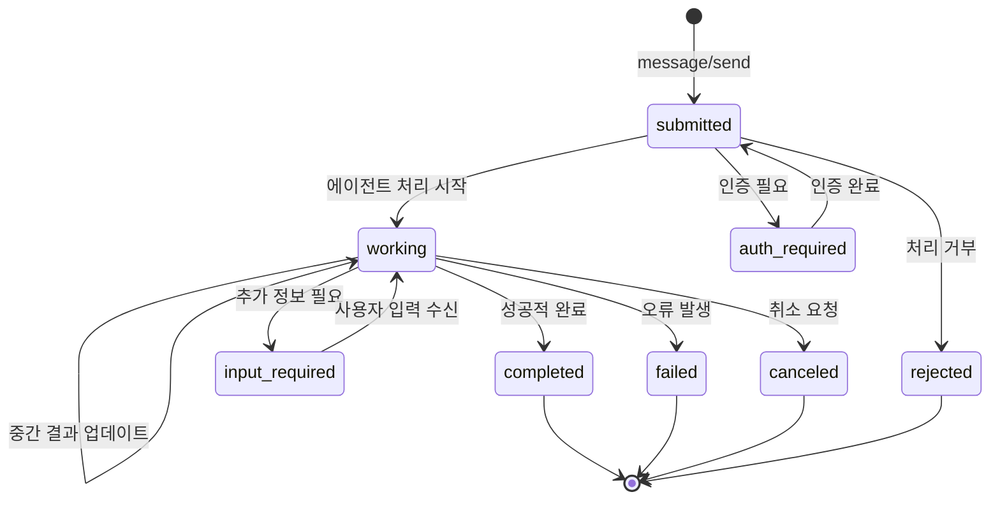
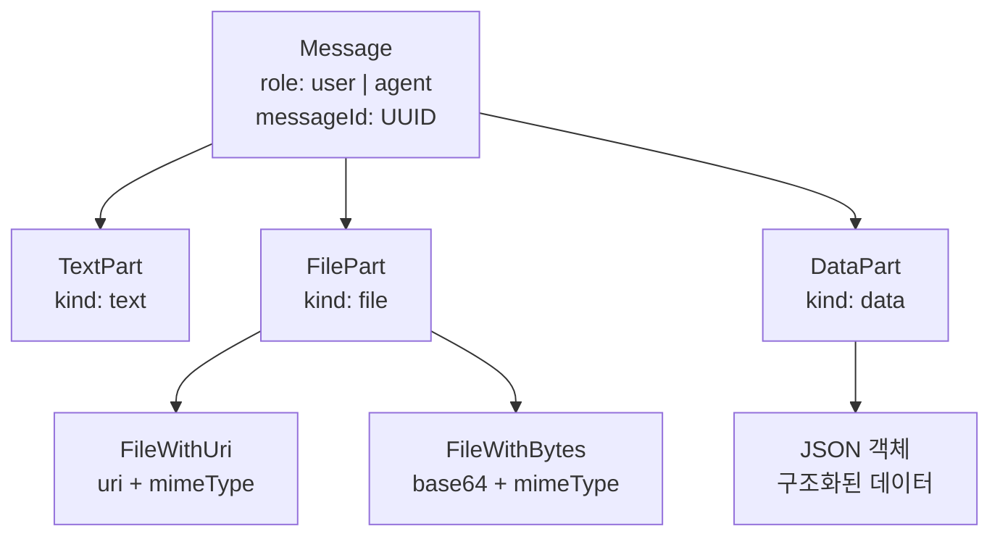
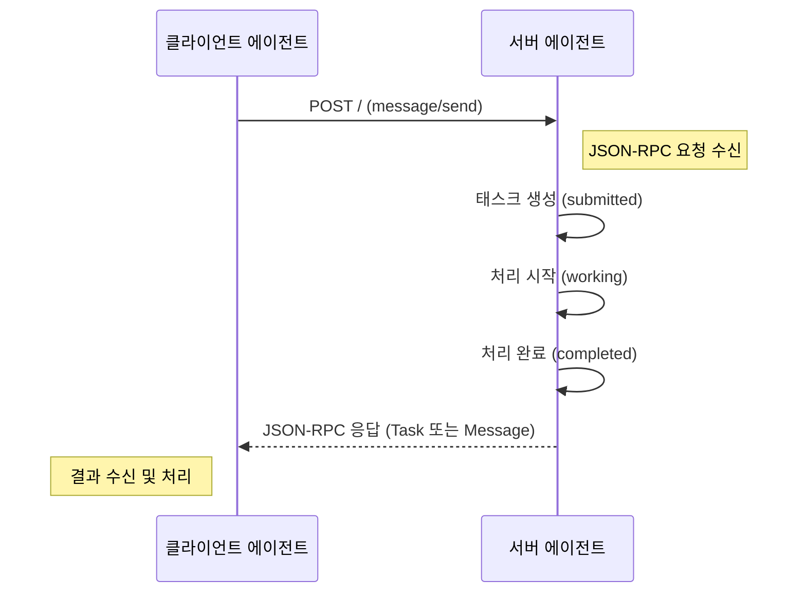
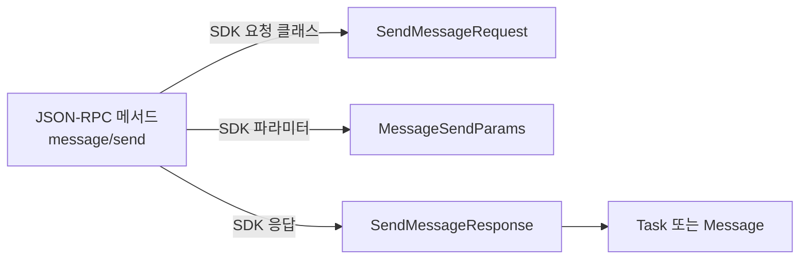
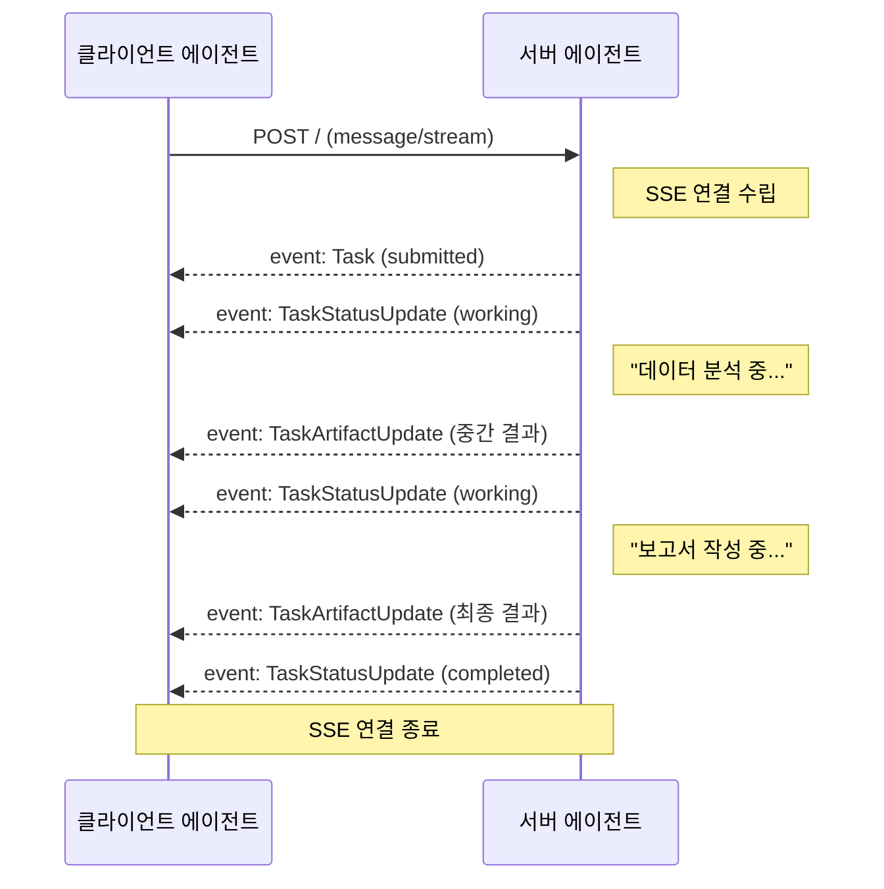
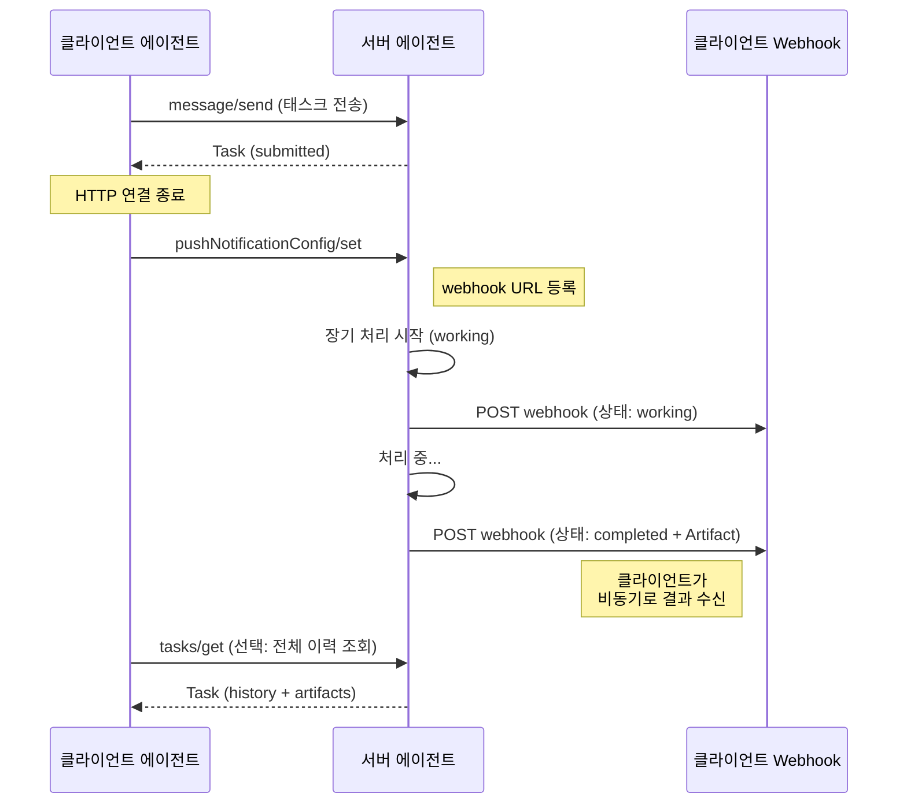
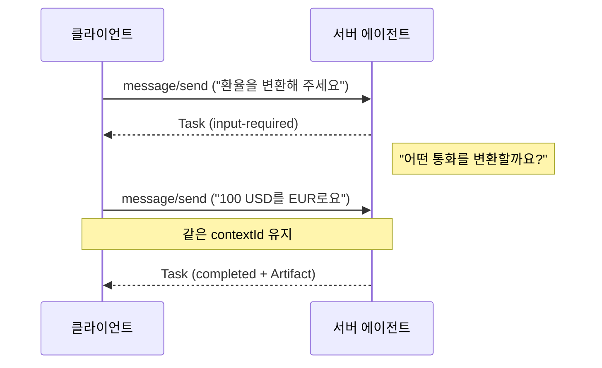

# 태스크 기반 통신 구현

> A2A 프로토콜의 핵심인 태스크(Task) 상태 머신을 이해하고, JSON-RPC 기반 동기/비동기 통신과 SSE 스트리밍을 직접 구현합니다.

## 개요

이 섹션에서는 [A2A 프로토콜 개관](11-ch11-a2a-프로토콜-기초/01-01-a2a-프로토콜-개관.md)에서 배운 데이터 모델과 [Agent Card와 능력 선언](11-ch11-a2a-프로토콜-기초/02-02-agent-card와-능력-선언.md)에서 설계한 에이전트 능력을 **실제 동작하는 통신**으로 연결합니다. Agent Card가 에이전트의 "명함"이었다면, 이번 섹션은 명함을 교환한 두 에이전트가 **실제로 일을 주고받는 방법**을 다룹니다.

**선수 지식**:
- A2A 프로토콜의 핵심 개념 (Task, Message, Artifact, Part)
- Agent Card 스키마와 AgentCapabilities 설정
- Python `asyncio`, `httpx` 기본 사용법

**학습 목표**:
- Task 상태 머신(Task State Machine)의 8가지 상태와 전이 규칙을 설명할 수 있다
- `message/send`와 `message/stream` 메서드로 동기·스트리밍 통신을 구현할 수 있다
- Message, Part, Artifact의 구조를 이해하고 다양한 Part 타입을 활용할 수 있다
- 장기 실행 태스크에 Push Notification을 설정할 수 있다

## 왜 알아야 할까?

에이전트가 서로 협력하려면 단순히 "메시지를 보내고 답을 받는" 것 이상이 필요합니다. 실제 업무 환경을 떠올려 보세요. 동료에게 일을 맡기면 "접수했습니다", "작업 중입니다", "추가 정보가 필요합니다", "완료했습니다" 같은 **상태 업데이트**가 필요하죠. 때로는 몇 초 만에 끝나는 간단한 질문도 있고, 몇 분이 걸리는 보고서 작성도 있습니다.

A2A의 태스크 기반 통신은 이 모든 시나리오를 하나의 프로토콜로 처리합니다. 동기 응답(즉시 답변), SSE 스트리밍(실시간 진행 상황), Push Notification(장기 실행) — 세 가지 통신 모드를 상황에 맞게 선택할 수 있거든요. [MCP 서버 구축](09-ch9-mcp-서버-구축/01-01-mcp-프로토콜-이해.md)에서 배운 MCP가 "도구를 쓰는 방법"이었다면, A2A의 태스크 통신은 "에이전트끼리 협업하는 방법"입니다.

## 핵심 개념

### 개념 1: Task 상태 머신 — 일의 전체 생명주기

> 💡 **비유**: 택배 추적 시스템을 떠올려 보세요. 주문하면 "접수됨(submitted)", 물류센터에서 "처리 중(working)", 배송지 확인이 필요하면 "추가 정보 요청(input-required)", 도착하면 "배송 완료(completed)". 분실되면 "실패(failed)", 취소하면 "취소됨(canceled)". A2A의 Task도 정확히 이런 생애주기를 따릅니다.

A2A 프로토콜에서 **Task**는 클라이언트 에이전트가 서버 에이전트에게 맡긴 "하나의 작업 단위"입니다. 모든 Task는 **상태 머신(Task State Machine)**을 통해 추적되는데요, 이 상태 머신이 곧 태스크의 전체 생명주기(lifecycle)를 정의합니다. 즉, "태스크 상태 머신 = 태스크 생명주기"라고 이해하시면 됩니다.

SDK에서 각 상태는 `TaskState` 열거형(enum)으로 정의됩니다. 코드에서는 항상 `TaskState.working`, `TaskState.completed` 처럼 `TaskState`를 사용합니다.

> 📊 **그림 1**: Task 상태 전이 다이어그램



> ⚠️ **표기법 주의**: 위 Mermaid 다이어그램에서 `input_required`, `auth_required`처럼 **언더스코어(`_`)**를 쓴 것은 Mermaid 상태 이름에 하이픈(`-`)을 사용할 수 없기 때문입니다. A2A 프로토콜 스펙과 실제 JSON에서는 `"input-required"`, `"auth-required"`처럼 **하이픈(`-`)**이 정식 표기입니다. SDK의 `TaskState` enum도 하이픈 형태의 값을 사용합니다.

8가지 상태를 정리하면 이렇습니다:

| TaskState 값 | 설명 | 종료 상태? |
|------|------|:----------:|
| `submitted` | 태스크가 접수되어 처리 대기 중 | |
| `working` | 에이전트가 활발히 작업 중 | |
| `input-required` | 추가 입력이 필요하여 대기 | |
| `completed` | 성공적으로 완료 | ✓ |
| `failed` | 복구 불가능한 오류로 실패 | ✓ |
| `canceled` | 클라이언트가 취소함 | ✓ |
| `rejected` | 에이전트가 처리를 거부함 | ✓ |
| `auth-required` | 인증이 필요함 | |

**핵심 규칙**: 종료 상태(`completed`, `failed`, `canceled`, `rejected`)에 도달하면 Task는 더 이상 상태가 변하지 않습니다. 스트리밍 연결도 종료 상태에서 반드시 닫아야 합니다.

`TaskStatus` 객체는 현재 `TaskState` 값과 함께 선택적으로 메시지를 포함합니다:

```python
from a2a.types import TaskStatus, TaskState, Message

# 작업 중 상태 — 진행 메시지 포함
status_working = TaskStatus(
    state=TaskState.working,
    message=Message(
        role="agent",
        messageId="msg-001",
        parts=[{"kind": "text", "text": "환율 데이터를 조회하고 있습니다..."}],
    ),
)

# 완료 상태 — 최종 결과는 Artifact에
status_completed = TaskStatus(
    state=TaskState.completed,
)
```

> ⚠️ **흔한 오해**: Task의 상태(TaskState)와 Message를 혼동하는 경우가 많습니다. `TaskStatus.message`는 상태 전이에 대한 **설명**이지, 대화 내용 자체가 아닙니다. 실제 결과물은 **Artifact**에 담깁니다. 또한 `TaskStatus`는 "상태 정보를 담는 컨테이너"이고, 실제 상태 값은 그 안의 `state` 필드(`TaskState` enum)라는 점도 구분하세요.

### 개념 2: Message와 Part — 통신의 기본 단위

> 💡 **비유**: 이메일을 생각해 보세요. 이메일(Message)에는 텍스트 본문, 첨부 파일, 구조화된 데이터(표, 폼)가 들어갈 수 있죠. A2A의 Message도 마찬가지입니다. Message 안에 여러 개의 Part를 담을 수 있고, 각 Part는 텍스트(TextPart), 파일(FilePart), 구조화된 데이터(DataPart) 중 하나입니다.

> 📊 **그림 2**: Message와 Part의 구조



Message는 `role` 필드로 누가 보낸 것인지 구분합니다. `"user"`는 클라이언트 에이전트, `"agent"`는 서버 에이전트가 보낸 메시지입니다.

```python
from a2a.types import Message, TextPart, FilePart, DataPart
from uuid import uuid4

# 텍스트 메시지
text_message = Message(
    role="user",
    messageId=uuid4().hex,
    parts=[
        TextPart(kind="text", text="50 유로를 일본 엔으로 변환해 주세요"),
    ],
)

# 파일 첨부 메시지
file_message = Message(
    role="agent",
    messageId=uuid4().hex,
    parts=[
        TextPart(kind="text", text="분석 보고서를 첨부합니다."),
        FilePart(
            kind="file",
            file={"uri": "https://example.com/report.pdf", "mimeType": "application/pdf"},
        ),
    ],
)

# 구조화된 데이터 메시지
data_message = Message(
    role="agent",
    messageId=uuid4().hex,
    parts=[
        DataPart(
            kind="data",
            data={
                "from": "EUR",
                "to": "JPY",
                "amount": 50,
                "result": 8125.50,
                "rate": 162.51,
                "timestamp": "2026-03-20T09:00:00Z",
            },
        ),
    ],
)
```

**Artifact vs Message — 무엇이 다를까?**

Message는 대화의 흐름(주고받는 메시지)이고, Artifact는 작업의 **산출물**(결과물)입니다. 동료에게 "보고서 작성해 줘"라고 요청하면, 오가는 대화는 Message이고 최종 보고서 파일은 Artifact인 거죠.

```python
from a2a.types import Artifact

# Task 완료 시 산출물
report_artifact = Artifact(
    artifactId="artifact-001",
    name="환율 변환 결과",
    description="EUR → JPY 변환 결과 보고서",
    parts=[
        TextPart(kind="text", text="50 EUR = 8,125.50 JPY (환율: 162.51)"),
        DataPart(kind="data", data={"rate": 162.51, "result": 8125.50}),
    ],
)
```

### 개념 3: 동기 통신 — message/send

> 💡 **비유**: 카페에서 커피를 주문하고 바로 받아가는 것과 같습니다. "아메리카노 한 잔이요" → (잠시 대기) → "여기 있습니다!" 요청을 보내면 응답이 올 때까지 기다리는 가장 단순한 패턴이죠.

`message/send`는 A2A의 핵심 JSON-RPC 메서드로, 클라이언트가 서버 에이전트에게 메시지를 보내는 데 사용됩니다. 응답이 올 때까지 HTTP 연결이 유지되므로 빠르게 처리되는 단순 질의에 적합합니다. Python SDK에서는 이 요청을 `SendMessageRequest` 클래스로 구성합니다.

> 📊 **그림 3**: message/send 동기 통신 흐름



JSON-RPC 요청/응답의 실제 구조를 살펴볼까요?

**요청 (클라이언트 → 서버):**

```json
{
  "id": "req-001",
  "jsonrpc": "2.0",
  "method": "message/send",
  "params": {
    "message": {
      "role": "user",
      "parts": [
        {"kind": "text", "text": "10 달러는 몇 원인가요?"}
      ],
      "messageId": "550e8400-e29b-41d4-a716-446655440000"
    }
  }
}
```

**응답 (서버 → 클라이언트):**

서버는 `Task` 또는 `Message` 중 하나를 반환합니다. 간단한 질의라면 바로 Message로 응답할 수 있고, 추적이 필요한 작업이면 Task 객체를 반환합니다.

```json
{
  "id": "req-001",
  "jsonrpc": "2.0",
  "result": {
    "kind": "task",
    "id": "task-abc123",
    "contextId": "ctx-001",
    "status": {
      "state": "completed",
      "timestamp": "2026-03-20T09:00:01Z"
    },
    "artifacts": [
      {
        "artifactId": "art-001",
        "parts": [{"kind": "text", "text": "10 USD는 약 13,650 KRW입니다."}]
      }
    ]
  }
}
```

Python SDK로 구현하면 이렇습니다:

```python
from a2a.client import A2ACardResolver, A2AClient
from a2a.types import SendMessageRequest, MessageSendParams
from uuid import uuid4
import httpx

async def send_sync_message(server_url: str, query: str) -> None:
    """동기 방식으로 메시지를 보내고 응답을 받습니다."""
    async with httpx.AsyncClient() as httpx_client:
        # 1. Agent Card 발견
        resolver = A2ACardResolver(
            httpx_client=httpx_client,
            base_url=server_url,
        )
        agent_card = await resolver.get_agent_card()

        # 2. 클라이언트 생성
        client = A2AClient(httpx_client=httpx_client, agent_card=agent_card)

        # 3. SendMessageRequest 구성 (message/send 호출용)
        payload = {
            "message": {
                "role": "user",
                "parts": [{"kind": "text", "text": query}],
                "messageId": uuid4().hex,
            }
        }
        request = SendMessageRequest(
            id=str(uuid4()),
            params=MessageSendParams(**payload),
        )

        # 4. 전송 및 응답 수신
        response = await client.send_message(request)
        return response
```

> 📊 **그림 3-1**: message/send의 JSON-RPC 메서드와 SDK 클래스 매핑



### 개념 4: 스트리밍 통신 — message/stream과 SSE

> 💡 **비유**: 이번에는 카페가 아니라 레스토랑입니다. 코스 요리를 주문하면 전채부터 디저트까지 하나씩 순서대로 나오죠. 서버가 "에피타이저 나왔습니다", "메인 요리 준비 중입니다", "디저트입니다" 하고 계속 업데이트를 주는 겁니다. A2A의 스트리밍도 마찬가지로, 서버가 작업 진행 상황을 실시간으로 클라이언트에게 전달합니다.

`message/stream`은 SSE(Server-Sent Events)를 활용합니다. HTTP 연결을 유지한 채 서버가 이벤트를 계속 내려보내는 방식이죠. Agent Card의 `capabilities.streaming`이 `true`여야 사용할 수 있습니다.

> 📊 **그림 4**: SSE 스트리밍 통신 흐름



SSE 이벤트의 종류는 네 가지입니다:

| SSE 이벤트 | 설명 | 포함 데이터 |
|------------|------|-----------|
| `Task` | 초기 태스크 정보 | Task 객체 전체 |
| `Message` | 에이전트 메시지 | Message 객체 |
| `TaskStatusUpdateEvent` | 상태 변경 알림 | 새 TaskStatus + final 플래그 |
| `TaskArtifactUpdateEvent` | 산출물 업데이트 | Artifact + append/lastChunk 플래그 |

클라이언트 측 스트리밍 수신 코드:

```python
from a2a.client import A2AClient
from a2a.types import (
    SendStreamingMessageRequest,
    MessageSendParams,
    Task,
    TaskStatusUpdateEvent,
    TaskArtifactUpdateEvent,
)
from uuid import uuid4

async def stream_message(client: A2AClient, query: str) -> None:
    """SSE 스트리밍으로 실시간 응답을 수신합니다."""
    payload = {
        "message": {
            "role": "user",
            "parts": [{"kind": "text", "text": query}],
            "messageId": uuid4().hex,
        }
    }
    request = SendStreamingMessageRequest(
        id=str(uuid4()),
        params=MessageSendParams(**payload),
    )

    # 스트리밍 응답 수신
    stream = client.send_message_streaming(request)

    async for event in stream:
        # event.root 안에 실제 이벤트 객체가 담김
        result = event.root
        if isinstance(result, Task):
            print(f"[태스크 생성] ID: {result.id}, 상태: {result.status.state}")
        elif isinstance(result, TaskStatusUpdateEvent):
            status = result.status
            print(f"[상태 변경] {status.state}")
            if status.message:
                for part in status.message.parts:
                    if part.root.kind == "text":
                        print(f"  → {part.root.text}")
        elif isinstance(result, TaskArtifactUpdateEvent):
            artifact = result.artifact
            print(f"[산출물] {artifact.name or 'unnamed'}")
            for part in artifact.parts:
                if part.root.kind == "text":
                    print(f"  → {part.root.text}")
```

> 🔥 **실무 팁**: 스트리밍에서 `TaskStatusUpdateEvent`의 `final` 필드가 `True`이면 더 이상 이벤트가 오지 않습니다. 클라이언트는 이 시점에서 SSE 연결을 정리해야 합니다. 종료 상태(`completed`, `failed`, `canceled`, `rejected`)와 함께 `final=True`가 오면 루프를 탈출하세요.

### 개념 5: 장기 실행과 Push Notification

> 💡 **비유**: 인터넷 쇼핑에서 배송 알림을 떠올려 보세요. 주문 후 브라우저를 닫아도 "발송됐습니다", "배달 출발했습니다" 같은 푸시 알림이 핸드폰으로 오죠. HTTP 연결을 계속 유지하지 않아도 상태 변화를 알 수 있습니다. A2A의 Push Notification도 같은 원리입니다.

SSE 스트리밍은 HTTP 연결을 계속 유지해야 합니다. 하지만 작업이 몇 분, 몇 시간이 걸린다면? 연결이 끊어질 수 있고 리소스 낭비도 심하죠. 이럴 때 **Push Notification**을 설정하면, 서버가 상태 변화 시 클라이언트의 webhook URL로 알림을 POST합니다.

> 📊 **그림 5**: Push Notification 기반 장기 실행 흐름



Push Notification을 설정하는 코드입니다:

```python
# Push Notification 설정 — JSON-RPC 요청
push_config_request = {
    "id": "req-push-001",
    "jsonrpc": "2.0",
    "method": "tasks/pushNotificationConfig/set",
    "params": {
        "taskId": "task-abc123",
        "pushNotificationConfig": {
            "url": "https://my-agent.example.com/webhook/a2a",
            "authentication": {
                "schemes": ["bearer"],
                "credentials": "my-webhook-secret-token",
            },
        },
    },
}
```

Agent Card에서 Push Notification 지원을 선언해야 합니다:

```python
from a2a.types import AgentCard, AgentCapabilities

agent_card = AgentCard(
    name="보고서 생성 에이전트",
    description="장기 실행 보고서를 생성합니다",
    url="http://localhost:10000/",
    version="1.0.0",
    capabilities=AgentCapabilities(
        streaming=True,
        pushNotifications=True,  # Push Notification 활성화
    ),
    # ... skills, security 등
)
```

**tasks/get으로 폴링하기**: Push Notification 없이도 `tasks/get`으로 상태를 조회할 수 있습니다. `historyLength` 파라미터로 대화 이력의 양을 제어합니다.

```python
# 태스크 조회 요청
get_task_request = {
    "id": "req-get-001",
    "jsonrpc": "2.0",
    "method": "tasks/get",
    "params": {
        "id": "task-abc123",
        "historyLength": 5,  # 최근 메시지 5개만 (-1: 전체, 0: 없음)
    },
}
```

## 실습: 직접 해보기

환율 변환 에이전트를 만들어 보겠습니다. 서버가 동기/스트리밍 모두 지원하고, 클라이언트에서 두 방식으로 각각 요청하는 완전한 예제입니다.

### 1단계: 패키지 설치

```console
pip install "a2a-sdk[all]" httpx uvicorn
```

### 2단계: 서버 구현

```python
# server.py — A2A 환율 변환 에이전트 서버
import uvicorn
from uuid import uuid4
from a2a.server.apps import A2AStarletteApplication
from a2a.server.request_handlers import DefaultRequestHandler
from a2a.server.agent_execution import AgentExecutor, RequestContext
from a2a.server.events import EventQueue
from a2a.server.tasks import InMemoryTaskStore
from a2a.types import (
    AgentCard,
    AgentSkill,
    AgentCapabilities,
    TaskState,
    TaskStatus,
    TaskStatusUpdateEvent,
    TaskArtifactUpdateEvent,
    Artifact,
    Message,
)
import asyncio

# 간단한 환율 데이터 (실제로는 외부 API 호출)
EXCHANGE_RATES = {
    ("USD", "KRW"): 1365.0,
    ("EUR", "KRW"): 1485.0,
    ("USD", "JPY"): 149.5,
    ("EUR", "JPY"): 162.5,
    ("USD", "EUR"): 0.92,
}


def convert_currency(text: str) -> dict:
    """간단한 환율 변환 로직"""
    text_upper = text.upper()
    for (src, dst), rate in EXCHANGE_RATES.items():
        if src in text_upper and dst in text_upper:
            # 숫자 추출
            import re
            numbers = re.findall(r"[\d,.]+", text)
            if numbers:
                amount = float(numbers[0].replace(",", ""))
                result = amount * rate
                return {
                    "from": src,
                    "to": dst,
                    "amount": amount,
                    "result": round(result, 2),
                    "rate": rate,
                }
    return {"error": "지원하지 않는 통화 조합입니다."}


class CurrencyAgentExecutor(AgentExecutor):
    """환율 변환 에이전트 실행기"""

    async def execute(
        self, context: RequestContext, event_queue: EventQueue
    ) -> None:
        # 사용자 입력 추출
        user_input = ""
        for part in context.message.parts:
            if part.root.kind == "text":
                user_input = part.root.text
                break

        task_id = uuid4().hex
        context_id = context.message.contextId or uuid4().hex

        # 1) working 상태 전송 — TaskState enum 사용
        event_queue.enqueue_event(
            TaskStatusUpdateEvent(
                taskId=task_id,
                contextId=context_id,
                status=TaskStatus(
                    state=TaskState.working,
                    message=Message(
                        role="agent",
                        messageId=uuid4().hex,
                        parts=[{"kind": "text", "text": "환율을 조회하고 있습니다..."}],
                    ),
                ),
                final=False,
            )
        )

        # 처리 시뮬레이션 (실제로는 API 호출 등)
        await asyncio.sleep(1)

        # 2) 환율 변환
        result = convert_currency(user_input)

        if "error" in result:
            # 실패 상태 — TaskState.failed
            event_queue.enqueue_event(
                TaskStatusUpdateEvent(
                    taskId=task_id,
                    contextId=context_id,
                    status=TaskStatus(
                        state=TaskState.failed,
                        message=Message(
                            role="agent",
                            messageId=uuid4().hex,
                            parts=[{"kind": "text", "text": result["error"]}],
                        ),
                    ),
                    final=True,
                )
            )
            return

        # 3) Artifact로 결과 전달
        result_text = (
            f"{result['amount']:,.2f} {result['from']} = "
            f"{result['result']:,.2f} {result['to']} "
            f"(환율: {result['rate']})"
        )
        event_queue.enqueue_event(
            TaskArtifactUpdateEvent(
                taskId=task_id,
                contextId=context_id,
                append=False,
                lastChunk=True,
                artifact=Artifact(
                    artifactId=uuid4().hex,
                    name="환율 변환 결과",
                    parts=[
                        {"kind": "text", "text": result_text},
                        {"kind": "data", "data": result},
                    ],
                ),
            )
        )

        # 4) completed 상태 전송 — TaskState.completed
        event_queue.enqueue_event(
            TaskStatusUpdateEvent(
                taskId=task_id,
                contextId=context_id,
                status=TaskStatus(state=TaskState.completed),
                final=True,
            )
        )

    async def cancel(
        self, context: RequestContext, event_queue: EventQueue
    ) -> None:
        raise Exception("취소를 지원하지 않습니다.")


# Agent Card 정의
agent_card = AgentCard(
    name="Currency Converter Agent",
    description="실시간 환율 변환을 수행하는 에이전트",
    url="http://localhost:10000/",
    version="1.0.0",
    capabilities=AgentCapabilities(streaming=True),
    skills=[
        AgentSkill(
            id="convert_currency",
            name="환율 변환",
            description="두 통화 간 환율을 변환합니다",
            tags=["currency", "exchange", "finance"],
            examples=["100 USD를 KRW로 변환해 줘"],
        )
    ],
    defaultInputModes=["text"],
    defaultOutputModes=["text"],
)

# 서버 조립 및 실행
request_handler = DefaultRequestHandler(
    agent_executor=CurrencyAgentExecutor(),
    task_store=InMemoryTaskStore(),
)

server = A2AStarletteApplication(
    agent_card=agent_card,
    http_handler=request_handler,
)

if __name__ == "__main__":
    uvicorn.run(server.build(), host="0.0.0.0", port=10000)
```

### 3단계: 클라이언트 구현

```python
# client.py — A2A 클라이언트 (동기 + 스트리밍)
import asyncio
import httpx
from uuid import uuid4
from a2a.client import A2ACardResolver, A2AClient
from a2a.types import (
    SendMessageRequest,
    SendStreamingMessageRequest,
    MessageSendParams,
    SendMessageSuccessResponse,
    Task,
    TaskStatusUpdateEvent,
    TaskArtifactUpdateEvent,
    Message,
)


async def demo_sync(client: A2AClient, query: str) -> None:
    """동기 방식 (message/send) 데모"""
    print(f"\n{'='*50}")
    print(f"[동기 요청] {query}")
    print(f"{'='*50}")

    # SendMessageRequest로 message/send 요청 구성
    payload = {
        "message": {
            "role": "user",
            "parts": [{"kind": "text", "text": query}],
            "messageId": uuid4().hex,
        }
    }
    request = SendMessageRequest(
        id=str(uuid4()),
        params=MessageSendParams(**payload),
    )

    response = await client.send_message(request)

    # 응답 처리
    if isinstance(response.root, SendMessageSuccessResponse):
        result = response.root.result
        if isinstance(result, Task):
            print(f"  태스크 ID: {result.id}")
            print(f"  상태: {result.status.state}")
            if result.artifacts:
                for artifact in result.artifacts:
                    for part in artifact.parts:
                        if part.root.kind == "text":
                            print(f"  결과: {part.root.text}")
        elif isinstance(result, Message):
            for part in result.parts:
                if part.root.kind == "text":
                    print(f"  응답: {part.root.text}")
    else:
        print(f"  오류: {response.root}")


async def demo_streaming(client: A2AClient, query: str) -> None:
    """스트리밍 방식 (message/stream) 데모"""
    print(f"\n{'='*50}")
    print(f"[스트리밍 요청] {query}")
    print(f"{'='*50}")

    # SendStreamingMessageRequest로 message/stream 요청 구성
    payload = {
        "message": {
            "role": "user",
            "parts": [{"kind": "text", "text": query}],
            "messageId": uuid4().hex,
        }
    }
    request = SendStreamingMessageRequest(
        id=str(uuid4()),
        params=MessageSendParams(**payload),
    )

    stream = client.send_message_streaming(request)

    async for event in stream:
        result = event.root
        if isinstance(result, Task):
            print(f"  [태스크 생성] ID: {result.id}")
        elif isinstance(result, TaskStatusUpdateEvent):
            state = result.status.state
            print(f"  [상태] {state}")
            if result.status.message:
                for part in result.status.message.parts:
                    if part.root.kind == "text":
                        print(f"    → {part.root.text}")
        elif isinstance(result, TaskArtifactUpdateEvent):
            print(f"  [산출물] {result.artifact.name or '(이름 없음)'}")
            for part in result.artifact.parts:
                if part.root.kind == "text":
                    print(f"    → {part.root.text}")
                elif part.root.kind == "data":
                    print(f"    → 데이터: {part.root.data}")


async def main():
    async with httpx.AsyncClient() as httpx_client:
        # Agent Card 발견
        resolver = A2ACardResolver(
            httpx_client=httpx_client,
            base_url="http://localhost:10000",
        )
        agent_card = await resolver.get_agent_card()
        print(f"에이전트 발견: {agent_card.name}")
        print(f"스트리밍 지원: {agent_card.capabilities.streaming}")

        # A2A 클라이언트 생성
        client = A2AClient(httpx_client=httpx_client, agent_card=agent_card)

        # 동기 방식 테스트 (message/send → SendMessageRequest)
        await demo_sync(client, "100 USD를 KRW로 변환해 주세요")

        # 스트리밍 방식 테스트 (message/stream → SendStreamingMessageRequest)
        await demo_streaming(client, "50 EUR를 JPY로 변환해 주세요")


if __name__ == "__main__":
    asyncio.run(main())
```

### 4단계: 실행 및 결과 확인

터미널 1에서 서버를 시작하고, 터미널 2에서 클라이언트를 실행합니다:

```console
# 터미널 1: 서버 시작
python server.py
```

```console
# 터미널 2: 클라이언트 실행
python client.py
```

```run:python
# 예상 출력 시뮬레이션
print("에이전트 발견: Currency Converter Agent")
print("스트리밍 지원: True")
print()
print("=" * 50)
print("[동기 요청] 100 USD를 KRW로 변환해 주세요")
print("=" * 50)
print("  태스크 ID: a3f2b1c8...")
print("  상태: completed")
print("  결과: 100.00 USD = 136,500.00 KRW (환율: 1365.0)")
print()
print("=" * 50)
print("[스트리밍 요청] 50 EUR를 JPY로 변환해 주세요")
print("=" * 50)
print("  [태스크 생성] ID: d7e4f2a1...")
print("  [상태] working")
print("    → 환율을 조회하고 있습니다...")
print("  [산출물] 환율 변환 결과")
print("    → 50.00 EUR = 8,125.00 JPY (환율: 162.5)")
print("    → 데이터: {'from': 'EUR', 'to': 'JPY', ...}")
print("  [상태] completed")
```

```output
에이전트 발견: Currency Converter Agent
스트리밍 지원: True

==================================================
[동기 요청] 100 USD를 KRW로 변환해 주세요
==================================================
  태스크 ID: a3f2b1c8...
  상태: completed
  결과: 100.00 USD = 136,500.00 KRW (환율: 1365.0)

==================================================
[스트리밍 요청] 50 EUR를 JPY로 변환해 주세요
==================================================
  [태스크 생성] ID: d7e4f2a1...
  [상태] working
    → 환율을 조회하고 있습니다...
  [산출물] 환율 변환 결과
    → 50.00 EUR = 8,125.00 JPY (환율: 162.5)
    → 데이터: {'from': 'EUR', 'to': 'JPY', ...}
  [상태] completed
```

### 5단계: input-required 패턴 — 대화형 태스크

에이전트가 추가 정보를 요청하는 `input-required` 상태를 처리하는 패턴입니다. 같은 `contextId`를 유지하면서 대화를 이어갑니다.

> 📊 **그림 6**: input-required 멀티턴 대화 흐름



```python
# 대화형 태스크 처리 예시
async def handle_multi_turn(client: A2AClient) -> None:
    """input-required 상태를 처리하는 다중 턴 대화"""
    context_id = uuid4().hex  # 대화 세션 유지

    # 첫 번째 메시지 — 모호한 요청
    response = await send_with_context(
        client,
        text="환율을 변환해 주세요",
        context_id=context_id,
    )

    # 서버 응답 확인: TaskState가 input-required인지 체크
    # (A2A 스펙에서는 "input-required" 하이픈 형태)
    if response.status.state == TaskState.input_required:
        # 두 번째 메시지 — 같은 contextId로 추가 정보 전달
        response = await send_with_context(
            client,
            text="100 USD를 EUR로요",
            context_id=context_id,
        )
        # 이제 completed 상태가 됨


async def send_with_context(
    client: A2AClient, text: str, context_id: str
) -> Task:
    """contextId를 유지하며 message/send 요청을 전송합니다."""
    payload = {
        "message": {
            "role": "user",
            "parts": [{"kind": "text", "text": text}],
            "messageId": uuid4().hex,
            "contextId": context_id,  # 핵심: 같은 contextId 유지
        }
    }
    request = SendMessageRequest(
        id=str(uuid4()),
        params=MessageSendParams(**payload),
    )
    response = await client.send_message(request)
    return response.root.result
```

> 💡 **알고 계셨나요?**: `contextId`는 여러 Task를 하나의 대화 세션으로 묶는 역할을 합니다. [체크포인트와 영속적 실행](06-ch6-체크포인트와-영속적-실행/01-01-체크포인트-시스템-이해.md)에서 배운 LangGraph의 `thread_id`와 비슷한 개념이죠. 차이점은 A2A의 `contextId`가 에이전트 **간** 세션이라면, LangGraph의 `thread_id`는 에이전트 **내부** 세션이라는 점입니다.

## 더 깊이 알아보기

### A2A 태스크 모델의 설계 배경

A2A의 태스크 모델은 왜 이렇게 설계되었을까요? 2024년 말, Google DeepMind의 엔지니어링 팀은 기존 에이전트 간 통신 방식의 한계를 분석했습니다. 가장 큰 문제는 **불투명성(Opacity)과 호환성**이었습니다.

당시 대부분의 에이전트 프레임워크는 에이전트 내부 구조(프롬프트, 메모리, 도구)를 노출하는 방식으로 통신했습니다. 이는 두 에이전트가 같은 프레임워크를 써야 한다는 뜻이었죠. LangGraph 에이전트와 CrewAI 에이전트가 대화하는 건 불가능했습니다.

Google 팀은 기존의 성공적인 프로토콜에서 영감을 받았습니다. 특히 HTTP 자체가 좋은 모델이었죠 — 클라이언트는 서버 내부 구현을 몰라도 요청을 보내고 응답을 받을 수 있으니까요. 여기에 **비동기 작업 관리**가 필요했는데, 이는 Kubernetes의 Job과 Task 모델에서 영감을 받았습니다.

결과적으로 A2A는 "에이전트를 블랙박스로 취급하되, 작업의 생명주기는 표준화하자"는 철학으로 설계되었습니다. `submitted → working → completed` 흐름은 단순하지만, `input-required`와 `auth-required` 같은 **멈춤 상태**를 추가함으로써 인간 개입과 보안 인증까지 자연스럽게 녹여냈습니다.

### v0.2에서 v1.0까지의 진화

A2A 프로토콜은 2025년 4월 v0.1으로 시작하여 빠르게 발전했습니다. 주목할 변화들이 있었는데요:

- **v0.2** (2025년): `tasks/send`, `tasks/sendSubscribe` 메서드명 사용
- **v0.3** (2025년 말): `message/send`, `message/stream`으로 이름 변경 — "태스크가 아닌 메시지를 보낸다"는 개념 강화
- **v1.0** (2026년 3월): `a2a.SendMessage`, `a2a.SendStreamingMessage`로 네임스페이스 도입, Linux Foundation으로 거버넌스 이관

흥미로운 건 메서드 이름의 변화가 설계 철학의 진화를 반영한다는 점입니다. 초기에는 "태스크를 관리한다"에 초점이 있었지만, 점차 "메시지를 주고받고, 태스크는 그 과정에서 자동으로 관리된다"는 방향으로 발전했습니다. SDK 클래스명도 이 흐름을 따릅니다 — `SendMessageRequest`(메시지를 보내는 요청)이지 `CreateTaskRequest`가 아닌 거죠.

## 흔한 오해와 팁

> ⚠️ **흔한 오해**: "message/send는 항상 Task를 반환한다"고 생각하기 쉽지만, 실제로는 **Task 또는 Message**를 반환할 수 있습니다. 서버가 간단한 질의에 대해 Task를 생성하지 않고 바로 Message로 응답하는 것도 유효합니다. 클라이언트는 반환 타입의 `kind` 필드(`"task"` 또는 `"message"`)를 확인해야 합니다.

> 💡 **알고 계셨나요?**: A2A의 JSON-RPC 메서드는 버전에 따라 이름이 달라집니다. v0.2~v0.3에서는 `message/send`이고 v1.0에서는 `a2a.SendMessage`입니다. Python SDK를 사용하면 이 차이를 추상화해 주지만, 직접 HTTP를 다룰 때는 대상 서버의 프로토콜 버전을 확인하세요. SDK에서는 `SendMessageRequest` 클래스가 버전에 관계없이 올바른 메서드명을 설정해 줍니다.

> ⚠️ **흔한 오해**: `TaskState`와 `TaskStatus`를 혼동하는 분들이 많습니다. `TaskState`는 8가지 상태 값을 정의하는 **열거형(enum)**이고(`submitted`, `working`, `input-required` 등), `TaskStatus`는 현재 `TaskState` 값 + 선택적 메시지 + 타임스탬프를 담는 **컨테이너 객체**입니다. 코드에서 상태를 비교할 때는 `task.status.state == TaskState.completed`처럼 `TaskState` enum을 사용하세요.

> 🔥 **실무 팁**: `contextId`는 에이전트 간 대화의 "세션 키"입니다. `input-required` 상태에서 추가 정보를 보낼 때 **반드시 동일한 contextId를 유지**해야 서버가 기존 대화 맥락을 이어갑니다. 새로운 `contextId`를 보내면 서버는 완전히 새로운 대화로 인식합니다.

> 🔥 **실무 팁**: 프로덕션에서는 `InMemoryTaskStore` 대신 **데이터베이스 기반 TaskStore**를 사용하세요. A2A Python SDK는 PostgreSQL, SQLite 등을 지원합니다. 서버가 재시작되더라도 진행 중인 태스크를 복구할 수 있습니다.

## 핵심 정리

| 개념 | 설명 |
|------|------|
| **Task** | 클라이언트가 서버 에이전트에게 맡긴 작업 단위. 상태 머신으로 전체 생명주기 관리 |
| **TaskState** | 8가지 상태를 정의하는 enum: `submitted`, `working`, `input-required`, `completed`, `failed`, `canceled`, `rejected`, `auth-required` |
| **TaskStatus** | 현재 TaskState + 선택적 메시지 + 타임스탬프를 담는 컨테이너 객체 |
| **Message** | `role`(user/agent)과 `parts` 배열로 구성된 통신 단위 |
| **Part** | TextPart(텍스트), FilePart(파일), DataPart(JSON 데이터)의 세 가지 유형 |
| **Artifact** | Task의 산출물. 최종 결과를 담는 컨테이너 |
| **message/send** | 동기 통신 메서드. SDK 클래스: `SendMessageRequest` |
| **message/stream** | SSE 스트리밍 통신 메서드. SDK 클래스: `SendStreamingMessageRequest` |
| **Push Notification** | 장기 실행 태스크용. webhook URL로 상태 변화 비동기 알림 |
| **contextId** | 여러 Task를 하나의 대화 세션으로 묶는 식별자 |
| **EventQueue** | 서버 측에서 비동기 이벤트를 버퍼링하는 큐 |

## 다음 섹션 미리보기

이번 섹션에서 A2A의 태스크 기반 통신을 구현했으니, 다음 섹션 [MCP+A2A 통합 아키텍처](11-ch11-a2a-프로토콜-기초/04-04-mcp-a2a-통합-아키텍처.md)에서는 MCP와 A2A를 **함께 사용하는 아키텍처**를 설계합니다. MCP로 도구와 데이터에 접근하고, A2A로 에이전트 간 협업하는 — 두 프로토콜의 시너지를 극대화하는 통합 패턴을 학습합니다.

## 참고 자료

- [A2A Protocol Specification](https://github.com/a2aproject/A2A/blob/main/docs/specification.md) — A2A 프로토콜 공식 스펙. Task, Message, Part 등 모든 데이터 모델의 원본 정의
- [A2A Python SDK (a2a-python)](https://github.com/a2aproject/a2a-python) — 공식 Python SDK. AgentExecutor, EventQueue, TaskStore 등 서버/클라이언트 구현 레퍼런스
- [Google Codelab: Intro to A2A — Purchasing Concierge](https://codelabs.developers.google.com/intro-a2a-purchasing-concierge) — 멀티 에이전트 A2A 통합 실습 Codelab. message/send, 스트리밍, 다중 에이전트 오케스트레이션 구현
- [A2A Protocol Explained (Hugging Face Blog)](https://huggingface.co/blog/1bo/a2a-protocol-explained) — A2A 프로토콜의 구조와 MCP와의 차이를 시각적으로 정리한 해설
- [A2A SDK Currency Agent Tutorial](https://a2aprotocol.ai/blog/a2a-sdk-currency-agent-tutorial) — 환율 변환 에이전트를 A2A SDK로 구축하는 공식 튜토리얼

---
### 🔗 Related Sessions
- [a2a](01-ch1-llm-도구-호출의-이해/01-01-ai-에이전트란-무엇인가.md) (prerequisite)
- [agent_card](11-ch11-a2a-프로토콜-기초/01-01-a2a-프로토콜-개관.md) (prerequisite)
- [task_state](11-ch11-a2a-프로토콜-기초/01-01-a2a-프로토콜-개관.md) (prerequisite)
- [artifact](11-ch11-a2a-프로토콜-기초/01-01-a2a-프로토콜-개관.md) (prerequisite)
- [message](11-ch11-a2a-프로토콜-기초/01-01-a2a-프로토콜-개관.md) (prerequisite)
- [part](11-ch11-a2a-프로토콜-기초/01-01-a2a-프로토콜-개관.md) (prerequisite)
- [sendmessage](11-ch11-a2a-프로토콜-기초/01-01-a2a-프로토콜-개관.md) (prerequisite)
- [sendstreamingmessage](11-ch11-a2a-프로토콜-기초/01-01-a2a-프로토콜-개관.md) (prerequisite)
- [gettask](11-ch11-a2a-프로토콜-기초/01-01-a2a-프로토콜-개관.md) (prerequisite)
- [canceltask](11-ch11-a2a-프로토콜-기초/01-01-a2a-프로토콜-개관.md) (prerequisite)
- [agent_capabilities](11-ch11-a2a-프로토콜-기초/02-02-agent-card와-능력-선언.md) (prerequisite)
- [well_known_agent_json](11-ch11-a2a-프로토콜-기초/01-01-a2a-프로토콜-개관.md) (prerequisite)
