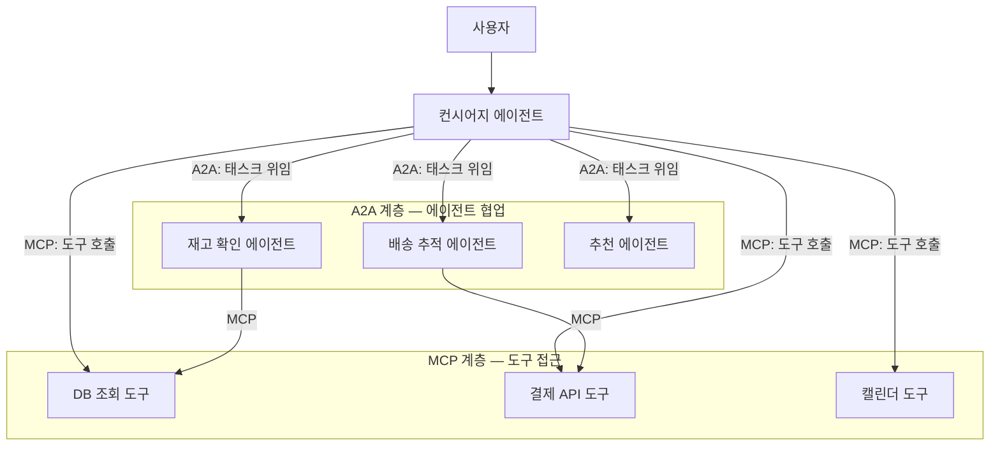
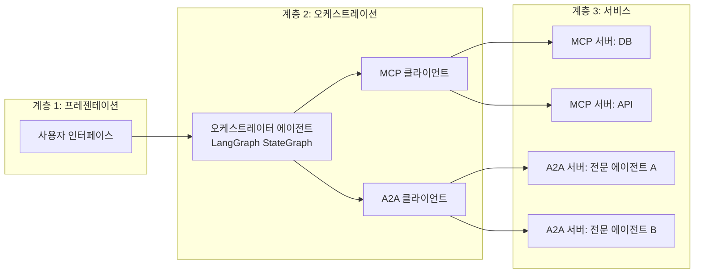
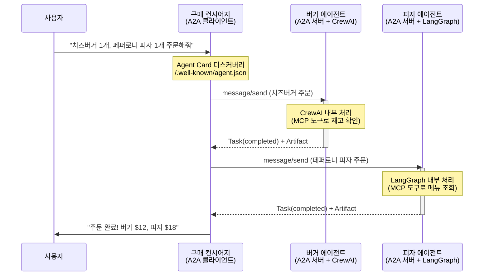
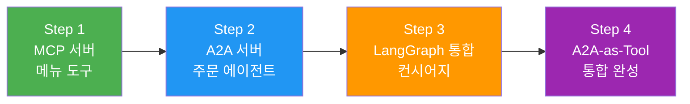
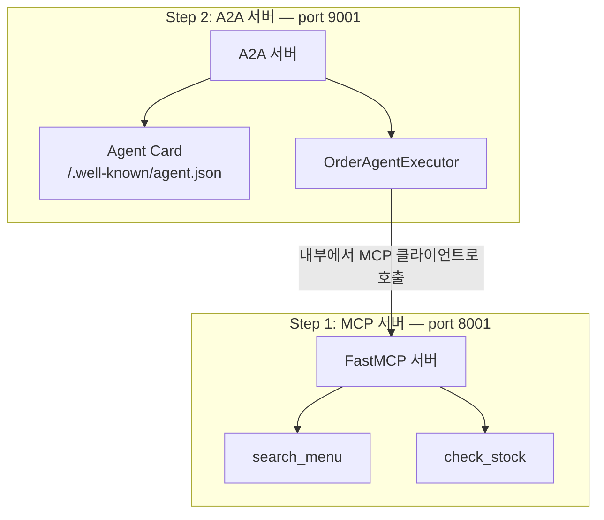
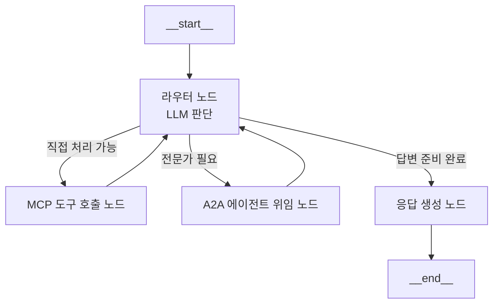
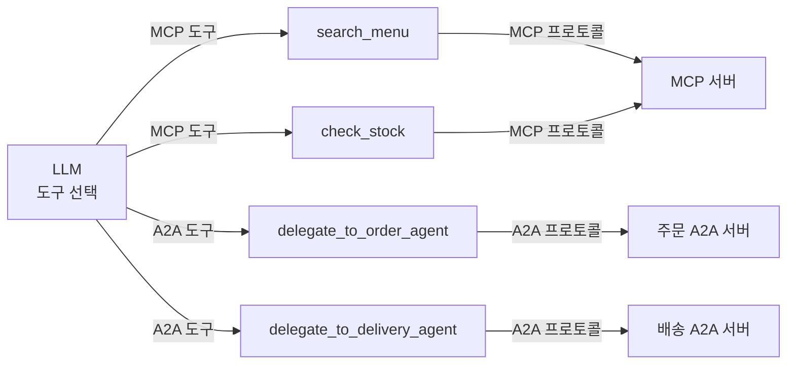
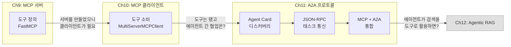

# MCP + A2A 통합 아키텍처 — 실전 통합 프로젝트

> MCP로 도구에 접근하고, A2A로 에이전트끼리 협업하는 — 두 프로토콜을 결합한 통합 시스템을 단계별로 구축합니다.

## 개요

이 섹션에서는 Ch11의 마무리 프로젝트로서, MCP와 A2A를 결합한 **통합 멀티 에이전트 시스템**을 처음부터 끝까지 구축합니다. 앞서 Ch9~10에서 MCP로 도구와 데이터를 노출하고 소비하는 방법을, Ch11.1~11.3에서 A2A로 에이전트 간 통신하는 방법을 각각 배웠습니다. 이제 이 모든 개념을 하나의 프로젝트에 통합하여 **도구 접근(MCP)**과 **에이전트 간 협업(A2A)**을 동시에 구현합니다.

이 섹션은 두 부분으로 나뉩니다. 전반부에서는 두 프로토콜이 어떻게 역할을 나누는지 개념적으로 정리하고, 후반부에서는 "음식 주문 컨시어지" 시스템을 **4단계에 걸쳐 점진적으로** 구축합니다.

**선수 지식**: [MCP 서버 구축](09-ch9-mcp-서버-구축/02-02-fastmcp-서버-기초.md)과 [MCP 클라이언트 구축](10-ch10-mcp-클라이언트와-에이전트-통합/01-01-mcp-클라이언트-구축.md), [A2A 프로토콜 개관](11-ch11-a2a-프로토콜-기초/01-01-a2a-프로토콜-개관.md), [태스크 기반 통신 구현](11-ch11-a2a-프로토콜-기초/03-03-태스크-기반-통신-구현.md)
**학습 목표**:
- MCP와 A2A의 역할 분담을 명확히 이해할 수 있다
- 에이전트가 MCP로 도구를 사용하면서 A2A로 다른 에이전트와 협업하는 아키텍처를 설계할 수 있다
- Google Purchasing Concierge 패턴을 참고하여 멀티 에이전트 시스템을 구현할 수 있다
- LangGraph + MCP + A2A를 결합한 통합 에이전트를 4단계에 걸쳐 구축할 수 있다

## 왜 알아야 할까?

현실의 AI 시스템은 하나의 에이전트가 모든 일을 하지 않습니다. 고객 응대 에이전트는 결제 시스템의 API를 호출해야 하고(도구 접근), 재고 확인은 별도의 전문 에이전트에게 맡겨야 합니다(에이전트 간 협업). 문제는 이 두 가지가 전혀 다른 통신 패턴이라는 점인데요.

MCP만 쓰면 에이전트는 도구를 잘 다루지만, 다른 에이전트와 **자율적으로 협업**할 수 없습니다. A2A만 쓰면 에이전트끼리 대화는 가능하지만, 데이터베이스 조회나 API 호출 같은 **구체적인 도구 실행**이 어렵습니다. 실전에서는 이 두 능력이 모두 필요하죠.

이전 세 섹션에서 A2A의 개별 개념들(Agent Card, JSON-RPC, 태스크 생명주기)을 하나씩 배웠는데요, 이것만으로는 "그래서 실제 시스템에서 어떻게 조합하지?"라는 질문에 답하기 어렵습니다. 이 섹션에서 모든 퍼즐 조각을 맞추어 보겠습니다.

2026년 현재, A2A가 Linux Foundation으로 거버넌스가 이관된 이후 로드맵에 따르면 A2A와 MCP의 상호운용 명세가 논의되고 있으며, 이 두 프로토콜의 결합은 엔터프라이즈 AI 시스템의 주요 아키텍처 패턴으로 주목받고 있습니다.

## 핵심 개념

### 개념 1: 프로토콜 역할 분담 — MCP vs A2A

> 💡 **비유**: 회사에서 일하는 방식을 떠올려 보세요. **MCP**는 사원이 사용하는 **사내 도구**(이메일, ERP, 슬랙)에 접근하는 프로토콜이고, **A2A**는 **다른 부서 담당자에게 업무를 요청**하는 프로토콜입니다. ERP를 직접 조작하는 것(MCP)과 영업팀에 "이 고객 견적 좀 뽑아줘"라고 요청하는 것(A2A)은 완전히 다른 행위입니다.

두 프로토콜은 경쟁 관계가 아니라 서로 다른 계층을 담당합니다. 한눈에 비교해 볼까요?

| 구분 | MCP | A2A |
|------|-----|-----|
| **대상** | 도구, 데이터 소스, API | 다른 AI 에이전트 |
| **관계** | 에이전트 → 도구 (투명) | 에이전트 ↔ 에이전트 (불투명) |
| **상호작용** | 함수 호출 + 결과 반환 | 메시지 교환 + 태스크 위임 |
| **상태 관리** | 클라이언트가 도구 상태를 알 수 있음 | 상대 에이전트의 내부 상태는 알 수 없음 |
| **핵심 원칙** | 투명성 (도구의 스키마가 노출됨) | 불투명성 (에이전트 내부 구현은 숨겨짐) |

이 표에서 가장 중요한 키워드는 **투명성**과 **불투명성**입니다. MCP로 연결된 도구는 "어떤 파라미터를 넣으면 어떤 결과가 나오는지" 스키마가 완전히 공개됩니다. 반면 A2A로 연결된 에이전트는 "무엇을 할 수 있는지(Agent Card)"만 공개되고, 내부에서 어떻게 처리하는지는 철저히 숨겨집니다.

> 📊 **그림 1**: MCP와 A2A의 역할 분담 — 계층 아키텍처



핵심은 **수직적 통합(MCP)**과 **수평적 협업(A2A)**의 결합입니다. 컨시어지 에이전트는 간단한 DB 조회는 MCP로 직접 처리하고, 복잡한 재고 확인은 전문 에이전트에게 A2A로 위임합니다. 그리고 그 전문 에이전트 역시 내부적으로 MCP를 사용하여 도구에 접근하죠.

```run:python
# 언제 MCP를 쓰고, 언제 A2A를 쓸까? — 판단 기준 정리
decisions = [
    ("메뉴 목록 조회",        "MCP",  "단순 데이터 조회 → 도구로 충분"),
    ("재고 수량 확인",        "MCP",  "DB 쿼리 한 번이면 끝"),
    ("주문 접수 + 결제 처리",  "A2A",  "여러 단계의 판단이 필요 → 전문 에이전트"),
    ("배송 경로 최적화",      "A2A",  "복잡한 알고리즘 → 전문 에이전트"),
    ("현재 날씨 확인",        "MCP",  "외부 API 호출 → 도구로 충분"),
    ("고객 맞춤 추천",        "A2A",  "ML 모델 + 컨텍스트 분석 → 전문 에이전트"),
]

print(f"{'작업':<24} {'프로토콜':<8} {'이유'}")
print("-" * 70)
for task, protocol, reason in decisions:
    print(f"{task:<24} {protocol:<8} {reason}")
```

```output
작업                       프로토콜   이유
----------------------------------------------------------------------
메뉴 목록 조회               MCP      단순 데이터 조회 → 도구로 충분
재고 수량 확인               MCP      DB 쿼리 한 번이면 끝
주문 접수 + 결제 처리         A2A      여러 단계의 판단이 필요 → 전문 에이전트
배송 경로 최적화             A2A      복잡한 알고리즘 → 전문 에이전트
현재 날씨 확인               MCP      외부 API 호출 → 도구로 충분
고객 맞춤 추천               A2A      ML 모델 + 컨텍스트 분석 → 전문 에이전트
```

간단한 규칙이 보이시나요? **"함수 호출 한 번이면 끝나는 일"**은 MCP, **"판단과 여러 단계가 필요한 일"**은 A2A입니다.

### 개념 2: 3계층 통합 아키텍처

> 💡 **비유**: 대형 병원을 생각해 보세요. **환자(사용자)**가 **접수처(컨시어지 에이전트)**에 증상을 말하면, 접수처는 간단한 체온 측정은 **직접 기기를 사용(MCP)**하고, 전문 진료가 필요하면 **내과나 외과 전문의(원격 에이전트)**에게 **진료를 의뢰(A2A)**합니다. 각 전문의도 자기 진료실의 **의료 장비(MCP 도구)**를 사용하죠.

실전 통합 아키텍처는 3개의 계층으로 구성됩니다. 이 구조를 미리 이해해 두면, 이후 실습에서 각 계층을 하나씩 만들어 가는 과정이 훨씬 자연스럽게 느껴질 거예요.

> 📊 **그림 2**: MCP + A2A 3계층 통합 아키텍처



**계층 1 — 프레젠테이션**: 사용자와 직접 상호작용하는 인터페이스입니다. 챗봇 UI, API 엔드포인트 등이 해당합니다.

**계층 2 — 오케스트레이션**: LangGraph StateGraph로 구현된 중앙 에이전트가 MCP 클라이언트와 A2A 클라이언트를 모두 보유합니다. LLM이 상황에 따라 "도구를 직접 호출할지(MCP)", "다른 에이전트에게 위임할지(A2A)"를 결정합니다.

**계층 3 — 서비스**: MCP 서버(도구 제공자)와 A2A 서버(원격 에이전트)가 혼재합니다. A2A 서버 내부에서도 자체 MCP 클라이언트를 통해 도구를 활용할 수 있습니다.

### 개념 3: Purchasing Concierge 패턴 — Google의 참조 아키텍처

> 💡 **비유**: 쇼핑몰의 **개인 쇼핑 도우미**를 떠올려 보세요. 고객이 "햄버거도 먹고 피자도 시키고 싶어"라고 말하면, 도우미는 **버거 전문점**과 **피자 전문점**에 각각 주문을 넣어줍니다. 도우미는 각 가게의 내부 운영 방식은 모르지만(불투명), 메뉴를 보고 주문하고 결과를 받을 수 있죠(A2A).

Google이 공식 Codelab으로 제공하는 **Purchasing Concierge**는 MCP + A2A 통합의 대표적 참조 아키텍처입니다. 이 실습 프로젝트에서도 이 패턴을 참고하여 구축합니다.

> 📊 **그림 3**: Google Purchasing Concierge 아키텍처



이 아키텍처의 핵심 특징은 세 가지입니다:

1. **프레임워크 독립성**: 버거 에이전트는 CrewAI, 피자 에이전트는 LangGraph로 구현되었지만, A2A 프로토콜 덕분에 컨시어지는 내부 구현을 몰라도 됩니다
2. **Agent Card 기반 디스커버리**: 컨시어지가 `/.well-known/agent.json`을 조회하여 각 에이전트의 능력(Skills)을 파악하고, LLM이 적절한 에이전트를 선택합니다
3. **MCP + A2A 이중 활용**: 컨시어지 자체는 A2A 클라이언트이면서, 각 원격 에이전트는 내부적으로 MCP 도구를 활용합니다

이제 이 패턴을 직접 구현해 보겠습니다.

## 실습: 음식 주문 컨시어지 — 4단계 통합 프로젝트

이 실습에서는 "음식 주문 컨시어지" 시스템을 **단계별로** 구축합니다. 한 번에 모든 것을 결합하면 복잡하니까, 작은 조각부터 시작해서 점진적으로 통합해 나가는 방식으로 진행합니다.

> 📊 **그림 4**: 실습 4단계 로드맵



### Step 1: MCP 서버 — 메뉴 조회 도구

먼저 가장 익숙한 부분부터 시작합니다. Ch9에서 배운 FastMCP로 식당 메뉴를 조회하는 도구를 만들어 보죠. 이 도구는 나중에 컨시어지 에이전트가 MCP 클라이언트로 직접 호출하게 됩니다.

```python
# menu_mcp_server.py
from mcp.server.fastmcp import FastMCP

mcp = FastMCP("menu-service")

# 메뉴 데이터 (실제로는 DB에서 조회)
MENU_DB = {
    "burger": [
        {"name": "클래식 버거", "price": 12000, "stock": 15},
        {"name": "치즈 버거", "price": 13000, "stock": 8},
        {"name": "더블 패티 버거", "price": 16000, "stock": 5},
    ],
    "pizza": [
        {"name": "마르게리타", "price": 18000, "stock": 10},
        {"name": "페퍼로니", "price": 20000, "stock": 7},
        {"name": "하와이안", "price": 19000, "stock": 12},
    ],
}

@mcp.tool()
def search_menu(category: str) -> list[dict]:
    """카테고리별 메뉴를 조회합니다.
    
    Args:
        category: 'burger' 또는 'pizza'
    """
    return MENU_DB.get(category, [])

@mcp.tool()
def check_stock(item_name: str) -> dict:
    """특정 메뉴 항목의 재고를 확인합니다.
    
    Args:
        item_name: 메뉴 이름 (예: '치즈 버거')
    """
    for items in MENU_DB.values():
        for item in items:
            if item["name"] == item_name:
                return {"name": item_name, "stock": item["stock"], "available": item["stock"] > 0}
    return {"name": item_name, "stock": 0, "available": False}

if __name__ == "__main__":
    mcp.run(transport="sse", port=8001)
```

여기까지는 Ch9에서 이미 다룬 패턴과 동일합니다. `search_menu`과 `check_stock` 두 가지 도구를 SSE 트랜스포트로 노출하고 있죠. 이제 다음 단계로 넘어갑시다.

### Step 2: A2A 서버 — 주문 처리 에이전트

이번에는 A2A 프로토콜을 구현한 주문 처리 에이전트를 만듭니다. 11.2에서 배운 Agent Card와 11.3에서 배운 태스크 기반 통신을 활용하는데요, 핵심은 이 에이전트가 **내부적으로 MCP 클라이언트를 사용**하여 Step 1의 메뉴 서버에 접근한다는 점입니다.

```python
# order_agent_a2a.py
import json
from uuid import uuid4
from a2a.server.request_handlers import DefaultRequestHandler
from a2a.server.tasks import InMemoryTaskStore
from a2a.server.apps import A2AStarletteApplication
from a2a.types import (
    AgentCard, AgentSkill, AgentCapabilities,
    MessageSendParams, SendMessageRequest
)
from a2a.utils import new_agent_text_message, new_task

# Agent Card 정의 — 이 에이전트의 능력 선언 (11.2 패턴)
ORDER_AGENT_CARD = AgentCard(
    name="order_processing_agent",
    description="음식 주문을 접수하고 처리하는 전문 에이전트입니다.",
    url="http://localhost:9001",
    version="1.0.0",
    defaultInputModes=["text/plain"],
    defaultOutputModes=["text/plain"],
    capabilities=AgentCapabilities(streaming=False),
    skills=[
        AgentSkill(
            id="process_order",
            name="주문 처리",
            description="메뉴 확인 후 주문을 접수하고 총액을 계산합니다.",
            tags=["order", "food", "payment"],
        )
    ],
)

# 에이전트 실행 로직
class OrderAgentExecutor:
    """주문 처리 에이전트의 핵심 실행 로직."""
    
    async def execute(self, request: SendMessageRequest) -> dict:
        """주문 요청을 처리합니다."""
        user_message = request.params.message.parts[0].text
        
        # 내부적으로 MCP 도구를 호출하여 재고 확인
        # (실제 구현에서는 MCP 클라이언트로 menu_mcp_server 호출)
        order_result = await self._process_order(user_message)
        
        # A2A Task로 결과 반환 (11.3 태스크 생명주기)
        task = new_task(
            task_id=uuid4().hex,
            context_id=request.params.message.contextId or uuid4().hex,
            status="completed",
            artifacts=[{
                "parts": [{"kind": "text", "text": json.dumps(order_result, ensure_ascii=False)}]
            }],
        )
        return task
    
    async def _process_order(self, message: str) -> dict:
        """주문을 파싱하고 처리합니다 (MCP 도구 활용)."""
        # 간략화된 예시 — 실제로는 LLM + MCP 도구 호출
        return {
            "status": "confirmed",
            "items": [{"name": "치즈 버거", "quantity": 1, "price": 13000}],
            "total": 13000,
            "order_id": uuid4().hex[:8],
        }

# A2A 서버 구성
task_store = InMemoryTaskStore()
executor = OrderAgentExecutor()

handler = DefaultRequestHandler(
    agent_card=ORDER_AGENT_CARD,
    task_store=task_store,
)

app = A2AStarletteApplication(
    agent_card=ORDER_AGENT_CARD,
    http_handler=handler,
)

if __name__ == "__main__":
    import uvicorn
    uvicorn.run(app.build(), host="0.0.0.0", port=9001)
```

여기서 잠깐 멈추고 지금까지의 구조를 정리해 볼까요?

> 📊 **그림 5**: Step 1-2 완성 후 시스템 구조



MCP 서버와 A2A 서버가 각각 독립적으로 동작하고, A2A 서버가 내부적으로 MCP 서버를 활용합니다. 이제 이 두 서버를 하나로 묶어주는 컨시어지를 만들 차례입니다.

### Step 3: 통합 컨시어지 — LangGraph 그래프

> 💡 **비유**: 오케스트라 지휘자가 악보를 보고 "이 부분은 바이올린이 직접 연주(MCP 도구 호출)", "이 부분은 합창단에 넘겨(A2A 에이전트 위임)"라고 결정하는 것과 같습니다. LangGraph의 StateGraph가 바로 그 지휘자 역할을 합니다.

LangGraph StateGraph의 **노드**로 MCP 도구 호출과 A2A 에이전트 위임을 모두 등록합니다. 먼저 그래프의 전체 흐름을 시각화하고, 각 노드를 하나씩 구현해 보겠습니다.

> 📊 **그림 6**: LangGraph 기반 MCP + A2A 통합 그래프



이 그래프에서 LLM은 매 턴마다 세 가지를 판단합니다:
- **직접 처리**: MCP 도구(DB 조회, API 호출)로 충분한 경우
- **위임 처리**: 전문 에이전트(A2A)에게 맡겨야 하는 복잡한 경우
- **응답 생성**: 충분한 정보가 모여 사용자에게 답변할 수 있는 경우

이제 코드를 볼까요? 먼저 상태 스키마와 에이전트 디스커버리부터 시작합니다.

```python
# concierge_agent.py — Part 1: 상태 + 디스커버리
import httpx
import json
from uuid import uuid4
from typing import Annotated, TypedDict

from langchain_openai import ChatOpenAI
from langchain_core.messages import BaseMessage, HumanMessage, AIMessage, SystemMessage
from langgraph.graph import StateGraph, START, END
from langgraph.graph.message import add_messages

# --- 상태 정의 ---
class ConciergeState(TypedDict):
    messages: Annotated[list[BaseMessage], add_messages]
    mcp_results: list[dict]       # MCP 도구 호출 결과
    a2a_results: list[dict]       # A2A 에이전트 위임 결과
    agent_cards: list[dict]       # 디스커버리된 Agent Card 목록
    next_action: str              # "mcp_tool" | "a2a_delegate" | "respond"

# --- A2A 에이전트 디스커버리 ---
# 11.2에서 배운 /.well-known/agent.json 조회 패턴을 여러 에이전트에 적용
A2A_AGENTS = [
    "http://localhost:9001",  # 주문 처리 에이전트
]

async def discover_agents(agent_urls: list[str]) -> list[dict]:
    """모든 A2A 에이전트의 Agent Card를 디스커버리합니다.
    
    11.2에서 단일 에이전트 디스커버리를 배웠는데,
    여기서는 여러 에이전트를 순회하며 동일한 패턴을 반복합니다.
    """
    cards = []
    async with httpx.AsyncClient() as client:
        for url in agent_urls:
            try:
                resp = await client.get(f"{url}/.well-known/agent.json")
                if resp.status_code == 200:
                    cards.append(resp.json())
            except httpx.ConnectError:
                print(f"에이전트 {url} 연결 실패, 건너뜀")
    return cards
```

다음은 각 노드의 구현입니다.

```python
# concierge_agent.py — Part 2: 노드 구현
llm = ChatOpenAI(model="gpt-4o-mini", temperature=0)

async def router_node(state: ConciergeState) -> dict:
    """LLM이 다음 행동을 결정합니다."""
    system_prompt = """당신은 음식 주문 컨시어지입니다.
사용자 요청을 분석하여 다음 중 하나를 선택하세요:
- "mcp_tool": 메뉴 조회, 재고 확인 등 간단한 정보 조회
- "a2a_delegate": 실제 주문 처리 (전문 에이전트에게 위임)
- "respond": 충분한 정보가 모여 사용자에게 답변

JSON으로 응답: {"action": "mcp_tool|a2a_delegate|respond", "reason": "판단 이유"}
"""
    
    response = await llm.ainvoke([
        SystemMessage(content=system_prompt),
        *state["messages"],
    ])
    
    try:
        decision = json.loads(response.content)
        return {"next_action": decision["action"]}
    except (json.JSONDecodeError, KeyError):
        return {"next_action": "respond"}

async def mcp_tool_node(state: ConciergeState) -> dict:
    """MCP 도구를 호출하여 메뉴/재고를 조회합니다."""
    # 간략화 — 실제로는 MultiServerMCPClient 사용
    last_msg = state["messages"][-1].content
    
    # MCP 서버의 search_menu 도구 호출
    result = {"tool": "search_menu", "data": "메뉴 조회 결과"}
    
    return {
        "mcp_results": [result],
        "messages": [AIMessage(content=f"[MCP 도구 결과] {json.dumps(result, ensure_ascii=False)}")],
    }

async def a2a_delegate_node(state: ConciergeState) -> dict:
    """A2A 프로토콜로 주문 에이전트에게 위임합니다.
    
    11.3에서 배운 message/send JSON-RPC 패턴을 그대로 사용합니다.
    """
    last_msg = state["messages"][-1].content
    
    async with httpx.AsyncClient() as client:
        # A2A message/send 호출 (11.3 패턴)
        payload = {
            "jsonrpc": "2.0",
            "id": uuid4().hex,
            "method": "message/send",
            "params": {
                "message": {
                    "role": "user",
                    "messageId": uuid4().hex,
                    "parts": [{"kind": "text", "text": last_msg}],
                }
            },
        }
        
        resp = await client.post(
            "http://localhost:9001/",
            json=payload,
            headers={"Content-Type": "application/json"},
        )
        result = resp.json()
    
    return {
        "a2a_results": [result],
        "messages": [AIMessage(content=f"[A2A 위임 결과] {json.dumps(result, ensure_ascii=False)}")],
    }

async def respond_node(state: ConciergeState) -> dict:
    """수집된 정보를 바탕으로 최종 응답을 생성합니다."""
    response = await llm.ainvoke([
        SystemMessage(content="수집된 MCP/A2A 결과를 종합하여 친절하게 답변하세요."),
        *state["messages"],
    ])
    return {"messages": [response]}
```

마지막으로 그래프를 조립합니다.

```python
# concierge_agent.py — Part 3: 그래프 조립
def route_next(state: ConciergeState) -> str:
    """라우터 노드의 판단 결과에 따라 다음 노드를 선택합니다."""
    return state.get("next_action", "respond")

# --- 그래프 구성 ---
builder = StateGraph(ConciergeState)

builder.add_node("router", router_node)
builder.add_node("mcp_tool", mcp_tool_node)
builder.add_node("a2a_delegate", a2a_delegate_node)
builder.add_node("respond", respond_node)

builder.add_edge(START, "router")
builder.add_conditional_edges("router", route_next, {
    "mcp_tool": "mcp_tool",
    "a2a_delegate": "a2a_delegate",
    "respond": "respond",
})
builder.add_edge("mcp_tool", "router")       # 도구 결과 후 다시 판단
builder.add_edge("a2a_delegate", "router")   # 위임 결과 후 다시 판단
builder.add_edge("respond", END)

graph = builder.compile()
```

이 그래프를 실행하면 다음과 같은 흐름이 만들어집니다:

```run:python
# 실행 시뮬레이션 — 두 가지 시나리오
scenarios = {
    "시나리오 A: 정보 조회 (MCP)": [
        "1. 사용자: '치즈버거 메뉴 보여줘'",
        "2. 라우터 → mcp_tool (메뉴 조회는 도구로 충분)",
        "3. MCP 도구: search_menu('burger') 호출",
        "4. 라우터 → respond (정보 충분)",
        "5. 응답: '치즈 버거 13,000원, 재고 8개입니다'",
    ],
    "시나리오 B: 주문 위임 (A2A)": [
        "1. 사용자: '치즈버거 1개 주문해줘'",
        "2. 라우터 → a2a_delegate (주문은 전문 에이전트에게)",
        "3. A2A: message/send → 주문 에이전트",
        "4. 라우터 → respond (주문 결과 도착)",
        "5. 응답: '주문 완료! 주문번호 a3f2b1c8, 총 13,000원'",
    ],
}
for title, steps in scenarios.items():
    print(f"=== {title} ===")
    for step in steps:
        print(f"  {step}")
    print()
```

```output
=== 시나리오 A: 정보 조회 (MCP) ===
  1. 사용자: '치즈버거 메뉴 보여줘'
  2. 라우터 → mcp_tool (메뉴 조회는 도구로 충분)
  3. MCP 도구: search_menu('burger') 호출
  4. 라우터 → respond (정보 충분)
  5. 응답: '치즈 버거 13,000원, 재고 8개입니다'

=== 시나리오 B: 주문 위임 (A2A) ===
  1. 사용자: '치즈버거 1개 주문해줘'
  2. 라우터 → a2a_delegate (주문은 전문 에이전트에게)
  3. A2A: message/send → 주문 에이전트
  4. 라우터 → respond (주문 결과 도착)
  5. 응답: '주문 완료! 주문번호 a3f2b1c8, 총 13,000원'
```

### Step 4: A2A-as-Tool 패턴 — 통합 완성

Step 3의 방식도 잘 동작하지만, 라우터 노드를 직접 구현해야 하는 번거로움이 있습니다. 더 우아한 패턴은 A2A 에이전트 호출 자체를 **LangChain 도구로 래핑**하여, LLM이 MCP 도구와 A2A 위임을 **동일한 인터페이스**로 다루게 하는 것입니다.

> 📊 **그림 7**: A2A-as-Tool — MCP 도구와 A2A 도구의 통합



핵심 아이디어는 간단합니다. [11.2에서 배운](11-ch11-a2a-프로토콜-기초/02-02-에이전트-카드와-디스커버리.md) Agent Card의 `name`, `description`, `skills` 정보를 활용하여 LangChain 도구를 동적으로 생성하는 것이죠.

```python
# a2a_as_tool.py
from langchain_core.tools import tool
import httpx
from uuid import uuid4

def create_a2a_tool(agent_card: dict):
    """Agent Card를 기반으로 LangChain 도구를 동적 생성합니다.
    
    11.2에서 배운 Agent Card의 name, description, skills 정보를
    활용하여 LangChain 호환 도구를 만듭니다.
    """
    agent_name = agent_card["name"]
    agent_url = agent_card["url"]
    agent_desc = agent_card["description"]
    
    @tool(name=f"delegate_to_{agent_name}", description=agent_desc)
    async def delegate(request: str) -> str:
        """A2A 프로토콜로 원격 에이전트에게 작업을 위임합니다."""
        async with httpx.AsyncClient() as client:
            payload = {
                "jsonrpc": "2.0",
                "id": uuid4().hex,
                "method": "message/send",
                "params": {
                    "message": {
                        "role": "user",
                        "messageId": uuid4().hex,
                        "parts": [{"kind": "text", "text": request}],
                    }
                },
            }
            resp = await client.post(f"{agent_url}/", json=payload)
            return resp.text
    
    return delegate
```

```run:python
# Agent Card → LangChain 도구 변환 시뮬레이션
sample_cards = [
    {"name": "order_agent", "url": "http://localhost:9001", "description": "주문 처리"},
    {"name": "delivery_agent", "url": "http://localhost:9002", "description": "배송 추적"},
]

print("=== 생성된 도구 목록 ===")
print("MCP 도구:")
print("  - search_menu: 카테고리별 메뉴 조회")
print("  - check_stock: 재고 확인")
print()
print("A2A 도구 (Agent Card에서 자동 생성):")
for card in sample_cards:
    tool_name = f"delegate_to_{card['name']}"
    print(f"  - {tool_name}: {card['description']}")
print()
print("→ LLM은 이 4개 도구를 동일한 인터페이스로 선택합니다!")
```

```output
=== 생성된 도구 목록 ===
MCP 도구:
  - search_menu: 카테고리별 메뉴 조회
  - check_stock: 재고 확인

A2A 도구 (Agent Card에서 자동 생성):
  - delegate_to_order_agent: 주문 처리
  - delegate_to_delivery_agent: 배송 추적

→ LLM은 이 4개 도구를 동일한 인터페이스로 선택합니다!
```

이렇게 하면 LLM 입장에서 MCP 도구(`search_menu`)와 A2A 도구(`delegate_to_order_agent`)가 모두 동일한 도구 목록에 나타나게 됩니다. LLM이 자연스럽게 "메뉴 조회는 `search_menu`, 주문 처리는 `delegate_to_order_agent`"를 선택하죠. Step 3에서 직접 구현한 라우터 로직이 LLM의 도구 선택으로 자연스럽게 대체됩니다.

### 프로젝트 전체 구조 정리

4단계를 모두 마쳤으니, 최종 프로젝트 구조를 정리해 봅시다.

```
food-concierge/
├── menu_mcp_server.py      # Step 1: MCP 서버 (port 8001)
├── order_agent_a2a.py       # Step 2: A2A 서버 (port 9001)  
├── a2a_as_tool.py           # Step 4: A2A → LangChain 도구 래퍼
└── concierge_agent.py       # Step 3+4: 통합 컨시어지 (LangGraph)
```

실행 순서는 다음과 같습니다:
1. `python menu_mcp_server.py` — MCP 서버 시작
2. `python order_agent_a2a.py` — A2A 서버 시작
3. `python concierge_agent.py` — 컨시어지 에이전트 실행

## 더 깊이 알아보기

### A2A의 탄생 — Google의 전략적 결단

2025년 4월, Google은 A2A 프로토콜을 발표했습니다. 흥미로운 점은 이미 Anthropic이 MCP를 발표한 지 5개월이 지난 시점이었다는 것입니다. Google은 MCP와 직접 경쟁하는 대신, "MCP가 해결하지 않는 문제"에 집중했습니다. MCP가 "에이전트가 도구를 어떻게 쓸 것인가"를 다룬다면, A2A는 "에이전트가 서로 어떻게 대화할 것인가"를 다룬 것이죠.

이 전략적 포지셔닝은 대성공이었습니다. 발표 직후 Salesforce, SAP, Atlassian 등 50개 이상의 기업이 지지를 선언했고, 이후 참여 기업은 계속 늘어나고 있습니다. Linux Foundation에 거버넌스가 이관된 후에는 공식 로드맵에서 MCP와의 상호운용 표준화가 논의되고 있는 것으로 알려져 있습니다. 다만 구체적인 상호운용 명세의 공식화 시점은 아직 확정되지 않았으며, 커뮤니티와 기업들의 피드백을 반영하여 발전 중입니다.

### "불투명성"이라는 설계 철학

A2A의 가장 독특한 설계 원칙은 **불투명성(Opacity)**입니다. MCP에서는 클라이언트가 도구의 스키마(입력/출력 타입, 파라미터)를 완벽히 알 수 있습니다. 반면 A2A에서 클라이언트 에이전트는 상대 에이전트의 내부 구현을 전혀 알 수 없습니다. Agent Card를 통해 "무엇을 할 수 있는지"만 알 뿐, "어떻게 하는지"는 모릅니다.

이 결정은 엔터프라이즈 현실에서 나왔습니다. 대기업의 각 부서는 자신만의 AI 에이전트를 자신만의 프레임워크(LangGraph, CrewAI, 자체 구현)로 만들고 싶어 합니다. 불투명성 덕분에 내부 구현을 공개하지 않으면서도 표준 프로토콜로 협업할 수 있게 되었죠.

### Ch9~Ch11 연결 복습 — 다음 챕터를 위한 브릿지

Ch11을 마무리하면서, Ch9부터 여기까지 배운 내용이 어떻게 연결되는지 한번 되짚어 봅시다.

> 📊 **그림 8**: Ch9~Ch11 학습 여정 요약



- **Ch9**: "에이전트에게 도구를 어떻게 제공할까?" → FastMCP로 서버 구축
- **Ch10**: "에이전트가 도구를 어떻게 사용할까?" → MCP 클라이언트로 도구 소비
- **Ch11.1~11.3**: "에이전트끼리 어떻게 협업할까?" → A2A 프로토콜, Agent Card, 태스크 통신
- **Ch11.4(이 섹션)**: "도구 접근 + 에이전트 협업을 어떻게 결합할까?" → MCP + A2A 통합 아키텍처

다음 Ch12에서는 이 도구 접근 능력을 **검색(RAG)**에 적용합니다. MCP로 벡터 DB 검색을 도구로 노출하고, 에이전트가 "검색할지, 바로 답변할지"를 자율적으로 판단하는 Agentic RAG를 구축하게 됩니다. 도구 접근(MCP)의 실전 활용 사례를 더 깊이 파고드는 셈이죠.

## 흔한 오해와 팁

> ⚠️ **흔한 오해**: "MCP와 A2A 중 하나만 선택해야 한다"
> 
> 이 둘은 경쟁 프로토콜이 아닙니다. MCP는 도구 계층(에이전트 ↔ 도구), A2A는 협업 계층(에이전트 ↔ 에이전트)을 담당합니다. 마치 HTTP와 gRPC가 서로 다른 용도로 공존하듯, MCP와 A2A도 같은 시스템에서 함께 사용하는 것이 정석입니다.

> 💡 **알고 계셨나요?**: A2A 프로토콜은 JSON-RPC 2.0과 SSE라는 "이미 검증된 웹 표준"만 사용합니다. 새로운 전송 프로토콜을 발명하지 않고 기존 인프라를 재활용한 것인데요, 덕분에 기업의 기존 API 게이트웨이, 로드 밸런서, 방화벽 설정을 그대로 활용할 수 있습니다. 이것이 엔터프라이즈 도입이 빨랐던 핵심 이유 중 하나입니다.

> 🔥 **실무 팁**: A2A 에이전트 호출을 LangChain `@tool`로 래핑하면, `create_react_agent`에 MCP 도구와 A2A 도구를 함께 넣을 수 있습니다. LLM이 상황에 따라 "도구 직접 호출"과 "에이전트 위임"을 자동으로 결정하게 되어, 라우팅 로직을 직접 구현할 필요가 없어집니다. 다만, A2A 호출은 MCP 도구 호출보다 레이턴시가 높으므로 타임아웃 설정에 주의하세요.

> 🔥 **실무 팁**: Agent Card의 `skills`를 충분히 상세하게 작성하세요. LLM이 라우팅을 결정할 때 `skill.description`을 보고 판단합니다. "주문 처리"보다 "음식 주문을 접수하고, 재고 확인 후 총액을 계산하여 주문을 확정합니다"가 훨씬 정확한 라우팅을 만듭니다.

## 핵심 정리

| 개념 | 설명 |
|------|------|
| MCP + A2A 역할 분담 | MCP = 도구 접근(투명), A2A = 에이전트 협업(불투명). 서로 다른 계층 담당 |
| 판단 기준 | 함수 호출 한 번이면 끝 → MCP, 판단과 여러 단계 필요 → A2A |
| 3계층 아키텍처 | 프레젠테이션 → 오케스트레이션(LangGraph) → 서비스(MCP 서버 + A2A 서버) |
| Purchasing Concierge | Google 참조 아키텍처. 컨시어지(A2A 클라이언트)가 전문 에이전트(A2A 서버)에 위임 |
| LangGraph 통합 | StateGraph에 MCP 노드 + A2A 노드를 라우터로 연결. LLM이 판단 |
| A2A-as-Tool 패턴 | A2A 에이전트 호출을 LangChain 도구로 래핑하여 MCP 도구와 동일 인터페이스로 사용 |
| 프레임워크 독립성 | A2A 덕분에 CrewAI, LangGraph, 자체 구현 등 다른 프레임워크 간 협업 가능 |

## 다음 섹션 미리보기

Ch11에서 도구 접근(MCP)과 에이전트 협업(A2A)의 기초를 모두 다지고, 통합 프로젝트까지 완성했습니다. 다음 [Ch12. Agentic RAG](12-ch12-agentic-rag-에이전트가-검색을-도구로-활용/01-01-rag에서-agentic-rag로.md)에서는 에이전트가 **검색(RAG)**을 하나의 도구로 활용하는 패턴을 학습합니다. Ch9~10에서 배운 MCP를 사용해 벡터 DB 검색 도구를 노출하고, 에이전트가 자율적으로 "검색할지, 바로 답변할지, 재검색할지"를 결정하는 Agentic RAG 아키텍처를 구축하게 됩니다. MCP를 이미 충분히 다루었으니, Ch12의 도구 통합 부분은 자연스럽게 따라올 수 있을 거예요.

## 참고 자료

- [Getting Started with A2A: Purchasing Concierge (Google Codelab)](https://codelabs.developers.google.com/intro-a2a-purchasing-concierge) - MCP + A2A 통합의 공식 참조 구현. 버거/피자 에이전트를 CrewAI/LangGraph로 구축하는 전체 과정
- [A2A Protocol 공식 사이트](https://a2a-protocol.org/latest/) - A2A 프로토콜 명세, 튜토리얼, Python SDK 문서
- [A2A Python SDK (GitHub)](https://github.com/a2aproject/a2a-python) - a2a-sdk 공식 리포지토리. v0.3.25 기준 A2AClient, A2AStarletteApplication 등 핵심 클래스 구현
- [A2A + MCP Integration Guide](https://a2aprotocol.ai/docs/guide/a2a-mcp-integration) - 두 프로토콜의 통합 패턴과 아키텍처 가이드
- [Announcing the Agent2Agent Protocol (Google Developers Blog)](https://developers.googleblog.com/en/a2a-a-new-era-of-agent-interoperability/) - A2A 프로토콜 발표 공식 블로그. 설계 원칙과 비전 설명
- [LangChain MCP Adapters (GitHub)](https://github.com/langchain-ai/langchain-mcp-adapters) - LangGraph에서 MCP 도구를 사용하기 위한 공식 어댑터

---
### 🔗 Related Sessions
- [stategraph](04-ch4-langgraph-stategraph-기초/01-01-langgraph-아키텍처-개관.md) (prerequisite)
- [mcp](09-ch9-mcp-서버-구축/01-01-mcp-프로토콜-이해.md) (prerequisite)
- [mcpclient](10-ch10-mcp-클라이언트와-에이전트-통합/01-01-mcp-클라이언트-구축.md) (prerequisite)
- [create_react_agent](02-ch2-react-패턴과-에이전트-루프/04-04-langgraph의-create-react-agent.md) (prerequisite)
- [a2a](01-ch1-llm-도구-호출의-이해/01-01-ai-에이전트란-무엇인가.md) (prerequisite)
- [agent_card](11-ch11-a2a-프로토콜-기초/01-01-a2a-프로토콜-개관.md) (prerequisite)
- [task_state](11-ch11-a2a-프로토콜-기초/01-01-a2a-프로토콜-개관.md) (prerequisite)
- [message_send](11-ch11-a2a-프로토콜-기초/03-03-태스크-기반-통신-구현.md) (prerequisite)
