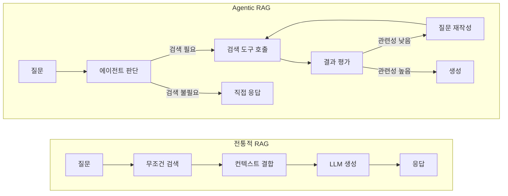
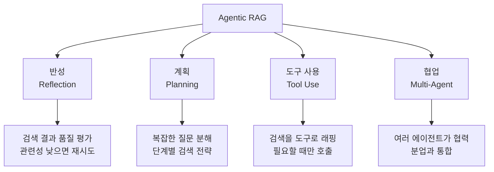
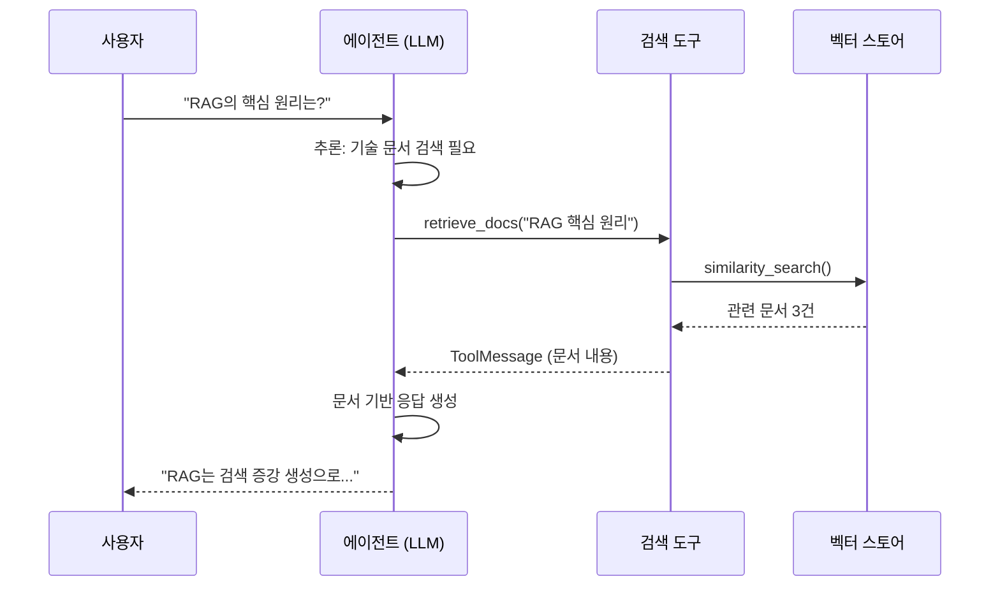
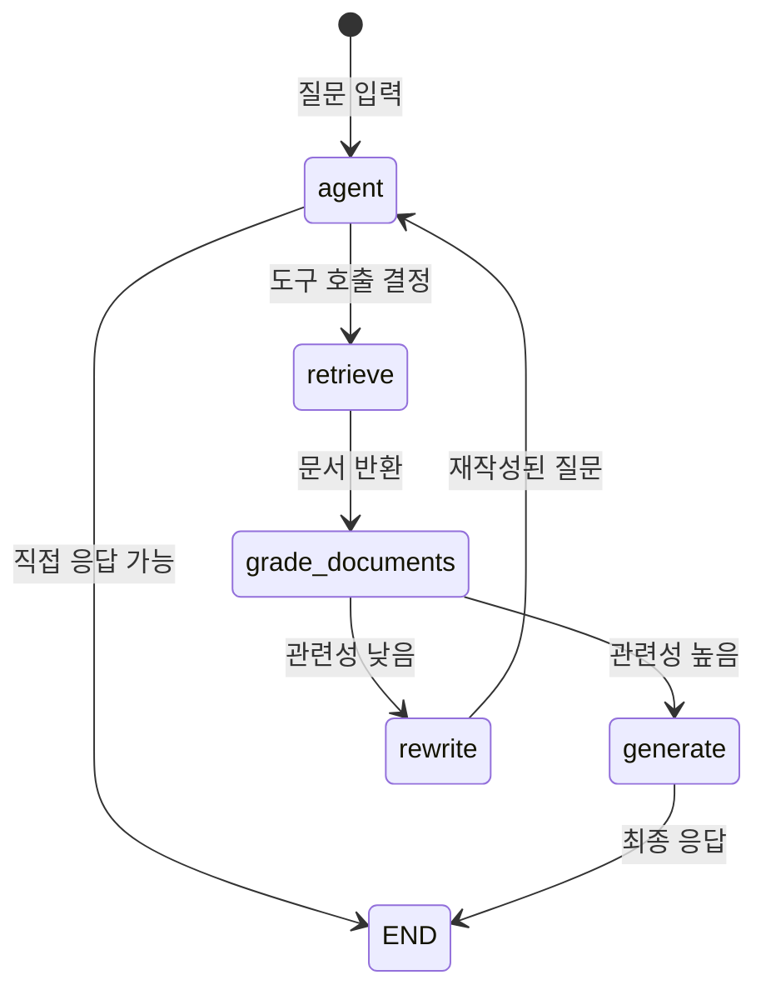
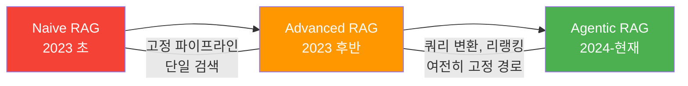

# RAG에서 Agentic RAG로

> 기존 RAG의 한계를 넘어, 에이전트가 검색을 도구로 자율 활용하는 Agentic RAG 패턴을 이해합니다.

## 개요

지금까지 우리는 에이전트가 외부 도구를 호출하고, 다른 에이전트와 A2A 프로토콜로 협업하는 방법까지 살펴봤습니다. 에이전트가 도구를 활용하는 다음 단계로, 이번 챕터에서는 **검색(Retrieval) 자체를 도구화**하는 Agentic RAG를 다룹니다. 단순히 "검색해서 답변하기"가 아니라, 에이전트가 "검색할지 말지", "어떤 소스를 검색할지", "결과가 충분한지"를 스스로 판단하는 패턴이죠.

이 섹션에서는 전통적인 RAG 파이프라인이 가진 구조적 한계를 분석하고, 이를 극복하기 위해 등장한 Agentic RAG의 핵심 개념과 아키텍처를 학습합니다. 검색(Retrieval)을 에이전트의 도구로 래핑하는 패턴을 이해하고, LangGraph 기반 Agentic RAG의 기본 구조를 코드로 확인합니다.

**선수 지식**: [LangGraph StateGraph 기초](04-ch4-langgraph-stategraph-기초/01-01-langgraph-아키텍처-개관.md)에서 배운 노드·엣지·상태 개념, [ReAct 패턴](02-ch2-react-패턴과-에이전트-루프/01-01-react-패턴-이론.md)의 추론-행동 루프, [커스텀 도구 개발](08-ch8-커스텀-도구-개발/01-01-tool-데코레이터-심화.md)에서 다룬 도구 정의 방법

**학습 목표**:
- 전통적 RAG와 Agentic RAG의 근본적 차이를 설명할 수 있다
- 검색을 도구로 래핑하는 `create_retriever_tool` 패턴을 이해한다
- Agentic RAG의 그래프 구조(검색 → 평가 → 재검색/생성)를 설계할 수 있다
- 에이전트가 "검색할지 말지"를 스스로 판단하는 메커니즘을 구현할 수 있다

## 왜 알아야 할까?

여러분이 사내 문서 검색 챗봇을 만들었다고 상상해 보세요. 사용자가 "안녕하세요"라고 인사했는데, 시스템이 벡터 DB에서 "안녕하세요"와 유사한 문서를 열심히 검색하고 있습니다. "오늘 날씨 어때?"라는 질문에도 기술 문서를 뒤적이죠. 이것이 전통적 RAG의 현실입니다 — **모든 입력에 무조건 검색부터 합니다**.

앞선 챕터들에서 에이전트가 API를 호출하고, 코드를 실행하고, 다른 에이전트와 통신하는 모습을 봤는데요 — 그렇다면 **검색도 에이전트가 자율적으로 다룰 수 있어야** 하지 않을까요? 도구 호출의 판단력을 이미 갖춘 에이전트에게, 검색이라는 도구를 하나 더 쥐어주는 것. 이것이 Agentic RAG의 출발점입니다.

2026년 현재, 단순한 "검색 → 생성" 파이프라인으로는 실전 요구사항을 충족할 수 없습니다. 사용자 질문이 검색이 필요한지 판단하고, 검색 결과가 부실하면 질문을 다시 구성하고, 때로는 웹 검색으로 전환하는 — 이런 **자율적 의사결정**이 필요합니다. Agentic RAG는 바로 이 문제를 해결합니다.

> 📊 **그림 1**: 전통적 RAG vs Agentic RAG — 핵심 차이



전통적 RAG는 **파이프라인(pipeline)**이고, Agentic RAG는 **루프(loop)**입니다. 이 차이가 이번 챕터 전체를 관통하는 핵심 통찰이에요.

## 핵심 개념

### 개념 1: 전통적 RAG의 세 가지 한계

> 💡 **비유**: 전통적 RAG는 도서관에서 책을 찾아주는 사서인데, 어떤 질문을 해도 무조건 책장으로 달려갑니다. "화장실이 어디예요?"라고 물어도 관련 도서를 검색하죠. 반면 Agentic RAG의 사서는 먼저 질문을 듣고, 책이 필요한 질문인지 판단한 다음, 필요하면 적절한 서가를 선택하고, 찾은 책이 도움이 안 되면 다른 서가를 찾아봅니다.

전통적 RAG(Naive RAG라고도 부릅니다)는 세 가지 근본적 한계를 가지고 있습니다:

**1. 무조건 검색 (Unconditional Retrieval)**

모든 쿼리에 대해 벡터 DB 검색을 수행합니다. "안녕하세요", "고마워요" 같은 일상 대화도 검색 대상이 되어 불필요한 지연과 비용이 발생합니다.

**2. 단일 시도 (Single-shot)**

한 번 검색하면 결과가 좋든 나쁠든 그대로 LLM에 전달합니다. 검색 결과의 품질을 평가하거나, 실패 시 재시도하는 메커니즘이 없습니다.

**3. 고정 경로 (Static Pipeline)**

입력 → 검색 → 생성의 경로가 고정되어 있습니다. 쿼리의 복잡도나 유형에 따라 경로를 바꿀 수 없습니다.

```run:python
# 전통적 RAG의 의사코드 — 모든 입력에 동일한 경로
def naive_rag(query: str) -> str:
    # 1단계: 무조건 검색 (판단 없음)
    docs = vector_store.similarity_search(query, k=3)

    # 2단계: 컨텍스트 결합 (품질 평가 없음)
    context = "\n".join([doc.page_content for doc in docs])

    # 3단계: LLM 생성 (재시도 없음)
    response = llm.invoke(
        f"Context: {context}\nQuestion: {query}\nAnswer:"
    )
    return response

# 문제 상황 시뮬레이션
queries = ["안녕하세요", "RAG의 핵심 원리는?", "오늘 서울 날씨는?"]
for q in queries:
    print(f"질문: {q} → 무조건 벡터 검색 실행!")
```

```output
질문: 안녕하세요 → 무조건 벡터 검색 실행!
질문: RAG의 핵심 원리는? → 무조건 벡터 검색 실행!
질문: 오늘 서울 날씨는? → 무조건 벡터 검색 실행!
```

세 가지 질문 모두 동일한 경로를 타는 것이 보이시나요? "안녕하세요"는 검색할 필요가 없고, "오늘 날씨"는 벡터 DB가 아닌 웹 검색이 적합한데 말이죠.

### 개념 2: Agentic RAG — 파이프라인에서 루프로

> 💡 **비유**: 여러분이 시험 공부를 한다고 해봅시다. Naive RAG는 교과서를 펼쳐서 한 번 읽고 바로 답안을 쓰는 학생입니다. Agentic RAG는 먼저 문제를 분석하고("이건 교과서에 있는 내용인가, 아니면 내가 아는 건가?"), 교과서를 찾아보고, 찾은 내용이 맞는지 확인하고, 부족하면 다른 참고서를 뒤지는 학생이에요. 당연히 후자의 점수가 높겠죠.

Agentic RAG는 2025년 1월 Singh 등이 발표한 서베이 논문 *"Agentic Retrieval-Augmented Generation: A Survey on Agentic RAG"*에서 체계적으로 정리된 개념입니다. 핵심은 RAG 파이프라인에 **자율적 AI 에이전트**를 내장하는 것입니다.

에이전트는 네 가지 에이전틱 디자인 패턴을 활용합니다:

> 📊 **그림 2**: Agentic RAG의 네 가지 핵심 능력



이 네 가지 중 이번 섹션에서 집중할 것은 **도구 사용(Tool Use)**입니다. 검색을 "도구"로 만들어 에이전트에게 쥐어주면, 에이전트가 알아서 "언제 검색할지"를 판단합니다.

| 비교 항목 | Naive RAG | Agentic RAG |
|-----------|-----------|-------------|
| 검색 트리거 | 모든 입력에 무조건 실행 | 에이전트가 필요 여부 판단 |
| 검색 횟수 | 정확히 1회 | 0회 ~ N회 (동적) |
| 결과 평가 | 없음 | 관련성 그레이딩 |
| 실패 대응 | 없음 | 질문 재작성, 다른 소스 검색 |
| 워크플로우 | 직선형 파이프라인 | 루프형 그래프 |
| 응답 품질 | 검색 결과에 종속 | 자기교정으로 품질 보장 |

### 개념 3: 검색을 도구로 래핑하기 — create_retriever_tool

> 💡 **비유**: 스마트폰의 앱을 생각해 보세요. 지도 앱(검색 도구)은 항상 열려 있는 게 아니라, 길을 찾을 때만 실행하죠. Agentic RAG에서 검색은 바로 이런 "앱"입니다 — 에이전트(운영체제)가 필요할 때 실행하고, 결과를 받아 활용합니다.

LangChain은 `create_retriever_tool`이라는 유틸리티를 제공합니다. 이 함수는 벡터 스토어의 retriever를 LLM이 호출할 수 있는 **도구(Tool)**로 변환합니다.

> 📊 **그림 3**: 검색 도구 래핑 과정



```python
from langchain_community.vectorstores import Chroma
from langchain_openai import OpenAIEmbeddings
from langchain.tools.retriever import create_retriever_tool
from langchain_text_splitters import RecursiveCharacterTextSplitter
from langchain_community.document_loaders import WebBaseLoader

# 1. 문서 로드 및 벡터 스토어 구축
loader = WebBaseLoader("https://lilianweng.github.io/posts/2023-06-23-agent/")
docs = loader.load()

# 2. 텍스트 분할
splitter = RecursiveCharacterTextSplitter(
    chunk_size=500,      # 청크 크기
    chunk_overlap=50,    # 겹침 영역
)
splits = splitter.split_documents(docs)

# 3. 벡터 스토어 생성
vectorstore = Chroma.from_documents(
    documents=splits,
    embedding=OpenAIEmbeddings(),
)
retriever = vectorstore.as_retriever(search_kwargs={"k": 3})

# 4. 검색을 "도구"로 래핑 — 핵심!
retriever_tool = create_retriever_tool(
    retriever,
    name="search_tech_docs",               # 도구 이름
    description=(                           # LLM이 읽는 도구 설명
        "LLM 에이전트, 프롬프트 엔지니어링, "
        "RAG에 관한 기술 문서를 검색합니다. "
        "이 주제에 대한 질문이 들어오면 이 도구를 사용하세요."
    ),
)
```

여기서 `description`이 매우 중요합니다. LLM은 이 설명을 읽고 "이 도구를 호출할지 말지"를 결정하거든요. 설명이 부실하면 에이전트가 적절한 타이밍에 도구를 호출하지 못합니다.

### 개념 4: LangGraph Agentic RAG 그래프 구조

> 💡 **비유**: Agentic RAG 그래프는 회사의 업무 플로우차트와 비슷합니다. 고객 문의가 들어오면 → 담당자가 유형을 분류하고 → 기술 문의면 기술팀에 전달, 일반 문의면 바로 답변 → 기술팀이 자료를 찾아 답변 초안을 작성 → 품질 검토 → 부족하면 추가 조사 요청. 이런 분기와 루프가 LangGraph의 노드와 엣지로 표현됩니다.

LangGraph 공식 문서에서 제시하는 Agentic RAG 아키텍처는 다섯 가지 핵심 노드로 구성됩니다:

> 📊 **그림 4**: LangGraph Agentic RAG 그래프 구조



```python
from typing import Annotated, Literal
from typing_extensions import TypedDict
from langgraph.graph import StateGraph, END
from langgraph.graph.message import add_messages
from langgraph.prebuilt import ToolNode, tools_condition
from langchain_openai import ChatOpenAI
from langchain_core.messages import SystemMessage

# --- 상태 정의 ---
class AgentState(TypedDict):
    """Agentic RAG의 상태 스키마"""
    messages: Annotated[list, add_messages]  # 메시지 히스토리

# --- LLM 설정 ---
llm = ChatOpenAI(model="gpt-4o", temperature=0)

# 검색 도구를 LLM에 바인딩
tools = [retriever_tool]
llm_with_tools = llm.bind_tools(tools)

# --- 노드 함수 정의 ---
def agent(state: AgentState) -> dict:
    """에이전트 노드: 검색 여부를 판단하고 도구 호출 또는 직접 응답"""
    system_msg = SystemMessage(content=(
        "당신은 기술 문서 검색 전문가입니다. "
        "질문에 답하기 위해 검색이 필요하면 search_tech_docs 도구를 사용하세요. "
        "일상적인 인사나 검색이 불필요한 질문에는 직접 답하세요."
    ))
    response = llm_with_tools.invoke([system_msg] + state["messages"])
    return {"messages": [response]}

def generate(state: AgentState) -> dict:
    """생성 노드: 검색 결과를 바탕으로 최종 응답 생성"""
    # 최근 메시지에서 검색 결과 추출
    messages = state["messages"]
    # 검색 결과가 포함된 ToolMessage 찾기
    docs_content = ""
    for msg in reversed(messages):
        if hasattr(msg, "type") and msg.type == "tool":
            docs_content = msg.content
            break

    # 검색 결과 기반 응답 생성
    system_msg = SystemMessage(content=(
        "당신은 질문 응답 어시스턴트입니다. "
        "아래 검색 결과를 바탕으로 간결하고 정확하게 답하세요.\n\n"
        f"검색 결과:\n{docs_content}"
    ))
    user_question = messages[0]  # 원래 질문
    response = llm.invoke([system_msg, user_question])
    return {"messages": [response]}

# --- 그래프 조립 ---
graph_builder = StateGraph(AgentState)

# 노드 추가
graph_builder.add_node("agent", agent)
graph_builder.add_node("retrieve", ToolNode(tools))  # 검색 도구 실행
graph_builder.add_node("generate", generate)

# 엣지 연결
graph_builder.set_entry_point("agent")

# 에이전트 → 도구 호출 여부에 따라 분기
graph_builder.add_conditional_edges(
    "agent",
    tools_condition,  # 도구 호출이면 "tools", 아니면 END
    {
        "tools": "retrieve",  # 도구 호출 → 검색 노드
        END: END,             # 직접 응답 → 종료
    },
)

# 검색 후 → 생성
graph_builder.add_edge("retrieve", "generate")
graph_builder.add_edge("generate", END)

# 컴파일
graph = graph_builder.compile()
```

이 코드에서 주목할 점은 `tools_condition`입니다. [조건 분기](05-ch5-조건-분기와-동적-라우팅/01-01-조건부-엣지의-이해.md)에서 배웠던 조건부 엣지의 실전 활용이죠. LLM의 응답에 도구 호출이 포함되어 있으면 `"tools"` 경로로, 없으면 `END`로 라우팅합니다.

### 개념 5: Agentic RAG의 진화 — Naive에서 Agentic까지

RAG 시스템은 세 단계로 진화해 왔습니다:

> 📊 **그림 5**: RAG 패러다임의 진화



| 세대 | 특징 | 한계 |
|------|------|------|
| **Naive RAG** | 질문 → 검색 → 생성 | 무조건 검색, 품질 보장 없음 |
| **Advanced RAG** | 쿼리 변환, 리랭킹, 청크 최적화 | 여전히 고정 경로, 동적 판단 없음 |
| **Agentic RAG** | 에이전트 루프, 도구 기반 검색, 자기교정 | 지연 시간 증가, 토큰 비용 상승 |

Agentic RAG는 다시 여러 하위 패턴으로 나뉘는데, 이번 챕터와 이후 챕터에서 하나씩 깊이 다룰 예정입니다:

- **Corrective RAG (CRAG)**: 검색 결과를 평가하고, 부적합하면 질문을 재작성하거나 웹 검색으로 전환하는 패턴 → [자기교정 RAG 구현](12-ch12-agentic-rag-에이전트가-검색을-도구로-활용/04-04-자기교정-rag-구현.md)에서 본격적으로 다룹니다
- **Adaptive RAG**: 쿼리 복잡도에 따라 No Retrieval / Single-shot / Iterative를 동적 선택 → [Adaptive RAG 아키텍처](13-ch13-adaptive-rag와-동적-라우팅/01-01-adaptive-rag-아키텍처.md)에서 다룹니다
- **Self-RAG**: 검색 필요성, 문서 관련성, 응답 지지도를 모두 LLM이 자체 평가하는 패턴 → 역시 [자기교정 RAG 구현](12-ch12-agentic-rag-에이전트가-검색을-도구로-활용/04-04-자기교정-rag-구현.md)에서 CRAG와 비교하며 살펴봅니다
- **Graph RAG**: 지식 그래프 기반 검색과 커뮤니티 요약 활용 → [GraphRAG 이론](14-ch14-graphrag와-knowledge-graph/01-01-graphrag-이론과-아키텍처.md)에서 다룹니다

## 실습: 직접 해보기

완전한 Agentic RAG 에이전트를 구축하고, 다양한 유형의 질문으로 에이전트의 자율 판단을 확인해 보겠습니다.

```python
# 필수 패키지 설치
# pip install langchain langchain-openai langgraph chromadb langchain-community bs4

import os
from typing import Annotated
from typing_extensions import TypedDict
from langchain_community.vectorstores import Chroma
from langchain_openai import OpenAIEmbeddings, ChatOpenAI
from langchain.tools.retriever import create_retriever_tool
from langchain_text_splitters import RecursiveCharacterTextSplitter
from langchain_community.document_loaders import WebBaseLoader
from langchain_core.messages import SystemMessage, HumanMessage
from langgraph.graph import StateGraph, END
from langgraph.graph.message import add_messages
from langgraph.prebuilt import ToolNode, tools_condition

# --- 환경 설정 (API 키는 환경변수로) ---
# os.environ["OPENAI_API_KEY"] = "your-key-here"

# ===== 1단계: 벡터 스토어 준비 =====
print("📚 문서 로드 및 벡터 스토어 구축 중...")

# 기술 블로그 문서 로드
loader = WebBaseLoader(
    "https://lilianweng.github.io/posts/2023-06-23-agent/"
)
docs = loader.load()

# 텍스트 분할
splitter = RecursiveCharacterTextSplitter(
    chunk_size=500,
    chunk_overlap=50,
)
splits = splitter.split_documents(docs)

# 벡터 스토어 생성
vectorstore = Chroma.from_documents(
    documents=splits,
    embedding=OpenAIEmbeddings(),
)
retriever = vectorstore.as_retriever(search_kwargs={"k": 3})

# ===== 2단계: 검색 도구 생성 =====
retriever_tool = create_retriever_tool(
    retriever,
    name="search_tech_docs",
    description=(
        "LLM 에이전트, 프롬프트 엔지니어링, RAG, "
        "도구 사용에 관한 기술 문서를 검색합니다. "
        "이 주제에 대한 기술적 질문이 들어오면 이 도구를 사용하세요."
    ),
)

# ===== 3단계: 그래프 구성 =====
class State(TypedDict):
    messages: Annotated[list, add_messages]

llm = ChatOpenAI(model="gpt-4o", temperature=0)
tools = [retriever_tool]
llm_with_tools = llm.bind_tools(tools)

SYSTEM_PROMPT = (
    "당신은 AI 기술 전문가입니다. "
    "기술적 질문에는 search_tech_docs 도구를 사용하여 정확한 정보를 제공하세요. "
    "일반적인 인사나 간단한 질문에는 도구 없이 직접 답하세요."
)

def agent_node(state: State) -> dict:
    """에이전트: 검색 여부 자율 판단"""
    response = llm_with_tools.invoke(
        [SystemMessage(content=SYSTEM_PROMPT)] + state["messages"]
    )
    return {"messages": [response]}

def generate_node(state: State) -> dict:
    """생성: 검색 결과 기반 최종 응답"""
    messages = state["messages"]
    # ToolMessage에서 검색 결과 추출
    docs_content = ""
    for msg in reversed(messages):
        if hasattr(msg, "type") and msg.type == "tool":
            docs_content = msg.content
            break

    user_question = None
    for msg in messages:
        if hasattr(msg, "type") and msg.type == "human":
            user_question = msg
            break

    response = llm.invoke([
        SystemMessage(content=(
            "아래 검색 결과를 바탕으로 질문에 답하세요. "
            "검색 결과에 없는 내용은 추측하지 마세요.\n\n"
            f"검색 결과:\n{docs_content}"
        )),
        user_question,
    ])
    return {"messages": [response]}

# 그래프 조립
builder = StateGraph(State)
builder.add_node("agent", agent_node)
builder.add_node("retrieve", ToolNode(tools))
builder.add_node("generate", generate_node)

builder.set_entry_point("agent")
builder.add_conditional_edges(
    "agent",
    tools_condition,
    {"tools": "retrieve", END: END},
)
builder.add_edge("retrieve", "generate")
builder.add_edge("generate", END)

graph = builder.compile()

# ===== 4단계: 다양한 질문으로 테스트 =====
test_queries = [
    "안녕하세요!",                          # → 직접 응답 (검색 불필요)
    "LLM 에이전트의 핵심 구성요소는 무엇인가요?",  # → 검색 도구 호출
    "오늘 기분이 어때요?",                    # → 직접 응답 (검색 불필요)
]

for query in test_queries:
    print(f"\n{'='*50}")
    print(f"📝 질문: {query}")
    result = graph.invoke({"messages": [HumanMessage(content=query)]})
    final_msg = result["messages"][-1]

    # 검색 도구가 호출되었는지 확인
    tool_called = any(
        hasattr(m, "type") and m.type == "tool"
        for m in result["messages"]
    )
    print(f"🔍 검색 도구 호출: {'예' if tool_called else '아니오'}")
    print(f"💬 응답: {final_msg.content[:200]}...")
```

실행하면 "안녕하세요!"와 "오늘 기분이 어때요?"에는 검색 없이 직접 응답하고, "LLM 에이전트의 핵심 구성요소" 질문에만 벡터 스토어를 검색하는 것을 확인할 수 있습니다. 에이전트가 스스로 판단하는 거죠!

## 더 깊이 알아보기

### RAG의 탄생과 Agentic RAG로의 진화

RAG(Retrieval-Augmented Generation)라는 개념은 2020년 Meta AI(당시 Facebook AI Research)의 Patrick Lewis 등이 발표한 논문 *"Retrieval-Augmented Generation for Knowledge-Intensive NLP Tasks"*에서 처음 등장했습니다. 당시 아이디어는 단순했어요 — LLM이 모든 지식을 파라미터에 저장하는 대신, 필요할 때 외부 문서를 "참고"하게 하자는 것이었죠.

그런데 이 단순한 아이디어가 실전에 적용되면서 문제가 드러났습니다. 검색 결과가 엉뚱하면 LLM이 "환각(hallucination)"을 만들어내고, 복잡한 질문에는 한 번의 검색으로 충분하지 않았거든요. 

2025년 1월, Aditi Singh 등이 arXiv에 발표한 서베이 논문 *"Agentic Retrieval-Augmented Generation: A Survey on Agentic RAG"* (arXiv:2501.09136)는 이 진화를 체계적으로 정리했습니다. 이 논문은 Agentic RAG를 단일 에이전트, 멀티 에이전트, 계층적 구조, Corrective RAG, Adaptive RAG, Graph RAG 등의 분류 체계로 제시하며, "Fire and Forget RAG의 시대는 끝났다"고 선언했습니다.

흥미로운 점은 "Agentic"이라는 단어의 부상입니다. 2024년 Andrew Ng이 "Agentic Workflows"라는 개념을 강조하면서, AI 시스템이 단순 입출력이 아닌 **루프, 반성, 도구 사용, 계획**을 통해 복잡한 작업을 수행해야 한다고 역설했습니다. Agentic RAG는 이 철학이 RAG 영역에 적용된 결과물입니다.

## 흔한 오해와 팁

> ⚠️ **흔한 오해**: "Agentic RAG는 항상 Naive RAG보다 좋다?" — 아닙니다. 모든 질문이 동일한 유형(예: 항상 문서 검색이 필요한 고객 지원 시스템)이라면, 에이전트의 "판단" 과정이 오히려 불필요한 지연을 추가합니다. Agentic RAG는 **쿼리 유형이 다양하고, 검색 실패 시 대안이 필요한 상황**에서 진가를 발휘합니다.

> 💡 **알고 계셨나요?**: LangGraph의 `tools_condition`은 내부적으로 LLM 응답의 `tool_calls` 속성을 확인합니다. OpenAI의 Function Calling이나 Anthropic의 Tool Use 모두 동일한 방식으로 동작해요. [LLM Tool Calling 메커니즘](01-ch1-llm-도구-호출의-이해/02-02-llm-tool-calling-메커니즘.md)에서 배운 구조화된 출력이 바로 여기서 활용되는 겁니다.

> 🔥 **실무 팁**: `create_retriever_tool`의 `description`은 에이전트 성능의 핵심입니다. "문서를 검색합니다" 같은 일반적인 설명 대신, **어떤 주제의 문서인지, 언제 사용해야 하는지**를 구체적으로 적어주세요. 실무에서 도구 설명을 튜닝하는 것만으로 검색 정확도가 20~30% 향상되는 경우가 흔합니다.

## 핵심 정리

| 개념 | 설명 |
|------|------|
| Naive RAG의 한계 | 무조건 검색, 단일 시도, 고정 경로로 인한 품질 저하 |
| Agentic RAG | 에이전트가 검색 여부를 자율 판단하고, 결과를 평가하며, 필요시 재시도하는 루프형 RAG |
| create_retriever_tool | LangChain에서 retriever를 LLM 호출 가능한 도구로 변환하는 유틸리티 |
| tools_condition | LangGraph에서 LLM 응답의 도구 호출 유무에 따라 경로를 분기하는 조건 함수 |
| ToolNode | 도구 실행을 담당하는 LangGraph 내장 노드 |
| 에이전틱 디자인 패턴 | 반성(Reflection), 계획(Planning), 도구 사용(Tool Use), 협업(Multi-Agent) |
| RAG 진화 경로 | Naive RAG → Advanced RAG → Agentic RAG |

## 다음 섹션 미리보기

이번 섹션에서는 Agentic RAG의 개념과 기본 그래프 구조를 살펴봤습니다. 에이전트가 "검색할지 말지"를 판단하게 되었지만, 아직 검색 도구 자체는 단순한 유사도 검색에 불과합니다. 다음 섹션 [검색 도구 구축](12-ch12-agentic-rag-에이전트가-검색을-도구로-활용/02-02-검색-도구-구축.md)에서는 청크 전략, 멀티 인덱스, 메타데이터 필터링 등 **프로덕션 수준의 검색 도구**를 설계하고 구현합니다.

## 참고 자료

- [Build a custom RAG agent with LangGraph — LangChain 공식 문서](https://docs.langchain.com/oss/python/langgraph/agentic-rag) - Agentic RAG의 공식 튜토리얼. 그래프 구성, ToolNode, 관련성 그레이딩까지 단계별로 설명
- [Agentic Retrieval-Augmented Generation: A Survey on Agentic RAG (arXiv:2501.09136)](https://arxiv.org/abs/2501.09136) - Agentic RAG의 체계적 분류와 진화를 정리한 서베이 논문. 단일/멀티 에이전트, Corrective, Adaptive, Graph RAG 등 아키텍처 유형 분석
- [LangGraph RAG: Build Agentic Retrieval‑Augmented Generation — Leanware](https://www.leanware.co/insights/langgraph-rag-agentic) - Agentic RAG의 실전 구현 가이드. Router, Grader, Generator, Hallucination Checker 패턴 설명
- [LangGraph GitHub — Agentic RAG 예제 노트북](https://github.com/langchain-ai/langgraph/blob/main/examples/rag/langgraph_agentic_rag.ipynb) - 공식 예제 코드. create_retriever_tool + StateGraph 조합의 전체 구현
- [Retrieval-Augmented Generation for Knowledge-Intensive NLP Tasks — 원조 RAG 논문](https://arxiv.org/abs/2005.11401) - 2020년 Meta AI가 발표한 RAG 최초 논문. 현재 모든 RAG 시스템의 이론적 기반

---
### 🔗 Related Sessions
- [stategraph](04-ch4-langgraph-stategraph-기초/01-01-langgraph-아키텍처-개관.md) (prerequisite)
