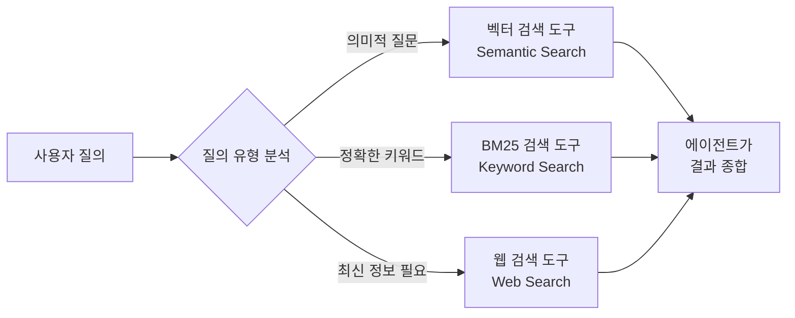
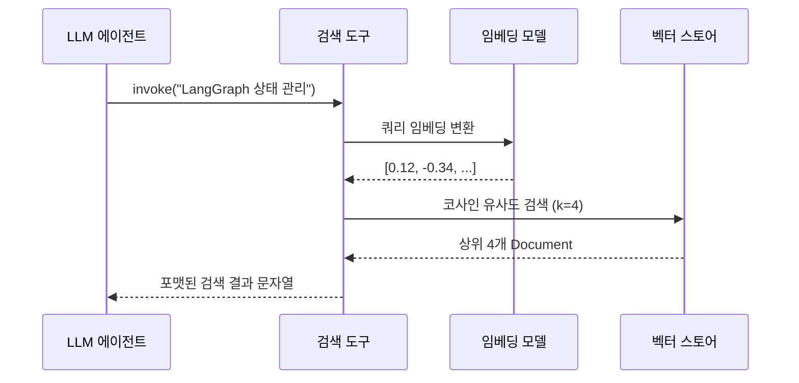
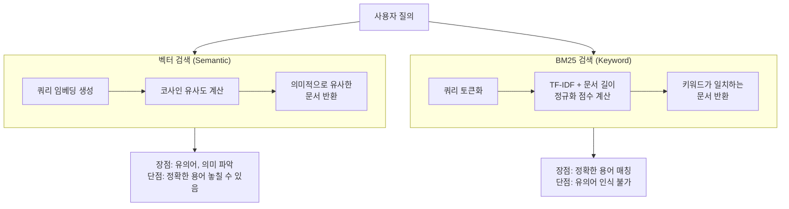
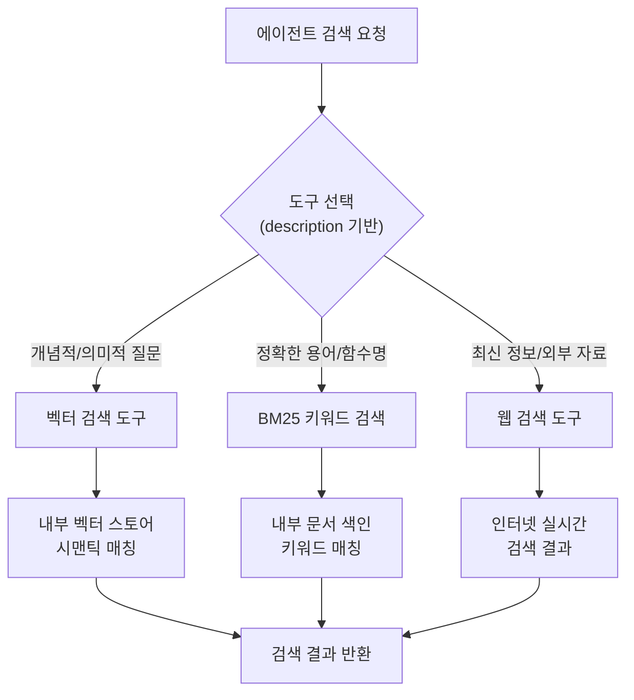
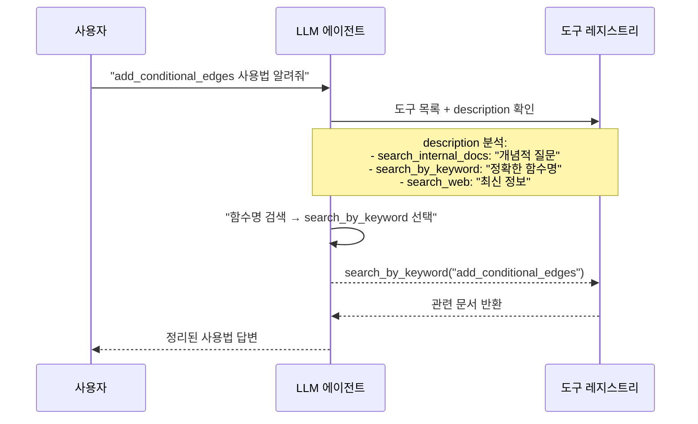

# 검색 도구 구축

> 벡터 검색, 키워드 검색, 웹 검색을 에이전트 도구로 래핑하고, 도구 설명 최적화로 에이전트의 도구 선택 정확도를 높인다

## 개요

이 섹션에서는 Agentic RAG의 핵심 빌딩 블록인 **검색 도구**를 직접 구축합니다. 앞서 [01. RAG에서 Agentic RAG로](12-ch12-agentic-rag-에이전트가-검색을-도구로-활용/01-01-rag에서-agentic-rag로.md)에서 `create_retriever_tool`로 간단한 벡터 검색 도구를 만들었는데요, 이번에는 벡터 검색 외에도 BM25 키워드 검색, 웹 검색까지 다양한 검색 전략을 도구로 래핑하고, 에이전트가 상황에 맞는 도구를 정확히 선택하도록 **도구 설명(description)을 최적화**하는 방법을 배웁니다.

**선수 지식**: 12.1에서 배운 `create_retriever_tool`, `ToolNode`, `tools_condition` 개념
**학습 목표**:
- 벡터 스토어 기반 검색 도구를 구축하고 설정할 수 있다
- BM25 키워드 검색 도구를 만들어 정확한 용어 매칭에 활용할 수 있다
- 웹 검색 도구를 에이전트에 통합할 수 있다
- 도구 설명을 최적화하여 에이전트의 도구 선택 정확도를 높일 수 있다

## 왜 알아야 할까?

실전 Agentic RAG에서 검색 도구가 하나뿐이라면 어떻게 될까요? 사용자가 "2024년 LangGraph 최신 변경사항"을 물어보면 내부 문서만 뒤지고, "Python GIL"이라는 정확한 키워드를 검색해야 할 때는 의미적 유사도에 의존해 엉뚱한 문서를 가져오게 됩니다.

사람도 도서관에서 책을 찾을 때 전략이 다르잖아요. 특정 저자를 찾을 땐 색인(Index)을 보고, 주제를 탐색할 땐 서가를 훑고, 최신 뉴스는 아예 도서관 밖 인터넷으로 갑니다. 에이전트도 마찬가지입니다. **검색 전략별 도구를 갖춰야** 질문의 성격에 맞는 최적의 답을 가져올 수 있거든요.

그리고 놀랍게도, 도구의 **설명(description) 한 줄**이 검색 품질을 극적으로 바꿉니다. LLM은 도구 설명을 읽고 어떤 도구를 호출할지 결정하기 때문에, 모호한 설명은 잘못된 도구 선택으로 이어집니다.

> 📊 **그림 1**: 검색 도구 유형별 적합한 질의 특성



## 핵심 개념

### 개념 1: 벡터 스토어 검색 도구

> 💡 **비유**: 벡터 검색은 **도서관 사서**와 같습니다. "기계가 배우는 방법에 대한 책 있나요?"라고 물으면, 사서는 "machine learning"이라는 단어가 제목에 없더라도 내용적으로 관련된 책을 찾아줍니다. **의미(semantics)**를 이해하기 때문이죠.

벡터 스토어 검색 도구는 문서를 임베딩 벡터로 변환한 뒤, 질의와 코사인 유사도가 높은 문서를 반환합니다. LangChain에서는 두 가지 방법으로 만들 수 있는데요.

**방법 1: `create_retriever_tool` 사용** — 가장 간편한 방법입니다.

```python
from langchain_core.tools.retriever import create_retriever_tool
from langchain_core.vectorstores import InMemoryVectorStore
from langchain_openai import OpenAIEmbeddings
from langchain_text_splitters import RecursiveCharacterTextSplitter

# 문서 청킹
text_splitter = RecursiveCharacterTextSplitter(
    chunk_size=500,       # 청크 크기
    chunk_overlap=50,     # 겹침 구간
)
doc_splits = text_splitter.split_documents(documents)

# 벡터 스토어 생성 및 인덱싱
vectorstore = InMemoryVectorStore.from_documents(
    documents=doc_splits,
    embedding=OpenAIEmbeddings(),
)
retriever = vectorstore.as_retriever(search_kwargs={"k": 4})

# 검색 도구 래핑
vector_search_tool = create_retriever_tool(
    retriever=retriever,
    name="search_internal_docs",
    description=(
        "내부 기술 문서에서 LangGraph, LangChain, AI 에이전트 관련 정보를 "
        "검색합니다. 아키텍처, API 사용법, 모범 사례 등 기술적 질문에 사용하세요."
    ),
)
```

`create_retriever_tool`은 내부적으로 retriever의 `invoke()`를 호출하고, 반환된 Document 리스트를 `document_separator`(기본값: `"\n\n"`)로 연결해 문자열로 반환합니다.

**방법 2: `@tool` 데코레이터로 직접 구현** — 결과 후처리가 필요할 때 유용합니다.

```python
from langchain_core.tools import tool

@tool
def search_internal_docs(query: str) -> str:
    """내부 기술 문서에서 LangGraph, LangChain, AI 에이전트 관련 정보를 검색합니다.
    아키텍처, API 사용법, 모범 사례 등 기술적 질문에 사용하세요."""
    docs = retriever.invoke(query)
    # 메타데이터도 함께 반환
    results = []
    for doc in docs:
        source = doc.metadata.get("source", "unknown")
        results.append(f"[출처: {source}]\n{doc.page_content}")
    return "\n\n---\n\n".join(results)
```

> 📊 **그림 2**: 벡터 검색 도구의 내부 동작 흐름



두 방법의 핵심 차이는 **커스터마이징 자유도**입니다. `create_retriever_tool`은 빠르게 만들기 좋고, `@tool` 데코레이터는 메타데이터 포맷팅, 점수 필터링, 로깅 등을 자유롭게 추가할 수 있죠.

### 개념 2: BM25 키워드 검색 도구

> 💡 **비유**: BM25 검색은 책 뒷면의 **색인(Index)**과 같습니다. "TCP/IP"라는 단어가 정확히 어디에 나오는지 바로 찾아줍니다. 단어의 의미를 이해하지는 않지만, **정확한 용어 매칭**에서는 벡터 검색보다 훨씬 빠르고 정확합니다.

BM25(Best Matching 25)는 1994년 Stephen Robertson과 Karen Spärck Jones가 발표한 랭킹 알고리즘인데요. TF-IDF의 발전형으로, **용어 빈도(TF)**와 **역문서 빈도(IDF)**를 결합하되, 문서 길이에 대한 정규화를 추가했습니다. 30년이 지난 지금도 Elasticsearch의 기본 랭킹 알고리즘으로 쓰일 만큼 검증된 방법이죠.

LangChain에서 BM25 검색 도구를 만들려면 `rank_bm25` 패키지가 필요합니다.

```python
# pip install rank_bm25

from langchain_community.retrievers import BM25Retriever
from langchain_core.documents import Document
from langchain_core.tools import tool

# 동일한 문서 세트로 BM25 리트리버 생성
bm25_retriever = BM25Retriever.from_documents(
    doc_splits,  # 벡터 스토어와 동일한 청크
    k=4,         # 반환할 문서 수
)

@tool
def search_by_keyword(query: str) -> str:
    """내부 문서에서 정확한 키워드, 함수명, 클래스명, 에러 메시지 등을 검색합니다.
    'StateGraph', 'add_conditional_edges' 같은 구체적인 용어를 찾을 때 사용하세요.
    일반적인 개념 질문에는 search_internal_docs를 사용하세요."""
    docs = bm25_retriever.invoke(query)
    results = []
    for doc in docs:
        source = doc.metadata.get("source", "unknown")
        results.append(f"[출처: {source}]\n{doc.page_content}")
    return "\n\n---\n\n".join(results)
```

> 📊 **그림 3**: 벡터 검색 vs BM25 검색 — 각 도구의 강점 영역



이 섹션에서는 벡터 검색과 BM25를 **독립된 도구**로 각각 제공하여 에이전트가 질의 성격에 따라 선택하도록 합니다. 두 검색을 하나로 결합하는 하이브리드 검색 전략은 [03. 하이브리드 검색 전략](13-ch13-adaptive-rag와-동적-라우팅/03-03-하이브리드-검색-전략.md)에서 본격적으로 다룹니다.

BM25Plus 변형을 사용하면 짧은 문서에 대한 편향을 줄일 수 있습니다.

```python
# BM25Plus 변형 사용 — 짧은 문서에 유리
bm25_plus_retriever = BM25Retriever.from_documents(
    doc_splits,
    k=4,
    bm25_variant="plus",       # 짧은 문서 편향 감소
    bm25_params={"delta": 0.5}, # 최소 점수 보정값
)
```

> ⚠️ **흔한 오해**: "BM25는 구식이니까 벡터 검색만 쓰면 된다"고 생각하기 쉽지만, 실무에서 `ToolNode`, `add_edge` 같은 정확한 함수명을 검색할 때 벡터 검색은 의미적으로 비슷한 엉뚱한 결과를 반환하는 경우가 많습니다. BM25는 이런 **정밀 검색(precision)**에서 여전히 압도적입니다.

### 개념 3: 웹 검색 도구

> 💡 **비유**: 웹 검색 도구는 **인터넷 카페 컴퓨터**입니다. 도서관(내부 문서)에 없는 최신 뉴스, 실시간 데이터, 외부 레퍼런스가 필요할 때 도서관 밖으로 나가 인터넷에서 검색하는 거죠.

내부 문서만으로는 최신 릴리스 노트, 버그 리포트, 커뮤니티 논의 등을 다룰 수 없습니다. 웹 검색 도구는 이런 **지식의 공백**을 채워주는데요, LangChain에서는 Tavily Search API를 많이 사용합니다.

```python
# pip install langchain-tavily

from langchain_tavily import TavilySearch

# Tavily 웹 검색 도구 생성
web_search_tool = TavilySearch(
    max_results=3,              # 반환할 검색 결과 수
    topic="general",            # 검색 주제 ("general" 또는 "news")
    # include_answer=True,      # AI 생성 요약 답변 포함 (선택)
)

# 도구 이름과 설명을 커스터마이징하려면 래핑
@tool
def search_web(query: str) -> str:
    """최신 기술 동향, 릴리스 노트, 버그 리포트, 실시간 정보를 웹에서 검색합니다.
    내부 문서에 답이 없을 때, 또는 2024년 이후의 최신 정보가 필요할 때 사용하세요.
    내부 문서 검색에는 search_internal_docs를 사용하세요."""
    results = web_search_tool.invoke(query)
    return results
```

> 💡 **알고 계셨나요?**: Tavily는 LLM 에이전트를 위해 특별히 설계된 검색 API입니다. 일반 웹 검색 API(Google, Bing)와 달리, 검색 결과에서 광고와 노이즈를 제거하고 LLM이 바로 활용할 수 있는 깨끗한 텍스트를 반환하도록 최적화되어 있습니다. 무료 티어로 월 1,000건 검색이 가능해서 프로토타이핑에 안성맞춤이죠.

> 📊 **그림 4**: 세 가지 검색 도구의 커버리지 영역



### 개념 4: 도구 설명(Description) 최적화

> 💡 **비유**: 도구 설명은 식당의 **메뉴 설명**과 같습니다. "파스타"라고만 적으면 손님이 어떤 파스타인지 모르지만, "신선한 바질과 모짜렐라를 올린 토마토 소스 파스타 — 매운 맛을 원하면 아라비아따를 추천"이라고 적으면 정확히 고를 수 있죠. LLM도 도구의 description을 읽고 **어떤 도구를 언제 쓸지** 판단합니다.

도구 설명은 에이전트 성능의 **숨은 열쇠**입니다. 아무리 훌륭한 검색 엔진을 만들어도, 설명이 모호하면 에이전트가 엉뚱한 도구를 선택하거든요. 좋은 도구 설명의 원칙을 살펴보겠습니다.

**원칙 1: 무엇을 검색하는지 구체적으로**

```python
# ❌ 나쁜 예 — 너무 모호함
"문서를 검색합니다."

# ✅ 좋은 예 — 검색 대상과 범위 명시
"LangGraph, LangChain 공식 문서에서 API 사용법, 아키텍처, 모범 사례를 검색합니다."
```

**원칙 2: 언제 사용해야 하는지 안내**

```python
# ❌ 나쁜 예 — 사용 시점 불분명
"키워드로 검색합니다."

# ✅ 좋은 예 — 사용 시점과 비사용 시점 모두 안내
"정확한 함수명, 클래스명, 에러 메시지를 찾을 때 사용하세요. 일반적인 개념 질문에는 semantic_search를 사용하세요."
```

**원칙 3: 다른 도구와 구별되는 점 명시**

```python
# ❌ 나쁜 예 — 다른 검색 도구와 구별 불가
"정보를 검색합니다."

# ✅ 좋은 예 — 고유한 강점과 한계를 밝힘
"최신 릴리스 노트, 보안 취약점 공지, 커뮤니티 토론 등 실시간 웹 정보를 검색합니다. 내부 문서에 답이 없을 때만 사용하세요."
```

> 📊 **그림 5**: 도구 설명이 에이전트 의사결정에 미치는 영향



> 🔥 **실무 팁**: 도구 설명에 **구체적인 예시 키워드**를 넣으면 에이전트의 도구 선택 정확도가 크게 올라갑니다. `"StateGraph, compile(), add_node 같은 구체적인 API명을 찾을 때"` 처럼요. LLM은 이런 패턴 예시를 보고 자신의 질의가 어떤 도구에 맞는지 더 잘 판단합니다.

## 실습: 직접 해보기

세 가지 검색 도구를 모두 갖춘 Agentic RAG 에이전트를 구축해봅시다. 벡터 검색, BM25 키워드 검색, 웹 검색 도구를 하나의 그래프에 통합합니다.

```python
import os
from typing import Annotated, TypedDict

from langchain_community.document_loaders import WebBaseLoader
from langchain_community.retrievers import BM25Retriever
from langchain_core.documents import Document
from langchain_core.tools import tool
from langchain_core.tools.retriever import create_retriever_tool
from langchain_core.vectorstores import InMemoryVectorStore
from langchain_openai import ChatOpenAI, OpenAIEmbeddings
from langchain_tavily import TavilySearch
from langchain_text_splitters import RecursiveCharacterTextSplitter
from langgraph.graph import END, START, MessagesState, StateGraph
from langgraph.prebuilt import ToolNode, tools_condition

# ── 1. 문서 로드 및 청킹 ──────────────────────────
urls = [
    "https://docs.langchain.com/oss/python/langgraph/agentic-rag",
    "https://docs.langchain.com/oss/python/langgraph/workflows-agents",
]

docs = []
for url in urls:
    loader = WebBaseLoader(url)
    docs.extend(loader.load())

text_splitter = RecursiveCharacterTextSplitter(
    chunk_size=500,
    chunk_overlap=50,
)
doc_splits = text_splitter.split_documents(docs)
print(f"총 {len(doc_splits)}개 청크 생성")

# ── 2. 벡터 검색 도구 ─────────────────────────────
vectorstore = InMemoryVectorStore.from_documents(
    documents=doc_splits,
    embedding=OpenAIEmbeddings(),
)
retriever = vectorstore.as_retriever(search_kwargs={"k": 4})

vector_tool = create_retriever_tool(
    retriever=retriever,
    name="search_langgraph_docs",
    description=(
        "LangGraph와 LangChain 공식 문서에서 아키텍처, API 사용법, "
        "워크플로우 설계, 에이전트 패턴 등 기술적 개념을 검색합니다. "
        "일반적인 개념 이해나 설계 질문에 사용하세요."
    ),
)

# ── 3. BM25 키워드 검색 도구 ───────────────────────
bm25_retriever = BM25Retriever.from_documents(doc_splits, k=4)

@tool
def search_by_keyword(query: str) -> str:
    """공식 문서에서 정확한 함수명, 클래스명, 파라미터명을 키워드로 검색합니다.
    'StateGraph', 'add_conditional_edges', 'ToolNode' 같은
    구체적인 API명이나 에러 메시지를 찾을 때 사용하세요.
    일반적인 개념 질문에는 search_langgraph_docs를 사용하세요."""
    docs = bm25_retriever.invoke(query)
    results = []
    for doc in docs:
        source = doc.metadata.get("source", "unknown")
        results.append(f"[출처: {source}]\n{doc.page_content}")
    return "\n\n---\n\n".join(results) if results else "관련 문서를 찾지 못했습니다."

# ── 4. 웹 검색 도구 ───────────────────────────────
@tool
def search_web(query: str) -> str:
    """최신 릴리스 노트, 버그 리포트, 기술 블로그 등 실시간 웹 정보를 검색합니다.
    내부 문서에 없는 최신 정보가 필요하거나, 2024년 이후 변경사항,
    커뮤니티 토론, 비교 분석이 필요할 때 사용하세요.
    내부 문서로 답할 수 있는 질문에는 사용하지 마세요."""
    tavily = TavilySearch(max_results=3)
    return tavily.invoke(query)

# ── 5. LLM 및 도구 바인딩 ─────────────────────────
tools = [vector_tool, search_by_keyword, search_web]
llm = ChatOpenAI(model="gpt-4o", temperature=0)

def agent_node(state: MessagesState):
    """에이전트 노드: 도구 호출 여부를 판단하고 응답을 생성합니다."""
    system_msg = (
        "당신은 LangGraph 기술 문서 전문가입니다. "
        "사용자의 질문에 검색 도구를 활용해 정확한 답변을 제공하세요. "
        "도구 설명을 잘 읽고 가장 적합한 도구를 선택하세요. "
        "검색 결과가 불충분하면 다른 도구로 재검색하세요."
    )
    messages = [{"role": "system", "content": system_msg}] + state["messages"]
    response = llm.bind_tools(tools).invoke(messages)
    return {"messages": [response]}

# ── 6. 그래프 구성 ─────────────────────────────────
graph_builder = StateGraph(MessagesState)

# 노드 추가
graph_builder.add_node("agent", agent_node)
graph_builder.add_node("tools", ToolNode(tools))

# 엣지 구성
graph_builder.add_edge(START, "agent")
graph_builder.add_conditional_edges(
    "agent",
    tools_condition,             # 도구 호출이면 "tools", 아니면 END
    {"tools": "tools", END: END},
)
graph_builder.add_edge("tools", "agent")  # 도구 결과 → 에이전트로 복귀

graph = graph_builder.compile()

# ── 7. 실행 테스트 ─────────────────────────────────
def ask(question: str):
    """질문을 보내고 최종 응답을 출력합니다."""
    result = graph.invoke({"messages": [{"role": "user", "content": question}]})
    final_msg = result["messages"][-1]
    print(f"Q: {question}")
    print(f"A: {final_msg.content[:300]}...")
    print(f"총 메시지 수: {len(result['messages'])}")
    print("---")

# 테스트 1: 개념적 질문 → 벡터 검색
ask("LangGraph에서 에이전트와 워크플로우의 차이점은?")

# 테스트 2: 정확한 API명 → BM25 검색
ask("add_conditional_edges 함수의 사용법을 알려줘")

# 테스트 3: 최신 정보 → 웹 검색
ask("LangGraph 1.1 버전에서 새로 추가된 기능은?")
```

```run:python
# 도구 설명 확인 — 에이전트가 보는 것과 동일한 정보
tools_info = [
    ("search_langgraph_docs", "벡터 검색", 
     "LangGraph와 LangChain 공식 문서에서 아키텍처, API 사용법, "
     "워크플로우 설계, 에이전트 패턴 등 기술적 개념을 검색합니다."),
    ("search_by_keyword", "BM25 검색",
     "정확한 함수명, 클래스명, 파라미터명을 키워드로 검색합니다."),
    ("search_web", "웹 검색",
     "최신 릴리스 노트, 버그 리포트, 실시간 웹 정보를 검색합니다."),
]

print("=== 에이전트 도구 목록 ===\n")
for name, search_type, desc in tools_info:
    print(f"[{search_type}] {name}")
    print(f"  → {desc}")
    print()
```

```output
=== 에이전트 도구 목록 ===

[벡터 검색] search_langgraph_docs
  → LangGraph와 LangChain 공식 문서에서 아키텍처, API 사용법, 워크플로우 설계, 에이전트 패턴 등 기술적 개념을 검색합니다.

[BM25 검색] search_by_keyword
  → 정확한 함수명, 클래스명, 파라미터명을 키워드로 검색합니다.

[웹 검색] search_web
  → 최신 릴리스 노트, 버그 리포트, 실시간 웹 정보를 검색합니다.
```

```run:python
# 도구 설명 품질 검증 체크리스트
checklist = {
    "검색 대상이 구체적인가?": True,
    "사용 시점이 명확한가?": True,
    "다른 도구와 구별되는가?": True,
    "예시 키워드가 포함되어 있는가?": True,
    "비사용 시점도 안내하는가?": True,
}

print("=== 도구 설명 품질 체크 ===\n")
for item, passed in checklist.items():
    status = "PASS" if passed else "FAIL"
    print(f"  [{status}] {item}")
print(f"\n결과: {sum(checklist.values())}/{len(checklist)} 통과")
```

```output
=== 도구 설명 품질 체크 ===

  [PASS] 검색 대상이 구체적인가?
  [PASS] 사용 시점이 명확한가?
  [PASS] 다른 도구와 구별되는가?
  [PASS] 예시 키워드가 포함되어 있는가?
  [PASS] 비사용 시점도 안내하는가?

결과: 5/5 통과
```

### 멀티 도구 검색 결과와 다음 단계 — Grading 미리보기

세 가지 도구가 준비되었으니, 실전에서 에이전트가 각 도구를 호출한 뒤 **반환된 결과를 어떻게 활용하는지**도 생각해봐야 합니다. 예를 들어 BM25 키워드 검색으로 `ToolNode`를 찾았을 때, 그 결과가 사용자 질문에 정말 관련이 있는지 **자동으로 평가(grading)**하는 메커니즘이 필요하거든요.

아래는 BM25 검색 결과에 대해 관련성 평가를 적용하는 개념적 예시입니다. 다음 섹션에서 이 패턴을 본격적으로 구현합니다.

```python
from pydantic import BaseModel, Field

# 관련성 평가 스키마 — 다음 섹션(12.3)에서 상세 구현
class GradeDocuments(BaseModel):
    """검색된 문서가 질문에 관련이 있는지 이진 평가"""
    binary_score: str = Field(description="'yes' 또는 'no'")

# BM25 검색 결과를 grading하는 흐름 (개념적 예시)
def grade_bm25_results(question: str, bm25_docs: list) -> list:
    """BM25 검색 결과 중 관련성이 높은 문서만 필터링합니다.
    키워드 매칭은 정확하지만, 문맥상 관련 없는 문서가 섞일 수 있기 때문입니다."""
    grader = llm.with_structured_output(GradeDocuments)
    filtered = []
    for doc in bm25_docs:
        grade = grader.invoke(
            f"문서: {doc.page_content[:200]}\n질문: {question}\n"
            "이 문서가 질문에 관련이 있습니까?"
        )
        if grade.binary_score == "yes":
            filtered.append(doc)
    return filtered

# 사용 예시:
# bm25_results = bm25_retriever.invoke("ToolNode")
# relevant_docs = grade_bm25_results("ToolNode의 역할은?", bm25_results)
# → 키워드가 일치하지만 문맥상 무관한 문서를 걸러냄
```

BM25는 정확한 용어 매칭에 강하지만, `ToolNode`라는 단어가 포함된 모든 청크를 반환하므로 **에이전트 패턴과 무관한 설치 가이드**가 섞일 수 있습니다. 이때 LLM 기반 grading이 "정말 질문에 답하는 문서인가?"를 판단해주는 거죠. 이 패턴은 벡터 검색과 웹 검색 결과에도 동일하게 적용됩니다.

## 더 깊이 알아보기

### BM25의 탄생 — 30년간 살아남은 알고리즘

BM25의 이름에서 "BM"은 "Best Matching"의 약자이고, "25"는 이 알고리즘이 일련의 실험에서 **25번째 반복(iteration)**이었다는 뜻입니다. 1994년 Stephen Robertson, Karen Spärck Jones, Steve Walker가 TREC(Text REtrieval Conference)에서 발표했는데요, 당시 TREC는 미국 NIST가 주관하는 정보 검색 분야의 올림픽 같은 대회였습니다.

재미있는 점은 BM25가 **이론적 우아함**보다는 **실험적 효과**로 살아남았다는 것입니다. 수학적으로 더 정교한 모델이 수없이 제안되었지만, BM25는 단순하면서도 놀라울 만큼 다양한 데이터셋에서 잘 작동했습니다. Elasticsearch, Lucene, Solr 같은 대표적인 검색 엔진이 모두 BM25를 기본 랭킹 함수로 채택한 이유죠.

이 섹션에서 만든 벡터 검색과 BM25 검색은 각각 독립된 도구로 동작하지만, 실전에서는 두 방식의 결과를 하나로 합치는 **하이브리드 검색** 전략도 많이 사용됩니다. 이 주제는 [03. 하이브리드 검색 전략](13-ch13-adaptive-rag와-동적-라우팅/03-03-하이브리드-검색-전략.md)에서 자세히 다루니, 지금은 "각 도구의 강점과 약점"을 명확히 아는 것에 집중하세요.

### 도구 설명이 곧 프롬프트다

OpenAI의 Function Calling과 Anthropic의 Tool Use 문서를 보면, 도구의 `description` 필드가 LLM에게 **시스템 프롬프트의 일부**로 전달된다는 것을 알 수 있습니다. 즉, 도구 설명을 작성하는 것은 본질적으로 **프롬프트 엔지니어링**과 같은 작업입니다. 이 사실을 깨달으면, 도구 설명에 왜 그렇게 신경을 써야 하는지 자연스럽게 이해됩니다.

## 흔한 오해와 팁

> ⚠️ **흔한 오해**: "도구가 많으면 많을수록 좋다"고 생각하기 쉽지만, 도구가 5개를 넘어가면 LLM의 도구 선택 정확도가 급격히 떨어집니다. 각 도구의 **역할 경계**가 명확한 3~5개가 최적입니다. 기능이 겹치는 도구가 있다면 하나로 통합하는 편이 낫습니다.

> 💡 **알고 계셨나요?**: `create_retriever_tool`의 `document_separator` 파라미터를 `"\n\n---\n\n"`로 바꾸면 LLM이 각 문서의 경계를 더 잘 인식합니다. 기본값인 `"\n\n"`은 문서 내용과 구분이 안 되는 경우가 있거든요.

> 🔥 **실무 팁**: 도구 설명을 작성한 뒤, 반드시 **경계 케이스(edge case)**로 테스트하세요. "LangGraph 최신 릴리스 노트"는 웹 검색으로 가야 하는데, "릴리스"가 내부 문서에도 있으면 벡터 검색이 호출될 수 있습니다. 이럴 때 설명에 "2024년 이후 최신 정보가 필요할 때"라는 시간 조건을 명시하면 해결됩니다.

## 핵심 정리

| 개념 | 설명 |
|------|------|
| 벡터 검색 도구 | 임베딩 유사도 기반 검색. 의미적 질문, 개념 이해에 적합 |
| BM25 검색 도구 | 키워드 빈도 기반 검색. 정확한 용어, API명, 에러 메시지 매칭에 강점 |
| 웹 검색 도구 | 외부 인터넷 검색. 최신 정보, 내부 문서에 없는 데이터 확보 |
| `create_retriever_tool` | retriever를 도구로 래핑하는 유틸리티. name + description 필수 |
| `@tool` 데코레이터 | 커스텀 후처리가 필요할 때 사용. docstring이 description 역할 |
| 도구 설명 최적화 | 검색 대상, 사용 시점, 비사용 시점, 예시 키워드를 구체적으로 기술 |
| `TavilySearch` | LLM 에이전트 최적화 웹 검색 API. `langchain-tavily` 패키지 |
| `BM25Retriever` | `rank_bm25` 기반 키워드 검색. `from_documents()`로 생성 |
| `GradeDocuments` | 검색 결과 관련성을 이진 평가하는 스키마. 다음 섹션에서 본격 구현 |

## 다음 섹션 미리보기

검색 도구를 잘 구축했다면, 이제 **검색 결과의 품질을 평가**할 차례입니다. 다음 [03. 검색 결과 평가와 필터링](12-ch12-agentic-rag-에이전트가-검색을-도구로-활용/03-03-검색-결과-평가와-필터링.md)에서는 LLM을 활용해 검색된 문서의 관련성을 판단하는 **Grading** 메커니즘을 구현합니다. 이번 섹션에서 만든 벡터 검색, BM25, 웹 검색 **세 가지 도구 모두의 결과**에 대해 관련성 평가를 적용하고, 관련 없는 문서를 걸러낸 뒤 재검색하는 루프를 만들어봅니다. 특히 BM25처럼 키워드가 일치하지만 문맥상 무관한 문서가 섞이는 경우에 grading이 어떻게 품질을 높이는지 직접 확인하게 됩니다.

## 참고 자료

- [Build a custom RAG agent with LangGraph](https://docs.langchain.com/oss/python/langgraph/agentic-rag) - LangGraph 공식 문서의 Agentic RAG 가이드. `create_retriever_tool`, `ToolNode` 활용법 포함
- [create_retriever_tool API Reference](https://reference.langchain.com/python/langchain_core/tools/langchain_core.tools.retriever.create_retriever_tool.html) - `create_retriever_tool` 함수의 파라미터와 사용법 공식 레퍼런스
- [BM25 Integration — LangChain Docs](https://docs.langchain.com/oss/python/integrations/retrievers/bm25) - BM25Retriever 설치, 설정, BM25Plus 변형 사용법
- [langchain-tavily (PyPI)](https://pypi.org/project/langchain-tavily/) - Tavily 웹 검색 도구의 최신 패키지 및 설치 가이드
- [Agentic RAG with Milvus and LangGraph](https://milvus.io/docs/agentic_rag_with_milvus_and_langgraph.md) - 멀티 도구 검색 에이전트 구축 실습 튜토리얼

---
### 🔗 Related Sessions
- [toolnode](04-ch4-langgraph-stategraph-기초/05-05-첫-번째-langgraph-에이전트.md) (prerequisite)
- [tools_condition](04-ch4-langgraph-stategraph-기초/05-05-첫-번째-langgraph-에이전트.md) (prerequisite)
- [create_retriever_tool](12-ch12-agentic-rag-에이전트가-검색을-도구로-활용/01-01-rag에서-agentic-rag로.md) (prerequisite)
- [agentic_rag](12-ch12-agentic-rag-에이전트가-검색을-도구로-활용/01-01-rag에서-agentic-rag로.md) (prerequisite)
- [retriever_tool](12-ch12-agentic-rag-에이전트가-검색을-도구로-활용/01-01-rag에서-agentic-rag로.md) (prerequisite)
