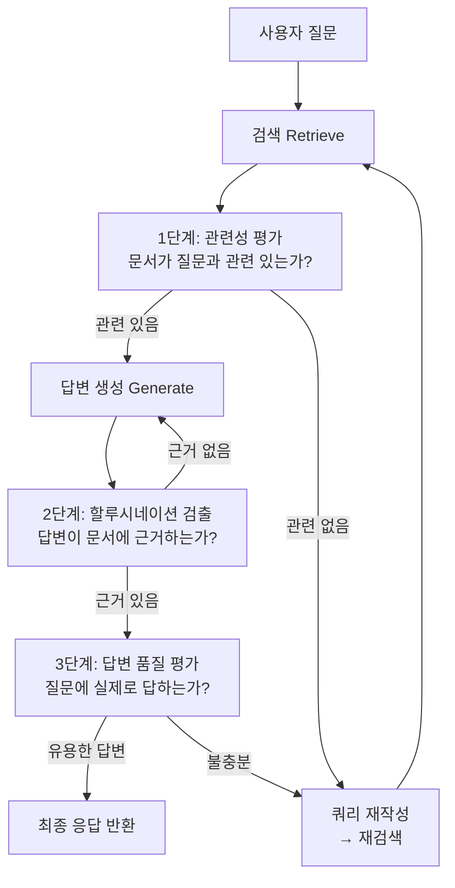
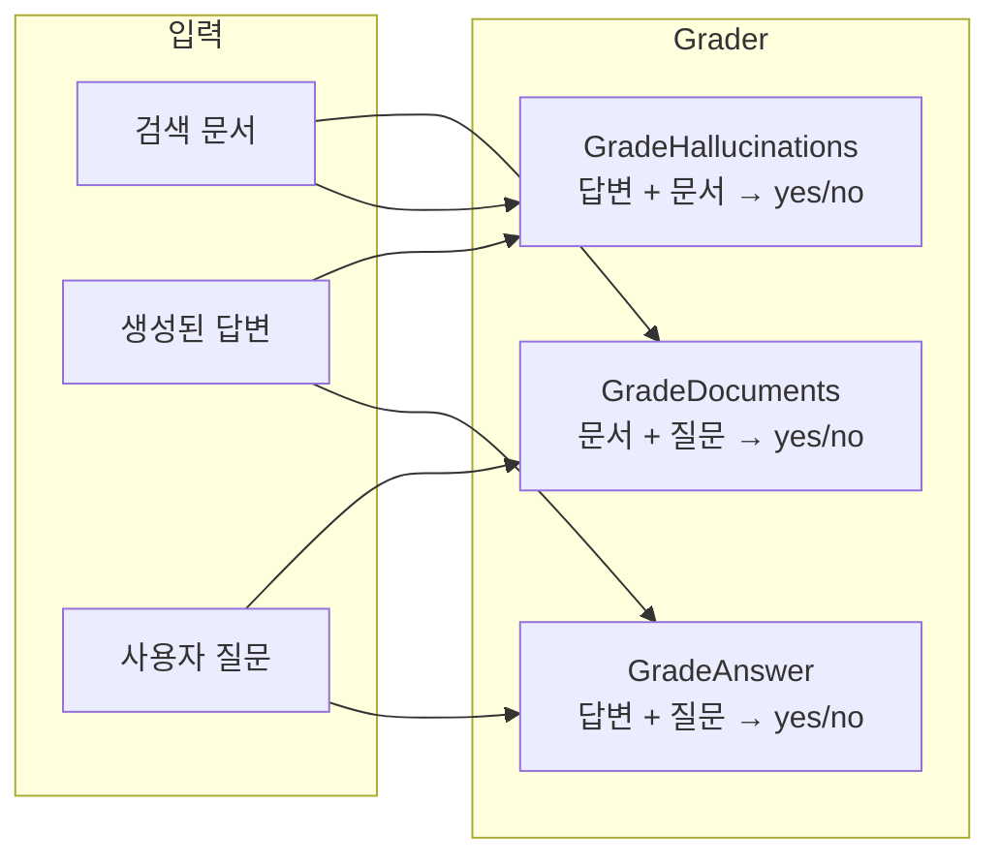
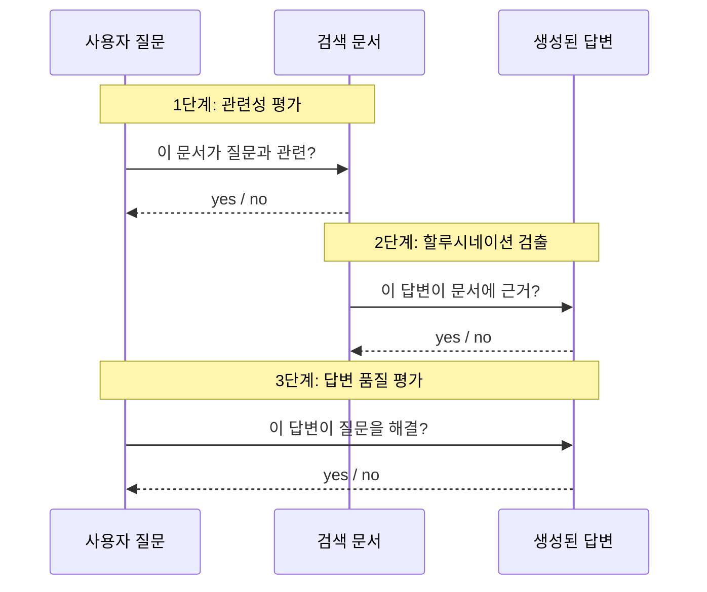
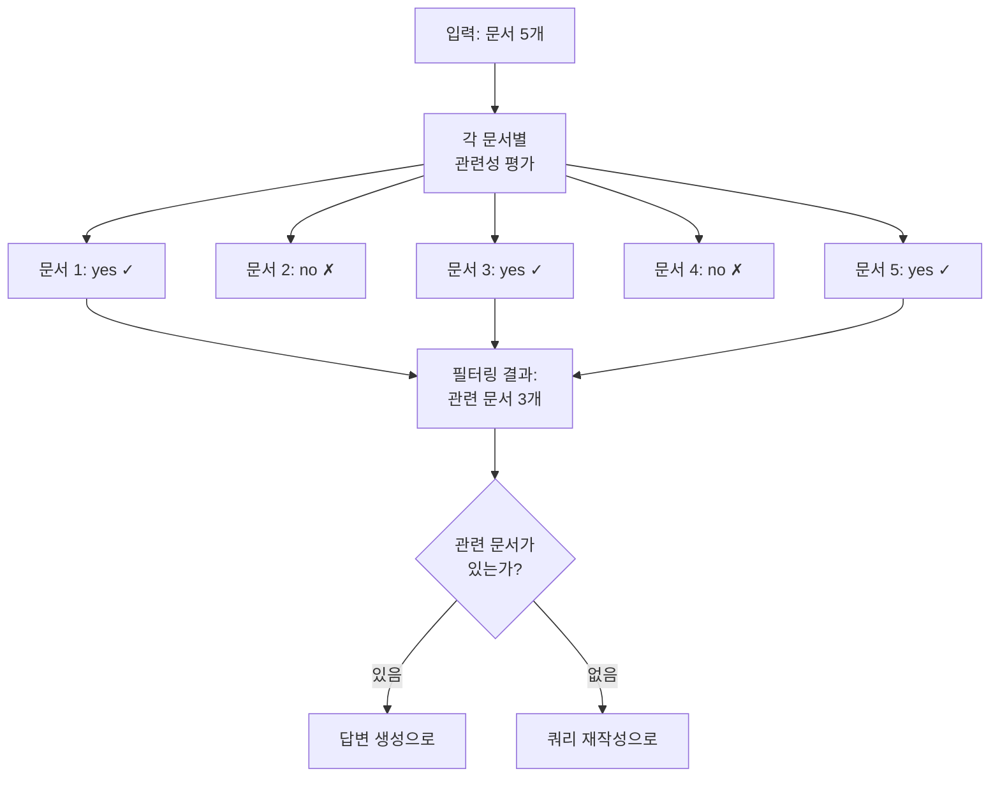
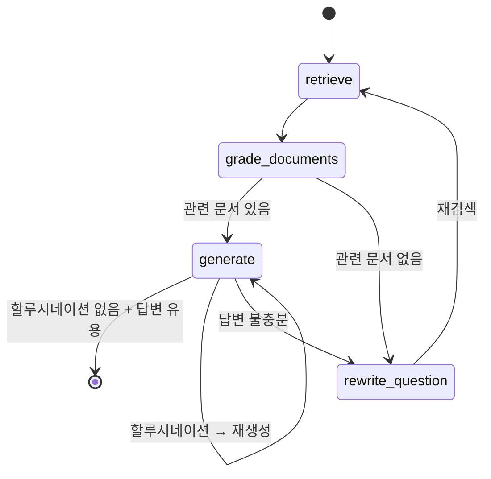

# 검색 결과 평가와 필터링

> LLM 기반 관련성 평가(Grading)로 검색 품질을 판단하고, 할루시네이션을 검출하며, 재검색 루프를 구현합니다.

## 개요

이 섹션에서는 Agentic RAG의 핵심 차별점인 **검색 결과 평가(Grading)** 시스템을 학습합니다. 앞서 [RAG에서 Agentic RAG로](12-ch12-agentic-rag-에이전트가-검색을-도구로-활용/01-01-rag에서-agentic-rag로.md)에서 에이전트가 검색 여부를 자율 판단하는 그래프를 만들었고, [검색 도구 구축](12-ch12-agentic-rag-에이전트가-검색을-도구로-활용/02-02-검색-도구-구축.md)에서 벡터 검색, BM25, 웹 검색 도구를 구현했습니다. 이번에는 검색된 문서가 **진짜 쓸모 있는지** 판단하고, 생성된 답변이 **사실에 기반하는지** 검증하는 3단계 평가 파이프라인을 구축합니다.

**선수 지식**: LangGraph StateGraph 기본 구조([Ch4](04-ch4-langgraph-stategraph-기초/01-01-langgraph-아키텍처-개관.md)), 조건부 엣지([Ch5](05-ch5-조건-분기와-동적-라우팅/01-01-조건부-엣지의-이해.md))

**학습 목표**:
- Pydantic 모델로 LLM의 평가 출력을 구조화할 수 있다
- 문서 관련성, 할루시네이션, 답변 품질의 3단계 평가를 구현할 수 있다
- 평가 결과에 따라 재검색/재생성을 트리거하는 조건 분기를 설계할 수 있다

## 왜 알아야 할까?

검색 도구가 아무리 좋아도, 가져온 문서가 질문과 무관하면 **쓰레기가 들어가서 쓰레기가 나오는**(Garbage In, Garbage Out) 상황이 벌어집니다. 전통적 RAG는 이런 상황에서도 묵묵히 답변을 생성하죠 — 결과는 그럴듯하지만 엉뚱한 할루시네이션입니다.

실무에서 이런 일은 생각보다 자주 일어납니다. 사내 문서 검색 시스템에서 "2025년 매출 목표"를 물었는데 "2023년 매출 실적" 문서가 반환되는 경우, 벡터 유사도는 높지만 실제로는 전혀 다른 정보인 거죠. 사람이라면 즉시 "이건 내가 원하는 게 아닌데?" 하고 다시 검색하겠지만, 기존 RAG는 그런 판단 없이 바로 답변을 생성합니다.

Agentic RAG의 **평가(Grading)** 시스템은 바로 이 "사람의 판단"을 자동화합니다. 문서를 가져온 뒤 "이게 진짜 관련 있어?"라고 LLM에게 물어보고, 답변을 생성한 뒤 "이거 지어낸 거 아니야?"라고 다시 확인하는 겁니다. 이 이중 검증이 프로덕션 RAG의 신뢰도를 극적으로 높여줍니다.

## 핵심 개념

### 개념 1: 3단계 평가 파이프라인

> 💡 **비유**: 신문 기사가 발행되기 전의 편집 과정을 떠올려보세요. 먼저 **취재 데스크**가 수집된 자료가 기사 주제와 관련 있는지 확인합니다(관련성 평가). 다음으로 **팩트 체크팀**이 기사 내용이 자료에 근거하는지 검증합니다(할루시네이션 검출). 마지막으로 **편집장**이 기사가 독자의 질문에 실제로 답하는지 판단합니다(답변 품질 평가). 어느 단계에서든 문제가 발견되면 "다시 취재해 와"라고 되돌립니다.

Agentic RAG의 평가 파이프라인도 정확히 이 3단계로 구성됩니다:

1. **관련성 평가(Relevance Grading)**: 검색된 각 문서가 질문과 관련 있는지 판단
2. **할루시네이션 검출(Hallucination Check)**: 생성된 답변이 검색 문서에 근거하는지 확인
3. **답변 품질 평가(Answer Grading)**: 답변이 원래 질문에 실제로 답하는지 검증

> 📊 **그림 1**: 3단계 평가 파이프라인 흐름



이 파이프라인의 핵심은 **각 단계가 독립적인 LLM 호출**이라는 점입니다. 검색, 생성, 평가가 모두 분리되어 있어서 어느 단계에서든 "되돌리기"가 가능합니다. 이것이 LangGraph의 순환 그래프(cyclic graph)가 빛나는 지점이죠.

### 개념 2: Pydantic으로 평가 출력 구조화하기

> 💡 **비유**: 시험 채점 시 "이 답이 맞나 틀리나" 같은 자유 서술보다, OMR 카드처럼 O/X로 찍는 게 기계가 처리하기 쉽겠죠? Structured Output이 바로 그 OMR 카드 역할입니다.

LLM에게 "이 문서가 관련 있어?"라고 물으면 자유 텍스트로 장황하게 답할 수 있습니다. 하지만 코드에서 이걸 파싱하기는 곤란하죠. Pydantic 모델을 사용하면 LLM이 **정확히 우리가 원하는 형식**으로만 응답하게 강제할 수 있습니다.

```python
from pydantic import BaseModel, Field


# 1단계: 문서 관련성 평가
class GradeDocuments(BaseModel):
    """검색된 문서가 질문과 관련 있는지 이진 판정"""
    binary_score: str = Field(
        description="문서가 질문과 관련 있으면 'yes', 없으면 'no'"
    )


# 2단계: 할루시네이션 검출
class GradeHallucinations(BaseModel):
    """생성된 답변이 검색 문서에 근거하는지 이진 판정"""
    binary_score: str = Field(
        description="답변이 문서에 근거하면 'yes', 근거 없으면 'no'"
    )


# 3단계: 답변 품질 평가
class GradeAnswer(BaseModel):
    """답변이 질문에 실제로 답하는지 이진 판정"""
    binary_score: str = Field(
        description="답변이 질문을 해결하면 'yes', 아니면 'no'"
    )
```

세 모델이 모두 `binary_score` 필드 하나만 가지고 있다는 점에 주목하세요. 복잡한 점수 체계 대신 단순한 yes/no 판정이 실무에서 훨씬 안정적입니다. LLM은 0~10 점수보다 이진 판단에서 일관성이 높거든요.

이처럼 LLM의 출력을 Pydantic 모델로 강제하는 것을 **Structured Output**이라고 합니다. LangChain에서는 `llm.with_structured_output(PydanticModel)` 메서드로 간단히 구현할 수 있는데, 내부적으로는 OpenAI의 Function Calling이나 Tool Calling을 활용합니다. 이 메커니즘의 동작 원리는 [Ch19. 가드레일과 Structured Output](19-ch19-가드레일과-structured-output/03-03-structured-output-기초.md)에서 더 깊이 다루니 참고하세요.

> 📊 **그림 2**: 세 가지 Grader 모델의 역할



### 개념 3: 관련성 평가 — Retrieval Grader 구현

> 💡 **비유**: 도서관 사서에게 "인공지능 윤리에 대한 책 찾아주세요"라고 했는데, 사서가 "인공지능 역사" 책을 가져왔다면? 주제는 비슷하지만 여러분이 원하는 건 아닙니다. 좋은 사서라면 "이 책이 요청하신 내용과 맞나요?" 한 번 더 확인하겠죠. Retrieval Grader가 바로 그 확인 과정입니다.

관련성 평가는 검색된 **각 문서를 개별적으로** 채점합니다. 5개 문서가 검색되었다면 5번의 평가가 이루어지고, 관련 있는 문서만 필터링되어 답변 생성에 사용됩니다.

```python
from langchain_openai import ChatOpenAI
from langchain_core.prompts import ChatPromptTemplate

# 평가용 LLM (빠르고 저렴한 모델 사용)
grader_llm = ChatOpenAI(model="gpt-4o-mini", temperature=0)

# 관련성 평가 체인
relevance_prompt = ChatPromptTemplate.from_messages([
    ("system", 
     "당신은 검색된 문서가 사용자 질문과 관련 있는지 평가하는 채점관입니다.\n"
     "문서에 질문과 관련된 키워드나 의미가 포함되어 있으면 'yes',\n"
     "그렇지 않으면 'no'로 판정하세요. 엄격하게 평가하세요."),
    ("human", 
     "검색된 문서:\n\n{document}\n\n사용자 질문: {question}"),
])

# with_structured_output으로 Pydantic 모델 강제
retrieval_grader = relevance_prompt | grader_llm.with_structured_output(
    GradeDocuments
)
```

```run:python
# 사용 예시
question = "LangGraph에서 체크포인트는 어떻게 동작하나요?"

# 관련 있는 문서
relevant_doc = "LangGraph의 체크포인트 시스템은 그래프 실행의 각 단계에서 상태를 자동으로 저장합니다."
result = retrieval_grader.invoke({"question": question, "document": relevant_doc})
print(f"관련 문서 평가: {result.binary_score}")

# 관련 없는 문서
irrelevant_doc = "FastAPI는 Python으로 API를 빠르게 구축할 수 있는 웹 프레임워크입니다."
result = retrieval_grader.invoke({"question": question, "document": irrelevant_doc})
print(f"무관 문서 평가: {result.binary_score}")
```

```output
관련 문서 평가: yes
무관 문서 평가: no
```

여기서 핵심은 `with_structured_output(GradeDocuments)`입니다. 이렇게 하면 LLM이 `GradeDocuments` 스키마에 맞는 JSON만 반환하도록 강제됩니다. 내부적으로는 OpenAI의 Function Calling 또는 Tool Calling을 사용하죠 — 이 메커니즘은 [LLM Tool Calling 메커니즘](01-ch1-llm-도구-호출의-이해/02-02-llm-tool-calling-메커니즘.md)에서 이미 배웠습니다.

### 개념 4: 할루시네이션 검출 — Hallucination Grader

> 💡 **비유**: 학생이 레포트를 제출했는데, 교수가 "이 내용이 참고 문헌에 실제로 있는 건가?"라고 확인하는 과정입니다. 학생(LLM)이 참고 문헌(검색 문서) 없이 자기 머릿속에서 지어낸 내용이 있다면, 그건 표절이 아니라 **날조**죠. 할루시네이션 검출이 바로 이 "참고 문헌 대조" 작업입니다.

```python
# 할루시네이션 평가 체인
hallucination_prompt = ChatPromptTemplate.from_messages([
    ("system",
     "당신은 LLM 생성 답변이 검색된 문서 집합에 근거하는지 평가하는 채점관입니다.\n"
     "답변의 핵심 주장이 문서에서 뒷받침되면 'yes',\n"
     "문서에 없는 정보를 포함하면 'no'로 판정하세요."),
    ("human",
     "검색된 문서:\n\n{documents}\n\n생성된 답변: {generation}"),
])

hallucination_grader = hallucination_prompt | grader_llm.with_structured_output(
    GradeHallucinations
)
```

관련성 평가와 다른 점에 주의하세요. 관련성 평가는 **문서 vs 질문**을 비교하지만, 할루시네이션 검출은 **답변 vs 문서**를 비교합니다. 입력이 완전히 다릅니다.

> 📊 **그림 3**: 관련성 평가 vs 할루시네이션 검출의 비교 입력



### 개념 5: 답변 품질 평가 — Answer Grader

답변이 할루시네이션 없이 문서에 근거하더라도, 정작 **원래 질문에 답하지 않는** 경우가 있습니다. "파이썬 리스트 정렬 방법"을 물었는데, 검색 문서에 리스트 생성 방법만 있어서 "리스트는 대괄호로 만듭니다"라고 답한다면? 문서에 근거하긴 했지만, 질문에 답하지는 않았죠.

```python
# 답변 품질 평가 체인
answer_prompt = ChatPromptTemplate.from_messages([
    ("system",
     "당신은 생성된 답변이 사용자 질문을 실제로 해결하는지 평가하는 채점관입니다.\n"
     "답변이 질문의 핵심을 다루고 유용한 정보를 제공하면 'yes',\n"
     "질문과 동떨어지거나 불충분하면 'no'로 판정하세요."),
    ("human",
     "사용자 질문: {question}\n\n생성된 답변: {generation}"),
])

answer_grader = answer_prompt | grader_llm.with_structured_output(
    GradeAnswer
)
```

### 개념 6: LangGraph 노드로 평가 로직 조립하기

> 💡 **비유**: 자동차 공장의 품질 관리(QC) 라인을 떠올려보세요. 부품이 조립되면 검사대를 거치고, 불량이면 다시 조립 라인으로 보내고, 합격이면 다음 공정으로 넘깁니다. LangGraph의 노드와 조건 엣지가 바로 이 QC 라인 역할입니다.

이제 앞서 만든 Grader들을 LangGraph 노드 함수로 조립합니다. 핵심은 `grade_documents` 노드가 **필터링 + 라우팅**을 동시에 수행한다는 것입니다.

```python
from typing import TypedDict, Annotated, Literal
from langgraph.graph import StateGraph, START, END
from langgraph.graph.message import add_messages


class AgenticRAGState(TypedDict):
    """Agentic RAG 상태 스키마"""
    question: str                   # 사용자 질문
    documents: list[str]            # 검색된 문서들
    generation: str                 # 생성된 답변
    retry_count: int                # 재시도 횟수 (무한 루프 방지)


def grade_documents(state: AgenticRAGState) -> AgenticRAGState:
    """검색된 문서의 관련성을 개별 평가하고 필터링"""
    question = state["question"]
    documents = state["documents"]
    
    filtered_docs = []
    for doc in documents:
        # 각 문서를 개별 평가
        score = retrieval_grader.invoke(
            {"question": question, "document": doc}
        )
        if score.binary_score == "yes":
            filtered_docs.append(doc)
    
    return {
        "documents": filtered_docs,
        "question": question,
    }
```

> 📊 **그림 4**: grade_documents 노드의 내부 동작



필터링 결과에 따른 라우팅은 **조건부 엣지** 함수로 분리합니다:

```python
def decide_to_generate(state: AgenticRAGState) -> Literal["generate", "rewrite"]:
    """필터링된 문서가 있으면 생성, 없으면 재작성"""
    if state["documents"]:
        return "generate"
    return "rewrite"


def check_hallucination(state: AgenticRAGState) -> Literal["useful", "not_supported"]:
    """답변이 문서에 근거하는지 확인"""
    score = hallucination_grader.invoke({
        "documents": "\n\n".join(state["documents"]),
        "generation": state["generation"],
    })
    if score.binary_score == "yes":
        return "useful"
    return "not_supported"


def check_answer_quality(state: AgenticRAGState) -> Literal["done", "rewrite"]:
    """답변이 질문을 해결하는지 확인"""
    score = answer_grader.invoke({
        "question": state["question"],
        "generation": state["generation"],
    })
    if score.binary_score == "yes":
        return "done"
    return "rewrite"
```

## 실습: 직접 해보기

3단계 평가가 포함된 완전한 Agentic RAG 그래프를 구축합니다. 이 코드는 실행 가능한 전체 파이프라인입니다.

```python
"""3단계 평가 파이프라인이 포함된 Agentic RAG 그래프"""

from typing import TypedDict, Literal
from pydantic import BaseModel, Field
from langchain_openai import ChatOpenAI, OpenAIEmbeddings
from langchain_core.prompts import ChatPromptTemplate
from langchain_community.vectorstores import FAISS
from langgraph.graph import StateGraph, START, END

# ── 1. LLM 설정 ──
llm = ChatOpenAI(model="gpt-4o-mini", temperature=0)
embeddings = OpenAIEmbeddings(model="text-embedding-3-small")


# ── 2. Pydantic 평가 모델 ──
class GradeDocuments(BaseModel):
    """문서 관련성 이진 판정"""
    binary_score: str = Field(
        description="문서가 질문과 관련 있으면 'yes', 없으면 'no'"
    )

class GradeHallucinations(BaseModel):
    """할루시네이션 이진 판정"""
    binary_score: str = Field(
        description="답변이 문서에 근거하면 'yes', 근거 없으면 'no'"
    )

class GradeAnswer(BaseModel):
    """답변 품질 이진 판정"""
    binary_score: str = Field(
        description="답변이 질문을 해결하면 'yes', 아니면 'no'"
    )


# ── 3. 평가 체인 구성 ──
retrieval_grader = (
    ChatPromptTemplate.from_messages([
        ("system", "검색된 문서가 질문과 관련 있는지 평가하세요. "
                   "관련 있으면 'yes', 없으면 'no'."),
        ("human", "문서:\n{document}\n\n질문: {question}"),
    ])
    | llm.with_structured_output(GradeDocuments)
)

hallucination_grader = (
    ChatPromptTemplate.from_messages([
        ("system", "답변이 문서에 근거하는지 평가하세요. "
                   "근거하면 'yes', 아니면 'no'."),
        ("human", "문서:\n{documents}\n\n답변: {generation}"),
    ])
    | llm.with_structured_output(GradeHallucinations)
)

answer_grader = (
    ChatPromptTemplate.from_messages([
        ("system", "답변이 질문을 해결하는지 평가하세요. "
                   "해결하면 'yes', 아니면 'no'."),
        ("human", "질문: {question}\n\n답변: {generation}"),
    ])
    | llm.with_structured_output(GradeAnswer)
)


# ── 4. 샘플 벡터 스토어 ──
sample_docs = [
    "LangGraph의 체크포인트 시스템은 그래프 실행의 각 슈퍼스텝에서 상태를 자동 저장합니다.",
    "SQLite 체크포인터를 사용하면 실행 상태를 디스크에 영속화할 수 있습니다.",
    "타임 트래블 기능으로 이전 체크포인트로 되돌아가 다른 경로를 탐색할 수 있습니다.",
    "FastAPI는 Python으로 REST API를 빠르게 구축하는 웹 프레임워크입니다.",
    "Docker 컨테이너는 애플리케이션을 격리된 환경에서 실행합니다.",
]
vectorstore = FAISS.from_texts(sample_docs, embeddings)
retriever = vectorstore.as_retriever(search_kwargs={"k": 3})


# ── 5. 상태 스키마 ──
class RAGState(TypedDict):
    question: str
    documents: list[str]
    generation: str
    retry_count: int


# ── 6. 노드 함수 ──
# 평가-재검색 루프의 무한 반복을 방지하는 상한선.
# 다음 섹션(자기교정 RAG 구현)에서 이 상수를 그대로 재사용하며,
# 별도의 MAX_GENERATIONS 상수가 추가됩니다.
MAX_RETRIES = 2

def retrieve(state: RAGState) -> RAGState:
    """벡터 스토어에서 문서 검색"""
    docs = retriever.invoke(state["question"])
    return {"documents": [doc.page_content for doc in docs]}

def grade_documents(state: RAGState) -> RAGState:
    """각 문서의 관련성을 평가하고 필터링"""
    question = state["question"]
    filtered = []
    for doc in state["documents"]:
        score = retrieval_grader.invoke(
            {"question": question, "document": doc}
        )
        if score.binary_score == "yes":
            filtered.append(doc)
    return {"documents": filtered}

def generate(state: RAGState) -> RAGState:
    """필터링된 문서를 기반으로 답변 생성"""
    context = "\n\n".join(state["documents"])
    prompt = (
        f"다음 문서를 참고하여 질문에 답하세요.\n\n"
        f"문서:\n{context}\n\n"
        f"질문: {state['question']}"
    )
    response = llm.invoke(prompt)
    return {"generation": response.content}

def rewrite_question(state: RAGState) -> RAGState:
    """질문을 더 구체적으로 재작성"""
    prompt = (
        f"아래 질문으로 적절한 검색 결과를 얻지 못했습니다. "
        f"같은 의도를 유지하면서 더 구체적으로 재작성하세요.\n\n"
        f"원래 질문: {state['question']}"
    )
    response = llm.invoke(prompt)
    return {
        "question": response.content,
        "retry_count": state.get("retry_count", 0) + 1,
    }


# ── 7. 라우팅 함수 ──
def decide_to_generate(state: RAGState) -> Literal["generate", "rewrite"]:
    """관련 문서가 있으면 생성, 없으면 재작성"""
    if state["documents"]:
        return "generate"
    return "rewrite"

def check_generation(state: RAGState) -> Literal["done", "retry_generate", "rewrite"]:
    """할루시네이션 + 답변 품질을 순차 검증"""
    # 재시도 횟수 초과 시 강제 종료
    if state.get("retry_count", 0) >= MAX_RETRIES:
        return "done"
    
    # 할루시네이션 검출
    hallucination = hallucination_grader.invoke({
        "documents": "\n\n".join(state["documents"]),
        "generation": state["generation"],
    })
    if hallucination.binary_score == "no":
        return "retry_generate"  # 재생성
    
    # 답변 품질 평가
    answer = answer_grader.invoke({
        "question": state["question"],
        "generation": state["generation"],
    })
    if answer.binary_score == "yes":
        return "done"
    return "rewrite"  # 쿼리 재작성 후 재검색


# ── 8. 그래프 구성 ──
workflow = StateGraph(RAGState)

# 노드 등록
workflow.add_node("retrieve", retrieve)
workflow.add_node("grade_documents", grade_documents)
workflow.add_node("generate", generate)
workflow.add_node("rewrite_question", rewrite_question)

# 엣지 연결
workflow.add_edge(START, "retrieve")
workflow.add_edge("retrieve", "grade_documents")
workflow.add_conditional_edges(
    "grade_documents",
    decide_to_generate,
    {"generate": "generate", "rewrite": "rewrite_question"},
)
workflow.add_conditional_edges(
    "generate",
    check_generation,
    {
        "done": END,
        "retry_generate": "generate",
        "rewrite": "rewrite_question",
    },
)
workflow.add_edge("rewrite_question", "retrieve")

# 컴파일
graph = workflow.compile()
```

> 📊 **그림 5**: 완성된 Agentic RAG 그래프 구조



이제 그래프를 실행해봅시다:

```run:python
# 그래프 실행
result = graph.invoke({
    "question": "LangGraph에서 체크포인트는 어떻게 동작하나요?",
    "documents": [],
    "generation": "",
    "retry_count": 0,
})

print(f"질문: {result['question']}")
print(f"사용된 문서 수: {len(result['documents'])}")
print(f"답변: {result['generation'][:200]}...")
print(f"재시도 횟수: {result['retry_count']}")
```

```output
질문: LangGraph에서 체크포인트는 어떻게 동작하나요?
사용된 문서 수: 3
답변: LangGraph의 체크포인트 시스템은 그래프 실행의 각 슈퍼스텝에서 상태를 자동으로 저장합니다. SQLite 체크포인터를 사용하면 이 상태를 디스크에 영속화할 수 있으며, 타임 트래블 기능을 통해 이전 체크포인트로 되돌아가 다른 실행 경로를 탐색할 수 있습니다...
재시도 횟수: 0
```

## 더 깊이 알아보기

### Self-RAG와 CRAG — 두 논문의 탄생 이야기

검색 결과 평가라는 아이디어는 2023~2024년에 발표된 두 편의 논문에서 체계화되었습니다.

**Self-RAG** (Asai et al., 2023)은 워싱턴 대학교의 Akari Asai가 주도한 연구입니다. 흥미로운 점은 이 논문의 출발점이 "RAG가 왜 가끔 더 나쁜 결과를 내는가?"라는 질문이었다는 것입니다. 기존 RAG는 무조건 검색을 수행하는데, 검색 결과가 오히려 노이즈가 되어 LLM을 혼란시키는 경우가 있었거든요. Self-RAG는 이를 해결하기 위해 `[Retrieve]`, `[ISSUP]`(Is Supported), `[ISUSE]`(Is Useful) 같은 **반성 토큰(reflection token)**을 도입했습니다. LLM이 스스로 "지금 검색이 필요한가?", "이 답변이 근거 있는가?"를 판단하는 메커니즘이죠.

**CRAG**(Corrective RAG, Yan et al., 2024)는 이 아이디어를 더 실용적으로 발전시켰습니다. CRAG는 검색 결과의 신뢰도를 {Correct, Incorrect, Ambiguous} 세 등급으로 나누고, Incorrect일 때는 웹 검색으로 대체하고, Ambiguous일 때는 문서의 핵심 부분만 추출하는 **지식 정제(knowledge refinement)** 단계를 추가했습니다.

LangGraph 튜토리얼의 Adaptive RAG는 이 두 논문의 아이디어를 결합합니다. Self-RAG의 자기 평가 + CRAG의 교정 검색을 LangGraph의 순환 그래프로 우아하게 구현한 것이죠.

### 왜 "이진 판정"인가?

처음 이 패턴을 접하면 "점수를 0~10으로 매기면 더 정밀하지 않나?"라고 생각할 수 있습니다. 실제로 초기 연구들은 다양한 점수 체계를 실험했는데, 흥미롭게도 **단순한 yes/no가 가장 안정적**이었습니다. 그 이유는 LLM이 "7점짜리 관련성"과 "6점짜리 관련성"을 일관되게 구분하지 못하기 때문입니다. 반면 "관련 있다/없다"의 이진 판단은 재현성이 훨씬 높았습니다. 이것은 인간 평가에서도 비슷한데, 평가자 간 일치도(Inter-Annotator Agreement)는 세밀한 척도일수록 떨어지거든요.

## 흔한 오해와 팁

> ⚠️ **흔한 오해**: "평가용 LLM은 생성용 LLM과 같은 모델이어야 한다"고 생각하는 분들이 많습니다. 사실 평가(Grading)는 단순 이진 판정이므로 `gpt-4o-mini` 같은 작고 빠른 모델로 충분합니다. 생성은 `gpt-4o`를, 평가는 `gpt-4o-mini`를 사용하면 비용을 크게 절약하면서 동일한 품질을 유지할 수 있습니다. 문서 5개를 개별 평가하면 5번의 LLM 호출이 추가되므로, 비용 최적화가 중요합니다.

> 💡 **알고 계셨나요?**: LangGraph 공식 문서의 Agentic RAG 튜토리얼에서는 `grade_documents`를 **조건부 엣지 함수**로 직접 사용합니다. 즉 별도 노드 없이 라우팅 함수가 평가와 분기를 동시에 수행하죠. 하지만 프로덕션에서는 노드를 분리하는 것이 디버깅과 LangSmith 트레이싱에 훨씬 유리합니다. 각 노드의 입출력을 독립적으로 관찰할 수 있으니까요.

> 🔥 **실무 팁**: 재시도 횟수에 반드시 **상한선(MAX_RETRIES)**을 두세요. 평가 → 재검색 → 평가 루프가 무한 반복되면 비용이 폭발합니다. 실무에서는 2~3회가 적정선이며, 초과 시 "충분한 정보를 찾지 못했습니다"라는 정직한 응답을 반환하는 것이 할루시네이션보다 낫습니다. 또한 `retry_count`를 상태에 포함시켜 LangSmith에서 몇 번 재시도했는지 추적할 수 있게 하세요. 다음 섹션의 자기교정 RAG에서는 이 `MAX_RETRIES`를 그대로 재사용하면서, 생성 단계의 반복 횟수를 별도로 제어하는 `MAX_GENERATIONS` 상수가 추가됩니다.

## 핵심 정리

| 개념 | 설명 |
|------|------|
| GradeDocuments | 검색 문서의 질문 관련성을 yes/no로 판정하는 Pydantic 모델 |
| GradeHallucinations | 생성 답변이 문서에 근거하는지 yes/no로 판정 |
| GradeAnswer | 답변이 질문을 해결하는지 yes/no로 판정 |
| `with_structured_output()` | LLM 출력을 Pydantic 스키마로 강제하는 LangChain 메서드 |
| 3단계 평가 | 관련성 → 할루시네이션 → 답변 품질 순차 검증 |
| 조건부 라우팅 | 평가 결과에 따라 생성/재생성/재검색을 분기 |
| MAX_RETRIES | 평가-재검색 루프의 무한 반복을 방지하는 상한선 (다음 섹션에서 재사용) |
| Self-RAG | 반성 토큰으로 검색 필요성과 답변 품질을 자기 평가하는 논문(Asai et al., 2023) |
| CRAG | 검색 결과를 Correct/Incorrect/Ambiguous로 분류하고 교정하는 논문(Yan et al., 2024) |

## 다음 섹션 미리보기

이번 섹션에서 구축한 3단계 평가 시스템은 "문제를 발견하면 되돌린다"는 수동적 교정이었습니다. 다음 [자기교정 RAG 구현](12-ch12-agentic-rag-에이전트가-검색을-도구로-활용/04-04-자기교정-rag-구현.md)에서는 한 발 더 나아가, 에이전트가 **스스로 쿼리를 분석하고, 검색 전략을 선택하며, 답변을 반복 개선하는** Self-Corrective RAG 파이프라인을 완성합니다. 이번 섹션의 `MAX_RETRIES`를 그대로 가져가면서, 생성 루프를 별도로 제어하는 `MAX_GENERATIONS` 상수가 새로 등장합니다. 쿼리 변환(Query Transformation), 웹 검색 폴백, 반복적 자기교정까지 — Corrective RAG의 전체 그림을 구현합니다.

## 참고 자료

- [LangGraph Agentic RAG 공식 가이드](https://docs.langchain.com/oss/python/langgraph/agentic-rag) - LangGraph로 구축하는 Agentic RAG의 공식 튜토리얼. grade_documents 패턴의 원본
- [LangGraph Adaptive RAG 튜토리얼](https://langchain-ai.github.io/langgraph/tutorials/rag/langgraph_adaptive_rag/) - Self-RAG + CRAG를 결합한 Adaptive RAG의 전체 구현 코드
- [Self-RAG: Learning to Retrieve, Generate, and Critique through Self-Reflection (Asai et al., 2023)](https://arxiv.org/abs/2310.11511) - 반성 토큰 기반 자기 평가 RAG의 원본 논문
- [Corrective Retrieval Augmented Generation (Yan et al., 2024)](https://arxiv.org/abs/2401.15884) - 검색 결과 평가와 교정 검색의 원본 논문
- [Self-Reflective RAG with LangGraph — LangChain Blog](https://blog.langchain.com/agentic-rag-with-langgraph/) - Self-RAG와 CRAG를 LangGraph로 구현하는 아키텍처 해설

---
### 🔗 Related Sessions
- [stategraph](04-ch4-langgraph-stategraph-기초/01-01-langgraph-아키텍처-개관.md) (prerequisite)
- [toolnode](04-ch4-langgraph-stategraph-기초/05-05-첫-번째-langgraph-에이전트.md) (prerequisite)
- [structured_output](19-ch19-가드레일과-structured-output/03-03-structured-output-기초.md) (prerequisite)
- [tools_condition](04-ch4-langgraph-stategraph-기초/05-05-첫-번째-langgraph-에이전트.md) (prerequisite)
- [create_retriever_tool](12-ch12-agentic-rag-에이전트가-검색을-도구로-활용/01-01-rag에서-agentic-rag로.md) (prerequisite)
- [agentic_rag](12-ch12-agentic-rag-에이전트가-검색을-도구로-활용/01-01-rag에서-agentic-rag로.md) (prerequisite)
