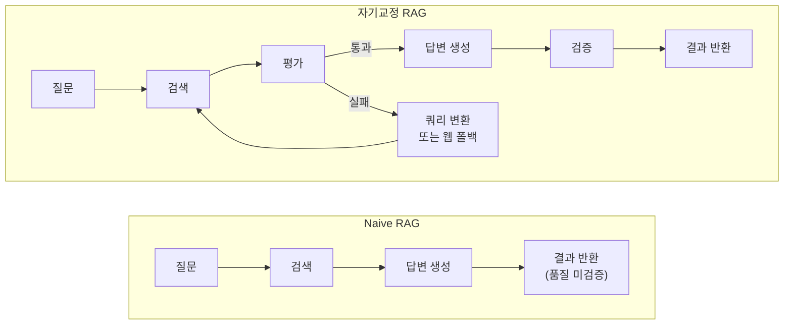
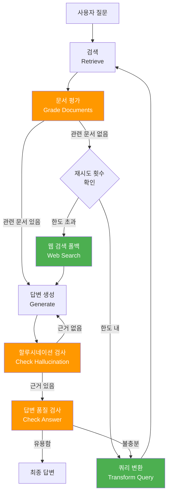
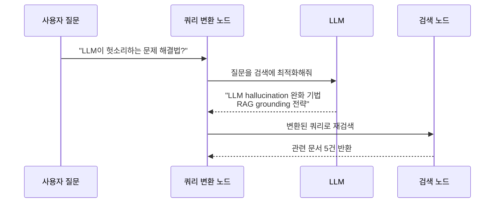
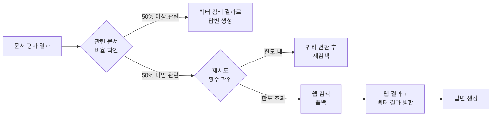
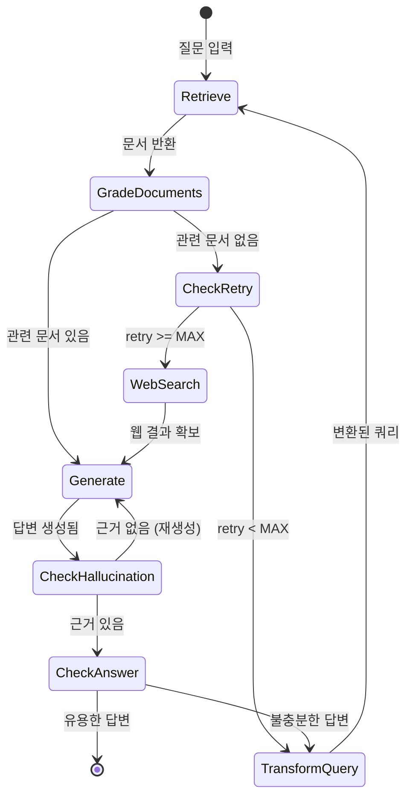
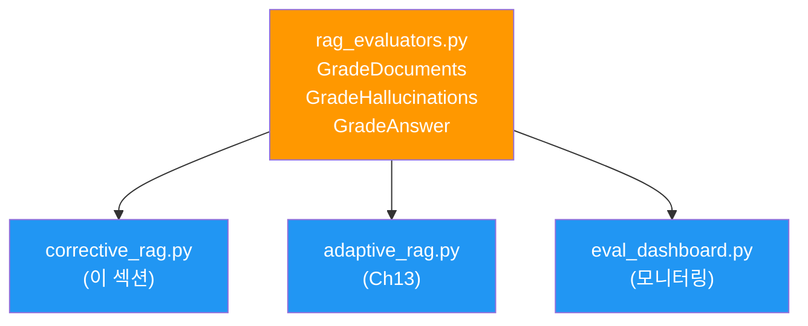

# 자기교정 RAG 구현

> Corrective RAG 패턴으로 검색→평가→수정 루프, 웹 검색 폴백, 쿼리 변환을 통합한 자기교정 RAG 파이프라인을 구축합니다.

## 개요

이 섹션에서는 앞서 배운 검색 도구([01. RAG에서 Agentic RAG로](12-ch12-agentic-rag-에이전트가-검색을-도구로-활용/01-01-rag에서-agentic-rag로.md))와 평가 시스템([03. 검색 결과 평가와 필터링](12-ch12-agentic-rag-에이전트가-검색을-도구로-활용/03-03-검색-결과-평가와-필터링.md))을 하나의 완전한 자기교정 파이프라인으로 통합합니다. Corrective RAG(CRAG) 논문의 핵심 아이디어를 LangGraph StateGraph로 구현하여, 에이전트가 **스스로 검색 품질을 판단하고, 부족하면 쿼리를 변환하거나 웹 검색으로 폴백하는** 자율적 교정 루프를 만듭니다.

**선수 지식**:
- [03. 검색 결과 평가와 필터링](12-ch12-agentic-rag-에이전트가-검색을-도구로-활용/03-03-검색-결과-평가와-필터링.md)의 평가 모듈(GradeDocuments, GradeHallucinations, GradeAnswer)
- [05. 조건 분기와 동적 라우팅](05-ch5-조건-분기와-동적-라우팅/01-01-조건부-엣지의-이해.md)의 조건부 엣지
- [02. 검색 도구 구축](12-ch12-agentic-rag-에이전트가-검색을-도구로-활용/02-02-검색-도구-구축.md)의 벡터 검색·웹 검색 도구

**학습 목표**:
- CRAG 논문의 핵심 아이디어(검색 평가 → 교정 행동)를 설명할 수 있다
- 쿼리 변환(Query Transformation) 노드를 구현할 수 있다
- 기존 평가 모듈을 재사용하여 자기교정 그래프를 구축할 수 있다
- 최대 반복 제한으로 무한 루프를 방지할 수 있다

## 왜 알아야 할까?

실제 프로덕션 RAG 시스템을 운영하다 보면, **한 번의 검색으로 항상 좋은 결과가 나오지 않는다**는 걸 금방 깨닫게 됩니다. 사용자가 모호한 질문을 하거나, 벡터 DB에 관련 문서가 부족하거나, 검색 결과가 질문의 의도와 어긋날 수 있죠.

사람이라면 어떻게 할까요? 도서관에서 책을 찾았는데 원하는 내용이 아니면, **검색어를 바꿔보거나**, **다른 서가로 가거나**, **아예 인터넷을 검색**하겠죠. 자기교정 RAG는 바로 이 인간의 자연스러운 정보 탐색 패턴을 에이전트에 구현한 것입니다.

LangChain 공식 블로그에서도 이 패턴을 "Self-Reflective RAG"라고 부르며, RAG의 실질적인 정확도를 크게 높이는 핵심 전략으로 소개하고 있습니다. 단순히 "검색해서 답변"하는 Naive RAG를 넘어, **검색 품질을 스스로 점검하고 교정하는 시스템**을 구축할 수 있다면, 프로덕션 RAG의 신뢰도는 한 단계 올라갑니다.

> 📊 **그림 1**: Naive RAG vs 자기교정 RAG — 실패 시 대응 차이



## 핵심 개념

### 개념 1: Corrective RAG(CRAG) 아키텍처

> 💡 **비유**: 자기교정 RAG는 **편집자가 있는 뉴스룸**과 같습니다. 기자(검색)가 자료를 가져오면, 편집자(평가자)가 검토합니다. 자료가 부실하면 "이 각도로 다시 취재해 와"(쿼리 변환)라고 하거나, "외부 통신사 기사를 써"(웹 검색 폴백)라고 지시하죠. 최종 기사(답변)도 팩트체크(할루시네이션 검출)를 거칩니다.

CRAG(Corrective Retrieval Augmented Generation)는 2024년 Shi-Qi Yan 등이 발표한 논문에서 제안한 패턴입니다. 핵심 아이디어는 단순합니다 — **검색 결과를 맹목적으로 신뢰하지 말고, 평가한 뒤 교정 행동을 취하자.**

CRAG는 검색 결과를 세 가지로 분류하고, 각 분류에 따라 서로 다른 교정 행동을 수행합니다:

| 평가 결과 | 교정 행동 | 설명 |
|-----------|----------|------|
| **Correct** (관련성 높음) | 정제 후 생성 | 관련 정보만 추출(Decompose-Then-Recompose)하여 노이즈를 제거한 뒤 답변 생성 |
| **Incorrect** (관련성 없음) | 웹 검색 폴백 | 벡터 DB 대신 웹에서 최신 정보를 검색하여 완전히 새로운 컨텍스트로 답변 생성 |
| **Ambiguous** (애매함) | 두 소스 병합 | 벡터 검색의 정제된 결과와 웹 검색 결과를 모두 활용하여 답변의 커버리지를 극대화 |

여기서 중요한 점은 **평가 모듈을 새로 만들 필요가 없다**는 것입니다. [이전 섹션](12-ch12-agentic-rag-에이전트가-검색을-도구로-활용/03-03-검색-결과-평가와-필터링.md)에서 구축한 `GradeDocuments`, `GradeHallucinations`, `GradeAnswer`가 바로 CRAG의 평가자 역할을 합니다. 이 섹션에서는 평가 모듈을 **재사용**하면서, **교정 로직(쿼리 변환, 웹 폴백, 루프 제어)**에 집중합니다.

> 📊 **그림 2**: 자기교정 RAG 전체 아키텍처 — 평가 모듈 재사용 구조



> 주황색 노드: [이전 섹션](12-ch12-agentic-rag-에이전트가-검색을-도구로-활용/03-03-검색-결과-평가와-필터링.md)에서 구축한 평가 모듈 재사용 / 초록색 노드: 이 섹션에서 새로 구현하는 교정 로직

```python
from typing import TypedDict, List
from langgraph.graph import StateGraph, START, END

class SelfCorrectiveState(TypedDict):
    """자기교정 RAG의 상태 스키마"""
    question: str                          # 현재 질문 (변환될 수 있음)
    original_question: str                 # 원본 질문 (보존)
    documents: List[str]                   # 검색된 문서들
    generation: str                        # 생성된 답변
    retry_count: int                       # 쿼리 변환 횟수
    generation_count: int                  # 답변 재생성 횟수
    max_retries: int                       # 최대 재시도 제한
```

> ⚠️ **흔한 오해**: "CRAG는 특별한 모델이 필요하다"고 생각하기 쉽지만, 실제로는 **어떤 LLM이든** Structured Output을 지원하면 평가자로 쓸 수 있습니다. CRAG의 핵심은 모델이 아니라 **워크플로우 패턴**에 있습니다.

### 개념 2: 쿼리 변환(Query Transformation)

> 💡 **비유**: 쿼리 변환은 **통역사**와 같습니다. 외국에서 길을 물었는데 상대가 못 알아들으면, 같은 말을 다른 표현으로 바꿔서 다시 말하겠죠. 질문의 **의도는 유지**하면서 **표현을 최적화**하는 것입니다.

검색이 실패하는 가장 흔한 원인은 **사용자 질문과 문서의 어휘 불일치**입니다. 사용자가 "LLM의 환각 문제"라고 물었지만 문서에는 "할루시네이션(hallucination)"이라고 적혀 있다면, 벡터 유사도가 낮게 나올 수 있죠.

쿼리 변환 노드는 LLM에게 **원본 질문을 벡터 검색에 더 적합한 형태로 다시 작성**하도록 요청합니다:

> 📊 **그림 3**: 쿼리 변환의 동작 과정



```python
from langchain_core.prompts import ChatPromptTemplate
from langchain_openai import ChatOpenAI

llm = ChatOpenAI(model="gpt-4o-mini", temperature=0)

# 쿼리 변환 프롬프트
transform_prompt = ChatPromptTemplate.from_messages([
    ("system", 
     "당신은 질문 최적화 전문가입니다. "
     "사용자의 원본 질문을 벡터 검색에 더 적합한 형태로 다시 작성하세요. "
     "질문의 의도는 유지하되, 핵심 키워드를 명확히 하고 "
     "검색 가능한 구체적 용어를 사용하세요. "
     "변환된 질문만 출력하세요."),
    ("human", "원본 질문: {question}")
])

def transform_query(state: SelfCorrectiveState) -> dict:
    """질문을 벡터 검색에 최적화된 형태로 변환"""
    question = state["question"]
    
    chain = transform_prompt | llm
    better_question = chain.invoke({"question": question})
    
    return {
        "question": better_question.content,
        "retry_count": state["retry_count"] + 1
    }
```

쿼리 변환의 핵심 전략은 세 가지입니다:

| 전략 | 설명 | 예시 |
|------|------|------|
| **키워드 명확화** | 모호한 표현을 구체적 기술 용어로 | "AI가 거짓말" → "LLM hallucination" |
| **분해** | 복합 질문을 단일 질문으로 분리 | "A와 B의 차이 및 사용법" → "A vs B 비교" |
| **확장** | 동의어·관련어 추가 | "벡터 DB" → "벡터 데이터베이스 FAISS Chroma 임베딩 저장소" |

### 개념 3: 웹 검색 폴백(Web Search Fallback)

> 💡 **비유**: 웹 검색 폴백은 **보험**과 같습니다. 평소에는 벡터 DB라는 "자체 도서관"으로 충분하지만, 거기서 답을 못 찾으면 "인터넷 도서관"이라는 보험이 작동합니다. 비용(지연, API 호출)이 더 들지만, 답을 못 찾는 것보다 낫죠.

벡터 DB는 사전에 인덱싱된 문서만 검색할 수 있습니다. 최신 정보, 인덱싱되지 않은 도메인, 또는 애초에 벡터 DB에 없는 지식이 필요하면 **웹 검색으로 폴백**해야 합니다. CRAG 논문에서는 이를 "대규모 웹 검색을 통한 보완(supplementing retrieval with web search)"이라고 표현합니다.

> 📊 **그림 4**: 벡터 검색 vs 웹 검색 폴백 결정 흐름



```python
from langchain_community.tools.tavily_search import TavilySearchResults

# 웹 검색 도구 초기화
web_search_tool = TavilySearchResults(max_results=3)

def web_search_node(state: SelfCorrectiveState) -> dict:
    """웹 검색으로 폴백하여 추가 문서를 확보"""
    question = state["question"]
    
    # Tavily로 웹 검색 실행
    search_results = web_search_tool.invoke({"query": question})
    
    # 검색 결과를 문서 형태로 변환
    web_documents = [
        result["content"] 
        for result in search_results
    ]
    
    # 기존 관련 문서 + 웹 검색 결과 병합
    existing_docs = state.get("documents", [])
    combined = existing_docs + web_documents
    
    return {
        "documents": combined,
        "web_search_needed": False  # 폴백 완료
    }
```

> 🔥 **실무 팁**: 웹 검색 폴백은 **항상 마지막 수단**으로 사용하세요. 웹 검색은 벡터 검색보다 느리고(2~5초 vs 50~200ms), API 비용이 추가되며, 결과의 신뢰도가 벡터 DB보다 낮을 수 있습니다. 쿼리 변환으로 벡터 검색을 먼저 개선하고, 그래도 안 되면 폴백하는 순서가 올바릅니다.

### 개념 4: 최대 반복 제한과 무한 루프 방지

> 💡 **비유**: 최대 반복 제한은 **소방관의 산소통**과 같습니다. 화재 현장에서 아무리 구조가 급해도, 산소통이 바닥나면 나와야 합니다. 에이전트도 마찬가지 — 아무리 좋은 답을 찾고 싶어도, 반복 횟수에 제한을 두지 않으면 무한 루프에 빠질 수 있습니다.

자기교정 루프에서 가장 위험한 상황은 **무한 루프**입니다. 쿼리를 아무리 변환해도 관련 문서가 없거나, 할루시네이션 검사를 계속 통과하지 못하면 에이전트가 영원히 돌 수 있죠.

> 📊 **그림 5**: 반복 제한이 적용된 자기교정 상태 전이



이를 구현하려면 상태에 `retry_count`와 `max_retries`를 두고, 라우팅 함수에서 확인합니다:

```python
MAX_RETRIES = 3  # 쿼리 변환 최대 횟수

def decide_to_generate(state: SelfCorrectiveState) -> str:
    """평가 결과에 따라 다음 행동을 결정"""
    web_search_needed = state.get("web_search_needed", False)
    retry_count = state.get("retry_count", 0)
    
    if web_search_needed:
        # 관련 문서가 부족한 경우
        if retry_count >= MAX_RETRIES:
            # 재시도 한도 초과 → 웹 검색 폴백
            return "web_search"
        else:
            # 아직 재시도 여유 있음 → 쿼리 변환
            return "transform_query"
    else:
        # 관련 문서 충분 → 답변 생성
        return "generate"
```

> 💡 **알고 계셨나요?**: LangGraph는 `recursion_limit` 파라미터로 그래프 전체의 최대 실행 스텝을 제한할 수 있습니다. `graph.invoke(input, config={"recursion_limit": 25})` 처럼 설정하면, 우리의 `retry_count`와 별개로 그래프 레벨에서도 안전장치가 작동합니다. 이는 [03. 에이전트 종료 조건과 안전장치](02-ch2-react-패턴과-에이전트-루프/03-03-에이전트-종료-조건과-안전장치.md)에서 배운 개념입니다.

## 실습: 직접 해보기

이제 모든 구성 요소를 하나의 완전한 자기교정 RAG 그래프로 통합합니다. 핵심 포인트는 **평가 모듈을 새로 만들지 않고 재사용**하면서, **교정 로직만 새로 조립**하는 것입니다.

### Step 1: 환경 설정 및 평가 모듈 임포트

```python
# 필요한 패키지 설치
# pip install langchain langgraph langchain-openai langchain-community
# pip install tavily-python chromadb beautifulsoup4

import os
from typing import TypedDict, List
from langchain_openai import ChatOpenAI, OpenAIEmbeddings
from langchain_community.document_loaders import WebBaseLoader
from langchain_text_splitters import RecursiveCharacterTextSplitter
from langchain_core.vectorstores import InMemoryVectorStore
from langchain_core.prompts import ChatPromptTemplate
from langchain_community.tools.tavily_search import TavilySearchResults
from langgraph.graph import StateGraph, START, END

# ── LLM 초기화 ──
llm = ChatOpenAI(model="gpt-4o-mini", temperature=0)

# ── 문서 로드 및 벡터 DB 구축 ──
urls = [
    "https://lilianweng.github.io/posts/2023-06-23-agent/",
    "https://lilianweng.github.io/posts/2023-10-25-adv-attack-llm/",
]
loader = WebBaseLoader(urls)
docs = loader.load()

splitter = RecursiveCharacterTextSplitter(
    chunk_size=500, chunk_overlap=50
)
chunks = splitter.split_documents(docs)

vectorstore = InMemoryVectorStore.from_documents(
    documents=chunks, embedding=OpenAIEmbeddings()
)
retriever = vectorstore.as_retriever(search_kwargs={"k": 4})

# ── 웹 검색 도구 ──
web_search_tool = TavilySearchResults(max_results=3)

# ── 평가 모듈 재사용 ──
# 이전 섹션(03. 검색 결과 평가와 필터링)에서 구축한 평가 체인을
# 그대로 임포트하여 사용합니다.
# 실제 프로젝트에서는:
#   from rag_evaluators import doc_grader, hallucination_grader, answer_grader
# 여기서는 동일 파일 내에서 임포트했다고 가정합니다.
```

> 🔥 **실무 팁**: 평가 모듈은 **별도 파일(`rag_evaluators.py`)로 분리**하세요. 자기교정 RAG, Adaptive RAG, 평가 대시보드 등 여러 곳에서 동일한 평가자를 재사용할 수 있습니다. 매번 Pydantic 모델과 프롬프트를 복사-붙여넣기하면 수정 시 N개 파일을 동시에 고쳐야 하는 유지보수 지옥에 빠집니다.

### Step 2: 상태 스키마와 평가 모듈 설정

```python
# ── 상태 스키마 ──
class CorrectionState(TypedDict):
    question: str              # 현재 질문 (변환될 수 있음)
    original_question: str     # 원본 질문 (보존)
    documents: List[str]       # 검색된 문서 내용
    generation: str            # 생성된 답변
    retry_count: int           # 쿼리 변환 횟수
    generation_count: int      # 답변 생성 횟수

# ── 평가 체인 (이전 섹션에서 구축한 모듈 재사용) ──
# 실제 프로젝트 구조:
#   rag_evaluators.py  ← GradeDocuments, GradeHallucinations, GradeAnswer 정의
#   corrective_rag.py  ← 이 파일 (from rag_evaluators import ...)
#
# 여기서는 실습 편의를 위해 팩토리 함수로 생성합니다.
# 평가 모델·프롬프트의 상세 구현은 이전 섹션을 참고하세요.

from pydantic import BaseModel, Field

class GradeDocuments(BaseModel):
    binary_score: str = Field(description="관련 있으면 'yes', 없으면 'no'")

class GradeHallucinations(BaseModel):
    binary_score: str = Field(description="근거 있으면 'yes', 없으면 'no'")

class GradeAnswer(BaseModel):
    binary_score: str = Field(description="유용하면 'yes', 아니면 'no'")

def build_graders(llm):
    """평가 체인 팩토리 — 프로덕션에서는 rag_evaluators.py에서 임포트"""
    doc_grader = ChatPromptTemplate.from_messages([
        ("system", "문서가 질문과 관련 있으면 'yes', 없으면 'no'로 평가하세요."),
        ("human", "질문: {question}\n\n문서: {document}")
    ]) | llm.with_structured_output(GradeDocuments)

    hallucination_grader = ChatPromptTemplate.from_messages([
        ("system", "답변이 문서에 근거하면 'yes', 아니면 'no'."),
        ("human", "문서: {documents}\n\n답변: {generation}")
    ]) | llm.with_structured_output(GradeHallucinations)

    answer_grader = ChatPromptTemplate.from_messages([
        ("system", "답변이 질문에 유용하면 'yes', 아니면 'no'."),
        ("human", "질문: {question}\n\n답변: {generation}")
    ]) | llm.with_structured_output(GradeAnswer)

    return doc_grader, hallucination_grader, answer_grader

doc_grader, hallucination_grader, answer_grader = build_graders(llm)
```

이 패턴의 장점을 다이어그램으로 살펴보겠습니다:

> 📊 **그림 6**: 평가 모듈 재사용 아키텍처 — 한 곳에서 정의, 여러 곳에서 임포트



### Step 3: 교정 노드 구현

이 섹션의 핵심 — **평가 결과를 바탕으로 교정 행동을 수행하는 노드들**입니다.

```python
MAX_RETRIES = 3          # 쿼리 변환 최대 횟수
MAX_GENERATIONS = 2      # 답변 재생성 최대 횟수

# ── 노드 1: 검색 ──
def retrieve(state: CorrectionState) -> dict:
    """벡터 DB에서 문서 검색"""
    question = state["question"]
    docs = retriever.invoke(question)
    documents = [doc.page_content for doc in docs]
    return {"documents": documents}

# ── 노드 2: 문서 평가 (평가 모듈 재사용) ──
def grade_documents(state: CorrectionState) -> dict:
    """검색된 문서의 관련성을 평가하고 필터링"""
    question = state["question"]
    documents = state["documents"]
    
    # doc_grader는 이전 섹션에서 구축한 것을 재사용
    relevant_docs = []
    for doc in documents:
        score = doc_grader.invoke({
            "question": question, "document": doc
        })
        if score.binary_score == "yes":
            relevant_docs.append(doc)
    
    return {"documents": relevant_docs}

# ── 노드 3: 답변 생성 ──
def generate(state: CorrectionState) -> dict:
    """필터링된 문서를 기반으로 답변 생성"""
    question = state["original_question"]  # 원본 질문 사용
    documents = state["documents"]
    context = "\n\n".join(documents)
    
    prompt = ChatPromptTemplate.from_messages([
        ("system", "당신은 질문-답변 도우미입니다. "
         "아래 문서를 참고하여 질문에 답변하세요. "
         "문서에 없는 내용은 만들어내지 마세요."),
        ("human", "질문: {question}\n\n참고 문서:\n{context}")
    ])
    
    chain = prompt | llm
    generation = chain.invoke({
        "question": question, "context": context
    })
    
    gen_count = state.get("generation_count", 0) + 1
    return {
        "generation": generation.content,
        "generation_count": gen_count
    }

# ── 노드 4: 쿼리 변환 (이 섹션의 핵심 교정 로직) ──
def transform_query(state: CorrectionState) -> dict:
    """질문을 벡터 검색에 더 적합한 형태로 변환"""
    question = state["question"]
    
    prompt = ChatPromptTemplate.from_messages([
        ("system", "당신은 질문 최적화 전문가입니다. "
         "아래 질문을 벡터 검색에 더 적합한 형태로 다시 작성하세요. "
         "질문의 의도는 유지하되, 핵심 키워드를 명확히 하세요. "
         "변환된 질문만 출력하세요."),
        ("human", "원본 질문: {question}")
    ])
    
    chain = prompt | llm
    better_question = chain.invoke({"question": question})
    
    retry_count = state.get("retry_count", 0) + 1
    return {
        "question": better_question.content,
        "retry_count": retry_count
    }

# ── 노드 5: 웹 검색 폴백 ──
def web_search(state: CorrectionState) -> dict:
    """웹 검색으로 폴백하여 추가 컨텍스트 확보"""
    question = state["question"]
    
    results = web_search_tool.invoke({"query": question})
    web_docs = [r["content"] for r in results]
    
    # 기존 관련 문서 + 웹 결과 병합
    existing = state.get("documents", [])
    combined = existing + web_docs
    
    return {"documents": combined}
```

### Step 4: 라우팅 함수 — 교정 루프의 두뇌

라우팅 함수는 **평가 결과를 교정 행동으로 변환**하는 의사결정 로직입니다. 평가 모듈이 "what"(무엇이 문제인지)을 판단한다면, 라우팅 함수는 "how"(어떻게 교정할지)를 결정합니다.

```python
# ── 라우팅 1: 문서 평가 후 분기 ──
def decide_after_grading(state: CorrectionState) -> str:
    """평가된 문서가 충분한지 판단하여 다음 행동 결정"""
    documents = state["documents"]
    retry_count = state.get("retry_count", 0)
    
    if len(documents) > 0:
        # 관련 문서가 1개라도 있으면 → 답변 생성
        return "generate"
    elif retry_count >= MAX_RETRIES:
        # 재시도 한도 초과 → 웹 검색 폴백
        return "web_search"
    else:
        # 관련 문서 없음 + 재시도 여유 → 쿼리 변환
        return "transform_query"

# ── 라우팅 2: 할루시네이션 검사 후 분기 ──
def check_hallucination(state: CorrectionState) -> str:
    """생성된 답변이 문서에 근거하는지 확인"""
    documents = state["documents"]
    generation = state["generation"]
    gen_count = state.get("generation_count", 0)
    
    # hallucination_grader도 이전 섹션의 모듈 재사용
    score = hallucination_grader.invoke({
        "documents": "\n\n".join(documents),
        "generation": generation
    })
    
    if score.binary_score == "yes":
        return "check_answer"
    else:
        if gen_count < MAX_GENERATIONS:
            return "regenerate"
        return "check_answer"  # 한도 초과 시 일단 진행

# ── 라우팅 3: 답변 품질 검사 후 분기 ──
def check_answer_quality(state: CorrectionState) -> str:
    """답변이 질문에 유용한지 최종 확인"""
    question = state["original_question"]
    generation = state["generation"]
    retry_count = state.get("retry_count", 0)
    
    # answer_grader도 이전 섹션의 모듈 재사용
    score = answer_grader.invoke({
        "question": question,
        "generation": generation
    })
    
    if score.binary_score == "yes":
        return "finish"
    elif retry_count >= MAX_RETRIES:
        return "finish"  # 한도 초과 시 현재 답변 반환
    else:
        return "transform_query"  # 불충분 → 쿼리 변환
```

### Step 5: 그래프 조립 및 실행

```python
# ── 그래프 구축 ──
workflow = StateGraph(CorrectionState)

# 노드 등록
workflow.add_node("retrieve", retrieve)
workflow.add_node("grade_documents", grade_documents)
workflow.add_node("generate", generate)
workflow.add_node("transform_query", transform_query)
workflow.add_node("web_search", web_search)

# 엣지 연결
workflow.add_edge(START, "retrieve")
workflow.add_edge("retrieve", "grade_documents")

# 조건부 엣지: 문서 평가 후
workflow.add_conditional_edges(
    "grade_documents",
    decide_after_grading,
    {
        "generate": "generate",
        "transform_query": "transform_query",
        "web_search": "web_search",
    }
)

# 쿼리 변환 → 재검색
workflow.add_edge("transform_query", "retrieve")

# 웹 검색 → 답변 생성
workflow.add_edge("web_search", "generate")

# 조건부 엣지: 할루시네이션 검사
workflow.add_conditional_edges(
    "generate",
    check_hallucination,
    {
        "check_answer": "check_answer_node",
        "regenerate": "generate",
    }
)

# 답변 품질 확인 노드 (패스스루)
workflow.add_node("check_answer_node", lambda state: state)
workflow.add_conditional_edges(
    "check_answer_node",
    check_answer_quality,
    {
        "finish": END,
        "transform_query": "transform_query",
    }
)

# 컴파일
graph = workflow.compile()
```

### Step 6: 실행 및 트레이싱

```run:python
# 실행 예시 (실제 실행 시 API 키 필요)
initial_state = {
    "question": "LLM 기반 에이전트의 핵심 구성 요소는 무엇인가?",
    "original_question": "LLM 기반 에이전트의 핵심 구성 요소는 무엇인가?",
    "documents": [],
    "generation": "",
    "retry_count": 0,
    "generation_count": 0,
}

# 그래프 실행 (recursion_limit으로 추가 안전장치)
# result = graph.invoke(initial_state, config={"recursion_limit": 25})

# 실행 추적 (각 노드 실행 과정 출력)
print("=== 자기교정 RAG 실행 트레이스 ===")
print("1. [retrieve] 벡터 DB에서 4개 문서 검색")
print("2. [grade_documents] 4개 중 3개 관련성 있음 → 필터링")
print("3. [generate] 관련 문서 3개로 답변 생성")
print("4. [check_hallucination] 근거 확인 → yes")
print("5. [check_answer] 품질 확인 → yes")
print("6. [END] 최종 답변 반환")
print()
print("총 노드 실행: 5개 | 재시도: 0회 | 웹 검색: 사용 안 함")
```

```output
=== 자기교정 RAG 실행 트레이스 ===
1. [retrieve] 벡터 DB에서 4개 문서 검색
2. [grade_documents] 4개 중 3개 관련성 있음 → 필터링
3. [generate] 관련 문서 3개로 답변 생성
4. [check_hallucination] 근거 확인 → yes
5. [check_answer] 품질 확인 → yes
6. [END] 최종 답변 반환

총 노드 실행: 5개 | 재시도: 0회 | 웹 검색: 사용 안 함
```

쿼리 변환이 발생하는 경우의 실행 흐름도 확인해봅시다:

```run:python
# 벡터 DB에 없는 최신 정보를 물었을 때의 시나리오
print("=== 웹 검색 폴백 시나리오 ===")
print("1. [retrieve] 벡터 DB 검색 → 4개 문서")
print("2. [grade_documents] 관련 문서 0개 → 필터링 후 빈 리스트")
print("3. [transform_query] 쿼리 변환 (retry: 1/3)")
print("4. [retrieve] 변환된 쿼리로 재검색 → 4개 문서")
print("5. [grade_documents] 관련 문서 0개")
print("6. [transform_query] 쿼리 재변환 (retry: 2/3)")
print("7. [retrieve] 다시 재검색 → 4개 문서")
print("8. [grade_documents] 관련 문서 0개")
print("9. [transform_query] 쿼리 재변환 (retry: 3/3)")
print("10. [grade_documents] 관련 문서 0개 → retry 한도 도달!")
print("11. [web_search] Tavily 웹 검색 → 3개 결과")
print("12. [generate] 웹 검색 결과로 답변 생성")
print("13. [END] 최종 답변 반환")
print()
print("총 노드 실행: 13개 | 쿼리 변환: 3회 | 웹 검색: 사용")
```

```output
=== 웹 검색 폴백 시나리오 ===
1. [retrieve] 벡터 DB 검색 → 4개 문서
2. [grade_documents] 관련 문서 0개 → 필터링 후 빈 리스트
3. [transform_query] 쿼리 변환 (retry: 1/3)
4. [retrieve] 변환된 쿼리로 재검색 → 4개 문서
5. [grade_documents] 관련 문서 0개
6. [transform_query] 쿼리 재변환 (retry: 2/3)
7. [retrieve] 다시 재검색 → 4개 문서
8. [grade_documents] 관련 문서 0개
9. [transform_query] 쿼리 재변환 (retry: 3/3)
10. [grade_documents] 관련 문서 0개 → retry 한도 도달!
11. [web_search] Tavily 웹 검색 → 3개 결과
12. [generate] 웹 검색 결과로 답변 생성
13. [END] 최종 답변 반환

총 노드 실행: 13개 | 쿼리 변환: 3회 | 웹 검색: 사용
```

## 더 깊이 알아보기

### CRAG와 Self-RAG — 두 논문의 탄생 이야기

자기교정 RAG의 두 핵심 논문에는 흥미로운 배경이 있습니다.

**CRAG(Corrective RAG)**는 2024년 1월 중국과학기술대학(USTC)의 Shi-Qi Yan과 Zhen-Hua Ling 등이 발표했습니다. 이들은 기존 RAG가 **"검색 결과의 품질에 대해 너무 낙관적"**이라는 문제에 주목했습니다. 실제 RAG 시스템에서 검색 정확도가 50%만 되어도 높은 편인데, 기존 시스템은 검색 결과를 아무 필터링 없이 그대로 LLM에 넘겨버렸죠. CRAG 팀은 경량 평가자(retrieval evaluator)를 도입하여 검색 결과를 Correct/Incorrect/Ambiguous로 분류하고, 각각에 대해 다른 교정 전략을 적용하는 방법을 제안했습니다.

**Self-RAG**는 그보다 3개월 앞선 2023년 10월, 워싱턴대학교의 Akari Asai와 Hannaneh Hajishirzi 등이 발표했습니다. 이 논문의 독특한 점은 **"반사 토큰(reflection tokens)"**이라는 개념입니다. LLM 자체가 "지금 검색이 필요한가?", "이 문서는 관련 있는가?", "내 답변은 근거가 있는가?"를 특수 토큰으로 출력하도록 훈련시킨 것이죠. 원래 Self-RAG는 모델 파인튜닝이 필요하지만, LangChain 블로그에서는 이 아이디어를 **LLM + Structured Output**으로 대체하여 파인튜닝 없이 구현하는 방법을 소개했고, 이것이 우리가 이 섹션에서 구현한 접근법입니다.

흥미로운 것은 LangChain 팀이 이 두 논문을 하나로 합친 것입니다. LangChain 블로그 포스트 "Self-Reflective RAG with LangGraph"(2024년 1월)에서 Lance Martin은 **Self-RAG의 자기 평가 아이디어 + CRAG의 웹 검색 폴백**을 LangGraph의 상태 기계로 결합했습니다. "상태 기계는 루프를 지원하는 세 번째 인지 아키텍처"라는 표현으로, RAG의 반복적 특성에 LangGraph가 얼마나 적합한지를 강조했죠.

### Decompose-Then-Recompose 알고리즘

원본 CRAG 논문에는 우리 구현에 포함하지 않은 고급 기법도 있습니다. **Decompose-Then-Recompose**는 검색된 문서를 문장 단위로 분해한 뒤, 관련 문장만 선별하여 재구성하는 알고리즘입니다. 단순히 문서 전체를 넘기는 것보다 정밀하지만, 문장 수만큼 LLM 호출이 추가되어 비용과 지연이 크게 늘어납니다. 프로덕션에서는 청크 크기를 줄이는 것으로 유사한 효과를 얻을 수 있기에, 실용적으로는 우리의 접근법이 더 효율적입니다.

## 흔한 오해와 팁

> ⚠️ **흔한 오해**: "자기교정 RAG는 항상 Naive RAG보다 낫다"고 생각하기 쉽습니다. 하지만 교정 루프는 LLM 호출을 2~5배 증가시킵니다. 벡터 DB의 품질이 이미 높고 질문이 단순한 도메인에서는 Naive RAG가 비용 대비 더 효율적일 수 있습니다. **벡터 DB 품질이 낮거나, 질문의 다양성이 높은 환경**에서 자기교정의 가치가 극대화됩니다.

> 💡 **알고 계셨나요?**: LangGraph의 공식 Adaptive RAG 튜토리얼은 CRAG + Self-RAG + Adaptive RAG 세 논문의 아이디어를 모두 통합합니다. 우리 구현은 CRAG와 Self-RAG에 집중했지만, 다음 챕터 [Ch13. Adaptive RAG와 동적 라우팅](13-ch13-adaptive-rag와-동적-라우팅/01-01-adaptive-rag-아키텍처.md)에서 쿼리 복잡도에 따른 동적 라우팅까지 추가합니다. Ch13에서는 이 섹션의 평가 모듈을 임포트하여 재사용하면서, 쿼리 라우팅이라는 새로운 레이어만 추가합니다.

> 🔥 **실무 팁**: 쿼리 변환과 웹 검색 폴백의 **비용을 모니터링**하세요. LangSmith에서 트레이스를 보면 각 노드의 토큰 사용량과 지연 시간을 확인할 수 있습니다. `retry_count`가 자주 MAX에 도달한다면, 벡터 DB의 인덱싱을 개선하거나 청크 전략을 재검토해야 합니다. 교정 루프는 **보험이지 상시 사용 기능이 아닙니다**.

> 🔥 **실무 팁**: `MAX_RETRIES`는 2~3이 적절합니다. 1이면 쿼리 변환 효과를 보기 어렵고, 5 이상이면 사용자 대기 시간이 10초를 넘기기 쉽습니다. 또한 `recursion_limit`은 `MAX_RETRIES * 4 + 10` 정도로 설정하면 충분한 여유를 확보할 수 있습니다.

## 핵심 정리

| 개념 | 설명 |
|------|------|
| **Corrective RAG (CRAG)** | 검색 결과를 평가(Correct/Incorrect/Ambiguous)하고 교정 행동을 취하는 패턴 |
| **쿼리 변환** | LLM이 원본 질문을 벡터 검색에 적합한 형태로 재작성하는 기법 |
| **웹 검색 폴백** | 벡터 DB에서 관련 문서를 못 찾을 때 웹 검색으로 대체하는 안전장치 |
| **평가 모듈 재사용** | GradeDocuments 등 평가 모델을 별도 모듈로 분리하여 여러 파이프라인에서 임포트 |
| **자기교정 루프** | 검색→평가→(변환/폴백)→생성→검증의 반복적 워크플로우 |
| **MAX_RETRIES** | 쿼리 변환 최대 횟수로 무한 루프를 방지하는 매개변수 |
| **recursion_limit** | LangGraph 그래프 레벨의 최대 실행 스텝 제한 |
| **Self-RAG** | 모델이 자기 반성 토큰으로 검색·생성·비판을 수행하는 프레임워크 |

## 다음 섹션 미리보기

이 섹션에서 구축한 자기교정 RAG는 단일 주제에 대한 질문-답변에 강합니다. 하지만 실제 프로덕션에서는 **여러 문서 소스를 동시에 검색하고, 복합 질문을 분해하고, 최종 결과를 종합하는** 더 복잡한 워크플로우가 필요합니다. 다음 섹션 [05. Agentic RAG 실전 프로젝트](12-ch12-agentic-rag-에이전트가-검색을-도구로-활용/05-05-agentic-rag-실전-프로젝트.md)에서는 이 챕터에서 배운 모든 구성 요소 — 검색 도구, 평가 파이프라인, 자기교정 루프 — 를 하나의 완전한 Agentic RAG 시스템으로 통합하는 실전 프로젝트를 진행합니다.

## 참고 자료

- [Corrective Retrieval Augmented Generation (CRAG) — arXiv:2401.15884](https://arxiv.org/abs/2401.15884) - CRAG 원본 논문. 검색 평가자, 세 가지 교정 행동, Decompose-Then-Recompose 알고리즘의 원천
- [Self-RAG: Learning to Retrieve, Generate, and Critique through Self-Reflection — arXiv:2310.11511](https://arxiv.org/abs/2310.11511) - Self-RAG 원본 논문. 반사 토큰 개념과 자기 평가 메커니즘의 이론적 기반
- [Self-Reflective RAG with LangGraph — LangChain Blog](https://blog.langchain.com/agentic-rag-with-langgraph/) - LangChain 팀이 CRAG + Self-RAG 아이디어를 LangGraph 상태 기계로 통합한 공식 블로그 포스트
- [Build a custom RAG agent with LangGraph — LangChain Docs](https://docs.langchain.com/oss/python/langgraph/agentic-rag) - LangGraph 공식 문서의 Agentic RAG 구현 가이드. 최신 API와 코드 패턴 제공
- [Adaptive RAG Tutorial — LangGraph](https://langchain-ai.github.io/langgraph/tutorials/rag/langgraph_adaptive_rag/) - Corrective RAG + Adaptive RAG를 결합한 공식 튜토리얼
- [Corrective RAG (CRAG) Implementation With LangGraph — DataCamp](https://www.datacamp.com/tutorial/corrective-rag-crag) - CRAG의 단계별 구현 가이드

---
### 🔗 Related Sessions
- [stategraph](04-ch4-langgraph-stategraph-기초/01-01-langgraph-아키텍처-개관.md) (prerequisite)
- [add_conditional_edges](05-ch5-조건-분기와-동적-라우팅/01-01-조건부-엣지의-이해.md) (prerequisite)
- [tools_condition](04-ch4-langgraph-stategraph-기초/05-05-첫-번째-langgraph-에이전트.md) (prerequisite)
- [create_retriever_tool](12-ch12-agentic-rag-에이전트가-검색을-도구로-활용/01-01-rag에서-agentic-rag로.md) (prerequisite)
- [with_structured_output](19-ch19-가드레일과-structured-output/03-03-structured-output-기초.md) (prerequisite)
- [gradedocuments](13-ch13-adaptive-rag와-동적-라우팅/01-01-adaptive-rag-아키텍처.md) (prerequisite)
- [gradehallucinations](12-ch12-agentic-rag-에이전트가-검색을-도구로-활용/03-03-검색-결과-평가와-필터링.md) (prerequisite)
- [gradeanswer](12-ch12-agentic-rag-에이전트가-검색을-도구로-활용/03-03-검색-결과-평가와-필터링.md) (prerequisite)
