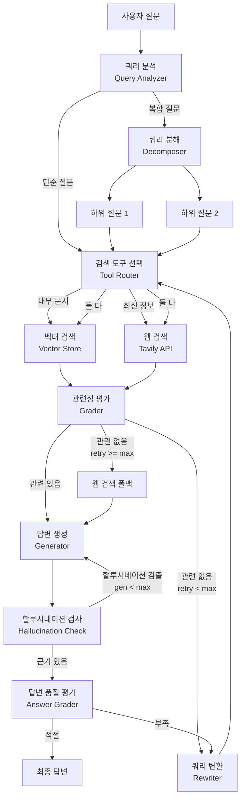
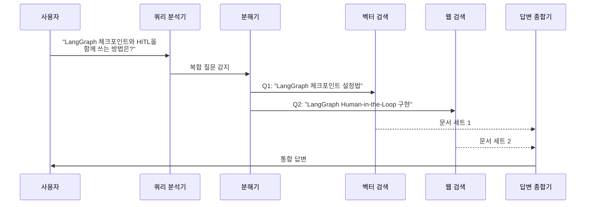
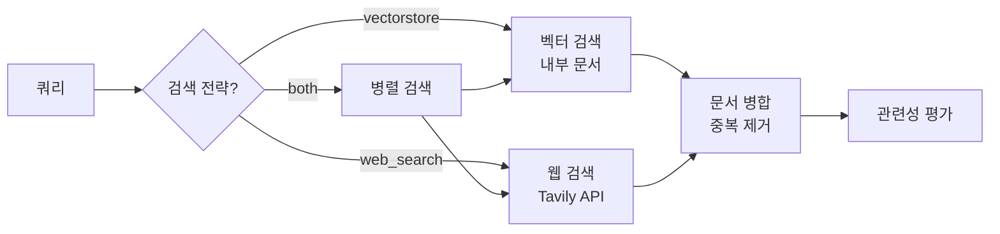
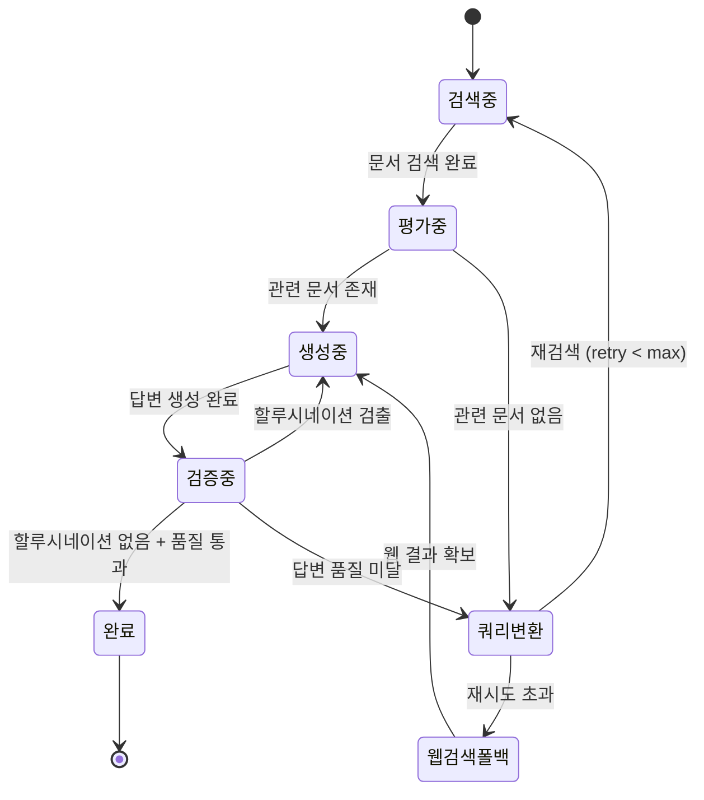

# Agentic RAG 실전 프로젝트

> 벡터 검색, 웹 검색, 자기교정 루프를 통합한 기술 문서 Q&A 에이전트를 처음부터 끝까지 구축합니다.

## 개요

이번 섹션은 Ch12의 마지막 세션으로, 지금까지 배운 모든 구성 요소를 하나의 프로덕션 수준 시스템으로 통합합니다. [RAG에서 Agentic RAG로](12-ch12-agentic-rag-에이전트가-검색을-도구로-활용/01-01-rag에서-agentic-rag로.md)에서 배운 에이전트 기반 검색과 쿼리 분해(Decomposition)의 개념, [검색 도구 구축](12-ch12-agentic-rag-에이전트가-검색을-도구로-활용/02-02-검색-도구-구축.md)의 멀티 소스 검색, [검색 결과 평가와 필터링](12-ch12-agentic-rag-에이전트가-검색을-도구로-활용/03-03-검색-결과-평가와-필터링.md)의 3단계 평가 파이프라인, [자기교정 RAG 구현](12-ch12-agentic-rag-에이전트가-검색을-도구로-활용/04-04-자기교정-rag-구현.md)의 쿼리 변환과 웹 검색 폴백을 모두 결합합니다.

12.1에서 Agentic RAG의 핵심 능력으로 소개한 **쿼리 분석과 분해** — 즉, 복합 질문을 하위 질문으로 나누어 각각 검색한 뒤 종합하는 전략 — 를 이번 프로젝트에서 실제 코드로 구현합니다. 에이전트가 단순히 검색 도구를 호출하는 것을 넘어, **질문 자체를 이해하고 재구성**하는 진정한 "지능형 검색"의 완성입니다.

**선수 지식**: Ch12 세션 1~4의 모든 개념 (create_retriever_tool, GradeDocuments, 자기교정 루프, 쿼리 변환)
**학습 목표**:
- 멀티 소스 검색(벡터 + 웹)을 하나의 StateGraph로 통합할 수 있다
- 복합 질문을 분해(Decompose)하여 병렬 검색 후 종합할 수 있다
- 자기교정 루프가 포함된 완전한 Agentic RAG 파이프라인을 구축할 수 있다
- 프로덕션 운영을 위한 설정(타임아웃, 재시도 제한, 로깅)을 적용할 수 있다

## 왜 알아야 할까?

실제 기술 문서 Q&A 시스템을 만들어 본 적이 있다면 이런 경험이 있을 겁니다. "LangGraph에서 체크포인트를 설정하는 방법은?"이라는 질문에 벡터 검색은 관련 문서를 잘 찾아주지만, "LangGraph 최신 버전에서 바뀐 API는 뭐야?"라는 질문에는 벡터 DB에 없는 최신 정보가 필요하죠. 더 까다로운 건 "LangGraph의 체크포인트와 Human-in-the-Loop를 함께 쓰려면 어떻게 해야 해?"처럼 **여러 주제를 동시에 다루는 복합 질문**입니다.

이런 현실적인 문제를 해결하려면 단일 검색 도구로는 부족합니다. 벡터 검색, 웹 검색, 쿼리 분해, 품질 평가, 자기교정이 모두 유기적으로 연결된 **통합 시스템**이 필요합니다. 이번 실전 프로젝트에서 바로 그 시스템을 만듭니다.

## 핵심 개념

### 개념 1: 통합 아키텍처 설계

> 💡 **비유**: 도서관에서 복잡한 질문에 답하는 사서를 생각해보세요. 좋은 사서는 먼저 질문을 분석하고("이건 두 가지를 동시에 묻고 있네"), 적절한 출처를 선택하며("이건 장서 목록에서, 저건 인터넷에서"), 찾은 자료를 검증하고("이 정보가 정확한가?"), 부족하면 다른 방법으로 다시 찾습니다. 우리가 만들 에이전트가 바로 이 '디지털 사서'입니다.

통합 Agentic RAG의 핵심은 **의사결정 루프**입니다. LLM이 단순히 검색 → 생성을 반복하는 게 아니라, 매 단계에서 "다음에 무엇을 할지"를 판단합니다. 이 판단은 LangGraph의 조건부 엣지(conditional edges)로 구현되죠.

> 📊 **그림 1**: 통합 Agentic RAG 전체 아키텍처



전체 시스템의 상태(State)는 이전 세션들에서 배운 `TypedDict`로 정의합니다. 핵심은 **모든 중간 결과를 상태에 기록**하여 어느 단계에서든 이전 맥락을 참조할 수 있게 하는 것입니다.

```python
from typing import TypedDict, Annotated, Literal
from langgraph.graph import add_messages

class AgenticRAGState(TypedDict):
    """통합 Agentic RAG 상태 스키마"""
    messages: Annotated[list, add_messages]       # 대화 히스토리
    question: str                                  # 원본 질문
    sub_questions: list[str]                       # 분해된 하위 질문
    documents: list[str]                           # 검색된 문서들
    generation: str                                # 생성된 답변
    search_type: str                               # 선택된 검색 전략
    retry_count: int                               # 재시도 횟수
    max_retries: int                               # 최대 재시도
```

### 개념 2: 쿼리 분석과 분해

> 💡 **비유**: 대학 과제로 "한국 전쟁의 원인과 국제 사회의 반응을 비교 분석하라"는 문제를 받았다면, 한 번에 모든 걸 찾지 않겠죠? "한국 전쟁의 원인"과 "국제 사회의 반응"으로 나눠서 각각 조사한 뒤 종합할 겁니다. 쿼리 분해가 바로 이 전략입니다.

[RAG에서 Agentic RAG로](12-ch12-agentic-rag-에이전트가-검색을-도구로-활용/01-01-rag에서-agentic-rag로.md)에서 Agentic RAG의 핵심 능력 중 하나로 **쿼리 분해(Query Decomposition)**를 소개했었죠. 에이전트가 단순히 도구를 호출하는 것을 넘어, 질문 자체를 분석하고 필요에 따라 하위 질문으로 분해하는 능력 — 이것이 "에이전트적(Agentic)"이라는 수식어가 붙는 이유입니다.

복합 질문을 처리하는 핵심 노드는 **쿼리 분석기(Query Analyzer)**입니다. 이 노드는 질문이 단순한지 복합적인지 판단하고, 복합 질문이면 하위 질문으로 분해합니다. 이때 사용하는 `QueryAnalysis` Pydantic 모델은 LLM의 판단을 구조화된 형태로 받아내는 역할을 합니다.

> 📊 **그림 2**: 쿼리 분석 및 분해 흐름



```python
from pydantic import BaseModel, Field

class QueryAnalysis(BaseModel):
    """쿼리 분석 결과"""
    is_complex: bool = Field(
        description="복합 질문 여부 (2개 이상 주제를 다루면 True)"
    )
    sub_questions: list[str] = Field(
        default_factory=list,
        description="분해된 하위 질문 목록"
    )
    search_strategy: Literal["vectorstore", "web_search", "both"] = Field(
        description="추천 검색 전략"
    )

QUERY_ANALYSIS_PROMPT = """당신은 기술 문서 Q&A 시스템의 쿼리 분석기입니다.
사용자 질문을 분석하여 다음을 판단하세요:

1. 복합 질문인지 (2개 이상의 독립적 주제를 포함하면 complex)
2. 복합 질문이면 하위 질문으로 분해
3. 검색 전략 추천:
   - vectorstore: 내부 문서에서 답을 찾을 수 있는 경우
   - web_search: 최신 정보, 버전 업데이트, 외부 비교가 필요한 경우
   - both: 내부 문서 + 최신 정보 모두 필요한 경우

질문: {question}"""
```

### 개념 3: 멀티 소스 검색 통합

> 💡 **비유**: 음식점을 고를 때, 단골집 목록(벡터 DB)만 보면 새로 생긴 맛집을 놓칩니다. 반대로 검색 엔진(웹 검색)만 쓰면 광고에 속을 수 있죠. 둘을 함께 쓰고, 리뷰(평가)까지 확인하는 게 가장 현명합니다.

[검색 도구 구축](12-ch12-agentic-rag-에이전트가-검색을-도구로-활용/02-02-검색-도구-구축.md)에서 만든 벡터 검색과 웹 검색을 하나의 그래프 노드로 통합합니다. 핵심은 쿼리 분석 결과에 따라 **동적으로 검색 소스를 선택**하는 것입니다.

> 📊 **그림 3**: 멀티 소스 검색 라우팅



```python
from langchain_core.tools import tool
from langchain_community.tools.tavily_search import TavilySearchResults
from langchain_core.vectorstores import InMemoryVectorStore
from langchain_openai import OpenAIEmbeddings

# 벡터 검색 도구
@tool
def search_tech_docs(query: str) -> str:
    """내부 기술 문서에서 LangGraph, LangChain, MCP 관련 정보를 검색합니다.
    아키텍처 설명, API 사용법, 코드 패턴에 적합합니다."""
    docs = retriever.invoke(query)
    return "\n\n---\n\n".join(
        [f"[문서 {i+1}]\n{doc.page_content}" for i, doc in enumerate(docs)]
    )

# 웹 검색 도구
@tool
def search_web(query: str) -> str:
    """웹에서 최신 기술 정보를 검색합니다.
    버전 업데이트, 최신 변경사항, 외부 비교에 적합합니다."""
    tavily = TavilySearchResults(max_results=3)
    results = tavily.invoke({"query": query})
    return "\n\n---\n\n".join(
        [f"[웹 {i+1}] {r['content']}" for i, r in enumerate(results)]
    )
```

### 개념 4: 자기교정 루프 통합

[자기교정 RAG 구현](12-ch12-agentic-rag-에이전트가-검색을-도구로-활용/04-04-자기교정-rag-구현.md)에서 배운 CRAG와 Self-RAG의 핵심 아이디어를 프로젝트에 통합합니다. 3단계 평가(관련성 → 할루시네이션 → 답변 품질)와 쿼리 변환 → 웹 검색 폴백 루프를 하나의 그래프에 녹여냅니다.

> 📊 **그림 4**: 자기교정 루프의 상태 전이



프로덕션에서 자기교정 루프의 핵심은 **무한 루프 방지**입니다. `max_retries`와 `recursion_limit` 두 가지 안전장치를 반드시 설정해야 하는데요, `max_retries`는 우리 코드에서 상태를 통해 관리하는 비즈니스 로직 수준의 제한이고, `recursion_limit`은 LangGraph 엔진 차원의 최종 안전망입니다.

```python
MAX_RETRIES = 3          # 쿼리 변환 + 재검색 최대 횟수
MAX_GENERATIONS = 2      # 할루시네이션으로 인한 재생성 최대 횟수
RECURSION_LIMIT = 25     # LangGraph 엔진의 최종 안전망
```

## 실습: 직접 해보기

이제 모든 개념을 합쳐서 완전한 기술 문서 Q&A 에이전트를 구축합니다. 코드는 위에서 아래로 순서대로 실행할 수 있습니다.

### Step 1: 환경 설정과 문서 준비

```python
import os
from typing import TypedDict, Annotated, Literal
from pydantic import BaseModel, Field

from langchain_openai import ChatOpenAI, OpenAIEmbeddings
from langchain_core.vectorstores import InMemoryVectorStore
from langchain_text_splitters import RecursiveCharacterTextSplitter
from langchain_core.documents import Document
from langchain_core.tools import tool
from langchain_community.tools.tavily_search import TavilySearchResults
from langchain_core.prompts import ChatPromptTemplate

from langgraph.graph import StateGraph, START, END, add_messages
from langgraph.prebuilt import ToolNode, tools_condition

# API 키 설정 (환경변수 사용)
# os.environ["OPENAI_API_KEY"] = "your-key"
# os.environ["TAVILY_API_KEY"] = "your-key"

# LLM 초기화
llm = ChatOpenAI(model="gpt-4o", temperature=0)

# 예시 기술 문서 (실제로는 문서 로더로 대체)
docs = [
    Document(
        page_content=(
            "LangGraph의 StateGraph는 노드와 엣지로 구성된 상태 기계입니다. "
            "각 노드는 상태를 받아 업데이트를 반환하는 함수이고, "
            "엣지는 노드 간 전이를 정의합니다. "
            "compile() 메서드로 실행 가능한 그래프를 생성합니다."
        ),
        metadata={"source": "langgraph-basics", "topic": "StateGraph"},
    ),
    Document(
        page_content=(
            "체크포인트는 그래프 실행의 특정 시점 상태를 저장한 스냅샷입니다. "
            "SqliteSaver나 MemorySaver를 checkpointer로 지정하면 "
            "매 슈퍼스텝(superstep)마다 자동 저장됩니다. "
            "thread_id로 세션을 구분하고, 타임 트래블도 가능합니다."
        ),
        metadata={"source": "langgraph-checkpoint", "topic": "Checkpoint"},
    ),
    Document(
        page_content=(
            "Human-in-the-Loop은 interrupt_before 또는 interrupt_after로 "
            "특정 노드 전후에 실행을 중단합니다. "
            "사용자가 상태를 확인·수정한 뒤 graph.invoke(None, config)로 "
            "재개하며, Command(resume=value)로 피드백을 주입합니다."
        ),
        metadata={"source": "langgraph-hitl", "topic": "HITL"},
    ),
    Document(
        page_content=(
            "MCP(Model Context Protocol)는 LLM 애플리케이션과 외부 도구를 "
            "연결하는 표준 프로토콜입니다. FastMCP로 서버를 구축하고, "
            "MCPClient로 연결합니다. stdio와 SSE 트랜스포트를 지원합니다."
        ),
        metadata={"source": "mcp-overview", "topic": "MCP"},
    ),
    Document(
        page_content=(
            "create_react_agent는 LangGraph의 프리빌트 에이전트입니다. "
            "ReAct 패턴(Thought-Action-Observation)을 자동으로 구현하며, "
            "도구 목록과 LLM만 전달하면 됩니다. "
            "커스텀이 필요하면 StateGraph를 직접 구성합니다."
        ),
        metadata={"source": "langgraph-react", "topic": "ReAct"},
    ),
]

# 문서 분할 및 벡터 저장소 구축
text_splitter = RecursiveCharacterTextSplitter(
    chunk_size=500, chunk_overlap=50
)
splits = text_splitter.split_documents(docs)

vectorstore = InMemoryVectorStore.from_documents(
    documents=splits,
    embedding=OpenAIEmbeddings(),
)
retriever = vectorstore.as_retriever(search_kwargs={"k": 3})
```

### Step 2: 상태 스키마와 Pydantic 모델 정의

```python
# --- 상태 스키마 ---
class AgenticRAGState(TypedDict):
    messages: Annotated[list, add_messages]
    question: str
    sub_questions: list[str]
    documents: list[str]
    generation: str
    retry_count: int
    generation_count: int

# --- 평가 모델 (Structured Output) ---
class QueryAnalysis(BaseModel):
    """쿼리 분석 결과"""
    is_complex: bool = Field(description="복합 질문이면 True")
    sub_questions: list[str] = Field(
        default_factory=list,
        description="분해된 하위 질문 (복합이 아니면 빈 리스트)"
    )
    search_strategy: Literal["vectorstore", "web_search", "both"] = Field(
        description="검색 전략"
    )

class GradeDocuments(BaseModel):
    """문서 관련성 평가"""
    binary_score: Literal["yes", "no"] = Field(
        description="관련 있으면 'yes', 없으면 'no'"
    )

class GradeHallucinations(BaseModel):
    """할루시네이션 평가"""
    binary_score: Literal["yes", "no"] = Field(
        description="근거에 기반하면 'yes', 할루시네이션이면 'no'"
    )

class GradeAnswer(BaseModel):
    """답변 품질 평가"""
    binary_score: Literal["yes", "no"] = Field(
        description="질문에 적절히 답하면 'yes', 부족하면 'no'"
    )

# 상수 설정
MAX_RETRIES = 3
MAX_GENERATIONS = 2
```

### Step 3: 검색 도구 정의

```python
@tool
def search_tech_docs(query: str) -> str:
    """내부 기술 문서에서 LangGraph, LangChain, MCP 관련 정보를 검색합니다.
    아키텍처, API 사용법, 코드 패턴에 대한 질문에 적합합니다."""
    docs = retriever.invoke(query)
    return "\n\n---\n\n".join(
        [f"[문서 {i+1}] (출처: {doc.metadata.get('source', 'unknown')})\n"
         f"{doc.page_content}"
         for i, doc in enumerate(docs)]
    )

@tool
def search_web(query: str) -> str:
    """웹에서 최신 기술 정보를 검색합니다.
    버전 업데이트, 최신 변경사항, 릴리스 노트에 적합합니다."""
    tavily = TavilySearchResults(max_results=3)
    results = tavily.invoke({"query": query})
    return "\n\n---\n\n".join(
        [f"[웹 {i+1}] {r.get('content', '')}" for i, r in enumerate(results)]
    )

tools = [search_tech_docs, search_web]
```

### Step 4: 그래프 노드 함수 구현

```python
# --- 노드 1: 쿼리 분석 ---
def analyze_query(state: AgenticRAGState) -> dict:
    """질문을 분석하고 복합 질문이면 분해합니다."""
    question = state["question"]

    analyzer = llm.with_structured_output(QueryAnalysis)
    result = analyzer.invoke(
        f"""기술 문서 Q&A 시스템의 쿼리 분석기입니다.
질문을 분석하세요:
- 2개 이상 독립 주제를 포함하면 complex
- complex면 하위 질문으로 분해
- 검색 전략: vectorstore(내부 문서) / web_search(최신 정보) / both

질문: {question}"""
    )

    sub_qs = result.sub_questions if result.is_complex else [question]
    return {
        "sub_questions": sub_qs,
        "retry_count": 0,
        "generation_count": 0,
        "documents": [],
    }


# --- 노드 2: 검색 실행 ---
def retrieve(state: AgenticRAGState) -> dict:
    """하위 질문들에 대해 검색을 수행합니다."""
    sub_questions = state.get("sub_questions", [state["question"]])
    all_docs = []

    for sq in sub_questions:
        # 벡터 검색
        vec_result = search_tech_docs.invoke({"query": sq})
        all_docs.append(f"[벡터 검색: {sq}]\n{vec_result}")

    return {"documents": all_docs}


# --- 노드 3: 웹 검색 폴백 ---
def web_search_fallback(state: AgenticRAGState) -> dict:
    """벡터 검색 결과가 부족할 때 웹 검색으로 보완합니다."""
    question = state["question"]
    web_result = search_web.invoke({"query": question})
    current_docs = state.get("documents", [])
    current_docs.append(f"[웹 검색 폴백]\n{web_result}")
    return {"documents": current_docs}


# --- 노드 4: 관련성 평가 ---
def grade_documents(state: AgenticRAGState) -> dict:
    """검색된 문서의 관련성을 평가하고 필터링합니다."""
    question = state["question"]
    documents = state["documents"]

    grader = llm.with_structured_output(GradeDocuments)
    filtered = []

    for doc in documents:
        grade = grader.invoke(
            f"문서가 질문에 관련이 있는지 판단하세요.\n"
            f"문서: {doc[:1000]}\n질문: {question}"
        )
        if grade.binary_score == "yes":
            filtered.append(doc)

    return {"documents": filtered}


# --- 노드 5: 쿼리 변환 ---
def transform_query(state: AgenticRAGState) -> dict:
    """검색 결과가 부족할 때 질문을 재구성합니다."""
    question = state["question"]
    retry_count = state.get("retry_count", 0)

    response = llm.invoke(
        f"""원래 질문의 의미를 유지하면서 검색에 더 적합하게 재구성하세요.
구체적 키워드를 포함하고, 모호한 표현을 명확히 하세요.

원래 질문: {question}
재구성된 질문:"""
    )

    return {
        "question": response.content,
        "retry_count": retry_count + 1,
    }


# --- 노드 6: 답변 생성 ---
def generate(state: AgenticRAGState) -> dict:
    """검색된 문서를 기반으로 답변을 생성합니다."""
    question = state["question"]
    documents = state["documents"]
    generation_count = state.get("generation_count", 0)

    context = "\n\n".join(documents)
    response = llm.invoke(
        f"""기술 문서 Q&A 어시스턴트입니다.
검색된 문서를 기반으로 질문에 정확히 답하세요.
문서에 없는 내용은 추측하지 말고 "해당 정보를 찾지 못했습니다"라고 답하세요.

질문: {question}

검색된 문서:
{context}

답변:"""
    )

    return {
        "generation": response.content,
        "generation_count": generation_count + 1,
    }
```

### Step 5: 라우팅 함수 정의

```python
def decide_after_grading(state: AgenticRAGState) -> str:
    """관련성 평가 후 다음 단계를 결정합니다."""
    filtered_docs = state["documents"]
    retry_count = state.get("retry_count", 0)

    if filtered_docs:
        # 관련 문서가 있으면 답변 생성으로
        return "generate"
    elif retry_count < MAX_RETRIES:
        # 관련 문서가 없고 재시도 가능하면 쿼리 변환
        return "transform_query"
    else:
        # 재시도 초과 → 웹 검색 폴백
        return "web_search_fallback"


def check_generation(state: AgenticRAGState) -> str:
    """생성된 답변의 할루시네이션과 품질을 검사합니다."""
    question = state["question"]
    documents = state["documents"]
    generation = state["generation"]
    generation_count = state.get("generation_count", 0)
    retry_count = state.get("retry_count", 0)

    # 1단계: 할루시네이션 검사
    hallucination_grader = llm.with_structured_output(GradeHallucinations)
    hall_result = hallucination_grader.invoke(
        f"답변이 제공된 문서에 근거하는지 판단하세요.\n"
        f"문서: {chr(10).join(documents)[:2000]}\n"
        f"답변: {generation}"
    )

    if hall_result.binary_score == "no":
        # 할루시네이션 검출 → 재생성 (횟수 제한 확인)
        if generation_count < MAX_GENERATIONS:
            return "generate"
        else:
            return "end"

    # 2단계: 답변 품질 검사
    answer_grader = llm.with_structured_output(GradeAnswer)
    ans_result = answer_grader.invoke(
        f"답변이 질문에 적절히 답하는지 판단하세요.\n"
        f"질문: {question}\n답변: {generation}"
    )

    if ans_result.binary_score == "yes":
        return "end"
    elif retry_count < MAX_RETRIES:
        return "transform_query"
    else:
        return "end"
```

### Step 6: 그래프 조립과 실행

```python
# --- 그래프 조립 ---
workflow = StateGraph(AgenticRAGState)

# 노드 추가
workflow.add_node("analyze_query", analyze_query)
workflow.add_node("retrieve", retrieve)
workflow.add_node("grade_documents", grade_documents)
workflow.add_node("transform_query", transform_query)
workflow.add_node("web_search_fallback", web_search_fallback)
workflow.add_node("generate", generate)

# 엣지 구성
workflow.add_edge(START, "analyze_query")
workflow.add_edge("analyze_query", "retrieve")
workflow.add_edge("retrieve", "grade_documents")

# 관련성 평가 후 분기
workflow.add_conditional_edges(
    "grade_documents",
    decide_after_grading,
    {
        "generate": "generate",
        "transform_query": "transform_query",
        "web_search_fallback": "web_search_fallback",
    },
)

# 쿼리 변환 후 재검색
workflow.add_edge("transform_query", "retrieve")

# 웹 검색 폴백 후 생성
workflow.add_edge("web_search_fallback", "generate")

# 답변 생성 후 검증
workflow.add_conditional_edges(
    "generate",
    check_generation,
    {
        "generate": "generate",       # 할루시네이션 → 재생성
        "transform_query": "transform_query",  # 품질 미달 → 재검색
        "end": END,
    },
)

# 컴파일 (recursion_limit은 최종 안전망)
graph = workflow.compile()
```

### Step 7: 실행과 결과 확인

```run:python
# 실행 예시 (단순 질문)
result = graph.invoke(
    {
        "question": "LangGraph에서 체크포인트는 어떻게 동작하나요?",
        "messages": [],
        "sub_questions": [],
        "documents": [],
        "generation": "",
        "retry_count": 0,
        "generation_count": 0,
    },
    config={"recursion_limit": 25},
)

print("=" * 50)
print(f"질문: {result['question']}")
print(f"재시도 횟수: {result['retry_count']}")
print(f"검색된 문서 수: {len(result['documents'])}")
print(f"\n답변:\n{result['generation']}")
```

```output
==================================================
질문: LangGraph에서 체크포인트는 어떻게 동작하나요?
재시도 횟수: 0
검색된 문서 수: 2

답변:
LangGraph의 체크포인트는 그래프 실행의 특정 시점 상태를 저장한 스냅샷입니다. SqliteSaver나 MemorySaver를 checkpointer로 지정하면 매 슈퍼스텝(superstep)마다 상태가 자동 저장됩니다. thread_id로 세션을 구분하며, 저장된 체크포인트를 활용해 타임 트래블(이전 상태로 복원)도 가능합니다.
```

```run:python
# 실행 예시 (복합 질문)
result = graph.invoke(
    {
        "question": "LangGraph의 StateGraph 구조와 MCP 프로토콜의 차이점은?",
        "messages": [],
        "sub_questions": [],
        "documents": [],
        "generation": "",
        "retry_count": 0,
        "generation_count": 0,
    },
    config={"recursion_limit": 25},
)

print("=" * 50)
print(f"질문: {result['question']}")
print(f"분해된 하위 질문: {result['sub_questions']}")
print(f"재시도 횟수: {result['retry_count']}")
print(f"\n답변:\n{result['generation']}")
```

```output
==================================================
질문: LangGraph의 StateGraph 구조와 MCP 프로토콜의 차이점은?
분해된 하위 질문: ['LangGraph StateGraph의 구조와 동작 방식', 'MCP 프로토콜의 개념과 구조']
재시도 횟수: 0

답변:
LangGraph의 StateGraph는 노드(함수)와 엣지(전이)로 구성된 상태 기계 기반 그래프로, 에이전트의 내부 실행 흐름을 정의합니다. compile()로 실행 가능한 그래프를 생성합니다.

반면 MCP(Model Context Protocol)는 LLM 애플리케이션과 외부 도구/데이터를 연결하는 표준 통신 프로토콜입니다. FastMCP로 서버를 구축하고 MCPClient로 연결하며, stdio와 SSE 트랜스포트를 지원합니다.

즉, StateGraph는 에이전트의 '두뇌'(실행 흐름), MCP는 에이전트의 '손'(외부 도구 연결)에 해당합니다.
```

### Step 8: 프로덕션 헬퍼 — 실행 추적 함수

실제 운영 환경에서는 각 노드의 실행 과정을 추적하는 것이 중요합니다. LangGraph의 `stream` 메서드를 활용하면 단계별 실행을 관찰할 수 있습니다.

```python
def run_with_trace(question: str) -> dict:
    """노드별 실행 과정을 추적하며 에이전트를 실행합니다."""
    initial_state = {
        "question": question,
        "messages": [],
        "sub_questions": [],
        "documents": [],
        "generation": "",
        "retry_count": 0,
        "generation_count": 0,
    }

    print(f"질문: {question}\n{'=' * 50}")

    final_state = None
    for step in graph.stream(initial_state, config={"recursion_limit": 25}):
        # step은 {노드이름: 상태업데이트} 형태
        for node_name, update in step.items():
            print(f"[노드] {node_name}")

            if node_name == "analyze_query" and update.get("sub_questions"):
                sqs = update["sub_questions"]
                print(f"  → 하위 질문 {len(sqs)}개: {sqs}")

            if node_name == "grade_documents":
                doc_count = len(update.get("documents", []))
                print(f"  → 관련 문서: {doc_count}개 통과")

            if node_name == "transform_query":
                print(f"  → 재시도 #{update.get('retry_count', '?')}")

            if node_name == "generate":
                gen = update.get("generation", "")
                print(f"  → 답변 생성 ({len(gen)}자)")

            final_state = {**initial_state, **update} if final_state is None \
                else {**final_state, **update}

    print(f"{'=' * 50}")
    print(f"최종 답변:\n{final_state.get('generation', '답변 없음')}")
    return final_state
```

```run:python
# 추적 실행 예시
result = run_with_trace(
    "LangGraph에서 Human-in-the-Loop 패턴을 구현하는 방법은?"
)
```

```output
질문: LangGraph에서 Human-in-the-Loop 패턴을 구현하는 방법은?
==================================================
[노드] analyze_query
  → 하위 질문 1개: ['LangGraph에서 Human-in-the-Loop 패턴을 구현하는 방법은?']
[노드] retrieve
[노드] grade_documents
  → 관련 문서: 1개 통과
[노드] generate
  → 답변 생성 (287자)
==================================================
최종 답변:
LangGraph에서 Human-in-the-Loop은 interrupt_before 또는 interrupt_after를 사용하여 특정 노드 전후에 실행을 중단하는 방식으로 구현합니다. 사용자가 상태를 확인하고 수정한 뒤 graph.invoke(None, config)로 실행을 재개하며, Command(resume=value)를 통해 피드백을 주입할 수 있습니다.
```

## 더 깊이 알아보기

### Agentic RAG의 학문적 뿌리

Agentic RAG는 하루아침에 등장한 개념이 아닙니다. 2023년 Shi-Qi Yan 등이 발표한 **Corrective RAG(CRAG)** 논문은 "검색 결과를 무조건 신뢰하지 말고 평가하라"는 아이디어를 처음 체계화했습니다. 거의 같은 시기에 Asai 등이 발표한 **Self-RAG**는 LLM 스스로 "검색이 필요한가?", "이 문서가 관련 있는가?", "내 답변에 할루시네이션이 있는가?"를 판단하는 반성 토큰(reflection tokens) 개념을 도입했죠.

이 두 논문의 아이디어가 LangGraph의 StateGraph와 만나면서 비로소 실용적인 구현이 가능해졌습니다. StateGraph의 조건부 엣지가 CRAG의 "평가 후 분기"를, 상태 관리가 Self-RAG의 "반복적 자기 평가"를 자연스럽게 표현할 수 있었기 때문입니다.

2024년에는 Jeong 등이 **Adaptive RAG**를 제안하여 쿼리 복잡도에 따라 아예 다른 RAG 전략을 선택하는 라우팅 개념을 추가했습니다. 우리가 이번 프로젝트에서 구현한 쿼리 분석기가 바로 이 Adaptive RAG의 핵심 아이디어를 반영한 것입니다.

> 💡 **알고 계셨나요?**: LangGraph 공식 튜토리얼의 Adaptive RAG 예제는 처음에 LangChain 블로그 포스트로 시작되었는데, 반응이 너무 좋아서 공식 문서에 정식 튜토리얼로 승격되었습니다. 이 튜토리얼이 바로 오늘날 Agentic RAG 구현의 사실상 표준(de facto standard)이 되었습니다.

### 2026년 현재의 Agentic RAG

2026년 현재, Agentic RAG는 "고급 패턴"이 아니라 **진지한 AI 애플리케이션의 기본선(baseline)**으로 자리 잡았습니다. LangGraph v1.1+에서는 `init_chat_model()`로 모델을 초기화하고, `with_structured_output()`으로 평가기를 구성하는 패턴이 표준화되었습니다.

## 흔한 오해와 팁

> ⚠️ **흔한 오해**: "검색 도구를 많이 추가할수록 좋다"고 생각하기 쉬운데, 실제로는 도구가 5개를 넘어가면 LLM의 도구 선택 정확도가 급격히 떨어집니다. 도구는 3~4개가 적정선이며, 각 도구의 설명(docstring)이 서로 명확히 구분되어야 합니다. "내부 문서 검색"과 "웹 검색"처럼 역할이 분명해야 LLM이 올바른 도구를 선택합니다.

> 💡 **알고 계셨나요?**: LangGraph 공식 Agentic RAG 튜토리얼에서 `grade_documents` 함수는 노드가 아닌 **조건부 엣지의 라우팅 함수**로 구현되어 있습니다. 우리 프로젝트에서는 가독성과 상태 업데이트를 위해 별도 노드로 분리했는데, 두 방식 모두 유효합니다. 단순한 yes/no 분기만 하면 라우팅 함수가 깔끔하고, 문서 필터링처럼 상태를 변경해야 하면 노드가 적합합니다.

> 🔥 **실무 팁**: `recursion_limit`의 기본값은 25인데, 자기교정 루프가 있는 Agentic RAG에서는 이 값을 명시적으로 설정하세요. 노드 수 × 최대 반복 횟수를 계산하면 적절한 값이 나옵니다. 우리 그래프의 경우 노드 6개 × 최대 3회 반복 = 18, 여유를 두어 25가 적절합니다. 너무 낮으면 정상적인 자기교정이 중단되고, 너무 높으면 비용이 폭발할 수 있습니다.

> 🔥 **실무 팁**: 프로덕션에서 Agentic RAG를 운영할 때 가장 많이 겪는 문제는 **레이턴시**입니다. 자기교정 루프를 한 번 돌 때마다 LLM 호출이 추가되는데, 평가(grading) 호출에만 100~800ms가 소요됩니다. [LangSmith 트레이싱](17-ch17-에이전트-평가와-langsmith/01-01-에이전트-평가-전략.md)으로 각 노드의 지연 시간을 측정하고, 병목이 되는 노드를 식별하세요.

## 핵심 정리

| 개념 | 설명 |
|------|------|
| 쿼리 분석(Query Analysis) | LLM이 질문의 복잡도와 최적 검색 전략을 판단하는 진입 노드 |
| 쿼리 분해(Decompose) | 복합 질문을 독립적인 하위 질문으로 분할하여 개별 검색 |
| 멀티 소스 검색 | 벡터 DB + 웹 검색을 동적으로 선택·결합하는 검색 전략 |
| 관련성 평가(Grading) | Structured Output으로 문서의 질문 관련성을 yes/no 판정 |
| 자기교정 루프 | 평가 실패 시 쿼리 변환 → 재검색 → 웹 폴백의 순환 구조 |
| 할루시네이션 검사 | 생성된 답변이 검색 문서에 근거하는지 검증 |
| 무한 루프 방지 | MAX_RETRIES + MAX_GENERATIONS + recursion_limit 삼중 안전장치 |
| 실행 추적(Trace) | `graph.stream()`으로 노드별 실행 과정을 모니터링 |

## 다음 섹션 미리보기

Ch12에서 에이전트가 검색을 **도구로** 자율 활용하는 Agentic RAG를 완성했습니다. 다음 [Ch13. Adaptive RAG와 동적 라우팅](13-ch13-adaptive-rag와-동적-라우팅/01-01-adaptive-rag-아키텍처.md)에서는 한 단계 더 나아가, 쿼리 복잡도에 따라 **RAG 전략 자체를 동적으로 선택**하는 Adaptive RAG를 본격적으로 다룹니다. No Retrieval, Single-shot RAG, Iterative RAG를 라우터가 자동 선택하는 시스템을 구축하게 됩니다.

## 참고 자료

- [Build a custom RAG agent with LangGraph — LangChain 공식 문서](https://docs.langchain.com/oss/python/langgraph/agentic-rag) - Agentic RAG의 공식 구현 가이드. create_retriever_tool, grade_documents, rewrite_question 패턴의 원본
- [LangGraph Adaptive RAG Tutorial](https://langchain-ai.github.io/langgraph/tutorials/rag/langgraph_adaptive_rag/) - 쿼리 라우팅 + 자기교정을 결합한 공식 튜토리얼
- [Corrective RAG (CRAG) Implementation — DataCamp](https://www.datacamp.com/tutorial/corrective-rag-crag) - CRAG 논문의 LangGraph 구현을 단계별로 설명하는 튜토리얼
- [Self-RAG: Learning to Retrieve, Generate, and Critique (Asai et al.)](https://arxiv.org/abs/2310.11511) - Self-RAG 원논문. 반성 토큰 개념과 자기 평가 메커니즘의 학문적 기초
- [Agentic RAG with LangGraph — Qdrant Tutorial](https://qdrant.tech/documentation/tutorials-build-essentials/agentic-rag-langgraph/) - Qdrant 벡터 DB와 LangGraph를 결합한 실전 Agentic RAG 구현 가이드

---
### 🔗 Related Sessions
- [stategraph](04-ch4-langgraph-stategraph-기초/01-01-langgraph-아키텍처-개관.md) (prerequisite)
- [toolnode](04-ch4-langgraph-stategraph-기초/05-05-첫-번째-langgraph-에이전트.md) (prerequisite)
- [add_conditional_edges](05-ch5-조건-분기와-동적-라우팅/01-01-조건부-엣지의-이해.md) (prerequisite)
- [tools_condition](04-ch4-langgraph-stategraph-기초/05-05-첫-번째-langgraph-에이전트.md) (prerequisite)
- [create_retriever_tool](12-ch12-agentic-rag-에이전트가-검색을-도구로-활용/01-01-rag에서-agentic-rag로.md) (prerequisite)
- [with_structured_output](19-ch19-가드레일과-structured-output/03-03-structured-output-기초.md) (prerequisite)
- [gradedocuments](13-ch13-adaptive-rag와-동적-라우팅/01-01-adaptive-rag-아키텍처.md) (prerequisite)
- [gradehallucinations](12-ch12-agentic-rag-에이전트가-검색을-도구로-활용/03-03-검색-결과-평가와-필터링.md) (prerequisite)
- [gradeanswer](12-ch12-agentic-rag-에이전트가-검색을-도구로-활용/03-03-검색-결과-평가와-필터링.md) (prerequisite)
- [corrective_rag](12-ch12-agentic-rag-에이전트가-검색을-도구로-활용/01-01-rag에서-agentic-rag로.md) (prerequisite)
- [self_rag](12-ch12-agentic-rag-에이전트가-검색을-도구로-활용/01-01-rag에서-agentic-rag로.md) (prerequisite)
- [transform_query](12-ch12-agentic-rag-에이전트가-검색을-도구로-활용/04-04-자기교정-rag-구현.md) (prerequisite)
- [max_retries](12-ch12-agentic-rag-에이전트가-검색을-도구로-활용/03-03-검색-결과-평가와-필터링.md) (prerequisite)
