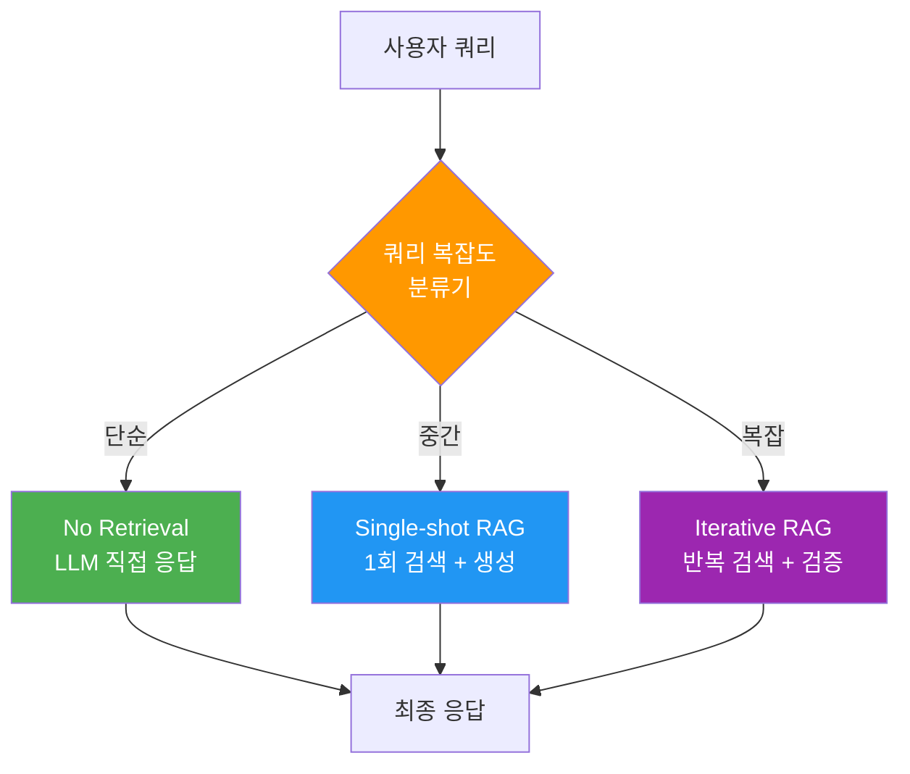
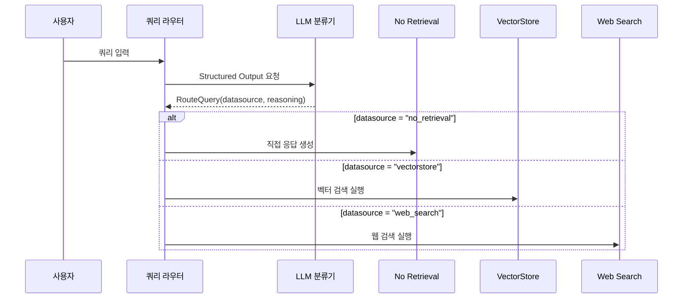
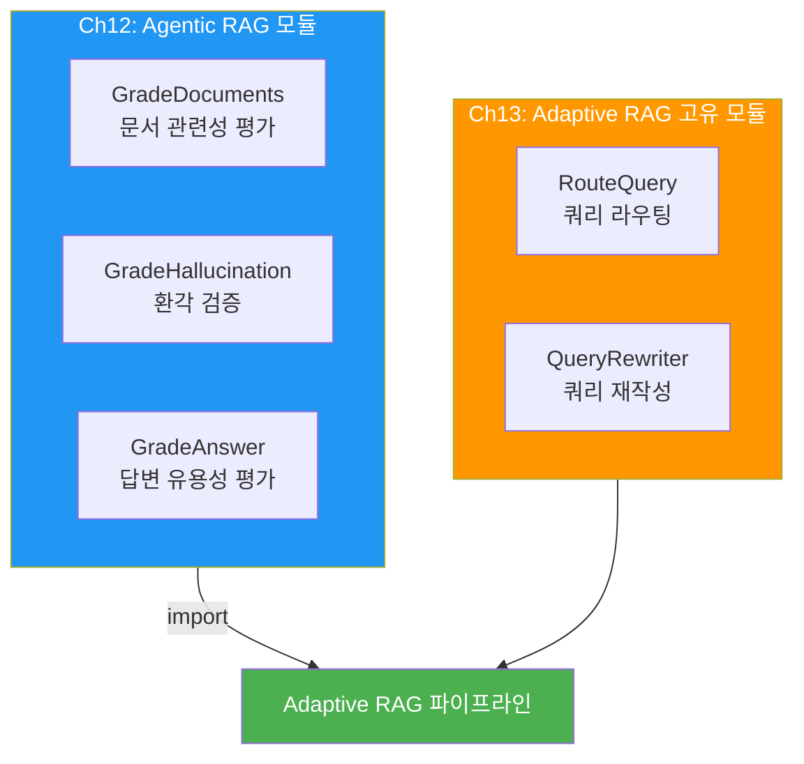
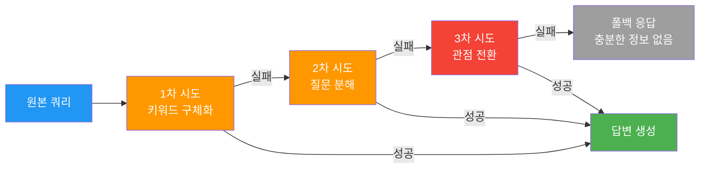
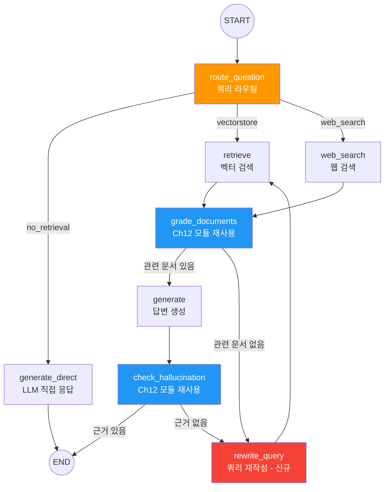
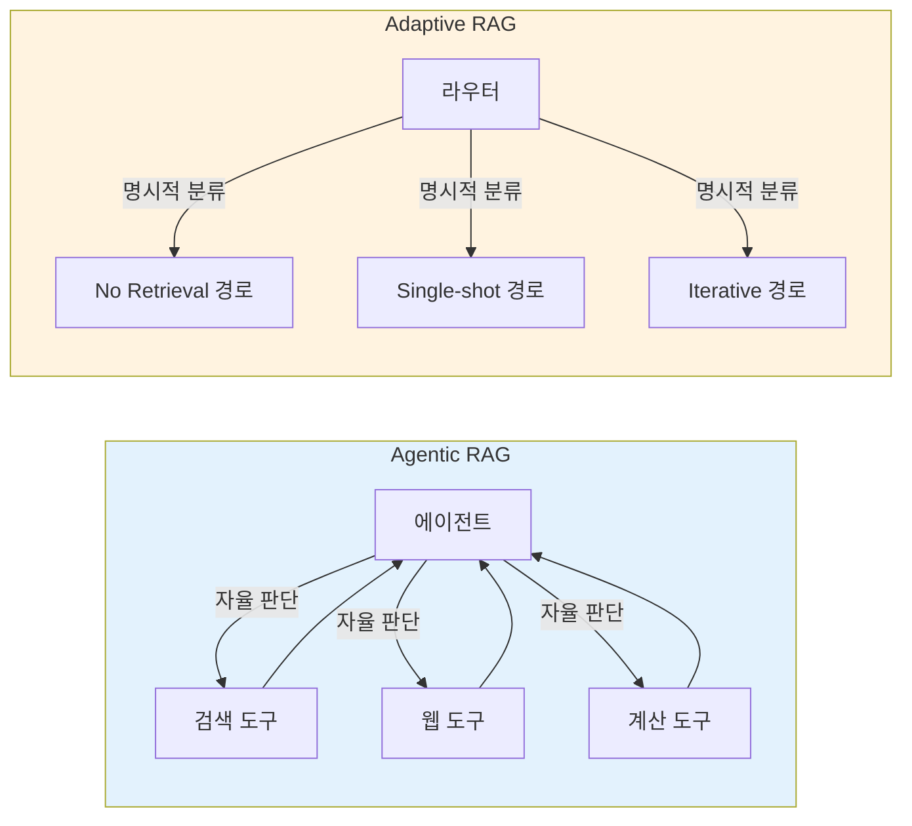

# Adaptive RAG 아키텍처

> 쿼리 복잡도에 따라 최적의 RAG 전략을 동적으로 선택하는 지능형 라우팅 시스템을 설계합니다

## 개요

이 섹션에서는 Adaptive RAG의 핵심 아이디어 — "모든 질문에 같은 파이프라인을 적용할 필요가 없다"는 통찰에서 출발하여, 쿼리 복잡도를 분석하고 No Retrieval · Single-shot · Iterative RAG 전략을 동적으로 선택하는 아키텍처를 학습합니다.

**선수 지식**: [Agentic RAG 아키텍처와 자기교정 패턴](12-ch12-agentic-rag-에이전트가-검색을-도구로-활용/04-04-자기교정-rag-구현.md)을 이해하고, [LangGraph의 조건부 엣지](05-ch5-조건-분기와-동적-라우팅/01-01-조건부-엣지의-이해.md)를 구성해본 경험이 필요합니다. 특히 Ch12에서 구현한 `GradeDocuments`, `GradeHallucination` 등의 평가 모듈을 이 챕터에서 **재사용**하므로, 해당 코드를 숙지하고 있어야 합니다.

**학습 목표**:
- Adaptive RAG가 해결하는 문제와 기존 RAG의 한계를 설명할 수 있다
- 쿼리 복잡도 분류기(No Retrieval / Single-shot / Iterative)의 동작 원리를 이해한다
- LangGraph StateGraph로 동적 라우팅 그래프를 설계할 수 있다
- Ch12의 평가 모듈을 재사용하면서 Adaptive RAG 고유의 라우팅·재작성 로직을 추가할 수 있다

## 왜 알아야 할까?

여러분이 고객 지원 챗봇을 운영한다고 상상해보세요. "안녕하세요"라는 인사에도 벡터 DB를 검색하고, "파이썬이란?"이라는 단순 질문에도 복잡한 멀티스텝 검색을 돌린다면 어떨까요? 비용은 치솟고, 응답 속도는 느려지며, 오히려 불필요한 검색 결과가 답변을 오염시킬 수도 있습니다.

실제로 프로덕션 RAG 시스템에서 가장 큰 문제 중 하나는 **"one-size-fits-all"** 접근입니다. 모든 쿼리를 동일한 파이프라인으로 처리하면:

- **간단한 질문**: 불필요한 검색으로 비용 낭비 + 응답 지연
- **복잡한 질문**: 한 번의 검색으로는 충분한 컨텍스트를 얻지 못해 환각(hallucination) 발생
- **시사/실시간 질문**: 벡터 DB에 없는 최신 정보를 요구하지만 웹 검색으로 라우팅되지 않음

Adaptive RAG는 이 문제를 **쿼리 수준에서 전략을 분기**하여 해결합니다. 간단한 질문은 LLM의 내장 지식으로, 중간 난이도는 단일 검색으로, 복잡한 질문은 반복적 검색·검증 루프로 처리하는 것이죠.

그리고 여기서 좋은 소식이 있습니다 — Ch12에서 이미 구현한 문서 관련성 평가(`GradeDocuments`)와 환각 검증(`GradeHallucination`) 모듈을 **그대로 재사용**할 수 있다는 점입니다. Adaptive RAG에서 새로 추가되는 것은 **쿼리 라우터**와 **쿼리 재작성** 로직이며, 검증 파이프라인은 이미 검증된 Ch12 모듈을 임포트하면 됩니다.

## 핵심 개념

### 개념 1: Adaptive RAG란 무엇인가

> 💡 **비유**: 병원의 응급 분류 시스템(Triage)을 떠올려보세요. 환자가 도착하면 간호사가 먼저 증상의 심각도를 평가합니다. 단순 감기는 일반 진료실로, 골절은 정형외과로, 심장마비는 즉시 응급실로 보내죠. 모든 환자를 응급실로 보내면 자원이 낭비되고, 모든 환자를 일반 진료실로 보내면 위급한 환자가 위험합니다. Adaptive RAG도 마찬가지입니다 — 쿼리의 "심각도(복잡도)"를 먼저 판단하고, 적절한 처리 경로로 보내는 겁니다.

Adaptive RAG는 2024년 NAACL에서 발표된 논문 *"Adaptive-RAG: Learning to Adapt Retrieval-Augmented Large Language Models through Question Complexity"* (Jeong et al., 2024)에서 제안된 프레임워크입니다. 핵심 아이디어는 단순합니다:

**"쿼리의 복잡도에 따라, 가장 적합한 RAG 전략을 동적으로 선택하자."**

세 가지 전략으로 분류됩니다:

| 전략 | 쿼리 유형 | 예시 | 처리 방식 |
|------|-----------|------|-----------|
| **No Retrieval** | 단순/일반 상식 | "파이썬의 창시자는?" | LLM 내장 지식으로 직접 응답 |
| **Single-shot RAG** | 중간 복잡도 | "우리 회사 환불 정책은?" | 벡터 DB 1회 검색 → 응답 |
| **Iterative RAG** | 고복잡도/멀티홉 | "Q3 매출이 감소한 원인과 경쟁사 대비 분석" | 반복 검색 + 검증 + 재검색 루프 |

> 📊 **그림 1**: Adaptive RAG의 세 가지 전략 분류



기존의 [Agentic RAG](12-ch12-agentic-rag-에이전트가-검색을-도구로-활용/01-01-rag에서-agentic-rag로.md)가 "에이전트에게 검색 도구를 주고 자율적으로 판단하게 하자"라는 접근이었다면, Adaptive RAG는 더 구조적입니다. **라우터가 명시적으로 전략을 선택**하고, 각 전략별로 최적화된 파이프라인을 실행합니다.

### 개념 2: 쿼리 복잡도 분류기 — Adaptive RAG의 진입점

> 💡 **비유**: 음식점 주문 시스템과 비슷합니다. "물 한 잔"이라고 하면 웨이터가 바로 가져다주고(No Retrieval), "오늘의 추천 메뉴"라고 하면 메뉴판을 한 번 확인해서 알려주며(Single-shot), "제 알레르기 정보를 고려해서 3코스 메뉴를 구성해주세요"라고 하면 주방과 여러 번 상의해야 하죠(Iterative).

쿼리 복잡도 분류기는 Adaptive RAG의 **첫 번째 관문**이자 Ch12의 Agentic RAG와 가장 차별화되는 부분입니다. 들어오는 질문을 분석하여 어떤 전략으로 처리할지 결정합니다.

원본 논문에서는 작은 LM(예: BERT 기반 분류기)을 학습시켜 복잡도를 예측했지만, 실무에서는 **LLM 자체를 분류기로 활용**하는 방식이 더 간편하고 효과적입니다. LangGraph 공식 튜토리얼에서도 이 방식을 채택하고 있죠.

이때 핵심이 되는 패턴이 **Structured Output**입니다. `with_structured_output()`은 LLM의 응답을 Pydantic 모델로 강제하는 LangChain의 기능인데요, LLM이 자유 텍스트 대신 미리 정의한 스키마에 맞는 JSON을 반환하도록 합니다. 라우터처럼 "정확히 세 가지 중 하나"를 골라야 하는 상황에서 특히 유용하죠. Structured Output의 심화 패턴은 [Ch19. 가드레일과 Structured Output](19-ch19-가드레일과-structured-output/03-03-structured-output-기초.md)에서 다루니, 여기서는 라우팅에 필요한 핵심만 짚고 넘어가겠습니다.

```python
from pydantic import BaseModel, Field
from typing import Literal

# 쿼리 라우팅을 위한 구조화된 출력 스키마 — Adaptive RAG 고유
# Ch12의 GradeDocuments/GradeHallucination과 달리,
# 이 스키마는 "어떤 전략을 쓸 것인가"를 결정하는 라우팅 전용입니다
class RouteQuery(BaseModel):
    """사용자 쿼리를 가장 적합한 데이터소스로 라우팅합니다."""
    
    datasource: Literal["no_retrieval", "vectorstore", "web_search"] = Field(
        description=(
            "쿼리 유형에 따라 라우팅 대상을 선택합니다. "
            "일반 상식이나 간단한 질문은 no_retrieval, "
            "내부 문서 관련은 vectorstore, "
            "최신 정보가 필요하면 web_search를 선택합니다."
        )
    )
    reasoning: str = Field(
        description="이 라우팅을 선택한 이유를 간단히 설명합니다."
    )
```

> 📊 **그림 2**: 쿼리 복잡도 분류 프로세스



라우터의 구현 코드를 살펴보겠습니다:

```python
from langchain_openai import ChatOpenAI

# 라우터 LLM 설정
# with_structured_output()은 LLM 응답을 RouteQuery 스키마로 강제합니다
# 내부적으로 OpenAI의 function calling을 활용하여 정확한 JSON을 반환받습니다
llm = ChatOpenAI(model="gpt-4o-mini", temperature=0)
router_llm = llm.with_structured_output(RouteQuery)

# 라우팅 프롬프트
router_prompt = """당신은 사용자 질문을 적절한 데이터소스로 라우팅하는 전문가입니다.

라우팅 기준:
1. no_retrieval: 일반 상식, 인사, 간단한 정의 질문 (예: "파이썬이란?", "안녕하세요")
2. vectorstore: 내부 문서/도메인 지식이 필요한 질문 (예: "환불 정책은?", "API 사용법")
3. web_search: 최신 뉴스, 실시간 데이터, 시사 이슈 (예: "오늘 주가는?", "최근 AI 트렌드")

질문: {question}"""
```

```run:python
# 라우팅 결과 시뮬레이션
queries = [
    "안녕하세요, 반갑습니다",
    "우리 회사 휴가 정책은 어떻게 되나요?",
    "2026년 최신 LangGraph 업데이트는?",
]

# 실제로는 router_llm.invoke()를 호출하지만, 여기서는 예상 결과를 보여줍니다
routes = [
    ("no_retrieval", "일반 인사말이므로 검색 불필요"),
    ("vectorstore", "내부 회사 정책 문서에서 검색 필요"),
    ("web_search", "최신 정보가 필요하므로 웹 검색 필요"),
]

for query, (route, reason) in zip(queries, routes):
    print(f"쿼리: {query}")
    print(f"  → 라우팅: {route}")
    print(f"  → 이유: {reason}")
    print()
```

```output
쿼리: 안녕하세요, 반갑습니다
  → 라우팅: no_retrieval
  → 이유: 일반 인사말이므로 검색 불필요

쿼리: 우리 회사 휴가 정책은 어떻게 되나요?
  → 라우팅: vectorstore
  → 이유: 내부 회사 정책 문서에서 검색 필요

쿼리: 2026년 최신 LangGraph 업데이트는?
  → 라우팅: web_search
  → 이유: 최신 정보가 필요하므로 웹 검색 필요
```

### 개념 3: Ch12 평가 모듈 재사용과 쿼리 재작성

> 💡 **비유**: 자동차 조립 공장을 생각해보세요. 세단, SUV, 트럭은 각각 다른 조립 라인(라우팅)을 타지만, 품질 검사 장비(평가 모듈)는 동일한 것을 쓰죠. 검사 기준이 차량마다 달라지는 게 아니라, 검사를 통과하지 못했을 때의 **대응 방식**이 달라지는 겁니다. Adaptive RAG도 마찬가지입니다 — 문서 평가와 환각 검증은 Ch12와 동일한 모듈을 쓰고, 실패 시 **쿼리를 재작성**해서 다시 시도하는 것이 Ch13의 고유한 전략입니다.

Adaptive RAG를 설계할 때 흔히 하는 실수가 평가 로직을 처음부터 다시 작성하는 것입니다. 하지만 잘 생각해보면, 문서 관련성 평가("이 문서가 질문과 관련 있는가?")와 환각 검증("답변이 문서에 근거하는가?")은 RAG 전략이 바뀌어도 **판단 기준 자체는 동일**합니다.

> 📊 **그림 3**: Ch12 모듈 재사용 구조



Ch12에서 이미 구현한 `GradeDocuments`, `GradeHallucination`, `GradeAnswer`를 임포트하고, Adaptive RAG에서 **새로 추가되는 부분**에 집중하겠습니다:

```python
# ── Ch12 평가 모듈 재사용 ──────────────────────────────
# Ch12에서 구현한 평가 스키마와 체인을 그대로 임포트합니다
# 자세한 구현은 Ch12의 자기교정 RAG 섹션을 참고하세요
from agentic_rag.graders import (
    GradeDocuments,      # 문서 관련성 평가 (binary_score: yes/no)
    GradeHallucination,  # 환각 검증 (binary_score: yes/no)
    GradeAnswer,         # 답변 유용성 평가 (binary_score: yes/no)
    doc_grader,          # GradeDocuments 체인 (LLM + Structured Output)
    hallucination_grader,# GradeHallucination 체인
    answer_grader,       # GradeAnswer 체인
)
```

> ⚠️ **흔한 오해**: "Ch13에서도 GradeDocuments를 새로 정의해야 하는 거 아닌가요?" 아닙니다. 평가 스키마의 필드(`binary_score: yes/no`)와 판단 기준("문서가 질문과 관련 있는가?")은 RAG 전략과 무관합니다. 중복 정의하면 유지보수 비용만 늘어나고, 두 버전이 미묘하게 달라지는 **드리프트(drift)** 문제가 생깁니다. 실무에서도 공통 평가 모듈을 별도 패키지로 분리하여 여러 파이프라인에서 재사용하는 것이 좋은 패턴이죠.

그렇다면 Adaptive RAG에서 **진짜 새로운 것**은 무엇일까요? 바로 **쿼리 재작성(Query Rewriting)** 로직입니다. Ch12의 자기교정 RAG에서는 문서 평가 실패 시 단순히 같은 쿼리로 재검색했지만, Adaptive RAG에서는 **쿼리 자체를 LLM이 재구성**합니다:

```python
# ── Adaptive RAG 고유: 쿼리 재작성 ─────────────────────
# Ch12의 자기교정 RAG에서는 단순 재검색이었지만,
# Adaptive RAG에서는 LLM이 쿼리를 분석하고 재구성합니다
def rewrite_query(state: AdaptiveRAGState) -> dict:
    """검색 실패 시 쿼리를 더 효과적인 형태로 재작성합니다."""
    question = state["question"]
    retry_count = state.get("retry_count", 0)
    
    # 재작성 전략을 시도 횟수에 따라 변경
    if retry_count == 0:
        strategy = "더 구체적인 키워드를 포함하여 재작성"
    elif retry_count == 1:
        strategy = "질문을 분해하여 핵심 부분만 추출"
    else:
        strategy = "완전히 다른 관점에서 질문을 재구성"
    
    response = llm.invoke(
        f"다음 질문으로 문서를 검색했지만 관련 결과가 없었습니다.\n"
        f"전략: {strategy}\n"
        f"원본 질문: {question}\n"
        f"재작성된 질문만 출력하세요."
    )
    return {
        "question": response.content,
        "retry_count": retry_count + 1,
    }
```

> 📊 **그림 4**: 쿼리 재작성의 점진적 전략 변화



이 점진적 재작성 전략이 Ch12의 단순 재시도와 결정적으로 다른 점입니다. 같은 쿼리를 반복하는 것이 아니라, **시도마다 전략을 바꿔가며** 검색 성공 확률을 높이는 거죠.

### 개념 4: Adaptive RAG 그래프 아키텍처

> 💡 **비유**: Adaptive RAG의 LangGraph 구조는 고속도로 톨게이트 시스템과 같습니다. 톨게이트(라우터)에서 차량 유형을 판별한 뒤, 일반 차량은 일반 도로로, 대형 차량은 전용 도로로, 긴급 차량은 응급 차선으로 보내죠. 각 차선(전략)에는 해당 차량에 최적화된 노면과 규제가 적용됩니다.

Adaptive RAG를 LangGraph로 구현하면, 각 전략이 그래프의 **분기 경로**가 됩니다. 핵심은 `conditional_edges`를 활용한 동적 라우팅이고, 평가·검증 노드에서는 Ch12 모듈을 재사용합니다.

먼저 상태 스키마를 정의합니다:

```python
from typing import TypedDict, Annotated, List
from langgraph.graph.message import add_messages
from langchain_core.messages import BaseMessage

class AdaptiveRAGState(TypedDict):
    """Adaptive RAG 그래프의 상태 스키마"""
    question: str                              # 사용자 쿼리
    generation: str                            # 생성된 응답
    documents: List[str]                       # 검색된 문서
    route: str                                 # 선택된 라우팅 전략
    retry_count: int                           # 재시도 횟수 (Iterative용)
    messages: Annotated[list[BaseMessage], add_messages]  # 대화 이력
```

> 📊 **그림 5**: Adaptive RAG LangGraph 전체 아키텍처



이 그래프의 핵심 설계 원칙은 세 가지입니다:

1. **진입점 분기**: `route_question` 노드가 쿼리를 분석하여 세 갈래로 나눕니다 (Adaptive RAG 고유)
2. **평가 모듈 재사용**: `grade_documents`와 `check_hallucination`은 Ch12의 검증된 모듈을 그대로 활용합니다
3. **점진적 쿼리 재작성**: `rewrite_query`가 시도마다 전략을 바꾸며 검색 품질을 개선합니다 (Adaptive RAG 고유)

그래프를 구성하는 코드의 뼈대를 살펴보겠습니다:

```python
from langgraph.graph import StateGraph, START, END

# 그래프 빌더 생성
builder = StateGraph(AdaptiveRAGState)

# 노드 등록
builder.add_node("route_question", route_question)      # 신규: 라우팅
builder.add_node("generate_direct", generate_direct)     # 신규: 직접 응답
builder.add_node("retrieve", retrieve)
builder.add_node("web_search", web_search)
builder.add_node("grade_documents", grade_documents)     # Ch12 재사용
builder.add_node("generate", generate)
builder.add_node("rewrite_query", rewrite_query)         # 신규: 점진적 재작성
builder.add_node("check_hallucination", check_hallucination)  # Ch12 재사용

# 진입점: 라우팅 노드로
builder.add_edge(START, "route_question")

# 라우팅 조건 분기 — Adaptive RAG의 핵심
builder.add_conditional_edges(
    "route_question",
    lambda state: state["route"],  # 라우팅 결과에 따라 분기
    {
        "no_retrieval": "generate_direct",
        "vectorstore": "retrieve",
        "web_search": "web_search",
    },
)

# 검색 후 → 문서 평가 (Ch12 모듈)
builder.add_edge("retrieve", "grade_documents")
builder.add_edge("web_search", "grade_documents")

# 문서 평가 결과에 따른 분기
builder.add_conditional_edges(
    "grade_documents",
    decide_after_grading,  # 관련 문서 유무에 따라 분기
    {
        "generate": "generate",
        "rewrite": "rewrite_query",
    },
)

# 재작성 후 → 재검색
builder.add_edge("rewrite_query", "retrieve")

# 생성 후 → 환각 검증 (Ch12 모듈)
builder.add_edge("generate", "check_hallucination")

# 환각 검증 결과에 따른 분기
builder.add_conditional_edges(
    "check_hallucination",
    decide_after_hallucination_check,
    {
        "supported": END,
        "not_supported": "rewrite_query",
    },
)

# 직접 응답 → 종료
builder.add_edge("generate_direct", END)

# 컴파일
graph = builder.compile()
```

## 실습: 직접 해보기

이제 완전한 Adaptive RAG 그래프를 구축해보겠습니다. Ch12의 평가 모듈을 재사용하면서, Adaptive RAG 고유의 라우팅과 쿼리 재작성 로직에 집중합니다.

```python
"""Adaptive RAG — Ch12 평가 모듈 재사용 + 동적 라우팅 시스템"""

from typing import TypedDict, Literal, List
from pydantic import BaseModel, Field
from langchain_openai import ChatOpenAI
from langgraph.graph import StateGraph, START, END


# ── 1. Ch12 모듈 임포트 ────────────────────────────────
# 문서 평가, 환각 검증, 답변 평가는 Ch12에서 이미 구현·테스트 완료
# 동일한 Pydantic 스키마와 LLM 체인을 재사용합니다
from agentic_rag.graders import (
    GradeDocuments,        # Pydantic: binary_score (yes/no)
    GradeHallucination,    # Pydantic: binary_score (yes/no)
    doc_grader,            # LLM 체인: llm.with_structured_output(GradeDocuments)
    hallucination_grader,  # LLM 체인: llm.with_structured_output(GradeHallucination)
)
# 실제 프로젝트에서는 아래처럼 구성합니다:
# agentic_rag/
#   graders.py          ← GradeDocuments, GradeHallucination 정의
# adaptive_rag/
#   graph.py            ← 이 파일 (RouteQuery, rewrite_query 정의)


# ── 2. 상태 스키마 ──────────────────────────────────────
class AdaptiveRAGState(TypedDict):
    question: str          # 원본 쿼리
    generation: str        # 최종 응답
    documents: List[str]   # 검색된 문서 목록
    route: str             # 라우팅 결과
    retry_count: int       # 재시도 카운터


# ── 3. Adaptive RAG 고유 스키마 ─────────────────────────
# RouteQuery는 Ch12에 없는, Adaptive RAG만의 분류 스키마입니다
class RouteQuery(BaseModel):
    """쿼리를 적절한 데이터소스로 라우팅"""
    datasource: Literal["no_retrieval", "vectorstore", "web_search"] = Field(
        description="쿼리 유형에 따른 라우팅 대상"
    )


# ── 4. LLM 초기화 ──────────────────────────────────────
llm = ChatOpenAI(model="gpt-4o-mini", temperature=0)

# 라우터만 새로 구성 — 평가 체인(doc_grader, hallucination_grader)은 임포트된 것을 사용
router_llm = llm.with_structured_output(RouteQuery)


# ── 5. 노드 함수 ──────────────────────────────────────
def route_question(state: AdaptiveRAGState) -> dict:
    """[Adaptive RAG 고유] 쿼리를 분석하여 최적의 경로를 결정합니다."""
    question = state["question"]
    result = router_llm.invoke(
        f"다음 질문을 라우팅하세요: {question}"
    )
    return {"route": result.datasource}


def generate_direct(state: AdaptiveRAGState) -> dict:
    """[Adaptive RAG 고유] 검색 없이 LLM의 내장 지식으로 직접 응답합니다."""
    question = state["question"]
    response = llm.invoke(
        f"다음 질문에 답하세요: {question}"
    )
    return {"generation": response.content}


def retrieve(state: AdaptiveRAGState) -> dict:
    """벡터 스토어에서 관련 문서를 검색합니다."""
    question = state["question"]
    # 실제 구현: retriever.invoke(question)
    docs = [f"'{question}'에 대한 검색 결과 문서"]
    return {"documents": docs}


def web_search(state: AdaptiveRAGState) -> dict:
    """웹에서 최신 정보를 검색합니다."""
    question = state["question"]
    # 실제 구현: TavilySearchResults 등 활용
    docs = [f"'{question}'에 대한 웹 검색 결과"]
    return {"documents": docs}


def grade_documents(state: AdaptiveRAGState) -> dict:
    """[Ch12 모듈 재사용] 검색된 문서의 관련성을 평가하고 필터링합니다."""
    question = state["question"]
    documents = state["documents"]
    
    filtered = []
    for doc in documents:
        # doc_grader는 Ch12에서 임포트한 체인
        result = doc_grader.invoke(
            f"질문: {question}\n문서: {doc}\n관련성을 평가하세요."
        )
        if result.binary_score == "yes":
            filtered.append(doc)
    
    return {"documents": filtered}


def generate(state: AdaptiveRAGState) -> dict:
    """검색된 문서를 기반으로 답변을 생성합니다."""
    question = state["question"]
    documents = state["documents"]
    context = "\n".join(documents)
    
    response = llm.invoke(
        f"컨텍스트:\n{context}\n\n질문: {question}\n위 컨텍스트를 기반으로 답하세요."
    )
    return {"generation": response.content}


def rewrite_query(state: AdaptiveRAGState) -> dict:
    """[Adaptive RAG 고유] 점진적 전략으로 쿼리를 재작성합니다.
    
    Ch12의 단순 재검색과 달리, 시도 횟수에 따라 전략을 바꿉니다:
    - 1차: 키워드 구체화
    - 2차: 질문 분해
    - 3차: 관점 전환
    """
    question = state["question"]
    retry_count = state.get("retry_count", 0)
    
    strategies = [
        "더 구체적인 키워드를 포함하여 재작성",
        "질문을 분해하여 핵심 부분만 추출",
        "완전히 다른 관점에서 질문을 재구성",
    ]
    strategy = strategies[min(retry_count, len(strategies) - 1)]
    
    response = llm.invoke(
        f"다음 질문으로 문서를 검색했지만 관련 결과가 없었습니다.\n"
        f"전략: {strategy}\n"
        f"원본 질문: {question}\n"
        f"재작성된 질문만 출력하세요."
    )
    return {
        "question": response.content,
        "retry_count": retry_count + 1,
    }


def check_hallucination(state: AdaptiveRAGState) -> dict:
    """[Ch12 모듈 재사용] 생성된 답변이 문서에 근거하는지 검증합니다."""
    # hallucination_grader는 Ch12에서 임포트한 체인
    # 환각 검증 결과는 조건 분기 함수에서 사용
    return state


# ── 6. 조건 분기 함수 ──────────────────────────────────
def decide_route(state: AdaptiveRAGState) -> str:
    """라우팅 결과에 따른 분기"""
    return state["route"]


def decide_after_grading(state: AdaptiveRAGState) -> str:
    """문서 평가 후 분기 — 관련 문서 유무에 따라"""
    if state["documents"]:
        return "generate"
    if state.get("retry_count", 0) >= 3:
        return "generate"  # 최대 재시도 초과 시 있는 것으로 생성
    return "rewrite"


def decide_after_hallucination(state: AdaptiveRAGState) -> str:
    """환각 검증 후 분기 — Ch12의 hallucination_grader 재사용"""
    documents = state["documents"]
    generation = state["generation"]
    
    # hallucination_grader는 Ch12에서 임포트한 체인
    result = hallucination_grader.invoke(
        f"문서: {documents}\n답변: {generation}\n답변이 문서에 근거하나요?"
    )
    if result.binary_score == "yes":
        return "supported"
    if state.get("retry_count", 0) >= 3:
        return "supported"  # 무한 루프 방지
    return "not_supported"


# ── 7. 그래프 구성 ─────────────────────────────────────
builder = StateGraph(AdaptiveRAGState)

# 노드 등록
builder.add_node("route_question", route_question)
builder.add_node("generate_direct", generate_direct)
builder.add_node("retrieve", retrieve)
builder.add_node("web_search", web_search)
builder.add_node("grade_documents", grade_documents)
builder.add_node("generate", generate)
builder.add_node("rewrite_query", rewrite_query)
builder.add_node("check_hallucination", check_hallucination)

# 엣지 구성
builder.add_edge(START, "route_question")

builder.add_conditional_edges("route_question", decide_route, {
    "no_retrieval": "generate_direct",
    "vectorstore": "retrieve",
    "web_search": "web_search",
})

builder.add_edge("retrieve", "grade_documents")
builder.add_edge("web_search", "grade_documents")

builder.add_conditional_edges("grade_documents", decide_after_grading, {
    "generate": "generate",
    "rewrite": "rewrite_query",
})

builder.add_edge("rewrite_query", "retrieve")
builder.add_edge("generate", "check_hallucination")

builder.add_conditional_edges("check_hallucination", decide_after_hallucination, {
    "supported": END,
    "not_supported": "rewrite_query",
})

builder.add_edge("generate_direct", END)

# 컴파일
graph = builder.compile()
print("✅ Adaptive RAG 그래프 컴파일 완료")
print(f"노드 수: {len(graph.nodes)}")
```

그래프를 실행하는 방법은 다음과 같습니다:

```run:python
# 그래프 실행 예시 (시뮬레이션)
test_queries = [
    {"question": "안녕하세요!", "route": "no_retrieval"},
    {"question": "LangGraph의 StateGraph란?", "route": "vectorstore"},
    {"question": "2026년 AI 에이전트 트렌드는?", "route": "web_search"},
]

for q in test_queries:
    print(f"쿼리: {q['question']}")
    print(f"  라우팅 → {q['route']}")
    
    if q["route"] == "no_retrieval":
        print("  처리: LLM 직접 응답 → END")
    elif q["route"] == "vectorstore":
        print("  처리: 벡터 검색 → 문서 평가(Ch12) → 답변 생성 → 환각 검증(Ch12) → END")
    else:
        print("  처리: 웹 검색 → 문서 평가(Ch12) → 답변 생성 → 환각 검증(Ch12) → END")
    print()
```

```output
쿼리: 안녕하세요!
  라우팅 → no_retrieval
  처리: LLM 직접 응답 → END

쿼리: LangGraph의 StateGraph란?
  라우팅 → vectorstore
  처리: 벡터 검색 → 문서 평가(Ch12) → 답변 생성 → 환각 검증(Ch12) → END

쿼리: 2026년 AI 에이전트 트렌드는?
  라우팅 → web_search
  처리: 웹 검색 → 문서 평가(Ch12) → 답변 생성 → 환각 검증(Ch12) → END
```

## 더 깊이 알아보기

### Adaptive RAG의 탄생 — 논문 이야기

Adaptive RAG의 공식 논문은 2024년 3월 KAIST의 Soyeong Jeong 등이 발표한 *"Adaptive-RAG: Learning to Adapt Retrieval-Augmented Large Language Models through Question Complexity"* (arXiv:2403.14403)입니다. 이 논문은 2024년 NAACL(North American Chapter of the Association for Computational Linguistics)에 채택되었습니다.

흥미로운 점은 이 연구의 출발점이었습니다. 연구팀은 기존 RAG 시스템들이 **"한 가지 전략만 고집한다"**는 공통적인 문제를 발견했습니다. Self-RAG(자기교정 RAG)는 항상 반복적 검색을 시도하고, 일반 RAG는 항상 단일 검색만 수행하죠. 연구팀은 "인간 전문가는 질문의 난이도에 따라 접근법을 바꾸지 않나?"라는 직관에서 출발했습니다.

핵심 기여는 **작은 분류 모델(classifier)**을 별도로 훈련시켜 쿼리 복잡도를 예측한 것입니다. 이 분류기는 T5-large 기반으로, 세 가지 벤치마크(SQuAD, MuSiQue, HotpotQA)에서 자동으로 레이블을 수집하여 학습했습니다. SQuAD 같은 단순 QA 데이터셋의 질문은 "단순", MuSiQue 같은 멀티홉 데이터셋의 질문은 "복잡"으로 레이블링한 것이죠.

LangGraph 팀은 이 논문의 아이디어를 가져와 더 실용적인 버전으로 구현했습니다. 별도의 분류기를 훈련시키는 대신, **LLM 자체를 Structured Output과 함께 라우터로 활용**하는 방식이죠. 이 접근법이 지금의 LangGraph Adaptive RAG 공식 튜토리얼의 기반이 되었습니다.

### Adaptive RAG vs Agentic RAG — 어떤 차이가 있을까?

> 📊 **그림 6**: Adaptive RAG와 Agentic RAG의 구조적 차이



| 비교 항목 | Agentic RAG | Adaptive RAG |
|-----------|-------------|--------------|
| 의사결정 | 에이전트가 자율적으로 도구 선택 | 라우터가 명시적으로 전략 분류 |
| 유연성 | 높음 (도구 조합 자유) | 중간 (사전 정의된 경로) |
| 예측가능성 | 낮음 | 높음 |
| 비용 제어 | 어려움 | 경로별 비용 예측 가능 |
| 평가 모듈 | 자체 구현 | 공통 모듈 재사용 가능 |
| 프로덕션 적합성 | 모니터링 복잡 | 경로별 메트릭 수집 용이 |

실무에서는 이 둘을 결합하는 경우가 많습니다. Adaptive RAG의 라우터로 큰 방향을 잡고, 복잡한 경로에서는 Agentic 방식의 자율적 도구 활용을 허용하는 **하이브리드 구조**가 효과적이죠. 이때 평가 모듈(`GradeDocuments`, `GradeHallucination`)을 공통 패키지로 분리해두면 양쪽 파이프라인에서 모두 재사용할 수 있습니다.

## 흔한 오해와 팁

> ⚠️ **흔한 오해**: "Adaptive RAG는 항상 세 가지 경로만 있어야 한다." 사실 원논문은 세 가지 복잡도 수준을 제안했지만, 실무에서는 도메인에 맞게 경로를 확장할 수 있습니다. 예를 들어 금융 도메인에서는 "실시간 시세 API 호출" 경로를, 법률 도메인에서는 "판례 DB 검색" 경로를 추가하는 식이죠. 중요한 것은 "쿼리에 따라 전략을 분기한다"는 원칙이지, 경로 개수가 아닙니다.

> 💡 **알고 계셨나요?**: "평가 모듈을 중복 구현하면 안 되나요?"라고 물을 수 있는데, 실무에서 가장 큰 위험은 **스키마 드리프트**입니다. 예를 들어 팀 A가 `GradeDocuments`의 `binary_score`를 `"relevant"/"irrelevant"`로 바꿨는데, 팀 B의 복사본은 여전히 `"yes"/"no"`를 쓰고 있다면? 런타임 에러가 아닌 **조용한 논리 오류**가 발생합니다. 공통 모듈을 한 곳에서 관리하면 이런 문제를 원천 차단할 수 있죠.

> 🔥 **실무 팁**: 라우터의 정확도가 전체 시스템 성능을 좌우합니다. 프로덕션에서는 라우팅 결과를 **로깅하고 정기적으로 검토**하세요. 특히 `no_retrieval`로 분류되었지만 실제로는 검색이 필요했던 케이스(false negative)를 추적하면 라우터 프롬프트를 점진적으로 개선할 수 있습니다. LangSmith의 트레이싱과 결합하면 이 분석이 훨씬 수월해집니다 — 이에 대해서는 [Ch17 에이전트 평가와 LangSmith](17-ch17-에이전트-평가와-langsmith/01-01-에이전트-평가-전략.md)에서 자세히 다룹니다.

## 핵심 정리

| 개념 | 설명 |
|------|------|
| Adaptive RAG | 쿼리 복잡도에 따라 최적의 RAG 전략을 동적으로 선택하는 프레임워크 |
| No Retrieval | 단순 질문에 대해 검색 없이 LLM 내장 지식으로 직접 응답 |
| Single-shot RAG | 중간 복잡도 질문에 대해 1회 검색 후 응답 생성 |
| Iterative RAG | 복잡한 질문에 대해 반복적 검색·평가·재검색 루프 수행 |
| 쿼리 라우터(RouteQuery) | LLM + Structured Output으로 쿼리를 분류하는 Adaptive RAG 고유 스키마 |
| Ch12 모듈 재사용 | GradeDocuments, GradeHallucination 등 평가 모듈을 임포트하여 재사용 |
| 점진적 쿼리 재작성 | 시도 횟수에 따라 키워드 구체화 → 질문 분해 → 관점 전환 전략을 변경 |
| Structured Output | `with_structured_output()`으로 LLM 응답을 Pydantic 스키마에 맞추는 패턴 |
| 자기교정 루프 | 문서 평가 실패 시 쿼리 재작성 → 재검색하는 반복 메커니즘 |
| retry_count | 무한 루프 방지를 위한 재시도 횟수 상한 (보통 3회) |

## 다음 섹션 미리보기

이번 섹션에서 Adaptive RAG의 전체 아키텍처와 Ch12 모듈 재사용 전략을 살펴보았습니다. 다음 섹션 [02. 쿼리 분석과 라우터 구현](13-ch13-adaptive-rag와-동적-라우팅/02-02-쿼리-분석과-라우터-구현.md)에서는 라우터를 실제로 구현합니다. LLM 기반 쿼리 분석기를 세밀하게 튜닝하고, Few-shot 예시를 활용한 라우팅 정확도 향상, 그리고 Tavily 웹 검색과 ChromaDB 벡터 검색을 연동하는 실전 코드를 작성합니다.

## 참고 자료

- [Adaptive-RAG: Learning to Adapt Retrieval-Augmented Large Language Models through Question Complexity (Jeong et al., 2024)](https://arxiv.org/abs/2403.14403) - Adaptive RAG의 원본 논문. 쿼리 복잡도 기반 전략 선택의 이론적 배경과 실험 결과를 다룹니다
- [LangGraph 공식 Agentic RAG 가이드](https://docs.langchain.com/oss/python/langgraph/agentic-rag) - LangGraph로 Adaptive RAG를 구현하는 공식 튜토리얼. 최신 API 패턴을 반영합니다
- [Guide to Adaptive RAG Systems with LangGraph — Analytics Vidhya](https://www.analyticsvidhya.com/blog/2025/03/adaptive-rag-systems-with-langgraph/) - 단계별 코드와 함께 Adaptive RAG 구축 과정을 상세히 안내합니다
- [LangGraph Adaptive RAG Tutorial](https://langchain-ai.github.io/langgraph/tutorials/rag/langgraph_adaptive_rag/) - LangGraph 공식 Adaptive RAG 튜토리얼 (docs.langchain.com으로 리다이렉트)
- [LangGraph: Build Stateful AI Agents in Python — Real Python](https://realpython.com/langgraph-python/) - LangGraph의 StateGraph 기초부터 에이전트 구축까지 다루는 종합 튜토리얼

---
### 🔗 Related Sessions
- [stategraph](04-ch4-langgraph-stategraph-기초/01-01-langgraph-아키텍처-개관.md) (prerequisite)
