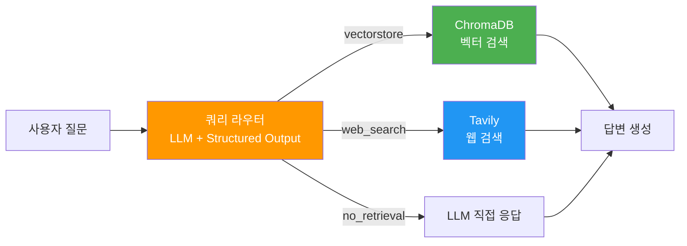
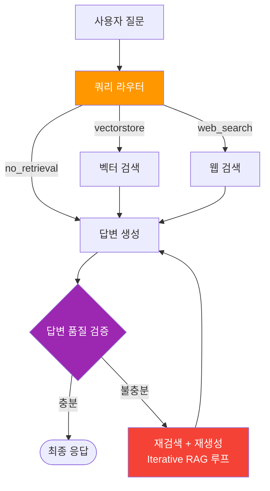
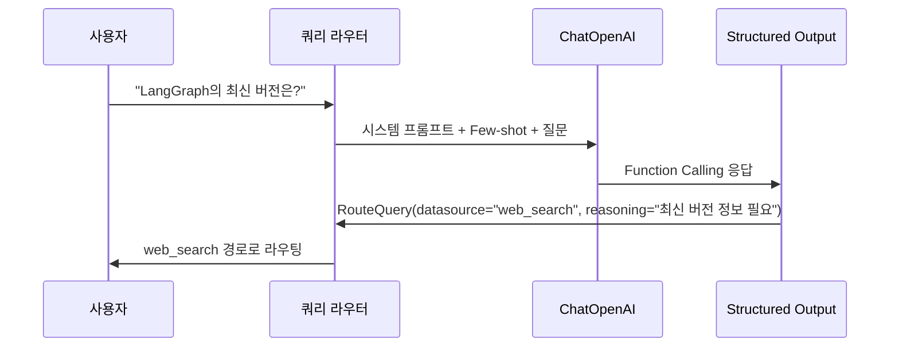
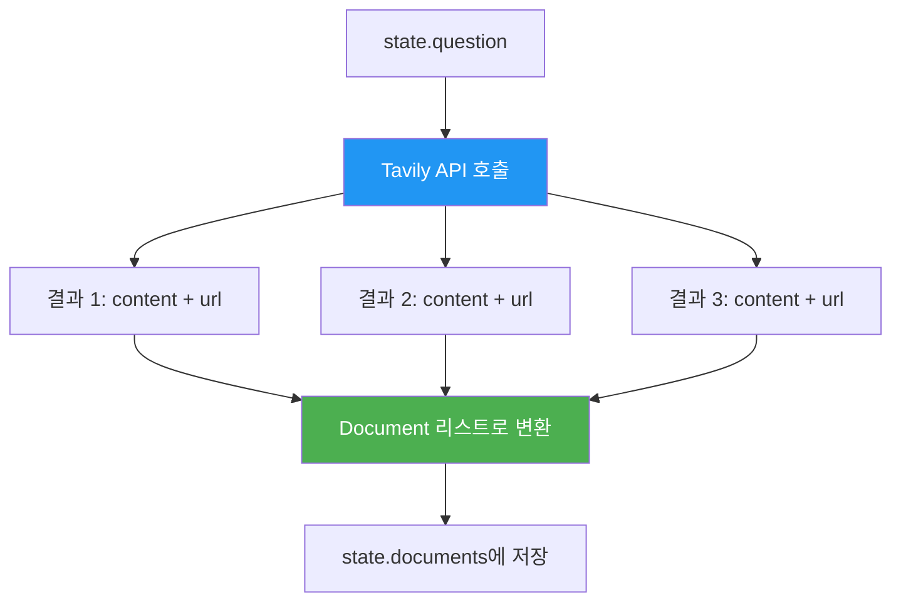
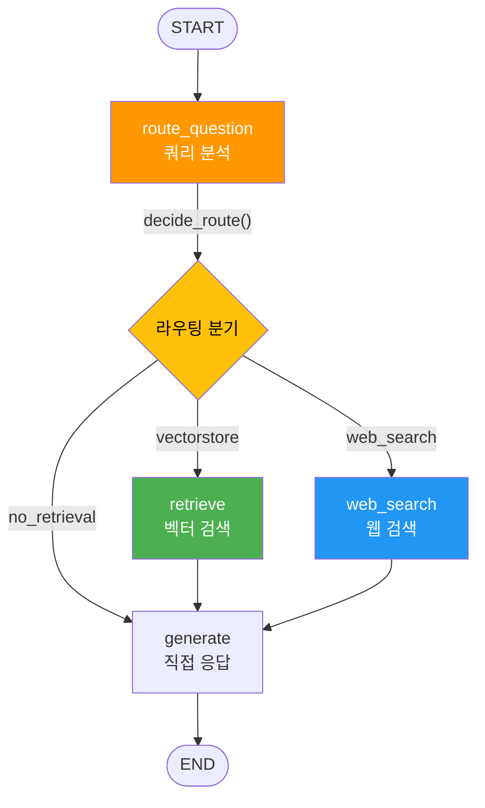
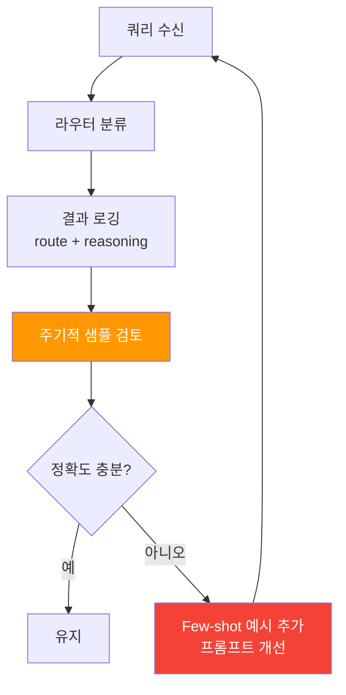

# 쿼리 분석과 라우터 구현

> LLM 기반 쿼리 분류기로 질문을 분석하고, Structured Output으로 라우팅 결정을 내려 웹 검색과 벡터 검색을 자동 분기하는 쿼리 라우터를 구현합니다.

## 개요

이 섹션에서는 [이전 섹션](13-ch13-adaptive-rag와-동적-라우팅/01-01-adaptive-rag-아키텍처.md)에서 설계한 Adaptive RAG 아키텍처의 **진입점** — 쿼리 라우터 — 를 실전 코드로 구현합니다. LLM이 사용자 질문을 분석해서 최적의 검색 전략을 결정하는 과정을 처음부터 끝까지 다룹니다.

**선수 지식**: 
- [Adaptive RAG 아키텍처](13-ch13-adaptive-rag와-동적-라우팅/01-01-adaptive-rag-아키텍처.md)의 RouteQuery, AdaptiveRAGState 개념
- [Structured Output 기초](19-ch19-가드레일과-structured-output/03-03-structured-output-기초.md)의 `with_structured_output` 패턴
- [조건부 엣지의 이해](05-ch5-조건-분기와-동적-라우팅/01-01-조건부-엣지의-이해.md)

**학습 목표**:
- Few-shot 프롬프트로 쿼리 라우터의 분류 정확도를 높일 수 있다
- Tavily 웹 검색과 ChromaDB 벡터 검색을 LangGraph 노드로 통합할 수 있다
- 라우팅 결정을 로깅하고 분석하여 라우터를 개선할 수 있다

## 왜 알아야 할까?

Adaptive RAG의 핵심은 "모든 질문에 똑같은 파이프라인을 돌리지 않는다"는 것입니다. 그런데 이 전략이 실제로 효과를 발휘하려면, 질문이 들어오는 **그 순간** 올바른 경로를 선택해야 합니다. 라우터가 "이건 벡터 검색이 필요해"라고 판단했는데 실제로는 웹 검색이 필요했다면? 사용자는 오래된 데이터를 기반으로 한 부정확한 답변을 받게 됩니다.

반대로, 모든 질문에 웹 검색을 돌리면 어떻게 될까요? 비용은 폭증하고 응답 시간은 느려지죠. **쿼리 라우터는 정확도와 효율성 사이의 균형을 잡는 밸브**입니다. 이 밸브가 고장나면 전체 파이프라인이 흔들립니다.

> 📊 **그림 1**: 쿼리 라우터의 위치와 역할



여기서 한 가지 의문이 생길 수 있습니다. [이전 섹션](13-ch13-adaptive-rag와-동적-라우팅/01-01-adaptive-rag-아키텍처.md)에서 Adaptive RAG의 경로를 **No Retrieval, Single-shot RAG, Iterative RAG** 세 가지로 소개했는데, 왜 라우터의 경로는 `no_retrieval`, `vectorstore`, `web_search`일까요? **Iterative RAG**는 어디로 간 걸까요?

핵심은 이겁니다 — **Iterative RAG는 라우터가 선택하는 "경로"가 아닙니다.** 라우터는 **어디서 검색할지**(데이터 소스)를 결정하고, Iterative RAG는 검색 **이후** 답변 품질이 부족할 때 발동하는 **자기교정 루프**입니다. 즉, 벡터 검색이든 웹 검색이든, 검색 결과가 불충분하면 재검색 → 재생성을 반복하는 것이 Iterative RAG죠. 이 자기교정 메커니즘은 [문서 그레이딩과 자기교정](13-ch13-adaptive-rag와-동적-라우팅/04-04-문서-그레이딩과-자기교정.md)에서 본격적으로 구현합니다.

> 📊 **그림 2**: 라우터 경로 vs Iterative RAG의 관계



프로덕션 환경에서 라우팅 정확도가 5%만 올라가도 불필요한 API 호출이 크게 줄어듭니다. 이 섹션에서 구현하는 Few-shot 기반 라우터는 단순 프롬프트 대비 15~20%의 정확도 향상을 기대할 수 있거든요.

## 핵심 개념

### 개념 1: 쿼리 분류의 원리 — 도서관 사서의 판단력

> 💡 **비유**: 도서관에서 사서에게 질문하는 상황을 떠올려 보세요. "파이썬 리스트 정렬 방법"을 물으면 사서는 바로 프로그래밍 서적 코너로 안내합니다. "오늘 날씨"를 물으면? 책이 아니라 스마트폰을 꺼내겠죠. "조선시대 과거제도"를 물으면 역사 섹션으로 데려갑니다. 사서는 질문의 **유형**과 **도메인**을 순간적으로 판단해서 최적의 정보 소스를 선택합니다.

쿼리 라우터는 바로 이 "AI 사서"입니다. LLM이 질문을 읽고, 사전 정의된 카테고리 중 하나로 분류하는 거죠. 이때 핵심은 **분류 기준을 얼마나 명확하게 알려주느냐**입니다.

[이전 섹션](13-ch13-adaptive-rag와-동적-라우팅/01-01-adaptive-rag-아키텍처.md)에서 정의한 `RouteQuery` 모델을 기억하시죠? 여기서 한 단계 더 나아가, **Few-shot 예시**를 추가해서 분류 정확도를 높여보겠습니다.

```python
from typing import Literal
from pydantic import BaseModel, Field

class RouteQuery(BaseModel):
    """사용자 쿼리를 최적의 데이터 소스로 라우팅합니다."""
    datasource: Literal["no_retrieval", "vectorstore", "web_search"] = Field(
        ...,
        description=(
            "쿼리 유형에 따른 데이터 소스 선택: "
            "no_retrieval=LLM이 직접 답변 가능한 일반 지식, "
            "vectorstore=내부 문서에서 검색 필요, "
            "web_search=최신 정보나 외부 데이터 필요"
        ),
    )
    reasoning: str = Field(
        ...,
        description="라우팅 결정의 근거를 한 줄로 설명",
    )
```

`reasoning` 필드가 왜 중요할까요? LLM에게 "왜 이렇게 분류했어?"라고 묻는 것과 같습니다. 이유를 설명하게 하면 분류 자체의 정확도도 올라가는데, 이를 **Chain-of-Thought 효과**라고 부릅니다. 추론 과정을 출력하는 것 자체가 답변 품질을 높여주거든요.

> 📊 **그림 3**: Structured Output을 활용한 쿼리 분류 흐름



### 개념 2: Few-shot 프롬프트로 라우터 정확도 높이기

단순히 "vectorstore 또는 web_search 중 골라"라고 하면, LLM은 모호한 질문에서 자주 틀립니다. **Few-shot 예시**를 넣으면 경계선 사례(boundary case)에서의 판단력이 확 올라갑니다.

```python
# 쿼리 라우터 시스템 프롬프트 (Few-shot 포함)
ROUTER_SYSTEM_PROMPT = """당신은 사용자 질문을 최적의 데이터 소스로 라우팅하는 전문가입니다.

## 데이터 소스 설명
- **no_retrieval**: 일반 상식, 프로그래밍 기초 문법, 수학 등 LLM이 이미 알고 있는 지식
- **vectorstore**: 내부 문서(에이전트 설계, 프롬프트 엔지니어링, LangGraph 사용법)에 관한 질문
- **web_search**: 최신 뉴스, 실시간 데이터, 특정 버전/날짜 관련 질문, vectorstore에 없을 수 있는 외부 정보

## 분류 예시

질문: "파이썬에서 리스트를 정렬하는 방법은?"
→ no_retrieval (파이썬 기본 문법은 LLM의 일반 지식)

질문: "LangGraph에서 StateGraph의 리듀서 패턴은?"
→ vectorstore (내부 문서에 있는 LangGraph 관련 내용)

질문: "오늘 OpenAI의 새로운 발표 내용은?"
→ web_search (최신 뉴스, 실시간 정보)

질문: "Adaptive RAG 논문의 핵심 기여는?"
→ vectorstore (논문 관련 내부 문서 검색)

질문: "현재 GPT-4o의 가격은?"
→ web_search (실시간 가격 정보)

질문: "HTTP 상태 코드 404가 뭐야?"
→ no_retrieval (일반 기술 상식)
"""
```

이 프롬프트의 핵심은 **경계선 사례**를 포함한다는 점입니다. "Adaptive RAG 논문"은 웹 검색으로도 찾을 수 있지만, 내부 문서에 이미 정리되어 있다면 vectorstore가 더 효율적이죠. 이런 판단 기준을 예시로 보여주면 LLM이 패턴을 학습합니다.

```run:python
from langchain_openai import ChatOpenAI

# 라우터 LLM 초기화 (temperature=0으로 일관된 분류)
llm = ChatOpenAI(model="gpt-4o", temperature=0)
structured_llm_router = llm.with_structured_output(RouteQuery)

# 테스트 쿼리 분류
from langchain_core.messages import SystemMessage, HumanMessage

test_queries = [
    "LangGraph에서 체크포인트는 어떻게 설정하나요?",
    "오늘 Anthropic의 Claude 4 발표 내용은?",
    "파이썬 딕셔너리의 get 메서드 사용법",
]

for query in test_queries:
    result = structured_llm_router.invoke(
        [SystemMessage(content=ROUTER_SYSTEM_PROMPT),
         HumanMessage(content=query)]
    )
    print(f"Q: {query}")
    print(f"→ {result.datasource} | {result.reasoning}\n")
```

```output
Q: LangGraph에서 체크포인트는 어떻게 설정하나요?
→ vectorstore | LangGraph 사용법은 내부 문서에 포함된 주제

Q: 오늘 Anthropic의 Claude 4 발표 내용은?
→ web_search | 최신 뉴스 및 실시간 발표 정보 필요

Q: 파이썬 딕셔너리의 get 메서드 사용법
→ no_retrieval | 파이썬 기본 문법은 LLM의 일반 지식으로 충분
```

> 🔥 **실무 팁**: `temperature=0`으로 설정하는 것이 라우터에서는 거의 필수입니다. 창의적 답변이 필요한 게 아니라 **일관된 분류**가 필요하니까요. 같은 질문을 10번 넣으면 10번 같은 경로를 골라야 합니다.

### 개념 3: Tavily 웹 검색 통합

웹 검색 경로로 라우팅되면, 실제로 인터넷에서 정보를 가져와야 합니다. **Tavily**는 LLM 에이전트를 위해 설계된 검색 API로, 일반 검색 엔진과 달리 LLM이 소화하기 좋은 형태로 결과를 반환합니다.

> 💡 **비유**: Google 검색은 웹페이지 **링크 목록**을 주는 반면, Tavily는 각 페이지의 **핵심 내용을 요약**해서 줍니다. 마치 비서가 "이 기사의 요점은 이겁니다"라고 정리해주는 것과 같죠.

```python
# Tavily 웹 검색 도구 설정
from langchain_tavily import TavilySearch
from langchain.schema import Document

# 최대 3개 결과 반환, 일반 주제 검색
web_search_tool = TavilySearch(max_results=3, topic="general")

def web_search_node(state: dict) -> dict:
    """웹 검색을 수행하고 결과를 문서로 변환합니다."""
    question = state["question"]
    
    # Tavily 검색 실행
    search_results = web_search_tool.invoke({"query": question})
    
    # 검색 결과를 LangChain Document로 변환
    documents = []
    for result in search_results:
        doc = Document(
            page_content=result["content"],
            metadata={"source": result["url"], "type": "web_search"},
        )
        documents.append(doc)
    
    return {"documents": documents}
```

> 📊 **그림 4**: 웹 검색 노드의 데이터 흐름



Tavily의 `topic` 파라미터는 검색 도메인을 힌트로 줍니다. `"general"` 외에 `"news"`를 지정하면 최신 뉴스에 가중치가 올라갑니다. 실시간성이 중요한 쿼리(주가, 날씨, 최신 발표)에는 `topic="news"`가 효과적이에요.

### 개념 4: ChromaDB 벡터 검색 통합

내부 문서 검색 경로는 **ChromaDB** 벡터 스토어를 사용합니다. 문서를 임베딩 벡터로 변환해서 저장하고, 쿼리와 의미적으로 가장 유사한 문서를 찾아오는 방식이죠.

> 💡 **비유**: 도서관에서 책을 찾을 때, 제목이나 저자가 아닌 **내용의 의미**로 검색하는 것과 같습니다. "비가 오는 날의 우울함"을 검색하면, 제목에 "비"가 없더라도 비슷한 감정을 다룬 책을 찾아주는 거죠.

```python
from langchain_chroma import Chroma
from langchain_openai import OpenAIEmbeddings
from langchain_community.document_loaders import WebBaseLoader
from langchain_text_splitters import RecursiveCharacterTextSplitter

# 1. 문서 로드 (예시: 웹 문서)
urls = [
    "https://docs.langchain.com/oss/python/langgraph/overview",
    "https://docs.langchain.com/oss/python/langgraph/agentic-rag",
]
docs = [WebBaseLoader(url).load() for url in urls]
doc_list = [item for sublist in docs for item in sublist]

# 2. 문서 분할
text_splitter = RecursiveCharacterTextSplitter.from_tiktoken_encoder(
    chunk_size=500,        # 각 청크의 최대 토큰 수
    chunk_overlap=100,     # 청크 간 겹치는 토큰 수 (문맥 유지)
)
doc_splits = text_splitter.split_documents(doc_list)

# 3. ChromaDB에 임베딩 저장
vectorstore = Chroma.from_documents(
    documents=doc_splits,
    collection_name="adaptive-rag-docs",
    embedding=OpenAIEmbeddings(model="text-embedding-3-small"),
)

# 4. 리트리버 생성 (상위 4개 문서 반환)
retriever = vectorstore.as_retriever(
    search_type="similarity",
    search_kwargs={"k": 4},
)
```

벡터 검색 노드는 이 리트리버를 사용합니다:

```python
def retrieve_node(state: dict) -> dict:
    """벡터 스토어에서 관련 문서를 검색합니다."""
    question = state["question"]
    
    # 유사도 기반 검색 실행
    documents = retriever.invoke(question)
    
    return {"documents": documents}
```

> ⚠️ **흔한 오해**: ChromaDB의 `similarity` 검색이 항상 최선은 아닙니다. 검색 결과가 너무 비슷한 문서만 반환하는 **다양성 부족** 문제가 있을 수 있어요. 이때는 `search_type="mmr"` (Maximum Marginal Relevance)을 사용하면 유사하면서도 **다양한** 문서를 가져옵니다. 이 주제는 [하이브리드 검색 전략](13-ch13-adaptive-rag와-동적-라우팅/03-03-하이브리드-검색-전략.md)에서 더 깊이 다룹니다.

### 개념 5: 라우터를 LangGraph 그래프에 연결하기

이제 쿼리 라우터, 웹 검색, 벡터 검색을 하나의 LangGraph 그래프로 조립할 차례입니다. 핵심은 `add_conditional_edges`로 START 노드에서 라우터 함수의 반환값에 따라 분기하는 것이에요.

```python
from langgraph.graph import StateGraph, START, END
from typing import List, Annotated
from typing_extensions import TypedDict

class AdaptiveRAGState(TypedDict):
    """Adaptive RAG 그래프의 상태 스키마"""
    question: str
    generation: str
    documents: List[str]
    route: str           # 라우팅 결정 결과
    retry_count: int

# 라우팅 함수: 쿼리를 분석하고 경로를 결정
def route_question(state: AdaptiveRAGState) -> dict:
    """LLM 기반 쿼리 라우터"""
    question = state["question"]
    result = structured_llm_router.invoke(
        [SystemMessage(content=ROUTER_SYSTEM_PROMPT),
         HumanMessage(content=question)]
    )
    print(f"[라우터] {result.datasource}: {result.reasoning}")
    return {"route": result.datasource}

# 조건 분기 함수: route 값에 따라 다음 노드 결정
def decide_route(state: AdaptiveRAGState) -> str:
    """라우팅 결정에 따라 다음 노드를 선택합니다."""
    route = state["route"]
    if route == "no_retrieval":
        return "generate"
    elif route == "vectorstore":
        return "retrieve"
    else:
        return "web_search"
```

> 📊 **그림 5**: 라우터와 조건 분기의 그래프 구조



그래프 조립 코드:

```python
# StateGraph 빌더 구성
workflow = StateGraph(AdaptiveRAGState)

# 노드 등록
workflow.add_node("route_question", route_question)
workflow.add_node("retrieve", retrieve_node)
workflow.add_node("web_search", web_search_node)
workflow.add_node("generate", generate_node)  # 답변 생성 (다음 섹션에서 구현)

# 엣지 구성: START → 쿼리 라우터
workflow.add_edge(START, "route_question")

# 조건부 엣지: 라우터 결과에 따라 분기
workflow.add_conditional_edges(
    "route_question",
    decide_route,
    {
        "generate": "generate",      # no_retrieval → 바로 생성
        "retrieve": "retrieve",      # vectorstore → 벡터 검색
        "web_search": "web_search",  # web_search → 웹 검색
    },
)

# 검색 결과 → 답변 생성
workflow.add_edge("retrieve", "generate")
workflow.add_edge("web_search", "generate")
workflow.add_edge("generate", END)

# 그래프 컴파일
graph = workflow.compile()
```

여기서 주목할 점은 `add_conditional_edges(START, ...)` 대신 **별도의 `route_question` 노드**를 만들었다는 것입니다. 왜일까요? 라우팅 결정을 **상태에 기록**(`state["route"]`)하면, 나중에 어떤 경로로 갔는지 추적하고 디버깅할 수 있기 때문입니다. 이것은 프로덕션에서 매우 중요한 설계 결정입니다.

## 실습: 직접 해보기

이제 쿼리 라우터가 포함된 Adaptive RAG 그래프를 처음부터 끝까지 구축하고 실행해보겠습니다.

```python
"""
Adaptive RAG 쿼리 라우터 실습
- LLM 기반 쿼리 분류
- Tavily 웹 검색 + ChromaDB 벡터 검색 통합
- LangGraph StateGraph 그래프로 조립
"""
import os
from typing import List, Literal
from typing_extensions import TypedDict
from pydantic import BaseModel, Field

from langchain_openai import ChatOpenAI, OpenAIEmbeddings
from langchain_chroma import Chroma
from langchain_tavily import TavilySearch
from langchain.schema import Document
from langchain_core.messages import SystemMessage, HumanMessage
from langchain_text_splitters import RecursiveCharacterTextSplitter
from langgraph.graph import StateGraph, START, END

# ── 1. Pydantic 스키마 정의 ────────────────────────

class RouteQuery(BaseModel):
    """쿼리 라우팅 결정을 담는 구조체"""
    datasource: Literal["no_retrieval", "vectorstore", "web_search"] = Field(
        ..., description="최적의 데이터 소스 선택"
    )
    reasoning: str = Field(
        ..., description="라우팅 결정 근거"
    )


# ── 2. 상태 스키마 ──────────────────────────────────

class AdaptiveRAGState(TypedDict):
    question: str
    generation: str
    documents: List[str]
    route: str
    retry_count: int


# ── 3. LLM 및 도구 초기화 ───────────────────────────

llm = ChatOpenAI(model="gpt-4o", temperature=0)
structured_llm_router = llm.with_structured_output(RouteQuery)

# Tavily 웹 검색
web_search_tool = TavilySearch(max_results=3, topic="general")

# ChromaDB 벡터 스토어 (예시 문서로 초기화)
sample_docs = [
    Document(page_content="LangGraph는 상태 기계 기반의 에이전트 프레임워크입니다. "
             "StateGraph를 사용해 노드와 엣지를 정의하고, 조건부 분기를 구성합니다."),
    Document(page_content="ReAct 패턴은 Reasoning과 Acting을 번갈아 수행하는 "
             "에이전트 설계 패턴입니다. LangGraph의 create_react_agent로 구현할 수 있습니다."),
    Document(page_content="Adaptive RAG는 쿼리 복잡도에 따라 검색 전략을 동적으로 "
             "선택합니다. No Retrieval, Single-shot, Iterative RAG 세 가지 경로가 있습니다."),
    Document(page_content="MCP(Model Context Protocol)는 LLM과 외부 도구 간의 "
             "표준 통합 프로토콜입니다. FastMCP로 서버를 쉽게 구축할 수 있습니다."),
]

text_splitter = RecursiveCharacterTextSplitter(chunk_size=300, chunk_overlap=50)
doc_splits = text_splitter.split_documents(sample_docs)

vectorstore = Chroma.from_documents(
    documents=doc_splits,
    collection_name="adaptive-rag-demo",
    embedding=OpenAIEmbeddings(model="text-embedding-3-small"),
)
retriever = vectorstore.as_retriever(search_kwargs={"k": 2})

# ── 4. 라우터 시스템 프롬프트 ────────────────────────

ROUTER_PROMPT = """당신은 사용자 질문을 최적의 데이터 소스로 라우팅하는 전문가입니다.

## 데이터 소스
- no_retrieval: LLM이 직접 답변 가능 (일반 상식, 기초 문법)
- vectorstore: 내부 문서 검색 필요 (에이전트, LangGraph, RAG, MCP 관련)
- web_search: 최신/외부 정보 필요 (뉴스, 가격, 실시간 데이터)

## 예시
"파이썬 for 루프 문법은?" → no_retrieval
"LangGraph의 StateGraph 사용법은?" → vectorstore
"2026년 OpenAI 신모델 소식은?" → web_search
"Adaptive RAG의 세 가지 경로는?" → vectorstore
"""

# ── 5. 그래프 노드 함수 ──────────────────────────────

def route_question(state: AdaptiveRAGState) -> dict:
    """쿼리를 분석하고 라우팅 경로를 결정합니다."""
    question = state["question"]
    result = structured_llm_router.invoke(
        [SystemMessage(content=ROUTER_PROMPT),
         HumanMessage(content=question)]
    )
    print(f"[라우터] {result.datasource} — {result.reasoning}")
    return {"route": result.datasource}


def retrieve_node(state: AdaptiveRAGState) -> dict:
    """ChromaDB에서 관련 문서를 검색합니다."""
    question = state["question"]
    docs = retriever.invoke(question)
    print(f"[벡터 검색] {len(docs)}개 문서 검색됨")
    return {"documents": [doc.page_content for doc in docs]}


def web_search_node(state: AdaptiveRAGState) -> dict:
    """Tavily로 웹 검색을 수행합니다."""
    question = state["question"]
    results = web_search_tool.invoke({"query": question})
    docs = [r["content"] for r in results] if isinstance(results, list) else [str(results)]
    print(f"[웹 검색] {len(docs)}개 결과 수집됨")
    return {"documents": docs}


def generate_node(state: AdaptiveRAGState) -> dict:
    """검색된 문서를 기반으로 답변을 생성합니다."""
    question = state["question"]
    documents = state.get("documents", [])
    route = state.get("route", "no_retrieval")

    if route == "no_retrieval":
        # 검색 없이 LLM 직접 답변
        prompt = f"다음 질문에 답변하세요: {question}"
    else:
        # 검색 결과 기반 답변
        context = "\n\n".join(documents)
        prompt = f"다음 문서를 참고하여 질문에 답변하세요.\n\n문서:\n{context}\n\n질문: {question}"

    response = llm.invoke([HumanMessage(content=prompt)])
    return {"generation": response.content}


def decide_route(state: AdaptiveRAGState) -> str:
    """라우팅 결정에 따라 다음 노드를 선택합니다."""
    route = state["route"]
    if route == "no_retrieval":
        return "generate"
    elif route == "vectorstore":
        return "retrieve"
    return "web_search"


# ── 6. 그래프 구성 ───────────────────────────────────

workflow = StateGraph(AdaptiveRAGState)

workflow.add_node("route_question", route_question)
workflow.add_node("retrieve", retrieve_node)
workflow.add_node("web_search", web_search_node)
workflow.add_node("generate", generate_node)

workflow.add_edge(START, "route_question")
workflow.add_conditional_edges(
    "route_question",
    decide_route,
    {"generate": "generate", "retrieve": "retrieve", "web_search": "web_search"},
)
workflow.add_edge("retrieve", "generate")
workflow.add_edge("web_search", "generate")
workflow.add_edge("generate", END)

graph = workflow.compile()

# ── 7. 실행 테스트 ───────────────────────────────────

test_cases = [
    "LangGraph에서 Adaptive RAG의 세 가지 경로는 무엇인가요?",
    "HTTP 상태 코드 200은 뭘 의미하나요?",
    "2026년 3월 현재 LangGraph 최신 버전은?",
]

for question in test_cases:
    print(f"\n{'='*60}")
    print(f"질문: {question}")
    print(f"{'='*60}")
    result = graph.invoke({"question": question, "retry_count": 0})
    print(f"\n[답변] {result['generation'][:200]}...")
```

```run:python
# 라우터만 단독 테스트 — API 없이 결과 확인
# (위 전체 코드의 라우팅 결과 예시)
routes = [
    ("LangGraph에서 Adaptive RAG의 세 가지 경로는?", "vectorstore", "내부 문서에 Adaptive RAG 관련 내용 존재"),
    ("HTTP 상태 코드 200은 뭘 의미하나요?", "no_retrieval", "일반 기술 상식으로 LLM이 직접 답변 가능"),
    ("2026년 3월 현재 LangGraph 최신 버전은?", "web_search", "특정 날짜의 최신 버전 정보는 실시간 검색 필요"),
]

for question, route, reasoning in routes:
    print(f"Q: {question}")
    print(f"→ route: {route}")
    print(f"  이유: {reasoning}\n")
```

```output
Q: LangGraph에서 Adaptive RAG의 세 가지 경로는?
→ route: vectorstore
  이유: 내부 문서에 Adaptive RAG 관련 내용 존재

Q: HTTP 상태 코드 200은 뭘 의미하나요?
→ route: no_retrieval
  이유: 일반 기술 상식으로 LLM이 직접 답변 가능

Q: 2026년 3월 현재 LangGraph 최신 버전은?
→ route: web_search
  이유: 특정 날짜의 최신 버전 정보는 실시간 검색 필요
```

## 더 깊이 알아보기

### 쿼리 라우팅의 학술적 배경

쿼리 라우팅 아이디어는 사실 RAG 이전부터 존재했습니다. 2000년대 초 **메타 검색 엔진**(Metasearch Engine) 연구에서 이미 "어떤 검색 엔진에 쿼리를 보낼지 자동 선택"하는 문제가 활발히 연구되었거든요.

2024년 NAACL에서 발표된 **Adaptive RAG 논문**(Jeong et al., 2024)은 이 아이디어를 LLM 시대에 맞게 재해석했습니다. 논문의 핵심 기여는 쿼리 복잡도를 **작은 분류 모델**로 판별한다는 점이었어요. 재미있는 것은, 원래 논문에서는 T5 같은 경량 모델로 분류기를 학습시켰는데, 실무에서는 오히려 GPT-4 같은 대형 모델의 Structured Output이 더 간편하고 정확도도 충분하다는 점입니다. 학술 연구와 실무의 간극이 보이는 좋은 사례죠.

> 💡 **알고 계셨나요?**: Adaptive RAG 논문의 원제는 "Adaptive-RAG: Learning to Adapt Retrieval-Augmented Large Language Models through Question Complexity"입니다. "Learning to Adapt"라는 표현은 분류기를 **학습**시킨다는 의미였는데, 실무에서는 프롬프트 엔지니어링만으로도 비슷한 효과를 내는 것으로 나타났습니다. 논문 저자들도 이 점을 후속 연구에서 인정했어요.

### 라우터 경로와 RAG 전략의 관계

이 섹션의 라우터가 결정하는 세 경로(`no_retrieval`, `vectorstore`, `web_search`)는 **데이터 소스** 기준의 분류입니다. 반면 [이전 섹션](13-ch13-adaptive-rag와-동적-라우팅/01-01-adaptive-rag-아키텍처.md)에서 소개한 Adaptive RAG 논문의 세 전략(No Retrieval, Single-shot RAG, Iterative RAG)은 **검색 깊이** 기준의 분류죠. 이 두 분류 체계는 서로 다른 축에서 작동합니다:

- **라우터 → 데이터 소스 결정**: "어디서 찾을 것인가?" (벡터 DB vs 웹 vs 불필요)
- **자기교정 루프 → 검색 깊이 결정**: "한 번으로 충분한가, 반복해야 하는가?"

`vectorstore`나 `web_search`로 라우팅된 후, 검색 결과의 품질이 충분하면 Single-shot RAG로 끝나고, 부족하면 Iterative RAG 루프가 발동합니다. 이 자기교정 메커니즘은 [문서 그레이딩과 자기교정](13-ch13-adaptive-rag와-동적-라우팅/04-04-문서-그레이딩과-자기교정.md)에서 구현합니다. [전체 파이프라인 통합](13-ch13-adaptive-rag와-동적-라우팅/05-05-전체-파이프라인-통합.md)에서는 이 모든 요소가 하나의 그래프로 조립되는 과정을 확인할 수 있습니다.

### 라우터 성능 측정

라우터의 품질은 **정밀도(Precision)**와 **재현율(Recall)**로 측정합니다. 예를 들어:
- vectorstore로 보내야 할 쿼리를 vectorstore로 보낸 비율 = 재현율
- vectorstore로 보낸 쿼리 중 실제로 vectorstore가 맞았던 비율 = 정밀도

라우팅이 잘못되면 두 가지 비용이 발생합니다:
1. **False Positive** (불필요한 검색): no_retrieval이면 되는데 web_search를 실행 → 비용 낭비
2. **False Negative** (누락된 검색): web_search가 필요한데 no_retrieval로 처리 → 부정확한 답변

프로덕션에서는 라우팅 결정을 로깅하고, 주기적으로 샘플을 검토해서 프롬프트를 개선하는 피드백 루프가 필수입니다. 이 평가 방법은 [에이전트 평가 전략](17-ch17-에이전트-평가와-langsmith/01-01-에이전트-평가-전략.md)에서 자세히 다룹니다.

> 📊 **그림 6**: 라우터 개선 피드백 루프



## 흔한 오해와 팁

> ⚠️ **흔한 오해**: "라우터에 카테고리를 많이 넣을수록 좋다"는 생각은 위험합니다. 카테고리가 5개를 넘어가면 LLM의 분류 정확도가 급격히 떨어집니다. 3~4개가 최적이에요. 더 세분화가 필요하면 **2단계 라우팅** (먼저 대분류 → 소분류)을 고려하세요.

> 💡 **알고 계셨나요?**: `with_structured_output`은 내부적으로 LLM의 **Function Calling** 기능을 사용합니다. Pydantic 모델을 JSON Schema로 변환해서 LLM에게 "이 형식으로만 답해"라고 강제하는 거죠. 그래서 Function Calling을 지원하지 않는 모델(일부 오픈소스 LLM)에서는 작동하지 않을 수 있습니다.

> 🔥 **실무 팁**: 라우터의 `reasoning` 필드를 반드시 로깅하세요. 나중에 라우팅 오류를 디버깅할 때, "왜 이 질문이 web_search로 갔지?"라는 의문에 reasoning이 바로 답을 줍니다. [LangSmith 트레이싱](18-ch18-관찰가능성과-디버깅/01-01-langsmith-트레이싱-설정.md)과 결합하면 라우터 성능 모니터링이 훨씬 쉬워집니다.

## 핵심 정리

| 개념 | 설명 |
|------|------|
| Few-shot 라우터 프롬프트 | 경계선 사례를 예시로 포함하여 분류 정확도를 15~20% 향상 |
| RouteQuery 스키마 | `datasource` + `reasoning` 필드로 라우팅 결정과 근거를 구조화 |
| 라우터 경로 vs Iterative RAG | 라우터는 데이터 소스를 결정하고, Iterative RAG는 검색 후 자기교정 루프에서 발동 |
| `with_structured_output` | Pydantic 모델을 LLM의 Function Calling에 바인딩하여 타입 안전한 출력 |
| `temperature=0` | 라우터에서는 일관된 분류를 위해 필수 설정 |
| Tavily 웹 검색 | `TavilySearch`로 LLM 친화적 검색 결과 반환 (`topic` 파라미터로 도메인 제어) |
| ChromaDB 벡터 검색 | `langchain_chroma.Chroma` + `as_retriever()`로 의미 기반 문서 검색 |
| 라우팅 노드 분리 | `route` 값을 상태에 기록하면 디버깅과 모니터링이 용이 |
| `add_conditional_edges` | `START`에서 직접 분기 대신 라우터 노드 → 조건 분기 패턴 권장 |
| 라우터 피드백 루프 | reasoning 로깅 → 샘플 검토 → 프롬프트 개선의 반복 사이클 |

## 다음 섹션 미리보기

쿼리 라우터가 올바른 경로를 선택했다고 해서 끝이 아닙니다. 벡터 검색의 결과가 만족스럽지 않다면 어떻게 해야 할까요? 다음 섹션 [하이브리드 검색 전략](13-ch13-adaptive-rag와-동적-라우팅/03-03-하이브리드-검색-전략.md)에서는 벡터 검색(의미 기반)과 키워드 검색(BM25)을 결합한 **하이브리드 검색**으로 검색 품질을 한 단계 끌어올리는 방법을 다룹니다. `EnsembleRetriever`로 두 검색 방식의 장점을 모두 취하는 전략을 구현해보겠습니다.

## 참고 자료

- [LangGraph Adaptive RAG Tutorial](https://langchain-ai.github.io/langgraph/tutorials/rag/langgraph_adaptive_rag/) - Adaptive RAG의 공식 구현 레퍼런스. RouteQuery, 문서 그레이딩, 환각 검증까지 전체 파이프라인 코드 포함
- [LangChain Structured Output How-To](https://docs.langchain.com/oss/python/langchain/structured-output) - `with_structured_output`의 다양한 사용 패턴과 지원 모델 목록
- [LangGraph Agentic RAG Guide](https://docs.langchain.com/oss/python/langgraph/agentic-rag) - 도구 기반 RAG와 Adaptive RAG의 차이를 비교한 공식 가이드
- [Adaptive-RAG: Learning to Adapt Retrieval-Augmented LLMs through Question Complexity](https://arxiv.org/abs/2403.14403) - 2024 NAACL, Jeong et al. 쿼리 복잡도 기반 적응적 검색 전략의 원논문
- [langchain-chroma Integration](https://docs.langchain.com/oss/python/integrations/vectorstores/chroma) - ChromaDB 벡터 스토어 설정과 검색 타입별 가이드

---
### 🔗 Related Sessions
- [stategraph](04-ch4-langgraph-stategraph-기초/01-01-langgraph-아키텍처-개관.md) (prerequisite)
- [add_conditional_edges](05-ch5-조건-분기와-동적-라우팅/01-01-조건부-엣지의-이해.md) (prerequisite)
- [routequery](13-ch13-adaptive-rag와-동적-라우팅/01-01-adaptive-rag-아키텍처.md) (prerequisite)
- [adaptiveragstate](13-ch13-adaptive-rag와-동적-라우팅/01-01-adaptive-rag-아키텍처.md) (prerequisite)
- [with_structured_output](19-ch19-가드레일과-structured-output/03-03-structured-output-기초.md) (prerequisite)
