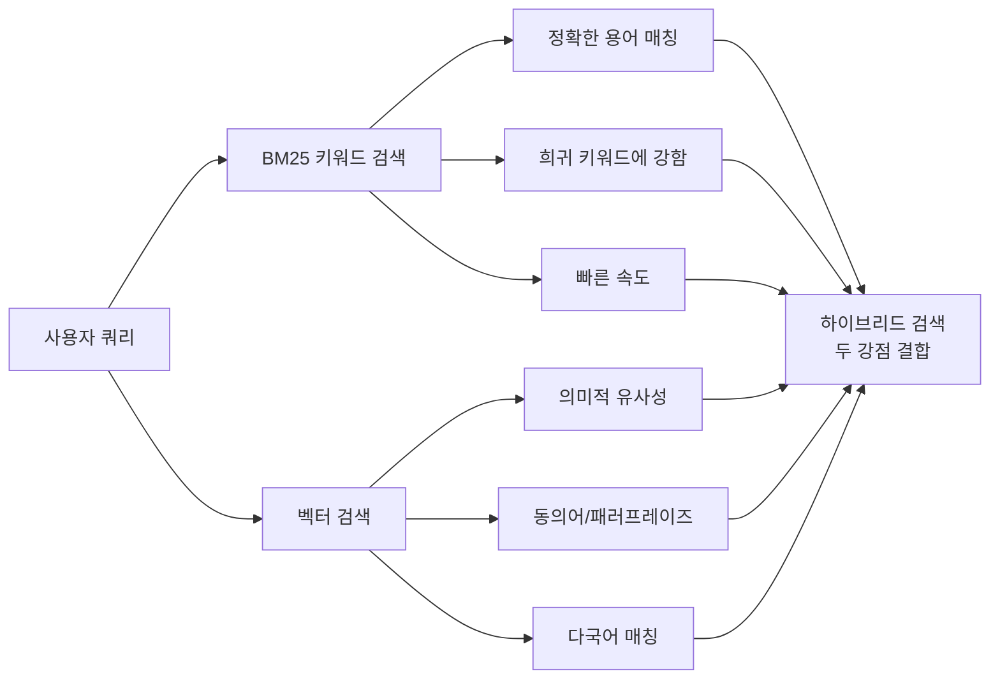
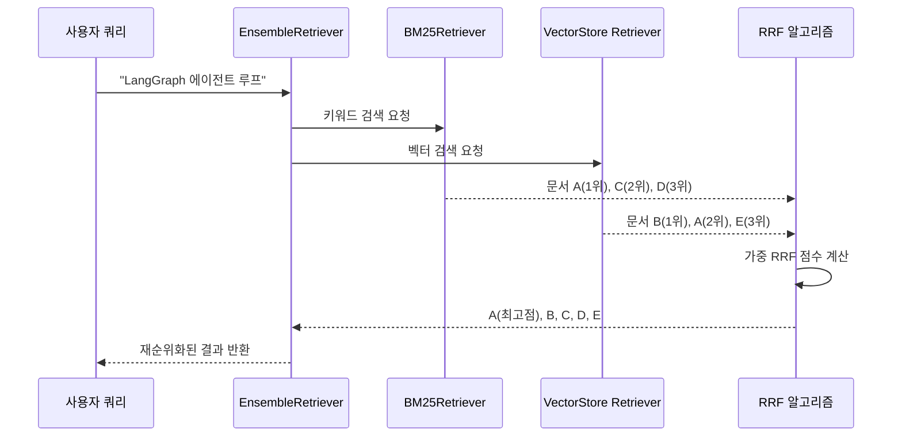
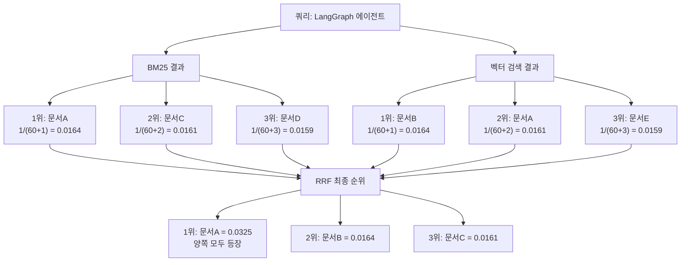
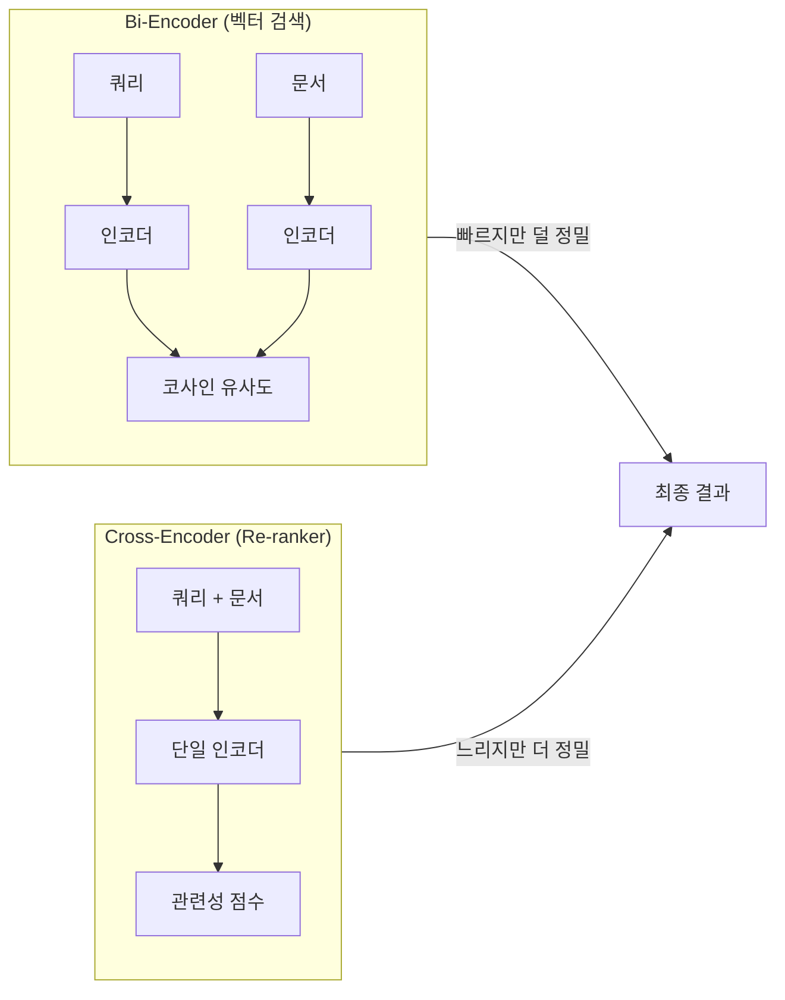
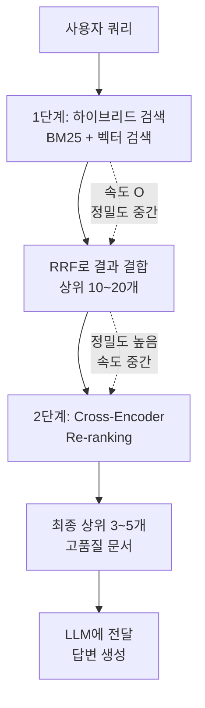

# 하이브리드 검색 전략

> 벡터 검색과 BM25 키워드 검색을 결합하고, Reciprocal Rank Fusion과 Re-ranking으로 검색 품질을 극대화하는 전략

## 개요

이 섹션에서는 단일 검색 방식의 한계를 넘어, **벡터 검색(Semantic Search)**과 **BM25 키워드 검색(Lexical Search)**을 결합하는 하이브리드 검색 전략을 다룹니다. 두 검색 결과를 하나로 합치는 **Reciprocal Rank Fusion(RRF)** 알고리즘과, 최종 결과의 정밀도를 높이는 **Re-ranking** 기법까지 완전한 파이프라인을 구축합니다.

**선수 지식**: [Adaptive RAG 아키텍처](13-ch13-adaptive-rag와-동적-라우팅/01-01-adaptive-rag-아키텍처.md)의 전체 구조와 [쿼리 분석과 라우터 구현](13-ch13-adaptive-rag와-동적-라우팅/02-02-쿼리-분석과-라우터-구현.md)에서 배운 ChromaDB 벡터 검색 통합

**학습 목표**:
- 벡터 검색과 BM25 키워드 검색의 차이를 설명하고 각각의 강점을 활용할 수 있다
- EnsembleRetriever와 RRF 알고리즘으로 하이브리드 검색을 구현할 수 있다
- Cross-Encoder Re-ranking으로 검색 결과의 정밀도를 높일 수 있다
- Adaptive RAG 파이프라인에 하이브리드 검색을 통합할 수 있다

## 왜 알아야 할까?

앞서 우리는 쿼리 라우터로 "벡터 검색이냐 웹 검색이냐"를 결정하는 Adaptive RAG를 만들었는데요. 하지만 벡터 검색 하나만으로는 모든 쿼리를 잘 처리할 수 없습니다.

"LangGraph v1.1 StateGraph compile 에러"처럼 **정확한 키워드가 중요한 쿼리**를 생각해보세요. 벡터 검색은 의미적으로 비슷한 문서를 잘 찾지만, "v1.1"이나 "compile"이라는 특정 단어가 들어간 문서를 놓칠 수 있습니다. 반대로 "에이전트가 스스로 판단해서 행동하는 방법"처럼 **의미 파악이 중요한 쿼리**에서는 키워드 검색이 힘을 못 쓰죠.

프로덕션 RAG 시스템에서는 이 두 가지를 **함께 쓰는 것이 표준**입니다. Elasticsearch, Azure AI Search, OpenSearch 같은 엔터프라이즈 검색 엔진 모두 하이브리드 검색을 기본 제공하고 있고, LangChain 생태계에서도 `EnsembleRetriever`를 통해 이 패턴을 지원합니다.

## 핵심 개념

### 개념 1: 두 가지 검색의 상보성

> 💡 **비유**: 도서관에서 책을 찾는 두 가지 방법을 상상해보세요. **키워드 검색**은 도서관 카탈로그에서 제목이나 저자명으로 정확히 검색하는 것이고, **벡터 검색**은 "기후변화가 농업에 미치는 영향"처럼 **관심 주제를 설명하면** 사서가 관련 책을 추천해주는 것입니다. 카탈로그 검색은 정확하지만 다른 표현으로 쓰인 책을 놓치고, 사서 추천은 폭이 넓지만 특정 판본을 찾기엔 부족하죠. 둘을 합치면 최고의 결과를 얻습니다.

**BM25 키워드 검색**은 쿼리와 문서 사이에 공유하는 단어의 빈도와 희소성을 기반으로 점수를 매깁니다. TF(Term Frequency)와 IDF(Inverse Document Frequency)를 결합한 통계적 방법이죠.

**벡터 검색(Semantic Search)**은 쿼리와 문서를 임베딩 벡터로 변환한 뒤 코사인 유사도 등으로 의미적 거리를 측정합니다.

> 📊 **그림 1**: 키워드 검색과 벡터 검색의 강점 비교



| 특성 | BM25 키워드 검색 | 벡터 검색 |
|------|-----------------|----------|
| **매칭 방식** | 정확한 단어 일치 | 의미적 유사성 |
| **강점** | 고유명사, 코드, 버전 번호 | 동의어, 추상적 질문 |
| **약점** | 동의어/패러프레이즈 못 찾음 | 정확한 키워드 놓칠 수 있음 |
| **속도** | 매우 빠름 (역인덱스) | 상대적으로 느림 (ANN 검색) |
| **사전 준비** | 토크나이징만 필요 | 임베딩 모델 + 벡터 DB 필요 |

```python
# BM25가 잘 찾는 쿼리 예시
query_keyword = "LangGraph StateGraph compile() TypeError"
# → "StateGraph", "compile()", "TypeError" 같은 정확한 키워드 매칭이 핵심

# 벡터 검색이 잘 찾는 쿼리 예시
query_semantic = "에이전트가 스스로 판단해서 다음 행동을 결정하는 방법"
# → "자율적 의사결정", "ReAct 패턴" 등 의미적으로 유사한 문서 매칭
```

### 개념 2: BM25Retriever와 EnsembleRetriever

> 💡 **비유**: EnsembleRetriever는 **심사위원단**과 같습니다. 한 심사위원(BM25)은 기술적 정확성을 보고, 다른 심사위원(벡터 검색)은 창의성과 맥락을 봅니다. 각자의 점수를 모아 **가중 투표**로 최종 순위를 결정하면, 한 명의 심사위원보다 더 공정한 결과가 나오죠.

LangChain의 `EnsembleRetriever`는 여러 리트리버의 결과를 **Reciprocal Rank Fusion(RRF)** 알고리즘으로 결합합니다. 각 리트리버에 가중치(weight)를 부여하여 어떤 검색 방식에 더 비중을 둘지 조절할 수 있습니다.

> 📊 **그림 2**: EnsembleRetriever의 동작 흐름



```python
from langchain_community.retrievers import BM25Retriever
from langchain.retrievers import EnsembleRetriever
from langchain_chroma import Chroma
from langchain_openai import OpenAIEmbeddings
from langchain_core.documents import Document

# 예시 문서 준비
docs = [
    Document(page_content="LangGraph StateGraph는 노드와 엣지로 구성된 상태 기계입니다.", 
             metadata={"source": "langgraph-docs"}),
    Document(page_content="에이전트 루프는 LLM이 도구를 반복 호출하며 문제를 해결하는 패턴입니다.",
             metadata={"source": "agent-guide"}),
    Document(page_content="compile() 메서드는 StateGraph를 실행 가능한 CompiledStateGraph로 변환합니다.",
             metadata={"source": "langgraph-api"}),
    Document(page_content="ReAct 패턴에서 에이전트는 추론과 행동을 번갈아 수행합니다.",
             metadata={"source": "react-paper"}),
]

# 1. BM25 리트리버 생성
bm25_retriever = BM25Retriever.from_documents(docs, k=3)

# 2. 벡터 리트리버 생성
vectorstore = Chroma.from_documents(docs, OpenAIEmbeddings())
vector_retriever = vectorstore.as_retriever(search_kwargs={"k": 3})

# 3. 앙상블 리트리버 결합
ensemble_retriever = EnsembleRetriever(
    retrievers=[bm25_retriever, vector_retriever],
    weights=[0.4, 0.6],  # 벡터 검색에 약간 더 높은 가중치
)

# 검색 실행
results = ensemble_retriever.invoke("StateGraph compile 에이전트 루프")
for doc in results:
    print(f"[{doc.metadata['source']}] {doc.page_content[:60]}...")
```

`weights` 파라미터는 RRF 점수 계산 시 각 리트리버의 기여도를 조절합니다. 키워드 정확도가 중요한 도메인(법률, 의료)에서는 BM25 가중치를 높이고, 의미 파악이 중요한 도메인(고객 지원, 일반 Q&A)에서는 벡터 검색 가중치를 높이는 것이 일반적입니다.

### 개념 3: Reciprocal Rank Fusion(RRF) 알고리즘

> 💡 **비유**: 여러 음식 평론가가 각자 맛집 TOP 10을 추천했다고 합시다. RRF는 "1등 추천은 높은 점수, 10등 추천은 낮은 점수"를 주고, **여러 평론가에게 동시에 추천받은 식당**에 가산점을 주는 방식입니다. 모든 평론가가 상위에 올린 식당이 최종 1등이 됩니다.

RRF의 핵심 공식은 아주 간단합니다:

$$RRF(d) = \sum_{r \in R} \frac{w_r}{k + rank_r(d)}$$

- $d$: 문서
- $R$: 리트리버 집합 (BM25, 벡터 검색 등)
- $w_r$: 리트리버 $r$의 가중치
- $rank_r(d)$: 리트리버 $r$에서 문서 $d$의 순위 (1부터 시작)
- $k$: 상수 (기본값 60, 순위 간 점수 차이를 완만하게 만듦)

이 공식이 의미하는 바는, **순위가 높을수록 높은 점수**를 받고(분모가 작아지므로), **여러 리트리버에서 동시에 등장하면 점수가 합산**된다는 것입니다. $k=60$이라는 값은 원 논문에서 실험적으로 검증된 최적값인데, 1위와 2위의 점수 차이를 지나치게 크지 않게 만들어 안정적인 결과를 줍니다.

> 📊 **그림 3**: RRF 점수 계산 흐름



아래 코드로 RRF가 실제로 어떻게 동작하는지 직접 확인해볼 수 있습니다:

```run:python
def reciprocal_rank_fusion(rankings: list[list[str]], weights: list[float], k: int = 60) -> dict[str, float]:
    """RRF 알고리즘 구현"""
    rrf_scores: dict[str, float] = {}
    for ranking, weight in zip(rankings, weights):
        for rank, doc in enumerate(ranking, start=1):
            if doc not in rrf_scores:
                rrf_scores[doc] = 0.0
            rrf_scores[doc] += weight / (k + rank)
    return dict(sorted(rrf_scores.items(), key=lambda x: x[1], reverse=True))

# BM25 결과: A > C > D
bm25_ranking = ["문서A", "문서C", "문서D"]
# 벡터 검색 결과: B > A > E  
vector_ranking = ["문서B", "문서A", "문서E"]

# 가중치: BM25=0.4, 벡터=0.6
scores = reciprocal_rank_fusion(
    rankings=[bm25_ranking, vector_ranking],
    weights=[0.4, 0.6],
    k=60,
)

for doc, score in scores.items():
    print(f"{doc}: {score:.6f}")
```

```output
문서A: 0.016325
문서B: 0.009836
문서C: 0.006452
문서D: 0.006349
문서E: 0.009524
```

문서A가 양쪽 리트리버에서 모두 등장했기 때문에 점수가 합산되어 1위를 차지했습니다. 이것이 RRF의 핵심 원리입니다.

### 개념 4: Re-ranking으로 정밀도 높이기

> 💡 **비유**: 하이브리드 검색이 서류 심사(1차 선발)라면, Re-ranking은 **면접(2차 심사)**입니다. 서류 심사에서 100명을 빠르게 걸렀다면, 면접에서는 10명을 한 명 한 명 깊이 평가하는 거죠. Re-ranker는 쿼리와 문서를 **함께 읽으면서** 관련성을 정밀하게 판단합니다.

RRF로 결합한 결과도 여전히 개별 검색의 한계를 완전히 극복하지는 못합니다. **Cross-Encoder Re-ranker**는 쿼리와 문서를 **하나의 입력으로 함께** 인코딩하여 관련성 점수를 매깁니다. Bi-encoder(벡터 검색)가 쿼리와 문서를 따로 인코딩하는 것과 대비되죠.

> 📊 **그림 4**: Bi-Encoder vs Cross-Encoder 비교



Cross-Encoder는 Bi-Encoder보다 훨씬 정밀하지만, 모든 문서와 쿼리 쌍에 대해 개별 추론을 수행하므로 속도가 느립니다. 그래서 **전체 컬렉션에 직접 적용하는 것이 아니라**, 1차 검색(BM25 + 벡터) 결과 상위 N개에만 적용하는 2단계 파이프라인이 표준입니다.

```python
from langchain.retrievers import ContextualCompressionRetriever
from langchain.retrievers.document_compressors import CrossEncoderReranker
from langchain_community.cross_encoders import HuggingFaceCrossEncoder

# Cross-Encoder 모델 로드
model = HuggingFaceCrossEncoder(model_name="BAAI/bge-reranker-base")

# Re-ranker 생성 (상위 3개만 반환)
compressor = CrossEncoderReranker(model=model, top_n=3)

# 1차: EnsembleRetriever → 2차: CrossEncoder Re-ranking
reranking_retriever = ContextualCompressionRetriever(
    base_compressor=compressor,
    base_retriever=ensemble_retriever,  # 앞서 만든 하이브리드 리트리버
)

# 검색 + 재순위화 실행
results = reranking_retriever.invoke("LangGraph 에이전트 루프 구현")
```

> 📊 **그림 5**: 2단계 검색 파이프라인 전체 흐름



## 실습: 직접 해보기

Adaptive RAG 파이프라인에 하이브리드 검색과 Re-ranking을 통합하는 완전한 예제를 구축합니다.

```python
"""Adaptive RAG에 하이브리드 검색 + Re-ranking 통합"""

from typing import TypedDict, Annotated, Literal
from langchain_core.documents import Document
from langchain_community.retrievers import BM25Retriever
from langchain.retrievers import EnsembleRetriever
from langchain.retrievers import ContextualCompressionRetriever
from langchain.retrievers.document_compressors import CrossEncoderReranker
from langchain_community.cross_encoders import HuggingFaceCrossEncoder
from langchain_chroma import Chroma
from langchain_openai import ChatOpenAI, OpenAIEmbeddings
from langchain_core.prompts import ChatPromptTemplate
from langgraph.graph import StateGraph, START, END
import operator

# ── 1. 문서 준비 ──
sample_docs = [
    Document(
        page_content="LangGraph의 StateGraph는 노드와 엣지로 구성됩니다. "
                     "compile() 메서드로 실행 가능한 그래프로 변환하며, "
                     "체크포인트를 통해 상태를 영속적으로 저장할 수 있습니다.",
        metadata={"source": "langgraph-docs", "topic": "stategraph"},
    ),
    Document(
        page_content="ReAct 패턴은 Reasoning과 Acting을 결합한 에이전트 패턴입니다. "
                     "LLM이 추론(Thought) → 행동(Action) → 관찰(Observation) 루프를 "
                     "반복하며 복잡한 문제를 해결합니다.",
        metadata={"source": "react-paper", "topic": "react"},
    ),
    Document(
        page_content="MCP(Model Context Protocol)는 LLM 애플리케이션과 외부 도구 간의 "
                     "표준 통합 프로토콜입니다. FastMCP 프레임워크를 사용하면 "
                     "데코레이터 기반으로 도구를 쉽게 노출할 수 있습니다.",
        metadata={"source": "mcp-spec", "topic": "mcp"},
    ),
    Document(
        page_content="에이전트의 도구 호출은 LLM이 구조화된 JSON으로 함수명과 인자를 "
                     "출력하는 기능입니다. OpenAI와 Anthropic 모두 네이티브 "
                     "tool calling을 지원합니다.",
        metadata={"source": "tool-calling-guide", "topic": "tools"},
    ),
    Document(
        page_content="Human-in-the-Loop은 에이전트 실행 중 사람의 승인이나 수정을 "
                     "받는 워크플로우입니다. LangGraph의 interrupt_before와 "
                     "interrupt_after로 구현합니다.",
        metadata={"source": "hitl-guide", "topic": "hitl"},
    ),
]

# ── 2. 하이브리드 리트리버 구축 ──
# BM25 리트리버 (키워드 검색)
bm25_retriever = BM25Retriever.from_documents(sample_docs, k=4)

# 벡터 리트리버 (시맨틱 검색)
vectorstore = Chroma.from_documents(sample_docs, OpenAIEmbeddings())
vector_retriever = vectorstore.as_retriever(search_kwargs={"k": 4})

# 앙상블 리트리버 (RRF 결합)
ensemble_retriever = EnsembleRetriever(
    retrievers=[bm25_retriever, vector_retriever],
    weights=[0.4, 0.6],  # 시맨틱 검색에 가중치 부여
)

# ── 3. Re-ranker 구축 ──
cross_encoder = HuggingFaceCrossEncoder(model_name="BAAI/bge-reranker-base")
reranker = CrossEncoderReranker(model=cross_encoder, top_n=3)

hybrid_reranking_retriever = ContextualCompressionRetriever(
    base_compressor=reranker,
    base_retriever=ensemble_retriever,
)


# ── 4. 상태 정의 ──
class AdaptiveRAGState(TypedDict):
    question: str
    route: str
    documents: Annotated[list[Document], operator.add]
    generation: str


# ── 5. 노드 정의 ──
llm = ChatOpenAI(model="gpt-4o-mini", temperature=0)

def hybrid_retrieve(state: AdaptiveRAGState) -> dict:
    """하이브리드 검색 + Re-ranking 노드"""
    question = state["question"]
    # EnsembleRetriever → CrossEncoder Re-ranking 파이프라인 실행
    docs = hybrid_reranking_retriever.invoke(question)
    return {"documents": docs}


def generate(state: AdaptiveRAGState) -> dict:
    """검색 결과 기반 답변 생성"""
    question = state["question"]
    docs = state["documents"]
    
    context = "\n\n".join(doc.page_content for doc in docs)
    prompt = ChatPromptTemplate.from_template(
        "다음 맥락을 기반으로 질문에 답하세요.\n\n"
        "맥락:\n{context}\n\n"
        "질문: {question}\n\n"
        "답변:"
    )
    chain = prompt | llm
    response = chain.invoke({"context": context, "question": question})
    return {"generation": response.content}


# ── 6. 그래프 구성 ──
builder = StateGraph(AdaptiveRAGState)
builder.add_node("hybrid_retrieve", hybrid_retrieve)
builder.add_node("generate", generate)

builder.add_edge(START, "hybrid_retrieve")
builder.add_edge("hybrid_retrieve", "generate")
builder.add_edge("generate", END)

graph = builder.compile()

# ── 7. 실행 ──
result = graph.invoke({
    "question": "LangGraph StateGraph compile 방법과 에이전트 루프",
    "route": "",
    "documents": [],
    "generation": "",
})

print(f"질문: {result['question']}")
print(f"검색된 문서 수: {len(result['documents'])}")
print(f"답변: {result['generation'][:200]}...")
```

이 코드는 [쿼리 분석과 라우터 구현](13-ch13-adaptive-rag와-동적-라우팅/02-02-쿼리-분석과-라우터-구현.md)에서 만든 벡터 검색 단일 리트리버를, 하이브리드 검색 + Re-ranking 파이프라인으로 교체한 것입니다. `retrieve_node` 하나만 바꾸면 기존 Adaptive RAG 그래프에 바로 통합됩니다.

> 🔥 **실무 팁**: 가중치 튜닝은 도메인에 따라 다릅니다. **기술 문서/코드 검색**에서는 `[0.5, 0.5]` 또는 BM25에 더 높은 `[0.6, 0.4]`가, **일반 Q&A**에서는 벡터 검색 가중치를 높인 `[0.3, 0.7]`이 효과적인 경우가 많습니다. 실제로는 평가 데이터셋으로 테스트하면서 최적값을 찾아야 합니다.

## 더 깊이 알아보기

### BM25의 탄생 — "Best Matching"의 25번째 시도

BM25는 이름부터 흥미로운 알고리즘입니다. "BM"은 **Best Matching**의 약자이고, "25"는 **25번째 반복 실험**이라는 뜻입니다. 1970~80년대 런던 시티 대학의 Stephen Robertson과 Karen Spärck Jones가 확률적 정보 검색 모델을 연구하면서, 수십 차례 실험 끝에 25번째 변형이 가장 좋은 성능을 보였죠.

이 알고리즘이 처음 탑재된 시스템 이름이 **Okapi**였기 때문에, 정식 명칭은 Okapi BM25입니다. Okapi는 아프리카 콩고에 사는 동물인데, 왜 이 이름이 붙었는지는 연구실의 비밀이라고 합니다. 1994년 Robertson과 Walker가 SIGIR 학회에서 BM25를 공식 발표한 이후, 이 알고리즘은 30년이 지난 지금도 검색 엔진의 기본 랭킹 함수로 사용되고 있습니다. Elasticsearch, Lucene, OpenSearch 모두 BM25를 기본 랭킹 알고리즘으로 채택하고 있죠.

### RRF의 발견 — 놀라울 만큼 단순한 해법

Reciprocal Rank Fusion은 2009년 Gordon Cormack, Charles Clarke, Stefan Büttcher가 제안했습니다. 놀라운 점은, **어떤 정교한 학습도 필요 없이** 단순히 순위의 역수를 합산하는 것만으로 복잡한 학습 기반 방법들을 능가했다는 것입니다. 논문에서 저자들은 "간단함이 우리의 주요 장점"이라고 직접 밝혔습니다. 이후 Azure AI Search, Elasticsearch, OpenSearch 등 주요 검색 엔진이 RRF를 하이브리드 검색의 표준 결합 방법으로 채택했습니다.

## 흔한 오해와 팁

> ⚠️ **흔한 오해**: "벡터 검색이 BM25보다 항상 우월하다"라고 생각하기 쉽지만, 실제 벤치마크에서는 특정 도메인(법률, 의학, 코드)에서 BM25가 벡터 검색을 능가하는 경우가 많습니다. 특히 전문 용어나 고유명사가 중요한 쿼리에서 BM25의 정확한 매칭 능력은 대체하기 어렵습니다.

> 💡 **알고 계셨나요?**: RRF에서 상수 $k=60$은 원 논문에서 실험적으로 결정된 값입니다. Azure AI Search도 동일하게 60을 사용합니다. 이 값을 크게 바꿔도 결과 차이는 미미한데, $k$가 클수록 순위 간 점수 차이가 줄어들어 "민주적인" 결합이 되고, 작을수록 상위 순위에 가산점이 큽니다.

> 🔥 **실무 팁**: Re-ranker는 연산 비용이 큽니다. `BAAI/bge-reranker-base`는 가볍지만 성능이 좋은 선택이고, 더 높은 정밀도가 필요하면 `BAAI/bge-reranker-v2-m3`를 고려하세요. 프로덕션에서는 1차 검색으로 10~20개를 가져온 뒤 Re-ranker로 3~5개만 남기는 것이 비용 대비 효과가 좋습니다.

## 핵심 정리

| 개념 | 설명 |
|------|------|
| **하이브리드 검색** | BM25(키워드) + 벡터(시맨틱) 검색을 결합하여 두 방식의 강점을 활용 |
| **BM25Retriever** | `langchain_community.retrievers`의 TF-IDF 기반 키워드 검색기 |
| **EnsembleRetriever** | 여러 리트리버 결과를 RRF로 결합하는 LangChain 클래스 |
| **RRF 공식** | $\sum w_r / (k + rank)$ — 순위 역수의 가중 합으로 문서 점수 산출 |
| **Cross-Encoder Re-ranker** | 쿼리+문서를 함께 인코딩하여 정밀한 관련성 점수 산출 |
| **2단계 파이프라인** | 1차(하이브리드 검색, 빠름) → 2차(Re-ranking, 정밀) 구조 |
| **가중치 튜닝** | 도메인별로 BM25/벡터 가중치 조절 — 키워드 중요 도메인은 BM25 비중 상향 |

## 다음 섹션 미리보기

하이브리드 검색으로 1차 검색 품질을 높였지만, 한 번의 검색으로 충분하지 않을 때가 있습니다. [반복적 검색과 자기교정 통합](13-ch13-adaptive-rag와-동적-라우팅/04-04-반복적-검색과-자기교정-통합.md)에서는 검색 결과가 불충분할 때 **쿼리를 재작성하여 다시 검색**하는 Iterative RAG 패턴과, 환각을 감지하면 **자동으로 재생성**하는 자기교정 루프를 Adaptive RAG 그래프에 통합합니다.

## 참고 자료

- [LangChain BM25 Integration](https://docs.langchain.com/oss/python/integrations/retrievers/bm25) - BM25Retriever 공식 문서, 설치와 사용법 안내
- [LangChain EnsembleRetriever API Reference](https://api.python.langchain.com/en/latest/retrievers/langchain.retrievers.ensemble.EnsembleRetriever.html) - EnsembleRetriever 파라미터와 RRF 가중치 설정 레퍼런스
- [LangChain CrossEncoderReranker API](https://api.python.langchain.com/en/latest/retrievers/langchain.retrievers.document_compressors.cross_encoder_rerank.CrossEncoderReranker.html) - CrossEncoderReranker 공식 API 문서
- [Advanced RAG — Understanding RRF in Hybrid Search](https://glaforge.dev/posts/2026/02/10/advanced-rag-understanding-reciprocal-rank-fusion-in-hybrid-search/) - RRF 알고리즘의 수학적 직관과 실전 적용 사례
- [Optimizing RAG with Hybrid Search & Reranking (VectorHub)](https://superlinked.com/vectorhub/articles/optimizing-rag-with-hybrid-search-reranking) - 하이브리드 검색과 Re-ranking의 성능 비교 분석
- [The Probabilistic Relevance Framework: BM25 and Beyond](https://www.staff.city.ac.uk/~sbrp622/papers/foundations_bm25_review.pdf) - Robertson & Zaragoza의 BM25 원전 논문

---
### 🔗 Related Sessions
- [stategraph](04-ch4-langgraph-stategraph-기초/01-01-langgraph-아키텍처-개관.md) (prerequisite)
- [adaptive rag](13-ch13-adaptive-rag와-동적-라우팅/01-01-adaptive-rag-아키텍처.md) (prerequisite)
- [쿼리 라우터](13-ch13-adaptive-rag와-동적-라우팅/01-01-adaptive-rag-아키텍처.md) (prerequisite)
