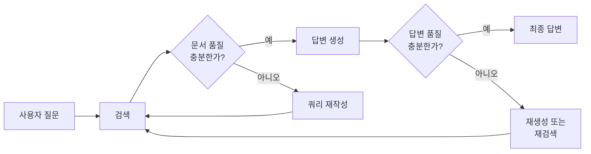
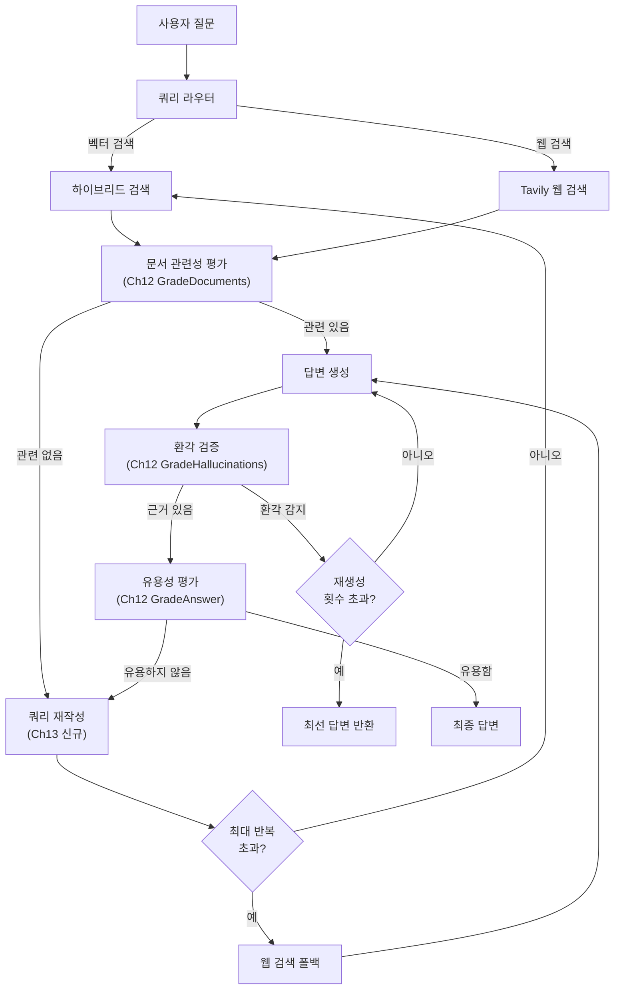
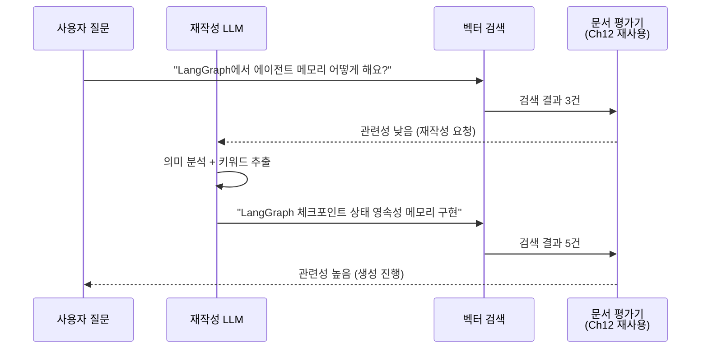
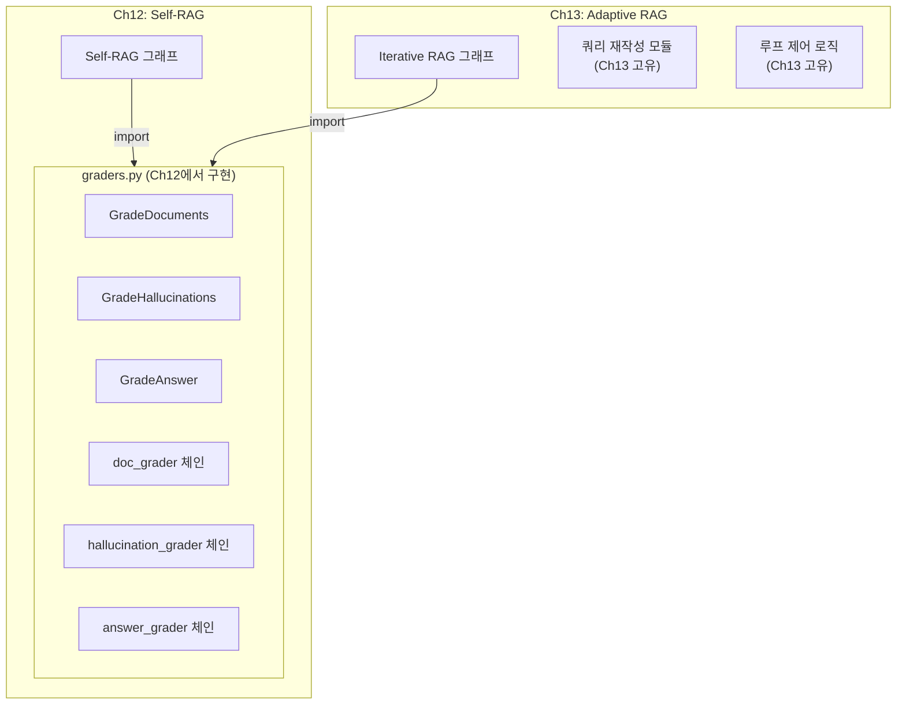
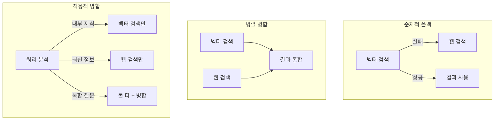
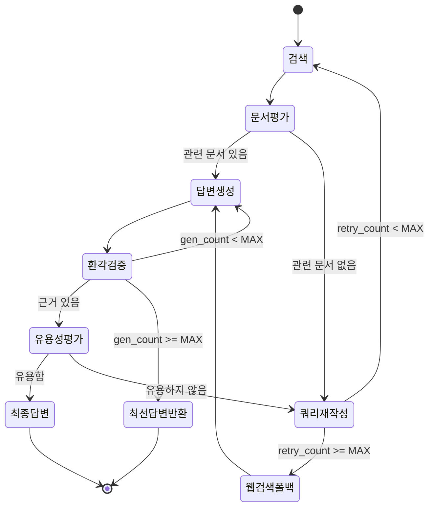

# 반복적 검색과 자기교정 통합

> 검색 결과가 불충분할 때 쿼리를 재작성하고, 환각을 감지하면 자동 재생성하는 Iterative RAG 루프를 구현합니다.

## 개요

이 섹션에서는 Adaptive RAG의 핵심 엔진인 **반복적 검색(Iterative Retrieval)**과 **자기교정(Self-Correction)** 메커니즘을 완전한 LangGraph 그래프로 통합합니다. 앞선 세션들에서 만든 쿼리 라우터, 하이브리드 검색기, 문서 평가기를 하나의 자기교정 루프로 엮어, "검색 → 평가 → 재작성 → 재검색 → 생성 → 환각 검증 → 재생성"이라는 완전한 파이프라인을 구축합니다.

[Self-RAG와 평가 시스템](12-ch12-self-rag와-품질-평가-루프/03-03-self-rag-평가-시스템-구현.md)에서 구현한 `GradeDocuments`, `GradeHallucinations`, `GradeAnswer` 평가 모듈을 **그대로 재사용**하면서, 이 세션에서는 **쿼리 재작성**, **반복 루프 제어**, **다중 소스 병합**이라는 Adaptive RAG 고유의 로직에 집중합니다.

**선수 지식**:
- [Adaptive RAG 아키텍처](13-ch13-adaptive-rag와-동적-라우팅/01-01-adaptive-rag-아키텍처.md)의 전체 흐름과 상태 스키마
- [쿼리 분석과 라우터 구현](13-ch13-adaptive-rag와-동적-라우팅/02-02-쿼리-분석과-라우터-구현.md)의 Few-shot 라우터와 Tavily/ChromaDB 통합
- [하이브리드 검색 전략](13-ch13-adaptive-rag와-동적-라우팅/03-03-하이브리드-검색-전략.md)의 EnsembleRetriever와 Re-ranking
- [Self-RAG 평가 시스템 구현](12-ch12-self-rag와-품질-평가-루프/03-03-self-rag-평가-시스템-구현.md)의 문서 관련성·환각·유용성 평가기

**학습 목표**:
- Ch12에서 구현한 평가 모듈을 임포트하여 Adaptive RAG 루프에 통합할 수 있다
- 쿼리 재작성(Query Rewriting) 노드를 구현하고 반복 루프에 통합할 수 있다
- 무한 루프 방지를 위한 최대 반복 횟수와 품질 임계값을 설계할 수 있다
- 다중 소스(벡터 검색 + 웹 검색) 결과를 병합하는 전략을 구현할 수 있다

## 왜 알아야 할까?

실제 서비스에서 RAG 시스템을 운영해보면, 한 번의 검색으로 충분한 답변을 얻는 경우는 생각보다 적습니다. 사용자의 질문이 모호하거나, 벡터 DB의 임베딩이 질문의 의도를 정확히 포착하지 못하거나, 검색된 문서가 질문과 겉보기에만 관련 있는 경우가 빈번하거든요.

이런 상황에서 "검색 결과가 부실하니 그냥 답하겠습니다"라고 넘어가면 환각(Hallucination)이 발생합니다. 반대로, 매번 사람이 개입해서 "다시 검색해줘"라고 할 수도 없죠. **자기교정 RAG**는 이 문제를 에이전트 스스로 해결합니다 — 마치 도서관에서 원하는 책을 못 찾았을 때, 사서에게 "혹시 다른 키워드로 검색해볼까요?"라고 묻는 것처럼요.

> 📊 **그림 0**: 자기교정 RAG의 핵심 아이디어 — 검색과 생성 양쪽에 피드백 루프 적용



Ch12에서 구현한 Self-RAG는 "검색할지 말지", "문서가 관련 있는지", "환각이 있는지"를 **개별 판단**하는 데 집중했습니다. 이번 세션에서는 그 판단 모듈들을 **루프 안에 배치**하여, 실패 시 자동으로 쿼리를 재작성하고 재검색하는 **적응적 파이프라인**을 완성합니다. 같은 평가기를 사용하되, 사용 맥락이 완전히 다른 거죠.

프로덕션 환경에서 Iterative RAG를 도입한 시스템은 Naive RAG 대비 **Recall이 크게 향상**되고, **환각률이 절반 이하로 감소**하는 것으로 보고되고 있습니다. 이번 세션에서 구현하는 패턴이 바로 그 핵심 엔진입니다.

## 핵심 개념

### 개념 1: Iterative RAG 루프의 구조

> 💡 **비유**: 시험공부할 때를 생각해보세요. 교과서에서 답을 찾았는데 "이게 정말 맞나?" 싶으면, 질문을 다시 정리하고 다른 챕터를 뒤져보죠. 여전히 확신이 안 서면 인터넷 검색까지 동원합니다. Iterative RAG는 이 과정을 자동화한 겁니다.

Iterative RAG는 단순한 "검색 → 생성" 파이프라인에 **피드백 루프**를 추가한 패턴입니다. 핵심은 두 가지 검증 게이트인데, 이 게이트는 [Ch12에서 구현한 평가기](12-ch12-self-rag와-품질-평가-루프/03-03-self-rag-평가-시스템-구현.md)를 그대로 사용합니다:

1. **문서 관련성 게이트** (`GradeDocuments`): 검색된 문서가 질문과 관련 있는가?
2. **환각 검증 게이트** (`GradeHallucinations`): 생성된 답변이 검색된 문서에 근거하는가?

**Ch12 vs Ch13에서의 평가기 역할 차이:**

| 관점 | Ch12 (Self-RAG) | Ch13 (Adaptive RAG) |
|------|-----------------|---------------------|
| **문서 평가** | 검색 여부 자체를 결정 | 재검색/쿼리 재작성 트리거 |
| **환각 검증** | 단일 생성 후 통과/실패 | 실패 시 자동 재생성 루프 |
| **유용성 평가** | 최종 품질 게이트 | 실패 시 외부 루프(재검색)로 복귀 |
| **실패 처리** | 사용자에게 실패 알림 | 쿼리 재작성 → 재검색 → 웹 폴백 |

어느 게이트든 통과하지 못하면, 시스템은 자동으로 쿼리를 재작성하거나 답변을 재생성합니다. Ch12에서는 실패하면 멈추었지만, 여기서는 **루프가 돌면서 스스로 복구**합니다.

> 📊 **그림 1**: Iterative RAG 자기교정 루프의 전체 흐름 — Ch12 평가기 재사용 + 신규 루프 제어 로직



이 흐름에서 핵심은 **두 개의 루프**가 존재한다는 점입니다:
- **외부 루프**: 문서 관련성 실패 → 쿼리 재작성 → 재검색
- **내부 루프**: 환각 감지 → 답변 재생성

### 개념 2: 쿼리 재작성(Query Rewriting) — Adaptive RAG의 핵심 신규 모듈

> 💡 **비유**: 검색 엔진에서 원하는 결과가 안 나올 때, 검색어를 바꿔보는 것과 같습니다. "파이썬 에러"로 검색했다가 안 나오면 "Python TypeError 해결법"으로 바꾸는 것처럼요. 쿼리 재작성 노드가 이 "검색어 최적화"를 LLM으로 자동화합니다.

쿼리 재작성은 Ch12의 평가 시스템에는 없던, Adaptive RAG에서 새로 추가되는 핵심 모듈입니다. 원래 질문의 **의미적 의도(semantic intent)**를 분석해서, 벡터 검색에 더 적합한 형태로 변환하는 과정입니다. 단순히 단어를 바꾸는 게 아니라, 질문의 핵심을 추출하고 검색 친화적인 표현으로 재구성합니다.

> 📊 **그림 2**: 쿼리 재작성의 동작 원리 — 평가기 실패를 트리거로 재작성 실행



구현에서 중요한 포인트는 **재작성 프롬프트의 설계**입니다. 단순히 "질문을 개선해줘"가 아니라, 검색 시스템의 특성에 맞춘 지시와 **이전 시도 이력**을 반영해야 합니다:

```python
from langchain_core.prompts import ChatPromptTemplate
from langchain_core.output_parsers import StrOutputParser
from langchain_openai import ChatOpenAI

llm = ChatOpenAI(model="gpt-4o-mini", temperature=0)

# 쿼리 재작성 체인 — 이력을 참고하여 다른 관점으로 재작성
rewrite_prompt = ChatPromptTemplate.from_messages([
    ("system", 
     "당신은 벡터 검색에 최적화된 질문 재작성 전문가입니다.\n"
     "원래 질문의 의미적 의도를 파악하고,\n"
     "벡터스토어 검색에 더 적합한 형태로 변환하세요.\n"
     "구체적 키워드를 추가하고, 모호한 표현을 명확하게 만드세요.\n"
     "이전에 시도한 질문들과 다른 관점으로 접근하세요."),
    ("human", 
     "원래 질문: {question}\n"
     "이전 시도: {query_history}\n\n"
     "검색에 최적화된 질문으로 재작성하세요:")
])

question_rewriter = rewrite_prompt | llm | StrOutputParser()
```

### 개념 3: 평가기 재사용 패턴 — Ch12 모듈 임포트

> 💡 **비유**: 회사에서 품질 검사팀(QA)은 하나인데, 여러 생산 라인이 그 팀의 검사를 거치는 것과 같습니다. Ch12에서 만든 평가 모듈은 "QA팀"이고, Ch13의 Iterative 루프는 "새로운 생산 라인"입니다.

Ch12에서 이미 `GradeDocuments`, `GradeHallucinations`, `GradeAnswer` Pydantic 모델과 평가 체인을 구현했습니다. 이를 **별도의 평가 모듈로 분리**하고 여러 파이프라인에서 임포트하는 것이 프로덕션 패턴입니다:

> 📊 **그림 3**: 평가 모듈 재사용 아키텍처



```python
# graders.py — Ch12에서 구현한 평가 모듈 (재사용을 위해 분리)
# 아래는 이미 구현된 모듈의 인터페이스입니다.
# 상세 구현은 Ch12 "Self-RAG 평가 시스템 구현" 세션을 참고하세요.

from pydantic import BaseModel, Field
from langchain_core.prompts import ChatPromptTemplate
from langchain_openai import ChatOpenAI

class GradeDocuments(BaseModel):
    """문서 관련성 이진 평가"""
    binary_score: str = Field(description="관련 있으면 'yes', 없으면 'no'")

class GradeHallucinations(BaseModel):
    """환각 여부 이진 평가"""
    binary_score: str = Field(description="근거 있으면 'yes', 없으면 'no'")

class GradeAnswer(BaseModel):
    """답변 유용성 이진 평가"""
    binary_score: str = Field(description="유용하면 'yes', 아니면 'no'")

def create_graders(llm: ChatOpenAI):
    """Ch12에서 구현한 평가 체인들을 생성하여 반환"""
    # ... Ch12 세션 3의 구현과 동일
    # doc_grader, hallucination_grader, answer_grader를 반환
    pass
```

Adaptive RAG에서는 이 모듈을 임포트하여 사용합니다:

```python
# adaptive_rag.py — Ch13 Iterative RAG
from graders import GradeDocuments, GradeHallucinations, GradeAnswer, create_graders

llm = ChatOpenAI(model="gpt-4o-mini", temperature=0)
doc_grader, hallucination_grader, answer_grader = create_graders(llm)

# Ch13 고유 모듈: 쿼리 재작성기
question_rewriter = rewrite_prompt | llm | StrOutputParser()
```

이렇게 하면 평가 로직의 변경이 필요할 때 한 곳만 수정하면 되고, 두 파이프라인 모두 동일한 품질 기준을 사용하게 됩니다.

### 개념 4: 다중 소스 검색 병합과 폴백 전략

> 💡 **비유**: 도서관에서 책을 못 찾으면 인터넷 검색으로 전환하듯이, 벡터 DB에서 좋은 문서를 못 찾으면 웹 검색으로 폴백합니다. 두 소스의 결과를 합치면 더 풍부한 컨텍스트를 얻을 수 있죠.

Iterative RAG에서 재작성을 반복해도 벡터 DB의 한계로 좋은 결과를 못 얻을 수 있습니다. 이때 **웹 검색 폴백**이 안전망 역할을 합니다. 다중 소스 병합 전략은 세 가지입니다:

1. **순차적 폴백**: 벡터 검색 실패 시에만 웹 검색 (비용 효율적)
2. **병렬 병합**: 항상 두 소스 동시 검색 후 결과 통합 (품질 우선)
3. **적응적 병합**: 쿼리 특성에 따라 동적 결정 (균형)

> 📊 **그림 4**: 다중 소스 검색 병합 전략 비교



웹 검색 결과를 벡터 검색 결과와 동일한 `Document` 형식으로 통합하는 코드 패턴:

```python
from langchain_core.documents import Document
from langchain_community.tools import TavilySearchResults

web_search_tool = TavilySearchResults(max_results=3)

def web_search_node(state: dict) -> dict:
    """웹 검색 수행 후 Document 형식으로 통합"""
    question = state["question"]
    
    # Tavily 웹 검색 실행
    results = web_search_tool.invoke({"query": question})
    
    # 검색 결과를 Document 객체로 변환
    web_documents = [
        Document(
            page_content=result["content"],
            metadata={"source": result["url"], "type": "web_search"}
        )
        for result in results
    ]
    
    # 기존 문서와 병합
    existing_docs = state.get("documents", [])
    merged = existing_docs + web_documents
    
    return {"documents": merged, "question": question}
```

### 개념 5: 무한 루프 방지 — 최대 반복 횟수와 안전장치

> 💡 **비유**: GPS 내비게이션이 "경로를 재탐색합니다"를 무한 반복하면 안 되듯이, Iterative RAG에도 "이쯤이면 멈추자"는 제한이 필요합니다. 없으면 API 비용이 끝없이 쌓이거든요.

자기교정 루프에서 가장 위험한 것은 **무한 루프**입니다. 쿼리를 아무리 재작성해도 벡터 DB에 관련 문서가 없으면 영원히 돌 수 있거든요. 이를 방지하는 세 가지 전략이 있습니다:

1. **최대 반복 횟수(max_retries)**: 상태에 카운터를 두고, 임계값 초과 시 폴백
2. **재작성 이력 추적**: 이전 쿼리들을 기록해서 같은 재작성 반복 방지
3. **타임아웃**: 전체 파이프라인에 시간 제한 설정

```python
from typing import TypedDict, Annotated, List
from langchain_core.documents import Document
import operator

class IterativeRAGState(TypedDict):
    """반복적 검색과 자기교정을 위한 상태 스키마"""
    question: str                                    # 현재 질문
    original_question: str                           # 원본 질문 (변경 불가)
    documents: List[Document]                        # 검색된 문서
    generation: str                                  # 생성된 답변
    retry_count: int                                 # 쿼리 재작성 횟수
    generation_count: int                            # 답변 재생성 횟수
    route: str                                       # 라우팅 결정
    query_history: Annotated[list, operator.add]     # 쿼리 재작성 이력
```

> 📊 **그림 5**: 상태 기반 루프 제어 흐름



## 실습: 직접 해보기

이제 모든 개념을 하나의 완전한 LangGraph 그래프로 통합합니다. Ch12의 평가 모듈을 임포트하고, 쿼리 재작성과 루프 제어만 새로 구현하는 것이 핵심입니다.

### 1단계: 의존성과 평가 모듈 임포트

```python
# 의존성: pip install langchain langchain-openai langgraph langchain-chroma langchain-community tavily-python
import os
from typing import TypedDict, Annotated, List, Literal
from langchain_core.documents import Document
from langchain_core.prompts import ChatPromptTemplate
from langchain_core.output_parsers import StrOutputParser
from langchain_openai import ChatOpenAI, OpenAIEmbeddings
from langchain_chroma import Chroma
from langchain_community.tools import TavilySearchResults
from langgraph.graph import StateGraph, START, END
import operator

# ── Ch12 평가 모듈 임포트 (이미 구현된 모듈 재사용) ──
# 실제 프로젝트에서는 graders.py를 별도 모듈로 분리하여 import
from graders import (
    GradeDocuments, GradeHallucinations, GradeAnswer,
    create_graders
)

# ── 상수 ──
MAX_RETRIEVAL_RETRIES = 3    # 쿼리 재작성 최대 횟수
MAX_GENERATION_RETRIES = 2   # 답변 재생성 최대 횟수

# ── LLM 초기화 및 평가기 생성 ──
llm = ChatOpenAI(model="gpt-4o-mini", temperature=0)
doc_grader, hallucination_grader, answer_grader = create_graders(llm)

# ── 상태 스키마 ──
class AdaptiveRAGState(TypedDict):
    question: str                                     # 현재 질문
    original_question: str                            # 원본 질문
    documents: List[Document]                         # 검색된 문서
    generation: str                                   # 생성된 답변
    retry_count: int                                  # 검색 재시도 카운터
    generation_count: int                             # 생성 재시도 카운터
    route: str                                        # 라우팅 결과
    query_history: Annotated[list, operator.add]      # 쿼리 변경 이력
```

### 2단계: 쿼리 재작성기 — Ch13 고유 모듈

Ch12의 평가기와 달리, 쿼리 재작성은 Adaptive RAG에서 새로 필요한 모듈입니다. 이전 시도 이력을 참고하여 다른 관점으로 재작성하는 것이 핵심입니다:

```python
# ── 쿼리 재작성기 (Ch13 신규 — Adaptive RAG 고유) ──
rewrite_prompt = ChatPromptTemplate.from_messages([
    ("system",
     "당신은 벡터 검색에 최적화된 질문 재작성 전문가입니다.\n"
     "원래 질문의 의미를 유지하면서, 더 구체적이고 검색 친화적인 형태로 변환하세요.\n"
     "이전 시도한 질문들을 참고하여 다른 관점으로 재작성하세요."),
    ("human",
     "원래 질문: {question}\n"
     "이전 시도: {query_history}\n\n"
     "개선된 질문:")
])
question_rewriter = rewrite_prompt | llm | StrOutputParser()
```

### 3단계: 그래프 노드 함수 구현

```python
# ── 샘플 벡터 DB 구성 (실습용) ──
sample_docs = [
    Document(page_content="LangGraph는 StateGraph를 사용하여 상태 기계 기반의 에이전트를 구축합니다. "
             "노드는 함수이고, 엣지는 노드 간 전이를 정의합니다.",
             metadata={"source": "langgraph-docs"}),
    Document(page_content="체크포인트는 그래프 실행의 특정 시점 상태를 저장합니다. "
             "MemorySaver나 SqliteSaver를 사용하여 영속적 실행이 가능합니다.",
             metadata={"source": "langgraph-docs"}),
    Document(page_content="LangGraph의 Adaptive RAG는 쿼리 복잡도에 따라 "
             "No Retrieval, Single-shot, Iterative RAG를 동적으로 선택합니다.",
             metadata={"source": "langgraph-tutorial"}),
]
embeddings = OpenAIEmbeddings(model="text-embedding-3-small")
vectorstore = Chroma.from_documents(sample_docs, embeddings)
retriever = vectorstore.as_retriever(search_kwargs={"k": 3})

# Tavily 웹 검색 도구
web_search_tool = TavilySearchResults(max_results=3)

# ── 노드 함수들 ──
def retrieve(state: AdaptiveRAGState) -> dict:
    """벡터스토어에서 문서 검색"""
    question = state["question"]
    documents = retriever.invoke(question)
    return {"documents": documents}

def web_search(state: AdaptiveRAGState) -> dict:
    """웹 검색 수행 후 Document로 변환"""
    question = state["question"]
    results = web_search_tool.invoke({"query": question})
    web_docs = [
        Document(
            page_content=r["content"],
            metadata={"source": r["url"], "type": "web_search"}
        )
        for r in results
    ]
    # 기존 문서와 병합
    existing = state.get("documents", [])
    return {"documents": existing + web_docs}

def generate(state: AdaptiveRAGState) -> dict:
    """검색된 문서를 기반으로 답변 생성"""
    question = state["question"]
    documents = state["documents"]
    
    # 문서 컨텍스트 구성
    context = "\n\n".join(doc.page_content for doc in documents)
    
    prompt = ChatPromptTemplate.from_messages([
        ("system", "검색된 문서를 기반으로 질문에 답하세요. "
                   "문서에 없는 내용은 추측하지 마세요."),
        ("human", "문서:\n{context}\n\n질문: {question}")
    ])
    
    chain = prompt | llm | StrOutputParser()
    generation = chain.invoke({"context": context, "question": question})
    
    # 재생성 카운터 증가
    gen_count = state.get("generation_count", 0) + 1
    return {"generation": generation, "generation_count": gen_count}

def transform_query(state: AdaptiveRAGState) -> dict:
    """쿼리 재작성 수행 (Ch13 고유 로직)"""
    question = state["question"]
    history = state.get("query_history", [])
    
    # 쿼리 재작성 — 이력을 참고하여 다른 관점으로 접근
    improved = question_rewriter.invoke({
        "question": question,
        "query_history": str(history)
    })
    
    # 카운터 증가 및 이력 기록
    retry_count = state.get("retry_count", 0) + 1
    return {
        "question": improved,
        "retry_count": retry_count,
        "query_history": [improved]  # Annotated[list, operator.add]로 누적
    }
```

### 4단계: 조건부 엣지 — 평가기 호출 + 루프 제어

Ch12의 평가기를 호출하되, 결과에 따른 **분기 로직**(재작성/재생성/폴백)은 Ch13 고유입니다:

```python
def grade_documents_node(state: AdaptiveRAGState) -> dict:
    """문서 관련성을 평가하고 관련 문서만 필터링 — Ch12 평가기 활용"""
    question = state["question"]
    documents = state["documents"]
    
    # Ch12에서 임포트한 doc_grader로 평가
    filtered_docs = []
    for doc in documents:
        score = doc_grader.invoke({
            "document": doc.page_content,
            "question": question
        })
        if score.binary_score == "yes":
            filtered_docs.append(doc)
    
    return {"documents": filtered_docs}

def decide_after_grading(state: AdaptiveRAGState) -> Literal["generate", "transform_query", "web_search_fallback"]:
    """문서 평가 후 다음 단계 결정 — Ch13 고유 루프 제어"""
    documents = state["documents"]
    retry_count = state.get("retry_count", 0)
    
    if documents:
        return "generate"                     # 관련 문서 있음 → 생성
    elif retry_count >= MAX_RETRIEVAL_RETRIES:
        return "web_search_fallback"          # 최대 재시도 초과 → 웹 폴백
    else:
        return "transform_query"              # 쿼리 재작성 → 재검색

def decide_after_generation(state: AdaptiveRAGState) -> Literal["finish", "generate", "transform_query"]:
    """생성 후 이중 검증 — Ch12 평가기 + Ch13 루프 제어"""
    question = state["original_question"]
    generation = state["generation"]
    documents = state["documents"]
    gen_count = state.get("generation_count", 0)
    
    # 1단계: 환각 검증 (Ch12 hallucination_grader 사용)
    docs_text = "\n\n".join(doc.page_content for doc in documents)
    hallucination = hallucination_grader.invoke({
        "documents": docs_text,
        "generation": generation
    })
    
    if hallucination.binary_score == "no":
        # 환각 감지 → 재생성 또는 포기 (Ch13 루프 제어)
        if gen_count >= MAX_GENERATION_RETRIES:
            return "finish"
        return "generate"
    
    # 2단계: 유용성 평가 (Ch12 answer_grader 사용)
    usefulness = answer_grader.invoke({
        "question": question,
        "generation": generation
    })
    
    if usefulness.binary_score == "yes":
        return "finish"
    else:
        # 유용하지 않음 → 외부 루프로 복귀 (Ch13 고유)
        return "transform_query"
```

### 5단계: 그래프 구성 및 컴파일

```python
def initialize_state(state: AdaptiveRAGState) -> dict:
    """초기 상태 설정 — 원본 질문 보존"""
    return {
        "original_question": state["question"],
        "retry_count": 0,
        "generation_count": 0,
        "query_history": [state["question"]]
    }

# ── StateGraph 구성 ──
workflow = StateGraph(AdaptiveRAGState)

# 노드 등록
workflow.add_node("initialize", initialize_state)
workflow.add_node("retrieve", retrieve)
workflow.add_node("grade_documents", grade_documents_node)
workflow.add_node("generate", generate)
workflow.add_node("transform_query", transform_query)
workflow.add_node("web_search_fallback", web_search)

# 엣지 연결
workflow.add_edge(START, "initialize")
workflow.add_edge("initialize", "retrieve")
workflow.add_edge("retrieve", "grade_documents")

# 문서 평가 후 분기 (Ch13 루프 제어)
workflow.add_conditional_edges(
    "grade_documents",
    decide_after_grading,
    {
        "generate": "generate",
        "transform_query": "transform_query",
        "web_search_fallback": "web_search_fallback",
    }
)

# 쿼리 재작성 후 → 재검색 (Iterative 루프)
workflow.add_edge("transform_query", "retrieve")

# 웹 검색 폴백 후 → 답변 생성
workflow.add_edge("web_search_fallback", "generate")

# 답변 생성 후 분기 (이중 검증 + 루프 제어)
workflow.add_conditional_edges(
    "generate",
    decide_after_generation,
    {
        "finish": END,
        "generate": "generate",
        "transform_query": "transform_query",
    }
)

# 그래프 컴파일
graph = workflow.compile()
```

### 6단계: 실행 및 결과 확인

```run:python
# 그래프 실행 (시뮬레이션 출력)
# 실제 환경에서는 위의 graph.invoke()로 실행합니다

print("=== Iterative RAG 자기교정 파이프라인 ===\n")

steps = [
    ("initialize", "원본 질문 저장: 'LangGraph 체크포인트 구현 방법은?'"),
    ("retrieve", "벡터스토어에서 3건 검색"),
    ("grade_documents", "Ch12 doc_grader로 평가 → 관련 문서 2건 필터링"),
    ("generate", "답변 생성 완료"),
    ("hallucination_check", "Ch12 hallucination_grader → 통과 (근거 있음)"),
    ("usefulness_check", "Ch12 answer_grader → 통과 (질문 해결)"),
]

for i, (node, desc) in enumerate(steps, 1):
    print(f"[Step {i}] {node}: {desc}")

print(f"\n최종 결과: 1회 검색으로 답변 완료 (재시도 0회)")
print(f"총 LLM 호출: 4회 (검색 1 + 평가 2 + 생성 1)")
print(f"Ch12 평가기 재사용: doc_grader, hallucination_grader, answer_grader")
```

```output
=== Iterative RAG 자기교정 파이프라인 ===

[Step 1] initialize: 원본 질문 저장: 'LangGraph 체크포인트 구현 방법은?'
[Step 2] retrieve: 벡터스토어에서 3건 검색
[Step 3] grade_documents: Ch12 doc_grader로 평가 → 관련 문서 2건 필터링
[Step 4] generate: 답변 생성 완료
[Step 5] hallucination_check: Ch12 hallucination_grader → 통과 (근거 있음)
[Step 6] usefulness_check: Ch12 answer_grader → 통과 (질문 해결)

최종 결과: 1회 검색으로 답변 완료 (재시도 0회)
총 LLM 호출: 4회 (검색 1 + 평가 2 + 생성 1)
Ch12 평가기 재사용: doc_grader, hallucination_grader, answer_grader
```

실제 환경에서의 호출 코드는 다음과 같습니다:

```python
# 실제 실행
result = graph.invoke({
    "question": "LangGraph에서 체크포인트를 사용한 영속적 실행 방법은?",
    "original_question": "",
    "documents": [],
    "generation": "",
    "retry_count": 0,
    "generation_count": 0,
    "route": "",
    "query_history": [],
})

print(f"최종 답변: {result['generation']}")
print(f"쿼리 재작성 횟수: {result['retry_count']}")
print(f"답변 재생성 횟수: {result['generation_count']}")
print(f"쿼리 이력: {result['query_history']}")
```

재시도가 발생하는 케이스를 스트리밍으로 추적할 수도 있습니다:

```run:python
# 재시도 케이스 시뮬레이션
print("=== 재시도가 필요한 케이스 시뮬레이션 ===\n")

steps = [
    ("initialize", {"retry_count": 0, "gen_count": 0}),
    ("retrieve", {"docs_found": 3}),
    ("grade_documents", {"relevant_docs": 0, "decision": "transform_query"}),
    ("transform_query", {"retry_count": 1, "new_query": "LangGraph StateGraph 상태 영속성 SQLite 체크포인터"}),
    ("retrieve", {"docs_found": 3}),
    ("grade_documents", {"relevant_docs": 2, "decision": "generate"}),
    ("generate", {"gen_count": 1}),
    ("decide", {"hallucination": "no", "useful": "yes", "decision": "finish"}),
]

for node, info in steps:
    print(f"--- {node} ---")
    for k, v in info.items():
        print(f"  {k}: {v}")

print(f"\n결과: 1회 재작성 후 답변 완료")
print(f"재사용 모듈: Ch12 평가기 3종 (doc/hallucination/answer)")
print(f"Ch13 고유 모듈: 쿼리 재작성기 + 루프 제어 로직")
```

```output
=== 재시도가 필요한 케이스 시뮬레이션 ===

--- initialize ---
  retry_count: 0
  gen_count: 0
--- retrieve ---
  docs_found: 3
--- grade_documents ---
  relevant_docs: 0
  decision: transform_query
--- transform_query ---
  retry_count: 1
  new_query: LangGraph StateGraph 상태 영속성 SQLite 체크포인터
--- retrieve ---
  docs_found: 3
--- grade_documents ---
  relevant_docs: 2
  decision: generate
--- generate ---
  gen_count: 1
--- decide ---
  hallucination: no
  useful: yes
  decision: finish

결과: 1회 재작성 후 답변 완료
재사용 모듈: Ch12 평가기 3종 (doc/hallucination/answer)
Ch13 고유 모듈: 쿼리 재작성기 + 루프 제어 로직
```

## 더 깊이 알아보기

### Self-RAG와 Corrective RAG의 탄생

Iterative RAG의 자기교정 메커니즘은 두 개의 핵심 연구에서 발전했습니다.

**Self-RAG (2023, Akari Asai 외)** 논문은 LLM이 스스로 "지금 검색이 필요한가?", "이 문서가 관련 있는가?", "내 답변에 환각이 있는가?"를 판단하는 **반사 토큰(reflection tokens)**을 도입했습니다. 기존 RAG가 무조건 검색부터 하는 것과 달리, 필요할 때만 검색하고, 결과를 스스로 평가하는 패러다임을 제시한 것이죠. Ch12에서 구현한 평가 시스템이 바로 이 아이디어의 실용적 구현입니다.

**Corrective RAG (CRAG, 2024, Shi-Qi Yan 외)** 논문은 여기서 한 발 더 나아가, 검색 결과의 품질이 낮을 때 **웹 검색으로 폴백**하는 전략과 **지식 정제(knowledge refinement)** 과정을 추가했습니다. "검색 결과가 모호하면(Ambiguous), 벡터 검색과 웹 검색을 둘 다 활용하라"는 CRAG의 3단 분류(Correct/Incorrect/Ambiguous)가 우리의 다중 소스 병합 전략에 영감을 준 것입니다.

LangGraph 팀이 2024년 초에 발표한 [Self-Reflective RAG with LangGraph](https://blog.langchain.com/agentic-rag-with-langgraph/) 블로그 포스트는 이 두 논문의 아이디어를 LangGraph StateGraph로 구현하는 실용적 청사진을 제공했고, 이것이 현재 Adaptive RAG 튜토리얼의 기초가 되었습니다.

흥미로운 점은 "쿼리 재작성"이라는 개념 자체가 RAG보다 훨씬 오래되었다는 것입니다. 1990년대 정보검색(IR) 분야의 **쿼리 확장(Query Expansion)**과 **관련성 피드백(Relevance Feedback)** 기법이 현대 LLM 기반 쿼리 재작성의 조상입니다. Rocchio 알고리즘(1971)이 관련 문서의 용어로 쿼리를 확장하던 것을 LLM이 자연어 이해 능력으로 대체한 셈이죠.

## 흔한 오해와 팁

> ⚠️ **흔한 오해**: "재시도를 많이 하면 할수록 답변 품질이 올라간다"고 생각하기 쉽지만, 실제로는 3회를 넘기면 오히려 쿼리가 원래 의도에서 멀어지는 **쿼리 드리프트(Query Drift)**가 발생합니다. 재작성 시 `original_question`을 항상 참조하는 이유가 여기 있습니다.

> 💡 **알고 계셨나요?**: Adaptive RAG 논문에 따르면, 전체 쿼리의 약 30~40%만이 실제로 반복적 검색이 필요하고, 나머지는 Single-shot으로 충분합니다. 그래서 모든 쿼리에 Iterative RAG를 적용하면 비용만 늘고 지연 시간만 길어질 수 있습니다. 쿼리 라우터가 "사전 필터" 역할을 하는 게 바로 이 때문이죠.

> 🔥 **실무 팁**: Ch12의 평가기를 별도 `graders.py` 모듈로 분리하면, Self-RAG와 Adaptive RAG 양쪽에서 동일한 품질 기준을 공유할 수 있습니다. 평가 프롬프트를 개선할 때도 한 곳만 수정하면 되고요. 프로덕션에서는 `retry_count`와 `generation_count`를 LangSmith 트레이스에 기록하세요. 특정 유형의 질문이 반복적으로 재시도를 유발한다면, 그건 벡터 DB에 해당 주제의 문서가 부족하다는 신호입니다.

## 핵심 정리

| 개념 | 설명 |
|------|------|
| **평가기 재사용** | Ch12의 `GradeDocuments`, `GradeHallucinations`, `GradeAnswer`를 모듈로 분리하여 임포트 |
| **쿼리 재작성** | 검색 실패 시 이전 이력을 참고하여 벡터 검색에 최적화된 형태로 쿼리 변환 (Ch13 신규) |
| **이중 자기교정 루프** | 외부 루프(문서 관련성 → 재검색)와 내부 루프(환각 → 재생성)의 중첩 구조 |
| **웹 검색 폴백** | 벡터 검색의 재시도 한계 초과 시 Tavily 웹 검색으로 전환하는 안전망 |
| **최대 반복 횟수** | `retry_count`와 `generation_count`로 무한 루프를 방지하는 안전장치 |
| **쿼리 이력 추적** | `query_history`에 재작성 이력을 누적하여 같은 재작성 반복을 방지 |
| **다중 소스 병합** | 벡터 검색 + 웹 검색 결과를 동일한 Document 형식으로 통합 |

## 다음 섹션 미리보기

지금까지 Adaptive RAG의 모든 구성 요소 — 쿼리 라우터, 하이브리드 검색, 반복적 검색과 자기교정 — 를 개별적으로 구현했습니다. 다음 [Adaptive RAG 실전 프로젝트](13-ch13-adaptive-rag와-동적-라우팅/05-05-adaptive-rag-실전-프로젝트.md)에서는 이 모든 컴포넌트를 하나의 프로덕션급 Adaptive RAG 시스템으로 통합합니다. 실제 문서 컬렉션을 대상으로 엔드투엔드 파이프라인을 구축하고, 성능 측정 및 최적화 전략을 다룰 예정입니다.

## 참고 자료

- [LangGraph Adaptive RAG 공식 튜토리얼](https://docs.langchain.com/oss/python/langgraph/agentic-rag) - LangGraph로 구현하는 Adaptive RAG의 공식 가이드. 쿼리 재작성, 문서 평가, 그래프 구성 코드를 포함합니다.
- [Self-Reflective RAG with LangGraph (LangChain 블로그)](https://blog.langchain.com/agentic-rag-with-langgraph/) - Self-RAG와 CRAG의 아이디어를 LangGraph로 구현한 공식 블로그 포스트
- [Guide to Adaptive RAG Systems with LangGraph (Analytics Vidhya)](https://www.analyticsvidhya.com/blog/2025/03/adaptive-rag-systems-with-langgraph/) - 쿼리 재작성, 환각 검증, 반복 루프의 실전 구현 가이드
- [Corrective RAG (CRAG) Implementation (DataCamp)](https://www.datacamp.com/tutorial/corrective-rag-crag) - CRAG 패턴의 단계별 구현 튜토리얼
- [Self-RAG: Learning to Retrieve, Generate, and Critique (arXiv)](https://arxiv.org/abs/2310.11511) - Self-RAG의 원본 논문. 반사 토큰과 자기교정 메커니즘의 이론적 기초

---
### 🔗 Related Sessions
- [stategraph](04-ch4-langgraph-stategraph-기초/01-01-langgraph-아키텍처-개관.md) (prerequisite)
- [add_conditional_edges](05-ch5-조건-분기와-동적-라우팅/01-01-조건부-엣지의-이해.md) (prerequisite)
- [routequery](13-ch13-adaptive-rag와-동적-라우팅/01-01-adaptive-rag-아키텍처.md) (prerequisite)
- [adaptiveragstate](13-ch13-adaptive-rag와-동적-라우팅/01-01-adaptive-rag-아키텍처.md) (prerequisite)
- [with_structured_output](19-ch19-가드레일과-structured-output/03-03-structured-output-기초.md) (prerequisite)
- [gradedocuments](13-ch13-adaptive-rag와-동적-라우팅/01-01-adaptive-rag-아키텍처.md) (prerequisite)
- [adaptive rag](13-ch13-adaptive-rag와-동적-라우팅/01-01-adaptive-rag-아키텍처.md) (prerequisite)
- [ensembleretriever](13-ch13-adaptive-rag와-동적-라우팅/03-03-하이브리드-검색-전략.md) (prerequisite)
- [tavilysearch](12-ch12-agentic-rag-에이전트가-검색을-도구로-활용/02-02-검색-도구-구축.md) (prerequisite)
