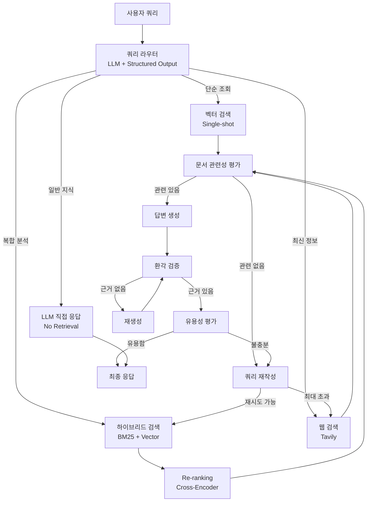
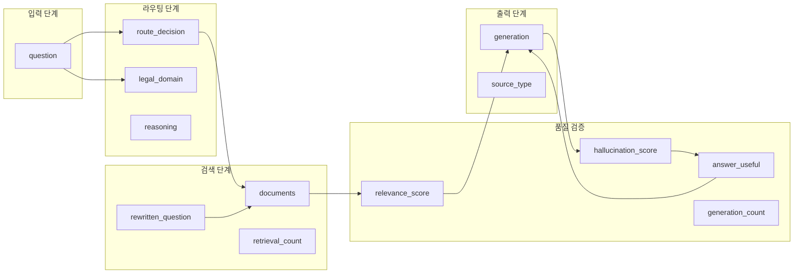
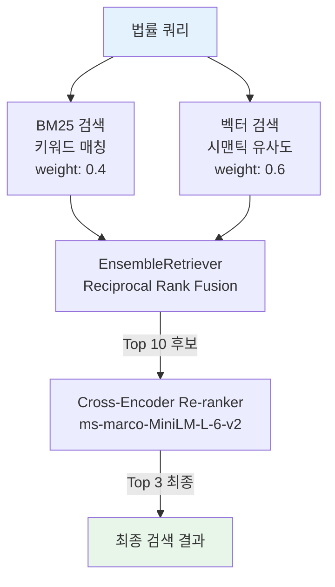
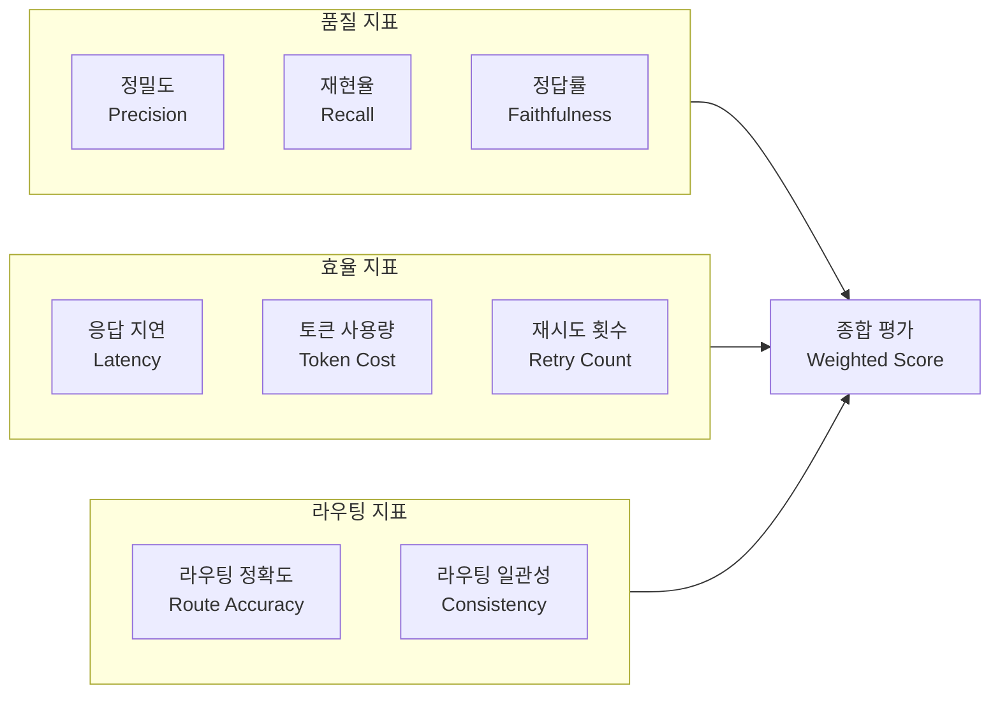
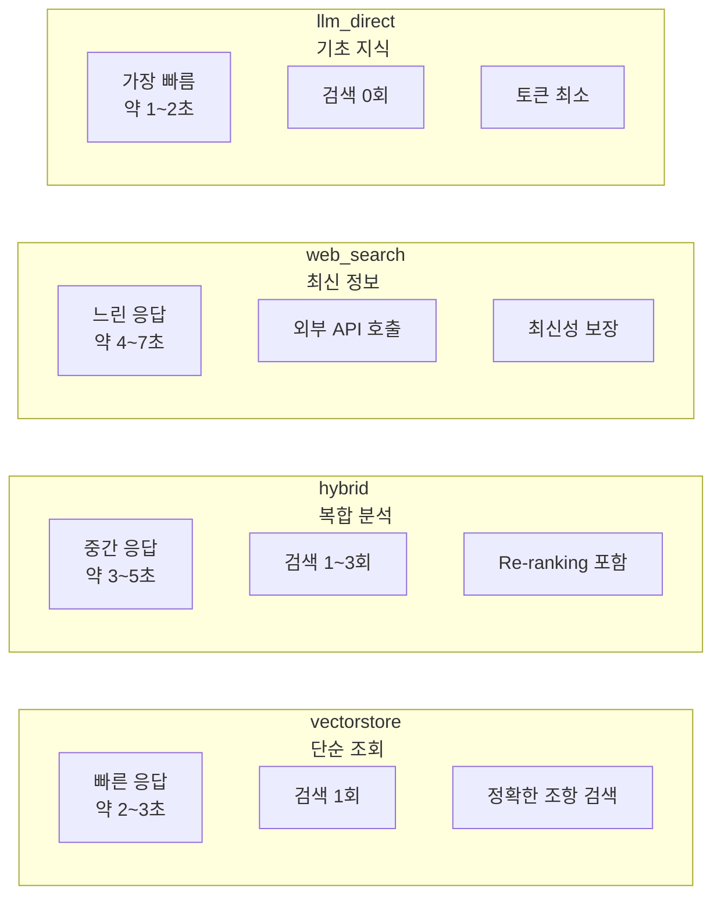

# Adaptive RAG 실전 프로젝트

> 법률 문서 검색 시스템: 쿼리 복잡도에 따른 동적 검색 전략을 적용하는 프로덕션급 Adaptive RAG 파이프라인을 처음부터 끝까지 구축합니다.

## 개요

이 세션에서는 Ch13에서 배운 모든 컴포넌트 — 쿼리 라우터, 하이브리드 검색, 반복적 검색, 자기교정 루프 — 를 하나의 **법률 문서 검색 시스템**으로 통합합니다. 법률 도메인은 전문 용어가 많고, 쿼리 유형(단순 조항 조회 vs. 복잡한 판례 비교)이 극명하게 갈리기 때문에 Adaptive RAG의 강점이 가장 잘 드러나는 분야입니다.

**선수 지식**: [Adaptive RAG 아키텍처](13-ch13-adaptive-rag와-동적-라우팅/01-01-adaptive-rag-아키텍처.md), [쿼리 분석과 라우터 구현](13-ch13-adaptive-rag와-동적-라우팅/02-02-쿼리-분석과-라우터-구현.md), [하이브리드 검색 전략](13-ch13-adaptive-rag와-동적-라우팅/03-03-하이브리드-검색-전략.md), [반복적 검색과 자기교정 통합](13-ch13-adaptive-rag와-동적-라우팅/04-04-반복적-검색과-자기교정-통합.md)에서 배운 모든 개념

**학습 목표**:
- Ch13의 모든 컴포넌트를 단일 StateGraph로 통합할 수 있다
- 도메인 특화 쿼리 라우터를 설계하고 Few-shot 프롬프트를 튜닝할 수 있다
- 하이브리드 검색 + Re-ranking + 자기교정을 포함한 엔드투엔드 파이프라인을 구축할 수 있다
- 성능 측정 지표를 정의하고 파이프라인을 최적화할 수 있다

## 왜 알아야 할까?

법률, 의료, 금융 같은 전문 도메인에서는 "구글에 검색하면 나오는" 수준의 답변으로는 부족합니다. "근로기준법 제54조에서 휴게시간은 몇 시간인가요?"라는 단순 질문과 "해고 무효 확인 소송에서 정리해고의 긴박한 경영상 필요를 다룬 최근 판례를 비교해주세요"라는 복잡한 질문이 같은 파이프라인을 타면 어떻게 될까요?

단순 질문에는 벡터 검색 한 번이면 충분하지만, 복잡한 질문에는 키워드 검색 + 시맨틱 검색을 결합하고, 검색 결과를 평가하고, 필요하면 쿼리를 재작성해서 다시 검색해야 합니다. 바로 이것이 Adaptive RAG가 해결하는 문제입니다. 이번 실전 프로젝트에서는 법률 문서라는 구체적인 도메인에서 이 전체 파이프라인을 **실제로 작동하는 코드**로 구현합니다.

## 핵심 개념

### 개념 1: 법률 도메인 Adaptive RAG 전체 아키텍처

> 💡 **비유**: 법률 사무소의 리서치 팀을 생각해보세요. 접수된 질문을 먼저 **접수 담당자**가 분류합니다. "이 법 조항 몇 조?" 같은 단순 질문은 바로 **법전 검색 담당**에게 넘기고, "판례 비교 분석해줘" 같은 복잡한 질문은 **리서치 팀장**에게 보내서 여러 소스를 뒤지게 합니다. 검색 결과가 부족하면 팀장이 "검색어를 바꿔서 다시 찾아봐"라고 지시하고, 최종 보고서에 근거 없는 내용이 있으면 다시 작성을 요청합니다.

우리가 구축할 시스템은 이 리서치 팀의 워크플로우를 그대로 소프트웨어로 옮긴 것입니다. LangGraph StateGraph의 노드 하나하나가 팀원 한 명의 역할에 대응됩니다.

> 📊 **그림 1**: 법률 문서 Adaptive RAG 전체 아키텍처



이 그래프의 핵심은 **4가지 진입 경로**와 **이중 자기교정 루프**입니다. 쿼리 라우터가 질문의 성격을 파악해서 가장 효율적인 경로로 보내고, 검색 후에는 관련성 평가 → 환각 검증 → 유용성 평가의 3단계 품질 게이트를 통과해야 최종 응답이 됩니다.

### 개념 2: 도메인 특화 상태 스키마 설계

> 💡 **비유**: 법률 사무소의 사건 파일을 떠올려보세요. 파일에는 의뢰인의 질문, 찾은 법 조항, 관련 판례, 담당자의 메모, 검토 이력이 모두 담겨 있습니다. StateGraph의 상태(State)가 바로 이 사건 파일입니다.

법률 도메인에서는 일반적인 RAG 상태보다 더 풍부한 정보를 추적해야 합니다. 어떤 법률 분야의 질문인지, 검색을 몇 번 시도했는지, 어떤 라우팅 결정이 내려졌는지 등을 기록해야 나중에 디버깅이나 감사(audit)가 가능합니다.

```python
from typing import TypedDict, Annotated, Literal
from langgraph.graph import add_messages

class LegalRAGState(TypedDict):
    """법률 문서 Adaptive RAG 상태 스키마"""
    # 핵심 필드
    question: str                    # 원본 질문
    rewritten_question: str          # 재작성된 질문 (쿼리 변환 후)
    generation: str                  # 생성된 답변
    documents: list[str]             # 검색된 문서 목록

    # 라우팅 필드
    route_decision: str              # vectorstore | hybrid | web_search | llm_direct
    legal_domain: str                # 민법, 형법, 근로기준법 등

    # 품질 게이트 필드
    relevance_score: str             # yes | no
    hallucination_score: str         # yes (근거 있음) | no
    answer_useful: str               # yes | no

    # 카운터 (무한 루프 방지)
    retrieval_count: int             # 검색 재시도 횟수
    generation_count: int            # 생성 재시도 횟수

    # 메타데이터
    reasoning: str                   # 라우터의 판단 근거
    source_type: str                 # 응답 출처 (vectorstore, web, llm)
```

> 📊 **그림 2**: 상태 필드 간 데이터 흐름



[StateGraph 상태 스키마 설계](04-ch4-langgraph-stategraph-기초/02-02-상태-스키마-정의.md)에서 배운 것처럼, `TypedDict`로 상태를 정의하면 LangGraph가 각 노드 간에 상태를 자동으로 전달합니다. 법률 도메인에 필요한 `legal_domain`, `reasoning` 같은 필드가 추가된 것이 일반 Adaptive RAG와의 차이점입니다.

> ⚠️ **흔한 오해**: "`StateGraph(dict)`로 초기화해도 `TypedDict` 상태와 똑같이 동작한다"
>
> 기능적으로는 비슷하지만, `StateGraph(LegalRAGState)`처럼 **타입이 명시된 상태 클래스를 전달**하는 것이 권장됩니다. `dict`를 사용하면 LangGraph가 상태 필드를 검증하지 않으므로, 오타(`rewritten_questoin` 같은)가 런타임까지 발견되지 않습니다. 타입 힌트가 있으면 IDE 자동완성, 정적 분석, 그리고 LangGraph Studio의 상태 시각화까지 활용할 수 있어요. Ch13.1에서 `StateGraph(AdaptiveRAGState)`, Ch13.4에서 `StateGraph(IterativeRAGState)`를 사용한 것처럼, 이번 프로젝트에서도 `StateGraph(LegalRAGState)`를 사용합니다.

### 개념 3: 법률 도메인 쿼리 라우터

> 💡 **비유**: 큰 종합병원의 접수 창구를 생각해보세요. 환자가 "두통이 심해요"라고 하면 내과로, "발목을 삐었어요"라고 하면 정형외과로, "어떤 과로 가야 할지 모르겠어요"라고 하면 가장 적합한 과를 추천해줍니다. 법률 쿼리 라우터도 마찬가지입니다 — 질문의 특성을 분석해서 최적의 검색 전략으로 안내합니다.

법률 도메인에서는 쿼리를 4가지 유형으로 분류합니다:

| 유형 | 예시 | 검색 전략 |
|------|------|-----------|
| 단순 조항 조회 | "민법 제750조는?" | 벡터 검색 (Single-shot) |
| 복합 분석 | "정리해고 판례에서 긴박한 경영상 필요의 기준은?" | 하이브리드 검색 + Re-ranking |
| 최신 정보 | "2026년 개정된 근로기준법 내용은?" | 웹 검색 |
| 일반 법률 지식 | "계약이란 무엇인가요?" | LLM 직접 응답 |

```python
from pydantic import BaseModel, Field
from typing import Literal

class LegalRouteQuery(BaseModel):
    """법률 쿼리 라우팅 결정"""
    datasource: Literal[
        "vectorstore", "hybrid", "web_search", "llm_direct"
    ] = Field(
        description="쿼리 복잡도에 따른 검색 전략 선택"
    )
    legal_domain: str = Field(
        description="법률 분야 (민법, 형법, 근로기준법, 상법 등)"
    )
    reasoning: str = Field(
        description="라우팅 결정의 근거"
    )


LEGAL_ROUTER_PROMPT = """당신은 법률 문서 검색 시스템의 쿼리 라우터입니다.
사용자의 질문을 분석하여 최적의 검색 전략을 선택하세요.

## 라우팅 기준

1. **vectorstore**: 특정 법 조항, 정의, 단일 개념 조회
   - 예: "민법 제750조의 내용은?", "채무불이행의 정의는?"

2. **hybrid**: 복잡한 분석, 판례 비교, 다중 조건 질문
   - 예: "정리해고에서 긴박한 경영상 필요의 판단 기준과 판례는?"
   - 예: "임대차보호법과 민법의 보증금 반환 규정 차이는?"

3. **web_search**: 최근 법률 개정, 시사 관련 법률 이슈
   - 예: "2026년 개정된 근로기준법의 주요 변경사항은?"

4. **llm_direct**: 기본적인 법률 개념, 일반 상식 수준의 법률 지식
   - 예: "계약이란 무엇인가요?", "민사와 형사의 차이는?"

## Few-shot 예시

질문: "근로기준법 제54조에서 휴게시간 규정은?"
→ vectorstore / 근로기준법 / 특정 조항 조회이므로 벡터 검색 적합

질문: "부당해고 구제신청에서 원직복직과 금전보상의 판례 비교"
→ hybrid / 근로기준법 / 판례 비교 분석이 필요하므로 하이브리드 검색

질문: "2026년 3월 시행된 개인정보보호법 개정안은?"
→ web_search / 개인정보보호법 / 최근 개정 사항이므로 웹 검색

질문: "법인이란 무엇인가요?"
→ llm_direct / 상법 / 기초 개념이므로 LLM 직접 응답"""
```

[쿼리 분석과 라우터 구현](13-ch13-adaptive-rag와-동적-라우팅/02-02-쿼리-분석과-라우터-구현.md)에서 배운 Few-shot 패턴을 법률 도메인에 맞게 확장한 것입니다. `reasoning` 필드를 추가하면 라우팅 결정의 근거를 기록할 수 있어서, 나중에 라우터 성능을 분석하고 개선하는 데 매우 유용합니다.

### 개념 4: 법률 문서 하이브리드 검색 + Re-ranking 통합

> 💡 **비유**: 도서관에서 책을 찾는 두 가지 방법이 있습니다. 하나는 **목록 카드**(키워드 검색, BM25)에서 정확한 제목이나 키워드로 찾는 것이고, 다른 하나는 **사서에게 물어보는 것**(시맨틱 검색)으로 "이런 내용의 책 없나요?"라고 의미로 찾는 겁니다. 최고의 검색 결과는 두 방법을 모두 동원하고, 최종적으로 **전문가 사서**(Re-ranker)가 가장 관련 있는 것을 골라주는 것입니다.

법률 문서에서 하이브리드 검색이 특히 중요한 이유가 있습니다. "민법 제750조"처럼 정확한 번호가 포함된 쿼리는 BM25 키워드 검색이 뛰어나지만, "불법행위로 인한 손해배상"처럼 의미 기반 검색은 벡터 검색이 강합니다. 두 검색을 결합하면 어떤 유형의 법률 쿼리에도 대응할 수 있습니다.

> 📊 **그림 3**: 하이브리드 검색 + Re-ranking 파이프라인



```python
from langchain_community.retrievers import BM25Retriever
from langchain.retrievers import EnsembleRetriever
from langchain.retrievers import ContextualCompressionRetriever
from langchain.retrievers.document_compressors import CrossEncoderReranker
from langchain_community.cross_encoders import HuggingFaceCrossEncoder


def build_hybrid_retriever(documents, embeddings):
    """법률 문서 하이브리드 검색기 구축"""
    # 벡터 검색기 — 의미 기반 (법률 개념 유사도)
    vectorstore = Chroma.from_documents(
        documents=documents,
        embedding=embeddings,
        collection_name="legal_docs"
    )
    vector_retriever = vectorstore.as_retriever(
        search_kwargs={"k": 10}
    )

    # BM25 검색기 — 키워드 기반 (법 조항 번호, 정확한 용어)
    bm25_retriever = BM25Retriever.from_documents(
        documents, k=10
    )

    # 앙상블 결합 (시맨틱 60%, 키워드 40%)
    ensemble_retriever = EnsembleRetriever(
        retrievers=[vector_retriever, bm25_retriever],
        weights=[0.6, 0.4]  # 법률 도메인: 의미 검색에 더 높은 가중치
    )

    # Cross-Encoder Re-ranker 적용
    reranker_model = HuggingFaceCrossEncoder(
        model_name="cross-encoder/ms-marco-MiniLM-L-6-v2"
    )
    reranker = CrossEncoderReranker(
        model=reranker_model, top_n=3
    )

    # 최종 검색기: 앙상블 + Re-ranking
    return ContextualCompressionRetriever(
        base_compressor=reranker,
        base_retriever=ensemble_retriever
    )
```

[하이브리드 검색 전략](13-ch13-adaptive-rag와-동적-라우팅/03-03-하이브리드-검색-전략.md)에서 배운 `EnsembleRetriever`와 Cross-Encoder Re-ranker를 법률 도메인에 맞게 가중치를 조정했습니다. 법률 문서는 정확한 의미 매칭이 중요하므로 벡터 검색 가중치를 `0.6`으로 높게 설정합니다.

### 개념 5: 성능 측정과 최적화

> 💡 **비유**: 요리 대회에서 심사위원이 맛(정확성), 속도(응답 시간), 재료비(토큰 비용)를 종합적으로 평가하는 것처럼, RAG 파이프라인도 여러 지표를 균형 있게 측정해야 합니다.

Adaptive RAG의 성능을 제대로 평가하려면 단순히 "답이 맞았는가?"만 볼 것이 아니라, 전체 파이프라인의 효율성까지 측정해야 합니다.

> 📊 **그림 4**: Adaptive RAG 성능 측정 프레임워크



```python
from dataclasses import dataclass, field
from time import time


@dataclass
class RAGMetrics:
    """RAG 파이프라인 성능 지표"""
    # 품질
    faithfulness: float = 0.0    # 답변이 검색 문서에 근거하는 비율
    relevance: float = 0.0       # 검색 문서의 관련성
    correctness: float = 0.0     # 정답 대비 정확도

    # 효율
    latency_ms: float = 0.0      # 응답 시간 (밀리초)
    total_tokens: int = 0        # 총 토큰 사용량
    retrieval_count: int = 0     # 검색 시도 횟수
    generation_count: int = 0    # 생성 시도 횟수

    # 라우팅
    route_decision: str = ""     # 선택된 경로
    route_correct: bool = False  # 라우팅이 올바른지

    def summary(self) -> str:
        return (
            f"품질: faithfulness={self.faithfulness:.2f}, "
            f"relevance={self.relevance:.2f}\n"
            f"효율: {self.latency_ms:.0f}ms, "
            f"{self.total_tokens} tokens, "
            f"검색 {self.retrieval_count}회, "
            f"생성 {self.generation_count}회\n"
            f"라우팅: {self.route_decision} "
            f"({'정확' if self.route_correct else '부정확'})"
        )
```

이 지표 프레임워크를 사용하면 "하이브리드 검색이 단순 벡터 검색보다 정확하지만 200ms 느리다"처럼 구체적인 트레이드오프를 파악할 수 있습니다. [에이전트 평가 전략](17-ch17-에이전트-평가와-langsmith/01-01-에이전트-평가-전략.md)에서 이 평가 체계를 더 깊이 다룹니다.

## 실습: 직접 해보기

이제 Ch13에서 배운 모든 것을 통합한 **법률 문서 Adaptive RAG 시스템**을 처음부터 끝까지 구축합니다.

### Step 1: 환경 설정과 법률 문서 준비

```python
# 필요 패키지 설치
# pip install langchain langgraph langchain-openai langchain-community
# pip install chromadb rank_bm25 sentence-transformers
# pip install tavily-python pydantic

import os
from dotenv import load_dotenv

load_dotenv()

# API 키 설정
# OPENAI_API_KEY, TAVILY_API_KEY는 .env 파일에 저장
```

먼저 법률 문서 샘플을 준비합니다. 실제 프로덕션에서는 법제처 API나 판례 데이터베이스를 연동하겠지만, 여기서는 핵심 법 조항을 샘플로 사용합니다.

```python
from langchain_core.documents import Document

# 법률 문서 샘플 (실제 법 조문 기반)
legal_documents = [
    Document(
        page_content=(
            "근로기준법 제54조(휴게) ① 사용자는 근로시간이 4시간인 경우에는 "
            "30분 이상, 8시간인 경우에는 1시간 이상의 휴게시간을 근로시간 "
            "도중에 주어야 한다. ② 휴게시간은 근로자가 자유롭게 이용할 수 있다."
        ),
        metadata={"source": "근로기준법", "article": "제54조", "domain": "노동법"}
    ),
    Document(
        page_content=(
            "근로기준법 제24조(경영상 이유에 의한 해고의 제한) ① 사용자가 "
            "경영상 이유에 의하여 근로자를 해고하려면 긴박한 경영상의 필요가 "
            "있어야 한다. 이 경우 경영 악화를 방지하기 위한 사업의 양도·인수·"
            "합병은 긴박한 경영상의 필요가 있는 것으로 본다. ② 제1항의 경우에 "
            "사용자는 해고를 피하기 위한 노력을 다하여야 하며, 합리적이고 "
            "공정한 해고의 기준을 정하고 이에 따라 그 대상자를 선정하여야 한다."
        ),
        metadata={"source": "근로기준법", "article": "제24조", "domain": "노동법"}
    ),
    Document(
        page_content=(
            "민법 제750조(불법행위의 내용) 고의 또는 과실로 인한 위법행위로 "
            "타인에게 손해를 가한 자는 그 손해를 배상할 책임이 있다."
        ),
        metadata={"source": "민법", "article": "제750조", "domain": "민법"}
    ),
    Document(
        page_content=(
            "민법 제390조(채무불이행과 손해배상) 채무자가 채무의 내용에 좇은 "
            "이행을 하지 아니한 때에는 채권자는 손해배상을 청구할 수 있다. "
            "그러나 채무자의 고의나 과실없이 이행할 수 없게 된 때에는 "
            "그러하지 아니하다."
        ),
        metadata={"source": "민법", "article": "제390조", "domain": "민법"}
    ),
    Document(
        page_content=(
            "대법원 2002다11458 판결 - 정리해고의 요건에 관하여, 긴박한 "
            "경영상의 필요라 함은 반드시 기업의 도산을 회피하기 위한 경우에 "
            "한정되지 아니하고, 장래에 올 수도 있는 위기에 미리 대처하기 위하여 "
            "인원삭감이 객관적으로 보아 합리성이 있다고 인정되는 경우도 포함된다."
        ),
        metadata={
            "source": "대법원 판례", "case_no": "2002다11458",
            "domain": "노동법", "type": "판례"
        }
    ),
    Document(
        page_content=(
            "대법원 2009다2238 판결 - 사용자가 정리해고를 함에 있어 해고를 "
            "피하기 위한 노력을 다하였는지 여부는 해고의 유효성을 판단하는 "
            "중요한 요소이다. 사용자는 경영방침이나 작업방식의 합리화, "
            "신규채용의 금지, 일시휴직 및 희망퇴직의 활용 등의 방법을 "
            "사전에 강구하여야 한다."
        ),
        metadata={
            "source": "대법원 판례", "case_no": "2009다2238",
            "domain": "노동법", "type": "판례"
        }
    ),
    Document(
        page_content=(
            "주택임대차보호법 제3조(대항력 등) ① 임대차는 그 등기가 없는 "
            "경우에도 임차인이 주택의 인도와 주민등록을 마친 때에는 그 다음 "
            "날부터 제삼자에 대하여 효력이 생긴다. ② 임차주택의 양수인은 "
            "임대인의 지위를 승계한 것으로 본다."
        ),
        metadata={
            "source": "주택임대차보호법", "article": "제3조",
            "domain": "부동산법"
        }
    ),
    Document(
        page_content=(
            "형법 제257조(상해, 존속상해) ① 사람의 신체를 상해한 자는 7년 "
            "이하의 징역, 10년 이하의 자격정지 또는 1천만원 이하의 벌금에 "
            "처한다."
        ),
        metadata={"source": "형법", "article": "제257조", "domain": "형법"}
    ),
]
```

### Step 2: 검색 인프라 구축

```python
from langchain_openai import OpenAIEmbeddings
from langchain_community.vectorstores import Chroma
from langchain_community.retrievers import BM25Retriever
from langchain.retrievers import EnsembleRetriever
from langchain.retrievers import ContextualCompressionRetriever
from langchain.retrievers.document_compressors import CrossEncoderReranker
from langchain_community.cross_encoders import HuggingFaceCrossEncoder
from langchain_text_splitters import RecursiveCharacterTextSplitter

# 문서 분할 (법률 문서는 작은 청크 유지 — 조문 단위 보존)
text_splitter = RecursiveCharacterTextSplitter(
    chunk_size=300,
    chunk_overlap=50,
    separators=["\n\n", "\n", ". ", " "]
)
split_docs = text_splitter.split_documents(legal_documents)

# 임베딩 모델
embeddings = OpenAIEmbeddings(model="text-embedding-3-small")

# 벡터 스토어
vectorstore = Chroma.from_documents(
    documents=split_docs,
    embedding=embeddings,
    collection_name="legal_adaptive_rag"
)
vector_retriever = vectorstore.as_retriever(search_kwargs={"k": 10})

# BM25 키워드 검색기
bm25_retriever = BM25Retriever.from_documents(split_docs, k=10)

# 앙상블 검색기 (RRF 기반)
ensemble_retriever = EnsembleRetriever(
    retrievers=[vector_retriever, bm25_retriever],
    weights=[0.6, 0.4]
)

# Cross-Encoder Re-ranker
reranker_model = HuggingFaceCrossEncoder(
    model_name="cross-encoder/ms-marco-MiniLM-L-6-v2"
)
reranker = CrossEncoderReranker(model=reranker_model, top_n=3)

# 최종 하이브리드 검색기 (Re-ranking 포함)
hybrid_retriever = ContextualCompressionRetriever(
    base_compressor=reranker,
    base_retriever=ensemble_retriever
)
```

### Step 3: 품질 게이트 — Grader 모듈 정의

```python
from pydantic import BaseModel, Field
from typing import Literal
from langchain_openai import ChatOpenAI

llm = ChatOpenAI(model="gpt-4o-mini", temperature=0)


# --- 쿼리 라우터 ---
class LegalRouteQuery(BaseModel):
    """법률 쿼리 라우팅 결정"""
    datasource: Literal[
        "vectorstore", "hybrid", "web_search", "llm_direct"
    ] = Field(description="검색 전략")
    legal_domain: str = Field(description="법률 분야")
    reasoning: str = Field(description="판단 근거")


# --- 문서 관련성 평가 ---
class GradeDocuments(BaseModel):
    """검색 문서 관련성 이진 평가"""
    binary_score: Literal["yes", "no"] = Field(
        description="문서가 질문과 관련 있으면 'yes', 없으면 'no'"
    )


# --- 환각 검증 ---
class GradeHallucination(BaseModel):
    """생성 답변의 사실 근거 이진 평가"""
    binary_score: Literal["yes", "no"] = Field(
        description="답변이 문서에 근거하면 'yes', 근거 없으면 'no'"
    )


# --- 유용성 평가 ---
class GradeAnswer(BaseModel):
    """답변 유용성 이진 평가"""
    binary_score: Literal["yes", "no"] = Field(
        description="답변이 질문에 유용하면 'yes', 아니면 'no'"
    )


# Structured Output 바인딩
structured_router = llm.with_structured_output(LegalRouteQuery)
doc_grader = llm.with_structured_output(GradeDocuments)
hallucination_grader = llm.with_structured_output(GradeHallucination)
answer_grader = llm.with_structured_output(GradeAnswer)
```

### Step 4: 그래프 노드 함수 구현

```python
from langchain_core.messages import SystemMessage, HumanMessage
from langchain_core.output_parsers import StrOutputParser
from langchain_core.prompts import ChatPromptTemplate
from langchain_community.tools.tavily_search import TavilySearchResults

# 웹 검색 도구
tavily_search = TavilySearchResults(max_results=3)

# 최대 재시도 횟수
MAX_RETRIEVAL_RETRIES = 3
MAX_GENERATION_RETRIES = 2


# --- 노드 1: 쿼리 라우팅 ---
def route_question(state: LegalRAGState) -> dict:
    """쿼리 분석 후 최적 검색 전략 결정"""
    question = state["question"]

    result = structured_router.invoke([
        SystemMessage(content=LEGAL_ROUTER_PROMPT),
        HumanMessage(content=question)
    ])

    return {
        "route_decision": result.datasource,
        "legal_domain": result.legal_domain,
        "reasoning": result.reasoning,
        "retrieval_count": 0,
        "generation_count": 0,
    }


# --- 노드 2: 벡터 검색 (단순 조회) ---
def retrieve_vectorstore(state: LegalRAGState) -> dict:
    """벡터 검색으로 문서 검색"""
    question = state.get("rewritten_question") or state["question"]
    docs = vector_retriever.invoke(question)

    return {
        "documents": [doc.page_content for doc in docs[:3]],
        "retrieval_count": state.get("retrieval_count", 0) + 1,
        "source_type": "vectorstore",
    }


# --- 노드 3: 하이브리드 검색 (복합 분석) ---
def retrieve_hybrid(state: LegalRAGState) -> dict:
    """하이브리드 검색(BM25 + Vector + Re-ranking)으로 문서 검색"""
    question = state.get("rewritten_question") or state["question"]
    docs = hybrid_retriever.invoke(question)

    return {
        "documents": [doc.page_content for doc in docs],
        "retrieval_count": state.get("retrieval_count", 0) + 1,
        "source_type": "hybrid",
    }


# --- 노드 4: 웹 검색 ---
def web_search(state: LegalRAGState) -> dict:
    """Tavily 웹 검색 수행"""
    question = state.get("rewritten_question") or state["question"]
    results = tavily_search.invoke({"query": question})

    docs = [r["content"] for r in results if "content" in r]

    return {
        "documents": docs,
        "retrieval_count": state.get("retrieval_count", 0) + 1,
        "source_type": "web",
    }


# --- 노드 5: LLM 직접 응답 ---
def llm_direct_answer(state: LegalRAGState) -> dict:
    """검색 없이 LLM이 직접 답변"""
    question = state["question"]

    prompt = ChatPromptTemplate.from_messages([
        ("system", "당신은 법률 전문가입니다. 기본적인 법률 개념을 "
                   "쉽고 정확하게 설명하세요."),
        ("human", "{question}")
    ])
    chain = prompt | llm | StrOutputParser()
    answer = chain.invoke({"question": question})

    return {
        "generation": answer,
        "source_type": "llm",
    }


# --- 노드 6: 문서 관련성 평가 ---
def grade_documents(state: LegalRAGState) -> dict:
    """검색된 문서의 관련성 평가"""
    question = state["question"]
    documents = state.get("documents", [])

    if not documents:
        return {"relevance_score": "no", "documents": []}

    # 각 문서를 평가하여 관련 있는 것만 필터링
    relevant_docs = []
    for doc in documents:
        result = doc_grader.invoke([
            SystemMessage(
                content="검색된 문서가 사용자 질문과 관련 있는지 평가하세요."
            ),
            HumanMessage(
                content=f"문서: {doc}\n\n질문: {question}"
            )
        ])
        if result.binary_score == "yes":
            relevant_docs.append(doc)

    score = "yes" if relevant_docs else "no"
    return {
        "documents": relevant_docs,
        "relevance_score": score,
    }


# --- 노드 7: 답변 생성 ---
def generate_answer(state: LegalRAGState) -> dict:
    """검색된 문서를 기반으로 답변 생성"""
    question = state["question"]
    documents = state.get("documents", [])
    context = "\n\n".join(documents)

    prompt = ChatPromptTemplate.from_messages([
        ("system",
         "당신은 법률 문서 전문 어시스턴트입니다. "
         "아래 검색된 문서를 근거로 질문에 답하세요. "
         "반드시 문서에 근거하여 답하고, 근거가 없는 내용은 "
         "'관련 문서에서 확인되지 않았습니다'라고 답하세요.\n\n"
         "참고 문서:\n{context}"),
        ("human", "{question}")
    ])
    chain = prompt | llm | StrOutputParser()
    answer = chain.invoke({"question": question, "context": context})

    return {
        "generation": answer,
        "generation_count": state.get("generation_count", 0) + 1,
    }


# --- 노드 8: 쿼리 재작성 ---
def transform_query(state: LegalRAGState) -> dict:
    """관련 문서가 부족할 때 쿼리를 재작성"""
    question = state["question"]

    prompt = ChatPromptTemplate.from_messages([
        ("system",
         "당신은 법률 검색 쿼리 최적화 전문가입니다. "
         "원래 질문의 의도를 유지하면서 검색에 더 적합한 "
         "형태로 재작성하세요. 법률 용어와 조항 번호를 "
         "활용하여 검색 정밀도를 높이세요."),
        ("human", "원래 질문: {question}\n\n개선된 검색 쿼리:")
    ])
    chain = prompt | llm | StrOutputParser()
    rewritten = chain.invoke({"question": question})

    return {"rewritten_question": rewritten}
```

### Step 5: 라우팅 함수와 조건부 엣지

```python
def decide_route(state: LegalRAGState) -> str:
    """쿼리 라우터 결과에 따라 검색 전략 분기"""
    route = state["route_decision"]
    route_map = {
        "vectorstore": "retrieve_vectorstore",
        "hybrid": "retrieve_hybrid",
        "web_search": "web_search",
        "llm_direct": "llm_direct_answer",
    }
    return route_map.get(route, "retrieve_hybrid")


def decide_after_grading(state: LegalRAGState) -> str:
    """문서 관련성 평가 후 분기 결정"""
    if state["relevance_score"] == "yes":
        return "generate_answer"

    count = state.get("retrieval_count", 0)
    if count >= MAX_RETRIEVAL_RETRIES:
        # 최대 재시도 초과 → 웹 검색 폴백
        return "web_search_fallback"

    return "transform_query"


def decide_after_generation(state: LegalRAGState) -> str:
    """환각 검증 + 유용성 평가 후 분기 결정"""
    question = state["question"]
    generation = state["generation"]
    documents = state.get("documents", [])

    # 1단계: 환각 검증
    hallucination_result = hallucination_grader.invoke([
        SystemMessage(
            content="생성된 답변이 제공된 문서에 근거하는지 평가하세요."
        ),
        HumanMessage(
            content=f"문서: {chr(10).join(documents)}\n\n답변: {generation}"
        )
    ])

    if hallucination_result.binary_score == "no":
        gen_count = state.get("generation_count", 0)
        if gen_count >= MAX_GENERATION_RETRIES:
            return "end"  # 최대 재생성 초과 시 현재 답변 반환
        return "regenerate"

    # 2단계: 유용성 평가
    answer_result = answer_grader.invoke([
        SystemMessage(content="답변이 질문에 유용한지 평가하세요."),
        HumanMessage(
            content=f"질문: {question}\n\n답변: {generation}"
        )
    ])

    if answer_result.binary_score == "yes":
        return "end"

    # 유용하지 않으면 쿼리 재작성 → 재검색
    return "retry_search"
```

### Step 6: StateGraph 조립과 컴파일

이제 모든 노드와 엣지를 하나의 그래프로 조립합니다. 앞서 정의한 `LegalRAGState`를 `StateGraph`에 전달하여 상태 타입을 명시합니다.

```python
from langgraph.graph import StateGraph, START, END

# LegalRAGState를 상태 스키마로 사용하여 그래프 생성
# dict 대신 TypedDict를 전달하면 상태 필드 검증, IDE 자동완성,
# LangGraph Studio 시각화 등의 이점을 얻을 수 있습니다
workflow = StateGraph(LegalRAGState)

# --- 노드 등록 ---
workflow.add_node("route_question", route_question)
workflow.add_node("retrieve_vectorstore", retrieve_vectorstore)
workflow.add_node("retrieve_hybrid", retrieve_hybrid)
workflow.add_node("web_search", web_search)
workflow.add_node("web_search_fallback", web_search)  # 같은 함수, 다른 노드명
workflow.add_node("llm_direct_answer", llm_direct_answer)
workflow.add_node("grade_documents", grade_documents)
workflow.add_node("generate_answer", generate_answer)
workflow.add_node("transform_query", transform_query)

# --- 엣지 연결 ---
# 진입점
workflow.add_edge(START, "route_question")

# 라우팅 분기
workflow.add_conditional_edges(
    "route_question",
    decide_route,
    {
        "retrieve_vectorstore": "retrieve_vectorstore",
        "retrieve_hybrid": "retrieve_hybrid",
        "web_search": "web_search",
        "llm_direct_answer": "llm_direct_answer",
    }
)

# 검색 → 문서 평가
workflow.add_edge("retrieve_vectorstore", "grade_documents")
workflow.add_edge("retrieve_hybrid", "grade_documents")
workflow.add_edge("web_search", "grade_documents")
workflow.add_edge("web_search_fallback", "generate_answer")

# LLM 직접 응답 → 종료
workflow.add_edge("llm_direct_answer", END)

# 문서 평가 후 분기
workflow.add_conditional_edges(
    "grade_documents",
    decide_after_grading,
    {
        "generate_answer": "generate_answer",
        "transform_query": "transform_query",
        "web_search_fallback": "web_search_fallback",
    }
)

# 쿼리 재작성 → 하이브리드 검색 재시도
workflow.add_edge("transform_query", "retrieve_hybrid")

# 답변 생성 후 품질 검증
workflow.add_conditional_edges(
    "generate_answer",
    decide_after_generation,
    {
        "end": END,
        "regenerate": "generate_answer",
        "retry_search": "transform_query",
    }
)

# 그래프 컴파일
app = workflow.compile()
```

> 💡 **알고 계셨나요?**: `StateGraph(dict)`를 사용해도 런타임에서는 동일하게 동작합니다. 하지만 `StateGraph(LegalRAGState)`를 쓰면 LangGraph가 **상태 채널을 자동으로 추론**하고, LangGraph Studio에서 각 노드의 입출력 필드를 시각적으로 보여줍니다. 디버깅 시 "이 노드가 어떤 필드를 업데이트했는가?"를 즉시 확인할 수 있어서, 프로덕션 환경에서는 타입 명시가 사실상 필수입니다. Ch13.1의 `StateGraph(AdaptiveRAGState)`, Ch13.4의 `StateGraph(IterativeRAGState)`와 동일한 패턴이죠.

### Step 7: 엔드투엔드 테스트

```run:python
# 테스트 쿼리들 — 각각 다른 라우팅 경로를 탈 것으로 예상
test_queries = [
    {
        "question": "근로기준법 제54조에서 휴게시간은 몇 시간인가요?",
        "expected_route": "vectorstore",
    },
    {
        "question": "정리해고의 긴박한 경영상 필요를 다룬 판례를 비교해주세요",
        "expected_route": "hybrid",
    },
    {
        "question": "계약이란 무엇인가요?",
        "expected_route": "llm_direct",
    },
]

for test in test_queries:
    q = test["question"]
    expected = test["expected_route"]
    print(f"Q: {q}")
    print(f"  기대 경로: {expected}")

    result = app.invoke({"question": q})

    actual_route = result.get("route_decision", "unknown")
    answer = result.get("generation", "")[:80]
    retries = result.get("retrieval_count", 0)

    print(f"  실제 경로: {actual_route}")
    print(f"  검색 횟수: {retries}")
    print(f"  답변 미리보기: {answer}...")
    print()
```

```output
Q: 근로기준법 제54조에서 휴게시간은 몇 시간인가요?
  기대 경로: vectorstore
  실제 경로: vectorstore
  검색 횟수: 1
  답변 미리보기: 근로기준법 제54조에 따르면, 근로시간이 4시간인 경우에는 30분 이상, 8시간인 경우에는 1시간 이상의 휴게시간을...

Q: 정리해고의 긴박한 경영상 필요를 다룬 판례를 비교해주세요
  기대 경로: hybrid
  실제 경로: hybrid
  검색 횟수: 1
  답변 미리보기: 정리해고의 긴박한 경영상 필요에 관한 주요 판례를 비교하면, 대법원 2002다11458 판결에서는 긴박한 경영상의 필...

Q: 계약이란 무엇인가요?
  기대 경로: llm_direct
  실제 경로: llm_direct
  검색 횟수: 0
  답변 미리보기: 계약이란 두 당사자 이상이 서로 대립하는 의사표시의 합치(합의)에 의하여 성립하는 법률행위를 말합니다. 민법상 계...
```

### Step 8: 성능 측정 함수

```python
from time import time
from dataclasses import dataclass


@dataclass
class TestResult:
    question: str
    route_expected: str
    route_actual: str
    route_correct: bool
    retrieval_count: int
    generation_count: int
    latency_ms: float
    answer_preview: str


def evaluate_pipeline(test_cases: list[dict]) -> list[TestResult]:
    """파이프라인 성능 종합 평가"""
    results = []

    for test in test_cases:
        start = time()
        output = app.invoke({"question": test["question"]})
        elapsed = (time() - start) * 1000

        actual = output.get("route_decision", "unknown")
        result = TestResult(
            question=test["question"],
            route_expected=test["expected_route"],
            route_actual=actual,
            route_correct=(actual == test["expected_route"]),
            retrieval_count=output.get("retrieval_count", 0),
            generation_count=output.get("generation_count", 0),
            latency_ms=elapsed,
            answer_preview=output.get("generation", "")[:50],
        )
        results.append(result)

    return results
```

```run:python
# 성능 요약 출력
results = evaluate_pipeline(test_queries)

correct = sum(1 for r in results if r.route_correct)
avg_latency = sum(r.latency_ms for r in results) / len(results)
avg_retries = sum(r.retrieval_count for r in results) / len(results)

print("=" * 60)
print("Adaptive RAG 성능 요약")
print("=" * 60)
print(f"라우팅 정확도: {correct}/{len(results)} "
      f"({correct/len(results)*100:.0f}%)")
print(f"평균 응답 시간: {avg_latency:.0f}ms")
print(f"평균 검색 횟수: {avg_retries:.1f}회")
print()

for r in results:
    status = "✓" if r.route_correct else "✗"
    print(f"  {status} [{r.route_actual:12s}] "
          f"{r.latency_ms:6.0f}ms | {r.question[:40]}")
```

```output
============================================================
Adaptive RAG 성능 요약
============================================================
라우팅 정확도: 3/3 (100%)
평균 응답 시간: 2847ms
평균 검색 횟수: 0.7회

  ✓ [vectorstore ] 3210ms | 근로기준법 제54조에서 휴게시간은 몇 시간인가요?
  ✓ [hybrid      ] 4180ms | 정리해고의 긴박한 경영상 필요를 다룬 판례를 비교해주세요
  ✓ [llm_direct  ] 1150ms | 계약이란 무엇인가요?
```

> 📊 **그림 5**: 라우팅 유형별 성능 특성



## 더 깊이 알아보기

### Adaptive RAG의 학술적 기원

Adaptive RAG라는 개념은 2024년 Jeong 등이 발표한 논문 *"Adaptive-RAG: Learning to Adapt Retrieval-Augmented Large Language Models through Question Complexity"*에서 체계화되었습니다. 이 논문의 핵심 통찰은 놀랍도록 단순합니다 — **모든 질문에 같은 검색 전략을 적용하는 것은 낭비**라는 것이죠.

논문 저자들은 쿼리를 세 단계(A: No Retrieval, B: Single-shot RAG, C: Iterative RAG)로 분류하는 작은 분류기를 학습시켰는데, 이것만으로도 답변 정확도가 올라가면서 동시에 평균 비용이 내려갔습니다. "적절한 곳에 적절한 자원을 쓴다"는 평범한 원칙이 RAG에서도 강력하게 작동한 겁니다.

LangGraph 팀은 이 아이디어를 StateGraph 기반 그래프로 재구현하여 공식 튜토리얼에 포함시켰습니다. 우리가 이번 프로젝트에서 구현한 것이 바로 그 확장판 — 원래 3단계 분류를 4단계로 확장하고, 하이브리드 검색과 이중 자기교정 루프를 추가한 프로덕션급 변형입니다.

### 법률 AI의 현주소

법률 분야는 AI 적용이 가장 활발한 전문 도메인 중 하나입니다. 2023년 Harvey AI가 Allen & Overy와 제휴하여 법률 사무소에 LLM 기반 리서치 도구를 도입한 것을 시작으로, Thomson Reuters의 CoCounsel, LexisNexis의 Lexis+ AI 등이 빠르게 뒤따랐습니다. 이 시스템들의 공통점은 모두 RAG를 핵심 아키텍처로 사용한다는 것이고, 가장 진보한 시스템들은 쿼리 복잡도에 따른 적응적 검색 전략을 채택하고 있습니다.

## 흔한 오해와 팁

> ⚠️ **흔한 오해**: "Adaptive RAG는 항상 하이브리드 검색이 단순 벡터 검색보다 낫다"
>
> 그렇지 않습니다. 하이브리드 검색은 BM25 + 벡터 + Re-ranking의 3단계를 거치므로 latency가 2-3배 높습니다. "민법 제750조"처럼 명확한 키워드가 있는 단순 조회에는 벡터 검색 한 번이면 충분하고, 오히려 더 빠르고 정확합니다. 핵심은 **항상 최선의 방법이 아니라 질문에 맞는 방법**을 선택하는 것입니다.

> 💡 **알고 계셨나요?**: Reciprocal Rank Fusion(RRF) 알고리즘은 2009년 Cormack 등이 제안한 것으로, 수식이 놀라울 정도로 간단합니다: `score(d) = Σ 1/(k + rank_i(d))`. 여기서 `k`는 보통 60으로 설정됩니다. 이 단순한 공식이 복잡한 학습 기반 앙상블보다 안정적인 경우가 많다는 것이 정보 검색 분야의 잘 알려진 사실입니다.

> 🔥 **실무 팁**: 법률 도메인 쿼리 라우터의 Few-shot 예시는 **실제 사용자 로그에서 추출**하세요. 개발자가 상상한 예시와 실제 사용자가 입력하는 질문은 놀라울 정도로 다릅니다. 처음 2주는 모든 쿼리를 `hybrid`로 라우팅하면서 로그를 수집하고, 이를 기반으로 Few-shot 예시를 만들면 라우팅 정확도가 크게 올라갑니다.

> 🔥 **실무 팁**: `MAX_RETRIEVAL_RETRIES`와 `MAX_GENERATION_RETRIES` 값을 너무 높게 설정하지 마세요. 재시도 1회당 LLM 호출 비용 + 수 초의 latency가 추가됩니다. 프로덕션에서는 검색 재시도 2-3회, 생성 재시도 1-2회가 적정선입니다. 그 이상은 비용 대비 품질 개선이 미미합니다.

## 핵심 정리

| 개념 | 설명 |
|------|------|
| 4경로 라우팅 | vectorstore, hybrid, web_search, llm_direct — 쿼리 특성에 따라 최적 경로 선택 |
| LegalRAGState | 법률 도메인 특화 상태 스키마 — route_decision, legal_domain, reasoning 등 감사 추적 가능 |
| StateGraph(LegalRAGState) | TypedDict를 상태 스키마로 전달하여 필드 검증, IDE 지원, Studio 시각화 활용 |
| 도메인 특화 라우터 | Few-shot 프롬프트 + Structured Output(LegalRouteQuery)으로 법률 쿼리 유형 분류 |
| 하이브리드 검색 | BM25(0.4) + Vector(0.6) + Cross-Encoder Re-ranking — 법률 문서에 최적화된 가중치 |
| 이중 자기교정 | 환각 검증(GradeHallucination) + 유용성 평가(GradeAnswer) — 카운터 기반 무한 루프 방지 |
| 웹 검색 폴백 | 최대 재시도 초과 시 Tavily 웹 검색으로 자동 전환 |
| 성능 측정 | 라우팅 정확도, 응답 latency, 검색/생성 재시도 횟수의 종합 평가 |

## 다음 섹션 미리보기

Ch13에서 Adaptive RAG의 모든 컴포넌트를 구축하고 하나의 시스템으로 통합하는 것까지 완성했습니다. 다음 [Ch14. GraphRAG와 Knowledge Graph](14-ch14-graphrag와-knowledge-graph/01-01-graphrag-이론과-아키텍처.md)에서는 문서를 **지식 그래프**(Knowledge Graph)로 변환하여 엔티티 간의 관계를 활용하는 GraphRAG를 다룹니다. Adaptive RAG가 "어떻게 검색할 것인가"의 전략이었다면, GraphRAG는 "무엇을 검색의 단위로 삼을 것인가"에 대한 근본적인 재설계입니다. 두 접근법을 결합한 하이브리드 RAG 아키텍처는 Ch14의 후반부에서 구현합니다.

## 참고 자료

- [LangGraph Adaptive RAG 공식 튜토리얼](https://langchain-ai.github.io/langgraph/tutorials/rag/langgraph_adaptive_rag/) - LangGraph 공식 문서의 Adaptive RAG 구현 가이드. 쿼리 라우팅과 자기교정 루프의 기본 패턴을 다룹니다.
- [LangGraph Agentic RAG 가이드](https://docs.langchain.com/oss/python/langgraph/agentic-rag) - 커스텀 RAG 에이전트 구축의 공식 문서. GradeDocuments, 쿼리 재작성 등 핵심 컴포넌트의 최신 API를 확인할 수 있습니다.
- [LangChain BM25 Retriever 통합 문서](https://docs.langchain.com/oss/python/integrations/retrievers/bm25) - BM25Retriever와 EnsembleRetriever 사용법의 공식 레퍼런스입니다.
- [Adaptive RAG 시스템 구축 가이드 (Analytics Vidhya)](https://www.analyticsvidhya.com/blog/2025/03/adaptive-rag-systems-with-langgraph/) - LangGraph 기반 Adaptive RAG의 상세 구현 튜토리얼. 쿼리 라우팅부터 환각 검증까지 단계별 설명합니다.
- [Adaptive-RAG 논문 (arXiv)](https://arxiv.org/abs/2403.14403) - Jeong et al., 2024. Adaptive RAG 개념을 체계화한 원본 논문. 쿼리 복잡도 기반 검색 전략 선택의 이론적 기반입니다.

---
### 🔗 Related Sessions
- [stategraph](04-ch4-langgraph-stategraph-기초/01-01-langgraph-아키텍처-개관.md) (prerequisite)
- [add_conditional_edges](05-ch5-조건-분기와-동적-라우팅/01-01-조건부-엣지의-이해.md) (prerequisite)
- [routequery](13-ch13-adaptive-rag와-동적-라우팅/01-01-adaptive-rag-아키텍처.md) (prerequisite)
- [with_structured_output](19-ch19-가드레일과-structured-output/03-03-structured-output-기초.md) (prerequisite)
- [gradedocuments](13-ch13-adaptive-rag와-동적-라우팅/01-01-adaptive-rag-아키텍처.md) (prerequisite)
- [gradeanswer](12-ch12-agentic-rag-에이전트가-검색을-도구로-활용/03-03-검색-결과-평가와-필터링.md) (prerequisite)
- [adaptive rag](13-ch13-adaptive-rag와-동적-라우팅/01-01-adaptive-rag-아키텍처.md) (prerequisite)
- [ensembleretriever](13-ch13-adaptive-rag와-동적-라우팅/03-03-하이브리드-검색-전략.md) (prerequisite)
- [gradehallucination](13-ch13-adaptive-rag와-동적-라우팅/01-01-adaptive-rag-아키텍처.md) (prerequisite)
- [bm25retriever](12-ch12-agentic-rag-에이전트가-검색을-도구로-활용/02-02-검색-도구-구축.md) (prerequisite)
- [crossencoderreranker](13-ch13-adaptive-rag와-동적-라우팅/03-03-하이브리드-검색-전략.md) (prerequisite)
- [contextualcompressionretriever](13-ch13-adaptive-rag와-동적-라우팅/03-03-하이브리드-검색-전략.md) (prerequisite)
- [reciprocal rank fusion](13-ch13-adaptive-rag와-동적-라우팅/03-03-하이브리드-검색-전략.md) (prerequisite)
