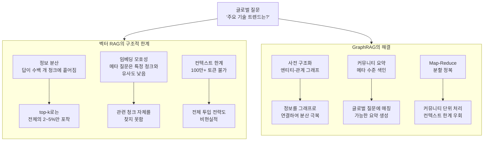
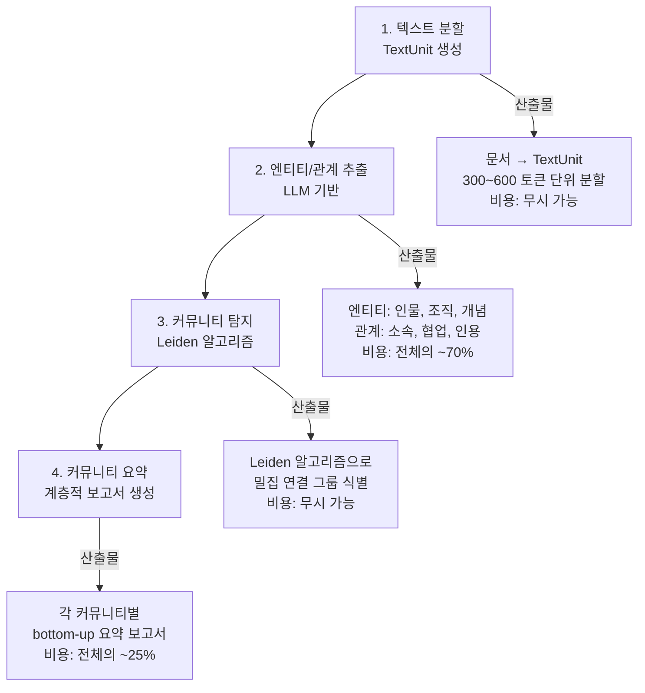
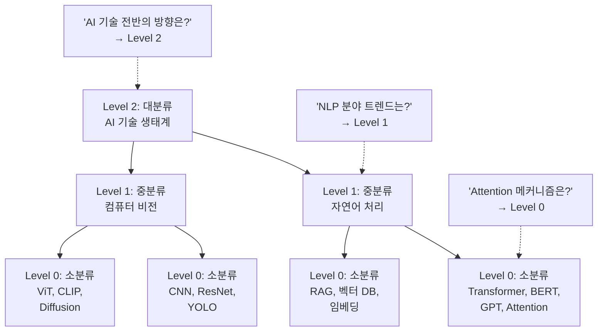
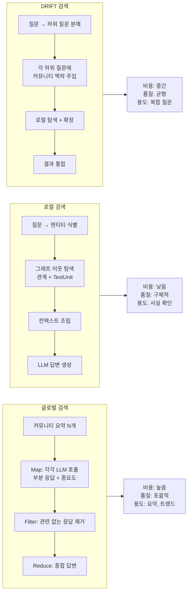
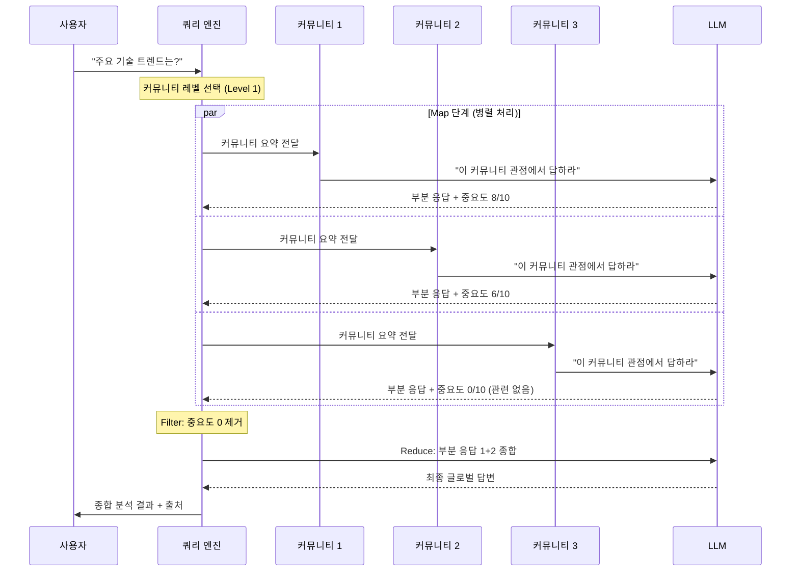
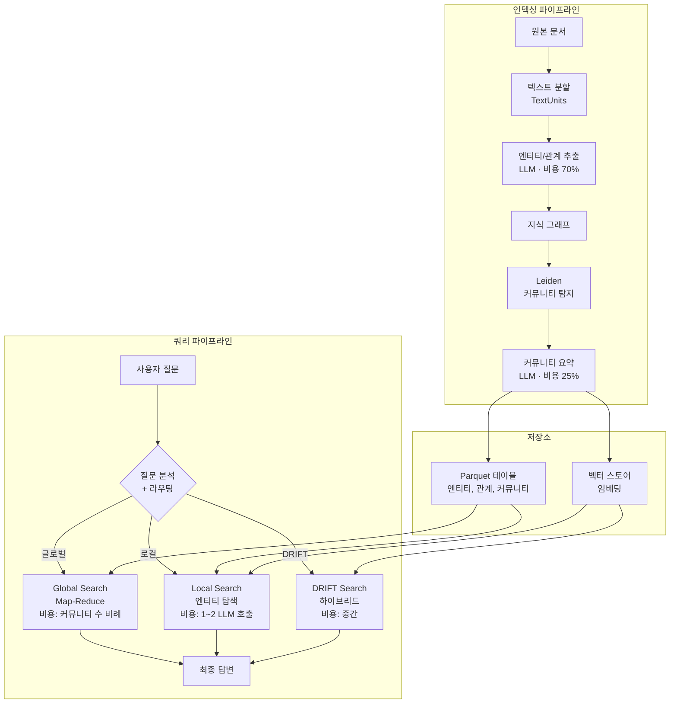

# GraphRAG 이론과 아키텍처

> Microsoft GraphRAG의 핵심 원리 — 지식 그래프와 커뮤니티 요약으로 기존 RAG의 한계를 돌파하는 방법을 배웁니다.

## 개요

이 섹션에서는 Microsoft Research가 제안한 GraphRAG의 이론적 배경과 전체 아키텍처를 학습합니다. 앞서 [Adaptive RAG 실전 프로젝트](13-ch13-adaptive-rag와-동적-라우팅/05-05-실전-프로젝트-법률-상담-rag.md)에서 법률 도메인에 Adaptive RAG를 적용해보면서, "이 계약서들에서 공통적으로 나타나는 리스크 패턴은?"과 같은 **글로벌 질문**에 기존 RAG가 구조적으로 무력하다는 한계를 체감했을 겁니다. GraphRAG는 바로 이 지점에서 출발합니다.

지식 그래프 + 커뮤니티 요약이라는 새로운 접근법이 이 문제를 어떻게 해결하는지 깊이 있게 파헤치고, 실제 인덱싱 비용과 트레이드오프까지 다룹니다.

**선수 지식**: [Adaptive RAG 아키텍처](13-ch13-adaptive-rag와-동적-라우팅/01-01-adaptive-rag-아키텍처.md)에서 다룬 RAG 라우팅 전략, [검색 도구 구축](12-ch12-agentic-rag-에이전트가-검색을-도구로-활용/02-02-검색-도구-구축.md)에서 배운 벡터 검색 기초, [실전 프로젝트: 법률 상담 RAG](13-ch13-adaptive-rag와-동적-라우팅/05-05-실전-프로젝트-법률-상담-rag.md)에서 경험한 글로벌 질의 한계
**학습 목표**:
- 기존 RAG의 글로벌 질의 실패 메커니즘을 정확히 분석하고, GraphRAG가 이를 해결하는 원리를 설명할 수 있다
- 엔티티-관계 추출 → Leiden 커뮤니티 탐지 → 계층적 요약의 인덱싱 파이프라인을 구현 수준에서 이해한다
- 글로벌/로컬/DRIFT 검색의 내부 동작과 비용-품질 트레이드오프를 평가할 수 있다
- LazyGraphRAG 등 최신 최적화 기법의 원리와 적용 시나리오를 판단할 수 있다

## 왜 알아야 할까?

Ch13에서 법률 상담 RAG를 구축하면서, 개별 법률 조항에 대한 질문에는 훌륭하게 답하는 시스템을 만들었습니다. 하지만 실전 배포 후 사용자들이 이런 질문을 던지기 시작합니다:

- "최근 3년간 개인정보 관련 판례에서 **공통적인 쟁점**은 뭐야?"
- "우리 회사 계약서 500건에서 **반복되는 리스크 패턴**을 요약해줘"
- "이 산업 보고서 200편의 **핵심 트렌드**를 분석해줘"

이 질문들의 공통점이 보이시나요? **특정 문서 하나에 답이 없습니다**. 전체 코퍼스를 종합해야만 답할 수 있는 **글로벌 질문(global question)**입니다. 벡터 RAG는 코사인 유사도로 상위 k개 청크를 가져오는 방식이라, 아무리 k를 늘려도 "숲 전체를 보는" 질문에는 구조적으로 무력합니다. Adaptive RAG의 라우팅이 아무리 정교해도, 검색 대상 자체가 개별 청크인 이상 이 한계를 넘을 수 없거든요.

GraphRAG는 이 문제를 근본적으로 다른 방식으로 접근합니다. 문서에서 엔티티와 관계를 추출해 **지식 그래프**를 만들고, 그래프를 **커뮤니티**로 묶어 미리 요약해 두는 것입니다. 마치 1,000편의 논문을 읽고 **서베이 논문을 미리 써놓는** 것과 같죠. 덕분에 "전체 데이터셋의 핵심 주제가 뭐야?" 같은 질문에도 체계적으로 답할 수 있게 됩니다.

## 핵심 개념

### 개념 1: 기존 RAG의 글로벌 질의 실패 메커니즘

> 💡 **비유**: 기존 벡터 RAG는 **도서관 사서**와 같습니다. "양자 컴퓨팅에 대한 책 찾아주세요"라고 하면 정확히 관련 책을 가져다주죠. 하지만 "이 도서관의 장서 트렌드가 어떤가요?"라고 물으면 사서는 모든 책을 한 권씩 읽어봐야 합니다. GraphRAG는 도서관 전체를 **분류 체계**로 미리 정리해둔 **카탈로그 시스템**입니다.

기존 Naive RAG가 글로벌 질문에 실패하는 이유를 정확히 이해하는 것이 중요합니다. 이건 단순히 "검색 결과가 나쁘다"는 수준이 아니라, **아키텍처 수준의 구조적 한계**이기 때문입니다.

**실패 메커니즘 1 — 정보 분산(Information Scattering)**: 글로벌 질문의 답은 수십~수백 개의 청크에 분산되어 있습니다. top-k 검색은 기껏해야 10~20개 청크만 가져오므로, 전체 정보의 극히 일부만 LLM에 전달됩니다.

**실패 메커니즘 2 — 임베딩 공간의 모호성(Embedding Ambiguity)**: "주요 트렌드는?"이라는 질문의 임베딩 벡터는 어떤 특정 문서와도 높은 유사도를 갖기 어렵습니다. 이 질문은 본질적으로 **메타 수준**의 질문이라 개별 문서의 임베딩 공간에서 가까운 이웃을 찾는 것 자체가 부적절합니다.

**실패 메커니즘 3 — 컨텍스트 윈도우 한계**: 설령 모든 문서를 가져올 수 있다 해도, LLM의 컨텍스트 윈도우에는 한계가 있습니다. "모든 문서를 넣으면 되지 않나?"라는 접근은 100만 토큰 이상의 대규모 코퍼스에서 비현실적이고, 길어질수록 LLM의 추론 품질도 떨어집니다(Lost in the Middle 현상).

> 📊 **그림 1**: 벡터 RAG의 글로벌 질의 실패 메커니즘과 GraphRAG의 해결 전략



Microsoft Research의 논문 평가에 따르면, 약 100만 토큰 규모 데이터셋에서 GraphRAG는 기존 RAG 대비 **포괄성(comprehensiveness)**과 **다양성(diversity)** 모두에서 상당한 개선을 보였습니다. 특히 글로벌 질문에서의 승률이 70~80%에 달했는데, 이는 구조적 한계를 극복한 결과입니다.

```run:python
# Ch13 법률 RAG에서 경험한 글로벌 질의 실패 시나리오
failure_scenarios = [
    {
        "query": "최근 3년 판례에서 공통 쟁점은?",
        "vector_rag": "판례 2~3건만 검색 → 부분적 답변",
        "graphrag": "전체 판례 커뮤니티 요약 → 체계적 분석",
        "failure_type": "정보 분산",
    },
    {
        "query": "이 산업의 기술 트렌드 요약해줘",
        "vector_rag": "임베딩 유사도 낮아 관련 문서 검색 실패",
        "graphrag": "Level 2 커뮤니티에서 트렌드 요약 제공",
        "failure_type": "임베딩 모호성",
    },
    {
        "query": "A사의 기술이 B사를 거쳐 C사에 미친 영향은?",
        "vector_rag": "3개 문서를 동시에 검색할 수 없음",
        "graphrag": "엔티티 관계 그래프로 경로 추적",
        "failure_type": "멀티홉 추론",
    },
]

for i, s in enumerate(failure_scenarios, 1):
    print(f"{'='*60}")
    print(f"시나리오 {i}: {s['query']}")
    print(f"  실패 유형: {s['failure_type']}")
    print(f"  벡터 RAG: {s['vector_rag']}")
    print(f"  GraphRAG: {s['graphrag']}")
print(f"{'='*60}")
```

```output
============================================================
시나리오 1: 최근 3년 판례에서 공통 쟁점은?
  실패 유형: 정보 분산
  벡터 RAG: 판례 2~3건만 검색 → 부분적 답변
  GraphRAG: 전체 판례 커뮤니티 요약 → 체계적 분석
============================================================
시나리오 2: 이 산업의 기술 트렌드 요약해줘
  실패 유형: 임베딩 모호성
  벡터 RAG: 임베딩 유사도 낮아 관련 문서 검색 실패
  GraphRAG: Level 2 커뮤니티에서 트렌드 요약 제공
============================================================
시나리오 3: A사의 기술이 B사를 거쳐 C사에 미친 영향은?
  실패 유형: 멀티홉 추론
  벡터 RAG: 3개 문서를 동시에 검색할 수 없음
  GraphRAG: 엔티티 관계 그래프로 경로 추적
============================================================
```

### 개념 2: GraphRAG 인덱싱 파이프라인 — 4단계 변환

> 💡 **비유**: GraphRAG의 인덱싱은 **위키피디아를 만드는 과정**과 비슷합니다. 원본 텍스트에서 중요한 인물·사건·장소를 뽑아내고(엔티티 추출), 이들의 관계를 연결하고(관계 추출), 관련 항목끼리 카테고리로 묶고(커뮤니티 탐지), 각 카테고리의 요약 페이지를 작성하는(커뮤니티 요약) 것입니다.

GraphRAG의 인덱싱 파이프라인은 비정형 텍스트를 구조화된 지식 그래프로 변환하는 4단계 과정입니다. 각 단계에서 발생하는 비용과 트레이드오프를 함께 살펴보겠습니다.

> 📊 **그림 2**: GraphRAG 인덱싱 파이프라인 4단계와 각 단계의 산출물



**단계 1 — 텍스트 분할(Text Chunking)**: 입력 문서를 **TextUnit**이라는 분석 단위로 분할합니다. TextUnit은 원본 문서를 **300~600 토큰 단위로 나눈 텍스트 조각**으로, GraphRAG 인덱싱의 가장 기본적인 처리 단위입니다. 각 TextUnit은 후속 단계에서 엔티티 추출의 기본 입력이 되며, 최종 답변 생성 시 출처 추적(provenance)에도 활용됩니다. 청크 크기는 인덱싱 품질에 직결되는데, 너무 작으면 문맥이 끊겨 엔티티 관계 추출이 부정확해지고, 너무 크면 LLM 호출 비용이 급증합니다.

**단계 2 — 엔티티/관계 추출(Entity & Relationship Extraction)**: 인덱싱 비용의 약 70%가 이 단계에서 발생합니다. LLM이 각 TextUnit에서 명명 엔티티(인물, 조직, 장소, 개념 등)와 엔티티 간 관계를 추출합니다. 핵심적인 설계 결정은 **gleaning(재추출)**인데, 첫 추출 후 LLM에게 "놓친 엔티티가 있는지" 다시 확인을 요청하는 과정입니다. 기본적으로 1회 gleaning이 설정되어 있으며, 이 횟수를 늘릴수록 recall은 높아지지만 비용도 선형으로 증가합니다.

**단계 3 — 커뮤니티 탐지(Community Detection)**: 추출된 그래프에 **Leiden 알고리즘**을 적용하여 밀집 연결된 엔티티 그룹(커뮤니티)을 계층적으로 식별합니다. Level 0은 2~10개 엔티티의 세밀한 커뮤니티, 상위 레벨로 갈수록 더 넓은 테마를 포괄합니다. 이 단계는 그래프 알고리즘만 사용하므로 LLM 비용이 들지 않습니다.

**단계 4 — 커뮤니티 요약(Community Summarization)**: 각 커뮤니티에 대해 LLM이 bottom-up 방식으로 요약 보고서를 생성합니다. Level 0부터 시작하여 하위 커뮤니티의 요약을 입력으로 상위 커뮤니티의 요약을 만드는 구조입니다. 이 보고서가 나중에 글로벌 검색의 핵심 입력이 됩니다.

```python
# GraphRAG 인덱싱 파이프라인 개념적 구조
from dataclasses import dataclass, field

@dataclass
class Entity:
    """추출된 엔티티"""
    name: str
    type: str          # PERSON, ORGANIZATION, CONCEPT, LOCATION 등
    description: str   # LLM이 생성한 엔티티 설명
    source_ids: list[str] = field(default_factory=list)  # 출처 TextUnit
    rank: float = 0.0  # 그래프 중심성(centrality) 기반 중요도

@dataclass
class Relationship:
    """엔티티 간 관계"""
    source: str        # 출발 엔티티
    target: str        # 도착 엔티티
    description: str   # 관계 설명 (예: "A가 B를 개발했다")
    weight: float = 1.0  # 동일 관계가 여러 TextUnit에서 발견되면 가중치 증가

@dataclass
class Community:
    """커뮤니티 (엔티티 군집)"""
    id: str
    level: int         # 계층 레벨 (0=세밀, 높을수록 포괄적)
    entities: list[Entity] = field(default_factory=list)
    relationships: list[Relationship] = field(default_factory=list)
    summary: str = ""        # LLM이 생성한 커뮤니티 요약
    rank: float = 0.0        # 커뮤니티 중요도 (엔티티 rank 합산)
    findings: list[str] = field(default_factory=list)  # 핵심 발견 사항 리스트


@dataclass
class IndexingCostEstimate:
    """인덱싱 비용 추정"""
    total_tokens: int
    entity_extraction_pct: float = 0.70  # 전체 비용의 ~70%
    community_summary_pct: float = 0.25  # 전체 비용의 ~25%
    other_pct: float = 0.05
    
    @property
    def estimated_cost_gpt4(self) -> float:
        """GPT-4 기준 예상 비용 (USD)"""
        # 입력 $30/1M tokens + 출력 $60/1M tokens (대략적 추정)
        return (self.total_tokens / 1_000_000) * 45  # 평균 단가
```

### 개념 3: Leiden 알고리즘과 계층적 커뮤니티 탐지

> 💡 **비유**: Leiden 알고리즘은 **SNS 친구 분석**과 비슷합니다. 서로 자주 대화하고 댓글 다는 사람들을 하나의 "친구 그룹"으로 묶는 거예요. Level 0에서는 "절친 3~4명" 단위로 묶이고, Level 1에서는 "같은 동아리 20명", Level 2에서는 "같은 학교 200명"처럼 점점 넓은 그룹이 형성됩니다.

Leiden 알고리즘은 Louvain 알고리즘의 개선판으로, 그래프의 **모듈성(modularity)**을 최적화하여 밀집 연결된 하위 그래프(커뮤니티)를 탐지합니다. Louvain은 노드를 이동시키면서 모듈성을 개선하지만, 때때로 **연결이 끊어진 커뮤니티(poorly connected communities)**를 생성하는 버그가 있었습니다. Leiden은 "정제(refinement)" 단계를 추가하여 이 문제를 해결했고, 수렴성도 보장합니다.

GraphRAG에서 Leiden이 핵심적인 이유는 **다중 해상도(multi-resolution)** 지원입니다. resolution 파라미터를 조절하면 같은 그래프에서 세밀한 커뮤니티(많은 수의 작은 그룹)부터 포괄적 커뮤니티(적은 수의 큰 그룹)까지 다양한 수준의 분할을 얻을 수 있습니다.

> 📊 **그림 3**: Leiden 알고리즘의 계층적 커뮤니티 구조와 질문 매칭



핵심은 **질문의 추상화 수준에 맞는 커뮤니티 레벨을 선택**할 수 있다는 점입니다. "Transformer의 Attention 메커니즘은?"이라는 구체적 질문에는 Level 0이, "AI 기술의 주요 트렌드는?"이라는 포괄적 질문에는 Level 2가 적합합니다. 실무에서는 기본적으로 Level 1이나 2를 사용하되, 질문 분석 결과에 따라 동적으로 선택하는 전략이 효과적입니다.

```run:python
# Leiden 커뮤니티 계층 구조 시뮬레이션 — 비용/품질 트레이드오프 포함
import json

communities = {
    "Level 0 (세밀)": {
        "count": 150,
        "avg_entities": 4,
        "summary_tokens": 500,
        "use_case": "구체적 사실 질문, 엔티티 중심 탐색",
    },
    "Level 1 (중간)": {
        "count": 30,
        "avg_entities": 20,
        "summary_tokens": 1500,
        "use_case": "도메인별 트렌드, 중간 수준 분석",
    },
    "Level 2 (포괄)": {
        "count": 5,
        "avg_entities": 120,
        "summary_tokens": 3000,
        "use_case": "전체 코퍼스 테마, 글로벌 요약",
    },
}

total_summary_cost = 0
for level, info in communities.items():
    cost = info["count"] * info["summary_tokens"]
    total_summary_cost += cost
    print(f"📊 {level}")
    print(f"   커뮤니티 수: {info['count']}개")
    print(f"   평균 엔티티: {info['avg_entities']}개/커뮤니티")
    print(f"   요약 비용: {info['count']} x {info['summary_tokens']} = {cost:,} 토큰")
    print(f"   적합한 질문: {info['use_case']}")
    print()

print(f"💰 전체 커뮤니티 요약 비용: ~{total_summary_cost:,} 토큰")
```

```output
📊 Level 0 (세밀)
   커뮤니티 수: 150개
   평균 엔티티: 4개/커뮤니티
   요약 비용: 150 x 500 = 75,000 토큰
   적합한 질문: 구체적 사실 질문, 엔티티 중심 탐색

📊 Level 1 (중간)
   커뮤니티 수: 30개
   평균 엔티티: 20개/커뮤니티
   요약 비용: 30 x 1500 = 45,000 토큰
   적합한 질문: 도메인별 트렌드, 중간 수준 분석

📊 Level 2 (포괄)
   커뮤니티 수: 5개
   평균 엔티티: 120개/커뮤니티
   요약 비용: 5 x 3000 = 15,000 토큰
   적합한 질문: 전체 코퍼스 테마, 글로벌 요약

💰 전체 커뮤니티 요약 비용: ~135,000 토큰
```

### 개념 4: 글로벌 검색과 로컬 검색 전략의 내부 동작

> 💡 **비유**: 글로벌 검색은 **뉴스 방송의 종합 리포트**입니다. 각 부서(커뮤니티)의 기자가 자기 담당 분야의 관점에서 보고(Map)하고, 앵커가 이를 종합해서 하나의 이야기로 전달(Reduce)합니다. 반면 로컬 검색은 **탐정의 수사**와 같습니다. 핵심 용의자(엔티티)를 찾고, 그 주변 인물과 관계를 따라가며 구체적인 사실을 파헤치는 방식이죠.

GraphRAG는 질문 유형에 따라 세 가지 검색 전략을 제공합니다. 각 전략의 내부 동작과 비용 특성을 자세히 살펴보겠습니다.

**글로벌 검색(Global Search)** — Map-Reduce 패턴:
1. **Map**: 선택된 레벨의 모든 커뮤니티 요약에 대해, 각 요약과 질문을 함께 LLM에 전달하여 부분 응답(partial answer)을 생성합니다. 이때 각 부분 응답에는 **중요도 점수(helpfulness score)**가 부여됩니다.
2. **Filter**: 중요도가 0인 부분 응답은 제거합니다. "이 커뮤니티는 질문과 관련 없음"이라고 판단된 것들이죠.
3. **Reduce**: 살아남은 부분 응답들을 중요도 순으로 정렬하여 LLM에 전달, 최종 답변을 종합합니다.

비용 측면에서 글로벌 검색은 **커뮤니티 수 × LLM 호출**이 필요하므로, Level 0(수백 개 커뮤니티)보다 Level 2(수 개 커뮤니티)가 훨씬 저렴합니다. 다만 높은 레벨은 세부 정보가 요약 과정에서 손실될 수 있다는 트레이드오프가 있습니다.

**로컬 검색(Local Search)** — 엔티티 중심 탐색:
1. 질문에서 핵심 엔티티를 식별 (벡터 유사도 + 텍스트 매칭)
2. 해당 엔티티의 직접 이웃과 관련 관계를 그래프에서 탐색
3. 연관 TextUnit, 커뮤니티 보고서, 공변량(covariate) 정보를 수집
4. 이 컨텍스트를 LLM에 전달하여 답변 생성

로컬 검색은 LLM 호출이 1~2회로 비용이 낮지만, 엔티티 식별이 실패하면 답변 품질이 급락합니다.

**DRIFT Search** — 하이브리드 전략:
DRIFT(Dynamic Reasoning and Inference with Flexible Traversal)는 2024년 말 추가된 세 번째 전략입니다. 로컬 검색의 엔티티 중심 탐색에 커뮤니티 수준의 맥락 정보를 결합합니다. 질문을 여러 하위 질문(sub-query)으로 분해하고, 각 하위 질문에 대해 관련 커뮤니티의 맥락을 주입한 로컬 검색을 수행한 뒤 결과를 통합하는 방식입니다.

> 📊 **그림 4**: 세 가지 검색 전략의 비교 — 비용, 품질, 적합 시나리오



> 📊 **그림 5**: 글로벌 검색 Map-Reduce의 상세 시퀀스



```python
from dataclasses import dataclass
from enum import Enum


class SearchMethod(Enum):
    """GraphRAG 검색 전략"""
    GLOBAL = "global"   # 커뮤니티 요약 + Map-Reduce
    LOCAL = "local"     # 엔티티 이웃 탐색
    DRIFT = "drift"     # 로컬 + 커뮤니티 맥락 결합


@dataclass
class SearchConfig:
    method: SearchMethod
    community_level: int = 1    # 커뮤니티 계층 레벨
    top_k_entities: int = 10    # 로컬 검색 시 상위 엔티티 수
    max_tokens: int = 4096      # 컨텍스트 윈도우 제한
    map_llm_calls: int = 0      # 글로벌 검색 시 예상 LLM 호출 수


# 질문 유형별 권장 검색 전략과 비용 분석
STRATEGY_GUIDE = {
    "데이터셋의 주요 테마는?": SearchConfig(
        method=SearchMethod.GLOBAL,
        community_level=2,      # 높은 레벨 → 포괄적 테마
        map_llm_calls=5,        # Level 2 커뮤니티 수
    ),
    "특정 인물의 업적과 관계는?": SearchConfig(
        method=SearchMethod.LOCAL,
        top_k_entities=15,      # LLM 호출: 1~2회
    ),
    "특정 기술이 산업에 미친 영향은?": SearchConfig(
        method=SearchMethod.DRIFT,
        community_level=1,
        top_k_entities=10,
        map_llm_calls=8,        # 하위 질문 수 × 탐색
    ),
    "계약서 500건의 공통 리스크 패턴은?": SearchConfig(
        method=SearchMethod.GLOBAL,
        community_level=1,      # 도메인 수준 커뮤니티
        map_llm_calls=30,       # Level 1은 커뮤니티가 많아 비용 증가
    ),
}
```

### 개념 5: GraphRAG 전체 아키텍처 조감과 비용 현실

앞서 배운 개념들을 하나로 엮으면 GraphRAG의 전체 아키텍처가 완성됩니다. 인덱싱과 쿼리, 두 개의 큰 파이프라인이 지식 그래프를 매개로 연결됩니다.

> 📊 **그림 6**: GraphRAG 전체 아키텍처 — 인덱싱에서 쿼리까지



인덱싱 파이프라인의 결과물은 **Parquet 테이블**(엔티티, 관계, 커뮤니티 정보)과 **벡터 스토어**(텍스트 임베딩)로 저장됩니다. 쿼리 시점에 질문 유형에 따라 적절한 검색 전략이 선택되어 실행되는 구조입니다.

그렇다면 비용은 어느 정도일까요? Microsoft Research의 논문에서 보고된 수치를 기반으로 현실적인 비용을 계산해봅시다.

```run:python
# GraphRAG 인덱싱 비용 현실적 추정
cost_scenarios = {
    "소규모 (10만 토큰, 문서 50개)": {
        "input_tokens": 100_000,
        "text_units": 250,
        "llm_calls_extraction": 250,     # TextUnit 수 × (1 + gleaning)
        "llm_calls_summary": 30,          # 커뮤니티 수
        "estimated_cost_gpt4o": 2,        # USD
        "estimated_cost_gpt4o_mini": 0.2,
    },
    "중규모 (100만 토큰, 문서 500개)": {
        "input_tokens": 1_000_000,
        "text_units": 2500,
        "llm_calls_extraction": 5000,
        "llm_calls_summary": 150,
        "estimated_cost_gpt4o": 20,
        "estimated_cost_gpt4o_mini": 2,
    },
    "대규모 (1000만 토큰, 문서 5000개)": {
        "input_tokens": 10_000_000,
        "text_units": 25000,
        "llm_calls_extraction": 50000,
        "llm_calls_summary": 500,
        "estimated_cost_gpt4o": 200,
        "estimated_cost_gpt4o_mini": 20,
    },
}

for scenario, data in cost_scenarios.items():
    print(f"📊 {scenario}")
    print(f"   TextUnit 수: {data['text_units']:,}개")
    print(f"   엔티티 추출 LLM 호출: ~{data['llm_calls_extraction']:,}회")
    print(f"   커뮤니티 요약 LLM 호출: ~{data['llm_calls_summary']}회")
    print(f"   💰 예상 비용 (GPT-4o): ~${data['estimated_cost_gpt4o']}")
    print(f"   💰 예상 비용 (GPT-4o-mini): ~${data['estimated_cost_gpt4o_mini']}")
    print()
```

```output
📊 소규모 (10만 토큰, 문서 50개)
   TextUnit 수: 250개
   엔티티 추출 LLM 호출: ~250회
   커뮤니티 요약 LLM 호출: ~30회
   💰 예상 비용 (GPT-4o): ~$2
   💰 예상 비용 (GPT-4o-mini): ~$0.2

📊 중규모 (100만 토큰, 문서 500개)
   TextUnit 수: 2,500개
   엔티티 추출 LLM 호출: ~5,000회
   커뮨니티 요약 LLM 호출: ~150회
   💰 예상 비용 (GPT-4o): ~$20
   💰 예상 비용 (GPT-4o-mini): ~$2

📊 대규모 (1000만 토큰, 문서 5000개)
   TextUnit 수: 25,000개
   엔티티 추출 LLM 호출: ~50,000회
   커뮤니티 요약 LLM 호출: ~500회
   💰 예상 비용 (GPT-4o): ~$200
   💰 예상 비용 (GPT-4o-mini): ~$20
```

## 실습: 직접 해보기

GraphRAG CLI를 사용하여 실제 인덱싱과 쿼리를 수행해보겠습니다. 먼저 환경을 설정하고, 샘플 텍스트로 전체 파이프라인을 실행합니다.

```python
# 1. 환경 설정 — 터미널에서 실행
# pip install graphrag

# 2. 프로젝트 초기화
# mkdir graphrag_demo && cd graphrag_demo
# graphrag init

# 3. 샘플 데이터 준비 (Python으로 생성)
import os
from pathlib import Path

# 이번 코스에서 다룬 주제들로 샘플 문서 구성
sample_docs = {
    "ai_agents.txt": """
AI 에이전트는 LLM을 기반으로 자율적으로 도구를 활용하여 문제를 해결하는 시스템이다.
ReAct 패턴은 추론(Reasoning)과 행동(Acting)을 번갈아 수행하는 핵심 아키텍처이다.
LangGraph는 StateGraph를 통해 복잡한 에이전트 워크플로우를 그래프로 표현한다.
체크포인트 시스템은 에이전트의 실행 상태를 영속적으로 저장하여 중단/재개를 가능하게 한다.
Human-in-the-Loop 패턴은 에이전트 실행 중 사람의 승인을 받아 안전성을 보장한다.
""",
    "mcp_protocol.txt": """
MCP(Model Context Protocol)는 Anthropic이 주도한 LLM-도구 통합 프로토콜이다.
FastMCP는 데코레이터 기반으로 MCP 서버를 쉽게 구축할 수 있는 고수준 프레임워크이다.
MCP 클라이언트는 서버가 노출한 도구를 자동으로 발견하고 LLM에 바인딩한다.
A2A(Agent-to-Agent) 프로토콜은 Google이 주도하며, 에이전트 간 상호운용성을 제공한다.
MCP와 A2A는 상호 보완적이며, MCP는 도구 통합, A2A는 에이전트 간 통신에 초점을 맞춘다.
""",
    "rag_systems.txt": """
RAG(Retrieval-Augmented Generation)는 외부 지식을 LLM에 주입하는 핵심 기법이다.
Agentic RAG는 에이전트가 검색을 도구로 활용하여 자율적으로 정보를 수집한다.
Adaptive RAG는 쿼리 복잡도에 따라 검색 전략을 동적으로 전환한다.
GraphRAG는 지식 그래프를 활용하여 글로벌 질문에 대한 포괄적 답변을 생성한다.
벡터 RAG와 GraphRAG를 결합한 하이브리드 시스템이 실무에서 가장 효과적이다.
""",
}

# input 디렉토리에 파일 저장
input_dir = Path("input")
input_dir.mkdir(exist_ok=True)

for filename, content in sample_docs.items():
    (input_dir / filename).write_text(content.strip(), encoding="utf-8")

print(f"✅ {len(sample_docs)}개 샘플 문서 생성 완료")
print(f"📁 저장 위치: {input_dir.resolve()}")
```

```python
# 4. settings.yaml 핵심 설정 — graphrag init 후 수정
# .env 파일에 API 키 설정
# GRAPHRAG_API_KEY=your-openai-api-key

# settings.yaml의 주요 파라미터와 의미:
SETTINGS_GUIDE = """
models:
  default_chat_model:
    model: gpt-4o-mini          # 비용 절감을 위해 mini 권장
    max_tokens: 4096
    
chunks:
  size: 300                      # TextUnit 크기 (토큰)
  overlap: 100                   # 청크 간 겹침
  
entity_extraction:
  max_gleanings: 1               # 재추출 횟수 (0=재추출 없음, 비용 절감)
  entity_types:                  # 추출할 엔티티 유형
    - PERSON
    - ORGANIZATION  
    - TECHNOLOGY
    - CONCEPT

community_reports:
  max_length: 1500               # 커뮤니티 요약 최대 길이
  
cluster_graph:
  max_cluster_size: 10           # 커뮤니티 최대 크기
"""
print(SETTINGS_GUIDE)
```

```python
# 5. 인덱싱 + 쿼리 실행 — 터미널에서
# graphrag index                  # 전체 인덱싱 (수 분 소요)
# graphrag query \
#   --query "이 문서들의 주요 기술 트렌드는 무엇인가?" \
#   --method global \
#   --community-level 1

# graphrag query \
#   --query "MCP 프로토콜의 핵심 특징은?" \
#   --method local

# graphrag query \
#   --query "AI 에이전트 기술이 RAG 시스템에 미친 영향은?" \
#   --method drift

# 6. Python API로 인덱싱 결과 분석하기
import pandas as pd
from pathlib import Path


def analyze_graphrag_output(output_dir: str = "output") -> None:
    """인덱싱 결과 Parquet 파일을 분석합니다."""
    output_path = Path(output_dir)

    # 엔티티 테이블 로드
    entities_path = output_path / "entities.parquet"
    if entities_path.exists():
        entities_df = pd.read_parquet(entities_path)
        print(f"📊 추출된 엔티티: {len(entities_df)}개")
        print(f"   엔티티 타입: {entities_df['type'].value_counts().to_dict()}")
        print(f"   상위 엔티티 (degree 기준):")
        if "degree" in entities_df.columns:
            top = entities_df.nlargest(5, "degree")[["title", "type", "degree"]]
            for _, row in top.iterrows():
                print(f"     {row['title']} ({row['type']}) — 연결 수: {row['degree']}")
        print()

    # 관계 테이블 로드
    relationships_path = output_path / "relationships.parquet"
    if relationships_path.exists():
        rels_df = pd.read_parquet(relationships_path)
        print(f"🔗 추출된 관계: {len(rels_df)}개")
        for _, row in rels_df.head(5).iterrows():
            print(f"   {row['source']} → {row['target']}: {row['description'][:50]}")
        print()

    # 커뮤니티 테이블 로드
    communities_path = output_path / "communities.parquet"
    if communities_path.exists():
        comm_df = pd.read_parquet(communities_path)
        print(f"🏘️ 탐지된 커뮤니티: {len(comm_df)}개")
        if "level" in comm_df.columns:
            print(f"   레벨별 분포: {comm_df['level'].value_counts().to_dict()}")
        # 커뮤니티 요약 미리보기
        if "summary" in comm_df.columns:
            print(f"\n📝 커뮤니티 요약 샘플:")
            for _, row in comm_df.head(2).iterrows():
                summary_preview = row["summary"][:100] + "..." if len(row["summary"]) > 100 else row["summary"]
                print(f"   Level {row.get('level', '?')}: {summary_preview}")


# 인덱싱 완료 후 실행
# analyze_graphrag_output()
```

## 더 깊이 알아보기

### GraphRAG의 탄생 — "나무만 보는 RAG"에 대한 도전

GraphRAG는 2024년 4월 **Darren Edge**, Ha Trinh 등 Microsoft Research 팀이 발표한 논문 *"From Local to Global: A Graph RAG Approach to Query-Focused Summarization"* (arXiv:2404.16130)에서 처음 제안되었습니다.

연구팀은 RAG 시스템을 실제 프로젝트에 적용하면서 한 가지 근본적 한계를 발견했는데요. 기업 내부 문서 수만 건을 임베딩하고 벡터 검색으로 질문에 답하는 시스템을 만들었지만, 경영진이 "우리 조직의 핵심 역량과 리스크를 요약해줘"라고 물었을 때 시스템은 무력했습니다. 이 질문은 본질적으로 **쿼리 중심 요약(Query-Focused Summarization)** 문제이지, 문서 검색 문제가 아니었기 때문입니다.

이 통찰에서 핵심 아이디어가 탄생했습니다: "인덱싱 시점에 전체 코퍼스를 지식 그래프로 구조화하고, 그래프의 커뮤니티 구조를 활용하면 글로벌 질문도 다룰 수 있지 않을까?"

흥미로운 점은 **Leiden 알고리즘**의 선택입니다. Leiden은 네덜란드 레이덴 대학의 Vincent Traag 등이 2019년에 발표한 커뮤니티 탐지 알고리즘으로, 이전의 Louvain 알고리즘이 가지고 있던 "잘못 연결된 커뮤니티" 문제를 해결했습니다. 이름 자체가 레이덴 대학교 소재지인 네덜란드의 도시 Leiden에서 따온 것이죠. GraphRAG 팀은 Leiden의 **계층적 분할 능력**이 질문의 추상화 수준에 맞는 다해상도 검색에 핵심이라고 판단했습니다.

2024년 7월 GitHub에 오픈소스로 공개된 이후, GraphRAG는 빠르게 진화하고 있습니다. 2025년에는 **LazyGraphRAG**가 발표되어 인덱싱 비용을 99% 절감하는 방식이 소개되었고, DRIFT Search가 글로벌과 로컬의 장점을 결합하는 세 번째 검색 전략으로 추가되었습니다.

### LazyGraphRAG — 비용 문제의 실용적 해결

GraphRAG의 가장 큰 진입 장벽은 인덱싱 비용입니다. LazyGraphRAG는 "모든 것을 미리 요약할 필요가 있을까?"라는 질문에서 출발합니다. 핵심 아이디어는 **지연 요약(deferred summarization)** — 인덱싱 시점에는 NLP 기법(NER, noun phrase extraction)으로 가벼운 그래프만 구축하고, 쿼리 시점에 관련 커뮤니티만 LLM으로 요약하는 방식입니다. 인덱싱 비용은 99% 절감되지만, 쿼리 응답 지연은 약간 증가하는 트레이드오프가 있습니다.

### 왜 "그래프"인가?

사실 지식 그래프를 NLP에 활용하는 시도는 Google Knowledge Graph(2012)까지 거슬러 올라갑니다. 하지만 기존 지식 그래프는 사전에 정의된 스키마에 수작업으로 데이터를 입력해야 했죠. GraphRAG의 혁신은 **LLM이 자동으로 엔티티와 관계를 추출**하고, 이를 **커뮤니티 분석과 결합**했다는 점입니다. 전통적 지식 그래프의 구조적 장점과 LLM의 유연한 이해력을 결합한 셈입니다.

## 흔한 오해와 팁

> ⚠️ **흔한 오해**: "GraphRAG는 벡터 RAG를 완전히 대체한다"
> 그렇지 않습니다. GraphRAG는 **글로벌 질문**에 강하지만, 인덱싱 비용이 높고 단순한 사실 확인 질문에는 벡터 RAG가 더 빠르고 효율적입니다. Microsoft 자체 평가에서도 **로컬 질문에서는 벡터 RAG가 GraphRAG와 비슷하거나 더 나은 결과**를 보였습니다. 실무에서는 두 가지를 결합한 **하이브리드 RAG**가 최선이며, 이 내용은 [하이브리드 RAG 설계](14-ch14-graphrag와-knowledge-graph/04-04-하이브리드-rag-설계.md)에서 자세히 다룹니다.

> ⚠️ **흔한 오해**: "커뮤니티 레벨은 높을수록 좋다"
> Level이 높으면 더 포괄적이지만, 요약 과정에서 세부 정보가 손실됩니다. Level 2에서 "기술 X의 구체적 장단점"을 물으면 뭉뚱그려진 답변만 나올 수 있어요. 적절한 레벨 선택이 품질을 결정하며, 실무에서는 질문 분석 결과에 따라 레벨을 동적으로 선택하는 전략이 필요합니다.

> 💡 **알고 계셨나요?**: GraphRAG의 인덱싱에서 가장 비용이 큰 단계는 엔티티 추출(전체의 ~70%)입니다. `max_gleanings`를 0으로 설정하면 재추출을 건너뛰어 비용을 약 40% 절감할 수 있지만, recall이 떨어질 수 있습니다. GPT-4o-mini를 사용하면 GPT-4o 대비 10분의 1 비용으로 유사한 품질을 얻을 수 있어, 프로토타이핑 단계에서 강력히 권장됩니다.

> 🔥 **실무 팁**: GraphRAG를 도입하기 전에 세 가지를 확인하세요. (1) "우리 시스템에 글로벌 질문이 실제로 들어오는가?" — 대부분의 Q&A 시스템은 로컬 질문이 80% 이상이며 이 경우 벡터 RAG만으로 충분합니다. (2) "데이터가 자주 업데이트되는가?" — GraphRAG는 인덱싱 비용이 높아 데이터 변경이 잦으면 부담이 큽니다. (3) "latency 요구사항은?" — 글로벌 검색은 Map-Reduce 특성상 응답 시간이 10초 이상 걸릴 수 있습니다.

## 핵심 정리

| 개념 | 설명 |
|------|------|
| GraphRAG | 지식 그래프 + 커뮤니티 요약 기반 RAG, 글로벌 질문에 강점 |
| 글로벌 질의 실패 | 정보 분산 + 임베딩 모호성 + 컨텍스트 한계로 벡터 RAG가 구조적으로 실패 |
| TextUnit | 원본 문서를 300~600 토큰 단위로 나눈 텍스트 조각, 인덱싱의 기본 분석 단위 |
| 인덱싱 파이프라인 | 텍스트 분할 → 엔티티/관계 추출(비용 70%) → Leiden 커뮤니티 탐지 → 커뮤니티 요약(비용 25%) |
| Leiden 알고리즘 | Louvain 개선판, 그래프를 계층적 커뮤니티로 분할, 다중 해상도 지원 |
| 글로벌 검색 | 커뮤니티 요약 Map-Reduce, 포괄적 질문에 적합, 비용 높음 |
| 로컬 검색 | 엔티티 이웃 탐색, 구체적 사실 확인에 적합, 비용 낮음 |
| DRIFT Search | 로컬 + 커뮤니티 맥락 결합, 복합 질문에 적합 |
| LazyGraphRAG | 지연 요약으로 인덱싱 비용 99% 절감, 쿼리 시점 요약 |
| 인덱싱 비용 | 100만 토큰 기준 GPT-4o ~$20, GPT-4o-mini ~$2 |

## 다음 섹션 미리보기

이번 섹션에서 GraphRAG의 이론과 전체 아키텍처, 그리고 비용 현실까지 깊이 있게 다뤘습니다. 다음 섹션 [지식 그래프 구축 파이프라인](14-ch14-graphrag와-knowledge-graph/02-02-지식-그래프-구축-파이프라인.md)에서는 LLM을 활용하여 실제로 텍스트에서 엔티티와 관계를 추출하고, NetworkX와 Leiden 알고리즘으로 지식 그래프를 구축하는 과정을 **코드로 직접 구현**합니다. 인덱싱 비용 최적화 전략도 실습으로 다룹니다.

## 참고 자료

- [From Local to Global: A Graph RAG Approach to Query-Focused Summarization](https://arxiv.org/abs/2404.16130) - GraphRAG의 원본 논문. 글로벌 검색의 Map-Reduce 메커니즘과 평가 결과를 상세히 설명
- [Microsoft GraphRAG GitHub Repository](https://github.com/microsoft/graphrag) - 공식 오픈소스 구현체. CLI 사용법, 설정 파일, API 문서 포함
- [GraphRAG 공식 문서 — Get Started](https://microsoft.github.io/graphrag/get_started/) - 설치부터 첫 쿼리까지의 빠른 시작 가이드
- [GraphRAG: New tool for complex data discovery now on GitHub (Microsoft Research Blog)](https://www.microsoft.com/en-us/research/blog/graphrag-new-tool-for-complex-data-discovery-now-on-github/) - Microsoft Research의 공식 블로그 포스트. GraphRAG의 동기와 핵심 아이디어를 비기술적으로 설명
- [LazyGraphRAG: Setting a new standard for quality and cost](https://www.microsoft.com/en-us/research/blog/lazygraphrag-setting-a-new-standard-for-quality-and-cost-in-rag/) - LazyGraphRAG의 지연 요약 기법과 비용 절감 원리
- [Neo4j — Implementing "From Local to Global" GraphRAG](https://neo4j.com/blog/developer/global-graphrag-neo4j-langchain/) - Neo4j와 LangChain을 활용한 GraphRAG 구현 가이드

---
### 🔗 Related Sessions
- [adaptive_rag](12-ch12-agentic-rag-에이전트가-검색을-도구로-활용/01-01-rag에서-agentic-rag로.md) (prerequisite)
