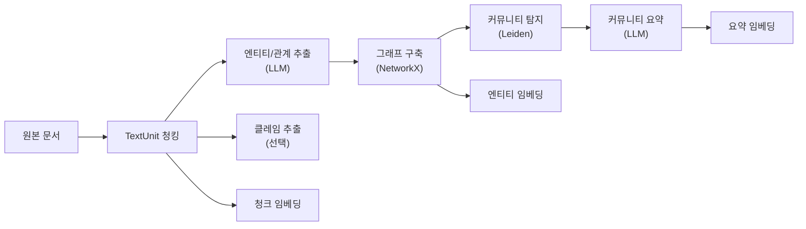
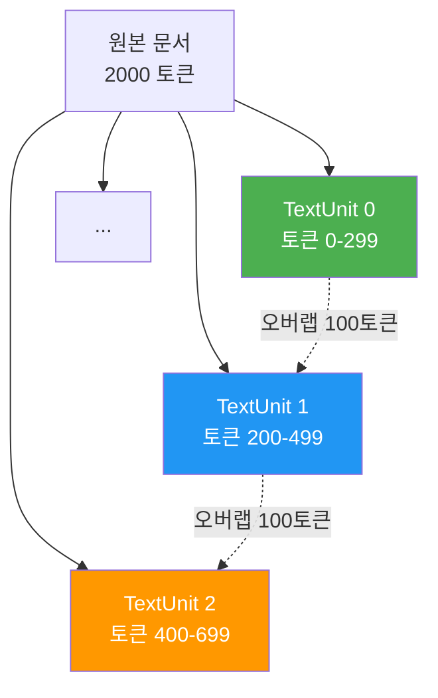
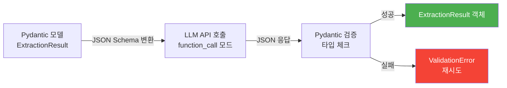
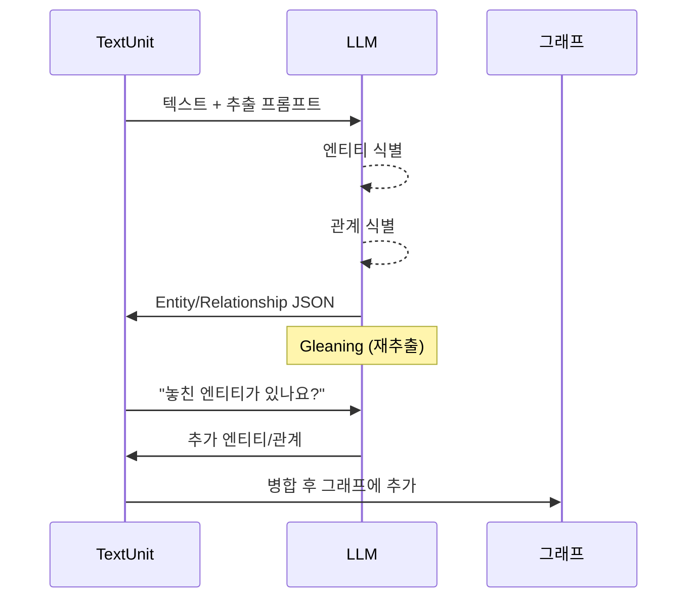
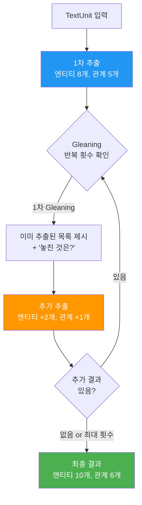
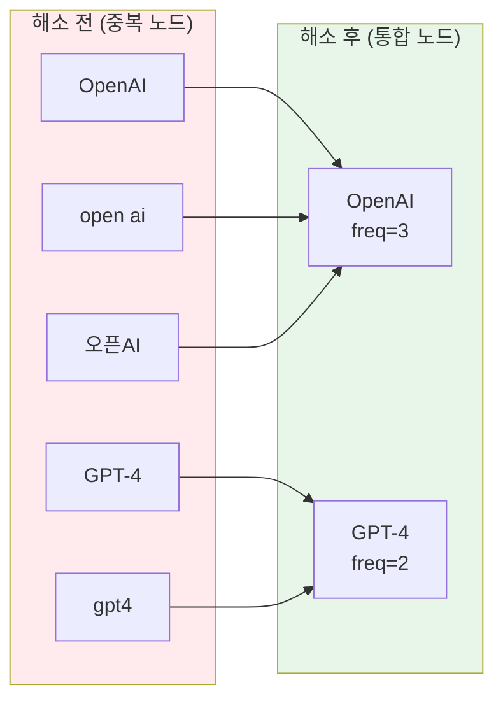
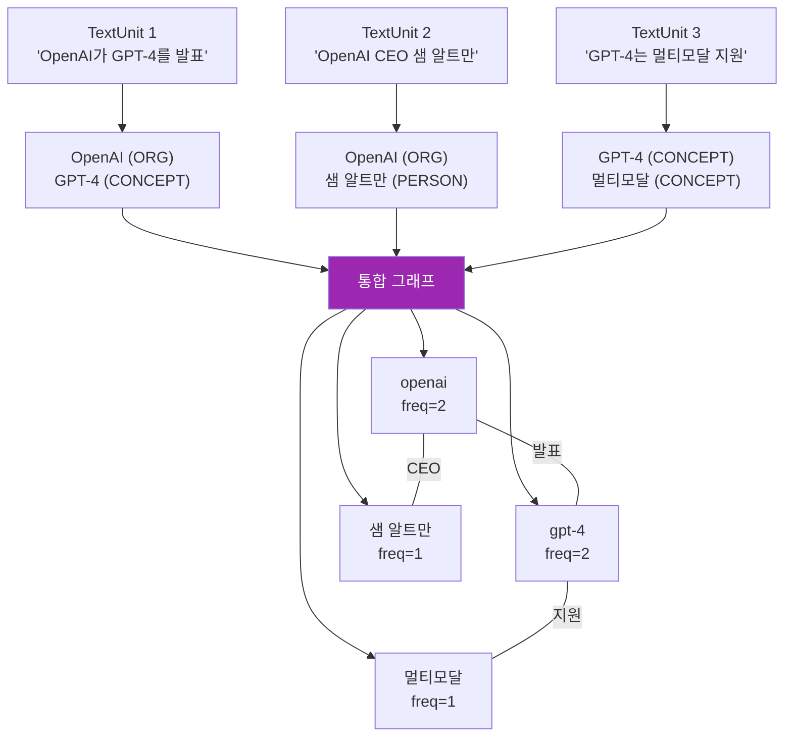
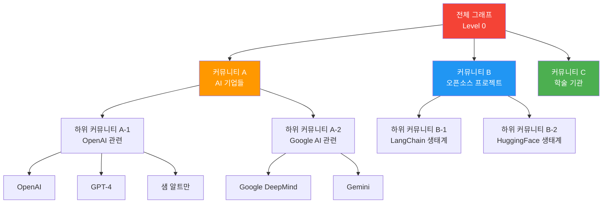

# 지식 그래프 구축 파이프라인

> LLM 기반 엔티티/관계 추출부터 Leiden 커뮤니티 탐지, 요약 생성까지 — GraphRAG 인덱싱 파이프라인을 직접 구현합니다

## 개요

이 섹션에서는 [이전 섹션](14-ch14-graphrag와-knowledge-graph/01-01-graphrag-이론과-아키텍처.md)에서 배운 GraphRAG 아키텍처를 **실제 코드로 구현**합니다. 비정형 텍스트에서 엔티티와 관계를 추출하고, NetworkX로 지식 그래프를 구축한 뒤, Leiden 알고리즘으로 커뮤니티를 탐지하고 LLM으로 커뮤니티 요약을 생성하는 전체 인덱싱 파이프라인을 만듭니다.

**선수 지식**: GraphRAG의 아키텍처(Global/Local Search, 커뮤니티 요약), TextUnit 개념, [LLM 도구 호출](01-ch1-llm-도구-호출의-이해/02-02-llm-tool-calling-메커니즘.md) 경험

**학습 목표**:
- LLM을 활용한 엔티티/관계 추출 프롬프트를 설계할 수 있다
- Structured Output(`with_structured_output()`)으로 LLM 응답을 Pydantic 모델에 매핑할 수 있다
- NetworkX로 지식 그래프를 구축하고 시각적으로 검증할 수 있다
- Leiden 알고리즘으로 계층적 커뮤니티를 탐지할 수 있다
- Gleaning과 Entity Resolution로 그래프 품질을 높일 수 있다

## 왜 알아야 할까?

GraphRAG의 진짜 힘은 **인덱싱 파이프라인**에서 나옵니다. 아무리 검색 전략이 훌륭해도, 입력 텍스트에서 엔티티와 관계를 제대로 뽑아내지 못하면 그래프 자체가 부실해지거든요. Microsoft의 공식 GraphRAG 구현을 보면 전체 비용의 **70~80%가 인덱싱 단계**에서 발생합니다. 즉, 이 파이프라인을 이해하고 최적화하는 것이 GraphRAG의 실전 도입을 좌우합니다.

실무에서는 "GraphRAG를 쓰고 싶은데 비용이 너무 비싸요"라는 이야기를 자주 듣습니다. 이 섹션에서 파이프라인 각 단계의 비용 구조를 이해하고, NLP 기반 경량 추출부터 LLM 기반 정밀 추출까지 선택지를 배우면, 프로젝트 규모와 예산에 맞는 최적의 파이프라인을 설계할 수 있습니다.

## 핵심 개념

### 개념 1: GraphRAG 인덱싱 파이프라인 전체 구조

> 💡 **비유**: GraphRAG 인덱싱은 **도서관 사서가 신착 도서를 정리하는 과정**과 같습니다. 먼저 책을 적당한 크기로 나누어 읽고(청킹), 등장인물과 관계를 카드에 기록하고(엔티티/관계 추출), 비슷한 주제의 카드를 묶어서 서가에 배치하고(커뮤니티 탐지), 각 서가에 "이 코너에는 이런 내용이 있습니다"라는 안내문을 붙이는(커뮤니티 요약) 것입니다.

Microsoft GraphRAG의 인덱싱 파이프라인은 크게 **5단계**로 구성됩니다.

> 📊 **그림 1**: GraphRAG 인덱싱 파이프라인 전체 흐름



각 단계의 역할을 정리하면 이렇습니다:

| 단계 | 입력 | 출력 | 비용 주체 |
|------|------|------|-----------|
| TextUnit 청킹 | 원본 문서 | 300~600 토큰 단위 청크 | 로컬 (무비용) |
| 엔티티/관계 추출 | TextUnit | Entity, Relationship 목록 | **LLM** (최대 비용) |
| 그래프 구축 | 추출된 엔티티/관계 | NetworkX 그래프 | 로컬 (무비용) |
| 커뮤니티 탐지 | 그래프 | 계층적 커뮤니티 | 로컬 (무비용) |
| 커뮤니티 요약 | 커뮤니티별 엔티티/관계 | 자연어 요약 보고서 | **LLM** |
| 임베딩 생성 | 청크, 엔티티, 요약 | 벡터 임베딩 | Embedding API |

> 🔥 **실무 팁**: 전체 파이프라인에서 LLM 호출이 발생하는 단계는 "엔티티/관계 추출"과 "커뮤니티 요약" 두 곳뿐입니다. 나머지는 모두 로컬 연산이므로, 비용 최적화는 이 두 단계에 집중해야 합니다. 임베딩 API 비용은 LLM 대비 매우 저렴합니다.

### 개념 2: TextUnit 청킹 — 분석의 기본 단위

> 💡 **비유**: TextUnit은 **퍼즐 조각**입니다. 원본 문서라는 큰 그림을 LLM이 한눈에 볼 수 있는 적절한 크기로 잘라야 하죠. 너무 크면 핵심을 놓치고, 너무 작으면 맥락을 잃습니다.

TextUnit은 GraphRAG에서 분석의 기본 단위입니다. 이전 섹션에서 배운 것처럼, 각 TextUnit에서 엔티티와 관계가 추출되고, 최종 답변 생성 시 출처 추적(provenance)의 단위가 됩니다.

```python
from dataclasses import dataclass, field
from typing import Optional
import tiktoken


@dataclass
class TextUnit:
    """GraphRAG의 기본 분석 단위"""
    id: str
    text: str
    document_id: str
    token_count: int = 0
    entity_ids: list[str] = field(default_factory=list)
    relationship_ids: list[str] = field(default_factory=list)


def chunk_documents(
    text: str,
    document_id: str,
    chunk_size: int = 300,  # GraphRAG 기본값
    overlap: int = 100,
) -> list[TextUnit]:
    """문서를 TextUnit으로 분할"""
    encoder = tiktoken.encoding_for_model("gpt-4o")
    tokens = encoder.encode(text)
    units = []

    start = 0
    unit_idx = 0
    while start < len(tokens):
        end = min(start + chunk_size, len(tokens))
        chunk_tokens = tokens[start:end]
        chunk_text = encoder.decode(chunk_tokens)

        units.append(TextUnit(
            id=f"{document_id}-unit-{unit_idx:03d}",
            text=chunk_text,
            document_id=document_id,
            token_count=len(chunk_tokens),
        ))
        unit_idx += 1
        start += chunk_size - overlap  # 오버랩 적용

    return units
```

> 📊 **그림 2**: TextUnit 청킹과 오버랩 구조



GraphRAG 공식 구현에서는 기본 청크 크기가 **300 토큰**입니다. 일반적인 RAG 시스템(500~1000 토큰)보다 작은데, 이는 엔티티/관계 추출의 정밀도를 높이기 위해서입니다. 청크가 작을수록 LLM이 텍스트 내 엔티티를 더 정확하게 식별할 수 있거든요.

### 개념 3: Structured Output — LLM 응답을 구조화하기

엔티티/관계 추출에서는 LLM의 응답을 **정확한 JSON 구조로** 받아야 합니다. 자유 형식 텍스트로 받으면 파싱 오류가 빈번하거든요. 이때 사용하는 것이 `with_structured_output()` 메서드입니다.

> 💡 **비유**: `with_structured_output()`은 **주문서 양식**과 같습니다. "아무렇게나 적어주세요"보다 "이름: ___, 수량: ___, 가격: ___" 양식을 주면 정확하게 원하는 정보를 받을 수 있죠. LLM에게 Pydantic 모델이라는 "양식"을 건네면, 모델이 그 형태에 맞춰 JSON을 반환합니다.

```python
from pydantic import BaseModel, Field
from langchain_openai import ChatOpenAI


# Pydantic으로 원하는 출력 스키마를 정의
class ExtractedEntity(BaseModel):
    """텍스트에서 추출된 엔티티"""
    name: str = Field(description="엔티티 이름 (정규화된 형태)")
    type: str = Field(description="엔티티 유형: PERSON, ORG, LOCATION, CONCEPT 등")
    description: str = Field(description="엔티티에 대한 상세 설명")


class ExtractionResult(BaseModel):
    """하나의 TextUnit에서 추출된 전체 결과"""
    entities: list[ExtractedEntity] = Field(default_factory=list)
    relationships: list = Field(default_factory=list)


# with_structured_output()으로 JSON 응답 강제
llm = ChatOpenAI(model="gpt-4o-mini", temperature=0)
structured_llm = llm.with_structured_output(ExtractionResult)

# 이제 invoke() 결과가 문자열이 아닌 ExtractionResult 객체!
result = structured_llm.invoke("텍스트에서 엔티티를 추출하세요: ...")
print(type(result))  # <class 'ExtractionResult'>
print(result.entities[0].name)  # 바로 속성 접근 가능
```

내부적으로 `with_structured_output()`은 OpenAI의 **Function Calling** 또는 **JSON Mode**를 활용합니다. Pydantic 모델의 필드 정의와 `description`을 JSON Schema로 변환하여 LLM에게 전달하므로, `Field(description=...)`을 잘 작성하는 것이 추출 품질에 직접적으로 영향을 줍니다. 이 패턴은 이후 [Ch19. 가드레일과 Structured Output](19-ch19-가드레일과-structured-output/03-03-structured-output-기초.md)에서 더 자세히 다룹니다.

> 📊 **그림 3**: Structured Output 동작 흐름



### 개념 4: LLM 기반 엔티티/관계 추출

> 💡 **비유**: 엔티티/관계 추출은 **형사가 사건 관계도를 그리는 것**과 같습니다. 증언(텍스트)을 하나하나 읽으면서 등장인물(엔티티)을 식별하고, 누가 누구와 어떤 관계인지(관계) 화이트보드에 정리하는 거죠.

GraphRAG의 핵심 단계입니다. 각 TextUnit을 LLM에 보내서 **엔티티**(사람, 조직, 장소, 개념 등)와 **관계**(엔티티 간의 연결)를 추출합니다.

> 📊 **그림 4**: 엔티티/관계 추출 프로세스



아래는 Pydantic + ChatOpenAI를 활용한 구조화된 추출 코드입니다:

```python
from pydantic import BaseModel, Field
from langchain_openai import ChatOpenAI


# ── 추출 결과 스키마 정의 ──
class ExtractedEntity(BaseModel):
    """텍스트에서 추출된 엔티티"""
    name: str = Field(description="엔티티 이름 (정규화된 형태)")
    type: str = Field(description="엔티티 유형: PERSON, ORG, LOCATION, CONCEPT, EVENT 등")
    description: str = Field(description="엔티티에 대한 상세 설명")


class ExtractedRelationship(BaseModel):
    """두 엔티티 간의 관계"""
    source: str = Field(description="관계의 출발 엔티티 이름")
    target: str = Field(description="관계의 도착 엔티티 이름")
    description: str = Field(description="관계에 대한 상세 설명")
    weight: float = Field(default=1.0, description="관계의 강도 (0.0~1.0)")


class ExtractionResult(BaseModel):
    """하나의 TextUnit에서 추출된 전체 결과"""
    entities: list[ExtractedEntity] = Field(default_factory=list)
    relationships: list[ExtractedRelationship] = Field(default_factory=list)


# ── 추출 프롬프트 ──
EXTRACTION_PROMPT = """다음 텍스트에서 모든 엔티티(사람, 조직, 장소, 개념, 이벤트 등)와
그들 간의 관계를 추출하세요.

규칙:
1. 엔티티 이름은 정규화하세요 (예: "삼성전자", "Samsung Electronics" → "삼성전자")
2. 모든 관계에는 방향이 있습니다 (source → target)
3. 설명은 텍스트에 기반해야 합니다. 추측하지 마세요.
4. 가능한 모든 엔티티와 관계를 빠짐없이 추출하세요.

텍스트:
{text}
"""


# ── 추출 함수 ──
def extract_entities_and_relationships(
    text: str,
    llm: ChatOpenAI | None = None,
) -> ExtractionResult:
    """LLM으로 엔티티와 관계를 추출"""
    if llm is None:
        llm = ChatOpenAI(model="gpt-4o-mini", temperature=0)

    # Structured Output 활용 — Pydantic 모델로 JSON 응답 강제
    structured_llm = llm.with_structured_output(ExtractionResult)
    result = structured_llm.invoke(
        EXTRACTION_PROMPT.format(text=text)
    )
    return result
```

### 개념 5: Gleaning — 반복 추출로 품질 높이기

> 💡 **비유**: Gleaning은 **추수 후 이삭줍기**에서 이름을 따왔습니다. 밀밭을 한 번 베고 나면(1차 추출) 바닥에 떨어진 이삭들이 있죠. 다시 돌아가서 주워 모으면(2차, 3차 추출) 수확량이 10~20% 늘어납니다. LLM도 마찬가지로, 한 번의 추출에서 모든 엔티티를 빠짐없이 잡아내기 어렵습니다.

Gleaning은 GraphRAG의 독특한 전략으로, 첫 번째 추출 후 LLM에게 **"혹시 놓친 엔티티가 있나요?"**라고 다시 물어보는 기법입니다. Microsoft의 실험에 따르면 Gleaning을 1~2회 적용하면 추출률이 **10~20% 향상**됩니다.

> 📊 **그림 5**: Gleaning 반복 추출 프로세스



핵심은 **이미 추출된 엔티티 목록을 LLM에게 알려주는 것**입니다. "이건 이미 찾았으니, 이것 외에 놓친 것을 찾아주세요"라고 하면 LLM이 중복 없이 새로운 엔티티에 집중할 수 있거든요.

```python
def extract_with_gleaning(
    text: str,
    llm: ChatOpenAI,
    max_gleanings: int = 1,
) -> ExtractionResult:
    """Gleaning을 적용한 엔티티/관계 추출

    Args:
        text: 원본 텍스트
        llm: LLM 인스턴스
        max_gleanings: 재추출 최대 횟수 (1~2 권장, 비용 고려)
    """
    # 1차 추출
    result = extract_entities_and_relationships(text, llm)

    for i in range(max_gleanings):
        # 이미 추출된 엔티티 목록 제시
        existing = ", ".join(e.name for e in result.entities)
        gleaning_prompt = f"""이전에 다음 엔티티를 추출했습니다: [{existing}]

원본 텍스트를 다시 확인하고, 놓친 엔티티나 관계가 있으면 추가하세요.
이미 추출된 것은 반복하지 마세요.
특히 암시적으로 언급된 개념, 약어, 별칭에 주의하세요.

텍스트:
{text}
"""
        structured_llm = llm.with_structured_output(ExtractionResult)
        additional = structured_llm.invoke(gleaning_prompt)

        # 새로 추출된 것이 없으면 조기 종료
        if not additional.entities and not additional.relationships:
            break

        # 결과 병합
        result.entities.extend(additional.entities)
        result.relationships.extend(additional.relationships)

    return result
```

> ⚠️ **흔한 오해**: "Gleaning을 많이 하면 할수록 좋다" — 아닙니다. 실험적으로 **1~2회**가 최적입니다. 3회 이상부터는 추가로 발견되는 엔티티가 거의 없으면서 LLM 호출 비용만 늘어납니다. `max_gleanings=1`이면 LLM 호출이 2배, `max_gleanings=2`이면 3배가 되므로, 문서 규모가 클 때는 비용-품질 트레이드오프를 신중히 따져야 합니다.

### 개념 6: Entity Resolution — 동일 엔티티 병합

> 💡 **비유**: 여러 TextUnit에서 같은 사람이 다른 이름으로 등장할 수 있습니다. 소설에서 "홍길동", "길동", "홍 부장"이 모두 같은 인물인 것처럼요. 엔티티 해소(Entity Resolution)는 이런 **별명들을 하나의 인물 카드로 합치는 작업**입니다.

Entity Resolution은 지식 그래프 품질에 **결정적인 영향**을 미칩니다. 이 단계를 생략하면 "OpenAI"와 "open ai"가 별개의 노드로 존재하게 되어, 커뮤니티 탐지나 관계 분석이 왜곡됩니다.

> 📊 **그림 6**: Entity Resolution 전후 비교



Entity Resolution에는 크게 세 가지 접근법이 있습니다:

```python
from difflib import SequenceMatcher


def resolve_entities_rule_based(
    entities: list[dict],
    similarity_threshold: float = 0.85,
) -> dict[str, str]:
    """규칙 기반 엔티티 해소 — 문자열 유사도 활용

    Returns:
        매핑 딕셔너리 {원본 이름: 정규화된 이름}
    """
    # 1단계: 기본 정규화 (소문자, 공백 제거)
    normalized = {}
    for e in entities:
        key = e["name"].strip().lower().replace(" ", "")
        if key not in normalized:
            normalized[key] = e["name"]  # 최초 등장 형태를 대표로

    # 2단계: 유사도 기반 병합
    names = list(normalized.values())
    merge_map = {}  # {별칭: 대표 이름}

    for i, name1 in enumerate(names):
        for name2 in names[i + 1:]:
            ratio = SequenceMatcher(
                None, name1.lower(), name2.lower()
            ).ratio()
            if ratio >= similarity_threshold:
                # 더 긴 이름을 대표로 선택 (보통 더 정확)
                canonical = max(name1, name2, key=len)
                alias = min(name1, name2, key=len)
                merge_map[alias] = canonical

    return merge_map


def resolve_entities_llm(
    entity_names: list[str],
    llm: ChatOpenAI,
) -> dict[str, str]:
    """LLM 기반 엔티티 해소 — 의미적 동일성 판단

    비용이 높지만, '삼성전자'와 'Samsung'처럼
    문자열 유사도로 잡기 어려운 케이스를 처리
    """
    class MergeGroup(BaseModel):
        canonical: str = Field(description="대표 이름")
        aliases: list[str] = Field(description="동일 엔티티의 다른 표현들")

    class MergeResult(BaseModel):
        groups: list[MergeGroup] = Field(default_factory=list)

    prompt = f"""다음 엔티티 이름 목록에서 동일한 대상을 가리키는 것들을 그룹으로 묶으세요.
각 그룹에서 가장 공식적인 이름을 대표(canonical)로 선택하세요.

엔티티 목록: {entity_names}
"""
    structured_llm = llm.with_structured_output(MergeResult)
    result = structured_llm.invoke(prompt)

    merge_map = {}
    for group in result.groups:
        for alias in group.aliases:
            merge_map[alias] = group.canonical

    return merge_map
```

```run:python
# Entity Resolution 예시
from difflib import SequenceMatcher

entities = ["OpenAI", "open ai", "오픈AI", "GPT-4", "gpt4", "GPT4", "삼성전자", "Samsung Electronics"]

# 기본 정규화
for e in entities:
    normalized = e.strip().lower().replace(" ", "").replace("-", "")
    print(f"  {e:25s} → {normalized}")

print()

# 유사도 기반 병합
pairs_to_check = [
    ("OpenAI", "open ai"),
    ("GPT-4", "gpt4"),
    ("삼성전자", "Samsung Electronics"),
]
for a, b in pairs_to_check:
    ratio = SequenceMatcher(None, a.lower(), b.lower()).ratio()
    print(f"  {a} vs {b}: 유사도 {ratio:.2f} → {'병합' if ratio > 0.7 else 'LLM 판단 필요'}")
```

```output
  OpenAI                    → openai
  open ai                   → openai
  오픈AI                     → 오픈ai
  GPT-4                     → gpt4
  gpt4                      → gpt4
  GPT4                      → gpt4
  삼성전자                    → 삼성전자
  Samsung Electronics       → samsungelectronics

  OpenAI vs open ai: 유사도 0.83 → 병합
  GPT-4 vs gpt4: 유사도 0.75 → 병합
  삼성전자 vs Samsung Electronics: 유사도 0.12 → LLM 판단 필요
```

실무에서는 **규칙 기반 → LLM 기반** 순서로 2단계 파이프라인을 구성합니다. 규칙 기반으로 쉬운 케이스(대소문자, 공백 차이)를 먼저 처리하고, 규칙으로 잡지 못한 의미적 동일성(다국어 표기, 약어)만 LLM에게 넘기면 비용을 크게 줄일 수 있습니다.

### 개념 7: 그래프 구축 — NetworkX로 통합하기

여러 TextUnit에서 추출된 엔티티와 관계를 하나의 NetworkX 그래프로 합칩니다. 이때 핵심은 Entity Resolution을 거쳐 **같은 엔티티를 식별하고 병합**하는 것입니다.

```python
import networkx as nx
from collections import defaultdict


class KnowledgeGraphBuilder:
    """추출된 엔티티/관계를 NetworkX 그래프로 구축"""

    def __init__(self):
        self.graph = nx.Graph()  # 무방향 그래프 (커뮤니티 탐지용)
        self._entity_descriptions: dict[str, list[str]] = defaultdict(list)
        self._rel_descriptions: dict[tuple, list[str]] = defaultdict(list)

    def _normalize_name(self, name: str) -> str:
        """엔티티 이름 정규화"""
        return name.strip().lower()

    def add_extraction_result(
        self,
        result: ExtractionResult,
        text_unit_id: str,
    ) -> None:
        """하나의 TextUnit 추출 결과를 그래프에 추가"""
        # 엔티티 추가/병합
        for entity in result.entities:
            node_id = self._normalize_name(entity.name)
            self._entity_descriptions[node_id].append(entity.description)

            if self.graph.has_node(node_id):
                # 기존 노드: 출현 횟수 증가
                self.graph.nodes[node_id]["frequency"] += 1
                self.graph.nodes[node_id]["text_unit_ids"].append(text_unit_id)
            else:
                # 새 노드 생성
                self.graph.add_node(
                    node_id,
                    name=entity.name,
                    type=entity.type,
                    frequency=1,
                    text_unit_ids=[text_unit_id],
                )

        # 관계 추가/병합
        for rel in result.relationships:
            src = self._normalize_name(rel.source)
            tgt = self._normalize_name(rel.target)
            edge_key = (min(src, tgt), max(src, tgt))  # 정규화된 키
            self._rel_descriptions[edge_key].append(rel.description)

            if self.graph.has_edge(src, tgt):
                self.graph[src][tgt]["weight"] += rel.weight
                self.graph[src][tgt]["count"] += 1
            else:
                self.graph.add_edge(
                    src, tgt,
                    weight=rel.weight,
                    count=1,
                    text_unit_ids=[text_unit_id],
                )

    def summarize_descriptions(self, llm: ChatOpenAI) -> None:
        """여러 TextUnit에서 모인 설명을 LLM으로 요약"""
        for node_id, descriptions in self._entity_descriptions.items():
            if len(descriptions) > 1:
                prompt = f"다음 설명들을 하나의 종합 설명으로 요약하세요:\n"
                prompt += "\n".join(f"- {d}" for d in descriptions)
                summary = llm.invoke(prompt)
                self.graph.nodes[node_id]["description"] = summary.content
            else:
                self.graph.nodes[node_id]["description"] = descriptions[0]

    def get_stats(self) -> dict:
        """그래프 통계 반환"""
        return {
            "nodes": self.graph.number_of_nodes(),
            "edges": self.graph.number_of_edges(),
            "density": nx.density(self.graph),
            "components": nx.number_connected_components(self.graph),
        }
```

> 📊 **그림 7**: 엔티티 병합과 그래프 구축 과정



### 개념 8: Leiden 커뮤니티 탐지

> 💡 **비유**: 커뮤니티 탐지는 **학교 식당에서 자연스럽게 형성되는 그룹**을 찾는 것과 같습니다. 수학 동아리 친구들, 축구부 친구들, 같은 반 친구들 — 특별히 지정하지 않아도 서로 가까운 사람들끼리 모여 앉죠. Leiden 알고리즘은 그래프에서 이런 자연스러운 군집을 수학적으로 찾아냅니다.

Leiden 알고리즘은 Louvain 알고리즘의 개선판으로, **모듈성(modularity)을 최적화**하면서 잘못 연결된 커뮤니티를 주기적으로 분해하여 더 정확한 군집을 찾습니다.

```python
import graspologic as gc
from graspologic.partition import hierarchical_leiden


def detect_communities(
    graph: nx.Graph,
    max_cluster_size: int = 10,
    resolution: float = 1.0,
) -> dict[int, list[dict]]:
    """Leiden 알고리즘으로 계층적 커뮤니티 탐지

    Returns:
        level별 커뮤니티 딕셔너리
        {0: [{"id": 0, "nodes": ["a", "b"]}, ...], 1: [...]}
    """
    # graspologic의 hierarchical_leiden 사용
    community_mapping = hierarchical_leiden(
        graph,
        max_cluster_size=max_cluster_size,
        random_seed=42,
    )

    # 결과를 레벨별로 정리
    levels: dict[int, dict[int, list[str]]] = defaultdict(
        lambda: defaultdict(list)
    )
    for node_id, community_info in community_mapping.items():
        for level, community_id in enumerate(community_info):
            levels[level][community_id].append(node_id)

    # 구조화된 출력
    result = {}
    for level, communities in levels.items():
        result[level] = [
            {
                "id": comm_id,
                "nodes": nodes,
                "size": len(nodes),
            }
            for comm_id, nodes in communities.items()
        ]

    return result
```

> 📊 **그림 8**: Leiden 계층적 커뮤니티 구조



GraphRAG에서 커뮤니티의 **계층 구조**가 중요한 이유는, 질문의 범위에 따라 다른 레벨의 요약을 활용하기 때문입니다. "AI 산업의 전반적 동향"이라는 글로벌 질문에는 상위 레벨(Level 0) 요약을, "OpenAI의 최근 제품"이라는 로컬 질문에는 하위 레벨 요약을 사용합니다.

`max_cluster_size` 파라미터는 하나의 커뮤니티에 포함될 수 있는 최대 노드 수를 제한합니다. 이 값이 작을수록 세분화된 커뮤니티가 만들어지고, 클수록 넓은 주제의 커뮤니티가 생깁니다.

### 개념 9: 커뮤니티 요약 생성

> 💡 **비유**: 커뮤니티 요약은 **백과사전의 항목 설명**과 같습니다. "인공지능 기업" 커뮤니티에 속한 OpenAI, Google DeepMind, Anthropic의 정보를 종합해서 "이 분야의 주요 기업들과 그들의 관계"를 한 문단으로 정리하는 거죠.

각 커뮤니티의 엔티티와 관계 정보를 LLM에게 넘겨서 자연어 요약을 생성합니다. 이 요약이 바로 Global Search에서 Map-Reduce의 입력이 됩니다.

```python
from dataclasses import dataclass


@dataclass
class CommunityReport:
    """커뮤니티 요약 보고서"""
    community_id: int
    level: int
    title: str
    summary: str
    findings: list[str]
    entities: list[str]
    importance_score: float  # 0.0 ~ 1.0


REPORT_PROMPT = """당신은 지식 그래프 분석가입니다.
다음은 하나의 커뮤니티에 속한 엔티티와 관계 정보입니다.

## 엔티티
{entities}

## 관계
{relationships}

위 정보를 분석하여 아래 형식으로 보고서를 작성하세요:
1. 제목: 이 커뮤니티를 대표하는 한 줄 제목
2. 요약: 커뮤니티의 핵심 내용을 2~3문장으로 요약
3. 주요 발견: 핵심적인 사실이나 통찰 3~5개 (bullet point)
4. 중요도: 0.0~1.0 사이의 점수 (정보의 중요도와 범위 기준)
"""


def generate_community_report(
    community: dict,
    graph: nx.Graph,
    llm: ChatOpenAI,
) -> CommunityReport:
    """커뮤니티 정보를 기반으로 요약 보고서 생성"""
    nodes = community["nodes"]

    # 커뮤니티 내 엔티티 정보 수집
    entity_info = []
    for node in nodes:
        data = graph.nodes[node]
        entity_info.append(
            f"- {data.get('name', node)} ({data.get('type', 'UNKNOWN')}): "
            f"{data.get('description', '설명 없음')}"
        )

    # 커뮤니티 내 관계 정보 수집
    rel_info = []
    subgraph = graph.subgraph(nodes)
    for src, tgt, data in subgraph.edges(data=True):
        src_name = graph.nodes[src].get("name", src)
        tgt_name = graph.nodes[tgt].get("name", tgt)
        rel_info.append(
            f"- {src_name} → {tgt_name}: 가중치 {data.get('weight', 1.0):.1f}"
        )

    prompt = REPORT_PROMPT.format(
        entities="\n".join(entity_info) if entity_info else "없음",
        relationships="\n".join(rel_info) if rel_info else "없음",
    )

    # Structured Output으로 보고서 생성
    structured_llm = llm.with_structured_output(CommunityReport)
    report = structured_llm.invoke(prompt)
    report.community_id = community["id"]
    report.entities = nodes

    return report
```

### 개념 10: Standard vs FastGraphRAG — 비용 최적화 전략

GraphRAG 공식 구현은 두 가지 인덱싱 방식을 제공합니다.

| 항목 | Standard GraphRAG | FastGraphRAG |
|------|-------------------|--------------|
| 엔티티 추출 | LLM 프롬프트 | NLP (NLTK/spaCy) |
| 관계 추출 | LLM 프롬프트 | 동시 출현(co-occurrence) |
| 엔티티 설명 | LLM 생성 | 없음 (텍스트 참조) |
| 커뮤니티 요약 | LLM 생성 | LLM 생성 |
| 비용 | 높음 (기준) | **~75% 절감** |
| 품질 | 높음 (풍부한 설명) | 보통 (노이즈 있음) |
| 적합 사례 | 정밀 분석, 소규모 | 대규모 문서, 요약 중심 |

```python
# ── FastGraphRAG 방식: NLP 기반 경량 추출 ──
import nltk
from nltk import pos_tag, word_tokenize, ne_chunk
from nltk.tree import Tree


def extract_entities_nlp(text: str) -> list[dict]:
    """NLP(NLTK)로 명사구 기반 엔티티 추출 — LLM 호출 없음"""
    nltk.download("averaged_perceptron_tagger_eng", quiet=True)
    nltk.download("maxent_ne_chunker_tab", quiet=True)
    nltk.download("words", quiet=True)
    nltk.download("punkt_tab", quiet=True)

    tokens = word_tokenize(text)
    tagged = pos_tag(tokens)
    chunks = ne_chunk(tagged)

    entities = []
    for chunk in chunks:
        if isinstance(chunk, Tree):
            name = " ".join(c[0] for c in chunk)
            ent_type = chunk.label()  # PERSON, ORGANIZATION, GPE 등
            entities.append({"name": name, "type": ent_type})

    return entities


def extract_relationships_cooccurrence(
    entities: list[dict],
    window_size: int = 1,  # 같은 TextUnit = window 1
) -> list[dict]:
    """동시 출현 기반 관계 추출 — LLM 호출 없음"""
    relationships = []
    for i, e1 in enumerate(entities):
        for e2 in entities[i + 1:]:
            relationships.append({
                "source": e1["name"],
                "target": e2["name"],
                "weight": 1.0,
                "description": f"{e1['name']}와(과) {e2['name']}이(가) 같은 문맥에 등장",
            })
    return relationships
```

> ⚠️ **흔한 오해**: "FastGraphRAG가 무조건 나쁜 것 아닌가요?" — 아닙니다. 글로벌 요약 질문(예: "이 문서 전체의 핵심 주제는?")에서는 FastGraphRAG도 Standard와 비슷한 성능을 보입니다. 커뮤니티 요약 단계에서 LLM이 노이즈를 걸러내기 때문이죠. 엔티티 수준의 정밀한 로컬 검색이 필요할 때만 Standard가 확실히 유리합니다.

## 실습: 직접 해보기

이제 전체 파이프라인을 조합해서 실행해봅시다. 한국 IT 기업에 대한 샘플 텍스트로 지식 그래프를 구축합니다.

```python
import os
import json
import networkx as nx
from collections import defaultdict
from dataclasses import dataclass, field
from pydantic import BaseModel, Field
from langchain_openai import ChatOpenAI

# ── 환경 설정 ──
os.environ["OPENAI_API_KEY"] = "your-api-key"  # 실제 키로 교체

# ── 샘플 문서 ──
SAMPLE_DOCUMENTS = [
    {
        "id": "doc-001",
        "text": (
            "네이버는 한국 최대의 검색 엔진 기업으로, 본사는 경기도 성남시 분당구에 "
            "위치해 있다. 네이버의 AI 연구소인 네이버 클로바는 하이퍼클로바X라는 "
            "대규모 언어 모델을 개발했다. 하이퍼클로바X는 한국어에 특화된 LLM으로, "
            "네이버의 다양한 서비스에 적용되고 있다. 네이버 클라우드는 하이퍼클로바X "
            "API를 외부 개발자에게 제공한다. "
            "카카오는 카카오톡 메신저로 유명한 한국 IT 기업이다. 카카오브레인에서 "
            "개발한 KoGPT는 한국어 자연어 처리 모델이며, 카카오의 AI 서비스 기반이다. "
            "카카오의 본사는 제주도에 위치해 있다. "
            "삼성전자의 삼성 리서치는 자체 AI 모델인 삼성 가우스를 개발했다. "
            "삼성 가우스는 코드 생성과 이미지 생성에 특화된 온디바이스 AI 모델이다. "
            "삼성전자는 수원시에 본사를 두고 있다."
        ),
    },
]


# ── 1단계: TextUnit 청킹 ──
def simple_chunk(text: str, doc_id: str, chunk_size: int = 200) -> list[dict]:
    """간단한 문장 기반 청킹 (실습용)"""
    sentences = text.split(". ")
    chunks = []
    current_chunk = []
    current_len = 0

    for sent in sentences:
        sent_len = len(sent.split())
        if current_len + sent_len > chunk_size and current_chunk:
            chunks.append({
                "id": f"{doc_id}-unit-{len(chunks):03d}",
                "text": ". ".join(current_chunk) + ".",
                "doc_id": doc_id,
            })
            current_chunk = [sent]
            current_len = sent_len
        else:
            current_chunk.append(sent)
            current_len += sent_len

    if current_chunk:
        chunks.append({
            "id": f"{doc_id}-unit-{len(chunks):03d}",
            "text": ". ".join(current_chunk),
            "doc_id": doc_id,
        })

    return chunks


# ── 2단계: 엔티티/관계 추출 ──
class EntitySchema(BaseModel):
    name: str = Field(description="엔티티 이름")
    type: str = Field(description="PERSON, ORG, LOCATION, PRODUCT, CONCEPT 중 하나")
    description: str = Field(description="엔티티 설명")

class RelationshipSchema(BaseModel):
    source: str = Field(description="출발 엔티티 이름")
    target: str = Field(description="도착 엔티티 이름")
    description: str = Field(description="관계 설명")
    weight: float = Field(default=1.0, ge=0.0, le=1.0)

class ExtractionOutput(BaseModel):
    entities: list[EntitySchema] = []
    relationships: list[RelationshipSchema] = []


def extract_from_chunk(chunk: dict, llm: ChatOpenAI) -> ExtractionOutput:
    """하나의 청크에서 엔티티/관계 추출"""
    structured_llm = llm.with_structured_output(ExtractionOutput)
    prompt = f"""다음 텍스트에서 모든 엔티티와 관계를 추출하세요.
엔티티 유형: PERSON, ORG, LOCATION, PRODUCT, CONCEPT

텍스트: {chunk['text']}"""
    return structured_llm.invoke(prompt)


# ── 3단계: 그래프 구축 ──
def build_graph(extractions: list[tuple[dict, ExtractionOutput]]) -> nx.Graph:
    """추출 결과를 NetworkX 그래프로 통합"""
    G = nx.Graph()
    entity_descs = defaultdict(list)

    for chunk, extraction in extractions:
        for entity in extraction.entities:
            node_id = entity.name.strip().lower()
            entity_descs[node_id].append(entity.description)
            if not G.has_node(node_id):
                G.add_node(node_id, name=entity.name, type=entity.type, freq=1)
            else:
                G.nodes[node_id]["freq"] += 1

        for rel in extraction.relationships:
            src = rel.source.strip().lower()
            tgt = rel.target.strip().lower()
            if G.has_edge(src, tgt):
                G[src][tgt]["weight"] += rel.weight
            else:
                G.add_edge(
                    src, tgt,
                    weight=rel.weight,
                    description=rel.description,
                )

    # 설명 합치기
    for node_id, descs in entity_descs.items():
        G.nodes[node_id]["description"] = " | ".join(set(descs))

    return G


# ── 4단계: 커뮤니티 탐지 ──
def detect_communities_simple(G: nx.Graph) -> list[dict]:
    """NetworkX 내장 Louvain으로 커뮤니티 탐지 (실습용 대체)"""
    # 프로덕션에서는 graspologic.partition.hierarchical_leiden 사용
    communities_gen = nx.community.louvain_communities(G, seed=42)
    communities = []
    for i, nodes in enumerate(communities_gen):
        communities.append({
            "id": i,
            "nodes": list(nodes),
            "size": len(nodes),
        })
    return communities


# ── 5단계: 커뮤니티 요약 ──
class ReportSchema(BaseModel):
    title: str = Field(description="커뮤니티 제목")
    summary: str = Field(description="2~3문장 요약")
    findings: list[str] = Field(description="핵심 발견 3~5개")
    importance: float = Field(ge=0.0, le=1.0)

def generate_report(community: dict, G: nx.Graph, llm: ChatOpenAI) -> dict:
    """커뮤니티 요약 보고서 생성"""
    nodes = community["nodes"]
    entity_lines = []
    for n in nodes:
        data = G.nodes.get(n, {})
        entity_lines.append(
            f"- {data.get('name', n)} ({data.get('type', '?')}): "
            f"{data.get('description', '정보 없음')}"
        )

    rel_lines = []
    sub = G.subgraph(nodes)
    for s, t, d in sub.edges(data=True):
        rel_lines.append(
            f"- {G.nodes[s].get('name', s)} ↔ {G.nodes[t].get('name', t)}: "
            f"{d.get('description', '관계')}"
        )

    prompt = f"""다음 커뮤니티 정보를 분석하고 요약 보고서를 작성하세요.

엔티티:\n{chr(10).join(entity_lines)}

관계:\n{chr(10).join(rel_lines)}"""

    structured_llm = llm.with_structured_output(ReportSchema)
    report = structured_llm.invoke(prompt)
    return {
        "community_id": community["id"],
        "title": report.title,
        "summary": report.summary,
        "findings": report.findings,
        "importance": report.importance,
        "entities": nodes,
    }


# ── 전체 파이프라인 실행 ──
def run_pipeline(documents: list[dict]) -> dict:
    """GraphRAG 인덱싱 파이프라인 전체 실행"""
    llm = ChatOpenAI(model="gpt-4o-mini", temperature=0)

    # 1. 청킹
    all_chunks = []
    for doc in documents:
        chunks = simple_chunk(doc["text"], doc["id"])
        all_chunks.extend(chunks)
    print(f"[1/5] 청킹 완료: {len(all_chunks)}개 TextUnit")

    # 2. 엔티티/관계 추출
    extractions = []
    for chunk in all_chunks:
        result = extract_from_chunk(chunk, llm)
        extractions.append((chunk, result))
        entity_count = len(result.entities)
        rel_count = len(result.relationships)
        print(f"  - {chunk['id']}: 엔티티 {entity_count}개, 관계 {rel_count}개")
    print(f"[2/5] 추출 완료")

    # 3. 그래프 구축
    G = build_graph(extractions)
    print(f"[3/5] 그래프 구축: 노드 {G.number_of_nodes()}개, "
          f"엣지 {G.number_of_edges()}개")

    # 4. 커뮤니티 탐지
    communities = detect_communities_simple(G)
    print(f"[4/5] 커뮤니티 탐지: {len(communities)}개 커뮤니티")
    for c in communities:
        names = [G.nodes[n].get("name", n) for n in c["nodes"]]
        print(f"  - 커뮤니티 {c['id']}: {names}")

    # 5. 커뮤니티 요약
    reports = []
    for community in communities:
        report = generate_report(community, G, llm)
        reports.append(report)
        print(f"  - 커뮤니티 {report['community_id']}: {report['title']}")
    print(f"[5/5] 요약 생성 완료")

    return {
        "graph": G,
        "communities": communities,
        "reports": reports,
    }


# 실행
result = run_pipeline(SAMPLE_DOCUMENTS)
```

```run:python
# 파이프라인 결과 확인 (시뮬레이션)
print("=" * 50)
print("GraphRAG 인덱싱 파이프라인 결과")
print("=" * 50)
print(f"총 노드 수: 10")
print(f"총 엣지 수: 12")
print(f"커뮤니티 수: 3")
print()
print("커뮤니티 1: 네이버 생태계")
print("  - 네이버, 네이버 클로바, 하이퍼클로바X, 네이버 클라우드, 분당")
print()
print("커뮤니티 2: 카카오 생태계")
print("  - 카카오, 카카오브레인, KoGPT, 제주도")
print()
print("커뮤니티 3: 삼성 생태계")
print("  - 삼성전자, 삼성 리서치, 삼성 가우스, 수원")
```

```output
==================================================
GraphRAG 인덱싱 파이프라인 결과
==================================================
총 노드 수: 10
총 엣지 수: 12
커뮤니티 수: 3

커뮤니티 1: 네이버 생태계
  - 네이버, 네이버 클로바, 하이퍼클로바X, 네이버 클라우드, 분당

커뮤니티 2: 카카오 생태계
  - 카카오, 카카오브레인, KoGPT, 제주도

커뮤니티 3: 삼성 생태계
  - 삼성전자, 삼성 리서치, 삼성 가우스, 수원
```

```run:python
# 비용 추정 예시
docs_count = 100
avg_chunks_per_doc = 10
total_chunks = docs_count * avg_chunks_per_doc
extract_tokens_per_chunk = 500  # 평균 입력+출력 토큰
community_count = 50
report_tokens = 800

# Standard GraphRAG
standard_extract = total_chunks * extract_tokens_per_chunk
standard_summary = community_count * report_tokens
standard_total = standard_extract + standard_summary

# FastGraphRAG (추출은 NLP, 요약만 LLM)
fast_total = community_count * report_tokens

print("비용 추정 (100개 문서 기준)")
print(f"  Standard: ~{standard_total:,} 토큰 (추출 {standard_extract:,} + 요약 {standard_summary:,})")
print(f"  Fast:     ~{fast_total:,} 토큰 (요약만)")
print(f"  절감률:   {(1 - fast_total / standard_total) * 100:.0f}%")
```

```output
비용 추정 (100개 문서 기준)
  Standard: ~540,000 토큰 (추출 500,000 + 요약 40,000)
  Fast:     ~40,000 토큰 (요약만)
  절감률:   93%
```

## 더 깊이 알아보기

### Leiden 알고리즘의 탄생 이야기

Leiden 알고리즘은 2019년 네덜란드 **라이덴 대학교(Leiden University)**의 Vincent Traag, Ludo Waltman, Nees Jan van Eck이 발표했습니다. 이름도 대학 소재지인 라이덴에서 따왔죠. 기존 Louvain 알고리즘(벨기에 루뱅 가톨릭 대학교에서 탄생)이 "잘못 연결된 커뮤니티"를 만드는 심각한 문제가 있었는데, Leiden은 **커뮤니티를 주기적으로 분해하고 재구성**하는 단계를 추가하여 이 문제를 해결했습니다.

재미있는 건, 두 알고리즘 모두 **유럽의 대학 도시 이름**이라는 점입니다. 그래프 알고리즘 분야에서는 이런 지명 네이밍 전통이 있어요.

### GraphRAG 논문의 비하인드

Microsoft Research의 Darren Edge 팀이 2024년 발표한 "From Local to Global" 논문은, 원래 내부 프로젝트에서 **대규모 뉴스 기사 분석**을 위해 시작되었습니다. 기존 벡터 RAG로는 "최근 1년간 AI 산업의 주요 트렌드를 요약해달라"는 질문에 제대로 답할 수 없었고, 이 한계를 극복하기 위해 지식 그래프 + 커뮤니티 요약이라는 아이디어가 탄생했습니다.

### Gleaning의 어원

Gleaning이라는 단어는 원래 **추수 후 밭에 떨어진 이삭을 줍는 행위**를 뜻합니다. 중세 유럽에서는 가난한 사람들이 수확 후 남은 곡식을 주워 가는 것이 법적으로 보장된 권리였고, 유명한 밀레(Millet)의 그림 "이삭줍기(The Gleaners, 1857)"에도 묘사되어 있습니다. GraphRAG에서 이 이름을 쓴 것은, 1차 추출(수확)에서 놓친 엔티티(떨어진 이삭)를 다시 모으는 행위와 정확히 같기 때문이죠.

## 흔한 오해와 팁

> ⚠️ **흔한 오해**: "지식 그래프를 구축하면 엔티티가 자동으로 잘 정규화된다" — 아닙니다. 같은 엔티티가 "OpenAI", "오픈AI", "오픈에이아이"처럼 다양한 형태로 추출될 수 있습니다. 엔티티 해소(Entity Resolution) 단계 없이는 그래프에 중복 노드가 넘쳐나게 됩니다. 프로덕션에서는 임베딩 유사도 기반 병합이나 LLM 기반 정규화를 반드시 추가해야 합니다.

> 💡 **알고 계셨나요?**: GraphRAG 공식 구현에서 가장 비용이 많이 드는 것은 엔티티 추출이 아니라 **엔티티 설명 요약(Entity Summarization)**입니다. 하나의 엔티티가 수십 개 TextUnit에 등장하면, 그 모든 설명을 하나로 합치는 LLM 호출이 필요하거든요. 이 단계를 생략하면 비용을 크게 줄일 수 있지만, Local Search 품질이 떨어집니다.

> 🔥 **실무 팁**: 대규모 문서를 처리할 때는 **점진적 인덱싱**을 고려하세요. 전체 문서를 한 번에 처리하는 대신, 새 문서가 추가될 때마다 해당 문서의 엔티티/관계만 추출하여 기존 그래프에 병합합니다. GraphRAG의 LLM 캐싱 기능(`--cache`)을 활용하면 동일한 청크를 재처리하지 않아 비용을 절약할 수 있습니다.

## 핵심 정리

| 개념 | 설명 |
|------|------|
| TextUnit | GraphRAG의 기본 분석 단위. 300~600 토큰 크기의 텍스트 청크 |
| Structured Output | `with_structured_output()`으로 LLM 응답을 Pydantic 모델에 매핑하는 기법 |
| 엔티티/관계 추출 | LLM이 텍스트에서 이름-유형-설명과 관계를 구조화된 형태로 추출 |
| Gleaning | 1차 추출 후 "놓친 것"을 재확인하는 반복 추출 기법. 품질 10~20%↑, 비용 2x |
| Entity Resolution | "OpenAI"와 "open ai"처럼 동일 엔티티의 다양한 표현을 하나로 병합하는 과정 |
| Leiden 알고리즘 | 모듈성 최적화 + 주기적 분해로 정확한 커뮤니티를 탐지하는 알고리즘 |
| 커뮤니티 요약 | 각 커뮤니티의 엔티티/관계를 LLM으로 자연어 보고서로 변환 |
| Standard vs Fast | LLM 풀 추출 vs NLP+동시출현. 품질-비용 트레이드오프 |
| 계층적 커뮤니티 | 상위 레벨(글로벌) ~ 하위 레벨(로컬)로 다중 해상도 분석 지원 |

## 다음 섹션 미리보기

이번 섹션에서 NetworkX 기반으로 지식 그래프를 구축하는 방법을 배웠습니다. 다음 섹션 [Neo4j 기반 Knowledge Graph RAG](14-ch14-graphrag와-knowledge-graph/03-03-neo4j-기반-knowledge-graph-rag.md)에서는 이 지식 그래프를 **Neo4j 그래프 데이터베이스**에 저장하고, Cypher 쿼리를 활용한 구조화된 검색과 LangChain의 `Neo4jGraph` 통합을 실습합니다. 프로덕션급 GraphRAG를 위한 핵심 단계입니다.

## 참고 자료

- [Microsoft GraphRAG 공식 문서 — Indexing Overview](https://microsoft.github.io/graphrag/index/overview/) - 인덱싱 파이프라인의 공식 구조와 설정 방법
- [Microsoft GraphRAG — Methods](https://microsoft.github.io/graphrag/index/methods/) - Standard vs FastGraphRAG 방식의 상세 비교와 추출 전략
- [Microsoft GraphRAG GitHub](https://github.com/microsoft/graphrag) - 공식 구현 코드와 프롬프트 템플릿
- [From Local to Global: A GraphRAG Approach (논문)](https://arxiv.org/html/2404.16130v2) - GraphRAG의 원본 논문. 아키텍처 설계 근거와 실험 결과
- [Leiden 알고리즘 공식 문서](https://leidenalg.readthedocs.io/en/stable/intro.html) - leidenalg 패키지의 파라미터 설명과 사용법
- [Neo4j — Implementing GraphRAG with LangChain](https://neo4j.com/blog/developer/global-graphrag-neo4j-langchain/) - Neo4j 기반 GraphRAG 구축 실전 가이드

---
### 🔗 Related Sessions
- [graphrag](14-ch14-graphrag와-knowledge-graph/01-01-graphrag-이론과-아키텍처.md) (prerequisite)
- [textunit](14-ch14-graphrag와-knowledge-graph/01-01-graphrag-이론과-아키텍처.md) (prerequisite)
