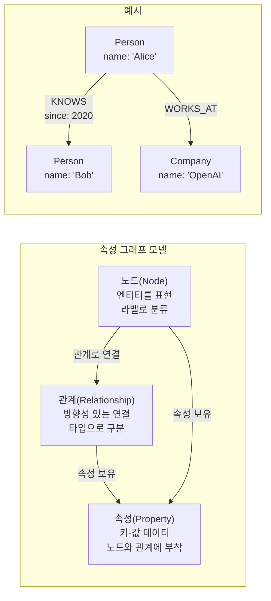
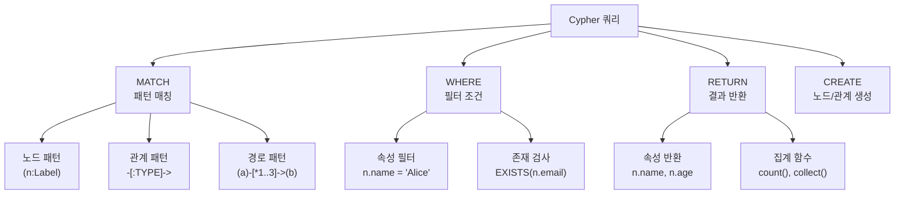
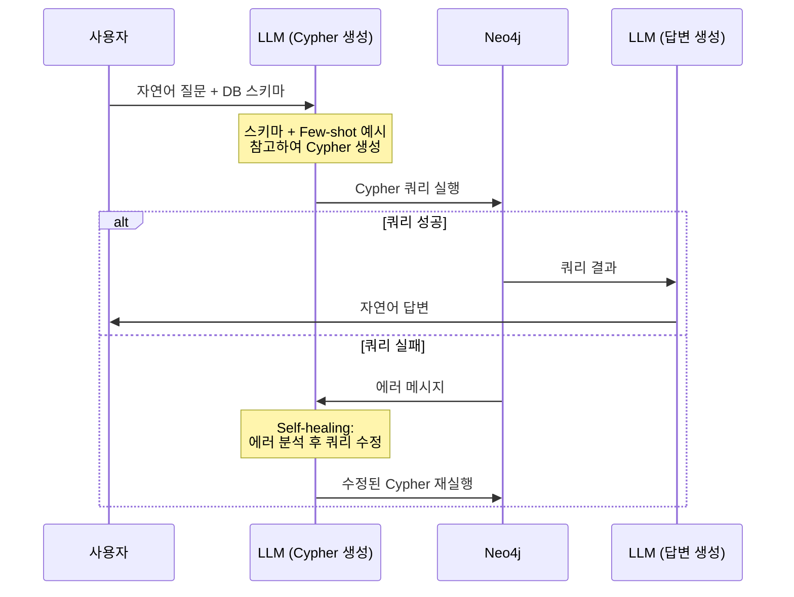
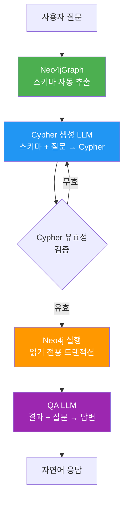
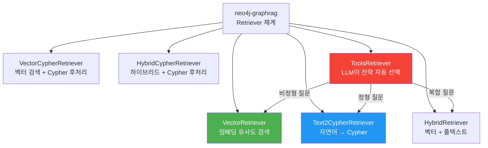

# Neo4j 기반 Knowledge Graph RAG

> Neo4j 그래프 데이터베이스에 지식 그래프를 저장하고, Cypher 쿼리와 Text2Cypher 패턴으로 구조화된 지식을 검색하는 프로덕션급 Knowledge Graph RAG를 구현합니다.

## 개요

이 섹션에서는 [이전 섹션](14-ch14-graphrag와-knowledge-graph/02-02-지식-그래프-구축-파이프라인.md)에서 NetworkX로 구축한 지식 그래프를 **Neo4j 그래프 데이터베이스**에 저장하고, LLM이 자연어 질문을 Cypher 쿼리로 변환하는 **Text2Cypher** 패턴을 활용하여 지식 그래프 기반 RAG 시스템을 구축합니다.

**선수 지식**: 
- [GraphRAG 이론과 아키텍처](14-ch14-graphrag와-knowledge-graph/01-01-graphrag-이론과-아키텍처.md)에서 배운 글로벌/로컬 검색 전략
- [지식 그래프 구축 파이프라인](14-ch14-graphrag와-knowledge-graph/02-02-지식-그래프-구축-파이프라인.md)에서 구현한 엔티티/관계 추출과 NetworkX 그래프

**학습 목표**:
- Neo4j 그래프 데이터베이스를 설정하고 Python에서 연결할 수 있다
- Cypher 쿼리 언어의 핵심 문법을 이해하고 작성할 수 있다
- Text2Cypher 패턴으로 LLM이 자연어를 Cypher로 변환하는 시스템을 구현할 수 있다
- LangChain의 `GraphCypherQAChain`을 활용한 Knowledge Graph RAG를 구축할 수 있다

## 사전 준비: Neo4j 환경 설정

실습을 위해 Neo4j 인스턴스가 필요합니다. 아래 세 가지 방법 중 하나를 선택하세요. Docker가 가장 빠르고 간편합니다.

**방법 1: Docker (권장 — 3분 설정)**

```terminal
# Neo4j 5.x 컨테이너 실행 (볼트 7687 + 브라우저 7474 포트)
docker run -d --name neo4j \
  -p 7474:7474 -p 7687:7687 \
  -e NEO4J_AUTH=neo4j/your-password \
  -e NEO4J_PLUGINS='["apoc"]' \
  neo4j:5

# 실행 확인 — http://localhost:7474 에서 Neo4j Browser 접속 가능
docker logs neo4j --tail 5
```

**방법 2: Neo4j Desktop (GUI 포함)** — [neo4j.com/download](https://neo4j.com/download/)에서 설치 후 "New Project → Add Local DBMS"로 인스턴스 생성. 비밀번호를 설정하면 바로 사용 가능합니다.

**방법 3: Neo4j Aura (클라우드 무료 티어)** — [neo4j.com/cloud/aura-free](https://neo4j.com/cloud/aura-free/)에서 회원가입 후 무료 인스턴스를 생성합니다. 연결 URI가 `neo4j+s://xxx.databases.neo4j.io` 형식으로 제공됩니다.

> 🔥 **실무 팁**: Docker 방식을 쓸 때 데이터를 유지하려면 `-v neo4j_data:/data` 볼륨 옵션을 추가하세요. 컨테이너를 삭제해도 그래프 데이터가 보존됩니다.

Python 패키지도 미리 설치합니다:

```terminal
pip install neo4j langchain-neo4j langchain-openai python-dotenv
```

## 왜 알아야 할까?

이전 섹션에서 NetworkX로 지식 그래프를 만들었는데, 왜 굳이 Neo4j를 써야 할까요?

NetworkX는 **메모리 기반** 그래프 라이브러리입니다. 수만 개의 노드까지는 괜찮지만, 실제 프로덕션 환경에서 수백만 개의 엔티티와 관계를 다루려면 이야기가 달라집니다. 도서관에 비유하면, NetworkX는 책상 위에 펼쳐놓은 마인드맵이고, Neo4j는 색인 카드와 분류 체계를 갖춘 전문 도서관 시스템이거든요. 

마인드맵에서 "이 사람과 연결된 모든 사람의 친구 중에서 같은 회사에 다니는 사람"을 찾으려면 눈이 빠지겠지만, 도서관 시스템에서는 분류 코드 몇 개만 입력하면 됩니다. Neo4j의 **Cypher 쿼리 언어**가 바로 그 "분류 코드"인데요, 여기에 LLM을 결합하면 사용자가 자연어로 질문하기만 해도 복잡한 그래프 탐색이 자동으로 수행됩니다.

특히 **"A 회사의 CEO가 참여한 프로젝트에서 사용된 기술 중 B 분야와 관련된 것은?"** 같은 다중 홉(multi-hop) 질문은 벡터 검색으로는 불가능하지만, 그래프 쿼리로는 자연스럽게 해결됩니다. 이것이 Knowledge Graph RAG의 핵심 가치예요.

## 핵심 개념

### 개념 1: Neo4j와 그래프 데이터베이스

> 💡 **비유**: 관계형 데이터베이스(MySQL)가 엑셀 스프레드시트라면, Neo4j는 실로 연결된 핀보드(수사 보드)입니다. 스프레드시트에서 "관계"를 찾으려면 여러 시트를 JOIN해야 하지만, 핀보드에서는 실(관계)을 따라가기만 하면 되죠.

Neo4j는 **속성 그래프 모델(Property Graph Model)** 을 사용하는 네이티브 그래프 데이터베이스입니다. 데이터를 노드(Node), 관계(Relationship), 속성(Property)으로 저장하며, 관계 탐색이 O(1)에 가까운 성능을 보여줍니다. 관계형 DB에서 JOIN을 여러 번 해야 하는 작업이 Neo4j에서는 단순한 패턴 매칭으로 해결됩니다.

> 📊 **그림 1**: Neo4j 속성 그래프 모델의 핵심 구성 요소



Python에서 Neo4j에 연결하는 기본 패턴입니다:

```python
from neo4j import GraphDatabase

# Neo4j 드라이버 생성
URI = "neo4j://localhost:7687"        # 로컬 (Docker/Desktop)
# URI = "neo4j+s://xxx.databases.neo4j.io"  # Aura 클라우드
AUTH = ("neo4j", "your-password")

driver = GraphDatabase.driver(URI, auth=AUTH)

# 연결 확인
driver.verify_connectivity()
print("Neo4j 연결 성공!")

# 쿼리 실행
records, summary, keys = driver.execute_query(
    "RETURN 'Hello, Neo4j!' AS message",
    database_="neo4j",
)
print(records[0]["message"])  # Hello, Neo4j!

driver.close()
```

> ⚠️ **흔한 오해**: `neo4j-driver`와 `neo4j`는 다른 패키지가 아닙니다. `neo4j-driver` 패키지명은 v6.0부터 **deprecated**되었고, 지금은 `pip install neo4j`로 설치해야 합니다. Python 3.10 이상이 필요하니 주의하세요.

### 개념 2: Cypher 쿼리 언어 핵심

> 💡 **비유**: SQL이 "테이블에서 행을 찾는 언어"라면, Cypher는 "그래프에서 패턴을 그리는 언어"입니다. 실제로 Cypher 문법은 ASCII 아트처럼 관계를 **그려서** 표현합니다: `(alice)-[:KNOWS]->(bob)`. 마치 노드와 화살표를 텍스트로 스케치하는 것 같죠.

Cypher는 Neo4j가 만든 선언적 그래프 쿼리 언어로, 2024년 **ISO/IEC 39075 GQL** 국제 표준의 기반이 되었습니다. 핵심 문법을 살펴보겠습니다:

> 📊 **그림 2**: Cypher 쿼리의 기본 구조와 패턴 매칭



Knowledge Graph RAG에 필수적인 Cypher 패턴들을 코드로 살펴보겠습니다:

```python
from neo4j import GraphDatabase

driver = GraphDatabase.driver("neo4j://localhost:7687", auth=("neo4j", "password"))

# === 1. 노드와 관계 생성 ===
driver.execute_query("""
    CREATE (langchain:Technology {name: 'LangChain', category: 'Framework', year: 2022})
    CREATE (langgraph:Technology {name: 'LangGraph', category: 'Framework', year: 2024})
    CREATE (openai:Company {name: 'OpenAI', founded: 2015})
    CREATE (harrison:Person {name: 'Harrison Chase', role: 'CEO'})
    
    CREATE (harrison)-[:FOUNDED {year: 2022}]->(langchain)
    CREATE (langchain)-[:EVOLVED_INTO]->(langgraph)
    CREATE (langchain)-[:USES_API]->(openai)
""", database_="neo4j")

# === 2. 패턴 매칭 — 1홉 탐색 ===
records, _, _ = driver.execute_query("""
    MATCH (p:Person)-[:FOUNDED]->(t:Technology)
    RETURN p.name AS founder, t.name AS technology
""", database_="neo4j")
# [{'founder': 'Harrison Chase', 'technology': 'LangChain'}]

# === 3. 다중 홉 탐색 — 벡터 검색으로는 불가능한 질의 ===
records, _, _ = driver.execute_query("""
    MATCH (p:Person)-[:FOUNDED]->(t1:Technology)-[:USES_API]->(c:Company)
    RETURN p.name AS person, t1.name AS tech, c.name AS api_provider
""", database_="neo4j")
# Harrison Chase가 만든 LangChain이 사용하는 API 제공사: OpenAI

# === 4. 가변 길이 경로 탐색 ===
records, _, _ = driver.execute_query("""
    MATCH path = (start:Person {name: 'Harrison Chase'})-[*1..3]->(end)
    RETURN [node IN nodes(path) | 
            COALESCE(node.name, '')] AS path_names,
           length(path) AS hops
""", database_="neo4j")

# === 5. 집계 쿼리 ===
records, _, _ = driver.execute_query("""
    MATCH (t:Technology)<-[:FOUNDED|CONTRIBUTED_TO]-(p:Person)
    RETURN t.name AS technology, 
           count(p) AS contributor_count,
           collect(p.name) AS contributors
    ORDER BY contributor_count DESC
""", database_="neo4j")

driver.close()
```

### 개념 3: Text2Cypher 패턴 — LLM이 그래프를 질의한다

> 💡 **비유**: Text2Cypher는 **통역사**와 같습니다. 사용자가 한국어로 말하면 통역사(LLM)가 Neo4j가 이해하는 Cypher로 번역하고, Neo4j의 답변을 다시 한국어로 전달하는 거죠. 좋은 통역사가 되려면 "사전(스키마)"과 "기출문제(Few-shot 예시)"가 필요합니다.

Text2Cypher는 LLM에게 데이터베이스 스키마를 알려주고, 자연어 질문을 Cypher 쿼리로 변환하게 하는 패턴입니다. GraphRAG에서 **로컬 검색**의 핵심 메커니즘이 됩니다.

> 📊 **그림 3**: Text2Cypher 3단계 워크플로



Text2Cypher의 성능은 **스키마 정보의 풍부함**과 **Few-shot 예시의 품질**에 크게 좌우됩니다. 검색 전략별 유연성과 신뢰성의 트레이드오프를 이해하는 것이 중요합니다:

| 전략 | 유연성 | 신뢰성 | 적합한 상황 |
|------|--------|--------|------------|
| Cypher 템플릿 | 낮음 | 높음 | 정해진 질문 패턴만 처리 |
| 동적 Cypher (파라미터화) | 중간 | 중간 | 파라미터만 바뀌는 질문 |
| Text2Cypher (LLM) | 높음 | 낮음 | 예측 불가능한 다양한 질문 |

직접 Text2Cypher를 구현해 보겠습니다:

```python
from langchain_openai import ChatOpenAI
from langchain_core.prompts import ChatPromptTemplate

llm = ChatOpenAI(model="gpt-4o", temperature=0)

# 스키마 정보 — Text2Cypher 정확도의 핵심!
GRAPH_SCHEMA = """
Node labels and properties:
- Person {name: STRING, role: STRING, birth_year: INTEGER}
- Company {name: STRING, founded: INTEGER, industry: STRING}
- Technology {name: STRING, category: STRING, year: INTEGER}

Relationship types and properties:
- (:Person)-[:FOUNDED {year: INTEGER}]->(:Company)
- (:Person)-[:WORKS_AT {since: INTEGER}]->(:Company)
- (:Company)-[:DEVELOPED]->(:Technology)
- (:Technology)-[:DEPENDS_ON]->(:Technology)

Sample values:
- Person.role: 'CEO', 'CTO', 'Researcher'
- Company.industry: 'AI', 'Cloud', 'Database'
- Technology.category: 'Framework', 'Language', 'Database'
"""

# Few-shot 예시 — 정확도를 크게 높임
FEW_SHOT_EXAMPLES = """
Question: LangChain을 만든 사람은 누구인가요?
Cypher: MATCH (p:Person)-[:FOUNDED]->(:Company)-[:DEVELOPED]->(t:Technology {name: 'LangChain'}) RETURN p.name

Question: OpenAI에서 일하는 사람은 몇 명인가요?
Cypher: MATCH (p:Person)-[:WORKS_AT]->(c:Company {name: 'OpenAI'}) RETURN count(p) AS employee_count

Question: Python에 의존하는 기술들을 모두 알려주세요.
Cypher: MATCH (t:Technology)-[:DEPENDS_ON]->(dep:Technology {name: 'Python'}) RETURN t.name, t.category
"""

# Text2Cypher 프롬프트
text2cypher_prompt = ChatPromptTemplate.from_messages([
    ("system", """You are a Neo4j Cypher expert. Generate a Cypher query for the user's question.
    
Graph Schema:
{schema}

Examples:
{examples}

Rules:
- Return ONLY the Cypher query, no explanation
- Use MATCH for read queries only (never CREATE/DELETE/SET)
- Always use node labels for efficient lookups
- Use case-insensitive matching: WHERE toLower(n.name) CONTAINS toLower('keyword')
"""),
    ("human", "{question}")
])

# Cypher 생성
chain = text2cypher_prompt | llm
response = chain.invoke({
    "schema": GRAPH_SCHEMA,
    "examples": FEW_SHOT_EXAMPLES,
    "question": "AI 산업에 있는 회사들이 개발한 기술은?"
})
print(response.content)
# MATCH (c:Company {industry: 'AI'})-[:DEVELOPED]->(t:Technology)
# RETURN c.name, t.name, t.category
```

### 개념 4: LangChain Neo4j 통합 — GraphCypherQAChain

> 💡 **비유**: 앞에서 Text2Cypher를 직접 구현했다면, `GraphCypherQAChain`은 마치 **자동 번역기 앱**과 같습니다. 통역사를 직접 고용하는 대신, 앱이 스키마 파악, 쿼리 생성, 실행, 답변 생성까지 한 번에 처리해 주는 거죠.

LangChain의 `langchain-neo4j` 패키지는 Neo4j와의 통합을 위한 전용 클래스들을 제공합니다. 가장 핵심적인 것이 `GraphCypherQAChain`으로, Text2Cypher의 3단계 워크플로를 자동으로 처리합니다.

> 📊 **그림 4**: GraphCypherQAChain의 내부 동작 흐름



```python
from langchain_neo4j import Neo4jGraph, GraphCypherQAChain
from langchain_openai import ChatOpenAI

# Neo4jGraph — 스키마를 자동으로 추출
graph = Neo4jGraph(
    url="neo4j://localhost:7687",
    username="neo4j",
    password="your-password",
    # enhanced_schema=True,  # 속성의 샘플 값까지 추출 (정확도 향상)
)

# 스키마 확인 — LLM에게 전달될 정보
print(graph.schema)
# Node properties: Person {name: STRING, role: STRING}, ...
# Relationship properties: FOUNDED {year: INTEGER}, ...
# Relationships: (:Person)-[:FOUNDED]->(:Company), ...

# GraphCypherQAChain 생성
llm = ChatOpenAI(model="gpt-4o", temperature=0)

chain = GraphCypherQAChain.from_llm(
    llm=llm,
    graph=graph,
    verbose=True,                    # 생성된 Cypher 확인
    allow_dangerous_requests=True,   # 필수 보안 플래그
    return_intermediate_steps=True,  # 중간 단계 반환 (디버깅용)
    top_k=10,                        # 결과 제한
    # validate_cypher=True,          # Cypher 문법 검증
)

# 질의 실행
result = chain.invoke({"query": "AI 산업의 회사들이 개발한 프레임워크는 무엇인가요?"})
print(result["result"])

# 중간 단계 확인 (디버깅)
if "intermediate_steps" in result:
    cypher_query = result["intermediate_steps"][0]["query"]
    db_result = result["intermediate_steps"][1]["context"]
    print(f"생성된 Cypher: {cypher_query}")
    print(f"DB 결과: {db_result}")
```

> 🔥 **실무 팁**: `allow_dangerous_requests=True` 플래그는 LLM이 생성한 임의의 Cypher를 실행하겠다는 명시적 동의입니다. 프로덕션 환경에서는 반드시 **읽기 전용 사용자**로 Neo4j에 연결하거나, Neo4j의 읽기 전용 트랜잭션을 강제하세요. LLM이 `DELETE`나 `SET` 쿼리를 생성할 가능성이 있기 때문입니다.

### 개념 5: Neo4j 공식 GraphRAG 패키지

`neo4j-graphrag` 패키지는 Neo4j가 공식으로 제공하는 GraphRAG 프레임워크입니다. LangChain의 `GraphCypherQAChain`보다 더 세분화된 9종의 Retriever를 제공하며, 특히 **ToolsRetriever**를 사용하면 LLM이 질문 유형에 따라 최적의 검색 전략을 자동으로 선택합니다.

> 📊 **그림 5**: neo4j-graphrag Retriever 유형 비교



```python
# pip install neo4j-graphrag

from neo4j import GraphDatabase
from neo4j_graphrag.retrievers import Text2CypherRetriever
from neo4j_graphrag.llm import OpenAILLM
from neo4j_graphrag.generation import GraphRAG

driver = GraphDatabase.driver(
    "neo4j://localhost:7687", 
    auth=("neo4j", "password")
)

llm = OpenAILLM(model_name="gpt-4o")

# 풍부한 스키마 제공 — 정확도의 핵심
neo4j_schema = """
Node properties:
Person {name: STRING, role: STRING, birth_year: INTEGER}
Company {name: STRING, founded: INTEGER, industry: STRING}
Technology {name: STRING, category: STRING, year: INTEGER}

Relationship properties:
FOUNDED {year: INTEGER}
WORKS_AT {since: INTEGER}
DEVELOPED {}
DEPENDS_ON {}

Relationships:
(:Person)-[:FOUNDED]->(:Company)
(:Person)-[:WORKS_AT]->(:Company)
(:Company)-[:DEVELOPED]->(:Technology)
(:Technology)-[:DEPENDS_ON]->(:Technology)
"""

# Few-shot 예시 — 신뢰성 향상
examples = [
    "USER INPUT: 'OpenAI에서 일하는 사람들은?' "
    "QUERY: MATCH (p:Person)-[:WORKS_AT]->(c:Company {name: 'OpenAI'}) "
    "RETURN p.name, p.role",
    
    "USER INPUT: 'Python에 의존하는 프레임워크는?' "
    "QUERY: MATCH (t:Technology)-[:DEPENDS_ON]->(d:Technology {name: 'Python'}) "
    "WHERE t.category = 'Framework' RETURN t.name, t.year",
]

# Text2CypherRetriever 생성
retriever = Text2CypherRetriever(
    driver=driver,
    llm=llm,
    neo4j_schema=neo4j_schema,
    examples=examples,
)

# GraphRAG 파이프라인 — 검색 + 답변 생성 통합
rag = GraphRAG(retriever=retriever, llm=llm)
response = rag.search(query_text="AI 산업에서 가장 오래된 회사는?")
print(response.answer)

driver.close()
```

## 실습: 직접 해보기

지식 그래프를 Neo4j에 구축하고, 자연어 질의로 검색하는 완전한 Knowledge Graph RAG 시스템을 만들어 보겠습니다.

### Step 1: 환경 설정 및 데이터 로딩

```python
# pip install neo4j langchain-neo4j langchain-openai python-dotenv

import os
from dotenv import load_dotenv
from neo4j import GraphDatabase
from langchain_neo4j import Neo4jGraph, GraphCypherQAChain
from langchain_openai import ChatOpenAI

load_dotenv()

# === Neo4j 연결 설정 ===
NEO4J_URI = os.getenv("NEO4J_URI", "neo4j://localhost:7687")
NEO4J_USER = os.getenv("NEO4J_USER", "neo4j")
NEO4J_PASSWORD = os.getenv("NEO4J_PASSWORD", "your-password")

driver = GraphDatabase.driver(NEO4J_URI, auth=(NEO4J_USER, NEO4J_PASSWORD))
driver.verify_connectivity()
print("Neo4j 연결 성공!")
```

### Step 2: 지식 그래프 데이터 삽입

```python
# === AI 에이전트 생태계 지식 그래프 구축 ===
SETUP_QUERIES = [
    # 기존 데이터 정리
    "MATCH (n) DETACH DELETE n",
    
    # 회사 노드 생성
    """
    CREATE (openai:Company {name: 'OpenAI', founded: 2015, industry: 'AI', hq: 'San Francisco'})
    CREATE (anthropic:Company {name: 'Anthropic', founded: 2021, industry: 'AI', hq: 'San Francisco'})
    CREATE (langchain_co:Company {name: 'LangChain Inc', founded: 2023, industry: 'AI', hq: 'San Francisco'})
    CREATE (google:Company {name: 'Google DeepMind', founded: 2010, industry: 'AI', hq: 'London'})
    CREATE (neo4j_co:Company {name: 'Neo4j', founded: 2007, industry: 'Database', hq: 'San Mateo'})
    """,
    
    # 인물 노드 생성
    """
    CREATE (harrison:Person {name: 'Harrison Chase', role: 'CEO', specialty: 'AI Frameworks'})
    CREATE (sam:Person {name: 'Sam Altman', role: 'CEO', specialty: 'AGI'})
    CREATE (dario:Person {name: 'Dario Amodei', role: 'CEO', specialty: 'AI Safety'})
    """,
    
    # 기술 노드 생성
    """
    CREATE (langchain:Technology {name: 'LangChain', category: 'Framework', year: 2022, language: 'Python'})
    CREATE (langgraph:Technology {name: 'LangGraph', category: 'Framework', year: 2024, language: 'Python'})
    CREATE (langsmith:Technology {name: 'LangSmith', category: 'Platform', year: 2023, language: 'Python'})
    CREATE (gpt4:Technology {name: 'GPT-4', category: 'LLM', year: 2023, language: 'N/A'})
    CREATE (claude:Technology {name: 'Claude', category: 'LLM', year: 2023, language: 'N/A'})
    CREATE (mcp:Technology {name: 'MCP', category: 'Protocol', year: 2024, language: 'Multi'})
    CREATE (a2a:Technology {name: 'A2A', category: 'Protocol', year: 2025, language: 'Multi'})
    CREATE (neo4j_db:Technology {name: 'Neo4j DB', category: 'Database', year: 2007, language: 'Java'})
    CREATE (crewai:Technology {name: 'CrewAI', category: 'Framework', year: 2024, language: 'Python'})
    """,
    
    # 개념 노드 생성
    """
    CREATE (react:Concept {name: 'ReAct Pattern', domain: 'Agent', description: 'Reasoning + Acting 루프'})
    CREATE (rag:Concept {name: 'RAG', domain: 'Retrieval', description: 'Retrieval-Augmented Generation'})
    CREATE (graphrag:Concept {name: 'GraphRAG', domain: 'Retrieval', description: '그래프 기반 RAG'})
    CREATE (hitl:Concept {name: 'Human-in-the-Loop', domain: 'Agent', description: '사람 개입 워크플로'})
    CREATE (tool_calling:Concept {name: 'Tool Calling', domain: 'Agent', description: 'LLM 도구 호출'})
    """,
    
    # 관계 생성 — 인물과 회사
    """
    MATCH (harrison:Person {name: 'Harrison Chase'}), (langchain_co:Company {name: 'LangChain Inc'})
    CREATE (harrison)-[:FOUNDED {year: 2023}]->(langchain_co)
    """,
    """
    MATCH (sam:Person {name: 'Sam Altman'}), (openai:Company {name: 'OpenAI'})
    CREATE (sam)-[:LEADS]->(openai)
    """,
    """
    MATCH (dario:Person {name: 'Dario Amodei'}), (anthropic:Company {name: 'Anthropic'})
    CREATE (dario)-[:FOUNDED {year: 2021}]->(anthropic)
    """,
    
    # 관계 생성 — 회사와 기술
    """
    MATCH (langchain_co:Company {name: 'LangChain Inc'}), (langchain:Technology {name: 'LangChain'}),
          (langgraph:Technology {name: 'LangGraph'}), (langsmith:Technology {name: 'LangSmith'})
    CREATE (langchain_co)-[:DEVELOPED]->(langchain)
    CREATE (langchain_co)-[:DEVELOPED]->(langgraph)
    CREATE (langchain_co)-[:DEVELOPED]->(langsmith)
    """,
    """
    MATCH (openai:Company {name: 'OpenAI'}), (gpt4:Technology {name: 'GPT-4'})
    CREATE (openai)-[:DEVELOPED]->(gpt4)
    """,
    """
    MATCH (anthropic:Company {name: 'Anthropic'}), (claude:Technology {name: 'Claude'}),
          (mcp:Technology {name: 'MCP'})
    CREATE (anthropic)-[:DEVELOPED]->(claude)
    CREATE (anthropic)-[:DEVELOPED]->(mcp)
    """,
    """
    MATCH (google:Company {name: 'Google DeepMind'}), (a2a:Technology {name: 'A2A'})
    CREATE (google)-[:DEVELOPED]->(a2a)
    """,
    
    # 관계 생성 — 기술 간 의존성
    """
    MATCH (langgraph:Technology {name: 'LangGraph'}), (langchain:Technology {name: 'LangChain'})
    CREATE (langgraph)-[:BUILT_ON]->(langchain)
    """,
    """
    MATCH (langchain:Technology {name: 'LangChain'}), (gpt4:Technology {name: 'GPT-4'}),
          (claude:Technology {name: 'Claude'})
    CREATE (langchain)-[:INTEGRATES]->(gpt4)
    CREATE (langchain)-[:INTEGRATES]->(claude)
    """,
    
    # 관계 생성 — 기술과 개념
    """
    MATCH (langgraph:Technology {name: 'LangGraph'}), (react:Concept {name: 'ReAct Pattern'}),
          (hitl:Concept {name: 'Human-in-the-Loop'})
    CREATE (langgraph)-[:IMPLEMENTS]->(react)
    CREATE (langgraph)-[:IMPLEMENTS]->(hitl)
    """,
    """
    MATCH (langchain:Technology {name: 'LangChain'}), (rag:Concept {name: 'RAG'}),
          (tool_calling:Concept {name: 'Tool Calling'})
    CREATE (langchain)-[:IMPLEMENTS]->(rag)
    CREATE (langchain)-[:IMPLEMENTS]->(tool_calling)
    """,
    """
    MATCH (neo4j_db:Technology {name: 'Neo4j DB'}), (graphrag:Concept {name: 'GraphRAG'})
    CREATE (neo4j_db)-[:ENABLES]->(graphrag)
    """,
]

# 데이터 삽입 실행
for query in SETUP_QUERIES:
    driver.execute_query(query, database_="neo4j")

print("지식 그래프 구축 완료!")

# 데이터 확인
records, _, _ = driver.execute_query(
    "MATCH (n) RETURN labels(n)[0] AS label, count(n) AS count",
    database_="neo4j"
)
for r in records:
    print(f"  {r['label']}: {r['count']}개")
```

```output
Neo4j 연결 성공!
지식 그래프 구축 완료!
  Company: 5개
  Person: 3개
  Technology: 9개
  Concept: 5개
```

### Step 3: GraphCypherQAChain으로 자연어 질의

```python
# === LangChain Neo4j 통합 ===
graph = Neo4jGraph(
    url=NEO4J_URI,
    username=NEO4J_USER,
    password=NEO4J_PASSWORD,
)

# 스키마 자동 추출 확인
print("=== 추출된 스키마 ===")
print(graph.schema[:500])  # 처음 500자만 출력

# GraphCypherQAChain 생성
llm = ChatOpenAI(model="gpt-4o", temperature=0)

cypher_chain = GraphCypherQAChain.from_llm(
    llm=llm,
    graph=graph,
    verbose=True,
    allow_dangerous_requests=True,
    return_intermediate_steps=True,
    top_k=20,
)

# === 다양한 질문 테스트 ===
questions = [
    "Harrison Chase가 창업한 회사에서 개발한 기술들은 무엇인가요?",
    "ReAct 패턴을 구현하는 프레임워크는?",
    "Anthropic이 개발한 프로토콜은 어떤 것이 있나요?",
    "LangGraph는 어떤 기술 위에 만들어졌나요?",
]

for q in questions:
    print(f"\n{'='*60}")
    print(f"Q: {q}")
    result = cypher_chain.invoke({"query": q})
    print(f"A: {result['result']}")
    
    # 생성된 Cypher 확인
    if result.get("intermediate_steps"):
        print(f"Cypher: {result['intermediate_steps'][0]['query']}")
```

### Step 4: Self-healing Cypher 생성기

Text2Cypher에서 가장 중요한 프로덕션 패턴은 **자기 치유(Self-healing)** 입니다. LLM이 잘못된 Cypher를 생성할 수 있기 때문에, 실행 실패 시 에러 메시지를 LLM에 전달하여 쿼리를 수정하게 합니다.

```python
from langchain_core.prompts import ChatPromptTemplate
from typing import Optional

class SelfHealingText2Cypher:
    """Self-healing Text2Cypher: 실패 시 자동 수정하는 Cypher 생성기"""
    
    def __init__(
        self,
        driver: GraphDatabase.driver,
        llm: ChatOpenAI,
        schema: str,
        examples: list[str] | None = None,
        max_retries: int = 3,
    ):
        self.driver = driver
        self.llm = llm
        self.schema = schema
        self.examples = examples or []
        self.max_retries = max_retries
        
        # Cypher 생성 프롬프트
        self.generate_prompt = ChatPromptTemplate.from_messages([
            ("system", """You are a Neo4j Cypher expert. Generate a READ-ONLY Cypher query.

Graph Schema:
{schema}

Examples:
{examples}

Rules:
- ONLY generate MATCH/RETURN queries (never CREATE/DELETE/SET/MERGE)
- Use node labels for efficient lookups
- Return structured data with meaningful aliases
- Use toLower() for case-insensitive string matching
"""),
            ("human", "{question}")
        ])
        
        # Self-healing 프롬프트
        self.fix_prompt = ChatPromptTemplate.from_messages([
            ("system", """Fix the Cypher query that caused an error.

Schema: {schema}
Original question: {question}
Failed query: {failed_query}
Error: {error}

Return ONLY the corrected Cypher query."""),
            ("human", "Fix the query above.")
        ])
    
    def _execute_cypher(self, query: str) -> tuple[list[dict], Optional[str]]:
        """Cypher 실행. 성공 시 (결과, None), 실패 시 ([], 에러메시지)"""
        try:
            # 안전장치: 쓰기 쿼리 차단
            dangerous = ["CREATE", "DELETE", "SET", "MERGE", "DROP", "REMOVE"]
            upper_query = query.upper()
            for word in dangerous:
                if word in upper_query:
                    return [], f"Dangerous operation '{word}' blocked"
            
            records, _, _ = self.driver.execute_query(
                query, database_="neo4j"
            )
            return [r.data() for r in records], None
        except Exception as e:
            return [], str(e)
    
    def query(self, question: str) -> dict:
        """자연어 질문 → Cypher 생성 → 실행 (실패 시 자동 수정)"""
        examples_text = "\n".join(self.examples)
        
        # 1단계: Cypher 생성
        chain = self.generate_prompt | self.llm
        response = chain.invoke({
            "schema": self.schema,
            "examples": examples_text,
            "question": question,
        })
        cypher = response.content.strip().strip("`").replace("cypher\n", "")
        
        # 2단계: 실행 + Self-healing 루프
        for attempt in range(self.max_retries):
            results, error = self._execute_cypher(cypher)
            
            if error is None:
                return {
                    "question": question,
                    "cypher": cypher,
                    "results": results,
                    "attempts": attempt + 1,
                }
            
            # Self-healing: 에러 피드백으로 쿼리 수정
            print(f"  [Retry {attempt + 1}] {error}")
            fix_chain = self.fix_prompt | self.llm
            fixed = fix_chain.invoke({
                "schema": self.schema,
                "question": question,
                "failed_query": cypher,
                "error": error,
            })
            cypher = fixed.content.strip().strip("`").replace("cypher\n", "")
        
        return {
            "question": question,
            "cypher": cypher,
            "results": [],
            "error": f"Failed after {self.max_retries} attempts",
            "attempts": self.max_retries,
        }

# === 사용 예시 ===
schema = graph.schema  # Neo4jGraph에서 자동 추출

healer = SelfHealingText2Cypher(
    driver=driver,
    llm=ChatOpenAI(model="gpt-4o", temperature=0),
    schema=schema,
    examples=[
        "Q: Anthropic이 개발한 기술은? "
        "CYPHER: MATCH (c:Company {name: 'Anthropic'})-[:DEVELOPED]->(t) RETURN t.name, t.category",
    ],
    max_retries=3,
)

# 다중 홉 질문 — 벡터 검색으로는 불가능!
result = healer.query("Harrison Chase가 만든 회사에서 개발한 기술 중 ReAct를 구현하는 것은?")
print(f"Cypher: {result['cypher']}")
print(f"결과: {result['results']}")
print(f"시도 횟수: {result['attempts']}")
```

```run:python
# 결과 시뮬레이션
result = {
    "question": "Harrison Chase가 만든 회사에서 개발한 기술 중 ReAct를 구현하는 것은?",
    "cypher": "MATCH (p:Person {name: 'Harrison Chase'})-[:FOUNDED]->(c:Company)-[:DEVELOPED]->(t:Technology)-[:IMPLEMENTS]->(con:Concept {name: 'ReAct Pattern'}) RETURN t.name, t.category",
    "results": [{"t.name": "LangGraph", "t.category": "Framework"}],
    "attempts": 1,
}
print(f"Q: {result['question']}")
print(f"Cypher: {result['cypher']}")
print(f"답변: {result['results']}")
print(f"시도 횟수: {result['attempts']}회 (첫 시도 성공)")
```

```output
Q: Harrison Chase가 만든 회사에서 개발한 기술 중 ReAct를 구현하는 것은?
Cypher: MATCH (p:Person {name: 'Harrison Chase'})-[:FOUNDED]->(c:Company)-[:DEVELOPED]->(t:Technology)-[:IMPLEMENTS]->(con:Concept {name: 'ReAct Pattern'}) RETURN t.name, t.category
답변: [{'t.name': 'LangGraph', 't.category': 'Framework'}]
시도 횟수: 1회 (첫 시도 성공)
```

## 더 깊이 알아보기

### Neo4j와 그래프 데이터베이스의 탄생

Neo4j의 역사는 2000년으로 거슬러 올라갑니다. 스웨덴 개발자 **Emil Eifrem**은 엔터프라이즈 콘텐츠 관리 시스템을 만들면서 관계형 DB의 JOIN 성능 문제에 좌절했습니다. "관계가 핵심인 데이터를 왜 관계를 무시하는 테이블에 저장해야 하지?" — 이 질문에서 Neo4j가 시작되었습니다.

재미있는 일화가 있는데요, Eifrem이 2002년 비행기 안에서 냅킨에 그래프 데이터베이스의 핵심 아키텍처를 스케치했다고 합니다. 그 냅킨 스케치가 나중에 **인접 리스트 저장 방식(index-free adjacency)** — Neo4j의 핵심 기술 — 로 발전했죠. 이 방식 덕분에 관계 탐색이 O(1)에 수행되어, 관계형 DB에서 JOIN이 O(n log n)인 것과 극적인 차이를 보입니다.

### Cypher의 탄생과 GQL 표준화

Cypher 언어는 2011년 Neo4j 팀의 **Andrés Taylor**가 설계했습니다. 그는 SQL의 선언적 특성은 유지하면서, 그래프 패턴을 **시각적으로 표현**할 수 있는 언어를 만들고 싶었습니다. `(a)-[:KNOWS]->(b)` 같은 ASCII 아트 문법은 의도적인 설계인데, "쿼리를 읽는 것만으로도 데이터 모델을 이해할 수 있어야 한다"는 철학이 담겨 있습니다.

2024년 4월, Cypher의 문법은 **ISO/IEC 39075 GQL(Graph Query Language)** 국제 표준으로 채택되었습니다. SQL이 관계형 DB의 표준어가 된 것처럼, GQL은 그래프 DB의 표준어가 되고 있죠.

### Text2Cypher의 진화

Text2Cypher는 2023년 LLM의 부상과 함께 급속히 발전했습니다. 초기에는 단순히 스키마를 프롬프트에 넣는 수준이었지만, 2024년 arXiv 논문 ["Text2Cypher: Bridging Natural Language and Graph Databases"](https://arxiv.org/abs/2412.10064)에서 체계적인 벤치마크가 제시되면서 Self-healing, Schema Enrichment, Dynamic Few-shot 등의 기법이 정립되었습니다. 현재는 GPT-4 수준의 LLM에서 약 70-80%의 정확도를 보이며, Few-shot과 Schema Enrichment를 결합하면 90% 이상까지 달성할 수 있다고 보고되고 있습니다.

## 흔한 오해와 팁

> ⚠️ **흔한 오해**: "Neo4j를 쓰면 벡터 검색이 필요 없다." — 사실 Neo4j도 벡터 인덱스를 지원하며, 프로덕션 Knowledge Graph RAG에서는 **Text2Cypher + 벡터 검색을 결합**하는 것이 최선입니다. 정형적인 관계 질문은 Cypher로, 의미적 유사도 질문은 벡터로 처리하는 것이 좋습니다. [다음 섹션](14-ch14-graphrag와-knowledge-graph/04-04-하이브리드-rag-설계.md)에서 이 조합을 다룹니다.

> 💡 **알고 계셨나요?**: `langchain_community`의 Neo4j 관련 클래스들(`Neo4jGraph`, `Neo4jVector` 등)은 v0.3.8부터 모두 **deprecated**되었습니다. 반드시 `langchain-neo4j` 패키지에서 import해야 합니다. import 경로가 `from langchain_community.graphs import Neo4jGraph` → `from langchain_neo4j import Neo4jGraph`로 변경되었으니, 기존 튜토리얼을 따라할 때 주의하세요.

> 🔥 **실무 팁**: Text2Cypher의 정확도를 높이는 3대 기법 — (1) **Schema Enrichment**: 속성의 타입뿐 아니라 샘플 값, 수치 범위까지 스키마에 포함하세요. `Neo4jGraph(enhanced_schema=True)`를 사용하면 자동으로 해줍니다. (2) **Dynamic Few-shot**: 질문과 유사한 예시를 임베딩 기반으로 동적 선택하면 고정 예시보다 20% 이상 정확도가 높아집니다. (3) **Self-healing**: 3회 재시도로 대부분의 문법 에러를 자동 수정할 수 있습니다.

## 핵심 정리

| 개념 | 설명 |
|------|------|
| Neo4j | 네이티브 그래프 데이터베이스. 속성 그래프 모델로 노드/관계/속성 저장. index-free adjacency로 O(1) 탐색 |
| Cypher | Neo4j의 선언적 그래프 쿼리 언어. ASCII 아트 문법 `(a)-[:REL]->(b)`으로 패턴 매칭 |
| Text2Cypher | LLM이 자연어를 Cypher 쿼리로 변환하는 패턴. 스키마 + Few-shot이 정확도 핵심 |
| Self-healing | Cypher 실행 실패 시 에러 메시지를 LLM에 피드백하여 쿼리 자동 수정 |
| `langchain-neo4j` | LangChain의 Neo4j 통합 패키지. `Neo4jGraph`, `GraphCypherQAChain`, `Neo4jVector` 제공 |
| `neo4j-graphrag` | Neo4j 공식 GraphRAG 패키지. 9종 Retriever와 `ToolsRetriever` 제공 |
| `GraphCypherQAChain` | 스키마 추출 → Cypher 생성 → 실행 → 답변 생성을 자동으로 처리하는 체인 |
| `ToolsRetriever` | LLM이 질문 유형에 따라 벡터/Cypher/하이브리드 검색을 자동 선택 |

## 다음 섹션 미리보기

이번 섹션에서 Neo4j 기반 Knowledge Graph RAG의 핵심인 Text2Cypher를 구현했습니다. 하지만 실전에서는 모든 질문을 Cypher 하나로 해결할 수 없습니다. "LangGraph와 비슷한 프레임워크를 추천해 주세요" 같은 의미적 유사도 질문은 벡터 검색이 더 적합하죠. [다음 섹션: 하이브리드 RAG 설계](14-ch14-graphrag와-knowledge-graph/04-04-하이브리드-rag-설계.md)에서는 벡터 RAG와 GraphRAG를 결합한 하이브리드 시스템을 설계하고, LangGraph `StateGraph`로 질문 유형에 따라 최적의 검색 전략을 라우팅하는 Adaptive Knowledge Graph RAG를 구축합니다.

## 참고 자료

- [Neo4j RAG Tutorial](https://neo4j.com/blog/developer/rag-tutorial/) - Neo4j 공식 RAG 튜토리얼. 벡터, Cypher, 하이브리드 검색 전략을 코드와 함께 설명
- [Text2Cypher: Bridging Natural Language and Graph Databases](https://arxiv.org/abs/2412.10064) - Text2Cypher의 체계적 벤치마크와 최적화 기법을 다룬 학술 논문
- [Neo4j GraphRAG Python User Guide](https://neo4j.com/docs/neo4j-graphrag-python/current/user_guide_rag.html) - neo4j-graphrag 패키지의 공식 RAG 가이드. ToolsRetriever, Text2CypherRetriever 등 설명
- [GraphCypherQAChain API Reference](https://python.langchain.com/api_reference/neo4j/chains/langchain_neo4j.chains.graph_qa.cypher.GraphCypherQAChain.html) - LangChain의 GraphCypherQAChain 공식 API 문서
- [Effortless RAG with Text2CypherRetriever](https://neo4j.com/blog/developer/effortless-rag-text2cypherretriever/) - Neo4j 공식 블로그의 Text2CypherRetriever 실습 가이드
- [Neo4j Python Driver Manual](https://neo4j.com/docs/python-manual/current/) - Neo4j Python 드라이버 v6.x 공식 문서

---
### 🔗 Related Sessions
- [graphrag](14-ch14-graphrag와-knowledge-graph/01-01-graphrag-이론과-아키텍처.md) (prerequisite)
- [community_summarization](14-ch14-graphrag와-knowledge-graph/01-01-graphrag-이론과-아키텍처.md) (prerequisite)
- [extract_entities_and_relationships](14-ch14-graphrag와-knowledge-graph/02-02-지식-그래프-구축-파이프라인.md) (prerequisite)
- [knowledgegraphbuilder](14-ch14-graphrag와-knowledge-graph/02-02-지식-그래프-구축-파이프라인.md) (prerequisite)
