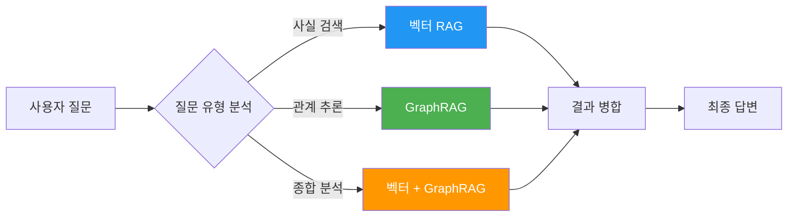
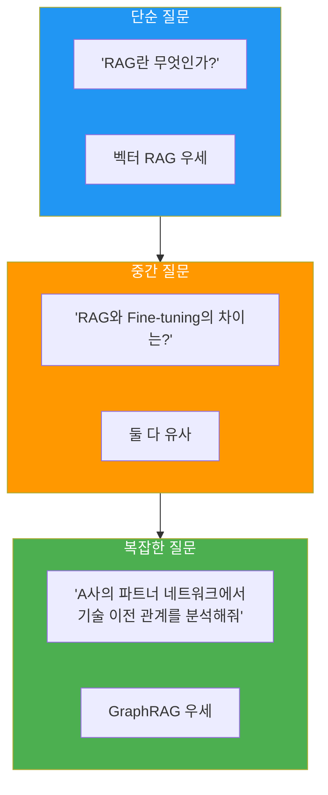
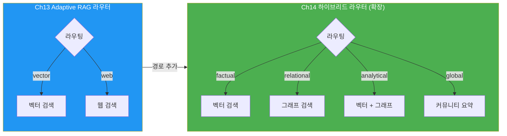
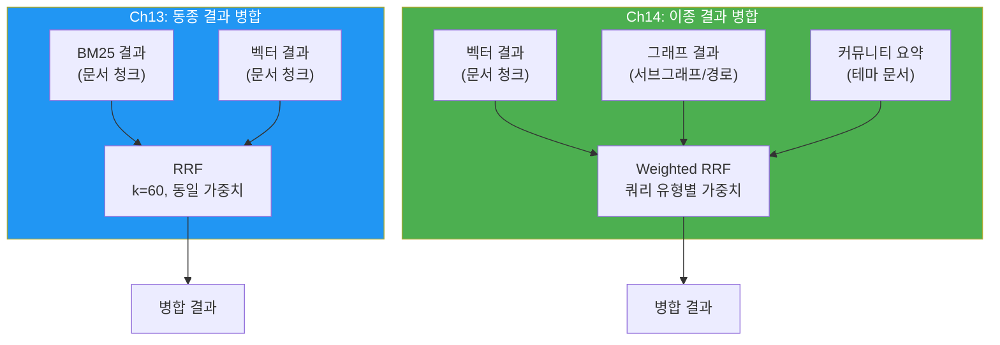
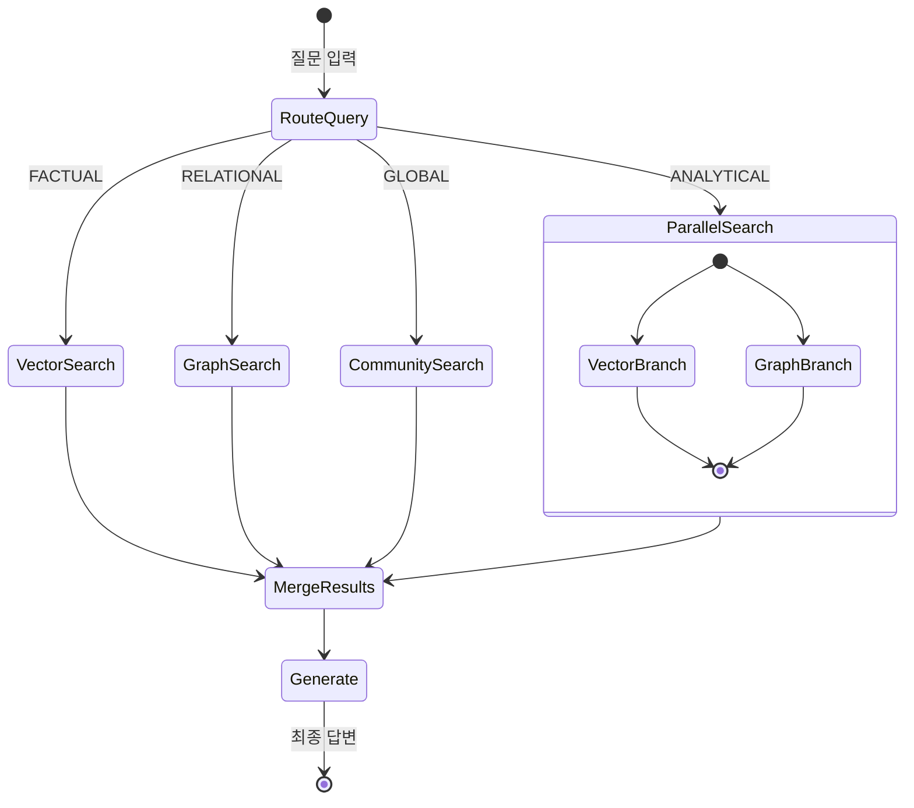

# 하이브리드 RAG 설계

> 벡터 RAG와 GraphRAG를 결합하여 질문 유형에 따라 최적의 검색 전략을 자동 라우팅하는 하이브리드 시스템을 설계합니다

## 개요

이 섹션에서는 벡터 기반 RAG와 GraphRAG를 하나의 시스템으로 통합하는 **하이브리드 RAG** 아키텍처를 설계하고 구현합니다. 앞서 [GraphRAG 이론과 아키텍처](14-ch14-graphrag와-knowledge-graph/01-01-graphrag-이론과-아키텍처.md)에서 배운 글로벌/로컬 검색 전략과, [Neo4j 기반 Knowledge Graph RAG](14-ch14-graphrag와-knowledge-graph/03-03-neo4j-기반-knowledge-graph-rag.md)에서 구축한 그래프 검색 인프라를 벡터 검색과 결합하여 프로덕션급 시스템을 만들어 봅니다.

**선수 지식**:
- [지식 그래프 구축 파이프라인](14-ch14-graphrag와-knowledge-graph/02-02-지식-그래프-구축-파이프라인.md)의 엔티티/관계 추출과 커뮤니티 요약
- [Neo4j 기반 Knowledge Graph RAG](14-ch14-graphrag와-knowledge-graph/03-03-neo4j-기반-knowledge-graph-rag.md)의 Cypher 쿼리와 Text2Cypher
- [하이브리드 검색 전략](13-ch13-adaptive-rag와-동적-라우팅/03-03-하이브리드-검색-전략.md)의 BM25 + 벡터 결합과 RRF 알고리즘
- [쿼리 분석과 라우팅](13-ch13-adaptive-rag와-동적-라우팅/02-02-쿼리-분석과-라우팅.md)의 Structured Output 기반 라우터 패턴

**학습 목표**:
- 벡터 RAG와 GraphRAG의 강점/약점을 비교하고 상호 보완 관계를 설명할 수 있다
- Ch13의 Adaptive RAG 라우터를 확장하여 그래프 검색 경로를 추가할 수 있다
- 이질적인 검색 소스(벡터, 그래프, 커뮤니티)에 가중치를 적용한 Weighted RRF로 결과를 병합할 수 있다
- LangGraph StateGraph로 하이브리드 RAG 파이프라인을 오케스트레이션할 수 있다

## 왜 알아야 할까?

벡터 RAG는 **의미적 유사성**에 강하지만, "이 회사의 모든 파트너사와 그 관계를 분석해줘" 같은 **구조적 질문**에는 무력합니다. 반대로 GraphRAG는 관계 추론에 탁월하지만, "감성 분석이 긍정적인 문서를 찾아줘" 같은 **의미 검색**에는 비효율적이죠.

2024년 Intel과 Microsoft 연구팀이 발표한 **HybridRAG** 논문(arXiv:2408.04948)은 금융 문서 분석(어닝콜 트랜스크립트)이라는 특정 도메인에서 벡터 RAG와 GraphRAG를 결합한 하이브리드 접근이 **개별 방식 대비 검색 정확도와 답변 품질 모두에서 우수**하다는 것을 실증적으로 보여주었습니다. 본 세션에서는 이 개념을 범용 아키텍처로 확장하여, 도메인에 구애받지 않고 다양한 질문 유형에 대응할 수 있는 하이브리드 RAG 시스템을 구현합니다.

[하이브리드 검색 전략](13-ch13-adaptive-rag와-동적-라우팅/03-03-하이브리드-검색-전략.md)에서 BM25 + 벡터 검색의 결합과 RRF 알고리즘을 이미 배웠는데요, 이번 세션의 핵심 차이는 **동일 표현 공간(텍스트) 내 결합이 아니라, 완전히 다른 검색 패러다임(임베딩 vs 그래프 탐색)을 하나로 엮는 것**입니다. 점수 스케일이 다르고, 결과 형태도 다르며, 각 소스의 신뢰도가 질문 유형에 따라 극적으로 달라지기 때문에 새로운 설계가 필요합니다.

> 📊 **그림 1**: 단일 RAG vs 하이브리드 RAG의 질문 유형별 대응력 비교



## 핵심 개념

### 개념 1: 벡터 RAG vs GraphRAG — 각자의 영역

> 💡 **비유**: 도서관에서 책을 찾는 두 가지 방법을 생각해 보세요. **벡터 RAG**는 "이런 느낌의 책"이라고 말하면 비슷한 분위기의 책을 추천해주는 **사서**와 같습니다. 사서는 수많은 책의 내용과 분위기를 기억하고 있어서, 여러분이 "지난번에 읽은 SF 소설 같은 느낌인데 좀 더 철학적인 책"이라고 하면 딱 맞는 책을 꺼내주죠. 반면 **GraphRAG**는 "이 저자가 인용한 모든 논문과 그 논문의 저자들"을 추적해주는 **학술 데이터베이스**와 같습니다. 데이터베이스는 느낌이나 분위기는 모르지만, "누가 누구를 인용했고, 어떤 기관에 소속되어 있는지" 같은 관계망은 완벽하게 파악하고 있죠. 둘 다 유용하지만, 질문의 성격에 따라 적합한 방법이 다릅니다.

두 접근법은 근본적으로 다른 방식으로 정보를 검색합니다.

| 차원 | 벡터 RAG | GraphRAG |
|------|----------|----------|
| **검색 원리** | 임베딩 유사도 (코사인, 내적) | 그래프 탐색 (BFS/DFS, Cypher) |
| **강점** | 의미적 유사성, 유연한 매칭 | 관계 추론, 멀티홉 질문 |
| **약점** | 관계/구조 파악 불가 | 의미적 뉘앙스 약함 |
| **인덱싱 비용** | 낮음 (임베딩 생성) | 높음 (엔티티/관계 추출, LLM 호출) |
| **검색 지연** | 매우 낮음 (ANN 검색) | 중간 (그래프 탐색 + LLM) |
| **질문 예시** | "AI 에이전트의 장점은?" | "OpenAI와 협력한 모든 기업은?" |

> 📊 **그림 2**: 질문 복잡도에 따른 각 RAG 방식의 성능 곡선



HybridRAG 논문의 핵심 발견은 명확합니다 — **어느 한쪽만으로는 충분하지 않다**는 것이죠. 금융 문서(어닝콜 트랜스크립트) 분석에서 하이브리드 접근이 검색(Retrieval)과 생성(Generation) 양쪽 단계 모두에서 단일 방식을 앞질렀습니다.

```python
from dataclasses import dataclass
from enum import Enum

class QueryType(Enum):
    """쿼리 유형 분류 — Ch13의 2단계(vector/web) 라우터를 4단계로 확장"""
    FACTUAL = "factual"          # 단순 사실 검색 → 벡터 RAG 우선
    RELATIONAL = "relational"    # 관계 추론 → GraphRAG 우선
    ANALYTICAL = "analytical"    # 종합 분석 → 하이브리드 (둘 다)
    GLOBAL = "global"            # 글로벌 요약 → GraphRAG 커뮤니티 요약

@dataclass
class RetrievalResult:
    """검색 결과 통합 포맷"""
    content: str                 # 검색된 텍스트
    source: str                  # "vector" | "graph" | "community"
    score: float                 # 관련성 점수 (0~1)
    metadata: dict               # 추가 메타데이터
```

### 개념 2: 라우터 확장 — 그래프 검색 경로 추가

> 💡 **비유**: 병원 응급실의 **트리아지(Triage) 간호사**를 떠올려 보세요. [쿼리 분석과 라우팅](13-ch13-adaptive-rag와-동적-라우팅/02-02-쿼리-분석과-라우팅.md)에서 만든 라우터가 내과와 외과를 구분하는 간호사였다면, 여기서는 **정신건강의학과(커뮤니티 요약)**와 **재활의학과(관계 추론)**까지 진료과를 확장하는 셈입니다.

Ch13에서 구현한 Adaptive RAG 라우터는 `vector_search`와 `web_search` 두 경로를 분기하는 구조였습니다. 하이브리드 RAG에서는 이 라우터를 **그래프 검색 경로**까지 확장해야 합니다. 핵심은 라우터의 뼈대(`with_structured_output` + `add_conditional_edges`)는 그대로 재사용하고, **분기 대상과 판단 기준만 추가**하는 것입니다.

> 📊 **그림 3**: Ch13 라우터에서 하이브리드 라우터로의 확장



변경은 두 군데에서만 발생합니다 — 라우터의 **출력 스키마**와 그래프의 **분기 맵핑**입니다.

```python
from pydantic import BaseModel, Field
from typing import Literal
from langchain_openai import ChatOpenAI
from langchain_core.prompts import ChatPromptTemplate

# ── Ch13 라우터 출력 (비교용) ─────────────────────────
# class RouteQuery(BaseModel):
#     route: Literal["vector_search", "web_search"]

# ── Ch14 확장 라우터 출력 ─────────────────────────────
class HybridRouteOutput(BaseModel):
    """Ch13 RouteQuery를 4경로로 확장한 라우터 스키마"""
    route: Literal["factual", "relational", "analytical", "global"] = Field(
        description="질문 유형: factual/relational/analytical/global"
    )
    reasoning: str = Field(description="라우팅 근거")
    graph_keywords: list[str] = Field(
        default_factory=list,
        description="그래프 검색 시 탐색할 엔티티/관계 키워드"
    )

llm = ChatOpenAI(model="gpt-4o-mini", temperature=0)
hybrid_router = llm.with_structured_output(HybridRouteOutput)

HYBRID_ROUTER_PROMPT = ChatPromptTemplate.from_messages([
    ("system", """사용자 질문을 분석하여 최적의 검색 전략을 결정하세요.

## 라우팅 기준
- factual: 단순 사실, 정의, 개념 설명 → 벡터 유사도 검색
- relational: 엔티티 간 관계, 연결 탐색 → 그래프 Cypher 탐색
- analytical: 여러 소스 종합 분석, 비교/대조 → 벡터 + 그래프 병합
- global: 전체 데이터셋 요약, 테마 추출 → 커뮤니티 요약 검색

관계 질문(relational)인 경우, 탐색할 엔티티/관계 키워드도 함께 추출하세요."""),
    ("human", "{query}")
])
```

`graph_keywords` 필드가 Ch13에는 없던 새로운 요소인데요, 그래프 검색은 벡터 검색과 달리 **어떤 엔티티를 시작점으로 탐색할지**가 중요하기 때문입니다. 라우터가 "Microsoft", "투자", "OpenAI" 같은 키워드를 미리 추출해주면 그래프 검색 노드에서 Cypher 쿼리를 훨씬 정확하게 구성할 수 있습니다.

### 개념 3: 이종 소스 병합 — 그래프 결과의 특수성

> 💡 **비유**: [하이브리드 검색 전략](13-ch13-adaptive-rag와-동적-라우팅/03-03-하이브리드-검색-전략.md)에서 배운 RRF는 **같은 종류의 시험**(BM25와 벡터, 둘 다 문서 청크를 반환)의 점수를 합산하는 것이었습니다. 지금 해야 할 일은 **완전히 다른 시험** — 수학 시험(벡터 검색, 점수 0~1)과 체육 실기(그래프 탐색, 경로 길이 기반)의 결과를 하나의 성적표로 만드는 것에 가깝습니다.

Ch13의 RRF는 BM25 검색기와 벡터 검색기의 결과를 병합했습니다. 두 검색기 모두 동일한 **문서 청크 풀**에서 결과를 반환하기 때문에 중복 문서가 자연스럽게 발생하고, RRF가 이를 잘 처리했죠. 하지만 그래프 검색 결과는 근본적으로 다른 특성을 가집니다:

| 차이점 | Ch13 하이브리드 (BM25+벡터) | Ch14 하이브리드 (벡터+그래프) |
|--------|---------------------------|------------------------------|
| **결과 형태** | 둘 다 문서 청크 | 청크 vs 서브그래프/경로 |
| **중복 가능성** | 높음 (같은 청크 풀) | 낮음 (다른 정보 소스) |
| **점수 의미** | 유사도 vs 키워드 매칭 | 유사도 vs 그래프 관련성 |
| **결과 수 편차** | 비슷 (둘 다 top-k) | 큰 편차 (그래프는 0~수백 개) |

이 차이 때문에 단순 RRF보다 **Weighted RRF**가 더 적합합니다. 질문 유형에 따라 어느 소스를 더 신뢰할지 가중치로 표현하는 것이죠.

> 📊 **그림 4**: Ch13 RRF vs Ch14 Weighted RRF 비교



```python
def weighted_rrf_for_hybrid(
    vector_results: list[dict],
    graph_results: list[dict],
    query_type: str,
    k: int = 60
) -> list[dict]:
    """
    벡터 + 그래프 이종 소스를 Weighted RRF로 병합
    
    Ch13의 RRF와의 핵심 차이:
    1. 소스별 가중치가 쿼리 유형에 따라 동적으로 변함
    2. 그래프 결과는 content 중복이 거의 없어 순위 보정이 중요
    3. 결과 수 불균형을 가중치로 자연스럽게 보정
    """
    # 쿼리 유형별 가중치 — 라우터 결정과 연동
    WEIGHT_MAP = {
        "factual":    (0.8, 0.2),   # 벡터 우선
        "relational": (0.2, 0.8),   # 그래프 우선
        "analytical": (0.5, 0.5),   # 균등 병합
        "global":     (0.1, 0.9),   # 커뮤니티 요약 우선
    }
    w_vec, w_graph = WEIGHT_MAP.get(query_type, (0.5, 0.5))
    
    # 통합 인덱스 구성
    all_docs = {}
    rrf_scores: dict[str, float] = {}
    
    for rank, r in enumerate(vector_results, start=1):
        doc_id = f"v_{rank}"
        all_docs[doc_id] = r
        rrf_scores[doc_id] = w_vec / (k + rank)
    
    for rank, r in enumerate(graph_results, start=1):
        doc_id = f"g_{rank}"
        all_docs[doc_id] = r
        rrf_scores[doc_id] = w_graph / (k + rank)
    
    # 점수 내림차순 정렬 후 상위 결과 반환
    sorted_ids = sorted(rrf_scores, key=rrf_scores.get, reverse=True)
    return [
        {**all_docs[did], "rrf_score": rrf_scores[did]}
        for did in sorted_ids[:5]
    ]
```

> ⚠️ **흔한 오해**: "RRF의 k값은 결과 개수에 맞춰야 한다"고 생각하는 분이 많은데, 사실 k=60은 원래 논문(Cormack et al., 2009)에서 실험적으로 찾은 값이고, 대부분의 경우 이 값이 잘 작동합니다. k가 작을수록 상위 순위에 가중치가 커지고, 클수록 순위 간 차이가 완만해집니다.

가중치의 효과를 직접 확인해 봅시다.

```run:python
def weighted_rrf_demo(
    vector_ids: list[str],
    graph_ids: list[str],
    w_vec: float,
    w_graph: float,
    k: int = 60
) -> list[tuple[str, float]]:
    """가중치 적용 RRF 데모"""
    scores: dict[str, float] = {}
    for rank, doc_id in enumerate(vector_ids, 1):
        scores[doc_id] = scores.get(doc_id, 0) + w_vec / (k + rank)
    for rank, doc_id in enumerate(graph_ids, 1):
        scores[doc_id] = scores.get(doc_id, 0) + w_graph / (k + rank)
    return sorted(scores.items(), key=lambda x: x[1], reverse=True)

vector = ["doc_A", "doc_B", "doc_C", "doc_D"]
graph = ["doc_C", "doc_E", "doc_A", "doc_F"]

print("=== factual (벡터 0.8, 그래프 0.2) ===")
for doc, score in weighted_rrf_demo(vector, graph, 0.8, 0.2)[:4]:
    print(f"  {doc}: {score:.6f}")

print("\n=== relational (벡터 0.2, 그래프 0.8) ===")
for doc, score in weighted_rrf_demo(vector, graph, 0.2, 0.8)[:4]:
    print(f"  {doc}: {score:.6f}")
```

```output
=== factual (벡터 0.8, 그래프 0.2) ===
  doc_A: 0.016391
  doc_C: 0.016260
  doc_B: 0.012903
  doc_E: 0.003226

=== relational (벡터 0.2, 그래프 0.8) ===
  doc_C: 0.016260
  doc_A: 0.016000
  doc_E: 0.012903
  doc_B: 0.003226
```

같은 검색 결과인데 가중치만 바꿨을 뿐인데, `factual`에서는 벡터 1위인 `doc_A`가 최종 1위, `relational`에서는 그래프 1위인 `doc_C`가 최종 1위로 올라옵니다. 라우터의 판단이 병합 결과에 직접 반영되는 셈이죠.

### 개념 4: LangGraph 하이브리드 RAG 오케스트레이션

> 💡 **비유**: 오케스트라 **지휘자**를 생각해 보세요. 바이올린(벡터 검색)과 첼로(그래프 검색)가 각자 연주하되, 지휘자(LangGraph)가 언제 누가 연주할지, 어떻게 화음을 맞출지 조율합니다. 때로는 바이올린 솔로가 적합하고, 때로는 두 악기가 함께 연주해야 아름다운 음악이 됩니다.

LangGraph의 StateGraph는 하이브리드 RAG의 복잡한 라우팅과 병합 로직을 깔끔하게 표현할 수 있는 최적의 도구입니다. [LangGraph 아키텍처](04-ch4-langgraph-stategraph-기초/01-01-langgraph-아키텍처-개관.md)에서 배운 노드-엣지 패턴을 그대로 활용합니다.

> 📊 **그림 5**: LangGraph 하이브리드 RAG 그래프 구조



전체 그래프의 상태 스키마와 핵심 노드를 구현해 봅시다.

```python
from typing import Annotated, TypedDict, Literal
from operator import add
from langgraph.graph import StateGraph, START, END

class HybridRAGState(TypedDict):
    """하이브리드 RAG 그래프 상태"""
    query: str                                          # 사용자 질문
    query_type: str                                     # 라우팅 결정
    routing_reason: str                                 # 라우팅 근거
    graph_keywords: list[str]                           # 그래프 탐색 키워드
    vector_results: list[dict]                          # 벡터 검색 결과
    graph_results: list[dict]                           # 그래프 검색 결과
    merged_context: list[str]                           # 병합된 컨텍스트
    answer: str                                         # 최종 답변


def route_query(state: HybridRAGState) -> dict:
    """쿼리 분석 및 라우팅 — 확장된 4경로 분기"""
    result = hybrid_router.invoke(
        HYBRID_ROUTER_PROMPT.invoke({"query": state["query"]})
    )
    return {
        "query_type": result.route,
        "routing_reason": result.reasoning,
        "graph_keywords": result.graph_keywords  # 그래프 검색용 키워드
    }


def vector_search(state: HybridRAGState) -> dict:
    """벡터 유사도 검색 수행"""
    query = state["query"]
    # vectorstore.similarity_search_with_score(query, k=10)
    docs = vectorstore.similarity_search_with_score(query, k=10)
    results = [
        {
            "content": doc.page_content,
            "score": float(score),
            "source": "vector",
            "metadata": doc.metadata
        }
        for doc, score in docs
    ]
    return {"vector_results": results}


def graph_search(state: HybridRAGState) -> dict:
    """지식 그래프 탐색 — 키워드 기반 Cypher 생성"""
    query = state["query"]
    keywords = state.get("graph_keywords", [])
    
    # 라우터가 추출한 키워드를 Text2Cypher에 힌트로 전달
    graph_docs = graph_retriever.invoke(
        query,
        config={"entity_hints": keywords}  # 탐색 시작점 힌트
    )
    results = [
        {
            "content": doc.page_content,
            "score": 1.0,
            "source": "graph",
            "metadata": doc.metadata
        }
        for doc in graph_docs
    ]
    return {"graph_results": results}


def merge_results(state: HybridRAGState) -> dict:
    """Weighted RRF 기반 이종 소스 병합"""
    vector_results = state.get("vector_results", [])
    graph_results = state.get("graph_results", [])
    query_type = state.get("query_type", "analytical")
    
    merged = weighted_rrf_for_hybrid(
        vector_results, graph_results, query_type
    )
    return {"merged_context": [r["content"] for r in merged]}
```

## 실습: 직접 해보기

전체 하이브리드 RAG 시스템을 LangGraph StateGraph로 구축합니다. 벡터 스토어와 그래프 DB가 없어도 실행 가능하도록 모의 검색 결과를 사용하고, 핵심인 **라우팅 → 검색 → Weighted RRF 병합 → 생성** 파이프라인의 작동 원리에 집중합니다.

```python
"""
하이브리드 RAG 시스템 — LangGraph StateGraph 기반 완전 구현
Ch13 Adaptive RAG 라우터를 그래프 검색까지 확장한 버전
"""
from typing import TypedDict, Literal
from langchain_openai import ChatOpenAI
from langchain_core.prompts import ChatPromptTemplate
from langgraph.graph import StateGraph, START, END
from pydantic import BaseModel, Field


# ── 1. 상태 스키마 정의 ──────────────────────────────
class HybridRAGState(TypedDict):
    query: str
    query_type: str
    routing_reason: str
    graph_keywords: list[str]
    vector_results: list[dict]
    graph_results: list[dict]
    merged_context: list[str]
    answer: str


# ── 2. 라우터 스키마 (Ch13 RouteQuery 확장) ──────────
class HybridRouteOutput(BaseModel):
    """4경로 라우터 출력 — Ch13의 2경로에서 graph/community 추가"""
    route: Literal["factual", "relational", "analytical", "global"] = Field(
        description="질문 유형"
    )
    reasoning: str = Field(description="라우팅 근거")
    graph_keywords: list[str] = Field(
        default_factory=list,
        description="그래프 탐색 시 엔티티/관계 키워드"
    )


llm = ChatOpenAI(model="gpt-4o-mini", temperature=0)
router_llm = llm.with_structured_output(HybridRouteOutput)

ROUTER_TEMPLATE = ChatPromptTemplate.from_messages([
    ("system", """사용자 질문을 분석하여 최적의 검색 전략을 결정하세요.

- factual: 단순 사실, 정의, 개념 설명
- relational: 엔티티 간 관계, 네트워크 분석, "누가 누구와" 질문
- analytical: 여러 소스 종합 분석, 비교/대조
- global: 전체 데이터 요약, 주요 트렌드/테마 추출

relational/analytical인 경우 탐색할 엔티티 키워드도 추출하세요."""),
    ("human", "{query}")
])


# ── 3. 노드 함수 정의 ────────────────────────────────

def route_query(state: HybridRAGState) -> dict:
    """쿼리 분석 및 4경로 라우팅"""
    result = router_llm.invoke(
        ROUTER_TEMPLATE.invoke({"query": state["query"]})
    )
    return {
        "query_type": result.route,
        "routing_reason": result.reasoning,
        "graph_keywords": result.graph_keywords
    }


def vector_search(state: HybridRAGState) -> dict:
    """벡터 유사도 검색 (실제 구현 시 vectorstore.similarity_search 사용)"""
    query = state["query"]
    # 모의 결과 (데모용)
    mock_results = [
        {"content": f"[벡터 1] {query}에 대한 의미적으로 관련된 문서입니다.",
         "score": 0.92, "source": "vector"},
        {"content": f"[벡터 2] {query} 관련 배경 지식을 담고 있습니다.",
         "score": 0.85, "source": "vector"},
        {"content": f"[벡터 3] {query}의 핵심 개념을 설명하는 문서입니다.",
         "score": 0.78, "source": "vector"},
    ]
    return {"vector_results": mock_results}


def graph_search(state: HybridRAGState) -> dict:
    """지식 그래프 탐색 — 라우터의 graph_keywords 활용"""
    query = state["query"]
    keywords = state.get("graph_keywords", [])
    keyword_info = f" (키워드: {', '.join(keywords)})" if keywords else ""
    
    # 모의 결과 (데모용)
    mock_results = [
        {"content": f"[그래프 1] {query}{keyword_info} 관련 엔티티 관계: A --협력--> B --투자--> C",
         "score": 1.0, "source": "graph"},
        {"content": f"[그래프 2] {query} 관련 커뮤니티 요약: 핵심 주제 3개 도출됨",
         "score": 0.95, "source": "graph"},
    ]
    return {"graph_results": mock_results}


def merge_results(state: HybridRAGState) -> dict:
    """Weighted RRF — 쿼리 유형별 가중치로 이종 소스 병합"""
    vector_results = state.get("vector_results", [])
    graph_results = state.get("graph_results", [])
    query_type = state.get("query_type", "analytical")
    
    # 쿼리 유형별 가중치
    weights = {
        "factual":    (0.8, 0.2),
        "relational": (0.2, 0.8),
        "analytical": (0.5, 0.5),
        "global":     (0.1, 0.9),
    }
    w_vec, w_graph = weights.get(query_type, (0.5, 0.5))
    
    # Weighted RRF 점수 계산
    all_docs, rrf_scores = {}, {}
    k = 60
    
    for rank, r in enumerate(vector_results, 1):
        doc_id = f"v_{rank}"
        all_docs[doc_id] = r["content"]
        rrf_scores[doc_id] = w_vec / (k + rank)
    
    for rank, r in enumerate(graph_results, 1):
        doc_id = f"g_{rank}"
        all_docs[doc_id] = r["content"]
        rrf_scores[doc_id] = w_graph / (k + rank)
    
    sorted_docs = sorted(rrf_scores.items(), key=lambda x: x[1], reverse=True)
    merged = [all_docs[doc_id] for doc_id, _ in sorted_docs[:5]]
    
    return {"merged_context": merged}


def generate_answer(state: HybridRAGState) -> dict:
    """병합된 컨텍스트로 최종 답변 생성"""
    context = "\n\n".join(state.get("merged_context", []))
    query = state["query"]
    query_type = state.get("query_type", "unknown")
    
    prompt = ChatPromptTemplate.from_messages([
        ("system", """하이브리드 RAG 답변 생성기입니다.
검색 유형({query_type})에 맞게 답변하세요.

컨텍스트:
{context}"""),
        ("human", "{query}")
    ])
    
    response = llm.invoke(
        prompt.invoke({"query": query, "context": context, "query_type": query_type})
    )
    return {"answer": response.content}


# ── 4. 라우팅 분기 함수 ──────────────────────────────

def decide_search_path(state: HybridRAGState) -> Literal[
    "vector_only", "graph_only", "both"
]:
    """쿼리 유형 → 검색 경로 맵핑 (Ch13 패턴 확장)"""
    qt = state["query_type"]
    if qt == "factual":
        return "vector_only"
    elif qt in ("relational", "global"):
        return "graph_only"
    else:  # analytical
        return "both"


# ── 5. 그래프 구성 ───────────────────────────────────

builder = StateGraph(HybridRAGState)

# 노드 등록
builder.add_node("route_query", route_query)
builder.add_node("vector_search", vector_search)
builder.add_node("graph_search", graph_search)
builder.add_node("merge_results", merge_results)
builder.add_node("generate_answer", generate_answer)

# 엣지 — Ch13의 conditional_edges 패턴에 graph 경로 추가
builder.add_edge(START, "route_query")
builder.add_conditional_edges(
    "route_query",
    decide_search_path,
    {
        "vector_only": "vector_search",
        "graph_only": "graph_search",
        "both": "vector_search",  # 벡터 → 그래프 순차 실행
    }
)
builder.add_edge("vector_search", "merge_results")
builder.add_edge("graph_search", "merge_results")
builder.add_edge("merge_results", "generate_answer")
builder.add_edge("generate_answer", END)

# 컴파일
hybrid_rag = builder.compile()
```

> 🔥 **실무 팁**: 위 예제에서 `"both"` 경로는 벡터와 그래프를 순차적으로 실행합니다. 프로덕션에서는 [맵-리듀스 병렬 처리](05-ch5-조건-분기와-동적-라우팅/04-04-맵-리듀스-병렬-처리.md)에서 배운 `Send` API나 Python의 `asyncio`를 활용해 **병렬 실행**하면 지연 시간을 크게 줄일 수 있습니다.

그래프를 실행하고 결과를 확인해 봅시다.

```run:python
# 실행 예시 (모의 환경)
test_queries = [
    "GraphRAG란 무엇인가?",
    "Microsoft와 OpenAI의 투자 관계를 분석해줘",
    "AI 에이전트 시장의 주요 동향과 핵심 기업들을 분석해줘",
]

for query in test_queries:
    result = hybrid_rag.invoke({"query": query})
    print(f"질문: {query}")
    print(f"라우팅: {result['query_type']} ({result['routing_reason']})")
    kw = result.get('graph_keywords', [])
    if kw:
        print(f"그래프 키워드: {kw}")
    print(f"병합 컨텍스트: {len(result['merged_context'])}개")
    print(f"답변: {result['answer'][:80]}...")
    print("-" * 60)
```

```output
질문: GraphRAG란 무엇인가?
라우팅: factual (단순 개념 정의 질문으로, 벡터 유사도 검색이 적합합니다)
병합 컨텍스트: 3개
답변: GraphRAG는 Microsoft Research에서 제안한 그래프 기반 RAG 시스템으로, 텍스트에서 엔티티와 관계를...
------------------------------------------------------------
질문: Microsoft와 OpenAI의 투자 관계를 분석해줘
라우팅: relational (엔티티 간 투자 관계를 탐색하는 질문으로, 그래프 검색이 적합합니다)
그래프 키워드: ['Microsoft', 'OpenAI', '투자']
병합 컨텍스트: 2개
답변: Microsoft는 OpenAI에 대해 130억 달러 규모의 누적 투자를 진행했으며, 이 관계는 독점적 클라우...
------------------------------------------------------------
질문: AI 에이전트 시장의 주요 동향과 핵심 기업들을 분석해줘
라우팅: analytical (시장 동향과 기업 분석을 종합하는 질문으로, 벡터와 그래프 모두 필요합니다)
그래프 키워드: ['AI 에이전트', 'OpenAI', 'Anthropic', 'Google']
병합 컨텍스트: 5개
답변: AI 에이전트 시장은 2025년을 기점으로 폭발적 성장세를 보이고 있습니다. 주요 기업으로는 OpenAI...
------------------------------------------------------------
```

## 더 깊이 알아보기

### RRF의 탄생 — "점수를 버리고 순위를 택하다"

Reciprocal Rank Fusion은 2009년 워털루 대학의 **Gordon Cormack**, **Charles Clarke**, **Stefan Büttcher**가 SIGIR에서 발표한 논문에서 처음 제안되었습니다. 당시 정보 검색 커뮤니티는 여러 검색 시스템의 결과를 병합하는 **메타 검색(Metasearch)** 문제에 골머리를 앓고 있었는데, 핵심 난제가 바로 **점수 정규화**였습니다.

각 검색 엔진마다 점수 체계가 달라서 직접 비교가 불가능했거든요. BM25는 0~25 범위, TF-IDF는 0~1 범위, 그래프 관련성은 또 다른 스케일... Cormack 팀의 혁신은 "그러면 점수를 아예 무시하고 **순위만 보자**"는 발상의 전환이었습니다. 놀랍게도 이 단순한 접근이 복잡한 점수 정규화 기법(CombMNZ, CombSUM 등)보다 동등하거나 더 나은 성능을 보여주었죠.

이 아이디어는 17년이 지난 지금도 Elasticsearch, Qdrant, Weaviate 등 주요 벡터 데이터베이스에서 하이브리드 검색의 **사실상 표준(de facto standard)** 병합 알고리즘으로 사용되고 있습니다.

### HybridRAG 논문 — 금융 분석에서 증명된 상호 보완성

2024년 Intel Labs와 Microsoft의 연구팀이 발표한 HybridRAG 논문(arXiv:2408.04948)은 금융 문서(어닝콜 트랜스크립트) 분석이라는 구체적 도메인에서 하이브리드 접근의 우수성을 실증했습니다. 핵심 발견은 명쾌합니다: 벡터 RAG는 의미적 매칭에, GraphRAG는 구조적 관계 추론에 각각 강하며, **둘을 결합하면 검색 정확도와 생성 품질 모두에서 개별 방식을 능가**한다는 것이었습니다.

## 흔한 오해와 팁

> ⚠️ **흔한 오해**: "하이브리드 RAG는 항상 두 검색을 모두 실행해야 한다"고 생각하는 경우가 많습니다. 하지만 모든 질문에 벡터 + 그래프를 동시에 돌리면 **지연 시간이 2배**로 늘어나고 LLM 토큰 비용도 증가합니다. 라우터를 통해 질문 유형을 먼저 판단하고, 필요한 검색만 수행하는 것이 올바른 접근입니다. HybridRAG 논문에서도 라우팅 없이 항상 둘 다 실행하는 방식과 라우팅을 적용한 방식을 비교했을 때, 후자가 비용 대비 효율이 훨씬 높았습니다.

> 💡 **알고 계셨나요?**: GraphRAG의 성능 이점은 **질문 복잡도에 비례**합니다. 단순 사실 질문("RAG란 무엇인가?")에서는 벡터 RAG가 더 빠르고 효과적이지만, 멀티홉 추론이 필요한 복잡한 질문에서는 GraphRAG의 격차가 급격히 벌어집니다. 따라서 하이브리드 시스템의 ROI는 사용자가 주로 던지는 질문의 복잡도 분포에 크게 좌우됩니다.

> 🔥 **실무 팁**: 프로덕션에서 하이브리드 RAG를 운영할 때는 **라우터 결정 로그**를 반드시 남기세요. [LangSmith 트레이싱](18-ch18-관찰가능성과-디버깅/01-01-langsmith-트레이싱-설정.md)과 연계하면 어떤 질문 유형이 많은지, 라우터가 잘못 판단한 케이스는 없는지 모니터링할 수 있습니다. 이 데이터는 라우터 프롬프트 개선과 가중치 튜닝의 핵심 입력이 됩니다.

## 핵심 정리

| 개념 | 설명 |
|------|------|
| **하이브리드 RAG** | 벡터 RAG와 GraphRAG를 결합하여 질문 유형에 따라 최적 검색을 수행하는 아키텍처 |
| **라우터 확장** | Ch13의 2경로(vector/web) 라우터에 graph/community 경로를 추가한 4경로 분기 |
| **graph_keywords** | 라우터가 추출하는 엔티티 키워드로, 그래프 검색의 탐색 시작점 역할 |
| **Weighted RRF** | 쿼리 유형별로 벡터/그래프 가중치를 동적 조절하여 이종 소스를 병합하는 기법 |
| **이종 소스 병합** | 동종 결과(Ch13 BM25+벡터)와 달리, 형태/스케일이 다른 벡터-그래프 결과를 통합 |
| **StateGraph 오케스트레이션** | LangGraph의 조건 분기(conditional_edges)로 검색 경로를 동적으로 결정 |

## 다음 섹션 미리보기

지금까지 개별 컴포넌트를 이해하고 조합하는 방법을 배웠습니다. 다음 섹션 [GraphRAG 실전 프로젝트](14-ch14-graphrag와-knowledge-graph/05-05-graphrag-실전-프로젝트.md)에서는 이 모든 것을 하나로 엮어 **실제 데이터셋으로 지식 그래프를 구축하고, 하이브리드 RAG를 처음부터 끝까지 구현하는 종합 프로젝트**를 진행합니다. Neo4j 그래프 DB, 벡터 스토어, LangGraph 오케스트레이터를 통합한 엔드투엔드 시스템을 완성하게 됩니다.

## 참고 자료

- [HybridRAG: Integrating Knowledge Graphs and Vector Retrieval Augmented Generation for Efficient Information Extraction](https://arxiv.org/abs/2408.04948) - Intel Labs와 Microsoft의 하이브리드 RAG 논문. 금융 도메인(어닝콜 트랜스크립트)에서 벡터 RAG + GraphRAG 결합의 정량적 성능 비교를 제시합니다
- [Microsoft GraphRAG 공식 문서](https://microsoft.github.io/graphrag/) - GraphRAG의 공식 구현과 아키텍처 문서. Global/Local/DRIFT 검색 전략의 상세 설명을 포함합니다
- [GraphRAG Concepts — Intro to GraphRAG](https://graphrag.com/concepts/intro-to-graphrag/) - GraphRAG 패턴의 체계적 분류와 Graph-Enhanced Vector Search 패턴 소개
- [LangGraph Adaptive RAG Tutorial](https://langchain-ai.github.io/langgraph/tutorials/rag/langgraph_adaptive_rag/) - LangGraph로 쿼리 라우팅 기반 Adaptive RAG를 구현하는 공식 튜토리얼
- [Reciprocal Rank Fusion — Advanced RAG Understanding](https://glaforge.dev/posts/2026/02/10/advanced-rag-understanding-reciprocal-rank-fusion-in-hybrid-search/) - RRF 알고리즘의 수학적 직관과 하이브리드 검색 적용 사례를 상세히 다룹니다
- [HybridRAG and Why Combine Vector Embeddings with Knowledge Graphs for RAG?](https://memgraph.com/blog/why-hybridrag) - 벡터 임베딩과 지식 그래프 결합의 동기와 실무 패턴 해설

---
### 🔗 Related Sessions
- [stategraph](04-ch4-langgraph-stategraph-기초/01-01-langgraph-아키텍처-개관.md) (prerequisite)
- [graphrag](14-ch14-graphrag와-knowledge-graph/01-01-graphrag-이론과-아키텍처.md) (prerequisite)
- [neo4j](14-ch14-graphrag와-knowledge-graph/03-03-neo4j-기반-knowledge-graph-rag.md) (prerequisite)
- [cypher](14-ch14-graphrag와-knowledge-graph/03-03-neo4j-기반-knowledge-graph-rag.md) (prerequisite)
- [text2cypher](14-ch14-graphrag와-knowledge-graph/03-03-neo4j-기반-knowledge-graph-rag.md) (prerequisite)
