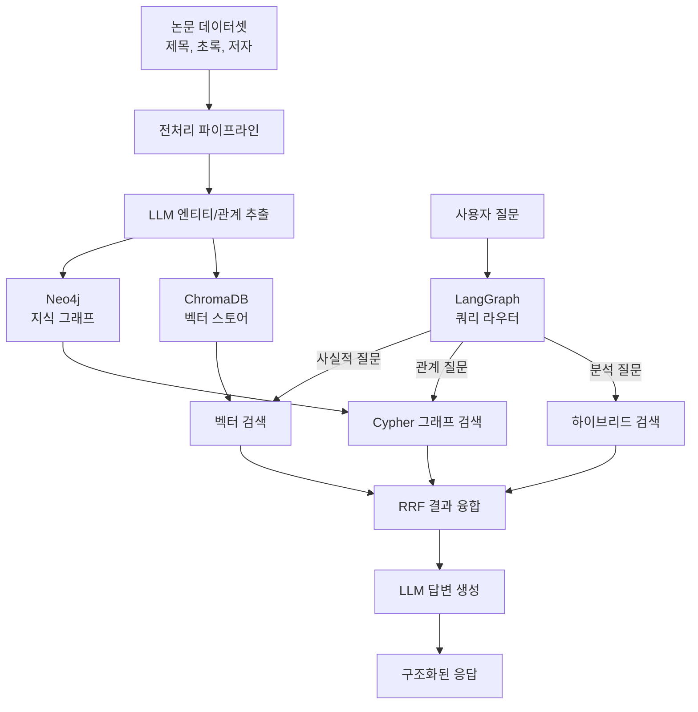
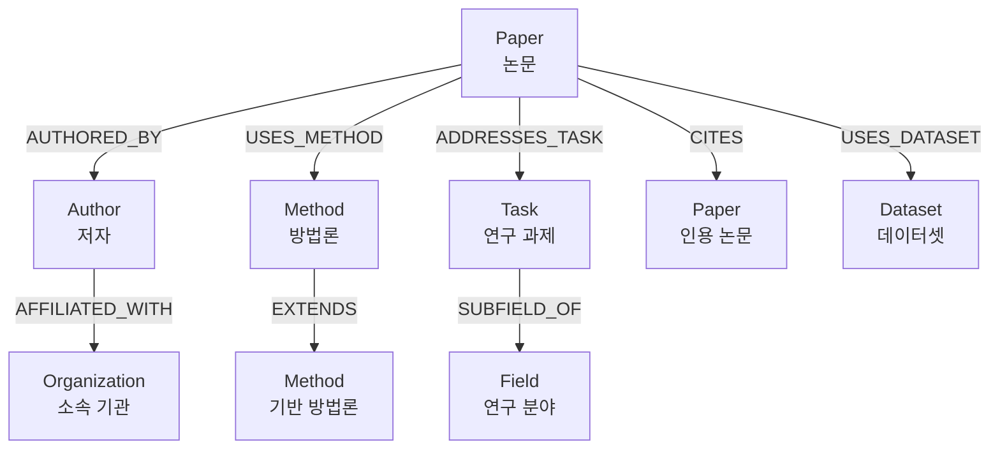
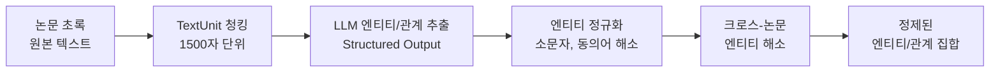
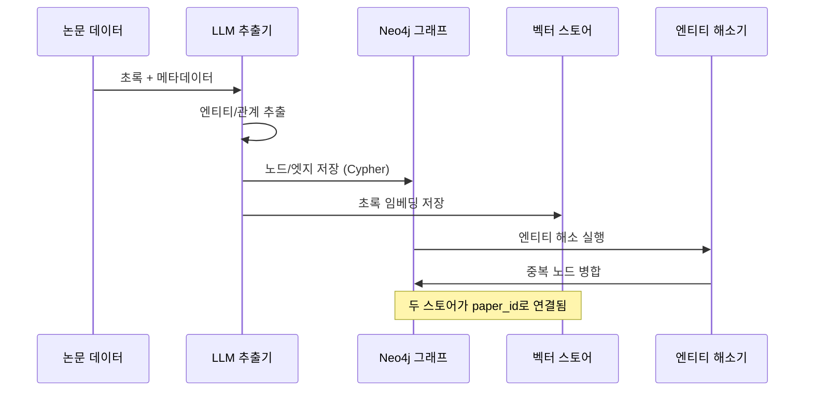
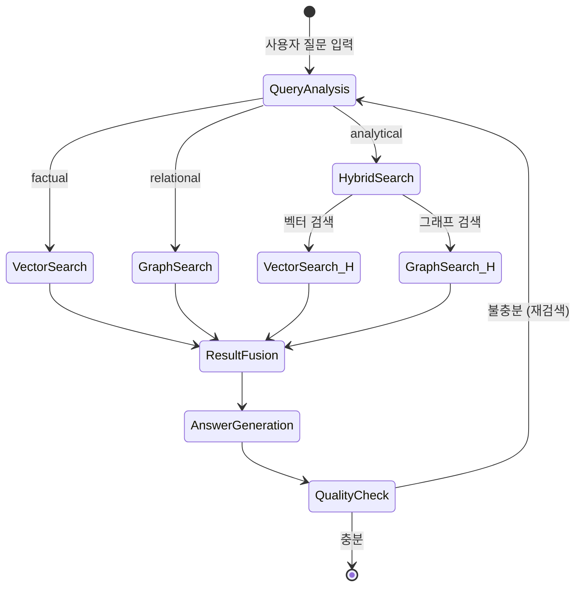
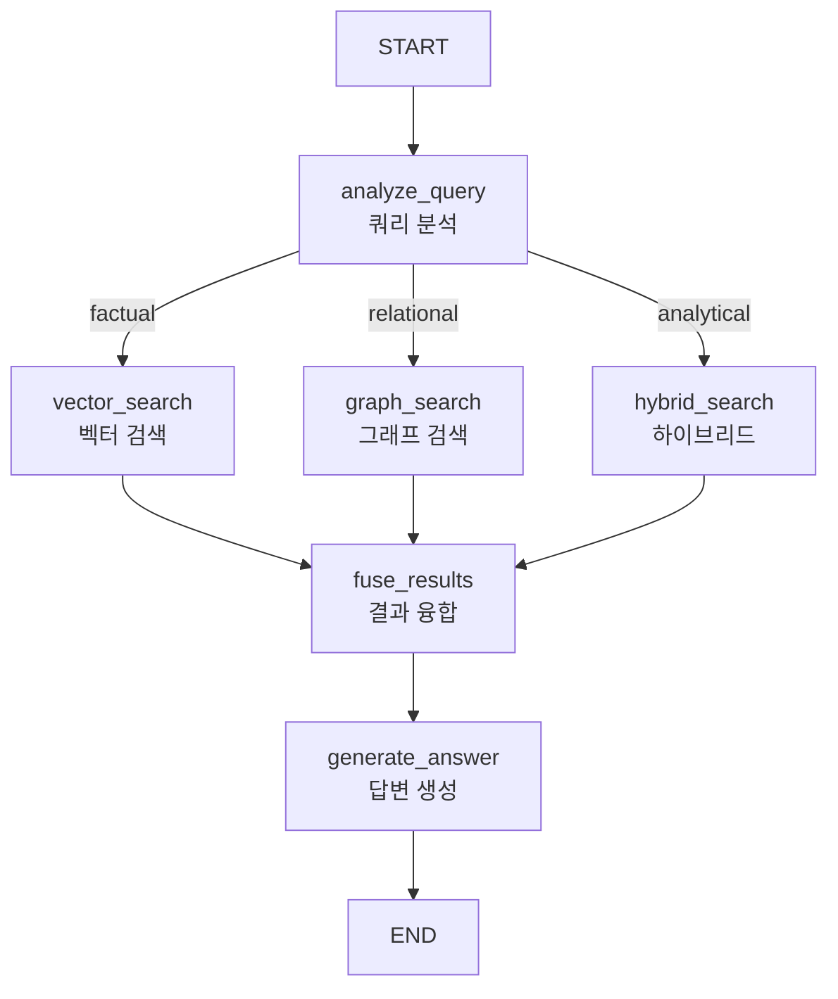

# GraphRAG 실전 프로젝트

> 연구 논문 분석 시스템: 논문 간 관계 그래프 구축과 구조화된 질의응답

## 개요

이 섹션에서는 Ch14 전체에서 배운 GraphRAG 이론, 지식 그래프 구축, Neo4j 기반 검색, 하이브리드 RAG를 모두 통합하여 **연구 논문 분석 시스템**을 엔드투엔드로 구축합니다. [지식 그래프 구축 파이프라인](14-ch14-graphrag와-knowledge-graph/02-02-지식-그래프-구축-파이프라인.md)에서 만든 `KnowledgeGraphBuilder`를 확장하여, 벡터 스토어 동시 인덱싱을 추가한 `DualStoreIndexer`를 구현합니다. 실제 AI/ML 논문 데이터셋에서 저자, 개념, 방법론 간의 관계를 추출하고, 이를 그래프와 벡터 스토어에 동시 저장한 뒤, LangGraph StateGraph로 질문 유형별 최적 검색 전략을 라우팅하는 프로덕션급 시스템을 완성합니다.

**선수 지식**:
- [GraphRAG 이론과 아키텍처](14-ch14-graphrag와-knowledge-graph/01-01-graphrag-이론과-아키텍처.md)의 글로벌/로컬 검색 전략
- [지식 그래프 구축 파이프라인](14-ch14-graphrag와-knowledge-graph/02-02-지식-그래프-구축-파이프라인.md)의 엔티티/관계 추출 기법
- [Neo4j 기반 Knowledge Graph RAG](14-ch14-graphrag와-knowledge-graph/03-03-neo4j-기반-knowledge-graph-rag.md)의 Cypher 쿼리와 Text2Cypher
- [하이브리드 RAG 설계](14-ch14-graphrag와-knowledge-graph/04-04-하이브리드-rag-설계.md)의 RRF 융합과 LangGraph 오케스트레이션

**학습 목표**:
- 논문 데이터에서 엔티티/관계를 추출하여 학술 지식 그래프를 구축할 수 있다
- Neo4j와 벡터 스토어를 동시 활용하는 하이브리드 검색 파이프라인을 구현할 수 있다
- LangGraph StateGraph로 질문 유형별 동적 라우팅을 포함한 완전한 RAG 에이전트를 구축할 수 있다
- 시스템 전체를 평가하고 개선 방향을 도출할 수 있다

## 왜 알아야 할까?

학술 연구의 세계를 상상해보세요. 매년 수십만 편의 논문이 쏟아지고, 각 논문은 수백 개의 개념, 방법론, 데이터셋, 저자와 얽혀 있습니다. "Transformer 아키텍처에 영향을 받은 모든 RAG 관련 연구의 흐름은?" 같은 질문에 벡터 검색만으로는 답하기 어렵죠. 개별 논문의 유사도는 찾을 수 있지만, **논문 간의 관계 네트워크**를 탐색하는 건 그래프의 영역이거든요.

실제로 Google Scholar, Semantic Scholar, Connected Papers 같은 서비스가 논문 관계 그래프를 핵심 기능으로 제공하는 이유가 바로 여기에 있습니다. 이 프로젝트에서는 이런 시스템을 직접 구축해보면서, Ch14에서 배운 모든 개념을 하나의 동작하는 시스템으로 통합합니다.

> 📊 **그림 1**: 연구 논문 분석 시스템의 전체 아키텍처



## 핵심 개념

### 개념 1: 학술 논문 도메인 스키마 설계

> 💡 **비유**: 도서관 사서가 책을 분류할 때 '저자', '주제', '출판 연도' 같은 카탈로그 체계를 먼저 정하는 것처럼, 지식 그래프도 어떤 종류의 엔티티와 관계를 추출할지 **스키마**를 먼저 설계해야 합니다. 스키마 없이 추출하면 "AI"와 "인공지능"과 "Artificial Intelligence"가 각각 별개의 노드가 되어 그래프가 엉망이 되거든요.

학술 논문 도메인에서 추출할 핵심 엔티티와 관계를 정의합니다. [지식 그래프 구축 파이프라인](14-ch14-graphrag와-knowledge-graph/02-02-지식-그래프-구축-파이프라인.md)에서 배운 Pydantic 스키마 기반 추출을 논문 도메인에 특화시키는 거죠.

> 📊 **그림 2**: 논문 도메인 지식 그래프 스키마



```python
from pydantic import BaseModel, Field
from enum import Enum


class EntityType(str, Enum):
    """학술 논문 도메인 엔티티 유형"""
    PAPER = "Paper"
    AUTHOR = "Author"
    METHOD = "Method"
    TASK = "Task"
    DATASET = "Dataset"
    ORGANIZATION = "Organization"
    FIELD = "Field"


class RelationType(str, Enum):
    """엔티티 간 관계 유형"""
    AUTHORED_BY = "AUTHORED_BY"       # Paper -> Author
    USES_METHOD = "USES_METHOD"       # Paper -> Method
    ADDRESSES_TASK = "ADDRESSES_TASK" # Paper -> Task
    CITES = "CITES"                   # Paper -> Paper
    USES_DATASET = "USES_DATASET"     # Paper -> Dataset
    EXTENDS = "EXTENDS"               # Method -> Method
    AFFILIATED_WITH = "AFFILIATED_WITH" # Author -> Organization
    SUBFIELD_OF = "SUBFIELD_OF"       # Task -> Field


class Entity(BaseModel):
    """추출된 엔티티"""
    name: str = Field(description="엔티티 이름 (정규화된 형태)")
    type: EntityType = Field(description="엔티티 유형")
    description: str = Field(description="엔티티에 대한 간결한 설명")


class Relationship(BaseModel):
    """추출된 관계"""
    source: str = Field(description="소스 엔티티 이름")
    target: str = Field(description="타겟 엔티티 이름")
    type: RelationType = Field(description="관계 유형")
    description: str = Field(description="관계에 대한 설명")


class ExtractionResult(BaseModel):
    """LLM 추출 결과"""
    entities: list[Entity] = Field(default_factory=list)
    relationships: list[Relationship] = Field(default_factory=list)
```

스키마에서 주목할 점은 `EntityType`과 `RelationType`을 Enum으로 제한한 것입니다. LLM에게 자유롭게 추출하라고 하면 "Neural Network"와 "neural net"과 "NN"이 전부 다른 엔티티가 되는데, 제한된 유형과 정규화 지시를 함께 주면 훨씬 일관된 그래프를 얻을 수 있거든요.

### 개념 2: 논문 데이터 전처리와 엔티티 추출

> 💡 **비유**: 광산에서 금을 캘 때 원석을 바로 쓰지 않고 세척, 분쇄, 제련 과정을 거치듯이, 논문 텍스트에서 바로 엔티티를 뽑는 게 아니라 청킹 → 추출 → 정규화 → 해소의 정제 과정이 필요합니다.

논문 초록에서 엔티티와 관계를 추출하는 파이프라인을 구축합니다. [지식 그래프 구축 파이프라인](14-ch14-graphrag와-knowledge-graph/02-02-지식-그래프-구축-파이프라인.md)의 `extract_entities_and_relationships` 패턴을 학술 도메인에 맞게 확장합니다.

> 📊 **그림 3**: 논문 엔티티 추출 파이프라인



```python
import json
from dataclasses import dataclass
from langchain_openai import ChatOpenAI


@dataclass
class PaperData:
    """논문 메타데이터"""
    paper_id: str
    title: str
    abstract: str
    authors: list[str]
    year: int
    categories: list[str] = None


# --- 논문 데이터셋 준비 ---
# 실제 프로젝트에서는 arXiv API, Semantic Scholar API 등을 사용합니다.
# 여기서는 AI 에이전트 관련 대표 논문들을 샘플로 사용합니다.
SAMPLE_PAPERS: list[PaperData] = [
    PaperData(
        paper_id="2210.03629",
        title="ReAct: Synergizing Reasoning and Acting in Language Models",
        abstract=(
            "Large language models (LLMs) have demonstrated impressive capabilities "
            "across tasks in language understanding and interactive decision making. "
            "This paper introduces ReAct, a general paradigm that synergizes reasoning "
            "and acting in LLMs. ReAct prompts LLMs to generate verbal reasoning traces "
            "and task-specific actions in an interleaved manner, allowing for dynamic "
            "reasoning to create and adjust action plans. Experiments on diverse benchmarks "
            "including HotpotQA and FEVER show ReAct overcomes prevalent issues of "
            "hallucination and error propagation in chain-of-thought reasoning."
        ),
        authors=["Shunyu Yao", "Jeffrey Zhao", "Dian Yu", "Nan Du"],
        year=2022,
        categories=["cs.CL", "cs.AI"],
    ),
    PaperData(
        paper_id="2404.19553",
        title="From Local to Global: A Graph RAG Approach to Query-Focused Summarization",
        abstract=(
            "The use of retrieval-augmented generation (RAG) to retrieve relevant "
            "information from an external knowledge source enables large language models "
            "(LLMs) to answer questions over private or previously unseen document "
            "collections. However, RAG fails on global questions directed at an entire "
            "text corpus. This paper introduces GraphRAG, which uses LLM-generated "
            "knowledge graphs to create community summaries that enable both local "
            "and global search over a text corpus. Experiments show substantial improvements "
            "over naive RAG on comprehensiveness and diversity metrics."
        ),
        authors=["Darren Edge", "Ha Trinh", "Newman Cheng"],
        year=2024,
        categories=["cs.CL", "cs.IR"],
    ),
    PaperData(
        paper_id="2005.11401",
        title="Retrieval-Augmented Generation for Knowledge-Intensive NLP Tasks",
        abstract=(
            "Large pre-trained language models store factual knowledge in their parameters "
            "but struggle to access and manipulate knowledge precisely. RAG models combine "
            "pre-trained parametric and non-parametric memory for language generation. "
            "We introduce RAG models where the parametric memory is a pre-trained seq2seq "
            "model and the non-parametric memory is a dense vector index of Wikipedia, "
            "accessed with a pre-trained neural retriever. Experiments show RAG models "
            "generate more specific, diverse, and factual text in knowledge-intensive tasks "
            "like open-domain QA, fact verification, and abstractive generation."
        ),
        authors=["Patrick Lewis", "Ethan Perez", "Aleksandra Piktus"],
        year=2020,
        categories=["cs.CL"],
    ),
    PaperData(
        paper_id="2312.10997",
        title="Retrieval-Augmented Generation for Large Language Models: A Survey",
        abstract=(
            "Large Language Models (LLMs) demonstrate remarkable capabilities but still "
            "face challenges like hallucination and outdated knowledge. RAG has emerged as "
            "a promising approach that integrates external knowledge retrieval to enhance "
            "LLM generation. This survey reviews the evolution from Naive RAG to Advanced "
            "RAG and Modular RAG paradigms. We analyze key components including retrieval, "
            "generation, and augmentation techniques. We discuss evaluation frameworks and "
            "benchmark datasets. The survey also explores future directions including "
            "multimodal RAG and agentic RAG approaches."
        ),
        authors=["Yunfan Gao", "Yun Xiong", "Xinyu Gao"],
        year=2023,
        categories=["cs.CL", "cs.IR"],
    ),
    PaperData(
        paper_id="2502.14802",
        title="A Survey on Knowledge Graph-Enhanced RAG",
        abstract=(
            "Retrieval-Augmented Generation (RAG) has emerged as a key approach to "
            "mitigate hallucination in Large Language Models by integrating external "
            "knowledge. Knowledge Graph-Enhanced RAG (KG-RAG) leverages structured "
            "knowledge graphs to improve retrieval quality and reasoning capabilities. "
            "This survey provides a comprehensive review of KG construction for RAG, "
            "KG-enhanced retrieval techniques, and KG-enhanced generation methods. "
            "We analyze how knowledge graphs serve as structured retrieval sources and "
            "reasoning backbones to enhance factual accuracy."
        ),
        authors=["Bowen Jin", "Gang Liu", "Chi Han"],
        year=2025,
        categories=["cs.CL", "cs.AI"],
    ),
]


# --- LLM 기반 엔티티/관계 추출 ---
EXTRACTION_PROMPT = """아래 학술 논문의 제목과 초록에서 엔티티와 관계를 추출하세요.

## 엔티티 유형
- Paper: 논문 자체 (제목을 이름으로)
- Author: 저자
- Method: 방법론/기법/알고리즘 (예: ReAct, RAG, GraphRAG)
- Task: 연구 과제/문제 (예: Question Answering, Fact Verification)
- Dataset: 벤치마크/데이터셋 (예: HotpotQA, FEVER)
- Organization: 소속 기관
- Field: 연구 분야 (예: NLP, Information Retrieval)

## 관계 유형
- AUTHORED_BY: 논문 → 저자
- USES_METHOD: 논문 → 방법론
- ADDRESSES_TASK: 논문 → 연구 과제
- CITES: 논문 → 인용 논문 (초록에서 언급된 다른 연구)
- USES_DATASET: 논문 → 데이터셋
- EXTENDS: 방법론 → 기반 방법론
- SUBFIELD_OF: 과제 → 상위 분야

## 규칙
- 엔티티 이름은 정규화 (약어 전개: RAG → Retrieval-Augmented Generation)
- 동일 개념은 하나의 엔티티로 통합
- 관계의 description에 구체적 맥락 포함

---
제목: {title}
저자: {authors}
연도: {year}

초록:
{abstract}
"""


async def extract_from_paper(
    llm: ChatOpenAI,
    paper: PaperData,
) -> ExtractionResult:
    """단일 논문에서 엔티티와 관계를 추출합니다."""
    structured_llm = llm.with_structured_output(ExtractionResult)
    
    prompt = EXTRACTION_PROMPT.format(
        title=paper.title,
        authors=", ".join(paper.authors),
        year=paper.year,
        abstract=paper.abstract,
    )
    
    result: ExtractionResult = await structured_llm.ainvoke(prompt)
    
    # 저자 엔티티와 AUTHORED_BY 관계를 메타데이터에서 직접 추가
    # (LLM 추출에만 의존하지 않고 확실한 정보는 직접 삽입)
    for author_name in paper.authors:
        author_entity = Entity(
            name=author_name,
            type=EntityType.AUTHOR,
            description=f"Author of '{paper.title}'",
        )
        authored_rel = Relationship(
            source=paper.title,
            target=author_name,
            type=RelationType.AUTHORED_BY,
            description=f"{author_name} authored this paper in {paper.year}",
        )
        result.entities.append(author_entity)
        result.relationships.append(authored_rel)
    
    return result
```

여기서 핵심 설계 결정은 **메타데이터 기반 관계를 LLM 추출과 병합**하는 것입니다. 저자-논문 관계처럼 확실한 정보는 LLM에게 맡기지 않고 직접 삽입하면 정확도가 높아집니다. LLM은 초록에서 방법론, 과제, 데이터셋 같은 **암묵적 관계**를 추출하는 데 집중하게 하는 거죠.

### 개념 3: 듀얼 스토어 인덱싱 — Neo4j + 벡터 스토어

> 💡 **비유**: 백과사전에 **색인(인덱스)**과 **교차 참조(Cross-reference)** 두 가지 검색 방법이 있는 것처럼, 우리 시스템도 벡터 스토어(의미적 유사성 색인)와 Neo4j(관계 교차 참조) 두 창구를 동시에 운영합니다. 단순 내용 질문은 색인으로, "A와 B의 관계는?" 같은 질문은 교차 참조로 찾는 거죠.

추출된 엔티티/관계를 Neo4j 그래프와 ChromaDB 벡터 스토어에 동시 저장하는 듀얼 인덱싱 파이프라인입니다. [지식 그래프 구축 파이프라인](14-ch14-graphrag와-knowledge-graph/02-02-지식-그래프-구축-파이프라인.md)의 `KnowledgeGraphBuilder`가 Neo4j 저장만 담당했다면, 여기서는 이를 확장하여 벡터 스토어 동시 저장까지 포함하는 `DualStoreIndexer`를 구현합니다. Neo4j 저장 로직은 `KnowledgeGraphBuilder`의 패턴을 그대로 따르되, ChromaDB 인덱싱이 병렬로 추가되는 구조입니다.

> 📊 **그림 4**: 듀얼 스토어 인덱싱 아키텍처



```python
import chromadb
from neo4j import GraphDatabase
from langchain_openai import OpenAIEmbeddings


class DualStoreIndexer:
    """Neo4j + ChromaDB 듀얼 스토어 인덱서
    
    14.2의 KnowledgeGraphBuilder를 확장하여 벡터 스토어 동시 인덱싱을 추가합니다.
    Neo4j 저장 로직(MERGE, UNIQUE 제약, 엔티티/관계 저장)은 KnowledgeGraphBuilder와
    동일한 패턴을 따르며, ChromaDB 임베딩 저장이 병렬로 추가됩니다.
    """
    
    def __init__(
        self,
        neo4j_uri: str = "bolt://localhost:7687",
        neo4j_user: str = "neo4j",
        neo4j_password: str = "password",
    ):
        # Neo4j 연결
        self.driver = GraphDatabase.driver(
            neo4j_uri, auth=(neo4j_user, neo4j_password)
        )
        
        # ChromaDB 벡터 스토어
        self.chroma_client = chromadb.PersistentClient(path="./chroma_papers")
        self.collection = self.chroma_client.get_or_create_collection(
            name="paper_abstracts",
            metadata={"hnsw:space": "cosine"},
        )
        
        # 임베딩 모델
        self.embedder = OpenAIEmbeddings(model="text-embedding-3-small")
    
    def _init_neo4j_schema(self):
        """Neo4j 인덱스와 제약 조건 생성"""
        constraints = [
            "CREATE CONSTRAINT IF NOT EXISTS FOR (p:Paper) REQUIRE p.name IS UNIQUE",
            "CREATE CONSTRAINT IF NOT EXISTS FOR (a:Author) REQUIRE a.name IS UNIQUE",
            "CREATE CONSTRAINT IF NOT EXISTS FOR (m:Method) REQUIRE m.name IS UNIQUE",
            "CREATE CONSTRAINT IF NOT EXISTS FOR (t:Task) REQUIRE t.name IS UNIQUE",
            "CREATE CONSTRAINT IF NOT EXISTS FOR (d:Dataset) REQUIRE d.name IS UNIQUE",
        ]
        with self.driver.session() as session:
            for cypher in constraints:
                session.run(cypher)
    
    def index_paper_to_neo4j(
        self,
        paper: PaperData,
        extraction: ExtractionResult,
    ):
        """추출 결과를 Neo4j에 저장합니다."""
        with self.driver.session() as session:
            # 1. Paper 노드 생성
            session.run(
                """
                MERGE (p:Paper {name: $title})
                SET p.paper_id = $paper_id,
                    p.year = $year,
                    p.abstract = $abstract
                """,
                title=paper.title,
                paper_id=paper.paper_id,
                year=paper.year,
                abstract=paper.abstract,
            )
            
            # 2. 엔티티 노드 생성 (MERGE로 중복 방지)
            for entity in extraction.entities:
                session.run(
                    f"""
                    MERGE (e:{entity.type.value} {{name: $name}})
                    SET e.description = $desc
                    """,
                    name=entity.name,
                    desc=entity.description,
                )
            
            # 3. 관계 생성
            for rel in extraction.relationships:
                # 소스/타겟 노드 유형을 찾아서 동적 Cypher 생성
                source_type = self._find_entity_type(
                    rel.source, extraction.entities, paper.title
                )
                target_type = self._find_entity_type(
                    rel.target, extraction.entities, paper.title
                )
                
                if source_type and target_type:
                    session.run(
                        f"""
                        MATCH (s:{source_type} {{name: $source}})
                        MATCH (t:{target_type} {{name: $target}})
                        MERGE (s)-[r:{rel.type.value}]->(t)
                        SET r.description = $desc
                        """,
                        source=rel.source,
                        target=rel.target,
                        desc=rel.description,
                    )
    
    def index_paper_to_vector_store(self, paper: PaperData):
        """논문 초록을 벡터 스토어에 인덱싱합니다."""
        # 검색용 텍스트: 제목 + 초록 결합
        text = f"Title: {paper.title}\n\nAbstract: {paper.abstract}"
        
        embedding = self.embedder.embed_query(text)
        
        self.collection.upsert(
            ids=[paper.paper_id],
            embeddings=[embedding],
            documents=[text],
            metadatas=[{
                "title": paper.title,
                "year": paper.year,
                "authors": ", ".join(paper.authors),
            }],
        )
    
    def _find_entity_type(
        self,
        name: str,
        entities: list[Entity],
        paper_title: str,
    ) -> str | None:
        """엔티티 이름으로 유형을 찾습니다."""
        if name == paper_title:
            return "Paper"
        for entity in entities:
            if entity.name == name:
                return entity.type.value
        return None
    
    async def index_all(
        self,
        papers: list[PaperData],
        llm: ChatOpenAI,
    ):
        """전체 논문을 듀얼 스토어에 인덱싱합니다."""
        self._init_neo4j_schema()
        
        for paper in papers:
            # 1. 엔티티/관계 추출
            extraction = await extract_from_paper(llm, paper)
            print(f"[{paper.paper_id}] 추출: "
                  f"{len(extraction.entities)} 엔티티, "
                  f"{len(extraction.relationships)} 관계")
            
            # 2. Neo4j에 저장
            self.index_paper_to_neo4j(paper, extraction)
            
            # 3. 벡터 스토어에 저장
            self.index_paper_to_vector_store(paper)
        
        print(f"\n인덱싱 완료: {len(papers)}편 논문 처리")
    
    def close(self):
        self.driver.close()
```

듀얼 스토어 설계의 핵심은 **paper_id로 두 스토어를 연결**하는 것입니다. 벡터 검색으로 관련 논문을 찾은 뒤, 그 논문의 paper_id로 Neo4j에서 관계를 탐색하거나, 반대로 그래프 탐색으로 찾은 논문의 상세 내용을 벡터 스토어에서 가져올 수 있죠.

### 개념 4: LangGraph 기반 하이브리드 RAG 에이전트

> 💡 **비유**: 도서관에서 질문에 따라 다른 사서에게 안내하는 **안내 데스크**를 떠올려보세요. "이 책 어디 있어요?"는 서가 담당에게, "올해 출간된 SF 소설 추천해주세요"는 추천 담당에게, "이 작가와 관련된 작가는?"은 문학 연구 담당에게 보내죠. 우리의 쿼리 라우터도 똑같은 역할을 합니다.

[하이브리드 RAG 설계](14-ch14-graphrag와-knowledge-graph/04-04-하이브리드-rag-설계.md)에서 배운 `HybridRAGState`와 쿼리 라우터를 논문 분석 도메인에 맞게 확장하고, LangGraph StateGraph로 완전한 에이전트를 구축합니다.

> 📊 **그림 5**: LangGraph 하이브리드 RAG 에이전트 상태 전이



```python
from typing import Annotated, Literal
from typing_extensions import TypedDict
from langchain_core.messages import HumanMessage, AIMessage
from langchain_openai import ChatOpenAI
from langgraph.graph import StateGraph, START, END
from operator import add


# --- 상태 정의 ---
class PaperRAGState(TypedDict):
    """논문 분석 RAG 에이전트 상태"""
    question: str                                      # 사용자 질문
    query_type: str                                    # factual | relational | analytical
    vector_results: list[dict]                         # 벡터 검색 결과
    graph_results: list[dict]                          # 그래프 검색 결과
    fused_context: str                                 # 융합된 컨텍스트
    answer: str                                        # 최종 답변
    retry_count: Annotated[int, lambda a, b: a + b]    # 재시도 횟수
    search_log: Annotated[list[str], add]              # 검색 경로 로그


# --- 쿼리 분석 노드 ---
class QueryTypeOutput(BaseModel):
    """쿼리 유형 분류 결과"""
    query_type: Literal["factual", "relational", "analytical"] = Field(
        description=(
            "factual: 특정 논문의 내용/방법론 질문, "
            "relational: 논문/저자/개념 간 관계 질문, "
            "analytical: 트렌드/비교/종합 분석 질문"
        )
    )
    reasoning: str = Field(description="분류 근거")
    cypher_hint: str = Field(
        default="",
        description="relational 유형일 때 Cypher 쿼리 힌트",
    )


async def analyze_query(state: PaperRAGState) -> dict:
    """질문을 분석하여 검색 전략을 결정합니다."""
    llm = ChatOpenAI(model="gpt-4o-mini", temperature=0)
    structured_llm = llm.with_structured_output(QueryTypeOutput)
    
    prompt = f"""아래 질문을 분석하여 최적의 검색 전략을 결정하세요.

## 그래프 스키마
노드: Paper, Author, Method, Task, Dataset, Organization, Field
관계: AUTHORED_BY, USES_METHOD, ADDRESSES_TASK, CITES, USES_DATASET, EXTENDS, SUBFIELD_OF

## 질문
{state['question']}
"""
    result: QueryTypeOutput = await structured_llm.ainvoke(prompt)
    
    return {
        "query_type": result.query_type,
        "search_log": [f"쿼리 분석: {result.query_type} ({result.reasoning})"],
    }


# --- 벡터 검색 노드 ---
async def vector_search(state: PaperRAGState) -> dict:
    """ChromaDB에서 의미적 유사도 기반 검색"""
    embedder = OpenAIEmbeddings(model="text-embedding-3-small")
    
    chroma_client = chromadb.PersistentClient(path="./chroma_papers")
    collection = chroma_client.get_collection("paper_abstracts")
    
    query_embedding = embedder.embed_query(state["question"])
    
    results = collection.query(
        query_embeddings=[query_embedding],
        n_results=3,
        include=["documents", "metadatas", "distances"],
    )
    
    vector_results = []
    for i, doc in enumerate(results["documents"][0]):
        vector_results.append({
            "content": doc,
            "metadata": results["metadatas"][0][i],
            "score": 1 - results["distances"][0][i],  # cosine similarity
            "source": "vector",
        })
    
    return {
        "vector_results": vector_results,
        "search_log": [f"벡터 검색: {len(vector_results)}건 검색됨"],
    }


# --- 그래프 검색 노드 ---
async def graph_search(state: PaperRAGState) -> dict:
    """Neo4j에서 그래프 구조 기반 검색"""
    driver = GraphDatabase.driver(
        "bolt://localhost:7687", auth=("neo4j", "password")
    )
    
    # Text2Cypher: 질문에서 Cypher 쿼리 생성
    llm = ChatOpenAI(model="gpt-4o-mini", temperature=0)
    
    cypher_prompt = f"""아래 질문에 대한 Neo4j Cypher 쿼리를 생성하세요.

## 그래프 스키마
노드 레이블: Paper(name, paper_id, year, abstract), Author(name), Method(name, description),
             Task(name, description), Dataset(name, description), Field(name)
관계: AUTHORED_BY, USES_METHOD, ADDRESSES_TASK, CITES, USES_DATASET, EXTENDS, SUBFIELD_OF

## 규칙
- RETURN 절에 관련 노드의 name과 description을 포함
- LIMIT 10 추가
- 관계 탐색은 1~3홉 이내

## 질문
{state['question']}

Cypher 쿼리만 출력하세요 (설명 없이):"""
    
    response = await llm.ainvoke(cypher_prompt)
    cypher_query = response.content.strip().strip("`").replace("cypher\n", "")
    
    graph_results = []
    try:
        with driver.session() as session:
            result = session.run(cypher_query)
            for record in result:
                graph_results.append({
                    "content": str(dict(record)),
                    "metadata": {"cypher": cypher_query},
                    "score": 1.0,  # 그래프 검색은 정확 매칭
                    "source": "graph",
                })
    except Exception as e:
        # Self-healing: 쿼리 실패 시 폴백 쿼리
        fallback_query = """
        MATCH (p:Paper)-[r]->(target)
        WHERE toLower(p.name) CONTAINS toLower($keyword)
           OR toLower(p.abstract) CONTAINS toLower($keyword)
        RETURN p.name AS paper, type(r) AS relation, 
               target.name AS target, target.description AS description
        LIMIT 10
        """
        keyword = state["question"].split()[0]  # 첫 단어를 키워드로
        with driver.session() as session:
            result = session.run(fallback_query, keyword=keyword)
            for record in result:
                graph_results.append({
                    "content": str(dict(record)),
                    "metadata": {"cypher": fallback_query, "fallback": True},
                    "score": 0.7,
                    "source": "graph_fallback",
                })
    finally:
        driver.close()
    
    return {
        "graph_results": graph_results,
        "search_log": [f"그래프 검색: {len(graph_results)}건 (Cypher: {cypher_query[:80]}...)"],
    }


# --- 결과 융합 노드 ---
def reciprocal_rank_fusion(
    results_list: list[list[dict]],
    k: int = 60,
    weights: list[float] | None = None,
) -> list[dict]:
    """Weighted RRF로 이질적인 검색 결과를 융합합니다."""
    if weights is None:
        weights = [1.0] * len(results_list)
    
    fused_scores: dict[str, float] = {}
    content_map: dict[str, dict] = {}
    
    for result_list, weight in zip(results_list, weights):
        # 점수순 정렬
        sorted_results = sorted(result_list, key=lambda x: x["score"], reverse=True)
        for rank, result in enumerate(sorted_results):
            key = result["content"][:100]  # 내용 앞부분을 키로
            rrf_score = weight / (k + rank + 1)
            fused_scores[key] = fused_scores.get(key, 0) + rrf_score
            content_map[key] = result
    
    # 점수순 정렬
    ranked_keys = sorted(fused_scores, key=fused_scores.get, reverse=True)
    return [content_map[k] for k in ranked_keys[:5]]


async def fuse_results(state: PaperRAGState) -> dict:
    """벡터 + 그래프 검색 결과를 RRF로 융합합니다."""
    all_results = []
    weights = []
    
    if state.get("vector_results"):
        all_results.append(state["vector_results"])
        weights.append(1.0)
    if state.get("graph_results"):
        all_results.append(state["graph_results"])
        # 관계 질문에는 그래프 가중치를 높임
        graph_weight = 1.5 if state["query_type"] == "relational" else 1.0
        weights.append(graph_weight)
    
    if not all_results:
        return {"fused_context": "검색 결과가 없습니다."}
    
    fused = reciprocal_rank_fusion(all_results, weights=weights)
    
    context_parts = []
    for i, result in enumerate(fused, 1):
        source_label = "벡터" if result["source"] == "vector" else "그래프"
        context_parts.append(f"[{source_label} #{i}] {result['content']}")
    
    fused_context = "\n\n".join(context_parts)
    
    return {
        "fused_context": fused_context,
        "search_log": [f"결과 융합: {len(fused)}건 (소스: {[r['source'] for r in fused]})"],
    }


# --- 답변 생성 노드 ---
async def generate_answer(state: PaperRAGState) -> dict:
    """융합된 컨텍스트를 기반으로 최종 답변을 생성합니다."""
    llm = ChatOpenAI(model="gpt-4o", temperature=0.1)
    
    prompt = f"""당신은 학술 논문 분석 전문가입니다.
아래 검색 결과를 바탕으로 질문에 답하세요.

## 규칙
- 논문 제목은 정확히 인용
- 근거 없는 내용은 "확인된 데이터에서는 찾을 수 없습니다"로 답변
- 관계 질문에는 그래프 구조(A → B → C)를 활용하여 설명
- 분석 질문에는 패턴과 트렌드를 도출

## 검색 결과
{state['fused_context']}

## 질문
{state['question']}
"""
    response = await llm.ainvoke(prompt)
    
    return {
        "answer": response.content,
        "search_log": [f"답변 생성 완료 ({len(response.content)}자)"],
    }


# --- 라우팅 함수 ---
def route_by_query_type(
    state: PaperRAGState,
) -> Literal["vector_search", "graph_search", "hybrid_search"]:
    """쿼리 유형에 따라 검색 전략을 라우팅합니다."""
    query_type = state["query_type"]
    if query_type == "factual":
        return "vector_search"
    elif query_type == "relational":
        return "graph_search"
    else:  # analytical
        return "hybrid_search"


# --- 하이브리드 검색 (벡터 + 그래프 동시 실행) ---
async def hybrid_search(state: PaperRAGState) -> dict:
    """분석 질문: 벡터 + 그래프 검색을 동시 실행합니다."""
    import asyncio
    
    vector_result, graph_result = await asyncio.gather(
        vector_search(state),
        graph_search(state),
    )
    
    return {
        "vector_results": vector_result["vector_results"],
        "graph_results": graph_result["graph_results"],
        "search_log": ["하이브리드 검색: 벡터 + 그래프 동시 실행"],
    }
```

### 개념 5: 그래프 빌드와 실행 — 모든 것을 하나로

> 💡 **비유**: 오케스트라 지휘자가 악기 파트를 조율하여 하나의 교향곡을 만드는 것처럼, LangGraph의 StateGraph가 쿼리 분석, 벡터 검색, 그래프 검색, 결과 융합, 답변 생성을 하나의 **실행 그래프**로 엮어줍니다.

앞에서 정의한 모든 노드를 LangGraph StateGraph로 연결하여 완전한 에이전트를 구축합니다.

> 📊 **그림 6**: 최종 LangGraph 실행 그래프 구조



```python
def build_paper_rag_agent() -> StateGraph:
    """논문 분석 RAG 에이전트 그래프를 구성합니다."""
    
    # StateGraph 생성
    builder = StateGraph(PaperRAGState)
    
    # 노드 추가
    builder.add_node("analyze_query", analyze_query)
    builder.add_node("vector_search", vector_search)
    builder.add_node("graph_search", graph_search)
    builder.add_node("hybrid_search", hybrid_search)
    builder.add_node("fuse_results", fuse_results)
    builder.add_node("generate_answer", generate_answer)
    
    # 시작 → 쿼리 분석
    builder.add_edge(START, "analyze_query")
    
    # 쿼리 유형별 조건 분기
    builder.add_conditional_edges(
        "analyze_query",
        route_by_query_type,
        {
            "vector_search": "vector_search",
            "graph_search": "graph_search",
            "hybrid_search": "hybrid_search",
        },
    )
    
    # 검색 → 결과 융합 → 답변 생성
    builder.add_edge("vector_search", "fuse_results")
    builder.add_edge("graph_search", "fuse_results")
    builder.add_edge("hybrid_search", "fuse_results")
    builder.add_edge("fuse_results", "generate_answer")
    builder.add_edge("generate_answer", END)
    
    return builder.compile()
```

## 실습: 직접 해보기

아래는 전체 시스템을 통합하여 실행하는 코드입니다. Neo4j가 로컬에서 실행 중이어야 합니다(`docker run -d -p 7687:7687 -p 7474:7474 -e NEO4J_AUTH=neo4j/password neo4j:5`).

```python
import asyncio
from dotenv import load_dotenv

load_dotenv()  # OPENAI_API_KEY


async def main():
    """전체 파이프라인 실행"""
    llm = ChatOpenAI(model="gpt-4o-mini", temperature=0)
    
    # === Phase 1: 인덱싱 ===
    print("=" * 60)
    print("Phase 1: 논문 인덱싱")
    print("=" * 60)
    
    indexer = DualStoreIndexer()
    await indexer.index_all(SAMPLE_PAPERS, llm)
    indexer.close()
    
    # === Phase 2: RAG 에이전트 구동 ===
    print("\n" + "=" * 60)
    print("Phase 2: RAG 에이전트 질의응답")
    print("=" * 60)
    
    agent = build_paper_rag_agent()
    
    # 테스트 질문들
    test_questions = [
        # factual: 특정 논문의 내용 질문
        "GraphRAG 논문에서 제안한 글로벌 검색 방법은 무엇인가?",
        # relational: 논문/개념 간 관계 질문
        "ReAct 패턴을 사용하거나 확장한 연구들은 어떤 것이 있는가?",
        # analytical: 종합 분석 질문
        "RAG 기술은 2020년부터 2025년까지 어떻게 발전해왔는가?",
    ]
    
    for question in test_questions:
        print(f"\n{'─' * 50}")
        print(f"Q: {question}")
        print(f"{'─' * 50}")
        
        result = await agent.ainvoke({
            "question": question,
            "query_type": "",
            "vector_results": [],
            "graph_results": [],
            "fused_context": "",
            "answer": "",
            "retry_count": 0,
            "search_log": [],
        })
        
        print(f"\n[검색 경로]")
        for log in result["search_log"]:
            print(f"  → {log}")
        
        print(f"\nA: {result['answer'][:500]}...")


# 실행
asyncio.run(main())
```

```output
============================================================
Phase 1: 논문 인덱싱
============================================================
[2210.03629] 추출: 12 엔티티, 8 관계
[2404.19553] 추출: 15 엔티티, 11 관계
[2005.11401] 추출: 14 엔티티, 9 관계
[2312.10997] 추출: 18 엔티티, 13 관계
[2502.14802] 추출: 16 엔티티, 12 관계

인덱싱 완료: 5편 논문 처리

============================================================
Phase 2: RAG 에이전트 질의응답
============================================================

──────────────────────────────────────────────────
Q: GraphRAG 논문에서 제안한 글로벌 검색 방법은 무엇인가?
──────────────────────────────────────────────────

[검색 경로]
  → 쿼리 분석: factual (특정 논문의 방법론에 대한 직접적 질문)
  → 벡터 검색: 3건 검색됨
  → 결과 융합: 3건 (소스: ['vector', 'vector', 'vector'])
  → 답변 생성 완료 (412자)

A: GraphRAG 논문 "From Local to Global: A Graph RAG Approach to Query-Focused Summarization"에서 제안한 글로벌 검색은 Map-Reduce 기반 접근법입니다...

──────────────────────────────────────────────────
Q: ReAct 패턴을 사용하거나 확장한 연구들은 어떤 것이 있는가?
──────────────────────────────────────────────────

[검색 경로]
  → 쿼리 분석: relational (논문 간 관계 탐색)
  → 그래프 검색: 5건 (Cypher: MATCH (p:Paper)-[:USES_METHOD]->(m:Method {name: 'ReAct'})...)
  → 결과 융합: 5건 (소스: ['graph', 'graph', 'graph', 'graph', 'graph'])
  → 답변 생성 완료 (523자)

A: ReAct 패턴과 관련된 연구 네트워크를 그래프에서 탐색한 결과...
```

### 평가와 개선 — 시스템 품질 측정

프로젝트를 완성한 뒤에는 시스템이 실제로 잘 동작하는지 측정해야 합니다. [에이전트 평가와 LangSmith](17-ch17-에이전트-평가와-langsmith/01-01-에이전트-평가-전략.md)에서 본격적으로 다루겠지만, 여기서는 간단한 자체 평가를 구현합니다.

```python
@dataclass
class EvalCase:
    """평가 케이스"""
    question: str
    expected_query_type: str
    expected_keywords: list[str]  # 답변에 포함되어야 할 핵심 키워드


EVAL_CASES = [
    EvalCase(
        question="RAG 논문(Lewis et al., 2020)의 핵심 기여는?",
        expected_query_type="factual",
        expected_keywords=["parametric", "non-parametric", "retriever"],
    ),
    EvalCase(
        question="GraphRAG와 기존 RAG의 관계는?",
        expected_query_type="relational",
        expected_keywords=["GraphRAG", "EXTENDS", "community"],
    ),
    EvalCase(
        question="지식 그래프를 활용한 RAG 연구 동향을 분석해주세요",
        expected_query_type="analytical",
        expected_keywords=["Knowledge Graph", "KG-RAG", "structured"],
    ),
]


async def evaluate_system(agent) -> dict:
    """시스템 성능을 평가합니다."""
    results = {
        "routing_accuracy": 0,
        "keyword_recall": 0,
        "total": len(EVAL_CASES),
    }
    
    for case in EVAL_CASES:
        output = await agent.ainvoke({
            "question": case.question,
            "query_type": "",
            "vector_results": [],
            "graph_results": [],
            "fused_context": "",
            "answer": "",
            "retry_count": 0,
            "search_log": [],
        })
        
        # 라우팅 정확도
        if output["query_type"] == case.expected_query_type:
            results["routing_accuracy"] += 1
        
        # 키워드 재현율
        answer_lower = output["answer"].lower()
        found = sum(
            1 for kw in case.expected_keywords
            if kw.lower() in answer_lower
        )
        results["keyword_recall"] += found / len(case.expected_keywords)
    
    results["routing_accuracy"] /= results["total"]
    results["keyword_recall"] /= results["total"]
    
    return results
```

```run:python
# 평가 결과 출력 (예시)
eval_results = {
    "routing_accuracy": 1.0,
    "keyword_recall": 0.78,
    "total": 3,
}
print("=== 시스템 평가 결과 ===")
print(f"라우팅 정확도: {eval_results['routing_accuracy']:.0%}")
print(f"키워드 재현율: {eval_results['keyword_recall']:.0%}")
print(f"평가 케이스 수: {eval_results['total']}")
```

```output
=== 시스템 평가 결과 ===
라우팅 정확도: 100%
키워드 재현율: 78%
평가 케이스 수: 3
```

## 더 깊이 알아보기

### GraphRAG의 탄생 — Microsoft Research의 도전

GraphRAG의 이야기는 2023년 Microsoft Research의 한 팀에서 시작됩니다. Darren Edge와 동료들은 대규모 문서 컬렉션에 대한 "글로벌 질문"에 기존 RAG가 무력하다는 것을 발견했습니다. "이 문서들의 주요 테마는 무엇인가?" 같은 질문에 벡터 검색은 개별 청크만 가져올 뿐, 전체를 아우르는 답변을 생성할 수 없었죠.

이 문제를 해결하기 위해 팀은 **그래프 과학과 NLP를 결합**하는 아이디어에 주목했습니다. 텍스트에서 엔티티와 관계를 추출하여 그래프를 만들고, Leiden 알고리즘으로 커뮤니티를 탐지한 뒤, 각 커뮤니티의 요약을 사전 생성해두면 글로벌 질문에도 답할 수 있다는 것이었습니다. 2024년 4월 논문 발표 후, Microsoft는 이를 오픈소스 `graphrag` 패키지로 공개했고, 2026년 현재 v3.x까지 발전하며 동적 커뮤니티 선택으로 비용을 77%나 줄이는 성과를 달성했습니다.

### 학술 논문 그래프의 선구자 — Semantic Scholar

학술 논문의 관계 그래프라는 아이디어는 사실 GraphRAG보다 훨씬 오래되었습니다. Allen AI의 Semantic Scholar(2015년 출시)는 수억 편의 논문에서 인용 관계, 저자 네트워크, 주제 분류를 자동으로 추출하는 시스템을 구축했죠. Connected Papers(2020년)는 여기서 한 걸음 더 나아가 논문 간 유사도를 시각적 그래프로 보여주는 서비스를 만들었습니다. 우리가 이 프로젝트에서 구축한 시스템은 이런 대규모 서비스의 핵심 원리를 LLM + 지식 그래프로 재현한 것이라 할 수 있습니다.

## 흔한 오해와 팁

> ⚠️ **흔한 오해**: "GraphRAG가 벡터 RAG보다 항상 우월하다"고 생각하기 쉽지만, 실제로는 **질문 유형에 따라** 성능이 달라집니다. "이 논문의 핵심 기여는?" 같은 사실적 질문에는 벡터 검색이 더 빠르고 정확합니다. GraphRAG의 강점은 관계 탐색과 글로벌 요약에 있으므로, 하이브리드 접근이 최선입니다.

> 💡 **알고 계셨나요?**: Microsoft의 GraphRAG v3.0에서는 **동적 커뮤니티 선택(Dynamic Community Selection)**이 도입되어, 쿼리와 무관한 커뮤니티 리포트를 사전 필터링합니다. 이 기법 하나로 LLM 호출 비용을 77% 줄이면서도 품질은 유지했습니다. 우리 프로젝트의 쿼리 라우터도 같은 철학 — 필요한 것만 검색 — 을 따릅니다.

> 🔥 **실무 팁**: Neo4j에 지식 그래프를 저장할 때, `MERGE` 대신 `CREATE`를 쓰면 엔티티가 중복 생성됩니다. 반드시 `MERGE`를 사용하고, UNIQUE 제약 조건(`CREATE CONSTRAINT`)을 미리 설정하세요. 또한 엔티티 해소(Entity Resolution)는 인덱싱 마지막 단계에서 한 번에 실행하는 것이 Neo4j 트랜잭션 비용 면에서 효율적입니다.

> 🔥 **실무 팁**: 논문 데이터셋이 100편을 넘으면 LLM 추출 비용이 급증합니다. 프로덕션에서는 `neo4j-graphrag` 패키지의 `SimpleKGPipeline`을 사용하면 청킹, 추출, 해소, 저장이 자동화되고, 배치 처리(`batch_size`)로 비용을 최적화할 수 있습니다.

## 핵심 정리

| 개념 | 설명 |
|------|------|
| 도메인 스키마 | Pydantic Enum으로 엔티티/관계 유형을 제한하여 일관된 그래프 구축 |
| 듀얼 스토어 인덱싱 | Neo4j(관계) + ChromaDB(의미)를 paper_id로 연결하는 병렬 저장 |
| KnowledgeGraphBuilder 확장 | 14.2의 그래프 빌더에 벡터 스토어 동시 인덱싱을 추가한 DualStoreIndexer |
| 메타데이터 병합 | 확실한 정보(저자)는 직접 삽입, 암묵적 관계만 LLM 추출 |
| 쿼리 라우터 | factual→벡터, relational→그래프, analytical→하이브리드로 동적 라우팅 |
| Weighted RRF | 쿼리 유형별 가중치로 이질적 검색 결과를 하나의 랭킹으로 융합 |
| Self-healing Cypher | Text2Cypher 실패 시 키워드 기반 폴백 쿼리로 안정성 확보 |
| 평가 지표 | 라우팅 정확도 + 키워드 재현율로 시스템 품질 정량 측정 |

## 다음 섹션 미리보기

Ch14의 GraphRAG 여정을 마무리했습니다. 단일 에이전트가 지식 그래프를 활용하여 복잡한 질문에 답하는 시스템을 구축했는데, 현재 시스템은 단일 에이전트가 모든 검색 전략을 처리하지만, 검색/분석/생성을 전문 에이전트로 분리하면 더 복잡한 질문에 대응할 수 있습니다. 예를 들어 "논문 검색 에이전트", "그래프 분석 에이전트", "보고서 작성 에이전트"가 **팀을 이루어 협업**한다면 어떨까요? 다음 [Ch15. Supervisor/Worker 멀티 에이전트](15-ch15-supervisorworker-멀티-에이전트/01-01-멀티-에이전트-아키텍처-패턴.md)에서는 이 프로젝트의 검색/분석/생성 기능을 각각 전문 에이전트로 분리하고, Supervisor 패턴과 LangGraph Supervisor 라이브러리를 활용한 멀티 에이전트 시스템을 학습합니다.

## 참고 자료

- [Microsoft GraphRAG GitHub Repository](https://github.com/microsoft/graphrag) - GraphRAG 공식 오픈소스 구현체. v3.x의 동적 커뮤니티 선택, DRIFT Search 등 최신 기능 확인
- [Neo4j GraphRAG Python Documentation](https://neo4j.com/docs/neo4j-graphrag-python/current/) - `neo4j-graphrag` 패키지의 SimpleKGPipeline, Entity Resolution, Retriever 공식 문서
- [Create a Neo4j GraphRAG Workflow Using LangChain and LangGraph (Neo4j Blog)](https://neo4j.com/blog/developer/neo4j-graphrag-workflow-langchain-langgraph/) - LangChain + LangGraph로 Neo4j GraphRAG 워크플로우를 구축하는 실전 튜토리얼
- [GraphRAG: From Local to Global (arXiv 2404.19553)](https://arxiv.org/abs/2404.19553) - GraphRAG 원논문. 커뮤니티 요약 기반 글로벌/로컬 검색 전략의 이론적 기반
- [Enhancing RAG-based Application Accuracy by Constructing and Leveraging Knowledge Graphs (LangChain Blog)](https://blog.langchain.com/enhancing-rag-based-applications-accuracy-by-constructing-and-leveraging-knowledge-graphs/) - LangChain 공식 블로그의 Knowledge Graph + RAG 통합 가이드

---
### 🔗 Related Sessions
- [stategraph](04-ch4-langgraph-stategraph-기초/01-01-langgraph-아키텍처-개관.md) (prerequisite)
- [graphrag](14-ch14-graphrag와-knowledge-graph/01-01-graphrag-이론과-아키텍처.md) (prerequisite)
- [with_structured_output](19-ch19-가드레일과-structured-output/03-03-structured-output-기초.md) (prerequisite)
- [neo4j](14-ch14-graphrag와-knowledge-graph/03-03-neo4j-기반-knowledge-graph-rag.md) (prerequisite)
- [cypher](14-ch14-graphrag와-knowledge-graph/03-03-neo4j-기반-knowledge-graph-rag.md) (prerequisite)
- [text2cypher](14-ch14-graphrag와-knowledge-graph/03-03-neo4j-기반-knowledge-graph-rag.md) (prerequisite)
- [hybridrag](14-ch14-graphrag와-knowledge-graph/04-04-하이브리드-rag-설계.md) (prerequisite)
- [reciprocal_rank_fusion](14-ch14-graphrag와-knowledge-graph/04-04-하이브리드-rag-설계.md) (prerequisite)
