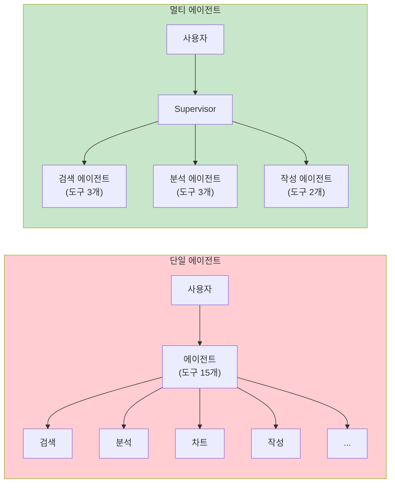
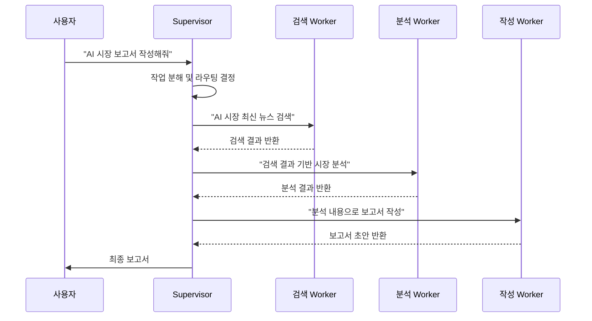
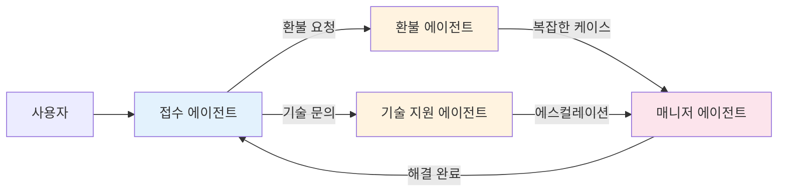
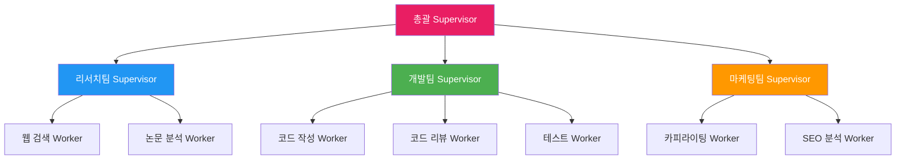
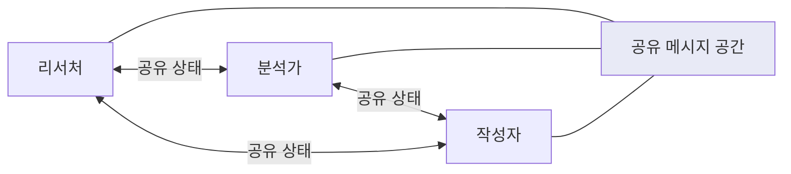
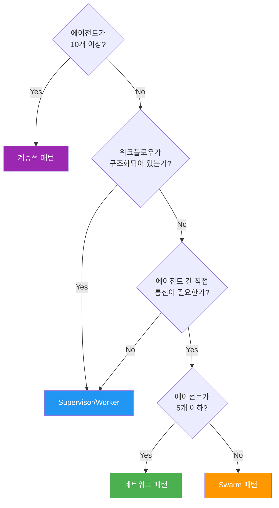

# 멀티 에이전트 아키텍처 패턴

> Supervisor/Worker, Swarm, 계층적 구조 등 멀티 에이전트 시스템의 핵심 아키텍처 패턴을 비교하고 각각의 적용 시나리오를 이해합니다.

## 개요

이 섹션에서는 AI 에이전트가 혼자가 아닌 **팀으로 협업**하는 멀티 에이전트 시스템의 주요 아키텍처 패턴을 살펴봅니다. 단일 에이전트의 한계를 이해하고, 여러 에이전트가 협력하는 네 가지 핵심 패턴 — Supervisor/Worker, Swarm, 계층적 구조, 네트워크 — 을 비교합니다.

**선수 지식**: [LangGraph StateGraph 기초](04-ch4-langgraph-stategraph-기초/01-01-langgraph-아키텍처-개관.md)에서 배운 그래프 기반 에이전트 구성, [조건 분기와 동적 라우팅](05-ch5-조건-분기와-동적-라우팅/01-01-조건부-엣지의-이해.md)의 라우팅 개념, 그리고 [서브그래프와 그래프 합성](05-ch5-조건-분기와-동적-라우팅/03-03-서브그래프와-그래프-합성.md)에서 다룬 서브그래프 패턴

**학습 목표**:
- 멀티 에이전트 시스템이 필요한 이유와 단일 에이전트의 한계를 설명할 수 있다
- Supervisor/Worker, Swarm, 계층적 구조, 네트워크 패턴의 차이를 비교할 수 있다
- 각 패턴의 적합한 사용 시나리오를 판단할 수 있다
- LangGraph에서 멀티 에이전트 패턴을 코드로 표현하는 기본 구조를 이해한다

## 왜 알아야 할까?

여러분이 회사에서 "AI로 시장 분석 보고서를 만들어주는 시스템"을 만든다고 상상해보세요. 이 시스템은 웹에서 최신 뉴스를 검색하고, 재무 데이터를 분석하고, 차트를 그리고, 최종 보고서를 작성해야 합니다. 하나의 에이전트에 이 모든 도구를 넣으면 어떻게 될까요?

도구가 15개, 20개로 늘어나면 LLM은 **어떤 도구를 언제 써야 할지** 혼란스러워집니다. 프롬프트는 길어지고, 정확도는 떨어지고, 디버깅은 악몽이 되죠. 이건 마치 한 사람에게 요리, 청소, 빨래, 장보기를 동시에 시키는 것과 같습니다.

멀티 에이전트 시스템은 이 문제를 **역할 분담**으로 해결합니다. 검색 전문가, 데이터 분석가, 차트 제작자, 보고서 작성자 — 각각의 전문가 에이전트가 자기 역할에 집중하고, 이들을 조율하는 구조가 있으면 훨씬 효과적이거든요. 2025년 LangChain의 벤치마크에 따르면, 복잡한 작업에서 멀티 에이전트 시스템이 단일 에이전트보다 **일관되게 높은 성능**을 보였습니다.

> 📊 **그림 1**: 단일 에이전트 vs 멀티 에이전트 시스템 비교



## 핵심 개념

### 개념 1: Supervisor/Worker 패턴 — 팀장과 팀원

> 💡 **비유**: 레스토랑의 주방을 떠올려보세요. 헤드 셰프(Supervisor)가 주문을 받아서 "파스타는 네가, 스테이크는 네가, 디저트는 네가" 하고 각 담당 요리사(Worker)에게 일을 배분합니다. 요리사들은 서로 직접 대화하지 않고, 완성된 요리를 헤드 셰프에게 전달합니다. 헤드 셰프는 모든 요리가 모이면 최종 플레이팅을 확인하고 서빙하죠. 이것이 바로 Hub-and-Spoke 구조 — 모든 소통이 중심(Hub)인 헤드 셰프를 거치는 방식입니다.

Supervisor/Worker는 멀티 에이전트 패턴 중 **가장 널리 쓰이는** 아키텍처입니다. 구조가 직관적이고 제어가 명확하거든요.

**핵심 구조:**
- **Supervisor**: 사용자 요청을 받아 분석하고, 적절한 Worker에게 위임하며, 결과를 종합합니다
- **Worker**: 각자 전문 도구와 프롬프트를 가진 전문가 에이전트입니다
- **통신**: Worker끼리 직접 소통하지 않고, 반드시 Supervisor를 거칩니다 (Hub-and-Spoke 구조)

Hub-and-Spoke란 자전거 바퀴를 떠올리면 됩니다. 바퀴의 중심(Hub)에서 각 바퀴살(Spoke)이 뻗어나가는 구조처럼, Supervisor가 중앙 허브 역할을 하고 각 Worker가 바퀴살처럼 연결되어 있는 형태입니다. 네트워크 토폴로지에서 차용된 용어로, **중앙 집중식 통신**의 대표적인 패턴이죠.

> 📊 **그림 2**: Supervisor/Worker 패턴의 통신 흐름



LangGraph 생태계에서는 `langgraph-supervisor` 라이브러리가 이 패턴을 간편하게 구현할 수 있도록 지원합니다. 핵심 아이디어는 Supervisor가 각 Worker를 **도구(tool)처럼** 호출하는 것인데요, 이를 **핸드오프(Handoff)** 라고 부릅니다. 개념적으로 표현하면 다음과 같습니다:

```python
# 개념적 의사 코드 — Supervisor/Worker 패턴의 핵심 구조
# (실제 API 사용법은 다음 섹션 15.2에서 다룹니다)

# 1. 각 Worker는 전문 도구와 프롬프트를 가진 독립 에이전트
researcher = Agent(
    tools=[web_search, news_api],
    name="researcher",
    prompt="최신 시장 동향을 검색하는 전문가"
)

analyst = Agent(
    tools=[data_analyzer, chart_generator],
    name="analyst",
    prompt="데이터를 분석하고 인사이트를 도출하는 전문가"
)

# 2. Supervisor는 Worker 목록을 받아 라우팅 결정
supervisor = Supervisor(
    agents=[researcher, analyst],
    prompt="사용자 요청에 따라 적절한 전문가에게 작업을 위임하세요."
)

# 3. Supervisor가 "researcher를 호출해야겠다"고 판단하면
#    내부적으로 transfer_to_researcher 같은 핸드오프 도구를 호출
```

> 🔥 **실무 팁**: Supervisor의 라우팅 로직은 결국 LLM의 **도구 호출(tool calling) 능력**에 의존합니다. Supervisor LLM이 "이 작업은 researcher에게 보내야겠다"고 판단하면, 내부적으로 `transfer_to_researcher`라는 도구를 호출하는 방식이죠. 그래서 Supervisor에 사용하는 모델의 도구 호출 정확도가 전체 시스템 품질에 직접적인 영향을 미칩니다.

### 개념 2: Swarm 패턴 — 자율적 군집

> 💡 **비유**: 개미 군집을 생각해보세요. 개미들에겐 중앙 사령관이 없습니다. 각 개미는 단순한 규칙("먹이 발견 → 페로몬 분비 → 동료 모집")만 따르는데, 이런 **로컬 규칙의 합**이 놀라울 정도로 정교한 집단 행동을 만들어냅니다. Swarm 패턴도 마찬가지로, 에이전트 간 **직접 핸드오프**를 통해 중앙 제어 없이 작업이 흘러갑니다.

Swarm 패턴은 2024년 10월 OpenAI가 발표한 실험적 프레임워크에서 대중화된 개념입니다. Supervisor 없이 에이전트들이 **서로에게 직접 제어권을 넘기는** 구조거든요.

**핵심 특징:**
- **탈중앙화**: 중앙 조율자 없이 에이전트 간 직접 핸드오프
- **루틴(Routine)**: 각 에이전트가 따르는 지시사항과 도구의 조합
- **핸드오프 함수**: 에이전트가 다른 에이전트 객체를 반환하여 제어권 이전
- **비영속적**: 호출 간 상태를 저장하지 않음 (필요시 외부 저장소 활용)

> 📊 **그림 3**: Swarm 패턴의 에이전트 간 핸드오프 흐름



Swarm 패턴의 핵심은 **핸드오프 도구**입니다. 각 에이전트가 "이 작업은 내가 할 게 아니라 다른 에이전트가 해야 해"라고 판단하면, 해당 에이전트로 제어권을 직접 넘기는 도구를 호출하는 방식이죠. 개념적으로 보면 이런 구조입니다:

```python
# 개념적 의사 코드 — Swarm 패턴의 핵심 구조
# (실제 create_handoff_tool API는 다음 섹션 15.2에서 다룹니다)

# 각 에이전트가 다른 에이전트로 제어권을 넘기는 핸드오프 도구를 보유
triage_agent = Agent(
    tools=[
        handoff(to="refund_agent", when="환불 처리가 필요한 경우"),
        handoff(to="tech_support", when="기술 지원이 필요한 경우"),
    ],
    name="triage_agent",
    prompt="고객 요청을 분류하여 적절한 담당자에게 연결하세요."
)

refund_agent = Agent(
    tools=[
        process_refund,
        handoff(to="manager", when="복잡한 환불 케이스"),
    ],
    name="refund_agent",
    prompt="환불 요청을 처리합니다."
)

# Supervisor가 없음 — 에이전트들이 자율적으로 핸드오프
```

Supervisor/Worker와의 가장 큰 차이는 **중앙 조율자의 부재**입니다. Supervisor 패턴에서는 항상 Supervisor에게 돌아왔다가 다음 Worker로 가지만, Swarm에서는 에이전트 A가 직접 에이전트 B로 제어권을 넘깁니다.

> ⚠️ **흔한 오해**: "Swarm이 항상 Supervisor보다 좋다"고 생각하기 쉽지만, 실제로는 그렇지 않습니다. Swarm은 에이전트 간 핸드오프마다 컨텍스트 "번역"이 발생하는데, LangChain 벤치마크에 따르면 이 번역 과정에서 정보 손실이 생겨 **구조화된 워크플로우에서는 Supervisor가 더 안정적**인 결과를 보였습니다.

### 개념 3: 계층적(Hierarchical) 패턴 — 조직도 구조

> 💡 **비유**: 대기업의 조직 구조를 떠올려보세요. CEO가 있고, 그 아래 각 부서의 VP가 있고, VP 아래 팀장이 있고, 팀장 아래 실무자가 있습니다. CEO는 VP에게 "마케팅 전략 수립해"라고 지시하고, VP는 다시 팀장들에게 세부 업무를 나누죠. 계층적 멀티 에이전트도 이런 **다층 위임 구조**입니다.

계층적 패턴은 Supervisor/Worker의 확장판입니다. **Supervisor가 또 다른 Supervisor를 관리**하는 중첩 구조를 만들 수 있거든요. 50개 이상의 에이전트가 필요한 엔터프라이즈 환경에서 사실상 유일하게 확장 가능한 패턴이라고 할 수 있습니다.

> 📊 **그림 4**: 계층적 멀티 에이전트 아키텍처



계층적 패턴의 개념적 구조는 이렇습니다:

```python
# 개념적 의사 코드 — 계층적 패턴의 핵심 구조
# (실제 create_supervisor API 활용은 다음 섹션 15.2에서 다룹니다)

# 하위 팀 Supervisor — 각자 전문 Worker들을 관리
research_team = Supervisor(
    agents=[web_searcher, paper_analyzer],
    prompt="리서치 관련 작업을 관리합니다."
)

dev_team = Supervisor(
    agents=[coder, reviewer, tester],
    prompt="개발 관련 작업을 관리합니다."
)

# 상위 총괄 Supervisor — 하위 Supervisor를 Worker처럼 사용!
top_supervisor = Supervisor(
    agents=[research_team, dev_team],  # Supervisor가 Worker 역할
    prompt="프로젝트 전체를 조율합니다."
)
```

핵심은 **하위 Supervisor가 컴파일되면 하나의 에이전트처럼 동작**한다는 점입니다. 상위 Supervisor 입장에서는 하위 팀의 내부 구조를 몰라도 됩니다.

**계층적 패턴의 장점:**
- **확장성**: 새로운 팀을 추가하려면 해당 레벨에 Supervisor + Worker를 추가하면 됨
- **관심사 분리**: 각 Supervisor는 자기 팀의 전문 영역만 이해하면 됨
- **컨텍스트 관리**: 상위 Supervisor는 세부 도구를 몰라도 되므로 프롬프트가 간결

### 개념 4: 네트워크(Network/Mesh) 패턴 — 자유로운 소통

> 💡 **비유**: 스타트업 초기 팀을 생각해보세요. 5명이 한 방에 모여 앉아서 누구든 누구에게나 자유롭게 의견을 주고받습니다. 디자이너가 바로 개발자한테 "이거 이렇게 되나요?" 물어보고, 개발자가 기획자한테 "이 기능 범위 좀 좁혀달라"고 하죠. 중간 관리자가 없어서 빠르지만, 인원이 늘면 혼란스러워집니다.

네트워크 패턴에서는 모든 에이전트가 **공유 메시지 공간**에서 소통합니다. 특정 라우터나 Supervisor 없이, 각 에이전트가 공유 상태를 보고 자기가 기여할 수 있는지 판단하죠.

> 📊 **그림 5**: 네트워크 패턴의 메시 통신 구조



LangGraph의 StateGraph로 이 패턴을 표현하면, 모든 노드에서 모든 노드로 전이 가능한 그래프가 됩니다:

```python
from typing import TypedDict, Annotated
from langgraph.graph import StateGraph, END
from langgraph.graph.message import add_messages

class SharedState(TypedDict):
    """모든 에이전트가 공유하는 메시지 공간"""
    messages: Annotated[list, add_messages]
    next_agent: str  # 라우팅 함수가 결정

def router(state: SharedState) -> str:
    """마지막 메시지를 분석하여 다음 에이전트 결정"""
    return state["next_agent"]

# 네트워크 그래프 — 모든 에이전트가 모든 에이전트로 전이 가능
graph = StateGraph(SharedState)
graph.add_node("researcher", researcher_node)
graph.add_node("analyst", analyst_node)
graph.add_node("writer", writer_node)

# 모든 노드에서 라우터를 통해 모든 노드로 이동 가능
for node in ["researcher", "analyst", "writer"]:
    graph.add_conditional_edges(node, router, {
        "researcher": "researcher",
        "analyst": "analyst",
        "writer": "writer",
        "end": END
    })
```

## 실습: 직접 해보기

네 가지 패턴의 차이를 코드로 체감해봅시다. 라이브러리를 사용하지 않고 순수 LangGraph StateGraph만으로 Supervisor/Worker 패턴의 기본 구조를 직접 구현합니다. 패턴의 **원리**를 이해하는 것이 목적이며, 실제 `langgraph-supervisor` 라이브러리를 활용한 구현은 [다음 섹션](15-ch15-supervisorworker-멀티-에이전트/02-02-langgraph-supervisor-활용.md)에서 다룹니다.

```python
# 라이브러리 없이 순수 LangGraph로 Supervisor/Worker 패턴 구현
# pip install langgraph langchain-core

from typing import TypedDict, Annotated
from langgraph.graph import StateGraph, START, END
from langgraph.graph.message import add_messages
from langchain_core.messages import HumanMessage, AIMessage

# --- 1단계: 간단한 도구 함수 정의 ---
def search_web(query: str) -> str:
    """웹 검색 시뮬레이션"""
    return f"[검색 결과] '{query}'에 대한 최신 정보: AI 에이전트 시장은 2026년 50% 성장 전망"

def analyze_data(data: str) -> str:
    """데이터 분석 시뮬레이션"""
    return f"[분석 결과] {data} → 핵심 인사이트: 성장률 50%, 주요 동력은 멀티 에이전트 시스템"

def write_report(content: str) -> str:
    """보고서 작성 시뮬레이션"""
    return f"[보고서]\n제목: AI 에이전트 시장 분석\n내용: {content}\n결론: 멀티 에이전트 시스템이 핵심 트렌드"


# --- 2단계: 상태 정의 ---
class TeamState(TypedDict):
    messages: Annotated[list, add_messages]
    current_task: str
    results: dict


# --- 3단계: Worker 노드 함수 ---
def researcher_node(state: TeamState) -> dict:
    """검색 Worker — 웹 검색 수행"""
    result = search_web(state["current_task"])
    return {
        "messages": [AIMessage(content=result, name="researcher")],
        "results": {**state.get("results", {}), "research": result}
    }

def analyst_node(state: TeamState) -> dict:
    """분석 Worker — 데이터 분석 수행"""
    research = state.get("results", {}).get("research", "")
    result = analyze_data(research)
    return {
        "messages": [AIMessage(content=result, name="analyst")],
        "results": {**state.get("results", {}), "analysis": result}
    }

def writer_node(state: TeamState) -> dict:
    """작성 Worker — 보고서 작성"""
    analysis = state.get("results", {}).get("analysis", "")
    result = write_report(analysis)
    return {
        "messages": [AIMessage(content=result, name="writer")],
        "results": {**state.get("results", {}), "report": result}
    }


# --- 4단계: Supervisor 노드 (간소화 버전) ---
TASK_SEQUENCE = ["researcher", "analyst", "writer"]

def supervisor_node(state: TeamState) -> dict:
    """Supervisor — 다음에 실행할 Worker 결정"""
    completed = list(state.get("results", {}).keys())

    # 순차적으로 Worker 배정
    next_idx = len(completed)

    if next_idx < len(TASK_SEQUENCE):
        next_worker = TASK_SEQUENCE[next_idx]
        return {"messages": [AIMessage(
            content=f"[Supervisor] 다음 작업: {next_worker}에게 위임",
            name="supervisor"
        )]}

    return {"messages": [AIMessage(
        content="[Supervisor] 모든 작업 완료. 최종 결과를 정리합니다.",
        name="supervisor"
    )]}

def route_from_supervisor(state: TeamState) -> str:
    """Supervisor의 라우팅 결정"""
    completed = list(state.get("results", {}).keys())
    next_idx = len(completed)
    if next_idx < len(TASK_SEQUENCE):
        return TASK_SEQUENCE[next_idx]
    return "end"


# --- 5단계: 그래프 구성 ---
graph = StateGraph(TeamState)

# 노드 추가
graph.add_node("supervisor", supervisor_node)
graph.add_node("researcher", researcher_node)
graph.add_node("analyst", analyst_node)
graph.add_node("writer", writer_node)

# 엣지 구성 — Supervisor가 중심 허브
graph.add_edge(START, "supervisor")
graph.add_conditional_edges("supervisor", route_from_supervisor, {
    "researcher": "researcher",
    "analyst": "analyst",
    "writer": "writer",
    "end": END
})

# 모든 Worker는 작업 후 Supervisor로 복귀 (Hub-and-Spoke!)
graph.add_edge("researcher", "supervisor")
graph.add_edge("analyst", "supervisor")
graph.add_edge("writer", "supervisor")

app = graph.compile()
```

이제 실행해봅시다:

```run:python
# 실행 (위의 그래프 구성 코드가 실행된 상태)
result = app.invoke({
    "messages": [HumanMessage(content="AI 에이전트 시장 분석 보고서를 만들어주세요")],
    "current_task": "AI 에이전트 시장 동향",
    "results": {}
})

# 결과 확인
for msg in result["messages"]:
    name = getattr(msg, "name", "user")
    print(f"[{name}] {msg.content[:80]}")
```

```output
[user] AI 에이전트 시장 분석 보고서를 만들어주세요
[supervisor] [Supervisor] 다음 작업: researcher에게 위임
[researcher] [검색 결과] 'AI 에이전트 시장 동향'에 대한 최신 정보: AI 에이전트 시장은 2026년 50% 성장 전망
[supervisor] [Supervisor] 다음 작업: analyst에게 위임
[analyst] [분석 결과] [검색 결과] 'AI 에이전트 시장 동향'에 대한 최신 정보: AI 에이전트 시장은 2026년 50%
[supervisor] [Supervisor] 다음 작업: writer에게 위임
[writer] [보고서]
[supervisor] [Supervisor] 모든 작업 완료. 최종 결과를 정리합니다.
```

실행 흐름을 보면, Supervisor가 순차적으로 researcher → analyst → writer에게 작업을 위임하고, 각 Worker가 완료 후 Supervisor로 복귀하는 **Hub-and-Spoke** 패턴이 명확히 보이죠? 이것이 Supervisor/Worker 패턴의 본질입니다.

이 실습에서는 라우팅을 `TASK_SEQUENCE` 리스트로 고정했지만, 실제 `langgraph-supervisor` 라이브러리에서는 **LLM이 동적으로 다음 Worker를 결정**합니다. 그 차이를 다음 섹션에서 직접 체험하게 됩니다.

## 더 깊이 알아보기

### 멀티 에이전트 시스템의 역사

멀티 에이전트 시스템(MAS)의 뿌리는 1980년대 **분산 인공지능(Distributed AI)** 연구로 거슬러 올라갑니다. MIT의 Marvin Minsky가 1986년 저서 *Society of Mind*에서 "지능은 단일 프로세스가 아니라, 수많은 단순한 에이전트들의 사회적 상호작용에서 나온다"고 주장한 것이 개념적 출발점이었죠.

실용적인 멀티 에이전트 아키텍처는 2003년 Google의 MapReduce 논문에서 큰 영감을 받았습니다. "문제를 작은 조각으로 나누고(Map), 결과를 합친다(Reduce)"는 아이디어가 Supervisor/Worker 패턴의 원형이거든요. 흥미롭게도, LangGraph의 내부 실행 엔진 이름이 **Pregel** — Google의 그래프 처리 시스템에서 따온 이름입니다.

LLM 기반 멀티 에이전트의 본격적인 시작은 2023년 AutoGen(Microsoft)과 CrewAI가 등장하면서부터입니다. 2024년 10월에는 OpenAI가 Swarm 프레임워크를 공개하며 "핸드오프" 패턴을 대중화했고, 2025년 2월 LangChain은 `langgraph-supervisor` 라이브러리를 출시하여 프로덕션 레벨의 계층적 멀티 에이전트를 본격 지원하기 시작했습니다.

> 💡 **알고 계셨나요?**: OpenAI의 Swarm은 사실 "교육용 프레임워크"로 발표되었습니다. 프로덕션 용도가 아닌, 멀티 에이전트의 핵심 개념을 이해시키기 위한 목적이었죠. 그 아이디어는 이후 OpenAI Agents SDK로 발전했고, "루틴(Routine) + 핸드오프(Handoff)"라는 Swarm의 핵심 추상화는 LangGraph를 포함한 거의 모든 멀티 에이전트 프레임워크에 영향을 미쳤습니다.

### 패턴 선택 의사결정 트리

실무에서 어떤 패턴을 선택할지 고민될 때, 아래 의사결정 흐름을 참고하세요:

> 📊 **그림 6**: 멀티 에이전트 패턴 선택 가이드



## 흔한 오해와 팁

> ⚠️ **흔한 오해**: "멀티 에이전트가 항상 단일 에이전트보다 좋다." 실제로 도구가 5개 이하이고 작업 흐름이 단순하다면, 단일 에이전트가 오히려 더 빠르고 정확합니다. 멀티 에이전트 시스템은 에이전트 간 통신 오버헤드가 존재하고, LLM 호출 횟수가 늘어나면 비용도 증가합니다. **복잡도가 충분히 높을 때만** 멀티 에이전트를 도입하세요.

> 💡 **알고 계셨나요?**: LangChain 팀은 최근 `create_supervisor` 라이브러리 대신 **도구 기반 직접 구현**을 더 추천하고 있습니다. 라이브러리가 추상화하는 부분이 "컨텍스트 엔지니어링"에 대한 세밀한 제어를 어렵게 만들 수 있기 때문인데요, 이 강좌에서는 패턴의 원리를 이해하기 위해 라이브러리를 먼저 배우고, 이후 세션에서 직접 구현하는 방법도 다룹니다.

> 🔥 **실무 팁**: 멀티 에이전트 시스템을 설계할 때 가장 중요한 원칙은 **"각 에이전트의 도구는 3~5개 이하로 유지하라"**는 것입니다. 도구가 너무 많으면 LLM의 도구 선택 정확도가 급격히 떨어집니다. 도구가 많다면 에이전트를 더 세분화하세요.

## 핵심 정리

| 패턴 | 통신 구조 | 장점 | 단점 | 적합한 시나리오 |
|------|-----------|------|------|----------------|
| **Supervisor/Worker** | Hub-and-Spoke (중앙 집중) | 제어 명확, 디버깅 용이 | Supervisor 병목 가능 | 구조화된 비즈니스 워크플로우 |
| **Swarm** | Peer-to-Peer (탈중앙화) | 유연한 핸드오프, 자율성 | 추적 어려움, 정보 손실 | 고객 서비스, 대화형 라우팅 |
| **계층적** | 다층 트리 구조 | 확장성, 관심사 분리 | 구축 복잡도, 레이턴시 | 대규모 엔터프라이즈 시스템 |
| **네트워크** | 메시(Mesh) 전체 연결 | 빠른 소통, 투명성 | 에이전트 수 제한적 | 소규모 협업, 브레인스토밍 |

## 다음 섹션 미리보기

이번 섹션에서 멀티 에이전트의 네 가지 핵심 패턴을 개념적으로 비교했다면, 다음 섹션 [langgraph-supervisor 활용](15-ch15-supervisorworker-멀티-에이전트/02-02-langgraph-supervisor-활용.md)에서는 `create_supervisor`와 `create_handoff_tool`을 실제로 import하여 **LLM 기반 Supervisor/Worker 시스템**을 처음부터 끝까지 구축합니다. 실제 API를 호출하는 Worker 에이전트를 만들고, Supervisor가 동적으로 라우팅하는 과정을 실습하게 됩니다.

## 참고 자료

- [LangGraph Multi-Agent Workflows (LangChain Blog)](https://blog.langchain.com/langgraph-multi-agent-workflows/) - 멀티 에이전트 워크플로우의 핵심 패턴(Supervisor, Collaboration, Hierarchical)을 공식적으로 설명하는 블로그 포스트
- [langgraph-supervisor GitHub Repository](https://github.com/langchain-ai/langgraph-supervisor-py) - Supervisor/Worker 패턴을 간편하게 구현하는 공식 라이브러리의 소스 코드와 예제
- [LangGraph Supervisor: A Library for Hierarchical Multi-Agent Systems (Changelog)](https://changelog.langchain.com/announcements/langgraph-supervisor-a-library-for-hierarchical-multi-agent-systems) - langgraph-supervisor 라이브러리의 출시 공지와 설계 철학
- [Hierarchical Agent Teams Tutorial (LangGraph Docs)](https://langchain-ai.github.io/langgraph/tutorials/multi_agent/hierarchical_agent_teams/) - 계층적 멀티 에이전트 팀을 LangGraph로 구현하는 공식 튜토리얼
- [OpenAI Swarm GitHub Repository](https://github.com/openai/swarm) - 핸드오프 기반 멀티 에이전트 패턴의 원형을 보여주는 OpenAI의 교육용 프레임워크
- [Benchmarking Multi-Agent Architectures (LangChain Blog)](https://blog.langchain.com/benchmarking-multi-agent-architectures/) - 다양한 멀티 에이전트 아키텍처의 성능을 비교한 벤치마크 결과

---
### 🔗 Related Sessions
- [stategraph](04-ch4-langgraph-stategraph-기초/01-01-langgraph-아키텍처-개관.md) (prerequisite)
- [subgraph](05-ch5-조건-분기와-동적-라우팅/03-03-서브그래프와-그래프-합성.md) (prerequisite)
- [create_react_agent](02-ch2-react-패턴과-에이전트-루프/04-04-langgraph의-create-react-agent.md) (prerequisite)
