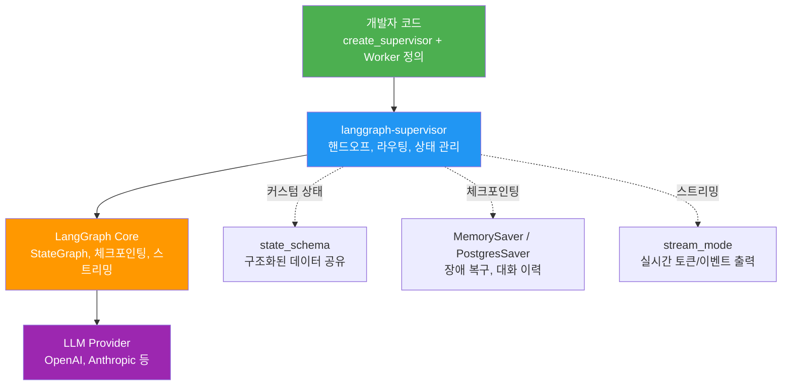
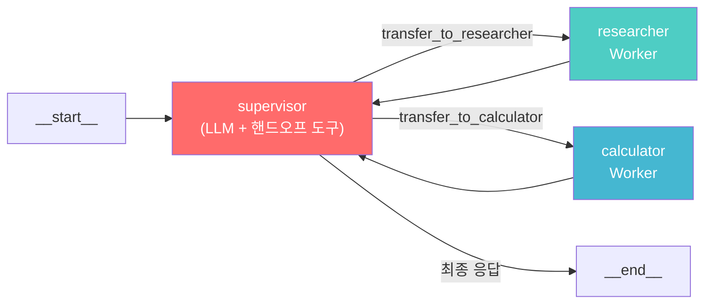
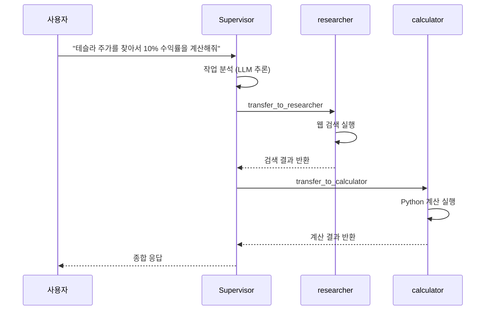
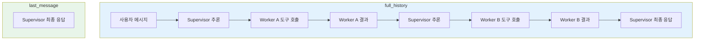
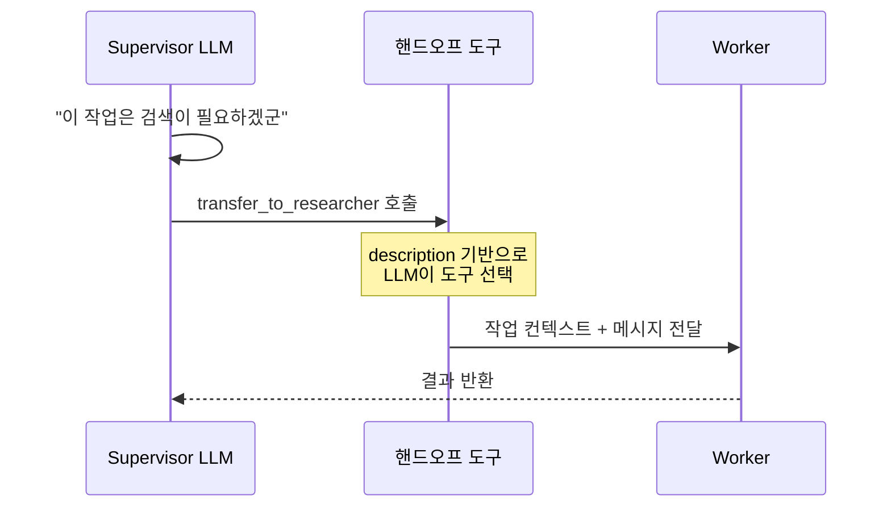
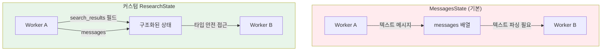
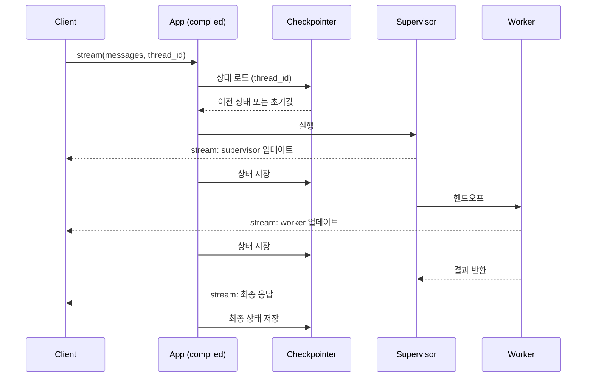
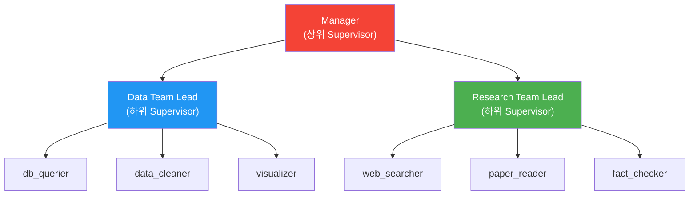

# langgraph-supervisor 활용

> LangGraph의 공식 Supervisor 라이브러리로 멀티 에이전트 오케스트레이션을 빠르게 구축하고, 커스텀 상태·체크포인팅·스트리밍까지 실전 적용하는 방법을 배웁니다.

## 개요

이 섹션에서는 `langgraph-supervisor` 패키지를 사용해 Supervisor/Worker 패턴을 실제 코드로 구현하는 방법을 다룹니다. 이전 섹션에서 배운 Supervisor 패턴의 개념을 LangGraph의 공식 라이브러리가 어떻게 추상화하는지 살펴보고, 단순 프로토타입을 넘어 **커스텀 상태 스키마, 체크포인팅, 스트리밍, 계층형 Supervisor**까지 프로덕션 수준의 구성을 익힙니다.

**선수 지식**: [01. Supervisor 패턴 소개](15-ch15-supervisorworker-멀티-에이전트/01-01-supervisor-패턴-소개.md)에서 배운 Supervisor/Worker 아키텍처 개념, LangGraph StateGraph 기초, `create_react_agent` 사용 경험
**학습 목표**:
- `create_supervisor` 함수의 구조와 매개변수를 이해한다
- Worker 에이전트를 생성하고 Supervisor에 등록하는 방법을 익힌다
- `output_mode`에 따른 출력 전략 차이를 설명할 수 있다
- 핸드오프 도구 커스터마이징으로 Worker 라우팅을 제어한다
- **커스텀 상태 스키마로 Worker 간 구조화된 데이터를 공유한다**
- **체크포인팅으로 장시간 워크플로를 안전하게 관리한다**
- **스트리밍 모드로 실시간 진행 상황을 모니터링한다**

## 왜 알아야 할까?

Supervisor/Worker 패턴을 밑바닥부터 구현하면 상태 관리, 라우팅 로직, 에러 처리를 모두 직접 작성해야 합니다. 마치 웹 서버를 소켓부터 만드는 것과 같죠. `langgraph-supervisor`는 이 반복적인 보일러플레이트를 제거하고, **핵심 로직 — "어떤 Worker가 무엇을 하는가"**에만 집중할 수 있게 해줍니다.

하지만 프로덕션에서는 "빠르게 만들기"만으로는 부족합니다. Worker가 중간에 실패하면? 10분짜리 워크플로를 처음부터 다시 돌려야 한다면? 사용자에게 "처리 중"이라는 피드백 없이 30초를 기다리게 한다면? 이 섹션에서는 이런 실전 문제들을 `langgraph-supervisor`의 고급 기능으로 해결하는 방법까지 다룹니다.

> 📊 **그림 1**: langgraph-supervisor의 추상화 계층과 프로덕션 기능



## 핵심 개념

### 개념 1: `create_supervisor` 함수 구조

> 💡 **비유**: `create_supervisor`는 **회사 설립 등기**와 같습니다. 대표(LLM)가 누구인지, 어떤 부서(Workers)가 있는지, 회사의 미션(프롬프트)이 무엇인지를 한 번에 등록하면, 나머지 조직 운영 체계는 자동으로 갖춰지는 거죠.

`langgraph-supervisor`의 핵심은 `create_supervisor` 함수 하나에 담겨 있습니다. 이 함수는 Supervisor 에이전트를 구성하는 모든 설정을 매개변수로 받아, 실행 가능한 `StateGraph`를 반환합니다.

```python
from langgraph_supervisor import create_supervisor
from langchain_openai import ChatOpenAI

# Supervisor 생성 - 이것이 전부입니다
supervisor = create_supervisor(
    model=ChatOpenAI(model="gpt-4o"),           # 의사결정 LLM
    agents=[researcher, calculator],             # Worker 에이전트 리스트
    prompt="당신은 팀 리더입니다. 적절한 팀원에게 작업을 위임하세요.",
    output_mode="full_history",                  # 출력 전략
)

# 컴파일 후 실행
app = supervisor.compile()
result = app.invoke({"messages": [{"role": "user", "content": "질문"}]})
```

주목할 점은 `create_supervisor`가 **컴파일되지 않은 StateGraph**를 반환한다는 것입니다. 이는 의도적인 설계인데요, 컴파일 전에 체크포인터(checkpointer)나 추가 노드를 붙일 수 있도록 유연성을 남겨두기 위해서입니다.

> 📊 **그림 2**: create_supervisor의 내부 StateGraph 구조



핵심 매개변수를 정리하면 다음과 같습니다:

| 매개변수 | 타입 | 설명 |
|----------|------|------|
| `model` | `BaseChatModel` | Supervisor의 의사결정 LLM |
| `agents` | `list` | Worker 에이전트 리스트 |
| `prompt` | `str` | Supervisor의 시스템 프롬프트 |
| `output_mode` | `str` | `"full_history"` 또는 `"last_message"` |
| `supervisor_name` | `str` | Supervisor 노드 이름 (기본: `"supervisor"`) |
| `state_schema` | `Type` | 커스텀 상태 스키마 (기본: `MessagesState`) |
| `tools` | `list` | Supervisor에 추가할 도구 (핸드오프 도구 포함) |

### 개념 2: Worker 생성과 등록

> 💡 **비유**: Worker를 만드는 건 **전문가를 채용**하는 것과 같습니다. 각 전문가에게 이름표를 달아주고, 어떤 도구를 쓸 수 있는지 정해주고, 업무 지침을 주면 됩니다. Supervisor는 이 이름표를 보고 적절한 전문가에게 일을 배분하죠.

Worker는 `create_react_agent`로 만든 ReAct 에이전트이거나, 커스텀 StateGraph일 수 있습니다. 핵심은 **`name` 속성**이 반드시 있어야 한다는 점입니다 — Supervisor가 이 이름으로 Worker를 호출하거든요.

```python
from langgraph.prebuilt import create_react_agent
from langchain_openai import ChatOpenAI
from langchain_community.tools import TavilySearchResults

# Worker 1: 웹 검색 전문가
researcher = create_react_agent(
    model=ChatOpenAI(model="gpt-4o"),
    tools=[TavilySearchResults(max_results=3)],
    prompt="당신은 웹 검색 전문가입니다. 정확한 최신 정보를 찾아주세요.",
    name="researcher",  # 필수! Supervisor가 이 이름으로 호출
)

# Worker 2: 계산 전문가 — 비용 절약을 위해 작은 모델
calculator = create_react_agent(
    model=ChatOpenAI(model="gpt-4o-mini"),
    tools=[PythonREPLTool()],
    prompt="당신은 수학 계산 전문가입니다. Python으로 정확히 계산하세요.",
    name="calculator",
)

# Worker 3: 커스텀 StateGraph도 Worker로 등록 가능
from langgraph.graph import StateGraph, MessagesState

def custom_node(state: MessagesState):
    # 커스텀 로직 수행
    return {"messages": [AIMessage(content="커스텀 처리 완료")]}

custom_worker = StateGraph(MessagesState)
custom_worker.add_node("process", custom_node)
custom_worker.set_entry_point("process")
custom_worker.set_finish_point("process")
custom_worker = custom_worker.compile(name="custom_processor")  # name 필수
```

Worker를 다른 LLM으로 구성할 수 있다는 점에 주목하세요. Supervisor는 강력한 모델(GPT-4o)을 쓰고, 단순 작업 Worker는 저렴한 모델(GPT-4o-mini)을 쓰는 것이 비용 최적화의 핵심 전략입니다. 더 나아가, 커스텀 StateGraph를 Worker로 등록하면 LLM을 아예 사용하지 않는 결정론적 Worker도 만들 수 있습니다.

> 📊 **그림 3**: Worker 등록과 핸드오프 시퀀스



### 개념 3: `output_mode`와 상태 관리 전략

> 💡 **비유**: `output_mode`는 **회의록 작성 방식**을 선택하는 것과 같습니다. `full_history`는 모든 발언을 기록하는 전체 회의록이고, `last_message`는 최종 결론만 정리한 요약본이죠.

`output_mode`는 Supervisor가 최종 결과를 어떤 형태로 반환할지를 결정합니다. 이 선택은 토큰 비용, 디버깅 용이성, 후처리 복잡도에 직접적인 영향을 미칩니다.

**`full_history` (기본값)** — 모든 메시지가 순서대로 포함됩니다:

```python
supervisor = create_supervisor(
    model=llm,
    agents=[researcher, calculator],
    prompt="팀 리더 프롬프트",
    output_mode="full_history",  # 모든 대화 이력 반환
)
```

**`last_message`** — Supervisor의 최종 응답 메시지만 반환:

```python
supervisor = create_supervisor(
    model=llm,
    agents=[researcher, calculator],
    prompt="팀 리더 프롬프트",
    output_mode="last_message",  # 최종 응답만 반환
)
```

> 📊 **그림 4**: output_mode에 따른 반환 데이터 비교



| 모드 | 토큰 비용 | 디버깅 | 후처리 | 적합한 상황 |
|------|-----------|--------|--------|------------|
| `full_history` | 높음 | 용이 | 복잡 | 개발/디버깅, 감사 로그 필요 |
| `last_message` | 낮음 | 어려움 | 간단 | 프로덕션, API 응답 |

> 🔥 **실무 팁**: 개발 중에는 `full_history`로 동작을 확인하고, 프로덕션에서는 `last_message`로 전환하는 패턴이 일반적입니다. 환경 변수로 분기하면 편리합니다:
> ```python
> import os
> mode = "full_history" if os.getenv("DEBUG") else "last_message"
> ```

### 개념 4: 핸드오프 도구 커스터마이징

> 💡 **비유**: 핸드오프 도구는 **사내 업무 이관 양식**과 같습니다. 기본 양식도 쓸 수 있지만, 부서마다 특별한 이관 절차가 필요하면 양식을 커스터마이징하죠. 예를 들어 "보안팀에 넘길 때는 반드시 위험 등급을 명시할 것" 같은 규칙을 추가할 수 있습니다.

기본적으로 `create_supervisor`는 각 Worker에 대해 `transfer_to_{worker_name}` 형태의 핸드오프 도구를 자동 생성합니다. 하지만 더 세밀한 제어가 필요할 때, `create_handoff_tool`을 직접 정의할 수 있습니다.

```python
from langgraph_supervisor import create_handoff_tool

# 커스텀 핸드오프 도구 — 설명을 구체적으로 지정
research_handoff = create_handoff_tool(
    agent_name="researcher",
    description="최신 뉴스, 통계, 사실 확인이 필요할 때 사용하세요. "
                "역사적 사실이나 일반 상식은 직접 답하세요.",
)

calc_handoff = create_handoff_tool(
    agent_name="calculator",
    description="복잡한 수학 계산, 통계 분석, 데이터 처리가 필요할 때 사용하세요. "
                "단순 사칙연산은 직접 수행하세요.",
)

# 커스텀 핸드오프 도구를 Supervisor의 tools에 추가
supervisor = create_supervisor(
    model=llm,
    agents=[researcher, calculator],
    prompt="팀 리더 프롬프트",
    tools=[research_handoff, calc_handoff],  # 커스텀 핸드오프
)
```

핸드오프 도구의 `description`이 중요한 이유는, Supervisor LLM이 이 설명을 읽고 어떤 Worker에게 위임할지 결정하기 때문입니다. description이 모호하면 잘못된 Worker에게 작업이 전달될 수 있어요.

> 📊 **그림 5**: 핸드오프 도구의 역할



### 개념 5: 커스텀 상태 스키마로 구조화된 데이터 공유

> 💡 **비유**: 기본 `MessagesState`는 **구두 소통** — 모든 정보가 텍스트 메시지에 담겨 전달됩니다. 커스텀 상태 스키마는 **공유 대시보드**를 도입하는 것과 같죠. "매출 데이터는 여기, 환율은 저기"라고 구조화된 칸에 값을 적어두면, 어떤 Worker든 정확히 필요한 데이터에 접근할 수 있습니다.

기본 `MessagesState`만으로는 Worker 간에 구조화된 데이터를 공유하기 어렵습니다. 메시지 텍스트를 파싱해야 하니까요. `state_schema` 매개변수로 커스텀 상태를 정의하면 이 문제를 해결할 수 있습니다.

```python
from langgraph.graph import MessagesState
from typing import Annotated, Any
import operator

# 커스텀 상태: 메시지 + 구조화된 데이터
class ResearchState(MessagesState):
    # 검색 결과를 구조화하여 저장
    search_results: Annotated[list[dict], operator.add]  # 누적 방식
    final_analysis: str  # 마지막 값 덮어쓰기
    confidence_score: float  # 신뢰도 점수

# 커스텀 상태를 사용하는 Supervisor
supervisor = create_supervisor(
    model=ChatOpenAI(model="gpt-4o"),
    agents=[researcher, analyst],
    prompt="팀 리더 프롬프트",
    state_schema=ResearchState,  # 커스텀 상태 스키마
)
```

`Annotated[list[dict], operator.add]`에서 `operator.add`는 **리듀서(reducer)**입니다. 여러 Worker가 같은 필드에 값을 쓸 때, 새 값으로 덮어쓸지(`default`), 리스트에 누적할지(`operator.add`)를 결정하죠.

```python
# Worker에서 커스텀 상태 필드를 업데이트하는 도구
def save_search_result(query: str, result: str, source: str) -> str:
    """검색 결과를 구조화하여 상태에 저장합니다."""
    # 이 도구의 반환값은 메시지로 들어가고,
    # 상태 업데이트는 Worker 노드 함수에서 직접 수행
    return f"검색 완료: {query} → {result} (출처: {source})"

# 커스텀 Worker 노드에서 상태 직접 조작
def analyst_node(state: ResearchState):
    results = state.get("search_results", [])
    # 구조화된 데이터에 직접 접근 — 메시지 파싱 불필요
    analysis = f"{len(results)}건의 검색 결과를 분석한 결과..."
    return {
        "messages": [AIMessage(content=analysis)],
        "final_analysis": analysis,
        "confidence_score": 0.85,
    }
```

> 📊 **그림 6**: 기본 상태 vs 커스텀 상태의 데이터 흐름 비교



### 개념 6: 체크포인팅과 스트리밍

프로덕션 환경에서는 두 가지 기능이 필수적입니다: **체크포인팅**(중단 시 복구)과 **스트리밍**(실시간 출력).

#### 체크포인팅

체크포인터를 추가하면 각 노드 실행 후 상태가 자동 저장됩니다. 장애가 발생해도 마지막 체크포인트에서 재개할 수 있고, `thread_id`로 멀티턴 대화를 관리할 수 있습니다.

```python
from langgraph.checkpoint.memory import MemorySaver

# 1. 체크포인터 생성 (프로덕션에서는 PostgresSaver 권장)
checkpointer = MemorySaver()

# 2. 컴파일 시 체크포인터 연결
supervisor = create_supervisor(
    model=ChatOpenAI(model="gpt-4o"),
    agents=[researcher, calculator],
    prompt="팀 리더 프롬프트",
)
app = supervisor.compile(checkpointer=checkpointer)

# 3. thread_id로 대화 세션 관리
config = {"configurable": {"thread_id": "user-session-001"}}

# 첫 번째 질문
result1 = app.invoke(
    {"messages": [{"role": "user", "content": "삼성전자 매출 찾아줘"}]},
    config=config,  # 이 thread에 상태 저장
)

# 같은 thread_id로 후속 질문 — 이전 대화 맥락 유지
result2 = app.invoke(
    {"messages": [{"role": "user", "content": "그러면 영업이익률은?"}]},
    config=config,  # 이전 대화 이력 자동 로드
)
```

#### 스트리밍

`stream` 메서드로 각 노드의 실행 결과를 실시간으로 받을 수 있습니다. 사용자에게 "지금 검색 중입니다" 같은 피드백을 제공할 때 필수적이죠.

```python
# stream_mode="updates"로 노드별 상태 변경만 수신
for chunk in app.stream(
    {"messages": [{"role": "user", "content": "환율 분석해줘"}]},
    config=config,
    stream_mode="updates",
):
    # chunk = {"node_name": {"messages": [...]}}
    for node_name, state_update in chunk.items():
        print(f"[{node_name}] 실행 완료")
        if "messages" in state_update:
            last_msg = state_update["messages"][-1]
            print(f"  → {last_msg.content[:80]}...")
```

> 📊 **그림 7**: 체크포인팅과 스트리밍의 동작 흐름



### 개념 7: Supervisor 프롬프트 설계

> 💡 **비유**: Supervisor 프롬프트는 **팀장의 업무 매뉴얼**입니다. "이런 요청이 오면 이 팀원에게", "이런 상황에서는 직접 답변" 같은 의사결정 기준을 명확히 적어두는 거죠. 매뉴얼이 모호하면 팀장이 매번 다른 판단을 내리게 됩니다.

Supervisor의 프롬프트는 전체 시스템의 행동을 결정하는 가장 중요한 요소입니다. 좋은 프롬프트는 **역할, 팀원 소개, 위임 규칙, 응답 규칙** 네 가지 요소를 포함해야 합니다:

```python
supervisor_prompt = """당신은 AI 리서치 팀의 팀장입니다.

## 역할
사용자의 요청을 분석하고, 적절한 팀원에게 작업을 위임하세요.

## 팀원 소개
- researcher: 웹 검색, 최신 정보 조회, 사실 확인 담당
- calculator: 수학 계산, 데이터 분석, 통계 처리 담당

## 위임 규칙
1. 최신 정보가 필요하면 → researcher에게 먼저 위임
2. 계산이 필요하면 → calculator에게 위임
3. 검색 결과를 바탕으로 계산이 필요하면 → researcher → calculator 순서
4. 일반적인 질문은 직접 답변 (불필요한 위임 금지)
5. Worker 결과가 불충분하면 같은 Worker를 재호출하거나 다른 Worker에게 보완 요청

## 응답 규칙
- 모든 팀원의 결과를 종합하여 최종 답변을 작성하세요
- 출처가 있는 정보는 반드시 출처를 명시하세요
- 답변은 한국어로 작성하세요
"""
```

프롬프트 설계의 핵심은 **명확한 위임 기준**입니다. LLM이 "이 작업은 누구에게?"라는 질문에 즉시 답할 수 있어야 합니다.

2023년 AutoGPT의 등장 이후, "에이전트에게 모든 것을 맡기자"는 접근이 유행했지만, 과도한 자율성은 오히려 비용 폭발과 무한 루프를 초래했습니다. 이 경험에서 "명확한 규칙 기반 위임"이 더 효과적이라는 교훈을 얻게 되었고, 현재의 Supervisor 프롬프트 설계 원칙으로 자리잡았죠.

## 실습: 프로덕션급 리서치 Supervisor 시스템

지금까지 배운 개념을 모두 결합하여, 커스텀 상태 + 체크포인팅 + 스트리밍을 갖춘 프로덕션급 Supervisor 시스템을 만들어 보겠습니다.

```python
# 프로덕션급 리서치 + 계산 Supervisor 시스템
from langgraph_supervisor import create_supervisor, create_handoff_tool
from langgraph.prebuilt import create_react_agent
from langgraph.graph import MessagesState
from langgraph.checkpoint.memory import MemorySaver
from langchain_openai import ChatOpenAI
from langchain_community.tools import TavilySearchResults
from typing import Annotated
import operator

# === 1. 커스텀 상태 스키마 ===
class TeamState(MessagesState):
    """Worker 간 구조화된 데이터 공유를 위한 상태"""
    search_results: Annotated[list[dict], operator.add]  # 검색 결과 누적
    task_log: Annotated[list[str], operator.add]          # 작업 이력 추적

# === 2. 도구 정의 ===
search_tool = TavilySearchResults(max_results=3)

def calculate(expression: str) -> str:
    """수학 표현식을 안전하게 계산합니다."""
    try:
        allowed_names = {"abs": abs, "round": round, "min": min, "max": max}
        result = eval(expression, {"__builtins__": {}}, allowed_names)
        return f"계산 결과: {expression} = {result}"
    except Exception as e:
        return f"계산 오류: {e}"

# === 3. Worker 생성 ===
researcher = create_react_agent(
    model=ChatOpenAI(model="gpt-4o"),
    tools=[search_tool],
    prompt="당신은 웹 검색 전문가입니다. 최신 정보를 정확하게 찾아주세요. "
           "검색 결과에서 핵심 수치와 출처를 반드시 포함하세요.",
    name="researcher",
)

calculator = create_react_agent(
    model=ChatOpenAI(model="gpt-4o-mini"),  # 비용 최적화
    tools=[calculate],
    prompt="당신은 수학 계산 전문가입니다. "
           "주어진 수치를 정확하게 계산하고, 계산 과정을 설명하세요.",
    name="calculator",
)

# === 4. 커스텀 핸드오프 도구 ===
research_handoff = create_handoff_tool(
    agent_name="researcher",
    description="최신 뉴스, 실시간 데이터, 사실 확인이 필요할 때 사용. "
                "역사적 사실이나 상식은 직접 답변할 것.",
)

calc_handoff = create_handoff_tool(
    agent_name="calculator",
    description="복잡한 수학 계산, 통계 분석, 비율 계산이 필요할 때 사용. "
                "단순 사칙연산은 직접 수행할 것.",
)

# === 5. Supervisor 생성 ===
supervisor = create_supervisor(
    model=ChatOpenAI(model="gpt-4o"),
    agents=[researcher, calculator],
    prompt="""당신은 AI 리서치 팀의 팀장입니다.

## 팀원
- researcher: 웹 검색, 최신 정보 조회
- calculator: 수학 계산, 데이터 분석

## 규칙
1. 정보 검색이 필요하면 researcher에게 위임
2. 계산이 필요하면 calculator에게 위임
3. 검색 → 계산 순서가 필요하면 순차적으로 위임
4. 일반 질문은 직접 답변
5. Worker 결과가 불충분하면 재호출 허용 (최대 2회)
6. 최종 답변은 한국어로, 출처를 포함하여 작성
""",
    tools=[research_handoff, calc_handoff],
    output_mode="full_history",
    state_schema=TeamState,
)

# === 6. 체크포인팅 + 컴파일 ===
checkpointer = MemorySaver()
app = supervisor.compile(checkpointer=checkpointer)

# === 7. 스트리밍 실행 ===
config = {"configurable": {"thread_id": "analysis-session-001"}}

# 스트리밍으로 실행하여 각 단계를 실시간 모니터링
for chunk in app.stream(
    {"messages": [{"role": "user",
                   "content": "2024년 삼성전자 매출액을 찾아서, 전년 대비 성장률을 계산해줘"}]},
    config=config,
    stream_mode="updates",
):
    for node_name, update in chunk.items():
        print(f"[{node_name}] 노드 실행 완료")

# 후속 질문 — 이전 대화 맥락 자동 유지
result = app.invoke(
    {"messages": [{"role": "user",
                   "content": "그러면 영업이익률도 같은 방식으로 분석해줘"}]},
    config=config,  # 같은 thread_id → 맥락 유지
)
```

실행 흐름을 시뮬레이션해보겠습니다:

```run:python
# 프로덕션급 Supervisor 실행 시뮬레이션
print("=== 스트리밍 모드 실행 시뮬레이션 ===\n")

stream_events = [
    ("supervisor", "작업 분석 → researcher에게 매출 검색 위임"),
    ("researcher", "Tavily 검색 실행 → 2024 삼성전자 매출: 300.9조원"),
    ("supervisor", "검색 결과 수신 → calculator에게 성장률 계산 위임"),
    ("calculator", "eval('(300.9 - 258.9) / 258.9 * 100') = 16.2%"),
    ("supervisor", "최종 응답 생성 완료"),
]

for node, detail in stream_events:
    print(f"  [{node}] 노드 실행 완료")
    print(f"    → {detail}")

print("\n=== 후속 질문 (thread_id로 맥락 유지) ===\n")
print("  사용자: '그러면 영업이익률도 같은 방식으로 분석해줘'")
print("  Supervisor: 이전 대화에서 삼성전자 컨텍스트 자동 로드")
print("  → researcher 재호출 없이 기존 검색 결과 활용 가능")
```

```output
=== 스트리밍 모드 실행 시뮬레이션 ===

  [supervisor] 노드 실행 완료
    → 작업 분석 → researcher에게 매출 검색 위임
  [researcher] 노드 실행 완료
    → Tavily 검색 실행 → 2024 삼성전자 매출: 300.9조원
  [supervisor] 노드 실행 완료
    → 검색 결과 수신 → calculator에게 성장률 계산 위임
  [calculator] 노드 실행 완료
    → eval('(300.9 - 258.9) / 258.9 * 100') = 16.2%
  [supervisor] 노드 실행 완료
    → 최종 응답 생성 완료

=== 후속 질문 (thread_id로 맥락 유지) ===

  사용자: '그러면 영업이익률도 같은 방식으로 분석해줘'
  Supervisor: 이전 대화에서 삼성전자 컨텍스트 자동 로드
  → researcher 재호출 없이 기존 검색 결과 활용 가능
```

실습 코드의 핵심 포인트를 짚어보면:

1. **커스텀 상태**: `TeamState`로 검색 결과와 작업 로그를 구조화하여 Worker 간 공유
2. **Worker별 다른 모델**: `researcher`는 GPT-4o, `calculator`는 GPT-4o-mini — 비용 최적화
3. **커스텀 핸드오프**: 명확한 description으로 Supervisor의 라우팅 정확도 향상
4. **체크포인팅**: `thread_id`로 멀티턴 대화 관리, 장애 시 복구 가능
5. **스트리밍**: `stream_mode="updates"`로 각 노드 실행을 실시간 모니터링

## 더 깊이 알아보기

### langgraph-supervisor의 탄생 배경

`langgraph-supervisor`는 2024년 중반 LangChain 팀이 발표한 패키지입니다. 그 이전에는 멀티 에이전트 시스템을 구축하려면 LangGraph의 `StateGraph`를 직접 설계하고, 노드 간 라우팅과 조건부 엣지를 수작업으로 연결해야 했습니다.

LangChain 팀이 커뮤니티에서 가장 많이 요청받은 패턴을 분석한 결과, **Supervisor/Worker가 압도적 1위**였다고 합니다. 이에 "가장 많이 쓰는 패턴은 한 줄로 만들 수 있어야 한다"는 철학으로 이 라이브러리를 설계했죠. 내부적으로는 꽤 복잡한 StateGraph가 구성되지만, 사용자는 `create_supervisor` 한 줄로 이 모든 것을 얻을 수 있습니다.

재미있는 것은, 이 접근법이 웹 프레임워크의 진화와 비슷하다는 점입니다. CGI → Servlet → Spring Boot로 진화하면서 보일러플레이트가 사라진 것처럼, LangGraph도 저수준 API → 고수준 추상화로 빠르게 발전하고 있습니다.

### 계층형 Supervisor 패턴

Worker가 5개를 넘어가면 Supervisor 하나로는 라우팅 정확도가 떨어집니다. 이때 **Supervisor의 Worker가 또 다른 Supervisor**인 계층형 구조를 사용합니다:

```python
# 하위 Supervisor: 데이터팀
data_team = create_supervisor(
    model=ChatOpenAI(model="gpt-4o"),
    agents=[db_querier, data_cleaner, visualizer],
    prompt="데이터 처리 팀 리더. DB 조회, 전처리, 시각화 담당.",
    supervisor_name="data_team_lead",
)
data_team_compiled = data_team.compile(name="data_team")

# 하위 Supervisor: 리서치팀
research_team = create_supervisor(
    model=ChatOpenAI(model="gpt-4o"),
    agents=[web_searcher, paper_reader, fact_checker],
    prompt="리서치 팀 리더. 웹 검색, 논문 분석, 팩트체크 담당.",
    supervisor_name="research_team_lead",
)
research_team_compiled = research_team.compile(name="research_team")

# 상위 Supervisor: 총괄 매니저
manager = create_supervisor(
    model=ChatOpenAI(model="gpt-4o"),
    agents=[data_team_compiled, research_team_compiled],
    prompt="프로젝트 총괄 매니저. 데이터팀과 리서치팀을 조율.",
)
app = manager.compile()
```

> 📊 **그림 8**: 계층형 Supervisor 아키텍처



## 흔한 오해와 팁

> ⚠️ **흔한 오해**: "Worker가 많을수록 시스템이 강력해진다"고 생각하기 쉽지만, Worker가 늘어나면 Supervisor의 의사결정 복잡도가 기하급수적으로 증가합니다. 실무에서는 3~5개의 명확한 역할을 가진 Worker가 최적이며, 그 이상은 계층형 Supervisor(Supervisor의 Supervisor)를 고려하세요.

> 💡 **알고 계셨나요?**: `langgraph-supervisor`의 핸드오프 메커니즘은 OpenAI의 Swarm 프레임워크에서 영감을 받았습니다. Swarm이 2024년 10월 공개한 "핸드오프" 개념 — 에이전트가 도구 호출로 다른 에이전트에게 제어를 넘기는 패턴 — 을 LangGraph의 StateGraph 위에 구현한 것이죠. 다만 Swarm은 실험적 프로젝트로 남은 반면, `langgraph-supervisor`는 프로덕션을 목표로 설계되었다는 차이가 있습니다.

> 🔥 **실무 팁**: Worker의 `name` 속성은 핸드오프 도구의 함수명(`transfer_to_{name}`)으로 직접 사용됩니다. 따라서 이름은 영문 소문자 + 언더스코어로 짓고, LLM이 이해하기 쉬운 의미 있는 이름을 사용하세요. `worker_1` 대신 `data_analyst`, `code_reviewer` 같은 이름이 Supervisor의 라우팅 정확도를 높여줍니다.

> ⚠️ **흔한 오해**: `MemorySaver`를 프로덕션에 쓰면 안 됩니다. 인메모리 저장이라 프로세스 재시작 시 모든 상태가 사라집니다. 프로덕션에서는 `langgraph-checkpoint-postgres`의 `PostgresSaver`를 사용하세요. `MemorySaver`는 로컬 개발과 테스트 전용입니다.

## 핵심 정리

| 개념 | 설명 |
|------|------|
| `create_supervisor` | Worker 리스트, LLM, 프롬프트를 받아 StateGraph를 생성하는 핵심 함수 |
| Worker 등록 | `name` 속성 필수, `create_react_agent` 또는 커스텀 `StateGraph` 사용 가능 |
| `output_mode` | `full_history`(전체 이력) vs `last_message`(최종만) — 디버깅 vs 비용 트레이드오프 |
| 핸드오프 도구 | `transfer_to_{name}` 자동 생성, `create_handoff_tool`로 description 커스터마이징 |
| `state_schema` | 커스텀 상태로 Worker 간 구조화된 데이터 공유, 리듀서로 병합 전략 제어 |
| 체크포인팅 | `MemorySaver`/`PostgresSaver`로 상태 저장, `thread_id`로 멀티턴 대화 관리 |
| 스트리밍 | `stream_mode="updates"`로 노드별 실행 결과를 실시간 수신 |
| 계층형 Supervisor | Worker 5개 초과 시 하위 Supervisor를 Worker로 등록하여 관리 복잡도 분산 |

## 다음 섹션 미리보기

지금까지 정적으로 정의된 Worker 구성과 프로덕션 기능을 살펴봤다면, 다음 [03. 동적 Worker 라우팅과 에러 처리](15-ch15-supervisorworker-멀티-에이전트/03-03-동적-worker-라우팅과-에러-처리.md)에서는 런타임에 Worker를 동적으로 선택하고, Worker 실패 시 폴백하는 전략을 배웁니다. 체크포인팅과 결합하면 더욱 견고한 시스템을 만들 수 있죠.

## 참고 자료

- [langgraph-supervisor GitHub](https://github.com/langchain-ai/langgraph-supervisor) - 공식 소스 코드와 예제
- [langgraph-supervisor PyPI](https://pypi.org/project/langgraph-supervisor/) - 설치 및 버전 정보
- [LangGraph Multi-Agent 공식 문서](https://langchain-ai.github.io/langgraph/concepts/multi_agent/) - 멀티 에이전트 아키텍처 개념
- [LangGraph Checkpointing 가이드](https://langchain-ai.github.io/langgraph/concepts/persistence/) - 체크포인팅과 멀티턴 대화 관리
- [langgraph-supervisor DeepWiki](https://deepwiki.com/langchain-ai/langgraph-supervisor) - 커뮤니티 기반 상세 분석
- [ReAct: Synergizing Reasoning and Acting](https://arxiv.org/abs/2210.03629) - Worker 에이전트의 기반이 되는 ReAct 패턴 논문