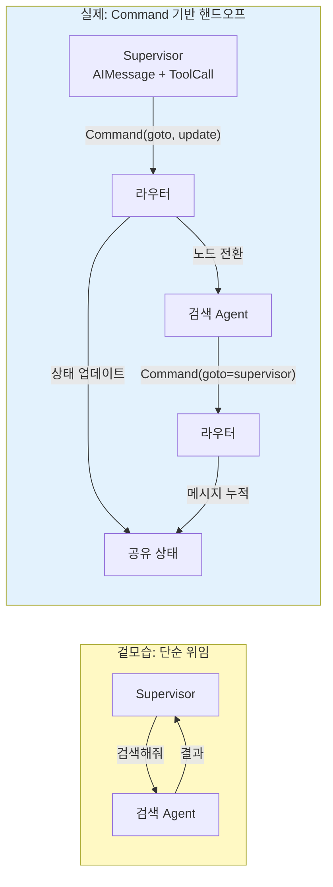
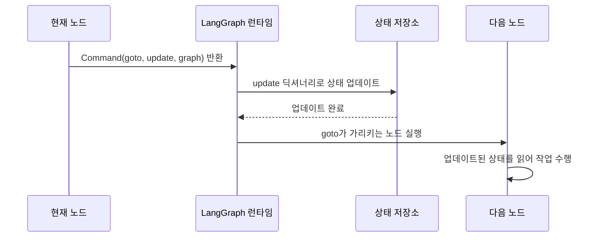
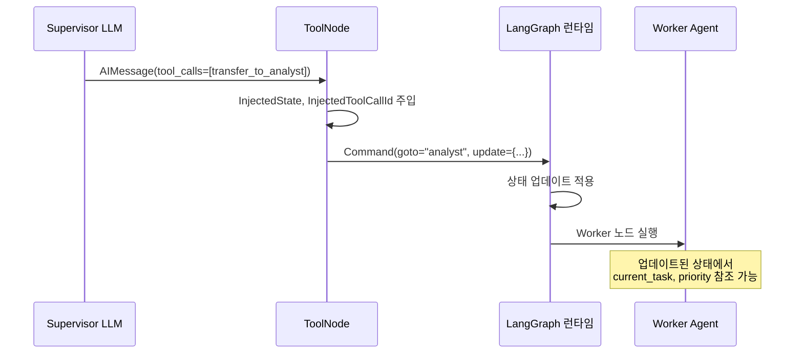
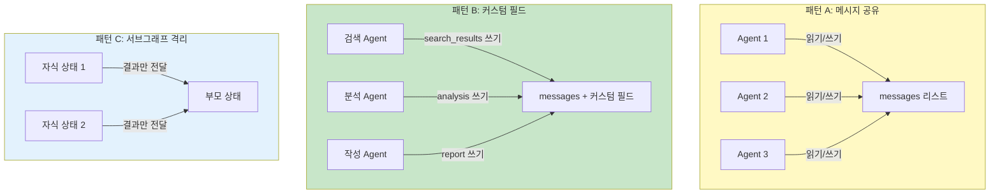
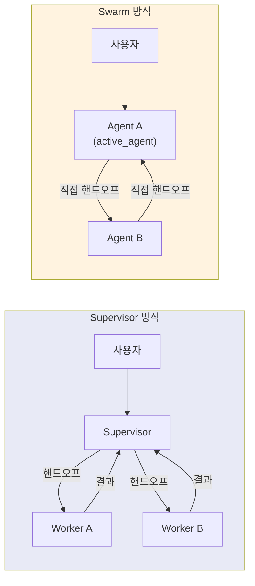

# 에이전트 핸드오프와 상태 공유

> Worker 간 작업 전달(핸드오프)의 메커니즘을 이해하고, 공유 상태 설계 패턴과 결과 집계 전략을 실습합니다.

## 개요

이 섹션에서는 멀티 에이전트 시스템에서 에이전트 간 **작업 전달(핸드오프)**이 실제로 어떻게 동작하는지, 그리고 여러 에이전트가 **하나의 상태를 안전하게 공유**하는 설계 패턴을 학습합니다. 앞선 두 섹션에서 Supervisor/Worker 아키텍처와 `create_supervisor` API를 익혔다면, 이번에는 그 **내부 동작 원리**와 **커스텀 핸드오프**에 집중합니다.

**선수 지식**: [멀티 에이전트 아키텍처 패턴](15-ch15-supervisorworker-멀티-에이전트/01-01-멀티-에이전트-아키텍처-패턴.md)에서 배운 Supervisor/Worker, Swarm, 계층적 패턴의 개념, [langgraph-supervisor 활용](15-ch15-supervisorworker-멀티-에이전트/02-02-langgraph-supervisor-활용.md)에서 다룬 `create_supervisor`와 `create_handoff_tool` API, 그리고 [리듀서와 상태 업데이트 패턴](04-ch4-langgraph-stategraph-기초/04-04-리듀서와-상태-업데이트-패턴.md)의 리듀서 개념

**학습 목표**:
- `Command` 객체의 구조와 역할을 설명하고 직접 작성할 수 있다
- 커스텀 핸드오프 도구를 설계하고 메타데이터를 전달할 수 있다
- 공유 상태 스키마를 설계하여 Worker 간 데이터를 안전하게 공유할 수 있다
- 결과 집계 패턴(리듀서 기반, Supervisor 기반)을 비교하고 적용할 수 있다

## 왜 알아야 할까?

지난 섹션에서 `create_supervisor`를 사용해 멀티 에이전트 시스템을 만들어 봤는데요, 여기서 한 가지 궁금증이 생기지 않으셨나요? Supervisor가 "이 작업은 검색 에이전트에게 맡겨"라고 결정하면, 실제로 **어떻게** 검색 에이전트에게 작업이 넘어가고, 검색 에이전트가 끝나면 **어떻게** 결과가 다시 Supervisor에게 돌아올까요?

이건 회사의 업무 프로세스와 비슷합니다. 팀장이 "이 보고서 김 대리가 작성해"라고 말하는 건 쉽지만, 실제로는 훨씬 복잡한 일들이 일어나죠. 관련 자료를 전달해야 하고, 진행 상황을 공유해야 하고, 다른 팀원의 작업 결과를 참조해야 하고, 완성된 결과물을 취합해야 합니다.

에이전트 핸드오프도 마찬가지입니다. 단순히 "다음 에이전트 실행"이 아니라, **어떤 메시지를 전달할지**, **공유 상태는 어떻게 업데이트할지**, **결과를 어떻게 모을지**를 세밀하게 설계해야 실전에서 안정적으로 동작하는 시스템을 만들 수 있거든요.

> 📊 **그림 1**: 핸드오프의 겉모습 vs 실제 내부 동작



## 핵심 개념

### 개념 1: Command 객체 — 핸드오프의 심장

> 💡 **비유**: 회사에서 업무를 넘길 때 쓰는 **인수인계 문서**를 상상해보세요. 이 문서에는 "다음 담당자가 누구인지(goto)", "지금까지의 진행 상황(update)", 그리고 "이 문서를 받을 부서(graph)"가 적혀 있습니다. `Command` 객체가 바로 이 인수인계 문서입니다. 담당자 이름만 달랑 적힌 메모가 아니라, 배경 자료와 진행 경과, 주의사항까지 빼곡히 정리된 공식 인수인계서인 셈이죠. 이 문서 하나로 다음 담당자는 맥락을 파악하고 바로 업무에 투입될 수 있습니다.

LangGraph에서 모든 핸드오프의 핵심은 `Command` 객체입니다. 노드 함수가 `Command`를 반환하면, LangGraph 런타임이 **상태 업데이트**와 **다음 노드 라우팅**을 동시에 처리합니다.

```python
from langgraph.types import Command
from typing import Literal

def my_agent(state) -> Command[Literal["agent_a", "agent_b", "__end__"]]:
    # 작업 처리 후 다음 에이전트로 핸드오프
    return Command(
        goto="agent_b",                    # 다음 실행할 노드
        update={"messages": [response]},   # 상태 업데이트 내용
    )
```

`Command`의 세 가지 핵심 파라미터를 살펴보겠습니다:

| 파라미터 | 타입 | 역할 |
|---------|------|------|
| `goto` | `str` 또는 `list[str]` | 다음으로 실행할 노드 이름 |
| `update` | `dict` | 그래프 상태에 적용할 업데이트 |
| `graph` | `Command.PARENT` | 부모 그래프의 노드로 라우팅 (서브그래프 탈출) |

> 📊 **그림 2**: Command 객체의 동작 흐름



여기서 특히 주목할 점은 `graph=Command.PARENT`입니다. 서브그래프 내부의 에이전트가 **형제 서브그래프**로 핸드오프할 때 필수적이거든요.

```python
def agent_inside_subgraph(state):
    """서브그래프 안의 노드가 부모 그래프의 다른 노드로 핸드오프"""
    return Command(
        goto="other_team",                   # 부모 그래프에 있는 노드
        update={"messages": [result_msg]},   # 상태 업데이트
        graph=Command.PARENT,                # "이건 부모 그래프 노드야!"
    )
```

> ⚠️ **흔한 오해**: `Command`의 `goto`와 조건부 엣지(`add_conditional_edges`)가 같은 역할을 한다고 생각하기 쉽습니다. 하지만 조건부 엣지는 **그래프 구조 정의 시점**에 라우팅을 설정하는 반면, `Command`는 **런타임 시점**에 동적으로 라우팅을 결정합니다. 도구(tool) 함수 내부에서 "다음 에이전트는 상황에 따라 달라져야 해"라면 `Command`가 답입니다.

### 개념 2: 핸드오프 도구의 내부 구조

> 💡 **비유**: 콜센터에서 상담원이 고객 전화를 다른 부서로 **전환(transfer)**할 때를 생각해보세요. 단순히 전화를 끊고 새로 거는 게 아니라, 고객 정보와 상담 내용을 함께 넘기면서 "전환되었습니다"라는 안내 메시지가 나오죠. 핸드오프 도구도 정확히 이렇게 동작합니다.

[이전 섹션](15-ch15-supervisorworker-멀티-에이전트/02-02-langgraph-supervisor-활용.md)에서 `create_handoff_tool`을 사용해봤는데요, 이번에는 이 도구가 내부적으로 **무엇을 하는지** 분해해보겠습니다.

`create_handoff_tool`이 생성하는 도구는 실행될 때 다음 세 가지를 수행합니다:

1. **ToolMessage 생성**: "성공적으로 전환되었습니다" 메시지를 만듭니다
2. **메시지 히스토리 전달**: 전체 대화 기록을 다음 에이전트에 전달합니다
3. **Command 반환**: `goto`로 다음 에이전트를, `update`로 상태 변경을 지정합니다

```python
from langgraph_supervisor import create_handoff_tool

# 기본 핸드오프 도구 — 내부적으로 Command를 반환
handoff_to_researcher = create_handoff_tool(
    agent_name="researcher",          # 대상 에이전트 노드 이름
    name="assign_to_researcher",      # LLM이 호출할 도구 이름
    description="리서치가 필요한 작업을 검색 전문가에게 위임합니다",
)
```

그런데 실무에서는 **메시지 외에 추가 데이터**를 함께 넘겨야 할 때가 많습니다. 예를 들어 "이 에이전트에게 맡길 구체적인 작업 설명"이나 "우선순위 정보" 같은 것이요. 이때 커스텀 핸드오프 도구가 필요합니다:

```python
from typing import Annotated
from langchain_core.tools import tool, InjectedToolCallId
from langchain_core.messages import ToolMessage
from langgraph.types import Command
from langgraph.prebuilt import InjectedState

@tool("transfer_to_analyst")
def transfer_to_analyst(
    task_description: Annotated[str, "분석가에게 전달할 작업 설명"],
    priority: Annotated[str, "작업 우선순위: high, medium, low"],
    # 아래 두 파라미터는 LLM에게 보이지 않음 — 런타임이 자동 주입
    state: Annotated[dict, InjectedState],
    tool_call_id: Annotated[str, InjectedToolCallId],
):
    """데이터 분석이 필요한 작업을 분석 전문가에게 위임합니다."""
    tool_message = ToolMessage(
        content=f"분석 에이전트로 전환됨 (우선순위: {priority})",
        name="transfer_to_analyst",
        tool_call_id=tool_call_id,  # 반드시 매칭되어야 함!
    )
    return Command(
        goto="analyst",
        graph=Command.PARENT,
        update={
            "messages": state["messages"] + [tool_message],
            "current_task": task_description,   # 커스텀 상태 필드
            "priority": priority,               # 커스텀 상태 필드
        },
    )
```

여기서 `InjectedState`와 `InjectedToolCallId`가 핵심입니다. 두 어노테이션 모두 LangGraph가 도구 실행 시 **런타임에 자동으로 주입**하는 값을 표시하며, LLM의 도구 스키마에는 노출되지 않습니다:

| 어노테이션 | 임포트 경로 | 역할 | LLM에 노출? |
|-----------|------------|------|------------|
| `InjectedState` | `langgraph.prebuilt` | 현재 그래프 상태를 주입 | X (숨겨짐) |
| `InjectedToolCallId` | `langchain_core.tools` | 도구 호출 ID를 주입 | X (숨겨짐) |
| 일반 파라미터 | — | LLM이 값을 결정 | O (보임) |

> ⚠️ **주의**: `InjectedState`는 `langgraph.prebuilt` 모듈에서, `InjectedToolCallId`는 `langchain_core.tools` 모듈에서 임포트합니다. 두 어노테이션의 출처가 다른 패키지라는 점에 유의하세요. LangGraph와 LangChain Core 버전이 맞지 않으면 `ImportError`가 발생할 수 있으니, `langgraph>=0.2.60`과 `langchain-core>=0.3.29` 이상을 사용하는지 확인하세요.

> 📊 **그림 3**: 핸드오프 도구의 메시지 체인



> 🔥 **실무 팁**: 핸드오프 메시지에 `tool_call_id`를 반드시 포함해야 합니다. 이건 LangGraph만의 규칙이 아니라 **LLM 도구 호출 프로토콜의 표준 규약**입니다. OpenAI와 Anthropic 모두 `AIMessage`의 `tool_calls` 배열에 있는 각 호출에 대해 매칭되는 `ToolMessage`(동일한 `tool_call_id` 포함)가 대화 히스토리에 존재해야 한다고 강제합니다. 이 쌍이 깨지면 대화 히스토리가 **무효**가 되어 다음 LLM 호출에서 400 에러가 발생하거든요.

### 개념 3: 공유 상태 설계 패턴

> 💡 **비유**: 프로젝트를 진행할 때 팀원들이 하나의 **공유 스프레드시트**에 각자 맡은 섹션을 채워넣는 방식을 생각해보세요. 패턴 A는 모든 팀원이 같은 시트에 쓰는 것이고, 패턴 B는 각자 개별 탭이 있되 요약 탭은 함께 보는 것이고, 패턴 C는 각자 별도 문서에 작업하고 리더만 결과를 취합하는 것입니다.

멀티 에이전트에서 상태 공유는 크게 세 가지 패턴으로 나뉩니다:

**패턴 A: 메시지 공유 (기본)**

모든 에이전트가 하나의 `messages` 리스트를 공유합니다. `add_messages` 리듀서가 새 메시지를 자동 누적하죠.

```python
from typing import Annotated
from typing_extensions import TypedDict
from langgraph.graph.message import add_messages

class SharedState(TypedDict):
    messages: Annotated[list, add_messages]  # 모든 에이전트가 읽고 쓰는 메시지
```

이 패턴은 간단하지만, 에이전트가 많아지면 메시지가 폭발적으로 늘어나 **토큰 비용 문제**가 생깁니다.

**패턴 B: 커스텀 필드 확장**

메시지 외에 에이전트 간 공유할 데이터 필드를 추가합니다.

```python
from typing_extensions import NotRequired

class EnrichedState(TypedDict):
    messages: Annotated[list, add_messages]
    # 커스텀 공유 필드
    search_results: NotRequired[list[dict]]     # 검색 에이전트가 채움
    analysis_summary: NotRequired[str]          # 분석 에이전트가 채움
    final_report: NotRequired[str]              # 작성 에이전트가 채움
    active_agent: NotRequired[str]              # 현재 활성 에이전트 추적
```

이 패턴이 실무에서 가장 많이 쓰입니다. 각 에이전트가 자기 역할에 해당하는 필드만 업데이트하고, 다른 에이전트의 결과는 **읽기만** 하면 되니까요.

**패턴 C: 서브그래프 격리**

각 에이전트가 자체 내부 상태를 가지고, 부모 그래프 수준에서만 필요한 데이터를 교환합니다.

```python
# 부모 그래프 상태 — 전체 필드 보유
class ParentState(TypedDict):
    messages: Annotated[list, add_messages]
    researcher_output: str
    analyst_output: str

# 래퍼 함수가 상태를 변환
def call_researcher(state: ParentState) -> Command:
    """리서처 서브그래프 호출 — 필요한 데이터만 전달"""
    child_state = {"messages": state["messages"]}
    result = researcher_agent.invoke(child_state)
    return Command(
        update={
            "messages": result["messages"],
            "researcher_output": result["messages"][-1].content,
        }
    )
```

> 📊 **그림 4**: 세 가지 상태 공유 패턴 비교



각 패턴의 선택 기준을 정리하면:

| 기준 | 패턴 A | 패턴 B | 패턴 C |
|------|--------|--------|--------|
| 구현 복잡도 | 낮음 | 중간 | 높음 |
| 토큰 효율성 | 낮음 | 중간 | 높음 |
| 에이전트 독립성 | 낮음 | 중간 | 높음 |
| 디버깅 용이성 | 높음 | 중간 | 낮음 |
| 권장 에이전트 수 | 2~3개 | 3~5개 | 5개 이상 |

### 개념 4: 결과 집계 패턴

> 💡 **비유**: 학교 조별 과제에서 결과물을 모으는 방식과 같습니다. **방식 1**: 조장이 각 조원의 파트를 받아서 직접 정리하는 것 (Supervisor 집계). **방식 2**: 공유 구글 독스에 각자 자기 파트를 채워넣으면 자동으로 하나의 문서가 되는 것 (리듀서 기반 집계).

여러 Worker의 결과를 어떻게 하나로 모을 것인가? 이것도 중요한 설계 결정입니다.

**방식 1: Supervisor가 직접 집계**

Supervisor LLM이 각 Worker의 응답을 읽고 최종 결과를 생성합니다.

```python
supervisor_prompt = """당신은 팀 Supervisor입니다.
Worker들의 결과를 받으면 이를 종합하여 최종 응답을 작성하세요.

규칙:
- 검색 Worker의 결과에서 핵심 정보를 추출하세요
- 분석 Worker의 인사이트를 반영하세요
- 중복을 제거하고 일관된 톤으로 정리하세요
"""
```

이 방식은 유연하지만 Supervisor의 토큰 소비가 많습니다.

**방식 2: 리듀서 기반 자동 집계**

상태 스키마에 리듀서를 정의하여 결과를 자동으로 구조화합니다.

```python
from typing import Annotated
from operator import add

def merge_reports(existing: dict, new: dict) -> dict:
    """리포트 섹션을 병합하는 커스텀 리듀서"""
    merged = existing.copy()
    merged.update(new)
    return merged

class AggregatingState(TypedDict):
    messages: Annotated[list, add_messages]
    # 리스트는 add 리듀서로 누적
    findings: Annotated[list[str], add]
    # 딕셔너리는 커스텀 리듀서로 병합
    report_sections: Annotated[dict, merge_reports]
```

이렇게 하면 각 Worker가 `findings`에 항목을 추가하거나 `report_sections`에 자기 섹션을 넣으면, 리듀서가 자동으로 누적/병합합니다.

```run:python
# 리듀서 동작 시뮬레이션
from operator import add

# add 리듀서: 리스트를 누적
findings = []
findings = add(findings, ["시장 규모: 500억"])       # Worker 1
findings = add(findings, ["성장률: 25%"])             # Worker 2
findings = add(findings, ["주요 플레이어: A, B, C"])  # Worker 3
print("누적된 findings:", findings)

# 커스텀 리듀서: 딕셔너리 병합
def merge_reports(existing, new):
    merged = existing.copy()
    merged.update(new)
    return merged

report = {}
report = merge_reports(report, {"intro": "시장 개요..."})        # Worker 1
report = merge_reports(report, {"analysis": "데이터 분석..."})   # Worker 2
report = merge_reports(report, {"conclusion": "결론..."})        # Worker 3
print("병합된 report 섹션:", list(report.keys()))
```

```output
누적된 findings: ['시장 규모: 500억', '성장률: 25%', '주요 플레이어: A, B, C']
병합된 report 섹션: ['intro', 'analysis', 'conclusion']
```

### 개념 5: Swarm 패턴의 핸드오프 — 피어 투 피어

> 💡 **비유**: Supervisor/Worker가 **중앙 집중형 콜센터**라면, Swarm은 **동료끼리 직접 전화를 돌리는** 방식입니다. 일반 상담 → 기술 지원 → 결제 담당으로 고객이 직접 이관되는 것처럼, 에이전트끼리 중개자 없이 작업을 넘깁니다.

`langgraph-swarm` 패키지는 Supervisor 없이 에이전트 간 **직접 핸드오프**를 구현합니다. 각 에이전트가 자체적으로 판단하여 다른 에이전트에게 작업을 넘기거든요.

```python
from langgraph_swarm import create_handoff_tool, create_swarm
from langgraph.prebuilt import create_react_agent
from langchain_openai import ChatOpenAI

model = ChatOpenAI(model="gpt-4o")

# 각 에이전트에 핸드오프 도구를 직접 부여
sales_agent = create_react_agent(
    model,
    tools=[
        product_search,
        create_handoff_tool(
            agent_name="support",
            description="기술 지원이 필요하면 support 에이전트에게 전환"
        ),
    ],
    name="sales",
    prompt="당신은 영업 상담 에이전트입니다.",
)

support_agent = create_react_agent(
    model,
    tools=[
        ticket_lookup,
        create_handoff_tool(
            agent_name="sales",
            description="구매 문의로 돌아가려면 sales 에이전트에게 전환"
        ),
    ],
    name="support",
    prompt="당신은 기술 지원 에이전트입니다.",
)

# Swarm 생성 — 첫 번째 에이전트를 지정
workflow = create_swarm(
    agents=[sales_agent, support_agent],
    default_active_agent="sales",  # 시작 에이전트
)
app = workflow.compile()
```

Swarm에서는 `active_agent`라는 상태 필드가 **현재 활성 에이전트**를 추적합니다. 핸드오프 도구가 호출되면 이 필드가 자동 업데이트되죠.

> 📊 **그림 5**: Supervisor 핸드오프 vs Swarm 핸드오프 비교



두 방식의 핵심 차이:

| 구분 | Supervisor 핸드오프 | Swarm 핸드오프 |
|------|---------------------|----------------|
| 라우팅 결정자 | Supervisor LLM | 각 에이전트 자체 |
| 메시지 경로 | Worker → Supervisor → Worker | Agent → Agent (직접) |
| 상태 관리 | Supervisor가 중앙 관리 | `active_agent` 필드로 추적 |
| 토큰 효율 | 낮음 (Supervisor 중계) | 높음 (직접 전달) |
| 제어 가능성 | 높음 (중앙 통제) | 낮음 (분산 결정) |

> 💡 **알고 계셨나요?**: "Swarm"이라는 이름은 OpenAI가 2024년 10월에 공개한 실험적 프레임워크에서 유래했습니다. 벌 떼(swarm)가 중앙 지휘 없이도 자율적으로 움직이며 집단 지능을 발휘하는 것에서 영감을 받았죠. LangGraph의 `langgraph-swarm`은 이 개념을 LangGraph 생태계 위에 재구현한 것입니다. 흥미로운 점은 OpenAI Swarm은 프로덕션용이 아닌 교육용으로 만들어졌지만, `langgraph-swarm`은 체크포인터와 결합해 프로덕션에서도 사용할 수 있도록 설계되었다는 것입니다.

## 실습: 직접 해보기

고객 서비스 시스템을 만들어봅시다. 세 에이전트(접수 담당, 기술 지원, 환불 처리)가 커스텀 핸드오프 도구로 작업을 주고받으며, 공유 상태에 처리 결과를 누적하는 시스템입니다.

```python
"""
고객 서비스 멀티 에이전트 시스템
- 접수(Triage) 에이전트: 고객 문의를 분류하여 적절한 에이전트로 라우팅
- 기술 지원(Tech) 에이전트: 기술 문제 해결
- 환불(Refund) 에이전트: 환불/결제 문제 처리
공유 상태: 티켓 정보, 처리 이력, 최종 결과
"""
from typing import Annotated, Literal
from typing_extensions import TypedDict, NotRequired
from operator import add

from langchain_core.messages import AIMessage, ToolMessage, SystemMessage
from langchain_core.tools import tool, InjectedToolCallId
from langchain_openai import ChatOpenAI
from langgraph.graph import StateGraph, START, END
from langgraph.graph.message import add_messages
from langgraph.prebuilt import create_react_agent, InjectedState
from langgraph.types import Command
from langgraph.checkpoint.memory import MemorySaver


# ── 1. 공유 상태 정의 ──────────────────────────────
class ServiceState(TypedDict):
    messages: Annotated[list, add_messages]
    # 핸드오프 추적
    active_agent: NotRequired[str]
    # 티켓 정보 (에이전트 간 공유)
    ticket_category: NotRequired[str]          # 접수 에이전트가 설정
    ticket_priority: NotRequired[str]          # 접수 에이전트가 설정
    # 처리 이력 (리듀서로 누적)
    action_log: Annotated[list[str], add]      # 모든 에이전트가 추가
    # 최종 결과
    resolution: NotRequired[str]               # 해결 에이전트가 설정


# ── 2. 커스텀 핸드오프 도구 ──────────────────────────
@tool("transfer_to_tech_support")
def transfer_to_tech_support(
    issue_summary: Annotated[str, "기술 문제 요약"],
    state: Annotated[dict, InjectedState],
    tool_call_id: Annotated[str, InjectedToolCallId],
):
    """기술 문제를 기술 지원 에이전트에게 전달합니다."""
    return Command(
        goto="tech_agent",
        graph=Command.PARENT,
        update={
            "messages": state["messages"] + [
                ToolMessage(
                    content=f"기술 지원으로 전환됨: {issue_summary}",
                    name="transfer_to_tech_support",
                    tool_call_id=tool_call_id,
                )
            ],
            "active_agent": "tech_agent",
            "action_log": [f"[접수→기술] {issue_summary}"],
        },
    )


@tool("transfer_to_refund")
def transfer_to_refund(
    refund_reason: Annotated[str, "환불 요청 사유"],
    state: Annotated[dict, InjectedState],
    tool_call_id: Annotated[str, InjectedToolCallId],
):
    """환불/결제 문제를 환불 처리 에이전트에게 전달합니다."""
    return Command(
        goto="refund_agent",
        graph=Command.PARENT,
        update={
            "messages": state["messages"] + [
                ToolMessage(
                    content=f"환불 처리로 전환됨: {refund_reason}",
                    name="transfer_to_refund",
                    tool_call_id=tool_call_id,
                )
            ],
            "active_agent": "refund_agent",
            "action_log": [f"[접수→환불] {refund_reason}"],
        },
    )


@tool("resolve_and_close")
def resolve_and_close(
    resolution_summary: Annotated[str, "해결 내용 요약"],
    state: Annotated[dict, InjectedState],
    tool_call_id: Annotated[str, InjectedToolCallId],
):
    """문제를 해결하고 티켓을 종료합니다."""
    return Command(
        goto="__end__",
        graph=Command.PARENT,
        update={
            "messages": state["messages"] + [
                ToolMessage(
                    content=f"티켓 종료: {resolution_summary}",
                    name="resolve_and_close",
                    tool_call_id=tool_call_id,
                )
            ],
            "resolution": resolution_summary,
            "action_log": [f"[해결] {resolution_summary}"],
        },
    )


# ── 3. 업무용 도구 ───────────────────────────────
@tool
def lookup_order(order_id: str) -> str:
    """주문 정보를 조회합니다."""
    # 실제로는 DB 조회
    orders = {
        "ORD-001": "MacBook Pro 16인치, 2025-01-15 구매, 3,500,000원",
        "ORD-002": "AirPods Pro, 2025-03-01 구매, 350,000원",
    }
    return orders.get(order_id, f"주문 {order_id}을 찾을 수 없습니다.")


@tool
def check_warranty(product: str) -> str:
    """제품 보증 상태를 확인합니다."""
    return f"{product}: 보증 기간 내 (2026-01-15까지)"


@tool
def process_refund(order_id: str, amount: int) -> str:
    """환불을 처리합니다."""
    return f"주문 {order_id}에 대해 {amount:,}원 환불이 승인되었습니다."


# ── 4. 에이전트 생성 ─────────────────────────────
model = ChatOpenAI(model="gpt-4o", temperature=0)

triage_agent = create_react_agent(
    model,
    tools=[lookup_order, transfer_to_tech_support, transfer_to_refund],
    name="triage_agent",
    prompt=(
        "당신은 고객 서비스 접수 담당입니다. "
        "고객의 문의를 파악하고:\n"
        "- 기술 문제 → transfer_to_tech_support\n"
        "- 환불/결제 → transfer_to_refund\n"
        "로 라우팅하세요. 먼저 주문 정보를 조회해 상황을 파악하세요."
    ),
)

tech_agent = create_react_agent(
    model,
    tools=[check_warranty, resolve_and_close],
    name="tech_agent",
    prompt=(
        "당신은 기술 지원 전문가입니다. "
        "보증 상태를 확인하고 기술 문제를 해결한 뒤 "
        "resolve_and_close로 티켓을 종료하세요."
    ),
)

refund_agent = create_react_agent(
    model,
    tools=[process_refund, resolve_and_close],
    name="refund_agent",
    prompt=(
        "당신은 환불 처리 전문가입니다. "
        "환불을 처리하고 resolve_and_close로 티켓을 종료하세요."
    ),
)


# ── 5. 그래프 구성 ───────────────────────────────
def route_initial(state: ServiceState) -> str:
    """시작 시 접수 에이전트로 라우팅"""
    return "triage_agent"


builder = StateGraph(ServiceState)
builder.add_node("triage_agent", triage_agent)
builder.add_node("tech_agent", tech_agent)
builder.add_node("refund_agent", refund_agent)

# 시작 → 접수 에이전트
builder.add_edge(START, "triage_agent")

graph = builder.compile(checkpointer=MemorySaver())


# ── 6. 실행 ──────────────────────────────────────
config = {"configurable": {"thread_id": "ticket-42"}}

result = graph.invoke(
    {
        "messages": [
            {"role": "user", "content": "주문번호 ORD-001 MacBook이 켜지지 않아요. 환불 받고 싶습니다."}
        ],
        "action_log": [],
    },
    config,
)

# 결과 확인
print("=== 처리 결과 ===")
print(f"해결: {result.get('resolution', '미해결')}")
print(f"\n=== 처리 이력 ===")
for log in result.get("action_log", []):
    print(f"  • {log}")
print(f"\n=== 최종 메시지 ===")
print(result["messages"][-1].content[:200])
```

이 코드의 핵심 포인트를 짚어보면:

1. **`ServiceState`**: `action_log`에 `add` 리듀서를 사용해 모든 에이전트의 활동이 자동 누적됩니다
2. **커스텀 핸드오프 도구**: `InjectedState`로 현재 상태를 받아 `Command`로 상태 업데이트 + 라우팅을 동시에 수행합니다
3. **`graph=Command.PARENT`**: Worker 에이전트(서브그래프) 안에서 호출된 도구가 **부모 그래프의 다른 노드**로 핸드오프합니다
4. **`resolve_and_close`**: `goto="__end__"`로 그래프 실행을 종료합니다
5. **체크포인터**: `MemorySaver`로 실행 중간 상태를 저장해 타임 트래블이 가능합니다

```run:python
# 핸드오프 과정에서 상태가 어떻게 변화하는지 시뮬레이션
steps = [
    {"step": "시작", "active_agent": "triage", "action_log": [], "resolution": None},
    {"step": "접수 → 기술", "active_agent": "tech", "action_log": ["[접수→기술] MacBook 전원 불량"], "resolution": None},
    {"step": "기술 해결", "active_agent": "tech", "action_log": ["[접수→기술] MacBook 전원 불량", "[해결] 보증 내 수리 접수 완료"], "resolution": "보증 내 수리 접수 완료"},
]

for s in steps:
    agent = s["active_agent"]
    logs = len(s["action_log"])
    resolved = "O" if s["resolution"] else "X"
    print(f"[{s['step']}] active={agent}, logs={logs}개, 해결={resolved}")
```

```output
[시작] active=triage, logs=0개, 해결=X
[접수 → 기술] active=tech, logs=1개, 해결=X
[기술 해결] active=tech, logs=2개, 해결=O
```

## 더 깊이 알아보기

### Command 객체의 탄생 배경

LangGraph 초기 버전에서는 핸드오프를 구현하려면 **조건부 엣지**와 **상태 플래그**를 복잡하게 조합해야 했습니다. 노드가 `{"next": "agent_b"}`를 반환하고, 라우팅 함수가 `state["next"]`를 읽어 분기하는 식이었죠. 이 방식은 코드가 지저분하고, 상태 업데이트와 라우팅이 분리되어 있어 버그가 자주 발생했습니다.

2024년 말, LangChain 팀의 Nuno Campos는 "상태 업데이트와 라우팅을 하나의 원자적(atomic) 연산으로 합치자"는 아이디어를 제안했습니다. 이것이 `Command` 객체의 탄생입니다. `Command`는 데이터베이스의 트랜잭션처럼, 상태 변경과 노드 전환을 **한 번에** 처리해서 중간에 불일치가 발생할 여지를 없앴습니다.

특히 `graph=Command.PARENT` 기능은 서브그래프 간 핸드오프 문제를 우아하게 해결했습니다. 이전에는 서브그래프 A의 노드가 서브그래프 B로 작업을 넘기려면 부모 그래프에 중계 노드를 두어야 했는데, `Command.PARENT`로 서브그래프 내부에서 직접 부모 레벨의 라우팅을 지시할 수 있게 된 거죠.

### OpenAI Swarm에서 LangGraph Swarm까지

2024년 10월, OpenAI는 "Swarm"이라는 실험적 멀티 에이전트 프레임워크를 공개했습니다. 핵심 아이디어는 간단했습니다 — 에이전트가 도구 호출로 다른 에이전트에게 작업을 넘기는 것. OpenAI는 이를 "handoff"라고 불렀고, 에이전트가 `transfer_to_sales()`같은 함수를 호출하면 실행 컨텍스트가 해당 에이전트로 전환되는 방식이었습니다.

LangChain 팀은 이 아이디어를 LangGraph 생태계 위에 재구현하여 `langgraph-swarm` 패키지로 발전시켰습니다. OpenAI Swarm은 "교육용, 프로덕션 비권장"이라는 딱지가 붙어 있었지만, LangGraph Swarm은 체크포인터, Human-in-the-Loop, 상태 영속성 같은 프로덕션 기능들과 자연스럽게 결합됩니다.

## 흔한 오해와 팁

> ⚠️ **흔한 오해**: "핸드오프하면 이전 에이전트의 메모리가 사라진다"고 생각하기 쉽습니다. 실제로는 `messages` 리스트가 **계속 누적**되기 때문에, 다음 에이전트도 이전 대화 전체를 볼 수 있습니다. 문제는 오히려 반대 — 메시지가 너무 많이 쌓여서 토큰 한도를 초과하는 것입니다. `output_mode="last_message"`나 메시지 필터링으로 제어하세요.

> 💡 **알고 계셨나요?**: `create_handoff_tool`의 `add_handoff_messages=True` (기본값)가 생성하는 메시지 쌍(AIMessage + ToolMessage)은 단순한 로깅이 아닙니다. LLM 모델들은 `tool_calls`를 가진 `AIMessage` 뒤에 반드시 매칭되는 `ToolMessage`가 와야 한다는 **도구 호출 프로토콜(Tool Calling Protocol)**을 따릅니다. 이것은 LangGraph 고유의 규칙이 아니라 OpenAI와 Anthropic 등 주요 LLM 제공자들이 공통으로 강제하는 API 수준의 규약입니다. 이 쌍이 없으면 다음 LLM 호출에서 에러가 발생합니다.

> 🔥 **실무 팁**: 디버깅 시 `action_log`같은 누적형 상태 필드가 강력합니다. 에이전트가 어떤 순서로 실행되었고, 각 핸드오프에서 무엇이 전달되었는지 한눈에 파악할 수 있거든요. 프로덕션에서는 이 로그를 LangSmith 트레이스와 결합하면 멀티 에이전트 디버깅이 훨씬 수월해집니다.

## 핵심 정리

| 개념 | 설명 |
|------|------|
| `Command` 객체 | `goto`(다음 노드) + `update`(상태 변경) + `graph`(스코프)를 하나로 묶은 핸드오프 원시 타입 |
| `Command.PARENT` | 서브그래프 내부에서 부모 그래프의 노드로 핸드오프할 때 사용 |
| `InjectedState` | 도구 함수에 현재 그래프 상태를 자동 주입 (LLM에 비노출). `langgraph.prebuilt`에서 임포트 |
| `InjectedToolCallId` | 도구 함수에 tool_call_id를 자동 주입 (ToolMessage 생성 필수). `langchain_core.tools`에서 임포트 |
| 도구 호출 프로토콜 | AIMessage의 tool_call마다 매칭되는 ToolMessage가 필수인 LLM API 표준 규약 |
| 메시지 공유 (패턴 A) | 모든 에이전트가 동일한 `messages` 리스트를 사용. 간단하지만 토큰 비효율 |
| 커스텀 필드 (패턴 B) | `messages` + 역할별 전용 필드. 실무에서 가장 권장되는 패턴 |
| 서브그래프 격리 (패턴 C) | 각 에이전트가 독립 상태를 가지고, 부모에서 결과만 교환. 대규모 시스템에 적합 |
| 리듀서 기반 집계 | `Annotated[list, add]`로 결과를 자동 누적. 구조화된 결과 수집에 최적 |
| Swarm 핸드오프 | `active_agent` 상태로 추적. Supervisor 없이 에이전트 간 직접 전환 |

## 다음 섹션 미리보기

이번 섹션에서 에이전트 간 핸드오프와 상태 공유의 기본 패턴을 익혔습니다. 그런데 현실의 조직은 단순한 1단 구조가 아니죠 — 부서 안에 팀이 있고, 팀 안에 파트가 있는 **계층적 구조**입니다. 다음 섹션 [계층적 멀티 에이전트](15-ch15-supervisorworker-멀티-에이전트/04-04-계층적-멀티-에이전트.md)에서는 Supervisor가 또 다른 Supervisor를 관리하는 **중첩(nested) 멀티 에이전트 아키텍처**를 설계합니다. `create_supervisor`를 중첩하여 리서치 팀, 작성 팀, 검수 팀이 협업하는 시스템을 구축해볼 예정입니다.

## 참고 자료

- [langgraph-supervisor GitHub Repository](https://github.com/langchain-ai/langgraph-supervisor-py) - `create_handoff_tool`, `create_forward_message_tool` 등 핸드오프 도구의 소스 코드와 API 문서
- [LangGraph Multi-Agent Handoffs Documentation](https://docs.langchain.com/oss/python/langchain/multi-agent/handoffs) - 공식 핸드오프 패턴 가이드, `Command` 객체 활용법
- [LangGraph Workflows and Agents Guide](https://docs.langchain.com/oss/python/langgraph/workflows-agents) - StateGraph 기반 워크플로우 설계와 에이전트 구성 공식 문서
- [langgraph-swarm GitHub Repository](https://github.com/langchain-ai/langgraph-swarm-py) - Swarm 패턴 구현체, `create_swarm`과 피어 투 피어 핸드오프 예제
- [Command: A New Tool for Multi-Agent Architectures (LangChain Blog)](https://blog.langchain.com/command-a-new-tool-for-multi-agent-architectures-in-langgraph/) - `Command` 객체 도입 배경과 설계 철학

---
### 🔗 Related Sessions
- [stategraph](04-ch4-langgraph-stategraph-기초/01-01-langgraph-아키텍처-개관.md) (prerequisite)
- [add_messages](03-ch3-대화-메모리와-상태-관리/01-01-대화-메모리의-기초.md) (prerequisite)
- [subgraph](05-ch5-조건-분기와-동적-라우팅/03-03-서브그래프와-그래프-합성.md) (prerequisite)
- [create_react_agent](02-ch2-react-패턴과-에이전트-루프/04-04-langgraph의-create-react-agent.md) (prerequisite)
- [supervisor_worker_pattern](15-ch15-supervisorworker-멀티-에이전트/01-01-멀티-에이전트-아키텍처-패턴.md) (prerequisite)
