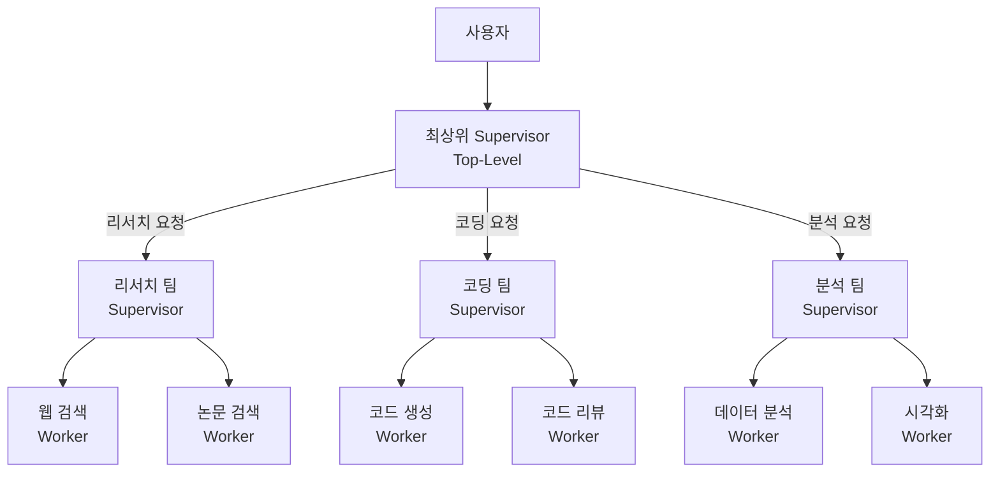
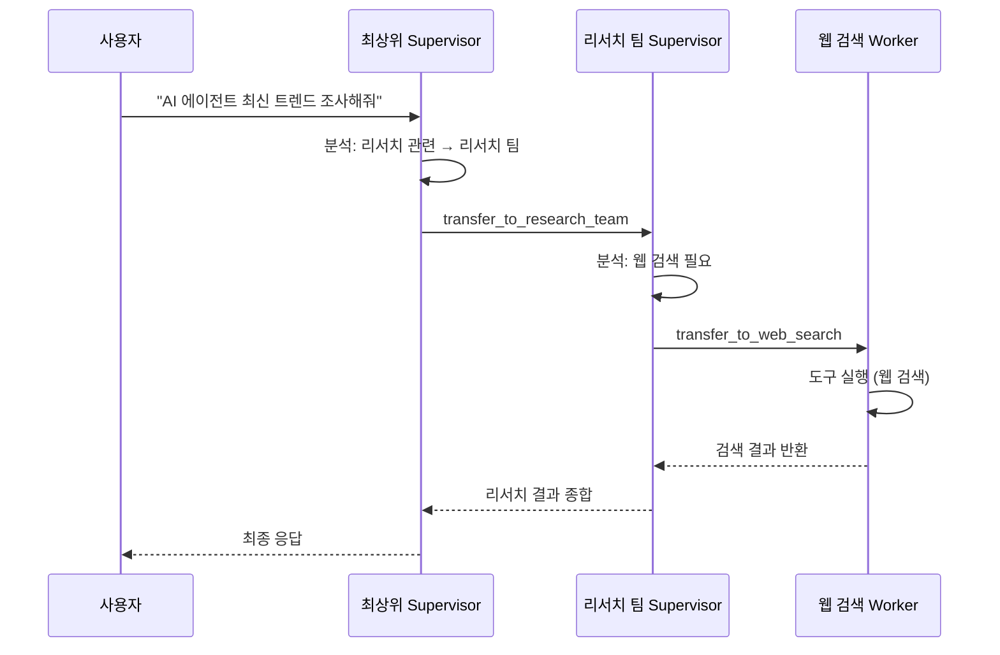
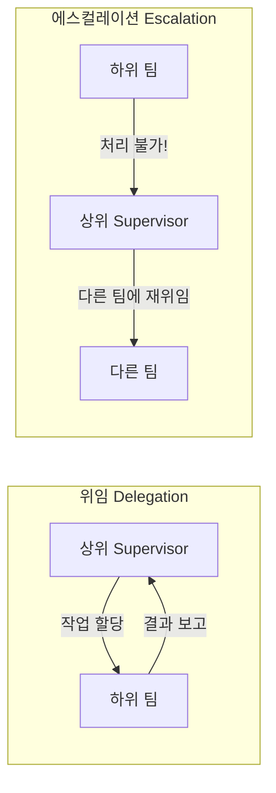
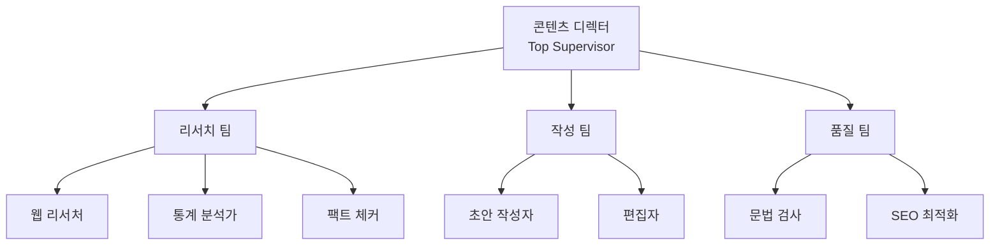
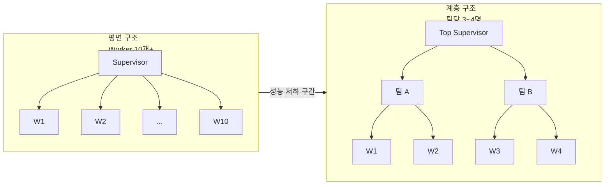
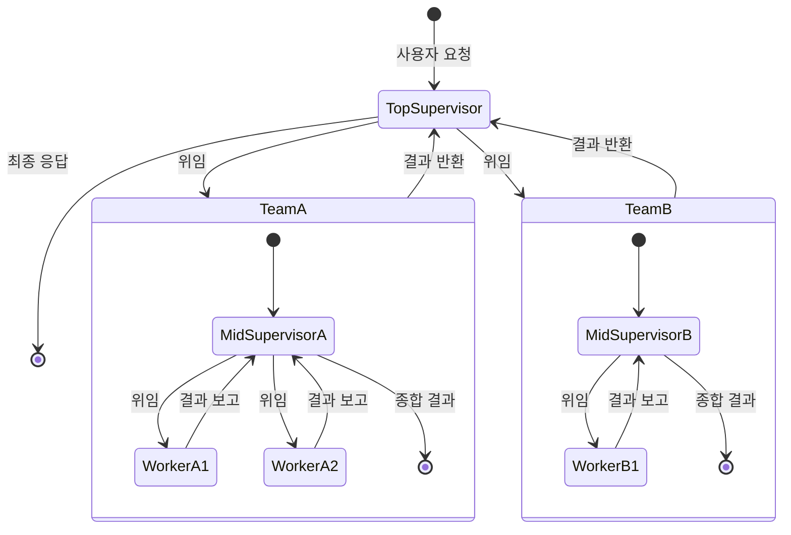

# 계층적 멀티 에이전트

> 중첩 Supervisor 구조로 팀 기반 에이전트 조직을 설계하고, 위임과 에스컬레이션 패턴을 구현합니다.

## 개요

이 섹션에서는 Supervisor/Worker 패턴을 한 단계 확장하여 **계층적(Hierarchical) 멀티 에이전트 아키텍처**를 구축하는 방법을 배웁니다. 앞서 단일 Supervisor가 여러 Worker를 지휘하는 "평면적" 구조를 다뤘다면, 이번에는 Supervisor가 다른 Supervisor를 관리하는 **중첩 구조**를 설계합니다.

**선수 지식**:
- [langgraph-supervisor 활용](15-ch15-supervisorworker-멀티-에이전트/02-02-langgraph-supervisor-활용.md)의 `create_supervisor` API
- [에이전트 핸드오프와 상태 공유](15-ch15-supervisorworker-멀티-에이전트/03-03-에이전트-핸드오프와-상태-공유.md)의 Command 객체와 상태 공유 패턴
- [서브그래프와 그래프 합성](05-ch5-조건-분기와-동적-라우팅/03-03-서브그래프와-그래프-합성.md)의 그래프 중첩 개념

**학습 목표**:
- 계층적 멀티 에이전트가 필요한 시나리오를 판별할 수 있다
- `create_supervisor`를 중첩하여 팀 기반 에이전트 조직을 구현할 수 있다
- 위임(Delegation)과 에스컬레이션(Escalation) 패턴의 차이를 설명하고 구현할 수 있다
- `output_mode`와 `compile(name=...)`을 활용한 계층 간 메시지 흐름을 제어할 수 있다

## 왜 알아야 할까?

실제 조직을 생각해보세요. CEO가 100명의 직원을 직접 관리하는 회사가 있을까요? 당연히 아니죠. CEO 아래에 CTO, CFO, CMO가 있고, 각 임원 아래에 팀장이 있고, 팀장 아래에 팀원이 있습니다. 이런 **계층 구조**가 존재하는 이유는 분명합니다 — **한 명이 관리할 수 있는 범위에는 한계가 있기 때문**이에요.

AI 에이전트 시스템도 마찬가지입니다. 단일 Supervisor에게 10개 이상의 Worker를 맡기면 어떤 일이 벌어질까요?

- LLM의 도구 선택 정확도가 급격히 떨어집니다 (도구가 많아지면 성능 저하가 시작됩니다)
- Supervisor의 프롬프트가 비대해져서 라우팅 결정이 부정확해집니다
- 관련 없는 Worker의 응답이 컨텍스트를 오염시킵니다

계층적 아키텍처는 이 문제를 **"관심사의 분리"** 로 해결합니다. 리서치팀, 코딩팀, 분석팀처럼 역할별로 묶고, 각 팀에 팀장(중간 Supervisor)을 배치하면 최상위 Supervisor는 3~4개의 팀만 관리하면 됩니다. 각 팀장도 자기 팀원 3~4명만 관리하고요.

## 핵심 개념

### 개념 1: 계층적 아키텍처의 구조

> 💡 **비유**: 계층적 멀티 에이전트는 **군대의 지휘 체계**와 같습니다. 사단장(최상위 Supervisor)이 전투를 직접 수행하지 않습니다. 연대장(중간 Supervisor)에게 임무를 위임하고, 연대장은 다시 중대장에게, 중대장은 병사(Worker)에게 구체적 작업을 할당합니다. 각 계층은 자기 수준에 맞는 의사결정만 내리죠.

계층적 멀티 에이전트 시스템은 크게 세 계층으로 구성됩니다:

1. **최상위 Supervisor**: 사용자 요청을 분석하고, 어느 팀에 위임할지 결정
2. **중간 Supervisor (팀 리더)**: 팀 내부의 Worker를 조율하고, 결과를 상위에 보고
3. **Worker 에이전트**: 실제 도구를 호출하고 작업을 수행

> 📊 **그림 1**: 계층적 멀티 에이전트 아키텍처의 3계층 구조



이 구조의 핵심 장점은 **각 계층이 독립적으로 확장 가능**하다는 것입니다. 리서치 팀에 "특허 검색 Worker"를 추가해도 코딩 팀이나 최상위 Supervisor는 전혀 변경할 필요가 없습니다.

LangGraph에서 이 구조를 구현하는 핵심 트릭은 간단합니다: **컴파일된 Supervisor 그래프는 그 자체가 에이전트**이므로, 다른 Supervisor의 `agents` 리스트에 넣을 수 있습니다.

```python
from langgraph_supervisor import create_supervisor
from langchain_openai import ChatOpenAI

model = ChatOpenAI(model="gpt-4o")

# 1단계: 팀별 Supervisor 생성
research_team = create_supervisor(
    agents=[web_search_agent, paper_search_agent],
    model=model,
    supervisor_name="research_supervisor",
    prompt="리서치 관련 작업을 적절한 에이전트에게 위임하세요.",
).compile(name="research_team")  # name이 상위에서 식별자가 됨

coding_team = create_supervisor(
    agents=[code_gen_agent, code_review_agent],
    model=model,
    supervisor_name="coding_supervisor",
    prompt="코딩 관련 작업을 적절한 에이전트에게 위임하세요.",
).compile(name="coding_team")

# 2단계: 최상위 Supervisor — 팀을 에이전트로 등록
top_supervisor = create_supervisor(
    agents=[research_team, coding_team],  # 컴파일된 팀이 에이전트!
    model=model,
    supervisor_name="top_supervisor",
    prompt="사용자 요청을 분석하여 적절한 팀에 위임하세요.",
).compile()
```

여기서 `.compile(name="research_team")`의 `name` 파라미터가 핵심입니다. 이 이름이 상위 Supervisor가 하위 팀을 식별하는 데 사용되거든요. `name`을 생략하면 자동 생성된 이름이 붙는데, 디버깅할 때 혼란스러워질 수 있으니 반드시 명시적으로 지정하세요.

### 개념 2: 위임(Delegation) 패턴

> 💡 **비유**: 위임은 **택배 시스템**과 같습니다. 본사(최상위 Supervisor)가 서울 지역 허브(중간 Supervisor)로 물류를 보내면, 허브가 자기 관할 택배 기사(Worker)에게 배달을 맡깁니다. 본사는 "서울 지역"이라는 대분류만 판단하고, 구체적인 동선은 허브가 결정하죠.

위임은 **상위에서 하위로 작업을 내려보내는** 가장 기본적인 계층적 통신 패턴입니다. 최상위 Supervisor가 사용자 요청을 분석한 뒤, 적절한 하위 팀에 작업을 전달합니다.

> 📊 **그림 2**: 위임 패턴의 메시지 흐름



`create_supervisor`를 중첩할 때, 위임은 자동으로 이루어집니다. 상위 Supervisor가 `transfer_to_research_team` 핸드오프 도구를 호출하면, LangGraph는 해당 팀의 서브그래프로 제어를 넘기고, 팀 내부에서 다시 Worker로의 핸드오프가 진행됩니다.

**위임 시 `output_mode` 선택이 중요합니다:**

```python
# 팀 Supervisor: full_history → 팀 내부 논의 과정이 상위에 전달됨
research_team = create_supervisor(
    agents=[web_agent, paper_agent],
    model=model,
    output_mode="full_history",  # 디버깅에 유리
).compile(name="research_team")

# 팀 Supervisor: last_message → 최종 결과만 상위에 전달됨
research_team_prod = create_supervisor(
    agents=[web_agent, paper_agent],
    model=model,
    output_mode="last_message",  # 프로덕션에 유리 (토큰 절약)
).compile(name="research_team")
```

| output_mode | 상위로 전달되는 내용 | 장점 | 단점 |
|-------------|---------------------|------|------|
| `"full_history"` | 팀 내부 모든 메시지 | 디버깅/감사 추적 용이 | 토큰 소비 증가 |
| `"last_message"` | Worker의 최종 응답만 | 토큰 절약, 컨텍스트 깔끔 | 내부 과정 불투명 |

> 🔥 **실무 팁**: 개발/디버깅 단계에서는 `"full_history"`, 프로덕션에서는 `"last_message"`를 사용하세요. 환경 변수로 토글하면 편리합니다.

### 개념 3: 에스컬레이션(Escalation) 패턴

> 💡 **비유**: 에스컬레이션은 **콜센터의 상담 전환**과 같습니다. 1차 상담원(Worker)이 해결할 수 없는 문제를 만나면 "잠시만요, 팀장(Supervisor)에게 연결해 드릴게요"라고 하죠. 팀장도 해결 못 하면 본부장(상위 Supervisor)으로 올라갑니다. **아래에서 위로 올라가는** 흐름이에요.

에스컬레이션은 위임의 반대 방향입니다. Worker나 중간 Supervisor가 **자신의 권한/능력을 넘어서는 요청**을 만났을 때, 상위 계층으로 제어를 되돌려보내는 패턴입니다.

> 📊 **그림 3**: 에스컬레이션 vs 위임 비교



LangGraph에서 에스컬레이션을 구현하는 방법은 두 가지가 있습니다:

**방법 1: `create_supervisor`의 기본 동작 활용**

`create_supervisor`로 만든 팀은 작업 완료 후 **자동으로 상위 Supervisor에게 제어를 반환**합니다. 이것 자체가 가장 단순한 에스컬레이션이에요. Worker가 "이 작업은 제 범위가 아닙니다"라고 응답하면, 팀 Supervisor가 이를 상위에 전달하고, 상위 Supervisor가 다른 팀에 재위임합니다.

**방법 2: `Command(goto=...)` 를 활용한 명시적 에스컬레이션**

[에이전트 핸드오프와 상태 공유](15-ch15-supervisorworker-멀티-에이전트/03-03-에이전트-핸드오프와-상태-공유.md)에서 배운 `Command` 객체를 사용하면 더 세밀한 제어가 가능합니다:

```python
from langgraph.types import Command

def research_worker(state: dict) -> Command:
    """리서치 Worker — 처리 불가 시 에스컬레이션"""
    messages = state["messages"]
    last_msg = messages[-1].content
    
    # 코딩 관련 요청이 들어온 경우 → 에스컬레이션
    if "코드 작성" in last_msg or "구현" in last_msg:
        return Command(
            goto="research_supervisor",  # 팀 Supervisor로 복귀
            update={
                "messages": [
                    {"role": "assistant", 
                     "content": "이 작업은 코딩 영역입니다. 코딩 팀에 전달이 필요합니다."}
                ]
            }
        )
    
    # 정상 처리
    result = perform_research(last_msg)
    return Command(
        goto="research_supervisor",
        update={"messages": [{"role": "assistant", "content": result}]}
    )
```

### 개념 4: 팀 기반 에이전트 조직 설계

> 💡 **비유**: 팀 설계는 **레스토랑 주방 조직**과 같습니다. 총주방장(Executive Chef) 아래에 소스 담당 셰프(Saucier), 구이 담당 셰프(Rôtisseur), 디저트 담당 셰프(Pâtissier)가 있죠. 각 셰프는 자기 파트의 보조 요리사를 관리합니다. 이 "여단 시스템(Brigade de cuisine)"은 19세기 프랑스의 오귀스트 에스코피에(Auguste Escoffier)가 군대 경험에서 영감을 받아 만들었습니다.

효과적인 팀 구성을 위한 가이드라인이 있습니다:

**팀 분할 기준:**

| 기준 | 설명 | 예시 |
|------|------|------|
| **도메인별** | 업무 영역으로 분할 | 리서치팀, 코딩팀, 분석팀 |
| **기능별** | 수행 기능으로 분할 | 데이터 수집팀, 데이터 처리팀, 보고서팀 |
| **단계별** | 워크플로우 단계로 분할 | 기획팀, 실행팀, 검증팀 |

> 📊 **그림 4**: 도메인별 팀 분할 — 콘텐츠 생성 시스템 예시



**핵심 설계 원칙:**

1. **팀당 Worker 2~4명**: LLM의 도구 선택 정확도를 유지하는 최적 범위
2. **팀당 명확한 책임**: 한 팀이 맡는 역할이 겹치면 라우팅이 모호해짐
3. **최상위 Supervisor는 3~5개 팀**: 너무 많으면 평면 구조와 같은 문제 발생
4. **깊이는 2~3계층**: 4계층 이상은 지연 시간이 급증하고 디버깅이 어려움

```python
# 팀 설계의 좋은 예 — 명확한 도메인 분리
research_team = create_supervisor(
    agents=[web_search_agent, paper_search_agent],
    model=model,
    supervisor_name="research_supervisor",
    prompt=(
        "당신은 리서치 팀 리더입니다. "
        "웹 검색이 필요하면 web_search에, "
        "학술 논문 검색이 필요하면 paper_search에 위임하세요. "
        "리서치와 무관한 요청은 '리서치 범위 밖입니다'라고 응답하세요."
    ),
).compile(name="research_team")
```

프롬프트에서 **"범위 밖" 응답 지침**을 명시하는 것이 에스컬레이션의 핵심입니다. 이 응답을 받은 상위 Supervisor가 다른 팀에 재위임할 수 있거든요.

### 개념 5: 통솔 범위와 계층 깊이의 트레이드오프

> 💡 **비유**: 학교 선생님이 학생 30명에게 각각 1:1 피드백을 주려면 하루가 모자라지만, 조별로 나누어 조장에게 권한을 위임하면 훨씬 효율적이죠. 그런데 조를 너무 많이 만들면 조장 관리 자체가 일이 되고, 조 안에 또 부조장을 두면 전달 과정에서 정보가 왜곡될 수 있습니다.

경영학에서 **통솔 범위(Span of Control)**란 한 관리자가 효과적으로 관리할 수 있는 부하의 수를 뜻합니다. AI 에이전트 시스템에서도 동일한 원리가 적용됩니다.

> 📊 **그림 6**: 통솔 범위에 따른 아키텍처 선택



**통솔 범위와 성능의 관계:**

| Supervisor당 에이전트 수 | 라우팅 정확도 | 권장 여부 |
|--------------------------|--------------|-----------|
| 2~4개 | 높음 | 최적 |
| 5~6개 | 양호 | 허용 가능 |
| 7개 이상 | 급격히 하락 | 계층 분할 필요 |

도구나 에이전트 수가 늘어날수록 LLM의 선택 정확도가 떨어지는 현상은 다양한 벤치마크에서 일관되게 관찰됩니다. 정확한 임계점은 모델, 프롬프트 품질, 도구 설명의 명확성에 따라 달라지지만, **일반적으로 5~6개를 넘어서면 성능 저하가 뚜렷해진다**는 것이 실무적 경험칙입니다. 따라서 에이전트 수가 이 범위를 초과할 때가 계층 분할을 고려할 시점이에요.

**계층 깊이별 트레이드오프:**

| 깊이 | LLM 호출 (최소) | 지연 시간 | 디버깅 난이도 | 적합한 경우 |
|------|----------------|-----------|--------------|------------|
| 1계층 | 1~2회 | 낮음 | 쉬움 | Worker 5개 이하 |
| 2계층 | 2~4회 | 중간 | 보통 | Worker 6~15개 |
| 3계층 | 4~8회 | 높음 | 어려움 | Worker 16개 이상 |

## 실습: 직접 해보기

콘텐츠 생산 파이프라인을 계층적 멀티 에이전트로 구축해보겠습니다. 리서치 팀과 작성 팀, 두 팀을 최상위 Supervisor가 조율합니다.

```python
"""계층적 멀티 에이전트 — 콘텐츠 생산 파이프라인"""

from langchain_openai import ChatOpenAI
from langgraph.prebuilt import create_react_agent
from langgraph_supervisor import create_supervisor
from langchain_core.tools import tool

# ── LLM 설정 ──
model = ChatOpenAI(model="gpt-4o", temperature=0)

# ── Worker 도구 정의 ──
@tool
def web_search(query: str) -> str:
    """웹에서 최신 정보를 검색합니다."""
    # 실제로는 Tavily, Serper 등 검색 API 호출
    return f"[웹 검색 결과] '{query}'에 대한 최신 정보: AI 에이전트 시장이 2026년 급성장 중..."

@tool
def fact_check(claim: str) -> str:
    """주장의 사실 여부를 검증합니다."""
    return f"[팩트 체크] '{claim}' → 검증 완료: 신뢰할 수 있는 출처에서 확인됨"

@tool
def write_draft(topic: str, research: str) -> str:
    """리서치 결과를 바탕으로 초안을 작성합니다."""
    return f"[초안] 제목: {topic}\n\n{research}를 바탕으로 작성된 500단어 초안..."

@tool
def edit_text(draft: str) -> str:
    """초안을 편집하고 문체를 다듬습니다."""
    return f"[편집 완료] 문법 교정 3건, 문체 개선 5건 적용된 최종본"

# ── Worker 에이전트 생성 ──
web_researcher = create_react_agent(
    model=model,
    tools=[web_search],
    name="web_researcher",
    prompt="웹에서 정보를 검색하는 리서처입니다. 정확한 출처를 함께 제공하세요.",
)

fact_checker = create_react_agent(
    model=model,
    tools=[fact_check],
    name="fact_checker",
    prompt="주장이나 통계의 사실 여부를 검증하는 팩트 체커입니다.",
)

draft_writer = create_react_agent(
    model=model,
    tools=[write_draft],
    name="draft_writer",
    prompt="리서치 결과를 바탕으로 초안을 작성하는 작가입니다.",
)

editor = create_react_agent(
    model=model,
    tools=[edit_text],
    name="editor",
    prompt="초안을 편집하고 품질을 높이는 편집자입니다.",
)

# ── 팀 Supervisor 생성 (중간 계층) ──
research_team = create_supervisor(
    agents=[web_researcher, fact_checker],
    model=model,
    supervisor_name="research_lead",
    prompt=(
        "당신은 리서치 팀 리더입니다. "
        "정보 수집이 필요하면 web_researcher에, "
        "사실 확인이 필요하면 fact_checker에 위임하세요. "
        "리서치가 완료되면 핵심 발견사항을 요약하여 보고하세요."
    ),
    output_mode="last_message",  # 상위에는 최종 결과만 전달
).compile(name="research_team")

writing_team = create_supervisor(
    agents=[draft_writer, editor],
    model=model,
    supervisor_name="writing_lead",
    prompt=(
        "당신은 작성 팀 리더입니다. "
        "초안 작성이 필요하면 draft_writer에, "
        "편집이 필요하면 editor에 위임하세요. "
        "작성과 무관한 요청은 '작성 범위 밖입니다'라고 응답하세요."
    ),
    output_mode="last_message",
).compile(name="writing_team")

# ── 최상위 Supervisor (최상위 계층) ──
content_director = create_supervisor(
    agents=[research_team, writing_team],
    model=model,
    supervisor_name="content_director",
    prompt=(
        "당신은 콘텐츠 디렉터입니다. 사용자의 콘텐츠 제작 요청을 처리합니다.\n"
        "1. 먼저 research_team에 조사를 위임하세요.\n"
        "2. 조사 결과를 받으면 writing_team에 글 작성을 위임하세요.\n"
        "3. 최종 결과를 사용자에게 전달하세요."
    ),
    output_mode="full_history",  # 전체 과정 추적 가능
).compile()

# ── 실행 ──
result = content_director.invoke({
    "messages": [
        {"role": "user", "content": "AI 에이전트의 2026년 트렌드에 대한 블로그 글을 작성해주세요."}
    ]
})

# 결과 확인
for msg in result["messages"]:
    role = getattr(msg, "type", "unknown")
    name = getattr(msg, "name", "")
    content = getattr(msg, "content", "")
    if content and len(content) > 20:
        print(f"[{role}] {name}: {content[:80]}...")
```

```run:python
# 계층 구조 시각화 (실행 가능한 데모)
teams = {
    "content_director (Top)": {
        "research_team": ["web_researcher", "fact_checker"],
        "writing_team": ["draft_writer", "editor"],
    }
}

print("=== 계층적 멀티 에이전트 구조 ===\n")
for top, mid_teams in teams.items():
    print(f"📋 {top}")
    for team_name, workers in mid_teams.items():
        print(f"  ├── 🏢 {team_name}")
        for i, worker in enumerate(workers):
            prefix = "└──" if i == len(workers) - 1 else "├──"
            print(f"  │   {prefix} 👤 {worker}")
    print()

print(f"총 계층: 3단계")
print(f"팀 수: {sum(1 for _ in teams.values() for _ in _.keys())}")
print(f"Worker 수: {sum(len(w) for t in teams.values() for w in t.values())}")
```

```output
=== 계층적 멀티 에이전트 구조 ===

📋 content_director (Top)
  ├── 🏢 research_team
  │   ├── 👤 web_researcher
  │   └── 👤 fact_checker
  ├── 🏢 writing_team
  │   ├── 👤 draft_writer
  │   └── 👤 editor

총 계층: 3단계
팀 수: 2
Worker 수: 4
```

**체크포인트와 메모리 통합:**

계층적 시스템에서도 체크포인트는 최상위 `compile()` 시점에 한 번만 설정하면 됩니다. 하위 서브그래프의 상태도 자동으로 포함됩니다:

```python
from langgraph.checkpoint.memory import InMemorySaver

# 최상위 compile 시 checkpointer 주입 — 하위 팀까지 모두 적용
content_director = create_supervisor(
    agents=[research_team, writing_team],
    model=model,
    supervisor_name="content_director",
    prompt="...",
).compile(checkpointer=InMemorySaver())

# thread_id로 대화 세션 관리
config = {"configurable": {"thread_id": "content-session-1"}}
result = content_director.invoke(
    {"messages": [{"role": "user", "content": "AI 트렌드 조사해줘"}]},
    config=config,
)
```

## 더 깊이 알아보기

### 여단 시스템에서 멀티 에이전트까지

계층적 멀티 에이전트의 아이디어는 사실 100년 이상 된 조직 이론에 뿌리를 두고 있습니다. 1900년대 초, 프랑스 요리사 **오귀스트 에스코피에(Auguste Escoffier)**는 군대에서 복무한 경험을 바탕으로 주방의 "여단 시스템(Brigade de cuisine)"을 만들었습니다. 총주방장 아래에 소스, 구이, 생선, 디저트 등 분야별 셰프를 두고, 각 셰프가 보조 요리사를 관리하는 구조였죠.

이 아이디어는 경영학에서 **"통솔 범위(Span of Control)"** 이론으로 발전합니다. 한 관리자가 효과적으로 관리할 수 있는 부하의 수에는 한계가 있다는 개념인데요, 일반적으로 5~9명이 최적이라고 합니다. 흥미롭게도, LLM의 도구 선택에서도 비슷한 한계가 관찰됩니다 — 도구 수가 늘어날수록 선택 정확도가 점진적으로 떨어지며, 대체로 5~6개를 넘어서면 눈에 띄는 성능 저하가 나타납니다. 정확한 임계점은 모델과 프롬프트 품질에 따라 다르지만, "적을수록 정확하다"는 경향은 일관됩니다.

### LangGraph Supervisor 라이브러리의 탄생

`langgraph-supervisor` 라이브러리는 2024년 말에 처음 공개되어, 2025년에 본격적으로 발전했습니다. 초기에는 단순한 라우팅 패턴만 지원했지만, 커뮤니티의 요청으로 **중첩 Supervisor**와 **핸드오프 도구 커스터마이징**이 추가되었습니다. 놀랍게도, LangChain 팀은 최근 공식 문서에서 "대부분의 경우 라이브러리보다 직접 도구 기반 패턴을 사용하라"고 권장하고 있습니다. 라이브러리는 빠른 프로토타이핑에는 좋지만, 프로덕션에서는 세밀한 컨텍스트 엔지니어링이 필요하기 때문이죠.

> 📊 **그림 5**: 계층적 멀티 에이전트의 메시지 흐름 상세



## 흔한 오해와 팁

> ⚠️ **흔한 오해**: "계층이 깊을수록 더 강력한 시스템이다" — 사실 계층이 깊어질수록 지연 시간이 기하급수적으로 증가합니다. 각 Supervisor가 LLM 호출을 하므로, 3계층이면 최소 3번의 LLM 호출이 필요하죠. **2~3계층이 실무에서의 현실적 최대치**입니다. 그 이상은 지연 시간, 비용, 디버깅 난이도 모두 급등합니다.

> 💡 **알고 계셨나요?**: `create_supervisor`의 `handoff_tool_prefix` 파라미터를 계층마다 다르게 설정하면 LangSmith 트레이스에서 어느 계층의 핸드오프인지 즉시 구분할 수 있습니다. 예를 들어 최상위는 `"delegate_to"`, 팀 레벨은 `"assign_to"`로 설정하면 `delegate_to_research_team` → `assign_to_web_researcher`처럼 계층이 이름에 드러나죠.

> 🔥 **실무 팁**: 계층적 시스템을 디버깅할 때는 **아래에서 위로(Bottom-up)** 테스트하세요. 먼저 개별 Worker를 독립적으로 테스트하고, 다음으로 팀 Supervisor + Worker 조합을 테스트하고, 마지막으로 전체 계층을 연결합니다. 이렇게 하면 문제 발생 시 어느 계층에서 잘못되었는지 즉시 파악할 수 있습니다.

> 🔥 **실무 팁**: 중간 Supervisor의 프롬프트에 반드시 **"범위 밖 요청 처리 지침"**을 포함하세요. 이것이 없으면 리서치 팀이 코딩 요청을 억지로 처리하려다 환각(hallucination)이 발생합니다. "리서치와 무관한 요청은 '범위 밖'이라고 응답하세요"라는 한 줄이 시스템 안정성을 크게 높입니다.

## 핵심 정리

| 개념 | 설명 |
|------|------|
| 계층적 아키텍처 | 최상위 Supervisor → 팀 Supervisor → Worker의 다층 구조 |
| 위임(Delegation) | 상위에서 하위로 작업을 내려보내는 패턴 |
| 에스컬레이션(Escalation) | 하위에서 상위로 처리 불가 요청을 올려보내는 패턴 |
| `.compile(name=...)` | 컴파일된 그래프에 이름을 부여하여 상위에서 식별 가능하게 함 |
| `output_mode` | `"last_message"` (토큰 절약) vs `"full_history"` (디버깅 용이) |
| 팀 설계 원칙 | 팀당 Worker 2~4명, 최상위 3~5개 팀, 최대 2~3계층 |
| 범위 밖 처리 | 중간 Supervisor 프롬프트에 범위 밖 요청 거절 지침 필수 |
| 통솔 범위 | 한 Supervisor가 효과적으로 관리할 수 있는 에이전트 수의 한계 (일반적으로 5~6개까지 양호) |

## 다음 섹션 미리보기

다음 [멀티 에이전트 실전 프로젝트](15-ch15-supervisorworker-멀티-에이전트/05-05-멀티-에이전트-실전-프로젝트.md)에서는 이번에 배운 계층적 아키텍처를 포함하여, Ch15 전체에서 다룬 Supervisor/Worker 패턴, 핸드오프, 상태 공유를 종합하는 실전 프로젝트를 진행합니다. 실제 API를 연동하고, LangSmith로 트레이싱하며, 프로덕션 수준의 멀티 에이전트 시스템을 완성합니다.

## 참고 자료

- [LangGraph Supervisor GitHub](https://github.com/langchain-ai/langgraph-supervisor-py) - `create_supervisor` 라이브러리 소스와 계층적 멀티 에이전트 예제
- [LangGraph Multi-Agent Workflows](https://blog.langchain.com/langgraph-multi-agent-workflows/) - LangChain 공식 블로그의 멀티 에이전트 워크플로우 해설
- [LangGraph Hierarchical Agent Teams Tutorial](https://langchain-ai.github.io/langgraph/tutorials/multi_agent/hierarchical_agent_teams/) - 공식 튜토리얼: 계층적 에이전트 팀 구축
- [langgraph-supervisor PyPI](https://pypi.org/project/langgraph-supervisor/) - API 레퍼런스와 설치 가이드 (v0.0.31+)
- [LangGraph Official Documentation](https://docs.langchain.com/oss/python/langgraph/overview) - LangGraph 공식 문서

---
### 🔗 Related Sessions
- [stategraph](04-ch4-langgraph-stategraph-기초/01-01-langgraph-아키텍처-개관.md) (prerequisite)
- [supervisor_worker_pattern](15-ch15-supervisorworker-멀티-에이전트/01-01-멀티-에이전트-아키텍처-패턴.md) (prerequisite)
- [command_object](15-ch15-supervisorworker-멀티-에이전트/03-03-에이전트-핸드오프와-상태-공유.md) (prerequisite)
- [handoff](15-ch15-supervisorworker-멀티-에이전트/01-01-멀티-에이전트-아키텍처-패턴.md) (prerequisite)
- [shared_state_patterns](15-ch15-supervisorworker-멀티-에이전트/03-03-에이전트-핸드오프와-상태-공유.md) (prerequisite)
