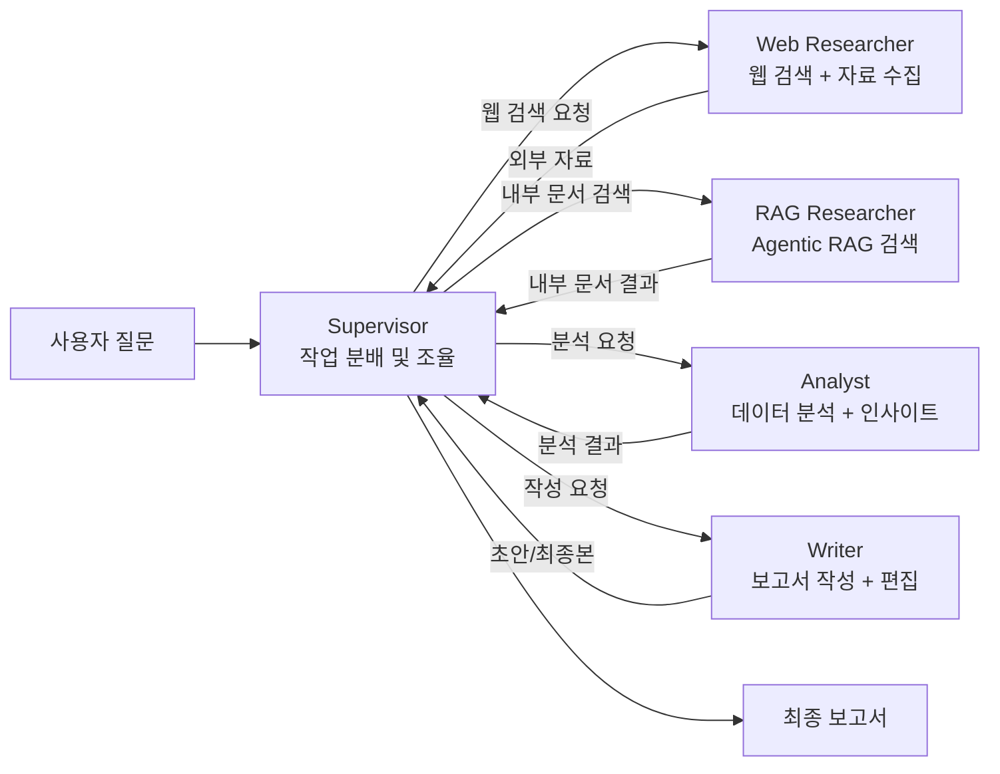
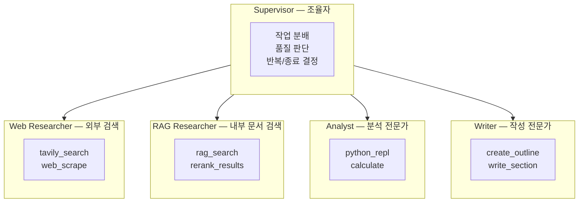
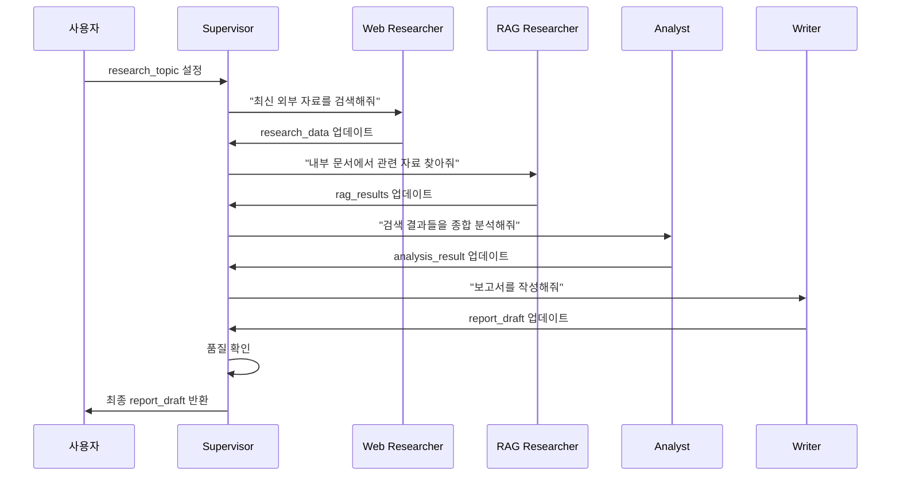
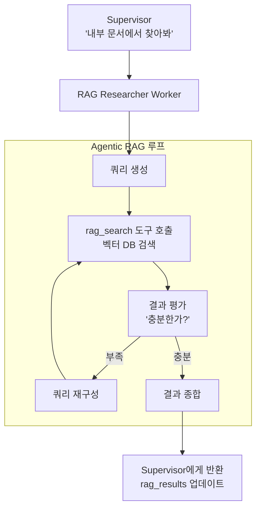
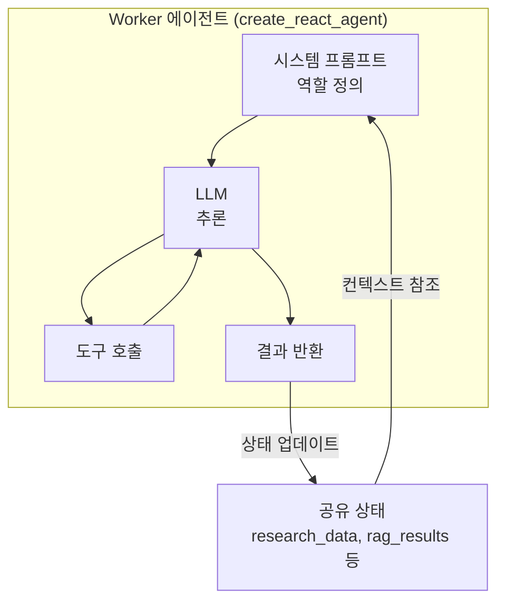

# 멀티 에이전트 실전 프로젝트

> Supervisor + 검색/분석/작성 Worker가 협업하는 리서치 팀 에이전트를 처음부터 끝까지 구축합니다.

## 개요

이 섹션에서는 Ch15 전체에서 배운 Supervisor/Worker 패턴, 핸드오프, 상태 공유, 계층적 아키텍처를 **하나의 실전 프로젝트**로 통합합니다. 검색(Researcher), 분석(Analyst), 작성(Writer) 세 명의 Worker 에이전트를 Supervisor가 지휘하는 리서치 팀을 구축하고, LangSmith 트레이싱까지 연결합니다. 특히 Researcher Worker 중 하나가 **Agentic RAG 기반 내부 문서 검색**을 수행하도록 구성하여, Ch12-14에서 구축한 RAG 시스템이 멀티 에이전트 환경에서 어떻게 활용되는지도 함께 살펴봅니다.

**선수 지식**:
- [멀티 에이전트 아키텍처 패턴](15-ch15-supervisorworker-멀티-에이전트/01-01-멀티-에이전트-아키텍처-패턴.md)의 Supervisor/Worker 개념
- [langgraph-supervisor 활용](15-ch15-supervisorworker-멀티-에이전트/02-02-langgraph-supervisor-활용.md)의 `create_supervisor` API
- [에이전트 핸드오프와 상태 공유](15-ch15-supervisorworker-멀티-에이전트/03-03-에이전트-핸드오프와-상태-공유.md)의 Command 객체와 공유 상태 패턴
- [계층적 멀티 에이전트](15-ch15-supervisorworker-멀티-에이전트/04-04-계층적-멀티-에이전트.md)의 중첩 Supervisor 설계

**학습 목표**:
- 역할 특화된 Worker 에이전트 3개를 설계하고 구현할 수 있다
- Agentic RAG를 Worker로 통합하여 내부 문서 기반 검색 에이전트를 구성할 수 있다
- Supervisor가 Worker 간 작업 흐름을 동적으로 조율하는 시스템을 구축할 수 있다
- 공유 상태를 통해 Worker 간 결과를 축적하고 최종 산출물을 생성할 수 있다
- 프로덕션 수준의 에러 처리, 트레이싱, 테스트 전략을 적용할 수 있다

## 왜 알아야 할까?

현실의 AI 프로젝트는 "하나의 에이전트가 모든 걸 한다"는 접근으로는 한계에 부딪힙니다. 리서치 보고서를 작성하려면 정보를 검색하고, 데이터를 분석하고, 글을 다듬는 **서로 다른 전문성**이 필요하죠. 사람 팀이 그렇듯, AI 에이전트도 역할을 나누면 각자의 프롬프트를 최적화할 수 있고, 실패 시 해당 Worker만 재시도하면 됩니다.

게다가 실제 기업 환경에서는 **외부 웹 검색만으로는 부족한 경우**가 대부분입니다. 내부 기술 문서, 과거 보고서, 사내 위키 등 비공개 지식을 활용해야 하죠. Ch12-14에서 구축한 RAG 시스템을 Worker로 통합하면, 웹 검색 Worker가 최신 외부 정보를 수집하는 동안 RAG Worker가 내부 지식을 검색하여 **양쪽 정보를 결합한 보고서**를 만들 수 있습니다.

이 실전 프로젝트는 단순히 "코드가 돌아가는" 수준을 넘어, **프로덕션에서 실제로 마주치는 문제**들 — Worker 간 컨텍스트 전달, 에러 격리, 반복 루프 방지, 결과 품질 검증 — 을 직접 다룹니다. Ch15의 모든 개념이 어떻게 하나의 시스템으로 결합되는지 체험하는 시간입니다.

> 📊 **그림 1**: 리서치 팀 에이전트의 전체 워크플로우



## 핵심 개념

### 개념 1: 프로젝트 아키텍처 설계

> 💡 **비유**: 신문사 편집국을 떠올려 보세요. 편집장(Supervisor)이 "AI 에이전트 트렌드" 기사를 만들겠다고 결정하면, 취재기자(Web Researcher)가 현장을 뛰고, 자료조사팀(RAG Researcher)이 과거 기사 아카이브를 뒤지고, 데이터 분석가(Analyst)가 통계를 정리하고, 기자(Writer)가 최종 원고를 씁니다. 편집장은 각 단계의 결과물을 보고 다음 누구에게 일을 시킬지 판단합니다.

리서치 팀 에이전트의 핵심 설계 원칙은 **관심사 분리(Separation of Concerns)**입니다. 각 Worker는 자신의 전문 영역에만 집중하고, Supervisor가 전체 흐름을 조율합니다.

> 📊 **그림 2**: 역할별 책임과 도구 매핑



각 Worker의 역할을 명확히 정의합니다:

| Worker | 역할 | 주요 도구 | 출력 |
|--------|------|-----------|------|
| **Web Researcher** | 웹 검색, 최신 자료 수집, 팩트 체크 | `tavily_search` | 외부 검색 결과 요약 |
| **RAG Researcher** | 내부 문서 검색, 도메인 지식 활용 | `rag_search` | 내부 문서 기반 답변 |
| **Analyst** | 수치 분석, 비교, 패턴 발견 | `python_repl` | 분석 인사이트 |
| **Writer** | 구조화된 보고서 작성 및 편집 | `write_section` | 최종 보고서 |

여기서 주목할 점은 **검색 역할을 두 Worker로 분리**한 것입니다. Web Researcher는 Tavily로 실시간 외부 정보를 수집하고, RAG Researcher는 Ch12-14에서 구축한 벡터 DB 기반 RAG 파이프라인으로 내부 문서를 검색합니다. Supervisor는 질문의 성격에 따라 둘 중 하나만 호출할 수도 있고, 둘 다 호출하여 결과를 종합할 수도 있습니다.

### 개념 2: 공유 상태 설계

> 💡 **비유**: 팀 프로젝트의 공유 문서(Google Docs)를 생각해 보세요. 각 팀원이 자기 섹션을 작성하면, 다른 팀원은 그 내용을 참고해서 자기 작업을 진행합니다. 공유 상태는 이 "공유 문서"에 해당합니다.

[에이전트 핸드오프와 상태 공유](15-ch15-supervisorworker-멀티-에이전트/03-03-에이전트-핸드오프와-상태-공유.md)에서 배운 세 가지 패턴 중, 이 프로젝트에서는 **커스텀 필드 패턴**을 적용합니다. Session 15.3에서 배운 공유 상태 패턴 중 커스텀 필드 패턴은 `messages` 외에 도메인 특화 필드를 `TypedDict`에 추가하는 방식이었는데요, 여기서는 이를 확장하여 `research_data`, `rag_results`, `analysis_result`, `report_draft` 같은 구조화된 필드로 Worker 간 결과를 전달합니다.

```python
from typing import Annotated, TypedDict
from langchain_core.messages import AnyMessage
from langgraph.graph import add_messages


# Session 15.3의 커스텀 필드 패턴을 적용하여 설계한 공유 상태
class ResearchState(TypedDict):
    """리서치 팀의 공유 상태 스키마
    
    messages + 도메인 특화 필드 조합으로,
    각 Worker의 산출물을 구조화하여 축적합니다.
    """
    # 메시지 히스토리 (리듀서로 자동 병합)
    messages: Annotated[list[AnyMessage], add_messages]
    # 사용자의 원본 리서치 주제
    research_topic: str
    # Web Researcher가 수집한 외부 자료 (리스트로 축적)
    research_data: list[str]
    # RAG Researcher가 검색한 내부 문서 결과
    rag_results: list[str]
    # Analyst의 분석 결과
    analysis_result: str
    # Writer의 보고서 초안
    report_draft: str
    # 현재 진행 단계 추적
    current_phase: str
```

> 📊 **그림 3**: 상태 필드별 데이터 흐름



이 설계의 장점은 **Worker가 이전 Worker의 결과를 상태에서 직접 읽을 수 있다**는 겁니다. Analyst는 `state["research_data"]`와 `state["rag_results"]` 양쪽을 참조하여 외부 정보와 내부 지식을 교차 분석하고, Writer는 모든 필드를 참조하여 보고서를 작성합니다. Session 15.3에서 언급했던 것처럼, 메시지만으로 컨텍스트를 전달하면 대화가 길어질수록 핵심 정보가 묻히는 문제가 있는데, 커스텀 필드를 사용하면 각 Worker가 정확히 필요한 데이터에 직접 접근할 수 있습니다.

### 개념 3: Agentic RAG Worker — 내부 지식을 멀티 에이전트에 통합하기

> 💡 **비유**: 웹 검색이 "도서관 밖에서 새로운 정보를 찾아오는 것"이라면, RAG는 "도서관 서고에서 필요한 책을 정확히 찾아내는 것"입니다. 리서치 팀에 사서(RAG Worker)를 추가하면, 외부 정보와 내부 축적된 지식을 동시에 활용할 수 있죠.

Ch12-14에서 우리는 문서 로딩, 청킹, 임베딩, 벡터 DB 저장, 검색, 생성까지 이어지는 RAG 파이프라인을 구축했습니다. 여기서 핵심 질문은 이것입니다: **"이미 구축한 RAG 파이프라인을 멀티 에이전트의 Worker로 어떻게 통합할까?"**

답은 의외로 간단합니다 — **RAG 파이프라인의 검색 부분을 도구(Tool)로 감싸면** 됩니다. `create_react_agent`는 도구를 호출하는 ReAct 에이전트를 만들어주므로, RAG Retriever를 도구로 노출하면 에이전트가 스스로 판단하여 검색 쿼리를 생성하고, 결과가 부족하면 쿼리를 수정하여 재검색하는 **Agentic RAG** 패턴이 자연스럽게 구현됩니다.

> 📊 **그림 5**: Agentic RAG Worker의 내부 동작 흐름



```python
from langchain_core.tools import tool
from langchain_openai import OpenAIEmbeddings
from langchain_chroma import Chroma

# Ch13-14에서 구축한 벡터 DB를 로드
# (이미 문서 청킹 + 임베딩이 완료된 상태)
embeddings = OpenAIEmbeddings(model="text-embedding-3-small")
vectorstore = Chroma(
    persist_directory="./chroma_db",  # 기존 RAG 파이프라인의 DB
    embedding_function=embeddings,
)
retriever = vectorstore.as_retriever(
    search_type="mmr",          # 다양성 확보를 위한 MMR 검색
    search_kwargs={"k": 5},
)


@tool
def rag_search(query: str) -> str:
    """내부 문서 벡터 DB에서 관련 자료를 검색합니다.
    
    사내 기술 문서, 과거 보고서, 위키 등에서
    쿼리와 의미적으로 유사한 문서를 찾습니다.
    
    Args:
        query: 검색할 질문이나 키워드
    """
    docs = retriever.invoke(query)
    if not docs:
        return "[내부 문서 검색 결과 없음] 다른 검색어를 시도하세요."
    
    # 각 문서의 내용과 출처(메타데이터)를 포맷팅
    results = []
    for i, doc in enumerate(docs, 1):
        source = doc.metadata.get("source", "unknown")
        results.append(
            f"[문서 {i}] (출처: {source})\n{doc.page_content[:300]}"
        )
    return "\n\n".join(results)


# RAG Researcher Worker — Agentic RAG 패턴
rag_researcher = create_react_agent(
    model=model,
    tools=[rag_search],
    prompt=(
        "당신은 내부 문서 검색 전문가입니다.\n"
        "- 내부 벡터 DB에서 관련 문서를 검색하세요\n"
        "- 검색 결과가 부족하면 쿼리를 변경하여 재검색하세요\n"
        "- 최대 3회까지 검색을 시도하세요\n"
        "- 각 문서의 출처와 핵심 내용을 정리하세요\n"
        "- 외부 웹 검색은 하지 마세요. 내부 문서만 담당합니다"
    ),
    name="rag_researcher",
)
```

이 패턴의 강력한 점은 **에이전트가 검색을 능동적으로 제어**한다는 것입니다. 단순 RAG가 쿼리 한 번으로 끝나는 반면, Agentic RAG Worker는 결과를 평가하고 부족하면 쿼리를 수정하여 재검색합니다. 이는 Ch14에서 배운 Self-RAG, Corrective RAG의 아이디어를 에이전트 도구 호출 패턴으로 자연스럽게 구현한 것이죠.

> 🔥 **실무 팁**: RAG Worker를 프로덕션에 배포할 때는 **검색 범위를 명확히 제한**하세요. "모든 내부 문서"가 아니라 "기술 문서 컬렉션"이나 "2024년 이후 보고서"처럼 메타데이터 필터를 걸면 검색 정확도가 크게 향상됩니다. Retriever의 `search_kwargs`에 `filter` 딕셔너리를 추가하면 됩니다.

### 개념 4: Supervisor 프롬프트 엔지니어링

> 💡 **비유**: 좋은 편집장은 단순히 "너 이거 해"라고만 하지 않습니다. 현재 진행 상황을 파악하고, 부족한 부분을 짚어주고, 때로는 "취재가 부족하니 다시 찾아봐"라고 피드백합니다. Supervisor 프롬프트가 바로 이 편집장의 판단 기준입니다.

Supervisor의 시스템 프롬프트는 프로젝트의 품질을 좌우하는 핵심 요소입니다. 단순히 "Worker에게 일을 시켜라"가 아니라, **언제 어떤 Worker를 호출할지의 판단 기준**을 명확히 해야 합니다. 특히 Web Researcher와 RAG Researcher를 모두 보유한 팀에서는 **질문 유형에 따른 라우팅 기준**이 중요합니다.

```python
SUPERVISOR_PROMPT = """당신은 리서치 팀의 Supervisor입니다.
팀원: web_researcher(외부 웹 검색), rag_researcher(내부 문서 검색), 
      analyst(분석), writer(작성)

## 작업 흐름
1단계 — 주제를 분석하여 검색 전략을 결정합니다.
  - 최신 동향/뉴스 → web_researcher
  - 내부 기술 문서/과거 보고서 → rag_researcher
  - 둘 다 필요하면 순차적으로 모두 호출
2단계 — 검색 결과가 충분한지 판단합니다.
  - 부족하면 해당 researcher에게 추가 검색을 요청합니다.
  - 충분하면 analyst에게 분석을 요청합니다.
3단계 — analyst의 분석 결과를 확인합니다.
4단계 — writer에게 보고서 작성을 요청합니다.
5단계 — 보고서 품질을 검토합니다.
  - 수정이 필요하면 writer에게 피드백과 함께 재작성을 요청합니다.
  - 완성되었으면 최종 보고서를 반환합니다.

## 판단 기준
- 검색 결과: 최소 3개 이상의 출처, 구체적 수치/사례 포함
- 분석 결과: 핵심 트렌드 2-3개, 비교 관점 포함
- 보고서: 서론/본론/결론 구조, 출처 명시

## 제약 사항
- 전체 루프는 최대 10회로 제한합니다.
- 같은 Worker를 연속 3회 이상 호출하지 마세요.
"""
```

> ⚠️ **흔한 오해**: "Supervisor 프롬프트는 간단할수록 좋다"고 생각하기 쉽지만, 실제로는 **판단 기준이 구체적일수록** Supervisor가 올바른 결정을 내립니다. 모호한 지시는 무한 루프나 불필요한 Worker 호출로 이어집니다.

### 개념 5: Worker 에이전트 구현 패턴

각 Worker는 `create_react_agent`로 생성하며, 역할에 특화된 도구와 프롬프트를 갖습니다. 핵심은 Worker의 **출력이 공유 상태에 구조적으로 반영**되도록 설계하는 것입니다.

> 📊 **그림 4**: Worker 에이전트 내부 구조



```python
from langchain_community.tools.tavily_search import TavilySearchResults
from langchain_core.tools import tool
from langgraph.prebuilt import create_react_agent


# --- Web Researcher Worker ---
tavily_search = TavilySearchResults(max_results=5)

@tool
def summarize_sources(sources: str) -> str:
    """검색 결과를 구조화된 형태로 요약합니다."""
    return f"[요약 완료] {sources[:500]}"

web_researcher_agent = create_react_agent(
    model=model,
    tools=[tavily_search, summarize_sources],
    prompt=(
        "당신은 웹 리서치 전문가입니다. "
        "주어진 주제에 대해 웹 검색을 수행하고, "
        "핵심 사실과 수치를 포함한 자료를 수집하세요. "
        "각 자료의 출처를 반드시 기록하세요."
    ),
    name="web_researcher",
)
```

```python
# --- Analyst Worker ---
@tool
def analyze_data(data: str, analysis_type: str = "trend") -> str:
    """수집된 데이터를 분석합니다.
    
    Args:
        data: 분석할 데이터 텍스트
        analysis_type: 분석 유형 (trend, comparison, summary)
    """
    # 실제 구현에서는 pandas 등 활용
    return f"[{analysis_type} 분석 완료] 핵심 인사이트: {data[:300]}"

analyst_agent = create_react_agent(
    model=model,
    tools=[analyze_data],
    prompt=(
        "당신은 데이터 분석 전문가입니다. "
        "웹 검색과 내부 문서 검색으로 수집된 자료 모두에서 "
        "핵심 트렌드, 패턴, 비교 포인트를 도출하세요. "
        "외부 자료와 내부 자료의 일치/불일치 여부도 분석하세요."
    ),
    name="analyst",
)
```

```python
# --- Writer Worker ---
@tool
def write_section(
    title: str, content: str, section_type: str = "body"
) -> str:
    """보고서의 한 섹션을 작성합니다.
    
    Args:
        title: 섹션 제목
        content: 섹션 내용
        section_type: 섹션 유형 (intro, body, conclusion)
    """
    return f"## {title}\n\n{content}"

writer_agent = create_react_agent(
    model=model,
    tools=[write_section],
    prompt=(
        "당신은 테크니컬 라이터입니다. "
        "웹 검색 자료, 내부 문서 검색 결과, 분석 결과를 바탕으로 "
        "서론/본론/결론 구조의 보고서를 작성하세요. "
        "출처를 각주로 포함하세요."
    ),
    name="writer",
)
```

## 실습: 직접 해보기

이제 모든 조각을 합쳐 완전한 리서치 팀 에이전트를 구축합니다.

### 1단계: 환경 설정

```python
# requirements: langgraph>=0.3, langgraph-supervisor>=0.0.31
# langchain-openai, tavily-python, langchain-community
# langchain-chroma (RAG Worker용)

import os
os.environ["OPENAI_API_KEY"] = "sk-..."
os.environ["TAVILY_API_KEY"] = "tvly-..."
# (선택) LangSmith 트레이싱
os.environ["LANGSMITH_API_KEY"] = "lsv2-..."
os.environ["LANGSMITH_TRACING"] = "true"
os.environ["LANGSMITH_PROJECT"] = "research-team-agent"
```

### 2단계: 상태와 도구 정의

```python
from typing import Annotated, TypedDict
from langchain_core.messages import AnyMessage
from langchain_core.tools import tool
from langchain_community.tools.tavily_search import TavilySearchResults
from langchain_openai import ChatOpenAI, OpenAIEmbeddings
from langchain_chroma import Chroma
from langgraph.graph import add_messages

# --- 공유 상태 ---
# Session 15.3에서 배운 커스텀 필드 패턴 적용:
# messages 외에 도메인 특화 필드를 추가하여 Worker 간 결과를 구조적으로 전달
class ResearchState(TypedDict):
    messages: Annotated[list[AnyMessage], add_messages]
    research_topic: str
    research_data: list[str]      # Web Researcher → Analyst, Writer
    rag_results: list[str]        # RAG Researcher → Analyst, Writer
    analysis_result: str           # Analyst → Writer
    report_draft: str              # Writer → Supervisor
    current_phase: str

# --- LLM ---
model = ChatOpenAI(model="gpt-4o", temperature=0)

# --- Web Researcher 도구 ---
tavily_search = TavilySearchResults(max_results=5)

@tool
def summarize_sources(raw_results: str) -> str:
    """검색 결과를 구조화된 요약으로 정리합니다."""
    return f"[요약 완료]\n{raw_results[:1000]}"

# --- RAG Researcher 도구 ---
# Ch13-14에서 구축한 벡터 DB 활용
embeddings = OpenAIEmbeddings(model="text-embedding-3-small")
vectorstore = Chroma(
    persist_directory="./chroma_db",
    embedding_function=embeddings,
)
retriever = vectorstore.as_retriever(
    search_type="mmr",
    search_kwargs={"k": 5},
)

@tool
def rag_search(query: str) -> str:
    """내부 문서 벡터 DB에서 관련 자료를 검색합니다.
    
    사내 기술 문서, 과거 보고서 등에서
    쿼리와 의미적으로 유사한 문서를 찾습니다.
    """
    docs = retriever.invoke(query)
    if not docs:
        return "[내부 문서 검색 결과 없음] 다른 검색어를 시도하세요."
    results = []
    for i, doc in enumerate(docs, 1):
        source = doc.metadata.get("source", "unknown")
        results.append(f"[문서 {i}] (출처: {source})\n{doc.page_content[:300]}")
    return "\n\n".join(results)

# --- Analyst 도구 ---
@tool
def analyze_trends(data: str) -> str:
    """수집된 자료에서 핵심 트렌드를 도출합니다."""
    return f"[트렌드 분석]\n데이터 기반 인사이트:\n{data[:500]}"

@tool
def compare_items(item_a: str, item_b: str) -> str:
    """두 항목을 비교 분석합니다."""
    return f"[비교 분석] {item_a} vs {item_b}"

# --- Writer 도구 ---
@tool
def write_section(title: str, content: str) -> str:
    """보고서의 한 섹션을 작성합니다."""
    return f"## {title}\n\n{content}\n"

@tool
def format_report(sections: str) -> str:
    """여러 섹션을 하나의 보고서로 포맷팅합니다."""
    return f"# 리서치 보고서\n\n{sections}"
```

### 3단계: Worker 에이전트 생성

```python
from langgraph.prebuilt import create_react_agent

# Web Researcher — 외부 웹 검색 전문
web_researcher = create_react_agent(
    model=model,
    tools=[tavily_search, summarize_sources],
    prompt=(
        "당신은 웹 리서치 전문가입니다.\n"
        "- 주어진 주제에 대해 최신 정보를 웹 검색하세요\n"
        "- 최소 3개 이상의 출처에서 자료를 수집하세요\n"
        "- 구체적 수치, 날짜, 사례를 포함하세요\n"
        "- 각 자료의 출처 URL을 반드시 기록하세요"
    ),
    name="web_researcher",
)

# RAG Researcher — 내부 문서 검색 전문 (Agentic RAG)
rag_researcher = create_react_agent(
    model=model,
    tools=[rag_search],
    prompt=(
        "당신은 내부 문서 검색 전문가입니다.\n"
        "- 내부 벡터 DB에서 관련 문서를 검색하세요\n"
        "- 검색 결과가 부족하면 쿼리를 변경하여 재검색하세요\n"
        "- 최대 3회까지 검색을 시도하세요\n"
        "- 각 문서의 출처와 핵심 내용을 정리하세요\n"
        "- 외부 웹 검색은 하지 마세요. 내부 문서만 담당합니다"
    ),
    name="rag_researcher",
)

# Analyst
analyst = create_react_agent(
    model=model,
    tools=[analyze_trends, compare_items],
    prompt=(
        "당신은 데이터 분석 전문가입니다.\n"
        "- 웹 검색 결과와 내부 문서 결과를 종합하여 분석하세요\n"
        "- 핵심 트렌드 2-3개를 도출하세요\n"
        "- 외부 자료와 내부 자료의 일치/불일치를 파악하세요\n"
        "- 수치적 근거를 반드시 포함하세요"
    ),
    name="analyst",
)

# Writer
writer = create_react_agent(
    model=model,
    tools=[write_section, format_report],
    prompt=(
        "당신은 테크니컬 라이터입니다.\n"
        "- 서론/본론/결론 구조로 보고서를 작성하세요\n"
        "- 외부 검색 자료와 내부 문서 자료를 모두 활용하세요\n"
        "- 분석 결과의 인사이트를 중심으로 서술하세요\n"
        "- 전문 용어에는 간단한 설명을 추가하세요\n"
        "- 출처를 각주 형식으로 포함하세요"
    ),
    name="writer",
)
```

### 4단계: Supervisor 구성 및 실행

```python
from langgraph_supervisor import create_supervisor

# Supervisor 생성 — 4명의 Worker를 관리
supervisor = create_supervisor(
    agents=[web_researcher, rag_researcher, analyst, writer],
    model=model,
    prompt=(
        "당신은 리서치 팀의 Supervisor입니다.\n\n"
        "## 팀원\n"
        "- web_researcher: 외부 웹 검색과 최신 자료 수집\n"
        "- rag_researcher: 내부 문서 벡터 DB 검색 (사내 기술 문서, 과거 보고서)\n"
        "- analyst: 데이터 분석과 인사이트 도출\n"
        "- writer: 보고서 작성과 편집\n\n"
        "## 작업 순서\n"
        "1. 주제를 분석하여 검색 전략 결정\n"
        "   - 최신 동향이 필요하면 web_researcher 호출\n"
        "   - 내부 지식/과거 사례가 필요하면 rag_researcher 호출\n"
        "   - 종합 보고서면 둘 다 호출\n"
        "2. 검색 결과가 충분한지 판단 (부족하면 추가 검색)\n"
        "3. analyst에게 수집된 자료 분석 요청\n"
        "4. writer에게 보고서 작성 요청\n"
        "5. 보고서 품질 검토 후 최종 반환\n\n"
        "## 규칙\n"
        "- 같은 에이전트를 연속 3회 이상 호출하지 마세요\n"
        "- 전체 루프는 최대 10회로 제한합니다\n"
        "- 각 단계의 결과를 다음 에이전트에게 명확히 전달하세요"
    ),
    output_mode="full_history",
    supervisor_name="research_supervisor",
)

# 컴파일 (체크포인트 없이 기본 실행)
app = supervisor.compile()
```

### 5단계: 실행 및 결과 확인

```run:python
# 리서치 팀 에이전트 실행 (시뮬레이션)
from langchain_core.messages import HumanMessage

# 실제 실행 시:
# result = app.invoke({
#     "messages": [HumanMessage(content="2025년 AI 에이전트 프레임워크 동향을 조사해줘")]
# })

# 시뮬레이션 결과
print("=== 리서치 팀 에이전트 실행 ===")
print()
print("[Supervisor] 주제 분석: 최신 동향 + 내부 자료 모두 필요")
print("[Supervisor] web_researcher에게 작업 위임")
print("[Web Researcher] Tavily 검색: 'AI agent frameworks 2025'")
print("[Web Researcher] 5개 출처에서 외부 자료 수집 완료")
print("[Supervisor] rag_researcher에게 작업 위임")
print("[RAG Researcher] 벡터 DB 검색: 'AI 에이전트 아키텍처'")
print("[RAG Researcher] 내부 문서 3건 검색 완료")
print("[RAG Researcher] 쿼리 변경 후 재검색: '멀티 에이전트 사례'")
print("[RAG Researcher] 추가 문서 2건 검색 → 총 5건 확보")
print("[Supervisor] 검색 결과 확인 → analyst에게 분석 위임")
print("[Analyst] 외부/내부 자료 종합 트렌드 분석 수행 중...")
print("[Analyst] 3개 핵심 트렌드 도출 완료")
print("[Supervisor] 분석 결과 확인 → writer에게 작성 위임")
print("[Writer] 보고서 초안 작성 중...")
print("[Writer] 서론/본론/결론 포함 보고서 완성")
print("[Supervisor] 최종 검토 → 보고서 반환")
print()
print("=== 완료: 총 8회 핸드오프 ===")
```

```output
=== 리서치 팀 에이전트 실행 ===

[Supervisor] 주제 분석: 최신 동향 + 내부 자료 모두 필요
[Supervisor] web_researcher에게 작업 위임
[Web Researcher] Tavily 검색: 'AI agent frameworks 2025'
[Web Researcher] 5개 출처에서 외부 자료 수집 완료
[Supervisor] rag_researcher에게 작업 위임
[RAG Researcher] 벡터 DB 검색: 'AI 에이전트 아키텍처'
[RAG Researcher] 내부 문서 3건 검색 완료
[RAG Researcher] 쿼리 변경 후 재검색: '멀티 에이전트 사례'
[RAG Researcher] 추가 문서 2건 검색 → 총 5건 확보
[Supervisor] 검색 결과 확인 → analyst에게 분석 위임
[Analyst] 외부/내부 자료 종합 트렌드 분석 수행 중...
[Analyst] 3개 핵심 트렌드 도출 완료
[Supervisor] 분석 결과 확인 → writer에게 작성 위임
[Writer] 보고서 초안 작성 중...
[Writer] 서론/본론/결론 포함 보고서 완성
[Supervisor] 최종 검토 → 보고서 반환

=== 완료: 총 8회 핸드오프 ===
```

### 6단계: 스트리밍으로 실시간 진행 확인

실제 프로덕션에서는 `stream`으로 각 Worker의 진행 상황을 실시간 모니터링합니다.

```python
from langchain_core.messages import HumanMessage


async def run_research_team(topic: str):
    """리서치 팀을 스트리밍 모드로 실행합니다."""
    input_msg = {"messages": [HumanMessage(content=topic)]}
    
    async for chunk in app.astream(
        input_msg,
        # 서브그래프 이벤트까지 포함
        subgraphs=True,
    ):
        # chunk는 (namespace_tuple, data_dict)
        for node_name, node_data in chunk.items():
            if "messages" in node_data:
                last_msg = node_data["messages"][-1]
                # 어떤 에이전트가 어떤 메시지를 생성했는지 추적
                print(f"[{node_name}] {last_msg.content[:100]}...")

# 실행
# import asyncio
# asyncio.run(run_research_team("2025년 AI 에이전트 프레임워크 동향 분석"))
```

### 7단계: 체크포인트와 Human-in-the-Loop 통합

[체크포인트 시스템](06-ch6-체크포인트와-영속적-실행/01-01-체크포인트-시스템-이해.md)과 [Human-in-the-Loop 패턴](07-ch7-human-in-the-loop-워크플로우/01-01-human-in-the-loop-패턴-개관.md)을 통합하면, Supervisor의 핵심 결정 지점에서 사람의 승인을 받을 수 있습니다.

```python
from langgraph.checkpoint.memory import MemorySaver

# 체크포인트 + interrupt_before로 HITL 추가
checkpointer = MemorySaver()
app_with_hitl = supervisor.compile(
    checkpointer=checkpointer,
    # writer가 실행되기 전에 중단 → 사람이 검토
    interrupt_before=["writer"],
)

# 실행 (writer 전에 중단됨)
config = {"configurable": {"thread_id": "research-001"}}
result = app_with_hitl.invoke(
    {"messages": [HumanMessage(content="AI 에이전트 동향 보고서 작성")]},
    config=config,
)

# 중단된 상태 확인
state = app_with_hitl.get_state(config)
print(f"다음 실행 노드: {state.next}")
# → ('writer',)

# 사람이 검토 후 계속 실행
result = app_with_hitl.invoke(None, config=config)
```

### 8단계: 에러 처리와 재시도

```python
from langchain_core.tools import ToolException


# 에러를 graceful하게 처리하는 도구 래퍼
@tool
def safe_tavily_search(query: str) -> str:
    """에러 처리가 포함된 웹 검색."""
    try:
        results = tavily_search.invoke(query)
        if not results:
            return "[검색 결과 없음] 다른 검색어를 시도하세요."
        return str(results)
    except Exception as e:
        # ToolException으로 변환 → LLM이 재시도 판단
        raise ToolException(
            f"검색 실패: {str(e)}. 다른 검색어로 재시도하세요."
        )


# 재시도 로직이 포함된 Web Researcher
web_researcher_with_retry = create_react_agent(
    model=model,
    tools=[safe_tavily_search, summarize_sources],
    prompt=(
        "당신은 웹 리서치 전문가입니다.\n"
        "검색 실패 시 검색어를 변경하여 최대 2회 재시도하세요.\n"
        "그래도 실패하면 '검색 실패' 결과를 반환하세요."
    ),
    name="web_researcher",
)
```

### 9단계: 전체 통합 코드

```python
"""
리서치 팀 멀티 에이전트 시스템 — 전체 코드
langgraph-supervisor 기반 Supervisor/Worker 패턴
Web Researcher + RAG Researcher + Analyst + Writer 구성
"""
from typing import Annotated, TypedDict

from langchain_chroma import Chroma
from langchain_community.tools.tavily_search import TavilySearchResults
from langchain_core.messages import AnyMessage, HumanMessage
from langchain_core.tools import ToolException, tool
from langchain_openai import ChatOpenAI, OpenAIEmbeddings
from langgraph.checkpoint.memory import MemorySaver
from langgraph.graph import add_messages
from langgraph.prebuilt import create_react_agent
from langgraph_supervisor import create_supervisor


# ── 1. LLM ──
model = ChatOpenAI(model="gpt-4o", temperature=0)

# ── 2. 도구 정의 ──
# Web Researcher 도구
tavily_search = TavilySearchResults(max_results=5)

@tool
def summarize_sources(raw_results: str) -> str:
    """검색 결과를 구조화된 요약으로 정리합니다."""
    return f"[요약]\n{raw_results[:1000]}"

# RAG Researcher 도구 — Ch13-14에서 구축한 벡터 DB 활용
embeddings = OpenAIEmbeddings(model="text-embedding-3-small")
vectorstore = Chroma(
    persist_directory="./chroma_db",
    embedding_function=embeddings,
)
retriever = vectorstore.as_retriever(
    search_type="mmr", search_kwargs={"k": 5},
)

@tool
def rag_search(query: str) -> str:
    """내부 문서 벡터 DB에서 관련 자료를 검색합니다."""
    docs = retriever.invoke(query)
    if not docs:
        return "[내부 문서 검색 결과 없음] 다른 검색어를 시도하세요."
    results = []
    for i, doc in enumerate(docs, 1):
        source = doc.metadata.get("source", "unknown")
        results.append(f"[문서 {i}] (출처: {source})\n{doc.page_content[:300]}")
    return "\n\n".join(results)

# Analyst 도구
@tool
def analyze_trends(data: str) -> str:
    """자료에서 핵심 트렌드를 도출합니다."""
    return f"[트렌드 분석]\n{data[:500]}"

@tool
def compare_items(item_a: str, item_b: str) -> str:
    """두 항목을 비교 분석합니다."""
    return f"[비교] {item_a} vs {item_b}"

# Writer 도구
@tool
def write_section(title: str, content: str) -> str:
    """보고서의 한 섹션을 작성합니다."""
    return f"## {title}\n\n{content}\n"

@tool
def format_report(sections: str) -> str:
    """여러 섹션을 하나의 보고서로 포맷팅합니다."""
    return f"# 리서치 보고서\n\n{sections}"

# ── 3. Worker 에이전트 ──
web_researcher = create_react_agent(
    model=model,
    tools=[tavily_search, summarize_sources],
    prompt="웹 리서치 전문가. 최소 3개 출처에서 최신 자료를 수집하고 출처를 기록하세요.",
    name="web_researcher",
)

rag_researcher = create_react_agent(
    model=model,
    tools=[rag_search],
    prompt=(
        "내부 문서 검색 전문가. 벡터 DB에서 관련 문서를 검색하세요. "
        "결과가 부족하면 쿼리를 변경하여 최대 3회 재검색하세요."
    ),
    name="rag_researcher",
)

analyst = create_react_agent(
    model=model,
    tools=[analyze_trends, compare_items],
    prompt="데이터 분석가. 외부/내부 자료를 종합하여 핵심 트렌드와 비교 분석을 수행하세요.",
    name="analyst",
)

writer = create_react_agent(
    model=model,
    tools=[write_section, format_report],
    prompt="테크니컬 라이터. 서론/본론/결론 구조의 보고서를 작성하세요.",
    name="writer",
)

# ── 4. Supervisor ──
workflow = create_supervisor(
    agents=[web_researcher, rag_researcher, analyst, writer],
    model=model,
    prompt=(
        "리서치 팀 Supervisor.\n"
        "순서: web_researcher/rag_researcher(검색)→analyst→writer.\n"
        "최신 동향은 web_researcher, 내부 지식은 rag_researcher 활용.\n"
        "검색 부족 시 추가 검색, 보고서 미흡 시 재작성 요청.\n"
        "최대 10회 루프 제한."
    ),
    output_mode="full_history",
    supervisor_name="research_supervisor",
)

# ── 5. 컴파일 & 실행 ──
checkpointer = MemorySaver()
app = workflow.compile(checkpointer=checkpointer)

# 실행
config = {"configurable": {"thread_id": "demo-001"}}
result = app.invoke(
    {"messages": [HumanMessage(content="2025년 AI 에이전트 프레임워크 동향 보고서")]},
    config=config,
)

# 최종 결과
final_message = result["messages"][-1]
print(final_message.content)
```

```run:python
# 그래프 구조 시각화 (실제 실행 시)
# from IPython.display import Image, display
# display(Image(app.get_graph().draw_mermaid_png()))

# 시뮬레이션: 그래프 노드 구조 출력
print("=== 리서치 팀 그래프 구조 ===")
print()
print("노드:")
print("  - research_supervisor (Supervisor)")
print("  - web_researcher (Worker — 외부 웹 검색)")
print("  - rag_researcher (Worker — 내부 문서 RAG 검색)")
print("  - analyst (Worker)")  
print("  - writer (Worker)")
print()
print("엣지:")
print("  __start__ → research_supervisor")
print("  research_supervisor → web_researcher | rag_researcher | analyst | writer | __end__")
print("  web_researcher → research_supervisor")
print("  rag_researcher → research_supervisor")
print("  analyst → research_supervisor")
print("  writer → research_supervisor")
```

```output
=== 리서치 팀 그래프 구조 ===

노드:
  - research_supervisor (Supervisor)
  - web_researcher (Worker — 외부 웹 검색)
  - rag_researcher (Worker — 내부 문서 RAG 검색)
  - analyst (Worker)
  - writer (Worker)

엣지:
  __start__ → research_supervisor
  research_supervisor → web_researcher | rag_researcher | analyst | writer | __end__
  web_researcher → research_supervisor
  rag_researcher → research_supervisor
  analyst → research_supervisor
  writer → research_supervisor
```

## 더 깊이 알아보기

### Supervisor 패턴의 기원: 조직 이론에서 AI로

Supervisor/Worker 패턴의 기원은 1900년대 초 프레더릭 테일러(Frederick Taylor)의 **과학적 관리법**까지 거슬러 올라갑니다. 테일러는 "작업을 세분화하고, 각 작업자에게 가장 잘 맞는 일을 배정하고, 관리자가 전체를 조율하면 생산성이 극대화된다"고 주장했죠. 놀랍게도 100년이 지난 지금, AI 에이전트 시스템에서도 동일한 원리가 적용되고 있습니다.

LangGraph의 Supervisor 패턴이 공식 라이브러리(`langgraph-supervisor`)로 독립한 건 2025년 2월입니다. LangChain 팀의 Harrison Chase는 블로그에서 "멀티 에이전트의 핵심은 에이전트 간 통신 아키텍처"라고 강조했는데, 이는 1960년대 컴퓨터 네트워크 연구자들이 중앙 집중형(star topology) vs 분산형(mesh topology) 네트워크를 고민했던 것과 정확히 같은 문제입니다.

흥미로운 점은 구글의 Gemini 팀도 비슷한 시기에 멀티 에이전트 리서치 팀 사례를 발표했다는 것입니다. Researcher, Analyst, Writer, Supervisor 네 역할의 에이전트가 협업하여 자동 보고서를 생성하는 시스템이었죠. 이는 업계 전체가 **"단일 에이전트의 한계"**를 인식하고 팀 기반 에이전트로 이동하고 있음을 보여줍니다.

### 왜 create_supervisor인가?

`langgraph-supervisor` 라이브러리가 등장하기 전에는 Supervisor 패턴을 구현하려면 StateGraph에 노드와 조건부 엣지를 직접 구성해야 했습니다. 코드가 50줄 이상 필요했던 작업을 `create_supervisor()` 한 줄로 압축한 것이죠. 다만 LangChain 팀은 최근 "더 세밀한 제어가 필요하면 도구 기반 서브에이전트 패턴을 직접 구성하는 것을 권장한다"는 입장을 밝히기도 했습니다. 프레임워크의 편의성과 커스터마이징 자유도 사이의 균형은 언제나 트레이드오프입니다.

### RAG를 Worker로 통합하는 아키텍처적 의미

이 프로젝트에서 RAG Researcher를 별도 Worker로 분리한 것은 단순한 기능 추가가 아닙니다. **검색 증강 생성(RAG)이라는 패턴 자체가 에이전트의 "도구"로 추상화될 수 있다**는 아키텍처적 통찰을 담고 있습니다. Ch12에서 Naive RAG를 구축하고, Ch13에서 Advanced RAG로 발전시키고, Ch14에서 Agentic RAG로 자율성을 부여했는데, 이 Agentic RAG가 멀티 에이전트의 Worker가 되면 **RAG의 진화가 완성**되는 셈입니다. 단일 RAG 파이프라인 → 자율적 RAG 에이전트 → 팀의 일원으로서의 RAG — 이 진화 경로는 실제 기업 AI 시스템이 발전하는 방향과도 일치합니다.

## 흔한 오해와 팁

> ⚠️ **흔한 오해**: "Worker가 많을수록 시스템이 강력해진다." 실제로는 Worker가 5개를 넘으면 Supervisor의 라우팅 정확도가 급격히 떨어집니다. [계층적 멀티 에이전트](15-ch15-supervisorworker-멀티-에이전트/04-04-계층적-멀티-에이전트.md)에서 배운 **통솔 범위(span of control)** 원칙 — Worker 3~5개가 최적입니다. 그 이상이면 중간 Supervisor를 도입하세요. 이 프로젝트의 4명(web_researcher, rag_researcher, analyst, writer)은 적정 범위 안에 있습니다.

> 💡 **알고 계셨나요?**: `create_supervisor`의 `output_mode` 파라미터는 성능에 큰 영향을 미칩니다. `"full_history"`는 모든 메시지를 보존하므로 디버깅에 유리하지만, Worker가 많은 대화를 생성하면 컨텍스트 윈도우를 빠르게 소모합니다. 프로덕션에서는 `"last_message"`로 시작하고, 문제가 생길 때만 `"full_history"`로 전환하는 것이 일반적입니다.

> 🔥 **실무 팁**: Supervisor가 무한 루프에 빠지는 가장 흔한 원인은 **종료 조건이 모호한 프롬프트**입니다. "보고서가 완성되면 끝내라"보다 "서론/본론/결론이 모두 포함된 500자 이상의 보고서가 생성되면 최종 답변으로 반환하라"처럼 구체적인 기준을 명시하세요. 또한 `recursion_limit` (기본 25)을 적절히 설정해 안전장치를 두세요.

> 🔥 **실무 팁**: RAG Worker를 추가할 때, 벡터 DB가 아직 구축되지 않은 환경에서는 **graceful fallback**을 구현하세요. `rag_search` 도구에서 DB 연결 실패 시 "내부 문서 검색 불가, 외부 검색 결과만 활용하세요"라는 메시지를 반환하면, Supervisor가 자연스럽게 Web Researcher 결과만으로 작업을 이어갑니다.

> 🔥 **실무 팁**: LangSmith 트레이싱을 켜면 각 Worker의 실행 시간, 토큰 사용량, 도구 호출 횟수를 한눈에 볼 수 있습니다. 특히 멀티 에이전트 시스템에서는 **어떤 Worker가 병목인지** 파악하는 것이 성능 최적화의 첫걸음입니다. 환경 변수 `LANGSMITH_TRACING=true`만 설정하면 자동으로 트레이스가 수집됩니다.

## 핵심 정리

| 개념 | 설명 |
|------|------|
| **리서치 팀 아키텍처** | Supervisor + Web Researcher/RAG Researcher/Analyst/Writer 4개 Worker의 역할 분리 구조 |
| **RAG Worker 통합** | Ch12-14에서 구축한 RAG 파이프라인을 `rag_search` 도구로 감싸 Agentic RAG Worker로 활용. 내부 문서와 외부 정보를 동시에 검색 |
| **공유 상태 설계** | Session 15.3의 커스텀 필드 패턴을 적용 — `TypedDict`에 `research_data`, `rag_results`, `analysis_result`, `report_draft` 필드를 추가하여 Worker 간 결과를 구조적으로 전달 |
| **Supervisor 프롬프트** | 작업 순서, 검색 전략(외부/내부), 판단 기준, 루프 제한을 명시하여 안정적 조율 보장 |
| **create_supervisor** | `langgraph-supervisor` 라이브러리로 Worker 리스트 + 모델 + 프롬프트만으로 빠른 구성 |
| **output_mode** | `"full_history"` (디버깅용) vs `"last_message"` (프로덕션용) 선택 |
| **에러 격리** | Worker별 `ToolException` + 재시도 로직으로 전체 시스템 안정성 확보 |
| **HITL 통합** | `interrupt_before`로 핵심 단계에서 사람의 승인을 받는 워크플로우 |
| **스트리밍 모니터링** | `astream(subgraphs=True)`로 각 Worker의 실시간 진행 상황 추적 |

## 다음 섹션 미리보기

Ch15에서 Supervisor/Worker 패턴의 이론부터 실전까지 마스터했습니다. 다음 [Ch16. CrewAI 기초](16-ch16-crewai와-langgraph-비교/01-01-crewai-기초.md)에서는 LangGraph 외에 또 다른 인기 멀티 에이전트 프레임워크인 **CrewAI**를 학습합니다. Agent, Task, Crew, Process 등 CrewAI의 핵심 개념을 익히고 간단한 멀티 에이전트 팀을 구성해 봅니다. 이후 Ch16 전체를 통해 이번에 구축한 리서치 팀을 CrewAI로 재구현하며 두 프레임워크를 직접 비교하게 됩니다.

## 참고 자료

- [LangGraph Supervisor GitHub Repository](https://github.com/langchain-ai/langgraph-supervisor-py) - `create_supervisor` API의 소스 코드와 예제. 버전별 변경사항 확인 가능
- [LangGraph Multi-Agent Workflows 블로그](https://blog.langchain.com/langgraph-multi-agent-workflows/) - LangChain 팀이 설명하는 멀티 에이전트 아키텍처 패턴과 설계 철학
- [Build a Personal Assistant with Subagents (LangChain 공식 가이드)](https://docs.langchain.com/oss/python/langchain/multi-agent/subagents-personal-assistant) - 서브에이전트를 도구로 활용하는 최신 권장 패턴
- [LangGraph Supervisor 발표 블로그](https://changelog.langchain.com/announcements/langgraph-supervisor-a-library-for-hierarchical-multi-agent-systems) - 라이브러리 출시 배경과 핵심 기능 소개
- [langgraph-supervisor PyPI](https://pypi.org/project/langgraph-supervisor/) - 최신 버전(0.0.31) 및 설치 정보
- [LangChain RAG Tutorial](https://python.langchain.com/docs/tutorials/rag/) - RAG 파이프라인 구축의 기초. RAG Worker의 도구를 직접 구현할 때 참고

---
### 🔗 Related Sessions
- [checkpoint](06-ch6-체크포인트와-영속적-실행/01-01-체크포인트-시스템-이해.md) (prerequisite)
- [supervisor_worker_pattern](15-ch15-supervisorworker-멀티-에이전트/01-01-멀티-에이전트-아키텍처-패턴.md) (prerequisite)
- [command_object](15-ch15-supervisorworker-멀티-에이전트/03-03-에이전트-핸드오프와-상태-공유.md) (prerequisite)
- [handoff](15-ch15-supervisorworker-멀티-에이전트/01-01-멀티-에이전트-아키텍처-패턴.md) (prerequisite)
- [shared_state_patterns](15-ch15-supervisorworker-멀티-에이전트/03-03-에이전트-핸드오프와-상태-공유.md) (prerequisite)
- [hierarchical_multi_agent](15-ch15-supervisorworker-멀티-에이전트/01-01-멀티-에이전트-아키텍처-패턴.md) (prerequisite)
