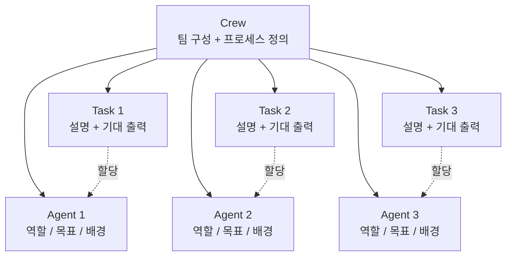
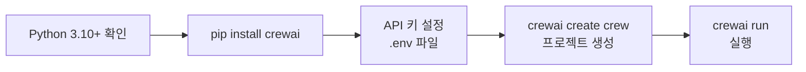
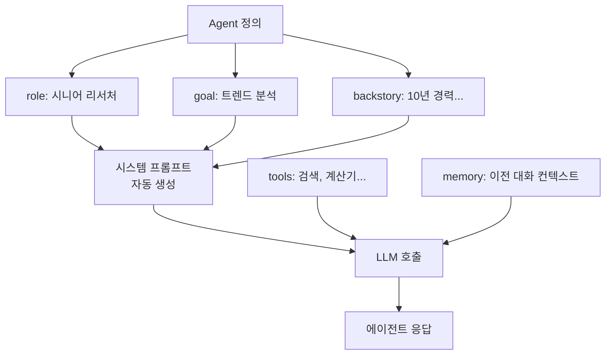
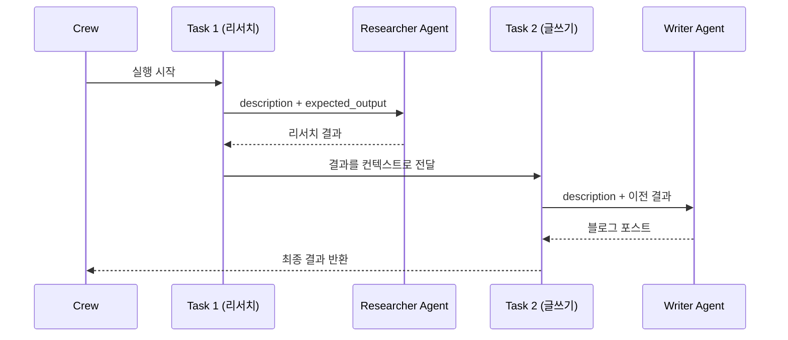
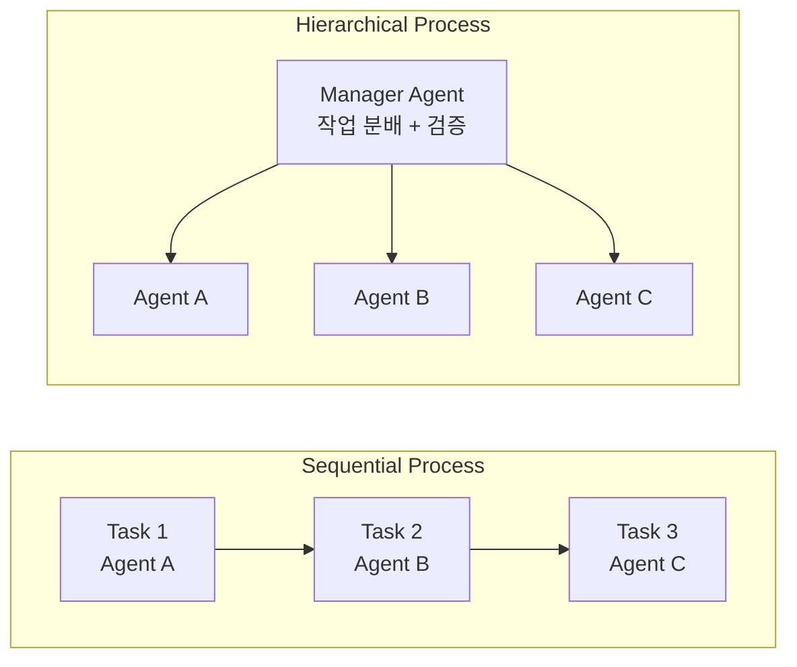

# 01. CrewAI 기초

> 역할 기반 멀티 에이전트 프레임워크 CrewAI의 핵심 개념과 사용법을 배웁니다

## 개요

이 섹션에서는 CrewAI의 설치부터 Agent, Task, Crew의 핵심 3요소, 그리고 순차(Sequential)·계층적(Hierarchical) 프로세스까지 CrewAI의 기초를 전반적으로 학습합니다. 앞서 [멀티 에이전트 아키텍처 패턴](15-supervisor-worker-멀티-에이전트/01-멀티-에이전트-아키텍처-패턴.md)에서 배운 Supervisor/Worker 패턴이 CrewAI에서는 어떤 형태로 구현되는지 비교하며 살펴볼 거예요.

**선수 지식**: LangGraph StateGraph 기초(Ch4~5), Supervisor/Worker 멀티 에이전트 패턴(Ch15)
**학습 목표**:
- CrewAI의 철학과 설계 원칙을 이해할 수 있다
- Agent의 역할(role)·목표(goal)·배경(backstory)을 설계할 수 있다
- Task를 정의하고 Agent에 할당할 수 있다
- Crew를 구성하여 순차/계층적 프로세스로 실행할 수 있다

## 왜 알아야 할까?

LangGraph는 그래프 기반 상태 머신으로 에이전트를 정밀하게 제어하는 데 탁월하지만, 때로는 "리서처 에이전트에게 조사를 시키고, 작가 에이전트에게 글을 쓰게 하고 싶다"는 요구를 코드 몇 줄로 표현하고 싶을 때가 있죠. CrewAI는 바로 이런 상황을 위해 설계되었습니다.

CrewAI는 GitHub 스타 45,000+개를 기록한 오픈소스 프레임워크로, Fortune 500 기업의 60% 이상이 사용하고 있어요. "역할 놀이(Role-Playing)" 개념을 핵심에 두어, 에이전트에게 역할·목표·배경을 부여하면 마치 팀원처럼 협업하는 구조를 제공합니다. LangGraph와는 철학이 상당히 다른데, 이 차이를 이해하면 프로젝트 특성에 맞는 최적의 도구를 고를 수 있게 됩니다.

## 핵심 개념

### 개념 1: CrewAI의 철학 — "역할 기반 협업"

> 💡 **비유**: CrewAI는 마치 **영화 촬영팀**과 같습니다. 감독(Supervisor)이 있고, 카메라 감독·조명 감독·음향 감독 각자가 자기 전문 분야의 역할(role)과 목표(goal)를 갖고 있죠. 감독이 "오늘 이 장면을 찍는다"고 태스크를 주면, 각 팀원이 자기 전문성을 살려 자율적으로 작업합니다.

CrewAI는 LangGraph처럼 노드와 엣지를 직접 설계하는 대신, **"누가(Agent) 무엇을(Task) 어떤 순서로(Process) 할 것인가"**를 선언적으로 정의합니다. 핵심 구성 요소는 딱 세 가지예요:

| 구성 요소 | 역할 | LangGraph 대응 |
|-----------|------|----------------|
| **Agent** | 역할·목표·배경을 가진 자율적 실행 주체 | 노드 함수 + 시스템 프롬프트 |
| **Task** | Agent가 수행할 구체적 작업 단위 | 노드 내부 로직 |
| **Crew** | Agent와 Task를 묶어 실행하는 팀 | StateGraph + compile() |

> 📊 **그림 1**: CrewAI의 핵심 3요소 관계



CrewAI의 창시자 João Moura는 브라질 상파울루 출신의 소프트웨어 엔지니어로, 약 20년의 경력을 가지고 있어요. 그가 CrewAI를 만든 계기가 재미있는데, 처음에는 LinkedIn 포스트를 효율적으로 작성해주는 간단한 에이전트를 만들었다가, "에이전트를 만들고 배포하는 장벽이 불필요하게 높다"는 사실을 깨달은 거예요. Clearbit에서 AI 엔지니어링 디렉터로 근무하던 그는, 2023년 Clearbit이 HubSpot에 인수된 후 본격적으로 CrewAI를 개발하기 시작했습니다. "역할 놀이(Role-Playing)"라는 핵심 아이디어 — 에이전트에게 직함·목표·배경을 부여하면 복잡한 프롬프트 엔지니어링 없이도 해당 역할에 맞는 행동을 유도할 수 있다는 관찰 — 가 개발자 커뮤니티에서 폭발적인 반응을 얻었고, 2024년에는 Insight Partners 주도로 1,800만 달러의 시리즈 A 펀딩을 유치했습니다.

### 개념 2: 설치와 환경 설정

> 💡 **비유**: CrewAI를 설치하는 건 새 프로젝트에 팀원을 초대하는 것과 같아요. 먼저 팀을 구성할 수 있는 환경(Python)을 갖추고, 팀 운영 도구(CrewAI 패키지)를 설치하면 됩니다.

CrewAI는 Python 3.10 이상, 3.14 미만을 요구합니다. 설치 방법은 두 가지예요:

```python
# 방법 1: pip으로 직접 설치 (가장 간단)
# pip install crewai
# pip install 'crewai[tools]'  # 도구 패키지 포함 (권장)

# 방법 2: uv 사용 (CrewAI 공식 권장)
# uv tool install crewai
```

설치 후 버전을 확인해봅시다:

```run:python
# CrewAI 설치 확인 (실제 환경에서 실행)
import crewai
print(f"CrewAI 버전: {crewai.__version__}")
print(f"Python 요구사항: >=3.10, <3.14")
```

```output
CrewAI 버전: 0.175.0
Python 요구사항: >=3.10, <3.14
```

환경 변수 설정도 필요합니다. CrewAI는 기본적으로 OpenAI를 사용하지만, 다양한 LLM을 지원해요:

```python
import os

# .env 파일 또는 환경 변수로 설정
os.environ["OPENAI_API_KEY"] = "sk-..."          # OpenAI (기본)
os.environ["ANTHROPIC_API_KEY"] = "sk-ant-..."    # Anthropic Claude
os.environ["OPENAI_MODEL_NAME"] = "gpt-4o"        # 기본 모델 변경
```

> 📊 **그림 2**: CrewAI 설치 및 프로젝트 생성 흐름



### 개념 3: Agent — 역할 기반 에이전트 설계

> 💡 **비유**: Agent를 만드는 건 채용 공고를 작성하는 것과 비슷합니다. "당신의 직함은 시니어 리서처이고(role), 목표는 최신 AI 트렌드를 분석하는 것이며(goal), 10년 경력의 AI 연구원 배경을 가지고 있습니다(backstory)"라고 명세하면, 에이전트가 그 역할에 맞게 행동합니다.

Agent는 CrewAI의 가장 핵심적인 구성 요소입니다. 세 가지 필수 속성이 에이전트의 정체성을 결정해요:

| 속성 | 설명 | 프롬프트 엔지니어링 관점 |
|------|------|------------------------|
| **role** | 에이전트의 직함/전문 분야 | 시스템 프롬프트의 역할 정의 |
| **goal** | 에이전트가 달성해야 할 목표 | 행동 방향 지시 |
| **backstory** | 경험과 성격을 서술한 배경 | 응답 스타일과 깊이 결정 |

이 세 속성은 단순히 메타데이터가 아닙니다. CrewAI가 내부적으로 이들을 조합하여 LLM에 보낼 시스템 프롬프트를 자동 생성해요. 잘 설계된 role/goal/backstory는 별도의 프롬프트 엔지니어링 없이도 높은 품질의 출력을 만들어냅니다.

```python
from crewai import Agent

# 리서처 에이전트 정의
researcher = Agent(
    role="시니어 AI 리서처",
    goal="최신 AI 에이전트 기술 트렌드를 분석하고 핵심 인사이트를 도출한다",
    backstory=(
        "당신은 10년 경력의 AI 연구원으로, "
        "특히 멀티 에이전트 시스템과 LLM 활용에 전문성을 갖고 있습니다. "
        "복잡한 기술 논문을 읽고 핵심을 간결하게 정리하는 능력이 탁월합니다."
    ),
    llm="gpt-4o",          # 사용할 LLM 모델
    verbose=True,           # 실행 과정 출력
    memory=True,            # 대화 메모리 활성화
    max_iter=15,            # 최대 반복 횟수
    allow_delegation=False  # 다른 에이전트에 위임 허용 여부
)

# 작가 에이전트 정의
writer = Agent(
    role="테크니컬 라이터",
    goal="AI 기술을 비전문가도 이해할 수 있는 콘텐츠로 변환한다",
    backstory=(
        "당신은 기술 블로그와 뉴스레터 작성 경험이 풍부한 라이터입니다. "
        "복잡한 기술 개념을 쉬운 비유와 명확한 구조로 설명하는 데 뛰어납니다."
    ),
    llm="gpt-4o",
    verbose=True,
    memory=True
)
```

Agent의 주요 선택적 파라미터를 정리하면 다음과 같습니다:

| 파라미터 | 타입 | 기본값 | 설명 |
|----------|------|--------|------|
| `tools` | `List[BaseTool]` | `[]` | 에이전트가 사용할 도구 목록 |
| `llm` | `str / LLM` | `"gpt-4"` | 사용할 LLM 모델 |
| `memory` | `bool` | `False` | 인터랙션 히스토리 유지 |
| `verbose` | `bool` | `False` | 상세 로그 출력 |
| `max_iter` | `int` | `20` | 최대 반복 횟수 |
| `allow_delegation` | `bool` | `False` | 타 에이전트 위임 허용 |
| `max_execution_time` | `int` | `None` | 최대 실행 시간(초) |
| `cache` | `bool` | `True` | 도구 사용 캐싱 |

> 📊 **그림 3**: Agent의 내부 구조와 LLM 프롬프트 변환



### 개념 4: Task — 작업 단위 정의

> 💡 **비유**: Task는 프로젝트 관리 도구(Jira, Linear 등)의 **티켓**과 같아요. "무엇을 해야 하는지(description)", "누가 할 것인지(agent)", "결과물이 어떤 형태여야 하는지(expected_output)"를 명확히 적어둡니다.

Task는 Agent가 수행할 구체적인 작업을 정의합니다. 핵심 속성 세 가지를 살펴볼까요:

```python
from crewai import Task

# 리서치 태스크
research_task = Task(
    description=(
        "2026년 AI 에이전트 프레임워크 시장을 조사하세요. "
        "주요 프레임워크(LangGraph, CrewAI, AutoGen 등)의 "
        "최신 버전, 핵심 기능, 채택률을 비교 분석하세요."
    ),
    expected_output=(
        "각 프레임워크별 장단점과 사용 사례를 포함한 "
        "구조화된 비교 분석 보고서 (마크다운 형식)"
    ),
    agent=researcher  # 이 태스크를 수행할 에이전트
)

# 글쓰기 태스크
writing_task = Task(
    description=(
        "리서치 결과를 바탕으로 개발자 대상 블로그 포스트를 작성하세요. "
        "각 프레임워크를 언제 선택해야 하는지 실용적인 가이드를 제공하세요."
    ),
    expected_output=(
        "2000자 내외의 블로그 포스트. "
        "비유와 코드 예시를 포함하여 이해하기 쉽게 작성."
    ),
    agent=writer
)
```

순차(Sequential) 프로세스에서는 **이전 Task의 출력이 자동으로 다음 Task의 컨텍스트로 전달**됩니다. 즉 위 예시에서 `research_task`의 결과가 `writing_task`에게 자동으로 넘어가요. 별도의 상태 전달 코드를 작성할 필요가 없죠 — LangGraph에서 상태 스키마와 리듀서를 직접 정의해야 했던 것과 대비됩니다.

Task의 추가 옵션도 있습니다:

```python
# 고급 Task 설정 예시
advanced_task = Task(
    description="데이터를 분석하고 시각화 보고서를 생성하세요",
    expected_output="차트와 인사이트가 포함된 PDF 보고서",
    agent=researcher,
    context=[research_task],      # 명시적으로 다른 Task의 결과 참조
    output_file="report.md",      # 결과를 파일로 저장
    human_input=True              # 실행 전 사람의 확인 요청
)
```

> 📊 **그림 4**: 순차 프로세스에서 Task 간 컨텍스트 전달



### 개념 5: Crew와 Process — 팀 구성과 실행 전략

> 💡 **비유**: Crew는 **프로젝트 팀**이고, Process는 **팀의 일하는 방식**입니다. 순차(Sequential) 프로세스는 릴레이 경주처럼 한 사람이 끝나면 다음 사람에게 바통을 넘기는 방식이고, 계층적(Hierarchical) 프로세스는 팀장이 적절한 팀원에게 일을 분배하고 결과를 검수하는 방식이에요.

CrewAI는 두 가지 프로세스 타입을 제공합니다:

**1. Sequential Process (순차 프로세스)**
- Task가 정의된 순서대로 하나씩 실행됩니다
- 각 Task의 출력이 다음 Task의 입력으로 자동 전달됩니다
- 파이프라인 형태의 작업에 적합합니다

**2. Hierarchical Process (계층적 프로세스)**
- 자동으로 Manager 에이전트가 생성됩니다
- Manager가 Task를 적절한 에이전트에게 동적으로 위임합니다
- Manager가 결과를 검증하고 필요시 재작업을 지시합니다
- 복잡한 프로젝트에 적합합니다

> 📊 **그림 5**: Sequential vs Hierarchical 프로세스 비교



```python
from crewai import Crew, Process

# 순차 프로세스 Crew
sequential_crew = Crew(
    agents=[researcher, writer],
    tasks=[research_task, writing_task],
    process=Process.sequential,  # 순차 실행
    verbose=True
)

# 계층적 프로세스 Crew
hierarchical_crew = Crew(
    agents=[researcher, writer],
    tasks=[research_task, writing_task],
    process=Process.hierarchical,  # Manager가 자동 생성됨
    manager_llm="gpt-4o",         # Manager가 사용할 LLM
    verbose=True
)
```

두 프로세스의 차이를 정리하면:

| 기준 | Sequential | Hierarchical |
|------|-----------|--------------|
| **실행 순서** | tasks 리스트 순서 | Manager가 동적 결정 |
| **컨텍스트 전달** | 이전 Task → 다음 Task 자동 | Manager가 필요한 정보 전달 |
| **Manager** | 없음 | 자동 생성 |
| **위임** | 불가 | Manager가 위임/재위임 가능 |
| **검증** | 없음 | Manager가 결과 검증 |
| **적합한 경우** | 순서가 명확한 파이프라인 | 복잡하고 동적인 작업 |
| **LangGraph 대응** | 직선형 엣지 그래프 | Supervisor 패턴 |

## 실습: 직접 해보기

이제 리서치-작성 파이프라인을 직접 만들어봅시다. 두 명의 에이전트가 협업하여 기술 보고서를 생성하는 Crew입니다.

```python
"""CrewAI 기초 실습: 리서치-작성 파이프라인"""

from crewai import Agent, Task, Crew, Process

# ── 1. 에이전트 정의 ──────────────────────────────────
researcher = Agent(
    role="AI 기술 리서처",
    goal="주어진 주제에 대해 깊이 있는 기술 분석을 수행한다",
    backstory=(
        "당신은 AI 스타트업에서 5년간 근무한 시니어 리서처입니다. "
        "기술 논문을 읽고 실무적 시사점을 추출하는 데 뛰어납니다. "
        "항상 근거 기반으로 분석하며, 추측은 명시적으로 구분합니다."
    ),
    llm="gpt-4o",
    verbose=True,
    memory=True
)

writer = Agent(
    role="테크 블로그 에디터",
    goal="기술 분석 결과를 개발자 독자가 이해하기 쉬운 글로 변환한다",
    backstory=(
        "당신은 10년 경력의 테크 라이터로, "
        "복잡한 기술을 명확한 비유와 구조로 설명합니다. "
        "항상 '왜 중요한가'를 먼저 설명하고, "
        "실용적 코드 예시를 곁들입니다."
    ),
    llm="gpt-4o",
    verbose=True,
    memory=True
)

# ── 2. 태스크 정의 ──────────────────────────────────
research_task = Task(
    description=(
        "MCP(Model Context Protocol)와 A2A(Agent-to-Agent) 프로토콜을 비교 분석하세요. "
        "각 프로토콜의 목적, 아키텍처, 사용 사례, 현재 채택 현황을 조사하세요."
    ),
    expected_output=(
        "MCP vs A2A 비교 분석 보고서. 마크다운 형식으로 "
        "각 프로토콜의 개요, 핵심 차이점, 상호보완 관계를 정리."
    ),
    agent=researcher
)

writing_task = Task(
    description=(
        "리서치 결과를 바탕으로 '개발자가 알아야 할 MCP vs A2A' "
        "블로그 포스트를 작성하세요. 비유를 활용하고, "
        "각 프로토콜을 언제 쓸지 실용적 가이드를 제공하세요."
    ),
    expected_output=(
        "1500자 내외의 블로그 포스트. "
        "도입-비교-결론 구조, 비유 2개 이상 포함."
    ),
    agent=writer,
    output_file="mcp_vs_a2a_blog.md"  # 결과를 파일로 저장
)

# ── 3. Crew 구성 및 실행 ────────────────────────────
crew = Crew(
    agents=[researcher, writer],
    tasks=[research_task, writing_task],
    process=Process.sequential,  # 리서치 → 글쓰기 순서
    verbose=True
)

# 실행 (kickoff)
result = crew.kickoff()

# 결과 확인
print("=" * 60)
print("최종 결과:")
print("=" * 60)
print(result.raw)                      # 원본 텍스트
print(f"\n총 토큰 사용량: {result.token_usage}")
```

실행하면 다음과 같은 흐름으로 진행됩니다:

```run:python
# Crew 실행 흐름 시뮬레이션
steps = [
    ("1", "Crew.kickoff() 호출"),
    ("2", "Sequential Process: Task 1 시작"),
    ("3", "Researcher Agent가 MCP vs A2A 분석 수행"),
    ("4", "Task 1 완료 → 결과를 Task 2 컨텍스트로 전달"),
    ("5", "Writer Agent가 블로그 포스트 작성"),
    ("6", "Task 2 완료 → 파일 저장 (mcp_vs_a2a_blog.md)"),
    ("7", "Crew 실행 완료 → CrewOutput 반환"),
]

for step, desc in steps:
    print(f"[Step {step}] {desc}")
```

```output
[Step 1] Crew.kickoff() 호출
[Step 2] Sequential Process: Task 1 시작
[Step 3] Researcher Agent가 MCP vs A2A 분석 수행
[Step 4] Task 1 완료 → 결과를 Task 2 컨텍스트로 전달
[Step 5] Writer Agent가 블로그 포스트 작성
[Step 6] Task 2 완료 → 파일 저장 (mcp_vs_a2a_blog.md)
[Step 7] Crew 실행 완료 → CrewOutput 반환
```

계층적 프로세스로 전환하는 것도 단 한 줄이면 됩니다:

```python
# 계층적 프로세스로 전환 — 변경 사항은 process와 manager_llm뿐
hierarchical_crew = Crew(
    agents=[researcher, writer],
    tasks=[research_task, writing_task],
    process=Process.hierarchical,  # 이 한 줄만 변경!
    manager_llm="gpt-4o",         # Manager가 사용할 LLM
    verbose=True
)

# kickoff_for_each: 여러 입력에 대해 반복 실행
results = hierarchical_crew.kickoff_for_each(
    inputs=[
        {"topic": "MCP vs A2A"},
        {"topic": "LangGraph vs CrewAI"},
    ]
)
```

## 더 깊이 알아보기

### CrewAI의 탄생 — LinkedIn 포스트에서 시작된 혁명

CrewAI의 시작은 의외로 소박했어요. 창시자 João Moura는 Clearbit의 AI 엔지니어링 디렉터로 일하던 중, LinkedIn 포스트를 더 효율적으로 작성하기 위해 간단한 에이전트를 만들었습니다. 그런데 이 작은 실험에서 큰 깨달음을 얻었죠 — "유용한 에이전트를 만들고 배포하는 데 필요한 장벽이 불필요하게 높다"는 것이었습니다.

2023년 Clearbit이 HubSpot에 인수된 후, Moura는 이 문제를 본격적으로 풀기로 결심합니다. 그의 핵심 아이디어는 "역할 놀이(Role-Playing)"였어요. 에이전트에게 직함·목표·배경을 부여하면, 복잡한 프롬프트 엔지니어링 없이도 해당 역할에 맞는 행동을 자연스럽게 유도할 수 있다는 관찰이었죠.

이 접근이 개발자 커뮤니티에서 폭발적인 반응을 얻으면서, CrewAI는 출시 1년 만에 약 20억 건의 에이전틱 실행을 처리하는 플랫폼으로 성장했습니다. 2024년 10월에는 Insight Partners 주도로 1,800만 달러의 시리즈 A 펀딩을 받고, Enterprise Cloud 플랫폼을 출시했어요.

### Crews와 Flows — 이중 아키텍처의 비밀

CrewAI v1.0부터 도입된 이중 아키텍처(Dual Architecture)는 CrewAI만의 독특한 설계입니다:

- **Crews**: 에이전트 팀의 자율적 협업에 초점. "이 팀에게 이 일을 맡긴다"는 선언적 방식
- **Flows**: 프로덕션 워크플로우를 위한 이벤트 기반 오케스트레이션. 에러 핸들링, 재시도, 상태 관리 포함

Flows는 다음 섹션 [CrewAI Flows와 프로덕션 워크플로우](16-crewai와-langgraph-비교/02-crewai-flows와-프로덕션-워크플로우.md)에서 자세히 다룹니다.

## 흔한 오해와 팁

> ⚠️ **흔한 오해**: "CrewAI는 간단한 래퍼라서 프로덕션에는 부적합하다"고 생각하는 분이 있는데, 이는 잘못된 인식입니다. CrewAI Flows는 하루 1,200만 건 이상의 실행을 처리하는 엔터프라이즈급 시스템으로, Fortune 500 기업의 60% 이상이 사용 중이에요. 다만 Crews만으로 프로덕션에 나가기보다, Flows로 감싸서 에러 핸들링과 상태 관리를 추가하는 것이 권장 패턴입니다.

> 💡 **알고 계셨나요?**: CrewAI의 `allow_delegation=True`를 설정하면, 에이전트가 자신에게 할당된 태스크를 다른 에이전트에게 위임할 수 있어요. 이건 계층적 프로세스의 Manager만의 기능이 아니라, 순차 프로세스에서도 에이전트 간 동적 협업을 가능하게 합니다. 다만 기본값이 `False`인 이유가 있어요 — 무분별한 위임은 무한 루프를 유발할 수 있거든요.

> 🔥 **실무 팁**: Agent의 `backstory`를 작성할 때 "당신은 전문가입니다" 같은 일반적인 설명 대신, **구체적인 행동 지침**을 포함하세요. 예를 들어 "항상 출처를 명시하며, 불확실한 정보는 '추정'이라고 표시합니다" 같은 행동 규칙을 backstory에 넣으면 출력 품질이 크게 향상됩니다. backstory는 사실상 시스템 프롬프트의 일부가 되기 때문이에요.

## 핵심 정리

| 개념 | 설명 |
|------|------|
| **CrewAI** | 역할 기반 멀티 에이전트 프레임워크. Agent/Task/Crew 3요소로 구성 |
| **Agent** | role(역할), goal(목표), backstory(배경)으로 정의되는 자율적 실행 주체 |
| **Task** | description(설명), expected_output(기대 출력), agent(담당자)로 정의되는 작업 단위 |
| **Crew** | Agent와 Task를 묶어 실행하는 팀. Process 타입으로 실행 전략 결정 |
| **Sequential Process** | Task를 순서대로 실행. 이전 결과가 다음 Task의 컨텍스트로 자동 전달 |
| **Hierarchical Process** | Manager Agent가 자동 생성되어 Task를 동적으로 위임·검증 |
| **kickoff()** | Crew 실행을 시작하는 메서드. CrewOutput 객체 반환 |
| **kickoff_for_each()** | 여러 입력에 대해 Crew를 반복 실행하는 배치 메서드 |

## 다음 섹션 미리보기

다음 섹션 [CrewAI Flows와 프로덕션 워크플로우](16-crewai와-langgraph-비교/02-crewai-flows와-프로덕션-워크플로우.md)에서는 CrewAI의 이중 아키텍처 중 두 번째 축인 **Flows**를 다룹니다. Flows는 이벤트 기반 워크플로우 엔진으로, `@start`, `@listen`, `@router` 데코레이터를 사용하여 Crew 실행을 프로덕션급으로 오케스트레이션하는 방법을 배울 거예요. LangGraph의 StateGraph와 가장 직접적으로 비교되는 부분이기도 합니다.

## 참고 자료

- [CrewAI 공식 문서](https://docs.crewai.com/) - Agent, Task, Crew의 전체 API 레퍼런스와 튜토리얼
- [CrewAI GitHub 리포지토리](https://github.com/crewAIInc/crewAI) - 소스 코드, 이슈 트래커, 릴리스 노트 (v1.10.1)
- [CrewAI 오픈소스 소개](https://crewai.com/open-source) - 프레임워크의 설계 철학과 아키텍처 개관
- [Building Multi-Agent Systems With CrewAI (Firecrawl)](https://www.firecrawl.dev/blog/crewai-multi-agent-systems-tutorial) - 포괄적인 실전 튜토리얼
- [CrewAI: The Revolutionary Multi-Agent Framework (BrightCoding)](https://www.blog.brightcoding.dev/2026/02/13/crewai-the-revolutionary-multi-agent-framework) - 2026년 기준 CrewAI 리뷰

---
### 🔗 Related Sessions
- [stategraph](04-ch4-langgraph-stategraph-기초/01-01-langgraph-아키텍처-개관.md) (prerequisite)
- [tool calling](01-ch1-llm-도구-호출의-이해/02-02-llm-tool-calling-메커니즘.md) (prerequisite)
