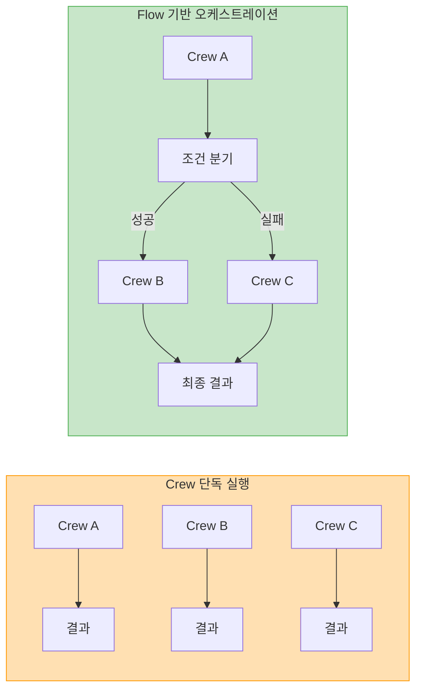
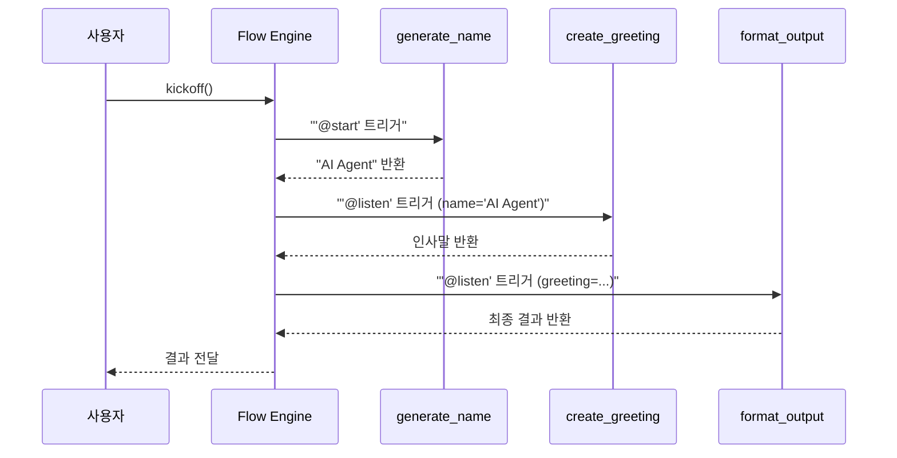
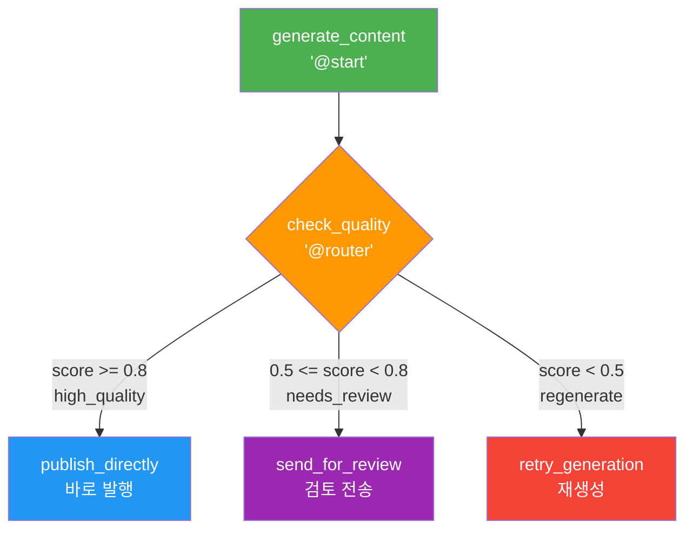
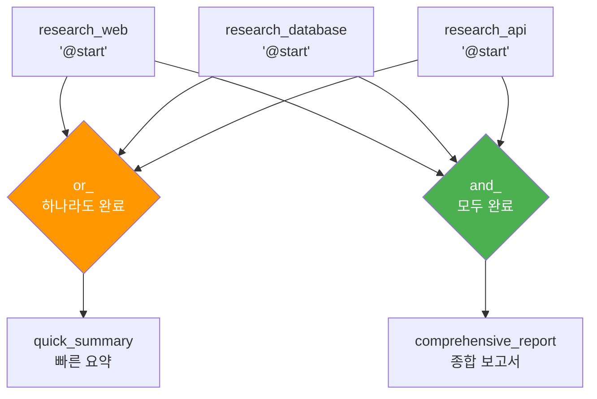
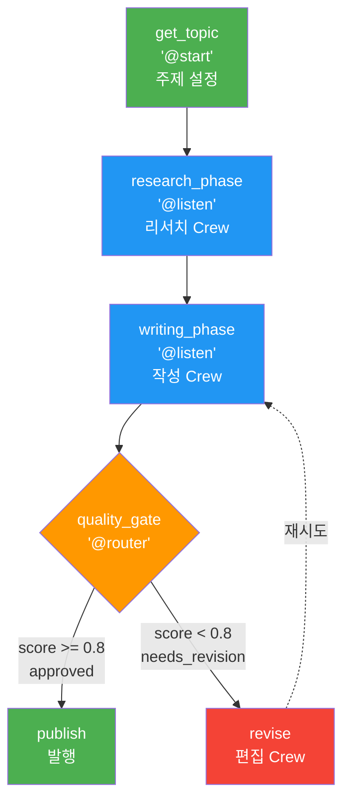

# CrewAI Flows와 프로덕션 워크플로우

> CrewAI Flows의 이벤트 기반 아키텍처로 복잡한 멀티에이전트 워크플로우를 설계하고 프로덕션에 적용하는 방법을 학습합니다.

## 개요

이 섹션에서는 CrewAI의 **Flows** 시스템을 깊이 있게 다룹니다. Flows는 여러 Crew를 연결하고, 조건 분기와 상태 관리를 통해 복잡한 프로덕션 워크플로우를 구성하는 이벤트 기반 오케스트레이션 프레임워크입니다.

**선수 지식**: [아키텍처 철학 비교](16-ch16-crewai와-langgraph-비교/01-아키텍처-철학-비교.md)에서 다룬 CrewAI와 LangGraph의 근본적 차이, [CrewAI 소개](10-ch10-crewai-기초/01-crewai-소개와-철학.md)에서 배운 Agent/Task/Crew 기본 개념

**학습 목표**:
- Flow와 `@start`, `@listen`, `@router` 데코레이터의 역할을 이해한다
- 구조적/비구조적 상태 관리 방식을 구분하고 적용한다
- `or_`/`and_` 연산자로 복잡한 이벤트 의존성을 설계한다
- Crew와 Flow를 결합하여 프로덕션 수준의 파이프라인을 구축한다

## 왜 알아야 할까?

CrewAI로 에이전트를 만드는 건 어렵지 않습니다. 하지만 "이 에이전트가 끝나면 저 에이전트를 실행하고, 결과에 따라 분기하고, 중간에 사람 승인을 받고..." 같은 **실제 비즈니스 워크플로우**를 구현하려면 어떻게 해야 할까요?

바로 이 문제를 해결하기 위해 CrewAI Flows가 탄생했습니다. Flows는 여러 Crew를 **파이프라인처럼 연결**하면서도, 조건 분기, 병렬 실행, 상태 공유 같은 프로덕션 필수 기능을 제공합니다. 실제로 CrewAI를 프로덕션에 도입한 기업들이 가장 많이 사용하는 기능이 바로 Flows입니다.

> 📊 **그림 1**: Crew 단독 실행 vs Flow 기반 오케스트레이션 비교



## 핵심 개념

### 개념 1: Flow의 기본 — `@start`와 `@listen`

> 💡 **비유**: Flow를 **도미노**라고 생각해보세요. 첫 번째 도미노(`@start`)를 넘어뜨리면, 각 도미노가 다음 도미노를 자동으로 넘어뜨립니다(`@listen`). 어떤 도미노가 넘어졌는지에 따라 다음에 넘어질 도미노가 결정되죠.

CrewAI Flows의 핵심은 **데코레이터 기반 이벤트 체이닝**입니다. `@start()`는 Flow가 시작될 때 실행되는 메서드를, `@listen()`은 특정 메서드가 완료되면 자동으로 실행되는 메서드를 지정합니다.

```run:python
from crewai.flow.flow import Flow, listen, start

class GreetingFlow(Flow):
    @start()
    def generate_name(self):
        # 첫 번째 단계: 이름 생성
        print("1단계: 이름을 생성합니다")
        return "AI Agent"

    @listen(generate_name)
    def create_greeting(self, name):
        # 두 번째 단계: 인사말 생성 (이전 단계 결과를 자동으로 받음)
        greeting = f"안녕하세요, {name}님! 환영합니다."
        print(f"2단계: 인사말 생성 → {greeting}")
        return greeting

    @listen(create_greeting)
    def format_output(self, greeting):
        # 세 번째 단계: 최종 포맷팅
        result = f"✉️ {greeting} (CrewAI Flows 생성)"
        print(f"3단계: 최종 출력 → {result}")
        return result

# Flow 실행
flow = GreetingFlow()
result = flow.kickoff()
print(f"\n최종 결과: {result}")
```

```output
1단계: 이름을 생성합니다
2단계: 인사말 생성 → 안녕하세요, AI Agent님! 환영합니다.
3단계: 최종 출력 → ✉️ 안녕하세요, AI Agent님! 환영합니다. (CrewAI Flows 생성)

최종 결과: ✉️ 안녕하세요, AI Agent님! 환영합니다. (CrewAI Flows 생성)
```

핵심 포인트는 `@listen(generate_name)`에서 `generate_name` 메서드의 **반환값이 자동으로 다음 메서드의 인자로 전달**된다는 것입니다. 이 이벤트 체이닝 덕분에 명시적으로 메서드를 호출할 필요가 없죠.

> 📊 **그림 2**: Flow 데코레이터의 이벤트 체이닝 구조



### 개념 2: `@router`를 활용한 조건 분기

> 💡 **비유**: `@router`는 **기차역의 전환기(Switch)**와 같습니다. 기차(데이터)가 도착하면 전환기가 선로를 바꿔서 기차를 올바른 목적지로 보내죠. 데이터의 상태에 따라 워크플로우의 방향이 달라집니다.

프로덕션 워크플로우에서는 "결과가 좋으면 A로, 나쁘면 B로" 같은 **조건 분기**가 필수입니다. `@router()` 데코레이터는 메서드의 반환값에 따라 다음에 실행할 경로를 결정합니다.

```python
from crewai.flow.flow import Flow, listen, router, start

class QualityCheckFlow(Flow):
    @start()
    def generate_content(self):
        # 콘텐츠 생성 (실제로는 Crew가 처리)
        content = "AI 에이전트는 자율적으로 작업을 수행하는 시스템입니다."
        quality_score = 0.85  # 품질 점수
        return {"content": content, "score": quality_score}

    @router(generate_content)
    def check_quality(self, result):
        # 품질 점수에 따라 경로 결정
        if result["score"] >= 0.8:
            return "high_quality"   # 고품질 → 바로 발행
        elif result["score"] >= 0.5:
            return "needs_review"   # 중간 → 검토 필요
        else:
            return "regenerate"     # 저품질 → 재생성

    @listen("high_quality")
    def publish_directly(self):
        print("✅ 고품질 콘텐츠 — 바로 발행합니다")

    @listen("needs_review")
    def send_for_review(self):
        print("📝 중간 품질 — 검토 큐에 전송합니다")

    @listen("regenerate")
    def retry_generation(self):
        print("🔄 저품질 — 콘텐츠를 재생성합니다")
```

`@router`가 반환하는 **문자열 값**이 `@listen`의 인자와 매칭됩니다. `"high_quality"`를 반환하면 `@listen("high_quality")`가 달린 메서드가 실행되는 거죠. 이 점이 LangGraph의 `conditional_edges`와 유사하면서도, 데코레이터 기반이라 더 직관적입니다.

> 📊 **그림 3**: `@router` 기반 조건 분기 흐름



### 개념 3: 상태 관리 — 비구조적 vs 구조적

> 💡 **비유**: 비구조적 상태는 **메모지에 자유롭게 적는 것**이고, 구조적 상태는 **미리 양식이 정해진 서류**를 작성하는 것입니다. 간단한 메모는 메모지가 편하지만, 중요한 계약서는 양식이 있어야 안전하죠.

Flow는 두 가지 방식으로 상태를 관리할 수 있습니다.

**비구조적 상태(Unstructured State)** — 딕셔너리 기반으로 자유롭게 키-값을 추가합니다:

```python
from crewai.flow.flow import Flow, listen, start

class UnstructuredFlow(Flow):
    @start()
    def init_data(self):
        # self.state는 기본적으로 빈 딕셔너리
        self.state["customer_name"] = "김철수"
        self.state["query"] = "환불 요청"
        self.state["priority"] = "high"

    @listen(init_data)
    def process_query(self):
        # 자유롭게 새로운 키를 추가할 수 있음
        name = self.state["customer_name"]
        self.state["response"] = f"{name}님의 요청을 처리 중입니다"
        self.state["processed"] = True
```

**구조적 상태(Structured State)** — Pydantic `BaseModel`로 스키마를 사전 정의합니다:

```python
from crewai.flow.flow import Flow, listen, start
from pydantic import BaseModel

class CustomerState(BaseModel):
    customer_name: str = ""
    query: str = ""
    priority: str = "normal"
    response: str = ""
    is_resolved: bool = False

class StructuredFlow(Flow[CustomerState]):
    @start()
    def init_data(self):
        # 타입 안전한 상태 접근
        self.state.customer_name = "김철수"
        self.state.query = "환불 요청"
        self.state.priority = "high"

    @listen(init_data)
    def process_query(self):
        # IDE 자동완성 + 타입 검증 지원
        self.state.response = f"{self.state.customer_name}님의 요청을 처리 중입니다"
        self.state.is_resolved = True
        # self.state.invalid_field = "error"  # ← Pydantic이 오류 발생!
```

| 방식 | 장점 | 단점 | 적합한 경우 |
|------|------|------|-------------|
| 비구조적 | 유연, 빠른 프로토타이핑 | 타입 안전성 없음, 오타 위험 | 실험, 소규모 프로젝트 |
| 구조적 | 타입 안전, IDE 지원, 검증 | 사전 정의 필요 | 프로덕션, 팀 협업 |

> 🔥 **실무 팁**: 프로덕션에서는 **반드시 구조적 상태**를 사용하세요. `self.state["cusotmer_name"]` 같은 오타를 Pydantic이 즉시 잡아주거든요. LangGraph의 `TypedDict` 상태 정의와 같은 맥락입니다.

### 개념 4: `or_`와 `and_` — 복잡한 이벤트 의존성

> 💡 **비유**: `or_`는 **어느 문이든 하나만 열리면 들어갈 수 있는 방**이고, `and_`는 **모든 열쇠가 모여야 열리는 금고**입니다.

실제 워크플로우에서는 "A 또는 B가 끝나면 실행" 또는 "A와 B 모두 끝나면 실행" 같은 복합 조건이 필요합니다. CrewAI Flows는 `or_`와 `and_` 연산자로 이를 지원합니다.

```python
from crewai.flow.flow import Flow, listen, start, and_, or_

class ParallelResearchFlow(Flow):
    @start()
    def research_web(self):
        """웹 검색 리서치"""
        return {"source": "web", "data": "웹 검색 결과..."}

    @start()
    def research_database(self):
        """데이터베이스 리서치"""
        return {"source": "db", "data": "DB 조회 결과..."}

    @start()
    def research_api(self):
        """외부 API 리서치"""
        return {"source": "api", "data": "API 응답 결과..."}

    @listen(or_(research_web, research_database, research_api))
    def quick_summary(self, result):
        """어느 하나라도 완료되면 빠른 요약 생성"""
        print(f"⚡ 빠른 요약: {result['source']}에서 먼저 도착")

    @listen(and_(research_web, research_database, research_api))
    def comprehensive_report(self, results):
        """모든 리서치가 완료되면 종합 보고서 작성"""
        print(f"📊 종합 보고서: {len(results)}개 소스 통합")
```

여기서 `@start()` 데코레이터가 3개 있다는 점에 주목하세요. **여러 `@start`는 자동으로 병렬 실행**됩니다. `or_`는 가장 빨리 끝나는 결과로 빠르게 대응하고, `and_`는 모든 결과가 모인 후 종합 분석을 수행하는 패턴이죠.

> 📊 **그림 4**: `or_`/`and_` 병렬 이벤트 의존성



이 패턴은 LangGraph의 `Send` API로 팬아웃(fan-out)하고 다시 합치는 것과 유사하지만, `or_`/`and_` 연산자가 훨씬 선언적이고 읽기 쉽습니다.

### 개념 5: Crew + Flow 결합 — 프로덕션 파이프라인

> 💡 **비유**: Flow는 **공장의 컨베이어 벨트 시스템**이고, 각 Crew는 **컨베이어 위의 작업 스테이션**입니다. 벨트(Flow)가 부품(데이터)을 각 스테이션(Crew)으로 순서대로 운반하고, 각 스테이션은 자기 역할에 맞는 작업을 수행하죠.

Flows의 진정한 힘은 **여러 Crew를 하나의 워크플로우로 연결**할 때 발휘됩니다. 각 `@listen` 메서드 안에서 Crew를 실행하면, Crew 간의 데이터 전달과 조건 분기가 자연스럽게 이루어집니다.

```python
from crewai import Agent, Crew, Task
from crewai.flow.flow import Flow, listen, router, start
from pydantic import BaseModel

class ArticleState(BaseModel):
    topic: str = ""
    research: str = ""
    draft: str = ""
    quality_score: float = 0.0
    final_article: str = ""

class ArticlePipelineFlow(Flow[ArticleState]):

    @start()
    def get_topic(self):
        self.state.topic = "AI 에이전트의 미래"
        print(f"📌 주제 설정: {self.state.topic}")

    @listen(get_topic)
    def research_phase(self):
        """리서치 Crew 실행"""
        researcher = Agent(
            role="리서처",
            goal=f"{self.state.topic}에 대한 심층 리서치",
            backstory="10년 경력의 기술 리서처"
        )
        task = Task(
            description=f"{self.state.topic}에 대해 최신 동향을 조사하세요",
            agent=researcher,
            expected_output="리서치 보고서"
        )
        crew = Crew(agents=[researcher], tasks=[task])
        result = crew.kickoff()
        self.state.research = result.raw

    @listen(research_phase)
    def writing_phase(self):
        """작성 Crew 실행"""
        writer = Agent(
            role="작가",
            goal="리서치 기반 고품질 기사 작성",
            backstory="테크 저널리스트 출신 작가"
        )
        task = Task(
            description=f"리서치를 기반으로 기사를 작성하세요:\n{self.state.research}",
            agent=writer,
            expected_output="완성된 기사"
        )
        crew = Crew(agents=[writer], tasks=[task])
        result = crew.kickoff()
        self.state.draft = result.raw
        self.state.quality_score = 0.85  # 실제로는 평가 로직

    @router(writing_phase)
    def quality_gate(self):
        """품질 게이트"""
        if self.state.quality_score >= 0.8:
            return "approved"
        return "needs_revision"

    @listen("approved")
    def publish(self):
        self.state.final_article = self.state.draft
        print("✅ 기사 발행 완료!")

    @listen("needs_revision")
    def revise(self):
        print("📝 수정 필요 — 편집 Crew로 전달")
        # 편집 Crew를 실행하는 로직...
```

> 📊 **그림 5**: Crew + Flow 결합 프로덕션 파이프라인



## 더 깊이 알아보기

### João Moura와 Flows의 탄생

CrewAI의 창시자 **João Moura**는 2024년 중반, 사용자들이 여러 Crew를 순차적으로 실행하기 위해 복잡한 글루 코드를 작성하는 것을 목격했습니다. 그는 Node.js의 **이벤트 루프**와 Apache Airflow의 **DAG(방향 비순환 그래프)** 개념에서 영감을 받아 Flows를 설계했습니다.

핵심 아이디어는 간단했습니다: "Crew는 작업자 팀이고, Flow는 이 팀들을 조율하는 프로젝트 매니저다." 이 비유가 CrewAI의 역할 기반 철학과 완벽히 맞아떨어지면서, Flows는 CrewAI 0.36.0(2024년 8월)에 정식 도입되었습니다.

흥미로운 점은 Flows가 처음에는 **Pipeline**이라는 이름으로 설계되었다가, "파이프라인은 단방향이라는 인상을 준다"는 피드백을 받아 조건 분기와 순환을 강조하는 **Flows**로 이름이 바뀌었다는 것입니다.

### LangGraph와의 상세 비교

| 측면 | CrewAI Flows | LangGraph |
|------|-------------|-----------|
| **상태 정의** | Pydantic BaseModel 또는 dict | TypedDict 또는 Pydantic |
| **흐름 제어** | `@start`, `@listen`, `@router` 데코레이터 | `add_node`, `add_edge`, `add_conditional_edges` |
| **조건 분기** | `@router` → 문자열 매칭 | `conditional_edges` → 함수 반환값 |
| **병렬 실행** | 복수 `@start` + `or_`/`and_` | `Send` API + 팬아웃 |
| **영속성** | 자체 내장 없음 (외부 구현 필요) | 체크포인터 내장 (`SqliteSaver` 등) |
| **시각화** | `flow.plot()` 으로 그래프 생성 | `graph.get_graph().draw_mermaid()` |
| **추상화 수준** | 높음 (비즈니스 로직 중심) | 낮음 (그래프 구조 직접 제어) |

LangGraph의 [체크포인팅과 영속성](09-ch09-langgraph-심화/01-체크포인팅과-영속성.md)은 상태를 자동으로 저장/복원하는 강력한 기능이지만, CrewAI Flows에는 아직 이에 대응하는 내장 기능이 없습니다. 프로덕션에서 Flows의 상태를 영속화하려면 `self.state`를 외부 DB에 직접 저장하는 로직을 구현해야 합니다.

## 실습: 고객 지원 자동화 파이프라인

아래는 실제 프로덕션에서 활용할 수 있는 고객 지원 파이프라인입니다. 고객 문의를 분류하고, 유형에 따라 다른 Crew에 라우팅하는 구조입니다.

```run:python
from crewai.flow.flow import Flow, listen, router, start
from pydantic import BaseModel

# 1) 상태 정의
class SupportState(BaseModel):
    query: str = ""
    category: str = ""
    response: str = ""
    escalated: bool = False

# 2) Flow 정의
class CustomerSupportFlow(Flow[SupportState]):

    @start()
    def receive_query(self):
        self.state.query = "제품 환불을 요청합니다"
        print(f"📩 문의 접수: {self.state.query}")

    @listen(receive_query)
    def classify_query(self):
        # 실제로는 LLM 기반 분류 Crew 사용
        query = self.state.query
        if "환불" in query or "반품" in query:
            self.state.category = "refund"
        elif "고장" in query or "수리" in query:
            self.state.category = "technical"
        else:
            self.state.category = "general"
        print(f"🏷️ 분류 결과: {self.state.category}")

    @router(classify_query)
    def route_to_team(self):
        return self.state.category

    @listen("refund")
    def handle_refund(self):
        self.state.response = "환불 처리팀에서 24시간 내 처리 예정입니다"
        print(f"💰 환불 처리: {self.state.response}")

    @listen("technical")
    def handle_technical(self):
        self.state.response = "기술 지원팀에서 진단을 시작합니다"
        print(f"🔧 기술 지원: {self.state.response}")

    @listen("general")
    def handle_general(self):
        self.state.response = "일반 문의 답변을 준비 중입니다"
        print(f"💬 일반 응대: {self.state.response}")

# 3) 실행
flow = CustomerSupportFlow()
result = flow.kickoff()
print(f"\n📋 최종 상태:")
print(f"   문의: {flow.state.query}")
print(f"   분류: {flow.state.category}")
print(f"   응답: {flow.state.response}")
```

```output
📩 문의 접수: 제품 환불을 요청합니다
🏷️ 분류 결과: refund
💰 환불 처리: 환불 처리팀에서 24시간 내 처리 예정입니다

📋 최종 상태:
   문의: 제품 환불을 요청합니다
   분류: refund
   응답: 환불 처리팀에서 24시간 내 처리 예정입니다
```

이 파이프라인은 `@router` → `@listen("문자열")` 패턴으로 문의 유형별 라우팅을 깔끔하게 처리합니다. 실제 프로덕션에서는 각 `handle_*` 메서드 안에 전문화된 Crew를 배치하면 됩니다.

## 흔한 오해와 팁

> ⚠️ **흔한 오해**: "Flows는 단순히 함수를 순서대로 호출하는 것과 같다"고 생각하기 쉽지만, 실제로는 **이벤트 기반 비동기 실행 엔진**입니다. 여러 `@start`는 병렬로 실행되고, `or_`/`and_`로 복잡한 의존성 그래프를 만들 수 있습니다. 단순 순차 호출이라면 `@listen` 체인 대신 일반 함수 호출이 더 적합합니다.

> 💡 **알고 계셨나요?**: `flow.plot()` 메서드를 호출하면 Flow의 실행 그래프를 **시각적으로 확인**할 수 있습니다. 복잡한 Flow를 디버깅할 때 매우 유용한데, 이 기능은 내부적으로 Mermaid 구문을 생성해서 HTML 파일로 렌더링합니다.

> 🔥 **실무 팁**: Flow 내부에서 Crew를 실행할 때는 `crew.kickoff()`의 결과를 반드시 `self.state`에 저장하세요. `return`만 하면 다음 `@listen`에 전달되지만, 이후 `@router`나 다른 분기에서 접근할 수 없습니다. 상태 관리의 중심은 항상 `self.state`입니다.

## 핵심 정리

| 개념 | 설명 |
|------|------|
| `@start()` | Flow 시작점. 복수 개를 두면 병렬 실행됨 |
| `@listen(method)` | 특정 메서드 완료 시 자동 실행. 반환값이 인자로 전달됨 |
| `@router(method)` | 반환 문자열에 따라 다음 경로를 분기 |
| 비구조적 상태 | `self.state["key"]` — 유연하지만 타입 안전성 없음 |
| 구조적 상태 | `Flow[BaseModel]` — Pydantic 기반 타입 안전한 상태 |
| `or_` | 나열된 메서드 중 하나라도 완료되면 실행 |
| `and_` | 나열된 모든 메서드가 완료되어야 실행 |
| Crew + Flow | Flow 메서드 안에서 Crew를 실행하여 파이프라인 구성 |

## 다음 섹션 미리보기

다음 [LangGraph 고급 패턴](16-ch16-crewai와-langgraph-비교/03-langgraph-고급-패턴.md)에서는 LangGraph의 서브그래프, 동적 라우팅, 스트리밍 등 고급 기능을 실습합니다. CrewAI Flows와 동일한 시나리오를 LangGraph로 구현하면서, 두 프레임워크의 실질적인 개발 경험 차이를 체감하게 됩니다.

## 참고 자료

- [CrewAI Flows 공식 문서](https://docs.crewai.com/concepts/flows) - Flows의 모든 데코레이터와 상태 관리 방식을 상세히 설명합니다
- [CrewAI Flows 가이드](https://docs.crewai.com/guides/flows) - 실전 예제와 함께 단계별 Flow 구축 가이드를 제공합니다
- [CrewAI GitHub — Flow 예제](https://github.com/crewAIInc/crewAI-examples/tree/main/flows) - 공식 예제 리포지토리에서 다양한 Flow 패턴을 확인할 수 있습니다
- [Building AI Agent Pipelines with CrewAI Flows](https://blog.crewai.com/building-ai-agent-pipelines-with-crewai-flows) - Flows를 활용한 프로덕션 파이프라인 구축 사례를 소개합니다
- [CrewAI vs LangGraph 비교 분석](https://docs.crewai.com/concepts/flows#comparison-with-langgraph) - 공식 문서에서 제공하는 LangGraph와의 상세 비교입니다

---
### 🔗 Related Sessions
- [checkpoint](06-ch6-체크포인트와-영속적-실행/01-01-체크포인트-시스템-이해.md) (prerequisite)
- [stategraph](04-ch4-langgraph-stategraph-기초/01-01-langgraph-아키텍처-개관.md) (prerequisite)
- [crewai](16-ch16-crewai와-langgraph-비교/01-01-crewai-기초.md) (prerequisite)
- [crew](16-ch16-crewai와-langgraph-비교/01-01-crewai-기초.md) (prerequisite)
- [agent](01-ch1-llm-도구-호출의-이해/01-01-ai-에이전트란-무엇인가.md) (prerequisite)
- [sequential_process](16-ch16-crewai와-langgraph-비교/01-01-crewai-기초.md) (prerequisite)
- [hierarchical_process](16-ch16-crewai와-langgraph-비교/01-01-crewai-기초.md) (prerequisite)
- [kickoff](16-ch16-crewai와-langgraph-비교/01-01-crewai-기초.md) (prerequisite)
