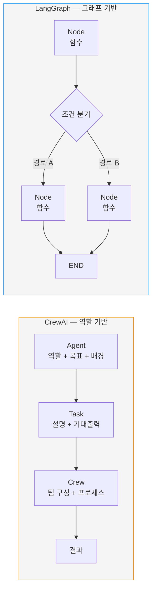
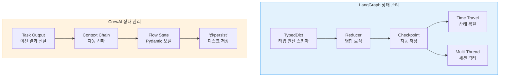
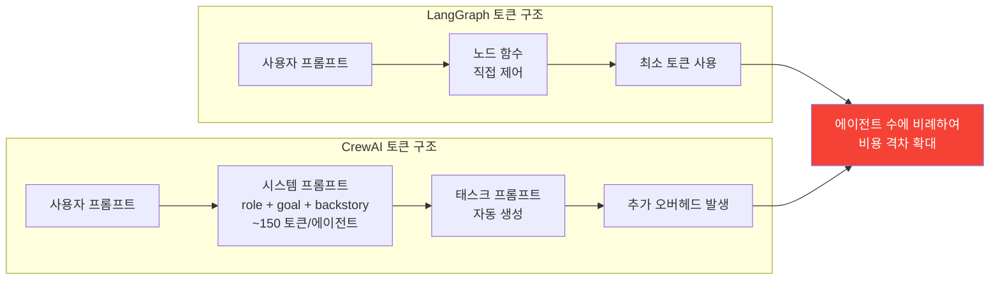
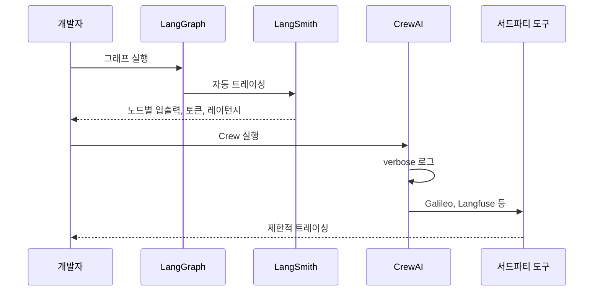
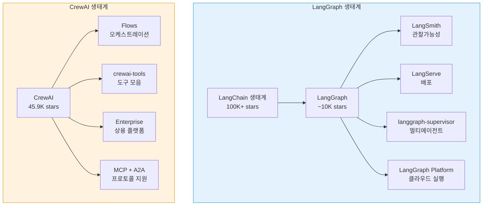

# CrewAI vs LangGraph 심층 비교

> CrewAI와 LangGraph를 아키텍처, 상태 관리, 성능, 생태계, 적합 사용 사례 등 다양한 축으로 정면 비교한다

## 개요

이 섹션에서는 앞서 두 세션에 걸쳐 학습한 CrewAI의 핵심 개념(Agent/Task/Crew, Flows)과 이 코스 전반에서 다뤄온 LangGraph를 **동일한 기준으로 심층 비교**합니다. 단순한 "어느 쪽이 낫다"가 아니라, 각 프레임워크의 설계 철학이 어떤 상황에서 강점과 약점으로 작용하는지를 구체적인 코드와 데이터로 분석합니다.

**선수 지식**: [CrewAI 기초](16-ch16-crewai와-langgraph-비교/01-01-crewai-기초.md)의 Agent/Task/Crew 개념, [CrewAI Flows](16-ch16-crewai와-langgraph-비교/02-02-crewai-flows와-프로덕션-워크플로우.md)의 이벤트 기반 오케스트레이션, [LangGraph StateGraph 기초](04-ch4-langgraph-stategraph-기초/01-01-langgraph-아키텍처-개관.md)의 노드/엣지/상태 스키마
**학습 목표**:
- CrewAI와 LangGraph의 아키텍처 차이를 설명할 수 있다
- 유연성 vs 편의성 트레이드오프를 구체적 사례로 평가할 수 있다
- 토큰 소비·레이턴시 등 프로덕션 비용 차이를 이해할 수 있다
- 커뮤니티·생태계 성숙도를 기준으로 프레임워크를 비교할 수 있다

## 왜 알아야 할까?

"프레임워크 선택"은 프로젝트 초기에 내리는 결정 중 **가장 되돌리기 어려운 것** 중 하나입니다. 팀이 특정 프레임워크로 에이전트를 구축하고 프로덕션에 배포한 뒤, 6개월 후에 "다른 게 더 나았을 텐데"라고 후회하면 마이그레이션 비용은 어마어마하거든요.

지금 AI 에이전트 프레임워크 시장은 LangGraph, CrewAI, AutoGen, PydanticAI 등이 치열하게 경쟁하고 있는데요. 이 중 **CrewAI(GitHub 45,900+ stars)와 LangGraph(LangChain 생태계의 일부로, LangGraph 자체는 ~10K stars)**가 가장 큰 두 축입니다. 둘 다 멀티 에이전트 시스템을 구축할 수 있지만, 설계 철학이 **근본적으로 다릅니다**. 이 차이를 이해하지 못하면, 단순한 워크플로우에 과도한 그래프를 설계하거나, 복잡한 파이프라인에 역할 기반 추상화를 억지로 끼워 맞추는 실수를 하게 됩니다.

이번 세션에서 두 프레임워크를 체계적으로 비교한 뒤, [다음 세션](16-ch16-crewai와-langgraph-비교/04-04-프레임워크-선택-가이드.md)에서는 프로젝트 특성별 선택 의사결정 프레임워크를 만들어보겠습니다.

## 핵심 개념

### 개념 1: 설계 철학 — 역할 기반 vs 그래프 기반

> 💡 **비유**: [CrewAI 기초](16-ch16-crewai와-langgraph-비교/01-01-crewai-기초.md)에서 CrewAI를 **영화 촬영 현장**에 비유한 것을 기억하시죠? 감독이 배우에게 역할과 동기를 부여하고 시나리오를 건네면 알아서 연기하는 구조였습니다. 반면 LangGraph는 **지하철 노선도**와 같습니다. 역(노드)과 노선(엣지)을 직접 설계하고, 열차(상태)가 어떤 경로로 이동할지 정확히 정의합니다. 하나는 "사람에게 역할을 맡기는 것"이고, 다른 하나는 "경로를 직접 깔아놓는 것"인 거죠.

이 비유가 두 프레임워크의 핵심 차이를 잘 보여줍니다. CrewAI는 **"누가 무엇을 하는가"**에 집중하고, LangGraph는 **"어떤 순서로 어떻게 실행되는가"**에 집중하는 거죠.

> 📊 **그림 1**: 설계 철학 비교 — 역할 기반 vs 그래프 기반



코드로 비교하면 차이가 더 명확해집니다. **같은 기능** — "주제를 조사하고 보고서를 작성하는" 2-에이전트 워크플로우 — 를 각 프레임워크로 구현해보겠습니다.

**CrewAI 방식** — 선언적, 역할 중심:

```python
from crewai import Agent, Task, Crew, Process

# "누가" — 역할과 인격을 부여
researcher = Agent(
    role="시니어 리서처",
    goal="주제에 대한 핵심 정보를 수집하고 분석한다",
    backstory="10년 경력의 데이터 분석가로, 정보의 신뢰성을 최우선으로 판단한다",
    verbose=True
)

writer = Agent(
    role="테크니컬 라이터",
    goal="수집된 정보를 명확한 보고서로 작성한다",
    backstory="복잡한 기술 개념을 쉽게 설명하는 전문 작가",
    verbose=True
)

# "무엇을" — 태스크 정의
research_task = Task(
    description="'{topic}'에 대해 최신 동향과 핵심 인사이트를 조사하라",
    expected_output="핵심 발견 5가지가 포함된 조사 보고서",
    agent=researcher
)

report_task = Task(
    description="조사 결과를 기반으로 구조화된 보고서를 작성하라",
    expected_output="서론, 본론, 결론이 포함된 마크다운 보고서",
    agent=writer
)

# "어떻게" — Crew가 순차 실행
crew = Crew(
    agents=[researcher, writer],
    tasks=[research_task, report_task],
    process=Process.sequential
)
```

**LangGraph 방식** — 명시적, 흐름 중심:

```python
from typing import TypedDict, Annotated
from langgraph.graph import StateGraph, START, END
from langchain_openai import ChatOpenAI

# "무엇이 흐르는가" — 상태 스키마 정의
class ResearchState(TypedDict):
    topic: str
    research_result: str
    final_report: str

llm = ChatOpenAI(model="gpt-4o")

# "어떻게 처리하는가" — 노드 함수
def research_node(state: ResearchState) -> dict:
    """조사 수행 노드"""
    result = llm.invoke(
        f"'{state['topic']}'에 대해 핵심 인사이트 5가지를 조사하라"
    )
    return {"research_result": result.content}

def write_report_node(state: ResearchState) -> dict:
    """보고서 작성 노드"""
    result = llm.invoke(
        f"다음 조사 결과를 기반으로 보고서를 작성하라:\n{state['research_result']}"
    )
    return {"final_report": result.content}

# "어떤 순서로" — 그래프 구성
graph = StateGraph(ResearchState)
graph.add_node("research", research_node)
graph.add_node("write_report", write_report_node)
graph.add_edge(START, "research")
graph.add_edge("research", "write_report")
graph.add_edge("write_report", END)

app = graph.compile()
```

보이시나요? CrewAI는 **12줄의 선언적 설정**으로 끝나지만, "에이전트가 어떤 프롬프트를 받는지"는 프레임워크가 내부적으로 결정합니다. LangGraph는 **프롬프트, 상태, 실행 흐름 모두를 개발자가 직접 통제**합니다.

> ⚠️ **흔한 오해**: "CrewAI가 간단하니까 LangGraph보다 기능이 적다"는 오해가 있는데요, 사실 CrewAI Flows를 사용하면 조건 분기, 병렬 실행, 상태 관리 등 LangGraph의 핵심 기능 대부분을 구현할 수 있습니다. 차이는 **기능의 유무가 아니라 추상화 수준**입니다.

### 개념 2: 상태 관리 비교

> 💡 **비유**: LangGraph의 상태 관리는 **은행의 회계 시스템**과 같습니다. 모든 거래(상태 변경)가 원장에 기록되고, 리듀서가 잔액을 정확히 계산하며, 언제든 특정 시점으로 되돌릴 수 있죠. CrewAI의 상태 관리는 **릴레이 경주**에 가깝습니다. 이전 주자(Task)가 다음 주자에게 바톤(context)을 넘기는데, 중간에 바톤을 떨어뜨리면(실패하면) 처음부터 다시 뛰어야 합니다.

두 프레임워크의 상태 관리는 프로덕션 환경에서 가장 큰 차이를 만드는 영역입니다.

> 📊 **그림 2**: 상태 관리 아키텍처 비교



핵심 차이를 코드로 살펴보겠습니다.

**LangGraph — 리듀서 기반 상태 병합**:

```python
from typing import TypedDict, Annotated
from operator import add

class AgentState(TypedDict):
    messages: Annotated[list, add]  # 리듀서: 리스트 누적
    search_count: int               # 덮어쓰기
    sources: Annotated[list, add]   # 리듀서: 출처 누적
```

LangGraph에서는 `Annotated`와 리듀서 함수로 **상태 병합 전략을 타입 레벨에서 선언**합니다. 병렬 노드가 동시에 `messages`를 업데이트해도 `add` 리듀서가 안전하게 병합하죠. 여기에 [체크포인트 시스템](06-ch6-체크포인트와-영속적-실행/01-01-체크포인트-시스템-이해.md)이 매 노드 실행 후 상태를 자동 저장하므로, 장애 시 **정확히 실패 지점에서 재개**할 수 있습니다.

**CrewAI — 컨텍스트 체인 + Flow 상태**:

```python
from crewai.flow.flow import Flow, start, listen
from pydantic import BaseModel

class PipelineState(BaseModel):
    topic: str = ""
    research: str = ""
    report: str = ""

class ResearchFlow(Flow[PipelineState]):
    @start()
    def begin(self):
        self.state.topic = "AI Agents"
        return self.state.topic

    @listen(begin)
    def do_research(self, topic):
        # Crew 실행 후 결과를 상태에 저장
        self.state.research = "조사 결과..."
        return self.state.research
```

CrewAI의 Crew 레벨에서는 **이전 Task의 output이 다음 Task의 context로 자동 전달**됩니다. Flow 레벨에서는 Pydantic 모델로 구조적 상태를 관리하고, `@persist` 데코레이터로 디스크 저장도 가능합니다. 하지만 LangGraph처럼 **노드 단위 자동 체크포인트, 타임 트래블, 멀티 스레드 세션 격리**는 제공하지 않습니다.

```run:python
# 상태 관리 기능 비교 매트릭스
features = {
    "타입 안전 스키마":       ("TypedDict + Annotated", "Pydantic BaseModel"),
    "리듀서 (병합 전략)":     ("내장 (add, 커스텀)", "미지원"),
    "자동 체크포인트":        ("매 노드 실행 후", "미지원 (@persist는 수동)"),
    "타임 트래블":            ("지원 (상태 복원)", "미지원"),
    "멀티 스레드 격리":       ("thread_id 기반", "미지원"),
    "병렬 상태 병합":         ("리듀서로 안전 병합", "Flow or_/and_ 수준"),
}

print(f"{'기능':<22} {'LangGraph':<28} {'CrewAI':<28}")
print("-" * 78)
for feat, (lg, ca) in features.items():
    print(f"{feat:<22} {lg:<28} {ca:<28}")
```

```output
기능                     LangGraph                    CrewAI                      
------------------------------------------------------------------------------
타입 안전 스키마           TypedDict + Annotated        Pydantic BaseModel          
리듀서 (병합 전략)          내장 (add, 커스텀)             미지원                       
자동 체크포인트             매 노드 실행 후                미지원 (@persist는 수동)       
타임 트래블                지원 (상태 복원)               미지원                       
멀티 스레드 격리            thread_id 기반               미지원                       
병렬 상태 병합             리듀서로 안전 병합              Flow or_/and_ 수준           
```

### 개념 3: 성능과 프로덕션 비용

실제 프로덕션에서 프레임워크 선택이 비용에 미치는 영향은 생각보다 큽니다. 두 프레임워크의 구조적 차이에서 오는 토큰 오버헤드를 분석해보겠습니다.

> 📊 **그림 3**: 프로덕션 비용 구조 비교



CrewAI는 에이전트마다 **role, goal, backstory를 포함한 시스템 프롬프트**를 자동으로 주입합니다. 이것이 CrewAI의 직관적인 역할 기반 설계의 핵심이지만, 동시에 **회피할 수 없는 토큰 오버헤드**이기도 합니다. 아래 시뮬레이션으로 구조적 차이가 실제 비용에 미치는 영향을 살펴보겠습니다.

```run:python
# 프로덕션 비용 시뮬레이션 (GPT-4o 기준)
# 주의: 실제 토큰 수는 프롬프트 복잡도, 에이전트 설정에 따라 크게 달라집니다.
# 아래는 에이전트 시스템 프롬프트 오버헤드만 비교한 단순화된 모델입니다.
daily_requests = 10_000
num_agents = 3

# 에이전트당 시스템 프롬프트 오버헤드 (role + goal + backstory)
crewai_system_tokens_per_agent = 150
crewai_total_tokens = 800 + (crewai_system_tokens_per_agent * num_agents)  # ~1,250
langgraph_total_tokens = 800  # 직접 제어 — 불필요한 프롬프트 없음

# GPT-4o 입력 토큰 가격: $2.50 / 1M tokens (2026 기준)
price_per_token = 2.50 / 1_000_000

crewai_daily = daily_requests * crewai_total_tokens * price_per_token
langgraph_daily = daily_requests * langgraph_total_tokens * price_per_token

print(f"일 {daily_requests:,}건, {num_agents}에이전트 기준 (GPT-4o)")
print(f"※ 시스템 프롬프트 오버헤드만 비교한 단순 모델")
print(f"{'프레임워크':<12} {'토큰/요청':<12} {'일일 비용':<12} {'월 비용':<12}")
print("-" * 48)
print(f"{'LangGraph':<12} {langgraph_total_tokens:<12} ${langgraph_daily:<10.0f} ${langgraph_daily*30:<10.0f}")
print(f"{'CrewAI':<12} {crewai_total_tokens:<12} ${crewai_daily:<10.0f} ${crewai_daily*30:<10.0f}")
print(f"\n에이전트 수가 늘수록 격차 확대 (5에이전트: +94%, 10에이전트: +188%)")
```

```output
일 10,000건, 3에이전트 기준 (GPT-4o)
※ 시스템 프롬프트 오버헤드만 비교한 단순 모델
프레임워크     토큰/요청      일일 비용      월 비용       
------------------------------------------------
LangGraph    800          $20        $600       
CrewAI       1250         $31        $938       

에이전트 수가 늘수록 격차 확대 (5에이전트: +94%, 10에이전트: +188%)
```

**레이턴시 비교**도 중요합니다. CrewAI의 Hierarchical 프로세스는 에이전트에게 작업을 위임할 때마다 **매니저 LLM 호출이 추가**됩니다. 3개 병렬 태스크라면 3번의 위임 판단 호출이 선행되므로, 순수 병렬 실행인 LangGraph 대비 **상당히 느려집니다**. Sequential 프로세스는 위임 오버헤드가 없지만 직렬 실행이므로 당연히 느리고요.

| 시나리오 | LangGraph | CrewAI (Hierarchical) | CrewAI (Sequential) |
|----------|-----------|----------------------|---------------------|
| 3-병렬 에이전트 (GPT-4o) | 빠름 (순수 병렬) | 위임 판단 오버헤드 추가 | 직렬 실행 (가장 느림) |
| 단일 에이전트 Q&A | 기준 | 시스템 프롬프트 오버헤드 | 시스템 프롬프트 오버헤드 |

> 🔥 **실무 팁**: CrewAI의 토큰 오버헤드가 부담된다면, Agent의 `backstory`를 최소화하고 `verbose=False`로 설정하세요. 하지만 backstory를 줄이면 에이전트의 역할 이해도가 떨어져 출력 품질이 하락할 수 있습니다. **"비용 vs 품질"의 트레이드오프**임을 인식해야 합니다.

### 개념 4: 디버깅과 관찰가능성

에이전트 시스템에서 **"왜 이런 결과가 나왔는지"**를 추적하는 것은 프로덕션의 핵심 요구사항입니다. 이 영역에서 두 프레임워크의 성숙도 차이가 가장 크게 드러납니다.

> 📊 **그림 4**: 관찰가능성 스택 비교



**LangGraph + LangSmith**는 1급(first-class) 통합입니다. 환경변수 하나(`LANGSMITH_TRACING=true`)로 **모든 노드의 입출력, 토큰 사용량, 실행 시간, 에러 정보**가 자동 기록됩니다. [LangSmith 트레이싱 설정](18-ch18-관찰가능성과-디버깅/01-01-langsmith-트레이싱-설정.md)에서 자세히 다루지만, 핵심은 **그래프의 각 노드가 자연스러운 트레이스 단위**가 된다는 것입니다.

**CrewAI**는 `verbose=True`로 콘솔 로그를 출력하고, 최근 이벤트 이미터(event emitter)를 도입했습니다. Galileo 등 서드파티 관찰 도구와의 통합도 추가되었지만, LangSmith처럼 **프레임워크와 모니터링 도구가 같은 생태계**에 있는 것과는 차이가 있습니다.

```python
# LangGraph — 환경변수만으로 전체 트레이싱 활성화
import os
os.environ["LANGSMITH_TRACING"] = "true"
os.environ["LANGSMITH_API_KEY"] = "ls_..."

# 이후 모든 graph.invoke() 호출이 자동으로 트레이싱됨
# 노드별 입출력, 토큰, 레이턴시가 LangSmith 대시보드에 기록

# CrewAI — verbose 로그 + 서드파티 통합
from crewai import Crew

crew = Crew(
    agents=[...],
    tasks=[...],
    verbose=True,  # 콘솔 로그 출력
    # 이벤트 이미터로 커스텀 모니터링 가능 (v1.10+)
)
```

### 개념 5: 커뮤니티와 생태계

프레임워크를 선택할 때 기술적 기능만큼 중요한 것이 **생태계의 크기와 성숙도**입니다. 문제가 생겼을 때 Stack Overflow에서 답을 찾을 수 있는지, 서드파티 통합이 풍부한지가 실무에서는 결정적이거든요.

> 📊 **그림 5**: 생태계 비교 (2026년 3월 기준)



```run:python
# 커뮤니티 & 생태계 비교 (2026년 3월 기준)
comparison = {
    "GitHub Stars":          ("~10K (LangGraph 자체)", "45.9K"),
    "상위 생태계":             ("LangChain 100K+", "독립 프로젝트"),
    "최초 릴리스":             ("2024년 1월", "2023년 12월"),
    "안정 릴리스 (GA)":        ("v1.0 (2025.10)", "v1.0 (2025 초)"),
    "최신 버전":              ("v1.0.10", "v1.11.0"),
    "일일 에이전트 실행":       ("비공개", "1,200만+"),
    "MCP 지원":              ("커뮤니티 통합", "네이티브"),
    "A2A 지원":              ("커뮤니티 통합", "네이티브"),
    "상용 플랫폼":            ("LangGraph Platform", "CrewAI Enterprise"),
    "모니터링":               ("LangSmith (자체)", "서드파티 (Galileo 등)"),
}

print(f"{'항목':<22} {'LangGraph':<28} {'CrewAI':<28}")
print("=" * 78)
for item, (lg, ca) in comparison.items():
    print(f"{item:<22} {lg:<28} {ca:<28}")
```

```output
항목                     LangGraph                    CrewAI                      
==============================================================================
GitHub Stars           ~10K (LangGraph 자체)          45.9K                       
상위 생태계               LangChain 100K+              독립 프로젝트                  
최초 릴리스               2024년 1월                    2023년 12월                   
안정 릴리스 (GA)           v1.0 (2025.10)               v1.0 (2025 초)               
최신 버전                v1.0.10                      v1.11.0                     
일일 에이전트 실행          비공개                        1,200만+                     
MCP 지원                커뮤니티 통합                   네이티브                      
A2A 지원                커뮤니티 통합                   네이티브                      
상용 플랫폼               LangGraph Platform           CrewAI Enterprise           
모니터링                  LangSmith (자체)              서드파티 (Galileo 등)          
```

여기서 주의할 점이 있습니다. LangGraph의 GitHub Stars를 볼 때, **LangChain 메인 레포지토리(100K+)와 LangGraph 레포지토리(~10K)를 구분**해야 합니다. LangGraph는 LangChain 생태계의 일부이므로 LangChain의 광범위한 통합, 문서, 커뮤니티 자원을 활용할 수 있지만, LangGraph 자체의 커뮤니티 규모만 놓고 보면 CrewAI보다 작습니다. 물론 Stars 수가 프레임워크의 품질이나 프로덕션 적합성을 직접적으로 반영하지는 않죠.

흥미로운 점은 두 프레임워크가 **서로의 강점을 흡수하는 방향**으로 진화하고 있다는 것입니다. LangGraph는 `langgraph-supervisor` 라이브러리로 역할 기반 위임을 쉽게 만들었고, CrewAI는 Flows로 그래프 기반 흐름 제어를 도입했습니다. 경쟁이 양쪽 모두를 더 좋게 만들고 있는 셈이죠.

> 💡 **알고 계셨나요?**: CrewAI의 창시자 João Moura는 원래 LangChain 생태계의 헤비 유저였습니다. 그는 2023년 말 LangChain의 멀티 에이전트 워크플로우가 너무 복잡하다고 느꼈고, "역할 기반으로 에이전트를 선언적으로 구성하면 80%의 사용 사례를 더 쉽게 해결할 수 있다"는 아이디어로 CrewAI를 만들었습니다. 첫 커밋부터 6개월 만에 GitHub 30K stars를 넘기며 가장 빠르게 성장한 AI 에이전트 프레임워크 중 하나가 되었죠. 한편 LangGraph는 LangChain 팀이 "복잡한 에이전트 워크플로우에는 그래프 추상화가 필요하다"는 판단 아래 2024년 초에 별도 패키지로 분리한 것입니다. 두 프레임워크가 각각 **반대 방향의 불만**에서 탄생한 점이 흥미롭습니다.

## 실습: 직접 해보기

같은 멀티 에이전트 워크플로우를 두 프레임워크로 나란히 구현해봅시다. 시나리오는 **"뉴스 분석 에이전트"** — 주제를 받아 조사하고, 감성을 분석한 뒤, 최종 보고서를 생성합니다.

**CrewAI 버전**:

```python
"""뉴스 분석 파이프라인 — CrewAI 버전"""
from crewai import Agent, Task, Crew, Process

# 에이전트 정의 — 역할과 인격
news_researcher = Agent(
    role="뉴스 리서처",
    goal="주어진 주제에 대한 최신 뉴스와 동향을 수집한다",
    backstory="글로벌 뉴스를 실시간 모니터링하는 전문 리서처",
    verbose=True,
    allow_delegation=False  # 위임 비활성화로 토큰 절약
)

sentiment_analyst = Agent(
    role="감성 분석가",
    goal="뉴스 데이터에서 시장 심리와 여론 동향을 파악한다",
    backstory="자연어 처리 전문가로, 텍스트의 감성과 논조를 정밀 분석한다",
    verbose=True,
    allow_delegation=False
)

report_writer = Agent(
    role="보고서 작성자",
    goal="분석 결과를 구조화된 인사이트 보고서로 작성한다",
    backstory="데이터 스토리텔링 전문가",
    verbose=True,
    allow_delegation=False
)

# 태스크 정의 — 기대 출력 명시
research_task = Task(
    description="'{topic}'에 대한 최신 뉴스 5건을 수집하고 핵심 내용을 요약하라",
    expected_output="뉴스 5건의 제목, 요약, 출처가 포함된 리스트",
    agent=news_researcher
)

sentiment_task = Task(
    description="수집된 뉴스를 분석하여 전체적인 감성(긍정/부정/중립)과 주요 논조를 파악하라",
    expected_output="감성 분포(%), 핵심 키워드, 논조 요약",
    agent=sentiment_analyst
)

report_task = Task(
    description="조사 결과와 감성 분석을 종합하여 경영진 보고서를 작성하라",
    expected_output="서론, 핵심 발견, 감성 분석, 권장 사항이 포함된 보고서",
    agent=report_writer
)

# Crew 구성 — Sequential 프로세스 (컨텍스트 자동 전달)
news_crew = Crew(
    agents=[news_researcher, sentiment_analyst, report_writer],
    tasks=[research_task, sentiment_task, report_task],
    process=Process.sequential,
    verbose=True
)

# 실행
# result = news_crew.kickoff(inputs={"topic": "AI 에이전트 프레임워크"})
# print(result.raw)
```

**LangGraph 버전**:

```python
"""뉴스 분석 파이프라인 — LangGraph 버전"""
from typing import TypedDict, Annotated
from operator import add
from langgraph.graph import StateGraph, START, END
from langchain_openai import ChatOpenAI

# 1) 상태 스키마 — 모든 데이터 흐름을 타입으로 정의
class NewsAnalysisState(TypedDict):
    topic: str
    news_items: list[str]       # 수집된 뉴스
    sentiment: str               # 감성 분석 결과
    final_report: str            # 최종 보고서

llm = ChatOpenAI(model="gpt-4o", temperature=0)

# 2) 노드 함수 — 각 단계의 로직을 직접 구현
def research_news(state: NewsAnalysisState) -> dict:
    """뉴스 수집 노드"""
    response = llm.invoke(
        f"'{state['topic']}'에 대한 최신 뉴스 5건의 제목과 요약을 리스트로 작성하라."
    )
    return {"news_items": [response.content]}

def analyze_sentiment(state: NewsAnalysisState) -> dict:
    """감성 분석 노드"""
    news_text = "\n".join(state["news_items"])
    response = llm.invoke(
        f"다음 뉴스를 분석하여 감성 분포(%), 핵심 키워드, 논조를 요약하라:\n{news_text}"
    )
    return {"sentiment": response.content}

def write_report(state: NewsAnalysisState) -> dict:
    """보고서 작성 노드"""
    response = llm.invoke(
        f"주제: {state['topic']}\n"
        f"뉴스: {state['news_items']}\n"
        f"감성 분석: {state['sentiment']}\n\n"
        "위 정보를 종합하여 경영진 보고서를 작성하라."
    )
    return {"final_report": response.content}

# 3) 그래프 구성 — 명시적 흐름 정의
graph = StateGraph(NewsAnalysisState)
graph.add_node("research", research_news)
graph.add_node("sentiment", analyze_sentiment)
graph.add_node("report", write_report)

graph.add_edge(START, "research")
graph.add_edge("research", "sentiment")
graph.add_edge("sentiment", "report")
graph.add_edge("report", END)

# 4) 컴파일 (체크포인터 추가 가능)
app = graph.compile()

# 실행
# result = app.invoke({"topic": "AI 에이전트 프레임워크", "news_items": []})
# print(result["final_report"])
```

두 구현을 비교해보면:

| 비교 항목 | CrewAI | LangGraph |
|-----------|--------|-----------|
| 코드 라인 수 | ~40줄 (설정 중심) | ~45줄 (로직 중심) |
| 프롬프트 제어 | 프레임워크가 자동 생성 | 개발자가 직접 작성 |
| 에러 발생 시 | 처음부터 재실행 | 체크포인트에서 재개 가능 |
| 조건 분기 추가 | Flow `@router` 필요 | `add_conditional_edges` |
| 새 에이전트 추가 | Agent + Task 선언 | 노드 함수 + 엣지 추가 |

## 더 깊이 알아보기

### 멀티 에이전트 프레임워크의 계보

멀티 에이전트 시스템의 아이디어는 AI보다 훨씬 오래전으로 거슬러 올라갑니다. 1986년 마빈 민스키(Marvin Minsky)는 저서 *"The Society of Mind"*에서 **"지능은 단일 프로세스가 아니라, 수많은 단순한 에이전트들의 사회적 상호작용에서 창발한다"**고 주장했습니다. 이 아이디어가 40년 뒤 AI 에이전트 프레임워크의 설계 철학으로 부활한 거죠.

2023년은 에이전트 프레임워크의 빅뱅이었습니다. AutoGen(Microsoft), CrewAI, LangGraph가 거의 동시에 등장했는데요. 각각의 접근이 달랐습니다:

- **AutoGen**: "에이전트 간 대화"에 집중 — 에이전트들이 채팅처럼 메시지를 주고받으며 협업
- **CrewAI**: "역할 기반 팀"에 집중 — 현실 세계의 팀 구조를 모방
- **LangGraph**: "상태 기계"에 집중 — 컴퓨터 과학의 그래프 이론을 적용

흥미로운 것은 이 세 가지 접근이 각각 다른 학문적 배경에서 왔다는 점입니다. AutoGen은 **분산 시스템** 이론, CrewAI는 **조직 행동학**, LangGraph는 **그래프 이론과 상태 기계**에 뿌리를 두고 있습니다. 어떤 접근이 "맞다"가 아니라, 각각 다른 문제 공간에 최적화된 것이죠.

## 흔한 오해와 팁

> ⚠️ **흔한 오해**: "CrewAI가 더 간단하니까 프로토타이핑에만 쓰고, 프로덕션은 무조건 LangGraph를 써야 한다"는 생각은 위험합니다. CrewAI는 하루 1,200만 건 이상의 에이전트 실행을 처리하는 프로덕션 환경에서 검증되었고, Enterprise 플랜으로 SLA를 보장합니다. 프로덕션 적합성은 프레임워크가 아니라 **요구사항**에 따라 결정됩니다.

> 💡 **알고 계셨나요?**: LangGraph의 내부 실행 모델은 Google의 대규모 그래프 처리 시스템인 **Pregel**에서 영감을 받았습니다. [LangGraph 아키텍처 개관](04-ch4-langgraph-stategraph-기초/01-01-langgraph-아키텍처-개관.md)에서 다룬 "슈퍼스텝(superstep)" 개념이 바로 Pregel에서 온 것이죠. 반면 CrewAI의 Hierarchical 프로세스는 **경영학의 위임(delegation) 이론**을 그대로 모방했습니다. 기술적 배경이 이렇게 다르기 때문에, 두 프레임워크를 단순 비교하는 것은 "이메일과 슬랙 중 뭐가 낫나"를 묻는 것과 비슷합니다.

> 🔥 **실무 팁**: 두 프레임워크를 **함께 사용**하는 것도 가능합니다. CrewAI의 Crew를 LangGraph 노드 안에서 호출하면, CrewAI의 역할 기반 에이전트 설계와 LangGraph의 상태 관리·체크포인팅을 동시에 활용할 수 있습니다. 다만 디버깅 복잡도가 증가하므로, 정말 필요한 경우에만 고려하세요.

## 핵심 정리

| 비교 기준 | LangGraph | CrewAI |
|-----------|-----------|--------|
| **설계 철학** | 그래프 기반 상태 기계 | 역할 기반 팀 협업 |
| **추상화 수준** | 낮음 (세밀한 제어) | 높음 (선언적 설정) |
| **상태 관리** | TypedDict + 리듀서 + 체크포인트 | 컨텍스트 체인 + Flow State |
| **프로덕션 비용** | 낮음 (프롬프트 직접 제어) | 에이전트 수에 비례하여 오버헤드 증가 |
| **레이턴시** | 빠름 (순수 병렬) | 오케스트레이션 오버헤드 |
| **학습 곡선** | 가파름 (그래프 사고 필요) | 완만 (직관적 역할 모델) |
| **디버깅** | LangSmith 1급 통합 | verbose 로그 + 서드파티 |
| **체크포인트** | 노드 단위 자동 | 미지원 (Flow @persist 수동) |
| **프로토타이핑 속도** | 보통 | ~40% 빠름 |
| **MCP/A2A** | 커뮤니티 통합 | 네이티브 지원 |

## 다음 섹션 미리보기

이번 세션에서 두 프레임워크의 기술적 차이를 깊이 비교했습니다. 하지만 실무에서 가장 중요한 질문은 결국 **"우리 프로젝트에는 어떤 걸 써야 하지?"**입니다. [다음 세션 — 프레임워크 선택 가이드](16-ch16-crewai와-langgraph-비교/04-04-프레임워크-선택-가이드.md)에서는 프로젝트 특성(팀 규모, 복잡도, 예산, 기존 스택)에 따른 **의사결정 플로우차트**를 만들고, 실제 사례 기반으로 "이 상황에서는 이걸 쓰세요"라는 구체적인 가이드를 제시합니다.

## 참고 자료

- [CrewAI GitHub Repository](https://github.com/crewAIInc/crewAI) - CrewAI 소스 코드, 릴리스 노트, 예제. v1.11.0 최신 변경사항 확인
- [LangGraph GitHub Repository](https://github.com/langchain-ai/langgraph) - LangGraph 소스 코드. LangChain 메인 레포와 별도 (~10K stars)
- [LangGraph Official Documentation](https://docs.langchain.com/oss/python/langgraph/overview) - LangGraph v1.0 공식 문서. StateGraph, 체크포인트, 배포 가이드
- [AI Agent Frameworks Comparison — Design Revision](https://designrevision.com/blog/ai-agent-frameworks) - CrewAI, LangGraph 등 주요 프레임워크의 기능별 상세 비교
- [Comparing AI Agent Frameworks: CrewAI, LangGraph, and BeeAI — IBM Developer](https://developer.ibm.com/articles/awb-comparing-ai-agent-frameworks-crewai-langgraph-and-beeai/) - IBM의 프레임워크 비교 분석

---
### 🔗 Related Sessions
- [checkpoint](06-ch6-체크포인트와-영속적-실행/01-01-체크포인트-시스템-이해.md) (prerequisite)
- [stategraph](04-ch4-langgraph-stategraph-기초/01-01-langgraph-아키텍처-개관.md) (prerequisite)
- [crewai](16-ch16-crewai와-langgraph-비교/01-01-crewai-기초.md) (prerequisite)
- [crew](16-ch16-crewai와-langgraph-비교/01-01-crewai-기초.md) (prerequisite)
- [sequential_process](16-ch16-crewai와-langgraph-비교/01-01-crewai-기초.md) (prerequisite)
- [hierarchical_process](16-ch16-crewai와-langgraph-비교/01-01-crewai-기초.md) (prerequisite)
- [flow](16-ch16-crewai와-langgraph-비교/02-02-crewai-flows와-프로덕션-워크플로우.md) (prerequisite)
- [langgraph](04-ch4-langgraph-stategraph-기초/01-01-langgraph-아키텍처-개관.md) (prerequisite)
