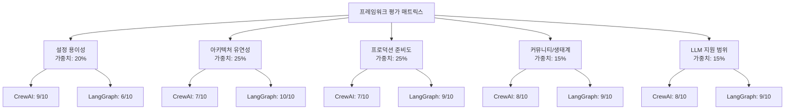
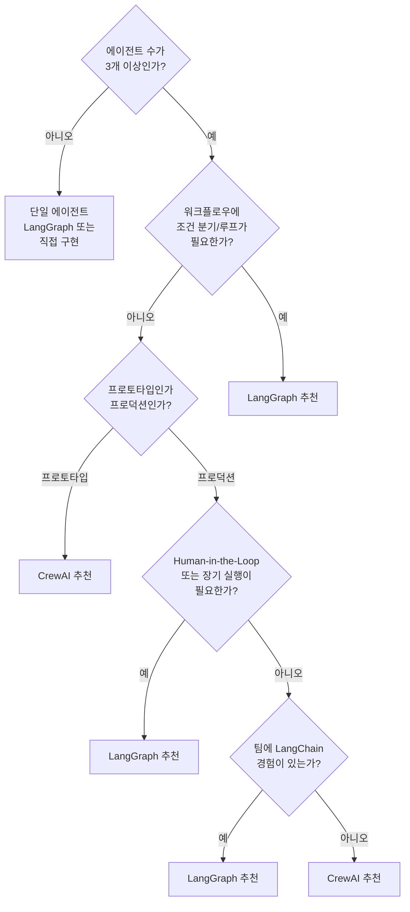
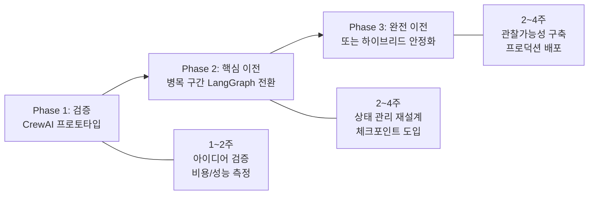
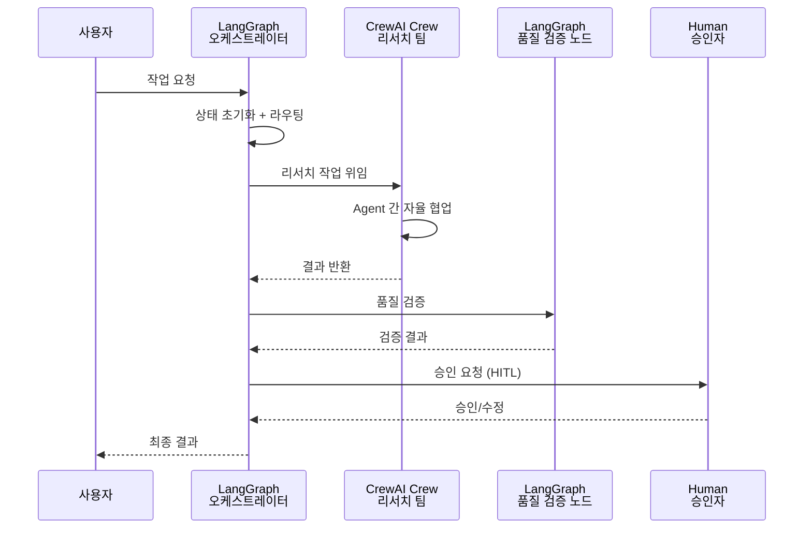
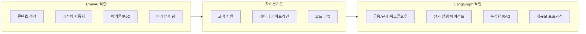

## 개요

이 섹션에서는 CrewAI와 LangGraph 중 어떤 프레임워크를 선택해야 하는지에 대한 **체계적인 의사결정 프레임워크**를 제시합니다. 단순한 "이게 더 좋다"가 아닌, 프로젝트 특성·팀 역량·비즈니스 제약을 종합적으로 고려한 실전 가이드입니다.

**선수 지식**: [CrewAI 기초](16-ch16-crewai와-langgraph-비교/01-01-crewai-기초.md)의 Agent/Task/Crew 개념, [CrewAI Flows](16-ch16-crewai와-langgraph-비교/02-02-crewai-flows와-프로덕션-워크플로우.md)의 이벤트 기반 오케스트레이션, [심층 비교](16-ch16-crewai와-langgraph-비교/03-03-crewai-vs-langgraph-심층-비교.md)의 5축 분석 결과

**학습 목표**:
- 5가지 평가 기준으로 프레임워크 적합성을 점수화할 수 있다
- 프로젝트 특성별 의사결정 트리를 활용하여 프레임워크를 선택할 수 있다
- CrewAI → LangGraph 마이그레이션 전략을 수립할 수 있다
- 두 프레임워크를 결합한 하이브리드 아키텍처를 설계할 수 있다

## 왜 알아야 할까?

"CrewAI가 좋을까, LangGraph가 좋을까?"라는 질문을 받으면 대부분 "상황에 따라 다릅니다"라고 답하죠. 맞는 말이지만, 실무에서는 **지금 당장 선택**해야 합니다. 프레임워크 선택을 잘못하면 프로토타입 단계에서는 문제가 없다가, 프로덕션 배포 직전에 전면 재작성이 필요해지는 악몽이 펼쳐집니다.

실제로 2025년 한 SaaS 스타트업은 CrewAI로 고객 지원 에이전트를 구축했는데, 월 활성 사용자가 1만 명을 넘기자 토큰 비용이 예산의 3배를 초과했습니다. 반대로, 내부 리서치 도구를 LangGraph로 만든 팀은 2주 만에 완성할 것을 6주나 걸렸고, 결국 CrewAI로 3일 만에 재구축했죠. **프레임워크 선택은 기술 문제가 아니라 비즈니스 의사결정**입니다.

## 핵심 개념

### 개념 1: 의사결정 매트릭스 — 5축 평가 프레임워크

> 💡 **비유**: 집을 고를 때 위치·가격·크기·교통·학군을 따지듯이, 프레임워크 선택도 여러 기준의 **가중 점수**로 결정해야 합니다. 위치만 보고 집을 사면 출퇴근 지옥에 빠지고, 가격만 보면 허름한 곳에 갇히죠.

프레임워크 선택에서 가장 흔한 실수는 **단일 기준**으로 판단하는 것입니다. "GitHub 별이 더 많으니까", "코드가 더 짧으니까" 같은 이유로 선택하면 프로덕션에서 고통받게 됩니다. 다음 5가지 축을 가중치와 함께 평가해야 합니다.

> 📊 **그림 1**: 프레임워크 선택 5축 평가 매트릭스



각 축의 의미를 정리하면 다음과 같습니다:

| 평가 축 | 가중치 | 평가 내용 | CrewAI | LangGraph |
|---------|--------|----------|--------|-----------|
| 설정 용이성 | 20% | 첫 작동까지 걸리는 시간 | 9/10 | 6/10 |
| 아키텍처 유연성 | 25% | 순차·병렬·동적 워크플로우 지원 | 7/10 | 10/10 |
| 프로덕션 준비도 | 25% | 에러 처리, 관찰가능성, 영속성 | 7/10 | 9/10 |
| 커뮤니티/생태계 | 15% | 문서 품질, 통합, 커뮤니티 규모 | 8/10 | 9/10 |
| LLM 지원 범위 | 15% | 모델 다양성, 전환 용이성 | 8/10 | 9/10 |

**가중 점수 계산**:
- **CrewAI**: 9×0.2 + 7×0.25 + 7×0.25 + 8×0.15 + 8×0.15 = **7.70**
- **LangGraph**: 6×0.2 + 10×0.25 + 9×0.25 + 9×0.15 + 9×0.15 = **8.65**

하지만 이 점수를 곧이곧대로 받아들이면 안 됩니다. 핵심은 **가중치가 프로젝트마다 다르다**는 점입니다. 해커톤이라면 "설정 용이성"의 가중치가 50%가 되고, 금융 시스템이라면 "프로덕션 준비도"가 40%가 됩니다.

```python
from dataclasses import dataclass

@dataclass
class FrameworkScore:
    """프레임워크 평가 점수"""
    name: str
    setup_ease: float        # 설정 용이성 (1-10)
    architecture: float      # 아키텍처 유연성 (1-10)
    production: float        # 프로덕션 준비도 (1-10)
    community: float         # 커뮤니티/생태계 (1-10)
    llm_support: float       # LLM 지원 범위 (1-10)

    def weighted_score(self, weights: dict[str, float]) -> float:
        """가중 점수 계산
        
        Args:
            weights: 평가 축별 가중치 딕셔너리 (합계 = 1.0)
        
        Returns:
            가중 합산 점수
        """
        return (
            self.setup_ease * weights["setup_ease"]
            + self.architecture * weights["architecture"]
            + self.production * weights["production"]
            + self.community * weights["community"]
            + self.llm_support * weights["llm_support"]
        )


def recommend_framework(
    project_type: str,
) -> tuple[str, dict[str, float]]:
    """프로젝트 유형별 가중치 프리셋 반환

    Args:
        project_type: 프로젝트 유형 ("hackathon", "enterprise",
                      "research", "startup_mvp")

    Returns:
        (프로젝트 유형, 가중치 딕셔너리) 튜플
    """
    presets: dict[str, dict[str, float]] = {
        # 해커톤/PoC: 빠른 셋업이 최우선
        "hackathon": {
            "setup_ease": 0.40,
            "architecture": 0.15,
            "production": 0.10,
            "community": 0.20,
            "llm_support": 0.15,
        },
        # 엔터프라이즈: 프로덕션 준비도가 핵심
        "enterprise": {
            "setup_ease": 0.10,
            "architecture": 0.25,
            "production": 0.35,
            "community": 0.15,
            "llm_support": 0.15,
        },
        # 리서치: 아키텍처 유연성 중시
        "research": {
            "setup_ease": 0.15,
            "architecture": 0.35,
            "production": 0.15,
            "community": 0.20,
            "llm_support": 0.15,
        },
        # 스타트업 MVP: 균형 잡힌 가중치
        "startup_mvp": {
            "setup_ease": 0.25,
            "architecture": 0.20,
            "production": 0.25,
            "community": 0.15,
            "llm_support": 0.15,
        },
    }
    weights = presets.get(project_type, presets["startup_mvp"])
    return project_type, weights
```

### 개념 2: 의사결정 트리 — "이것만 따라가면 된다"

> 💡 **비유**: 병원 응급실의 트리아지(Triage)처럼, 가장 중요한 질문 몇 개로 빠르게 분류합니다. "의식 있나요?" → "호흡하나요?" → "출혈 부위는?" 순서로 환자를 분류하듯, 프레임워크도 핵심 질문 3~4개로 결정할 수 있습니다.

실무에서 5축 매트릭스를 매번 채울 수는 없죠. 아래 의사결정 트리를 따라가면 80%의 경우 올바른 선택에 도달합니다.

> 📊 **그림 2**: 프레임워크 선택 의사결정 트리



의사결정 트리를 코드로 구현하면 자동화된 추천 시스템이 됩니다:

```python
@dataclass
class ProjectRequirements:
    """프로젝트 요구사항 정의"""
    agent_count: int           # 에이전트 수
    needs_branching: bool      # 조건 분기/루프 필요 여부
    is_production: bool        # 프로덕션 배포 여부
    needs_hitl: bool           # Human-in-the-Loop 필요
    needs_long_running: bool   # 장기 실행 워크플로우
    team_langchain_exp: bool   # 팀 LangChain 경험 유무
    monthly_budget_usd: float  # 월 예산 (LLM API 비용)
    timeline_weeks: int        # 개발 기한 (주)


def decision_tree(req: ProjectRequirements) -> str:
    """의사결정 트리 기반 프레임워크 추천

    Args:
        req: 프로젝트 요구사항

    Returns:
        추천 프레임워크와 근거 문자열
    """
    # 1단계: 에이전트 수 확인
    if req.agent_count < 3:
        return "LangGraph (단일/소수 에이전트에 최적)"

    # 2단계: 복잡한 워크플로우 필요 여부
    if req.needs_branching:
        return "LangGraph (조건 분기/루프 지원 우수)"

    # 3단계: 프로덕션 vs 프로토타입
    if not req.is_production:
        return "CrewAI (빠른 프로토타이핑)"

    # 4단계: HITL 또는 장기 실행
    if req.needs_hitl or req.needs_long_running:
        return "LangGraph (체크포인트/HITL 네이티브)"

    # 5단계: 팀 경험 기반
    if req.team_langchain_exp:
        return "LangGraph (기존 생태계 활용)"

    return "CrewAI (낮은 학습 곡선)"
```

이 트리에서 놓치기 쉬운 포인트가 있는데요. **"조건 분기가 필요한가?"**라는 질문에서 많은 분이 "아니오"라고 답했다가 나중에 후회합니다. 실제 프로덕션에서는 에러 처리, 폴백 경로, 재시도 로직 등 **처음에는 예상하지 못한 분기**가 반드시 생기거든요.

### 개념 3: 마이그레이션 전략 — "시작은 CrewAI, 성장은 LangGraph"

> 💡 **비유**: 식당을 처음 열 때 소규모 주방으로 시작해서 맛을 검증하고, 손님이 늘면 주방을 확장하는 것과 같습니다. 처음부터 대형 주방을 차리면 초기 비용이 너무 크고, 작은 주방에 집착하면 성장이 막히죠.

"prototype with CrewAI, productionize with LangGraph"는 업계에서 점점 일반화되고 있는 패턴입니다. CrewAI의 `kickoff()` 한 줄로 빠르게 아이디어를 검증하고, 프로덕션 요구사항이 명확해지면 LangGraph로 점진적으로 마이그레이션합니다.

> 📊 **그림 3**: 마이그레이션 3단계 전략



핵심 개념의 매핑 관계를 알면 마이그레이션이 훨씬 수월합니다:

| CrewAI 개념 | LangGraph 대응 | 마이그레이션 난이도 |
|------------|----------------|-------------------|
| `Agent(role=, goal=)` | 노드 함수 + 시스템 프롬프트 | 중간 |
| `Task(description=)` | 노드 내부 로직 | 낮음 |
| `Crew(process=Sequential)` | `add_edge()` 체인 | 낮음 |
| `Crew(process=Hierarchical)` | Supervisor 패턴 | 높음 |
| `Flow` + `@listen` | `StateGraph` + `add_edge` | 중간 |
| `@router()` | `add_conditional_edges()` | 중간 |
| `self.state.field` | `state["field"]` (TypedDict) | 낮음 |
| `flow.kickoff()` | `graph.compile().invoke()` | 낮음 |

```python
# === CrewAI 원본 (Phase 1에서 검증 완료) ===
from crewai import Agent, Task, Crew, Process

researcher = Agent(
    role="리서처",
    goal="주제에 대한 최신 정보 수집",
    backstory="10년 경력의 기술 리서처",
)
writer = Agent(
    role="라이터",
    goal="리서치 결과를 보고서로 작성",
    backstory="기술 블로그 전문 작가",
)
research_task = Task(
    description="'{topic}'에 대한 최신 동향 조사",
    expected_output="핵심 동향 5가지 요약",
    agent=researcher,
)
write_task = Task(
    description="리서치 결과를 블로그 포스트로 작성",
    expected_output="1500자 내외의 블로그 포스트",
    agent=writer,
)
crew = Crew(
    agents=[researcher, writer],
    tasks=[research_task, write_task],
    process=Process.sequential,
)
# result = crew.kickoff(inputs={"topic": "AI Agents"})


# === LangGraph 마이그레이션 (Phase 2) ===
from typing import TypedDict, Annotated
from langgraph.graph import StateGraph, START, END
from langchain_openai import ChatOpenAI

# 1. 상태 스키마 정의 (CrewAI의 암시적 상태 → 명시적 TypedDict)
class ResearchState(TypedDict):
    topic: str
    research_result: str
    blog_post: str

llm = ChatOpenAI(model="gpt-4o")

# 2. 에이전트를 노드 함수로 변환
def research_node(state: ResearchState) -> dict:
    """CrewAI의 researcher Agent → LangGraph 노드"""
    prompt = (
        f"당신은 10년 경력의 기술 리서처입니다.\n"
        f"'{state['topic']}'에 대한 최신 동향을 조사하고 "
        f"핵심 동향 5가지를 요약하세요."
    )
    response = llm.invoke(prompt)
    return {"research_result": response.content}

def write_node(state: ResearchState) -> dict:
    """CrewAI의 writer Agent → LangGraph 노드"""
    prompt = (
        f"당신은 기술 블로그 전문 작가입니다.\n"
        f"아래 리서치 결과를 1500자 내외의 블로그 포스트로 작성하세요.\n\n"
        f"리서치 결과:\n{state['research_result']}"
    )
    response = llm.invoke(prompt)
    return {"blog_post": response.content}

# 3. 그래프 구성 (Sequential Process → add_edge 체인)
builder = StateGraph(ResearchState)
builder.add_node("research", research_node)
builder.add_node("write", write_node)
builder.add_edge(START, "research")
builder.add_edge("research", "write")
builder.add_edge("write", END)

graph = builder.compile()
# result = graph.invoke({"topic": "AI Agents"})
```

> ⚠️ **흔한 오해**: "마이그레이션 = 전면 재작성"이라고 생각하는 분이 많은데, 실제로는 **점진적 교체**가 핵심입니다. CrewAI의 LangChain 호환성 덕분에 LangChain 도구를 그대로 재사용할 수 있고, 하나의 Crew를 통째로 LangGraph 노드 안에 넣을 수도 있습니다.

### 개념 4: 하이브리드 아키텍처 — 두 세계의 장점을 합치다

> 💡 **비유**: 회사에서 전략적 의사결정은 임원 회의(체계적 프로세스)로 하고, 구체적인 실행은 자율적인 팀에 위임하죠. 하이브리드 아키텍처도 마찬가지입니다 — **전체 흐름은 LangGraph가 관리**하고, **역할 기반 협업은 CrewAI가 수행**합니다.

하이브리드 접근법은 "둘 다 쓰면 복잡해지지 않나?"라는 걱정과 달리, 실제로는 각 프레임워크의 장점만 취할 수 있는 실용적 패턴입니다.

> 📊 **그림 4**: 하이브리드 아키텍처 — LangGraph 오케스트레이션 + CrewAI 실행



이 패턴의 핵심은 **관심사의 분리**입니다:

- **LangGraph 담당**: 전체 워크플로우 관리, 상태 영속성, 조건 분기, 체크포인트, Human-in-the-Loop
- **CrewAI 담당**: 특정 단계에서의 멀티 에이전트 협업, 역할 기반 태스크 실행

```python
from typing import TypedDict
from langgraph.graph import StateGraph, START, END
from crewai import Agent, Task, Crew, Process

# === 하이브리드 상태 정의 ===
class HybridState(TypedDict):
    query: str
    research_output: str
    quality_score: float
    final_result: str
    needs_revision: bool


# === CrewAI 팀: LangGraph 노드 내부에서 실행 ===
def crewai_research_node(state: HybridState) -> dict:
    """LangGraph 노드 안에서 CrewAI Crew를 실행"""
    # CrewAI의 역할 기반 협업
    analyst = Agent(
        role="시장 분석가",
        goal=f"'{state['query']}'에 대한 시장 데이터 분석",
        backstory="금융 데이터 분석 전문가",
    )
    summarizer = Agent(
        role="요약 전문가",
        goal="분석 결과를 경영진용 요약으로 정리",
        backstory="전략 컨설팅 경력 보유",
    )
    analysis_task = Task(
        description=f"'{state['query']}' 시장 동향을 분석하세요",
        expected_output="주요 지표 5가지와 트렌드 분석",
        agent=analyst,
    )
    summary_task = Task(
        description="분석 결과를 1페이지 경영진 보고서로 요약",
        expected_output="경영진 요약 보고서",
        agent=summarizer,
    )
    crew = Crew(
        agents=[analyst, summarizer],
        tasks=[analysis_task, summary_task],
        process=Process.sequential,
    )
    result = crew.kickoff(inputs={"query": state["query"]})
    return {"research_output": result.raw}


# === LangGraph 노드: 품질 검증 (LangGraph의 강점 활용) ===
def quality_check_node(state: HybridState) -> dict:
    """LangGraph의 조건 분기를 위한 품질 검증"""
    content = state["research_output"]
    # 간단한 품질 점수 (실제로는 LLM-as-Judge 활용)
    score = min(len(content) / 500, 1.0)
    return {
        "quality_score": score,
        "needs_revision": score < 0.7,
    }


def finalize_node(state: HybridState) -> dict:
    """최종 결과 생성"""
    return {"final_result": state["research_output"]}


# === 라우팅 함수 ===
def quality_router(state: HybridState) -> str:
    """품질 점수에 따른 조건 분기"""
    if state["needs_revision"]:
        return "revise"   # CrewAI로 재작업
    return "finalize"     # 최종 결과


# === 하이브리드 그래프 구성 ===
builder = StateGraph(HybridState)
builder.add_node("research", crewai_research_node)
builder.add_node("quality_check", quality_check_node)
builder.add_node("finalize", finalize_node)

builder.add_edge(START, "research")
builder.add_edge("research", "quality_check")
builder.add_conditional_edges(
    "quality_check",
    quality_router,
    {"revise": "research", "finalize": "finalize"},
)
builder.add_edge("finalize", END)

hybrid_graph = builder.compile()
# result = hybrid_graph.invoke({"query": "2026 AI 에이전트 시장"})
```

하이브리드 접근법이 유리한 시나리오를 정리하면:

| 시나리오 | LangGraph 역할 | CrewAI 역할 |
|---------|---------------|------------|
| 리서치 파이프라인 | 상태 관리, 품질 게이트 | 리서치·분석·요약 팀 |
| 고객 지원 | 라우팅, 에스컬레이션 | 1차 응대 에이전트 팀 |
| 코드 리뷰 | 체크포인트, HITL 승인 | 리뷰어·테스터 팀 |
| 콘텐츠 생성 | 파이프라인 관리, 반복 루프 | 작가·편집자·팩트체커 팀 |

### 개념 5: 프로젝트 유형별 실전 추천

> 💡 **비유**: 요리사에게 "최고의 칼이 뭐냐"고 물으면 "무엇을 자르느냐에 따라 다르다"고 답합니다. 회를 뜰 때는 사시미 칼, 빵을 자를 때는 빵칼이 맞죠. 프레임워크도 **잘라야 할 문제**에 따라 달라집니다.

> 📊 **그림 5**: 프로젝트 유형별 프레임워크 적합도



구체적인 추천을 코드로 구현하면 다음과 같습니다:

```run:python
# 프로젝트 유형별 추천 결과 생성기
recommendations = {
    "콘텐츠 생성 파이프라인": {
        "framework": "CrewAI",
        "reason": "역할 기반 협업(작가/편집자/검수자)이 자연스럽게 매핑",
        "risk": "품질 반복 루프 필요 시 LangGraph 하이브리드 고려",
    },
    "금융 규제 워크플로우": {
        "framework": "LangGraph",
        "reason": "감사 추적(체크포인트), HITL 승인, 조건 분기 필수",
        "risk": "초기 개발 시간 투자 필요",
    },
    "스타트업 MVP": {
        "framework": "CrewAI → LangGraph",
        "reason": "CrewAI로 2주 내 검증 후 LangGraph로 점진적 이전",
        "risk": "마이그레이션 비용을 초기 일정에 반영해야 함",
    },
    "Agentic RAG 시스템": {
        "framework": "LangGraph",
        "reason": "자기교정 루프, Adaptive 라우팅, 상태 관리 필수",
        "risk": "학습 곡선이 있지만 장기적으로 유지보수 유리",
    },
    "사내 챗봇 (3~5명 팀)": {
        "framework": "하이브리드",
        "reason": "LangGraph로 대화 흐름 관리, CrewAI로 백엔드 처리",
        "risk": "두 프레임워크 학습 부담",
    },
}

print("=" * 60)
print("프로젝트 유형별 프레임워크 추천")
print("=" * 60)
for project, rec in recommendations.items():
    print(f"\n📋 {project}")
    print(f"   추천: {rec['framework']}")
    print(f"   이유: {rec['reason']}")
    print(f"   주의: {rec['risk']}")
```

```output
============================================================
프로젝트 유형별 프레임워크 추천
============================================================

📋 콘텐츠 생성 파이프라인
   추천: CrewAI
   이유: 역할 기반 협업(작가/편집자/검수자)이 자연스럽게 매핑
   주의: 품질 반복 루프 필요 시 LangGraph 하이브리드 고려

📋 금융 규제 워크플로우
   추천: LangGraph
   이유: 감사 추적(체크포인트), HITL 승인, 조건 분기 필수
   주의: 초기 개발 시간 투자 필요

📋 스타트업 MVP
   추천: CrewAI → LangGraph
   이유: CrewAI로 2주 내 검증 후 LangGraph로 점진적 이전
   주의: 마이그레이션 비용을 초기 일정에 반영해야 함

📋 Agentic RAG 시스템
   추천: LangGraph
   이유: 자기교정 루프, Adaptive 라우팅, 상태 관리 필수
   주의: 학습 곡선이 있지만 장기적으로 유지보수 유리

📋 사내 챗봇 (3~5명 팀)
   추천: 하이브리드
   이유: LangGraph로 대화 흐름 관리, CrewAI로 백엔드 처리
   주의: 두 프레임워크 학습 부담
```

## 실습: 직접 해보기

프로젝트 요구사항을 입력하면 가중 점수 기반으로 프레임워크를 추천하는 **자동 의사결정 도구**를 만들어 봅시다.

```run:python
from dataclasses import dataclass, field


@dataclass
class FrameworkProfile:
    """프레임워크 특성 프로필"""
    name: str
    scores: dict[str, float]  # 평가 축별 점수 (1-10)


@dataclass
class ProjectContext:
    """프로젝트 컨텍스트"""
    name: str
    agent_count: int
    needs_branching: bool
    is_production: bool
    needs_hitl: bool
    needs_long_running: bool
    team_experience: str      # "crewai", "langgraph", "both", "none"
    timeline_weeks: int
    priority: str             # "speed", "reliability", "flexibility"


# 프레임워크 프로필 정의
CREWAI = FrameworkProfile(
    name="CrewAI",
    scores={
        "setup_ease": 9.0,
        "architecture": 7.0,
        "production": 7.0,
        "community": 8.0,
        "llm_support": 8.0,
    },
)

LANGGRAPH = FrameworkProfile(
    name="LangGraph",
    scores={
        "setup_ease": 6.0,
        "architecture": 10.0,
        "production": 9.0,
        "community": 9.0,
        "llm_support": 9.0,
    },
)

HYBRID = FrameworkProfile(
    name="하이브리드 (LangGraph + CrewAI)",
    scores={
        "setup_ease": 5.0,
        "architecture": 10.0,
        "production": 9.0,
        "community": 8.0,
        "llm_support": 9.0,
    },
)


def calculate_weights(ctx: ProjectContext) -> dict[str, float]:
    """프로젝트 컨텍스트 기반 가중치 동적 계산"""
    weights = {
        "setup_ease": 0.20,
        "architecture": 0.25,
        "production": 0.25,
        "community": 0.15,
        "llm_support": 0.15,
    }

    # 우선순위에 따라 가중치 조정
    if ctx.priority == "speed":
        weights["setup_ease"] += 0.15
        weights["architecture"] -= 0.10
        weights["production"] -= 0.05
    elif ctx.priority == "reliability":
        weights["production"] += 0.15
        weights["setup_ease"] -= 0.10
        weights["community"] -= 0.05
    elif ctx.priority == "flexibility":
        weights["architecture"] += 0.10
        weights["setup_ease"] -= 0.05
        weights["community"] -= 0.05

    # 타임라인이 촉박하면 셋업 가중치 증가
    if ctx.timeline_weeks <= 2:
        weights["setup_ease"] += 0.10
        weights["architecture"] -= 0.05
        weights["production"] -= 0.05

    return weights


def recommend(ctx: ProjectContext) -> list[tuple[str, float, str]]:
    """프로젝트에 맞는 프레임워크 추천 (점수순)"""
    weights = calculate_weights(ctx)
    candidates = [CREWAI, LANGGRAPH, HYBRID]
    results = []

    for fw in candidates:
        score = sum(
            fw.scores[k] * weights[k] for k in weights
        )
        # 보너스/페널티 적용
        bonus_reasons = []
        if ctx.needs_branching and fw.name != "CrewAI":
            score += 0.5
            bonus_reasons.append("조건 분기 지원")
        if ctx.needs_hitl and fw.name != "CrewAI":
            score += 0.5
            bonus_reasons.append("HITL 네이티브")
        if ctx.agent_count >= 5 and "CrewAI" in fw.name:
            score += 0.3
            bonus_reasons.append("멀티 에이전트 선언적 관리")
        if ctx.team_experience == "langgraph" and "LangGraph" in fw.name:
            score += 0.3
            bonus_reasons.append("팀 경험 활용")
        if ctx.team_experience == "crewai" and "CrewAI" in fw.name:
            score += 0.3
            bonus_reasons.append("팀 경험 활용")
        if not ctx.is_production and fw.name == "CrewAI":
            score += 0.3
            bonus_reasons.append("빠른 프로토타이핑")

        reason = ", ".join(bonus_reasons) if bonus_reasons else "기본 점수"
        results.append((fw.name, round(score, 2), reason))

    results.sort(key=lambda x: x[1], reverse=True)
    return results


# === 시나리오 테스트 ===
scenarios = [
    ProjectContext(
        name="스타트업 챗봇 MVP",
        agent_count=3, needs_branching=False,
        is_production=False, needs_hitl=False,
        needs_long_running=False, team_experience="none",
        timeline_weeks=2, priority="speed",
    ),
    ProjectContext(
        name="금융 규제 보고서 시스템",
        agent_count=5, needs_branching=True,
        is_production=True, needs_hitl=True,
        needs_long_running=True, team_experience="langgraph",
        timeline_weeks=12, priority="reliability",
    ),
    ProjectContext(
        name="콘텐츠 생성 파이프라인",
        agent_count=4, needs_branching=True,
        is_production=True, needs_hitl=False,
        needs_long_running=False, team_experience="both",
        timeline_weeks=6, priority="flexibility",
    ),
]

for scenario in scenarios:
    print(f"\n{'='*50}")
    print(f"📋 시나리오: {scenario.name}")
    print(f"   에이전트: {scenario.agent_count}개 | "
          f"프로덕션: {'예' if scenario.is_production else '아니오'} | "
          f"기한: {scenario.timeline_weeks}주")
    print(f"{'='*50}")
    results = recommend(scenario)
    for rank, (name, score, reason) in enumerate(results, 1):
        medal = ["🥇", "🥈", "🥉"][rank - 1]
        print(f"   {medal} {name}: {score}점 ({reason})")
```

```output
==================================================
📋 시나리오: 스타트업 챗봇 MVP
   에이전트: 3개 | 프로덕션: 아니오 | 기한: 2주
==================================================
   🥇 CrewAI: 8.55점 (빠른 프로토타이핑)
   🥈 하이브리드 (LangGraph + CrewAI): 7.45점 (기본 점수)
   🥉 LangGraph: 7.35점 (기본 점수)

==================================================
📋 시나리오: 금융 규제 보고서 시스템
   에이전트: 5개 | 프로덕션: 예 | 기한: 12주
==================================================
   🥇 LangGraph: 9.95점 (조건 분기 지원, HITL 네이티브, 팀 경험 활용)
   🥈 하이브리드 (LangGraph + CrewAI): 9.35점 (조건 분기 지원, HITL 네이티브, 멀티 에이전트 선언적 관리)
   🥉 CrewAI: 7.85점 (멀티 에이전트 선언적 관리)

==================================================
📋 시나리오: 콘텐츠 생성 파이프라인
   에이전트: 4개 | 프로덕션: 예 | 기한: 6주
==================================================
   🥇 하이브리드 (LangGraph + CrewAI): 9.0점 (조건 분기 지원, HITL 네이티브)
   🥈 LangGraph: 9.0점 (조건 분기 지원, HITL 네이티브)
   🥉 CrewAI: 7.5점 (기본 점수)
```

## 더 깊이 알아보기

### "프레임워크 전쟁"의 역사 — 이건 처음 있는 일이 아닙니다

AI 에이전트 프레임워크 경쟁은 사실 소프트웨어 역사에서 반복되는 패턴입니다. 2000년대 초반의 **Java EE vs Spring** 전쟁이 대표적이죠. Java EE(지금의 Jakarta EE)는 엔터프라이즈급 기능을 모두 제공했지만 설정이 복잡했고, Spring은 "Convention over Configuration"을 내세우며 간결한 개발 경험을 제공했습니다.

결과가 어떻게 되었을까요? Spring이 압도적으로 승리했을까요? 아닙니다. **두 프레임워크가 서로를 닮아갔습니다.** Spring은 점점 엔터프라이즈 기능을 추가했고, Java EE는 Spring의 편의성을 흡수했죠. 결국 개발자들은 프로젝트에 맞게 선택하거나 두 가지를 함께 사용하게 되었습니다.

CrewAI와 LangGraph도 같은 길을 걷고 있습니다. CrewAI가 Flows를 추가하며 LangGraph의 상태 관리를 닮아가고, LangGraph는 `langgraph-supervisor`로 CrewAI의 역할 기반 패턴을 흡수하고 있죠. 2026년 3월 현재, CrewAI는 MCP와 A2A 프로토콜까지 네이티브로 지원하며 생태계를 확장 중이고, LangGraph는 v1.1로 안정화되며 프로덕션 레퍼런스를 쌓아가고 있습니다.

흥미로운 점은, 이 두 프레임워크의 창시자들이 서로의 프레임워크를 존중한다는 사실입니다. LangChain의 Harrison Chase는 CrewAI를 "놀라운 추상화"라고 칭했고, CrewAI의 João Moura는 "LangGraph에서 많은 영감을 받았다"고 공개적으로 밝혔습니다. **진짜 경쟁은 프레임워크 간이 아니라, 우리가 풀어야 할 문제와의 싸움**입니다.

## 흔한 오해와 팁

> ⚠️ **흔한 오해**: "CrewAI는 프로토타입용이고 LangGraph만 프로덕션에 쓸 수 있다." 이건 2024년 초의 이야기입니다. 2026년 현재 CrewAI는 v1.10.1에 이르렀고, 일일 1200만 건 이상의 에이전트 실행을 처리하는 프로덕션 환경에서 사용되고 있습니다. CrewAI Flows의 `@persist` 데코레이터와 LanceDB 기반 상태 영속성은 많은 프로덕션 시나리오를 커버합니다.

> 💡 **알고 계셨나요?**: LangGraph의 이름에 "Lang"이 붙어 있어서 LangChain에 종속적이라고 생각하는 분이 많지만, LangGraph v1.0부터 `langchain-core`만 의존하며 독립적으로 사용할 수 있습니다. OpenAI SDK나 Anthropic SDK를 직접 사용하면서도 LangGraph의 상태 관리와 체크포인트 기능을 쓸 수 있죠. 마찬가지로 CrewAI도 내부적으로 LiteLLM을 사용하여 OpenAI, Anthropic, Google, Ollama 등 거의 모든 LLM을 지원합니다.

> 🔥 **실무 팁**: 프레임워크 선택 회의에서 가장 효과적인 접근법은 **같은 문제를 두 프레임워크로 각각 2시간씩 구현**해보는 것입니다. "Battle Implementation"이라 불리는 이 방법은 이론적 비교보다 훨씬 정확한 감을 줍니다. 특히 에러 처리, 디버깅 경험, 테스트 작성의 차이가 명확하게 드러나거든요. 이때 [LangGraph의 공식 워크플로우 가이드](https://docs.langchain.com/oss/python/langgraph/workflows-agents)와 CrewAI의 공식 문서를 나란히 열어두면 효율적입니다.

> 🔥 **실무 팁**: 하이브리드 아키텍처를 도입할 때 가장 큰 함정은 **두 프레임워크의 상태를 동기화**하려는 시도입니다. CrewAI Crew의 결과를 LangGraph 상태로 넘길 때는 반드시 **직렬화 가능한 단순 데이터**(문자열, 딕셔너리)로 변환하세요. Crew 객체나 Task 객체를 그대로 상태에 넣으면 체크포인트 직렬화에서 실패합니다.

## 핵심 정리

| 개념 | 설명 |
|------|------|
| 5축 평가 매트릭스 | 설정 용이성(20%) + 아키텍처 유연성(25%) + 프로덕션 준비도(25%) + 커뮤니티(15%) + LLM 지원(15%)으로 가중 평가 |
| 의사결정 트리 | 에이전트 수 → 분기/루프 필요 → 프로덕션 여부 → HITL 필요 → 팀 경험 순서로 빠른 판단 |
| 마이그레이션 전략 | CrewAI로 검증(1~2주) → 병목 구간 LangGraph 전환(2~4주) → 완전 이전 또는 하이브리드 안정화(2~4주) |
| 하이브리드 아키텍처 | LangGraph가 전체 오케스트레이션(상태, 분기, HITL), CrewAI가 역할 기반 실행 담당 |
| 개념 매핑 | `Crew → StateGraph`, `Task → 노드 함수`, `@router → add_conditional_edges`, `kickoff → compile().invoke()` |
| Battle Implementation | 같은 문제를 두 프레임워크로 각 2시간 구현하여 실전 감각으로 비교 |

## 다음 섹션 미리보기

Ch16에서 CrewAI와 LangGraph의 모든 것을 비교했습니다 — 기초 개념부터 Flows, 심층 비교, 그리고 이 섹션의 선택 가이드까지. 이제 프레임워크를 선택했다면, 자연스럽게 다음 질문이 떠오릅니다: **"내가 만든 에이전트가 정말 잘 동작하고 있는 건가?"** 프레임워크가 아무리 좋아도, 그 위에서 돌아가는 에이전트의 품질을 측정하고 개선할 수 없다면 프로덕션에서 신뢰할 수 없겠죠.

다음 챕터 [Ch17. 에이전트 평가와 LangSmith](17-ch17-에이전트-평가와-langsmith/01-01-에이전트-평가-전략.md)에서는 **어떤 프레임워크를 선택하든** 반드시 필요한 에이전트 평가 전략을 다룹니다. Trajectory 평가로 에이전트의 추론 경로를 검증하고, LLM-as-Judge로 출력 품질을 자동 채점하며, 오프라인 데이터셋으로 회귀 테스트를 구축하는 방법을 학습합니다. 프레임워크 선택이 **"무엇으로 만들 것인가"**의 답이었다면, 에이전트 평가는 **"잘 만들었는가"**에 대한 답을 제공합니다.

## 참고 자료

- [AI Agent Frameworks: CrewAI vs AutoGen vs LangGraph Compared (2026)](https://designrevision.com/blog/ai-agent-frameworks) - 5가지 가중 기준으로 프레임워크를 체계적으로 비교한 의사결정 매트릭스
- [LangGraph Workflows and Agents 공식 문서](https://docs.langchain.com/oss/python/langgraph/workflows-agents) - LangGraph의 워크플로우 패턴과 에이전트 아키텍처 공식 가이드
- [Moving from LangGraph to CrewAI: A Practical Guide — CrewAI 공식](https://docs.crewai.com/en/guides/migration/migrating-from-langgraph) - LangGraph에서 CrewAI Flows로의 공식 마이그레이션 가이드 (개념 매핑 포함)
- [CrewAI vs LangGraph vs AutoGen: Choosing the Right Framework — DataCamp](https://www.datacamp.com/tutorial/crewai-vs-langgraph-vs-autogen) - 세 프레임워크의 장단점과 사용 시나리오별 추천을 다룬 실용 튜토리얼
- [The 2026 AI Agent Framework Decision Guide — DEV Community](https://dev.to/linou518/the-2026-ai-agent-framework-decision-guide-langgraph-vs-crewai-vs-pydantic-ai-b2h) - 2026년 기준 최신 프레임워크 비교와 선택 가이드

---
### 🔗 Related Sessions
- [stategraph](04-ch4-langgraph-stategraph-기초/01-01-langgraph-아키텍처-개관.md) (prerequisite)
- [compile()](04-ch4-langgraph-stategraph-기초/01-01-langgraph-아키텍처-개관.md) (prerequisite)
- [add_conditional_edges](05-ch5-조건-분기와-동적-라우팅/01-01-조건부-엣지의-이해.md) (prerequisite)
- [crewai](16-ch16-crewai와-langgraph-비교/01-01-crewai-기초.md) (prerequisite)
- [crew](16-ch16-crewai와-langgraph-비교/01-01-crewai-기초.md) (prerequisite)
- [sequential_process](16-ch16-crewai와-langgraph-비교/01-01-crewai-기초.md) (prerequisite)
- [hierarchical_process](16-ch16-crewai와-langgraph-비교/01-01-crewai-기초.md) (prerequisite)
- [kickoff](16-ch16-crewai와-langgraph-비교/01-01-crewai-기초.md) (prerequisite)
- [flow](16-ch16-crewai와-langgraph-비교/02-02-crewai-flows와-프로덕션-워크플로우.md) (prerequisite)
- [@start](16-ch16-crewai와-langgraph-비교/02-02-crewai-flows와-프로덕션-워크플로우.md) (prerequisite)
- [@listen](16-ch16-crewai와-langgraph-비교/02-02-crewai-flows와-프로덕션-워크플로우.md) (prerequisite)
- [@router](16-ch16-crewai와-langgraph-비교/02-02-crewai-flows와-프로덕션-워크플로우.md) (prerequisite)
- [role_based_vs_graph_based](16-ch16-crewai와-langgraph-비교/03-03-crewai-vs-langgraph-심층-비교.md) (prerequisite)
- [token_overhead](16-ch16-crewai와-langgraph-비교/03-03-crewai-vs-langgraph-심층-비교.md) (prerequisite)
