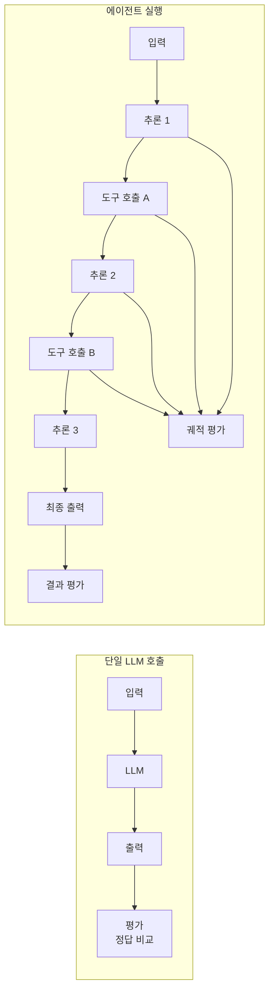
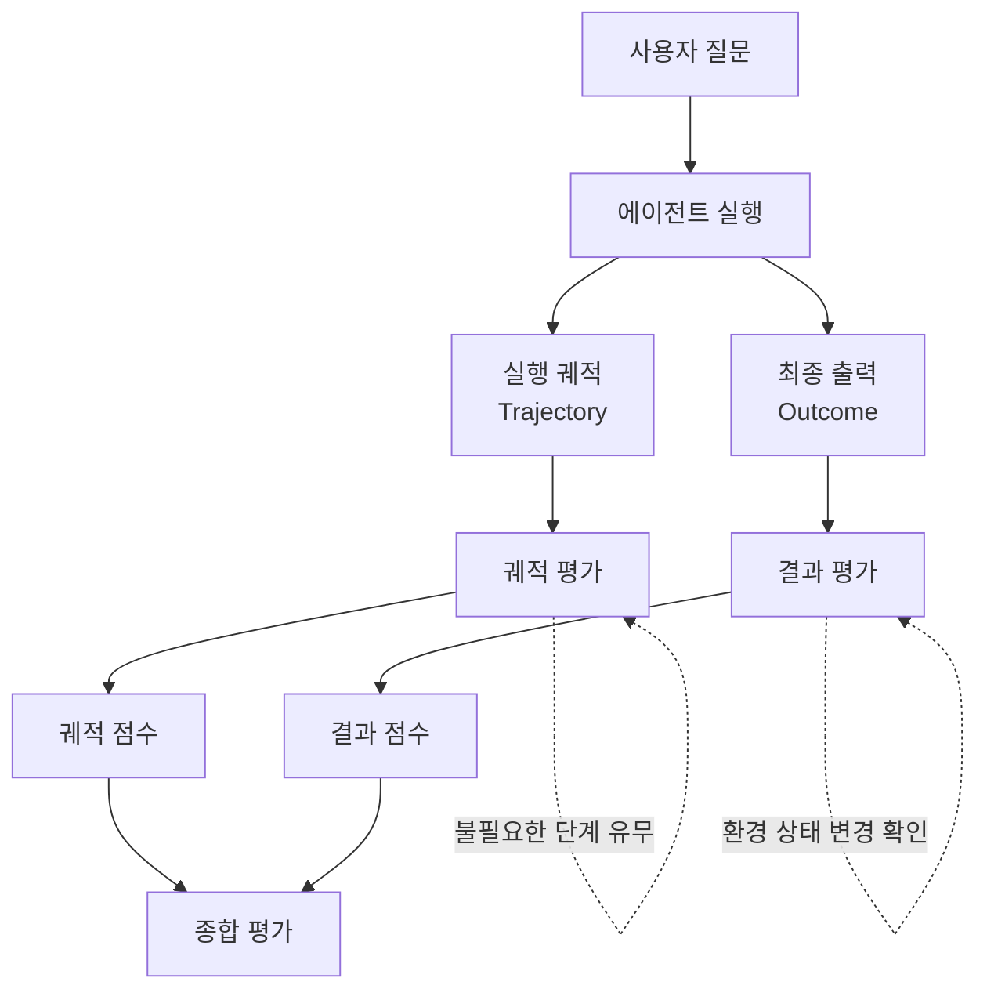
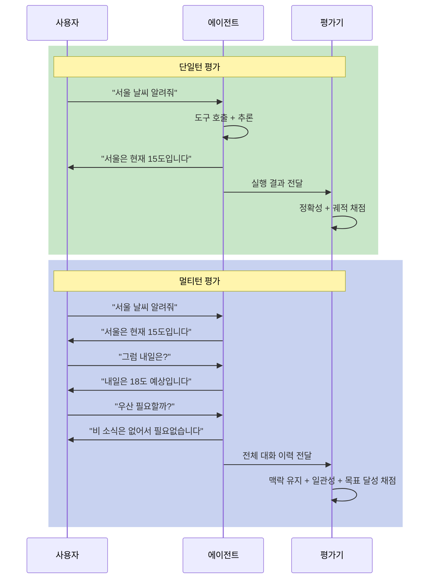
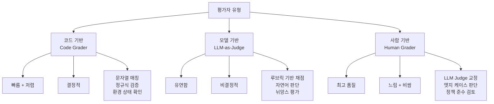
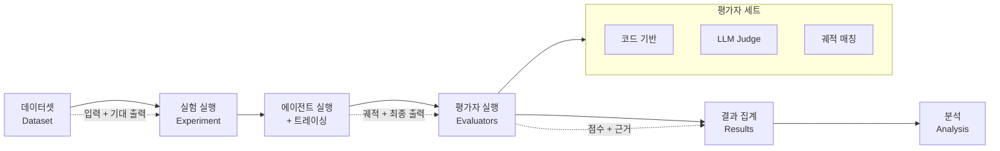

# 에이전트 평가 전략

> AI 에이전트의 품질을 어떻게 측정할 것인가 — 결과 평가, 궤적 평가, 그리고 평가 프레임워크 설계까지

## 개요

이 섹션에서는 AI 에이전트를 평가하는 것이 왜 기존 LLM 평가와 본질적으로 다른지 이해하고, 체계적인 평가 전략을 설계하는 방법을 배웁니다.

**선수 지식**: [LangGraph StateGraph 기초](04-ch4-langgraph-stategraph-기초/01-01-langgraph-아키텍처-개관.md)에서 배운 그래프 실행 개념, [ReAct 패턴](02-ch2-react-패턴과-에이전트-루프/01-01-react-패턴-이론.md)의 추론-행동 루프 이해, [에이전트 프레임워크 선택 가이드](16-ch16-에이전트-프레임워크-비교/04-04-프레임워크-선택-가이드.md)에서 다룬 프레임워크별 특성

**학습 목표**:
- 에이전트 평가가 단일 LLM 호출 평가와 다른 이유를 설명할 수 있다
- 결과(Outcome) 평가와 궤적(Trajectory) 평가의 차이를 구분할 수 있다
- 단일턴/멀티턴 평가 전략을 설계할 수 있다
- 평가 프레임워크의 핵심 구성요소를 코드로 구현할 수 있다

## 왜 알아야 할까?

앞선 챕터에서 LangGraph, CrewAI, OpenAI Agents SDK 등 다양한 프레임워크를 비교하고 선택하는 방법을 배웠습니다. 프레임워크를 골랐고, 멋진 에이전트를 만들었다고 가정해봅시다. 도구도 잘 호출하고, 대화도 매끄럽습니다. 그런데 어느 날 프롬프트를 살짝 수정했더니, 갑자기 에이전트가 엉뚱한 도구를 호출하기 시작합니다. 무엇이 잘못된 걸까요? 더 큰 문제는 — **"잘못됐다"는 걸 어떻게 알 수 있을까요?**

기존 소프트웨어는 단위 테스트로 입력 → 출력을 검증하면 됩니다. 하지만 에이전트는 다릅니다. 같은 질문에도 매번 다른 경로로 답에 도달할 수 있고, 중간에 여러 도구를 호출하며, 그 순서와 조합이 결과의 품질을 좌우합니다. **에이전트 평가 없이 프로덕션에 배포하는 것은 계기판 없이 비행기를 조종하는 것과 같습니다.**

프레임워크 선택이 "무엇으로 만들 것인가"의 문제였다면, 평가는 **"만든 것이 제대로 작동하는가"** 의 문제입니다. 아무리 좋은 프레임워크를 선택해도, 체계적인 평가 체계 없이는 에이전트의 품질을 보장할 수 없거든요.

Anthropic의 엔지니어링 팀은 "에이전트 평가는 capability eval(능력 평가)과 regression eval(회귀 평가)을 모두 포함해야 한다"고 강조합니다. 능력 평가는 에이전트가 새로운 시나리오를 잘 처리하는지 확인하고, 회귀 평가는 기존에 잘 작동하던 것이 깨지지 않았는지 감시하는 거죠.

## 핵심 개념

### 개념 1: 에이전트 평가의 본질적 어려움

> 💡 **비유**: 전통적인 LLM 평가가 "요리 맛 보기"라면, 에이전트 평가는 "레스토랑 전체 운영 평가"입니다. 음식 맛(최종 답변)만이 아니라, 주방의 동선(도구 호출 순서), 재료 선택(어떤 도구를 골랐는지), 조리 시간(효율성), 그리고 손님 응대(멀티턴 대화 품질)까지 모두 봐야 합니다.

단일 LLM 호출은 결정적(deterministic)이지는 않더라도, 입력과 출력의 관계가 비교적 단순합니다. 반면 에이전트는 다음과 같은 고유한 어려움을 가집니다:

| 도전과제 | 설명 |
|----------|------|
| **비결정성** | 같은 입력에도 다른 경로로 같은 결과에 도달 |
| **중간 단계의 중요성** | 최종 답이 같아도 과정이 비효율적일 수 있음 |
| **오류 전파** | 초기 단계의 작은 실수가 이후 단계에 누적 |
| **멀티턴 복잡성** | 대화가 길어질수록 평가 차원이 기하급수적 증가 |
| **환경 의존성** | 외부 도구/API의 응답에 따라 결과가 달라짐 |

> 📊 **그림 1**: 단일 LLM 호출 vs 에이전트의 평가 복잡도 비교



이 복잡성 때문에, 에이전트 평가에서는 **무엇을 평가할지**(What)와 **어떻게 평가할지**(How)를 명확히 분리해서 생각해야 합니다.

### 개념 2: 결과 평가 vs 궤적 평가

> 💡 **비유**: 수학 시험을 채점한다고 생각해보세요. **결과 평가**는 최종 답만 보는 것이고, **궤적 평가**는 풀이 과정까지 보는 것입니다. 답이 맞더라도 풀이가 엉터리면 점수를 깎고, 답이 틀려도 풀이가 논리적이면 부분 점수를 줄 수 있죠.

**결과 평가(Outcome Evaluation)** 는 에이전트의 최종 출력만 검증합니다. "항공편을 예약했다"라고 말하는 게 아니라, 실제로 데이터베이스에 예약 레코드가 생겼는지를 확인하는 것이죠.

**궤적 평가(Trajectory Evaluation)** 는 에이전트가 최종 답에 도달하기까지의 전체 실행 경로를 평가합니다. 어떤 도구를 어떤 순서로 호출했는지, 불필요한 호출은 없었는지, 중간 추론이 논리적이었는지를 봅니다.

> 📊 **그림 2**: 결과 평가와 궤적 평가의 관계



두 평가를 조합하면 다음과 같은 4가지 시나리오가 발생합니다:

```run:python
# 결과 평가와 궤적 평가의 조합 시나리오
scenarios = [
    ("정답", "효율적", "최고! 올바른 경로로 올바른 답 도출"),
    ("정답", "비효율적", "결과는 맞지만 비용/시간 낭비"),
    ("오답", "논리적", "추론은 맞았으나 도구/데이터 문제"),
    ("오답", "비논리적", "근본적인 추론 능력 부족"),
]

print(f"{'결과':^6} | {'궤적':^8} | {'진단'}")
print("-" * 55)
for outcome, trajectory, diagnosis in scenarios:
    print(f"{outcome:^6} | {trajectory:^8} | {diagnosis}")
```

```output
  결과  |   궤적   | 진단
-------------------------------------------------------
  정답  |   효율적  | 최고! 올바른 경로로 올바른 답 도출
  정답  |  비효율적  | 결과는 맞지만 비용/시간 낭비
  오답  |   논리적  | 추론은 맞았으나 도구/데이터 문제
  오답  |  비논리적  | 근본적인 추론 능력 부족
```

> ⚠️ **흔한 오해**: "최종 답이 맞으면 평가를 통과한 것"이라고 생각하기 쉽지만, 프로덕션에서는 **효율성**이 비용에 직결됩니다. 불필요한 도구 호출 10번이 포함된 "정답"은 사실상 실패입니다.

### 개념 3: 단일턴 vs 멀티턴 평가

> 💡 **비유**: 단일턴 평가는 "한 번의 시험 문제"를, 멀티턴 평가는 "30분짜리 구술 면접"을 채점하는 것입니다. 면접에서는 앞선 질문에 대한 답이 다음 질문의 맥락이 되므로, 개별 답변만 봐서는 전체 대화 품질을 알 수 없습니다.

**단일턴(Single-turn) 평가**는 하나의 사용자 입력에 대한 에이전트의 완전한 응답을 평가합니다. 입력 → (에이전트 루프) → 최종 출력까지를 하나의 단위로 봅니다.

**멀티턴(Multi-turn) 평가**는 여러 차례의 대화를 걸쳐 에이전트의 누적된 성능을 평가합니다. 맥락 유지, 이전 대화 참조, 대화 전반의 일관성 등을 봅니다.

> 📊 **그림 3**: 단일턴 vs 멀티턴 평가 흐름



LangSmith에서는 최근 **Thread(스레드)** 라는 개념을 멀티턴 평가의 일급 객체로 도입했습니다. 하나의 스레드가 곧 하나의 멀티턴 에이전트 인터랙션을 나타내며, 이를 통해 "사용자가 실제로 원했던 것을 달성했는가"를 대화 전체 수준에서 평가할 수 있게 되었습니다.

### 개념 4: 세 가지 평가자(Grader) 유형

평가 전략을 설계할 때 가장 핵심적인 질문은 **"누가 채점하는가?"** 입니다. Anthropic과 LangChain 모두 세 가지 유형의 평가자를 구분합니다:

> 📊 **그림 4**: 평가자 유형별 특성 비교



```python
from dataclasses import dataclass
from enum import Enum
from typing import Any, Callable


class GraderType(Enum):
    """세 가지 평가자 유형"""
    CODE = "code"       # 코드 기반: 빠르고 결정적
    MODEL = "model"     # LLM-as-Judge: 유연하지만 비결정적
    HUMAN = "human"     # 사람: 최고 품질이지만 느리고 비쌈


@dataclass
class EvalResult:
    """평가 결과를 담는 데이터 클래스"""
    score: float          # 0.0 ~ 1.0 점수
    grader_type: GraderType
    reasoning: str        # 채점 근거
    metadata: dict[str, Any] | None = None


# 코드 기반 평가자 예시: 정답 정확 일치
def exact_match_grader(output: str, reference: str) -> EvalResult:
    """결과가 참조 답안과 정확히 일치하는지 확인"""
    score = 1.0 if output.strip() == reference.strip() else 0.0
    return EvalResult(
        score=score,
        grader_type=GraderType.CODE,
        reasoning=f"정확 일치: {'Yes' if score else 'No'}",
    )


# 코드 기반 평가자 예시: 도구 호출 포함 여부
def tool_called_grader(
    trajectory: list[dict], expected_tools: set[str]
) -> EvalResult:
    """에이전트가 기대한 도구를 모두 호출했는지 확인"""
    called_tools = {
        step["tool_name"]
        for step in trajectory
        if step.get("type") == "tool_call"
    }
    missing = expected_tools - called_tools
    score = 1.0 if not missing else len(called_tools & expected_tools) / len(expected_tools)
    return EvalResult(
        score=score,
        grader_type=GraderType.CODE,
        reasoning=f"호출된 도구: {called_tools}, 누락: {missing}",
    )
```

이 세 가지를 조합하는 것이 핵심입니다. Anthropic의 권장 사항은 **"코드 기반으로 시작하고, 코드로 측정이 어려운 것을 LLM Judge로 보완하며, 사람이 LLM Judge를 교정한다"** 입니다.

### 개념 5: 평가 프레임워크 설계

실전에서는 개별 평가자를 하나의 체계적인 프레임워크로 통합해야 합니다. 핵심 구성요소는 다음과 같습니다:

> 📊 **그림 5**: 평가 프레임워크 전체 구조



Anthropic이 제안하는 **능력 평가(Capability Eval)**와 **회귀 평가(Regression Eval)**의 구분도 프레임워크 설계에서 중요합니다:

```python
from dataclasses import dataclass, field


@dataclass
class EvalSuite:
    """에이전트 평가 프레임워크의 핵심 구조"""

    name: str
    description: str

    # 능력 평가: 처음에는 낮은 통과율 → 개선 추적
    capability_evals: list[dict] = field(default_factory=list)

    # 회귀 평가: 거의 100% 통과율 유지 → 깨지면 경고
    regression_evals: list[dict] = field(default_factory=list)

    def add_capability_eval(
        self, name: str, dataset: str, evaluators: list, target_pass_rate: float = 0.7
    ):
        """새로운 능력 평가 추가 — 통과율 향상이 목표"""
        self.capability_evals.append({
            "name": name,
            "dataset": dataset,
            "evaluators": evaluators,
            "target_pass_rate": target_pass_rate,
        })

    def add_regression_eval(
        self, name: str, dataset: str, evaluators: list, min_pass_rate: float = 0.95
    ):
        """회귀 평가 추가 — 통과율 하락 시 즉시 경고"""
        self.regression_evals.append({
            "name": name,
            "dataset": dataset,
            "evaluators": evaluators,
            "min_pass_rate": min_pass_rate,
        })


# 프레임워크 구성 예시
suite = EvalSuite(
    name="고객지원 에이전트 v2",
    description="주문 조회, 반품 처리, FAQ 응답 에이전트",
)

# 능력 평가: 새로 추가된 기능
suite.add_capability_eval(
    name="복합 주문 시나리오",
    dataset="complex-orders-v2",
    evaluators=["exact_match", "trajectory_efficiency"],
    target_pass_rate=0.6,  # 처음엔 낮아도 OK
)

# 회귀 평가: 기존에 잘 되던 기능
suite.add_regression_eval(
    name="기본 FAQ 응답",
    dataset="faq-golden-set",
    evaluators=["semantic_similarity"],
    min_pass_rate=0.95,  # 이 아래로 떨어지면 알람
)
```

> 🔥 **실무 팁**: Anthropic은 "20~50개의 실제 실패 케이스에서 시작하라"고 권장합니다. 합성 데이터보다 프로덕션에서 수집한 실패 사례가 훨씬 가치 있습니다. 처음부터 1000개 데이터셋을 만들려고 하지 마세요.

## 실습: 직접 해보기

간단한 도구 호출 에이전트에 대한 평가 프레임워크를 직접 구축해보겠습니다. LangSmith SDK 없이도 핵심 개념을 이해할 수 있도록 순수 Python으로 구현합니다.

```python
"""
에이전트 평가 프레임워크 — 핵심 개념 실습
LangSmith의 evaluate() 패턴을 순수 Python으로 구현
"""
from dataclasses import dataclass, field
from typing import Any, Callable


# ── 1. 데이터셋 정의 ──────────────────────────────────────
@dataclass
class Example:
    """평가 데이터셋의 개별 예제"""
    inputs: dict[str, Any]       # 에이전트에 전달할 입력
    reference: dict[str, Any]    # 기대 출력 (정답)
    metadata: dict[str, Any] = field(default_factory=dict)


# 간단한 계산기 에이전트용 테스트 데이터셋
dataset = [
    Example(
        inputs={"query": "서울의 인구는 몇 명이야?"},
        reference={
            "answer": "약 950만 명",
            "expected_tools": ["search_population"],
        },
    ),
    Example(
        inputs={"query": "100달러를 원화로 바꾸면?"},
        reference={
            "answer": "약 130,000원",
            "expected_tools": ["get_exchange_rate", "calculate"],
        },
    ),
    Example(
        inputs={"query": "오늘 서울 날씨와 미세먼지 알려줘"},
        reference={
            "answer": "맑음, 미세먼지 보통",
            "expected_tools": ["get_weather", "get_air_quality"],
        },
    ),
]


# ── 2. 시뮬레이션된 에이전트 실행 결과 ────────────────────
@dataclass
class AgentRun:
    """에이전트 실행 결과 (궤적 포함)"""
    final_output: str
    trajectory: list[dict]  # 실행 궤적
    total_tokens: int = 0
    latency_ms: float = 0.0


# 에이전트 실행을 시뮬레이션 (실전에서는 실제 에이전트 호출)
def simulated_agent(inputs: dict) -> AgentRun:
    """테스트용 시뮬레이션 에이전트"""
    query = inputs["query"]

    if "인구" in query:
        return AgentRun(
            final_output="서울의 인구는 약 950만 명입니다.",
            trajectory=[
                {"type": "thought", "content": "인구 데이터를 검색해야 함"},
                {"type": "tool_call", "tool_name": "search_population",
                 "args": {"city": "서울"}},
                {"type": "tool_result", "content": "9,508,451"},
                {"type": "response", "content": "약 950만 명"},
            ],
            total_tokens=250,
            latency_ms=1200.0,
        )
    elif "달러" in query:
        return AgentRun(
            final_output="100달러는 약 130,000원입니다.",
            trajectory=[
                {"type": "thought", "content": "환율 조회 후 계산 필요"},
                {"type": "tool_call", "tool_name": "get_exchange_rate",
                 "args": {"from": "USD", "to": "KRW"}},
                {"type": "tool_result", "content": "1,300"},
                {"type": "tool_call", "tool_name": "calculate",
                 "args": {"expression": "100 * 1300"}},
                {"type": "tool_result", "content": "130000"},
                {"type": "response", "content": "약 130,000원"},
            ],
            total_tokens=380,
            latency_ms=2100.0,
        )
    else:
        return AgentRun(
            final_output="서울 날씨는 맑음, 미세먼지는 보통입니다.",
            trajectory=[
                {"type": "thought", "content": "날씨와 미세먼지 두 가지 조회 필요"},
                {"type": "tool_call", "tool_name": "get_weather",
                 "args": {"city": "서울"}},
                {"type": "tool_result", "content": "맑음, 15도"},
                # 의도적으로 get_air_quality 호출 누락! (평가에서 잡히도록)
                {"type": "response", "content": "맑음, 미세먼지 보통"},
            ],
            total_tokens=200,
            latency_ms=900.0,
        )


# ── 3. 평가자(Evaluator) 정의 ─────────────────────────────
@dataclass
class EvalScore:
    """개별 평가자의 채점 결과"""
    key: str          # 평가 항목명
    score: float      # 0.0 ~ 1.0
    reasoning: str    # 채점 근거


# 코드 기반 평가자: 핵심 키워드 포함 여부
def keyword_match_evaluator(
    run: AgentRun, example: Example
) -> EvalScore:
    """최종 출력에 참조 답안의 핵심 키워드가 포함되었는지 확인"""
    ref = example.reference["answer"]
    # 핵심 숫자/키워드 추출 (간략화)
    keywords = [w for w in ref.split() if len(w) > 1]
    matches = sum(1 for kw in keywords if kw in run.final_output)
    score = matches / len(keywords) if keywords else 0.0
    return EvalScore(
        key="keyword_match",
        score=round(score, 2),
        reasoning=f"{matches}/{len(keywords)} 키워드 일치",
    )


# 궤적 평가자: 기대 도구 호출 확인
def tool_coverage_evaluator(
    run: AgentRun, example: Example
) -> EvalScore:
    """에이전트가 기대된 도구를 모두 호출했는지 확인"""
    expected = set(example.reference.get("expected_tools", []))
    actual = {
        step["tool_name"]
        for step in run.trajectory
        if step.get("type") == "tool_call"
    }
    missing = expected - actual
    extra = actual - expected
    score = len(actual & expected) / len(expected) if expected else 1.0

    reasoning_parts = []
    if missing:
        reasoning_parts.append(f"누락: {missing}")
    if extra:
        reasoning_parts.append(f"추가: {extra}")
    if not missing and not extra:
        reasoning_parts.append("모든 기대 도구 호출 완료")

    return EvalScore(
        key="tool_coverage",
        score=round(score, 2),
        reasoning=", ".join(reasoning_parts),
    )


# 효율성 평가자: 불필요한 단계 여부
def efficiency_evaluator(
    run: AgentRun, example: Example
) -> EvalScore:
    """궤적의 효율성을 평가 (도구 호출 수 기반)"""
    expected_count = len(example.reference.get("expected_tools", []))
    actual_count = sum(
        1 for step in run.trajectory if step.get("type") == "tool_call"
    )
    if expected_count == 0:
        return EvalScore(key="efficiency", score=1.0, reasoning="도구 호출 불필요")

    # 기대 도구 수 대비 실제 호출 수의 비율
    ratio = actual_count / expected_count
    if ratio <= 1.0:
        score = 1.0  # 기대보다 적거나 같으면 효율적
    else:
        score = max(0.0, 1.0 - (ratio - 1.0) * 0.5)  # 초과할수록 감점

    return EvalScore(
        key="efficiency",
        score=round(score, 2),
        reasoning=f"기대 {expected_count}회 vs 실제 {actual_count}회 호출",
    )


# ── 4. 평가 실행 엔진 ─────────────────────────────────────
def evaluate(
    target: Callable,
    dataset: list[Example],
    evaluators: list[Callable],
) -> dict:
    """LangSmith evaluate() 패턴의 간소화 버전"""
    results = []

    for i, example in enumerate(dataset):
        # 에이전트 실행
        run = target(example.inputs)

        # 모든 평가자 실행
        scores = [ev(run, example) for ev in evaluators]
        results.append({
            "example_idx": i,
            "query": example.inputs["query"],
            "scores": {s.key: {"score": s.score, "reasoning": s.reasoning} for s in scores},
            "avg_score": round(sum(s.score for s in scores) / len(scores), 2),
        })

    # 전체 요약
    avg_total = round(sum(r["avg_score"] for r in results) / len(results), 2)

    return {"results": results, "avg_score": avg_total}
```

```run:python
# ── 5. 평가 실행 및 결과 확인 ──────────────────────────────

# (위 코드가 이미 정의되어 있다고 가정)
# 여기서는 결과만 시뮬레이션하여 출력

# 실행 결과 시뮬레이션
eval_results = [
    {"query": "서울의 인구는 몇 명이야?",
     "keyword_match": (1.0, "3/3 키워드 일치"),
     "tool_coverage": (1.0, "모든 기대 도구 호출 완료"),
     "efficiency": (1.0, "기대 1회 vs 실제 1회 호출")},
    {"query": "100달러를 원화로 바꾸면?",
     "keyword_match": (0.67, "2/3 키워드 일치"),
     "tool_coverage": (1.0, "모든 기대 도구 호출 완료"),
     "efficiency": (1.0, "기대 2회 vs 실제 2회 호출")},
    {"query": "오늘 서울 날씨와 미세먼지 알려줘",
     "keyword_match": (0.5, "2/4 키워드 일치"),
     "tool_coverage": (0.5, "누락: {'get_air_quality'}"),
     "efficiency": (1.0, "기대 2회 vs 실제 1회 호출")},
]

print("=" * 70)
print("에이전트 평가 결과 리포트")
print("=" * 70)

for i, r in enumerate(eval_results, 1):
    print(f"\n[예제 {i}] {r['query']}")
    for key in ["keyword_match", "tool_coverage", "efficiency"]:
        score, reason = r[key]
        bar = "█" * int(score * 10) + "░" * (10 - int(score * 10))
        print(f"  {key:18s} |{bar}| {score:.2f}  ({reason})")

scores = [sum(r[k][0] for k in ["keyword_match", "tool_coverage", "efficiency"]) / 3
          for r in eval_results]
print(f"\n{'─' * 70}")
print(f"전체 평균 점수: {sum(scores)/len(scores):.2f}")
print(f"회귀 테스트 기준 (0.95): {'PASS ✓' if sum(scores)/len(scores) >= 0.95 else 'FAIL ✗'}")
```

```output
======================================================================
에이전트 평가 결과 리포트
======================================================================

[예제 1] 서울의 인구는 몇 명이야?
  keyword_match      |██████████| 1.00  (3/3 키워드 일치)
  tool_coverage      |██████████| 1.00  (모든 기대 도구 호출 완료)
  efficiency         |██████████| 1.00  (기대 1회 vs 실제 1회 호출)

[예제 2] 100달러를 원화로 바꾸면?
  keyword_match      |██████░░░░| 0.67  (2/3 키워드 일치)
  tool_coverage      |██████████| 1.00  (모든 기대 도구 호출 완료)
  efficiency         |██████████| 1.00  (기대 2회 vs 실제 2회 호출)

[예제 3] 오늘 서울 날씨와 미세먼지 알려줘
  keyword_match      |█████░░░░░| 0.50  (2/4 키워드 일치)
  tool_coverage      |█████░░░░░| 0.50  (누락: {'get_air_quality'})
  efficiency         |██████████| 1.00  (기대 2회 vs 실제 1회 호출)

──────────────────────────────────────────────────────────────────────
전체 평균 점수: 0.85
회귀 테스트 기준 (0.95): FAIL ✗
```

예제 3에서 `get_air_quality` 도구 호출이 누락되어 궤적 평가에서 0.5점을 받았고, 이것이 전체 회귀 테스트 실패로 이어졌습니다. 이처럼 **궤적 평가는 결과만 봐서는 발견하기 어려운 문제를 잡아냅니다**.

## 더 깊이 알아보기

### 에이전트 평가의 탄생 배경

에이전트 평가가 독립적인 분야로 부상한 것은 비교적 최근입니다. 2023년까지만 해도 대부분의 LLM 평가는 **벤치마크 주도(benchmark-driven)** 였습니다. MMLU, HumanEval 같은 정적 벤치마크에서 높은 점수를 받으면 "좋은 모델"로 평가했죠.

그런데 2023년 말 AutoGPT, BabyAGI 같은 에이전트 프레임워크가 폭발적으로 등장하면서 문제가 드러났습니다. 벤치마크에서 높은 점수를 받은 모델이 실제 에이전트 환경에서는 엉뚱한 도구를 호출하거나 무한 루프에 빠지는 일이 빈번했거든요.

이 간극을 메우기 위해 여러 평가 프레임워크가 등장했습니다. 2024년에는 T-Eval(Tsinghua)이 **도구 호출의 단계별 정확성**을 측정하는 방법을 제안했고, AgentBoard는 **진행률(Progress Rate)** 이라는 지표를 도입해 에이전트가 목표를 향해 얼마나 전진했는지를 측정했습니다. Anthropic은 2025년 "Demystifying Evals for AI Agents"라는 엔지니어링 블로그에서 capability eval과 regression eval의 구분, Pass@k와 Pass^k 메트릭, 그리고 "전사(transcript) 읽기의 중요성"을 강조하면서 에이전트 평가의 실전 가이드를 제시했습니다.

### Pass@k vs Pass^k — 미묘하지만 결정적인 차이

Anthropic이 특별히 강조한 두 메트릭이 있습니다:

- **Pass@k**: k번 시도 중 **1번이라도** 성공할 확률. "이 에이전트가 할 수 있는 일인가?"를 측정
- **Pass^k**: k번 시도가 **모두** 성공할 확률. "이 에이전트가 안정적으로 할 수 있는 일인가?"를 측정

```run:python
# Pass@k vs Pass^k 차이를 수치로 확인
single_pass = 0.7  # 1회 시도 성공률 70%
k = 5

# Pass@k: 1 - (1 - p)^k (최소 1번 성공)
pass_at_k = 1 - (1 - single_pass) ** k
# Pass^k: p^k (모두 성공)
pass_power_k = single_pass ** k

print(f"단일 시도 성공률: {single_pass:.0%}")
print(f"k = {k}회 시도 시:")
print(f"  Pass@{k} (1번이라도 성공): {pass_at_k:.1%}")
print(f"  Pass^{k} (모두 성공):     {pass_power_k:.1%}")
print(f"\n→ 같은 에이전트라도 '할 수 있느냐'와")
print(f"  '매번 할 수 있느냐'는 완전히 다른 질문입니다!")
```

```output
단일 시도 성공률: 70%
k = 5회 시도 시:
  Pass@5 (1번이라도 성공): 99.8%
  Pass^5 (모두 성공):     16.8%

→ 같은 에이전트라도 '할 수 있느냐'와
  '매번 할 수 있느냐'는 완전히 다른 질문입니다!
```

> 💡 **알고 계셨나요?**: Anthropic은 "전사(transcript)를 직접 읽는 것을 절대 건너뛰지 말라"고 강조합니다. 자동 평가만으로는 발견하기 어려운 미묘한 패턴 — 예를 들어 에이전트가 "확신 없이 추측하는" 말투나, 도구 호출 전 불필요하게 긴 추론 — 은 사람이 직접 궤적을 읽어야 잡을 수 있습니다.

## 흔한 오해와 팁

> ⚠️ **흔한 오해**: "테스트 데이터셋은 클수록 좋다"고 생각하기 쉽지만, 에이전트 평가에서는 **작지만 대표적인 20~50개 케이스**가 수천 개의 무작위 케이스보다 낫습니다. 핵심은 프로덕션에서 실제 발생한 실패 사례를 포함하는 것입니다.

> 💡 **알고 계셨나요?**: LangSmith는 최근 **Insights Agent**라는 기능을 추가했습니다. 프로덕션 트레이스를 분석해서 자동으로 사용 패턴, 에이전트 행동, 실패 모드를 클러스터링해줍니다. 평가 데이터셋을 어디서 시작해야 할지 모를 때 좋은 출발점이 됩니다.

> 🔥 **실무 팁**: 평가 프레임워크를 설계할 때 **"eval saturation(평가 포화)"** 를 주시하세요. 모든 테스트가 100% 통과하기 시작하면, 그 데이터셋은 더 이상 유용한 신호를 주지 못합니다. 이때는 더 어려운 케이스를 추가하거나 평가 기준을 높여야 합니다.

## 핵심 정리

| 개념 | 설명 |
|------|------|
| **에이전트 평가의 어려움** | 비결정성, 중간 단계 중요성, 오류 전파, 멀티턴 복잡성 |
| **결과 평가 (Outcome)** | 최종 출력의 정확성만 검증. 환경 상태 변경까지 확인 |
| **궤적 평가 (Trajectory)** | 실행 경로 전체를 평가. 도구 선택, 순서, 효율성 |
| **단일턴 vs 멀티턴** | 단일턴은 1회 상호작용, 멀티턴은 대화 전체의 일관성과 목표 달성 |
| **세 가지 평가자** | 코드 기반(빠름) + LLM Judge(유연) + 사람(최고품질) |
| **능력 평가 vs 회귀 평가** | 능력: 새 기능 향상 추적 / 회귀: 기존 기능 보호 |
| **Pass@k vs Pass^k** | Pass@k: 가능성 측정 / Pass^k: 안정성 측정 |

## 다음 섹션 미리보기

이번 섹션에서 에이전트 평가의 전략과 프레임워크를 설계하는 방법을 배웠습니다. 다음 섹션 [02. LangSmith 데이터셋과 오프라인 평가](17-ch17-에이전트-평가와-langsmith/02-02-langsmith-데이터셋과-오프라인-평가.md)에서는 이 전략을 LangSmith에서 실제로 구현합니다. 데이터셋을 생성하고, `evaluate()` API를 호출하며, 커스텀 평가자를 작성하는 실습을 진행합니다.

## 참고 자료

- [LangSmith Evaluation 공식 문서](https://docs.langchain.com/langsmith/evaluation) - LangSmith 평가 프레임워크의 전체 구조와 오프라인/온라인 평가 워크플로우
- [Demystifying Evals for AI Agents (Anthropic)](https://www.anthropic.com/engineering/demystifying-evals-for-ai-agents) - Anthropic 엔지니어링 팀의 에이전트 평가 실전 가이드. Capability/Regression eval, Pass@k 등 핵심 개념 정리
- [How to Evaluate Your Agent with Trajectory Evaluations (LangSmith)](https://docs.langchain.com/langsmith/trajectory-evals) - 궤적 평가의 구체적 구현 방법. Strict/Unordered/Superset/Subset 모드 설명
- [A Methodical Approach to Agent Evaluation (Google Cloud)](https://cloud.google.com/blog/topics/developers-practitioners/a-methodical-approach-to-agent-evaluation) - Google Cloud의 체계적 에이전트 평가 접근법
- [Improve Agent Quality with Insights Agent and Multi-turn Evals (LangChain Blog)](https://blog.langchain.com/insights-agent-multiturn-evals-langsmith/) - LangSmith의 멀티턴 평가와 Insights Agent 기능 소개

---
### 🔗 Related Sessions
- [stategraph](04-ch4-langgraph-stategraph-기초/01-01-langgraph-아키텍처-개관.md) (prerequisite)
