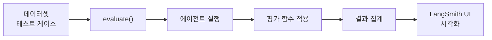
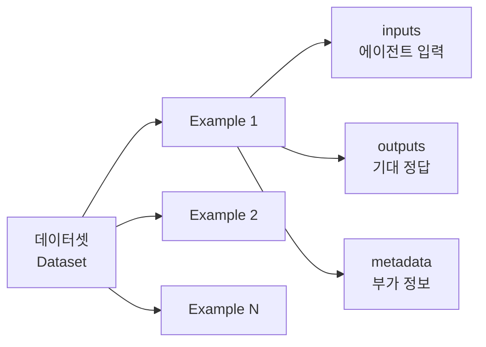
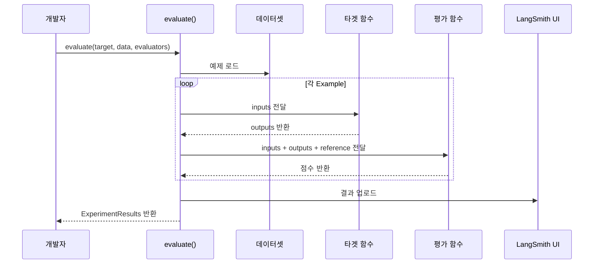
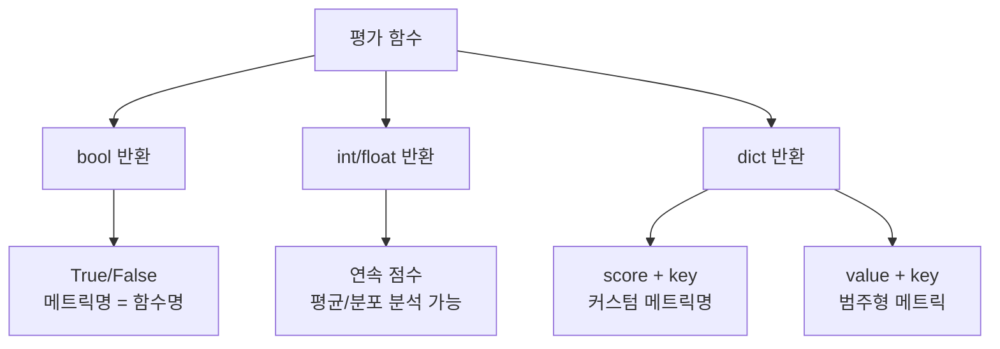
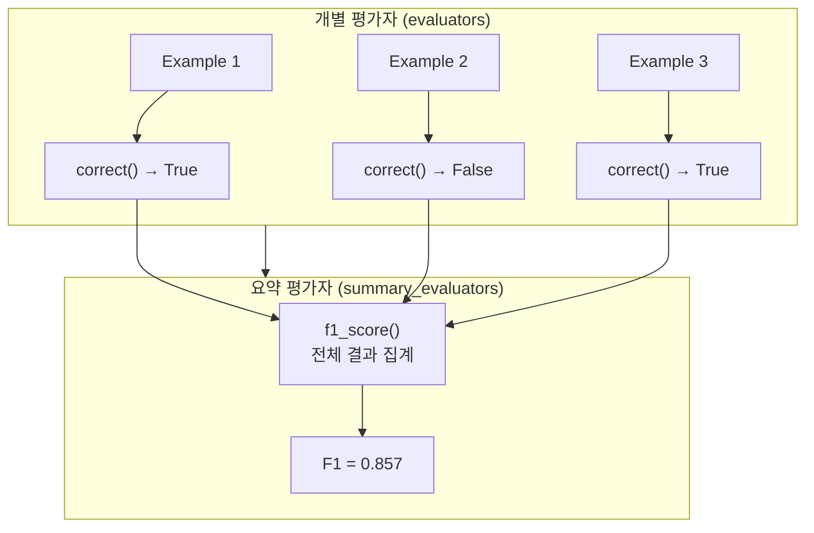
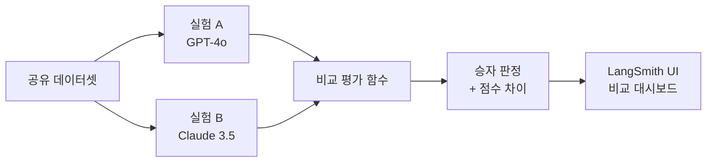

# LangSmith 데이터셋과 오프라인 평가

> LangSmith SDK로 데이터셋을 구성하고, evaluate() API로 에이전트를 체계적으로 평가하는 방법을 학습합니다.

## 개요

이 섹션에서는 LangSmith의 핵심 평가 인프라인 **데이터셋**과 **evaluate() API**를 다룹니다. 앞서 [에이전트 평가 전략](17-ch17-에이전트-평가와-langsmith/01-01-에이전트-평가-전략.md)에서 설계한 평가 프레임워크를 실제로 구현하는 단계입니다.

**선수 지식**: 에이전트 평가의 결과 평가(Outcome)와 궤적 평가(Trajectory) 개념, 코드/모델/사람 평가자 유형(Session 17.1)
**학습 목표**:
- LangSmith 데이터셋을 프로그래밍 방식으로 생성·관리할 수 있다
- 커스텀 평가 함수를 작성하고 evaluate()로 실행할 수 있다
- 요약 평가자(Summary Evaluator)로 전체 실험 성능을 집계할 수 있다
- 두 실험의 결과를 비교(Pairwise)하여 개선 여부를 판단할 수 있다

## 왜 알아야 할까?

에이전트를 만들고 "잘 되는 것 같다"는 감각에 의존한 적이 있나요? 처음에는 괜찮아 보여도, 프롬프트를 수정하거나 모델을 바꿀 때마다 무언가 깨지고, 뭐가 나빠졌는지 알 수 없는 상황이 반복됩니다.

**오프라인 평가**는 이 문제를 해결합니다. 미리 준비한 테스트 케이스(데이터셋)에 에이전트를 돌리고, 자동으로 점수를 매기는 거죠. 소프트웨어 개발의 **단위 테스트**와 같은 역할인데, 차이점은 LLM의 출력이 비결정적(non-deterministic)이라 결과가 매번 다를 수 있다는 점입니다.

LangSmith의 `evaluate()` API는 이 전체 과정을 한 줄로 처리해줍니다. 데이터셋 로드 → 에이전트 실행 → 평가 함수 적용 → 결과 집계 → UI 시각화까지, 평가의 보일러플레이트를 최소화하는 게 핵심이거든요.

> 📊 **그림 0**: 오프라인 평가의 전체 구조



## 핵심 개념

### 개념 1: LangSmith 데이터셋 — 평가의 시험지

> 💡 **비유**: 데이터셋은 학교 시험의 **문제집**과 같습니다. 문제(inputs)와 정답(outputs)이 짝을 이루고, 학생(에이전트)이 풀어서 채점(evaluate)합니다. 문제집이 없으면 "잘했다/못했다"를 판단할 기준이 없죠.

LangSmith 데이터셋은 `Example` 객체의 컬렉션입니다. 각 Example은 세 가지 필드로 구성됩니다:

| 필드 | 역할 | 예시 |
|------|------|------|
| `inputs` | 에이전트에 전달할 입력 | `{"question": "서울의 인구는?"}` |
| `outputs` | 기대하는 정답 (reference) | `{"answer": "약 950만명"}` |
| `metadata` | 부가 정보 (난이도, 출처 등) | `{"difficulty": "easy", "source": "census"}` |

> 📊 **그림 1**: LangSmith 데이터셋 구조



데이터셋 생성은 `Client` 객체를 통해 프로그래밍 방식으로 이루어집니다:

```python
from langsmith import Client

client = Client()

# 1. 데이터셋 생성
dataset = client.create_dataset(
    dataset_name="고객 문의 분류",
    description="고객 문의를 카테고리별로 분류하는 평가 데이터셋"
)

# 2. 예제 일괄 추가 (bulk)
client.create_examples(
    dataset_id=dataset.id,
    examples=[
        {
            "inputs": {"query": "주문한 상품이 아직 안 왔어요"},
            "outputs": {"category": "배송"},
            "metadata": {"difficulty": "easy"}
        },
        {
            "inputs": {"query": "카드 결제가 두 번 됐는데 환불해주세요"},
            "outputs": {"category": "결제"},
            "metadata": {"difficulty": "medium"}
        },
        {
            "inputs": {"query": "이 제품 다른 색상도 있나요?"},
            "outputs": {"category": "상품문의"},
            "metadata": {"difficulty": "easy"}
        },
    ]
)
```

데이터셋에는 **splits**(분할)을 지정할 수 있어서, 학습/검증/테스트 목적으로 나눌 수 있습니다:

```python
# 기존 예제에 split 지정
client.update_examples(
    example_ids=[ex1.id, ex2.id, ex3.id],
    splits=[["test"], ["test"], ["validation"]]
)
```

### 개념 2: evaluate() API — 한 줄로 끝내는 평가 파이프라인

> 💡 **비유**: `evaluate()`는 **시험 감독관**입니다. 문제집(데이터셋)을 들고 학생(에이전트)을 한 명씩 불러서 문제를 풀게 하고, 채점관(평가 함수)에게 넘겨서 점수를 매긴 뒤, 성적표(결과)를 정리해줍니다. 감독관이 없으면 이 모든 과정을 직접 for 루프로 돌려야 하죠.

> 📊 **그림 2**: evaluate() 실행 흐름



`evaluate()`는 `langsmith` 패키지에서 제공하는 **독립 함수(standalone function)**입니다. `Client`의 메서드가 아니라 최상위 모듈에서 직접 import하여 사용합니다:

```python
from langsmith import evaluate

results = evaluate(
    target,                        # 평가할 함수 또는 Runnable
    data="고객 문의 분류",           # 데이터셋 이름, UUID, 또는 Example 리스트
    evaluators=[correct, quality],  # 예제별 평가 함수 리스트
    summary_evaluators=[f1_score],  # 전체 집계 평가 함수
    experiment_prefix="v2-gpt4",    # 실험 이름 접두사
    description="GPT-4 기반 분류기 v2 테스트",
    max_concurrency=4,              # 병렬 실행 수 (0=순차)
    num_repetitions=1,              # 반복 횟수 (비결정적 결과 평균화)
)
```

> ⚠️ **흔한 오해**: `client.evaluate()`로 호출해야 한다고 생각하기 쉽지만, `evaluate()`는 `langsmith` 패키지의 **최상위 함수**입니다. `from langsmith import evaluate`로 import하여 독립적으로 사용하세요. Client 인스턴스는 데이터셋 관리(`create_dataset`, `create_examples` 등)에 사용하고, 평가 실행은 `evaluate()`를 쓰는 것이 공식 패턴입니다.

**타겟 함수(target)** 시그니처는 두 가지 형태를 지원합니다:

```python
# 형태 1: inputs만 받기 (가장 일반적)
def my_agent(inputs: dict) -> dict:
    # inputs는 데이터셋 Example의 inputs 필드
    result = call_llm(inputs["query"])
    return {"answer": result}

# 형태 2: inputs + config 받기
def my_agent(inputs: dict, config: dict) -> dict:
    # config에는 run_id 등 실행 컨텍스트 포함
    return {"answer": "..."}
```

### 개념 3: 커스텀 평가 함수 — 채점 기준 정의

> 💡 **비유**: 평가 함수는 **채점 기준표(루브릭)**입니다. "정답과 일치하면 O", "핵심 키워드가 포함되면 부분 점수" 같은 기준을 코드로 표현한 것이죠. 좋은 루브릭 없이는 아무리 시험을 봐도 의미 있는 점수가 나오지 않습니다.

평가 함수는 아래 파라미터 중 **필요한 것만 골라서** 받을 수 있습니다:

| 파라미터 | 타입 | 설명 |
|----------|------|------|
| `inputs` | `dict` | 데이터셋 예제의 입력 |
| `outputs` | `dict` | 타겟 함수의 출력 |
| `reference_outputs` | `dict` | 데이터셋 예제의 기대 정답 |
| `run` | `Run` | 전체 실행 객체 (메타데이터, 시간 등) |
| `example` | `Example` | 전체 예제 객체 |

반환 타입에 따라 해석이 달라집니다:

```python
# 1. bool → 합격/불합격 (메트릭 이름 = 함수명)
def correct(outputs: dict, reference_outputs: dict) -> bool:
    return outputs["category"] == reference_outputs["category"]

# 2. int/float → 연속 점수
def similarity_score(outputs: dict, reference_outputs: dict) -> float:
    # 0.0 ~ 1.0 사이의 유사도
    return compute_similarity(outputs["answer"], reference_outputs["answer"])

# 3. dict → 커스텀 메트릭 이름 + 점수
def response_quality(inputs: dict, outputs: dict) -> dict:
    length = len(outputs.get("answer", ""))
    return {
        "key": "response_length",  # UI에 표시될 메트릭 이름
        "score": min(length / 200, 1.0)  # 정규화된 점수
    }

# 4. Run 객체로 지연 시간 측정
def latency_check(run) -> dict:
    elapsed = (run.end_time - run.start_time).total_seconds()
    return {
        "key": "latency_ok",
        "score": 1 if elapsed < 5.0 else 0
    }
```

> 📊 **그림 3**: 평가 함수 타입별 반환값과 해석



### 개념 4: 요약 평가자 — 전체 실험을 한눈에

> 💡 **비유**: 개별 평가 함수가 **한 문제의 채점**이라면, 요약 평가자(Summary Evaluator)는 **성적표 하단의 총점과 평균**을 계산하는 과정입니다. 개별 문제의 O/X만으로는 "전체적으로 얼마나 잘했는가"를 판단하기 어렵죠.

요약 평가자는 개별 예제가 아닌, **전체 예제의 결과를 리스트로** 받습니다:

```python
def f1_score(outputs: list[dict], reference_outputs: list[dict]) -> dict:
    """전체 데이터셋에 대한 F1 Score 계산"""
    tp, fp, fn = 0, 0, 0

    for output, ref in zip(outputs, reference_outputs):
        pred = output.get("category", "")
        gold = ref.get("category", "")
        if pred == gold and pred == "배송":
            tp += 1
        elif pred == "배송" and gold != "배송":
            fp += 1
        elif pred != "배송" and gold == "배송":
            fn += 1

    if tp == 0:
        return {"key": "f1_score", "score": 0.0}

    precision = tp / (tp + fp)
    recall = tp / (tp + fn)
    f1 = 2 * (precision * recall) / (precision + recall)
    return {"key": "f1_score", "score": round(f1, 4)}
```

요약 평가자가 받을 수 있는 파라미터도 유연합니다:

| 파라미터 | 타입 | 설명 |
|----------|------|------|
| `inputs` | `list[dict]` | 모든 예제의 입력 리스트 |
| `outputs` | `list[dict]` | 모든 타겟 출력 리스트 |
| `reference_outputs` | `list[dict]` | 모든 기대 정답 리스트 |
| `runs` | `list[Run]` | 모든 실행 객체 리스트 |
| `examples` | `list[Example]` | 모든 예제 객체 리스트 |

> 📊 **그림 4**: 개별 평가자 vs 요약 평가자 실행 흐름



### 개념 5: 실험 비교 — Pairwise 평가

> 💡 **비유**: 두 학생이 같은 시험을 봤을 때, 점수만 비교하면 "누가 더 잘했나"를 알 수 있죠. Pairwise 평가는 정확히 이 작업입니다 — 같은 데이터셋에 대해 두 버전의 에이전트를 실행하고, 어느 쪽이 나은지 비교합니다.

이미 실행된 두 실험을 비교할 때는 `evaluate()`에 실험 이름을 튜플로 전달합니다:

```python
from langsmith import evaluate

# 비교 평가 함수 — outputs가 2개 실험의 결과 리스트
def preference(inputs: dict, outputs: list[dict]) -> list:
    """두 실험 중 정답에 가까운 쪽에 1점"""
    expected = inputs.get("expected_category")
    scores = []
    for output in outputs:
        scores.append(1 if output.get("category") == expected else 0)
    return scores

results = evaluate(
    ("experiment-v1", "experiment-v2"),  # 두 실험 이름 튜플
    evaluators=[preference],
    randomize_order=True,  # 위치 편향 방지
)
```

> 📊 **그림 5**: Pairwise 평가 흐름



기존 실험에 **새로운 평가자를 추가 적용**할 수도 있습니다. 에이전트를 다시 실행할 필요 없이 채점만 다시 하는 거죠:

```python
from langsmith import evaluate

# 이미 완료된 실험에 새 평가자 적용
# target 자리에 실험 이름(문자열)을 전달하면 기존 결과에 새 채점만 수행
results = evaluate(
    "기존-실험-이름",        # 타겟 대신 실험 이름 전달
    evaluators=[new_metric],  # 새 평가 함수만 적용
)
```

## 실습: 직접 해보기

고객 문의 분류 에이전트를 만들고, LangSmith로 체계적으로 평가하는 전체 워크플로우를 구현해봅시다.

### 사전 준비

```python
# 필요 패키지 설치
# pip install langsmith langchain-openai python-dotenv

import os
from dotenv import load_dotenv

load_dotenv()

# 환경 변수 설정 (또는 .env 파일)
# LANGSMITH_API_KEY=your-key
# LANGSMITH_PROJECT=agent-eval-tutorial
# OPENAI_API_KEY=your-key
```

### Step 1: 데이터셋 구성

```python
from langsmith import Client

client = Client()

# 평가용 데이터셋 생성
dataset_name = "고객문의분류-v1"

# 이미 존재하면 삭제 후 재생성 (개발 중 반복 실행용)
if client.has_dataset(dataset_name=dataset_name):
    client.delete_dataset(dataset_name=dataset_name)

dataset = client.create_dataset(
    dataset_name=dataset_name,
    description="고객 문의를 5개 카테고리로 분류하는 평가 데이터셋"
)

# 평가 예제 구성 — 다양한 난이도와 카테고리
examples = [
    # 배송 관련
    {"inputs": {"query": "택배가 3일째 안 와요"}, "outputs": {"category": "배송"}, "metadata": {"difficulty": "easy"}},
    {"inputs": {"query": "배송 중 파손된 것 같은데 교환 가능한가요?"}, "outputs": {"category": "배송"}, "metadata": {"difficulty": "medium"}},
    # 결제 관련
    {"inputs": {"query": "카드 결제 취소하고 싶어요"}, "outputs": {"category": "결제"}, "metadata": {"difficulty": "easy"}},
    {"inputs": {"query": "할부 결제를 일시불로 변경할 수 있나요?"}, "outputs": {"category": "결제"}, "metadata": {"difficulty": "medium"}},
    # 상품문의
    {"inputs": {"query": "이 신발 260mm 재입고 언제 되나요?"}, "outputs": {"category": "상품문의"}, "metadata": {"difficulty": "easy"}},
    {"inputs": {"query": "A 제품과 B 제품 차이가 뭔가요?"}, "outputs": {"category": "상품문의"}, "metadata": {"difficulty": "medium"}},
    # 반품/교환
    {"inputs": {"query": "사이즈가 안 맞아서 교환하고 싶어요"}, "outputs": {"category": "반품교환"}, "metadata": {"difficulty": "easy"}},
    {"inputs": {"query": "개봉했는데 반품 가능한가요? 하자가 있어요"}, "outputs": {"category": "반품교환"}, "metadata": {"difficulty": "hard"}},
    # 계정/기술
    {"inputs": {"query": "비밀번호를 잊어버렸어요"}, "outputs": {"category": "계정"}, "metadata": {"difficulty": "easy"}},
    {"inputs": {"query": "앱이 자꾸 튕겨요 결제 화면에서"}, "outputs": {"category": "계정"}, "metadata": {"difficulty": "hard"}},
]

client.create_examples(dataset_id=dataset.id, examples=examples)
print(f"데이터셋 '{dataset_name}' 생성 완료: {len(examples)}개 예제")
```

### Step 2: 타겟 함수 정의

```python
from langchain_openai import ChatOpenAI
from langsmith import traceable

llm = ChatOpenAI(model="gpt-4o-mini", temperature=0)

CATEGORIES = ["배송", "결제", "상품문의", "반품교환", "계정"]

@traceable  # LangSmith 트레이싱 자동 활성화
def classify_query(inputs: dict) -> dict:
    """고객 문의를 카테고리로 분류하는 타겟 함수"""
    query = inputs["query"]

    response = llm.invoke(
        f"다음 고객 문의를 아래 카테고리 중 하나로 분류하세요.\n"
        f"카테고리: {', '.join(CATEGORIES)}\n"
        f"문의: {query}\n"
        f"카테고리만 정확히 출력하세요."
    )

    return {"category": response.content.strip()}
```

### Step 3: 평가 함수 작성

```python
from langsmith.schemas import Run, Example

# 1. 정확도 평가 (bool)
def exact_match(outputs: dict, reference_outputs: dict) -> bool:
    """예측 카테고리와 정답이 정확히 일치하는지"""
    return outputs.get("category") == reference_outputs.get("category")

# 2. 응답 속도 평가 (dict)
def latency_score(run: Run) -> dict:
    """응답 시간이 3초 이내인지 평가"""
    if run.end_time and run.start_time:
        elapsed = (run.end_time - run.start_time).total_seconds()
        return {
            "key": "fast_response",
            "score": 1.0 if elapsed < 3.0 else 0.0
        }
    return {"key": "fast_response", "score": 0.0}

# 3. 유효 카테고리 평가 (dict)
def valid_category(outputs: dict) -> dict:
    """출력이 허용된 카테고리 목록에 포함되는지"""
    predicted = outputs.get("category", "")
    return {
        "key": "valid_category",
        "score": 1.0 if predicted in CATEGORIES else 0.0
    }

# 4. 요약 평가자 — 전체 정확도
def accuracy_summary(
    outputs: list[dict],
    reference_outputs: list[dict]
) -> dict:
    """전체 데이터셋에 대한 정확도 계산"""
    correct = sum(
        1 for o, r in zip(outputs, reference_outputs)
        if o.get("category") == r.get("category")
    )
    total = len(outputs)
    return {
        "key": "overall_accuracy",
        "score": round(correct / total, 4) if total > 0 else 0.0
    }
```

### Step 4: 평가 실행

```run:python
# 평가 실행 (실제 실행 시 LangSmith API 키 필요)
# from langsmith import evaluate
#
# results = evaluate(
#     classify_query,
#     data=dataset_name,
#     evaluators=[exact_match, latency_score, valid_category],
#     summary_evaluators=[accuracy_summary],
#     experiment_prefix="gpt4o-mini-baseline",
#     description="GPT-4o-mini 기반 고객 문의 분류기 베이스라인",
#     max_concurrency=4,
# )

# 실행 결과 시뮬레이션
experiment_results = {
    "experiment_name": "gpt4o-mini-baseline-abc123",
    "per_example": [
        {"input": "택배가 3일째 안 와요", "predicted": "배송", "expected": "배송", "exact_match": True},
        {"input": "카드 결제 취소하고 싶어요", "predicted": "결제", "expected": "결제", "exact_match": True},
        {"input": "개봉했는데 반품 가능한가요?", "predicted": "상품문의", "expected": "반품교환", "exact_match": False},
    ],
    "summary": {"overall_accuracy": 0.80, "valid_category": 1.0, "avg_latency": 1.2}
}

print("=== 평가 결과 요약 ===")
print(f"실험 이름: {experiment_results['experiment_name']}")
print(f"전체 정확도: {experiment_results['summary']['overall_accuracy']:.1%}")
print(f"유효 카테고리 비율: {experiment_results['summary']['valid_category']:.1%}")
print(f"평균 응답 시간: {experiment_results['summary']['avg_latency']:.1f}초")
print("\n--- 오답 사례 ---")
for r in experiment_results["per_example"]:
    if not r["exact_match"]:
        print(f"  입력: {r['input']}")
        print(f"  예측: {r['predicted']} | 정답: {r['expected']}")
```

```output
=== 평가 결과 요약 ===
실험 이름: gpt4o-mini-baseline-abc123
전체 정확도: 80.0%
유효 카테고리 비율: 100.0%
평균 응답 시간: 1.2초

--- 오답 사례 ---
  입력: 개봉했는데 반품 가능한가요?
  예측: 상품문의 | 정답: 반품교환
```

### Step 5: 모델 변경 후 비교 평가

```python
from langsmith import evaluate

# 모델을 GPT-4o로 업그레이드한 버전
llm_v2 = ChatOpenAI(model="gpt-4o", temperature=0)

@traceable
def classify_query_v2(inputs: dict) -> dict:
    """개선된 프롬프트 + GPT-4o 분류기"""
    query = inputs["query"]
    response = llm_v2.invoke(
        f"당신은 고객 서비스 전문가입니다.\n"
        f"다음 고객 문의를 분석하여 가장 적합한 카테고리를 선택하세요.\n\n"
        f"카테고리 목록:\n"
        f"- 배송: 택배, 배송 지연, 배송 파손\n"
        f"- 결제: 결제 취소, 환불, 할부\n"
        f"- 상품문의: 재입고, 상품 비교, 스펙\n"
        f"- 반품교환: 교환, 반품, 하자\n"
        f"- 계정: 로그인, 비밀번호, 앱 오류\n\n"
        f"문의: {query}\n"
        f"카테고리만 정확히 한 단어로 출력하세요."
    )
    return {"category": response.content.strip()}

# v2 실험 실행
results_v2 = evaluate(
    classify_query_v2,
    data=dataset_name,
    evaluators=[exact_match, latency_score, valid_category],
    summary_evaluators=[accuracy_summary],
    experiment_prefix="gpt4o-improved",
    description="GPT-4o + 개선된 프롬프트",
    max_concurrency=4,
)

# 두 실험 비교 (Pairwise)
# comparison = evaluate(
#     ("gpt4o-mini-baseline-abc123", "gpt4o-improved-def456"),
#     evaluators=[preference_evaluator],
#     randomize_order=True,
# )
```

### Step 6: 결과 확인

```run:python
# 비교 결과 시뮬레이션
print("=== 실험 비교 결과 ===")
print(f"{'메트릭':<20} {'v1 (GPT-4o-mini)':<18} {'v2 (GPT-4o)':<18} {'변화'}")
print("-" * 70)

comparisons = [
    ("overall_accuracy", 0.80, 0.90, "+10.0%p"),
    ("valid_category", 1.00, 1.00, "동일"),
    ("avg_latency", 1.2, 2.1, "+0.9초"),
    ("fast_response", 1.00, 0.90, "-10.0%p"),
]

for metric, v1, v2, change in comparisons:
    print(f"{metric:<20} {v1:<18.2f} {v2:<18.2f} {change}")
```

```output
=== 실험 비교 결과 ===
메트릭                v1 (GPT-4o-mini)   v2 (GPT-4o)        변화
----------------------------------------------------------------------
overall_accuracy     0.80               0.90               +10.0%p
valid_category       1.00               1.00               동일
avg_latency          1.20               2.10               +0.9초
fast_response        1.00               0.90               -10.0%p
```

## 더 깊이 알아보기

### LangSmith 평가 시스템의 탄생 배경

LangSmith는 LangChain을 만든 Harrison Chase가 2023년에 시작한 프로젝트입니다. LangChain 사용자들이 "에이전트가 잘 작동하는지 어떻게 확인하나요?"라는 질문을 끊임없이 했고, 당시에는 LLM 앱을 평가할 마땅한 도구가 없었거든요.

흥미로운 점은, LangSmith의 `evaluate()` API 설계가 **scikit-learn의 `cross_val_score()`**에서 크게 영감을 받았다는 것입니다. "모델 + 데이터 + 메트릭을 넣으면 점수가 나온다"는 단순한 패러다임을 LLM 세계에 적용한 셈이죠. 다만 LLM의 비결정적 특성 때문에 `num_repetitions` 같은 파라미터가 추가되었습니다.

`evaluate()` 함수의 평가자 파라미터 설계도 흥미롭습니다. 초기에는 `(run: Run, example: Example)` 시그니처를 강제했는데, 사용자들이 "정답 비교에 Run 전체 객체가 필요 없다"고 피드백했고, 결국 `outputs`, `reference_outputs` 같은 **편의 파라미터**를 자동 추출하는 방식으로 진화했습니다. 이름 기반 파라미터 매칭(named parameter matching)이라는 파이썬스러운 해결책이죠.

### openevals: 미리 만들어진 평가자 라이브러리

2024년 말, LangChain 팀은 [openevals](https://github.com/langchain-ai/openevals)라는 별도 패키지를 공개했습니다. `pip install openevals`로 설치하면 정확성, 간결성, RAG 관련성, 코드 품질 등 **미리 검증된 LLM-as-Judge 프롬프트**를 바로 사용할 수 있습니다. 매번 평가 프롬프트를 처음부터 작성하는 수고를 줄여주죠.

```python
from openevals.llm import create_llm_as_judge
from openevals.prompts import CORRECTNESS_PROMPT

# 한 줄로 LLM 기반 정확성 평가자 생성
correctness = create_llm_as_judge(
    prompt=CORRECTNESS_PROMPT,
    feedback_key="correctness",
    model="openai:gpt-4o",
)
```

이 LLM-as-Judge 패턴은 [다음 섹션](17-ch17-에이전트-평가와-langsmith/03-03-llm-as-judge-평가.md)에서 본격적으로 다룹니다.

## 흔한 오해와 팁

> ⚠️ **흔한 오해**: "데이터셋이 클수록 평가가 좋다"고 생각하기 쉽지만, 실제로는 **20~50개의 잘 설계된 예제**가 1000개의 무작위 예제보다 훨씬 효과적입니다. 핵심은 **엣지 케이스를 커버하는 다양성**이지 양이 아닙니다. 카테고리별로 쉬운/어려운/경계 케이스를 2~3개씩 넣는 것이 좋습니다.

> 💡 **알고 계셨나요?**: LangSmith의 `evaluate()`는 이미 완료된 실험에도 새 평가자를 적용할 수 있습니다. 실험 이름을 `target` 자리에 넣으면, 에이전트를 다시 실행하지 않고 기존 결과에 새 채점 기준만 적용됩니다. 비싼 GPT-4o 호출을 반복하지 않아도 되니, 평가 함수를 반복 개선할 때 매우 유용하죠.

> 🔥 **실무 팁**: `max_concurrency`를 적절히 설정하세요. 0(순차 실행)은 안전하지만 느리고, `None`(무제한)은 API rate limit에 걸릴 수 있습니다. 보통 **4~8** 정도가 LLM API의 rate limit과 평가 속도 사이의 최적 균형입니다. 또한 `num_repetitions=3`을 설정하면 비결정적 결과의 분산을 확인할 수 있어, 평가 신뢰도가 크게 올라갑니다.

## 핵심 정리

| 개념 | 설명 |
|------|------|
| **데이터셋(Dataset)** | inputs + outputs + metadata로 구성된 평가 예제 모음. `Client.create_dataset()`으로 생성 |
| **evaluate()** | `from langsmith import evaluate`로 import하는 독립 함수. 타겟 + 데이터셋 + 평가 함수를 받아 자동으로 평가 파이프라인 실행 |
| **평가 함수(Evaluator)** | 개별 예제의 결과를 채점하는 함수. bool/int/float/dict 반환 지원, 필요한 파라미터만 선언 |
| **요약 평가자(Summary)** | 전체 데이터셋 결과를 집계하여 F1, Accuracy 등 종합 메트릭을 산출 |
| **Pairwise 비교** | 두 실험의 결과를 같은 데이터셋 기준으로 비교. `randomize_order=True`로 위치 편향 방지 |
| **기존 실험 재평가** | 실험 이름을 target으로 전달하면 에이전트 재실행 없이 새 평가 함수만 적용 |

## 다음 섹션 미리보기

지금까지 코드 기반의 **확정적 평가**(exact match, F1 등)를 다뤘는데, 에이전트의 답변 품질은 정확한 문자열 매칭만으로는 판단하기 어려운 경우가 많습니다. "서울 인구는 약 950만명입니다"와 "서울에는 대략 950만 명이 살고 있어요"는 다른 문자열이지만 같은 뜻이죠. [다음 섹션](17-ch17-에이전트-평가와-langsmith/03-03-llm-as-judge-평가.md)에서는 **LLM을 평가자로 사용**하는 LLM-as-Judge 패턴과 openevals 라이브러리를 깊이 다룹니다.

## 참고 자료

- [LangSmith Evaluation 공식 문서](https://docs.langchain.com/langsmith/evaluation) - evaluate() API의 전체 기능과 사용법을 다루는 공식 가이드
- [LangSmith Python SDK — evaluate() API Reference](https://docs.smith.langchain.com/reference/python/evaluation/langsmith.evaluation._runner.evaluate) - evaluate() 함수의 상세 시그니처와 파라미터 설명
- [openevals GitHub 리포지토리](https://github.com/langchain-ai/openevals) - LangChain 팀이 제공하는 미리 구축된 LLM 평가자 컬렉션
- [LangSmith 데이터셋 프로그래밍 관리 가이드](https://docs.langchain.com/langsmith/manage-datasets-programmatically) - 데이터셋 생성, 업데이트, splits 관리 방법
- [LangSmith SDK Releases](https://github.com/langchain-ai/langsmith-sdk/releases) - 최신 SDK 변경사항 및 릴리스 노트

---
### 🔗 Related Sessions
- [outcome_evaluation](17-ch17-에이전트-평가와-langsmith/01-01-에이전트-평가-전략.md) (prerequisite)
- [trajectory_evaluation](17-ch17-에이전트-평가와-langsmith/01-01-에이전트-평가-전략.md) (prerequisite)
- [grader_types](17-ch17-에이전트-평가와-langsmith/01-01-에이전트-평가-전략.md) (prerequisite)
- [pass_at_k](17-ch17-에이전트-평가와-langsmith/01-01-에이전트-평가-전략.md) (prerequisite)
