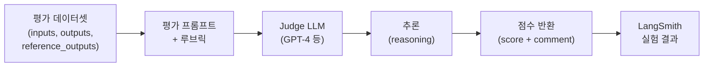
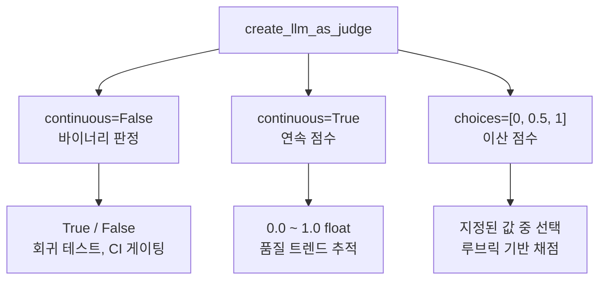
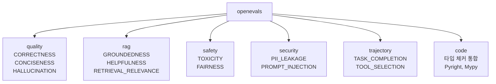
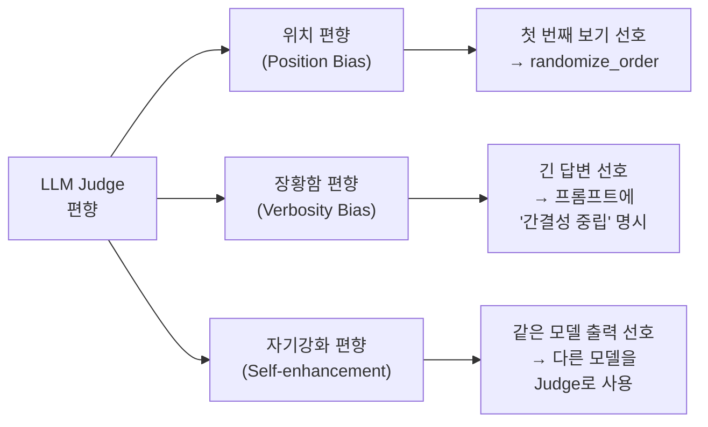
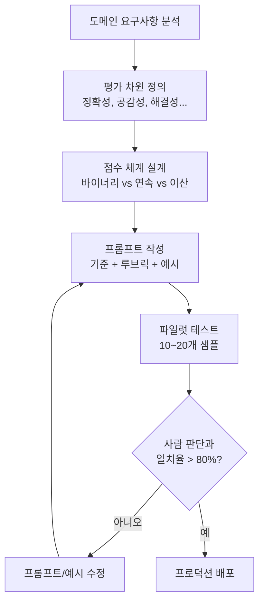
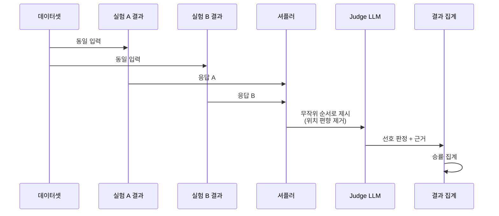
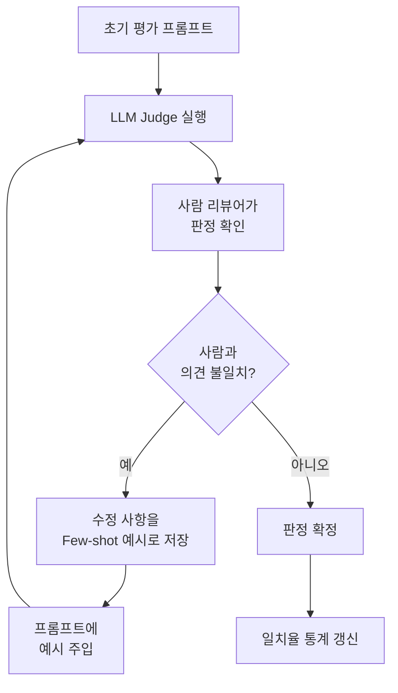

# 03. LLM-as-Judge 평가

> LLM이 평가자가 되어 에이전트 출력의 품질을 자동으로 판정하는 패턴을 학습합니다

## 개요

이 섹션에서는 확정적 매칭(exact match)으로는 평가할 수 없는 "의미적 정확성"을 LLM이 직접 판정하는 **LLM-as-Judge** 패턴을 다룹니다. openevals 라이브러리의 `create_llm_as_judge`를 활용해 커스텀 평가 기준을 설계하고, Pairwise 비교 평가와 평가자 일관성 검증까지 실습합니다.

**선수 지식**: [에이전트 평가 전략](17-ch17-에이전트-평가와-langsmith/01-01-에이전트-평가-전략.md)에서 배운 결과 평가/궤적 평가 프레임워크, [LangSmith 데이터셋과 오프라인 평가](17-ch17-에이전트-평가와-langsmith/02-02-langsmith-데이터셋과-오프라인-평가.md)에서 실습한 `evaluate()` API와 커스텀 평가 함수 작성법

**학습 목표**:
- LLM-as-Judge 패턴의 원리와 세 가지 체계적 편향을 이해할 수 있다
- openevals의 `create_llm_as_judge`로 바이너리/연속/이산 점수 평가자를 만들 수 있다
- Pairwise 비교 평가를 설정하고 위치 편향을 완화할 수 있다
- Few-shot 예시와 Human-in-the-Loop로 평가자 일관성을 높일 수 있다

## 왜 알아야 할까?

에이전트가 "서울의 날씨를 알려드릴게요. 현재 서울은 맑은 날씨에 기온은 18도입니다"라고 답했다고 합시다. 정답이 "서울 현재 기온 18°C, 맑음"이라면, 문자열 비교(`==`)로는 이 둘이 다르다고 판정됩니다. 하지만 의미적으로는 완벽하게 같은 답이죠.

에이전트의 출력은 자유 형식 텍스트이고, 같은 의미를 수십 가지 방식으로 표현할 수 있습니다. 코드 평가자(`exact_match`, `contains`)로는 이런 "의미적 동등성"을 판단할 수 없거든요. 여기서 LLM-as-Judge가 빛을 발합니다 — LLM이 평가 기준을 이해하고 의미 기반으로 채점하는 것이죠.

실무에서 에이전트 평가의 80% 이상은 LLM-as-Judge에 의존합니다. 이 패턴을 제대로 설계하지 않으면, 좋은 응답도 "실패"로, 나쁜 응답도 "성공"으로 판정하는 평가 시스템이 됩니다.

## 핵심 개념

### 개념 1: LLM-as-Judge란 무엇인가

> 💡 **비유**: 논문 심사를 생각해보세요. 키워드 매칭 프로그램으로 논문의 질을 판단할 수 없듯이, 전문가(LLM)가 기준표(루브릭)를 보면서 의미를 이해하고 평가하는 방식입니다. 채점 루브릭이 명확할수록 심사 결과가 일관됩니다.

LLM-as-Judge는 **평가 대상 출력**과 **평가 기준(프롬프트)**을 LLM에게 전달하고, LLM이 점수와 근거를 반환하는 패턴입니다. 핵심 구성 요소는 세 가지입니다:

1. **평가 프롬프트**: 무엇을 기준으로 판단할지 (정확성, 간결성, 할루시네이션 등)
2. **판정 모델**: 평가를 수행할 LLM (보통 평가 대상보다 강한 모델)
3. **점수 체계**: 이진(True/False), 연속(0.0~1.0), 또는 이산(0, 0.5, 1.0)

> 📊 **그림 1**: LLM-as-Judge 평가 흐름



세 가지 핵심 판정 모드를 코드로 살펴보겠습니다:

```python
from openevals.llm import create_llm_as_judge

# 1. 바이너리 판정 — "맞다/틀리다"
binary_judge = create_llm_as_judge(
    prompt="주어진 질문에 대해 응답이 정확한지 판단하세요.\n"
           "질문: {inputs}\n응답: {outputs}\n정답: {reference_outputs}",
    feedback_key="correctness",
    model="openai:gpt-4.1",
    continuous=False,  # 기본값: True/False 반환
)

# 2. 연속 점수 — 0.0~1.0 사이 실수
continuous_judge = create_llm_as_judge(
    prompt="응답의 정확성을 0.0(완전 오답)~1.0(완벽) 사이 점수로 평가하세요.\n"
           "질문: {inputs}\n응답: {outputs}\n정답: {reference_outputs}",
    feedback_key="accuracy_score",
    model="openai:gpt-4.1",
    continuous=True,   # float 반환
)

# 3. 이산 점수 — 특정 값만 선택
discrete_judge = create_llm_as_judge(
    prompt="응답 품질을 평가하세요:\n"
           "0.0 = 완전히 잘못됨\n0.5 = 부분적으로 맞음\n1.0 = 완벽\n"
           "질문: {inputs}\n응답: {outputs}",
    feedback_key="quality",
    model="openai:gpt-4.1",
    choices=[0.0, 0.5, 1.0],  # 이 중 하나만 반환
)
```

`create_llm_as_judge`는 호출 가능한 함수(callable)를 반환합니다. 이 함수는 `inputs`, `outputs`, `reference_outputs` 등의 키워드 인자를 받고, `{'key': str, 'score': bool|float, 'comment': str}` 딕셔너리를 반환합니다.

세 가지 모드가 같은 응답을 어떻게 다르게 평가하는지 비교해볼까요?

```run:python
# 세 가지 판정 모드 비교 (시뮬레이션)
question = "Python에서 리스트와 튜플의 차이는?"
answer = "리스트는 변경 가능하고, 튜플은 변경 불가능합니다."
reference = "리스트는 mutable, 튜플은 immutable. 리스트는 [], 튜플은 ()로 생성."

# 각 Judge의 반환값 시뮬레이션
binary_result = {"key": "correctness", "score": True,
                 "comment": "핵심 차이(mutable/immutable)를 정확히 설명"}
continuous_result = {"key": "accuracy_score", "score": 0.7,
                     "comment": "핵심은 맞지만 생성 문법([], ()) 설명 누락"}
discrete_result = {"key": "quality", "score": 0.5,
                   "comment": "부분적으로 맞음 — 기본 개념은 맞지만 불완전"}

print("=== 같은 응답, 세 가지 판정 모드 ===")
print(f"바이너리:  {binary_result['score']}  — {binary_result['comment']}")
print(f"연속:     {continuous_result['score']}  — {continuous_result['comment']}")
print(f"이산:     {discrete_result['score']}  — {discrete_result['comment']}")
print()
print("→ 바이너리는 '맞다'로 통과, 연속/이산은 부분 점수 부여")
print("→ 용도에 따라 점수 체계를 선택하세요!")
```

```output
=== 같은 응답, 세 가지 판정 모드 ===
바이너리:  True  — 핵심 차이(mutable/immutable)를 정확히 설명
연속:     0.7  — 핵심은 맞지만 생성 문법([], ()) 설명 누락
이산:     0.5  — 부분적으로 맞음 — 기본 개념은 맞지만 불완전
→ 바이너리는 '맞다'로 통과, 연속/이산은 부분 점수 부여
→ 용도에 따라 점수 체계를 선택하세요!
```

> 📊 **그림 2**: 세 가지 판정 모드 비교



### 개념 2: openevals — 검증된 평가 프롬프트 라이브러리

> 💡 **비유**: 시험 문제를 직접 만들 수도 있지만, 교육 전문가들이 수천 번 검증한 표준 시험지를 쓰는 게 더 안정적이죠. openevals는 LangChain 팀이 수많은 실험을 통해 검증한 "표준 채점 루브릭" 모음집입니다.

[openevals](https://github.com/langchain-ai/openevals)는 LangChain 팀이 만든 사전 검증된 평가 프롬프트 라이브러리입니다. 직접 프롬프트를 만들 때 흔히 발생하는 문제(모호한 기준, 일관성 부족)를 줄여줍니다. openevals가 제공하는 프롬프트는 수많은 실험에서 사람 판정과의 일치율이 검증된 것들이기 때문에, 커스텀 프롬프트를 처음부터 작성하기 전에 먼저 활용해보는 것이 좋습니다.

> 📊 **그림 3**: openevals 프롬프트 카테고리 구조



주요 프롬프트와 사용법을 살펴보겠습니다:

```python
from openevals.llm import create_llm_as_judge

# 사전 정의된 프롬프트 임포트
from openevals.prompts import (
    CORRECTNESS_PROMPT,       # 정답 대비 정확성
    CONCISENESS_PROMPT,       # 간결성
    HALLUCINATION_PROMPT,     # 할루시네이션 여부
)
from openevals.prompts.rag import (
    RAG_GROUNDEDNESS_PROMPT,  # 검색 결과 기반 응답인지
    RAG_HELPFULNESS_PROMPT,   # 사용자에게 유용한지
)

# CORRECTNESS 평가자 생성
correctness_evaluator = create_llm_as_judge(
    prompt=CORRECTNESS_PROMPT,
    feedback_key="correctness",
    model="openai:gpt-4.1",
)

# 실행
result = correctness_evaluator(
    inputs="대한민국의 수도는?",
    outputs="서울특별시입니다.",
    reference_outputs="서울",
)
# {'key': 'correctness', 'score': True, 'comment': '응답이 정답과 의미적으로 일치합니다.'}
```

에이전트 평가에 특히 유용한 카테고리별 용도를 정리하면:

| 카테고리 | 프롬프트 | 에이전트 평가 용도 |
|----------|----------|-------------------|
| quality | `CORRECTNESS` | 최종 응답의 정확성 |
| quality | `HALLUCINATION` | 도구 결과에 없는 내용을 생성했는지 |
| rag | `RAG_GROUNDEDNESS` | RAG 에이전트의 근거 기반 응답 여부 |
| trajectory | `TASK_COMPLETION` | 에이전트가 태스크를 완료했는지 |
| trajectory | `TOOL_SELECTION` | 적절한 도구를 선택했는지 |
| security | `PROMPT_INJECTION` | 프롬프트 인젝션 방어 테스트 |

### 개념 3: LLM-as-Judge의 세 가지 체계적 편향

> 💡 **비유**: 논문 심사에서도 편향이 존재합니다 — 유명 대학 소속 논문을 더 높게 평가하거나, 먼저 읽은 논문이 기준이 되어 나중 논문에 불리하죠. LLM Judge도 마찬가지로, 내용과 무관한 요인에 영향을 받는 세 가지 체계적 편향이 있습니다.

UC Berkeley의 LMSYS 그룹(Zheng et al., 2023)은 LLM-as-Judge에서 세 가지 체계적 편향을 발견했습니다. 이 편향을 이해하고 완화하지 않으면, 평가 결과를 신뢰할 수 없게 됩니다.

> 📊 **그림 4**: LLM-as-Judge의 세 가지 체계적 편향



```run:python
# 세 가지 편향과 완화 전략
biases = [
    ("위치 편향 (Position Bias)",
     "Pairwise에서 첫 번째 위치의 답변을 선호",
     "randomize_order=True로 순서 무작위화"),
    ("장황함 편향 (Verbosity Bias)",
     "내용과 무관하게 더 긴 답변을 높게 평가",
     "프롬프트에 '길이가 아닌 정확성 기준' 명시"),
    ("자기강화 편향 (Self-enhancement Bias)",
     "Judge와 같은 모델의 출력을 선호",
     "평가 대상과 다른 모델을 Judge로 사용"),
]

print("=== LLM-as-Judge의 세 가지 체계적 편향 ===\n")
for name, desc, mitigation in biases:
    print(f"📌 {name}")
    print(f"   현상: {desc}")
    print(f"   완화: {mitigation}\n")
```

```output
=== LLM-as-Judge의 세 가지 체계적 편향 ===

📌 위치 편향 (Position Bias)
   현상: Pairwise에서 첫 번째 위치의 답변을 선호
   완화: randomize_order=True로 순서 무작위화

📌 장황함 편향 (Verbosity Bias)
   현상: 내용과 무관하게 더 긴 답변을 높게 평가
   완화: 프롬프트에 '길이가 아닌 정확성 기준' 명시

📌 자기강화 편향 (Self-enhancement Bias)
   현상: Judge와 같은 모델의 출력을 선호
   완화: 평가 대상과 다른 모델을 Judge로 사용
```

특히 **자기강화 편향**은 실무에서 빠지기 쉬운 함정입니다. GPT-4o-mini로 만든 에이전트를 GPT-4o-mini가 평가하면, 같은 "사고 패턴"을 공유하기 때문에 자연스럽게 높은 점수를 줍니다. 반드시 Judge 모델은 평가 대상과 **다른** 모델(또는 한 단계 강한 모델)을 사용하세요.

### 개념 4: 커스텀 평가 기준 설계

> 💡 **비유**: 레스토랑 리뷰에서 "맛있다"는 기준이 너무 모호합니다. "간이 적절한가?", "식감이 의도한 바인가?", "향신료 밸런스는?" 같은 구체적 기준이 있어야 일관된 평가가 나옵니다. LLM 평가 프롬프트도 마찬가지입니다.

기본 제공 프롬프트로 부족할 때, 도메인 특화 평가 기준을 직접 설계합니다. 핵심은 **루브릭의 구체성**입니다:

```python
from openevals.llm import create_llm_as_judge

# 커스텀 프롬프트: 에이전트의 고객 응대 품질 평가
CUSTOMER_SERVICE_PROMPT = """당신은 고객 서비스 품질 평가 전문가입니다.

다음 기준으로 에이전트의 응답을 평가하세요:

1. **정확성**: 고객 질문에 대한 답변이 사실에 부합하는가?
2. **공감성**: 고객의 감정을 인식하고 적절히 대응하는가?
3. **해결성**: 고객의 문제를 실제로 해결하거나 다음 단계를 제시하는가?
4. **전문성**: 전문 용어를 적절히 사용하고, 불필요한 기술 용어를 피하는가?

고객 질문: {inputs}
에이전트 응답: {outputs}
모범 응답 (참고용): {reference_outputs}

각 기준에 대해 분석한 후, 종합 점수를 매기세요.
0.0 = 완전히 부적절
0.5 = 개선 필요
1.0 = 우수
"""

# 커스텀 평가자 생성
cs_evaluator = create_llm_as_judge(
    prompt=CUSTOMER_SERVICE_PROMPT,
    feedback_key="customer_service_quality",
    model="anthropic:claude-sonnet-4-20250514",
    choices=[0.0, 0.5, 1.0],
    use_reasoning=True,  # 판단 근거를 comment에 포함
)
```

> 📊 **그림 5**: 커스텀 평가 기준 설계 프로세스



**Few-shot 예시**를 추가하면 평가 일관성이 크게 향상됩니다:

```python
cs_evaluator_with_examples = create_llm_as_judge(
    prompt=CUSTOMER_SERVICE_PROMPT,
    feedback_key="customer_service_quality",
    model="openai:gpt-4.1",
    choices=[0.0, 0.5, 1.0],
    few_shot_examples=[
        {
            "inputs": "배송이 왜 이렇게 늦나요? 3일 전에 주문했는데!",
            "outputs": "배송 조회 결과, 현재 물류센터 출고 대기 중입니다. "
                       "불편을 드려 죄송합니다. 내일 중 출고 예정이며, "
                       "추가 지연 시 자동으로 알림을 보내드리겠습니다.",
            "reference_outputs": "배송 상태를 확인하고 예상 일정을 안내",
            "score": 1.0,
            "reasoning": "정확한 배송 상태 제공, 고객 감정 인정(사과), "
                         "구체적 다음 단계 제시. 모든 기준을 충족.",
        },
        {
            "inputs": "환불은 어떻게 하나요?",
            "outputs": "환불 정책은 홈페이지를 참고해주세요.",
            "reference_outputs": "환불 절차를 단계별로 안내",
            "score": 0.0,
            "reasoning": "구체적 절차 미제시, 고객 떠넘기기. "
                         "해결성과 공감성 모두 미달.",
        },
    ],
)
```

### 개념 5: Pairwise 비교 평가

> 💡 **비유**: 와인 소믈리에 테스트에서 "이 와인이 100점 만점에 몇 점?"이라고 물으면 사람마다 기준이 다릅니다. 하지만 "이 두 와인 중 어느 것이 더 나은가?"라고 물으면 합의율이 훨씬 높아지죠. LLM 평가도 마찬가지로, 절대 점수보다 상대 비교가 더 일관됩니다.

**Pairwise 평가**는 두 실험의 출력을 나란히 놓고 "어느 쪽이 더 나은가?"를 판정합니다. 프롬프트 변경, 모델 교체 등의 A/B 테스트에 특히 강력합니다.

> 📊 **그림 6**: Pairwise 비교 평가 흐름



LangSmith에서 Pairwise 평가를 설정하는 코드입니다:

```python
from langsmith import Client

client = Client()

def pairwise_quality_judge(inputs: dict, outputs: list[dict]) -> list:
    """두 실험 결과를 비교하여 선호도를 판정합니다."""
    from openai import OpenAI
    
    openai_client = OpenAI()
    
    response = openai_client.chat.completions.create(
        model="gpt-4.1",
        messages=[{
            "role": "user",
            "content": f"""다음 질문에 대한 두 응답을 비교하세요.

질문: {inputs.get("question", "")}

응답 A: {outputs[0].get("answer", "N/A")}
응답 B: {outputs[1].get("answer", "N/A")}

더 나은 응답을 선택하고 이유를 설명하세요.
반드시 JSON으로 답하세요: {{"preference": 1 또는 2, "reasoning": "..."}}
""",
        }],
        response_format={"type": "json_object"},
    )
    
    import json
    result = json.loads(response.choices[0].message.content)
    preference = result["preference"]
    
    # 선호된 쪽에 1점, 아닌 쪽에 0점
    if preference == 1:
        return [{"key": "pairwise_quality", "score": 1},
                {"key": "pairwise_quality", "score": 0}]
    else:
        return [{"key": "pairwise_quality", "score": 0},
                {"key": "pairwise_quality", "score": 1}]

# 두 실험을 비교 — 실험 이름 또는 ID로 지정
client.evaluate_comparative(
    ("experiment-gpt4", "experiment-claude"),
    evaluators=[pairwise_quality_judge],
    randomize_order=True,  # 위치 편향 완화 — 매우 중요!
)
```

> ⚠️ **흔한 오해**: "LLM 평가자는 항상 첫 번째 보기를 선호한다"는 속설이 있는데, 이건 절반만 맞습니다. UC Berkeley 연구(Zheng et al., 2023)에 따르면 위치 편향(position bias)은 모델마다 다르게 나타나며, `randomize_order=True`로 간단히 완화됩니다. 하지만 장황함 편향(verbosity bias) — 더 긴 답변을 선호하는 경향 — 은 별도 프롬프트 설계가 필요합니다.

### 개념 6: 평가자 일관성 검증과 자기개선

> 💡 **비유**: 두 명의 채점관이 같은 답안지를 채점했을 때 점수가 크게 다르면, 채점 기준에 문제가 있는 겁니다. Cohen's Kappa나 상관 계수로 채점관 간 일치도(inter-rater reliability)를 검증하듯이, LLM 평가자도 같은 검증이 필요합니다.

LLM-as-Judge의 가장 큰 약점은 **일관성**입니다. 같은 입력에 대해 다른 점수를 줄 수 있고, 사람과 다른 판단을 내릴 수도 있습니다. LangSmith는 이를 해결하기 위한 **자기개선 평가자(Self-improving Evaluator)** 패턴을 지원합니다.

> ⚠️ **용어 주의**: 여기서 말하는 **"자기개선 평가자"**는 앞서 다룬 **"자기강화 편향(Self-enhancement bias)"**과 전혀 다른 개념입니다. 자기강화 편향은 Judge가 같은 모델의 출력을 선호하는 **문제점**인 반면, 자기개선 평가자는 사람(Human-in-the-Loop)의 피드백을 Few-shot 예시로 축적하여 평가 품질을 점진적으로 높이는 **워크플로우**입니다. "자기(self)"가 붙어 혼동하기 쉽지만, 방향이 정반대 — 편향은 줄이고 품질은 높이는 것이 목표입니다.

> 📊 **그림 7**: 자기개선 평가자 워크플로우



일관성을 측정하고 개선하는 실전 코드입니다:

```python
from openevals.llm import create_llm_as_judge

def measure_judge_consistency(
    evaluator,
    test_cases: list[dict],
    num_runs: int = 3,
) -> dict:
    """같은 입력에 대해 여러 번 실행하여 일관성을 측정합니다."""
    results = {}
    
    for i, case in enumerate(test_cases):
        scores = []
        for _ in range(num_runs):
            result = evaluator(
                inputs=case["inputs"],
                outputs=case["outputs"],
                reference_outputs=case.get("reference_outputs", ""),
            )
            scores.append(result["score"])
        
        # 바이너리 → 모든 실행이 같은 값인지
        # 연속 → 표준편차 계산
        if isinstance(scores[0], bool):
            consistent = len(set(scores)) == 1
            results[f"case_{i}"] = {
                "scores": scores,
                "consistent": consistent,
            }
        else:
            import statistics
            std = statistics.stdev(scores) if len(scores) > 1 else 0
            results[f"case_{i}"] = {
                "scores": scores,
                "std_dev": std,
                "consistent": std < 0.1,  # 표준편차 0.1 미만이면 일관적
            }
    
    total = len(test_cases)
    consistent_count = sum(
        1 for r in results.values() if r["consistent"]
    )
    
    return {
        "details": results,
        "consistency_rate": consistent_count / total,
        "total_cases": total,
    }
```

```run:python
# 일관성 측정 예시 (시뮬레이션)
test_cases = [
    {"inputs": "Python의 GIL이란?",
     "outputs": "Global Interpreter Lock으로, 한 번에 하나의 스레드만 실행합니다.",
     "reference_outputs": "GIL은 CPython의 뮤텍스로, 멀티스레드에서 하나의 스레드만 바이트코드를 실행하게 합니다."},
    {"inputs": "REST API란?",
     "outputs": "웹 서비스 아키텍처 스타일입니다.",
     "reference_outputs": "HTTP 메서드를 활용한 자원 기반 아키텍처 스타일"},
]

# 시뮬레이션된 결과
consistency_result = {
    "case_0": {"scores": [True, True, True], "consistent": True},
    "case_1": {"scores": [True, False, True], "consistent": False},
}

consistent_count = sum(1 for r in consistency_result.values() if r["consistent"])
total = len(consistency_result)

print(f"일관성 비율: {consistent_count}/{total} = {consistent_count/total:.1%}")
print(f"비일관적 케이스: case_1 — 3회 중 2회만 True")
print(f"→ case_1의 평가 프롬프트 또는 few-shot 예시 보강 필요")
```

```output
일관성 비율: 1/2 = 50.0%
비일관적 케이스: case_1 — 3회 중 2회만 True
→ case_1의 평가 프롬프트 또는 few-shot 예시 보강 필요
```

일관성을 높이는 전략을 정리하면:

| 전략 | 효과 | 구현 난이도 |
|------|------|------------|
| `use_reasoning=True` | Judge가 근거를 먼저 작성 → 판단 안정화 | 낮음 (기본값) |
| Few-shot 예시 추가 | 경계 케이스의 기준 확립 | 중간 |
| 더 강한 모델 사용 | 전반적 일치율 향상 | 낮음 (비용↑) |
| Human-in-the-Loop 교정 | 불일치 케이스 누적 학습 | 높음 |
| 앙상블 (3개 모델 다수결) | 극단적 오판 방지 | 높음 (비용↑↑) |

## 실습: 직접 해보기

에이전트의 응답 품질을 다차원으로 평가하는 완전한 파이프라인을 구축합니다. openevals 기본 프롬프트 + 커스텀 평가자 + LangSmith 통합까지 한 번에 실습합니다.

```python
"""LLM-as-Judge 평가 파이프라인 실습

필요 패키지:
  pip install langsmith openevals openai langchain-openai

환경 변수:
  LANGSMITH_API_KEY, OPENAI_API_KEY
"""
import os
from langsmith import Client
from openevals.llm import create_llm_as_judge
from openevals.prompts import CORRECTNESS_PROMPT, CONCISENESS_PROMPT

# ── 1. LangSmith 클라이언트 초기화 ──
client = Client()

# ── 2. 평가 데이터셋 생성 ──
dataset_name = "agent-llm-judge-demo"

# 기존 데이터셋이 있으면 삭제 후 재생성
try:
    existing = client.read_dataset(dataset_name=dataset_name)
    client.delete_dataset(dataset_id=existing.id)
except Exception:
    pass

dataset = client.create_dataset(dataset_name=dataset_name)

# 에이전트 응답 시나리오 — 다양한 품질의 출력
examples = [
    {
        "inputs": {"question": "Python에서 리스트와 튜플의 차이는?"},
        "outputs": {
            "answer": "리스트는 변경 가능(mutable)하고 대괄호[]로, "
                      "튜플은 변경 불가(immutable)하며 소괄호()로 정의합니다. "
                      "리스트는 수정이 잦은 데이터에, 튜플은 고정 데이터에 사용합니다."
        },
        "reference_outputs": {
            "answer": "리스트는 mutable, 튜플은 immutable. "
                      "리스트는 [], 튜플은 ()로 생성."
        },
    },
    {
        "inputs": {"question": "Docker 컨테이너와 가상 머신의 차이는?"},
        "outputs": {
            "answer": "둘 다 애플리케이션을 격리합니다."  # 지나치게 간단한 응답
        },
        "reference_outputs": {
            "answer": "컨테이너는 OS 커널을 공유하여 경량이고, "
                      "VM은 전체 OS를 포함하여 더 강한 격리를 제공합니다."
        },
    },
    {
        "inputs": {"question": "GraphQL의 장점은?"},
        "outputs": {
            "answer": "GraphQL은 클라이언트가 필요한 데이터만 정확히 요청할 수 있어 "
                      "Over-fetching과 Under-fetching 문제를 해결합니다. "
                      "단일 엔드포인트로 동작하며 강타입 스키마를 지원합니다. "
                      "또한 실시간 데이터는 Subscription으로 처리합니다."
        },
        "reference_outputs": {
            "answer": "정확한 데이터 요청, 단일 엔드포인트, "
                      "강타입 스키마, 실시간 Subscription 지원."
        },
    },
]

# 데이터셋에 예시 추가
client.create_examples(
    inputs=[e["inputs"] for e in examples],
    outputs=[e["reference_outputs"] for e in examples],
    dataset_id=dataset.id,
)

# ── 3. 다차원 LLM-as-Judge 평가자 생성 ──

# 정확성 평가 (openevals 기본 프롬프트)
correctness_judge = create_llm_as_judge(
    prompt=CORRECTNESS_PROMPT,
    feedback_key="correctness",
    model="openai:gpt-4.1",
)

# 간결성 평가 (openevals 기본 프롬프트)
conciseness_judge = create_llm_as_judge(
    prompt=CONCISENESS_PROMPT,
    feedback_key="conciseness",
    model="openai:gpt-4.1",
)

# 커스텀: 기술적 깊이 평가
DEPTH_PROMPT = """기술 질문에 대한 응답의 깊이를 평가하세요.

평가 기준:
- 0.0: 표면적 설명만 있음. 핵심 메커니즘 설명 없음.
- 0.5: 기본 개념은 맞지만, 실무적 차이나 구체적 예시 부족.
- 1.0: 내부 동작 원리, 실무 차이, 사용 시나리오까지 포괄적 설명.

질문: {inputs}
응답: {outputs}
정답 참고: {reference_outputs}
"""

depth_judge = create_llm_as_judge(
    prompt=DEPTH_PROMPT,
    feedback_key="technical_depth",
    model="openai:gpt-4.1",
    choices=[0.0, 0.5, 1.0],
    few_shot_examples=[
        {
            "inputs": "HTTP와 HTTPS의 차이는?",
            "outputs": "HTTPS가 더 안전합니다.",
            "reference_outputs": "HTTPS는 TLS/SSL로 암호화된 HTTP.",
            "score": 0.0,
            "reasoning": "어떻게 안전한지 설명 없음. 표면적.",
        },
        {
            "inputs": "HTTP와 HTTPS의 차이는?",
            "outputs": "HTTPS는 HTTP에 TLS 암호화 계층을 추가합니다. "
                       "443 포트를 사용하며, 인증서 기반 신원 검증과 "
                       "대칭키 암호화로 데이터를 보호합니다.",
            "reference_outputs": "HTTPS는 TLS/SSL로 암호화된 HTTP.",
            "score": 1.0,
            "reasoning": "프로토콜 구조, 포트, 암호화 메커니즘까지 설명. "
                         "정답보다 더 깊은 설명 제공.",
        },
    ],
)

# ── 4. 평가 대상 함수 (에이전트 시뮬레이션) ──
# 실전에서는 실제 에이전트 호출로 대체
simulated_answers = {
    "Python에서 리스트와 튜플의 차이는?": examples[0]["outputs"],
    "Docker 컨테이너와 가상 머신의 차이는?": examples[1]["outputs"],
    "GraphQL의 장점은?": examples[2]["outputs"],
}

def agent_under_test(inputs: dict) -> dict:
    """평가 대상 에이전트 (데모용 시뮬레이션)."""
    question = inputs["question"]
    return simulated_answers.get(question, {"answer": "모르겠습니다."})

# ── 5. 평가자를 evaluate()에 연결 ──
def wrap_evaluator(evaluator):
    """openevals 평가자를 LangSmith evaluate() 형식에 맞게 래핑."""
    def wrapped(inputs: dict, outputs: dict, reference_outputs: dict) -> dict:
        return evaluator(
            inputs=inputs.get("question", str(inputs)),
            outputs=outputs.get("answer", str(outputs)),
            reference_outputs=reference_outputs.get(
                "answer", str(reference_outputs)
            ),
        )
    return wrapped

# ── 6. 실행 ──
results = client.evaluate(
    agent_under_test,
    data=dataset_name,
    evaluators=[
        wrap_evaluator(correctness_judge),
        wrap_evaluator(conciseness_judge),
        wrap_evaluator(depth_judge),
    ],
    experiment_prefix="llm-judge-demo",
    max_concurrency=2,
)

# 결과는 LangSmith UI에서 시각적으로 확인 가능
print("평가 완료! LangSmith 대시보드에서 결과를 확인하세요.")
print(f"데이터셋: {dataset_name}")
print(f"실험: llm-judge-demo")
```

## 더 깊이 알아보기

### MT-Bench와 Chatbot Arena — LLM-as-Judge의 탄생

LLM-as-Judge 패턴은 2023년 UC Berkeley의 LMSYS 그룹(Lianmin Zheng 등)이 발표한 논문 **"Judging LLM-as-a-Judge with MT-Bench and Chatbot Arena"**에서 체계화되었습니다.

당시 LLM 평가의 난제는 이랬습니다 — MMLU, HumanEval 같은 객관식/코드 벤치마크로는 "대화 품질"을 측정할 수 없었고, 사람 평가는 너무 비싸고 느렸죠. Zheng 팀은 과감한 가설을 세웁니다: **"GPT-4가 사람 평가자 역할을 대신할 수 있을까?"**

실험 결과는 놀라웠습니다. GPT-4 Judge와 전문가 패널의 일치율이 **80% 이상**으로, 이는 사람 평가자 간 일치율과 비슷한 수준이었습니다. 하지만 동시에 세 가지 체계적 편향도 발견됩니다:

1. **위치 편향(Position bias)**: 첫 번째 위치의 답변을 선호하는 경향
2. **장황함 편향(Verbosity bias)**: 더 긴 답변을 더 좋게 평가
3. **자기강화 편향(Self-enhancement bias)**: 같은 모델의 출력을 선호

이 논문은 NeurIPS 2023에 게재되었고, 오늘날 거의 모든 LLM 평가 프레임워크(LangSmith, Braintrust, Weights & Biases 등)의 이론적 기반이 되었습니다. 우리가 `randomize_order=True`를 설정하는 것도, few-shot 예시를 주입하는 것도, 모두 이 논문의 발견에서 비롯된 실전 지혜입니다.

> 💡 **알고 계셨나요?**: Chatbot Arena(현 LMSYS Arena)는 이 논문과 함께 탄생한 크라우드소싱 평가 플랫폼입니다. 사용자가 익명의 두 모델의 응답을 비교하는 방식(Pairwise)으로, 2024년까지 100만 건 이상의 인간 투표를 수집했습니다. 이 데이터가 LLM-as-Judge의 편향 연구와 교정에 핵심 자원이 되었고, 현재 LLM 랭킹의 사실상 표준(Elo 레이팅)이 되었습니다.

## 흔한 오해와 팁

> ⚠️ **흔한 오해**: "LLM-as-Judge는 객관적이다." 아닙니다. LLM Judge도 편향이 있습니다. 장황한 답변을 선호하고(verbosity bias), 자기 모델의 출력을 높게 평가하며(self-enhancement bias), 첫 번째 위치의 답변을 선호합니다(position bias). 반드시 사람 판정과의 일치율을 측정하고, 정기적으로 교정해야 합니다.

> 💡 **알고 계셨나요?**: openevals의 `use_reasoning=True`(기본값)는 단순히 설명을 추가하는 게 아닙니다. Chain-of-Thought 효과로 Judge가 근거를 먼저 작성한 후 점수를 매기게 하여, 판정 일관성이 10~15% 향상된다는 연구 결과가 있습니다. `use_reasoning=False`로 끄면 속도는 빨라지지만 일관성이 떨어집니다.

> 🔥 **실무 팁**: 평가자 모델은 평가 대상보다 **한 단계 강한 모델**을 사용하세요. GPT-4o-mini로 만든 에이전트를 GPT-4o-mini가 평가하면 자기강화 편향이 발생합니다. GPT-4.1이나 Claude Sonnet 4를 Judge로 쓰는 것이 일반적입니다. 비용이 걱정이라면, 평가는 전체 출력의 10~20% 샘플링으로도 충분히 의미 있는 결과를 얻을 수 있습니다.

> 🔥 **실무 팁**: 커스텀 프롬프트를 만들 때, "좋은 응답"의 정의를 최대한 구체적으로 쓰세요. "정확하고 유용한 응답"은 너무 모호합니다. 대신 "사용자 질문의 핵심 개념을 정확히 설명하고, 최소 1개의 구체적 예시를 포함하며, 3문장 이내로 답변"처럼 측정 가능한 기준을 세우세요.

## 핵심 정리

| 개념 | 설명 |
|------|------|
| LLM-as-Judge | LLM이 평가 기준(프롬프트)에 따라 다른 LLM의 출력을 채점하는 패턴 |
| openevals | LangChain 팀의 사전 검증된 평가 프롬프트 라이브러리 (`pip install openevals`) |
| `create_llm_as_judge` | openevals의 핵심 함수. 프롬프트, 모델, 점수 체계를 받아 평가자 함수를 반환 |
| 바이너리 판정 | `continuous=False` — True/False 반환. "맞다/틀리다" 평가에 적합 |
| 연속 판정 | `continuous=True` — 0.0~1.0 float 반환. 품질 그레이딩에 적합 |
| 이산 판정 | `choices=[0.0, 0.5, 1.0]` — 지정된 값 중 선택. 루브릭 기반 평가 |
| 세 가지 편향 | 위치 편향, 장황함 편향, 자기강화 편향 — 모두 사전 인지하고 완화 전략 적용 필수 |
| Pairwise 평가 | 두 실험 결과를 나란히 비교. `evaluate_comparative()` + `randomize_order=True` |
| Few-shot 예시 | 경계 케이스의 판정 기준을 예시로 제공 → 일관성 향상 |
| 자기개선 평가자 | Human-in-the-Loop 피드백을 few-shot으로 축적하여 평가자를 점진적으로 개선하는 워크플로우 (자기강화 편향과는 무관) |

## 다음 섹션 미리보기

이번 섹션에서는 에이전트의 **최종 응답(outcome)**을 LLM이 평가하는 방법을 배웠습니다. 하지만 에이전트 평가의 진짜 도전은 "답이 맞았는가?"가 아니라 **"올바른 과정을 거쳤는가?"**입니다. 다음 [멀티턴 궤적 평가](17-ch17-에이전트-평가와-langsmith/04-04-멀티턴-궤적-평가.md)에서는 에이전트가 어떤 도구를 어떤 순서로 호출했는지, 중간 추론은 적절했는지를 평가하는 **Trajectory Evaluation** 패턴을 학습합니다. [에이전트 평가 전략](17-ch17-에이전트-평가와-langsmith/01-01-에이전트-평가-전략.md)에서 배운 결과 평가와 궤적 평가의 차이를 실전 코드로 체감할 수 있습니다.

## 참고 자료

- [Judging LLM-as-a-Judge with MT-Bench and Chatbot Arena](https://arxiv.org/abs/2306.05685) - LLM-as-Judge 패턴의 기초를 세운 NeurIPS 2023 논문. 편향 유형과 일치율 분석의 근간
- [openevals GitHub 저장소](https://github.com/langchain-ai/openevals) - LangChain 팀의 사전 검증된 평가 프롬프트 라이브러리. `create_llm_as_judge` API 레퍼런스
- [LangSmith Prebuilt Evaluators 문서](https://docs.langchain.com/langsmith/prebuilt-evaluators) - openevals를 LangSmith evaluate()와 통합하는 공식 가이드
- [Pairwise Evaluations with LangSmith](https://blog.langchain.com/pairwise-evaluations-with-langsmith/) - Pairwise 비교 평가의 설정법과 위치 편향 완화 전략
- [Aligning LLM-as-a-Judge with Human Preferences](https://blog.langchain.com/aligning-llm-as-a-judge-with-human-preferences/) - 자기개선 평가자 패턴과 Human-in-the-Loop 교정 워크플로우
- [A Survey on LLM-as-a-Judge](https://arxiv.org/abs/2411.15594) - LLM-as-Judge 패턴의 포괄적 서베이. 편향 완화 기법과 평가 시나리오 분류

---
### 🔗 Related Sessions
- [outcome_evaluation](17-ch17-에이전트-평가와-langsmith/01-01-에이전트-평가-전략.md) (prerequisite)
- [trajectory_evaluation](17-ch17-에이전트-평가와-langsmith/01-01-에이전트-평가-전략.md) (prerequisite)
- [langsmith_dataset](17-ch17-에이전트-평가와-langsmith/02-02-langsmith-데이터셋과-오프라인-평가.md) (prerequisite)
- [evaluate_api](17-ch17-에이전트-평가와-langsmith/02-02-langsmith-데이터셋과-오프라인-평가.md) (prerequisite)
- [custom_evaluator](17-ch17-에이전트-평가와-langsmith/02-02-langsmith-데이터셋과-오프라인-평가.md) (prerequisite)
- [pairwise_evaluation](17-ch17-에이전트-평가와-langsmith/02-02-langsmith-데이터셋과-오프라인-평가.md) (prerequisite)
