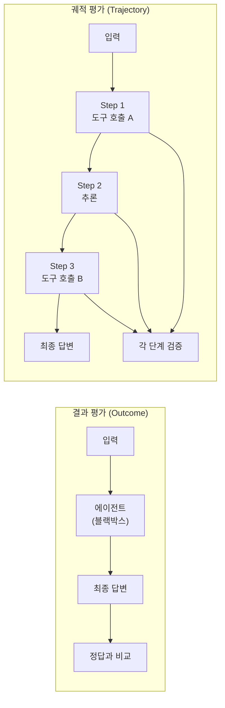
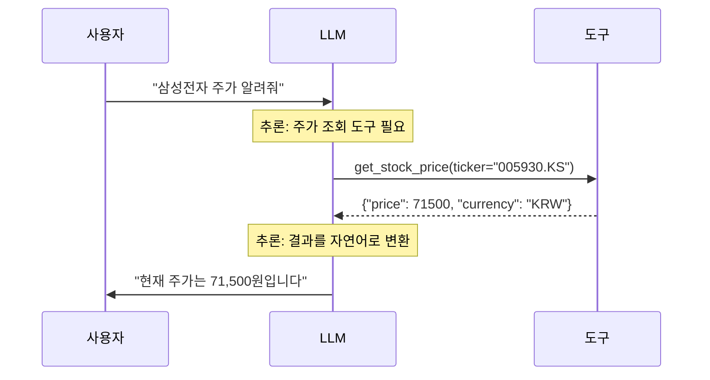
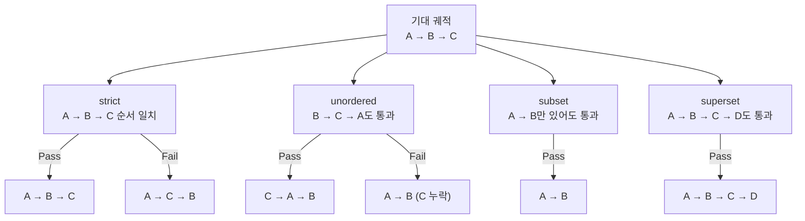
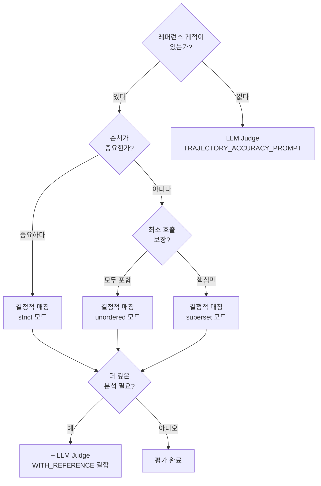
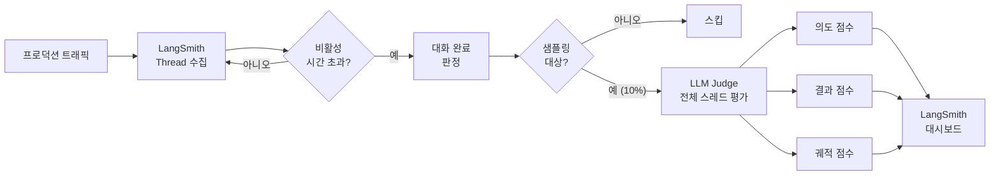
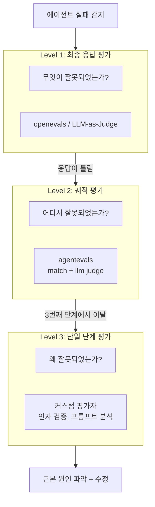

# 멀티턴 궤적 평가

> 에이전트가 **어떤 경로**로 답에 도달했는지를 체계적으로 평가하는 궤적(Trajectory) 평가의 이론과 실전

## 개요

이 섹션에서는 에이전트의 최종 답변이 아닌, 그 답변에 도달하기까지의 **전체 경로 — 도구 호출 순서, 중간 추론, 상태 전이 — 를 평가**하는 방법을 학습합니다. [이전 섹션](17-ch17-에이전트-평가와-langsmith/03-03-llm-as-judge-평가.md)에서 배운 LLM-as-Judge가 "결과의 품질"을 판단했다면, 궤적 평가는 "과정의 품질"을 판단합니다.

**선수 지식**:
- [LangSmith 데이터셋과 오프라인 평가](17-ch17-에이전트-평가와-langsmith/02-02-langsmith-데이터셋과-오프라인-평가.md)의 `evaluate()` API 사용법
- [LLM-as-Judge 평가](17-ch17-에이전트-평가와-langsmith/03-03-llm-as-judge-평가.md)의 `create_llm_as_judge` 패턴
- [에이전트 평가 전략](17-ch17-에이전트-평가와-langsmith/01-01-에이전트-평가-전략.md)의 결과 평가 vs 궤적 평가 개념

**학습 목표**:
- 궤적 평가가 결과 평가와 어떻게 다른지, 왜 필요한지 설명할 수 있다
- `agentevals` 라이브러리의 결정적(Match) 평가자와 LLM 기반 평가자를 구현할 수 있다
- 4가지 궤적 매칭 모드(strict, unordered, subset, superset)를 상황에 맞게 선택할 수 있다
- LangSmith의 멀티턴 온라인 평가를 설정하고 프로덕션 트래픽에 적용할 수 있다

## 왜 알아야 할까?

에이전트에게 "서울 날씨 알려줘"라고 물었을 때, 두 에이전트 모두 "맑음, 22도"라고 정확히 답했다고 합시다. 하지만 에이전트 A는 `get_weather("서울")`을 한 번 호출한 반면, 에이전트 B는 `search_web("서울 위치")` → `get_coordinates(37.5, 127.0)` → `get_weather_by_coord(37.5, 127.0)` → `translate("Sunny, 22°C")` 를 네 번이나 호출했습니다. 결과는 같지만, 비용은 4배, 지연은 5배입니다.

**결과 평가만으로는 이런 비효율을 잡을 수 없습니다.** 에이전트가 불필요한 도구를 호출하거나, 잘못된 순서로 작업하거나, 무한 루프에 빠지는 문제는 오직 **궤적을 들여다봐야만** 발견됩니다.

실제 프로덕션 환경에서 궤적 평가는 세 가지 핵심 질문에 답합니다:

1. **효율성**: 에이전트가 최소한의 단계로 목표에 도달했는가?
2. **정확성**: 올바른 도구를 올바른 순서로 호출했는가?
3. **안전성**: 위험한 도구를 부적절하게 호출하지 않았는가?

> 📊 **그림 1**: 결과 평가 vs 궤적 평가의 관점 차이



## 핵심 개념

### 개념 1: 궤적(Trajectory)의 구조

> 💡 **비유**: 궤적은 **네비게이션의 경로 기록**과 같습니다. 목적지(최종 답변)에 도착했더라도, "고속도로를 타고 30분 만에 왔는지" 아니면 "골목길을 돌고 돌아 2시간이나 걸렸는지"는 경로 기록을 봐야 알 수 있죠. 경로 기록이 없다면 "도착했으니 됐지"로 끝나버리고, 다음에도 똑같이 비효율적인 길을 반복하게 됩니다. 궤적 평가는 바로 이 경로 기록을 체계적으로 분석하는 작업입니다.

에이전트 궤적이란 사용자 입력부터 최종 응답까지의 **전체 메시지 시퀀스**입니다. 여기에는 LLM의 추론, 도구 호출 요청, 도구 실행 결과가 모두 포함됩니다.

LangGraph 에이전트의 궤적은 OpenAI 호환 메시지 포맷으로 표현됩니다:

```python
# 에이전트 궤적의 기본 구조
trajectory = [
    # 1. 사용자 입력
    {"role": "user", "content": "삼성전자 주가 알려줘"},
    
    # 2. LLM의 도구 호출 결정
    {"role": "assistant", "tool_calls": [
        {"function": {"name": "get_stock_price", "arguments": '{"ticker": "005930.KS"}'}, 
         "id": "call_abc123", "type": "function"}
    ]},
    
    # 3. 도구 실행 결과
    {"role": "tool", "content": '{"price": 71500, "currency": "KRW"}', 
     "tool_call_id": "call_abc123"},
    
    # 4. LLM의 최종 응답
    {"role": "assistant", "content": "삼성전자의 현재 주가는 71,500원입니다."}
]
```

> 📊 **그림 2**: 에이전트 궤적의 메시지 구조



`agentevals` 라이브러리에서는 이 궤적을 평가할 때 **도구 호출 메시지**에 집중합니다. `role: "assistant"`의 `tool_calls` 필드와 `role: "tool"`의 응답이 평가의 핵심 대상이죠.

### 개념 2: 결정적 궤적 매칭 — `create_trajectory_match_evaluator`

> 💡 **비유**: 요리 레시피를 따랐는지 확인하는 것과 같습니다. "1. 양파를 볶고 → 2. 고기를 넣고 → 3. 소스를 부어라"라는 레시피가 있을 때, 요리사가 정확히 이 순서를 따랐는지(strict), 순서는 다르지만 모든 재료를 사용했는지(unordered), 최소한 핵심 재료는 사용했는지(subset)를 검증하는 것이죠.

`agentevals` 패키지의 `create_trajectory_match_evaluator`는 에이전트의 실제 궤적과 기대 궤적을 **LLM 호출 없이** 비교합니다. 빠르고, 비용이 0이고, 결정적(deterministic)이라 CI/CD에 적합합니다.

먼저 import 경로를 확인합시다:

```python
# agentevals 궤적 평가 핵심 임포트
from agentevals.trajectory import (
    create_trajectory_match_evaluator,  # 결정적 매칭 평가자
    create_trajectory_llm_as_judge,     # LLM 기반 궤적 평가자
)
```

4가지 매칭 모드를 제공합니다:

| 모드 | 설명 | 사용 시기 |
|------|------|-----------|
| `strict` | 동일한 도구를 동일한 순서로 호출 | 정책 조회 → 승인 같은 순서 의존 워크플로우 |
| `unordered` | 동일한 도구를 호출했지만 순서 무관 | 독립적 API 병렬 호출 |
| `subset` | 실제 궤적이 기대 궤적의 부분집합 | "최소한 이것만은" 검증 |
| `superset` | 기대 궤적이 실제 궤적의 부분집합 | "이 도구들을 반드시 포함" 검증 |

> 📊 **그림 3**: 4가지 궤적 매칭 모드 비교



```python
from agentevals.trajectory.match import create_trajectory_match_evaluator

# 기대 궤적 정의 (레퍼런스)
reference_trajectory = [
    {"role": "user", "content": "삼성전자 주가와 뉴스를 알려줘"},
    {"role": "assistant", "tool_calls": [
        {"function": {"name": "get_stock_price", 
                      "arguments": '{"ticker": "005930.KS"}'}, 
         "id": "call_1", "type": "function"}
    ]},
    {"role": "tool", "content": '{"price": 71500}', "tool_call_id": "call_1"},
    {"role": "assistant", "tool_calls": [
        {"function": {"name": "search_news", 
                      "arguments": '{"query": "삼성전자"}'}, 
         "id": "call_2", "type": "function"}
    ]},
    {"role": "tool", "content": '{"articles": [...]}', "tool_call_id": "call_2"},
    {"role": "assistant", "content": "삼성전자 주가는 71,500원이며..."}
]

# strict 모드: 순서까지 정확히 일치해야 통과
strict_eval = create_trajectory_match_evaluator(
    trajectory_match_mode="strict"
)

# unordered 모드: 같은 도구만 호출하면 순서 무관
unordered_eval = create_trajectory_match_evaluator(
    trajectory_match_mode="unordered"
)

# superset 모드: 기대한 도구를 모두 포함하면 추가 호출 허용
superset_eval = create_trajectory_match_evaluator(
    trajectory_match_mode="superset"
)

# 실제 궤적으로 평가 실행
result = strict_eval(
    outputs=actual_trajectory,          # 에이전트의 실제 궤적
    reference_outputs=reference_trajectory  # 기대 궤적
)
print(result)  # {"score": True/False, "key": "trajectory_match"}
```

#### 도구 인자 매칭 세밀 제어

도구 호출의 **인자(arguments)**까지 얼마나 엄격하게 비교할지도 설정할 수 있습니다:

```python
# 도구 이름만 일치하면 OK (인자 무시)
evaluator = create_trajectory_match_evaluator(
    trajectory_match_mode="strict",
    tool_args_match_mode="ignore"  # 인자 비교 생략
)

# 특정 도구의 인자 비교 방식만 커스터마이징
evaluator = create_trajectory_match_evaluator(
    trajectory_match_mode="strict",
    tool_args_match_mode="exact",          # 기본: 정확히 일치
    tool_args_match_overrides={
        "search_news": "ignore",           # search_news는 인자 무시
        "get_stock_price": "subset"        # ticker만 있으면 OK
    }
)
```

### 개념 3: LLM 기반 궤적 평가 — `create_trajectory_llm_as_judge`

> 💡 **비유**: 결정적 매칭이 "체크리스트"라면, LLM-as-Judge는 **경험 많은 시니어 개발자의 코드 리뷰**입니다. 체크리스트는 "이 함수를 호출했는가?"만 확인하지만, 시니어 개발자는 "이 상황에서 이 함수를 호출한 게 적절한 판단이었는가?"까지 평가할 수 있죠.

레퍼런스 궤적이 없거나, 여러 경로가 모두 "올바른" 경우에는 LLM이 궤적의 품질을 판단하는 것이 더 적합합니다. `create_trajectory_llm_as_judge`는 에이전트의 궤적을 LLM에게 보여주고 "이 경로가 합리적이었는가?"를 판단하게 합니다.

```python
from agentevals.trajectory.llm import (
    create_trajectory_llm_as_judge,
    TRAJECTORY_ACCURACY_PROMPT,                  # 레퍼런스 없이 평가
    TRAJECTORY_ACCURACY_PROMPT_WITH_REFERENCE,   # 레퍼런스 대비 평가
)

# 레퍼런스 없이 궤적 품질 평가
evaluator_no_ref = create_trajectory_llm_as_judge(
    prompt=TRAJECTORY_ACCURACY_PROMPT,
    model="openai:o3-mini",  # 기본 모델
)

result = evaluator_no_ref(outputs=actual_trajectory)
print(result)
# {
#   "key": "trajectory_accuracy",
#   "score": True,      # 궤적이 합리적인가?
#   "reasoning": "에이전트가 적절한 도구를 올바른 순서로..."
# }
```

```python
# 레퍼런스 궤적과 비교하며 평가
evaluator_with_ref = create_trajectory_llm_as_judge(
    prompt=TRAJECTORY_ACCURACY_PROMPT_WITH_REFERENCE,
    model="openai:o3-mini",
)

result = evaluator_with_ref(
    outputs=actual_trajectory,
    reference_outputs=reference_trajectory
)
```

> 📊 **그림 4**: 결정적 매칭 vs LLM-as-Judge 궤적 평가 선택 기준



두 가지 내장 프롬프트의 차이를 정리하면:

| 프롬프트 | 레퍼런스 | 평가 기준 |
|----------|---------|-----------|
| `TRAJECTORY_ACCURACY_PROMPT` | 불필요 | 궤적 자체의 합리성, 효율성, 적절성 |
| `TRAJECTORY_ACCURACY_PROMPT_WITH_REFERENCE` | 필요 | 기대 궤적 대비 편차, 누락, 불필요한 단계 |

### 개념 4: LangSmith 멀티턴 온라인 평가

> 💡 **비유**: 오프라인 평가가 "모의고사"라면, 멀티턴 온라인 평가는 **CCTV 모니터링**입니다. 실제 고객이 에이전트와 대화하는 프로덕션 트래픽을 실시간으로 분석하여, 문제가 발생하면 즉시 감지합니다.

LangSmith의 멀티턴 평가(Multi-turn Evals)는 프로덕션에서 발생하는 **실제 대화 스레드(Thread)**를 자동으로 평가합니다. 대화가 완료되면 LLM-as-Judge가 전체 대화를 분석하여 세 가지 차원을 점수화합니다:

1. **의미적 의도(Semantic Intent)**: 사용자가 실제로 달성하려 한 것
2. **의미적 결과(Semantic Outcomes)**: 목표가 달성되었는지, 실패 원인은 무엇인지
3. **에이전트 궤적(Agent Trajectory)**: 도구 호출과 의사결정이 어떻게 전개되었는지

멀티턴 평가의 핵심 설정 요소:

```python
# LangSmith 멀티턴 평가 개념 구조 (LangSmith UI에서 설정)
multiturn_eval_config = {
    # 대화 완료 판단 기준 — 비활성 시간
    "idle_timeout_minutes": 10,
    
    # 평가할 트래픽 비율 (비용 제어)
    "sampling_rate": 0.1,   # 10%만 평가
    
    # LLM-as-Judge 평가 프롬프트
    "judge_prompt": """
    이 대화에서 에이전트가:
    1. 사용자의 의도를 정확히 파악했는가? (1-5)
    2. 목표를 성공적으로 달성했는가? (1-5)
    3. 효율적인 경로로 작업을 수행했는가? (1-5)
    4. 불필요하거나 위험한 도구 호출이 있었는가? (있다/없다)
    """,
    
    # 평가 대상 스레드 필터
    "thread_filter": {
        "min_turns": 2,        # 최소 2턴 이상
        "max_turns": 50,       # 50턴 이하
    }
}
```

> 📊 **그림 5**: LangSmith 멀티턴 평가 파이프라인



### 개념 5: 삼단계 평가 프레임워크

LangChain이 블로그 "[Evaluating Deep Agents](https://blog.langchain.com/evaluating-deep-agents-our-learnings/)"에서 제안한 삼단계 평가 프레임워크는, 에이전트 장애의 근본 원인을 계층적으로 추적하는 실무 방법론입니다.

> 📊 **그림 6**: 삼단계 평가 프레임워크 — 장애 원인 추적



| 레벨 | 질문 | 평가 도구 | 예시 |
|------|------|-----------|------|
| **Level 1: 최종 응답** | "**무엇이** 잘못되었는가?" | openevals | "답변이 정확하지 않다" |
| **Level 2: 궤적** | "**어디서** 잘못되었는가?" | agentevals | "3번째 도구 호출에서 이탈했다" |
| **Level 3: 단일 단계** | "**왜** 잘못되었는가?" | 커스텀 평가자 | "잘못된 인자를 전달했다" |

이 세 레벨을 결합하면 에이전트 장애의 근본 원인을 체계적으로 추적할 수 있습니다. 최종 응답이 틀렸을 때 궤적 평가로 "3번째 도구 호출에서 이탈했다"를 파악하고, 단일 단계 평가로 "3번째 호출에서 잘못된 인자를 전달했다"까지 내려갈 수 있는 것이죠. 실무에서는 Level 1만 적용하는 팀이 많지만, Level 2까지만 추가해도 디버깅 시간이 크게 줄어든다는 것이 LangChain 팀의 경험적 결론입니다.

## 실습: 직접 해보기

전체 궤적 평가 파이프라인을 단계별로 구축해 봅시다. LangGraph 에이전트의 궤적을 수집하고, 결정적 매칭과 LLM 기반 평가를 모두 적용합니다.

### Step 1: 환경 설정 및 에이전트 정의

```python
# 필요한 패키지 설치
# pip install agentevals langchain-openai langgraph langsmith

import os
import json
from typing import TypedDict, Annotated
from langchain_openai import ChatOpenAI
from langgraph.graph import StateGraph, START, END
from langgraph.graph.message import add_messages
from langgraph.prebuilt import ToolNode
from langchain_core.tools import tool
from langchain_core.messages import HumanMessage, AIMessage, ToolMessage

# agentevals 궤적 평가 임포트
from agentevals.trajectory.match import create_trajectory_match_evaluator
from agentevals.trajectory.llm import (
    create_trajectory_llm_as_judge,
    TRAJECTORY_ACCURACY_PROMPT,
    TRAJECTORY_ACCURACY_PROMPT_WITH_REFERENCE,
)

# 환경 변수 설정
os.environ["OPENAI_API_KEY"] = "your-api-key"
os.environ["LANGSMITH_API_KEY"] = "your-langsmith-key"
os.environ["LANGSMITH_TRACING"] = "true"

# 평가용 도구 정의
@tool
def get_stock_price(ticker: str) -> dict:
    """주식 가격을 조회합니다."""
    prices = {"005930.KS": 71500, "AAPL": 245.30, "GOOGL": 182.50}
    price = prices.get(ticker, 0)
    return {"ticker": ticker, "price": price, "currency": "KRW" if ".KS" in ticker else "USD"}

@tool
def search_news(query: str, limit: int = 3) -> dict:
    """뉴스를 검색합니다."""
    return {"articles": [
        {"title": f"{query} 관련 뉴스 {i+1}", "summary": f"요약 {i+1}"}
        for i in range(limit)
    ]}

@tool
def get_exchange_rate(from_currency: str, to_currency: str) -> dict:
    """환율을 조회합니다."""
    rates = {("USD", "KRW"): 1380.5, ("KRW", "USD"): 0.000724}
    rate = rates.get((from_currency, to_currency), 1.0)
    return {"from": from_currency, "to": to_currency, "rate": rate}

tools = [get_stock_price, search_news, get_exchange_rate]
```

### Step 2: LangGraph 에이전트 구축 및 궤적 수집

```python
# 상태 정의
class AgentState(TypedDict):
    messages: Annotated[list, add_messages]

# LLM 설정
llm = ChatOpenAI(model="gpt-4o-mini", temperature=0)
llm_with_tools = llm.bind_tools(tools)

# 노드 함수
def call_model(state: AgentState) -> dict:
    response = llm_with_tools.invoke(state["messages"])
    return {"messages": [response]}

def should_continue(state: AgentState) -> str:
    last_message = state["messages"][-1]
    if hasattr(last_message, "tool_calls") and last_message.tool_calls:
        return "tools"
    return END

# 그래프 구성
builder = StateGraph(AgentState)
builder.add_node("agent", call_model)
builder.add_node("tools", ToolNode(tools))
builder.add_edge(START, "agent")
builder.add_conditional_edges("agent", should_continue, {"tools": "tools", END: END})
builder.add_edge("tools", "agent")
graph = builder.compile()

# 에이전트 실행 및 궤적 수집
def run_and_collect_trajectory(query: str) -> list[dict]:
    """에이전트를 실행하고 OpenAI 호환 메시지 포맷으로 궤적을 반환합니다."""
    result = graph.invoke({"messages": [HumanMessage(content=query)]})
    
    # LangGraph 메시지를 OpenAI 호환 딕셔너리로 변환
    trajectory = []
    for msg in result["messages"]:
        if isinstance(msg, HumanMessage):
            trajectory.append({"role": "user", "content": msg.content})
        elif isinstance(msg, AIMessage):
            entry = {"role": "assistant"}
            if msg.tool_calls:
                entry["tool_calls"] = [
                    {
                        "function": {
                            "name": tc["name"],
                            "arguments": json.dumps(tc["args"])
                        },
                        "id": tc["id"],
                        "type": "function"
                    }
                    for tc in msg.tool_calls
                ]
            if msg.content:
                entry["content"] = msg.content
            trajectory.append(entry)
        elif isinstance(msg, ToolMessage):
            trajectory.append({
                "role": "tool",
                "content": msg.content,
                "tool_call_id": msg.tool_call_id
            })
    return trajectory
```

### Step 3: 결정적 궤적 평가 실행

```run:python
from agentevals.trajectory.match import create_trajectory_match_evaluator

# 기대 궤적 정의
reference = [
    {"role": "user", "content": "삼성전자 주가와 최근 뉴스 알려줘"},
    {"role": "assistant", "tool_calls": [
        {"function": {"name": "get_stock_price", 
                      "arguments": '{"ticker": "005930.KS"}'}, 
         "id": "call_1", "type": "function"}
    ]},
    {"role": "tool", "content": '{"ticker": "005930.KS", "price": 71500}',
     "tool_call_id": "call_1"},
    {"role": "assistant", "tool_calls": [
        {"function": {"name": "search_news", 
                      "arguments": '{"query": "삼성전자", "limit": 3}'}, 
         "id": "call_2", "type": "function"}
    ]},
    {"role": "tool", "content": '{"articles": [...]}', "tool_call_id": "call_2"},
    {"role": "assistant", "content": "삼성전자 주가는 71,500원이며..."}
]

# 4가지 모드로 평가
modes = ["strict", "unordered", "subset", "superset"]

# 실제 궤적: 순서가 뒤바뀐 경우 (뉴스 먼저, 주가 나중에)
actual_swapped = [
    {"role": "user", "content": "삼성전자 주가와 최근 뉴스 알려줘"},
    {"role": "assistant", "tool_calls": [
        {"function": {"name": "search_news", 
                      "arguments": '{"query": "삼성전자", "limit": 3}'}, 
         "id": "call_a", "type": "function"}
    ]},
    {"role": "tool", "content": '{"articles": [...]}', "tool_call_id": "call_a"},
    {"role": "assistant", "tool_calls": [
        {"function": {"name": "get_stock_price", 
                      "arguments": '{"ticker": "005930.KS"}'}, 
         "id": "call_b", "type": "function"}
    ]},
    {"role": "tool", "content": '{"ticker": "005930.KS", "price": 71500}',
     "tool_call_id": "call_b"},
    {"role": "assistant", "content": "삼성전자 주가는 71,500원이며..."}
]

for mode in modes:
    evaluator = create_trajectory_match_evaluator(
        trajectory_match_mode=mode,
        tool_args_match_mode="ignore"  # 인자는 무시하고 도구 이름만 비교
    )
    result = evaluator(
        outputs=actual_swapped,
        reference_outputs=reference
    )
    print(f"{mode:>10} 모드: score={result['score']}")
```

```output
    strict 모드: score=False
 unordered 모드: score=True
    subset 모드: score=True
  superset 모드: score=True
```

### Step 4: LLM 기반 궤적 평가 실행

```python
from agentevals.trajectory.llm import (
    create_trajectory_llm_as_judge,
    TRAJECTORY_ACCURACY_PROMPT,
    TRAJECTORY_ACCURACY_PROMPT_WITH_REFERENCE,
)

# 레퍼런스 없이 궤적 품질 평가
judge_no_ref = create_trajectory_llm_as_judge(
    prompt=TRAJECTORY_ACCURACY_PROMPT,
    model="openai:o3-mini",
)

# 비효율적인 궤적 예시: 불필요한 환율 조회 포함
inefficient_trajectory = [
    {"role": "user", "content": "삼성전자 주가 알려줘"},
    {"role": "assistant", "tool_calls": [
        {"function": {"name": "get_exchange_rate",           # 불필요!
                      "arguments": '{"from_currency": "USD", "to_currency": "KRW"}'},
         "id": "call_x1", "type": "function"}
    ]},
    {"role": "tool", "content": '{"rate": 1380.5}', "tool_call_id": "call_x1"},
    {"role": "assistant", "tool_calls": [
        {"function": {"name": "search_news",                 # 불필요!
                      "arguments": '{"query": "환율"}'},
         "id": "call_x2", "type": "function"}
    ]},
    {"role": "tool", "content": '{"articles": [...]}', "tool_call_id": "call_x2"},
    {"role": "assistant", "tool_calls": [
        {"function": {"name": "get_stock_price",             # 이것만 필요
                      "arguments": '{"ticker": "005930.KS"}'},
         "id": "call_x3", "type": "function"}
    ]},
    {"role": "tool", "content": '{"price": 71500}', "tool_call_id": "call_x3"},
    {"role": "assistant", "content": "삼성전자 주가는 71,500원입니다."}
]

result = judge_no_ref(outputs=inefficient_trajectory)
print(f"Score: {result['score']}")
print(f"Reasoning: {result['reasoning']}")
```

### Step 5: LangSmith evaluate()와 통합

```python
from langsmith import Client
from langsmith import evaluate

client = Client()

# 궤적 평가용 데이터셋 생성
dataset = client.create_dataset("trajectory-eval-dataset")

# 테스트 케이스 추가 (입력 + 기대 궤적)
client.create_examples(
    dataset_id=dataset.id,
    inputs=[
        {"query": "삼성전자 주가 알려줘"},
        {"query": "애플 주가와 최근 뉴스 보여줘"},
        {"query": "구글 주가를 원화로 환산해줘"},
    ],
    outputs=[
        # 기대 궤적 (도구 호출 시퀀스만 요약)
        {"expected_tools": ["get_stock_price"]},
        {"expected_tools": ["get_stock_price", "search_news"]},
        {"expected_tools": ["get_stock_price", "get_exchange_rate"]},
    ]
)

# 에이전트 실행 + 궤적 수집 함수
def target(inputs: dict) -> dict:
    trajectory = run_and_collect_trajectory(inputs["query"])
    return {"messages": trajectory}

# 궤적 평가자 정의
trajectory_judge = create_trajectory_llm_as_judge(
    prompt=TRAJECTORY_ACCURACY_PROMPT,
    model="openai:o3-mini",
)

def trajectory_evaluator(run, example):
    """LangSmith evaluate()용 궤적 평가 래퍼"""
    trajectory = run.outputs.get("messages", [])
    result = trajectory_judge(outputs=trajectory)
    return {
        "key": "trajectory_quality",
        "score": 1.0 if result["score"] else 0.0,
        "comment": result.get("reasoning", ""),
    }

# 도구 호출 효율성 평가자
def efficiency_evaluator(run, example):
    """도구 호출 횟수 기반 효율성 평가"""
    trajectory = run.outputs.get("messages", [])
    expected_tools = example.outputs.get("expected_tools", [])
    
    # 실제 호출된 도구 수 계산
    actual_tool_calls = sum(
        1 for msg in trajectory 
        if msg.get("role") == "assistant" and msg.get("tool_calls")
    )
    expected_count = len(expected_tools)
    
    # 효율성 점수: 기대 호출 수 / 실제 호출 수 (1.0이 최적)
    if actual_tool_calls == 0:
        score = 0.0
    else:
        score = min(expected_count / actual_tool_calls, 1.0)
    
    return {
        "key": "tool_efficiency",
        "score": score,
        "comment": f"Expected {expected_count} calls, got {actual_tool_calls}",
    }

# 평가 실행
results = evaluate(
    target,
    data="trajectory-eval-dataset",
    evaluators=[trajectory_evaluator, efficiency_evaluator],
    experiment_prefix="trajectory-eval-v1",
)
```

## 더 깊이 알아보기

### 궤적 평가의 학술적 뿌리

궤적 평가의 개념은 2022년 Yao et al.의 [ReAct 논문](https://arxiv.org/abs/2210.03629)에서 본격적으로 형성되었습니다. ReAct는 에이전트의 "Thought → Action → Observation" 루프를 명시적으로 기록하고, 이 기록 자체를 평가 대상으로 삼았습니다. 흥미로운 점은 ReAct 이전에는 에이전트의 중간 단계를 체계적으로 평가하는 프레임워크가 거의 없었다는 것입니다.

`agentevals` 라이브러리의 탄생도 실무적 필요에서 비롯됐습니다. LangChain 팀은 2024-2025년에 수백 개의 프로덕션 에이전트를 지원하면서, "결과는 맞는데 과정이 엉망"인 케이스가 전체 장애의 약 40%를 차지한다는 것을 발견했습니다. 이에 2025년 초 `agentevals`를 오픈소스로 공개하며, "결과 평가만으로는 부족하다"는 메시지를 업계에 전달했죠.

### 온라인 평가의 진화

LangSmith의 멀티턴 온라인 평가가 특히 주목받는 이유는, 기존의 오프라인 평가만으로는 **분포 이동(distribution shift)** 문제를 해결할 수 없기 때문입니다. 개발 시 테스트한 쿼리 분포와 프로덕션에서 실제로 들어오는 쿼리 분포는 항상 다릅니다. 오프라인 데이터셋에서 100점을 받은 에이전트가 프로덕션에서 예상 못한 멀티턴 대화에 무너지는 일이 흔한 것이죠. 온라인 평가는 이 갭을 실시간으로 모니터링합니다.

## 흔한 오해와 팁

> ⚠️ **흔한 오해**: "궤적 평가를 하려면 반드시 레퍼런스 궤적이 있어야 한다"
> 
> 그렇지 않습니다. `TRAJECTORY_ACCURACY_PROMPT`는 레퍼런스 없이도 궤적의 합리성을 평가합니다. 오히려 에이전트가 다양한 올바른 경로를 탈 수 있는 상황에서는 레퍼런스 없는 평가가 더 적합합니다. 레퍼런스에 지나치게 의존하면 "다른 경로지만 더 효율적인 해결책"을 오탐(false negative)할 수 있습니다.

> 💡 **알고 계셨나요?**: `agentevals`의 `tool_args_match_mode="ignore"` 옵션은 의외로 많은 실무 팀이 사용합니다. LLM은 같은 의미의 인자를 다르게 포맷하는 경우가 많아서(예: `"query": "삼성전자 뉴스"` vs `"query": "삼성전자 최신 뉴스"`), 도구 **이름**만 매칭하는 것이 현실적으로 더 안정적인 평가를 제공합니다. 인자 품질은 별도의 LLM-as-Judge로 평가하는 것이 깔끔합니다.

> 🔥 **실무 팁**: 궤적 평가 데이터셋을 처음 구축할 때는 **프로덕션 로그에서 역추출**하세요. 실제 사용자 쿼리로 에이전트를 실행하고, 결과가 좋았던 궤적을 "골든 레퍼런스"로 저장합니다. 이렇게 하면 합성 데이터보다 훨씬 현실적인 평가 데이터셋을 빠르게 구축할 수 있습니다.

> 🔥 **실무 팁**: LangSmith 멀티턴 온라인 평가의 `sampling_rate`는 초기에 0.05(5%)로 시작하세요. 트래픽이 많은 서비스에서 100% 평가는 LLM Judge 비용이 급증합니다. 이상 패턴을 감지한 후 해당 세그먼트만 100%로 올리는 전략이 비용 효율적입니다.

## 핵심 정리

| 개념 | 설명 |
|------|------|
| **궤적(Trajectory)** | 에이전트의 입력부터 최종 응답까지의 전체 메시지 시퀀스 (도구 호출 포함) |
| **결정적 매칭** | `create_trajectory_match_evaluator` — LLM 없이 레퍼런스와 비교. 빠르고 비용 0 |
| **4가지 매칭 모드** | strict(순서+내용), unordered(내용만), subset(부분 일치), superset(포함 검증) |
| **tool_args_match_mode** | exact(정확 일치), ignore(인자 무시), subset(부분 인자) — 도구별 override 가능 |
| **LLM 궤적 Judge** | `create_trajectory_llm_as_judge` — 합리성, 효율성, 적절성을 LLM이 판단 |
| **TRAJECTORY_ACCURACY_PROMPT** | 레퍼런스 없이 궤적 품질 평가하는 내장 프롬프트 |
| **멀티턴 온라인 평가** | LangSmith에서 프로덕션 Thread를 자동 평가. idle_timeout + sampling_rate 설정 |
| **삼단계 평가** | 최종 응답(무엇이) → 궤적(어디서) → 단일 단계(왜) 근본 원인 추적 |

## 다음 섹션 미리보기

궤적 평가를 수동으로 실행하는 것만으로는 부족합니다. 다음 섹션 [CI/CD 통합 평가](17-ch17-에이전트-평가와-langsmith/05-05-cicd-통합-평가.md)에서는 GitHub Actions와 pytest를 활용하여 **코드 변경마다 자동으로 궤적 평가를 실행**하고, 점수가 기준 이하이면 PR을 블로킹하는 평가 자동화 파이프라인을 구축합니다. 오늘 배운 `agentevals` 평가자들이 CI 파이프라인의 핵심 검증 단계가 됩니다.

## 참고 자료

- [AgentEvals GitHub 리포지토리](https://github.com/langchain-ai/agentevals) - 궤적 평가 라이브러리의 소스코드와 전체 API 레퍼런스. `trajectory_match_mode`, `tool_args_match_mode`, 프롬프트 상수 등 세부 옵션 확인
- [LangSmith 궤적 평가 가이드](https://docs.langchain.com/langsmith/trajectory-evals) - 결정적 매칭과 LLM Judge를 활용한 궤적 평가 공식 문서. 코드 예제와 매칭 모드 비교
- [LangSmith 멀티턴 평가 블로그](https://blog.langchain.com/insights-agent-multiturn-evals-langsmith/) - Multi-turn Evals 기능 발표와 Thread 기반 온라인 평가 설정 가이드
- [LangSmith 평가 플랫폼](https://docs.langchain.com/langsmith/evaluation) - 데이터셋 구성, evaluate() API, 오프라인/온라인 평가 전체 문서
- [Evaluating Deep Agents: Our Learnings (LangChain Blog)](https://blog.langchain.com/evaluating-deep-agents-our-learnings/) - 삼단계 평가 프레임워크(최종 응답 → 궤적 → 단일 단계)의 이론적 배경과 실무 사례
- [ReAct: Synergizing Reasoning and Acting in Language Models](https://arxiv.org/abs/2210.03629) - 궤적 기반 에이전트 평가의 학술적 기원. Thought-Action-Observation 루프 패턴의 원논문

---
### 🔗 Related Sessions
- [outcome_evaluation](17-ch17-에이전트-평가와-langsmith/01-01-에이전트-평가-전략.md) (prerequisite)
- [trajectory_evaluation](17-ch17-에이전트-평가와-langsmith/01-01-에이전트-평가-전략.md) (prerequisite)
- [langsmith_dataset](17-ch17-에이전트-평가와-langsmith/02-02-langsmith-데이터셋과-오프라인-평가.md) (prerequisite)
- [evaluate_api](17-ch17-에이전트-평가와-langsmith/02-02-langsmith-데이터셋과-오프라인-평가.md) (prerequisite)
- [custom_evaluator](17-ch17-에이전트-평가와-langsmith/02-02-langsmith-데이터셋과-오프라인-평가.md) (prerequisite)
- [llm_as_judge](17-ch17-에이전트-평가와-langsmith/03-03-llm-as-judge-평가.md) (prerequisite)
- [create_llm_as_judge](17-ch17-에이전트-평가와-langsmith/03-03-llm-as-judge-평가.md) (prerequisite)
