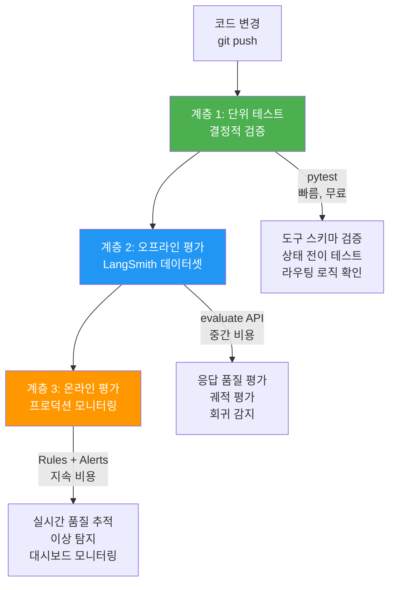
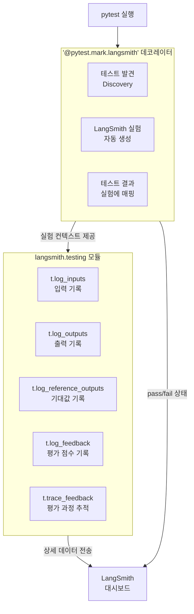
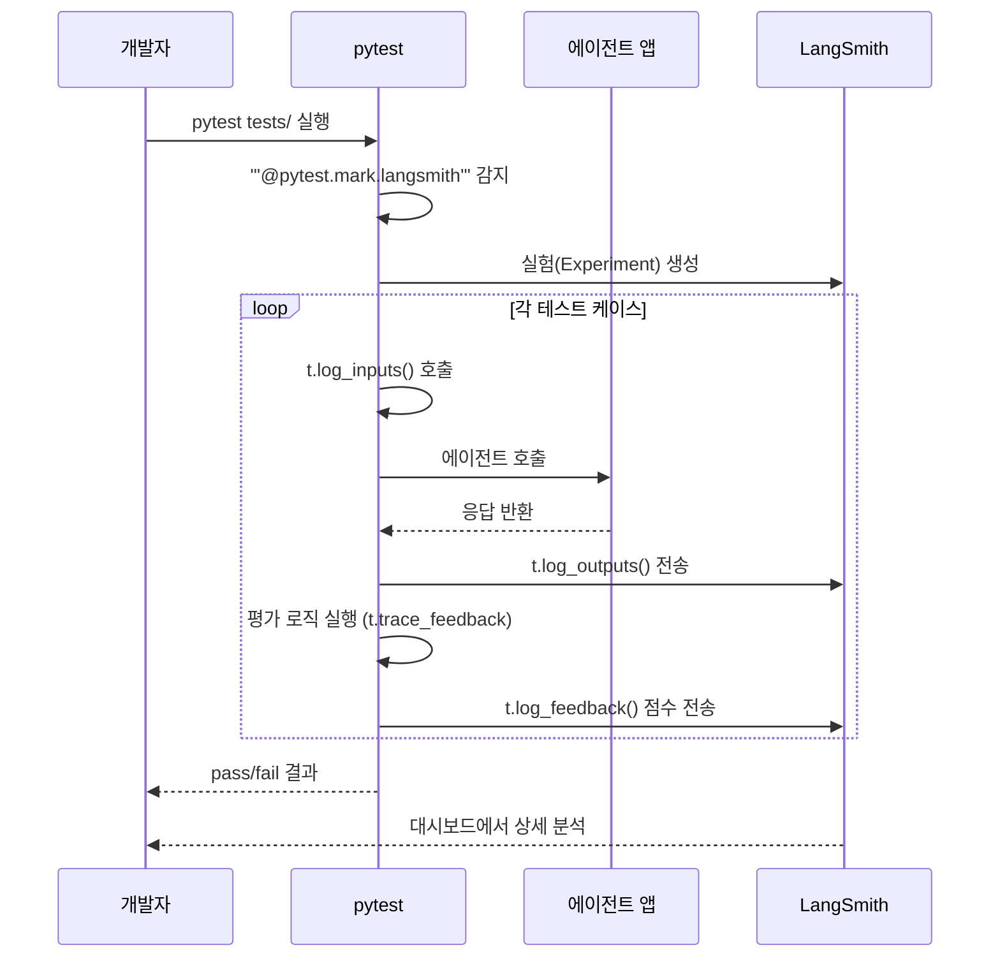
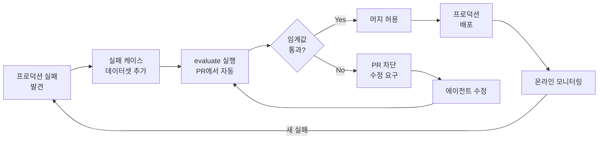
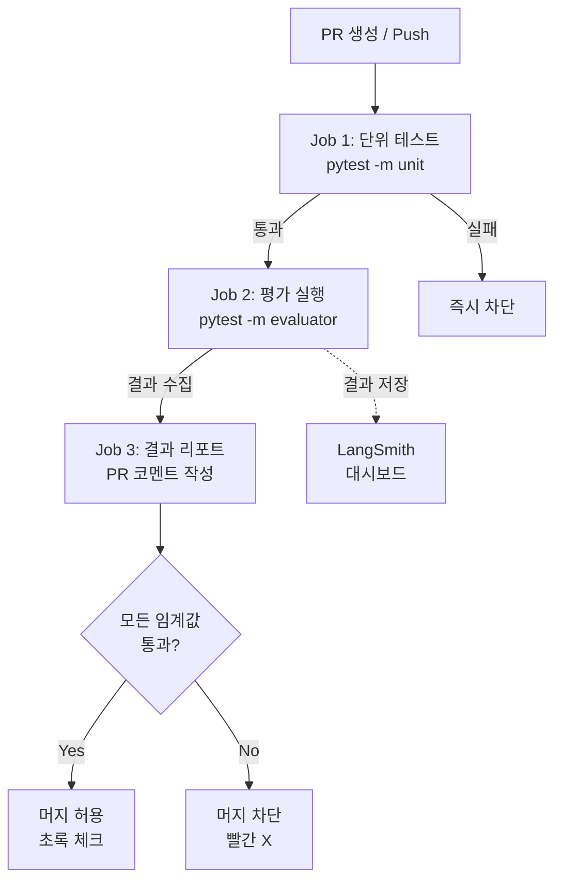
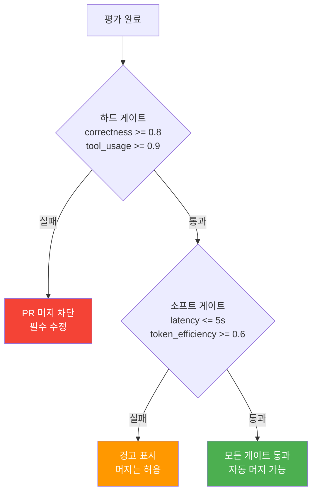

# 05. CI/CD 통합 평가

> 에이전트 평가를 CI/CD 파이프라인에 통합하여, 코드 변경마다 자동으로 회귀 테스트를 실행하고 품질 게이트로 배포를 제어한다

## 개요

이 섹션에서는 지금까지 구축한 에이전트 평가 체계 — 오프라인 평가, LLM-as-Judge, 멀티턴 궤적 평가 — 를 CI/CD 파이프라인에 통합하는 방법을 학습합니다. GitHub Actions에서 평가를 자동 실행하고, 성능 임계값 기반의 배포 게이트를 설정하며, PR에 평가 결과를 자동으로 리포트하는 완전한 파이프라인을 구축합니다.

**선수 지식**:
- [에이전트 평가 전략](17-ch17-에이전트-평가와-langsmith/01-01-에이전트-평가-전략.md)의 능력/회귀 평가 프레임워크
- [LangSmith 데이터셋과 오프라인 평가](17-ch17-에이전트-평가와-langsmith/02-02-langsmith-데이터셋과-오프라인-평가.md)의 evaluate() API
- [LLM-as-Judge 평가](17-ch17-에이전트-평가와-langsmith/03-03-llm-as-judge-평가.md)의 커스텀 평가자
- [멀티턴 궤적 평가](17-ch17-에이전트-평가와-langsmith/04-04-멀티턴-궤적-평가.md)의 삼단계 평가 프레임워크

**학습 목표**:
- pytest + LangSmith 통합으로 평가를 테스트 코드로 작성할 수 있다
- `@pytest.mark.langsmith`와 `langsmith.testing` 모듈의 역할을 구분하여 사용할 수 있다
- GitHub Actions 워크플로우에서 평가를 자동 실행할 수 있다
- 성능 임계값 기반 배포 게이트(하드/소프트)를 설정할 수 있다
- PR에 평가 결과를 자동 리포트하는 파이프라인을 구축할 수 있다

## 왜 알아야 할까?

여러분이 에이전트를 열심히 만들었다고 가정해봅시다. 프롬프트를 수정하고, 도구를 추가하고, 모델을 교체할 때마다 "이전보다 나아졌을까?"라는 질문이 떠오릅니다. 수동으로 테스트 케이스를 돌려볼 수도 있지만, 팀원이 올린 PR에서 미묘하게 성능이 떨어진 것을 눈치채지 못하면 어떻게 될까요?

전통적인 소프트웨어에서는 단위 테스트와 CI가 이 문제를 해결했습니다. 코드를 푸시하면 자동으로 테스트가 돌고, 실패하면 머지가 차단되죠. 에이전트에도 같은 안전망이 필요합니다. 다만 에이전트는 비결정적(non-deterministic)이라는 차이가 있어서, "정확히 같은 출력인가?"가 아니라 "품질 기준을 충족하는가?"로 판단해야 합니다.

LangSmith는 2025년 말부터 pytest/Vitest 통합을 도입하여, 익숙한 테스트 프레임워크에서 평가를 실행하고 결과를 LangSmith 대시보드에서 추적할 수 있게 했습니다. 이제 `pytest`만 실행하면 에이전트 품질이 자동으로 검증됩니다.

## 핵심 개념

### 개념 1: 평가의 자동화 계층 — 수동에서 CI/CD까지

> 💡 **비유**: 자동차 공장의 품질 관리를 떠올려보세요. 처음에는 사람이 눈으로 검사하고(수동 평가), 다음에는 특정 시점에 샘플 검사를 하고(오프라인 평가), 최종적으로 모든 차량이 자동 검사 라인을 통과해야 출하됩니다(CI/CD 평가). 에이전트도 마찬가지로, 배포 전에 반드시 자동화된 품질 검사를 통과해야 합니다.

CI/CD에서의 에이전트 평가는 세 가지 계층으로 구성됩니다. 각 계층은 서로 다른 실행 시점과 비용을 가집니다.

> 📊 **그림 1**: 평가 자동화의 세 계층



**계층 1 — 단위 테스트**는 결정적(deterministic) 검증입니다. 도구 함수가 올바른 스키마를 반환하는지, 상태 전이가 유효한지, 라우팅 함수가 올바른 노드를 선택하는지 확인합니다. LLM 호출 없이 빠르게 실행되므로 모든 커밋에서 돌립니다.

**계층 2 — 오프라인 평가**는 LangSmith 데이터셋을 사용한 평가입니다. LLM을 실제로 호출하므로 비용이 들지만, 에이전트의 실제 품질을 측정합니다. PR 단위 또는 야간 빌드에서 실행합니다.

**계층 3 — 온라인 평가**는 프로덕션 트래픽에 대한 지속적 모니터링입니다. LangSmith의 Rules와 Alerts 기능으로 실시간 품질을 추적하고, 이상 패턴이 감지되면 자동 알림을 발송합니다. 이 부분은 [프로덕션 모니터링 전략](18-ch18-관찰가능성과-디버깅/04-04-프로덕션-모니터링-전략.md)에서 다룹니다.

### 개념 2: pytest + LangSmith 통합 — 두 가지 메커니즘

> 💡 **비유**: pytest는 여러분이 이미 잘 아는 '시험지 양식'이고, LangSmith는 '채점 시스템'입니다. 여기서 두 가지 도구가 함께 작동하는데요 — `@pytest.mark.langsmith` 데코레이터는 시험지에 "이 문제는 자동 채점 대상"이라는 스탬프를 찍는 것이고, `langsmith.testing` 모듈의 함수들(`t.log_inputs`, `t.log_outputs`)은 시험 과정에서 답안지를 채점 시스템에 실시간 전송하는 펜과 같습니다.

LangSmith SDK v0.3.0부터 pytest와의 네이티브 통합이 제공되는데요, 여기서 **두 가지 메커니즘의 역할을 명확히 구분**해야 합니다.

> 📊 **그림 2**: pytest + LangSmith 통합의 두 메커니즘



**`@pytest.mark.langsmith` — 테스트 발견과 실험 관리**

이 데코레이터를 테스트 함수에 붙이면, pytest가 해당 테스트를 실행할 때 LangSmith에 실험(Experiment)을 자동 생성합니다. 데코레이터의 역할은 "이 테스트는 LangSmith에 기록할 대상이다"라고 선언하는 것입니다. 테스트의 pass/fail 상태, 실행 시간 등 메타데이터가 자동으로 실험에 매핑됩니다.

**`langsmith.testing` 모듈 — 세부 결과 추적**

실제로 입력, 출력, 평가 점수 등의 상세 데이터를 LangSmith에 기록하려면 `langsmith.testing` 모듈(보통 `from langsmith import testing as t`로 import)을 사용해야 합니다. 이 모듈이 제공하는 핵심 함수들이 있습니다:

| 함수 | 역할 | 사용 시점 |
|------|------|-----------|
| `t.log_inputs()` | 테스트 입력값 기록 | 에이전트 호출 전 |
| `t.log_outputs()` | 에이전트 실제 출력 기록 | 에이전트 호출 후 |
| `t.log_reference_outputs()` | 기대 출력(참조값) 기록 | 에이전트 호출 전/후 |
| `t.log_feedback()` | 개별 평가 메트릭 점수 기록 | 평가 로직 실행 후 |
| `t.trace_feedback()` | 평가 과정을 별도 트레이스로 분리 | 평가 로직 감싸기 |

두 메커니즘은 **함께 사용**할 때 가장 효과적입니다 — `@pytest.mark.langsmith`가 실험 컨텍스트를 만들고, `t.log_*` 함수들이 그 안에 상세 데이터를 채워넣는 구조입니다.

> 📊 **그림 3**: pytest + LangSmith 실행 흐름



핵심 API를 살펴보겠습니다:

```python
import pytest
from langsmith import testing as t

# @pytest.mark.langsmith — 이 테스트를 LangSmith 실험에 등록
# langsmith.testing (t) — 실험 내에서 상세 입출력과 평가 점수를 기록
@pytest.mark.langsmith
def test_agent_responds_correctly():
    """에이전트가 날씨 질문에 도구를 사용하여 올바르게 답변하는지 검증"""
    
    # 1. 입력 기록 (langsmith.testing 모듈)
    user_query = "서울의 현재 날씨는?"
    t.log_inputs({"user_query": user_query})
    
    # 2. 기대 출력 기록 (langsmith.testing 모듈)
    t.log_reference_outputs({
        "should_use_tool": "get_weather",
        "should_mention": "서울"
    })
    
    # 3. 에이전트 실행
    result = run_agent(user_query)
    t.log_outputs({"response": result["response"]})
    
    # 4. 평가 로직 — trace_feedback으로 평가 과정을 분리 추적
    with t.trace_feedback():
        # 도구 사용 여부 확인 (결정적 평가)
        used_weather_tool = any(
            step["tool"] == "get_weather" 
            for step in result["steps"]
        )
        t.log_feedback(key="tool_selection", score=int(used_weather_tool))
        
        # 응답 관련성 확인 (LLM-as-Judge)
        relevance = evaluate_relevance(user_query, result["response"])
        t.log_feedback(key="relevance", score=relevance)
    
    # 5. pytest assertion — CI에서의 pass/fail 판정
    assert used_weather_tool, "날씨 도구를 사용해야 합니다"
    assert relevance >= 0.7, f"관련성 점수 {relevance}가 임계값 0.7 미만"
```

> ⚠️ **흔한 오해**: `@pytest.mark.langsmith`만 붙이면 모든 것이 자동으로 기록된다고 생각하기 쉽습니다. 실제로 데코레이터는 **실험 등록과 테스트 발견** 역할만 담당합니다. 입력/출력/점수 같은 상세 데이터를 대시보드에서 보려면 `langsmith.testing` 모듈의 `t.log_inputs()`, `t.log_outputs()`, `t.log_feedback()` 등을 명시적으로 호출해야 합니다. 데코레이터 없이 `t.log_*`만 사용하면 데이터는 기록되지만 실험으로 묶이지 않고, 반대로 데코레이터만 사용하면 실험은 만들어지지만 내용이 비어 있게 됩니다.

> 💡 **알고 계셨나요?**: `@pytest.mark.langsmith`를 붙이면 테스트가 느려진다고 걱정하는 분들이 있는데요, 로깅은 비동기로 처리되므로 테스트 실행 속도에는 거의 영향이 없습니다. 느려지는 부분은 LLM 호출 자체이지, LangSmith 연동 때문이 아닙니다.

### 개념 3: 데이터셋 기반 회귀 테스트

> 💡 **비유**: 소프트웨어의 회귀 테스트 스위트(regression test suite)를 생각해보세요. 한 번 발견된 버그마다 테스트 케이스를 추가하면, 시간이 지날수록 안전망이 두터워지죠. LangSmith 데이터셋도 같은 역할입니다 — 에이전트가 한 번 실패한 케이스를 데이터셋에 추가하면, 다시는 같은 실수를 하지 않도록 자동 검증합니다.

[LangSmith 데이터셋과 오프라인 평가](17-ch17-에이전트-평가와-langsmith/02-02-langsmith-데이터셋과-오프라인-평가.md)에서 배운 `evaluate()` API를 CI에서 실행하면, 데이터셋이 곧 회귀 테스트 스위트가 됩니다.

> 📊 **그림 4**: 데이터셋 기반 회귀 테스트 사이클



데이터셋을 회귀 테스트로 사용하는 핵심 패턴입니다:

```python
import pytest
from langsmith import Client
from langsmith.evaluation import evaluate

client = Client()


def run_agent_for_eval(inputs: dict) -> dict:
    """evaluate()가 호출하는 타겟 함수"""
    result = run_agent(inputs["user_query"])
    return {"response": result["response"], "steps": result["steps"]}


def correctness_evaluator(outputs: dict, reference_outputs: dict) -> dict:
    """기대 출력과 실제 출력의 의미적 일치도 평가"""
    from openevals.llm import create_llm_as_judge
    
    judge = create_llm_as_judge(
        prompt="correctness",
        model="openai/gpt-4o-mini",
    )
    result = judge(
        outputs=outputs["response"],
        reference_outputs=reference_outputs.get("expected_response", ""),
    )
    return {"key": "correctness", "score": result["score"]}


def tool_usage_evaluator(outputs: dict, reference_outputs: dict) -> dict:
    """기대 도구가 실제로 호출되었는지 확인"""
    expected_tools = reference_outputs.get("expected_tools", [])
    actual_tools = [s["tool"] for s in outputs.get("steps", []) if "tool" in s]
    
    # 기대 도구가 모두 호출되었는지 비율 계산
    if not expected_tools:
        return {"key": "tool_usage", "score": 1.0}
    
    matched = sum(1 for t in expected_tools if t in actual_tools)
    score = matched / len(expected_tools)
    return {"key": "tool_usage", "score": score}


# CI에서 실행될 평가 함수
def run_regression_eval(dataset_name: str, thresholds: dict[str, float]) -> dict:
    """데이터셋 기반 회귀 평가 실행 및 임계값 검증"""
    results = evaluate(
        run_agent_for_eval,
        data=dataset_name,
        evaluators=[correctness_evaluator, tool_usage_evaluator],
        experiment_prefix="ci-regression",
    )
    
    # 평가 결과 집계
    scores = {}
    for key in thresholds:
        key_results = [r.get("score", 0) for r in results if r.get("key") == key]
        scores[key] = sum(key_results) / len(key_results) if key_results else 0.0
    
    # 임계값 검증
    failures = []
    for metric, threshold in thresholds.items():
        if scores.get(metric, 0) < threshold:
            failures.append(
                f"{metric}: {scores[metric]:.2f} < {threshold:.2f}"
            )
    
    return {"scores": scores, "failures": failures, "passed": len(failures) == 0}
```

### 개념 4: GitHub Actions 워크플로우 설계

> 💡 **비유**: GitHub Actions 워크플로우는 공항의 보안 검색대와 같습니다. 승객(코드 변경)이 게이트(배포)에 도달하기 전에 여러 단계의 검사를 통과해야 합니다. 가벼운 금속 탐지기(단위 테스트)를 먼저 통과하고, 더 정밀한 X-ray 검사(오프라인 평가)를 거쳐야 탑승(머지)이 허용됩니다.

CI/CD 파이프라인은 세 단계로 구성됩니다:

> 📊 **그림 5**: GitHub Actions 평가 파이프라인



실제 GitHub Actions 워크플로우를 작성해봅시다:

```yaml
# .github/workflows/agent-eval.yml
name: Agent Evaluation

on:
  pull_request:
    branches: [main]
    paths:
      - "app/**"          # 에이전트 코드 변경 시만 실행
      - "tests/**"        # 테스트 변경 시도 실행
      - "prompts/**"      # 프롬프트 변경 시도 실행

env:
  PYTHON_VERSION: "3.11"

jobs:
  # Job 1: 빠른 단위 테스트 (LLM 호출 없음)
  unit-tests:
    runs-on: ubuntu-latest
    steps:
      - uses: actions/checkout@v4
      - uses: actions/setup-python@v5
        with:
          python-version: ${{ env.PYTHON_VERSION }}
      
      - name: Install dependencies
        run: pip install -e ".[test]"
      
      - name: Run unit tests
        run: pytest tests/ -m "unit" --tb=short -q

  # Job 2: LangSmith 오프라인 평가 (LLM 호출 포함)
  evaluation:
    needs: unit-tests       # 단위 테스트 통과 후에만 실행
    runs-on: ubuntu-latest
    environment: production  # GitHub Secrets 환경
    
    steps:
      - uses: actions/checkout@v4
      - uses: actions/setup-python@v5
        with:
          python-version: ${{ env.PYTHON_VERSION }}
      
      - name: Install dependencies
        run: pip install -e ".[test]"
      
      - name: Run agent evaluations
        env:
          OPENAI_API_KEY: ${{ secrets.OPENAI_API_KEY }}
          LANGSMITH_API_KEY: ${{ secrets.LANGSMITH_API_KEY }}
          LANGSMITH_PROJECT: "ci-eval-${{ github.event.pull_request.number }}"
        run: |
          pytest tests/ -m "evaluator" \
            --tb=long \
            --json-report \
            --json-report-file=eval-results.json
      
      - name: Upload results
        if: always()  # 실패해도 결과 업로드
        uses: actions/upload-artifact@v4
        with:
          name: eval-results
          path: eval-results.json

  # Job 3: PR에 결과 리포트
  report:
    needs: evaluation
    if: always()  # 평가 실패해도 리포트는 생성
    runs-on: ubuntu-latest
    permissions:
      pull-requests: write  # PR 코멘트 권한
    
    steps:
      - uses: actions/checkout@v4
      
      - name: Download results
        uses: actions/download-artifact@v4
        with:
          name: eval-results
      
      - name: Post evaluation report
        uses: actions/github-script@v7
        with:
          script: |
            const fs = require('fs');
            const results = JSON.parse(
              fs.readFileSync('eval-results.json', 'utf8')
            );
            
            // 결과 요약 마크다운 생성
            const passed = results.tests.filter(t => t.outcome === 'passed').length;
            const failed = results.tests.filter(t => t.outcome === 'failed').length;
            const total = results.tests.length;
            const icon = failed === 0 ? '✅' : '❌';
            
            const body = `## ${icon} Agent Evaluation Report
            
            | Metric | Result |
            |--------|--------|
            | Total Tests | ${total} |
            | Passed | ${passed} |
            | Failed | ${failed} |
            
            [View details in LangSmith](https://smith.langchain.com)
            `;
            
            await github.rest.issues.createComment({
              owner: context.repo.owner,
              repo: context.repo.repo,
              issue_number: context.issue.number,
              body: body
            });
```

### 개념 5: 성능 임계값과 배포 게이트

> 💡 **비유**: 학교 시험에서 과목마다 커트라인이 다르듯, 에이전트 평가에서도 메트릭마다 다른 임계값을 설정합니다. 국어(정확성)는 80점, 수학(도구 사용)은 90점처럼요. 하나라도 커트라인 아래면 다음 단계(배포)로 넘어갈 수 없습니다.

임계값은 **하드 게이트**(hard gate)와 **소프트 게이트**(soft gate)로 나뉩니다.

> 📊 **그림 6**: 하드 게이트 vs 소프트 게이트 판정 흐름



하드 게이트는 핵심 품질 메트릭(정확성, 도구 사용률)에 적용합니다. 이 게이트를 통과하지 못하면 PR 머지 자체가 차단됩니다. 소프트 게이트는 중요하지만 비핵심적인 메트릭(응답 시간, 토큰 효율)에 적용합니다. 실패해도 경고만 표시하고 머지는 허용하되, 팀이 인지하고 개선할 수 있게 합니다.

임계값 설정을 코드로 구현합니다:

```python
from dataclasses import dataclass
from enum import Enum


class GateType(Enum):
    HARD = "hard"    # 실패 시 머지 차단
    SOFT = "soft"    # 실패 시 경고만


@dataclass
class EvalThreshold:
    metric: str
    min_score: float
    gate_type: GateType
    description: str


# 프로젝트별 임계값 설정
EVAL_THRESHOLDS = [
    EvalThreshold(
        metric="correctness",
        min_score=0.8,
        gate_type=GateType.HARD,
        description="응답 정확도 80% 이상 필수",
    ),
    EvalThreshold(
        metric="tool_usage",
        min_score=0.9,
        gate_type=GateType.HARD,
        description="올바른 도구 선택률 90% 이상 필수",
    ),
    EvalThreshold(
        metric="relevance",
        min_score=0.7,
        gate_type=GateType.SOFT,
        description="응답 관련성 70% 이상 권장",
    ),
    EvalThreshold(
        metric="trajectory_accuracy",
        min_score=0.6,
        gate_type=GateType.SOFT,
        description="궤적 정확도 60% 이상 권장",
    ),
]


def check_deployment_gate(
    scores: dict[str, float],
    thresholds: list[EvalThreshold],
) -> dict:
    """배포 게이트 검증 — 하드/소프트 게이트 분리 판정"""
    hard_failures = []
    soft_warnings = []
    
    for threshold in thresholds:
        actual = scores.get(threshold.metric, 0.0)
        if actual < threshold.min_score:
            msg = (
                f"{threshold.metric}: {actual:.2f} < {threshold.min_score:.2f} "
                f"({threshold.description})"
            )
            if threshold.gate_type == GateType.HARD:
                hard_failures.append(msg)
            else:
                soft_warnings.append(msg)
    
    return {
        "deploy_allowed": len(hard_failures) == 0,
        "hard_failures": hard_failures,
        "soft_warnings": soft_warnings,
    }
```

## 실습: 직접 해보기

완전한 CI/CD 평가 파이프라인을 구축합니다. 에이전트 → 테스트 코드 → 평가 실행 → 결과 리포트까지의 전체 흐름을 따라해보세요.

### 1단계: 프로젝트 구조 설정

```
my-agent-project/
├── app/
│   ├── __init__.py
│   ├── agent.py          # 에이전트 로직
│   └── tools.py          # 도구 정의
├── tests/
│   ├── conftest.py       # pytest 설정
│   ├── test_unit.py      # 단위 테스트 (marker: unit)
│   └── test_eval.py      # 평가 테스트 (marker: evaluator)
├── scripts/
│   └── report_eval.py    # 결과 리포트 스크립트
├── .github/workflows/
│   └── agent-eval.yml    # GitHub Actions 워크플로우
├── pyproject.toml
└── eval_config.py        # 임계값 설정
```

### 2단계: 테스트 대상 에이전트

```python
# app/agent.py
from typing import TypedDict, Annotated
from langgraph.graph import StateGraph, START, END
from langgraph.graph.message import add_messages
from langchain_openai import ChatOpenAI
from langchain_core.messages import HumanMessage


class AgentState(TypedDict):
    messages: Annotated[list, add_messages]
    tool_calls: list[dict]


def call_model(state: AgentState) -> dict:
    """LLM을 호출하여 응답 또는 도구 호출을 생성"""
    model = ChatOpenAI(model="gpt-4o-mini").bind_tools(get_tools())
    response = model.invoke(state["messages"])
    
    tool_calls = [
        {"tool": tc["name"], "args": tc["args"]}
        for tc in getattr(response, "tool_calls", [])
    ]
    return {"messages": [response], "tool_calls": tool_calls}


def should_continue(state: AgentState) -> str:
    """도구 호출이 있으면 tools 노드로, 없으면 종료"""
    last_msg = state["messages"][-1]
    if hasattr(last_msg, "tool_calls") and last_msg.tool_calls:
        return "tools"
    return END


def build_agent():
    """에이전트 그래프 구성"""
    builder = StateGraph(AgentState)
    builder.add_node("agent", call_model)
    builder.add_node("tools", tool_executor)
    builder.add_edge(START, "agent")
    builder.add_conditional_edges("agent", should_continue, ["tools", END])
    builder.add_edge("tools", "agent")
    return builder.compile()
```

### 3단계: pytest 설정과 마커 정의

```python
# tests/conftest.py
import pytest
import os

def pytest_configure(config):
    """커스텀 마커 등록"""
    config.addinivalue_line("markers", "unit: 단위 테스트 (LLM 호출 없음)")
    config.addinivalue_line("markers", "evaluator: LangSmith 평가 (LLM 호출 포함)")
    config.addinivalue_line(
        "markers",
        "langsmith: LangSmith 실험에 결과를 기록 (langsmith SDK 제공)"
    )


@pytest.fixture(scope="session")
def agent():
    """테스트 세션 동안 에이전트 인스턴스를 공유"""
    from app.agent import build_agent
    return build_agent()


@pytest.fixture(scope="session")
def langsmith_client():
    """LangSmith 클라이언트 — API 키가 없으면 스킵"""
    api_key = os.environ.get("LANGSMITH_API_KEY")
    if not api_key:
        pytest.skip("LANGSMITH_API_KEY not set")
    
    from langsmith import Client
    return Client()
```

### 4단계: 단위 테스트 작성

```python
# tests/test_unit.py
import pytest

@pytest.mark.unit
def test_agent_graph_structure(agent):
    """에이전트 그래프 노드 구조 검증"""
    # 그래프에 필수 노드가 있는지 확인
    node_names = set(agent.get_graph().nodes.keys())
    assert "agent" in node_names, "agent 노드 필수"
    assert "tools" in node_names, "tools 노드 필수"


@pytest.mark.unit
def test_routing_logic():
    """라우팅 함수의 결정적 동작 검증"""
    from app.agent import should_continue
    from unittest.mock import MagicMock
    
    # 도구 호출이 있는 경우
    msg_with_tools = MagicMock()
    msg_with_tools.tool_calls = [{"name": "search", "args": {}}]
    state = {"messages": [msg_with_tools], "tool_calls": []}
    assert should_continue(state) == "tools"
    
    # 도구 호출이 없는 경우
    msg_no_tools = MagicMock()
    msg_no_tools.tool_calls = []
    state = {"messages": [msg_no_tools], "tool_calls": []}
    assert should_continue(state) == "__end__"


@pytest.mark.unit
def test_tool_schema():
    """도구 스키마 유효성 검증"""
    from app.tools import get_tools
    
    tools = get_tools()
    for tool in tools:
        # 모든 도구에 이름과 설명이 있어야 함
        assert tool.name, f"도구 이름 누락: {tool}"
        assert tool.description, f"도구 설명 누락: {tool.name}"
        # 스키마가 유효한 JSON Schema인지 확인
        schema = tool.args_schema.model_json_schema()
        assert "properties" in schema, f"{tool.name} 스키마에 properties 누락"
```

### 5단계: LangSmith 평가 테스트 작성

```python
# tests/test_eval.py
import pytest
from langsmith import testing as t  # 결과 추적 모듈
from langsmith.evaluation import evaluate
from openevals.llm import create_llm_as_judge


DATASET_NAME = "agent-regression-v1"

# --- 개별 테스트 케이스 ---
# @pytest.mark.langsmith: 실험 등록 (테스트 발견 + 실험 생성)
# t.log_*: 상세 데이터 기록 (입력, 출력, 점수)

@pytest.mark.evaluator
@pytest.mark.langsmith
def test_weather_query(agent):
    """날씨 질문에 올바르게 응답하는지 평가"""
    query = "서울의 현재 날씨를 알려줘"
    t.log_inputs({"user_query": query})
    t.log_reference_outputs({"expected_tool": "get_weather"})
    
    result = agent.invoke({"messages": [("human", query)], "tool_calls": []})
    response = result["messages"][-1].content
    t.log_outputs({"response": response, "tool_calls": result["tool_calls"]})
    
    with t.trace_feedback():
        # 도구 선택 정확도
        used_weather = any(
            tc["tool"] == "get_weather" for tc in result["tool_calls"]
        )
        t.log_feedback(key="tool_selection", score=int(used_weather))
        
        # 응답 품질
        judge = create_llm_as_judge(
            prompt="correctness",
            model="openai/gpt-4o-mini",
        )
        quality = judge(outputs=response, reference_outputs="서울 날씨 정보")
        t.log_feedback(key="correctness", score=quality["score"])
    
    assert used_weather, "get_weather 도구를 사용해야 합니다"
    assert quality["score"] >= 0.7


@pytest.mark.evaluator
@pytest.mark.langsmith
def test_multi_step_query(agent):
    """다단계 질문에 여러 도구를 순차 사용하는지 평가"""
    query = "서울 날씨 확인 후, 날씨에 맞는 옷차림을 추천해줘"
    t.log_inputs({"user_query": query})
    
    result = agent.invoke({"messages": [("human", query)], "tool_calls": []})
    response = result["messages"][-1].content
    t.log_outputs({"response": response, "tool_calls": result["tool_calls"]})
    
    with t.trace_feedback():
        tool_count = len(result["tool_calls"])
        t.log_feedback(
            key="multi_step", 
            score=min(tool_count / 2, 1.0),  # 2개 이상이면 만점
        )
    
    assert len(result["tool_calls"]) >= 1, "최소 1개 도구를 사용해야 합니다"


# --- 데이터셋 기반 회귀 평가 (evaluate() 방식) ---
# evaluate()는 @pytest.mark.langsmith 없이도 LangSmith에 자동 기록됨
# evaluate() 내부에서 자체적으로 실험을 생성하기 때문

@pytest.mark.evaluator
def test_regression_suite(agent, langsmith_client):
    """데이터셋 기반 전체 회귀 테스트"""
    
    def target(inputs: dict) -> dict:
        result = agent.invoke({
            "messages": [("human", inputs["user_query"])],
            "tool_calls": [],
        })
        return {
            "response": result["messages"][-1].content,
            "tool_calls": result["tool_calls"],
        }
    
    def correctness_eval(outputs, reference_outputs) -> dict:
        judge = create_llm_as_judge(
            prompt="correctness", model="openai/gpt-4o-mini"
        )
        result = judge(
            outputs=outputs["response"],
            reference_outputs=reference_outputs.get("expected_response", ""),
        )
        return {"key": "correctness", "score": result["score"]}
    
    def tool_eval(outputs, reference_outputs) -> dict:
        expected = reference_outputs.get("expected_tools", [])
        actual = [tc["tool"] for tc in outputs.get("tool_calls", [])]
        if not expected:
            return {"key": "tool_usage", "score": 1.0}
        matched = sum(1 for t in expected if t in actual)
        return {"key": "tool_usage", "score": matched / len(expected)}
    
    # evaluate() 실행 — 결과가 LangSmith에 자동 기록됨
    results = evaluate(
        target,
        data=DATASET_NAME,
        evaluators=[correctness_eval, tool_eval],
        experiment_prefix=f"ci-regression",
    )
    
    # 결과 집계 및 임계값 검증
    scores = {}
    for result in results:
        for eval_result in result.get("evaluation_results", {}).get("results", []):
            key = eval_result["key"]
            score = eval_result["score"]
            scores.setdefault(key, []).append(score)
    
    avg_scores = {k: sum(v) / len(v) for k, v in scores.items()}
    
    # 하드 게이트: correctness >= 0.8, tool_usage >= 0.9
    assert avg_scores.get("correctness", 0) >= 0.8, (
        f"정확도 {avg_scores['correctness']:.2f} < 0.8"
    )
    assert avg_scores.get("tool_usage", 0) >= 0.9, (
        f"도구 사용률 {avg_scores['tool_usage']:.2f} < 0.9"
    )
```

### 6단계: 결과 리포트 스크립트

```run:python
# scripts/report_eval.py — 평가 결과를 마크다운 리포트로 변환
import json

def generate_report(results_path: str) -> str:
    """pytest JSON 결과를 마크다운 리포트로 변환"""
    # 예시 결과 데이터
    results = {
        "tests": [
            {"nodeid": "test_weather_query", "outcome": "passed", "duration": 2.3},
            {"nodeid": "test_multi_step_query", "outcome": "passed", "duration": 4.1},
            {"nodeid": "test_regression_suite", "outcome": "failed", "duration": 15.7},
        ],
        "summary": {"passed": 2, "failed": 1, "total": 3}
    }
    
    passed = results["summary"]["passed"]
    failed = results["summary"]["failed"]
    total = results["summary"]["total"]
    icon = "Pass" if failed == 0 else "Fail"
    
    lines = [
        f"## [{icon}] Agent Evaluation Report",
        f"",
        f"| Metric | Value |",
        f"|--------|-------|",
        f"| Total  | {total} |",
        f"| Passed | {passed} |",
        f"| Failed | {failed} |",
        f"",
    ]
    
    if failed > 0:
        lines.append("### Failed Tests")
        for test in results["tests"]:
            if test["outcome"] == "failed":
                lines.append(f"- `{test['nodeid']}` ({test['duration']:.1f}s)")
    
    report = "\n".join(lines)
    print(report)
    return report

generate_report("eval-results.json")
```

```output
## [Fail] Agent Evaluation Report

| Metric | Value |
|--------|-------|
| Total  | 3 |
| Passed | 2 |
| Failed | 1 |

### Failed Tests
- `test_regression_suite` (15.7s)
```

### 7단계: 야간 빌드로 전체 평가 실행

PR 단위 평가는 핵심 데이터셋만 사용하지만, 야간 빌드에서는 전체 데이터셋으로 포괄적 평가를 실행합니다:

```yaml
# .github/workflows/nightly-eval.yml
name: Nightly Full Evaluation

on:
  schedule:
    - cron: "0 3 * * *"  # 매일 오전 3시 (UTC)
  workflow_dispatch:       # 수동 실행도 가능

jobs:
  full-evaluation:
    runs-on: ubuntu-latest
    environment: production
    
    steps:
      - uses: actions/checkout@v4
      - uses: actions/setup-python@v5
        with:
          python-version: "3.11"
      
      - name: Install dependencies
        run: pip install -e ".[test]"
      
      - name: Run full evaluation suite
        env:
          OPENAI_API_KEY: ${{ secrets.OPENAI_API_KEY }}
          LANGSMITH_API_KEY: ${{ secrets.LANGSMITH_API_KEY }}
          EVAL_DATASET: "agent-regression-full"
        run: |
          pytest tests/test_eval.py \
            -m "evaluator" \
            --tb=long \
            -v
      
      - name: Notify on failure
        if: failure()
        uses: slackapi/slack-github-action@v2
        with:
          webhook: ${{ secrets.SLACK_WEBHOOK }}
          payload: |
            {
              "text": "Nightly eval failed! Check: ${{ github.server_url }}/${{ github.repository }}/actions/runs/${{ github.run_id }}"
            }
```

## 더 깊이 알아보기

### CI/CD의 역사와 에이전트 평가의 만남

CI/CD의 기원은 1991년 Grady Booch가 제안한 "지속적 통합(Continuous Integration)" 개념까지 거슬러 올라갑니다. 2001년 Martin Fowler가 이를 체계화했고, Jenkins(2011), GitHub Actions(2019)를 거치면서 소프트웨어 개발의 표준이 되었습니다.

그런데 AI 에이전트에 CI/CD를 적용하는 것은 전통적인 소프트웨어와 근본적으로 다른 도전이었습니다. 기존 CI에서는 "입력 A → 출력 B"라는 결정적 테스트가 가능했지만, 에이전트는 같은 입력에도 매번 다른 경로와 표현으로 답변합니다.

이 문제를 처음 체계적으로 다룬 것이 2023년 LangChain의 LangSmith 플랫폼입니다. Harrison Chase(LangChain 창립자)는 "LLM 앱은 테스트가 아니라 평가(evaluation)가 필요하다"는 철학을 제시했고, `evaluate()` API를 중심으로 비결정적 시스템의 품질을 측정하는 프레임워크를 만들었습니다.

2025년 말에는 pytest/Vitest 통합이 출시되면서, 기존 테스트 프레임워크와의 간극이 크게 좁혀졌습니다. 이제 에이전트 평가도 `pytest`만 실행하면 되는 세상이 된 것이죠. LangChain 팀은 이를 "eval-as-code" 철학이라고 부릅니다 — 평가를 코드로 작성하고, CI에서 자동 실행하며, 결과를 추적하는 것입니다.

### 멀티 에이전트 시스템의 CI 평가

LangChain 팀은 `langchain-samples/evals-cicd` 리포지토리를 통해 멀티 에이전트 시스템의 CI 평가 패턴을 공개했습니다. Supervisor-Worker 패턴의 에이전트를 PR마다 자동 평가하고, 결과를 PR 코멘트로 게시하는 완전한 파이프라인인데요 — 이 접근법은 [Supervisor/Worker 멀티 에이전트](15-ch15-supervisorworker-멀티-에이전트/01-01-멀티-에이전트-아키텍처-패턴.md)에서 배운 패턴을 프로덕션에 안전하게 배포하는 핵심 열쇠입니다.

## 흔한 오해와 팁

> ⚠️ **흔한 오해**: "모든 테스트를 LLM 평가로 해야 한다"고 생각하는 분들이 많습니다. 실제로는 그래프 구조 검증, 도구 스키마 확인, 라우팅 로직 테스트 같은 결정적 테스트가 전체의 60~70%를 차지해야 합니다. LLM 호출이 필요한 평가는 비용과 시간이 들기 때문에, 정말 LLM이 필요한 부분(응답 품질, 의미적 정확도)에만 사용하세요.

> 💡 **알고 계셨나요?**: GitHub Actions의 `environment` 설정을 사용하면 API 키를 안전하게 관리할 수 있습니다. `production` 환경에 `OPENAI_API_KEY`와 `LANGSMITH_API_KEY`를 등록하면, 승인된 워크플로우만 이 시크릿에 접근할 수 있습니다. 포크된 리포지토리의 PR에서는 시크릿이 노출되지 않으므로 보안도 안전합니다.

> 🔥 **실무 팁**: 야간 빌드(nightly build)를 적극 활용하세요. PR 평가에서는 핵심 데이터셋(20~30개)만 돌려서 빠르게 피드백을 받고, 야간 빌드에서 전체 데이터셋(200~500개)으로 포괄적 평가를 실행합니다. 야간 빌드 실패 시 Slack 알림을 설정하면, 다음 날 출근하자마자 문제를 파악할 수 있습니다.

> 🔥 **실무 팁**: 임계값은 처음부터 높게 잡지 마세요. `correctness >= 0.5`로 시작해서, 에이전트가 안정화되면 점진적으로 `0.6 → 0.7 → 0.8`으로 올리는 것이 좋습니다. 처음부터 0.9로 설정하면 거의 모든 PR이 차단되어 팀의 CI 신뢰도가 떨어집니다.

## 핵심 정리

| 개념 | 설명 |
|------|------|
| 평가 자동화 3계층 | 단위 테스트(무료, 빠름) → 오프라인 평가(중간 비용) → 온라인 모니터링(지속 비용) |
| `@pytest.mark.langsmith` | pytest 테스트를 LangSmith 실험에 등록하는 데코레이터 (테스트 발견 + 실험 생성) |
| `langsmith.testing` 모듈 | `t.log_inputs`, `t.log_outputs`, `t.log_feedback`, `t.trace_feedback` 등 상세 결과 추적 API |
| 두 메커니즘의 관계 | 데코레이터가 실험 컨텍스트를 생성하고, `t.log_*` 함수가 그 안에 상세 데이터를 기록 |
| 데이터셋 회귀 테스트 | LangSmith 데이터셋 = 회귀 테스트 스위트. 프로덕션 실패를 추가하며 안전망 강화 |
| 하드 게이트 | 실패 시 머지 차단 (예: correctness >= 0.8, tool_usage >= 0.9) |
| 소프트 게이트 | 실패 시 경고만 표시, 머지는 허용 (예: latency <= 5s, relevance >= 0.7) |
| PR 평가 | 핵심 데이터셋(20~30개)으로 빠른 피드백, `pytest -m evaluator` |
| 야간 빌드 | 전체 데이터셋(200~500개)으로 포괄적 평가, `schedule: cron` |
| 결과 리포트 | `actions/github-script`로 PR에 평가 결과를 마크다운 코멘트로 자동 게시 |

## 다음 섹션 미리보기

Ch17에서 에이전트 평가의 전략, 도구, 자동화를 모두 다뤘습니다. 다음 [LangSmith 트레이싱 설정](18-ch18-관찰가능성과-디버깅/01-01-langsmith-트레이싱-설정.md)에서는 프로덕션에 배포된 에이전트의 **관찰가능성(Observability)** — 모든 LLM 호출, 도구 실행, 상태 전이를 실시간으로 추적하고 분석하는 트레이싱 시스템을 구축합니다. 평가로 "배포 전 품질"을 보장했다면, 트레이싱으로 "배포 후 행동"을 관찰하는 것입니다.

## 참고 자료

- [LangSmith Evaluation Platform](https://docs.langchain.com/langsmith/evaluation) - LangSmith 평가 기능 공식 문서. 데이터셋, evaluate() API, 평가자 타입의 전체 레퍼런스
- [Implement a CI/CD Pipeline using LangSmith](https://docs.langchain.com/langsmith/cicd-pipeline-example) - LangSmith 공식 CI/CD 파이프라인 구현 가이드. GitHub Actions 워크플로우와 배포 게이트 설정 방법
- [Pytest and Vitest Integrations for LangSmith Evaluations](https://blog.langchain.com/pytest-and-vitest-for-langsmith-evals/) - `@pytest.mark.langsmith`와 `langsmith.testing` 모듈의 설계 철학과 사용법을 소개하는 공식 블로그 포스트
- [langchain-samples/evals-cicd](https://github.com/langchain-samples/evals-cicd) - 멀티 에이전트 시스템의 CI/CD 평가 파이프라인 완전한 예제 리포지토리. GitHub Actions + LangSmith + PR 코멘트 자동화
- [LangSmith Observability Platform](https://www.langchain.com/langsmith/observability) - LangSmith 관찰가능성 플랫폼 소개. 트레이싱, 모니터링, 알림 기능 개관

---
### 🔗 Related Sessions
- [langsmith_dataset](17-ch17-에이전트-평가와-langsmith/02-02-langsmith-데이터셋과-오프라인-평가.md) (prerequisite)
- [evaluate_api](17-ch17-에이전트-평가와-langsmith/02-02-langsmith-데이터셋과-오프라인-평가.md) (prerequisite)
- [custom_evaluator](17-ch17-에이전트-평가와-langsmith/02-02-langsmith-데이터셋과-오프라인-평가.md) (prerequisite)
- [llm_as_judge](17-ch17-에이전트-평가와-langsmith/03-03-llm-as-judge-평가.md) (prerequisite)
- [create_trajectory_llm_as_judge](17-ch17-에이전트-평가와-langsmith/04-04-멀티턴-궤적-평가.md) (prerequisite)
- [three_level_evaluation](17-ch17-에이전트-평가와-langsmith/04-04-멀티턴-궤적-평가.md) (prerequisite)
- [openevals](17-ch17-에이전트-평가와-langsmith/03-03-llm-as-judge-평가.md) (prerequisite)
