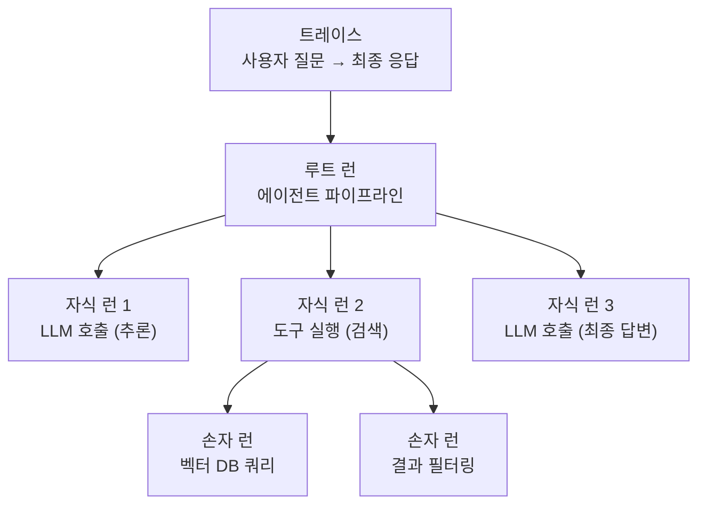
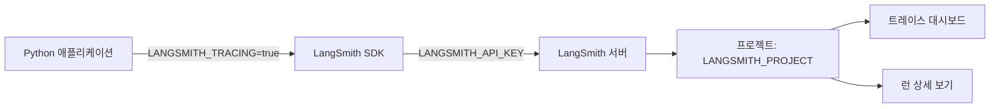
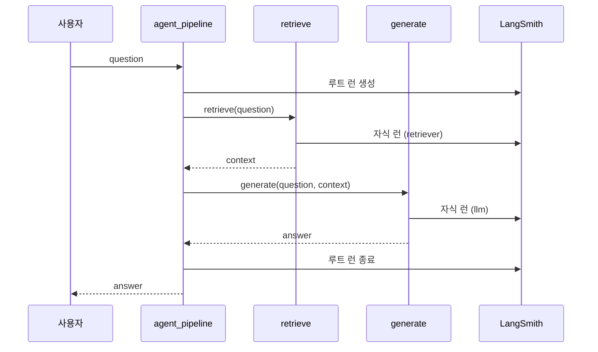
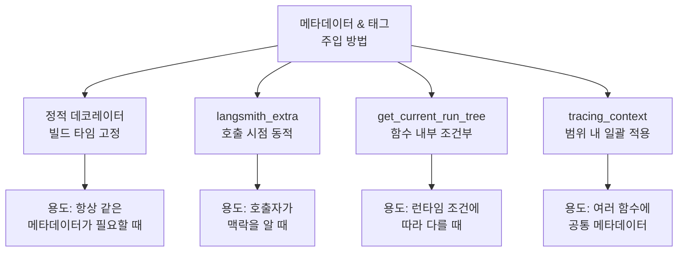
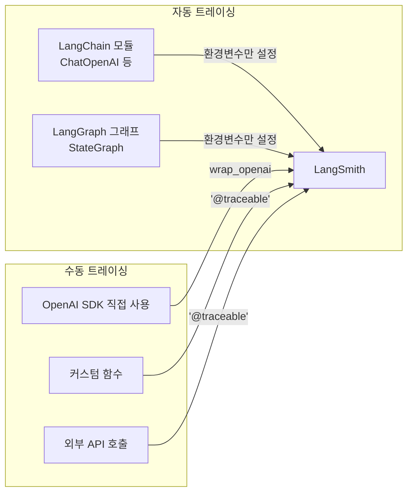

# LangSmith 트레이싱 설정

> LangSmith 트레이싱을 구성하고, 에이전트 실행의 모든 단계를 추적하는 관찰가능성 기반을 구축합니다.

## 개요

이 섹션에서는 LangSmith 트레이싱의 개념과 설정 방법을 배웁니다. 환경변수 구성부터 `@traceable` 데코레이터, 트레이스/스팬 구조, 메타데이터 태깅까지 — 에이전트 관찰가능성의 토대를 완성합니다.

**선수 지식**: [에이전트 평가 전략](17-ch17-에이전트-평가와-langsmith/01-01-에이전트-평가-전략.md)에서 배운 LangSmith 기본 개념, [LangSmith 데이터셋과 오프라인 평가](17-ch17-에이전트-평가와-langsmith/02-02-langsmith-데이터셋과-오프라인-평가.md)에서 다룬 LangSmith 프로젝트 구조

**학습 목표**:
- LangSmith 트레이싱 환경변수를 올바르게 구성할 수 있다
- `@traceable` 데코레이터로 커스텀 함수의 실행을 추적할 수 있다
- 트레이스, 런(Run), RunTree의 계층 구조를 이해하고 활용할 수 있다
- 메타데이터와 태그를 활용하여 트레이스를 체계적으로 분류할 수 있다

## 왜 알아야 할까?

여러분이 만든 에이전트가 "가끔 이상한 답변을 한다"고 사용자가 보고했다고 상상해 보세요. 어디서 문제가 생긴 걸까요? LLM이 잘못 추론한 건지, 도구가 엉뚱한 데이터를 반환한 건지, 아니면 상태 전이가 꼬인 건지 — 트레이싱 없이는 블랙박스를 열어볼 방법이 없습니다.

LangSmith 트레이싱은 에이전트의 **MRI 촬영**과 같습니다. 에이전트가 어떤 순서로 추론하고, 어떤 도구를 호출하고, 각 단계에서 얼마나 시간이 걸렸는지를 시각적으로 보여줍니다. Ch17에서 "평가"가 에이전트의 건강 검진이었다면, 이 챕터의 "관찰가능성"은 에이전트가 일하는 동안 실시간으로 심전도를 모니터링하는 것과 같죠. 이번 섹션에서 MRI를 찍는 법을 배우고, 다음 섹션에서 MRI 판독법을 익힌 뒤, 이어지는 섹션들에서는 장기적인 건강 지표를 추적하고 여러 시스템을 통합 진단하는 단계로 나아갑니다.

프로덕션 환경에서 에이전트를 운영하려면, 문제가 발생했을 때 **즉시** 원인을 파악할 수 있어야 합니다. 트레이싱은 그 출발점입니다.

## 핵심 개념

### 개념 1: 트레이싱이란 무엇인가

> 💡 **비유**: 트레이싱은 택배 추적과 같습니다. 택배가 발송지를 출발해서 중간 허브를 거쳐 최종 목적지에 도착할 때까지, 각 단계의 시간과 상태를 기록하죠. 에이전트 트레이싱도 마찬가지입니다 — 사용자 질문(발송)부터 최종 응답(배달)까지, 중간에 거치는 모든 LLM 호출, 도구 실행, 상태 변환을 시간 순서대로 기록합니다.

LangSmith에서 트레이싱의 핵심 용어를 정리하겠습니다:

- **트레이스(Trace)**: 하나의 요청이 처리되는 전체 과정. 택배 추적번호 하나에 해당합니다.
- **런(Run)**: 트레이스 안의 개별 단계. 택배가 거치는 각 허브에 해당합니다.
- **RunTree**: 런들이 부모-자식 관계로 연결된 트리 구조. 루트 런 아래에 자식 런들이 중첩됩니다.

> 💡 **용어 참고**: "런(Run)"은 LangSmith 고유의 용어입니다. OpenTelemetry에서는 동일한 개념을 **스팬(Span)**이라 부릅니다. 이 섹션에서는 LangSmith의 관례에 따라 "런"을 사용하지만, [OpenTelemetry 통합](18-ch18-관찰가능성과-디버깅/04-04-opentelemetry-통합.md)에서 OTEL 기반 관찰가능성을 다룰 때 이 매핑(Run ↔ Span)이 중요해집니다.

> 📊 **그림 1**: 트레이스의 계층 구조 — 하나의 트레이스 안에 여러 런이 트리 형태로 중첩



각 런은 `run_type`으로 구분됩니다:

| run_type | 용도 | 예시 |
|----------|------|------|
| `chain` | 범용 (기본값) | 파이프라인, 워크플로우 |
| `llm` | LLM 호출 | ChatOpenAI, Anthropic API |
| `tool` | 도구 실행 | 검색, 계산, API 호출 |
| `retriever` | 검색/조회 | 벡터 DB 쿼리, 문서 검색 |
| `embedding` | 임베딩 생성 | 텍스트 → 벡터 변환 |

### 개념 2: 환경변수 설정

> 💡 **비유**: 환경변수 설정은 CCTV를 설치하는 것과 같습니다. 카메라(트레이싱)를 켤지(`LANGSMITH_TRACING`), 어떤 모니터링 룸에 영상을 보낼지(`LANGSMITH_API_KEY`), 어떤 프로젝트 폴더에 저장할지(`LANGSMITH_PROJECT`)를 미리 지정해두면, 이후에는 코드가 실행될 때마다 자동으로 기록됩니다.

LangSmith 트레이싱에 필요한 환경변수를 살펴보겠습니다:

```python
# .env 파일 또는 셸 환경변수로 설정
import os

# 필수: 트레이싱 활성화
os.environ["LANGSMITH_TRACING"] = "true"

# 필수: API 인증 키 (https://smith.langchain.com에서 발급)
os.environ["LANGSMITH_API_KEY"] = "lsv2_pt_xxxxxxxxxxxx"

# 선택: 프로젝트 이름 (기본값: "default")
os.environ["LANGSMITH_PROJECT"] = "ai-agent-prod"

# 선택: API 엔드포인트 (기본값: https://api.smith.langchain.com)
os.environ["LANGSMITH_ENDPOINT"] = "https://api.smith.langchain.com"
```

> 📊 **그림 2**: 환경변수와 LangSmith 서버의 관계



여기서 한 가지 주의할 점이 있습니다. LangSmith에는 **두 가지 환경변수 명명 규칙**이 공존합니다:

| 변수명 | 인식하는 라이브러리 |
|--------|-------------------|
| `LANGSMITH_TRACING` | `langsmith` SDK (`@traceable`, `wrap_openai`) |
| `LANGCHAIN_TRACING_V2` | `langchain-core` (ChatOpenAI 등 LangChain 모듈) |
| `LANGSMITH_API_KEY` | `langsmith` SDK |
| `LANGCHAIN_API_KEY` | `langchain-core` |

LangGraph 에이전트에서 LangChain 모듈(`ChatOpenAI` 등)과 커스텀 함수(`@traceable`)를 함께 쓴다면, **양쪽 모두 설정**하는 것이 안전합니다:

```python
# 가장 안전한 설정 — 두 네이밍 모두 커버
os.environ["LANGSMITH_TRACING"] = "true"
os.environ["LANGCHAIN_TRACING_V2"] = "true"
os.environ["LANGSMITH_API_KEY"] = "lsv2_pt_xxxxxxxxxxxx"
os.environ["LANGCHAIN_API_KEY"] = "lsv2_pt_xxxxxxxxxxxx"  # 같은 키
os.environ["LANGSMITH_PROJECT"] = "my-agent"
```

> ⚠️ **흔한 오해**: "`LANGCHAIN_TRACING_V2`는 폐기(deprecated)되었다"는 이야기가 커뮤니티에 돌지만, 2026년 3월 현재 **공식적인 폐기 공지는 없습니다**. `langchain-core`는 여전히 이 변수를 인식하며, `LANGSMITH_TRACING`은 `langsmith` SDK 전용입니다. 둘 다 설정하면 걱정할 일이 없습니다.

### 개념 3: @traceable 데코레이터

> 💡 **비유**: `@traceable`은 함수에 붙이는 **블랙박스 레코더**입니다. 비행기의 블랙박스가 이착륙, 고도 변화, 엔진 상태를 자동으로 기록하듯, `@traceable`을 붙인 함수는 입력값, 출력값, 실행 시간, 에러를 자동으로 LangSmith에 기록합니다.

`@traceable` 데코레이터의 기본 사용법부터 살펴보겠습니다:

```python
from langsmith import traceable

# 가장 기본적인 사용 — run_type 기본값은 "chain"
@traceable
def process_query(query: str) -> str:
    # 이 함수의 입출력과 실행 시간이 자동 기록됩니다
    return f"처리됨: {query}"

# run_type과 이름을 명시적으로 지정
@traceable(run_type="tool", name="웹 검색")
def web_search(query: str) -> list[str]:
    # LangSmith에 "웹 검색"이라는 이름의 tool 타입 런으로 기록됩니다
    return ["결과1", "결과2"]

# 비동기 함수에도 동일하게 적용
@traceable(run_type="llm", name="GPT 호출")
async def call_llm(messages: list[dict]) -> str:
    response = await client.chat.completions.create(
        model="gpt-4.1-mini", messages=messages
    )
    return response.choices[0].message.content
```

`@traceable`의 핵심 파라미터를 정리하면:

| 파라미터 | 타입 | 설명 |
|----------|------|------|
| `run_type` | `str` | 런 유형: `"chain"`, `"llm"`, `"tool"`, `"retriever"`, `"embedding"` |
| `name` | `str` | LangSmith 대시보드에 표시될 이름 (미지정 시 함수명) |
| `metadata` | `dict` | 키-값 메타데이터 (필터링용) |
| `tags` | `list[str]` | 태그 목록 (분류용) |
| `project_name` | `str` | 이 런을 기록할 프로젝트 (미지정 시 환경변수) |

**자동 부모-자식 중첩**이 `@traceable`의 가장 강력한 기능입니다. `@traceable` 함수가 다른 `@traceable` 함수를 호출하면, LangSmith가 자동으로 부모-자식 관계를 만들어 줍니다:

```python
@traceable(name="에이전트 파이프라인")
def agent_pipeline(question: str) -> str:
    # retrieve()와 generate()가 자동으로 자식 런이 됩니다
    context = retrieve(question)
    answer = generate(question, context)
    return answer

@traceable(run_type="retriever", name="문서 검색")
def retrieve(query: str) -> list[str]:
    return ["관련 문서 1", "관련 문서 2"]

@traceable(run_type="llm", name="답변 생성")
def generate(question: str, context: list[str]) -> str:
    return f"{question}에 대한 답변"
```

> 📊 **그림 3**: @traceable의 자동 중첩 — 함수 호출 순서가 트레이스 트리에 반영



### 개념 4: 메타데이터와 태그

메타데이터와 태그는 트레이스를 **검색하고 필터링**하기 위한 도구입니다. 태그는 카테고리 라벨이고, 메타데이터는 상세 속성입니다.

메타데이터를 추가하는 방법은 네 가지가 있습니다:

**방법 1 — 데코레이터에서 정적으로 지정:**

```python
@traceable(
    name="주문 처리",
    tags=["production", "order-service"],
    metadata={"version": "2.1", "team": "backend"}
)
def process_order(order_id: str) -> dict:
    return {"status": "completed"}
```

**방법 2 — 호출 시점에 `langsmith_extra`로 동적 주입:**

```python
# 같은 함수를 다른 맥락에서 호출할 때 유용
result = process_order(
    "ORD-123",
    langsmith_extra={
        "tags": ["urgent", "vip-customer"],
        "metadata": {"customer_tier": "premium", "region": "asia"}
    }
)
```

**방법 3 — 함수 내부에서 현재 런에 접근하여 조건부 추가:**

```python
from langsmith import traceable, get_current_run_tree

@traceable(name="조건부 처리")
def conditional_process(data: dict) -> str:
    rt = get_current_run_tree()

    # 런타임 조건에 따라 메타데이터 추가
    if data.get("priority") == "high":
        rt.tags.append("high-priority")
        rt.metadata["escalated"] = True

    return "처리 완료"
```

**방법 4 — 컨텍스트 매니저로 범위 지정:**

```python
import langsmith as ls

# 이 블록 안의 모든 트레이스에 메타데이터가 자동 적용
with ls.tracing_context(
    metadata={"environment": "staging", "ab_test": "variant-b"},
    tags=["experiment"]
):
    result = agent_pipeline("사용자 질문")
```

> 📊 **그림 4**: 메타데이터 태깅의 네 가지 방법과 적용 범위



### 개념 5: wrap_openai과 LangGraph 자동 트레이싱

LangChain 모듈(`ChatOpenAI`, `ChatAnthropic` 등)을 쓰면 환경변수만 설정해도 **자동으로 트레이싱**됩니다. 하지만 OpenAI SDK를 직접 쓰거나 커스텀 로직이 있다면 `wrap_openai`이 필요합니다:

```python
import openai
from langsmith.wrappers import wrap_openai

# 기존 OpenAI 클라이언트를 래핑
client = wrap_openai(openai.Client())

# 이제 모든 호출이 자동으로 LangSmith에 기록됨
response = client.chat.completions.create(
    model="gpt-4.1-mini",
    messages=[{"role": "user", "content": "Hello!"}]
)
```

LangGraph에서의 트레이싱 전략을 정리하면:

> 📊 **그림 5**: LangGraph 에이전트의 트레이싱 전략 — 자동 트레이싱과 수동 트레이싱의 조합



LangGraph의 `StateGraph`를 컴파일하고 실행하면, 그래프의 각 노드 실행이 자동으로 별도 런으로 기록됩니다. 여기에 `@traceable`을 추가하면 노드 내부의 세부 단계까지 추적할 수 있습니다:

```python
from langgraph.graph import StateGraph, START, END
from langchain_openai import ChatOpenAI
from langsmith import traceable
from typing import TypedDict, Annotated
from langgraph.graph.message import add_messages

class State(TypedDict):
    messages: Annotated[list, add_messages]

llm = ChatOpenAI(model="gpt-4.1-mini")  # 자동 트레이싱

@traceable(run_type="tool", name="커스텀 후처리")
def postprocess(text: str) -> str:
    """커스텀 로직은 @traceable로 명시적 추적"""
    return text.strip().upper()

def call_model(state: State) -> dict:
    response = llm.invoke(state["messages"])
    # 커스텀 후처리도 트레이스에 포함됨
    processed = postprocess(response.content)
    return {"messages": [response]}

graph = StateGraph(State)
graph.add_node("agent", call_model)
graph.add_edge(START, "agent")
graph.add_edge("agent", END)
app = graph.compile()
```

## 실습: 직접 해보기

LangSmith 트레이싱을 설정하고, 간단한 에이전트 파이프라인의 실행을 추적하는 완전한 예제입니다.

**Step 1 — 설치 및 환경 설정:**

```bash
pip install langsmith langchain-openai langgraph
```

```python
import os

# 환경변수 설정 (실제 키로 교체하세요)
os.environ["LANGSMITH_TRACING"] = "true"
os.environ["LANGCHAIN_TRACING_V2"] = "true"
os.environ["LANGSMITH_API_KEY"] = "lsv2_pt_your_key_here"
os.environ["LANGCHAIN_API_KEY"] = "lsv2_pt_your_key_here"
os.environ["LANGSMITH_PROJECT"] = "ch18-tracing-lab"
os.environ["OPENAI_API_KEY"] = "sk-your_key_here"

# 백그라운드 콜백 활성화 (프로덕션 권장, 서버리스에서는 false)
os.environ["LANGCHAIN_CALLBACKS_BACKGROUND"] = "true"
```

**Step 2 — 트레이싱이 적용된 RAG 에이전트 구축:**

```python
from langsmith import traceable, get_current_run_tree
import langsmith as ls
from langchain_openai import ChatOpenAI
from langgraph.graph import StateGraph, START, END
from langgraph.graph.message import add_messages
from typing import TypedDict, Annotated
import time


# --- 상태 정의 ---
class AgentState(TypedDict):
    messages: Annotated[list, add_messages]
    context: str
    query_type: str


# --- 트레이싱이 적용된 커스텀 함수들 ---
@traceable(run_type="chain", name="쿼리 분류")
def classify_query(query: str) -> str:
    """쿼리를 분류합니다. 런타임 메타데이터를 조건부로 추가합니다."""
    rt = get_current_run_tree()

    if "코드" in query or "구현" in query:
        rt.tags.append("code-query")
        rt.metadata["query_category"] = "implementation"
        return "code"
    elif "설명" in query or "개념" in query:
        rt.tags.append("concept-query")
        rt.metadata["query_category"] = "explanation"
        return "concept"
    else:
        rt.metadata["query_category"] = "general"
        return "general"


@traceable(run_type="retriever", name="문서 검색")
def search_documents(query: str, query_type: str) -> str:
    """문서를 검색합니다. 실제로는 벡터 DB를 호출합니다."""
    rt = get_current_run_tree()
    rt.metadata["search_index"] = f"{query_type}_index"
    rt.metadata["top_k"] = 3

    # 시뮬레이션: 실제로는 벡터 DB 쿼리
    time.sleep(0.1)
    return f"[검색 결과] {query_type} 관련 문서 3건 발견"


@traceable(
    run_type="chain",
    name="응답 후처리",
    tags=["postprocess"],
    metadata={"step": "final"}
)
def postprocess_response(response: str) -> str:
    """응답을 후처리합니다."""
    return response.strip()


# --- LangGraph 노드 ---
llm = ChatOpenAI(model="gpt-4.1-mini", temperature=0)


def classify_node(state: AgentState) -> dict:
    """쿼리 분류 노드"""
    last_message = state["messages"][-1].content
    query_type = classify_query(last_message)
    return {"query_type": query_type}


def retrieve_node(state: AgentState) -> dict:
    """검색 노드"""
    last_message = state["messages"][-1].content
    context = search_documents(last_message, state.get("query_type", "general"))
    return {"context": context}


def generate_node(state: AgentState) -> dict:
    """LLM 응답 생성 노드"""
    prompt = f"""다음 컨텍스트를 참고하여 질문에 답하세요.

컨텍스트: {state.get('context', '없음')}
질문: {state['messages'][-1].content}
"""
    response = llm.invoke(prompt)
    processed = postprocess_response(response.content)
    return {"messages": [response]}


# --- 그래프 구성 ---
graph = StateGraph(AgentState)
graph.add_node("classify", classify_node)
graph.add_node("retrieve", retrieve_node)
graph.add_node("generate", generate_node)

graph.add_edge(START, "classify")
graph.add_edge("classify", "retrieve")
graph.add_edge("retrieve", "generate")
graph.add_edge("generate", END)

app = graph.compile()
```

**Step 3 — 메타데이터와 함께 실행:**

```run:python
# 트레이싱 컨텍스트와 함께 에이전트 실행
import langsmith as ls

with ls.tracing_context(
    metadata={"user_id": "user-42", "session_id": "sess-abc"},
    tags=["demo", "ch18-lab"]
):
    result = app.invoke({
        "messages": [("user", "LangGraph 상태 관리 개념을 설명해주세요")],
        "context": "",
        "query_type": ""
    })

print(f"응답: {result['messages'][-1].content[:100]}...")
print(f"쿼리 유형: {result['query_type']}")
print("✅ LangSmith 대시보드에서 트레이스를 확인하세요!")
```

```output
응답: LangGraph의 상태 관리는 TypedDict 기반의 상태 스키마를 정의하고, 각 노드가 상태의 일부를 업데이트하는 방식으로 동작합니...
쿼리 유형: concept
✅ LangSmith 대시보드에서 트레이스를 확인하세요!
```

**Step 4 — 트레이스 정보 프로그래밍 방식으로 확인:**

```run:python
from langsmith import Client

client = Client()

# 최근 트레이스 조회
runs = list(client.list_runs(
    project_name="ch18-tracing-lab",
    filter='has(tags, "demo")',
    limit=1
))

if runs:
    run = runs[0]
    print(f"트레이스 ID: {run.trace_id}")
    print(f"이름: {run.name}")
    print(f"상태: {run.status}")
    print(f"지연 시간: {run.total_tokens} tokens")
    print(f"태그: {run.tags}")
    print(f"메타데이터: {run.extra.get('metadata', {})}")
else:
    print("트레이스가 아직 수집되지 않았습니다.")
```

```output
트레이스 ID: 550e8400-e29b-41d4-a716-446655440000
이름: LangGraph
상태: success
지연 시간: 342 tokens
태그: ['demo', 'ch18-lab']
메타데이터: {'user_id': 'user-42', 'session_id': 'sess-abc'}
```

## 더 깊이 알아보기

### 관찰가능성의 탄생 — "세 개의 기둥"

관찰가능성(Observability)이라는 용어는 원래 1960년대 제어 이론에서 유래했습니다. 헝가리 출신 엔지니어 루돌프 칼만(Rudolf Kálmán)이 "시스템의 외부 출력만으로 내부 상태를 추론할 수 있는 정도"를 설명하기 위해 처음 사용했죠.

이 개념이 소프트웨어 세계로 넘어온 것은 2010년대 마이크로서비스 아키텍처가 확산되면서입니다. 트위터의 엔지니어들이 수천 개의 마이크로서비스가 만들어내는 복잡한 호출 체인을 디버깅하기 위해 **분산 트레이싱**을 도입했고, 이것이 Zipkin 프로젝트로 공개되었습니다. 이후 OpenTelemetry가 트레이싱의 표준이 되었고, 현재 **로그(Logs), 메트릭(Metrics), 트레이스(Traces)** — 이 세 가지를 "관찰가능성의 세 기둥"이라 부릅니다.

LangSmith는 이 분산 트레이싱의 개념을 LLM 애플리케이션에 특화시킨 것입니다. 전통적인 트레이싱이 HTTP 요청의 흐름을 추적했다면, LangSmith는 프롬프트, 토큰 사용량, 도구 호출 결과 같은 LLM 고유의 정보까지 캡처합니다. LangSmith 팀의 Harrison Chase는 "LLM 앱은 비결정적이기 때문에, 전통적인 로깅만으로는 디버깅이 불가능하다"고 강조하며, 이것이 LLM 전용 관찰가능성 도구가 필요한 이유라고 설명했습니다.

### RunTree 내부 동작

`@traceable` 데코레이터의 내부를 들여다보면, Python의 `contextvars` 모듈을 활용합니다. 각 `@traceable` 함수가 실행될 때 현재 스레드/코루틴의 컨텍스트 변수에 `RunTree` 객체가 저장되고, 자식 함수는 이 컨텍스트에서 부모 런을 찾아 자동으로 연결합니다. 이것이 비동기 함수에서도 부모-자식 관계가 정확하게 유지되는 비결입니다.

```python
# 내부 동작을 이해하기 위한 수동 RunTree 사용 예시
from langsmith.run_trees import RunTree

# 루트 런 생성
root = RunTree(
    name="수동 파이프라인",
    run_type="chain",
    inputs={"query": "테스트 질문"}
)
root.post()  # LangSmith에 전송

# 자식 런 생성
child = root.create_child(
    name="LLM 호출",
    run_type="llm",
    inputs={"prompt": "답변하세요"}
)
child.post()
child.end(outputs={"response": "답변입니다"})
child.patch()  # 업데이트 전송

# 루트 런 종료
root.end(outputs={"result": "최종 결과"})
root.patch()
```

대부분의 경우 `@traceable`이 이 모든 과정을 자동으로 처리하므로, `RunTree`를 직접 다룰 필요는 거의 없습니다. 하지만 기존 프레임워크와의 통합이나 매우 세밀한 제어가 필요할 때는 알아두면 유용합니다.

## 흔한 오해와 팁

> ⚠️ **흔한 오해**: "트레이싱을 켜면 성능이 크게 저하된다" — 실제로 LangSmith SDK는 트레이스 데이터를 **비동기 백그라운드**로 전송합니다(`LANGCHAIN_CALLBACKS_BACKGROUND=true`). LLM API 호출 자체가 수백 ms~수 초 걸리는 것에 비하면, 트레이싱 오버헤드는 무시할 수 있는 수준입니다.

> 💡 **알고 계셨나요?**: LangSmith의 `wrap_openai`은 OpenAI 클라이언트뿐 아니라, OpenAI 호환 API를 제공하는 서비스(vLLM, Ollama, Together AI 등)에도 적용할 수 있습니다. 래핑된 클라이언트의 모든 호출이 자동으로 트레이싱됩니다.

> 🔥 **실무 팁**: 프로덕션에서는 `LANGSMITH_PROJECT` 환경변수를 환경별로 다르게 설정하세요 — `"my-agent-dev"`, `"my-agent-staging"`, `"my-agent-prod"`. 이렇게 하면 LangSmith 대시보드에서 환경별로 트레이스를 분리하여 볼 수 있습니다. 추가로, `tracing_context`에 `user_id`와 `session_id`를 메타데이터로 넣어두면 특정 사용자의 문제를 빠르게 추적할 수 있습니다.

> 🔥 **실무 팁**: AWS Lambda나 Google Cloud Functions 같은 **서버리스 환경**에서는 반드시 `LANGCHAIN_CALLBACKS_BACKGROUND=false`로 설정하세요. 백그라운드 전송이 완료되기 전에 함수 인스턴스가 종료되면 트레이스가 유실됩니다.

## 핵심 정리

| 개념 | 설명 |
|------|------|
| `LANGSMITH_TRACING` | 트레이싱 활성화 환경변수 (langsmith SDK용) |
| `LANGCHAIN_TRACING_V2` | 트레이싱 활성화 환경변수 (langchain-core용) |
| `@traceable` | 함수의 입출력·실행시간·에러를 자동 기록하는 데코레이터 |
| `run_type` | 런의 유형 — `chain`, `llm`, `tool`, `retriever`, `embedding` |
| 트레이스/런/RunTree | 전체 실행(트레이스) → 개별 단계(런) → 트리 구조(RunTree) |
| 런(Run) vs 스팬(Span) | LangSmith는 "런", OpenTelemetry는 "스팬" — 동일 개념의 다른 이름 |
| `get_current_run_tree()` | 현재 실행 중인 런에 접근하여 메타데이터/태그를 동적 추가 |
| `langsmith_extra` | 함수 호출 시 메타데이터/태그를 동적으로 주입하는 딕셔너리 |
| `tracing_context` | 범위 내 모든 트레이스에 공통 메타데이터/태그를 적용하는 컨텍스트 매니저 |
| `wrap_openai` | OpenAI 클라이언트를 래핑하여 모든 호출을 자동 트레이싱 |
| LangGraph 자동 트레이싱 | LangChain 모듈 사용 시 환경변수만으로 자동 추적 |

## 다음 섹션 미리보기

트레이싱 설정을 완료했으니, 이제 수집된 트레이스를 **분석하고 디버깅**하는 방법을 배울 차례입니다. [트레이스 분석과 디버깅](18-ch18-관찰가능성과-디버깅/02-02-트레이스-분석과-디버깅.md)에서는 LangSmith 대시보드에서 트레이스를 탐색하고, 성능 병목을 찾아내고, 에러의 근본 원인을 진단하는 실전 기법을 다룹니다 — MRI를 찍었으니, 이제 판독하는 법을 배우는 거죠.

## 참고 자료

- [LangSmith Observability Quickstart](https://docs.langchain.com/langsmith/observability-quickstart) - 트레이싱 시작 가이드 공식 문서
- [Trace with LangGraph](https://docs.langchain.com/langsmith/trace-with-langgraph) - LangGraph 애플리케이션 트레이싱 설정 가이드
- [Add Metadata and Tags to Traces](https://docs.langchain.com/langsmith/add-metadata-tags) - 메타데이터·태그 활용법 공식 문서
- [@traceable API Reference](https://langsmith-sdk.readthedocs.io/en/latest/run_helpers/langsmith.run_helpers.traceable.html) - 데코레이터 전체 파라미터 레퍼런스
- [LangSmith for Agent Observability](https://ravjot03.medium.com/langsmith-for-agent-observability-tracing-langgraph-tool-calling-end-to-end-2a97d0024dfb) - LangGraph 도구 호출 트레이싱 실전 가이드
- [LangSmith SDK GitHub](https://github.com/langchain-ai/langsmith-sdk) - Python SDK 소스 코드와 예제