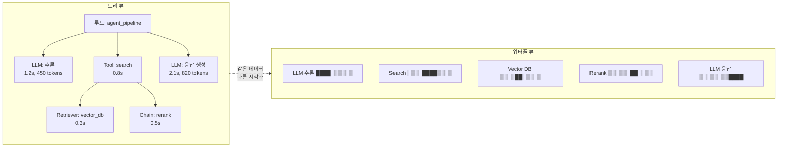
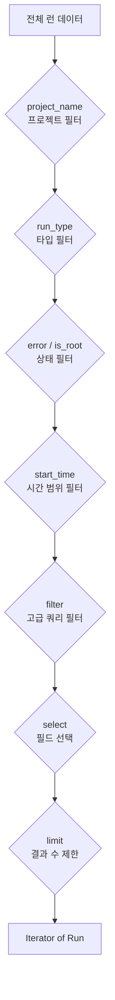
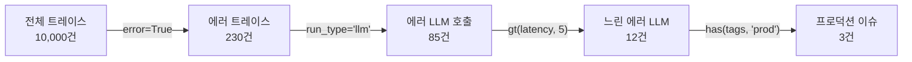
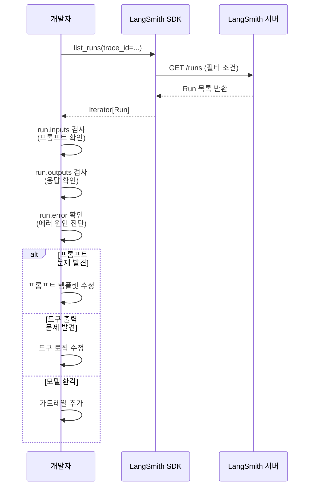
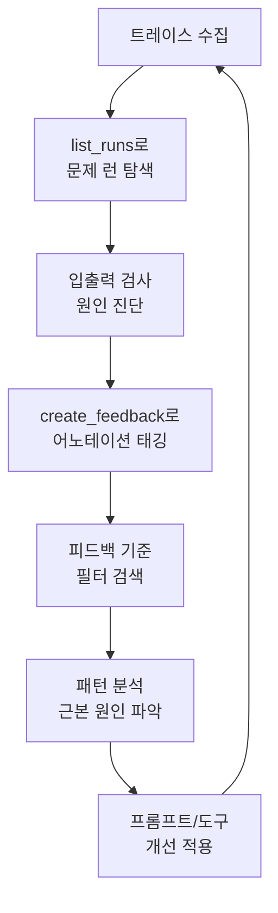

# 트레이스 분석과 디버깅

> LangSmith 트레이스 뷰어와 Python SDK로 에이전트의 LLM 호출 입출력을 검사하고, 도구 실행 시간을 분석하며, 에러 원인을 정확히 진단합니다.

## 개요

이 섹션에서는 앞서 설정한 트레이싱 데이터를 **분석하고 디버깅하는 방법**을 배웁니다. 트레이스 뷰어의 트리 뷰와 워터폴 뷰를 활용하여 에이전트 실행 흐름을 시각적으로 파악하고, Python SDK의 `list_runs`와 필터 쿼리 언어로 문제의 런을 프로그래밍 방식으로 찾아내는 기법을 익힙니다.

**선수 지식**: [LangSmith 트레이싱 설정](18-ch18-관찰가능성과-디버깅/01-01-langsmith-트레이싱-설정.md)에서 배운 `@traceable`, RunTree, 메타데이터 태깅 개념. [에이전트 평가 전략](17-ch17-에이전트-평가와-langsmith/01-01-에이전트-평가-전략.md)에서 다룬 LangSmith 프로젝트 구조

**학습 목표**:
- 트레이스 뷰어에서 트리 뷰와 워터폴 뷰를 활용하여 실행 흐름을 분석할 수 있다
- `Client.list_runs()`와 필터 쿼리 언어로 에러·지연·비용 기준으로 런을 검색할 수 있다
- LLM 호출의 입출력을 검사하여 추론 오류의 원인을 진단할 수 있다
- 피드백 API로 문제 런에 어노테이션을 달아 체계적으로 관리할 수 있다

## 왜 알아야 할까?

트레이싱을 설정했다면 데이터는 쌓이고 있습니다. 하지만 데이터가 쌓인다고 문제가 해결되는 건 아니죠. CCTV를 설치했다고 범인이 잡히는 게 아닌 것처럼, **영상을 재생하고 분석하는 방법**을 알아야 합니다.

프로덕션에서 에이전트를 운영하다 보면 이런 상황들을 마주하게 됩니다:

- 사용자가 "답변이 느려요"라고 보고 → 어떤 LLM 호출이 병목인지 찾아야 함
- 특정 도구 호출 후 에러 → 도구에 어떤 입력이 들어갔는지 확인해야 함
- "어제까지 잘 됐는데 오늘 이상해요" → 시간대별로 에러 패턴을 분석해야 함

이런 상황에서 LangSmith 대시보드를 열어보기만 하면 되는 게 아닙니다. 수천 개의 트레이스 중에서 **문제의 바늘**을 찾는 기술이 필요합니다. 이 섹션에서 바로 그 기술을 배웁니다.

## 핵심 개념

### 개념 1: 트레이스 뷰어 — 에이전트의 MRI 판독법

> 💡 **비유**: 병원의 MRI 결과지를 받아본 적이 있나요? 영상 자체는 기계가 촬영하지만, 그 영상을 **판독하는 것**은 전문의의 역할입니다. 트레이스 뷰어는 에이전트의 MRI 영상을 보여주는 도구이고, 우리는 이제 그것을 판독하는 방법을 배울 겁니다.

LangSmith의 트레이스 뷰어는 두 가지 핵심 뷰를 제공합니다:

**트리 뷰(Tree View)**: 런들의 부모-자식 관계를 계층적으로 보여줍니다. 각 노드를 클릭하면 해당 런의 입력(inputs), 출력(outputs), 지연 시간(latency), 토큰 사용량, 에러 정보를 확인할 수 있습니다.

**워터폴 뷰(Waterfall View)**: 각 런의 실행 시간을 시간축 위에 가로 막대로 표시합니다. 어떤 단계가 병렬로 실행되었는지, 어디서 병목이 발생하는지 한눈에 파악할 수 있습니다.

> 📊 **그림 1**: 트리 뷰와 워터폴 뷰의 구조



트리 뷰에서 주목해야 할 핵심 필드들이 있습니다:

| 필드 | 의미 | 디버깅 활용 |
|------|------|------------|
| `inputs` | 런에 전달된 입력 데이터 | LLM에 잘못된 프롬프트가 들어갔는지 확인 |
| `outputs` | 런이 반환한 출력 데이터 | 도구가 예상과 다른 결과를 반환했는지 확인 |
| `error` | 에러 스택 트레이스 | 에러 발생 위치와 원인 파악 |
| `latency` | 실행 소요 시간(초) | 성능 병목 식별 |
| `total_tokens` | 사용된 총 토큰 수 | 비용 이상 탐지 |
| `first_token_time` | 첫 토큰 생성까지 시간 | TTFT(Time to First Token) 분석 |

### 개념 2: Python SDK로 런 검색하기 — list_runs

> 💡 **비유**: 트레이스 뷰어가 현미경이라면, `list_runs`는 **자동 스캐너**입니다. 수천 장의 슬라이드를 사람이 하나씩 현미경으로 볼 수는 없잖아요? 자동 스캐너는 "핑크색 세포만 골라줘" 같은 조건을 걸어서 문제가 있는 슬라이드만 골라냅니다.

`langsmith.Client`의 `list_runs()` 메서드는 프로그래밍 방식으로 런을 검색하는 핵심 도구입니다. LangSmith SDK는 **키워드 인자(keyword arguments)** 스타일을 사용하므로, 모든 파라미터를 이름을 명시하여 전달해야 합니다. 기본 사용법부터 살펴보겠습니다:

```python
from langsmith import Client
from datetime import datetime, timedelta

client = Client()  # LANGSMITH_API_KEY 환경변수 사용

# 1. 프로젝트의 최근 에러 런 검색
error_runs = client.list_runs(
    project_name="ai-agent-prod",  # 키워드 인자 필수
    error=True,                    # 에러가 발생한 런만
    limit=20                       # 최근 20개
)

for run in error_runs:
    print(f"[{run.run_type}] {run.name}")
    print(f"  에러: {run.error[:100]}...")  # 에러 메시지 앞 100자
    print(f"  시간: {run.start_time}")
    print()

# 2. 특정 타입의 런만 검색
llm_runs = client.list_runs(
    project_name="ai-agent-prod",
    run_type="llm",                # LLM 호출만
    start_time=datetime.now() - timedelta(hours=6)  # 최근 6시간
)

# 3. 루트 트레이스만 검색 (자식 런 제외)
root_traces = client.list_runs(
    project_name="ai-agent-prod",
    is_root=True,
    limit=50
)

# 4. 필요한 필드만 선택하여 성능 최적화
optimized_runs = client.list_runs(
    project_name="ai-agent-prod",
    select=["name", "run_type", "latency", "error", "total_tokens"],
    limit=100
)
```

> ⚠️ **흔한 오해**: `list_runs("ai-agent-prod", "llm", 20)`처럼 위치 인자(positional arguments)로 호출하면 안 됩니다. LangSmith SDK의 `list_runs`는 모든 파라미터를 **키워드 인자**로 전달해야 합니다. `client.list_runs(project_name="...", run_type="...", limit=20)` 형태를 반드시 사용하세요.

`list_runs`의 핵심 파라미터를 정리하면:

| 파라미터 | 타입 | 설명 |
|----------|------|------|
| `project_name` | `str` | 프로젝트 이름 |
| `run_type` | `str` | `"llm"`, `"chain"`, `"tool"`, `"retriever"` |
| `error` | `bool` | `True`면 에러 런만 |
| `is_root` | `bool` | `True`면 루트 트레이스만 |
| `start_time` | `datetime` | 이 시간 이후의 런 |
| `trace_id` | `str` | 특정 트레이스의 런들 |
| `filter` | `str` | 고급 필터 쿼리 (아래 설명) |
| `limit` | `int` | 결과 수 제한 |
| `select` | `list[str]` | 반환할 필드 선택 (성능 최적화) |

> 📊 **그림 2**: list_runs의 필터링 파이프라인



### 개념 3: 필터 쿼리 언어 — 정밀한 검색

> 💡 **비유**: `list_runs`의 기본 파라미터가 "큰 체"라면, 필터 쿼리 언어는 **정밀 필터**입니다. "지연 시간이 5초 이상이면서, 에러가 나고, 프로덕션 태그가 붙은 LLM 호출"처럼 복잡한 조건을 한 번에 걸 수 있습니다.

LangSmith의 필터 쿼리 언어는 함수형 문법을 사용합니다. 주요 연산자를 알아보겠습니다:

| 연산자 | 의미 | 예시 |
|--------|------|------|
| `eq(field, value)` | 같음 | `eq(run_type, "llm")` |
| `neq(field, value)` | 같지 않음 | `neq(error, null)` |
| `gt(field, value)` | 초과 | `gt(latency, 5)` |
| `lt(field, value)` | 미만 | `lt(total_tokens, 1000)` |
| `has(field, value)` | 배열에 포함 | `has(tags, "production")` |
| `search(field, text)` | 텍스트 검색 | `search(inputs, "서울 날씨")` |
| `and(...)` | 논리곱 | `and(eq(...), gt(...))` |
| `or(...)` | 논리합 | `or(eq(...), eq(...))` |

실전 필터 쿼리 예제를 살펴보겠습니다:

```python
from langsmith import Client

client = Client()

# 1. 느린 LLM 호출 찾기 (지연 > 10초)
slow_llm_runs = client.list_runs(
    project_name="ai-agent-prod",
    filter='and(eq(run_type, "llm"), gt(latency, 10))',
    select=["name", "latency", "total_tokens", "trace_id"],
    limit=20
)

# 2. 특정 태그가 붙은 에러 런
tagged_errors = client.list_runs(
    project_name="ai-agent-prod",
    filter='and(has(tags, "production"), neq(error, null))',
    select=["name", "error", "start_time"],
    limit=10
)

# 3. 메타데이터 기반 검색 (특정 사용자의 요청)
user_runs = client.list_runs(
    project_name="ai-agent-prod",
    filter="and(eq(metadata_key, 'user_id'), eq(metadata_value, 'user_42'))",
    limit=50
)

# 4. 토큰을 많이 쓴 LLM 호출 (비용 이상 탐지)
expensive_runs = client.list_runs(
    project_name="ai-agent-prod",
    filter='and(eq(run_type, "llm"), gt(total_tokens, 5000))',
    select=["name", "total_tokens", "latency", "trace_id"],
    limit=10
)

# 5. 피드백 점수가 낮은 런 (사용자 불만족)
low_score_runs = client.list_runs(
    project_name="ai-agent-prod",
    filter='and(eq(feedback_key, "accuracy"), lt(feedback_score, 0.5))',
    select=["name", "inputs", "outputs", "trace_id"],
    limit=10
)
```

> 📊 **그림 3**: 필터 쿼리 조합으로 문제 런을 좁혀가는 과정



### 개념 4: LLM 호출 입출력 검사 — 추론 오류 진단

> 💡 **비유**: 의사가 환자의 혈액 검사 결과를 하나씩 읽는 것처럼, LLM 호출의 입출력을 검사하면 에이전트가 "왜 그런 결정을 했는지" 알 수 있습니다. 프롬프트(입력)가 잘못됐는지, 모델 응답(출력)이 이상한지, 아니면 도구가 엉뚱한 데이터를 넘겨준 건지 — 각 단계의 "혈액 검사 수치"를 확인하는 거죠.

프로그래밍 방식으로 LLM 호출의 입출력을 검사하는 패턴을 살펴보겠습니다:

```python
from langsmith import Client

client = Client()

def inspect_trace(trace_id: str) -> None:
    """특정 트레이스의 모든 런을 검사하여 문제 원인을 진단"""

    # 해당 트레이스의 모든 런을 가져옴 (키워드 인자 사용)
    runs = list(client.list_runs(
        trace_id=trace_id,
        select=["name", "run_type", "inputs", "outputs",
                "error", "latency", "total_tokens"]
    ))

    print(f"=== 트레이스 분석: {trace_id} ===")
    print(f"총 {len(runs)}개 런\n")

    for run in runs:
        # 상태 이모지 결정
        status = "ERROR" if run.error else "OK"

        print(f"[{status}] {run.run_type}: {run.name}")
        print(f"  지연: {run.latency:.2f}s | 토큰: {run.total_tokens or 0}")

        # LLM 호출이면 프롬프트와 응답을 검사
        if run.run_type == "llm":
            if run.inputs and "messages" in run.inputs:
                last_msg = run.inputs["messages"][-1]
                content = str(last_msg.get("content", ""))[:200]
                print(f"  입력(마지막 메시지): {content}...")

            if run.outputs and "generations" in run.outputs:
                output_text = str(run.outputs["generations"][0])[:200]
                print(f"  출력: {output_text}...")

        # 도구 실행이면 인자와 결과를 검사
        if run.run_type == "tool":
            print(f"  입력: {str(run.inputs)[:200]}")
            print(f"  출력: {str(run.outputs)[:200]}")

        # 에러가 있으면 스택 트레이스 출력
        if run.error:
            print(f"  에러: {run.error[:300]}")

        print()
```

> 📊 **그림 4**: LLM 입출력 검사를 통한 에러 진단 플로우



### 개념 5: 피드백 API — 문제 런에 어노테이션 달기

> 💡 **비유**: 교수님이 시험 답안지를 채점할 때, 점수만 주는 게 아니라 "여기서 논리가 비약됨", "이 공식은 맞지만 적용이 잘못됨" 같은 코멘트를 달죠? 피드백 API는 트레이스에 이런 **채점과 코멘트**를 프로그래밍 방식으로 추가하는 도구입니다.

피드백은 문제 트레이스를 체계적으로 분류하고 추적하는 데 핵심적입니다. `create_feedback` 메서드도 `list_runs`와 마찬가지로 **키워드 인자**를 사용합니다:

```python
from langsmith import Client

client = Client()

# 1. 정확도 점수 피드백 (모든 파라미터를 키워드로 전달)
client.create_feedback(
    run_id="a36092d2-4ad5-4fb4-9c0d-0dba9a2ed836",
    key="accuracy",
    score=0.3,
    comment="도구 호출 결과를 잘못 해석하여 부정확한 답변 생성"
)

# 2. 지연 시간 이슈 태깅
client.create_feedback(
    run_id="a36092d2-4ad5-4fb4-9c0d-0dba9a2ed836",
    key="latency_issue",
    score=0.0,
    comment="벡터 DB 쿼리에서 12초 지연 — 인덱스 재구성 필요"
)

# 3. 수정된 정답(ground truth) 포함
client.create_feedback(
    run_id="a36092d2-4ad5-4fb4-9c0d-0dba9a2ed836",
    key="correctness",
    score=0.0,
    correction={"expected_output": "서울의 인구는 약 950만 명입니다"},
    comment="에이전트가 2010년 데이터를 참조하여 1,050만으로 답변"
)
```

> 📊 **그림 5**: 피드백 기반 품질 관리 사이클



피드백으로 태깅한 런은 나중에 필터 쿼리로 다시 찾을 수 있습니다:

```python
# 정확도 0.5 미만으로 채점된 런 검색
low_accuracy = client.list_runs(
    project_name="ai-agent-prod",
    filter='and(eq(feedback_key, "accuracy"), lt(feedback_score, 0.5))',
    select=["name", "inputs", "outputs", "trace_id"],
    limit=20
)
```

## 실습: 직접 해보기

이제 에이전트의 트레이스를 실제로 분석하고 디버깅하는 전체 워크플로우를 구현해 보겠습니다. 먼저 문제가 포함된 에이전트를 실행하고, 그 트레이스를 SDK로 분석하여 원인을 찾아내는 과정을 진행합니다.

### Step 1: 분석 대상 에이전트 생성 (트레이싱 포함)

```python
import os
from langsmith import traceable, Client
from langsmith.wrappers import wrap_openai
from openai import OpenAI

# 환경변수 설정
os.environ["LANGSMITH_TRACING"] = "true"
os.environ["LANGSMITH_PROJECT"] = "debug-practice"

# OpenAI 클라이언트를 트레이싱으로 래핑
raw_client = OpenAI()
openai_client = wrap_openai(raw_client)
ls_client = Client()


@traceable(run_type="tool", name="search_database")
def search_database(query: str) -> list[dict]:
    """시뮬레이션된 DB 검색 — 일부러 느린 쿼리 포함"""
    import time

    # 특정 키워드에 대해 의도적으로 지연 발생
    if "복잡한" in query:
        time.sleep(3)  # 의도적 병목

    return [
        {"title": "LangGraph 가이드", "relevance": 0.9},
        {"title": "에이전트 패턴", "relevance": 0.7},
    ]


@traceable(run_type="tool", name="calculate")
def calculate(expression: str) -> str:
    """계산 도구 — 잘못된 입력에 대해 에러 발생"""
    try:
        result = eval(expression)  # 실습 용도
        return str(result)
    except Exception as e:
        raise ValueError(f"계산 실패: {expression} → {e}")


@traceable(name="simple_agent")
def simple_agent(question: str) -> str:
    """간단한 에이전트 — 질문에 따라 도구를 선택"""

    # LLM에게 도구 선택 요청
    response = openai_client.chat.completions.create(
        model="gpt-4o-mini",
        messages=[
            {"role": "system", "content": "질문에 답하세요. 검색이 필요하면 [SEARCH], 계산이 필요하면 [CALC]로 시작하세요."},
            {"role": "user", "content": question}
        ],
        temperature=0,
    )

    answer = response.choices[0].message.content

    # 도구 선택 및 실행
    if "[SEARCH]" in answer:
        results = search_database(query=question)
        # 결과를 바탕으로 최종 답변 생성
        final = openai_client.chat.completions.create(
            model="gpt-4o-mini",
            messages=[
                {"role": "system", "content": "검색 결과를 바탕으로 답변하세요."},
                {"role": "user", "content": f"질문: {question}\n검색 결과: {results}"}
            ],
        )
        return final.choices[0].message.content

    elif "[CALC]" in answer:
        # 수식 추출 시도
        calc_result = calculate(expression=question.split("계산:")[-1].strip())
        return f"계산 결과: {calc_result}"

    return answer


# 여러 시나리오 실행 (트레이스 생성)
test_cases = [
    "LangGraph란 무엇인가요?",              # 정상 검색
    "복잡한 멀티에이전트 아키텍처 설명해줘",  # 느린 검색 (병목)
    "계산: 2 ** 10",                         # 정상 계산
    "계산: 1/0",                             # 에러 발생
]

for q in test_cases:
    try:
        result = simple_agent(question=q)
        print(f"Q: {q}\nA: {result[:80]}...\n")
    except Exception as e:
        print(f"Q: {q}\nERROR: {e}\n")
```

### Step 2: 트레이스 분석 도구 구현

```python
from langsmith import Client
from datetime import datetime, timedelta

client = Client()
PROJECT = "debug-practice"


def find_error_runs(hours: int = 24) -> list:
    """최근 N시간 내 에러 런을 찾아 요약"""
    errors = list(client.list_runs(
        project_name=PROJECT,
        error=True,
        start_time=datetime.now() - timedelta(hours=hours),
        select=["name", "run_type", "error", "inputs",
                "latency", "start_time", "trace_id"],
    ))

    print(f"=== 최근 {hours}시간 에러 런: {len(errors)}건 ===\n")
    for run in errors:
        print(f"  [{run.run_type}] {run.name}")
        print(f"  시간: {run.start_time}")
        print(f"  에러: {run.error[:150] if run.error else 'N/A'}")
        print(f"  트레이스: {run.trace_id}")
        print()

    return errors


def find_slow_runs(threshold_seconds: float = 3.0) -> list:
    """지연 시간이 임계값을 초과하는 런 검색"""
    slow = list(client.list_runs(
        project_name=PROJECT,
        filter=f'gt(latency, {threshold_seconds})',
        select=["name", "run_type", "latency", "total_tokens", "trace_id"],
        limit=20,
    ))

    print(f"=== 지연 > {threshold_seconds}s 런: {len(slow)}건 ===\n")
    for run in sorted(slow, key=lambda r: r.latency or 0, reverse=True):
        print(f"  [{run.run_type}] {run.name}")
        print(f"  지연: {run.latency:.2f}s | 토큰: {run.total_tokens or 0}")
        print()

    return slow


def deep_inspect_trace(trace_id: str) -> None:
    """특정 트레이스를 계층적으로 분석"""
    runs = list(client.list_runs(
        trace_id=trace_id,
        select=["name", "run_type", "inputs", "outputs",
                "error", "latency", "total_tokens",
                "parent_run_id"],
    ))

    # 부모-자식 관계를 맵으로 구성
    run_map = {str(r.id): r for r in runs}
    root_runs = [r for r in runs if r.parent_run_id is None]

    def print_tree(run, depth=0):
        indent = "  " * depth
        status = "ERROR" if run.error else "OK"
        tokens = run.total_tokens or 0
        print(f"{indent}[{status}] {run.run_type}: {run.name} "
              f"({run.latency:.2f}s, {tokens} tokens)")

        if run.error:
            print(f"{indent}  >> {run.error[:120]}")

        if run.run_type == "llm" and run.inputs:
            msgs = run.inputs.get("messages", [])
            if msgs:
                last = str(msgs[-1].get("content", ""))[:100]
                print(f"{indent}  입력: {last}")

        # 자식 런 찾기
        children = [r for r in runs if str(r.parent_run_id) == str(run.id)]
        for child in children:
            print_tree(child, depth + 1)

    print(f"=== 트레이스 상세 분석: {trace_id} ===\n")
    for root in root_runs:
        print_tree(root)
```

### Step 3: 분석 실행 및 자동 피드백 태깅

```run:python
# 분석 결과를 시뮬레이션하여 실행 흐름을 보여줍니다
# (실제 실행 시에는 위의 에이전트를 먼저 실행해야 합니다)

# 에러 분석 시뮬레이션
print("=== 최근 24시간 에러 런: 2건 ===\n")
print("  [tool] calculate")
print("  시간: 2026-03-20 14:32:15")
print("  에러: ValueError: 계산 실패: 1/0 → division by zero")
print("  트레이스: abc-123-def\n")

print("=== 지연 > 3.0s 런: 1건 ===\n")
print("  [tool] search_database")
print("  지연: 3.12s | 토큰: 0")
print()

# 자동 피드백 예시
print("=== 자동 피드백 태깅 ===")
print("  run abc-123: accuracy=0.0 (계산 에러)")
print("  run def-456: latency_issue=0.0 (3.12s 지연)")
```

```output
=== 최근 24시간 에러 런: 2건 ===

  [tool] calculate
  시간: 2026-03-20 14:32:15
  에러: ValueError: 계산 실패: 1/0 → division by zero
  트레이스: abc-123-def

=== 지연 > 3.0s 런: 1건 ===

  [tool] search_database
  지연: 3.12s | 토큰: 0

=== 자동 피드백 태깅 ===
  run abc-123: accuracy=0.0 (계산 에러)
  run def-456: latency_issue=0.0 (3.12s 지연)
```

자동 피드백 태깅 함수를 구현하면 다음과 같습니다:

```python
def auto_tag_issues(hours: int = 24) -> dict:
    """에러와 지연 이슈를 자동으로 탐지하고 피드백으로 태깅"""
    stats = {"errors_tagged": 0, "slow_tagged": 0}

    # 에러 런에 피드백 추가
    error_runs = client.list_runs(
        project_name=PROJECT,
        error=True,
        start_time=datetime.now() - timedelta(hours=hours),
    )
    for run in error_runs:
        client.create_feedback(
            run_id=run.id,
            key="auto_error_detected",
            score=0.0,
            comment=f"자동 감지: {run.error[:200] if run.error else 'unknown'}",
        )
        stats["errors_tagged"] += 1

    # 느린 런에 피드백 추가
    slow_runs = client.list_runs(
        project_name=PROJECT,
        filter='gt(latency, 5)',
        start_time=datetime.now() - timedelta(hours=hours),
    )
    for run in slow_runs:
        client.create_feedback(
            run_id=run.id,
            key="auto_latency_alert",
            score=0.0,
            comment=f"자동 감지: 지연 {run.latency:.2f}s",
        )
        stats["slow_tagged"] += 1

    return stats
```

### Step 4: 디버깅 리포트 생성

```python
def generate_debug_report(hours: int = 24) -> str:
    """지정된 시간 범위의 디버깅 리포트를 생성"""
    report_lines = [
        f"# 디버깅 리포트 — 최근 {hours}시간",
        f"생성 시각: {datetime.now().isoformat()}\n",
    ]

    # 전체 트레이스 통계
    all_roots = list(client.list_runs(
        project_name=PROJECT,
        is_root=True,
        start_time=datetime.now() - timedelta(hours=hours),
        select=["latency", "error", "total_tokens"],
    ))

    total = len(all_roots)
    errors = sum(1 for r in all_roots if r.error)
    avg_latency = (
        sum(r.latency for r in all_roots if r.latency) / total
        if total > 0 else 0
    )
    total_tokens = sum(r.total_tokens or 0 for r in all_roots)

    report_lines.append("## 전체 통계")
    report_lines.append(f"- 총 트레이스: {total}건")
    report_lines.append(f"- 에러 발생: {errors}건 ({errors/total*100:.1f}%)" if total > 0 else "- 에러: 0건")
    report_lines.append(f"- 평균 지연: {avg_latency:.2f}s")
    report_lines.append(f"- 총 토큰: {total_tokens:,}\n")

    # 에러 유형별 분류
    error_runs = [r for r in all_roots if r.error]
    if error_runs:
        report_lines.append("## 에러 유형 분류")
        error_types: dict[str, int] = {}
        for r in error_runs:
            err_type = r.error.split(":")[0] if r.error else "Unknown"
            error_types[err_type] = error_types.get(err_type, 0) + 1
        for err_type, count in sorted(error_types.items(), key=lambda x: -x[1]):
            report_lines.append(f"- {err_type}: {count}건")

    report = "\n".join(report_lines)
    return report
```

```run:python
# 리포트 출력 시뮬레이션
print("# 디버깅 리포트 — 최근 24시간")
print("생성 시각: 2026-03-20T15:30:00\n")
print("## 전체 통계")
print("- 총 트레이스: 4건")
print("- 에러 발생: 1건 (25.0%)")
print("- 평균 지연: 2.85s")
print("- 총 토큰: 3,420\n")
print("## 에러 유형 분류")
print("- ValueError: 1건")
```

```output
# 디버깅 리포트 — 최근 24시간
생성 시각: 2026-03-20T15:30:00

## 전체 통계
- 총 트레이스: 4건
- 에러 발생: 1건 (25.0%)
- 평균 지연: 2.85s
- 총 토큰: 3,420

## 에러 유형 분류
- ValueError: 1건
```

## 더 깊이 알아보기

### 관찰가능성의 기원 — 제어 이론에서 소프트웨어로

"관찰가능성(Observability)"이라는 단어는 1960년대 헝가리 태생의 미국 수학자 루돌프 칼만(Rudolf Kálmán)이 제어 이론에서 처음 사용했습니다. 그는 "시스템의 외부 출력만으로 내부 상태를 완전히 복원할 수 있는가?"라는 질문을 던졌고, 이를 정량적으로 판별하는 **칼만 관찰가능성 행렬**을 정의했습니다.

소프트웨어 세계에서 관찰가능성이 주목받기 시작한 건 2010년대 후반, 마이크로서비스 아키텍처가 보편화되면서부터입니다. Twitter의 분산 트레이싱 시스템 **Zipkin**(2012년 오픈소스화)과 Google의 **Dapper** 논문(2010년)이 분산 시스템의 트레이싱 패러다임을 확립했습니다. LangSmith는 이 분산 트레이싱의 개념을 LLM 에이전트 영역에 적용한 도구로, 2023년 LangChain 팀이 출시했습니다.

흥미롭게도, LangSmith의 런(Run) 개념은 분산 트레이싱의 **스팬(Span)** 개념과 거의 동일합니다. OpenTelemetry 표준의 스팬이 "작업의 단위"를 나타내듯, LangSmith의 런도 "LLM 호출, 도구 실행, 체인 실행의 단위"를 나타냅니다. 2025년 4월에는 LangSmith가 공식적으로 **OpenTelemetry 통합**을 발표하여, 기존 OTel 인프라와 LLM 트레이싱을 하나의 파이프라인으로 연결할 수 있게 되었습니다.

### LangSmith Insights — AI가 트레이스를 분석하는 시대

2026년 1월, LangSmith 셀프 호스트 v0.13에서 **Insights** 기능이 추가되었습니다. 이 기능은 수집된 트레이스를 비지도 학습으로 **클러스터링**하고, 각 클러스터의 에러 패턴을 자동으로 요약합니다. 사람이 수천 개의 트레이스를 하나씩 검토할 필요 없이, AI가 "이 클러스터는 도구 호출 타임아웃 패턴", "이 클러스터는 프롬프트 주입 시도" 같은 레이블을 자동으로 붙여주는 것이죠.

더 나아가, **Polly AI 어시스턴트**라는 대화형 분석 도구도 등장했습니다. "어제 에이전트가 실수한 케이스를 보여줘"라고 자연어로 물으면, 트레이스 데이터를 분석하여 답변합니다.

## 흔한 오해와 팁

> ⚠️ **흔한 오해**: "트레이스를 많이 쌓으면 자동으로 문제가 드러날 것이다" — 데이터를 수집하는 것과 분석하는 것은 완전히 다른 일입니다. 메타데이터와 태그를 체계적으로 설정하지 않으면, 수만 건의 트레이스 속에서 문제를 찾는 건 건초더미에서 바늘 찾기와 같습니다. 트레이싱 설정 단계에서 `user_id`, `session_type`, `environment` 같은 메타데이터를 반드시 주입하세요.

> ⚠️ **흔한 오해**: `list_runs`나 `create_feedback`을 위치 인자(positional arguments)로 호출할 수 있다고 생각하는 경우가 많습니다. LangSmith SDK의 핵심 메서드들은 **키워드 인자(keyword arguments)** 방식으로 설계되어 있습니다. `client.list_runs("my-project", True, 20)` 같은 호출은 동작하지 않으며, 반드시 `client.list_runs(project_name="my-project", error=True, limit=20)`으로 작성해야 합니다.

> 💡 **알고 계셨나요?**: `list_runs`의 `select` 파라미터를 사용하면 필요한 필드만 가져와서 **API 응답 크기를 90% 이상 줄일 수** 있습니다. 전체 `inputs`와 `outputs`에는 프롬프트 전문과 LLM 응답 전문이 포함되어 있어서, 통계 분석만 할 때는 `select=["name", "latency", "error", "total_tokens"]`처럼 필요한 필드만 지정하는 게 훨씬 효율적입니다.

> 🔥 **실무 팁**: 프로덕션 환경에서는 `create_feedback`의 `trace_id` 파라미터를 함께 사용하세요. `run_id`만 전달하면 즉시 API 호출이 발생하지만, `trace_id`를 함께 전달하면 LangSmith SDK가 **백그라운드 배치 큐**에 넣어서 비동기로 처리합니다. 이렇게 하면 피드백 전송이 애플리케이션 응답 시간에 영향을 주지 않습니다.

> 🔥 **실무 팁**: 필터 쿼리의 시간 범위에 주의하세요. LangSmith API는 **7일 이하 조회 시 10초에 10건**, **7일 초과 조회 시 10초에 3건**의 레이트 리밋을 적용합니다. 대규모 분석 스크립트를 작성할 때는 시간 범위를 일 단위로 나누어 반복 호출하고, 호출 간 `time.sleep(1)`을 넣어 레이트 리밋에 걸리지 않도록 하세요.

## 핵심 정리

| 개념 | 설명 |
|------|------|
| 트리 뷰 | 런의 부모-자식 관계를 계층적으로 시각화, 각 노드의 입출력/에러/지연 확인 |
| 워터폴 뷰 | 런의 실행 시간을 시간축 위에 표시, 병렬 실행과 병목 시각화 |
| `list_runs()` | 프로그래밍 방식으로 런을 검색하는 핵심 SDK 메서드 (키워드 인자 사용) |
| 필터 쿼리 언어 | `eq()`, `gt()`, `has()`, `and()` 등으로 정밀 검색 조건 구성 |
| `select` 파라미터 | 필요한 필드만 가져와 API 효율성 극대화 |
| LLM 입출력 검사 | `run.inputs["messages"]`와 `run.outputs`로 추론 오류 진단 |
| `create_feedback()` | 런에 점수·코멘트·수정 정답을 키워드 인자로 프로그래밍 방식으로 태깅 |
| `correction` 필드 | 피드백에 ground truth를 포함하여 향후 평가 데이터로 활용 |

## 다음 섹션 미리보기

트레이스에서 개별 문제를 찾아내는 방법을 익혔으니, 다음 섹션 [비용과 성능 모니터링](18-ch18-관찰가능성과-디버깅/03-03-비용과-성능-모니터링.md)에서는 **전체적인 비용과 성능 추세**를 모니터링하는 방법을 배웁니다. 토큰 사용량을 비용으로 환산하고, 지연 시간 분포를 추적하며, 이상 탐지 알림을 설정하는 방법을 다룹니다. 개별 트레이스의 "미시적 분석"에서 시스템 전체의 "거시적 모니터링"으로 시야를 넓히는 셈이죠.

## 참고 자료

- [LangSmith Observability Platform](https://www.langchain.com/langsmith/observability) - LangSmith의 관찰가능성 기능 소개와 아키텍처 개관
- [LangSmith Filter Traces in Application](https://docs.langchain.com/langsmith/filter-traces-in-application) - 필터 쿼리 언어 문법과 UI 필터링 가이드
- [LangSmith Export & Query Traces SDK](https://docs.langchain.com/langsmith/export-traces) - Python SDK로 트레이스를 프로그래밍 방식으로 조회하는 공식 가이드
- [list_runs API Reference](https://langsmith-sdk.readthedocs.io/en/latest/client/langsmith.client.Client.list_runs.html) - `list_runs` 메서드의 전체 파라미터 레퍼런스
- [Debugging Deep Agents with LangSmith](https://blog.langchain.com/debugging-deep-agents-with-langsmith/) - 복잡한 에이전트의 트레이스 디버깅 실전 사례와 전략

---
### 🔗 Related Sessions
- [langsmith_tracing](18-ch18-관찰가능성과-디버깅/01-01-langsmith-트레이싱-설정.md) (prerequisite)
- [@traceable](18-ch18-관찰가능성과-디버깅/01-01-langsmith-트레이싱-설정.md) (prerequisite)
- [runtree](18-ch18-관찰가능성과-디버깅/01-01-langsmith-트레이싱-설정.md) (prerequisite)
