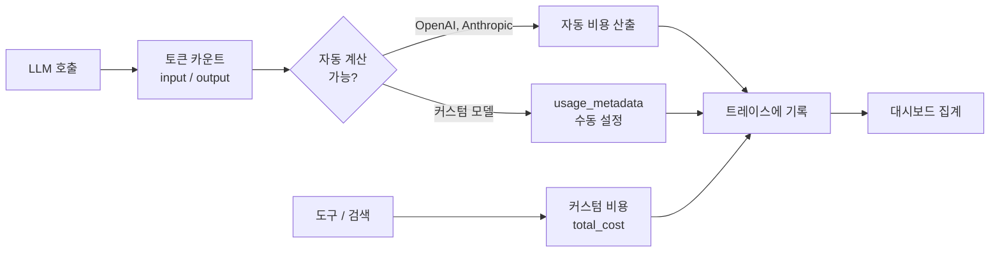
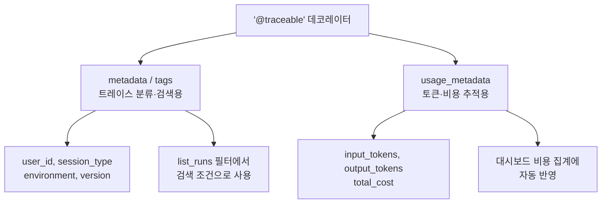
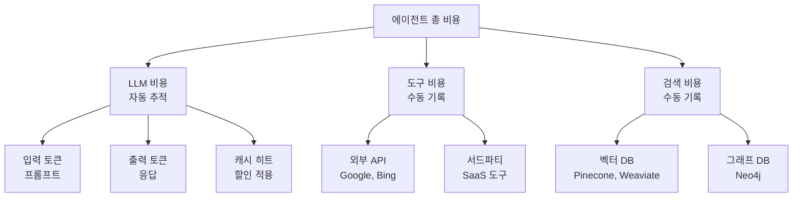
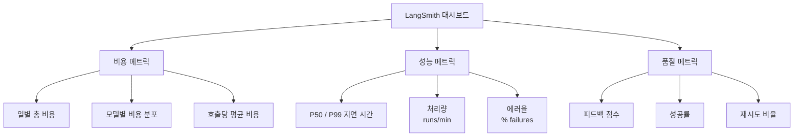
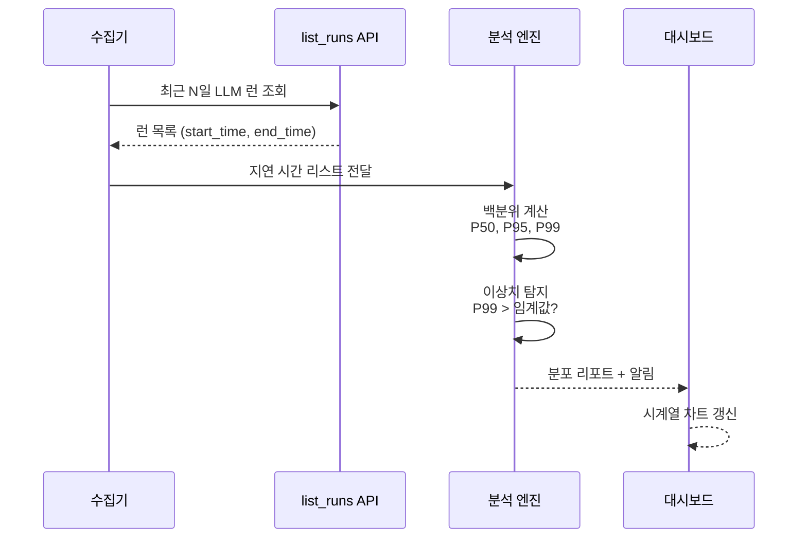
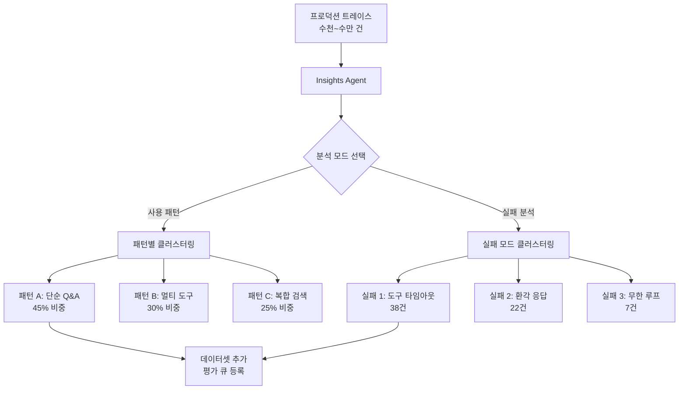

# 비용과 성능 모니터링

> LangSmith의 비용 추적과 성능 대시보드로 에이전트 운영 비용을 가시화하고, 지연 시간 분포를 분석하여 최적화 포인트를 찾는 방법을 학습합니다.

## 개요

이 섹션에서는 개별 트레이스 디버깅을 넘어, 에이전트 시스템 **전체**의 비용과 성능을 모니터링하는 방법을 배웁니다. 토큰 사용량이 곧 비용이 되는 LLM 시스템에서, 어디에 돈이 얼마나 들어가는지를 실시간으로 파악하는 것은 프로덕션 운영의 핵심이죠.

**선수 지식**: [LangSmith 트레이싱 설정](18-ch18-관찰가능성과-디버깅/01-01-langsmith-트레이싱-설정.md)에서 배운 `@traceable` 데코레이터와 메타데이터 태깅, [트레이스 분석과 디버깅](18-ch18-관찰가능성과-디버깅/02-02-트레이스-분석과-디버깅.md)에서 배운 `list_runs()` API와 필터 쿼리

**학습 목표**:
- LangSmith의 토큰 사용량 추적과 비용 계산 메커니즘을 이해할 수 있다
- `usage_metadata`를 활용하여 커스텀 비용 데이터를 제출할 수 있다
- 대시보드에서 비용·지연 시간 추세를 분석하고 이상을 탐지할 수 있다
- Insights Agent를 활용하여 사용 패턴과 실패 모드를 자동 분석할 수 있다

## 왜 알아야 할까?

"이번 달 에이전트 비용이 왜 갑자기 2배가 됐죠?"

프로덕션 환경에서 이 질문에 답하지 못하면 큰 문제입니다. LLM 기반 에이전트는 전통적인 소프트웨어와 달리, **호출할 때마다 토큰 단위로 과금**됩니다. ReAct 루프가 예상보다 많이 돌거나, 불필요한 컨텍스트가 프롬프트에 포함되면 비용이 기하급수적으로 증가하거든요.

실제로 많은 팀이 이런 경험을 합니다:
- 개발 환경에서는 호출당 $0.03이던 비용이, 프로덕션에서 평균 $0.15로 뛴다
- 특정 사용자 패턴이 에이전트를 10회 이상 루프시켜 비용 폭증을 유발한다
- P99 지연 시간이 30초를 넘기면서 사용자 이탈이 발생한다

비용과 성능 모니터링은 단순한 "관리"가 아니라, 에이전트 시스템의 **생존 전략**입니다. 어디에 돈이 새는지 보이면, 최적화할 수 있으니까요.

## 핵심 개념

### 개념 1: 토큰 비용 추적 체계

> 💡 **비유**: 식당을 운영한다고 생각해보세요. 식재료비(입력 토큰), 인건비(출력 토큰), 기타 부대비용(도구 호출)을 각각 추적해야 전체 원가를 알 수 있죠. LangSmith의 비용 추적은 바로 이 **원가 분석 시스템**입니다. 각 요리(트레이스)마다 재료비가 얼마 들었는지 자동으로 기록해줍니다.

LangSmith는 LLM 호출의 토큰 사용량과 비용을 세 가지 카테고리로 자동 추적합니다:

| 카테고리 | 설명 | 예시 |
|----------|------|------|
| **Input** | 프롬프트 토큰 (캐시 히트, 텍스트, 이미지 등) | 시스템 프롬프트, 대화 이력, 도구 설명 |
| **Output** | 응답 토큰 (추론, 텍스트, 이미지 등) | LLM 생성 텍스트, 도구 호출 JSON |
| **Other** | 도구 호출, 검색 단계, 커스텀 런 | API 호출 비용, 벡터 DB 쿼리 비용 |

> 📊 **그림 1**: LangSmith 비용 추적 흐름



자동 비용 추적은 LangChain이나 `@traceable`로 OpenAI/Anthropic 모델을 호출할 때 별도 설정 없이 작동합니다. 모델 응답에 포함된 `usage` 필드에서 토큰 수를 읽고, LangSmith의 모델 가격표와 대조하여 비용을 계산하죠.

핵심은 `usage_metadata`입니다. 이 딕셔너리를 통해 토큰 수와 비용 정보를 세밀하게 제어할 수 있는데요, 18.1에서 배운 `metadata`/`tags`는 트레이스를 분류·검색하기 위한 사용자 정의 레이블(예: `{"user_id": "123", "session_type": "support"}`)이었다면, 여기서 다루는 `usage_metadata`는 **토큰 사용량과 비용 전용 필드**입니다. 목적이 완전히 다르죠 — `metadata`는 "어떤 트레이스인가?", `usage_metadata`는 "얼마나 들었는가?"에 대한 답입니다.

> 📊 **그림 2**: metadata vs usage_metadata 구분



```python
from langsmith import traceable, get_current_run_tree

@traceable(
    run_type="llm",
    metadata={
        "ls_provider": "anthropic",      # 제공자 이름
        "ls_model_name": "claude-sonnet-4-6"  # 모델 이름
    }
)
def call_llm(messages: list[dict]) -> dict:
    """LLM 호출 — 자동 비용 추적이 동작하는 예제"""
    # 실제 API 호출 로직
    result = {"role": "assistant", "content": "응답 내용"}

    # usage_metadata로 토큰 사용량 명시 (커스텀 모델용)
    # 주의: 이것은 트레이스 분류용 metadata와 다른 필드입니다
    run = get_current_run_tree()
    run.set(usage_metadata={
        "input_tokens": 1250,
        "output_tokens": 340,
        "total_tokens": 1590,
        # 세부 분류도 가능
        "input_token_details": {
            "cache_read": 800,   # 캐시에서 읽은 토큰
            "text": 450          # 실제 텍스트 토큰
        },
        "output_token_details": {
            "reasoning": 120,    # 추론 토큰 (o1 등)
            "text": 220          # 텍스트 토큰
        }
    })
    return result
```

> ⚠️ **흔한 오해**: "토큰 수만 알면 비용을 계산할 수 있다"고 생각하기 쉽지만, 실제로는 캐시 히트 토큰(할인), 추론 토큰(추가 과금), 이미지 토큰(별도 가격) 등 토큰 타입마다 단가가 다릅니다. LangSmith는 이를 "most-to-least specific" 방식으로 계산합니다 — 세부 토큰 타입 비용을 먼저 계산하고, 나머지에 기본 단가를 적용하죠.

### 개념 2: 비LLM 비용 — 도구와 검색의 커스텀 비용

> 💡 **비유**: 식당 원가에 식재료비만 있는 게 아닙니다. 배달비, 포장비, 전기세도 있죠. 에이전트도 마찬가지입니다. LLM 호출비 외에 외부 API 호출비, 벡터 DB 쿼리비, 서드파티 서비스비 등 "보이지 않는 비용"이 있습니다.

LLM 호출이 아닌 도구나 검색 단계에도 비용이 발생할 수 있습니다. 예를 들어, Google Maps API 호출, Pinecone 벡터 검색, 웹 스크래핑 서비스 등은 각각 별도 과금 체계를 가지고 있죠. LangSmith에서는 이런 비용을 `total_cost` 필드로 직접 제출할 수 있습니다:

```python
from langsmith import traceable, get_current_run_tree

@traceable(run_type="tool", name="google_maps_search")
def search_nearby_restaurants(location: str, radius_km: float) -> list[dict]:
    """Google Maps API로 주변 식당 검색 — 호출당 $0.005"""
    # 실제 API 호출
    results = [
        {"name": "맛있는 식당", "rating": 4.5, "distance": "300m"},
        {"name": "좋은 카페", "rating": 4.2, "distance": "500m"},
    ]

    # 도구 비용을 직접 기록 (usage_metadata의 total_cost 필드)
    run = get_current_run_tree()
    run.set(usage_metadata={
        "total_cost": 0.005  # 달러 단위
    })
    return results


@traceable(run_type="retriever", name="vector_search")
def search_documents(query: str, top_k: int = 5) -> list[dict]:
    """벡터 DB 검색 — 쿼리당 비용 기록"""
    docs = [{"content": "검색 결과...", "score": 0.92}]

    run = get_current_run_tree()
    run.set(usage_metadata={
        "total_cost": 0.0002  # Pinecone 쿼리 비용
    })
    return docs
```

> 📊 **그림 3**: 에이전트 비용 구성 요소



이렇게 하면 트레이스 트리에서 LLM 비용뿐 아니라 도구·검색 비용까지 한눈에 볼 수 있습니다. "이 에이전트가 한 번 실행될 때 총 얼마가 드는가?"라는 질문에 정확하게 답할 수 있게 되는 거죠.

### 개념 3: 모델 가격표 설정

> 💡 **비유**: 마트에서 바코드를 찍으면 자동으로 가격이 뜨듯이, LangSmith도 모델 이름을 보고 자동으로 토큰 단가를 매핑합니다. 하지만 자체 파인튜닝 모델이나 새로 출시된 모델은 바코드가 없는 상품 같아서, 직접 가격표에 등록해야 합니다.

LangSmith는 `smith.langchain.com/settings/workspaces/models`에서 모델별 가격을 관리합니다. OpenAI, Anthropic, Google 등 주요 제공자의 가격은 이미 등록되어 있지만, 커스텀 모델이나 자체 호스팅 모델은 직접 등록해야 합니다.

```python
# 커스텀 모니터링 헬퍼 (LangSmith SDK 타입 아님)
# — 프로그래밍 방식으로 비용을 추정하기 위한 사용자 정의 유틸리티
MODEL_PRICES = {
    "gpt-4o": {
        "input_per_1m": 2.50,    # $2.50 / 1M input tokens
        "output_per_1m": 10.00,  # $10.00 / 1M output tokens
        "cache_read_per_1m": 1.25,  # 캐시 히트 할인
    },
    "claude-sonnet-4-6": {
        "input_per_1m": 3.00,
        "output_per_1m": 15.00,
        "cache_read_per_1m": 0.30,
    },
    "claude-haiku-4-5": {
        "input_per_1m": 0.80,
        "output_per_1m": 4.00,
    },
}


def estimate_cost(
    model: str,
    input_tokens: int,
    output_tokens: int,
    cache_read_tokens: int = 0
) -> float:
    """토큰 수로 비용을 추정하는 유틸리티 함수"""
    prices = MODEL_PRICES.get(model, {})
    if not prices:
        return 0.0

    input_cost = (input_tokens - cache_read_tokens) * prices["input_per_1m"] / 1_000_000
    output_cost = output_tokens * prices["output_per_1m"] / 1_000_000
    cache_cost = cache_read_tokens * prices.get("cache_read_per_1m", prices["input_per_1m"]) / 1_000_000

    return input_cost + output_cost + cache_cost
```

> 🔥 **실무 팁**: 모델 가격표를 업데이트해도 **기존 트레이스에는 소급 적용되지 않습니다**. 가격 변경이 있을 때는 `activation_date`를 설정하여 "이 날짜 이후의 트레이스부터 새 가격 적용"을 명시하세요. 그래야 월간 비용 리포트에서 왜곡이 생기지 않습니다.

### 개념 4: 대시보드와 성능 메트릭

> 💡 **비유**: 자동차 대시보드를 생각해보세요. 속도계(지연 시간), 연료계(비용), 엔진 온도(에러율)가 한눈에 보이죠. LangSmith 대시보드도 에이전트 시스템의 "계기판" 역할을 합니다.

LangSmith의 대시보드는 세 가지 뷰를 제공합니다:

1. **트레이스 트리**: 단일 트레이스의 상세 비용 분해
2. **프로젝트 통계**: 프로젝트 단위의 집계 비용
3. **커스텀 대시보드**: 시간대별 추세, P50/P99 지연 시간, 에러율

> 📊 **그림 4**: 대시보드 메트릭 구조



프로그래밍 방식으로 이 메트릭을 수집하고 분석하는 것도 가능합니다. 앞서 배운 `list_runs()` API를 활용하면 됩니다:

```python
from langsmith import Client
from datetime import datetime, timedelta
from collections import defaultdict

client = Client()

def get_daily_cost_report(
    project_name: str,
    days: int = 7
) -> dict:
    """최근 N일간 일별 비용 리포트를 생성"""
    since = datetime.now() - timedelta(days=days)

    # LLM 런만 필터링
    runs = client.list_runs(
        project_name=project_name,
        run_type="llm",
        filter=f'gte(start_time, "{since.isoformat()}")',
        select=["total_tokens", "prompt_tokens", "completion_tokens",
                "total_cost", "start_time", "end_time", "name"],
    )

    daily_stats = defaultdict(lambda: {
        "total_cost": 0.0,
        "total_tokens": 0,
        "run_count": 0,
        "total_latency_ms": 0,
    })

    for run in runs:
        day = run.start_time.strftime("%Y-%m-%d")
        stats = daily_stats[day]
        stats["total_cost"] += getattr(run, "total_cost", 0) or 0
        stats["total_tokens"] += getattr(run, "total_tokens", 0) or 0
        stats["run_count"] += 1

        if run.end_time and run.start_time:
            latency = (run.end_time - run.start_time).total_seconds() * 1000
            stats["total_latency_ms"] += latency

    # 평균 계산
    report = {}
    for day, stats in sorted(daily_stats.items()):
        report[day] = {
            "total_cost": round(stats["total_cost"], 4),
            "total_tokens": stats["total_tokens"],
            "run_count": stats["run_count"],
            "avg_cost_per_run": round(
                stats["total_cost"] / max(stats["run_count"], 1), 6
            ),
            "avg_latency_ms": round(
                stats["total_latency_ms"] / max(stats["run_count"], 1), 1
            ),
        }
    return report
```

```run:python
# 리포트 출력 예시 (시뮬레이션)
report = {
    "2026-03-18": {"total_cost": 12.45, "total_tokens": 2_150_000, "run_count": 850, "avg_cost_per_run": 0.0146, "avg_latency_ms": 1230.5},
    "2026-03-19": {"total_cost": 15.72, "total_tokens": 2_780_000, "run_count": 1120, "avg_cost_per_run": 0.0140, "avg_latency_ms": 1180.2},
    "2026-03-20": {"total_cost": 28.91, "total_tokens": 4_500_000, "run_count": 1050, "avg_cost_per_run": 0.0275, "avg_latency_ms": 2340.8},
}

print("=" * 65)
print(f"{'날짜':<14} {'비용($)':<10} {'토큰':<12} {'호출수':<8} {'호출당$':<10} {'지연(ms)'}")
print("-" * 65)
for day, stats in report.items():
    print(f"{day:<14} ${stats['total_cost']:<9.2f} {stats['total_tokens']:>10,}  {stats['run_count']:<8} ${stats['avg_cost_per_run']:<9.4f} {stats['avg_latency_ms']:>7.1f}")
print("=" * 65)
print(f"\n⚠️  3/20 비용 급증 감지: 전일 대비 +84% (${28.91 - 15.72:.2f})")
print(f"⚠️  3/20 지연 급증 감지: 전일 대비 +98% ({2340.8 - 1180.2:.1f}ms)")
```

```output
=================================================================
날짜           비용($)    토큰         호출수   호출당$     지연(ms)
-----------------------------------------------------------------
2026-03-18     $12.45     2,150,000  850      $0.0146    1230.5
2026-03-19     $15.72     2,780,000  1120     $0.0140    1180.2
2026-03-20     $28.91     4,500,000  1050     $0.0275    2340.8
=================================================================

⚠️  3/20 비용 급증 감지: 전일 대비 +84% ($13.19)
⚠️  3/20 지연 급증 감지: 전일 대비 +98% (1160.6ms)
```

3/20의 데이터를 보면, 호출 수는 오히려 줄었는데 비용과 지연 시간이 거의 2배가 되었습니다. 이런 패턴은 "호출당 입력 토큰이 갑자기 늘었다"는 신호입니다 — 불필요한 컨텍스트가 프롬프트에 추가되었거나, ReAct 루프가 과도하게 돌아간 것일 수 있죠.

### 개념 5: 지연 시간 분포 분석

> 💡 **비유**: 놀이공원에서 평균 대기 시간이 10분이라고 해도, 어떤 사람은 3분 만에 탑승하고 어떤 사람은 40분을 기다립니다. "평균"만 보면 문제를 놓칩니다. P50(절반이 이 시간 안에 완료), P95(95%가 이 시간 안에 완료), P99(최악의 1% 경험)를 함께 봐야 실제 사용자 경험을 알 수 있습니다.

지연 시간 분석에서 가장 중요한 것은 **분포**입니다. 평균만 보면 꼬리 쪽(tail)의 심각한 지연을 놓칠 수 있거든요.

> 📊 **그림 5**: 지연 시간 백분위 분석 흐름



```python
import statistics
from datetime import datetime, timedelta
from collections import defaultdict
from langsmith import Client

client = Client()

def analyze_latency_distribution(
    project_name: str,
    days: int = 7,
    run_type: str = "llm"
) -> dict:
    """지연 시간 백분위 분석"""
    since = datetime.now() - timedelta(days=days)

    runs = client.list_runs(
        project_name=project_name,
        run_type=run_type,
        filter=f'gte(start_time, "{since.isoformat()}")',
        select=["start_time", "end_time", "name", "status"],
    )

    latencies = []
    model_latencies = defaultdict(list)
    error_count = 0

    for run in runs:
        if run.end_time and run.start_time:
            latency_ms = (run.end_time - run.start_time).total_seconds() * 1000
            latencies.append(latency_ms)
            model_latencies[run.name].append(latency_ms)
        if run.status == "error":
            error_count += 1

    if not latencies:
        return {"error": "데이터 없음"}

    latencies.sort()
    n = len(latencies)

    return {
        "total_runs": n,
        "error_rate": round(error_count / n * 100, 2),
        "p50": round(latencies[int(n * 0.50)], 1),
        "p95": round(latencies[int(n * 0.95)], 1),
        "p99": round(latencies[int(n * 0.99)], 1),
        "mean": round(statistics.mean(latencies), 1),
        "stdev": round(statistics.stdev(latencies), 1) if n > 1 else 0,
        "by_model": {
            model: {
                "count": len(lats),
                "p50": round(sorted(lats)[len(lats) // 2], 1),
                "p99": round(sorted(lats)[int(len(lats) * 0.99)], 1),
            }
            for model, lats in model_latencies.items()
            if len(lats) >= 10  # 의미 있는 샘플 수
        }
    }
```

```run:python
# 분석 결과 시뮬레이션
result = {
    "total_runs": 3020,
    "error_rate": 2.15,
    "p50": 980.3, "p95": 3200.7, "p99": 8540.2,
    "mean": 1450.6, "stdev": 1820.3,
    "by_model": {
        "gpt-4o": {"count": 1800, "p50": 1120.5, "p99": 9200.1},
        "claude-haiku-4-5": {"count": 1220, "p50": 650.2, "p99": 2100.8},
    }
}

print(f"총 {result['total_runs']:,}회 호출 | 에러율 {result['error_rate']}%\n")
print(f"  P50: {result['p50']:>8.1f}ms  (절반은 이 안에 완료)")
print(f"  P95: {result['p95']:>8.1f}ms  (95%가 이 안에 완료)")
print(f"  P99: {result['p99']:>8.1f}ms  (최악 1%의 경험)")
print(f"  평균: {result['mean']:>7.1f}ms ± {result['stdev']:.1f}ms\n")

print("모델별 비교:")
for model, stats in result["by_model"].items():
    ratio = stats["p99"] / stats["p50"]
    print(f"  {model:<25} P50={stats['p50']:>7.1f}ms  P99={stats['p99']:>7.1f}ms  (P99/P50={ratio:.1f}x)")
```

```output
총 3,020회 호출 | 에러율 2.15%

  P50:    980.3ms  (절반은 이 안에 완료)
  P95:   3200.7ms  (95%가 이 안에 완료)
  P99:   8540.2ms  (최악 1%의 경험)
  평균:  1450.6ms ± 1820.3ms

모델별 비교:
  gpt-4o                    P50= 1120.5ms  P99= 9200.1ms  (P99/P50=8.2x)
  claude-haiku-4-5          P50=  650.2ms  P99= 2100.8ms  (P99/P50=3.2x)
```

GPT-4o의 P99/P50 비율이 8.2배나 됩니다. 이는 꼬리 쪽 지연이 매우 심하다는 뜻이에요. 반면 Claude Haiku는 3.2배로 상대적으로 안정적이죠. 이런 차이는 모델 선택, 프롬프트 최적화, 타임아웃 설정에 중요한 판단 근거가 됩니다.

### 개념 6: Insights Agent — AI가 분석하는 패턴과 실패 모드

> 💡 **비유**: 대형 마트의 CCTV를 24시간 지켜보면서 고객 동선을 분석하는 일을 상상해보세요. 사람이 하면 며칠이 걸리지만, AI가 하면 몇 분이면 됩니다. Insights Agent는 바로 그런 역할입니다 — 수천 개의 트레이스를 자동으로 분석해서 "사용자들이 주로 이런 패턴으로 에이전트를 사용하고, 이런 상황에서 실패한다"는 인사이트를 제공합니다.

LangSmith의 **Insights Agent**는 프로덕션 트레이스를 자동으로 분석하여 사용 패턴과 실패 모드를 발견합니다. Plus 및 Enterprise 플랜에서 사용할 수 있으며, 두 가지 핵심 그룹핑 모드를 제공합니다:

| 모드 | 설명 | 활용 |
|------|------|------|
| **Group by usage patterns** | 공통 사용 패턴으로 클러스터링 | 사용자가 실제로 에이전트를 어떻게 쓰는지 파악 |
| **Group by poor interactions** | 에이전트의 실패 패턴으로 클러스터링 | 어떤 상황에서 에이전트가 실패하는지 진단 |

> 📊 **그림 6**: Insights Agent 분석 워크플로우



Insights Agent의 분석 결과에서 특정 카테고리를 선택하면, 해당 패턴에 속하는 트레이스들의 지연 시간, 실행 횟수, 평가 점수를 세부적으로 확인할 수 있습니다. 문제가 되는 트레이스를 바로 데이터셋에 추가하거나 어노테이션 큐에 등록해서, [LangSmith 데이터셋과 오프라인 평가](17-ch17-에이전트-평가와-langsmith/02-02-langsmith-데이터셋과-오프라인-평가.md)에서 배운 평가 파이프라인으로 연결할 수도 있습니다.

분석은 데이터 양에 따라 최대 15분까지 소요될 수 있고, 설정을 저장하여 반복 사용이 가능합니다.

## 실습: 직접 해보기

종합적인 비용·성능 모니터링 시스템을 구축해봅시다. 실제 프로덕션에서 사용할 수 있는 수준의 모니터링 리포터를 만들겠습니다.

```python
"""
비용·성능 모니터링 시스템 — LangSmith 기반
커스텀 모니터링 헬퍼 (LangSmith SDK 타입 아님)

아래의 CostBreakdown, LatencyStats, AnomalyAlert, AgentMonitor는
LangSmith SDK에 포함된 클래스가 아니라, 이 실습에서 직접 정의하는
사용자 정의 헬퍼 클래스입니다. LangSmith Client API 위에 구축한
모니터링 래퍼로 이해하시면 됩니다.

환경 변수:
  LANGSMITH_API_KEY=your_key
  LANGSMITH_TRACING=true
"""

from __future__ import annotations

import statistics
from collections import defaultdict
from dataclasses import dataclass, field
from datetime import datetime, timedelta
from typing import Any

from langsmith import Client


# --- 데이터 모델 (커스텀 헬퍼 — LangSmith SDK 타입 아님) ---

@dataclass
class CostBreakdown:
    """비용 분해 리포트 — 사용자 정의 데이터 클래스"""
    total_cost: float = 0.0
    llm_cost: float = 0.0
    tool_cost: float = 0.0
    retriever_cost: float = 0.0
    by_model: dict[str, float] = field(default_factory=dict)

    @property
    def non_llm_ratio(self) -> float:
        """비LLM 비용 비율"""
        if self.total_cost == 0:
            return 0.0
        return (self.tool_cost + self.retriever_cost) / self.total_cost


@dataclass
class LatencyStats:
    """지연 시간 통계 — 사용자 정의 데이터 클래스"""
    p50: float = 0.0
    p95: float = 0.0
    p99: float = 0.0
    mean: float = 0.0
    count: int = 0


@dataclass
class AnomalyAlert:
    """이상 탐지 알림 — 사용자 정의 데이터 클래스"""
    metric: str
    current_value: float
    baseline_value: float
    change_pct: float
    severity: str  # "warning" | "critical"
    message: str


# --- 모니터링 엔진 (커스텀 헬퍼 — LangSmith SDK 타입 아님) ---

class AgentMonitor:
    """LangSmith Client API 위에 구축한 사용자 정의 모니터링 래퍼"""

    # 이상 탐지 임계값
    WARNING_THRESHOLD = 0.5   # 50% 증가 → warning
    CRITICAL_THRESHOLD = 1.0  # 100% 증가 → critical

    def __init__(self, project_name: str):
        self.client = Client()
        self.project_name = project_name

    def get_cost_breakdown(self, days: int = 1) -> CostBreakdown:
        """기간별 비용 분해"""
        since = datetime.now() - timedelta(days=days)
        breakdown = CostBreakdown()

        for run_type in ("llm", "tool", "retriever"):
            runs = self.client.list_runs(
                project_name=self.project_name,
                run_type=run_type,
                filter=f'gte(start_time, "{since.isoformat()}")',
                select=["total_cost", "name"],
            )

            for run in runs:
                cost = getattr(run, "total_cost", 0) or 0
                breakdown.total_cost += cost

                if run_type == "llm":
                    breakdown.llm_cost += cost
                    model_name = run.name or "unknown"
                    breakdown.by_model[model_name] = (
                        breakdown.by_model.get(model_name, 0) + cost
                    )
                elif run_type == "tool":
                    breakdown.tool_cost += cost
                elif run_type == "retriever":
                    breakdown.retriever_cost += cost

        return breakdown

    def get_latency_stats(
        self, days: int = 1, run_type: str = "chain"
    ) -> LatencyStats:
        """지연 시간 백분위 통계"""
        since = datetime.now() - timedelta(days=days)
        runs = self.client.list_runs(
            project_name=self.project_name,
            run_type=run_type,
            filter=f'and(gte(start_time, "{since.isoformat()}"), eq(is_root, true))',
            select=["start_time", "end_time"],
        )

        latencies = []
        for run in runs:
            if run.end_time and run.start_time:
                ms = (run.end_time - run.start_time).total_seconds() * 1000
                latencies.append(ms)

        if not latencies:
            return LatencyStats()

        latencies.sort()
        n = len(latencies)
        return LatencyStats(
            p50=round(latencies[int(n * 0.50)], 1),
            p95=round(latencies[int(n * 0.95)], 1),
            p99=round(latencies[min(int(n * 0.99), n - 1)], 1),
            mean=round(statistics.mean(latencies), 1),
            count=n,
        )

    def detect_anomalies(self) -> list[AnomalyAlert]:
        """오늘 vs 지난 7일 평균 비교로 이상 탐지"""
        alerts: list[AnomalyAlert] = []

        # 오늘 데이터
        today_cost = self.get_cost_breakdown(days=1)
        today_latency = self.get_latency_stats(days=1)

        # 지난 7일 평균 (기준선)
        week_cost = self.get_cost_breakdown(days=7)
        week_latency = self.get_latency_stats(days=7)

        # 일평균 기준선 계산
        baseline_daily_cost = week_cost.total_cost / 7
        baseline_p99 = week_latency.p99

        # 비용 이상 탐지
        if baseline_daily_cost > 0:
            cost_change = (today_cost.total_cost - baseline_daily_cost) / baseline_daily_cost
            if cost_change > self.CRITICAL_THRESHOLD:
                alerts.append(AnomalyAlert(
                    metric="daily_cost",
                    current_value=today_cost.total_cost,
                    baseline_value=baseline_daily_cost,
                    change_pct=cost_change * 100,
                    severity="critical",
                    message=f"일일 비용 ${today_cost.total_cost:.2f} "
                            f"(기준선 ${baseline_daily_cost:.2f} 대비 +{cost_change*100:.0f}%)"
                ))
            elif cost_change > self.WARNING_THRESHOLD:
                alerts.append(AnomalyAlert(
                    metric="daily_cost",
                    current_value=today_cost.total_cost,
                    baseline_value=baseline_daily_cost,
                    change_pct=cost_change * 100,
                    severity="warning",
                    message=f"일일 비용 증가 추세: ${today_cost.total_cost:.2f} "
                            f"(+{cost_change*100:.0f}%)"
                ))

        # 지연 시간 이상 탐지
        if baseline_p99 > 0:
            latency_change = (today_latency.p99 - baseline_p99) / baseline_p99
            if latency_change > self.WARNING_THRESHOLD:
                severity = "critical" if latency_change > self.CRITICAL_THRESHOLD else "warning"
                alerts.append(AnomalyAlert(
                    metric="p99_latency",
                    current_value=today_latency.p99,
                    baseline_value=baseline_p99,
                    change_pct=latency_change * 100,
                    severity=severity,
                    message=f"P99 지연 {today_latency.p99:.0f}ms "
                            f"(기준선 {baseline_p99:.0f}ms 대비 +{latency_change*100:.0f}%)"
                ))

        return alerts

    def generate_report(self) -> str:
        """종합 모니터링 리포트 생성"""
        cost = self.get_cost_breakdown(days=1)
        latency = self.get_latency_stats(days=1)
        alerts = self.detect_anomalies()

        lines = [
            f"=== 에이전트 모니터링 리포트 ({datetime.now():%Y-%m-%d %H:%M}) ===",
            "",
            f"📊 비용 요약 (오늘)",
            f"  총 비용: ${cost.total_cost:.4f}",
            f"  LLM: ${cost.llm_cost:.4f} | 도구: ${cost.tool_cost:.4f} | 검색: ${cost.retriever_cost:.4f}",
            f"  비LLM 비율: {cost.non_llm_ratio:.1%}",
        ]

        if cost.by_model:
            lines.append(f"  모델별:")
            for model, model_cost in sorted(cost.by_model.items(), key=lambda x: -x[1]):
                lines.append(f"    {model}: ${model_cost:.4f}")

        lines.extend([
            "",
            f"⏱️ 지연 시간 (오늘, {latency.count:,}회 호출)",
            f"  P50: {latency.p50:,.1f}ms | P95: {latency.p95:,.1f}ms | P99: {latency.p99:,.1f}ms",
        ])

        if alerts:
            lines.extend(["", "🚨 이상 탐지 알림"])
            for alert in alerts:
                icon = "🔴" if alert.severity == "critical" else "🟡"
                lines.append(f"  {icon} [{alert.severity.upper()}] {alert.message}")
        else:
            lines.extend(["", "✅ 이상 없음"])

        return "\n".join(lines)


# --- 실행 ---

if __name__ == "__main__":
    monitor = AgentMonitor("my-agent-project")
    print(monitor.generate_report())
```

```run:python
# 리포트 출력 시뮬레이션
report = """=== 에이전트 모니터링 리포트 (2026-03-20 14:30) ===

📊 비용 요약 (오늘)
  총 비용: $28.9100
  LLM: $27.4500 | 도구: $0.8200 | 검색: $0.6400
  비LLM 비율: 5.1%
  모델별:
    gpt-4o: $18.2300
    claude-haiku-4-5: $6.1200
    gpt-4o-mini: $3.1000

⏱️ 지연 시간 (오늘, 1,050회 호출)
  P50: 980.3ms | P95: 3,200.7ms | P99: 8,540.2ms

🚨 이상 탐지 알림
  🔴 [CRITICAL] 일일 비용 $28.91 (기준선 $14.06 대비 +106%)
  🟡 [WARNING] P99 지연 8540ms (기준선 5200ms 대비 +64%)"""

print(report)
```

```output
=== 에이전트 모니터링 리포트 (2026-03-20 14:30) ===

📊 비용 요약 (오늘)
  총 비용: $28.9100
  LLM: $27.4500 | 도구: $0.8200 | 검색: $0.6400
  비LLM 비율: 5.1%
  모델별:
    gpt-4o: $18.2300
    claude-haiku-4-5: $6.1200
    gpt-4o-mini: $3.1000

⏱️ 지연 시간 (오늘, 1,050회 호출)
  P50: 980.3ms | P95: 3,200.7ms | P99: 8,540.2ms

🚨 이상 탐지 알림
  🔴 [CRITICAL] 일일 비용 $28.91 (기준선 $14.06 대비 +106%)
  🟡 [WARNING] P99 지연 8540ms (기준선 5200ms 대비 +64%)
```

## 더 깊이 알아보기

### 관찰가능성의 기원 — 제어 이론에서 LLMOps까지

"관찰가능성(Observability)"이라는 용어는 원래 1960년대 헝가리 출신 수학자 **루돌프 칼만(Rudolf E. Kálmán)**이 제어 이론에서 처음 정의했습니다. 칼만은 "시스템의 외부 출력만 관찰해서 내부 상태를 완전히 추론할 수 있으면, 그 시스템은 관찰 가능하다"고 정의했죠.

이 개념이 소프트웨어 세계로 넘어온 것은 2010년대 후반입니다. Twitter의 엔지니어였던 **Charity Majors**가 분산 시스템의 디버깅 어려움을 해결하기 위해 "Three Pillars of Observability" — 메트릭(Metrics), 로그(Logs), 트레이스(Traces) — 라는 프레임워크를 대중화했습니다. 이 세 기둥은 Datadog, New Relic, Honeycomb 같은 도구로 구현되었죠.

그런데 LLM 시스템이 등장하면서 기존 관찰가능성 도구로는 부족한 영역이 생겼습니다. HTTP 응답 코드와 CPU 사용률만으로는 "LLM이 왜 엉뚱한 답을 했는지" 알 수 없으니까요. 여기서 LangSmith, Langfuse, Arize Phoenix 같은 **LLMOps 관찰가능성 도구**가 탄생했습니다. 이들은 프롬프트 내용, 토큰 사용량, 모델 출력 품질까지 추적하는, 말 그대로 "LLM에 특화된 관찰가능성"을 제공합니다.

### 비용 최적화의 80/20 법칙

프로덕션 에이전트 시스템을 분석해보면 재미있는 패턴이 반복됩니다: **전체 비용의 80%가 20%의 사용 패턴에서 발생한다**는 것이죠. 예를 들어, 대부분의 단순 질의는 Haiku급 모델로 충분한데, 모든 호출을 GPT-4o로 보내고 있다거나, 이미 캐시에 있는 답변을 매번 새로 생성하고 있다거나 하는 패턴입니다.

이런 발견이 바로 LangSmith Insights Agent가 하는 일입니다 — 수천 개의 트레이스를 클러스터링해서 "이 30%의 트래픽은 단순 Q&A인데 가장 비싼 모델을 쓰고 있다"는 식의 인사이트를 자동으로 제공합니다. [Adaptive RAG 아키텍처](13-ch13-adaptive-rag와-동적-라우팅/01-01-adaptive-rag-아키텍처.md)에서 배운 쿼리 라우팅과 결합하면, 쿼리 복잡도에 따라 모델을 자동 선택하여 비용을 50% 이상 줄일 수 있습니다.

## 흔한 오해와 팁

> ⚠️ **흔한 오해**: "토큰 비용만 관리하면 된다"고 생각하기 쉽지만, 에이전트 시스템에서는 도구 호출 비용(외부 API), 인프라 비용(서버, 벡터 DB), 그리고 **지연으로 인한 기회 비용**(사용자 이탈)까지 고려해야 합니다. LangSmith의 `usage_metadata`로 비LLM 비용을 추적하는 습관을 들이세요.

> 💡 **알고 계셨나요?**: LangSmith의 비용 계산은 "most-to-least specific" 방식입니다. 예를 들어 캐시 히트 토큰 500개와 일반 입력 토큰 300개가 있으면, 먼저 캐시 토큰에 할인된 단가를 적용하고, 나머지 300개에 기본 단가를 적용합니다. 이렇게 해야 Anthropic의 프롬프트 캐싱처럼 토큰 타입별 단가가 다른 모델에서 정확한 비용을 계산할 수 있죠.

> 🔥 **실무 팁**: 비용 모니터링을 처음 시작할 때는 "일일 비용 알림"부터 설정하세요. 전일 대비 50% 이상 증가 시 Slack으로 알림을 보내는 것만으로도 비용 폭증을 조기에 발견할 수 있습니다. 실습에서 만든 `detect_anomalies()` 함수를 cron job으로 돌리는 것이 가장 간단한 시작점입니다.

> 🔥 **실무 팁**: P99 지연 시간이 사용자 경험의 핵심 지표입니다. P99이 임계값(예: 10초)을 넘기면 타임아웃을 설정하고, 오래 걸리는 호출에는 스트리밍을 적용하세요. [스트리밍 응답 구현](20-ch20-fastapi-배포와-프로덕션-운영/02-02-스트리밍-응답-구현.md)에서 이 기법을 상세히 다룹니다.

## 핵심 정리

| 개념 | 설명 |
|------|------|
| `usage_metadata` | 토큰 수, 비용, 세부 분류를 런에 기록하는 메타데이터 딕셔너리 (트레이스 분류용 `metadata`와는 별개) |
| 자동 비용 추적 | OpenAI/Anthropic 등 주요 제공자의 토큰→비용 자동 환산 |
| 커스텀 비용 (`total_cost`) | 도구, 검색 등 비LLM 비용을 직접 기록하는 방식 |
| 모델 가격표 | `smith.langchain.com`에서 관리하는 모델별 토큰 단가 (소급 불가) |
| P50 / P95 / P99 | 지연 시간 백분위 — 평균보다 분포가 중요 |
| 이상 탐지 | 기준선(과거 N일 평균) 대비 현재 메트릭의 변화율로 경보 |
| Insights Agent | 트레이스를 자동 클러스터링하여 사용 패턴/실패 모드 분석 (Plus/Enterprise) |
| 비용 분해 | LLM + 도구 + 검색 비용을 분리하여 최적화 포인트 식별 |

## 다음 섹션 미리보기

개별 메트릭과 비용 분석을 넘어, 프로덕션 환경 전체의 **관찰가능성 전략**을 설계하는 방법을 다룹니다. [프로덕션 모니터링 전략](18-ch18-관찰가능성과-디버깅/04-04-프로덕션-모니터링-전략.md)에서는 온라인 평가(online evaluation), 알림 파이프라인 구축, 그리고 OpenTelemetry와의 통합을 통해 기존 인프라 모니터링과 LLM 관찰가능성을 하나로 연결하는 아키텍처를 설계합니다.

## 참고 자료

- [LangSmith Observability Platform](https://www.langchain.com/langsmith/observability) - LangSmith 관찰가능성 기능의 공식 소개 페이지
- [LangSmith Cost Tracking Documentation](https://docs.langchain.com/langsmith/cost-tracking) - 비용 추적 설정, usage_metadata 스키마, 모델 가격표 관리에 대한 공식 문서
- [Unified Cost Tracking for LLMs, Tools, Retrieval — LangChain Changelog](https://changelog.langchain.com/announcements/unified-cost-tracking-for-llms-tools-retrieval) - 통합 비용 추적 기능 출시 공지와 상세 스펙
- [Insights Agent and Multi-turn Evals — LangChain Blog](https://blog.langchain.com/insights-agent-multiturn-evals-langsmith/) - Insights Agent의 기능, 설정 방법, 활용 사례 소개
- [LangSmith Python SDK Reference](https://reference.langchain.com/python/langsmith/observability/sdk/client/) - `Client`, `list_runs`, `create_feedback` 등 Python SDK API 레퍼런스

---
### 🔗 Related Sessions
- [langsmith_tracing](18-ch18-관찰가능성과-디버깅/01-01-langsmith-트레이싱-설정.md) (prerequisite)
- [@traceable](18-ch18-관찰가능성과-디버깅/01-01-langsmith-트레이싱-설정.md) (prerequisite)
- [get_current_run_tree](18-ch18-관찰가능성과-디버깅/01-01-langsmith-트레이싱-설정.md) (prerequisite)
- [list_runs](18-ch18-관찰가능성과-디버깅/02-02-트레이스-분석과-디버깅.md) (prerequisite)
- [filter query language](18-ch18-관찰가능성과-디버깅/02-02-트레이스-분석과-디버깅.md) (prerequisite)
