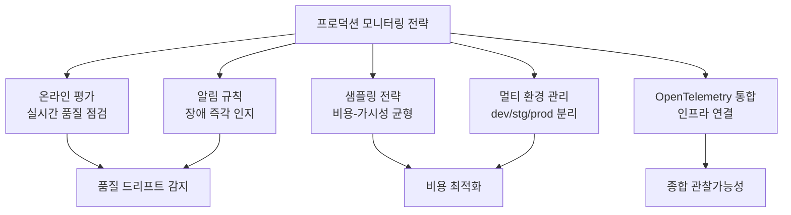
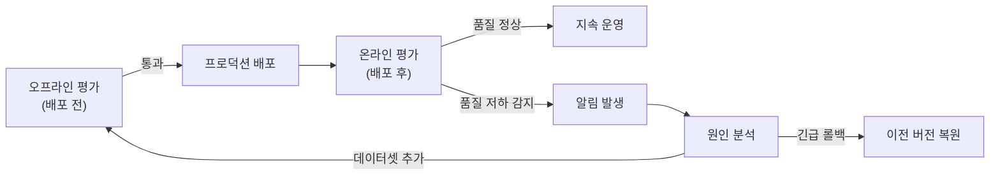
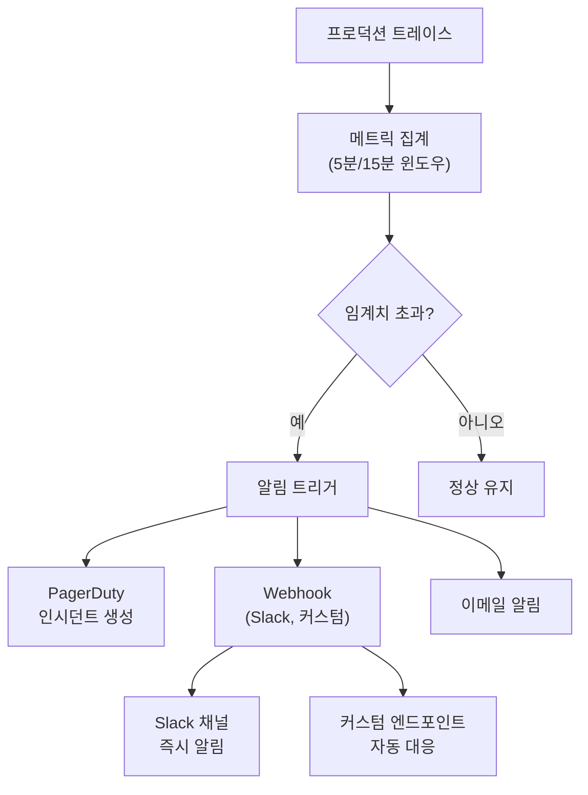
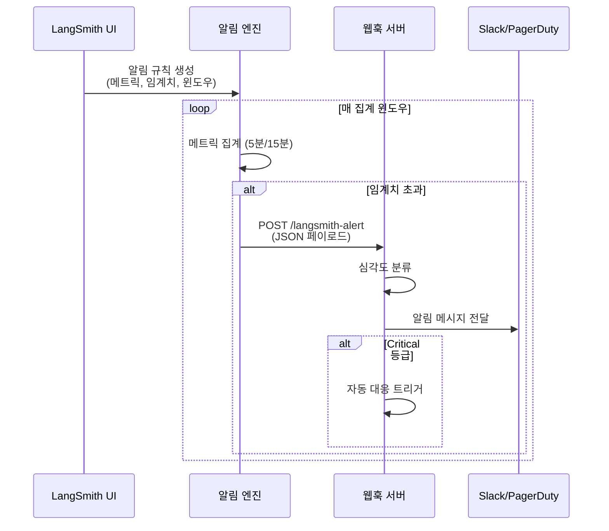
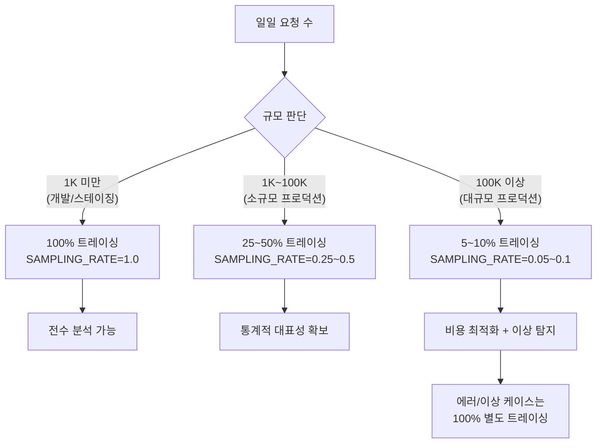
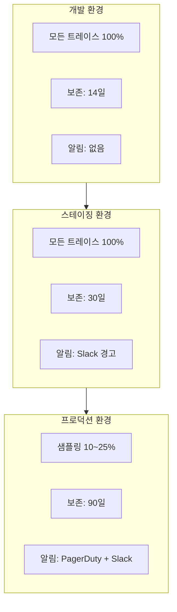
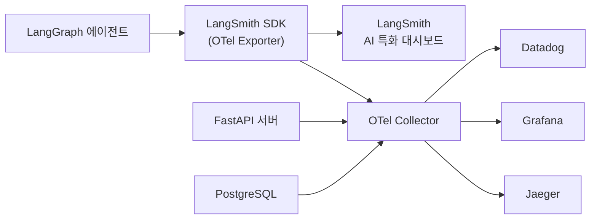

# 프로덕션 모니터링 전략

> 온라인 평가, 알림, 샘플링, 로그 보존, OpenTelemetry 통합으로 에이전트의 프로덕션 관찰가능성 아키텍처를 완성한다

## 개요

이 섹션에서는 개발 환경의 디버깅을 넘어, **프로덕션 트래픽을 실시간으로 평가하고 이상 징후를 즉각 알림으로 받는** 종합적인 모니터링 전략을 설계합니다. 앞서 [LangSmith 트레이싱 설정](18-ch18-관찰가능성과-디버깅/01-01-langsmith-트레이싱-설정.md)에서 트레이싱 기반을 세우고, [트레이스 분석과 디버깅](18-ch18-관찰가능성과-디버깅/02-02-트레이스-분석과-디버깅.md)에서 사후 분석을, [비용과 성능 모니터링](18-ch18-관찰가능성과-디버깅/03-03-비용과-성능-모니터링.md)에서 비용·지연 추적을 배웠습니다. 이번 섹션에서는 이 모든 것을 **프로덕션 등급 관찰가능성 아키텍처**로 통합합니다.

**선수 지식**: LangSmith 트레이싱 설정, 트레이스 분석·디버깅, 비용·성능 모니터링(Ch18.1~18.3)
**학습 목표**:
- 온라인 평가 규칙을 설정하여 프로덕션 트래픽의 품질 드리프트를 실시간으로 감지할 수 있다
- 알림 규칙과 웹훅을 구성하여 장애를 즉각 인지할 수 있다
- 샘플링 전략으로 비용과 가시성의 균형을 잡을 수 있다
- OpenTelemetry 통합으로 기존 인프라와 연결된 종합 관찰가능성을 구축할 수 있다

## 왜 알아야 할까?

개발 환경에서 에이전트가 완벽하게 작동하더라도, 프로덕션에 배포하면 상황이 달라집니다. 사용자 입력은 예측 불가능하고, LLM 공급자의 모델 업데이트가 출력 품질을 미묘하게 바꾸며, 트래픽이 급증하면 비용이 기하급수적으로 늘어납니다. **"우리 에이전트가 프로덕션에서 잘 작동하고 있는가?"**라는 질문에 자신 있게 답하려면, 체계적인 모니터링 전략이 필수입니다.

구글의 사이트 신뢰성 엔지니어링(SRE) 원칙에 따르면, **"측정할 수 없으면 개선할 수 없다"**고 합니다. AI 에이전트 시스템에서도 마찬가지인데요—단순한 HTTP 상태 코드 모니터링으로는 "LLM이 환각(hallucination)을 일으키고 있다"거나 "도구 호출 정확도가 떨어졌다" 같은 **AI 특유의 품질 저하**를 잡아낼 수 없습니다. 온라인 평가와 AI-특화 알림이 필요한 이유가 바로 여기에 있습니다.

> 📊 **그림 0**: 프로덕션 모니터링 전략의 전체 구성



## 핵심 개념

### 개념 1: 온라인 평가 — 프로덕션 트래픽의 실시간 품질 점검

> 💡 **비유**: 공장의 품질 검사 라인을 떠올려 보세요. 완제품이 나올 때마다 100% 전수검사를 할 수도 있고, 일정 비율만 샘플링해서 검사할 수도 있죠. 온라인 평가는 바로 이 **프로덕션 품질 검사 라인**입니다. 에이전트가 실제 사용자에게 응답할 때마다 자동으로 품질을 점수화하여, 문제가 생기면 바로 알 수 있게 해줍니다.

**오프라인 평가 vs. 온라인 평가**의 차이를 이해하는 것이 중요합니다. [에이전트 평가 전략](17-ch17-에이전트-평가와-langsmith/01-01-에이전트-평가-전략.md)에서 다룬 오프라인 평가는 **배포 전** 큐레이션된 데이터셋으로 테스트하는 "단위 테스트"에 해당합니다. 반면 온라인 평가는 **배포 후** 실제 프로덕션 트래픽을 대상으로 실시간 품질을 측정하는 "프로덕션 헬스 체크"입니다.

> 📊 **그림 1**: 오프라인 평가와 온라인 평가의 관계



LangSmith의 온라인 평가는 네 가지 유형의 자동 평가자를 지원합니다:

| 평가 유형 | 설명 | 예시 | 비용 수준 |
|-----------|------|------|-----------|
| **안전성 검사** | 유해 콘텐츠 탐지 | PII 노출, 부적절 표현 | 낮음 (규칙 기반) |
| **포맷 검증** | 출력 구조 확인 | JSON 파싱 가능 여부, 필수 필드 존재 | 낮음 (규칙 기반) |
| **품질 휴리스틱** | 규칙 기반 점수 | 응답 길이, 키워드 포함 여부, 거부 패턴 | 낮음 (규칙 기반) |
| **LLM-as-Judge** | AI가 품질 평가 | 관련성, 정확성, 유용성 점수 | 높음 (LLM 호출) |

온라인 평가의 핵심은 **필터와 샘플링 비율**을 설정하여 비용을 제어하면서도 품질 드리프트를 잡아내는 것입니다. 모든 트래픽을 평가하면 비용이 폭발하고, 너무 적게 평가하면 문제를 놓칩니다. 특히 LLM-as-Judge 유형은 평가 자체에 LLM 호출 비용이 발생하므로, 트래픽의 5~20%만 평가하면서도 통계적으로 유의미한 품질 추세를 파악하는 전략이 중요합니다.

```python
from langsmith import Client
from langsmith.evaluation import evaluate

client = Client()

# --- 온라인 평가용 커스텀 평가자 정의 ---
def safety_evaluator(run, example=None):
    """프로덕션 응답의 안전성 검사"""
    output = run.outputs.get("output", "")
    
    # PII 패턴 탐지
    import re
    pii_patterns = [
        r'\b\d{3}-\d{2}-\d{4}\b',        # SSN
        r'\b\d{4}[\s-]?\d{4}[\s-]?\d{4}[\s-]?\d{4}\b',  # 카드 번호
        r'\b[A-Za-z0-9._%+-]+@[A-Za-z0-9.-]+\.[A-Z|a-z]{2,}\b',  # 이메일
    ]
    
    pii_found = any(re.search(p, output) for p in pii_patterns)
    
    return {
        "key": "pii_safety",
        "score": 0.0 if pii_found else 1.0,
        "comment": "PII detected in output" if pii_found else "No PII found"
    }


def format_evaluator(run, example=None):
    """출력 포맷 검증 (JSON 응답 기대 시)"""
    import json
    output = run.outputs.get("output", "")
    
    try:
        parsed = json.loads(output)
        has_required = all(
            k in parsed for k in ["answer", "sources"]
        )
        return {
            "key": "format_valid",
            "score": 1.0 if has_required else 0.5,
            "comment": "Valid format" if has_required else "Missing required fields"
        }
    except json.JSONDecodeError:
        return {
            "key": "format_valid",
            "score": 0.0,
            "comment": "Invalid JSON output"
        }
```

> ⚠️ **흔한 오해**: "온라인 평가를 걸면 응답 지연이 늘어나는 거 아닌가요?" — 아닙니다. LangSmith의 온라인 평가는 **비동기적으로** 실행됩니다. 에이전트가 사용자에게 응답을 반환한 후에 별도로 평가가 돌아가므로, 사용자 경험에는 영향을 주지 않습니다.

### 개념 2: 알림 규칙과 웹훅 — 문제를 즉각 인지하기

> 💡 **비유**: 집에 화재 경보기를 설치해 놓으면, 연기가 나는 순간 바로 알람이 울리죠. LangSmith 알림은 에이전트 시스템의 **화재 경보기**입니다. 에러율이 치솟거나, 평균 지연이 임계치를 넘거나, 품질 점수가 급락할 때 Slack이나 PagerDuty로 즉시 알려줍니다.

> 📊 **그림 2**: LangSmith 알림 아키텍처



LangSmith는 네 가지 핵심 메트릭에 대해 알림을 지원합니다:

| 메트릭 | 속성 | 활용 예시 | 권장 임계치 (초기) |
|--------|------|-----------|-------------------|
| **에러 수/비율** | `error_count` | 에러율 > 5% 시 PagerDuty 호출 | 베이스라인의 2배 |
| **평균 지연** | `latency` | P95 지연 > 10초 시 Slack 알림 | 베이스라인 P95의 1.5배 |
| **피드백 점수** | `feedback_score` | 평균 품질 < 0.7 시 품질 드리프트 경고 | 베이스라인 평균의 0.8배 |
| **실행 수** | `run_count` | 트래픽 급증(2x 이상) 시 비용 경보 | 베이스라인의 2배 |

알림 규칙 설정에서 핵심적인 두 가지 요소는 **집계 윈도우**(5분 또는 15분)와 **필터**입니다. 필터를 통해 특정 모델, 도구 호출, 실행 타입에 대해서만 알림을 받을 수 있습니다.

> 📊 **그림 2-1**: 알림 규칙 설정 흐름



```python
"""
LangSmith 알림 웹훅 수신 서버 예시
- 알림 규칙은 LangSmith UI에서 설정
- 이 서버는 웹훅 페이로드를 받아 자동 대응을 수행
"""
from fastapi import FastAPI, Request
import httpx
from datetime import datetime

app = FastAPI()

# Slack 웹훅 URL (실제 배포 시 환경변수로 관리)
SLACK_WEBHOOK_URL = "https://hooks.slack.com/services/YOUR/WEBHOOK/URL"


@app.post("/langsmith-alert")
async def handle_langsmith_alert(request: Request):
    """LangSmith 알림 웹훅 핸들러"""
    payload = await request.json()
    
    # 웹훅 페이로드 구조
    # {
    #   "project_name": "production-agent",
    #   "alert_rule_id": "uuid-...",
    #   "alert_rule_name": "High Error Rate",
    #   "alert_rule_type": "threshold",
    #   "alert_rule_attribute": "error_count",
    #   "triggered_metric_value": 15.2,
    #   "triggered_threshold": 10.0,
    #   "timestamp": "2026-03-20T09:15:00Z"
    # }
    
    alert_name = payload.get("alert_rule_name", "Unknown")
    attribute = payload.get("alert_rule_attribute", "")
    metric_value = payload.get("triggered_metric_value", 0)
    threshold = payload.get("triggered_threshold", 0)
    project = payload.get("project_name", "")
    timestamp = payload.get("timestamp", "")
    
    # 심각도 판단
    severity = _classify_severity(attribute, metric_value, threshold)
    
    # Slack 메시지 포맷팅
    slack_message = {
        "blocks": [
            {
                "type": "header",
                "text": {
                    "type": "plain_text",
                    "text": f"{'🔴' if severity == 'critical' else '🟡'} LangSmith Alert: {alert_name}"
                }
            },
            {
                "type": "section",
                "fields": [
                    {"type": "mrkdwn", "text": f"*Project:*\n{project}"},
                    {"type": "mrkdwn", "text": f"*Metric:*\n{attribute}"},
                    {"type": "mrkdwn", "text": f"*Value:*\n{metric_value:.2f}"},
                    {"type": "mrkdwn", "text": f"*Threshold:*\n{threshold:.2f}"},
                    {"type": "mrkdwn", "text": f"*Time:*\n{timestamp}"},
                    {"type": "mrkdwn", "text": f"*Severity:*\n{severity}"},
                ]
            }
        ]
    }
    
    # Slack으로 전달
    async with httpx.AsyncClient() as http_client:
        await http_client.post(SLACK_WEBHOOK_URL, json=slack_message)
    
    # Critical이면 자동 대응 트리거
    if severity == "critical":
        await _trigger_auto_response(payload)
    
    return {"status": "processed", "severity": severity}


def _classify_severity(
    attribute: str, value: float, threshold: float
) -> str:
    """메트릭 기반 심각도 분류"""
    ratio = value / threshold if threshold > 0 else 1.0
    if attribute == "error_count" and ratio > 2.0:
        return "critical"
    elif attribute == "latency" and ratio > 3.0:
        return "critical"
    elif ratio > 1.5:
        return "warning"
    return "info"


async def _trigger_auto_response(payload: dict):
    """심각한 알림 시 자동 대응 (예: 트래픽 제한, 폴백 모델 전환)"""
    # 실제 구현에서는 로드밸런서 API 호출, 
    # 피처 플래그 토글 등의 자동 대응 로직
    print(f"[AUTO-RESPONSE] Critical alert: {payload['alert_rule_name']}")
```

### 개념 3: 샘플링 전략 — 비용과 가시성의 균형

> 💡 **비유**: 선거 여론조사를 떠올려 보세요. 5천만 명 전체에게 물어볼 수 없으니, 통계적으로 의미 있는 수천 명만 조사해서 전체 민심을 추정하죠. 프로덕션 트레이싱 샘플링도 같은 원리입니다. 모든 요청을 트레이싱하면 비용이 폭발하지만, 적절한 비율만 샘플링하면 **통계적으로 유의미한 관찰가능성을 저렴하게** 확보할 수 있습니다.

> 📊 **그림 3**: 트래픽 규모별 샘플링 전략



LangSmith는 세 가지 수준의 샘플링 제어를 제공합니다:

**1. 환경변수 기반 전역 샘플링**

```python
import os

# 전역 샘플링: 전체 트레이스의 25%만 기록
os.environ["LANGSMITH_TRACING_SAMPLING_RATE"] = "0.25"
```

**2. 프로그래밍 방식 — 작업별 차등 샘플링**

```python
from langsmith import Client, tracing_context

# 작업 유형별로 다른 샘플링 비율 적용
client_normal = Client(tracing_sampling_rate=0.1)     # 일반 요청: 10%
client_expensive = Client(tracing_sampling_rate=0.5)  # 고비용 작업: 50%
client_error = Client(tracing_sampling_rate=1.0)      # 에러 케이스: 100%

def process_request(query: str, request_type: str):
    """요청 유형에 따라 샘플링 비율 동적 조절"""
    if request_type == "complex_analysis":
        # 비싼 멀티스텝 분석은 절반 샘플링
        ctx_client = client_expensive
    else:
        # 일반 질의는 10%만 샘플링
        ctx_client = client_normal
    
    with tracing_context(client=ctx_client):
        return agent.invoke({"query": query})
```

**3. 조건부 트레이싱 — 결정론적 제어**

```python
from langsmith import tracing_context

def handle_request(query: str, user_id: str, tenant: str):
    """조건에 따라 트레이싱 활성화/비활성화"""
    
    # 조건 1: 특정 테넌트는 트레이싱 제외 (데이터 보존 정책)
    if tenant == "zero-retention-client":
        with tracing_context(enabled=False):
            return agent.invoke({"query": query})
    
    # 조건 2: VIP 고객은 전수 트레이싱 + 별도 프로젝트
    if tenant == "enterprise-vip":
        with tracing_context(
            project_name="production-vip",
            client=Client(tracing_sampling_rate=1.0)
        ):
            return agent.invoke({"query": query})
    
    # 조건 3: 일반 트래픽은 기본 샘플링
    return agent.invoke({"query": query})
```

> 🔥 **실무 팁**: 샘플링을 적용하더라도 **에러가 발생한 요청은 항상 100% 트레이싱**하세요. 에러 케이스는 전체 트래픽의 극소수이므로 비용 부담이 적고, 디버깅에 가장 중요한 데이터입니다. `try/except` 블록에서 에러 발생 시 `tracing_sampling_rate=1.0`인 클라이언트로 전환하는 패턴이 효과적입니다.

> 💡 **알고 계셨나요?**: 샘플링으로 트레이스가 기록되지 않은 요청이라도, [체크포인트와 영속적 실행](06-ch06-체크포인트와-영속적-실행/01-01-체크포인트-시스템-이해.md)에서 다룬 **체크포인트 기반 시스템**을 사용하고 있다면 에이전트 상태를 복원할 수 있습니다. 체크포인트는 트레이싱과 독립적으로 에이전트의 중간 상태를 영속적으로 저장하므로, 샘플링에서 누락된 요청이라도 체크포인트 데이터를 통해 실행 경로를 재구성할 수 있습니다. 이 점을 활용하면 더 공격적인 샘플링 비율(5~10%)을 적용하면서도 디버깅 능력을 유지할 수 있죠.

### 개념 4: 멀티 환경 관리와 로그 보존 정책

> 💡 **비유**: 회사에서 개발팀, QA팀, 운영팀이 각각 다른 사무실을 쓰듯이, 에이전트 시스템도 **개발(dev)·스테이징(staging)·프로덕션(prod)** 환경을 분리하고 각각 다른 모니터링 정책을 적용해야 합니다.

> 📊 **그림 4**: 멀티 환경 모니터링 아키텍처



```python
import os
from dataclasses import dataclass, field
from langsmith import Client


@dataclass
class EnvironmentConfig:
    """환경별 LangSmith 모니터링 설정"""
    name: str
    project_prefix: str
    sampling_rate: float
    retention_days: int
    alert_channels: list[str] = field(default_factory=list)
    online_eval_enabled: bool = False
    otel_enabled: bool = False


# 환경별 설정 정의
ENV_CONFIGS: dict[str, EnvironmentConfig] = {
    "development": EnvironmentConfig(
        name="development",
        project_prefix="dev",
        sampling_rate=1.0,         # 전수 트레이싱
        retention_days=14,         # 2주 보존
        alert_channels=[],         # 알림 없음
        online_eval_enabled=False, # 온라인 평가 비활성화
        otel_enabled=False,
    ),
    "staging": EnvironmentConfig(
        name="staging",
        project_prefix="stg",
        sampling_rate=1.0,         # 전수 트레이싱
        retention_days=30,         # 30일 보존
        alert_channels=["slack"],  # Slack만
        online_eval_enabled=True,  # 온라인 평가 테스트
        otel_enabled=False,
    ),
    "production": EnvironmentConfig(
        name="production",
        project_prefix="prod",
        sampling_rate=0.25,        # 25% 샘플링
        retention_days=90,         # 90일 보존
        alert_channels=["slack", "pagerduty"],
        online_eval_enabled=True,  # 온라인 평가 활성화
        otel_enabled=True,         # OTel 통합 활성화
    ),
}


def configure_langsmith(env: str = "development") -> Client:
    """환경에 맞는 LangSmith 클라이언트 생성"""
    config = ENV_CONFIGS.get(env, ENV_CONFIGS["development"])
    
    # 환경변수 설정
    os.environ["LANGSMITH_TRACING"] = "true"
    os.environ["LANGSMITH_TRACING_SAMPLING_RATE"] = str(config.sampling_rate)
    os.environ["LANGSMITH_PROJECT"] = f"{config.project_prefix}-agent"
    
    if config.otel_enabled:
        # OTel 통합: OTEL_EXPORTER_OTLP_ENDPOINT로 Collector 지정
        # (아래 개념 5에서 상세 설명)
        os.environ["OTEL_EXPORTER_OTLP_ENDPOINT"] = (
            "http://otel-collector:4318"
        )
    
    client = Client(tracing_sampling_rate=config.sampling_rate)
    
    print(f"[{config.name}] LangSmith configured: "
          f"sampling={config.sampling_rate}, "
          f"retention={config.retention_days}d, "
          f"alerts={config.alert_channels}")
    
    return client
```

```run:python
# 환경별 설정 확인
configs = {
    "dev":  {"sampling": 1.0, "retention": "14일", "alerts": "없음"},
    "stg":  {"sampling": 1.0, "retention": "30일", "alerts": "Slack"},
    "prod": {"sampling": 0.25, "retention": "90일", "alerts": "PagerDuty+Slack"},
}

for env, cfg in configs.items():
    print(f"[{env:4s}] 샘플링={cfg['sampling']:>5.0%} | "
          f"보존={cfg['retention']:>4s} | 알림={cfg['alerts']}")
```

```output
[dev ] 샘플링= 100% | 보존= 14일 | 알림=없음
[stg ] 샘플링= 100% | 보존= 30일 | 알림=Slack
[prod] 샘플링=  25% | 보존= 90일 | 알림=PagerDuty+Slack
```

> 💡 **알고 계셨나요?**: LangSmith의 기본 트레이스 보존 기간은 **14일**입니다. 프로덕션에서 장기 트렌드 분석이나 규정 준수(compliance)를 위해 더 오래 보존하려면, 별도의 데이터 파이프라인으로 트레이스를 S3나 BigQuery에 백업하는 전략이 필요합니다.

### 개념 5: OpenTelemetry 통합 — 기존 인프라와의 연결

> 💡 **비유**: 각 나라가 서로 다른 전압과 플러그 규격을 쓰면 불편하듯이, 관찰가능성 도구마다 독자적인 데이터 포맷을 쓰면 통합이 어렵습니다. **OpenTelemetry(OTel)**는 관찰가능성의 **국제 표준 규격**과 같아서, 한 번 OTel로 계측하면 Datadog, Grafana, Jaeger 등 어떤 백엔드로든 데이터를 보낼 수 있습니다.

> 📊 **그림 5**: OpenTelemetry 통합 아키텍처



LangSmith는 2025년부터 **엔드투엔드 OpenTelemetry 지원**을 제공합니다. 이를 통해 에이전트의 LLM 호출뿐 아니라, 웹 서버·데이터베이스·외부 API 호출까지 **단일 트레이스 트리**로 볼 수 있습니다.

```python
"""
OpenTelemetry 통합 설정
pip install "langsmith[otel]" langchain opentelemetry-api opentelemetry-sdk
"""
import os

# 1. LangSmith 트레이싱 활성화
os.environ["LANGSMITH_TRACING"] = "true"
os.environ["LANGSMITH_ENDPOINT"] = "https://api.smith.langchain.com"
os.environ["LANGSMITH_API_KEY"] = "your-api-key"  # 실제 키로 교체

# 2. OTel 서비스 이름 설정
os.environ["OTEL_SERVICE_NAME"] = "production-agent"

# 3. OTel SDK 설정 (외부 백엔드 연동 시)
from opentelemetry import trace
from opentelemetry.sdk.trace import TracerProvider
from opentelemetry.sdk.trace.export import BatchSpanProcessor
from opentelemetry.exporter.otlp.proto.http.trace_exporter import (
    OTLPSpanExporter,
)

# OTel Collector 또는 외부 백엔드로 내보내기
provider = TracerProvider()
otlp_exporter = OTLPSpanExporter(
    endpoint="http://otel-collector:4318/v1/traces"  # OTel Collector
)
provider.add_span_processor(BatchSpanProcessor(otlp_exporter))
trace.set_tracer_provider(provider)

# 4. LangChain/LangGraph는 langsmith[otel] 설치 시 자동으로 OTel 스팬 생성
# OTEL_EXPORTER_OTLP_ENDPOINT 환경변수가 설정되면 자동 내보내기 동작
from langchain_openai import ChatOpenAI
from langchain_core.prompts import ChatPromptTemplate

prompt = ChatPromptTemplate.from_template(
    "Analyze this query: {query}"
)
model = ChatOpenAI(model="gpt-4o")

# 이 체인의 실행이 자동으로 OTel 트레이스로 변환됨
chain = prompt | model
```

> ⚠️ **흔한 오해**: OTel 통합 환경변수에 대한 혼동이 자주 발생합니다. LangSmith SDK `~0.2.x` 기준으로, OTel 통합은 **`pip install "langsmith[otel]"` 설치 + `OTEL_EXPORTER_OTLP_ENDPOINT` 환경변수** 조합으로 동작합니다. 일부 블로그나 예전 문서에서 `LANGSMITH_OTEL_ENABLED`를 언급하지만, SDK 버전에 따라 환경변수 이름이 다를 수 있으므로, 반드시 사용 중인 SDK 버전의 공식 문서를 확인하세요. `LANGSMITH_TRACING_SAMPLING_RATE`는 확정된 환경변수이지만, OTel 관련 설정은 빠르게 진화하고 있습니다.

## 실습: 직접 해보기

종합적인 프로덕션 모니터링 시스템을 구축해 보겠습니다. 이 실습에서는 **환경별 설정 관리 + 샘플링 + 온라인 평가 + 알림 웹훅**을 통합합니다.

```python
"""
프로덕션 모니터링 통합 시스템
- 환경별 설정 관리
- 적응형 샘플링 (에러 시 100% 트레이싱)
- 온라인 평가자 등록
- 알림 웹훅 처리
"""
import os
import re
import json
import time
from datetime import datetime, timedelta
from dataclasses import dataclass, field
from typing import Any
from collections import defaultdict

from langsmith import Client, tracing_context
from langsmith.run_trees import RunTree


# ============================================================
# 1. 프로덕션 모니터링 매니저
# ============================================================

@dataclass
class AlertRule:
    """알림 규칙 정의"""
    name: str
    attribute: str          # error_count, latency, feedback_score, run_count
    operator: str           # gte, lte
    threshold: float
    window_minutes: int     # 5 또는 15
    channels: list[str] = field(default_factory=list)


class ProductionMonitor:
    """프로덕션 모니터링 관리자"""
    
    def __init__(self, env: str = "production"):
        self.env = env
        self.client = Client()
        self.project_name = f"{env}-agent"
        self.metrics_buffer: list[dict] = []
        self.alert_history: list[dict] = []
        
        # 기본 알림 규칙
        self.alert_rules: list[AlertRule] = [
            AlertRule(
                name="High Error Rate",
                attribute="error_count",
                operator="gte",
                threshold=10.0,
                window_minutes=5,
                channels=["slack", "pagerduty"],
            ),
            AlertRule(
                name="Latency Spike",
                attribute="latency",
                operator="gte",
                threshold=15.0,     # 15초 이상
                window_minutes=5,
                channels=["slack"],
            ),
            AlertRule(
                name="Quality Drift",
                attribute="feedback_score",
                operator="lte",
                threshold=0.6,      # 평균 피드백 < 0.6
                window_minutes=15,
                channels=["slack", "pagerduty"],
            ),
            AlertRule(
                name="Traffic Surge",
                attribute="run_count",
                operator="gte",
                threshold=5000.0,   # 5분 내 5000건 이상
                window_minutes=5,
                channels=["slack"],
            ),
        ]
    
    # ----------------------------------------------------------
    # 적응형 샘플링
    # ----------------------------------------------------------
    def get_adaptive_client(
        self, request_type: str = "normal"
    ) -> Client:
        """요청 유형에 따른 적응형 샘플링 클라이언트"""
        rate_map = {
            "normal": 0.1,       # 일반 요청: 10%
            "complex": 0.5,      # 복잡한 작업: 50%
            "error_retry": 1.0,  # 에러 재시도: 100%
            "vip": 1.0,          # VIP 고객: 100%
        }
        rate = rate_map.get(request_type, 0.1)
        return Client(tracing_sampling_rate=rate)
    
    # ----------------------------------------------------------
    # 온라인 평가자
    # ----------------------------------------------------------
    def evaluate_run_safety(self, run_output: str) -> dict:
        """실시간 안전성 평가"""
        pii_patterns = [
            r'\b\d{3}-\d{2}-\d{4}\b',
            r'\b\d{4}[\s-]?\d{4}[\s-]?\d{4}[\s-]?\d{4}\b',
        ]
        pii_found = any(re.search(p, run_output) for p in pii_patterns)
        
        return {
            "key": "safety_score",
            "score": 0.0 if pii_found else 1.0,
            "timestamp": datetime.now().isoformat(),
        }
    
    def evaluate_run_quality(self, run_output: str) -> dict:
        """실시간 품질 휴리스틱 평가"""
        score = 1.0
        issues = []
        
        # 빈 응답
        if not run_output or len(run_output.strip()) < 10:
            score -= 0.5
            issues.append("too_short")
        
        # 거부 패턴 탐지
        refusal_patterns = [
            "I cannot", "I'm sorry, but",
            "죄송합니다만", "답변드리기 어렵"
        ]
        if any(p in run_output for p in refusal_patterns):
            score -= 0.3
            issues.append("possible_refusal")
        
        return {
            "key": "quality_heuristic",
            "score": max(0.0, score),
            "issues": issues,
            "timestamp": datetime.now().isoformat(),
        }
    
    # ----------------------------------------------------------
    # 메트릭 수집 및 알림 체크
    # ----------------------------------------------------------
    def collect_metrics(self, window_minutes: int = 15) -> dict:
        """최근 윈도우의 메트릭 집계"""
        runs = list(self.client.list_runs(
            project_name=self.project_name,
            filter=f'gt(start_time, "{(datetime.now() - timedelta(minutes=window_minutes)).isoformat()}")',
            select=["status", "latency", "feedback_stats", "total_tokens"],
            limit=1000,
        ))
        
        if not runs:
            return {"total": 0}
        
        errors = [r for r in runs if r.status == "error"]
        latencies = [
            (r.end_time - r.start_time).total_seconds()
            for r in runs
            if r.end_time and r.start_time
        ]
        
        return {
            "total": len(runs),
            "error_count": len(errors),
            "error_rate": len(errors) / len(runs) if runs else 0,
            "avg_latency": sum(latencies) / len(latencies) if latencies else 0,
            "p95_latency": sorted(latencies)[int(len(latencies) * 0.95)] if latencies else 0,
            "run_count": len(runs),
            "window_minutes": window_minutes,
            "timestamp": datetime.now().isoformat(),
        }
    
    def check_alerts(self, metrics: dict) -> list[dict]:
        """알림 규칙 평가 및 트리거"""
        triggered = []
        
        for rule in self.alert_rules:
            metric_value = metrics.get(rule.attribute, 0)
            
            should_trigger = False
            if rule.operator == "gte" and metric_value >= rule.threshold:
                should_trigger = True
            elif rule.operator == "lte" and metric_value <= rule.threshold:
                should_trigger = True
            
            if should_trigger:
                alert = {
                    "rule_name": rule.name,
                    "attribute": rule.attribute,
                    "value": metric_value,
                    "threshold": rule.threshold,
                    "channels": rule.channels,
                    "timestamp": datetime.now().isoformat(),
                }
                triggered.append(alert)
                self.alert_history.append(alert)
        
        return triggered
    
    # ----------------------------------------------------------
    # 모니터링 대시보드 요약
    # ----------------------------------------------------------
    def generate_status_report(self) -> str:
        """현재 시스템 상태 리포트 생성"""
        metrics = self.collect_metrics(window_minutes=15)
        alerts = self.check_alerts(metrics)
        
        report_lines = [
            f"=== Production Monitor Report ===",
            f"Environment: {self.env}",
            f"Project: {self.project_name}",
            f"Time: {datetime.now().strftime('%Y-%m-%d %H:%M:%S')}",
            f"",
            f"--- Metrics (15min window) ---",
            f"Total Runs: {metrics.get('total', 0)}",
            f"Error Count: {metrics.get('error_count', 0)}",
            f"Error Rate: {metrics.get('error_rate', 0):.1%}",
            f"Avg Latency: {metrics.get('avg_latency', 0):.2f}s",
            f"P95 Latency: {metrics.get('p95_latency', 0):.2f}s",
            f"",
            f"--- Alerts ---",
        ]
        
        if alerts:
            for a in alerts:
                report_lines.append(
                    f"[TRIGGERED] {a['rule_name']}: "
                    f"{a['attribute']}={a['value']:.2f} "
                    f"(threshold: {a['threshold']:.2f})"
                )
        else:
            report_lines.append("No alerts triggered. System healthy.")
        
        return "\n".join(report_lines)


# ============================================================
# 2. 사용 예시
# ============================================================

def demo_monitoring_flow():
    """모니터링 흐름 시연"""
    monitor = ProductionMonitor(env="production")
    
    # 적응형 샘플링 적용
    normal_client = monitor.get_adaptive_client("normal")
    vip_client = monitor.get_adaptive_client("vip")
    
    # 온라인 평가 실행
    test_output = "The capital of France is Paris."
    safety = monitor.evaluate_run_safety(test_output)
    quality = monitor.evaluate_run_quality(test_output)
    
    print(f"Safety Score: {safety['score']}")
    print(f"Quality Score: {quality['score']}")
    print(f"Quality Issues: {quality['issues']}")
```

```run:python
# 온라인 평가 데모
import re

def evaluate_safety(output: str) -> dict:
    pii_patterns = [r'\b\d{3}-\d{2}-\d{4}\b', r'\b[A-Za-z0-9._%+-]+@[A-Za-z0-9.-]+\.[A-Z|a-z]{2,}\b']
    pii_found = any(re.search(p, output) for p in pii_patterns)
    return {"score": 0.0 if pii_found else 1.0, "pii_detected": pii_found}

def evaluate_quality(output: str) -> dict:
    score = 1.0
    if len(output.strip()) < 10:
        score -= 0.5
    if any(p in output for p in ["I cannot", "죄송합니다만"]):
        score -= 0.3
    return {"score": max(0.0, score)}

# 테스트 케이스
cases = [
    ("Paris is the capital of France.", "정상 응답"),
    ("연락처: user@email.com", "PII 포함"),
    ("죄송합니다만 답변이 어렵습니다", "거부 응답"),
    ("OK", "너무 짧은 응답"),
]

for output, label in cases:
    safety = evaluate_safety(output)
    quality = evaluate_quality(output)
    print(f"[{label:10s}] Safety={safety['score']:.1f} | Quality={quality['score']:.1f} | PII={safety['pii_detected']}")
```

```output
[정상 응답    ] Safety=1.0 | Quality=1.0 | PII=False
[PII 포함    ] Safety=0.0 | Quality=1.0 | PII=True
[거부 응답    ] Safety=1.0 | Quality=0.7 | PII=False
[너무 짧은 응답 ] Safety=1.0 | Quality=0.5 | PII=False
```

```run:python
# 알림 규칙 시뮬레이션
from dataclasses import dataclass, field

@dataclass
class AlertRule:
    name: str
    attribute: str
    operator: str
    threshold: float
    channels: list[str] = field(default_factory=list)

rules = [
    AlertRule("High Error Rate", "error_count", "gte", 10.0, ["slack", "pagerduty"]),
    AlertRule("Latency Spike", "latency", "gte", 15.0, ["slack"]),
    AlertRule("Quality Drift", "feedback_score", "lte", 0.6, ["slack", "pagerduty"]),
    AlertRule("Traffic Surge", "run_count", "gte", 5000.0, ["slack"]),
]

# 시뮬레이션 메트릭
metrics = {"error_count": 12, "latency": 8.5, "feedback_score": 0.55, "run_count": 3200}

print("=== Alert Check Simulation ===")
print(f"Metrics: {metrics}\n")
for rule in rules:
    value = metrics.get(rule.attribute, 0)
    triggered = (rule.operator == "gte" and value >= rule.threshold) or \
                (rule.operator == "lte" and value <= rule.threshold)
    status = "🔴 TRIGGERED" if triggered else "🟢 OK"
    print(f"{status} | {rule.name:20s} | {rule.attribute}={value} (threshold: {rule.threshold})")
```

```output
=== Alert Check Simulation ===
Metrics: {'error_count': 12, 'latency': 8.5, 'feedback_score': 0.55, 'run_count': 3200}

🔴 TRIGGERED | High Error Rate      | error_count=12 (threshold: 10.0)
🟢 OK        | Latency Spike        | latency=8.5 (threshold: 15.0)
🔴 TRIGGERED | Quality Drift        | feedback_score=0.55 (threshold: 0.6)
🟢 OK        | Traffic Surge        | run_count=3200 (threshold: 5000.0)
```

## 더 깊이 알아보기

### 관찰가능성의 역사: 제어 이론에서 AI 에이전트까지

"관찰가능성(Observability)"이라는 용어는 사실 소프트웨어 엔지니어링에서 시작된 것이 아닙니다. 1960년대 헝가리 출신 미국 수학자 **루돌프 칼만(Rudolf Kálmán)**이 **제어 이론**에서 처음 정의한 개념인데요—"시스템의 외부 출력만으로 내부 상태를 완전히 재구성할 수 있는가?"라는 질문이 그 핵심이었습니다. 칼만은 이 개념으로 우주 탐사의 항법 시스템(칼만 필터)을 만들었고, 아폴로 프로젝트에도 기여했습니다.

이 개념이 소프트웨어 세계로 넘어온 것은 2010년대 초반 **마이크로서비스 아키텍처**가 확산되면서였습니다. 하나의 요청이 수십 개의 서비스를 거치는 분산 시스템에서는 단순한 로깅으로는 문제 원인을 찾을 수 없었고, Google의 **Dapper**(2010) 논문이 분산 트레이싱의 기초를 놓았습니다. 이후 Twitter의 Zipkin(2012), Uber의 Jaeger(2017)가 등장했고, 2019년에 **OpenTelemetry** 프로젝트가 이 모든 것을 통합하는 표준으로 자리 잡았습니다.

AI 에이전트 시대의 관찰가능성은 여기서 한 걸음 더 나아갑니다. 기존 마이크로서비스는 코드가 결정론적이라서 같은 입력에 같은 출력이 나오지만, LLM 기반 에이전트는 **비결정론적**이고 **추론 과정이 불투명**합니다. LangSmith가 2023년에 등장한 이유가 바로 이것—기존 APM(Application Performance Monitoring) 도구로는 "LLM이 왜 이런 답을 했는지", "도구를 왜 잘못 선택했는지"를 알 수 없었기 때문입니다.

### OpenTelemetry와 LangSmith의 만남

LangSmith의 OpenTelemetry 통합은 두 세계의 장점을 결합한 것입니다. 2025년 초 LangChain 팀이 발표한 엔드투엔드 OTel 지원으로, 이제 LLM 호출의 프롬프트/응답 레벨 관찰가능성(LangSmith)과 인프라 레벨 메트릭(Datadog, Grafana)을 **단일 트레이스 ID로 연결**할 수 있게 되었습니다. "에이전트 응답이 느렸다"는 현상을 발견하면, 같은 트레이스에서 "DB 쿼리가 3초 걸렸다"는 근본 원인까지 추적할 수 있는 거죠.

## 흔한 오해와 팁

> ⚠️ **흔한 오해**: "프로덕션에서는 모든 트레이스를 기록해야 한다" — 트래픽이 적은 초기에는 맞지만, 일일 요청이 10만 건을 넘으면 트레이싱 비용이 서비스 비용을 초과할 수 있습니다. 통계적 샘플링으로도 이상 탐지에 충분한 데이터를 확보할 수 있으며, **에러 케이스만 100% 트레이싱**하면 핵심 디버깅 정보를 놓치지 않습니다.

> 💡 **알고 계셨나요?**: LangSmith 알림에서 PagerDuty를 사용할 때 주의할 점이 있습니다. **같은 알림이 1시간 내에 다시 발생해도**, PagerDuty에서 이전 인시던트를 resolve하지 않으면 새 알림이 전달되지 않습니다. 이는 알림 폭풍(alert storm)을 방지하기 위한 설계이지만, 알림을 놓칠 수도 있으므로 PagerDuty 인시던트 관리 정책을 함께 설정해야 합니다.

> 🔥 **실무 팁**: 멀티 환경 설정에서 **프로젝트 이름에 환경 접두사를 붙이세요** (`prod-agent`, `stg-agent`, `dev-agent`). LangSmith UI에서 환경별 필터링이 쉬워지고, 알림 규칙도 프로젝트 단위로 분리할 수 있습니다. 또한 `OTEL_SERVICE_NAME`에도 환경을 포함하면(`production-agent-v2`) Datadog/Grafana에서의 필터링도 간편해집니다.

> 🔥 **실무 팁**: 알림 임계치를 처음 설정할 때는 **2주간 데이터를 수집한 후 베이스라인을 기반으로 설정**하세요. 처음부터 임계치를 임의로 잡으면 거짓 양성(false positive) 알림이 폭주하거나, 반대로 실제 문제를 놓치게 됩니다. [비용과 성능 모니터링](18-ch18-관찰가능성과-디버깅/03-03-비용과-성능-모니터링.md)에서 다룬 기준선 분석 결과를 알림 임계치에 활용하면 효과적입니다.

## 핵심 정리

| 개념 | 설명 |
|------|------|
| **온라인 평가** | 프로덕션 트래픽을 실시간으로 평가(안전성, 포맷, 품질, LLM-as-Judge). 비동기 실행으로 지연 무관 |
| **알림 규칙** | error_count, latency, feedback_score, run_count 기준. 5/15분 윈도우 집계, PagerDuty·Webhook 연동 |
| **웹훅 페이로드** | project_name, alert_rule_attribute, triggered_metric_value, threshold, timestamp 포함 JSON |
| **전역 샘플링** | `LANGSMITH_TRACING_SAMPLING_RATE` 환경변수 (0.0~1.0). 전체 트레이스 비율 제어 |
| **프로그래밍 샘플링** | `Client(tracing_sampling_rate=N)` + `tracing_context(client=...)` 로 작업별 차등 적용 |
| **조건부 트레이싱** | `tracing_context(enabled=False)` 로 특정 테넌트·요청의 트레이싱 비활성화 |
| **체크포인트 보완** | 샘플링으로 누락된 요청도 체크포인트 기반 시스템(Ch6)으로 에이전트 상태 재구성 가능 |
| **멀티 환경 관리** | 프로젝트 접두사(`dev-`, `stg-`, `prod-`) + 환경별 샘플링·보존·알림 정책 분리 |
| **로그 보존** | LangSmith 기본 14일. 장기 보존은 외부 저장소(S3, BigQuery) 백업 파이프라인 필요 |
| **OpenTelemetry** | `pip install "langsmith[otel]"` + OTel SDK 설정. Datadog/Grafana/Jaeger 연동. 환경변수는 SDK 버전별 공식 문서 확인 필수 |

## 다음 섹션 미리보기

Ch18 관찰가능성과 디버깅 챕터가 완료되었습니다! 트레이싱 설정부터 분석, 비용 모니터링, 프로덕션 전략까지 에이전트의 관찰가능성을 종합적으로 다루었습니다.

다음 챕터인 [Ch19. 가드레일과 Structured Output](19-ch19-가드레일과-structured-output/01-01-에이전트-가드레일-설계.md)에서는 에이전트의 **안전성**에 초점을 맞춥니다. 이번 섹션에서 온라인 평가로 품질 문제를 "감지"하는 법을 배웠다면, 다음 챕터에서는 문제가 발생하기 **전에 차단**하는 가드레일 설계, 프롬프트 인젝션 방어, Structured Output으로 출력을 통제하는 방법을 학습합니다.

## 참고 자료

- [LangSmith Observability Platform](https://www.langchain.com/langsmith/observability) — LangSmith 관찰가능성 공식 개요. 트레이싱, 대시보드, 알림의 전체 그림을 파악하기 좋습니다
- [LangSmith Evaluation Documentation](https://docs.langchain.com/langsmith/evaluation) — 온라인/오프라인 평가 설정과 평가자 유형에 대한 공식 문서
- [Configure Webhook Notifications for LangSmith Alerts](https://docs.langchain.com/langsmith/alerts-webhook) — 알림 웹훅 설정, PagerDuty/Slack 연동, 페이로드 구조 가이드
- [Catch Production Failures Early with LangSmith Alerts](https://blog.langchain.com/langsmith-alerts/) — 알림 기능 출시 발표. 메트릭 유형, 필터링, 집계 윈도우 설명
- [Set a Sampling Rate for Traces](https://docs.langchain.com/langsmith/sample-traces) — 환경변수, 프로그래밍 방식, 조건부 트레이싱의 세 가지 샘플링 전략
- [Introducing End-to-End OpenTelemetry Support in LangSmith](https://blog.langchain.com/end-to-end-opentelemetry-langsmith/) — OTel 통합 아키텍처, 환경변수 설정, Datadog/Grafana 연동 가이드
- [Insights Agent and Multi-turn Evals in LangSmith](https://blog.langchain.com/insights-agent-multiturn-evals-langsmith/) — Insights Agent를 활용한 프로덕션 패턴 분석과 멀티턴 온라인 평가

---
### 🔗 Related Sessions
- [@traceable](18-ch18-관찰가능성과-디버깅/01-01-langsmith-트레이싱-설정.md) (prerequisite)
- [list_runs](18-ch18-관찰가능성과-디버깅/02-02-트레이스-분석과-디버깅.md) (prerequisite)
- [filter query language](18-ch18-관찰가능성과-디버깅/02-02-트레이스-분석과-디버깅.md) (prerequisite)
- [tracing_context](18-ch18-관찰가능성과-디버깅/01-01-langsmith-트레이싱-설정.md) (prerequisite)
- [create_feedback](18-ch18-관찰가능성과-디버깅/02-02-트레이스-분석과-디버깅.md) (prerequisite)
- [usage_metadata](18-ch18-관찰가능성과-디버깅/03-03-비용과-성능-모니터링.md) (prerequisite)
