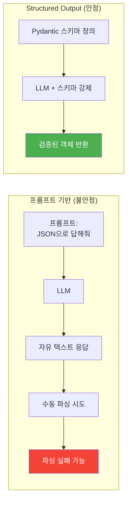
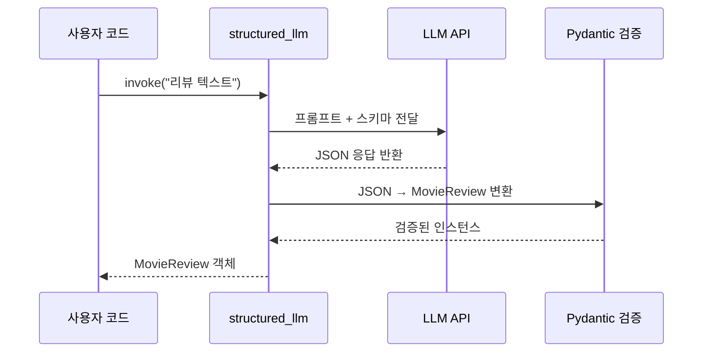
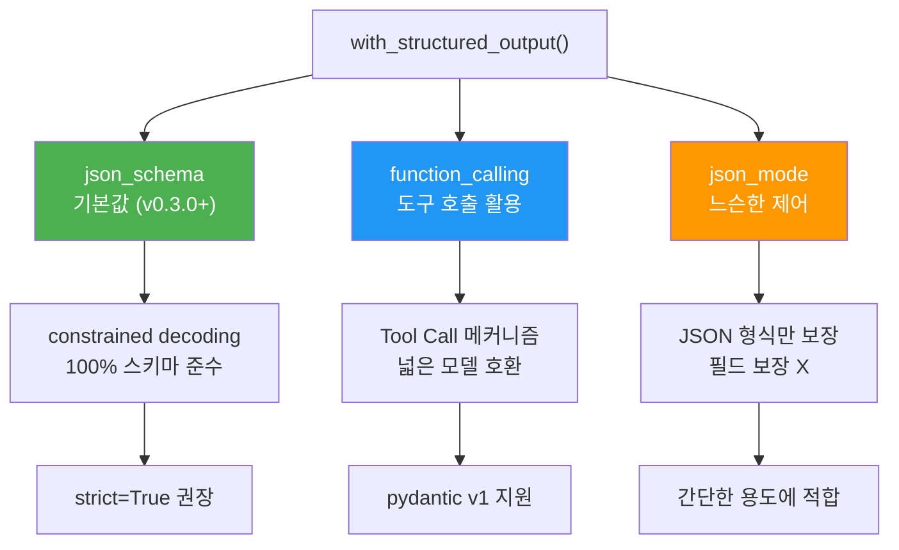
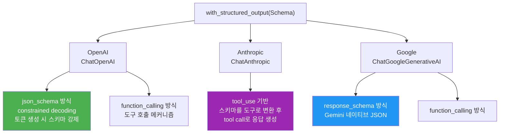
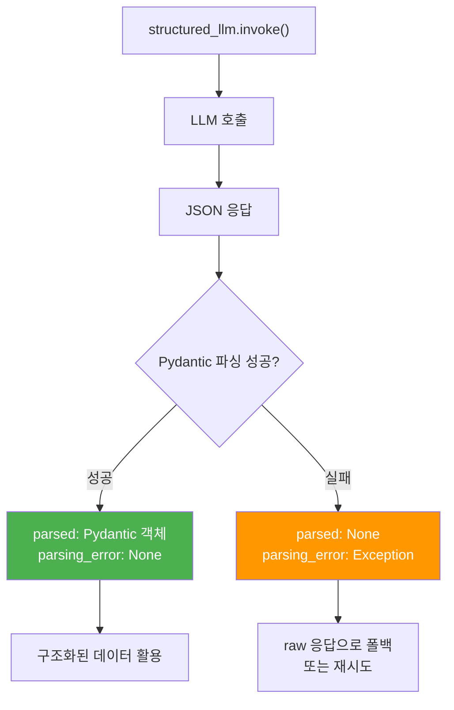
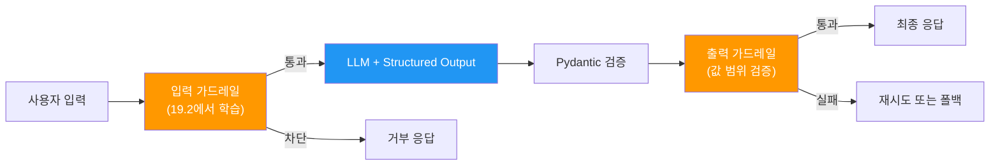

# Structured Output 기초

> Pydantic 모델로 LLM 출력을 원하는 형태로 강제하고, `with_structured_output()` API로 안정적인 구조화 데이터를 얻는 방법을 배웁니다.

## 개요

이 섹션에서는 LLM이 자유 텍스트 대신 **정해진 스키마에 맞는 구조화된 데이터**를 출력하도록 강제하는 Structured Output 기법을 학습합니다. [이전 섹션](19-ch19-가드레일과-structured-output/02-02-입력-검증과-프롬프트-인젝션-방어.md)에서 입력을 검증하는 가드레일을 다뤘다면, 이번에는 **출력을 구조화**하여 에이전트 시스템의 안정성을 한 단계 높이는 방법을 살펴봅니다.

**선수 지식**: Pydantic BaseModel 기본 사용법, LLM Tool Calling 개념([Ch1](01-ch1-llm-도구-호출의-이해/02-02-llm-tool-calling-메커니즘.md)에서 학습), LangChain ChatModel 기초

**학습 목표**:
- `with_structured_output()` API의 동작 원리와 3가지 방식(json_schema, function_calling, json_mode)을 이해할 수 있다
- Pydantic 모델로 LLM 출력 스키마를 정의하고 검증할 수 있다
- 파싱 에러를 `include_raw` 옵션으로 우아하게 처리할 수 있다
- Structured Output과 가드레일을 결합하는 시너지 패턴을 설계할 수 있다

## 왜 알아야 할까?

에이전트 시스템을 만들어 본 분이라면 이런 경험이 있을 겁니다. LLM에게 "JSON으로 답해줘"라고 프롬프트에 적어뒀는데, 어느 날 갑자기 ```json으로 감싼 마크다운 코드 블록을 돌려주거나, 필드명을 `movie_title` 대신 `title`로 바꿔서 응답하는 거죠. 프롬프트만으로는 100% 출력 형식을 보장할 수 없습니다.

Structured Output은 이 문제를 **프롬프트 수준이 아닌 API/모델 수준**에서 해결합니다. 다만, 그 구현 방식은 프로바이더마다 다릅니다. OpenAI는 **constrained decoding**으로 토큰 생성 과정 자체에서 스키마를 강제하고, Anthropic은 **tool_use 메커니즘**을 활용해 구조화된 출력을 만들어내죠. LangChain의 `with_structured_output()`은 이런 프로바이더별 차이를 하나의 API로 추상화해 줍니다.

실무에서 Structured Output이 필수인 대표적 상황들입니다:

- **에이전트 의사결정**: "검색할지, 직접 답변할지"를 `Literal["search", "direct"]` 필드로 받아야 라우팅이 깨지지 않습니다
- **데이터 추출 파이프라인**: 문서에서 엔티티, 관계, 메타데이터를 정형화된 구조로 추출
- **가드레일 연계**: [이전 섹션](19-ch19-가드레일과-structured-output/01-01-에이전트-가드레일-설계.md)의 `GuardrailResult`처럼 판정 결과를 구조화하면 후속 로직이 안정적

> 📊 **그림 1**: 프롬프트 기반 vs Structured Output 비교



## 핵심 개념

### 개념 1: with_structured_output() API 이해

> 💡 **비유**: 음식점 주문서를 떠올려 보세요. "아무거나 적어주세요"라고 하면 글씨체도, 항목 순서도, 적는 정보도 제각각이죠. 어떤 손님은 메뉴명만 적고, 어떤 손님은 알레르기 정보까지 곁들이고, 또 어떤 손님은 그림을 그리기도 합니다. 하지만 **표준화된 주문서 양식** — "메뉴명", "수량", "매운맛 단계(1~5)", "추가 요청사항" 칸이 명확하게 나뉜 종이를 건네면? 모든 손님이 같은 구조로 깔끔하게 적어옵니다. `with_structured_output()`이 바로 이 역할을 합니다. LLM에게 "자유롭게 답해줘" 대신, **빈칸이 명확한 주문서 양식을 건네는 것**이죠. 양식의 칸(필드)은 Pydantic 모델로 정의하고, LLM은 그 칸에 맞춰 답변을 채워 넣습니다.

`with_structured_output()`은 LangChain의 `BaseChatModel`에 정의된 메서드로, 원래 모델을 감싸서 **구조화된 출력을 반환하는 새로운 Runnable**을 만들어 줍니다. 중요한 점은 이 메서드가 원본 모델을 변경하는 게 아니라, 모델 위에 **파싱 레이어를 추가한 새로운 체인**을 반환한다는 것입니다.

```run:python
from pydantic import BaseModel, Field
from langchain_openai import ChatOpenAI

# 1. 출력 스키마 정의 — "주문서 양식" 만들기
class MovieReview(BaseModel):
    """영화 리뷰 분석 결과"""
    title: str = Field(description="영화 제목")
    sentiment: str = Field(description="감성: positive, negative, neutral 중 하나")
    score: int = Field(description="1~10 사이의 평점")
    summary: str = Field(description="리뷰 요약 (2문장 이내)")

# 2. Structured Output 모델 생성 — 양식을 LLM에게 건넴
llm = ChatOpenAI(model="gpt-4.1-mini", temperature=0)
structured_llm = llm.with_structured_output(MovieReview)

# 3. 호출하면 Pydantic 인스턴스가 반환됨 — 양식이 채워져 돌아옴
result = structured_llm.invoke("인셉션은 놀라운 영화다. 꿈속의 꿈 구조가 천재적이다.")
print(type(result))
print(f"제목: {result.title}")
print(f"감성: {result.sentiment}")
print(f"평점: {result.score}/10")
print(f"요약: {result.summary}")
```

```output
<class 'MovieReview'>
제목: 인셉션
감성: positive
평점: 9/10
요약: 꿈속의 꿈이라는 독창적 구조가 돋보이는 영화. 시각적 연출과 서사의 깊이가 뛰어나다.
```

핵심은 `structured_llm`이 원래 LLM이 아닌, **파싱 로직이 붙은 체인**이라는 점입니다. 내부적으로 모델 호출 → JSON 추출 → Pydantic 검증이 순차적으로 일어나거든요. 문자열이 아니라 Pydantic 인스턴스가 반환되므로, `result.title`, `result.score`처럼 **속성 접근으로 바로 사용**할 수 있습니다. 더 이상 `json.loads()` → `data["title"]` 같은 불안정한 파싱 코드를 쓸 필요가 없죠.

> 📊 **그림 2**: with_structured_output() 내부 동작 흐름



### 개념 2: 3가지 method — json_schema, function_calling, json_mode

`with_structured_output()`은 내부적으로 스키마를 강제하는 **3가지 전략**을 지원합니다. ChatOpenAI 기준으로 `method` 파라미터로 선택하며, langchain-openai v0.3.0부터 기본값이 `json_schema`로 바뀌었습니다.

> 💡 **비유**: 시험 답안지를 채점하는 3가지 방식에 비유할 수 있어요.
> - **json_schema**: OMR 카드처럼 기계가 실시간으로 틀린 답을 차단 (constrained decoding)
> - **function_calling**: 서술형이지만 채점 기준표가 있는 방식 (도구 호출 메커니즘 활용)
> - **json_mode**: "JSON으로 적어라"는 지시만 있고, 세부 필드는 자유 (느슨한 제어)

```python
# 방식 1: json_schema (기본값, 가장 강력)
# 토큰 생성 자체에서 스키마를 강제 — 100% 유효한 JSON 보장
structured_llm = llm.with_structured_output(
    MovieReview,
    method="json_schema",
    strict=True  # 완전 스키마 준수 (constrained decoding)
)

# 방식 2: function_calling (도구 호출 메커니즘 활용)
# pydantic v1도 지원, 더 넓은 모델 호환성
structured_llm = llm.with_structured_output(
    MovieReview,
    method="function_calling"
)

# 방식 3: json_mode (최소 제어)
# 유효한 JSON은 보장하지만, 스키마 필드 준수는 미보장
structured_llm = llm.with_structured_output(
    MovieReview,
    method="json_mode"
)
```

> 📊 **그림 3**: 3가지 method 비교



#### 프로바이더별 Structured Output 지원 차이

여기서 중요한 포인트가 있습니다. `with_structured_output()`이라는 **API는 동일**하지만, 프로바이더마다 내부 구현 방식이 다릅니다. LangChain이 이 차이를 추상화해주기 때문에 코드 레벨에서는 동일하게 쓸 수 있지만, 동작 특성을 이해해두면 디버깅이나 프로바이더 선택에 큰 도움이 됩니다.

> 📊 **그림 3-1**: 프로바이더별 Structured Output 내부 구현 비교



```python
# OpenAI — json_schema + strict=True가 기본 (constrained decoding)
from langchain_openai import ChatOpenAI
openai_llm = ChatOpenAI(model="gpt-4.1-mini")
structured = openai_llm.with_structured_output(MovieReview)  # method="json_schema"

# Anthropic — 내부적으로 tool_use 메커니즘 활용
from langchain_anthropic import ChatAnthropic
anthropic_llm = ChatAnthropic(model="claude-sonnet-4-20250514")
structured = anthropic_llm.with_structured_output(MovieReview)  # tool_use 기반

# Google — response_schema 또는 function_calling
from langchain_google_genai import ChatGoogleGenerativeAI
google_llm = ChatGoogleGenerativeAI(model="gemini-2.0-flash")
structured = google_llm.with_structured_output(MovieReview)
```

| 프로바이더 | 주요 방식 | 스키마 강제 수준 | 특징 |
|-----------|----------|----------------|------|
| **OpenAI** | `json_schema` + `strict=True` | 최강 (constrained decoding) | 토큰 생성 시 문법 위반 차단. 첫 호출 시 스키마 컴파일 지연 발생 |
| **Anthropic** | `tool_use` 기반 | 강함 | Pydantic 스키마를 도구 정의로 변환, tool call 응답으로 구조화. `method` 파라미터 없음 |
| **Google** | `response_schema` / `function_calling` | 강함 | Gemini 네이티브 JSON 모드 지원, 일부 복잡한 스키마 제약 |

> ⚠️ **흔한 오해**: "`method="json_schema"`를 모든 프로바이더에서 쓸 수 있다"고 생각하기 쉽지만, 이 파라미터는 **OpenAI 전용**입니다. `ChatAnthropic`은 `method` 파라미터를 받지 않고, 내부적으로 항상 `tool_use` 기반으로 동작합니다. LangChain이 `.with_structured_output(Schema)`라는 동일한 인터페이스를 제공하기 때문에 코드를 바꿀 필요는 없지만, 에러 특성이나 지원하는 스키마 복잡도는 프로바이더마다 다를 수 있다는 점을 기억하세요.

### 개념 3: Pydantic 스키마 설계 패턴

> 💡 **비유**: Pydantic 모델은 LLM에게 건네는 **빈칸 채우기 시험지**입니다. 각 필드의 `description`은 출제 의도를 설명하는 지문이고, 타입 힌트는 "여기는 숫자만 쓰세요" 같은 답안 형식 제약이죠.

Structured Output에서 Pydantic 모델은 단순한 데이터 클래스가 아닙니다. **LLM에게 전달되는 스키마의 원본**이기 때문에, `description`의 품질이 출력 품질을 직접 좌우합니다.

```python
from pydantic import BaseModel, Field
from typing import Literal, Optional
from enum import Enum

# 패턴 1: Literal로 선택지 제한
class QueryAnalysis(BaseModel):
    """사용자 쿼리의 의도와 복잡도를 분석한 결과"""
    intent: Literal["question", "command", "chitchat"] = Field(
        description="쿼리의 의도 유형"
    )
    complexity: Literal["simple", "moderate", "complex"] = Field(
        description="처리에 필요한 복잡도 수준"
    )
    requires_search: bool = Field(
        description="외부 검색이 필요한지 여부"
    )
    reasoning: str = Field(
        description="분류 판단의 근거 (1문장)"
    )


# 패턴 2: 중첩 모델로 복합 구조 표현
class Entity(BaseModel):
    """문서에서 추출된 엔티티"""
    name: str = Field(description="엔티티 이름")
    entity_type: Literal["person", "org", "location", "date"] = Field(
        description="엔티티 유형"
    )
    confidence: float = Field(description="추출 신뢰도 (0.0~1.0)")

class DocumentAnalysis(BaseModel):
    """문서 분석 결과"""
    title: str = Field(description="문서 제목")
    entities: list[Entity] = Field(description="추출된 엔티티 목록")
    key_topics: list[str] = Field(description="핵심 주제 (최대 5개)")
    language: str = Field(description="문서 언어 (ISO 639-1 코드)")


# 패턴 3: Optional 필드로 유연성 확보
class SearchDecision(BaseModel):
    """검색 실행 여부 판단 결과"""
    should_search: bool = Field(description="검색 실행 여부")
    search_query: Optional[str] = Field(
        default=None,
        description="검색할 쿼리 (should_search=True일 때만)"
    )
    direct_answer: Optional[str] = Field(
        default=None,
        description="직접 답변 (should_search=False일 때만)"
    )
```

> ⚠️ **흔한 오해**: `strict=True`를 사용할 때 `Field(ge=1, le=10)` 같은 **Pydantic 검증 제약**을 쓸 수 있다고 생각하기 쉽지만, 실제로는 작동하지 않습니다. `strict` 모드의 constrained decoding은 **JSON Schema 구조만 강제**하고, Pydantic의 커스텀 밸리데이터나 `min_length`, `ge/le` 같은 값 범위 제약은 무시합니다. 값 범위 검증이 필요하면 출력 후 별도 검증 단계를 추가하세요.

### 개념 4: 파싱 에러 처리 — include_raw 패턴

LLM이 스키마를 완벽히 따르지 못할 때가 있습니다. 특히 `json_mode`나 `function_calling` 방식에서는 필드 누락이나 타입 불일치가 발생할 수 있죠. `include_raw=True` 옵션은 이런 상황에서 에러를 삼키지 않으면서도 **원본 응답을 보존**해 줍니다.

```python
# include_raw=True: 항상 3개 키를 가진 dict 반환
structured_llm = llm.with_structured_output(
    MovieReview,
    include_raw=True
)

result = structured_llm.invoke("이 영화 별로였다")

# result 구조:
# {
#   "raw": AIMessage(content=...),     # 원본 LLM 응답
#   "parsed": MovieReview(...),         # 파싱 성공 시 객체, 실패 시 None
#   "parsing_error": None               # 파싱 성공 시 None, 실패 시 Exception
# }

if result["parsing_error"]:
    # 파싱 실패 — 원본으로 폴백 가능
    print(f"파싱 실패: {result['parsing_error']}")
    fallback_text = result["raw"].content
else:
    # 정상 — 구조화된 객체 사용
    review = result["parsed"]
    print(f"{review.title}: {review.score}/10")
```

> 📊 **그림 4**: include_raw=True 분기 처리 흐름



주의할 점이 있습니다. `include_raw=True`는 **파싱 단계의 에러만** 잡아줍니다. LLM API 호출 자체의 에러(토큰 한도 초과, 네트워크 오류 등)는 여전히 예외로 발생하므로 별도의 `try/except`가 필요합니다.

## 실습: 직접 해보기

고객 문의를 분석하여 카테고리, 긴급도, 감성, 핵심 키워드를 구조화된 형태로 추출하는 파이프라인을 만들어 봅시다.

```python
from pydantic import BaseModel, Field
from typing import Literal, Optional
from langchain_openai import ChatOpenAI


# ── 1. 출력 스키마 정의 ──
class CustomerInquiry(BaseModel):
    """고객 문의 분석 결과"""
    category: Literal["billing", "technical", "account", "general"] = Field(
        description="문의 카테고리"
    )
    urgency: Literal["low", "medium", "high", "critical"] = Field(
        description="긴급도 수준"
    )
    sentiment: Literal["positive", "neutral", "negative", "angry"] = Field(
        description="고객 감성 상태"
    )
    keywords: list[str] = Field(
        description="핵심 키워드 (최대 5개)"
    )
    summary: str = Field(
        description="문의 요약 (1문장)"
    )
    requires_human: bool = Field(
        description="사람의 개입이 필요한지 여부"
    )
    suggested_response: Optional[str] = Field(
        default=None,
        description="제안 응답 (자동 응답 가능 시)"
    )


# ── 2. Structured Output 모델 구성 ──
llm = ChatOpenAI(model="gpt-4.1-mini", temperature=0)
analyzer = llm.with_structured_output(
    CustomerInquiry,
    method="json_schema",
    strict=True
)


# ── 3. 분석 실행 함수 ──
def analyze_inquiry(text: str) -> CustomerInquiry:
    """고객 문의를 분석하여 구조화된 결과를 반환한다."""
    prompt = f"""다음 고객 문의를 분석하세요.

고객 문의:
{text}

분석 기준:
- category: 결제/기술/계정/일반 중 가장 적합한 카테고리
- urgency: 서비스 중단이나 금전 손실이면 critical, 불편이면 high
- requires_human: 환불, 계정 삭제, 기술적 조사가 필요하면 True
"""
    return analyzer.invoke(prompt)


# ── 4. 테스트 실행 ──
inquiries = [
    "결제가 두 번 됐어요. 당장 환불해주세요! 이게 3번째입니다.",
    "비밀번호를 바꾸고 싶은데 어떻게 하나요?",
    "앱이 자꾸 튕겨요. iOS 18에서 사용 중인데 오늘 업데이트 후부터 안 됩니다.",
]

for text in inquiries:
    result = analyze_inquiry(text)
    print(f"문의: {text[:30]}...")
    print(f"  카테고리: {result.category}")
    print(f"  긴급도: {result.urgency}")
    print(f"  감성: {result.sentiment}")
    print(f"  키워드: {result.keywords}")
    print(f"  사람 필요: {result.requires_human}")
    print(f"  요약: {result.summary}")
    print()
```

```output
문의: 결제가 두 번 됐어요. 당장 환불해주세요! 이게 3번째입니다...
  카테고리: billing
  긴급도: critical
  감성: angry
  키워드: ['이중결제', '환불', '반복 발생']
  사람 필요: True
  요약: 결제가 중복 처리되어 환불을 요청하며 반복 발생에 불만을 표시함

문의: 비밀번호를 바꾸고 싶은데 어떻게 하나요?...
  카테고리: account
  긴급도: low
  감성: neutral
  키워드: ['비밀번호', '변경']
  사람 필요: False
  요약: 비밀번호 변경 방법을 문의함

문의: 앱이 자꾸 튕겨요. iOS 18에서 사용 중인데 오늘 업데이트...
  카테고리: technical
  긴급도: high
  감성: negative
  키워드: ['앱 크래시', 'iOS 18', '업데이트']
  사람 필요: True
  요약: iOS 18 업데이트 후 앱이 반복적으로 충돌하는 기술적 문제를 신고함
```

이제 에러 처리 버전도 만들어 봅시다:

```python
# ── 5. include_raw로 안전한 분석기 구성 ──
safe_analyzer = llm.with_structured_output(
    CustomerInquiry,
    include_raw=True  # 파싱 실패 시에도 원본 보존
)

def safe_analyze(text: str) -> dict:
    """파싱 실패에도 안전한 분석 함수"""
    try:
        result = safe_analyzer.invoke(
            f"다음 고객 문의를 분석하세요:\n{text}"
        )

        if result["parsing_error"]:
            return {
                "status": "fallback",
                "error": str(result["parsing_error"]),
                "raw_response": result["raw"].content,
            }

        inquiry = result["parsed"]
        return {
            "status": "success",
            "data": inquiry.model_dump(),
        }

    except Exception as e:
        # API 에러 (네트워크, 토큰 한도 등)
        return {
            "status": "error",
            "error": str(e),
        }
```

## 더 깊이 알아보기

### Structured Output의 탄생 — JSON Mode에서 Constrained Decoding까지

Structured Output의 역사는 LLM 출력 파싱의 고통에서 시작합니다. GPT-3 시절, 개발자들은 프롬프트에 "반드시 JSON으로 응답하라"고 쓰고 정규식으로 파싱하는 불안정한 방식을 썼습니다. 2023년 11월, OpenAI가 **JSON Mode**(`response_format: {"type": "json_object"}`)를 도입했지만, 이는 유효한 JSON임만 보장할 뿐 스키마 준수는 보장하지 못했죠.

진짜 혁명은 2024년 8월, OpenAI가 **Structured Outputs**를 발표하면서 일어났습니다. 이 기능의 핵심은 **constrained decoding**(제약 디코딩)입니다. 모델이 토큰을 생성할 때 JSON Schema에 맞지 않는 토큰의 확률을 0으로 만들어, 생성 과정 자체에서 스키마를 강제하는 기법이거든요. 이 접근 방식은 Microsoft Research의 2023년 논문 "Efficient Guided Generation for LLMs"에서 영감을 받았습니다.

한편, Anthropic은 다른 경로를 택했습니다. Claude 모델은 OpenAI식 constrained decoding을 직접 지원하지 않고, **tool_use(도구 호출) 메커니즘을 활용**합니다. Pydantic 스키마를 하나의 "도구 정의"로 변환한 뒤, 모델이 그 도구를 호출하는 형태로 구조화된 응답을 생성하는 방식이죠. 결과적으로 동일한 구조화 효과를 얻지만, 내부 메커니즘은 근본적으로 다릅니다. Google의 Gemini는 또 다른 접근으로, API 레벨에서 `response_schema`를 지정하는 네이티브 JSON 모드를 지원합니다.

LangChain은 이런 프로바이더별 차이를 빠르게 통합했는데, 재밌는 점은 `with_structured_output()` 메서드가 OpenAI Structured Outputs 발표 **이전**에 이미 존재했다는 겁니다. 원래는 `function_calling`을 활용한 우회 방식이었는데, 각 프로바이더의 네이티브 지원이 추가되자 내부 구현을 갈아끼운 것이죠. "미리 만들어둔 인터페이스가 기술 발전에 딱 맞아떨어진" 드문 사례입니다.

> 💡 **알고 계셨나요?**: `with_structured_output()`의 `method` 기본값은 원래 `function_calling`이었습니다. 2024년 하반기 langchain-openai v0.3.0에서 `json_schema`로 바뀌면서, 기존 코드 중 pydantic v1 모델을 사용하던 프로젝트들이 일시적으로 깨지는 일이 있었죠(pydantic v1은 `json_schema` 방식을 지원하지 않기 때문). 마이그레이션 가이드에서 `method="function_calling"`을 명시하거나, pydantic v2로 업그레이드하는 두 가지 해결책이 제시되었습니다.

## 흔한 오해와 팁

> ⚠️ **흔한 오해**: "Structured Output을 쓰면 LLM 출력이 무조건 100% 완벽하다." — `json_schema` + `strict=True`는 JSON 구조의 유효성만 보장합니다. 필드의 **의미적 정확성**은 여전히 프롬프트 품질에 달려 있어요. 예를 들어 `sentiment: Literal["positive", "negative"]`에서 구조는 맞지만, LLM이 긍정 리뷰를 "negative"로 분류할 수는 있습니다. 구조적 정확성 ≠ 의미적 정확성이라는 점을 기억하세요.

> 🔥 **실무 팁**: Pydantic 모델의 **docstring**과 **Field description**이 실제로 LLM에게 전달됩니다. 빈 description보다 구체적인 설명을 쓸수록 출력 품질이 크게 올라갑니다. 특히 `Literal` 타입의 각 선택지가 무엇을 의미하는지 description에 명시하면 분류 정확도가 눈에 띄게 향상됩니다.

> 🔥 **실무 팁**: `strict=True`에서 `default` 값을 가진 필드가 있으면 에러가 납니다. 모든 필드를 필수로 만들거나, `strict`를 쓰지 않는 것 중 하나를 선택하세요. `Optional` 필드는 괜찮지만, `default=None`이 아닌 `default="some_value"` 형태의 기본값은 strict 모드와 호환되지 않습니다.

> 🔥 **실무 팁**: 프로바이더를 바꿀 가능성이 있다면, `with_structured_output(Schema)` 호출에서 **`method` 파라미터를 명시하지 마세요**. 각 프로바이더의 LangChain 통합이 최적의 기본값을 자동 선택합니다. `method="json_schema"`를 하드코딩하면 Anthropic으로 바꿀 때 에러가 납니다.

> 📊 **그림 5**: Structured Output + 가드레일 시너지 아키텍처



Structured Output은 "스키마 준수"를 보장하고, 가드레일은 "의미적 안전성"을 보장합니다. 둘을 조합하면 구조적으로도, 의미적으로도 안전한 출력을 만들 수 있습니다. [다음 섹션](19-ch19-가드레일과-structured-output/04-04-langgraph에서의-structured-output.md)에서 이 조합을 LangGraph StateGraph 안에서 본격적으로 구현합니다.

## 핵심 정리

| 개념 | 설명 |
|------|------|
| `with_structured_output()` | LangChain 모델을 감싸서 Pydantic 객체를 반환하는 Runnable을 생성하는 메서드 |
| `method="json_schema"` | OpenAI constrained decoding 활용, 100% 스키마 준수 보장 (OpenAI 기본값) |
| `method="function_calling"` | 도구 호출 메커니즘 활용, pydantic v1 호환, 넓은 모델 지원 |
| `method="json_mode"` | 유효한 JSON만 보장, 스키마 필드 강제 없음 (가장 느슨) |
| Anthropic `tool_use` 방식 | Pydantic 스키마를 도구 정의로 변환하여 구조화. `method` 파라미터 없이 자동 적용 |
| `strict=True` | constrained decoding 활성화 — 단, `default` 값 필드 불가 (OpenAI 전용) |
| `include_raw=True` | 파싱 실패 시에도 원본 AIMessage 보존, `raw`/`parsed`/`parsing_error` dict 반환 |
| Pydantic `Field(description=...)` | LLM에게 전달되는 필드 설명 — 출력 품질에 직접 영향 |
| `Literal` 타입 | 출력 선택지를 유한한 집합으로 제한, 에이전트 라우팅에 필수 |

## 다음 섹션 미리보기

이번 섹션에서 `with_structured_output()`의 기본 사용법을 익혔다면, [다음 섹션](19-ch19-가드레일과-structured-output/04-04-langgraph에서의-structured-output.md)에서는 이를 **LangGraph StateGraph 안에서** 활용하는 방법을 배웁니다. `create_react_agent()`의 `response_format` 파라미터, `ProviderStrategy`와 `ToolStrategy`의 차이, 그리고 에이전트가 도구를 사용하면서 동시에 구조화된 최종 응답을 반환하는 패턴을 다룰 예정입니다.

## 참고 자료

- [LangChain Structured Output 공식 가이드](https://docs.langchain.com/oss/python/langchain/structured-output) - `with_structured_output()` API의 공식 문서, 지원 모델별 차이점과 사용법 정리
- [Stuart McHattie — Structured Output in LangGraph](https://stuart.mchattie.net/posts/2026/01/31/structured-output-in-langgraph/) - LangGraph 에이전트에서 Structured Output을 활용하는 실전 예제와 ProviderStrategy/ToolStrategy 비교
- [ChatOpenAI.with_structured_output API 레퍼런스](https://reference.langchain.com/python/langchain-openai/chat_models/base/ChatOpenAI/with_structured_output) - method, strict, include_raw 등 전체 파라미터 시그니처 상세 설명
- [Anthropic Tool Use 공식 문서](https://docs.anthropic.com/en/docs/build-with-claude/tool-use) - Claude의 tool_use 기반 구조화 출력 메커니즘과 JSON 스키마 지원 범위
- [OpenAI Structured Outputs 공식 가이드](https://platform.openai.com/docs/guides/structured-outputs) - constrained decoding의 원리와 JSON Schema 지원 범위, strict 모드 제약사항

---
### 🔗 Related Sessions
- [guardrail](19-ch19-가드레일과-structured-output/01-01-에이전트-가드레일-설계.md) (prerequisite)
- [input_guard](19-ch19-가드레일과-structured-output/01-01-에이전트-가드레일-설계.md) (prerequisite)
- [output_guard](19-ch19-가드레일과-structured-output/01-01-에이전트-가드레일-설계.md) (prerequisite)
