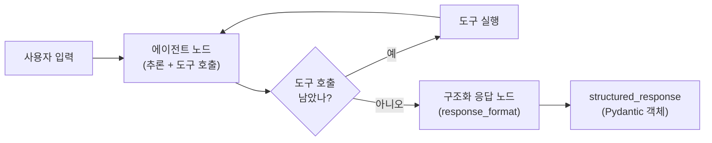
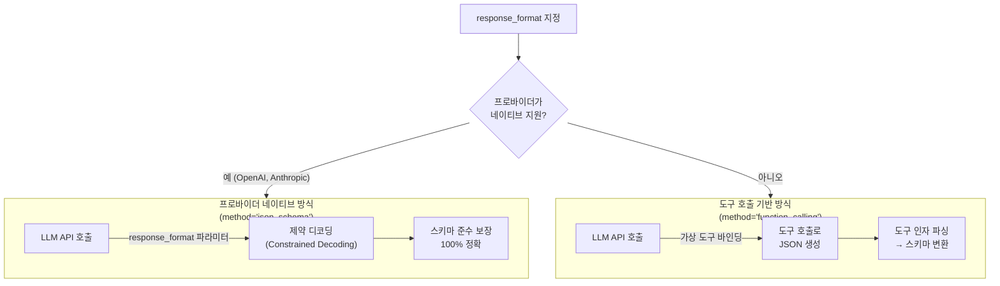
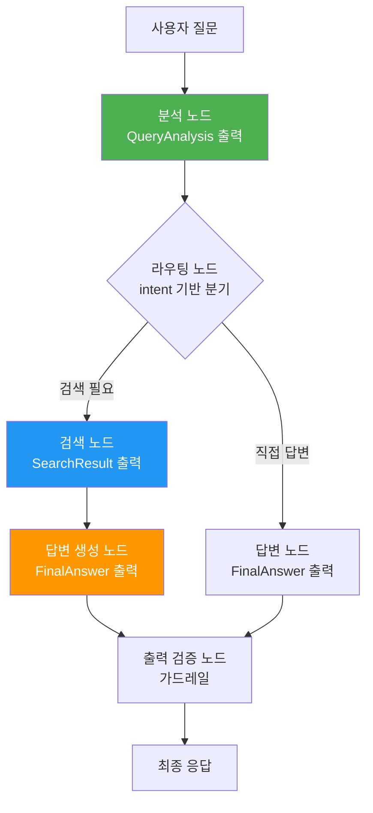
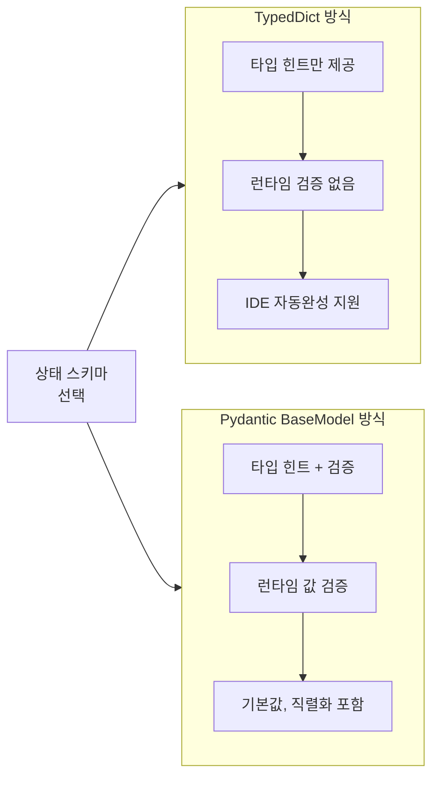

# LangGraph에서의 Structured Output

> 그래프 노드에서 구조화된 출력을 강제하고, 에이전트 응답을 타입 안전하게 관리하는 방법을 학습합니다.

## 개요

이 섹션에서는 [이전 섹션](19-ch19-가드레일과-structured-output/03-03-structured-output-기초.md)에서 배운 `with_structured_output()` 기초를 LangGraph의 StateGraph와 `create_react_agent`에 통합하는 방법을 다룹니다. 단일 LLM 호출이 아닌, **그래프 전체의 데이터 흐름**을 구조화하는 것이 핵심입니다.

**선수 지식**:
- [Structured Output 기초](19-ch19-가드레일과-structured-output/03-03-structured-output-기초.md)에서 배운 `with_structured_output()`, Pydantic 스키마
- [LangGraph StateGraph 기초](04-ch4-langgraph-stategraph-기초/02-02-상태-스키마-정의.md)에서 배운 TypedDict, Annotated, 리듀서
- [조건 분기와 동적 라우팅](05-ch5-조건-분기와-동적-라우팅/01-01-조건부-엣지의-이해.md)에서 배운 조건부 엣지

**학습 목표**:
- `create_react_agent`의 `response_format` 파라미터로 에이전트 응답을 구조화할 수 있다
- 프로바이더 네이티브 방식과 도구 호출 기반 방식의 차이를 이해하고 적절히 선택할 수 있다
- 커스텀 StateGraph 노드에서 `with_structured_output()`을 활용할 수 있다
- 중간 상태까지 타입 안전하게 관리하는 그래프를 설계할 수 있다

## 왜 알아야 할까?

에이전트가 "서울의 날씨는 맑습니다"라고 자유 텍스트로 답하면, 프론트엔드에서는 이걸 어떻게 파싱해야 할까요? 정규표현식? 아니면 또 다른 LLM 호출? 프로덕션 환경에서 에이전트의 출력이 구조화되지 않으면, **다운스트림 시스템 전체가 불안정**해집니다.

LangGraph에서 Structured Output이 특별히 중요한 이유가 있습니다. LangGraph는 여러 노드가 **상태를 공유하며 순차·병렬로 실행**되는 시스템입니다. 한 노드의 출력이 다음 노드의 입력이 되는데, 이 인터페이스가 느슨하면 그래프 전체가 취약해지죠. 타입이 보장된 구조화 출력은 노드 간 **계약(contract)**을 명확히 하고, 런타임 에러를 컴파일 타임에 잡아줍니다.

실제로 LangChain 팀은 `create_react_agent`에 `response_format` 파라미터를 추가했는데, 이는 커뮤니티에서 "에이전트 최종 응답 형식이 들쑥날쑥하다"는 피드백이 쏟아진 결과였습니다. 에이전트가 도구를 다 쓰고 나면, 마지막에 "정해진 틀"로 응답을 내놓도록 강제하는 거죠. 이 기능은 LangGraph `v0.1.x` 후반부터 도입되었으며, 이후 지속적으로 개선되고 있습니다(정확한 최초 도입 버전은 [LangGraph Releases](https://github.com/langchain-ai/langgraph/releases) 페이지에서 확인할 수 있습니다).

## 핵심 개념

### 개념 1: create_react_agent의 response_format

> 💡 **비유**: 레스토랑에서 셰프(LLM)가 재료를 자유롭게 조리(도구 호출)하더라도, 최종 요리는 반드시 정해진 그릇(스키마)에 담아 서빙해야 하는 것과 같습니다. `response_format`은 그 "그릇"의 규격입니다.

`create_react_agent`의 `response_format` 파라미터는 에이전트 루프가 끝난 뒤 **별도의 LLM 호출**로 구조화 응답을 생성합니다. 핵심은 도구 호출 과정에서는 자유롭게 추론하되, 최종 응답만 스키마에 맞추는 것이죠.

> 📊 **그림 1**: response_format이 적용된 에이전트 실행 흐름



사용법은 간단합니다. Pydantic 모델을 정의하고 `response_format`에 전달하면 됩니다:

```python
from pydantic import BaseModel, Field
from langgraph.prebuilt import create_react_agent
from langchain_openai import ChatOpenAI

# 1. 응답 스키마 정의
class WeatherReport(BaseModel):
    """날씨 보고서 스키마"""
    city: str = Field(description="도시명")
    temperature: float = Field(description="섭씨 온도")
    condition: str = Field(description="날씨 상태 (맑음/흐림/비/눈)")
    summary: str = Field(description="한 줄 요약")

# 2. 에이전트 생성 — response_format 지정
llm = ChatOpenAI(model="gpt-4o")
agent = create_react_agent(
    model=llm,
    tools=[weather_tool],
    response_format=WeatherReport,  # 스키마 직접 전달
)

# 3. 실행 — structured_response 키로 접근
result = agent.invoke({
    "messages": [{"role": "user", "content": "서울 날씨 알려줘"}]
})

# 구조화된 응답 객체
report = result["structured_response"]
# WeatherReport(city="서울", temperature=22.5, condition="맑음", ...)
```

`response_format`에 **튜플**을 전달하면 커스텀 프롬프트도 지정할 수 있습니다:

```python
# (시스템 프롬프트, 스키마) 튜플로 전달
agent = create_react_agent(
    model=llm,
    tools=[weather_tool],
    response_format=(
        "반드시 한국어로 응답하고, 온도는 섭씨로 표기하세요.",
        WeatherReport,
    ),
)
```

`response_format`을 지정하면 상태 스키마에 자동으로 `structured_response` 필드가 추가됩니다. 커스텀 상태를 사용한다면 이 필드를 직접 포함해야 합니다:

```python
from langgraph.prebuilt.chat_agent_executor import AgentState

class MyState(AgentState):
    """structured_response를 포함하는 커스텀 상태"""
    structured_response: WeatherReport | None = None
    # 기존 커스텀 필드들...
    user_preference: str = ""
```

> ⚠️ **흔한 오해**: `response_format`이 매 도구 호출마다 구조화를 강제한다고 생각하기 쉽지만, 실제로는 **에이전트 루프가 완전히 끝난 뒤** 별도 노드(`generate_structured_response`)에서 한 번만 실행됩니다. 도구 호출 중에는 LLM이 자유롭게 추론합니다.

### 개념 2: 프로바이더 네이티브 방식 vs 도구 호출 기반 방식

> 💡 **비유**: 영어 시험에서 "빈칸 채우기"(프로바이더 네이티브)와 "서술형 답안을 채점표로 검증"(도구 호출 기반)의 차이입니다. 빈칸 채우기는 처음부터 정해진 틀에 답을 쓰고, 서술형은 자유롭게 쓴 뒤 형식을 맞춥니다.

LangChain은 구조화 응답을 생성할 때 내부적으로 두 가지 전략을 사용합니다. 이 섹션에서는 설명의 편의를 위해 이를 **프로바이더 네이티브 방식**과 **도구 호출 기반 방식**으로 부르겠습니다. 이 이름들은 공식 API의 클래스명이 아니라, LangChain 내부에서 `with_structured_output()`의 `method` 파라미터에 따라 분기되는 **전략 패턴의 개념적 구분**입니다.

> 📊 **그림 2**: 프로바이더 네이티브 방식과 도구 호출 기반 방식의 동작 차이



**프로바이더 네이티브 방식**은 모델 프로바이더의 네이티브 구조화 출력 API를 사용합니다. OpenAI의 `response_format`, Anthropic의 constrained decoding 등이 여기에 해당하죠. 토큰 생성 단계에서 스키마를 강제하므로 **100% 스키마 준수**가 보장됩니다.

실제 코드에서는 `with_structured_output()`의 `method` 파라미터로 명시적으로 전략을 선택할 수 있습니다:

```python
# 프로바이더 네이티브 — JSON Schema 기반 제약 디코딩
structured_llm = llm.with_structured_output(
    WeatherReport,
    method="json_schema",  # OpenAI의 Structured Outputs API 사용
)
```

**도구 호출 기반 방식**은 스키마를 "가상 도구"로 변환해 LLM에게 바인딩합니다. LLM이 이 가상 도구를 "호출"하면 그 인자가 곧 구조화 응답이 됩니다. 도구 호출을 지원하는 **모든 모델**에서 작동한다는 장점이 있습니다.

```python
# 도구 호출 기반 — Function Calling으로 구조화 출력
structured_llm = llm.with_structured_output(
    WeatherReport,
    method="function_calling",  # 스키마를 가상 도구로 변환
)
```

`create_react_agent`의 `response_format`에 스키마를 직접 전달하면, LangChain이 내부적으로 모델의 프로바이더를 감지해 최적 전략을 **자동 선택**합니다:

```python
# 스키마만 전달 → LangChain이 자동으로 최적 전략 선택
agent = create_react_agent(
    model=llm,
    tools=[search_tool],
    response_format=WeatherReport,  # 내부에서 method 자동 결정
)
```

| 특성 | 프로바이더 네이티브 방식 | 도구 호출 기반 방식 |
|------|-----------------|-------------|
| **`method` 값** | `"json_schema"` | `"function_calling"` |
| **동작 방식** | 프로바이더 네이티브 API | 가상 도구 호출 |
| **스키마 준수율** | 100% (제약 디코딩) | 99%+ (도구 호출 정확도에 의존) |
| **지원 모델** | OpenAI, Anthropic, Gemini 등 | 도구 호출 지원 모든 모델 |
| **성능** | 빠름 (단일 호출) | 약간 느림 (도구 호출 오버헤드) |
| **유연성** | 프로바이더 제약 있음 | 범용적 |
| **기본 동작** | 지원 시 자동 선택 | 폴백으로 사용 |

> 🔥 **실무 팁**: 대부분의 경우 스키마를 직접 전달하면(`response_format=MySchema`) LangChain이 자동으로 최적 전략을 선택하므로 `method`를 명시할 필요가 없습니다. 명시적으로 지정하는 건 특정 동작을 강제하거나 디버깅할 때만 필요합니다.

### 개념 3: 커스텀 StateGraph 노드에서의 with_structured_output

> 💡 **비유**: `create_react_agent`가 완성된 요리 세트라면, 커스텀 StateGraph는 직접 레시피를 짜는 것입니다. 각 조리 단계(노드)마다 "이 그릇에 담아라"고 지정하는 게 노드별 `with_structured_output()`이죠.

`create_react_agent`의 `response_format`은 **최종 응답**만 구조화합니다. 하지만 복잡한 워크플로우에서는 **중간 노드의 출력**도 구조화해야 할 때가 많죠. 이때 커스텀 StateGraph에서 `with_structured_output()`을 직접 사용합니다.

> 📊 **그림 3**: 중간 상태까지 구조화된 StateGraph 파이프라인



핵심 패턴은 **노드 함수 안에서 `with_structured_output()`으로 감싼 LLM을 호출**하고, 결과를 상태에 기록하는 것입니다:

```python
from typing import TypedDict, Annotated, Literal
from pydantic import BaseModel, Field
from langchain_openai import ChatOpenAI
from langgraph.graph import StateGraph, START, END

# --- 중간 스키마 정의 ---
class QueryAnalysis(BaseModel):
    """쿼리 분석 결과"""
    intent: Literal["search", "direct", "clarify"] = Field(
        description="사용자 의도"
    )
    keywords: list[str] = Field(description="핵심 키워드")
    complexity: Literal["simple", "complex"] = Field(
        description="쿼리 복잡도"
    )

class FinalAnswer(BaseModel):
    """최종 답변 스키마"""
    answer: str = Field(description="답변 본문")
    confidence: float = Field(ge=0.0, le=1.0, description="신뢰도")
    sources: list[str] = Field(description="참조 출처")

# --- 상태 정의 (중간 결과도 타입 지정) ---
class PipelineState(TypedDict):
    question: str
    analysis: QueryAnalysis | None
    search_results: list[str]
    final_answer: FinalAnswer | None

# --- 노드 함수: with_structured_output 사용 ---
llm = ChatOpenAI(model="gpt-4o")

def analyze_query(state: PipelineState) -> dict:
    """쿼리를 분석하여 구조화된 결과를 반환"""
    structured_llm = llm.with_structured_output(QueryAnalysis)
    analysis = structured_llm.invoke(
        f"다음 질문을 분석하세요: {state['question']}"
    )
    return {"analysis": analysis}

def generate_answer(state: PipelineState) -> dict:
    """구조화된 최종 답변 생성"""
    structured_llm = llm.with_structured_output(FinalAnswer)
    context = "\n".join(state.get("search_results", []))
    answer = structured_llm.invoke(
        f"질문: {state['question']}\n컨텍스트: {context}\n"
        "위 정보를 기반으로 답변하세요."
    )
    return {"final_answer": answer}

def route_by_intent(state: PipelineState) -> str:
    """분석 결과의 intent로 라우팅"""
    return state["analysis"].intent  # 타입 안전한 접근!
```

여기서 주목할 점은 `route_by_intent` 함수입니다. `state["analysis"]`가 `QueryAnalysis` 타입이므로 `.intent` 속성에 타입 안전하게 접근할 수 있죠. 자유 텍스트였다면 정규표현식 파싱이 필요했을 겁니다.

### 개념 4: 상태 스키마의 타입 안전성

> 💡 **비유**: 물류 창고에서 각 선반에 라벨(타입)을 붙이는 것과 같습니다. "A-3 선반에는 냉장 식품만"이라는 규칙이 있으면, 실수로 상온 식품을 넣는 사고를 예방할 수 있죠. 상태 스키마의 타입 힌트가 바로 그 라벨입니다.

LangGraph에서 상태 스키마에 Pydantic 모델을 사용하면 **런타임 검증**까지 자동으로 얻을 수 있습니다. TypedDict는 타입 힌트만 제공하지만, Pydantic BaseModel은 실제로 값을 검증하거든요.

> 📊 **그림 4**: TypedDict vs Pydantic BaseModel 상태 스키마 비교



```python
from pydantic import BaseModel, Field, field_validator
from typing import Annotated
from langgraph.graph import add_messages

# Pydantic 기반 상태 — 런타임 검증 포함
class SafeAgentState(BaseModel):
    """타입 검증이 포함된 에이전트 상태"""
    messages: Annotated[list, add_messages] = Field(default_factory=list)
    analysis: QueryAnalysis | None = None
    final_answer: FinalAnswer | None = None
    retry_count: int = Field(default=0, ge=0, le=5)

    @field_validator("retry_count")
    @classmethod
    def validate_retry(cls, v: int) -> int:
        if v > 5:
            raise ValueError("최대 재시도 횟수(5)를 초과했습니다")
        return v
```

TypedDict와 Pydantic 중 어떤 걸 상태 스키마로 써야 할까요? 정답은 **상황에 따라 다릅니다**:

| 기준 | TypedDict | Pydantic BaseModel |
|------|-----------|-------------------|
| **런타임 검증** | 없음 | 있음 (값 타입, 범위) |
| **성능** | 빠름 (딕셔너리) | 약간 느림 (검증 오버헤드) |
| **직렬화** | 수동 | `.model_dump()` 자동 |
| **LangGraph 호환** | 완벽 | 완벽 (v0.2+) |
| **추천 상황** | 단순 상태, 성능 우선 | 복잡한 검증, 안전성 우선 |

> 💡 **알고 계셨나요?**: LangGraph의 상태 스키마에 Pydantic BaseModel 지원이 추가된 건 비교적 최근(v0.2)입니다. 초기에는 TypedDict만 지원했는데, 커뮤니티에서 "상태에도 검증이 필요하다"는 요청이 쏟아진 결과였죠. LangGraph GitHub에서 가장 많은 요청을 받은 기능 중 하나였습니다.

## 실습: 직접 해보기

이제 실전 시나리오를 구현해봅시다. **고객 문의 분석 에이전트**를 만들겠습니다. 이 에이전트는 고객의 질문을 분석하고, 적절한 부서로 라우팅하며, 구조화된 응답을 생성합니다.

```python
"""
고객 문의 분석 에이전트
— create_react_agent의 response_format + 커스텀 노드의 with_structured_output 통합
"""
from typing import TypedDict, Annotated, Literal
from pydantic import BaseModel, Field
from langchain_openai import ChatOpenAI
from langchain_core.tools import tool
from langchain_core.messages import HumanMessage
from langgraph.graph import StateGraph, START, END, add_messages
from langgraph.prebuilt import create_react_agent


# ========== 1단계: 스키마 정의 ==========

class TicketClassification(BaseModel):
    """고객 문의 분류 결과"""
    category: Literal["billing", "technical", "general"] = Field(
        description="문의 카테고리"
    )
    priority: Literal["low", "medium", "high", "urgent"] = Field(
        description="우선순위"
    )
    keywords: list[str] = Field(description="핵심 키워드 (최대 5개)")
    needs_human: bool = Field(
        description="사람 상담원 연결이 필요한지 여부"
    )

class TicketResponse(BaseModel):
    """최종 응답 스키마"""
    answer: str = Field(description="고객에게 보낼 답변")
    department: str = Field(description="담당 부서")
    resolution_status: Literal["resolved", "escalated", "pending"] = Field(
        description="처리 상태"
    )
    follow_up_required: bool = Field(description="후속 조치 필요 여부")


# ========== 2단계: 상태 스키마 ==========

class TicketState(TypedDict):
    messages: Annotated[list, add_messages]
    classification: TicketClassification | None
    response: TicketResponse | None


# ========== 3단계: 도구 정의 ==========

@tool
def lookup_account(account_id: str) -> str:
    """고객 계정 정보를 조회합니다."""
    # 실제로는 DB 조회
    accounts = {
        "ACC-001": "프리미엄 플랜, 가입일: 2024-01, 결제 정상",
        "ACC-002": "베이직 플랜, 가입일: 2025-06, 결제 연체 3일",
    }
    return accounts.get(account_id, "계정을 찾을 수 없습니다.")

@tool
def check_system_status(service: str) -> str:
    """서비스 상태를 확인합니다."""
    statuses = {
        "api": "정상 운영 중 (99.9% uptime)",
        "dashboard": "점검 중 (예상 복구: 14:00 KST)",
        "billing": "정상 운영 중",
    }
    return statuses.get(service, "알 수 없는 서비스입니다.")


# ========== 4단계: 노드 함수 ==========

llm = ChatOpenAI(model="gpt-4o", temperature=0)

def classify_ticket(state: TicketState) -> dict:
    """문의를 분류하는 노드 — with_structured_output 사용"""
    structured_llm = llm.with_structured_output(TicketClassification)

    # 최신 사용자 메시지 추출
    user_msg = state["messages"][-1].content

    classification = structured_llm.invoke(
        f"다음 고객 문의를 분석하세요:\n\n{user_msg}\n\n"
        "category는 billing/technical/general 중 선택, "
        "priority는 긴급도에 따라 판단하세요."
    )
    return {"classification": classification}

def route_department(state: TicketState) -> str:
    """분류 결과에 따라 라우팅"""
    classification = state["classification"]
    if classification.needs_human:
        return "escalate"
    return classification.category  # "billing", "technical", "general"

def handle_with_agent(state: TicketState) -> dict:
    """ReAct 에이전트로 처리 + 구조화 응답"""
    # create_react_agent에 response_format 적용
    agent = create_react_agent(
        model=llm,
        tools=[lookup_account, check_system_status],
        response_format=(
            "고객 문의에 대해 조사한 뒤 한국어로 답변하세요. "
            "해결 상태를 정확히 판단하세요.",
            TicketResponse,
        ),
    )

    result = agent.invoke({"messages": state["messages"]})
    return {"response": result["structured_response"]}

def escalate_to_human(state: TicketState) -> dict:
    """사람 상담원에게 에스컬레이션"""
    classification = state["classification"]
    return {
        "response": TicketResponse(
            answer="고객님의 문의를 전문 상담원에게 연결 중입니다.",
            department=classification.category,
            resolution_status="escalated",
            follow_up_required=True,
        )
    }


# ========== 5단계: 그래프 구성 ==========

builder = StateGraph(TicketState)

# 노드 등록
builder.add_node("classify", classify_ticket)
builder.add_node("billing", handle_with_agent)
builder.add_node("technical", handle_with_agent)
builder.add_node("general", handle_with_agent)
builder.add_node("escalate", escalate_to_human)

# 엣지 연결
builder.add_edge(START, "classify")
builder.add_conditional_edges("classify", route_department)
builder.add_edge("billing", END)
builder.add_edge("technical", END)
builder.add_edge("general", END)
builder.add_edge("escalate", END)

graph = builder.compile()
```

이 그래프를 실행해봅시다:

```run:python
# 실행 예시 (목업)
from pydantic import BaseModel, Field
from typing import Literal

class TicketClassification(BaseModel):
    category: Literal["billing", "technical", "general"] = "technical"
    priority: Literal["low", "medium", "high", "urgent"] = "medium"
    keywords: list[str] = ["대시보드", "접속", "오류"]
    needs_human: bool = False

class TicketResponse(BaseModel):
    answer: str = ""
    department: str = ""
    resolution_status: Literal["resolved", "escalated", "pending"] = "resolved"
    follow_up_required: bool = False

# 구조화된 결과 시뮬레이션
classification = TicketClassification(
    category="technical",
    priority="medium",
    keywords=["대시보드", "접속", "오류"],
    needs_human=False,
)

response = TicketResponse(
    answer="대시보드가 현재 점검 중이며, 14:00 KST에 복구 예정입니다.",
    department="technical",
    resolution_status="pending",
    follow_up_required=True,
)

print(f"[분류] 카테고리: {classification.category}")
print(f"[분류] 우선순위: {classification.priority}")
print(f"[분류] 키워드: {classification.keywords}")
print(f"[응답] 답변: {response.answer}")
print(f"[응답] 상태: {response.resolution_status}")
print(f"[응답] 후속조치: {response.follow_up_required}")
```

```output
[분류] 카테고리: technical
[분류] 우선순위: medium
[분류] 키워드: ['대시보드', '접속', '오류']
[응답] 답변: 대시보드가 현재 점검 중이며, 14:00 KST에 복구 예정입니다.
[응답] 상태: pending
[응답] 후속조치: True
```

모든 결과가 Pydantic 객체이므로 `.category`, `.priority` 등 속성에 **타입 안전하게** 접근할 수 있고, JSON 직렬화도 한 줄이면 됩니다:

```run:python
from pydantic import BaseModel, Field
from typing import Literal

class TicketResponse(BaseModel):
    answer: str = ""
    department: str = ""
    resolution_status: Literal["resolved", "escalated", "pending"] = "resolved"
    follow_up_required: bool = False

response = TicketResponse(
    answer="대시보드가 현재 점검 중이며, 14:00 KST에 복구 예정입니다.",
    department="technical",
    resolution_status="pending",
    follow_up_required=True,
)

# JSON 직렬화 — API 응답으로 바로 사용 가능
import json
print(json.dumps(response.model_dump(), ensure_ascii=False, indent=2))
```

```output
{
  "answer": "대시보드가 현재 점검 중이며, 14:00 KST에 복구 예정입니다.",
  "department": "technical",
  "resolution_status": "pending",
  "follow_up_required": true
}
```

## 더 깊이 알아보기

### response_format의 탄생 이야기

LangGraph에 `response_format`이 추가된 배경에는 흥미로운 이야기가 있습니다. LangChain 팀의 GitHub Issues와 Forum에는 "에이전트가 도구를 잘 쓰는데, 최종 응답 형식이 들쑥날쑥하다"는 불만이 쏟아졌습니다. 에이전트가 때로는 마크다운으로, 때로는 JSON으로, 때로는 그냥 텍스트로 답변했거든요.

처음에 커뮤니티는 `output_parser`를 에이전트 뒤에 붙이는 방식으로 해결했습니다. 하지만 이 접근은 "파싱 실패 → 재시도 → 무한 루프" 같은 문제를 일으켰죠. 결국 LangChain 팀은 에이전트 루프 **내부**에 구조화 응답 노드를 통합하는 방식을 선택했습니다. `create_react_agent`의 그래프 아키텍처에 `generate_structured_response` 노드를 터미널 노드로 추가한 것이죠.

이 결정의 핵심 통찰은 **"구조화는 추론과 분리해야 한다"**는 것이었습니다. 도구 호출 중에는 자유롭게 추론하고, 모든 정보가 모인 뒤에 한 번만 구조화하면 됩니다. 마치 기자가 취재(도구 호출)할 때는 자유롭게 메모하다가, 기사 작성(구조화 응답)할 때만 정해진 형식을 따르는 것과 같죠.

### 도구 호출 기반 방식의 영리한 트릭

도구 호출 기반 방식이 스키마를 "가상 도구"로 변환한다는 건 사실 매우 영리한 해킹입니다. LLM의 도구 호출 능력은 이미 잘 훈련되어 있으므로, 새로운 기능을 추가하지 않고도 구조화 출력을 얻을 수 있거든요. OpenAI의 Function Calling이 2023년에 도입된 이후, "도구 호출 = 구조화 출력 생성기"라는 인사이트가 업계 전반에 퍼졌고, LangChain의 `with_structured_output(method='function_calling')`도 이 원리를 활용합니다.

## 흔한 오해와 팁

> ⚠️ **흔한 오해**: "노드마다 `with_structured_output()`을 쓰면 성능이 크게 떨어진다"고 걱정하시는 분이 많습니다. 실제로 json_schema + strict 모드는 토큰 생성 속도에 거의 영향을 주지 않습니다. Constrained decoding은 생성 **중에** 문법을 강제할 뿐, 추가 LLM 호출이 아니거든요. 다만 도구 호출 기반 방식(`method='function_calling'`)은 도구 호출 오버헤드가 있으니, 성능이 중요하면 `method='json_schema'`를 명시하세요.

> 💡 **알고 계셨나요?**: `response_format`에 스키마를 직접 전달하면 LangChain이 내부적으로 모델의 프로바이더를 감지합니다. OpenAI 계열이면 네이티브 JSON Schema 방식, 그 외에는 도구 호출 기반 방식으로 자동 폴백하죠. 이 자동 감지 로직은 각 LLM 래퍼 클래스의 `with_structured_output()` 구현 내부에 들어있습니다.

> 🔥 **실무 팁**: 커스텀 StateGraph에서 `with_structured_output()`을 쓸 때, LLM 인스턴스를 **노드 함수 밖에서 한 번만 생성**하세요. `structured_llm = llm.with_structured_output(Schema)`는 내부적으로 새 체인을 만들기 때문에 매번 호출하면 객체 생성 오버헤드가 있습니다. 스키마가 같다면 모듈 레벨에서 미리 만들어두는 게 좋습니다:

```python
# 권장: 모듈 레벨에서 구조화 LLM 생성
classification_llm = llm.with_structured_output(TicketClassification)
answer_llm = llm.with_structured_output(FinalAnswer)

def classify_node(state: State) -> dict:
    result = classification_llm.invoke(...)  # 재사용
    return {"classification": result}
```

> 🔥 **실무 팁**: `create_react_agent`의 `response_format`과 커스텀 노드의 `with_structured_output()`을 **한 그래프에서 혼합**하지 마세요. `response_format`은 에이전트 내부 그래프 구조를 변경하므로, 이걸 서브그래프로 포함할 때 상태 키 충돌(`structured_response`)이 발생할 수 있습니다. 둘 중 하나를 선택하거나, 서브그래프 패턴을 정확히 이해한 뒤 조합하세요.

## 핵심 정리

| 개념 | 설명 |
|------|------|
| `response_format` | `create_react_agent`에서 에이전트 루프 종료 후 구조화 응답을 생성하는 파라미터 |
| `structured_response` | `response_format` 사용 시 상태에 추가되는 키, Pydantic 객체를 저장 |
| 프로바이더 네이티브 방식 | `method="json_schema"` — 모델 프로바이더의 네이티브 API로 100% 스키마 준수 보장 |
| 도구 호출 기반 방식 | `method="function_calling"` — 스키마를 가상 도구로 변환, 범용적으로 사용 가능 |
| 노드 레벨 `with_structured_output()` | 커스텀 StateGraph 노드에서 중간 상태를 구조화하는 패턴 |
| 타입 안전 상태 | Pydantic BaseModel 기반 상태 스키마로 런타임 검증까지 확보하는 설계 |
| 구조화 LLM 재사용 | `llm.with_structured_output(Schema)`를 모듈 레벨에서 생성해 노드 간 재사용 |

## 다음 섹션 미리보기

지금까지 입력 가드레일(19.2), Structured Output(19.3, 19.4)을 각각 학습했습니다. 다음 섹션 [가드레일 통합 실습](19-ch19-가드레일과-structured-output/05-05-가드레일-통합-실습.md)에서는 이 모든 것을 **하나의 프로덕션급 파이프라인**으로 통합합니다. 입력 검증 → 프롬프트 인젝션 방어 → 구조화 응답 생성 → 출력 검증까지, 엔드투엔드 가드레일 시스템을 LangGraph StateGraph로 구축하게 됩니다.

## 참고 자료

- [LangGraph — create_react_agent (공식 문서)](https://langchain-ai.github.io/langgraph/reference/prebuilt/#create_react_agent) - `response_format` 파라미터의 공식 API 레퍼런스
- [LangGraph Releases (GitHub)](https://github.com/langchain-ai/langgraph/releases) - `response_format` 도입 시점 및 변경 이력 확인
- [LangChain Structured Output 가이드 (공식 문서)](https://python.langchain.com/docs/concepts/structured_outputs/) - `with_structured_output()`의 `method` 파라미터와 Pydantic 스키마 패턴
- [ReAct Agent — create_react_agent (DeepWiki)](https://deepwiki.com/langchain-ai/langgraph/8.1-react-agent-(create_react_agent)) - response_format 파라미터와 generate_structured_response 노드의 내부 동작 분석
- [Refactor create_react_agent Structured Output (GitHub Issue #5872)](https://github.com/langchain-ai/langgraph/issues/5872) - response_format 구현의 설계 결정과 리팩토링 과정

---
### 🔗 Related Sessions
- [stategraph](04-ch4-langgraph-stategraph-기초/01-01-langgraph-아키텍처-개관.md) (prerequisite)
- [create_react_agent](02-ch2-react-패턴과-에이전트-루프/04-04-langgraph의-create-react-agent.md) (prerequisite)
- [with_structured_output](19-ch19-가드레일과-structured-output/03-03-structured-output-기초.md) (prerequisite)
