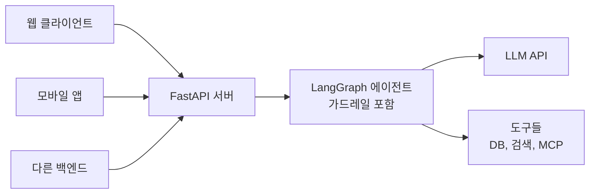
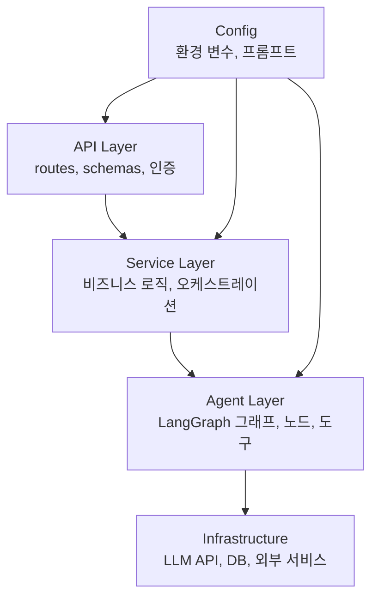
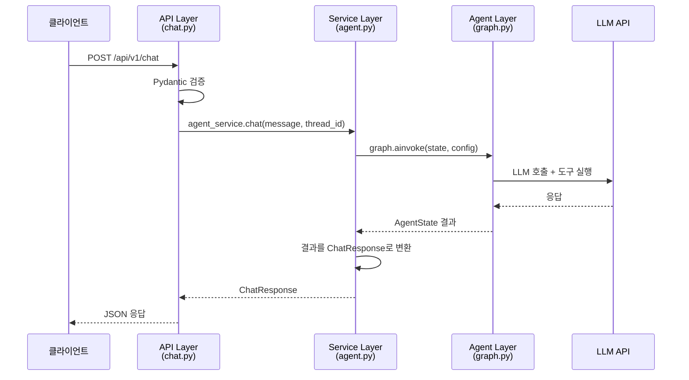
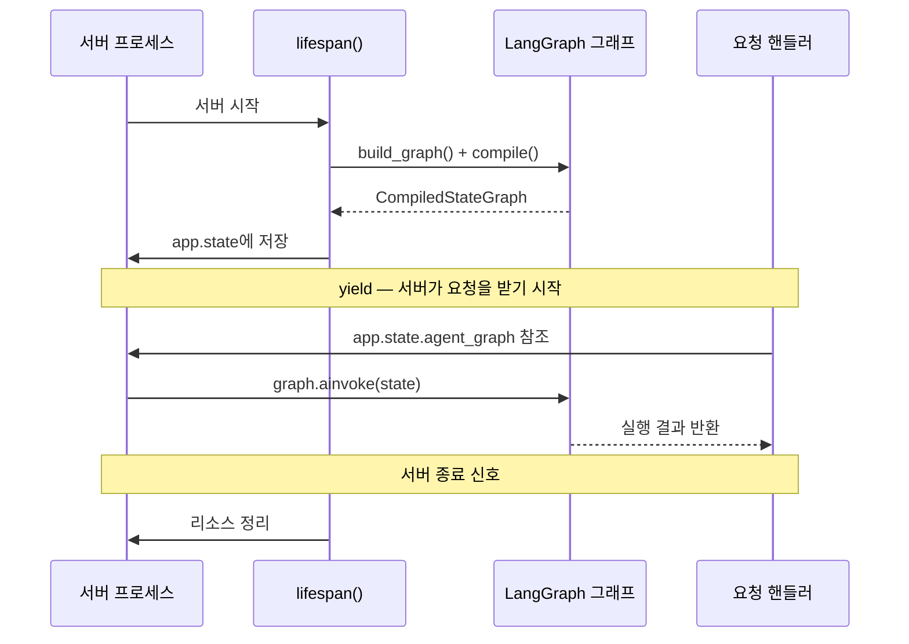
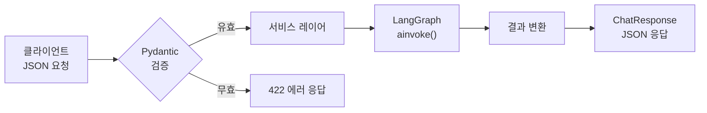
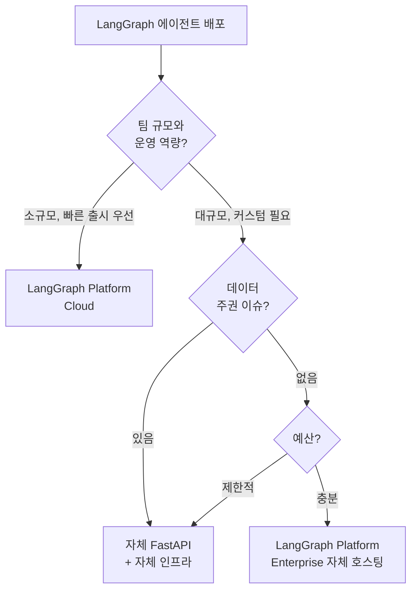
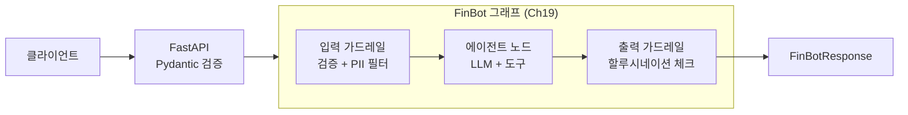

# FastAPI + LangGraph 통합

> LangGraph 에이전트를 FastAPI REST API로 감싸서 서비스로 배포하는 첫걸음

## 개요

이 섹션에서는 지금까지 만들어 온 LangGraph 에이전트를 실제 서비스로 배포하기 위해 FastAPI와 통합하는 방법을 배웁니다. 프로젝트 구조 설계부터 그래프 초기화, 동기/비동기 엔드포인트 설계, 그리고 요청/응답 모델 정의까지 프로덕션 수준의 통합 패턴을 다룹니다.

**선수 지식**: 
- [LangGraph StateGraph 기초](04-ch4-langgraph-stategraph-기초/01-01-langgraph-아키텍처-개관.md)에서 배운 그래프 컴파일 개념
- [가드레일 통합 실습](19-ch19-가드레일과-structured-output/05-05-가드레일-통합-실습.md)에서 구축한 FinBot 에이전트
- [Structured Output 기초](19-ch19-가드레일과-structured-output/03-03-structured-output-기초.md)에서 배운 Pydantic 스키마 설계 원칙
- Python `async/await` 기본 문법

**학습 목표**:
- FastAPI + LangGraph 통합 프로젝트의 계층 구조를 설계할 수 있다
- `CompiledStateGraph`를 FastAPI 라이프사이클에 맞게 초기화하고 관리할 수 있다
- 동기/비동기 엔드포인트를 설계하고 Pydantic으로 요청/응답을 검증할 수 있다
- Ch19에서 만든 가드레일 적용 에이전트를 API로 감싸는 과정을 실습할 수 있다
- LangGraph Platform과 자체 FastAPI 배포의 차이를 이해할 수 있다

## 왜 알아야 할까?

여러분이 만든 LangGraph 에이전트는 지금까지 Jupyter 노트북이나 로컬 스크립트에서만 동작했습니다. 하지만 실제 서비스에서는 **웹 클라이언트, 모바일 앱, 다른 백엔드 서비스**가 HTTP를 통해 에이전트와 대화해야 하죠. 이때 필요한 것이 바로 REST API 래핑입니다.

[Ch19의 가드레일 통합 실습](19-ch19-가드레일과-structured-output/05-05-가드레일-통합-실습.md)에서 입력 검증, PII 필터링, 할루시네이션 체크까지 갖춘 FinBot 에이전트를 완성했는데요. 아무리 잘 만든 에이전트라도 노트북에만 머물러 있으면 쓸모가 없겠죠? 이 챕터에서는 그 에이전트를 **실제 사용자가 접근할 수 있는 API 서비스**로 탈바꿈시킵니다.

왜 하필 FastAPI일까요? LangGraph는 Python 기반이고, FastAPI는 Python 웹 프레임워크 중 **비동기 성능이 가장 뛰어나면서도 타입 안전성**을 제공합니다. LLM 호출은 대부분 I/O 바운드 작업인데, FastAPI의 `async/await` 지원 덕분에 한 서버에서 수십~수백 개의 동시 요청을 효율적으로 처리할 수 있습니다.

> 📊 **그림 1**: 에이전트를 API로 노출하는 전체 그림



LangChain 팀이 제공하는 **LangGraph Platform**(구 LangSmith Deployments)을 쓸 수도 있지만, 자체 FastAPI 서버를 구축하면 **비용 통제, 커스터마이징 자유도, 벤더 종속 탈피** 같은 이점을 얻을 수 있습니다. 이 챕터에서는 자체 배포 경로를 중심으로 다루되, LangGraph Platform과의 비교도 함께 살펴봅니다.

## 핵심 개념

### 개념 1: 프로젝트 구조 — 관심사 분리

> 💡 **비유**: 레스토랑을 생각해 보세요. 홀(FastAPI)은 주문을 받고, 주방(LangGraph)은 요리를 하고, 레시피 북(프롬프트)은 따로 관리합니다. 홀 직원이 직접 요리하거나, 주방에서 주문서를 쓰면 안 되겠죠? 각자의 역할을 깔끔하게 나누는 것이 프로덕션 코드의 핵심입니다.

FastAPI와 LangGraph를 통합할 때 가장 중요한 원칙은 **계층 분리**입니다. HTTP 관심사(라우팅, 검증)와 에이전트 로직(그래프, 도구, 상태)을 물리적으로 분리해야 합니다.

> 📊 **그림 2**: 프로덕션 프로젝트의 계층 구조



각 계층의 역할을 좀 더 구체적으로 살펴볼까요?

| 계층 | 위치 | 역할 | 알아야 하는 것 |
|------|------|------|----------------|
| **API Layer** | `api/`, `schemas/` | HTTP 라우팅, 요청/응답 검증, 인증, OpenAPI 문서 | FastAPI, Pydantic |
| **Service Layer** | `services/` | 비즈니스 로직 조합, 그래프 호출 어댑터, 에러 변환 | 도메인 규칙 |
| **Agent Layer** | `agent/` | StateGraph 정의, 노드 함수, 도구, 상태 스키마, 프롬프트 | LangGraph, LangChain |
| **Infrastructure** | 외부 | LLM API, 벡터 DB, 체크포인터, 외부 API 연결 | 각 서비스 SDK |
| **Config** | `config.py`, `.env` | 환경 변수, API 키, 모델 설정, 프롬프트 템플릿 관리 | pydantic-settings |

실무에서 검증된 프로젝트 구조는 다음과 같습니다:

```
project/
├── app/
│   ├── __init__.py
│   ├── main.py              # FastAPI 앱 생성, 라우터 등록
│   ├── config.py            # 환경 변수, 설정 관리
│   ├── api/
│   │   ├── __init__.py
│   │   └── v1/
│   │       ├── __init__.py
│   │       ├── router.py    # API 라우터 모음
│   │       └── chat.py      # 채팅 엔드포인트
│   ├── schemas/
│   │   ├── __init__.py
│   │   └── chat.py          # Pydantic 요청/응답 모델
│   ├── services/
│   │   ├── __init__.py
│   │   └── agent.py         # 에이전트 서비스 (그래프 호출 어댑터)
│   └── agent/
│       ├── __init__.py
│       ├── graph.py          # LangGraph StateGraph 정의
│       ├── state.py          # 상태 스키마
│       ├── nodes.py          # 노드 함수들
│       ├── tools.py          # 도구 정의
│       └── prompts.py        # 시스템 프롬프트 관리
├── .env
├── pyproject.toml
└── Dockerfile
```

핵심은 `agent/` 디렉토리가 FastAPI에 대해 전혀 모른다는 것입니다. 그래프는 독립적으로 테스트할 수 있어야 하고, `services/agent.py`가 둘 사이를 연결하는 **어댑터** 역할을 합니다. 예를 들어 `agent.py` 서비스는 그래프의 실행 결과를 API 응답 스키마에 맞게 변환하고, 에이전트 레벨의 에러를 HTTP 상태 코드로 매핑하는 일을 담당하죠.

> 📊 **그림 3**: 요청이 계층을 통과하는 흐름



`agent/prompts.py`에서 시스템 프롬프트를 별도로 관리하면, 프롬프트 수정 시 그래프 코드를 건드리지 않아도 됩니다. 프롬프트 버전 관리나 A/B 테스트를 하기에도 유리하죠.

### 개념 2: 그래프 초기화와 라이프사이클 관리

> 💡 **비유**: 매 손님이 올 때마다 가게 문을 열고 닫을 순 없잖아요? 가게는 아침에 한 번 열고, 저녁에 한 번 닫습니다. LangGraph 그래프도 마찬가지예요. 요청마다 새로 컴파일하면 낭비이고, 서버 시작 시 한 번 만들어서 공유하는 게 맞습니다.

LangGraph의 `CompiledStateGraph`는 **스레드 안전(thread-safe)**합니다. 공식 GitHub 논의에서 확인된 바에 따르면, 컴파일된 그래프를 동시 요청 간에 공유해도 안전합니다. 따라서 서버 시작 시 한 번 컴파일하여 **애플리케이션 수준 단일 인스턴스(app-scoped singleton)**로 관리하는 것이 최선입니다.

엄밀히 말하면 GoF의 싱글턴 패턴(클래스 자체가 인스턴스 생성을 제어)은 아닙니다. `app.state`에 저장하는 방식은 **애플리케이션 스코프에서 하나의 인스턴스를 공유**하는 패턴인데, 실무에서는 이를 "app-scoped singleton"이라고 부르곤 합니다. 핵심은 동일한 `CompiledStateGraph` 인스턴스를 모든 요청이 재사용한다는 점이죠.

FastAPI는 `lifespan` 이벤트를 통해 이 패턴을 깔끔하게 지원합니다:

```python
from contextlib import asynccontextmanager
from fastapi import FastAPI

from app.agent.graph import build_graph
from app.config import settings


@asynccontextmanager
async def lifespan(app: FastAPI):
    """서버 시작/종료 시 리소스를 관리합니다."""
    # === 시작 시 (Startup) ===
    # 그래프를 한 번 컴파일하여 app.state에 저장
    graph = build_graph()
    app.state.agent_graph = graph
    print("✅ LangGraph 에이전트 초기화 완료")
    
    yield  # 서버가 요청을 처리하는 동안 유지
    
    # === 종료 시 (Shutdown) ===
    # 리소스 정리 (DB 연결 해제 등)
    print("🛑 서버 종료, 리소스 정리")


app = FastAPI(
    title="AI Agent API",
    version="1.0.0",
    lifespan=lifespan,
)
```

> 📊 **그림 4**: FastAPI 라이프사이클과 그래프 초기화 시점



체크포인터(Checkpointer)를 사용하는 경우에도 `lifespan` 안에서 초기화합니다. 특히 `AsyncPostgresSaver`처럼 비동기 리소스는 반드시 이 패턴을 사용해야 합니다:

```python
from langgraph.checkpoint.postgres.aio import AsyncPostgresSaver


@asynccontextmanager
async def lifespan(app: FastAPI):
    # 체크포인터 초기화 (비동기 컨텍스트 매니저)
    async with AsyncPostgresSaver.from_conn_string(
        settings.database_url
    ) as checkpointer:
        await checkpointer.setup()  # 테이블 생성
        
        graph = build_graph(checkpointer=checkpointer)
        app.state.agent_graph = graph
        app.state.checkpointer = checkpointer
        
        yield
        # async with 종료 시 자동으로 연결 정리
```

> ⚠️ **흔한 오해**: "요청마다 `StateGraph`를 새로 만들어야 상태가 섞이지 않는 것 아닌가?" — 아닙니다. `CompiledStateGraph`는 **상태를 내부에 보관하지 않습니다**. 상태는 `invoke()` 호출 시 입력으로 전달되고 결과로 반환되기 때문에, 같은 그래프 인스턴스를 동시에 여러 요청이 사용해도 전혀 문제없습니다.

### 개념 3: 요청/응답 스키마 설계

> 💡 **비유**: 식당의 주문서를 생각해 보세요. "아무거나 주세요"라고 적으면 주방이 혼란스럽겠죠? 메뉴판(스키마)을 명확히 정의하면, 잘못된 주문은 홀에서 먼저 걸러내고 주방까지 가지도 않습니다.

[Structured Output 기초](19-ch19-가드레일과-structured-output/03-03-structured-output-기초.md)에서 Pydantic `BaseModel`로 LLM 출력을 구조화하는 방법을 배웠죠? 여기서는 같은 Pydantic을 **API 입출력 검증** 용도로 활용합니다. 관점이 다릅니다 — Ch19.3에서는 "LLM이 정해진 스키마대로 응답하게 만드는 것"이 목적이었다면, 여기서는 **"클라이언트가 보낸 HTTP 요청이 유효한지 검증하고, 응답 형식을 표준화하는 것"**이 목적입니다.

```python
from pydantic import BaseModel, Field


# === 요청 스키마 (API 입력 검증용) ===
class ChatRequest(BaseModel):
    """채팅 요청 모델 — 클라이언트 입력을 검증"""
    message: str = Field(
        ...,
        min_length=1,
        max_length=4000,
        description="사용자 메시지",
        examples=["서울 날씨 알려줘"],
    )
    thread_id: str | None = Field(
        default=None,
        description="대화 스레드 ID (없으면 새 대화)",
    )
    model: str = Field(
        default="gpt-4o-mini",
        description="사용할 LLM 모델",
    )


# === 응답 스키마 (API 출력 표준화용) ===
class ToolCall(BaseModel):
    """에이전트가 호출한 도구 정보"""
    name: str
    args: dict


class ChatResponse(BaseModel):
    """채팅 응답 모델"""
    response: str = Field(description="에이전트 최종 응답")
    thread_id: str = Field(description="대화 스레드 ID")
    tool_calls: list[ToolCall] = Field(
        default_factory=list,
        description="사용된 도구 목록",
    )


class ErrorResponse(BaseModel):
    """에러 응답 모델"""
    error: str
    detail: str | None = None
```

> 📊 **그림 5**: 요청 흐름과 검증 단계



정리하면, Pydantic은 이 프로젝트에서 **두 가지 역할**을 동시에 수행합니다:

| 용도 | 위치 | 목적 |
|------|------|------|
| **Structured Output** (Ch19.3) | `agent/state.py`, 그래프 내부 | LLM 출력을 정해진 스키마로 강제 |
| **API 스키마** (이 섹션) | `schemas/chat.py`, API 계층 | HTTP 요청/응답 형식 검증 + OpenAPI 문서 생성 |

이 두 용도는 계층이 다르기 때문에 모델 클래스도 분리하는 것이 좋습니다. `schemas/`의 API 모델과 `agent/state.py`의 상태 스키마를 합치면 관심사가 섞여서 유지보수가 어려워집니다.

### 개념 4: 동기 vs 비동기 엔드포인트

LLM API 호출은 수 초가 걸리는 I/O 바운드 작업입니다. FastAPI에서 동기 함수(`def`)를 쓰면 그 시간 동안 워커 스레드 하나가 완전히 점유됩니다. 비동기 함수(`async def`)를 쓰면 I/O 대기 중 다른 요청을 처리할 수 있어요.

```python
import uuid

from fastapi import APIRouter, Request, HTTPException

from app.schemas.chat import ChatRequest, ChatResponse
from langchain_core.messages import HumanMessage

router = APIRouter(prefix="/api/v1", tags=["chat"])


@router.post("/chat", response_model=ChatResponse)
async def chat(request: Request, body: ChatRequest):
    """비동기 채팅 엔드포인트"""
    # 1. lifespan에서 초기화한 그래프 가져오기
    graph = request.app.state.agent_graph
    
    # 2. 스레드 ID 생성 또는 재사용
    thread_id = body.thread_id or str(uuid.uuid4())
    
    # 3. 그래프 실행 (비동기)
    config = {"configurable": {"thread_id": thread_id}}
    
    try:
        result = await graph.ainvoke(
            {"messages": [HumanMessage(content=body.message)]},
            config=config,
        )
    except Exception as e:
        raise HTTPException(status_code=500, detail=str(e))
    
    # 4. 응답 변환
    ai_message = result["messages"][-1]
    tool_calls = []
    
    # 중간에 호출된 도구 정보 수집
    for msg in result["messages"]:
        if hasattr(msg, "tool_calls") and msg.tool_calls:
            for tc in msg.tool_calls:
                tool_calls.append({"name": tc["name"], "args": tc["args"]})
    
    return ChatResponse(
        response=ai_message.content,
        thread_id=thread_id,
        tool_calls=tool_calls,
    )
```

> 🔥 **실무 팁**: LangGraph의 `invoke()`는 동기 메서드, `ainvoke()`는 비동기 메서드입니다. FastAPI의 `async def` 엔드포인트에서는 **반드시 `ainvoke()`**를 사용하세요. `async def` 안에서 동기 `invoke()`를 호출하면 이벤트 루프가 블로킹되어 전체 서버가 멈출 수 있습니다.

### 개념 5: 설정 관리 — pydantic-settings 활용

API 서버의 환경 변수를 관리할 때는 `pydantic-settings`의 `BaseSettings`를 사용합니다. Ch19.3에서 배운 `BaseModel`과 같은 Pydantic 생태계지만, `BaseSettings`는 **환경 변수(.env)와 자동 바인딩**된다는 점이 다릅니다. API 키, DB 연결 문자열, 디버그 플래그 같은 **배포 환경별로 달라지는 값**을 타입 안전하게 관리하는 용도에 특화되어 있죠.

```python
# app/config.py
from pydantic_settings import BaseSettings


class Settings(BaseSettings):
    app_name: str = "AI Agent API"
    openai_api_key: str          # 필수 — .env에 없으면 시작 시 에러
    database_url: str = "sqlite:///checkpoints.db"
    debug: bool = False
    max_message_length: int = 4000  # ChatRequest와 동기화

    model_config = {"env_file": ".env"}


settings = Settings()
```

`BaseSettings`는 `.env` 파일, 시스템 환경 변수, 생성자 인자 순으로 값을 탐색합니다. 필수 필드에 기본값을 주지 않으면 해당 환경 변수가 없을 때 **서버 시작 자체가 실패**하므로, 빠뜨린 설정을 프로덕션에서 뒤늦게 발견하는 사고를 방지할 수 있습니다.

### 개념 6: LangGraph Platform vs 자체 FastAPI 배포

LangGraph Platform(구 LangSmith Deployments)은 LangChain 팀이 제공하는 **관리형 배포 서비스**입니다. 2025년에 GA(일반 사용 가능)로 출시되었으며, 체크포인팅, 스트리밍, 크론 작업 등을 내장합니다. 자체 FastAPI 서버와 어떤 차이가 있을까요?

| 기준 | LangGraph Platform | 자체 FastAPI 배포 |
|------|-------------------|------------------|
| **설정 난이도** | 낮음 (langgraph.json만 작성) | 높음 (직접 구현) |
| **커스터마이징** | 제한적 | 무제한 |
| **비용** | 노드 실행 기준 과금 (Free: 100K/월) | 인프라 비용만 |
| **체크포인팅** | 내장 | 직접 구현 |
| **스트리밍** | 내장 | 직접 구현 |
| **인증** | 내장 | 직접 구현 |
| **벤더 종속** | LangChain 생태계 | 없음 |
| **자체 호스팅** | Enterprise 플랜 지원 | 완전 자유 |

> 📊 **그림 6**: 배포 옵션 의사결정 흐름



이 챕터에서는 자체 FastAPI 배포를 중심으로 다룹니다. 스트리밍, 인증, 스케일링까지 직접 구현해 보면, LangGraph Platform이 어떤 가치를 제공하는지도 자연스럽게 이해할 수 있거든요.

## 실습: 직접 해보기

간단한 도구를 가진 LangGraph 에이전트를 FastAPI로 감싸서 동작하는 API 서버를 만들어 보겠습니다.

먼저 필요한 패키지를 설치합니다:

```console
pip install fastapi uvicorn langchain-openai langgraph pydantic-settings
```

### 1단계: 에이전트 그래프 정의

```python
# app/agent/graph.py
"""LangGraph 에이전트 그래프 정의"""

from typing import Annotated

from langchain_core.messages import AnyMessage
from langchain_core.tools import tool
from langchain_openai import ChatOpenAI
from langgraph.graph import StateGraph, START, END
from langgraph.graph.message import add_messages
from langgraph.prebuilt import ToolNode
from typing_extensions import TypedDict


# --- 상태 스키마 ---
class AgentState(TypedDict):
    messages: Annotated[list[AnyMessage], add_messages]


# --- 도구 정의 ---
@tool
def get_weather(city: str) -> str:
    """도시의 현재 날씨를 조회합니다."""
    # 실제로는 외부 API를 호출
    weather_data = {
        "서울": "맑음, 22°C",
        "부산": "흐림, 19°C",
        "제주": "비, 17°C",
    }
    return weather_data.get(city, f"{city}의 날씨 정보를 찾을 수 없습니다.")


@tool
def calculate(expression: str) -> str:
    """수학 계산식을 평가합니다."""
    try:
        # 안전한 수식 평가 (실무에서는 더 엄격한 검증 필요)
        allowed = set("0123456789+-*/.(). ")
        if not all(c in allowed for c in expression):
            return "허용되지 않은 문자가 포함되어 있습니다."
        result = eval(expression)  # 실무에서는 ast.literal_eval 또는 별도 파서 사용
        return str(result)
    except Exception as e:
        return f"계산 오류: {e}"


tools = [get_weather, calculate]


# --- 그래프 빌드 ---
def build_graph(checkpointer=None):
    """LangGraph 에이전트를 빌드하고 컴파일합니다."""
    llm = ChatOpenAI(model="gpt-4o-mini", temperature=0)
    llm_with_tools = llm.bind_tools(tools)

    def call_model(state: AgentState) -> dict:
        """LLM을 호출하는 노드"""
        response = llm_with_tools.invoke(state["messages"])
        return {"messages": [response]}

    def should_continue(state: AgentState) -> str:
        """도구 호출이 필요한지 판단하는 라우터"""
        last_message = state["messages"][-1]
        if last_message.tool_calls:
            return "tools"
        return END

    # 그래프 구성
    builder = StateGraph(AgentState)
    builder.add_node("agent", call_model)
    builder.add_node("tools", ToolNode(tools))

    builder.add_edge(START, "agent")
    builder.add_conditional_edges("agent", should_continue, ["tools", END])
    builder.add_edge("tools", "agent")

    return builder.compile(checkpointer=checkpointer)
```

### 2단계: 설정과 스키마 정의

```python
# app/config.py
"""환경 변수 기반 설정 관리"""

from pydantic_settings import BaseSettings


class Settings(BaseSettings):
    app_name: str = "AI Agent API"
    openai_api_key: str
    database_url: str = "sqlite:///checkpoints.db"
    debug: bool = False

    model_config = {"env_file": ".env"}


settings = Settings()
```

```python
# app/schemas/chat.py
"""API 요청/응답 Pydantic 모델"""

from pydantic import BaseModel, Field


class ChatRequest(BaseModel):
    message: str = Field(..., min_length=1, max_length=4000)
    thread_id: str | None = None


class ToolCallInfo(BaseModel):
    name: str
    args: dict


class ChatResponse(BaseModel):
    response: str
    thread_id: str
    tool_calls: list[ToolCallInfo] = []
```

### 3단계: FastAPI 앱 조립

```python
# app/main.py
"""FastAPI 앱 생성 및 라이프사이클 관리"""

import uuid
from contextlib import asynccontextmanager

from fastapi import FastAPI, HTTPException, Request
from langchain_core.messages import HumanMessage
from langgraph.checkpoint.memory import MemorySaver

from app.agent.graph import build_graph
from app.schemas.chat import ChatRequest, ChatResponse, ToolCallInfo


@asynccontextmanager
async def lifespan(app: FastAPI):
    """서버 시작/종료 시 리소스 관리"""
    # 메모리 체크포인터 (프로덕션에서는 PostgresSaver 사용)
    checkpointer = MemorySaver()
    graph = build_graph(checkpointer=checkpointer)
    app.state.graph = graph
    yield


app = FastAPI(title="AI Agent API", version="1.0.0", lifespan=lifespan)


@app.get("/health")
async def health():
    """헬스 체크 엔드포인트"""
    return {"status": "healthy"}


@app.post("/api/v1/chat", response_model=ChatResponse)
async def chat(request: Request, body: ChatRequest):
    """에이전트와 대화합니다."""
    graph = request.app.state.graph
    thread_id = body.thread_id or str(uuid.uuid4())
    config = {"configurable": {"thread_id": thread_id}}

    try:
        result = await graph.ainvoke(
            {"messages": [HumanMessage(content=body.message)]},
            config=config,
        )
    except Exception as e:
        raise HTTPException(status_code=500, detail=str(e))

    # 응답 추출
    ai_message = result["messages"][-1]
    tool_calls = []
    for msg in result["messages"]:
        if hasattr(msg, "tool_calls") and msg.tool_calls:
            for tc in msg.tool_calls:
                tool_calls.append(
                    ToolCallInfo(name=tc["name"], args=tc["args"])
                )

    return ChatResponse(
        response=ai_message.content,
        thread_id=thread_id,
        tool_calls=tool_calls,
    )
```

### 4단계: 서버 실행 및 테스트

서버를 실행합니다:

```console
uvicorn app.main:app --reload --port 8000
```

다른 터미널에서 API를 테스트합니다:

```run:python
import json

# curl 명령어 시뮬레이션 (실제로는 httpx 또는 requests 사용)
request_body = {
    "message": "서울 날씨 알려줘",
    "thread_id": None,
}
print("📤 요청:")
print(json.dumps(request_body, ensure_ascii=False, indent=2))

# 예상 응답 구조
response_body = {
    "response": "서울의 현재 날씨는 맑음, 22°C입니다.",
    "thread_id": "a1b2c3d4-e5f6-7890-abcd-ef1234567890",
    "tool_calls": [
        {"name": "get_weather", "args": {"city": "서울"}}
    ],
}
print("\n📥 응답:")
print(json.dumps(response_body, ensure_ascii=False, indent=2))
```

```output
📤 요청:
{
  "message": "서울 날씨 알려줘",
  "thread_id": null
}

📥 응답:
{
  "response": "서울의 현재 날씨는 맑음, 22°C입니다.",
  "thread_id": "a1b2c3d4-e5f6-7890-abcd-ef1234567890",
  "tool_calls": [
    {
      "name": "get_weather",
      "args": {
        "city": "서울"
      }
    }
  ]
}
```

FastAPI가 자동 생성하는 **Swagger UI**(`http://localhost:8000/docs`)에서 직접 테스트해 볼 수도 있습니다. Pydantic 스키마 덕분에 요청/응답 모델이 문서에 자동으로 반영되죠.

실제 `curl` 명령으로 테스트할 경우:

```console
curl -X POST http://localhost:8000/api/v1/chat \
  -H "Content-Type: application/json" \
  -d '{"message": "서울 날씨 알려줘"}'
```

### 보너스: Ch19 FinBot 에이전트를 FastAPI로 감싸기

[가드레일 통합 실습](19-ch19-가드레일과-structured-output/05-05-가드레일-통합-실습.md)에서 만든 FinBot은 입력 검증, PII 필터링, 할루시네이션 체크 가드레일이 적용된 금융 에이전트였습니다. 이미 가드레일이 그래프 노드로 내장되어 있으므로, FastAPI로 감싸는 것은 놀라울 정도로 간단합니다. 기존 패턴을 그대로 따르면 됩니다:

```python
# app/agent/finbot_graph.py
"""Ch19 FinBot 에이전트를 FastAPI용으로 래핑"""

from app.agent.finbot import build_finbot_graph  # Ch19에서 만든 그래프


def build_graph(checkpointer=None):
    """FinBot 그래프를 빌드합니다.
    
    가드레일(입력 검증, PII 필터링, 할루시네이션 체크)은
    이미 그래프 노드에 포함되어 있으므로 별도 처리가 필요 없습니다.
    """
    return build_finbot_graph(checkpointer=checkpointer)
```

```python
# app/schemas/finbot.py
"""FinBot 전용 요청/응답 스키마"""

from pydantic import BaseModel, Field


class FinBotRequest(BaseModel):
    message: str = Field(
        ..., min_length=1, max_length=4000,
        description="금융 관련 질문",
        examples=["삼성전자 주가 알려줘", "ETF 포트폴리오 추천해줘"],
    )
    thread_id: str | None = None
    risk_profile: str = Field(
        default="moderate",
        description="투자 성향 (conservative, moderate, aggressive)",
    )


class GuardrailInfo(BaseModel):
    """가드레일 실행 결과"""
    input_validated: bool = True
    pii_filtered: bool = False
    hallucination_checked: bool = True


class FinBotResponse(BaseModel):
    response: str
    thread_id: str
    guardrails: GuardrailInfo = GuardrailInfo()
    disclaimer: str = "본 응답은 투자 조언이 아닙니다."
```

> 📊 **그림 7**: FinBot + FastAPI 통합 아키텍처



핵심 포인트는 이겁니다: **가드레일이 그래프 내부에 노드로 존재**하기 때문에 API 계층에서 별도로 가드레일 로직을 구현할 필요가 없습니다. FastAPI 쪽에서는 HTTP 수준의 검증(Pydantic 스키마)만 담당하고, 비즈니스 로직 수준의 안전장치는 그래프가 알아서 처리합니다. 이것이 바로 계층 분리의 힘이죠.

`lifespan`에서 `build_graph()`를 `build_finbot_graph()`로 교체하기만 하면, 앞서 만든 모든 FastAPI 인프라(라이프사이클, 체크포인터, 엔드포인트 패턴)를 그대로 재활용할 수 있습니다.

## 더 깊이 알아보기

### FastAPI의 탄생 스토리

FastAPI는 2018년 Sebastián Ramírez가 만들었습니다. 그는 Flask, Django REST Framework 등 기존 프레임워크를 사용하면서 **타입 안전성과 비동기 성능, 자동 문서화를 동시에 제공하는 프레임워크가 없다**는 불편함을 느꼈죠. Python 3.6에서 도입된 타입 힌트와 Starlette(비동기 웹 프레임워크), Pydantic(데이터 검증 라이브러리)을 결합하여 FastAPI를 탄생시켰습니다.

놀랍게도, FastAPI는 출시 3년 만에 GitHub 스타 수에서 Flask를 넘어섰고, 현재 Python 웹 프레임워크 중 가장 빠르게 성장하고 있습니다. LLM 시대가 도래하면서 **비동기 I/O 처리 능력**이 더욱 중요해졌고, FastAPI + LangGraph 조합은 AI 에이전트 서빙의 사실상 표준(de facto standard)이 되어 가고 있습니다.

### LangGraph Platform의 진화

LangChain 팀은 원래 LangServe라는 배포 도구를 제공했지만, LangGraph의 **상태 기반 에이전트**를 제대로 지원하기 어려웠습니다. 2024년 말부터 LangGraph Platform(당시 LangGraph Cloud)을 개발하기 시작했고, 2025년에 GA로 출시했습니다. 이후 LangSmith Deployments로 리브랜딩하면서, 기존 LangSmith 트레이싱/평가 도구와 통합되었습니다. 흥미로운 점은 이 플랫폼 자체가 내부적으로 FastAPI를 사용한다는 것이죠.

## 흔한 오해와 팁

> ⚠️ **흔한 오해**: "`async def`로 엔드포인트를 만들면 무조건 빠르다." — 아닙니다. `async def` 안에서 동기 블로킹 호출(`invoke()`, `time.sleep()`, 동기 DB 쿼리 등)을 하면 오히려 이벤트 루프 전체가 멈춥니다. 반드시 `ainvoke()` 같은 비동기 메서드를 사용하세요. 만약 동기 코드를 피할 수 없다면, FastAPI의 일반 `def` 엔드포인트를 사용하세요. FastAPI가 자동으로 스레드풀에서 실행합니다.

> 💡 **알고 계셨나요?**: FastAPI의 자동 문서화 기능은 OpenAPI(구 Swagger) 명세를 기반으로 합니다. Pydantic 모델에 `Field(description=...)`, `examples=[...]`를 풍부하게 작성하면, 프론트엔드 개발자가 별도 문서 없이도 `/docs` 페이지만으로 API를 이해하고 테스트할 수 있습니다. 에이전트 API의 경우 특히 응답 지연 시간이 길 수 있으므로, `description`에 "응답까지 5~30초 소요 가능" 같은 정보를 넣어두면 좋습니다.

> 🔥 **실무 팁**: `app.state`에 그래프를 저장할 때, 체크포인터의 라이프사이클에 주의하세요. `MemorySaver`는 프로세스 재시작 시 모든 상태가 사라지므로 개발용으로만 적합합니다. 프로덕션에서는 `AsyncPostgresSaver`를 `lifespan`의 `async with` 블록 안에서 초기화하여, 서버 종료 시 연결이 깔끔하게 정리되도록 해야 합니다.

## 핵심 정리

| 개념 | 설명 |
|------|------|
| 계층 분리 | API(라우팅) / Service(비즈니스 로직) / Agent(그래프, 노드, 도구, 프롬프트) / Infra(LLM, DB) 4계층 |
| lifespan | `@asynccontextmanager`로 서버 시작/종료 시 리소스 초기화/정리 |
| app-scoped singleton | `CompiledStateGraph`는 스레드 안전 — `app.state`에 한 번 저장, 모든 요청이 공유 |
| ainvoke() | `async def` 엔드포인트에서는 반드시 비동기 `ainvoke()` 사용 |
| Pydantic 이중 역할 | API 스키마(입출력 검증)와 Structured Output(LLM 출력 강제)은 계층을 분리하여 관리 |
| pydantic-settings | `BaseSettings`로 환경 변수를 타입 안전하게 관리, 누락 시 시작 실패로 조기 발견 |
| 가드레일 통합 | Ch19에서 그래프 노드로 구현한 가드레일은 FastAPI 래핑 시 그대로 동작 |
| LangGraph Platform | 관리형 배포 서비스. 빠른 출시엔 유리하나 벤더 종속 고려 필요 |

## 다음 섹션 미리보기

지금까지 만든 API는 요청을 보내면 **에이전트가 모든 작업을 끝낼 때까지 기다린 후** 한 번에 응답을 돌려줍니다. LLM 호출이 여러 번 반복되는 에이전트에서는 사용자가 10초 이상 빈 화면을 보게 될 수 있죠. [다음 섹션 — 스트리밍 응답 구현](20-ch20-fastapi-배포와-프로덕션-운영/02-02-스트리밍-응답-구현.md)에서는 **SSE(Server-Sent Events)**와 **WebSocket**을 활용하여 에이전트의 사고 과정과 중간 결과를 실시간으로 스트리밍하는 방법을 다룹니다.

## 참고 자료

- [LangGraph 공식 문서](https://docs.langchain.com/oss/python/langgraph/overview) - LangGraph 아키텍처, StateGraph, 체크포인터 등 핵심 레퍼런스
- [FastAPI 공식 문서 — Lifespan Events](https://fastapi.tiangolo.com/advanced/events/) - `lifespan` 패턴과 리소스 초기화에 대한 공식 가이드
- [fastapi-langgraph-agent-production-ready-template (GitHub)](https://github.com/wassim249/fastapi-langgraph-agent-production-ready-template) - 인증, 로깅, 메트릭스 등 프로덕션 패턴이 포함된 템플릿
- [How to use LangGraph within a FastAPI Backend (DEV Community)](https://dev.to/anuragkanojiya/how-to-use-langgraph-within-a-fastapi-backend-amm) - 기본적인 통합 패턴을 단계별로 설명하는 튜토리얼
- [LangGraph Platform GA 발표](https://blog.langchain.com/langgraph-platform-ga/) - LangGraph Platform의 GA 출시와 관리형 배포 옵션에 대한 공식 포스트
- [CompiledStateGraph 스레드 안전성 논의 (GitHub)](https://github.com/langchain-ai/langgraph/discussions/1211) - 컴파일된 그래프의 동시성 안전성에 대한 공식 확인

---
### 🔗 Related Sessions
- [stategraph](04-ch4-langgraph-stategraph-기초/01-01-langgraph-아키텍처-개관.md) (prerequisite)
- [compile()](04-ch4-langgraph-stategraph-기초/01-01-langgraph-아키텍처-개관.md) (prerequisite)
- [toolnode](04-ch4-langgraph-stategraph-기초/05-05-첫-번째-langgraph-에이전트.md) (prerequisite)
- [add_messages](03-ch3-대화-메모리와-상태-관리/01-01-대화-메모리의-기초.md) (prerequisite)
- [memorysaver](03-ch3-대화-메모리와-상태-관리/01-01-대화-메모리의-기초.md) (prerequisite)
- [compiledstategraph](04-ch4-langgraph-stategraph-기초/01-01-langgraph-아키텍처-개관.md) (prerequisite)
