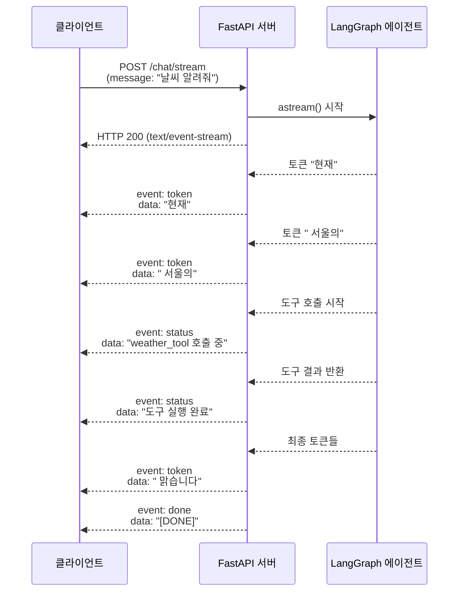
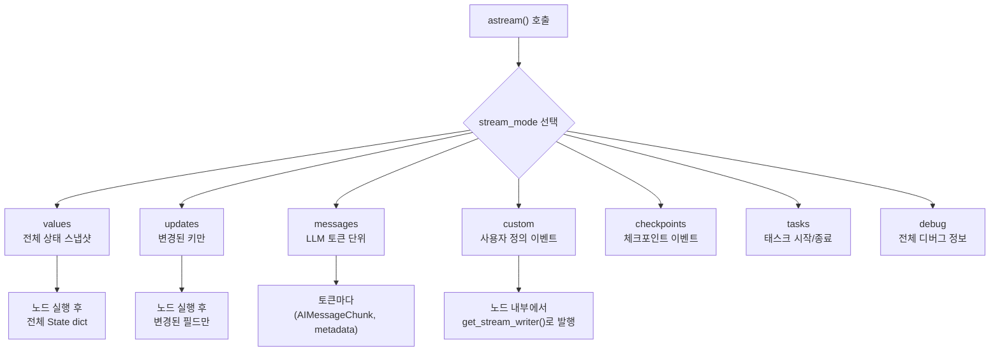
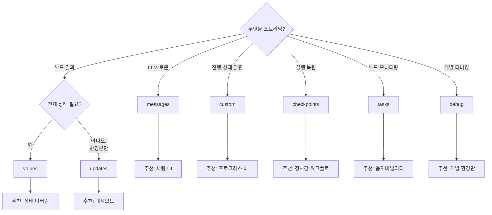
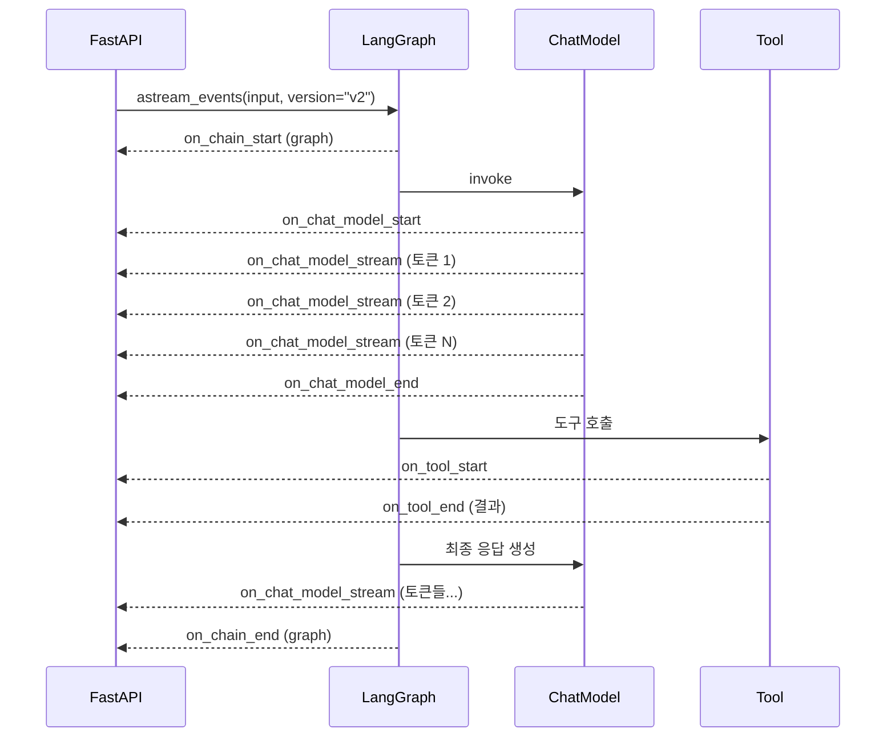
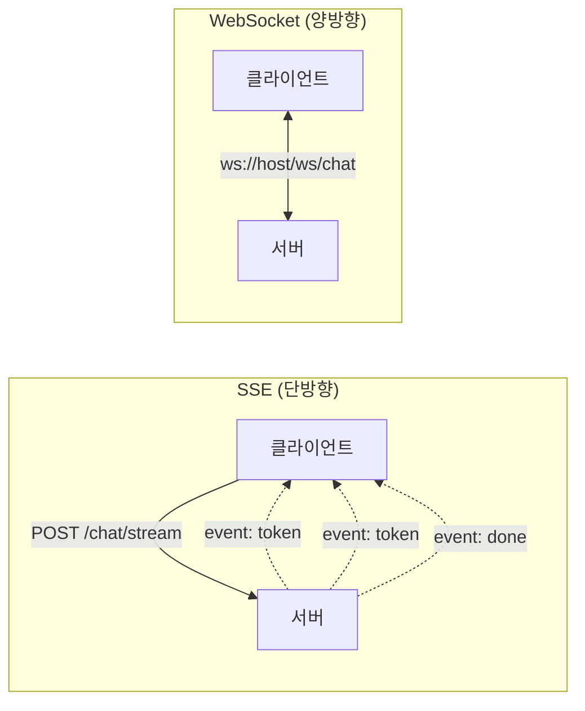

# 스트리밍 응답 구현

> LangGraph 에이전트의 중간 결과와 토큰을 SSE와 WebSocket으로 실시간 전송하는 방법을 학습합니다.

## 개요

이 섹션에서는 [이전 섹션](20-ch20-fastapi-배포와-프로덕션-운영/01-01-fastapi-langgraph-통합.md)에서 구축한 FastAPI + LangGraph 통합 위에, 사용자에게 **실시간 스트리밍 응답**을 제공하는 방법을 학습합니다. `ainvoke()` 한 번 호출로 최종 결과만 돌려주는 방식에서 벗어나, 토큰이 생성될 때마다 즉시 전송하는 기법을 익힙니다.

**선수 지식**: FastAPI + LangGraph 통합 기초 (세션 20.1), LangGraph StateGraph 기본 (Ch4~5), 비동기 Python (`async`/`await`)
**학습 목표**:
- SSE(Server-Sent Events) 기반 스트리밍 엔드포인트를 구현할 수 있다
- LangGraph의 `astream()` 스트림 모드 7가지를 이해하고 선택할 수 있다
- WebSocket 기반 실시간 양방향 통신을 구현할 수 있다
- SSE vs WebSocket의 트레이드오프를 판단하고 상황에 맞게 선택할 수 있다

## 왜 알아야 할까?

ChatGPT나 Claude를 사용해보셨다면, 답변이 한 글자씩 또는 단어 단위로 흘러나오는 경험을 해보셨을 겁니다. 이것이 바로 **스트리밍 응답**이에요. 만약 에이전트가 30초 동안 여러 도구를 호출하고 추론한 뒤에야 결과를 한 번에 보여준다면? 사용자는 "앱이 멈춘 건가?" 하고 브라우저 새로고침 버튼을 누를 겁니다.

스트리밍은 단순한 UX 개선이 아닙니다. 에이전트 시스템에서는 **중간 상태 전송**이 핵심입니다 — "지금 검색 도구를 호출 중입니다", "3개 문서를 찾았습니다", "답변을 생성하고 있습니다" 같은 진행 상황을 실시간으로 보여줄 수 있거든요. 이전 세션에서 만든 `/chat` 엔드포인트의 `ainvoke()`를 `astream()`으로 바꾸는 것만으로도 사용자 체감 응답 시간을 **수십 초에서 수백 밀리초로** 줄일 수 있습니다.

## 핵심 개념

### 개념 1: SSE(Server-Sent Events)의 이해

> 💡 **비유**: SSE는 라디오 방송과 같습니다. 라디오 주파수를 맞추면(연결하면) 방송국(서버)이 일방적으로 음악과 뉴스를 보내줍니다. 청취자(클라이언트)는 듣기만 하고, 다른 채널을 듣고 싶으면 주파수를 바꿉니다(새 연결). 반면 WebSocket은 전화 통화 — 양쪽이 동시에 말할 수 있죠.

SSE는 HTTP 위에서 동작하는 **단방향 스트리밍 프로토콜**입니다. 서버가 `text/event-stream` Content-Type으로 응답하면, 클라이언트는 연결을 유지한 채 이벤트를 계속 수신합니다.

> 📊 **그림 1**: SSE 통신 흐름



SSE 이벤트는 아래와 같은 텍스트 형식을 따릅니다:

```
event: token
data: {"content": "현재"}
id: 1

event: status  
data: {"step": "tool_call", "tool": "weather"}
id: 2

```

각 이벤트는 빈 줄(`\n\n`)로 구분되고, `event`(이벤트 타입), `data`(페이로드), `id`(이벤트 ID, 재연결 시 활용)로 구성됩니다.

FastAPI에서 SSE를 구현하는 방법은 두 가지입니다:

**방법 1: FastAPI 내장 SSE (v0.135.0+)**

```python
from fastapi import FastAPI
from fastapi.sse import EventSourceResponse, ServerSentEvent
from collections.abc import AsyncIterable

app = FastAPI()

@app.post("/chat/stream", response_class=EventSourceResponse)
async def chat_stream(request: ChatRequest) -> AsyncIterable[ServerSentEvent]:
    async def generate():
        # LangGraph 스트리밍
        async for chunk in graph.astream(
            {"messages": [HumanMessage(content=request.message)]},
            stream_mode="messages",
        ):
            msg_chunk, metadata = chunk["data"]
            if msg_chunk.content:
                yield ServerSentEvent(
                    data={"token": msg_chunk.content},  # 자동 JSON 직렬화
                    event="token",
                )
        yield ServerSentEvent(data="[DONE]", event="done")
    
    return EventSourceResponse(generate())
```

**방법 2: sse-starlette 패키지**

```python
from sse_starlette import EventSourceResponse
import json

@app.post("/chat/stream")
async def chat_stream(request: ChatRequest):
    async def generate():
        async for chunk in graph.astream(
            {"messages": [HumanMessage(content=request.message)]},
            stream_mode="messages",
        ):
            msg_chunk, metadata = chunk["data"]
            if msg_chunk.content:
                yield json.dumps({
                    "event": "token",
                    "content": msg_chunk.content,
                })
        yield json.dumps({"event": "done"})
    
    return EventSourceResponse(generate(), media_type="text/event-stream")
```

> 🔥 **실무 팁**: FastAPI v0.135.0+ 내장 SSE는 keep-alive 핑(15초 간격), `Cache-Control: no-cache`, `X-Accel-Buffering: no`(Nginx 호환)를 자동 처리합니다. 프로덕션에서는 내장 SSE를 먼저 검토하세요.

### 개념 2: LangGraph 스트림 모드 완전 정복

> 💡 **비유**: 요리 과정을 생중계한다고 생각해보세요. `"values"` 모드는 매 단계마다 요리 전체 사진을 찍어 보내는 것이고, `"updates"` 모드는 "양파를 넣었습니다"처럼 변경 사항만 알려주는 것이며, `"messages"` 모드는 셰프가 하는 말을 한 글자씩 자막으로 보내는 것입니다.

LangGraph의 `astream()` 메서드는 **7가지 스트림 모드**를 지원합니다. 상황에 맞는 모드를 선택하는 것이 핵심이에요.

> 📊 **그림 2**: LangGraph 스트림 모드 비교



각 모드의 특성을 정리하면:

| 모드 | 출력 단위 | 주요 용도 | 데이터 양 |
|------|----------|----------|----------|
| `"values"` | 노드 완료 후 전체 상태 | 디버깅, 상태 추적 | 많음 |
| `"updates"` | 노드 완료 후 변경분만 | 중간 결과 표시 | 중간 |
| `"messages"` | LLM 토큰 단위 | 채팅 UI 스트리밍 | 적음 |
| `"custom"` | 개발자 정의 | 진행률, 상태 알림 | 선택적 |
| `"checkpoints"` | 체크포인트 시점 | 실행 복원 | 많음 |
| `"tasks"` | 태스크 시작/종료 | 모니터링 | 적음 |
| `"debug"` | 전체 디버그 | 개발 환경 | 매우 많음 |

#### 모드별 상세 설명과 출력 예시

**`"values"` — 전체 상태 스냅샷**

각 노드가 실행을 완료할 때마다 **전체 State 딕셔너리**를 통째로 내보냅니다. 상태 변화를 전후로 비교할 때 유용하지만, 메시지가 누적되면 데이터 양이 급증합니다.

```python
async for chunk in graph.astream(
    {"messages": [HumanMessage(content="안녕")]},
    stream_mode="values",
):
    # chunk = 전체 State dict
    messages = chunk["messages"]
    print(f"[values] 메시지 {len(messages)}개, 마지막: {messages[-1].content[:30]}")
```

**`"updates"` — 변경분만 전달**

각 노드가 실행 후 **해당 노드가 변경한 필드만** 내보냅니다. `"values"`보다 데이터 양이 적어서, 중간 노드의 결과를 UI에 표시할 때 적합합니다.

```python
async for chunk in graph.astream(
    {"messages": [HumanMessage(content="서울 날씨")]},
    stream_mode="updates",
):
    # chunk = {"node_name": {"변경된_키": 값}}
    for node_name, updates in chunk.items():
        print(f"[updates] 노드 '{node_name}'가 업데이트: {list(updates.keys())}")
```

**`"messages"` — LLM 토큰 단위 스트리밍**

LLM이 토큰을 생성할 때마다 `(AIMessageChunk, metadata)` 튜플을 내보냅니다. **채팅 UI 스트리밍의 표준**이며, ChatGPT 같은 타이핑 효과를 구현할 때 사용합니다.

```python
async for chunk in graph.astream(
    {"messages": [HumanMessage(content="안녕")]},
    stream_mode="messages",
):
    msg_chunk, metadata = chunk["data"]
    if msg_chunk.content:
        print(msg_chunk.content, end="", flush=True)
    # metadata에는 langgraph_node, langgraph_step 등 포함
```

**`"custom"` — 사용자 정의 이벤트**

노드 내부에서 `get_stream_writer()`를 호출해 **원하는 시점에 원하는 데이터**를 스트림에 삽입합니다. 진행률 표시, 단계 알림, 중간 결과 프리뷰 등 자유롭게 활용할 수 있어요.

```python
from langgraph.config import get_stream_writer

def search_node(state: State) -> dict:
    writer = get_stream_writer()
    writer({"step": "searching", "progress": 0.3})  # 30% 진행
    results = vector_store.search(state["query"])
    writer({"step": "found", "count": len(results), "progress": 1.0})
    return {"documents": results}
```

**`"checkpoints"` — 체크포인트 이벤트**

그래프 실행 중 체크포인트가 저장될 때마다 이벤트를 내보냅니다. **장시간 실행되는 워크플로**에서 중단 후 재개(resume)를 구현할 때 핵심적입니다. `MemorySaver`나 외부 체크포인터와 함께 사용합니다.

```python
async for chunk in graph.astream(
    {"messages": [HumanMessage(content="복잡한 작업")]},
    stream_mode="checkpoints",
):
    # 체크포인트 ID와 저장 시점 정보
    checkpoint_id = chunk["data"]["checkpoint_id"]
    print(f"[checkpoint] 저장됨: {checkpoint_id}")
```

**`"tasks"` — 태스크 시작/종료**

각 노드(태스크)의 **시작과 종료 시점**을 알려줍니다. 어떤 노드가 실행 중인지 모니터링하거나, 병렬 노드 실행 상황을 추적할 때 유용합니다.

```python
async for chunk in graph.astream(
    {"messages": [HumanMessage(content="안녕")]},
    stream_mode="tasks",
):
    # 태스크 시작/종료 이벤트
    task_info = chunk["data"]
    print(f"[tasks] {task_info.get('name')}: {task_info.get('status')}")
```

**`"debug"` — 전체 디버그 정보**

모든 내부 이벤트를 **로(raw) 레벨**로 출력합니다. 노드 입출력, 에지 결정, 체크포인트 등 모든 정보가 포함되어 데이터 양이 매우 많습니다. **개발 환경에서만 사용**하세요.

```python
async for chunk in graph.astream(
    {"messages": [HumanMessage(content="안녕")]},
    stream_mode="debug",
):
    event_type = chunk["data"].get("type", "unknown")
    print(f"[debug] {event_type}: {str(chunk['data'])[:100]}...")
```

> 📊 **그림 3**: 스트림 모드 선택 가이드



가장 자주 쓰는 조합은 `"messages"` + `"custom"`입니다:

```python
async for chunk in graph.astream(
    {"messages": [HumanMessage(content=query)]},
    stream_mode=["messages", "custom"],  # 복수 모드 동시 사용!
):
    if chunk["type"] == "messages":
        msg_chunk, metadata = chunk["data"]
        if msg_chunk.content:
            print(msg_chunk.content, end="", flush=True)
    elif chunk["type"] == "custom":
        print(f"\n[상태] {chunk['data']}")
```

**커스텀 스트림 이벤트 발행**도 중요한 패턴입니다. 노드 내부에서 `get_stream_writer()`를 사용하면 원하는 시점에 원하는 데이터를 스트림에 삽입할 수 있어요:

```python
from langgraph.config import get_stream_writer

def search_node(state: State) -> dict:
    writer = get_stream_writer()
    
    writer({"step": "searching", "message": "문서 검색 중..."})
    results = vector_store.search(state["query"])
    
    writer({"step": "found", "message": f"{len(results)}개 문서 발견"})
    
    return {"documents": results}
```

### 개념 3: astream_events() — 세밀한 이벤트 제어

> 💡 **비유**: `astream()`이 완성된 요리 사진을 보내준다면, `astream_events()`는 주방 CCTV입니다. 재료 준비 시작, 불 켜짐, 소스 첨가, 도구 세척까지 — 모든 이벤트를 날것 그대로 볼 수 있죠.

`astream_events()`는 LangChain/LangGraph 내부에서 발생하는 **모든 라이프사이클 이벤트**를 스트리밍합니다. `astream()`보다 세밀하지만 그만큼 복잡합니다.

> 📊 **그림 4**: astream_events 이벤트 흐름



주요 이벤트 타입:

| 이벤트 | 발생 시점 |
|--------|----------|
| `on_chain_start/end` | 그래프/체인 실행 시작/종료 |
| `on_chat_model_start/end` | LLM 호출 시작/완료 |
| `on_chat_model_stream` | LLM 토큰 하나 생성 |
| `on_tool_start/end` | 도구 호출 시작/완료 |

필터링으로 필요한 이벤트만 받을 수 있습니다:

```python
# 토큰 스트리밍만 받기
async for event in graph.astream_events(
    {"messages": [HumanMessage(content="안녕")]},
    version="v2",
    include_types=["on_chat_model_stream"],
):
    token = event["data"]["chunk"].content
    if token:
        print(token, end="", flush=True)
```

> ⚠️ **흔한 오해**: `astream_events()`가 항상 더 좋은 것은 아닙니다! LangGraph 공식 문서에서도 **토큰 스트리밍이 목적이라면 `astream(stream_mode="messages")`를 권장**합니다. `astream_events()`는 도구 호출 시작/종료, 체인 라이프사이클 같은 세밀한 이벤트가 필요할 때 사용하세요.

### 개념 4: WebSocket 기반 실시간 통신

> 💡 **비유**: SSE가 라디오 방송이라면, WebSocket은 **전화 통화**입니다. 한번 연결되면 양쪽이 자유롭게 대화할 수 있어요. 사용자가 "잠깐, 그거 말고 다른 걸로" 하고 중간에 끊어도 되고, 서버가 "아, 추가 정보가 있습니다" 하고 먼저 말을 걸 수도 있죠.

WebSocket은 HTTP 업그레이드를 통해 수립되는 **양방향 통신 채널**입니다. SSE와 달리 클라이언트도 스트리밍 중에 메시지를 보낼 수 있어서, 멀티턴 대화나 실시간 협업에 적합합니다.

> 📊 **그림 5**: SSE vs WebSocket 아키텍처 비교



FastAPI에서 WebSocket 스트리밍 엔드포인트를 구현하는 패턴:

```python
from fastapi import FastAPI, WebSocket, WebSocketDisconnect
from langchain_core.messages import HumanMessage
import json

@app.websocket("/ws/chat")
async def websocket_chat(websocket: WebSocket):
    await websocket.accept()
    
    try:
        while True:
            # 클라이언트 메시지 수신 (양방향!)
            data = await websocket.receive_json()
            message = data.get("message", "")
            thread_id = data.get("thread_id", "default")
            
            # 스트리밍 시작 알림
            await websocket.send_json({"type": "stream_start"})
            
            # LangGraph 스트리밍
            async for chunk in graph.astream(
                {"messages": [HumanMessage(content=message)]},
                config={"configurable": {"thread_id": thread_id}},
                stream_mode="messages",
            ):
                msg_chunk, metadata = chunk["data"]
                if msg_chunk.content:
                    await websocket.send_json({
                        "type": "token",
                        "content": msg_chunk.content,
                        "node": metadata.get("langgraph_node", ""),
                    })
            
            # 스트리밍 종료 알림
            await websocket.send_json({"type": "stream_end"})
            
    except WebSocketDisconnect:
        print("클라이언트 연결 종료")
```

**SSE vs WebSocket — 언제 뭘 쓸까?**

| 기준 | SSE | WebSocket |
|------|-----|-----------|
| 통신 방향 | 서버 → 클라이언트 (단방향) | 양방향 |
| 프로토콜 | HTTP | WS (HTTP 업그레이드) |
| 자동 재연결 | 브라우저 `EventSource` API 내장 | 직접 구현 필요 |
| 프록시/CDN 호환성 | 우수 (표준 HTTP) | 일부 프록시에서 문제 |
| POST 본문 전송 | `fetch` + `ReadableStream` 필요 | 자유롭게 JSON 전송 |
| 연결 오버헤드 | 요청마다 새 연결 | 영속 연결 |
| **추천 시나리오** | 단일 요청 → 스트리밍 응답 | 멀티턴 채팅, 실시간 협업 |

> 🔥 **실무 팁**: 대부분의 AI 챗봇에서는 **SSE가 더 적합**합니다. ChatGPT, Claude 모두 SSE를 사용해요. WebSocket은 사용자가 스트리밍 도중 메시지를 보내거나, 여러 사용자가 같은 세션을 공유하는 협업 시나리오에서 선택하세요.

## 실습: 직접 해보기

SSE와 WebSocket 스트리밍을 모두 지원하는 완전한 FastAPI 서버를 구축해봅시다. [이전 섹션](20-ch20-fastapi-배포와-프로덕션-운영/01-01-fastapi-langgraph-통합.md)의 프로젝트 구조를 확장합니다.

```python
# app/schemas.py — 요청/응답 스키마
from pydantic import BaseModel, Field

class StreamRequest(BaseModel):
    """스트리밍 요청 스키마"""
    message: str = Field(..., min_length=1, max_length=4000)
    thread_id: str = Field(default="default")
    stream_mode: str = Field(
        default="messages",
        description="messages | updates | events"
    )
```

```python
# app/graph.py — 도구를 포함한 LangGraph 에이전트
from typing import TypedDict, Annotated
from langchain_core.messages import AnyMessage
from langchain_openai import ChatOpenAI
from langgraph.graph import StateGraph, START, END
from langgraph.graph.message import add_messages
from langgraph.prebuilt import ToolNode
from langgraph.config import get_stream_writer
from langchain_core.tools import tool

# 상태 정의
class AgentState(TypedDict):
    messages: Annotated[list[AnyMessage], add_messages]

# 도구 정의
@tool
def get_weather(city: str) -> str:
    """도시의 현재 날씨를 조회합니다."""
    # 실제로는 외부 API 호출
    weather_data = {
        "서울": "맑음, 22°C",
        "부산": "흐림, 19°C",
        "제주": "비, 17°C",
    }
    return weather_data.get(city, f"{city}의 날씨 정보를 찾을 수 없습니다.")

# LLM + 도구 바인딩
llm = ChatOpenAI(model="gpt-4o-mini", temperature=0)
llm_with_tools = llm.bind_tools([get_weather])

# 노드 함수
def call_model(state: AgentState) -> dict:
    """LLM 호출 노드 — 커스텀 스트림 이벤트 발행"""
    writer = get_stream_writer()
    writer({"step": "llm_start", "message": "LLM 추론 시작"})
    
    response = llm_with_tools.invoke(state["messages"])
    
    writer({"step": "llm_end", "message": "LLM 추론 완료"})
    return {"messages": [response]}

def should_continue(state: AgentState) -> str:
    """도구 호출 여부에 따른 라우팅"""
    last = state["messages"][-1]
    if hasattr(last, "tool_calls") and last.tool_calls:
        return "tools"
    return END

# 그래프 구성
def build_graph():
    builder = StateGraph(AgentState)
    builder.add_node("agent", call_model)
    builder.add_node("tools", ToolNode([get_weather]))
    
    builder.add_edge(START, "agent")
    builder.add_conditional_edges("agent", should_continue, ["tools", END])
    builder.add_edge("tools", "agent")
    
    return builder.compile()
```

```python
# app/main.py — SSE + WebSocket 스트리밍 서버
import json
import asyncio
from contextlib import asynccontextmanager
from fastapi import FastAPI, WebSocket, WebSocketDisconnect
from fastapi.sse import EventSourceResponse, ServerSentEvent
from collections.abc import AsyncIterable
from langchain_core.messages import HumanMessage, AIMessageChunk

from app.schemas import StreamRequest
from app.graph import build_graph

@asynccontextmanager
async def lifespan(app: FastAPI):
    """앱 시작 시 그래프 싱글턴 초기화"""
    app.state.graph = build_graph()
    print("LangGraph 에이전트 초기화 완료")
    yield
    print("앱 종료")

app = FastAPI(title="LangGraph Streaming API", lifespan=lifespan)


# ── SSE 스트리밍 엔드포인트 ──────────────────────────
@app.post("/chat/stream", response_class=EventSourceResponse)
async def chat_stream_sse(
    request: StreamRequest,
) -> AsyncIterable[ServerSentEvent]:
    """SSE 기반 스트리밍 — messages + custom 모드"""
    graph = app.state.graph
    
    async def generate():
        async for chunk in graph.astream(
            {"messages": [HumanMessage(content=request.message)]},
            config={"configurable": {"thread_id": request.thread_id}},
            stream_mode=["messages", "custom"],
        ):
            if chunk["type"] == "messages":
                msg_chunk, metadata = chunk["data"]
                # AIMessageChunk의 텍스트 토큰만 전송
                if hasattr(msg_chunk, "content") and msg_chunk.content:
                    yield ServerSentEvent(
                        data={"token": msg_chunk.content},
                        event="token",
                    )
                # 도구 호출 정보 전송
                if hasattr(msg_chunk, "tool_calls") and msg_chunk.tool_calls:
                    for tc in msg_chunk.tool_calls:
                        yield ServerSentEvent(
                            data={
                                "tool": tc["name"],
                                "args": tc["args"],
                            },
                            event="tool_call",
                        )
            elif chunk["type"] == "custom":
                # 노드 내부에서 발행한 커스텀 이벤트
                yield ServerSentEvent(
                    data=chunk["data"],
                    event="status",
                )
        
        # 스트리밍 종료 신호
        yield ServerSentEvent(data={"status": "complete"}, event="done")
    
    return EventSourceResponse(generate())


# ── WebSocket 스트리밍 엔드포인트 ─────────────────────
@app.websocket("/ws/chat")
async def websocket_chat(websocket: WebSocket):
    """WebSocket 기반 양방향 스트리밍"""
    await websocket.accept()
    graph = app.state.graph
    
    try:
        while True:
            # 클라이언트 메시지 수신
            data = await websocket.receive_json()
            message = data.get("message", "")
            thread_id = data.get("thread_id", "default")
            
            if not message:
                await websocket.send_json({
                    "type": "error",
                    "content": "message 필드가 필요합니다",
                })
                continue
            
            # 스트리밍 시작 알림
            await websocket.send_json({"type": "stream_start"})
            
            # LangGraph 스트리밍
            full_response = ""
            async for chunk in graph.astream(
                {"messages": [HumanMessage(content=message)]},
                config={"configurable": {"thread_id": thread_id}},
                stream_mode=["messages", "custom"],
            ):
                if chunk["type"] == "messages":
                    msg_chunk, metadata = chunk["data"]
                    if hasattr(msg_chunk, "content") and msg_chunk.content:
                        full_response += msg_chunk.content
                        await websocket.send_json({
                            "type": "token",
                            "content": msg_chunk.content,
                        })
                elif chunk["type"] == "custom":
                    await websocket.send_json({
                        "type": "status",
                        "data": chunk["data"],
                    })
            
            # 스트리밍 종료 + 전체 응답
            await websocket.send_json({
                "type": "stream_end",
                "full_response": full_response,
            })
    
    except WebSocketDisconnect:
        print(f"WebSocket 클라이언트 연결 종료")


# ── 헬스 체크 ─────────────────────────────────────────
@app.get("/health")
async def health():
    return {"status": "ok", "streaming": True}
```

서버를 실행하고 SSE 스트리밍을 테스트해봅시다:

```run:python
# 클라이언트 테스트 코드 (httpx-sse 사용)
# pip install httpx httpx-sse

import asyncio

# SSE 클라이언트 시뮬레이션
async def test_sse_client():
    """SSE 스트리밍 클라이언트 예시"""
    import httpx
    from httpx_sse import aconnect_sse
    
    async with httpx.AsyncClient() as client:
        async with aconnect_sse(
            client,
            "POST",
            "http://localhost:8000/chat/stream",
            json={"message": "서울 날씨 알려줘", "thread_id": "test-1"},
        ) as event_source:
            async for event in event_source.aiter_sse():
                if event.event == "token":
                    print(event.data, end="", flush=True)
                elif event.event == "status":
                    print(f"\n[상태] {event.data}")
                elif event.event == "done":
                    print(f"\n[완료]")
                    break

# JavaScript 클라이언트 예시 (참고용)
js_code = """
// 브라우저 EventSource (GET만 지원)
const es = new EventSource("/chat/stream?message=hello");
es.addEventListener("token", (e) => {
    document.getElementById("output").textContent += JSON.parse(e.data).token;
});

// POST를 지원하는 fetch + ReadableStream
async function streamChat(message) {
    const response = await fetch("/chat/stream", {
        method: "POST",
        headers: {"Content-Type": "application/json"},
        body: JSON.stringify({message, thread_id: "user-1"}),
    });
    
    const reader = response.body.getReader();
    const decoder = new TextDecoder();
    
    while (true) {
        const {done, value} = await reader.read();
        if (done) break;
        
        const text = decoder.decode(value);
        // SSE 이벤트 파싱
        for (const line of text.split("\\n")) {
            if (line.startsWith("data: ")) {
                const data = JSON.parse(line.slice(6));
                console.log(data);
            }
        }
    }
}
"""

print("=== SSE 클라이언트 코드 준비 완료 ===")
print("서버 실행: uvicorn app.main:app --reload")
print("테스트: python -c 'import asyncio; asyncio.run(test_sse_client())'")
```

```output
=== SSE 클라이언트 코드 준비 완료 ===
서버 실행: uvicorn app.main:app --reload
테스트: python -c 'import asyncio; asyncio.run(test_sse_client())'
```

WebSocket 클라이언트 테스트도 확인해봅시다:

```run:python
# WebSocket 클라이언트 시뮬레이션
import json

async def test_websocket_client():
    """WebSocket 스트리밍 클라이언트 예시"""
    import websockets
    
    async with websockets.connect("ws://localhost:8000/ws/chat") as ws:
        # 메시지 전송
        await ws.send(json.dumps({
            "message": "서울 날씨 알려줘",
            "thread_id": "ws-test-1",
        }))
        
        # 스트리밍 응답 수신
        while True:
            response = json.loads(await ws.recv())
            
            if response["type"] == "token":
                print(response["content"], end="", flush=True)
            elif response["type"] == "status":
                print(f"\n[상태] {response['data']}")
            elif response["type"] == "stream_end":
                print(f"\n[완료] 전체 응답: {response['full_response'][:50]}...")
                break

print("=== WebSocket 클라이언트 코드 준비 완료 ===")
print("설치: pip install websockets")
print("테스트: python -c 'import asyncio; asyncio.run(test_websocket_client())'")
```

```output
=== WebSocket 클라이언트 코드 준비 완료 ===
설치: pip install websockets
테스트: python -c 'import asyncio; asyncio.run(test_websocket_client())'
```

## 더 깊이 알아보기

### SSE의 탄생 — HTML5가 가져온 실시간 혁명

SSE는 2004년 Opera 브라우저 개발자 **Ian Hickson**이 제안한 "Server-Sent DOM Events" 사양에서 시작됐습니다. 당시 실시간 웹은 **Comet** 패턴이라 불리는 기법들 — long polling, hidden iframe, Flash Socket — 의 조합으로 구현되었는데, 이들은 모두 HTTP를 "속여서" 사용하는 해킹에 가까웠어요.

Hickson은 "서버에서 클라이언트로의 단방향 스트리밍은 HTTP 위에서 표준화할 수 있다"는 아이디어로 SSE를 설계했고, 2009년 HTML5 스펙의 일부로 공식 채택되었습니다. 핵심은 단순함이었죠 — 일반 HTTP 응답에 `text/event-stream` Content-Type만 지정하면 되니까요.

재미있는 건, WebSocket이 2011년 RFC 6455로 표준화되면서 SSE가 한동안 잊혀졌다는 점입니다. "양방향이 더 좋으니까"라는 논리였죠. 그런데 2022~2023년 LLM 시대가 열리면서 SSE가 화려하게 부활했습니다. OpenAI의 Chat Completions API가 SSE를 채택한 것이 결정적이었어요 — 토큰 단위 스트리밍에는 단방향이면 충분하고, HTTP 인프라와의 호환성이 양방향보다 훨씬 중요하다는 것이 입증된 셈입니다.

### LangGraph 스트리밍의 진화

LangGraph 초기에는 `astream_events()` (LangChain에서 상속)가 유일한 스트리밍 방법이었습니다. 하지만 이벤트가 너무 세밀하고 복잡해서, 2024년 후반 `astream()`에 `stream_mode` 파라미터가 추가되었어요. `"messages"` 모드의 등장이 게임 체인저였는데 — 토큰 스트리밍이라는 가장 흔한 유스케이스를 한 줄로 해결할 수 있게 된 것입니다. 2025년에는 `"custom"` 모드가 추가되어, 개발자가 노드 내부에서 임의의 이벤트를 스트림에 삽입할 수 있게 되었습니다.

## 흔한 오해와 팁

> ⚠️ **흔한 오해**: "WebSocket이 SSE보다 항상 낫다"는 생각은 위험합니다. WebSocket은 프록시/로드밸런서/CDN과의 호환성 문제가 있고, 자동 재연결 메커니즘도 직접 구현해야 합니다. 대부분의 AI 챗봇(ChatGPT, Claude, Gemini)은 SSE를 사용합니다. 양방향이 필요하지 않다면 SSE가 정답입니다.

> 💡 **알고 계셨나요?**: LangGraph의 `astream()` v2 포맷에서 `stream_mode`를 리스트로 전달하면 여러 모드를 **동시에** 받을 수 있습니다. `["messages", "custom", "updates"]`처럼요. 각 청크의 `chunk["type"]`으로 구분하면 됩니다. 이 기능 덕분에 토큰 스트리밍 + 상태 알림을 하나의 연결로 처리할 수 있습니다.

> 🔥 **실무 팁**: SSE 엔드포인트 앞에 Nginx를 두면 **buffering 문제**가 발생할 수 있습니다. Nginx가 청크를 모았다가 한꺼번에 전달하거든요. `X-Accel-Buffering: no` 헤더를 설정하거나, Nginx 설정에 `proxy_buffering off;`를 추가하세요. FastAPI 내장 SSE는 이 헤더를 자동으로 설정합니다.

## 핵심 정리

| 개념 | 설명 |
|------|------|
| SSE (Server-Sent Events) | HTTP 기반 단방향 스트리밍. `text/event-stream` Content-Type 사용 |
| `stream_mode="values"` | 노드 완료 시 전체 상태 스냅샷 전송. 디버깅/상태 추적용 |
| `stream_mode="updates"` | 노드 완료 시 변경된 필드만 전송. 대시보드/중간 결과용 |
| `stream_mode="messages"` | LLM 토큰 단위 스트리밍. 채팅 UI에 최적 |
| `stream_mode="custom"` | `get_stream_writer()`로 노드 내부에서 커스텀 이벤트 발행 |
| `stream_mode="checkpoints"` | 체크포인트 저장 시점 이벤트. 장시간 워크플로 복원용 |
| `stream_mode="tasks"` | 노드(태스크) 시작/종료 알림. 모니터링용 |
| `stream_mode="debug"` | 전체 내부 이벤트 출력. 개발 환경 전용 |
| `astream_events(version="v2")` | 라이프사이클 이벤트 전체를 세밀하게 스트리밍 |
| `EventSourceResponse` | FastAPI 내장(v0.135.0+) 또는 `sse-starlette` 패키지 |
| WebSocket | 양방향 실시간 통신. 멀티턴 대화, 협업 시나리오에 적합 |
| 복수 stream_mode | `["messages", "custom"]`처럼 리스트로 전달해 동시 수신 |

## 다음 섹션 미리보기

스트리밍으로 사용자 경험을 개선했지만, 프로덕션에서는 **누가 이 API를 호출할 수 있는지** 제어해야 합니다. [다음 섹션](20-ch20-fastapi-배포와-프로덕션-운영/03-03-인증과-보안.md)에서는 JWT 인증, API 키 관리, Rate Limiting, CORS 설정 등 FastAPI 보안 계층을 구현합니다. 스트리밍 엔드포인트에 인증을 적용하는 패턴도 함께 다룹니다.

## 참고 자료

- [LangGraph Streaming Concepts](https://docs.langchain.com/oss/python/langgraph/streaming) - 7가지 스트림 모드와 v2 포맷을 설명하는 공식 문서
- [FastAPI SSE Tutorial](https://fastapi.tiangolo.com/tutorial/server-sent-events/) - FastAPI 내장 SSE(`EventSourceResponse`, `ServerSentEvent`) 공식 가이드
- [Streaming AI Agent with FastAPI & LangGraph (2025-26 Guide)](https://dev.to/kasi_viswanath/streaming-ai-agent-with-fastapi-langgraph-2025-26-guide-1nkn) - SSE + `get_stream_writer()` 활용 실전 튜토리얼
- [sse-starlette (PyPI)](https://pypi.org/project/sse-starlette/) - ASGI 프레임워크용 SSE 패키지, 고급 설정(ping, timeout, graceful shutdown) 지원
- [LangGraph Streaming 101: 5 Modes](https://dev.to/sreeni5018/langgraph-streaming-101-5-modes-to-build-responsive-ai-applications-4p3f) - 스트림 모드별 비교와 코드 예제

---
### 🔗 Related Sessions
- [stategraph](04-ch4-langgraph-stategraph-기초/01-01-langgraph-아키텍처-개관.md) (prerequisite)
- [compiledstategraph](04-ch4-langgraph-stategraph-기초/01-01-langgraph-아키텍처-개관.md) (prerequisite)
- [ainvoke](08-ch8-커스텀-도구-개발/03-03-비동기-도구와-외부-api-연동.md) (prerequisite)
