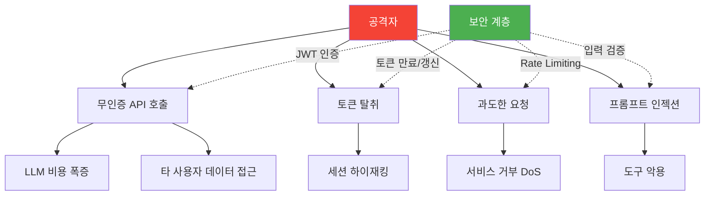
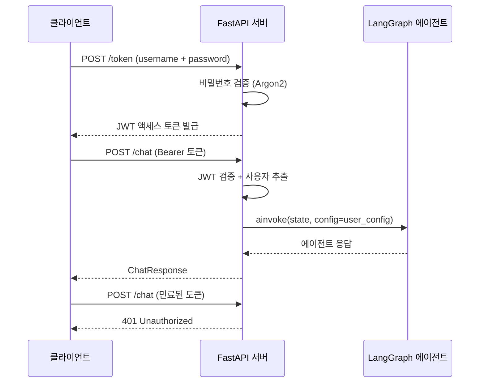
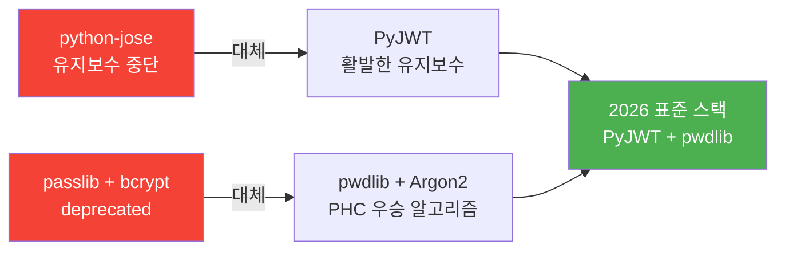
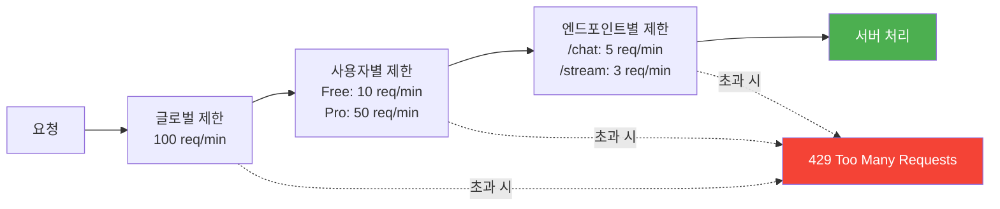
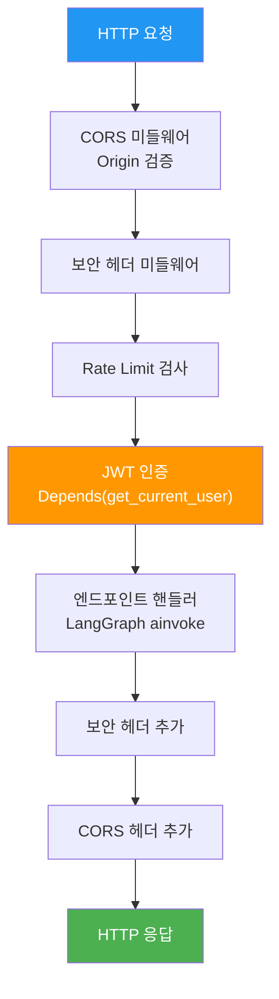
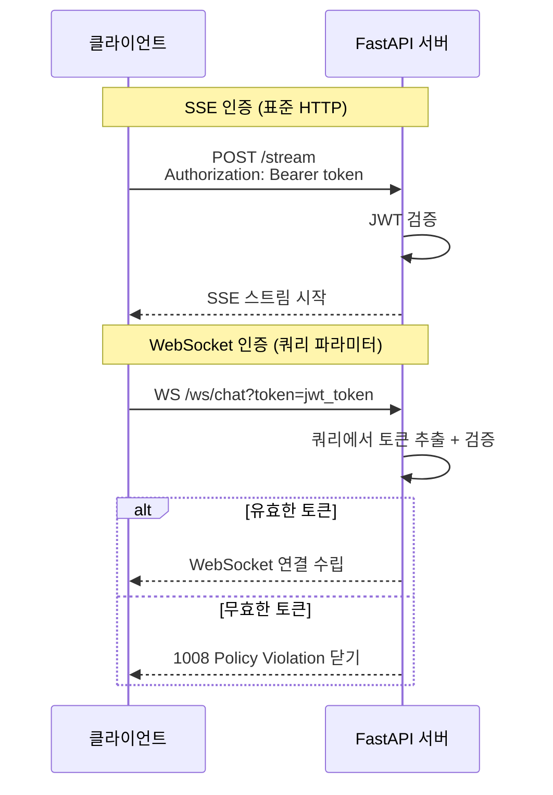

# 인증과 보안

> LangGraph 에이전트 API에 JWT 인증, API 키 관리, Rate Limiting, CORS, 보안 미들웨어를 적용하여 프로덕션 수준의 보안을 구축한다

## 개요

이 섹션에서는 앞서 구축한 FastAPI + LangGraph 에이전트 API에 보안 계층을 입히는 방법을 학습합니다. 인증 없이 배포된 에이전트 API는 누구나 LLM 비용을 발생시킬 수 있는 열린 지갑과 같습니다.

**선수 지식**:
- [FastAPI + LangGraph 통합](20-ch20-fastapi-배포와-프로덕션-운영/01-01-fastapi-langgraph-통합.md)에서 배운 lifespan 패턴과 엔드포인트 구조
- [스트리밍 응답 구현](20-ch20-fastapi-배포와-프로덕션-운영/02-02-스트리밍-응답-구현.md)에서 구축한 SSE/WebSocket 엔드포인트
- [에이전트 가드레일 설계](19-ch19-가드레일과-structured-output/01-01-에이전트-가드레일-설계.md)의 보안 원칙

**학습 목표**:
- JWT 토큰 기반 인증 시스템을 FastAPI에 구현할 수 있다
- API 키와 Rate Limiting으로 남용을 방지할 수 있다
- CORS와 보안 헤더 미들웨어를 프로덕션 환경에 맞게 설정할 수 있다
- LangGraph 에이전트 실행에 사용자 컨텍스트를 안전하게 바인딩할 수 있다

## 왜 알아야 할까?

LLM 기반 에이전트 API는 전통적인 REST API보다 보안 위험이 훨씬 큽니다. 왜 그럴까요?

첫째, **비용 문제**입니다. 인증 없이 공개된 에이전트 엔드포인트는 한 번의 요청으로 수십 개의 도구를 호출하며 수 달러의 API 비용을 발생시킬 수 있습니다. 악의적인 사용자가 반복 호출하면 하루 만에 수천 달러가 날아갈 수 있죠.

둘째, **데이터 격리** 문제입니다. LangGraph 에이전트는 [체크포인트](06-ch6-체크포인트와-영속적-실행/01-01-체크포인트-시스템-이해.md)로 대화 상태를 영속 저장합니다. 인증 없이는 다른 사용자의 대화 기록에 접근할 수 있어서, 개인정보 유출로 이어집니다.

셋째, **도구 실행 안전성**입니다. 에이전트가 DB 쿼리, 파일 조작, 외부 API 호출 등의 [커스텀 도구](08-ch8-커스텀-도구-개발/01-01-tool-데코레이터-심화.md)를 실행할 수 있다면, 무인증 접근은 서버 자체를 위험에 빠뜨립니다.

> 📊 **그림 1**: 에이전트 API 보안 위협 지도



## 핵심 개념

### 개념 1: JWT 인증 — 디지털 신분증

> 💡 **비유**: JWT는 놀이공원 입장 팔찌와 같습니다. 입구에서 신분 확인(로그인)을 거친 뒤 팔찌(토큰)를 받으면, 이후에는 팔찌만 보여주면 놀이기구(API)를 탈 수 있죠. 팔찌에는 이름, 등급, 만료 시간이 적혀 있고, 위조 방지 마크(서명)가 있습니다.

JWT(JSON Web Token)는 서버가 사용자 인증 정보를 JSON으로 인코딩하고 서명하여 발급하는 토큰입니다. `xxxxx.yyyyy.zzzzz` 형태의 세 부분이 점(`.`)으로 구분되죠.

**Header** — 토큰의 메타데이터입니다. 어떤 서명 알고리즘을 사용했는지, 토큰 타입이 무엇인지 명시합니다.

```json
{"alg": "HS256", "typ": "JWT"}
```

이 JSON이 Base64Url로 인코딩되어 토큰의 첫 번째 부분이 됩니다. `HS256`은 HMAC-SHA256을 의미하는데, 하나의 비밀 키로 서명과 검증을 모두 수행하는 대칭 알고리즘이에요. 마이크로서비스 환경에서 서비스 간 독립 검증이 필요하면 RS256(RSA 비대칭)을 쓰기도 합니다.

**Payload** — 실제 사용자 정보를 담는 부분입니다. JWT에서는 이 정보 조각들을 **클레임(Claim)**이라 부릅니다.

```json
{
  "sub": "alice",
  "tier": "pro",
  "exp": 1711234567,
  "iat": 1711232767
}
```

| 클레임 | 의미 | 예시 |
|--------|------|------|
| `sub` (Subject) | 토큰의 주체 — 사용자 ID | `"alice"` |
| `exp` (Expiration) | 만료 시각 (Unix timestamp) | `1711234567` |
| `iat` (Issued At) | 발급 시각 | `1711232767` |
| `tier` (커스텀) | 앱 고유 클레임 — 사용자 등급 | `"pro"` |

`sub`, `exp`, `iat`는 RFC 7519에서 정의한 **등록 클레임(Registered Claims)**이고, `tier`처럼 앱에서 자유롭게 추가하는 것은 **비공개 클레임(Private Claims)**입니다. Payload도 Base64Url로 인코딩될 뿐 **암호화되지 않으므로**, 비밀번호나 개인정보를 절대 넣지 마세요.

**Signature** — 위변조 방지 서명입니다. Header와 Payload를 합친 뒤, 서버만 아는 비밀 키로 서명합니다.

```
HMAC-SHA256(
  base64UrlEncode(header) + "." + base64UrlEncode(payload),
  secret_key
)
```

서버가 토큰을 받으면 같은 방식으로 서명을 재계산하고, 토큰에 포함된 서명과 비교합니다. 하나라도 변조되었다면 서명이 일치하지 않아 즉시 거부됩니다. 비밀 키를 모르는 공격자는 유효한 서명을 만들 수 없으니까요.

> 📊 **그림 2**: JWT 인증 흐름



**2026년 현재, FastAPI JWT 인증의 표준 스택이 바뀌었습니다.** 과거에는 `python-jose`가 공식 튜토리얼에서 추천되었지만, 3년 이상 업데이트가 없고 보안 경고가 8개 이상 누적되었습니다. 현재 FastAPI 공식 문서는 **PyJWT**를 권장합니다. 비밀번호 해싱도 `passlib`에서 **`pwdlib`**(Argon2 기반)으로 전환되었죠.

> 📊 **그림 3**: JWT 라이브러리 전환 흐름



`pwdlib`은 `passlib`의 경량 후속 라이브러리입니다. API가 간결하고, Argon2를 기본으로 지원하며, 타입 힌트가 완비되어 있습니다. 핵심 API는 딱 두 가지입니다:

- `PasswordHash.recommended()` — Argon2id 기반 해셔 인스턴스 생성
- `.hash(password)` — 평문 비밀번호 → Argon2 해시 문자열
- `.verify(password, hash)` — 평문과 해시 비교 → `True`/`False`

```python
# 의존성 설치
# pip install pyjwt[crypto] pwdlib[argon2] fastapi[standard]

from datetime import datetime, timedelta, timezone
from typing import Annotated

import jwt
from jwt.exceptions import InvalidTokenError
from fastapi import Depends, HTTPException, status
from fastapi.security import OAuth2PasswordBearer, OAuth2PasswordRequestForm
from pydantic import BaseModel
from pwdlib import PasswordHash

# --- 설정 ---
SECRET_KEY = "your-secret-key-from-env"  # 반드시 환경변수에서 로드
ALGORITHM = "HS256"
ACCESS_TOKEN_EXPIRE_MINUTES = 30

# --- 비밀번호 해싱 (pwdlib + Argon2) ---
# PasswordHash.recommended() → Argon2id 해셔 반환
# passlib의 CryptContext와 달리 단일 알고리즘에 집중하는 심플한 설계
password_hash = PasswordHash.recommended()

# --- 스키마 ---
class Token(BaseModel):
    access_token: str
    token_type: str

class TokenData(BaseModel):
    username: str | None = None

class User(BaseModel):
    username: str
    tier: str = "free"  # free, pro, enterprise
    disabled: bool = False

# --- OAuth2 설정 ---
oauth2_scheme = OAuth2PasswordBearer(tokenUrl="token")
```

토큰 생성과 검증 함수를 구현합니다:

```python
def create_access_token(
    data: dict, 
    expires_delta: timedelta | None = None
) -> str:
    """JWT 액세스 토큰 생성"""
    to_encode = data.copy()
    expire = datetime.now(timezone.utc) + (
        expires_delta or timedelta(minutes=15)
    )
    to_encode.update({"exp": expire})
    return jwt.encode(to_encode, SECRET_KEY, algorithm=ALGORITHM)


async def get_current_user(
    token: Annotated[str, Depends(oauth2_scheme)]
) -> User:
    """JWT에서 현재 사용자 추출 — 모든 보호 엔드포인트의 의존성"""
    credentials_exception = HTTPException(
        status_code=status.HTTP_401_UNAUTHORIZED,
        detail="유효하지 않은 인증 정보입니다",
        headers={"WWW-Authenticate": "Bearer"},
    )
    try:
        payload = jwt.decode(token, SECRET_KEY, algorithms=[ALGORITHM])
        username: str = payload.get("sub")
        if username is None:
            raise credentials_exception
        token_data = TokenData(username=username)
    except InvalidTokenError:
        raise credentials_exception
    
    # 실제로는 DB에서 사용자 조회
    user = get_user_from_db(token_data.username)
    if user is None or user.disabled:
        raise credentials_exception
    return user
```

이제 에이전트 엔드포인트에 인증을 적용합니다:

```python
@app.post("/token", response_model=Token)
async def login(form_data: Annotated[OAuth2PasswordRequestForm, Depends()]):
    """로그인 → JWT 발급"""
    user = authenticate_user(form_data.username, form_data.password)
    if not user:
        raise HTTPException(
            status_code=status.HTTP_401_UNAUTHORIZED,
            detail="아이디 또는 비밀번호가 올바르지 않습니다",
            headers={"WWW-Authenticate": "Bearer"},
        )
    access_token = create_access_token(
        data={"sub": user.username, "tier": user.tier},
        expires_delta=timedelta(minutes=ACCESS_TOKEN_EXPIRE_MINUTES),
    )
    return Token(access_token=access_token, token_type="bearer")


@app.post("/chat")
async def chat(
    request: ChatRequest,
    current_user: Annotated[User, Depends(get_current_user)],  # 인증 필수
):
    """인증된 사용자만 에이전트와 대화"""
    graph = app.state.graph
    config = {
        "configurable": {
            "thread_id": f"{current_user.username}_{request.thread_id}",
            "user_id": current_user.username,  # 사용자 격리
        }
    }
    result = await graph.ainvoke(
        {"messages": [("human", request.message)]},
        config=config,
    )
    return {"response": result["messages"][-1].content}
```

핵심은 `thread_id`에 사용자명을 접두사로 붙여 **체크포인트를 사용자별로 격리**하는 것입니다. 이렇게 하면 A 사용자가 B 사용자의 대화 기록에 접근할 수 없습니다.

### 개념 2: API 키와 Rate Limiting — 수도꼭지 조절기

> 💡 **비유**: Rate Limiting은 수도꼭지의 유량 제한기와 같습니다. 아무리 꼭지를 틀어도 분당 정해진 양 이상 물이 나오지 않죠. API도 마찬가지로, 사용자가 분당 보낼 수 있는 요청 수를 제한하여 서버 과부하와 비용 폭증을 방지합니다.

JWT 인증이 "누구인지" 확인한다면, Rate Limiting은 "얼마나 쓰는지" 제한합니다. LLM 에이전트는 한 번 호출에 수초~수십 초가 걸리고, 비용도 상당하기 때문에 Rate Limiting이 특히 중요합니다.

> 📊 **그림 4**: Rate Limiting 계층 구조



**slowapi**는 Flask-Limiter에서 영감을 받은 FastAPI용 Rate Limiting 라이브러리입니다. 데코레이터 한 줄로 엔드포인트별 제한을 걸 수 있어서 가장 널리 쓰이죠.

```python
# pip install slowapi

from slowapi import Limiter, _rate_limit_exceeded_handler
from slowapi.util import get_remote_address
from slowapi.errors import RateLimitExceeded
from starlette.requests import Request

# --- 사용자 티어별 동적 키 함수 ---
def get_rate_limit_key(request: Request) -> str:
    """인증된 사용자는 username, 미인증은 IP로 식별"""
    # Authorization 헤더에서 사용자 추출 시도
    auth = request.headers.get("Authorization", "")
    if auth.startswith("Bearer "):
        try:
            token = auth.split(" ")[1]
            payload = jwt.decode(token, SECRET_KEY, algorithms=[ALGORITHM])
            return payload.get("sub", get_remote_address(request))
        except InvalidTokenError:
            pass
    return get_remote_address(request)

# --- Limiter 인스턴스 생성 ---
limiter = Limiter(key_func=get_rate_limit_key)

# --- FastAPI 앱에 연결 ---
app.state.limiter = limiter
app.add_exception_handler(RateLimitExceeded, _rate_limit_exceeded_handler)
```

엔드포인트에 Rate Limit 적용:

```python
@app.post("/chat")
@limiter.limit("10/minute")  # 분당 10회 제한
async def chat(
    request: Request,  # slowapi가 Request 객체를 필요로 함
    body: ChatRequest,
    current_user: Annotated[User, Depends(get_current_user)],
):
    """Rate Limited + 인증된 에이전트 엔드포인트"""
    graph = app.state.graph
    result = await graph.ainvoke(
        {"messages": [("human", body.message)]},
        config={"configurable": {"thread_id": f"{current_user.username}_{body.thread_id}"}},
    )
    return {"response": result["messages"][-1].content}


@app.post("/stream")
@limiter.limit("5/minute")  # 스트리밍은 더 엄격하게
async def stream_chat(
    request: Request,
    body: ChatRequest,
    current_user: Annotated[User, Depends(get_current_user)],
):
    """스트리밍 엔드포인트 — 더 낮은 Rate Limit"""
    # SSE 스트리밍 로직 (20.2에서 구현)
    ...
```

사용자 티어별로 다른 Rate Limit을 적용하고 싶다면, 동적 제한 함수를 사용합니다:

```python
def dynamic_limit(key: str) -> str:
    """사용자 티어에 따라 다른 제한 반환"""
    # 실제로는 DB/캐시에서 사용자 티어 조회
    tier_limits = {
        "free": "10/minute",
        "pro": "50/minute",
        "enterprise": "200/minute",
    }
    # key는 username — 티어 조회 후 제한 반환
    user = get_user_from_db(key)
    if user:
        return tier_limits.get(user.tier, "10/minute")
    return "5/minute"  # 미인증 기본값

@app.post("/chat")
@limiter.limit(dynamic_limit)
async def chat(request: Request, ...):
    ...
```

> ⚠️ **흔한 오해**: "Rate Limiting은 보안이 아니라 성능 문제 아닌가요?" — 아닙니다. LLM API에서 Rate Limiting은 **비용 보안**입니다. 인증된 사용자도 계정 탈취나 버그로 인해 폭발적인 요청을 보낼 수 있으므로, Rate Limiting은 인증과 독립적으로 필요합니다.

### 개념 3: CORS와 보안 헤더 — 성벽과 방패

> 💡 **비유**: CORS는 건물의 출입 허가 명부와 같습니다. 정문 경비원(브라우저)이 "이 사람이 들어와도 되나요?"라고 건물 주인(서버)에게 물어보고, 명부에 있는 사람만 들여보내는 거죠. `allow_origins=["*"]`는 "아무나 다 들어와도 됩니다"라고 말하는 것과 같습니다.

CORS(Cross-Origin Resource Sharing)는 브라우저가 다른 도메인의 API를 호출할 때 적용되는 보안 정책입니다. 프론트엔드(`app.example.com`)가 백엔드 API(`api.example.com`)를 호출하려면 서버가 명시적으로 허용해야 합니다.

```python
import os
from fastapi.middleware.cors import CORSMiddleware

# --- 환경변수에서 허용 도메인 로드 ---
ALLOWED_ORIGINS = os.getenv(
    "ALLOWED_ORIGINS", 
    "http://localhost:3000"
).split(",")

app.add_middleware(
    CORSMiddleware,
    allow_origins=ALLOWED_ORIGINS,       # 명시적 도메인만 허용
    allow_credentials=True,              # 쿠키/인증 헤더 허용
    allow_methods=["GET", "POST"],       # 필요한 메서드만
    allow_headers=["Authorization", "Content-Type"],
    max_age=600,                         # preflight 캐시 10분
)
```

보안 헤더 미들웨어는 브라우저에게 추가 보안 정책을 알려줍니다:

```python
from starlette.middleware.base import BaseHTTPMiddleware
from starlette.requests import Request
from starlette.responses import Response

class SecurityHeadersMiddleware(BaseHTTPMiddleware):
    """응답에 보안 헤더를 자동 추가하는 미들웨어"""
    
    async def dispatch(self, request: Request, call_next) -> Response:
        response = await call_next(request)
        
        # XSS 방지
        response.headers["X-Content-Type-Options"] = "nosniff"
        response.headers["X-Frame-Options"] = "DENY"
        
        # HTTPS 강제 (프로덕션)
        response.headers["Strict-Transport-Security"] = (
            "max-age=31536000; includeSubDomains"
        )
        
        # Content Security Policy
        response.headers["Content-Security-Policy"] = "default-src 'self'"
        
        return response

# 미들웨어 등록 순서가 중요!
# FastAPI는 마지막에 등록된 미들웨어가 가장 먼저 실행됨
app.add_middleware(SecurityHeadersMiddleware)  # 3. 보안 헤더 (가장 안쪽)
app.add_middleware(CORSMiddleware, ...)        # 2. CORS
# slowapi는 exception_handler로 등록              # 1. Rate Limit
```

> 📊 **그림 5**: 미들웨어 실행 순서 (양파 구조)



### 개념 4: 스트리밍 엔드포인트 인증 — SSE와 WebSocket의 차이

[스트리밍 응답 구현](20-ch20-fastapi-배포와-프로덕션-운영/02-02-스트리밍-응답-구현.md)에서 SSE와 WebSocket 두 가지 스트리밍 방식을 배웠는데요, 인증 적용 방식이 조금 다릅니다.

**SSE**는 일반 HTTP 요청이므로 `Authorization: Bearer <token>` 헤더를 그대로 사용할 수 있습니다. 그런데 **WebSocket**은 브라우저의 WebSocket API가 커스텀 헤더를 지원하지 않아서, 토큰을 쿼리 파라미터나 첫 번째 메시지로 전달해야 합니다.

> 📊 **그림 6**: SSE vs WebSocket 인증 흐름 비교



```python
from fastapi import WebSocket, WebSocketDisconnect, Query

async def authenticate_websocket(
    websocket: WebSocket,
    token: str = Query(None),
) -> User | None:
    """WebSocket 연결 시 토큰 검증"""
    if not token:
        await websocket.close(code=1008, reason="토큰이 필요합니다")
        return None
    try:
        payload = jwt.decode(token, SECRET_KEY, algorithms=[ALGORITHM])
        username = payload.get("sub")
        user = get_user_from_db(username)
        if user and not user.disabled:
            return user
    except InvalidTokenError:
        pass
    
    await websocket.close(code=1008, reason="유효하지 않은 토큰")
    return None


@app.websocket("/ws/chat")
async def websocket_chat(websocket: WebSocket, token: str = Query(...)):
    """인증된 WebSocket 스트리밍"""
    user = await authenticate_websocket(websocket, token)
    if not user:
        return
    
    await websocket.accept()
    try:
        while True:
            data = await websocket.receive_json()
            graph = app.state.graph
            async for event in graph.astream(
                {"messages": [("human", data["message"])]},
                config={"configurable": {
                    "thread_id": f"{user.username}_{data.get('thread_id', 'default')}",
                }},
                stream_mode="messages",
            ):
                await websocket.send_json({
                    "type": "token",
                    "content": event[0].content if hasattr(event[0], "content") else "",
                })
            await websocket.send_json({"type": "done"})
    except WebSocketDisconnect:
        pass
```

> 🔥 **실무 팁**: WebSocket 토큰을 쿼리 파라미터로 전달하면 서버 로그에 토큰이 남을 수 있습니다. 프로덕션에서는 (1) 수명이 짧은 일회용 토큰을 발급하거나, (2) 연결 후 첫 메시지로 토큰을 보내는 방식을 권장합니다.

## 실습: 직접 해보기

JWT 인증, Rate Limiting, CORS, 보안 헤더를 모두 통합한 완전한 에이전트 API를 구축합니다.

```python
"""
agent_api_secure.py — 보안이 적용된 LangGraph 에이전트 API
pip install fastapi[standard] pyjwt[crypto] pwdlib[argon2] slowapi langgraph langchain-openai
"""
import os
from contextlib import asynccontextmanager
from datetime import datetime, timedelta, timezone
from typing import Annotated

import jwt
from jwt.exceptions import InvalidTokenError
from fastapi import Depends, FastAPI, HTTPException, Request, status
from fastapi.middleware.cors import CORSMiddleware
from fastapi.security import OAuth2PasswordBearer, OAuth2PasswordRequestForm
from pydantic import BaseModel, Field
from pwdlib import PasswordHash
from slowapi import Limiter, _rate_limit_exceeded_handler
from slowapi.errors import RateLimitExceeded
from slowapi.util import get_remote_address
from starlette.middleware.base import BaseHTTPMiddleware
from starlette.responses import Response

from langchain_openai import ChatOpenAI
from langgraph.graph import StateGraph, START, END, MessagesState
from langgraph.prebuilt import ToolNode, tools_condition
from langgraph.checkpoint.memory import MemorySaver

# ============================================================
# 1. 설정
# ============================================================
SECRET_KEY = os.getenv("JWT_SECRET_KEY", "dev-secret-change-in-production")
ALGORITHM = "HS256"
ACCESS_TOKEN_EXPIRE_MINUTES = 30
ALLOWED_ORIGINS = os.getenv("ALLOWED_ORIGINS", "http://localhost:3000").split(",")

# pwdlib: passlib의 후속 라이브러리
# PasswordHash.recommended() → Argon2id 해셔 (메모리 집약적, GPU 공격 내성)
# 비교: passlib은 CryptContext(schemes=["bcrypt"])를 사용했지만 deprecated
password_hash = PasswordHash.recommended()

oauth2_scheme = OAuth2PasswordBearer(tokenUrl="token")

# ============================================================
# 2. 스키마
# ============================================================
class Token(BaseModel):
    access_token: str
    token_type: str = "bearer"

class UserInDB(BaseModel):
    username: str
    hashed_password: str
    tier: str = "free"
    disabled: bool = False

class ChatRequest(BaseModel):
    message: str = Field(..., min_length=1, max_length=4000)
    thread_id: str = Field(default="default", pattern=r"^[a-zA-Z0-9_-]+$")

class ChatResponse(BaseModel):
    response: str
    thread_id: str

# ============================================================
# 3. 사용자 저장소 (실제로는 DB 사용)
# ============================================================
FAKE_USERS_DB: dict[str, UserInDB] = {
    "alice": UserInDB(
        username="alice",
        # pwdlib의 .hash()는 Argon2id 해시 문자열을 반환
        # 예: "$argon2id$v=19$m=65536,t=3,p=4$..."
        hashed_password=password_hash.hash("secret123"),
        tier="pro",
    ),
    "bob": UserInDB(
        username="bob",
        hashed_password=password_hash.hash("password456"),
        tier="free",
    ),
}

def authenticate_user(username: str, password: str) -> UserInDB | None:
    """사용자 인증 — pwdlib.verify()로 비밀번호 검증"""
    user = FAKE_USERS_DB.get(username)
    if user and password_hash.verify(password, user.hashed_password):
        # .verify(평문, 해시) → True/False
        # passlib에서는 pwd_context.verify(password, hash)였지만
        # pwdlib도 동일한 시그니처를 사용
        return user
    return None

# ============================================================
# 4. JWT 유틸
# ============================================================
def create_access_token(data: dict, expires_delta: timedelta | None = None) -> str:
    to_encode = data.copy()
    expire = datetime.now(timezone.utc) + (expires_delta or timedelta(minutes=15))
    to_encode.update({"exp": expire, "iat": datetime.now(timezone.utc)})
    return jwt.encode(to_encode, SECRET_KEY, algorithm=ALGORITHM)

async def get_current_user(token: Annotated[str, Depends(oauth2_scheme)]) -> UserInDB:
    credentials_exception = HTTPException(
        status_code=status.HTTP_401_UNAUTHORIZED,
        detail="유효하지 않은 인증 정보입니다",
        headers={"WWW-Authenticate": "Bearer"},
    )
    try:
        payload = jwt.decode(token, SECRET_KEY, algorithms=[ALGORITHM])
        username: str = payload.get("sub")
        if username is None:
            raise credentials_exception
    except InvalidTokenError:
        raise credentials_exception
    
    user = FAKE_USERS_DB.get(username)
    if user is None or user.disabled:
        raise credentials_exception
    return user

# ============================================================
# 5. Rate Limiter
# ============================================================
def rate_limit_key(request: Request) -> str:
    auth = request.headers.get("Authorization", "")
    if auth.startswith("Bearer "):
        try:
            payload = jwt.decode(auth.split(" ")[1], SECRET_KEY, algorithms=[ALGORITHM])
            return payload.get("sub", get_remote_address(request))
        except InvalidTokenError:
            pass
    return get_remote_address(request)

limiter = Limiter(key_func=rate_limit_key)

# ============================================================
# 6. 보안 헤더 미들웨어
# ============================================================
class SecurityHeadersMiddleware(BaseHTTPMiddleware):
    async def dispatch(self, request: Request, call_next) -> Response:
        response = await call_next(request)
        response.headers["X-Content-Type-Options"] = "nosniff"
        response.headers["X-Frame-Options"] = "DENY"
        response.headers["Strict-Transport-Security"] = (
            "max-age=31536000; includeSubDomains"
        )
        return response

# ============================================================
# 7. LangGraph 에이전트 정의
# ============================================================
def build_agent():
    """간단한 도구 호출 에이전트 구성"""
    from langchain_core.tools import tool

    @tool
    def get_weather(city: str) -> str:
        """도시의 현재 날씨를 조회합니다."""
        return f"{city}의 현재 날씨: 맑음, 22°C"

    tools = [get_weather]
    llm = ChatOpenAI(model="gpt-4o-mini").bind_tools(tools)

    def call_model(state: MessagesState) -> dict:
        return {"messages": [llm.invoke(state["messages"])]}

    builder = StateGraph(MessagesState)
    builder.add_node("agent", call_model)
    builder.add_node("tools", ToolNode(tools))
    builder.add_edge(START, "agent")
    builder.add_conditional_edges("agent", tools_condition)
    builder.add_edge("tools", "agent")

    memory = MemorySaver()
    return builder.compile(checkpointer=memory)

# ============================================================
# 8. FastAPI 앱 조립
# ============================================================
@asynccontextmanager
async def lifespan(app: FastAPI):
    app.state.graph = build_agent()
    yield

app = FastAPI(title="Secure Agent API", lifespan=lifespan)

# 미들웨어 등록 (역순 실행)
app.state.limiter = limiter
app.add_exception_handler(RateLimitExceeded, _rate_limit_exceeded_handler)
app.add_middleware(SecurityHeadersMiddleware)
app.add_middleware(
    CORSMiddleware,
    allow_origins=ALLOWED_ORIGINS,
    allow_credentials=True,
    allow_methods=["GET", "POST"],
    allow_headers=["Authorization", "Content-Type"],
    max_age=600,
)

# ============================================================
# 9. 엔드포인트
# ============================================================
@app.post("/token", response_model=Token)
@limiter.limit("5/minute")  # 로그인 시도 제한
async def login(
    request: Request,
    form_data: Annotated[OAuth2PasswordRequestForm, Depends()],
):
    user = authenticate_user(form_data.username, form_data.password)
    if not user:
        raise HTTPException(
            status_code=status.HTTP_401_UNAUTHORIZED,
            detail="아이디 또는 비밀번호가 올바르지 않습니다",
        )
    access_token = create_access_token(
        data={"sub": user.username, "tier": user.tier},
        expires_delta=timedelta(minutes=ACCESS_TOKEN_EXPIRE_MINUTES),
    )
    return Token(access_token=access_token)

@app.post("/chat", response_model=ChatResponse)
@limiter.limit("10/minute")
async def chat(
    request: Request,
    body: ChatRequest,
    current_user: Annotated[UserInDB, Depends(get_current_user)],
):
    graph = app.state.graph
    thread_id = f"{current_user.username}_{body.thread_id}"
    result = await graph.ainvoke(
        {"messages": [("human", body.message)]},
        config={"configurable": {"thread_id": thread_id}},
    )
    return ChatResponse(
        response=result["messages"][-1].content,
        thread_id=body.thread_id,
    )

@app.get("/health")
async def health():
    return {"status": "ok"}
```

서버를 실행하고 인증 흐름을 테스트합니다:

```run:python
# 인증 흐름 시뮬레이션 (실제로는 curl/httpx로 서버 호출)
import jwt
from datetime import datetime, timedelta, timezone

SECRET_KEY = "dev-secret-change-in-production"
ALGORITHM = "HS256"

# 1. 토큰 발급 시뮬레이션
token = jwt.encode(
    {
        "sub": "alice",
        "tier": "pro",
        "exp": datetime.now(timezone.utc) + timedelta(minutes=30),
    },
    SECRET_KEY,
    algorithm=ALGORITHM,
)
print(f"발급된 토큰: {token[:50]}...")

# 2. 토큰 검증
payload = jwt.decode(token, SECRET_KEY, algorithms=[ALGORITHM])
print(f"사용자: {payload['sub']}")
print(f"티어: {payload['tier']}")
print(f"만료: {datetime.fromtimestamp(payload['exp'], tz=timezone.utc).isoformat()}")

# 3. 만료된 토큰 테스트
expired_token = jwt.encode(
    {
        "sub": "alice",
        "exp": datetime.now(timezone.utc) - timedelta(minutes=1),
    },
    SECRET_KEY,
    algorithm=ALGORITHM,
)
try:
    jwt.decode(expired_token, SECRET_KEY, algorithms=[ALGORITHM])
except jwt.ExpiredSignatureError:
    print("만료된 토큰: ExpiredSignatureError 발생!")
```

```output
발급된 토큰: eyJhbGciOiJIUzI1NiIsInR5cCI6IkpXVCJ9.eyJzdWIiOi...
사용자: alice
티어: pro
만료: 2026-03-20T15:30:00+00:00
만료된 토큰: ExpiredSignatureError 발생!
```

pwdlib의 비밀번호 해싱이 어떻게 동작하는지 확인합니다:

```run:python
# pwdlib 비밀번호 해싱 시뮬레이션
# 실제 pwdlib 동작을 의사 코드로 보여줍니다

# pwdlib 사용법 요약:
# from pwdlib import PasswordHash
# password_hash = PasswordHash.recommended()  # Argon2id 해셔

# 1. 해시 생성
# hashed = password_hash.hash("secret123")
# 결과: "$argon2id$v=19$m=65536,t=3,p=4$ランダムソルト$ハッシュ値"

# 2. 검증
# password_hash.verify("secret123", hashed)  → True
# password_hash.verify("wrong",     hashed)  → False

# passlib → pwdlib 마이그레이션 비교
print("=== passlib (deprecated) ===")
print("from passlib.context import CryptContext")
print("pwd_context = CryptContext(schemes=['bcrypt'])")
print("pwd_context.hash('secret123')")
print("pwd_context.verify('secret123', hashed)")

print()
print("=== pwdlib (현재 권장) ===")
print("from pwdlib import PasswordHash")
print("password_hash = PasswordHash.recommended()")
print("password_hash.hash('secret123')")
print("password_hash.verify('secret123', hashed)")

print()
print("핵심 차이:")
print("- passlib: bcrypt 기반, 유지보수 중단")
print("- pwdlib: Argon2id 기반, 메모리 집약적 → GPU 공격 내성 강화")
print("- API 시그니처는 거의 동일 → 마이그레이션 간단")
```

```output
=== passlib (deprecated) ===
from passlib.context import CryptContext
pwd_context = CryptContext(schemes=['bcrypt'])
pwd_context.hash('secret123')
pwd_context.verify('secret123', hashed)

=== pwdlib (현재 권장) ===
from pwdlib import PasswordHash
password_hash = PasswordHash.recommended()
password_hash.hash('secret123')
password_hash.verify('secret123', hashed)

핵심 차이:
- passlib: bcrypt 기반, 유지보수 중단
- pwdlib: Argon2id 기반, 메모리 집약적 → GPU 공격 내성 강화
- API 시그니처는 거의 동일 → 마이그레이션 간단
```

터미널에서 실제 API를 테스트하는 방법:

```console
# 서버 실행
$ uvicorn agent_api_secure:app --reload

# 토큰 발급
$ curl -X POST http://localhost:8000/token \
  -d "username=alice&password=secret123"
{"access_token":"eyJ...","token_type":"bearer"}

# 인증된 요청
$ curl -X POST http://localhost:8000/chat \
  -H "Authorization: Bearer eyJ..." \
  -H "Content-Type: application/json" \
  -d '{"message":"서울 날씨 알려줘","thread_id":"chat1"}'
{"response":"서울의 현재 날씨는 맑음, 22°C입니다.","thread_id":"chat1"}

# 인증 없이 요청 → 401
$ curl -X POST http://localhost:8000/chat \
  -H "Content-Type: application/json" \
  -d '{"message":"test"}'
{"detail":"Not authenticated"}
```

입력 검증이 어떻게 동작하는지 확인합니다:

```run:python
from pydantic import BaseModel, Field, ValidationError

class ChatRequest(BaseModel):
    message: str = Field(..., min_length=1, max_length=4000)
    thread_id: str = Field(default="default", pattern=r"^[a-zA-Z0-9_-]+$")

# 정상 요청
req = ChatRequest(message="안녕하세요", thread_id="chat-1")
print(f"정상: message={req.message!r}, thread_id={req.thread_id!r}")

# 빈 메시지 → 검증 실패
try:
    ChatRequest(message="", thread_id="test")
except ValidationError as e:
    print(f"빈 메시지: {e.errors()[0]['msg']}")

# thread_id에 특수문자 → 검증 실패
try:
    ChatRequest(message="hello", thread_id="../../etc/passwd")
except ValidationError as e:
    print(f"잘못된 thread_id: {e.errors()[0]['msg']}")
```

```output
정상: message='안녕하세요', thread_id='chat-1'
빈 메시지: String should have at least 1 character
잘못된 thread_id: String should match pattern '^[a-zA-Z0-9_-]+$'
```

## 더 깊이 알아보기

### JWT의 탄생 이야기

JWT는 2010년대 초, 모바일 앱과 SPA(Single Page Application)의 급부상과 함께 탄생했습니다. 전통적인 세션 기반 인증은 서버에 세션 정보를 저장해야 했는데, 여러 서버에 걸쳐 세션을 공유하는 것이 복잡했죠. 

2015년 IETF에서 RFC 7519로 공식 표준화된 JWT는 **"서버가 상태를 저장하지 않아도 되는"** 인증 방식을 제시했습니다. 토큰 자체에 사용자 정보가 담겨 있으니까요. 이 아이디어의 핵심 기여자 중 한 명인 **Michael B. Jones**(Microsoft)는 이후 OAuth 2.0 생태계 전반에 걸쳐 수많은 RFC를 공동 작성했습니다.

재미있는 건, JWT 발음에 대한 논쟁입니다. RFC 7519에는 "jot"(조트)으로 발음한다고 명시되어 있지만, 실무에서는 대부분 "J-W-T"(제이더블유티)라고 읽습니다. 표준 문서에 발음 가이드가 있는 RFC는 극히 드문 사례죠.

### python-jose에서 PyJWT로, passlib에서 pwdlib으로

FastAPI 공식 튜토리얼이 오랫동안 `python-jose`를 추천했는데, 2023년 이후 `python-jose`의 유지보수가 사실상 중단되었습니다. GitHub에 보안 경고가 누적되면서 커뮤니티에서 대체재를 논의하기 시작했고, 2025년 FastAPI 공식 문서가 **PyJWT**로 전환했습니다.

동시에 비밀번호 해싱도 큰 전환이 있었습니다. `passlib`은 오랫동안 Python 비밀번호 해싱의 표준이었지만, 유지보수가 중단되면서 FastAPI 팀이 **`pwdlib`**을 공식 대안으로 채택했습니다. `pwdlib`은 `passlib`의 복잡한 다중 스킴 지원 대신, **Argon2id 단일 알고리즘에 집중**하는 경량 설계를 택했죠.

Argon2는 2015년 Password Hashing Competition(PHC)에서 우승한 알고리즘입니다. 기존의 bcrypt나 scrypt와 달리 **메모리 사용량을 의도적으로 높여** GPU/ASIC 기반 무차별 대입 공격을 어렵게 만듭니다. Argon2에는 세 가지 변형이 있는데, `pwdlib`이 사용하는 **Argon2id**는 사이드 채널 공격 내성(Argon2i)과 GPU 내성(Argon2d)을 결합한 하이브리드 버전으로 OWASP에서 권장하는 방식입니다.

## 흔한 오해와 팁

> ⚠️ **흔한 오해**: "`allow_origins=["*"]`을 쓰면 개발이 편하니까 프로덕션에서도 괜찮겠지?" — 절대 안 됩니다. 특히 `allow_credentials=True`와 함께 사용하면 브라우저가 아예 요청을 거부합니다. 그리고 와일드카드 CORS는 CSRF 공격에 취약합니다. 반드시 허용할 도메인을 명시적으로 나열하세요.

> 💡 **알고 계셨나요?**: JWT 토큰은 암호화되지 않습니다 — Base64로 인코딩될 뿐이에요. 누구나 페이로드를 디코딩해서 읽을 수 있습니다. jwt.io에 토큰을 붙여넣으면 바로 내용이 보이죠. 따라서 JWT 페이로드에 비밀번호, 개인정보 같은 민감한 데이터를 절대 넣지 마세요. 서명(Signature)은 위변조를 방지할 뿐, 내용을 숨기지는 않습니다.

> 🔥 **실무 팁**: LangGraph 에이전트 API에서 가장 위험한 보안 구멍은 **thread_id 조작**입니다. 사용자가 다른 사람의 thread_id를 추측하여 대화 내역을 탈취할 수 있어요. 반드시 `thread_id = f"{user_id}_{thread_id}"`처럼 사용자 ID를 접두사로 붙이세요. 더 안전하게는 UUID v4를 사용하되, 서버 측에서 해당 thread의 소유권을 검증하세요.

> 🔥 **실무 팁**: Rate Limiting을 IP 기반만으로 하면 NAT 뒤의 수천 명 사용자가 하나의 IP를 공유하여 서로 제한에 걸릴 수 있습니다. 인증된 사용자에게는 반드시 사용자 ID 기반 Rate Limiting을 적용하세요. 이번 실습의 `rate_limit_key()` 함수가 바로 이 패턴입니다.

## 핵심 정리

| 개념 | 설명 |
|------|------|
| **JWT 인증** | PyJWT + pwdlib(Argon2id)로 토큰 기반 인증 구현. `sub` 클레임에 사용자 ID, `exp`로 만료 관리 |
| **JWT 구조** | Header(알고리즘) + Payload(클레임) + Signature(HMAC 서명)의 3파트. Base64 인코딩, 암호화 아님 |
| **pwdlib** | passlib의 후속 라이브러리. `PasswordHash.recommended()`로 Argon2id 해셔 생성, `.hash()` / `.verify()` |
| **OAuth2PasswordBearer** | FastAPI의 OAuth2 의존성. `Depends(oauth2_scheme)`로 토큰 자동 추출 |
| **Rate Limiting** | slowapi로 엔드포인트별/사용자별 요청 제한. LLM 비용 보호에 필수 |
| **CORS** | `allow_origins`에 명시적 도메인만. `["*"]` + credentials 조합은 금지 |
| **보안 헤더** | `X-Content-Type-Options`, `X-Frame-Options`, `HSTS` 등 응답 헤더 자동 추가 |
| **Thread 격리** | `thread_id`에 사용자 ID 접두사를 붙여 체크포인트 데이터 격리 |
| **WebSocket 인증** | 쿼리 파라미터 또는 첫 메시지로 토큰 전달, 연결 수립 시 검증 |
| **입력 검증** | Pydantic `Field`로 메시지 길이 제한, thread_id 패턴 검증 |

## 다음 섹션 미리보기

인증과 보안 계층을 완성했으니, 다음 [확장성과 운영](20-ch20-fastapi-배포와-프로덕션-운영/04-04-확장성과-운영.md)에서는 이 API를 **수평 확장**하는 방법을 배웁니다. 단일 서버의 한계를 넘어 여러 인스턴스에서 에이전트를 실행할 때, 체크포인트 저장소를 PostgreSQL로 전환하고, 비동기 작업 큐로 장시간 실행을 처리하며, Docker 컨테이너화와 헬스체크를 구성하는 프로덕션 운영의 핵심을 다룹니다.

## 참고 자료

- [FastAPI 공식 보안 가이드 — OAuth2 + JWT](https://fastapi.tiangolo.com/tutorial/security/oauth2-jwt/) - FastAPI 공식 문서의 JWT 인증 튜토리얼. python-jose 대신 PyJWT + pwdlib 사용법 설명
- [PyJWT 공식 문서](https://pyjwt.readthedocs.io/) - JWT 인코딩/디코딩, 알고리즘 선택, 클레임 검증 등 상세 API 가이드
- [pwdlib GitHub 리포지토리](https://github.com/frankie567/pwdlib) - passlib 대체 라이브러리. Argon2id 기반 비밀번호 해싱, FastAPI 공식 권장
- [slowapi GitHub 리포지토리](https://github.com/laurentS/slowapi) - FastAPI/Starlette용 Rate Limiting 라이브러리. 데코레이터 기반 설정 예제 포함
- [FastAPI CORS 공식 문서](https://fastapi.tiangolo.com/tutorial/cors/) - CORSMiddleware 설정 가이드와 보안 주의사항
- [Securing AI Workflows: LangGraph + FastAPI (Towards AI)](https://pub.towardsai.net/securing-ai-workflows-authentication-security-for-langgraph-fastapi-part-2-8427f2aa9d20) - LangGraph 에이전트 API 보안 패턴 실전 가이드
- [Production-Ready FastAPI + LangGraph Template](https://github.com/wassim249/fastapi-langgraph-agent-production-ready-template) - JWT 인증, PostgreSQL 체크포인트, 멀티 에이전트가 통합된 프로덕션 템플릿

---
### 🔗 Related Sessions
- [thread_id](06-ch6-체크포인트와-영속적-실행/01-01-체크포인트-시스템-이해.md) (prerequisite)
- [compiledstategraph](04-ch4-langgraph-stategraph-기초/01-01-langgraph-아키텍처-개관.md) (prerequisite)
- [ainvoke](08-ch8-커스텀-도구-개발/03-03-비동기-도구와-외부-api-연동.md) (prerequisite)
