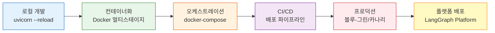
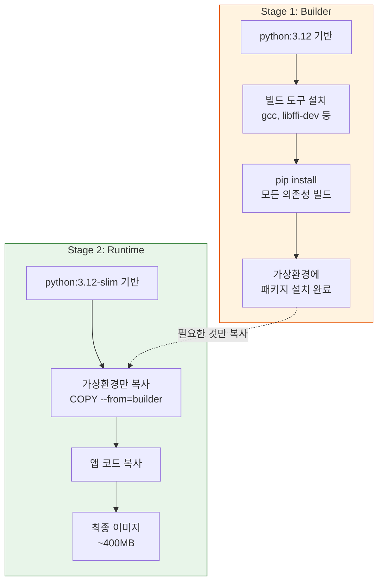
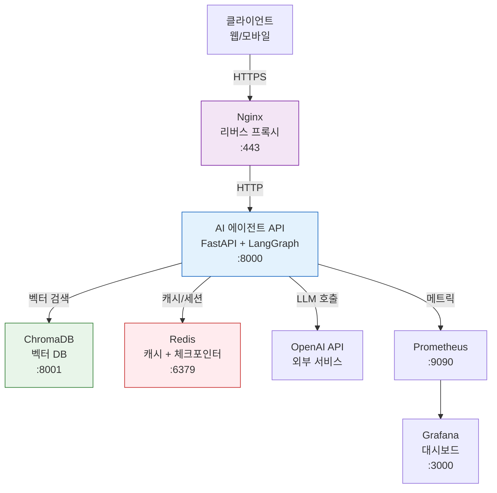
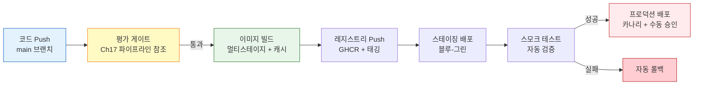
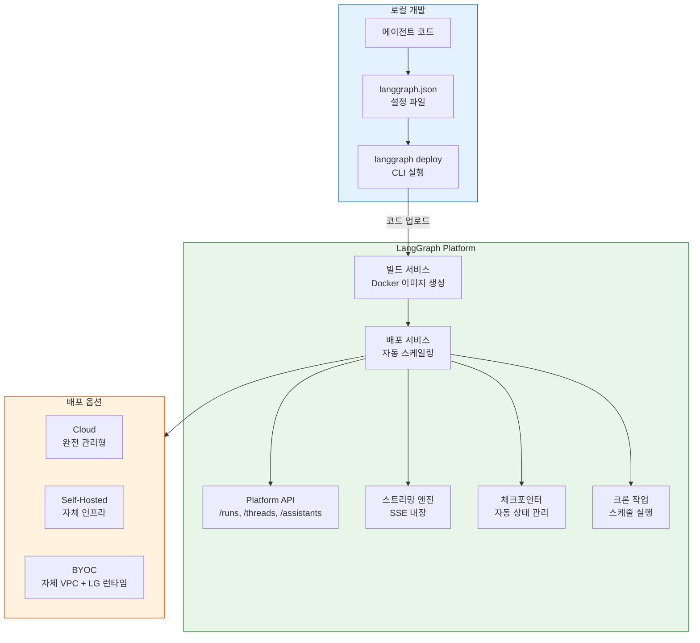
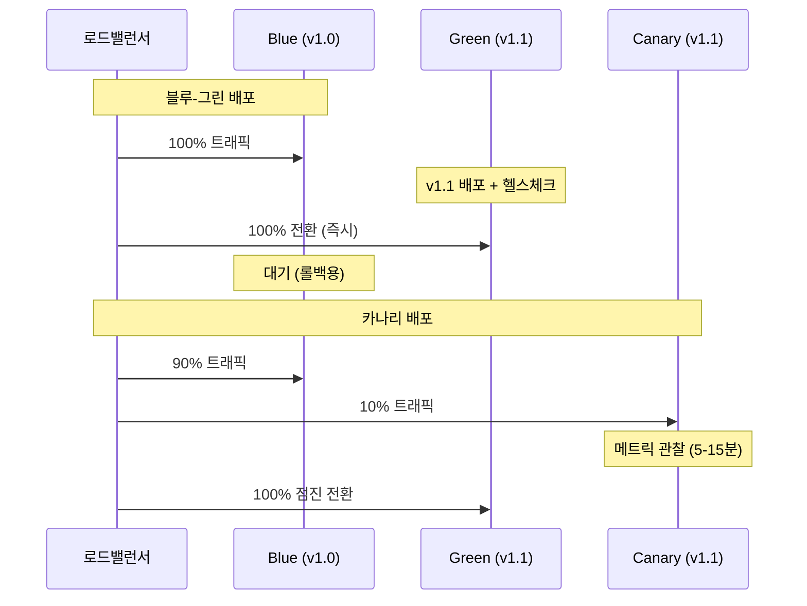
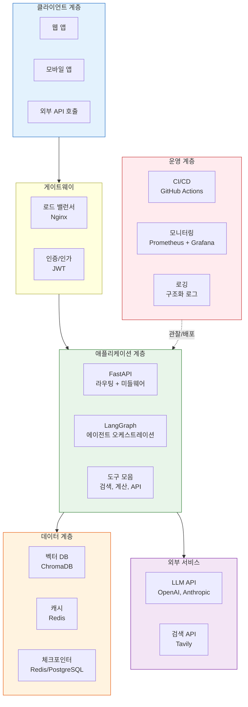

# 프로덕션 배포 실전

> 개발 환경의 AI 에이전트를 실제 사용자에게 서비스하는 프로덕션 환경으로 배포하는 전체 과정을 실습합니다.

## 개요

지금까지 19개 세션에 걸쳐 AI 에이전트의 설계, 구현, 테스트, 모니터링까지 모든 과정을 다뤘습니다. 이제 마지막 퍼즐 조각—**실제 배포**를 완성할 차례입니다. 이 세션은 코스 전체의 마무리 실습으로, 인프라 구성부터 배포 자동화, 클라우드 플랫폼 활용까지 종합적으로 다루는 고급 내용입니다.

**선수 지식**: [확장성과 운영](20-ch20-fastapi-배포와-프로덕션-운영/04-04-확장성과-운영.md)에서 배운 스케일링 전략과 운영 패턴, [인증과 보안](20-ch20-fastapi-배포와-프로덕션-운영/03-03-인증과-보안.md)에서 배운 JWT 인증과 보안 미들웨어

**학습 목표**:
- Docker 멀티스테이지 빌드로 최적화된 프로덕션 이미지 구축
- docker-compose로 에이전트 + 벡터 DB + 모니터링 스택 오케스트레이션
- GitHub Actions CI/CD 파이프라인으로 배포 특화 워크플로우 구현
- LangGraph Platform의 `langgraph.json` 설정과 `langgraph deploy` CLI 실전 활용
- 자체 배포 vs LangGraph Platform 간의 아키텍처 트레이드오프 판단
- 블루-그린 배포와 카나리 전략으로 무중단 배포 구현

## 왜 알아야 할까?

코드가 아무리 완벽해도, 사용자에게 도달하지 못하면 의미가 없습니다. AI 에이전트 배포는 일반 웹 서비스와 다른 독특한 도전을 안고 있는데요—LLM API 의존성, 긴 응답 시간, 스트리밍 처리, 벡터 DB 관리, 그리고 체크포인터 상태 동기화까지. 이 모든 것을 프로덕션 수준으로 묶어내는 것이 이 세션의 목표입니다.

> 📊 **그림 1**: 개발에서 프로덕션까지의 배포 여정



2013년 PyCon Lightning Talk에서 Solomon Hykes가 Docker를 처음 시연했을 때, 5분짜리 데모가 소프트웨어 배포의 역사를 바꿨습니다. "내 컴퓨터에서는 되는데..."라는 개발자들의 영원한 변명을 컨테이너가 해결해준 거죠. AI 에이전트 배포에서도 이 원칙은 동일합니다—환경을 코드로 정의하고, 어디서든 동일하게 실행되도록 만드는 것이 핵심입니다.

## 핵심 개념

### 개념 1: Docker 멀티스테이지 빌드로 프로덕션 이미지 최적화

> 💡 **비유**: 이사할 때 짐을 싸는 과정을 생각해보세요. 작업 공간(빌드 스테이지)에서는 공구, 포장재, 박스가 잔뜩 필요하지만, 실제 새 집(프로덕션)에는 꼭 필요한 물건만 가져가죠. 멀티스테이지 빌드도 마찬가지입니다.

일반적인 Python Docker 이미지는 빌드 도구, 개발 의존성까지 포함해서 1GB를 훌쩍 넘기곤 합니다. 멀티스테이지 빌드를 사용하면 빌드에 필요한 것과 실행에 필요한 것을 분리하여 이미지 크기를 절반 이하로 줄일 수 있습니다.

> 📊 **그림 2**: 멀티스테이지 빌드 구조



AI 에이전트 서비스를 위한 프로덕션 Dockerfile을 작성해보겠습니다:

```dockerfile
# ============================================
# Stage 1: 빌드 스테이지 — 의존성 설치
# ============================================
FROM python:3.12-slim AS builder

# 빌드에 필요한 시스템 패키지
RUN apt-get update && apt-get install -y --no-install-recommends \
    gcc \
    libffi-dev \
    && rm -rf /var/lib/apt/lists/*

# 가상환경 생성 (프로덕션 이미지로 깔끔하게 복사하기 위해)
RUN python -m venv /opt/venv
ENV PATH="/opt/venv/bin:$PATH"

# 의존성만 먼저 설치 (캐시 활용)
COPY requirements.txt .
RUN pip install --no-cache-dir --upgrade pip && \
    pip install --no-cache-dir -r requirements.txt

# ============================================
# Stage 2: 프로덕션 스테이지 — 실행 환경
# ============================================
FROM python:3.12-slim AS runtime

# 보안: 루트가 아닌 전용 사용자
RUN groupadd --gid 1000 agent && \
    useradd --uid 1000 --gid agent --shell /bin/bash --create-home agent

# 빌드 스테이지에서 가상환경만 복사
COPY --from=builder /opt/venv /opt/venv
ENV PATH="/opt/venv/bin:$PATH"

# 애플리케이션 코드 복사
WORKDIR /app
COPY --chown=agent:agent . .

# 비루트 사용자로 전환
USER agent

# 헬스체크 (LLM 호출이 느리므로 타임아웃 넉넉히)
HEALTHCHECK --interval=30s --timeout=10s --start-period=60s --retries=3 \
    CMD python -c "import httpx; httpx.get('http://localhost:8000/health')"

# 프로덕션 서버 실행
EXPOSE 8000
CMD ["uvicorn", "app.main:app", "--host", "0.0.0.0", "--port", "8000", \
     "--workers", "4", "--limit-concurrency", "100", "--timeout-keep-alive", "120"]
```

핵심 포인트를 짚어보면:

- **`requirements.txt`를 먼저 복사**: 코드가 바뀌어도 의존성 레이어는 캐시에서 재사용됩니다
- **비루트 사용자**: 컨테이너가 탈취되더라도 시스템 권한을 제한합니다
- **`--start-period=60s`**: AI 에이전트는 모델 로딩에 시간이 걸리므로 시작 유예 시간을 충분히 줍니다
- **`--workers=4`**: CPU 코어 수에 맞춰 조절합니다. LLM API 호출은 I/O 바운드이므로 워커를 넉넉히 잡아도 됩니다

> ⚠️ **흔한 오해**: "워커 수를 많이 늘리면 처리량이 비례해서 증가한다"고 생각하기 쉬운데요. AI 에이전트의 병목은 대부분 외부 LLM API 호출입니다. 워커를 20개로 늘려도 OpenAI API의 rate limit에 걸리면 소용없죠. 워커 수보다는 **비동기 처리**와 **rate limit 관리**가 더 중요합니다.

### 개념 2: docker-compose로 전체 스택 오케스트레이션

> 💡 **비유**: 오케스트라를 생각해보세요. 바이올린, 첼로, 플루트가 각자 아무리 잘 연주해도, 지휘자 없이는 하모니가 만들어지지 않습니다. docker-compose가 바로 그 지휘자 역할—여러 서비스를 하나의 설정 파일로 조율합니다.

AI 에이전트 서비스는 혼자 동작하지 않습니다. 벡터 데이터베이스, Redis 캐시, 모니터링 시스템 등 여러 컴포넌트가 함께 동작해야 하죠.

> 📊 **그림 3**: AI 에이전트 프로덕션 스택 아키텍처



이 아키텍처를 `docker-compose.yml`로 정의합니다:

```yaml
# docker-compose.yml — AI 에이전트 프로덕션 스택
version: "3.9"

services:
  # ── AI 에이전트 API 서버 ──
  agent-api:
    build:
      context: .
      dockerfile: Dockerfile
      target: runtime           # 멀티스테이지의 runtime 스테이지
    ports:
      - "8000:8000"
    environment:
      - OPENAI_API_KEY=${OPENAI_API_KEY}
      - REDIS_URL=redis://redis:6379/0
      - CHROMA_HOST=chroma
      - CHROMA_PORT=8001
      - LOG_LEVEL=info
      - ENVIRONMENT=production
    depends_on:
      redis:
        condition: service_healthy
      chroma:
        condition: service_healthy
    restart: unless-stopped
    deploy:
      resources:
        limits:
          memory: 2G            # LangGraph 상태 관리에 메모리 필요
          cpus: "2.0"
        reservations:
          memory: 1G
    healthcheck:
      test: ["CMD", "python", "-c",
             "import httpx; httpx.get('http://localhost:8000/health')"]
      interval: 30s
      timeout: 10s
      start_period: 60s
      retries: 3

  # ── ChromaDB 벡터 데이터베이스 ──
  chroma:
    image: chromadb/chroma:0.5.23
    ports:
      - "8001:8000"
    volumes:
      - chroma_data:/chroma/chroma   # 영구 저장
    environment:
      - ANONYMIZED_TELEMETRY=false
    healthcheck:
      test: ["CMD", "curl", "-f", "http://localhost:8000/api/v1/heartbeat"]
      interval: 15s
      timeout: 5s
      retries: 3

  # ── Redis (캐시 + LangGraph 체크포인터) ──
  redis:
    image: redis:7-alpine
    ports:
      - "6379:6379"
    volumes:
      - redis_data:/data
    command: redis-server --appendonly yes --maxmemory 512mb --maxmemory-policy allkeys-lru
    healthcheck:
      test: ["CMD", "redis-cli", "ping"]
      interval: 10s
      timeout: 3s
      retries: 3

  # ── Prometheus 메트릭 수집 ──
  prometheus:
    image: prom/prometheus:v2.53.0
    ports:
      - "9090:9090"
    volumes:
      - ./monitoring/prometheus.yml:/etc/prometheus/prometheus.yml
      - prometheus_data:/prometheus
    depends_on:
      - agent-api

  # ── Grafana 대시보드 ──
  grafana:
    image: grafana/grafana:11.1.0
    ports:
      - "3000:3000"
    volumes:
      - grafana_data:/var/lib/grafana
      - ./monitoring/dashboards:/etc/grafana/provisioning/dashboards
    environment:
      - GF_SECURITY_ADMIN_PASSWORD=${GRAFANA_PASSWORD:-admin}
    depends_on:
      - prometheus

volumes:
  chroma_data:     # 벡터 데이터 영구 보존
  redis_data:      # 세션/캐시 데이터
  prometheus_data: # 메트릭 히스토리
  grafana_data:    # 대시보드 설정
```

몇 가지 프로덕션 포인트를 살펴보면:

- **`depends_on` + `condition: service_healthy`**: 단순 시작 순서가 아니라, 실제로 서비스가 준비됐을 때만 다음 서비스를 시작합니다
- **리소스 제한**: AI 에이전트가 메모리를 무한히 먹는 것을 방지합니다
- **볼륨 마운트**: 컨테이너가 재시작되어도 데이터가 유지됩니다
- **Redis `maxmemory-policy`**: 메모리가 가득 차면 가장 오래된 키부터 제거합니다

```run:python
# 스택 실행 명령어
commands = """
# 1. 환경변수 설정
export OPENAI_API_KEY="sk-your-key"
export GRAFANA_PASSWORD="secure-password"

# 2. 전체 스택 빌드 & 실행
docker-compose up -d --build

# 3. 상태 확인
docker-compose ps

# 4. 로그 모니터링 (에이전트 API만)
docker-compose logs -f agent-api

# 5. 스택 중지 (데이터 보존)
docker-compose down

# 6. 완전 초기화 (데이터 포함 삭제)
docker-compose down -v
"""

for line in commands.strip().split('\n'):
    if line.strip():
        print(line)
```

```output
# 1. 환경변수 설정
export OPENAI_API_KEY="sk-your-key"
export GRAFANA_PASSWORD="secure-password"
# 2. 전체 스택 빌드 & 실행
docker-compose up -d --build
# 3. 상태 확인
docker-compose ps
# 4. 로그 모니터링 (에이전트 API만)
docker-compose logs -f agent-api
# 5. 스택 중지 (데이터 보존)
docker-compose down
# 6. 완전 초기화 (데이터 포함 삭제)
docker-compose down -v
```

### 개념 3: 배포 특화 CI/CD 파이프라인

> 💡 **비유**: 자동차 공장의 조립 라인을 떠올려보세요. 원자재(코드)가 들어오면 품질 검사(테스트) → 조립(빌드) → 출하 검사(통합 테스트) → 배송(배포)까지 자동으로 진행됩니다. 사람은 라인을 설계하고, 이상이 생겼을 때만 개입하죠.

CI/CD 파이프라인의 기본 구조와 테스트 자동화에 대해서는 이미 Ch17의 평가 파이프라인에서 다뤘습니다. 여기서는 **배포에 특화된** 워크플로우에 집중합니다—이미지 빌드 최적화, 블루-그린 배포, 카나리 릴리스, 그리고 롤백 전략이 핵심입니다.

> 📊 **그림 4**: 배포 파이프라인 아키텍처 (평가 게이트 참조 구조)



핵심 차이를 짚어보면—Ch17의 평가 파이프라인은 "이 코드가 품질 기준을 통과하는가?"에 초점을 맞추지만, 여기서 다루는 배포 파이프라인은 "이 이미지를 어떻게 안전하게 프로덕션에 올리는가?"에 집중합니다. 평가 스테이지는 재사용 가능한 워크플로우(reusable workflow)로 분리하여, 배포 파이프라인에서 호출하는 형태가 가장 깔끔합니다.

```yaml
# .github/workflows/deploy.yml — 배포 특화 파이프라인
name: AI Agent Deploy Pipeline

on:
  push:
    branches: [main]
  workflow_dispatch:
    inputs:
      deploy_target:
        description: "배포 대상"
        type: choice
        options: [staging, production]
        default: staging

env:
  REGISTRY: ghcr.io
  IMAGE_NAME: ${{ github.repository }}/agent-api

jobs:
  # ── Job 1: 평가 게이트 (Ch17 파이프라인 재사용) ──
  quality-gate:
    uses: ./.github/workflows/evaluation.yml   # Ch17에서 작성한 평가 워크플로우
    secrets: inherit

  # ── Job 2: 이미지 빌드 & 푸시 (배포 고유) ──
  build-and-push:
    needs: quality-gate
    runs-on: ubuntu-latest
    permissions:
      contents: read
      packages: write
    outputs:
      image_tag: ${{ steps.meta.outputs.tags }}
      image_digest: ${{ steps.build.outputs.digest }}
    steps:
      - uses: actions/checkout@v4

      - name: Docker Buildx 설정 (멀티플랫폼 빌드 지원)
        uses: docker/setup-buildx-action@v3

      - name: 레지스트리 로그인
        uses: docker/login-action@v3
        with:
          registry: ${{ env.REGISTRY }}
          username: ${{ github.actor }}
          password: ${{ secrets.GITHUB_TOKEN }}

      - name: 이미지 메타데이터 생성
        id: meta
        uses: docker/metadata-action@v5
        with:
          images: ${{ env.REGISTRY }}/${{ env.IMAGE_NAME }}
          tags: |
            type=sha,prefix=
            type=raw,value=latest,enable=${{ github.ref == 'refs/heads/main' }}
            type=raw,value={{date 'YYYYMMDD-HHmmss'}}

      - name: 이미지 빌드 & 푸시
        id: build
        uses: docker/build-push-action@v6
        with:
          context: .
          push: true
          tags: ${{ steps.meta.outputs.tags }}
          labels: ${{ steps.meta.outputs.labels }}
          cache-from: type=gha
          cache-to: type=gha,mode=max
          platforms: linux/amd64,linux/arm64  # 멀티 아키텍처

  # ── Job 3: 스테이징 블루-그린 배포 ──
  deploy-staging:
    needs: build-and-push
    runs-on: ubuntu-latest
    environment: staging
    steps:
      - uses: actions/checkout@v4

      - name: 블루-그린 배포
        uses: appleboy/ssh-action@v1
        with:
          host: ${{ secrets.STAGING_HOST }}
          username: ${{ secrets.STAGING_USER }}
          key: ${{ secrets.STAGING_SSH_KEY }}
          script: |
            cd /opt/agent-api
            
            # 현재 활성 환경 확인 (blue 또는 green)
            CURRENT=$(cat .active-env 2>/dev/null || echo "blue")
            if [ "$CURRENT" = "blue" ]; then NEXT="green"; else NEXT="blue"; fi
            
            # 새 환경에 이미지 배포
            IMAGE="${{ env.REGISTRY }}/${{ env.IMAGE_NAME }}:${{ github.sha }}"
            docker pull $IMAGE
            DEPLOY_ENV=$NEXT IMAGE_TAG=${{ github.sha }} \
              docker-compose -f docker-compose.$NEXT.yml up -d --no-build
            
            # 새 환경 헬스체크
            for i in $(seq 1 20); do
              if curl -sf http://localhost:${NEXT_PORT}/health > /dev/null; then
                echo "[$NEXT] 헬스체크 통과"
                break
              fi
              [ $i -eq 20 ] && echo "헬스체크 실패" && exit 1
              sleep 5
            done
            
            # Nginx 업스트림을 새 환경으로 전환
            sudo ln -sf /etc/nginx/upstreams/$NEXT.conf /etc/nginx/upstreams/active.conf
            sudo nginx -s reload
            
            # 활성 환경 기록
            echo "$NEXT" > .active-env
            echo "블루-그린 전환 완료: $CURRENT -> $NEXT"

      - name: 스모크 테스트
        run: |
          pip install httpx
          python tests/smoke_test.py ${{ secrets.STAGING_URL }}

      - name: 실패 시 자동 롤백
        if: failure()
        uses: appleboy/ssh-action@v1
        with:
          host: ${{ secrets.STAGING_HOST }}
          username: ${{ secrets.STAGING_USER }}
          key: ${{ secrets.STAGING_SSH_KEY }}
          script: |
            cd /opt/agent-api
            CURRENT=$(cat .active-env)
            if [ "$CURRENT" = "blue" ]; then PREV="green"; else PREV="blue"; fi
            sudo ln -sf /etc/nginx/upstreams/$PREV.conf /etc/nginx/upstreams/active.conf
            sudo nginx -s reload
            echo "$PREV" > .active-env
            echo "롤백 완료: $CURRENT -> $PREV"

  # ── Job 4: 프로덕션 카나리 배포 ──
  deploy-production:
    needs: deploy-staging
    runs-on: ubuntu-latest
    environment: production      # 수동 승인 필요
    steps:
      - uses: actions/checkout@v4

      - name: 카나리 배포 (10% 트래픽)
        uses: appleboy/ssh-action@v1
        with:
          host: ${{ secrets.PROD_HOST }}
          username: ${{ secrets.PROD_USER }}
          key: ${{ secrets.PROD_SSH_KEY }}
          script: |
            cd /opt/agent-api
            IMAGE="${{ env.REGISTRY }}/${{ env.IMAGE_NAME }}:${{ github.sha }}"
            docker pull $IMAGE
            
            # 카나리 인스턴스 1개 배포
            CANARY_TAG=${{ github.sha }} docker-compose \
              -f docker-compose.canary.yml up -d --no-build
            
            # 카나리 헬스체크 + 메트릭 관찰 (5분)
            echo "카나리 메트릭 관찰 중 (5분)..."
            sleep 300
            
            # 에러율 확인 (Prometheus 쿼리)
            ERROR_RATE=$(curl -s "http://localhost:9090/api/v1/query?query=\
              rate(http_requests_total{instance='canary',status=~'5..'}[5m])/\
              rate(http_requests_total{instance='canary'}[5m])*100" \
              | python3 -c "import sys,json; print(json.load(sys.stdin)['data']['result'][0]['value'][1])")
            
            if (( $(echo "$ERROR_RATE > 5" | bc -l) )); then
              echo "카나리 에러율 ${ERROR_RATE}% — 롤백!"
              docker-compose -f docker-compose.canary.yml down
              exit 1
            fi
            
            echo "카나리 에러율 ${ERROR_RATE}% — 전체 배포 진행"

      - name: 전체 롤아웃
        uses: appleboy/ssh-action@v1
        with:
          host: ${{ secrets.PROD_HOST }}
          username: ${{ secrets.PROD_USER }}
          key: ${{ secrets.PROD_SSH_KEY }}
          script: |
            cd /opt/agent-api
            IMAGE_TAG=${{ github.sha }} docker-compose up -d --no-build
            docker-compose -f docker-compose.canary.yml down  # 카나리 제거
            sleep 30
            curl -f http://localhost:8000/health || exit 1
            echo "프로덕션 전체 배포 완료: ${{ github.sha }}"
```

> 🔥 **실무 팁**: `environment: production`을 설정하면 GitHub에서 배포 전 수동 승인을 요구합니다. AI 에이전트 배포는 LLM 프롬프트 변경이 예상치 못한 응답을 만들 수 있으므로, 프로덕션 배포는 반드시 사람이 확인 후 진행하는 것이 안전합니다. 카나리 배포로 10% 트래픽만 먼저 보내면 전체 장애 위험을 크게 줄일 수 있습니다.

### 개념 4: LangGraph Platform 배포 실전

LangGraph를 사용하고 있다면, LangChain이 제공하는 **LangGraph Platform**이라는 선택지도 있습니다. 자체 배포와 어떻게 다른지 비교하고, 실제 배포 과정을 살펴보겠습니다.

> 📊 **그림 5**: LangGraph Platform 배포 아키텍처



#### langgraph.json — 프로젝트 설정의 핵심

`langgraph.json`은 LangGraph Platform에 배포할 프로젝트의 설정 파일입니다. Docker의 `Dockerfile`과 비슷한 역할을 하죠—어떤 코드를 어떻게 빌드하고, 어떤 그래프를 노출할지 정의합니다.

```json
{
  "dependencies": ["."],
  "graphs": {
    "agent": "./app/agent.py:graph",
    "rag_agent": "./app/rag_agent.py:graph",
    "multi_agent": "./app/multi_agent.py:graph"
  },
  "env": ".env",
  "python_version": "3.12",
  "pip_config_file": "pip.conf",
  "dockerfile_lines": [
    "RUN apt-get update && apt-get install -y libmagic1"
  ]
}
```

각 필드의 의미를 살펴보면:

- **`dependencies`**: Python 패키지 경로. `["."]`이면 현재 디렉토리의 `pyproject.toml` 또는 `setup.py`를 사용합니다
- **`graphs`**: 노출할 LangGraph 그래프 목록. `"모듈경로:변수명"` 형식으로, 여러 에이전트를 하나의 배포에 묶을 수 있습니다
- **`env`**: 환경변수 파일 경로. 배포 시 시크릿은 Platform 대시보드에서 별도 관리합니다
- **`python_version`**: 런타임 Python 버전
- **`dockerfile_lines`**: 추가 시스템 의존성이 필요할 때 Dockerfile 명령어를 주입합니다

#### langgraph CLI로 배포하기

LangGraph CLI는 `pip install langgraph-cli`로 설치하며, 로컬 테스트부터 클라우드 배포까지 모든 단계를 지원합니다.

```bash
# 1. CLI 설치
pip install langgraph-cli

# 2. 로컬에서 LangGraph 서버 실행 (개발/테스트용)
langgraph dev                         # 핫리로드 모드
langgraph up                          # Docker 기반 로컬 실행

# 3. 프로덕션 Docker 이미지 빌드
langgraph build -t my-agent:v1.0      # langgraph.json 기반으로 이미지 생성

# 4. 빌드된 이미지 로컬 테스트
docker run -p 8123:8000 \
  -e OPENAI_API_KEY=$OPENAI_API_KEY \
  -e LANGSMITH_API_KEY=$LANGSMITH_API_KEY \
  my-agent:v1.0

# 5. LangGraph Cloud에 배포 (GitHub 연동)
# LangSmith 대시보드 → Deployments → New Deployment
# GitHub 리포지토리 연결 → langgraph.json 자동 감지 → 배포
```

> 💡 **알고 계셨나요?**: `langgraph build`는 내부적으로 Docker 멀티스테이지 빌드를 수행합니다. `langgraph.json`의 `dockerfile_lines`는 빌드 스테이지에 주입되므로, 시스템 라이브러리가 필요한 Python 패키지(예: `python-magic`, `psycopg2`)도 문제없이 설치됩니다.

#### Platform API 엔드포인트 활용

LangGraph Platform에 배포하면 REST API가 자동으로 생성됩니다. 이 API를 통해 에이전트를 호출하고, 스레드를 관리하고, 실행 상태를 모니터링할 수 있습니다.

```python
# LangGraph Platform API 클라이언트 활용
from langgraph_sdk import get_client

# Platform API 클라이언트 초기화
client = get_client(
    url="https://your-deployment.langgraph.app",  # Cloud URL
    # url="http://localhost:8123",                 # 로컬 테스트
    api_key="lsv2_your_api_key",
)

# --- Assistants API: 배포된 그래프 목록 조회 ---
assistants = await client.assistants.search()
# [{"assistant_id": "agent", "graph_id": "agent", ...},
#  {"assistant_id": "rag_agent", ...}]

# --- Threads API: 대화 스레드 관리 ---
thread = await client.threads.create()
print(f"Thread ID: {thread['thread_id']}")

# --- Runs API: 에이전트 실행 ---
# 동기 실행
run = await client.runs.create(
    thread_id=thread["thread_id"],
    assistant_id="agent",
    input={"messages": [{"role": "user", "content": "서울 날씨 알려줘"}]},
)

# 스트리밍 실행
async for event in client.runs.stream(
    thread_id=thread["thread_id"],
    assistant_id="agent",
    input={"messages": [{"role": "user", "content": "오늘 뉴스 요약해줘"}]},
    stream_mode="events",
):
    if event.event == "events":
        print(event.data)

# --- Crons API: 스케줄 실행 ---
cron = await client.crons.create(
    assistant_id="agent",
    schedule="0 9 * * *",  # 매일 오전 9시
    input={"messages": [{"role": "user", "content": "일일 리포트 생성"}]},
)

# --- 상태 조회 및 히스토리 ---
state = await client.threads.get_state(thread_id=thread["thread_id"])
history = await client.threads.get_history(thread_id=thread["thread_id"])
```

#### 배포 방식 의사결정

```run:python
# 배포 방식별 상세 비교
comparison = {
    "항목": ["인프라 관리", "스트리밍", "체크포인터", "스케일링",
             "비용 모델", "데이터 주권", "커스텀 미들웨어", "배포 속도"],
    "LangGraph Cloud": [
        "완전 관리형", "SSE 내장", "자동 (PostgreSQL)", "자동 오토스케일링",
        "사용량 기반 (API 호출수)", "LangChain 인프라", "제한적", "git push → 자동"
    ],
    "Self-Hosted (Docker)": [
        "직접 관리", "직접 구현", "직접 설정 (Redis/PG)", "수동 (docker-compose scale)",
        "인프라 비용 고정", "완전 통제", "자유", "CI/CD 파이프라인"
    ],
    "BYOC": [
        "LG 런타임 + 자체 VPC", "SSE 내장", "자동", "관리형 스케일링",
        "인프라 + 라이선스", "자체 VPC 내", "부분적", "CLI 배포"
    ],
}

print("=" * 72)
print("  LangGraph 배포 옵션 상세 비교")
print("=" * 72)
for i, item in enumerate(comparison["항목"]):
    print(f"\n{'─' * 72}")
    print(f"  {item}")
    print(f"  Cloud:       {comparison['LangGraph Cloud'][i]}")
    print(f"  Self-Hosted: {comparison['Self-Hosted (Docker)'][i]}")
    print(f"  BYOC:        {comparison['BYOC'][i]}")
print(f"\n{'=' * 72}")
```

```output
========================================================================
  LangGraph 배포 옵션 상세 비교
========================================================================

────────────────────────────────────────────────────────────────────────
  인프라 관리
  Cloud:       완전 관리형
  Self-Hosted: 직접 관리
  BYOC:        LG 런타임 + 자체 VPC

────────────────────────────────────────────────────────────────────────
  스트리밍
  Cloud:       SSE 내장
  Self-Hosted: 직접 구현
  BYOC:        SSE 내장

────────────────────────────────────────────────────────────────────────
  체크포인터
  Cloud:       자동 (PostgreSQL)
  Self-Hosted: 직접 설정 (Redis/PG)
  BYOC:        자동

────────────────────────────────────────────────────────────────────────
  스케일링
  Cloud:       자동 오토스케일링
  Self-Hosted: 수동 (docker-compose scale)
  BYOC:        관리형 스케일링

────────────────────────────────────────────────────────────────────────
  비용 모델
  Cloud:       사용량 기반 (API 호출수)
  Self-Hosted: 인프라 비용 고정
  BYOC:        인프라 + 라이선스

────────────────────────────────────────────────────────────────────────
  데이터 주권
  Cloud:       LangChain 인프라
  Self-Hosted: 완전 통제
  BYOC:        자체 VPC 내

────────────────────────────────────────────────────────────────────────
  커스텀 미들웨어
  Cloud:       제한적
  Self-Hosted: 자유
  BYOC:        부분적

────────────────────────────────────────────────────────────────────────
  배포 속도
  Cloud:       git push → 자동
  Self-Hosted: CI/CD 파이프라인
  BYOC:        CLI 배포

========================================================================
```

### 개념 5: 무중단 배포 전략 심화

프로덕션에서 가장 무서운 순간은 배포 직후입니다. AI 에이전트는 특히 프롬프트 변경이나 모델 업데이트가 예상치 못한 동작을 일으킬 수 있어서, 무중단 배포 전략이 필수입니다.

> 📊 **그림 6**: 블루-그린 vs 카나리 배포 흐름



블루-그린 배포를 위한 Nginx 설정도 살펴보겠습니다:

```nginx
# /etc/nginx/upstreams/blue.conf
upstream agent_backend {
    server 127.0.0.1:8000;  # Blue 인스턴스
}

# /etc/nginx/upstreams/green.conf
upstream agent_backend {
    server 127.0.0.1:8001;  # Green 인스턴스
}

# /etc/nginx/conf.d/agent.conf
server {
    listen 443 ssl http2;
    server_name api.example.com;
    
    # 활성 업스트림 (심볼릭 링크로 전환)
    include /etc/nginx/upstreams/active.conf;
    
    location / {
        proxy_pass http://agent_backend;
        proxy_http_version 1.1;
        proxy_set_header Upgrade $http_upgrade;
        proxy_set_header Connection "upgrade";
        
        # AI 에이전트 특화: 긴 타임아웃 (스트리밍 응답)
        proxy_read_timeout 300s;
        proxy_send_timeout 300s;
        
        # SSE 스트리밍 지원
        proxy_buffering off;
        proxy_cache off;
    }
}
```

### 개념 6: 종합 아키텍처 리뷰 — 코스 전체 되돌아보기

이제 이 코스에서 다룬 모든 조각을 하나의 그림으로 조합해보겠습니다. [에이전트 설계](01-ai-에이전트-소개와-개발-환경-구축/01-ai-에이전트란-무엇인가.md)에서 시작해서 프로덕션 배포까지, 전체 여정을 조망합니다.

> 📊 **그림 7**: AI 에이전트 서비스 종합 아키텍처



자체 배포를 선택했을 때의 FastAPI 프로덕션 설정을 살펴보겠습니다:

```python
# app/main.py — 프로덕션 FastAPI 앱
import os
import time
from contextlib import asynccontextmanager

from fastapi import FastAPI, Request
from fastapi.middleware.cors import CORSMiddleware
from fastapi.middleware.trustedhost import TrustedHostMiddleware

from app.routes import agent_router, health_router
from app.config import settings
from app.metrics import REQUEST_COUNT, REQUEST_LATENCY


@asynccontextmanager
async def lifespan(app: FastAPI):
    """앱 생명주기: 시작 시 리소스 초기화, 종료 시 정리"""
    # 시작: 벡터 DB 연결, 모델 워밍업
    print(f"Starting agent-api (env={settings.environment})")
    yield
    # 종료: 연결 정리
    print("Shutting down agent-api")


app = FastAPI(
    title="AI Agent API",
    version="1.0.0",
    lifespan=lifespan,
    # 프로덕션에서는 Swagger UI 비활성화
    docs_url="/docs" if settings.environment == "development" else None,
    redoc_url=None,
)

# ── 미들웨어 (순서 중요: 아래에서 위로 실행) ──
app.add_middleware(
    CORSMiddleware,
    allow_origins=settings.allowed_origins,
    allow_methods=["GET", "POST"],
    allow_headers=["*"],
)

app.add_middleware(
    TrustedHostMiddleware,
    allowed_hosts=settings.allowed_hosts,
)


@app.middleware("http")
async def metrics_middleware(request: Request, call_next):
    """요청 메트릭 수집 미들웨어"""
    start = time.perf_counter()
    response = await call_next(request)
    duration = time.perf_counter() - start

    # Prometheus 메트릭 기록
    REQUEST_COUNT.labels(
        method=request.method,
        endpoint=request.url.path,
        status=response.status_code,
    ).inc()
    REQUEST_LATENCY.labels(
        endpoint=request.url.path,
    ).observe(duration)

    return response


# ── 라우터 등록 ──
app.include_router(health_router, tags=["health"])
app.include_router(agent_router, prefix="/api/v1", tags=["agent"])
```

## 실습: 스모크 테스트와 롤백 검증

배포가 완료되면 반드시 스모크 테스트(smoke test)로 핵심 기능이 동작하는지 확인합니다. "연기가 나는지 확인한다"는 하드웨어 테스트 용어에서 유래한 이름이죠. 여기서는 단순 헬스체크를 넘어서 에이전트 응답 품질까지 검증하는 확장된 스모크 테스트를 작성합니다.

```python
# tests/smoke_test.py — 프로덕션 스모크 테스트 (확장 버전)
"""
배포 직후 실행하는 검증 테스트.
핵심 엔드포인트 + 에이전트 응답 품질을 확인합니다.
"""
import httpx
import sys
import time

BASE_URL = sys.argv[1] if len(sys.argv) > 1 else "http://localhost:8000"


def test_health():
    """헬스 엔드포인트 + 의존성 상태 확인"""
    r = httpx.get(f"{BASE_URL}/health", timeout=10)
    assert r.status_code == 200
    data = r.json()
    assert data["status"] == "ok"
    # 프로덕션 헬스체크는 의존성 상태도 포함
    if "dependencies" in data:
        for dep, status in data["dependencies"].items():
            assert status == "healthy", f"{dep} is {status}"
    print(f"[PASS] Health check: {data}")


def test_agent_invoke():
    """에이전트 기본 호출 + 응답 품질 확인"""
    r = httpx.post(
        f"{BASE_URL}/api/v1/agent/invoke",
        json={
            "message": "안녕하세요, 테스트입니다.",
            "thread_id": "smoke-test-001",
        },
        timeout=60,  # LLM 호출 포함이므로 넉넉히
    )
    assert r.status_code == 200
    data = r.json()
    assert "response" in data
    assert len(data["response"]) > 10  # 최소 응답 길이
    print(f"[PASS] Agent invoke: {len(data['response'])} chars")


def test_streaming():
    """스트리밍 엔드포인트 + 레이턴시 확인"""
    start = time.perf_counter()
    first_chunk_time = None
    with httpx.stream(
        "POST",
        f"{BASE_URL}/api/v1/agent/stream",
        json={"message": "간단히 답변해주세요.", "thread_id": "smoke-test-002"},
        timeout=60,
    ) as r:
        assert r.status_code == 200
        chunks = []
        for line in r.iter_lines():
            if first_chunk_time is None:
                first_chunk_time = time.perf_counter() - start
            chunks.append(line)
        assert len(chunks) > 0
    ttfb = first_chunk_time or 0
    print(f"[PASS] Streaming: {len(chunks)} chunks, TTFB={ttfb:.2f}s")
    # TTFB(Time To First Byte)가 10초를 넘으면 경고
    if ttfb > 10:
        print(f"[WARN] TTFB {ttfb:.2f}s exceeds 10s threshold")


def test_thread_persistence():
    """스레드 상태 지속성 확인 (체크포인터 동작 검증)"""
    thread_id = "smoke-test-persistence-001"
    # 첫 번째 메시지
    r1 = httpx.post(
        f"{BASE_URL}/api/v1/agent/invoke",
        json={"message": "내 이름은 테스트봇이야.", "thread_id": thread_id},
        timeout=60,
    )
    assert r1.status_code == 200
    # 두 번째 메시지 (이전 컨텍스트 유지 확인)
    r2 = httpx.post(
        f"{BASE_URL}/api/v1/agent/invoke",
        json={"message": "내 이름이 뭐라고 했지?", "thread_id": thread_id},
        timeout=60,
    )
    assert r2.status_code == 200
    print(f"[PASS] Thread persistence: context maintained across turns")


if __name__ == "__main__":
    tests = [test_health, test_agent_invoke, test_streaming, test_thread_persistence]
    passed = 0
    for test in tests:
        try:
            test()
            passed += 1
        except Exception as e:
            print(f"[FAIL] {test.__name__}: {e}")

    print(f"\n결과: {passed}/{len(tests)} 통과")
    sys.exit(0 if passed == len(tests) else 1)
```

```run:python
# 스모크 테스트 실행 예시
print("$ python tests/smoke_test.py https://api.example.com")
print()
print("[PASS] Health check: {'status': 'ok', 'dependencies': {'redis': 'healthy', 'chroma': 'healthy'}}")
print("[PASS] Agent invoke: 142 chars")
print("[PASS] Streaming: 23 chunks, TTFB=1.34s")
print("[PASS] Thread persistence: context maintained across turns")
print()
print("결과: 4/4 통과")
```

```output
$ python tests/smoke_test.py https://api.example.com

[PASS] Health check: {'status': 'ok', 'dependencies': {'redis': 'healthy', 'chroma': 'healthy'}}
[PASS] Agent invoke: 142 chars
[PASS] Streaming: 23 chunks, TTFB=1.34s
[PASS] Thread persistence: context maintained across turns

결과: 4/4 통과
```

## 더 깊이 알아보기

### LangGraph Platform의 여정

LangGraph Platform은 LangChain 팀이 "에이전트 배포가 너무 어렵다"는 커뮤니티 피드백에서 시작한 프로젝트입니다. 2024년 초에 LangGraph 자체가 출시되고, 같은 해 하반기에 Cloud 호스팅 옵션이 추가되었죠. 핵심 아이디어는 간단합니다—스트리밍, 체크포인팅, 멀티턴 대화 같은 에이전트 특화 기능을 인프라 수준에서 제공하는 것.

하지만 모든 관리형 서비스가 그렇듯, 편의성과 통제권은 트레이드오프입니다. 금융이나 의료 같은 규제 산업에서는 데이터가 외부 서비스를 거치는 것 자체가 컴플라이언스 이슈가 될 수 있습니다. 그래서 BYOC(Bring Your Own Cloud) 옵션이 나온 것이죠. 최근에는 `langgraph build` 명령어로 로컬에서 Docker 이미지를 직접 빌드하고, 자체 인프라에 배포하는 Self-Hosted 옵션도 성숙해지면서, "LangGraph 런타임은 쓰되 인프라는 내가 관리한다"는 중간 지점을 선택하는 팀이 늘고 있습니다.

> 💡 **알고 계셨나요?**: Docker라는 이름은 부두 노동자(dock worker)에서 따왔습니다. 컨테이너를 배에 싣고 내리는 노동자처럼, 소프트웨어 컨테이너를 어디든 옮길 수 있게 해준다는 의미죠. 로고의 고래가 컨테이너를 등에 지고 있는 것도 같은 맥락입니다.

### 블루-그린 배포의 기원

블루-그린 배포는 2010년 Jez Humble과 David Farley의 저서 *Continuous Delivery*에서 처음 체계화된 패턴입니다. 두 개의 동일한 프로덕션 환경을 유지하고, 로드밸런서 전환만으로 무중단 배포와 즉시 롤백을 달성한다는 아이디어는 당시로서는 상당히 급진적이었죠. 지금은 AWS, GCP 모두 네이티브로 지원하는 표준 패턴이 되었습니다.

## 흔한 오해와 팁

> ⚠️ **흔한 오해**: "Docker 이미지에 `.env` 파일을 넣으면 편하겠지?" — 절대 하면 안 됩니다. 이미지에 시크릿이 포함되면 레지스트리에 접근 가능한 누구나 API 키를 볼 수 있습니다. 시크릿은 반드시 환경변수나 시크릿 매니저(AWS Secrets Manager, HashiCorp Vault 등)를 통해 주입하세요.

> 💡 **알고 계셨나요?**: GitHub Actions의 `cache-from: type=gha`는 GitHub의 캐시 인프라를 활용하여 Docker 레이어 캐싱을 합니다. 첫 빌드는 5-10분 걸리지만, 이후 빌드는 의존성이 바뀌지 않으면 1-2분으로 단축됩니다.

> 🔥 **실무 팁**: AI 에이전트의 `HEALTHCHECK` 타임아웃은 일반 웹 서비스보다 넉넉하게 잡으세요. 특히 콜드 스타트 시 모델 로딩이나 벡터 DB 인덱스 로딩에 시간이 걸립니다. `--start-period=60s` 이상을 권장합니다.

> 🔥 **실무 팁**: LangGraph Cloud에 배포할 때, `langgraph.json`의 `graphs` 필드에 여러 에이전트를 등록하면 하나의 배포로 여러 에이전트를 서빙할 수 있습니다. 하지만 에이전트 간 리소스 격리가 되지 않으므로, 트래픽이 크게 다른 에이전트들은 별도 배포로 분리하는 것이 안전합니다.

## 핵심 정리

| 개념 | 핵심 포인트 |
|------|------------|
| 멀티스테이지 빌드 | 빌드/런타임 분리로 이미지 크기 50% 이상 절감 |
| docker-compose | `depends_on` + `healthcheck`로 서비스 간 안전한 의존성 관리 |
| 배포 CI/CD | 평가 게이트 재사용 + 블루-그린/카나리 배포 + 자동 롤백 |
| langgraph.json | `graphs`, `dependencies`, `dockerfile_lines`로 배포 설정 선언 |
| langgraph CLI | `langgraph dev` → `langgraph build` → `langgraph deploy` 워크플로우 |
| Platform API | `/assistants`, `/threads`, `/runs`, `/crons` 엔드포인트로 에이전트 관리 |
| 블루-그린 배포 | 두 환경 전환으로 무중단 배포 + 즉시 롤백 |
| 카나리 배포 | 10% 트래픽으로 검증 후 점진적 롤아웃 |
| 시크릿 관리 | 이미지에 절대 포함 금지, 환경변수 또는 시크릿 매니저 사용 |
| 스모크 테스트 | health, invoke, stream, 체크포인터 지속성까지 4종 검증 |

## 다음 섹션 미리보기

축하합니다! 이것으로 **AI Agents 실전** 코스의 20개 챕터를 모두 완주했습니다. 에이전트의 개념부터 설계, 구현, 테스트, 그리고 프로덕션 배포까지—AI 에이전트 개발의 전체 여정을 함께 걸어왔습니다. 이제 여러분만의 AI 에이전트를 세상에 선보일 준비가 되었습니다. 배운 것을 실전에 적용하고, 커뮤니티에 공유하며, 계속 발전시켜 나가세요!

## 참고 자료

- [Docker 멀티스테이지 빌드 공식 가이드](https://docs.docker.com/build/building/multi-stage/) - 공식 문서에서 멀티스테이지 빌드의 모든 패턴을 다룹니다
- [LangGraph Platform 배포 가이드](https://langchain-ai.github.io/langgraph/concepts/langgraph_platform/) - Cloud, Self-hosted, BYOC 옵션 비교
- [LangGraph CLI 문서](https://langchain-ai.github.io/langgraph/cloud/reference/cli/) - `langgraph build`, `langgraph deploy` 등 CLI 명령어 레퍼런스
- [LangGraph SDK Python 클라이언트](https://langchain-ai.github.io/langgraph/cloud/reference/sdk/python_sdk_ref/) - Platform API 클라이언트 전체 레퍼런스
- [FastAPI 배포 가이드](https://fastapi.tiangolo.com/deployment/) - Uvicorn 워커, Docker, HTTPS 설정 등
- [Prometheus + Grafana 모니터링 스택](https://prometheus.io/docs/visualization/grafana/) - 메트릭 수집과 대시보드 구축
- [12 Factor App](https://12factor.net/) - 모던 클라우드 앱의 12가지 원칙, 배포 파이프라인의 바이블
- [*Continuous Delivery* — Jez Humble, David Farley](https://continuousdelivery.com/) - 블루-그린 배포와 배포 파이프라인의 고전