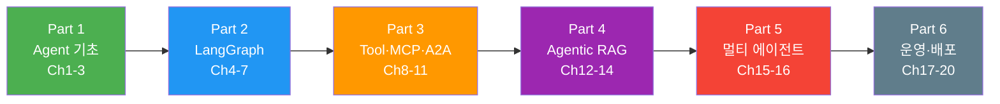

# 2026: AI Agents 실전 완전 정복

> LLM 도구 호출부터 멀티 에이전트·MCP·A2A·프로덕션 배포까지 — **20챕터 97섹션** 튜토리얼

## 학습 로드맵

> **Part 1→2로 에이전트 핵심을 다지고**, Part 3에서 MCP/A2A 프로토콜, Part 4에서 Agentic RAG, Part 5에서 멀티 에이전트, Part 6에서 프로덕션 운영까지 완성합니다.

---

## Part 1: Agent 기초 (Ch1-3, 입문)

**Ch1. LLM 도구 호출의 이해**
- [01. AI 에이전트란 무엇인가](01-ch1-llm-도구-호출의-이해/01-01-ai-에이전트란-무엇인가.md) · [02. LLM Tool Calling 메커니즘](01-ch1-llm-도구-호출의-이해/02-02-llm-tool-calling-메커니즘.md) · [03. OpenAI API 도구 호출 실습](01-ch1-llm-도구-호출의-이해/03-03-openai-api-도구-호출-실습.md) · [04. Anthropic API 도구 호출 실습](01-ch1-llm-도구-호출의-이해/04-04-anthropic-api-도구-호출-실습.md) · [05. 도구 실행 엔진 구축](01-ch1-llm-도구-호출의-이해/05-05-도구-실행-엔진-구축.md)

**Ch2. ReAct 패턴과 에이전트 루프**
- [01. ReAct 패턴 이론](02-ch2-react-패턴과-에이전트-루프/01-01-react-패턴-이론.md) · [02. ReAct 루프 직접 구현](02-ch2-react-패턴과-에이전트-루프/02-02-react-루프-직접-구현.md) · [03. 에이전트 종료 조건과 안전장치](02-ch2-react-패턴과-에이전트-루프/03-03-에이전트-종료-조건과-안전장치.md) · [04. LangGraph의 create_react_agent](02-ch2-react-패턴과-에이전트-루프/04-04-langgraph의-create-react-agent.md) · [05. ReAct 에이전트 실전 프로젝트](02-ch2-react-패턴과-에이전트-루프/05-05-react-에이전트-실전-프로젝트.md)

**Ch3. 대화 메모리와 상태 관리**
- [01. 대화 메모리의 기초](03-ch3-대화-메모리와-상태-관리/01-01-대화-메모리의-기초.md) · [02. 슬라이딩 윈도우와 토큰 관리](03-ch3-대화-메모리와-상태-관리/02-02-슬라이딩-윈도우와-토큰-관리.md) · [03. LangGraph 메시지 상태](03-ch3-대화-메모리와-상태-관리/03-03-langgraph-메시지-상태.md) · [04. 장기 메모리 구현](03-ch3-대화-메모리와-상태-관리/04-04-장기-메모리-구현.md) · [05. 멀티턴 에이전트 실습](03-ch3-대화-메모리와-상태-관리/05-05-멀티턴-에이전트-실습.md)

## Part 2: LangGraph 핵심 (Ch4-7, 초중급)

**Ch4. LangGraph StateGraph 기초**
- [01. LangGraph 아키텍처 개관](04-ch4-langgraph-stategraph-기초/01-01-langgraph-아키텍처-개관.md) · [02. 상태 스키마 정의](04-ch4-langgraph-stategraph-기초/02-02-상태-스키마-정의.md) · [03. 노드와 엣지 구성](04-ch4-langgraph-stategraph-기초/03-03-노드와-엣지-구성.md) · [04. 리듀서와 상태 업데이트 패턴](04-ch4-langgraph-stategraph-기초/04-04-리듀서와-상태-업데이트-패턴.md) · [05. 첫 번째 LangGraph 에이전트](04-ch4-langgraph-stategraph-기초/05-05-첫-번째-langgraph-에이전트.md)

**Ch5. 조건 분기와 동적 라우팅**
- [01. 조건부 엣지의 이해](05-ch5-조건-분기와-동적-라우팅/01-01-조건부-엣지의-이해.md) · [02. 복잡한 라우팅 전략](05-ch5-조건-분기와-동적-라우팅/02-02-복잡한-라우팅-전략.md) · [03. 서브그래프와 그래프 합성](05-ch5-조건-분기와-동적-라우팅/03-03-서브그래프와-그래프-합성.md) · [04. 맵-리듀스 병렬 처리](05-ch5-조건-분기와-동적-라우팅/04-04-맵-리듀스-병렬-처리.md) · [05. 의사결정 에이전트 실습](05-ch5-조건-분기와-동적-라우팅/05-05-의사결정-에이전트-실습.md)

**Ch6. 체크포인트와 영속적 실행**
- [01. 체크포인트 시스템 이해](06-ch6-체크포인트와-영속적-실행/01-01-체크포인트-시스템-이해.md) · [02. 메모리 및 SQLite 체크포인터](06-ch6-체크포인트와-영속적-실행/02-02-메모리-및-sqlite-체크포인터.md) · [03. 멀티 세션과 스레드 관리](06-ch6-체크포인트와-영속적-실행/03-03-멀티-세션과-스레드-관리.md) · [04. 타임 트래블과 상태 복원](06-ch6-체크포인트와-영속적-실행/04-04-타임-트래블과-상태-복원.md) · [05. 장기 실행 워크플로우 구축](06-ch6-체크포인트와-영속적-실행/05-05-장기-실행-워크플로우-구축.md)

**Ch7. Human-in-the-Loop 워크플로우**
- [01. Human-in-the-Loop 패턴 개관](07-ch7-human-in-the-loop-워크플로우/01-01-human-in-the-loop-패턴-개관.md) · [02. 도구 호출 승인 워크플로우](07-ch7-human-in-the-loop-워크플로우/02-02-도구-호출-승인-워크플로우.md) · [03. 상태 수정과 피드백 주입](07-ch7-human-in-the-loop-워크플로우/03-03-상태-수정과-피드백-주입.md) · [04. 동적 중단점과 조건부 승인](07-ch7-human-in-the-loop-워크플로우/04-04-동적-중단점과-조건부-승인.md) · [05. HITL 실전 프로젝트](07-ch7-human-in-the-loop-워크플로우/05-05-hitl-실전-프로젝트.md)

## Part 3: Tool · MCP · A2A (Ch8-11, 중급)

**Ch8. 커스텀 도구 개발**
- [01. @tool 데코레이터 심화](08-ch8-커스텀-도구-개발/01-01-tool-데코레이터-심화.md) · [02. 복합 도구 설계 패턴](08-ch8-커스텀-도구-개발/02-02-복합-도구-설계-패턴.md) · [03. 비동기 도구와 외부 API 연동](08-ch8-커스텀-도구-개발/03-03-비동기-도구와-외부-api-연동.md) · [04. 도구 에러 핸들링](08-ch8-커스텀-도구-개발/04-04-도구-에러-핸들링.md) · [05. 도구 테스트와 모킹](08-ch8-커스텀-도구-개발/05-05-도구-테스트와-모킹.md)

**Ch9. MCP 서버 구축**
- [01. MCP 프로토콜 이해](09-ch9-mcp-서버-구축/01-01-mcp-프로토콜-이해.md) · [02. FastMCP 서버 기초](09-ch9-mcp-서버-구축/02-02-fastmcp-서버-기초.md) · [03. 리소스와 프롬프트 설계](09-ch9-mcp-서버-구축/03-03-리소스와-프롬프트-설계.md) · [04. 트랜스포트 설정](09-ch9-mcp-서버-구축/04-04-트랜스포트-설정.md) · [05. MCP 서버 실전 프로젝트](09-ch9-mcp-서버-구축/05-05-mcp-서버-실전-프로젝트.md)

**Ch10. MCP 클라이언트와 에이전트 통합**
- [01. MCP 클라이언트 구축](10-ch10-mcp-클라이언트와-에이전트-통합/01-01-mcp-클라이언트-구축.md) · [02. MCP 도구와 LLM 연동](10-ch10-mcp-클라이언트와-에이전트-통합/02-02-mcp-도구와-llm-연동.md) · [03. LangGraph + MCP 통합](10-ch10-mcp-클라이언트와-에이전트-통합/03-03-langgraph-mcp-통합.md) · [04. 다중 MCP 서버 관리](10-ch10-mcp-클라이언트와-에이전트-통합/04-04-다중-mcp-서버-관리.md) · [05. MCP 에이전트 실전 프로젝트](10-ch10-mcp-클라이언트와-에이전트-통합/05-05-mcp-에이전트-실전-프로젝트.md)

**Ch11. A2A 프로토콜 기초**
- [01. A2A 프로토콜 개관](11-ch11-a2a-프로토콜-기초/01-01-a2a-프로토콜-개관.md) · [02. Agent Card와 능력 선언](11-ch11-a2a-프로토콜-기초/02-02-agent-card와-능력-선언.md) · [03. 태스크 기반 통신 구현](11-ch11-a2a-프로토콜-기초/03-03-태스크-기반-통신-구현.md) · [04. MCP + A2A 통합 아키텍처](11-ch11-a2a-프로토콜-기초/04-04-mcp-a2a-통합-아키텍처.md)

## Part 4: Agentic RAG (Ch12-14, 중상급)

**Ch12. Agentic RAG — 에이전트가 검색을 도구로 활용**
- [01. RAG에서 Agentic RAG로](12-ch12-agentic-rag-에이전트가-검색을-도구로-활용/01-01-rag에서-agentic-rag로.md) · [02. 검색 도구 구축](12-ch12-agentic-rag-에이전트가-검색을-도구로-활용/02-02-검색-도구-구축.md) · [03. 검색 결과 평가와 필터링](12-ch12-agentic-rag-에이전트가-검색을-도구로-활용/03-03-검색-결과-평가와-필터링.md) · [04. 자기교정 RAG 구현](12-ch12-agentic-rag-에이전트가-검색을-도구로-활용/04-04-자기교정-rag-구현.md) · [05. Agentic RAG 실전 프로젝트](12-ch12-agentic-rag-에이전트가-검색을-도구로-활용/05-05-agentic-rag-실전-프로젝트.md)

**Ch13. Adaptive RAG와 동적 라우팅**
- [01. Adaptive RAG 아키텍처](13-ch13-adaptive-rag와-동적-라우팅/01-01-adaptive-rag-아키텍처.md) · [02. 쿼리 분석과 라우터 구현](13-ch13-adaptive-rag와-동적-라우팅/02-02-쿼리-분석과-라우터-구현.md) · [03. 하이브리드 검색 전략](13-ch13-adaptive-rag와-동적-라우팅/03-03-하이브리드-검색-전략.md) · [04. 반복적 검색과 자기교정 통합](13-ch13-adaptive-rag와-동적-라우팅/04-04-반복적-검색과-자기교정-통합.md) · [05. Adaptive RAG 실전 프로젝트](13-ch13-adaptive-rag와-동적-라우팅/05-05-adaptive-rag-실전-프로젝트.md)

**Ch14. GraphRAG와 Knowledge Graph**
- [01. GraphRAG 이론과 아키텍처](14-ch14-graphrag와-knowledge-graph/01-01-graphrag-이론과-아키텍처.md) · [02. 지식 그래프 구축 파이프라인](14-ch14-graphrag와-knowledge-graph/02-02-지식-그래프-구축-파이프라인.md) · [03. Neo4j 기반 Knowledge Graph RAG](14-ch14-graphrag와-knowledge-graph/03-03-neo4j-기반-knowledge-graph-rag.md) · [04. 하이브리드 RAG 설계](14-ch14-graphrag와-knowledge-graph/04-04-하이브리드-rag-설계.md) · [05. GraphRAG 실전 프로젝트](14-ch14-graphrag와-knowledge-graph/05-05-graphrag-실전-프로젝트.md)

## Part 5: 멀티 에이전트 (Ch15-16, 상급)

**Ch15. Supervisor/Worker 멀티 에이전트**
- [01. 멀티 에이전트 아키텍처 패턴](15-ch15-supervisorworker-멀티-에이전트/01-01-멀티-에이전트-아키텍처-패턴.md) · [02. langgraph-supervisor 활용](15-ch15-supervisorworker-멀티-에이전트/02-02-langgraph-supervisor-활용.md) · [03. 에이전트 핸드오프와 상태 공유](15-ch15-supervisorworker-멀티-에이전트/03-03-에이전트-핸드오프와-상태-공유.md) · [04. 계층적 멀티 에이전트](15-ch15-supervisorworker-멀티-에이전트/04-04-계층적-멀티-에이전트.md) · [05. 멀티 에이전트 실전 프로젝트](15-ch15-supervisorworker-멀티-에이전트/05-05-멀티-에이전트-실전-프로젝트.md)

**Ch16. CrewAI와 LangGraph 비교**
- [01. CrewAI 기초](16-ch16-crewai와-langgraph-비교/01-01-crewai-기초.md) · [02. CrewAI Flows와 프로덕션 워크플로우](16-ch16-crewai와-langgraph-비교/02-02-crewai-flows와-프로덕션-워크플로우.md) · [03. CrewAI vs LangGraph 심층 비교](16-ch16-crewai와-langgraph-비교/03-03-crewai-vs-langgraph-심층-비교.md) · [04. 프레임워크 선택 가이드](16-ch16-crewai와-langgraph-비교/04-04-프레임워크-선택-가이드.md)

## Part 6: 운영과 배포 (Ch17-20, 실무)

**Ch17. 에이전트 평가와 LangSmith**
- [01. 에이전트 평가 전략](17-ch17-에이전트-평가와-langsmith/01-01-에이전트-평가-전략.md) · [02. LangSmith 데이터셋과 오프라인 평가](17-ch17-에이전트-평가와-langsmith/02-02-langsmith-데이터셋과-오프라인-평가.md) · [03. LLM-as-Judge 평가](17-ch17-에이전트-평가와-langsmith/03-03-llm-as-judge-평가.md) · [04. 멀티턴 궤적 평가](17-ch17-에이전트-평가와-langsmith/04-04-멀티턴-궤적-평가.md) · [05. CI/CD 통합 평가](17-ch17-에이전트-평가와-langsmith/05-05-cicd-통합-평가.md)

**Ch18. 관찰가능성과 디버깅**
- [01. LangSmith 트레이싱 설정](18-ch18-관찰가능성과-디버깅/01-01-langsmith-트레이싱-설정.md) · [02. 트레이스 분석과 디버깅](18-ch18-관찰가능성과-디버깅/02-02-트레이스-분석과-디버깅.md) · [03. 비용과 성능 모니터링](18-ch18-관찰가능성과-디버깅/03-03-비용과-성능-모니터링.md) · [04. 프로덕션 모니터링 전략](18-ch18-관찰가능성과-디버깅/04-04-프로덕션-모니터링-전략.md)

**Ch19. 가드레일과 Structured Output**
- [01. 에이전트 가드레일 설계](19-ch19-가드레일과-structured-output/01-01-에이전트-가드레일-설계.md) · [02. 입력 검증과 프롬프트 인젝션 방어](19-ch19-가드레일과-structured-output/02-02-입력-검증과-프롬프트-인젝션-방어.md) · [03. Structured Output 기초](19-ch19-가드레일과-structured-output/03-03-structured-output-기초.md) · [04. LangGraph에서의 Structured Output](19-ch19-가드레일과-structured-output/04-04-langgraph에서의-structured-output.md) · [05. 가드레일 통합 실습](19-ch19-가드레일과-structured-output/05-05-가드레일-통합-실습.md)

**Ch20. FastAPI 배포와 프로덕션 운영**
- [01. FastAPI + LangGraph 통합](20-ch20-fastapi-배포와-프로덕션-운영/01-01-fastapi-langgraph-통합.md) · [02. 스트리밍 응답 구현](20-ch20-fastapi-배포와-프로덕션-운영/02-02-스트리밍-응답-구현.md) · [03. 인증과 보안](20-ch20-fastapi-배포와-프로덕션-운영/03-03-인증과-보안.md) · [04. 확장성과 운영](20-ch20-fastapi-배포와-프로덕션-운영/04-04-확장성과-운영.md) · [05. 프로덕션 배포 실전](20-ch20-fastapi-배포와-프로덕션-운영/05-05-프로덕션-배포-실전.md)

---

**기술 스택**: Python 3.12+ · LangGraph · LangChain · LangSmith · MCP (FastMCP) · A2A · CrewAI · FastAPI · OpenAI API · Anthropic API · Neo4j

## 라이선스

GNU General Public License v3.0
